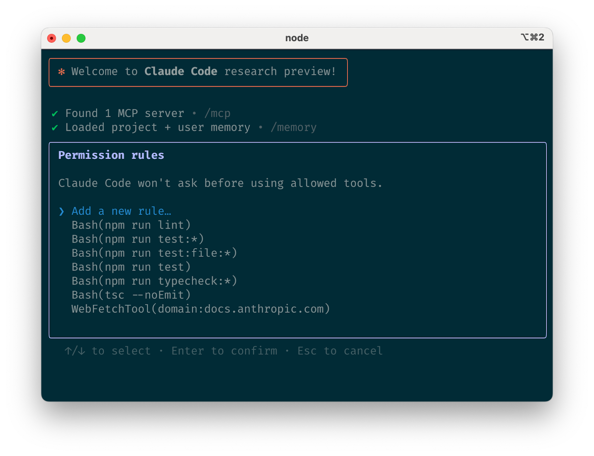
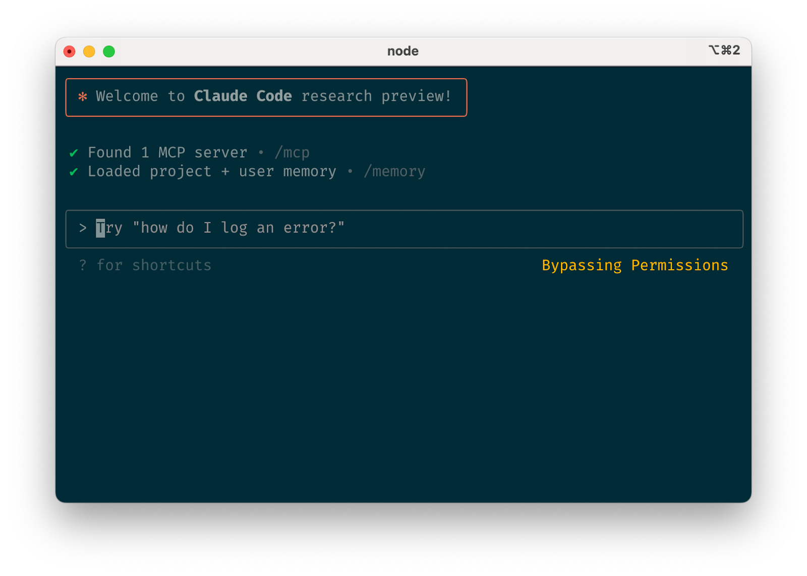
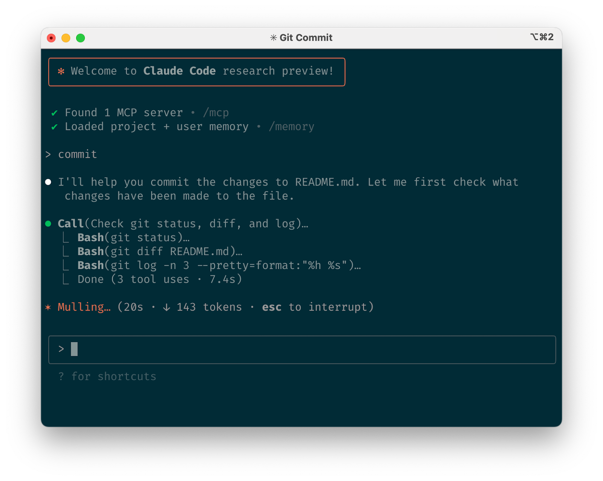
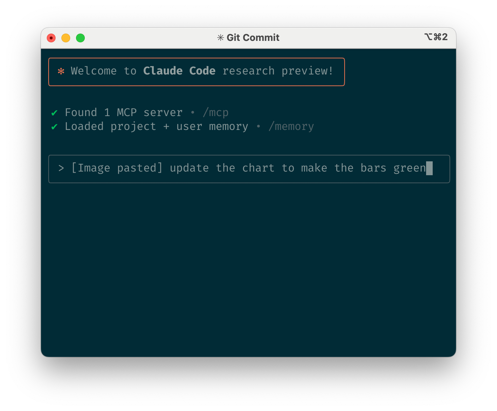
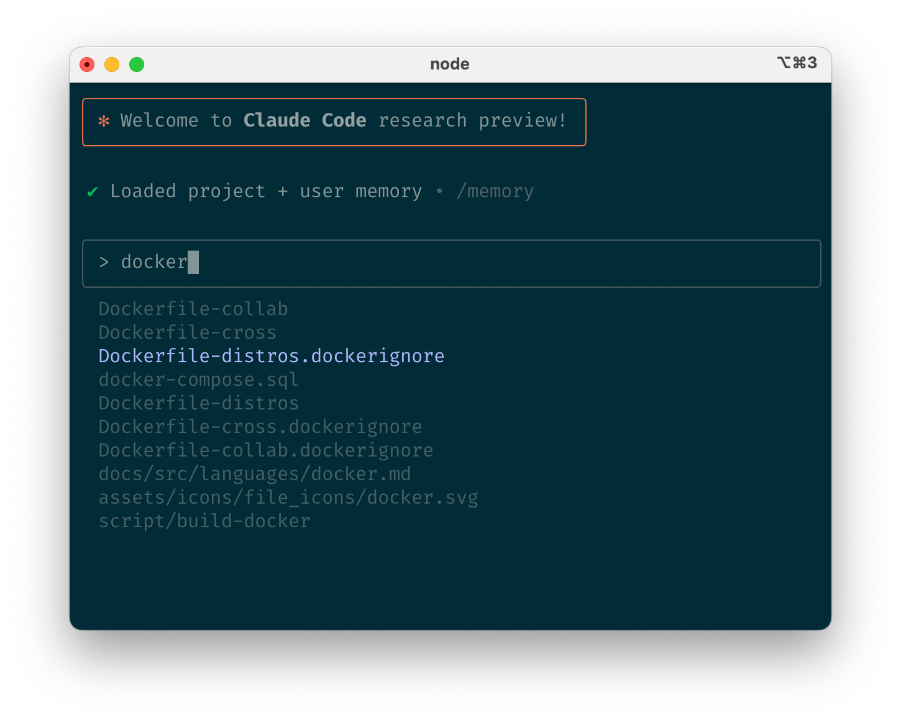
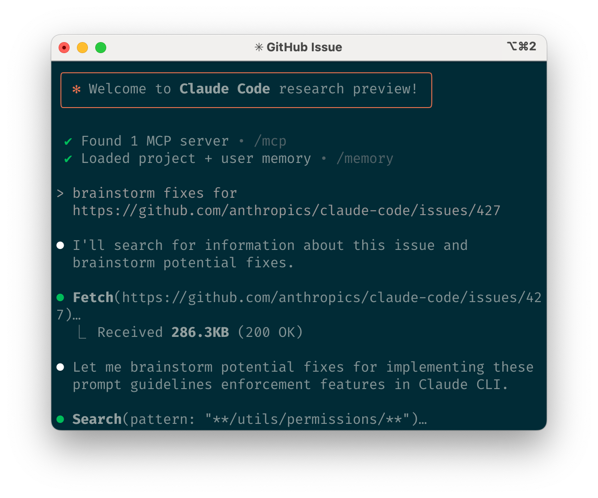

# Claude Code：Agent 编码最佳实践（中英对照）

> **原文标题：** Claude Code: Best practices for agentic coding
> **作者：** Boris Cherny（Anthropic）
> **原文链接：** https://www.anthropic.com/engineering/claude-code-best-practices
> **发布日期：** 2025-04-18
> **原文存档：** [Wayback Machine 快照（2025-04-20）](https://web.archive.org/web/20250420034405/https://www.anthropic.com/engineering/claude-code-best-practices) —— 原链接现已重定向至 code.claude.com 的新版产品文档（内容已改写），本文按存档原版翻译
> 排版：每段英文原文在前，中文翻译紧随其后。术语保留英文原文并附中文释义。

---

*We recently released [Claude Code](https://www.anthropic.com/news/claude-3-5-sonnet), a command line tool for agentic coding. Today, we're sharing some tips and tricks that have proven effective for using Claude Code across various codebases, languages, and environments.*

*我们最近发布了 [Claude Code](https://www.anthropic.com/news/claude-3-5-sonnet)——一个面向 agentic coding（智能体编码）的命令行工具。今天，我们分享一些在实际中被证明行之有效的技巧与窍门，涵盖在各种代码库、语言与环境里使用 Claude Code 的经验。*

*Looking for more detailed information? Our comprehensive documentation at [claude.ai/code](http://claude.ai/code) covers all the features mentioned in this post and more.*

*想要更详细的信息？我们在 [claude.ai/code](http://claude.ai/code) 的完整文档覆盖了本文提到的所有功能，甚至更多。*

## 1. 定制你的设置（Customize your setup）

Claude Code is an agentic coding tool that automatically ingests context about your project. To make the most of Claude Code, try the following approaches:

Claude Code 是一个会自动摄取项目上下文的 agentic coding 工具。要充分发挥 Claude Code 的效用，可以尝试以下方法：

### a. 创建 CLAUDE.md 文件（Create a CLAUDE.md file）

CLAUDE.md is a special file that Claude automatically pulls in for context at the start of every session. This makes it a great place for putting down information like:

CLAUDE.md 是一个特殊文件，Claude 会在每次会话开始时自动读取它作为上下文。因此它是记录以下信息的绝佳位置：

- Common bash commands
- 常用的 bash 命令
- Core files and utility functions
- 核心文件与工具函数
- Code style guidelines
- 代码风格规范
- Testing instructions
- 测试说明
- Repository etiquette (e.g., branch naming, merge vs. rebase, etc.)
- 仓库礼仪（例如：分支命名、merge 还是 rebase 等等）
- Developer environment setup (e.g., pyenv use, which compilers work)
- 开发环境配置（例如：pyenv 的使用、哪些编译器可用）
- Any unexpected behaviors or warnings the project has with the codebase
- 项目与代码库相关的任何意外行为或警告
- Other information you want Claude to "remember" (like specific nuances of files in the project)
- 其他你希望 Claude"记住"的信息（比如项目中某些文件的特定细节）

For example, you can add a CLAUDE.md file to the root of your repository like this:

例如，你可以在仓库根目录添加一个这样的 CLAUDE.md 文件：

```markdown
# Bash commands
npm run build
npm run typecheck

# Code style
- Use ES modules (ESM) syntax
- Destructure imports when possible

# Workflow
- Make sure typecheck passes before completing the task
- Prefer running single tests, and not the whole test suite, unless asked
```

There are several places where you can place CLAUDE.md files:

CLAUDE.md 文件可以放在多个位置：

- **The root of your repository** (or wherever you launch claude from, which is your project root for monorepos). We named this CLAUDE.md so it lives at the root of your repo (i.e., ~/project/CLAUDE.md)
- **仓库根目录**（或你启动 claude 的位置——对 monorepo 而言即项目根目录）。我们把它命名为 CLAUDE.md，让它放在仓库根部（即 ~/project/CLAUDE.md）
- **A parent directory** (for monorepos, useful for shared settings across repos?)
- **父目录**（对 monorepo 而言，可用于跨仓库共享配置）
- **A subdirectory** of your repository (for commands targeted at a specific folder or component, useful when working in that directory more often than not)
- **仓库的子目录**（用于针对特定文件夹或组件的指令——当你大部分时间都在该目录下工作时很有用）

### b. 调优你的 CLAUDE.md 文件（Tune your CLAUDE.md files）

Your CLAUDE.md files become part of the prompt for Claude, so they should be concise and human-readable. Since the prompt uses Markdown, you can use Markdown formatting (headers, lists, etc.) to organize the file.

你的 CLAUDE.md 文件会成为 Claude 提示词的一部分，所以应当写得简洁、易读。由于提示词使用 Markdown，你可以用 Markdown 格式（标题、列表等）来组织文件内容。

### c. 授予 Claude 工具（Grant Claude tools）

By default, Claude is allowed to read any file in your project as well as read any commands directly from the internet (like framework documentation), as well as view files and directories in your project.

默认情况下，Claude 可以读取你项目中的任何文件，可以直接从互联网读取内容（如框架文档），也可以查看项目中的文件与目录。

Claude needs permission before running any bash commands, so we pay special attention to model vetting to ensure we offer both a capable model and a safe experience.

Claude 在运行任何 bash 命令之前都需要获得许可，因此我们对模型审查（model vetting）格外用心，以同时提供强大的模型与安全的体验。

You can allow Claude to use the bash tool or other tools by editing your settings file or using the /allowed-tools command.

你可以通过编辑配置文件或使用 /allowed-tools 命令，来允许 Claude 使用 bash 工具或其他工具。



**Image 1:** Claude Code tool allowlist
**图 1：** Claude Code 工具允许列表

### d. 建立护栏（Establish guardrails）

Anthropic maintains responsibility for the model's outputs. We recommend investing in testing your integrations and doing periodic reviews of Claude's code contributions.

Anthropic 对模型输出承担责任。我们建议投入精力测试你的集成，并定期审查 Claude 的代码贡献。

Claude Code uses permission-based approvals by default, but it also provides options to make Claude more autonomous, from allowing tool use without permission checks for a list of allowlisted commands, to enabling a separate claude --dangerously-skip-permissions mode that skips all permission checks. We recommend using this mode only in sandboxed environments (whether as part of devcontainer, or with a sandboxed environment like Bastion/Firewall) with internet access restricted.

Claude Code 默认采用基于权限的审批机制，但也提供了让 Claude 更自主的选项：既可以为一份允许列表（allowlist）中的命令开放免权限检查的工具使用，也可以启用独立的 claude --dangerously-skip-permissions 模式跳过所有权限检查。我们建议仅在沙箱环境中（无论是作为 devcontainer 的一部分，还是配合 Bastion/Firewall 之类的沙箱环境）使用该模式，并限制其互联网访问。

We've found that the following tools are most effective for agentic coding:

我们发现以下工具对 agentic coding 最为有效：



**Image 2:** Safe yolo mode
**图 2：** 安全 YOLO 模式

## 2. 给 Claude 更多工具（Give Claude more tools）

Claude leverages the tools available in your environment. Like general coding best practices, providing Claude with the right tools and context—e.g., typechecking tools, testing frameworks, and logging—increases its effectiveness.

Claude 会利用你环境中可用的工具。正如通用编码最佳实践所言，为 Claude 提供合适的工具与上下文——例如类型检查工具、测试框架和日志——能提升它的效能。

### a. 用 bash 执行代码（Use bash for code execution）

Claude inherits your bash environment. It can use all of your scripts and tools. If you use gh CLI, Claude gets access to all the gh commands for GitHub interactions. If you have any custom bash functions, Claude can use them as well.

Claude 继承你的 bash 环境，可以使用你的所有脚本与工具。如果你使用 gh CLI，Claude 就能调用全部 gh 命令与 GitHub 交互。如果你有任何自定义 bash 函数，Claude 同样可以使用。

### b. 用 MCP 获取更多工具（Use MCP for more tools）

Claude functions as an MCP client, connecting to MCP servers to access their tools. For example, you can use the Puppeteer MCP server to give Claude access to a browser, or the Sentry MCP server to give Claude access to error logs.

Claude 可以作为 MCP 客户端运行，连接 MCP 服务器以使用其工具。例如，你可以用 Puppeteer MCP 服务器让 Claude 操控浏览器，或用 Sentry MCP 服务器让 Claude 访问错误日志。

Claude automatically pulls in the tools and prompts from MCP servers that you configure. If you want to send data outside your environment to Claude, be mindful of data privacy considerations—e.g., be careful about adding MCP servers that may send sensitive data to the model. Also be careful about prompt injection from untrusted content (like web content) when using web-enabled tools like Puppeteer.

Claude 会自动接入你配置的 MCP 服务器所提供的工具与提示。如果你要把环境外的数据传给 Claude，请留意数据隐私问题——例如，谨慎添加可能将敏感数据发送给模型的 MCP 服务器。在使用 Puppeteer 这类具备联网能力的工具时，也要当心来自不可信内容（如网页内容）的提示注入（prompt injection）。

### c. 使用自定义斜杠命令（Use custom slash commands）

You can have Claude run custom bash commands by storing them in a directory with markdown files. You can use these commands just like you would at the prompt. For example, you can create a custom slash command to fix all lint issues, or create a slash command that runs your test suite for the file you're currently working on.

你可以把自定义 bash 命令以 markdown 文件的形式存放在特定目录中，让 Claude 执行。这些命令的使用方式与在提示符下输入完全一样。例如，你可以创建一个修复所有 lint 问题的自定义斜杠命令，或者创建一个为当前工作文件运行测试套件的斜杠命令。

## 3. 尝试常见工作流（Try common workflows）

In this section, we'll describe some of the more common workflows that we've found effective for using Claude Code in different scenarios.

本节介绍一些我们发现的、在不同场景下都能有效使用 Claude Code 的常见工作流。

### a. 探索、规划、写码、提交（Explore, plan, code, commit）

This versatile workflow works for many problems:

这个通用工作流适用于许多问题：

#### 先探索（Explore first）

Read relevant files, images, and URLs, either providing general pointers (e.g., "add the input validation for the email field") or specific pointers (e.g., "add the input validation for the email field in src/utils/validation.ts"). Ask Claude to make sure it has a good understanding of the problem and codebase.

阅读相关文件、图片和 URL，可以给出宽泛的指引（例如"给邮箱字段加上输入校验"），也可以给出具体的指引（例如"在 src/utils/validation.ts 中给邮箱字段加上输入校验"）。让 Claude 确认它对问题和代码库都有了充分理解。

#### 先规划（Plan first）

Ask Claude to come up with a plan for how to approach the problem. We recommend using the word "think" to trigger extended thinking mode, which gives Claude additional computation time to think through alternative approaches and weigh tradeoffs. These trigger phrases include "think" < "think hard" < "think harder" < "ultrathink". More thinking time gives Claude more time to consider different approaches.

让 Claude 制定解决问题的方案。我们建议使用"think"一词来触发扩展思考模式（extended thinking mode），给 Claude 额外的计算时间去斟酌不同方案、权衡利弊。触发短语从弱到强依次为："think" < "think hard" < "think harder" < "ultrathink"。思考时间越多，Claude 就有越多的时间考虑不同方案。

#### 写码（Code）

Once you've confirmed the plan looks good, have Claude implement the solution. This is the point at which it's useful to ask Claude to commit as it goes through the solution. A simple approach is to ask Claude to write a plan to a markdown file (e.g., 3-step-plan.md) so that you can track its progress (you can then check off that plan and have Claude resume work if it gets interrupted or you want to go back).

确认方案没问题后，让 Claude 实现该方案。此时让 Claude 在推进过程中随时提交（commit）会很有用。一个简单的做法是让 Claude 把方案写进一个 markdown 文件（例如 3-step-plan.md），这样你就能跟踪它的进度（之后你可以逐项勾掉已完成内容；如果它中途被打断、或者你想回退重做，也可以让 Claude 从清单恢复工作）。

#### 提交（Commit）

Have Claude commit its results in a commit. If it's the end of a larger body of work, Claude can open a PR to merge it with your git repository. If appropriate, you can also have Claude update your changelog or other documentation to reflect what it's done.

让 Claude 把结果提交（commit）。如果这是一项较大工作的收尾，Claude 可以开一个 PR 把代码合并进你的 git 仓库。必要时，你还可以让 Claude 更新 changelog 或其他文档，记录它完成的工作。

Steps 2-4 (plan, code, commit) can be combined in a single prompt if the task is simple enough.

如果任务足够简单，第 2–4 步（规划、写码、提交）可以合并到一条提示里完成。

### b. 先写测试，再提交（Write tests, then commit）

Tests can be used to validate changes that Claude makes to code. This is a particularly good practice when the codebase has good test coverage and is fast to run tests.

测试可以用来校验 Claude 对代码的修改。当代码库有良好的测试覆盖、且测试运行够快时，这尤其是一个好实践。

### c. 写码、截图、迭代（Write code, screenshot result, iterate）

Similar to the testing workflow, you can provide Claude with a screenshot of a design mockup, then ask Claude to write code and take a screenshot of the result. Then iterate until the result matches the mockup. Tools like the Puppeteer MCP server enable this workflow.

与测试工作流类似，你可以给 Claude 一张设计稿截图，让它写代码并给运行结果截图，然后不断迭代，直到结果与设计稿一致。Puppeteer MCP 服务器这类工具可以支撑这一工作流。

### d. 安全 YOLO 模式（Safe YOLO mode）

Instead of approving commands, you can use claude --dangerously-skip-permissions to skip all permission checks and let Claude run without interruption. This is useful for quick iterations or fixing lint issues.

你无需逐条审批命令，可以使用 claude --dangerously-skip-permissions 跳过所有权限检查，让 Claude 不间断地运行。这在快速迭代或修复 lint 问题时很有用。

### e. 代码库问答（Codebase Q&A）

Claude is great for learning a new codebase, useful for onboarding. Ask Claude questions like "How does logging work in this codebase?", "How do I add a new API endpoint?" or "Where is the database migration code?"

Claude 非常适合用来学习新代码库，对接手新项目（onboarding）很有帮助。你可以问它："这个代码库的日志是怎么工作的？""我怎么加一个新的 API endpoint？""数据库迁移代码在哪里？"

### f. 用 Claude 操作 git（Use Claude to interact with git）

Claude can handle many git operations. Many Anthropic engineers use Claude for 90%+ of our git interactions:

Claude 能处理许多 git 操作。Anthropic 的许多工程师 90% 以上的 git 操作都交给 Claude 完成：

- **Git history**: Asking questions like "When was the v1.2.1 release?", "What changes were made in the last month?", "Who wrote this specific feature?", or "Why was this API designed this way?" can be helpful for understanding code history. It can also be useful to give Claude permission to run git blame to see who wrote specific lines of code.
- **Git 历史**：问诸如"v1.2.1 是什么时候发布的？""上个月改了哪些东西？""这个特定功能是谁写的？""这个 API 为什么这样设计？"之类的问题，有助于理解代码历史。给 Claude 运行 git blame 的权限也很有用，可以看到特定代码行是谁写的。
- **Handling merge conflicts**: Ask Claude to handle merge conflict resolution (e.g., "resolve the merge conflict" or "resolve all merge conflicts"), taking advantage of its ability to quickly understand the conflict and resolve it.
- **处理合并冲突**：让 Claude 处理 merge conflict 的解决（例如"解决这个合并冲突"或"解决所有合并冲突"），利用它快速理解冲突并加以解决的能力。
- **Writing commits and PRs**: Claude can write well-formatted commit messages with heredocs to git commit, and can construct PRs with gh. If you're using GitHub, the /github-install command can install a GitHub app to automatically format PRs and review comments.
- **编写提交信息与 PR**：Claude 可以用 heredoc 给 git commit 写出格式良好的提交信息，也可以用 gh 构建 PR。如果你在用 GitHub，/github-install 命令可以安装一个 GitHub 应用，自动格式化 PR 与评审意见。



**Image 3:** Use Claude to interact with git
**图 3：** 用 Claude 操作 git

### g. 用 Claude 做情报收集与分析（SRE 工作流）（Use Claude for intelligence gathering and analysis (SRE workflows)）

Log files are a gold mine for debugging, yet most engineers don't dig through them manually (with LLM assistance). You can ask Claude to dig through logs (e.g., "what caused this error?") or analyze large log files for anomalies (e.g., "help me find any anomalies in this log file"). Be mindful that Claude may need to read large files, which can consume a lot of context.

日志文件是调试的金矿，但大多数工程师不会手动翻阅（有了 LLM 辅助就不同了）。你可以让 Claude 深挖日志（例如"这个错误是什么引起的？"），或分析大型日志文件中的异常（例如"帮我找出这份日志里的所有异常"）。注意 Claude 可能需要读取大文件，这会消耗大量上下文。

Claude can also use its web search capability to find documentation and fix issues. For example, it can look up recent changes to the AWS SDK that may be affecting errors you're seeing, or it can look up current AWS KB articles for the error you're seeing.

Claude 还能利用联网搜索查找文档、修复问题。例如，它可以检索 AWS SDK 的近期变更（可能正是你所见错误的原因），或者查找与你所见错误相关的 AWS 知识库文章。

### h. 用无头模式自动化你的基础设施（Use headless mode to automate your infra）

Claude Code includes headless mode for non-interactive contexts like CI, pre-commit hooks, build scripts, and CI pipelines. You can use claude -p "your prompt" with the --output-format stream-json flag to stream Claude's agentic output.

Claude Code 为 CI、pre-commit 钩子、构建脚本和 CI 流水线等非交互场景提供了无头模式（headless mode）。你可以用 claude -p "your prompt" 加上 --output-format stream-json 参数，流式获取 Claude 的 agentic 输出。

- **Issue triage**: You can use headless mode to write scripts for automatically triaging incoming GitHub issues.
- **Issue 分诊**：可以用无头模式编写脚本，自动分诊新进来的 GitHub issue。
- **Linting**: Claude Code can be used to identify linting defects that conventional linters can't detect (like subtle logic errors or violations of project-specific conventions).
- **Lint 检查**：Claude Code 可以找出传统 linter 检测不到的 lint 缺陷（比如隐蔽的逻辑错误，或违反项目特定约定的情况）。

## 4. 优化你的工作流（Optimize your workflow）

The following recommendations apply to all workflows:

以下建议适用于所有工作流：

### a. 指令要具体（Be specific in your instructions）

If you want Claude to find a bug, describe the symptom (e.g., "why is this test failing?") rather than asking it to find the bug. Be specific about what you want Claude to do—this is a good way to get the best results.

如果你想让 Claude 找出一个 bug，请描述症状（例如"为什么这个测试失败了？"），而不是笼统地让它"找到 bug"。把你希望 Claude 做的事说具体——这是获得最佳结果的好方法。

You can also use the "think" keywords to trigger extended thinking mode, which gives Claude additional computation time to think through alternative approaches and weigh tradeoffs. These trigger phrases include "think" < "think hard" < "think harder" < "ultrathink". More thinking time gives Claude more time to consider different approaches.

你也可以使用"think"关键词触发扩展思考模式，给 Claude 额外的计算时间去斟酌不同方案、权衡利弊。触发短语从弱到强依次为："think" < "think hard" < "think harder" < "ultrathink"。思考时间越多，Claude 就有越多的时间考虑不同方案。

### b. 给 Claude 图片（Give Claude images）

Claude can read images and charts, giving it visual context that text alone can't provide. For example, you can:

Claude 能读取图片和图表，获得纯文字无法提供的视觉上下文。例如，你可以：

- Paste screenshots directly (but note this is not supported for the web app)
- 直接粘贴截图（注意：网页版不支持）
- Drag and drop images into the prompt (you can then use ctrl+v to paste the image instead of typing the file path)
- 把图片拖放进提示框（然后可以用 ctrl+v 粘贴图片，而不用手敲文件路径）
- Provide file paths for Claude to read and analyze
- 提供文件路径让 Claude 读取和分析

This is particularly useful when working with design mockups as references for implementation, or visual debugging of UI errors.

在以下场景特别有用：把设计稿当作实现参考，或对 UI 错误做可视化调试。



**Image 4:** Give Claude images
**图 4：** 给 Claude 图片

### c. 点名让 Claude 查看或处理的文件（Mention files you want Claude to look at or work on）

Use tab completion to quickly mention files or directories anywhere in your prompt, allowing Claude to explore or work on specific files.

用 Tab 补全可以快速在提示中的任何位置点名文件或目录，让 Claude 去探索或处理特定文件。



**Image 5:** Mention files you want Claude to look at or work on
**图 5：** 点名让 Claude 查看或处理的文件

### d. 给 Claude URL（Give Claude URLs）

Provide Claude URLs for it to fetch and convert to markdown. For example, you can provide the URL of a bug report to Claude. To avoid prompt injection, only use trusted URLs (like URLs from your project documentation). If you have a local docs MCP server, you can also use that.

把 URL 提供给 Claude，它会抓取并转成 markdown。例如，你可以把 bug 报告的 URL 给 Claude。为避免提示注入，只使用可信的 URL（比如来自你项目文档的 URL）。如果你有本地文档 MCP 服务器，也可以用它。



**Image 6:** Give Claude URLs
**图 6：** 给 Claude URL

### e. 尽早且频繁地纠偏（Course correct early and often）

While there are occasions where Claude might solve the problem perfectly on the first try, correcting Claude early and often significantly improves the final output. You can press Escape to interrupt Claude early (double-tap Escape to return to previous messages), then re-prompt with clarifying instructions.

虽然有时 Claude 第一次就能完美解决问题，但尽早且频繁地纠偏能显著改善最终输出。你可以按 Escape 键提前打断 Claude（连按两次 Escape 可回退到之前的消息），然后附上澄清性指令重新提示。

### f. 用 /clear 保持上下文聚焦（Use /clear to keep context focused）

During long sessions, context windows can accumulate irrelevant content. Using the /clear command to reset the context window can significantly improve Claude's performance.

在长会话中，上下文窗口会积累无关内容。使用 /clear 命令重置上下文窗口，能显著提升 Claude 的表现。

### g. 对复杂工作流使用清单和草稿本（Use checklists and scratchpads for complex workflows）

For large workflows with multiple steps or requiring exhaustive searches, you can improve performance by having Claude use a markdown file (or even GitHub issue) as a checklist and scratchpad. For example, to fix a large number of lint issues, you might do the following:

对于步骤繁多或需要穷尽搜索的大型工作流，可以让 Claude 把一个 markdown 文件（甚至一个 GitHub issue）当作清单（checklist）和草稿本（scratchpad）来提升表现。例如，要修复大量 lint 问题，你可以这样做：

```
> Fix all ESLint errors in the codebase, one at a time. Use the ESLint errors from running lint (or make a list of lint issues in lint-defense.md), fix all of them, and update the list as you make progress.
```

> 中文提示语：修复代码库中所有 ESLint 错误，一次修一个。使用运行 lint 得到的 ESLint 错误（或在 lint-defense.md 里建一份 lint 问题清单），把它们全部修复，并随进度更新这份清单。

### h. 把数据传给 Claude（Pass data into Claude）

You have several options for getting data into Claude:

把数据交给 Claude 有几种方式：

- Paste directly into the prompt (the most common approach)
- 直接粘贴进提示框（最常用的方式）
- Pipe into Claude (e.g., cat foo.txt | claude -p "explain the bugs in this code")
- 通过管道输入（例如 cat foo.txt | claude -p "explain the bugs in this code"）
- Have Claude read files or fetch URLs (Claude can also fetch images)
- 让 Claude 读取文件或抓取 URL（Claude 也能抓取图片）

## 5. 用无头模式自动化你的基础设施（Use headless mode to automate your infra）

Claude Code includes headless mode for non-interactive contexts like CI, pre-commit hooks, build scripts, and CI pipelines. You can use claude -p "your prompt" with the --output-format stream-json flag to stream Claude's agentic output.

Claude Code 为 CI、pre-commit 钩子、构建脚本和 CI 流水线等非交互场景提供了无头模式（headless mode）。你可以用 claude -p "your prompt" 加上 --output-format stream-json 参数，流式获取 Claude 的 agentic 输出。

### a. Issue 分诊（Issue triage）

Headless mode can power automations triggered by GitHub events. For example, when a new issue is created on your repository, you can have Claude analyze, triage, and assign labels to it.

无头模式可以支撑由 GitHub 事件触发的自动化。例如，当你的仓库有新 issue 创建时，可以让 Claude 分析、分诊并打上标签。

### b. Lint 检查（Linting）

Claude Code can be used to identify linting defects that conventional linters can't detect (like subtle logic errors or violations of project-specific conventions). You can have Claude review diffs to identify issues that conventional linters and code review tools can't detect, then pipe the output to CI to automatically flag or fix them.

Claude Code 可以找出传统 linter 检测不到的 lint 缺陷（比如隐蔽的逻辑错误，或违反项目特定约定的情况）。你可以让 Claude 审查 diff，找出传统 linter 和代码评审工具发现不了的问题，再把输出接入 CI，自动标记或修复。

```
> claude -p "Review the following code for suspicious patterns like API keys, auth tokens, or hardcoded secrets. Flag anything suspicious with a brief explanation" --output-format json | jq '.summary'
```

> 中文提示语：审查以下代码中是否存在可疑模式，例如 API 密钥、认证令牌或硬编码的机密。对任何可疑之处给出简要说明并标记。

## 6. 用多 Claude 工作流更上一层楼（Uplevel with multi-Claude workflows）

Beyond your own workflows, you can run multiple Claude instances in parallel to be even more effective. We recommend running multiple Claudes for:

除了单实例工作流之外，你还可以并行运行多个 Claude 实例，效率更上一层。我们建议在以下场景使用多个 Claude：

### a. 一个写代码，另一个验证（One writes code; another verifies）

Having a second Claude review the first Claude's work can produce better results than having a single Claude do everything. You can run separate Claude instances for writing and reviewing code, with one focused on implementation and the other on code quality and correctness.

让第二个 Claude 审查第一个 Claude 的工作，往往比让一个 Claude 包揽一切效果更好。你可以让写代码和审代码各用一个 Claude 实例——一个专注实现，另一个专注代码质量与正确性。

A simple way to have a second Claude verify work:

让第二个 Claude 做验证的简单方法：

1. Have Claude write code (in a separate window/terminal if you like)
2. Run /security-review in a separate Claude session (or start claude --dangerously-skip-permissions with a security-review prompt)
3. Have a second Claude (or the same Claude with /clear) review the code for correctness, false positives, and missed edge cases
4. Have Claude address the feedback

1. 让 Claude 写代码（愿意的话可以在单独的窗口/终端里进行）
2. 在另一个 Claude 会话里运行 /security-review（或者用安全审查提示启动 claude --dangerously-skip-permissions）
3. 让第二个 Claude（或用 /clear 清空后的同一个 Claude）审查代码的正确性、误报和遗漏的边界情况
4. 让 Claude 处理这些反馈

You can also split this across responsibilities—e.g., one Claude focuses on test coverage while another focuses on security. This division of labor often outperforms a single Claude handling all concerns.

你还可以按职责拆分——例如一个 Claude 专注测试覆盖，另一个专注安全。这种分工往往胜过让单个 Claude 兼顾所有方面。

### b. 让多个 Claude 分别检出你的代码（Have multiple Claudes check out your code）

Multiple Claudes can work independently on different parts of your codebase in parallel:

多个 Claude 可以并行地、互不干扰地处理代码库的不同部分：

1. Create 3-4 git checkouts in separate directories
2. Open separate terminal tabs in each folder
3. Launch Claude in each tab on different tasks
4. Cycle through the tabs to review and merge the results

1. 在不同目录创建 3–4 个 git 检出（checkout）
2. 在每个文件夹里打开独立的终端标签页
3. 在每个标签页里让 Claude 各跑各的任务
4. 在标签页之间轮换，审查并合并结果

### c. 用 git worktree 分开处理不同任务（Use git worktrees for separate tasks）

Multiple Claudes can work independently on different parts of your codebase using git worktrees:

多个 Claude 可以借助 git worktree（工作树）在代码库的不同部分上独立工作：

1. Create worktrees: git worktree add ../project-feature-a feature-a
2. Launch Claude in each worktree
3. As Claude finishes, merge branches back (e.g., git merge feature-a)

1. 创建 worktree：git worktree add ../project-feature-a feature-a
2. 在每个 worktree 里启动 Claude
3. Claude 完成后，把分支合并回来（例如 git merge feature-a）

Tip: You can use --dangerously-skip-permissions in one worktree while running another with normal permission checks. This lets you run a cleanup script in one worktree while another Claude is working on a different task.

提示：你可以在一个 worktree 里使用 --dangerously-skip-permissions，同时在另一个 worktree 里保持常规权限检查运行。这样就能在一个 worktree 里跑清理脚本，而另一个 Claude 正在别的任务上工作。

### d. 无头模式配合自定义 harness（Use headless mode with custom harness）

claude -p (headless mode) integrates programmatically with larger systems and workflows. For example:

claude -p（无头模式）能以编程方式接入更大的系统与工作流。例如：

1. Create 3-4 git worktrees in separate directories
2. Write a script like this for each worktree:

1. 在不同目录创建 3–4 个 git worktree
2. 为每个 worktree 写一个这样的脚本：

```bash
#!/bin/bash

# Define the task or prompt for Claude
task="$1"

# Set the working directory for Claude
worktree="$2"

# Run Claude Code in headless mode
cd "$worktree" && claude -p "$task" --output-format stream-json
```

## 致谢（Acknowledgements）

Thanks to Boris Cherny for writing this post, and to the entire Claude Code engineering team for their feedback.

感谢 Boris Cherny 撰写本文，也感谢整个 Claude Code 工程团队提供的反馈。

- Boris Cherny, Creator of Claude Code
- Boris Cherny，Claude Code 创造者
