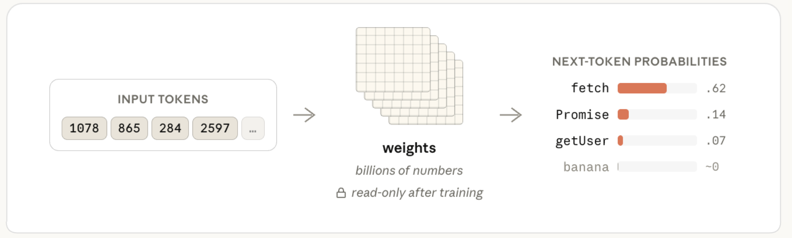
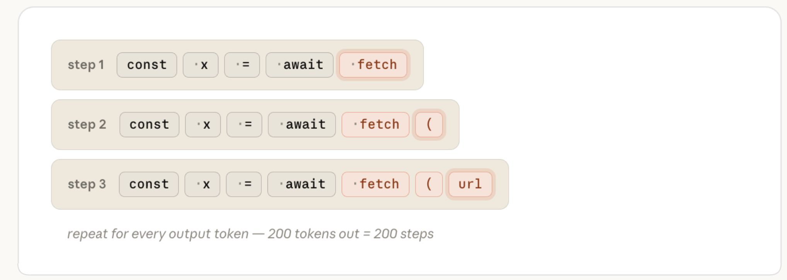
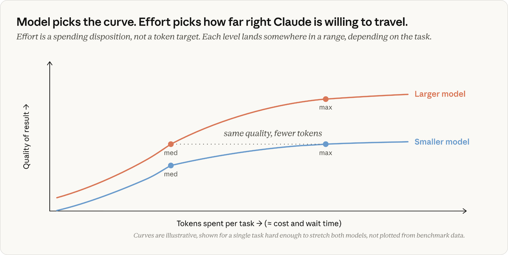

# Claude Code 努力档位与模型选型指南（中英对照）

> 原文标题：Claude Code effort level and model selection
> 原文链接：https://claude.com/blog/claude-model-and-effort-level-in-claude-code
> 原文作者：Lydia Hallie
> 发布日期：2026-07-07
> **翻译模型：** GLM-5.3-Flash
> **评分：** ★★★★☆（4/5，强推荐）--官方 effort 档位与模型选型指南，重度用户日常可直接查用
> 排版：每段英文原文在前，中文翻译紧随其后。默认收录正文主体。

---

## 模型选型是如何工作的（How model selection works）

When you press enter, Claude Code assembles your message together with the system prompt, tool definitions, your CLAUDE.md, the conversation history, and any files in context. All of this is sent as one request to the API.

当你按下回车时，Claude Code 会把你的消息与系统提示词（system prompt）、工具定义、你的 CLAUDE.md、对话历史以及上下文中的所有文件组装在一起，并作为一个请求发送给 API。

**Caption:** Everything Claude Code has gets packed into one API request. On the server, the text is tokenized before it ever reaches the model.

**图注：** Claude Code 拥有的一切都被打包进同一个 API 请求。在服务器端，文本在到达模型之前就已先被分词。

The model never sees that as plain text, though. The first thing that happens on the server is **tokenization**; the text is split into pieces, and each piece is mapped to an integer from a fixed vocabulary the model was trained with. const might map to 1978, await might map to 4293. From here on, your prompt is an array of integers.

不过，模型看到的并不是纯文本。服务器上发生的第一件事就是**分词（tokenization）**：文本被切分成一个个片段，每个片段被映射为模型训练时所用的固定词表（vocabulary）中的一个整数。const 可能映射为 1978，await 可能映射为 4293。从这一刻起，你的提示词就是一个整数数组。

**Caption:** The tokenizer splits your text into pieces and maps each piece to an integer in a fixed vocabulary. Each chunk in the top row becomes its token ID (bottom row); IDs shown are illustrative.

**图注：** 分词器（tokenizer）把你的文本切分成片段，并将每个片段映射为固定词表中的一个整数。上排的每个文本块都变成它的 token ID（下排）；图中所示的 ID 仅为示意。

The model's job is to take that array and predict which token comes next. It does this by computing a *probability* for every token in its vocabulary and picking from the top. After const x = await, a well-trained model puts high probability on fetch (very likely) and near-zero on banana (not likely at all).

模型的任务就是拿到这个数组，预测下一个 token 是什么。它的做法是为词表中的每一个 token 计算一个*概率*，然后从最靠前的里面挑选。在 const x = await 之后，一个训练良好的模型会给 fetch 赋以很高的概率（非常可能），而给 banana 的概率接近于零（根本不太可能）。

**Caption:** The model's prediction is a probability for every token in its vocabulary. The gap between the top guess and an unrelated one is enormous.

**图注：** 模型的预测是为词表中每个 token 给出的概率。最可能的猜测与毫不相关的 token 之间差距巨大。

What turns your input tokens into those probabilities is the **weights** (also called *parameters*). These are billions of numbers organized into large matrices. To predict one token, the model runs your input through those matrices, a long chain of matrix multiplications, and reads the probabilities at the end. The weights are where everything the model "knows" lives.

把你的输入 token 变成这些概率的，是模型的**权重（weights）**（也称*参数（parameters）*）。这是数十亿个数字，组织成一个个巨大的矩阵。为了预测一个 token，模型会让你的输入经过这些矩阵，也就是一长串矩阵乘法，最后读出概率。模型"知道"的一切都存在这些权重里。

**The weights of each model are set during training, and by the time you're sending requests they're read-only.** Nothing in your prompt, your CLAUDE.md, or your context changes them. (If you've run into the word inference, that's all it means: using the model after training is done, with the weights fixed.)

**每个模型的权重都是在训练期间确定的，等到你发送请求时，它们已经是只读的了。**你的提示词、你的 CLAUDE.md 或你的上下文中的任何内容都不会改变它们。（如果你遇到过 inference（推理）这个词，它的含义仅此而已：在训练完成之后使用模型，权重保持固定。）

**Caption:** Your prompt goes in, probabilities come out. The weights in the middle don't change.

**图注：** 你的提示词进去，概率出来。中间的权重不会改变。

Everything Claude knows about TypeScript, popular frameworks, idiomatic Go, or any other general programming knowledge, was encoded into those weights at training time.

Claude 对 TypeScript、主流框架、地道的 Go 写法或任何其他通用编程知识的全部了解，都是在训练时编码进这些权重里的。

Your prompt and context can still *steer* the prediction (putting your real code in front of Claude is *steering*, and it works really well), but they don't add anything to the weights themselves.

你的提示词和上下文仍然可以*引导（steer）*预测（把你真实的代码摆在 Claude 面前就是一种*引导*，而且效果非常好），但它们不会给权重本身增加任何东西。

If a library didn't exist when the model was trained, it isn't in the weights. You can put the docs in context and Claude will use them, but that's *steering*, not *teaching*. Claude's response will only be influenced for that request; the underlying model hasn't retained the information.

如果某个库在模型训练时还不存在，它就不在权重里。你可以把文档放进上下文，Claude 会去使用它们，但这是*引导*，不是*教学*。Claude 的响应只会在那一次请求中受到影响；底层模型并没有记住这些信息。

So when Claude confidently calls an API that doesn't exist (a hallucination), that's the weights producing a token sequence that *looks* plausible from training patterns, not a failed lookup.

所以，当 Claude 自信满满地调用一个并不存在的 API（即幻觉（hallucination））时，那是权重按照训练模式生成了一段*看起来*合理的 token 序列，而不是一次失败的查询。

So what does changing the model actually do? It swaps **which set of frozen weights** handles your request.

那么，切换模型到底改变了什么？它换的是**由哪一组冻结的权重**来处理你的请求。

The model doesn't generate a whole answer at once. It predicts one token, appends it to the sequence, and runs the whole computation again to get the next one. A 200-token response is 200 separate passes through the weights. This loop is where most of your wait time and your output cost come from.

模型不会一次性生成完整的答案。它每次预测一个 token，把它追加到序列末尾，然后重新跑一遍整个计算来得到下一个。一个 200 token 的响应意味着 200 次独立的权重计算。你的大部分等待时间和输出成本都来自这个循环。

**Caption:** The sequence grows by exactly one token per step. The model re-reads the whole array each time to predict what comes next.

**图注：** 序列每一步恰好增长一个 token。模型每次都会重新读取整个数组来预测接下来是什么。

So the **model setting** decides *which weights* handle your request, and it also decides what each output token costs.

因此，**model 设置**决定*由哪组权重*来处理你的请求，同时也决定每个输出 token 的成本。

What it doesn't decide is how many tokens get generated. That number can vary a lot for the same prompt, depending on how much work Claude decides to do.

它不能决定的是会生成多少 token。同一个提示词，这个数字可能相差很大，取决于 Claude 决定做多少工作。

This is what **effort** **level** controls: *how much work* Claude decides to do for each turn.

这正是**努力档位（effort level）**所控制的：Claude 在每一轮里决定*做多少工作*。

## Claude Code 的努力档位是如何工作的（How Claude Code effort level works）

When Claude Code is working on a task, the tokens it generates fall into a few categories:

当 Claude Code 在处理一个任务时，它生成的 token 可以分为几类：

- Thinking : the reasoning you see streaming before and between actions.

- Tool calls : structured blocks naming a tool like Read or Edit and its arguments, which Claude Code then parses and executes.

- Text to you : the plan, progress updates, the summary at the end.

- 思考（Thinking）：你在操作之前和操作之间看到的、流式输出的推理过程。

- 工具调用（Tool calls）：结构化的数据块，指明 Read 或 Edit 之类的工具及其参数，随后由 Claude Code 解析并执行。

- 给你的文本（Text to you）：计划、进度更新以及最后的总结。

These are all ordinary output tokens from the same loop, billed at the same rate. For example, thinking tokens are generated exactly like the other output tokens and stay in context for the rest of that turn.

这些都是同一个循环产生的普通输出 token，按同样的费率计费。例如，思考 token 的生成方式与其他输出 token 完全一样，并且会在该轮的剩余过程中留在上下文里。

When Claude moves on to writing code, its earlier reasoning is part of the input just like a file it's read.

当 Claude 接下来开始写代码时，它之前的推理就像它读过的文件一样，构成了输入的一部分。

**Caption:** All of Claude's output is tokens. Thinking, tool calls, and text to you are all generated from the same loop.

**图注：** Claude 的所有输出都是 token。思考、工具调用和给你的文本都来自同一个生成循环。

How does effort change any of this? The effort level is sent to the model as part of the request, right alongside your prompt. The model was trained to understand how to behave at each effort level and that learned behavior is baked into the frozen weights.

努力档位是如何改变这一切的？努力档位作为请求的一部分被发送给模型，与你的提示词并列。模型经过训练，懂得在每个努力档位下该如何表现，而这种习得的行为已经固化在冻结的权重里。

When your request arrives, effort level is one more input the model responds to, the same way it responds to your prompt text. This sets Claude's behavior for how thorough and certain it needs to be before it considers the task done.

当你的请求到达时，努力档位就是模型响应的又一个输入，与它响应你的提示词文本的方式相同。它决定了 Claude 在认定任务完成之前，需要做到多彻底、多有把握。

**This is considered on every turn** and results in more tokens to produce higher confidence answers.

**每一轮都会考虑这一点**，其结果是生成更多 token，以得出置信度更高的答案。

**Caption:** Same prompt, two effort levels. The high effort path generates roughly 7x more tokens to reach a higher confidence answer.

**图注：** 相同的提示词，两个努力档位。high effort 路径生成的 token 数量大约多出 7 倍，以得出置信度更高的答案。

At higher effort levels, Claude often starts with creating a plan and the level of effort influences the depth and breadth of that plan. However, the plan is not frozen in place. As Claude receives results from its actions, it updates the progress that has been made and how certain it is of the accumulated result.

在更高的努力档位下，Claude 通常会先制定一个计划，而努力档位会影响这个计划的深度和广度。不过，计划并非一成不变。随着 Claude 收到各项操作的结果，它会更新已完成的进度，以及它对累积结果的把握程度。

So when step 1 of a three-hypothesis debugging plan finds the bug, "investigate hypotheses 2 and 3" may no longer be necessary actions. Claude will typically say this explicitly, "the first check found it, so the remaining checks aren't needed" and skip ahead. You see this happen in Claude Code when task lists get revised mid-run.

因此，当一个包含三个假设的调试计划在第 1 步就找到了 bug 时，"调查假设 2 和 3"可能就不再是必要的动作了。Claude 通常会明确说出来，比如"第一次检查就找到了，剩下的检查不需要了"，然后直接跳过。当任务列表在执行中途被修改时，你就能在 Claude Code 里看到这种情况。

Claude will be more predisposed to double-checking additional hypotheses or verifying correctness at higher effort levels, but it generally won't artificially inflate usage for simple tasks at higher effort levels. In fact, our team pays close attention to "overthinking" during model training as it degrades effectiveness.

在更高的努力档位下，Claude 会更倾向于复核额外的假设或验证正确性，但对于简单任务，它在高档位下一般不会人为夸大用量。事实上，我们的团队在模型训练期间非常关注"过度思考（overthinking）"，因为它会降低效能。

## 如何选择努力档位（Picking an effort level）

Our guidance is that **for most tasks you should use the model's default effort level**. The default is the level where Claude will scale its token usage according to what most people would want to spend on a task.

我们的建议是：**对大多数任务，你都应该使用模型的默认努力档位（default effort level）**。默认档位指的是：Claude 会按照大多数人在一项任务上愿意花费的量，来相应调整自己的 token 用量。

Think of effort as a manual override to scale how hard and long Claude works. Choose it deliberately when you have a strong preference for thoroughness or speed based on your domain or the type of work you do. Consider this more as a general preference than a task-by-task decision.

把 effort 想象成一个手动覆盖开关，用来调节 Claude 工作的强度和时长。当你基于自己的领域或工作类型，对彻底性或速度有强烈偏好时，再有意识地去选择它。把它更多地看作一种总体偏好，而不是逐个任务的决策。

Some practical insight that may help guide you following the [launch of Claude Opus 4.8](https://www.anthropic.com/news/claude-opus-4-8): in our testing we found when you use the default effort setting for Opus 4.8, it will produce better results for about the same number of tokens when compared to using the default effort setting of Opus 4.7 for the same task.

一个或许能为你提供参考的实用信息，来自 [Claude Opus 4.8 发布](https://www.anthropic.com/news/claude-opus-4-8)之后：在测试中我们发现，与在同样任务上使用 Opus 4.7 的默认努力设置相比，使用 Opus 4.8 的默认努力设置，能在消耗大约相同数量 token 的情况下产出更好的结果。

## Claude 出错时该调整什么（What to change when Claude gets it wrong）

When Claude gets something wrong, your first instinct shouldn't be to adjust a knob, but to examine the context you have provided. Is your prompt too vague? Is Claude connected to the right tools? Equipped with the right skills?

当 Claude 出错时，你的第一反应不应该是去调旋钮，而应该是检查你所提供的上下文。你的提示词是否太模糊？Claude 是否连接了正确的工具？是否配备了合适的 Skills？

If you're increasing effort on a task that *shouldn't* need it, the fix is often upstream, in your context, your CLAUDE.md, or how the task is scoped.

如果你在一个*本不该*需要高努力档位的任务上调高了 effort，解决办法往往在上游：在你的上下文、你的 CLAUDE.md，或者任务的界定方式里。

But assuming you have provided clear context and Claude still gets something wrong, the question to ask yourself is: did it not *try* hard enough, or did it not *know* enough?

但假设你已经提供了清晰的上下文，Claude 仍然出错，那么你要问自己的问题是：它是*努力*得不够，还是*了解*得不够？

**Caption:** Two questions, one fallback. Use the heuristic to pick a starting point, not a hard rule.

**图注：** 两个问题，一个兜底方案。把这条经验法则当作选择起点的参考，而不是硬性规则。

### 模型：问题太难了（Model: The problem was too hard）

Pick a larger model when the problem is genuinely hard. For example, problems like subtle bugs, unfamiliar domains, or architecture decisions. A larger model is helpful for situations where the smaller model is confidently wrong no matter how much context you give it.

当问题确实很难时，选更大的模型。例如，隐蔽的 bug、不熟悉的领域或架构决策之类的问题。当你无论给小模型多少上下文、它仍然会自信满满地出错时，更大的模型就有用武之地。

Larger models are also better at handling ambiguity, whereas specific instructions directing execution are a better recipe for success on the smaller models.

更大的模型也更擅长处理模糊性；而对于较小的模型，给出指导执行的具体指令才是更可靠的成功之道。

Pick a smaller model when the work is routine. For example, edits you can describe precisely, mechanical changes, or questions about code that's already in context. There's no reason to pay for capability the task doesn't need.

当工作是常规性的时候，选更小的模型。例如，你能精确描述的编辑、机械性的改动，或者关于已在上下文中的代码的问题。没有理由为任务用不到的能力买单。

If Claude has all the pertinent context and clearly tried and still got it wrong, that's a signal to pick a larger model. If you're on the larger model and the work has been routine for a while, dropping down will increase speed and typically reduce cost without impacting the quality of the output.

如果 Claude 已经掌握了所有相关上下文、明显也努力了，却仍然出错，这就是该换更大模型的信号。反过来，如果你正在用更大的模型，而工作已经连续一段时间都很常规，那么降一档会更快，通常也更省钱，而且不影响输出质量。

### 努力档位：Claude 不够努力（Effort: Claude didn't try hard enough）

Pick a higher effort level if Claude got it wrong by skipping a file, not running the tests, or not double-checking its work. This is most relevant if you selected an effort level below the model's default.

如果 Claude 出错是因为漏掉了某个文件、没有运行测试，或者没有复查自己的工作，那就调高努力档位。在你选择的档位低于模型默认档位时，这一点最为相关。

Fable vs. Opus vs. Sonnet: The specialist, the expert, and the generalist

Fable、Opus 与 Sonnet：专才、专家与通才

One way I like to think about how the two settings relate: Fable is a specialist who's seen problems almost no one else has, Opus is the expert, and Sonnet is a really good generalist. The effort level decides how much time any of them spends on your task.

我喜欢用这样一个角度来理解这两个设置之间的关系：Fable 是一位专才（specialist），见过几乎没别人遇到过的问题；Opus 是专家（expert）；Sonnet 则是一位非常优秀的通才（generalist）。而努力档位决定的是，他们中的任何一位会在你的任务上花多少时间。

**Opus at low effort** is like getting five minutes with an expert who has deep experience with problems like yours. They bring knowledge that isn't anywhere in your codebase: patterns they've seen before, gotchas they know to check for, the kind of thing you only get from having solved a lot of similar problems. But just giving them five minutes means a quick read of your code, not a careful one.

**low effort 下的 Opus**，就像一位对你的这类问题经验深厚的专家只给你五分钟。他们带来的是你的代码库里哪儿都找不到的知识：他们以前见过的模式、他们知道要排查的坑，这些只有解决过大量类似问题才能获得。但只给他们五分钟，意味着他们对你的代码只能是快速浏览，而非仔细研读。

**Sonnet at high effort** is like giving a really good generalist the whole afternoon. They'll read everything, run things, double-check their work, and end up understanding *your specific code* thoroughly. What they bring less of is that "I've seen exactly this before" recognition.

**high effort 下的 Sonnet**，就像把整个下午交给一位非常优秀的通才。他们会读完所有东西、动手运行、反复核查，最终彻底理解*你的具体代码*。他们欠缺的，是那种"我以前就见过一模一样的问题"的识别力。

**Fable, even at low effort,** is that specialist glancing at the problem everyone else is stuck on and still spotting the thing no one else would. That recognition is what you're paying the most for, so it's worth saving for the tasks that genuinely need it.

**Fable 即使在 low effort 下**，也是那种瞥一眼所有人都在卡壳的问题、却能发现别人发现不了的关键点的专才。这种识别力才是你花钱最多的地方，所以要把它留给真正需要的任务。

None of these is universally better. The model setting is roughly *how capable*; the effort setting is roughly *how thorough*. Most real tasks need some of both.

没有哪一个是全面更优的。模型设置大致决定*能力有多强*；努力档位设置大致决定*有多彻底*。大多数实际任务两者都需要一些。

## 努力档位、模型与 token 消耗（Effort, model, and token consumption）

So how do model selection, effort, and token consumption all interact? It depends on the task.

那么，模型选型、努力档位和 token 消耗三者是如何相互作用的？这取决于任务。

On routine work at the same effort level, both models generally will get it right. The larger model consumes more tokens with extra verification steps at a higher per-token price. That's why dropping to the smaller model for routine stretches saves real money at no quality cost.

在同样的努力档位下做常规工作，两个模型通常都能做对。更大的模型会消耗更多 token（多了额外的验证步骤），而且每个 token 的单价更高。这就是为什么在连续的常规工作上换用更小的模型，能在不损失质量的前提下省下真金白银。

**Caption:** Curves are for illustration purposes only, shown for a single task simple enough to be accomplished quickly by both models. They do not represent real benchmark data.

**图注：** 曲线仅供示意，展示的是单个对两个模型来说都足够简单、都能快速完成的任务。它们不代表真实的基准测试数据。

On harder, multi-step work, the equation is different. The smaller model has to grind toward the limit of its ability, burning iterations, while the larger model reaches the same quality bar in fewer steps.

而在更难的多步骤工作上，等式就不一样了。更小的模型不得不在自己的能力极限附近苦苦挣扎，消耗大量迭代次数；而更大的模型用更少的步骤就达到了同样的质量线。

You're paying more per token for the larger model, but on tasks that genuinely stretch the smaller one, the total cost per task can come out lower. Also, more importantly, the larger model can accomplish tasks the smaller one cannot even at the highest effort settings.

更大的模型每个 token 单价更高，但在那些确实会让小模型吃力的任务上，每个任务的总成本反而可能更低。而且，更重要的是，更大的模型能完成小模型即使调到最高努力档位也无法完成的任务。

This is most pronounced with Fable. On long, multi-step work it pulls furthest ahead. In our testing, it finished jobs Opus and Sonnet can't reach at any effort level. It also costs the most per token, which is the other reason to save it for the work that needs it.

这一点在 Fable 身上最为明显。在漫长的多步骤工作上，它领先得最多。在我们的测试中，它完成了 Opus 和 Sonnet 在任何努力档位下都无法企及的任务。它的 token 单价也最高，这是把它留给真正需要的工作的另一个理由。

**Caption:** Curves are for illustration purposes only, shown for a single task hard enough to stretch both models. They do not represent real benchmark data.

**图注：** 曲线仅供示意，展示的是单个对两个模型来说都足够难、都会让它们吃力的任务。它们不代表真实的基准测试数据。

The key point in the graphs above is that effort level picks how far Claude **is willing to travel** along the curve, but again, that doesn't mean Claude **will need to travel** that far to complete the task.

上面这几张图的关键在于：努力档位决定的是 Claude 沿这条曲线**愿意走**多远；但再强调一次，这并不意味着 Claude **需要走**那么远才能完成任务。

Another nuance to this: effort shapes token consumption but doesn't limit it. The only hard cap in the system is [max_tokens](https://platform.claude.com/docs/en/build-with-claude/extended-thinking#max-tokens-and-context-window-size-with-extended-thinking), which truncates a response mid-stream when hit. It's a blunt instrument, mostly relevant to API developers. Softer controls, like [task budgets](https://platform.claude.com/docs/en/build-with-claude/task-budgets#task-budgets-are-advisory-not-enforced) or asking Claude to keep it brief in your prompt, are more helpful tools. They serve as guidance the model is trained to follow—it will look to conclude its tasks if it gets near the limit—rather than a wall it runs into.

另一个细微之处：努力档位影响 token 消耗，但并不限制它。系统中唯一的硬上限是 [max_tokens](https://platform.claude.com/docs/en/build-with-claude/extended-thinking#max-tokens-and-context-window-size-with-extended-thinking)，一旦触及就会在流式输出中途截断响应。这是个粗糙的工具，主要与 API 开发者相关。更柔和的控制手段，比如 [task budgets（任务预算）](https://platform.claude.com/docs/en/build-with-claude/task-budgets#task-budgets-are-advisory-not-enforced)，或者在提示词里让 Claude 简明扼要，才是更有用的工具。它们是模型经训练后会遵循的指引--如果接近上限，模型会考虑给任务收尾--而不是一堵它撞上去的墙。

## 先用默认值，再动旋钮（Start with the defaults, then reach for the dials）

Most of the time, you shouldn't be thinking about either setting. When a result misses the mark, ask, "did Claude not know enough or did it not try hard enough?" and adjust as needed.

大多数时候，你不需要去想这两个设置。当结果不达标时，问一句"Claude 是了解得不够，还是努力得不够？"，然后按需调整。

For the full set of techniques to increase efficiency specifically, see [maximizing the value of your Claude Code sessions](https://claude.com/blog/maximizing-the-value-of-your-claude-code-sessions).

关于提升效率的完整技巧集，请参阅[最大化 Claude Code 会话的价值](https://claude.com/blog/maximizing-the-value-of-your-claude-code-sessions)。

*This article was written by Lydia Hallie, member of technical staff on the Claude Code team.*

*本文由 Claude Code 团队技术成员（member of technical staff）Lydia Hallie 撰写。*
