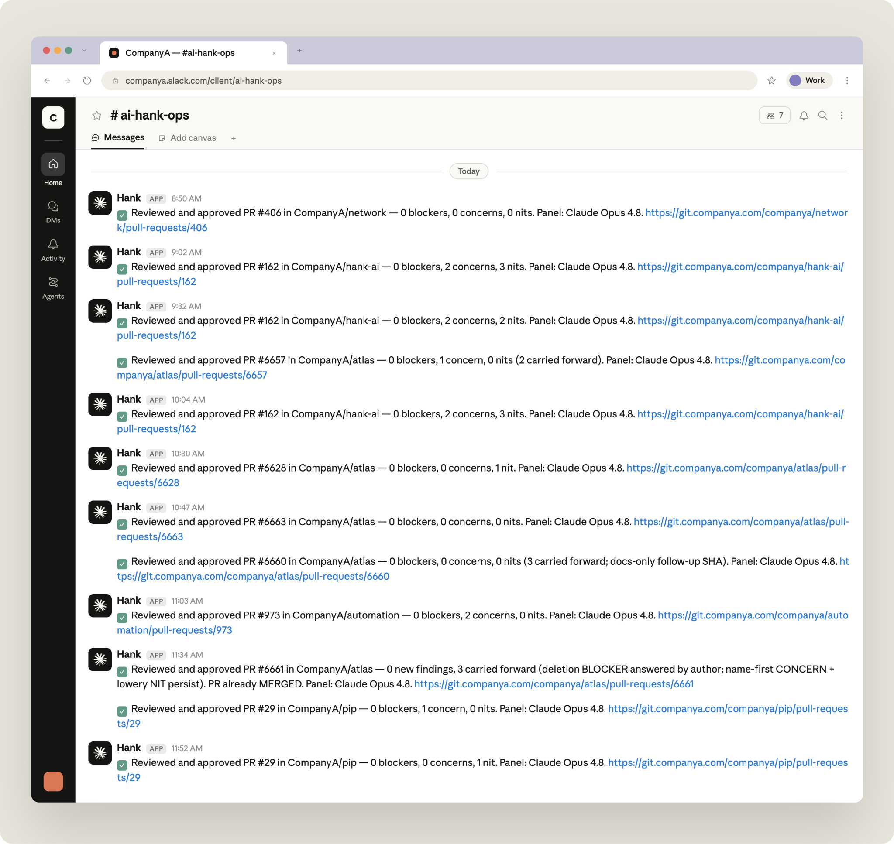
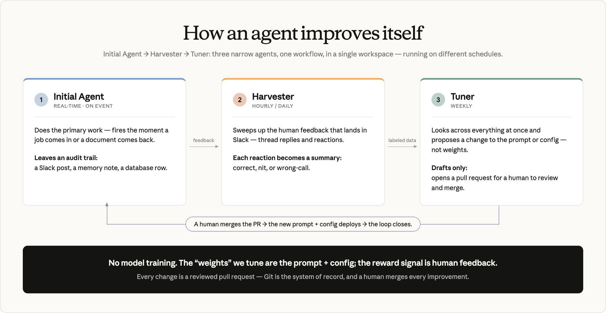

# ABC Legal 如何用 Claude Managed Agents 让每位员工成为建造者（中英对照）

> 原文标题：How ABC Legal turned every employee into a builder with Claude Managed Agents
> 原文链接：https://claude.com/blog/how-abc-legal-turned-every-employee-into-a-builder-with-claude-managed-agents
> 原文作者：Anthropic
> 发布日期：2026-08-17
> **翻译模型：** GLM-5.3-Flash
> **评分：** ★★★☆☆（3/5，值得一看）--从散乱实验到治理化 agent 舰队的落地路径
> 排版：每段英文原文在前，中文翻译紧随其后。默认收录正文主体。

When Brandon Fuller, CTO of ABC Legal, a U.S.-based legal document delivery company, rolled out [Claude Enterprise](https://claude.com/solutions/enterprise) to the company's 1,100 employees earlier this year, something clicked immediately. Teams across the company (service of process, eFiling, and appearance counsel operations, plus marketing, compliance, finance, and more) started building automations on their own, without being asked.

当 Brandon Fuller--美国法律文书送达公司 ABC Legal 的 CTO--在今年年初向公司 1,100 名员工推出 [Claude Enterprise](https://claude.com/solutions/enterprise) 时，有些东西立刻就被点燃了。公司各个团队（诉讼文书送达、电子立案（eFiling）与出庭律师运营，外加营销、合规、财务等）开始自发地构建自动化，没有人要求他们这么做。

"Our users really flocked to it," Fuller recalls. "They saw the ease of use of connectors and tools, and suddenly we had people all over the organization automating the tasks that had always eaten up their day."

“我们的用户真的蜂拥而至，”Fuller 回忆道，“他们看到了连接器（connectors）和工具的易用性，忽然之间，整个组织到处都有人在自动化那些一直吞噬他们每天时间的任务。”

It was exactly the kind of adoption any CTO hopes for. But Fuller saw an opportunity to go further: what if ABC Legal could also run a fleet of AI agents that were versioned, observable, and always on?

这正是任何 CTO 都盼望的采用局面。但 Fuller 看到了更进一步的机会：如果 ABC Legal 还能运行一支经过版本管理、可观测、始终在线的 AI agent 舰队呢？

That ambition came down to infrastructure. Early agents lived wherever their builder happened to put them, as scheduled tasks on individual desktops. Moving them off personal machines would let them run unattended and give Fuller a single view of what had been built, what it cost, and whether it ran last night.

这一雄心最终归结到基础设施上。早期的 agent 散落在构建者碰巧放置它们的地方--作为个人桌面上的计划任务存在。把它们从个人机器上迁走，就能让它们无人值守地运行，也让 Fuller 能在一个视图里看到建了什么、花了多少钱、昨晚有没有跑。

So he deployed [Claude Managed Agents](https://platform.claude.com/docs/en/managed-agents/overview): one common deployment structure, shared workspaces, a single audit and billing surface, and always-on agents in the cloud instead of on a person’s laptop.

于是他部署了 [Claude Managed Agents](https://platform.claude.com/docs/en/managed-agents/overview)：统一的部署结构、共享的工作区（workspaces）、单一的审计与计费界面，以及运行在云端而非某人笔记本电脑上的、始终在线的 agent。

As of July 2026, Fuller and his team at ABC Legal have tracked:

截至 2026 年 7 月，Fuller 和他在 ABC Legal 的团队已经统计到：

- 50+ agents built with Managed Agents in production

- Up to ~50% reduction in the cost of the human tasks some agents cover, before heavy optimization

- ~310 employees across every department using Claude for daily work

- 50 多个用 Managed Agents 构建的 agent 已投入生产

- 在部分 agent 覆盖的人工任务上，成本降低最高约 50%--这还是在大规模优化之前

- 全部部门约 310 名员工在日常工作中使用 Claude

Here’s how they got there and what they learned in the process.

以下是他们如何走到这一步，以及在此过程中学到的东西。

## 从热情到工程：把每个 agent 当作软件来对待（From enthusiasm to engineering: treating every agent like software）

When they first deployed Claude Managed Agents, Fuller had the team define every agent as code. He believes this is the natural form for an agent to take. As he explains, “an agent is really just structured text, a prompt plus configuration, and anything that is text can live in a repository where the whole company can see it, review it, and improve it.” An agent's prompt, tool list, schedule, credentials, and memory all go into configuration files kept in a git repository alongside the company's software. Nothing about an agent changes except through a pull request someone approves, which gives every agent version history, code review, rollback, and an audit trail.

在首次部署 Claude Managed Agents 时，Fuller 让团队把每个 agent 都定义为代码。他认为这是 agent 自然的形态。正如他解释的：“agent 其实就是结构化文本--一段提示词（prompt）加配置，而任何文本都可以放进一个仓库，让全公司都能看到它、审阅它、改进它。”agent 的提示词、工具列表、调度计划、凭据和记忆全部进入配置文件，与公司软件一起存放在 git 仓库中。agent 的任何变更都只能通过某个获得批准的 pull request（PR）进行，这让每个 agent 都拥有版本历史、代码评审、回滚和审计追踪（audit trail）。

He spent a week building a starter kit with two templates, stored in dedicated git repositories. One is for event-driven agents, which start the moment something happens, like a new job arriving or a document coming back from a court. The other is for scheduled agents, which run on a timer: hourly, daily, or weekly. Each agent lives in its own folder with a standard structure: a JSON config file, a system prompt in Markdown, deployment scripts, and operational documentation. Merging a change into the main branch deploys the agent automatically. A builder never has to write software. They clone the repo, copy a starter template, tell Claude Code what the agent should do, and get back everything the agent needs: config, prompt, credential store, and memory.

他花了一周时间构建了一个包含两个模板的入门套件（starter kit），存放在专门的 git 仓库中。一个用于事件驱动（event-driven）agent，即某个事件发生的瞬间启动，比如新任务到来或文档从法院传回。另一个用于定时调度（scheduled）agent，按计时器运行：每小时、每天或每周。每个 agent 都住在自己独立的文件夹里，采用标准结构：一个 JSON 配置文件、一个 Markdown 格式的系统提示词、部署脚本和运维文档。把变更合并进主分支就会自动部署 agent。构建者无需编写任何软件。他们克隆仓库、复制入门模板、告诉 Claude Code 这个 agent 应该做什么，然后就能拿回 agent 所需的一切：配置、提示词、凭据存储和记忆。

## 弥合技术鸿沟（Bridging the technical divide）

Fuller gathered the company’s 15-person steering committee, drawn from finance, marketing, operations, and development (none of them software developers), and had them clone the repository and build Managed Agents using Claude Code.

Fuller 召集了公司由财务、营销、运营和开发人员组成的 15 人指导委员会（他们中没有一个是软件开发者），让他们克隆仓库并用 Claude Code 构建 Managed Agents。

The goal was to prove that non-developers could build production agents themselves. If every agent had to route through the dev team, that bottleneck would cap how fast the whole company could move. What made it safe is that they were not writing software. Instead, they were filling in configuration and a prompt, and Managed Agents supplied the runtime.

目标是证明非开发者也能自己构建生产级 agent。如果每个 agent 都必须经过开发团队中转，这个瓶颈就会限制整个公司的前进速度。让这件事变得安全的是：他们并不是在写软件。他们只是在填写配置和提示词，而 Managed Agents 提供了运行时。

"I had to explain what a PR was to them. A lot of [the non-software engineers] thought it meant running, like a PR, the fastest you can,” he said. “Now they're doing pull requests and sending them to each other."

“我得向他们解释 PR 是什么。很多非软件工程师还以为它指的是跑步中的 PR（personal record，个人最好成绩），也就是尽可能跑出最快速度，”他说，“现在他们已经在做 pull request，还互相发送给对方。”

Within a week, all 15 employees had working agents. Those builders went back to their teams and trained others. Within a month, roughly 50+ agents were running across ABC Legal. Each agent has a name, an owner, and a single job.

一周之内，全部 15 名员工都拥有了能运行的 agent。这些构建者回到各自的团队，培训其他人。一个月内，大约 50 多个 agent 在 ABC Legal 各处运行。每个 agent 都有名字、有负责人、有单一职责。

## An agent for most stages of the legal document process（法律文书流程的绝大多数环节都有一个 agent）

ABC Legal now has an agent at most stages of the legal filing process and the operations around it.

如今，在法律立案流程及其周边运营的大多数环节，ABC Legal 都有一个 agent。

The AI Code Reviewer reviews every pull request across four codebases, running multi-model analysis to catch security bugs, performance regressions, and committed credentials. Engineers now wait for its review before merging.

AI Code Reviewer 审查四个代码库中的每一个 pull request，运行多模型分析来捕捉安全漏洞、性能回退和被提交进来的凭据。工程师们现在会在合并前等它的评审结果。

The EvidenceChain™ Delivery Agent took over a weekly chore an account manager used to do by hand. ABC Legal runs a proprietary site, EvidenceChain.com, where courts, plaintiffs, and defendants look up the record of a service completed in the field, including who the process server was, when they attempted it, and photos of the document delivery. One customer wanted specific records pulled from it on an ongoing basis. The agent now pulls a database report for matching jobs, retrieves each PDF with a browser built into the Managed Agent, and delivers it to the customer's FTP server daily. The account manager who set it up had never automated anything, and built it in about an hour by describing it to Claude Code.

EvidenceChain™ Delivery Agent 接手了过去由一位客户经理手工完成的每周杂务。ABC Legal 运营着一个专有网站 EvidenceChain.com，法院、原告和被告可以在上面查询现场完成送达的记录，包括送达员是谁、何时尝试送达以及文书交付的照片。一位客户希望长期从中提取特定记录。现在，这个 agent 会为匹配的任务拉取数据库报告，用 Managed Agent 内置的浏览器获取每一份 PDF，并每天送达客户的 FTP 服务器。设置它的那位客户经理此前从未自动化过任何东西，通过向 Claude Code 描述需求，大约一个小时就把它建了出来。

The eFiling Rejection Diagnoser fires automatically when a court rejects a filing, reads the job details, checks the court's rules, and posts a diagnosis to Slack in about a minute, work that used to consume hours of an employee’s day. A job-verification agent checks every incoming job against the courts. It navigates a court website in a browser, confirms the hearing or case is filed appropriately and actually occurring on the stated date, then adjusts the job based on what it found, flagging jurisdictions, courts, and statute-of-limitations timeframes.

eFiling Rejection Diagnoser 会在法院驳回立案时自动触发，读取任务详情、核对法院规则，并在约一分钟内把诊断结果发布到 Slack--这类工作过去要消耗员工数小时。一个工作核验（job-verification）agent 会对照法院核查每一个 incoming 任务。它在浏览器中导航法院网站，确认听证或案件已妥当立案、确实在所述日期进行，然后根据发现调整任务，标记司法辖区、法院和诉讼时效（statute-of-limitations）期限。

The Attorney Coverage Agent works the network of attorneys to get hearings covered, checking availability, emailing them, and reading replies about availability and pricing so a coordinator can confirm coverage.

Attorney Coverage Agent 在律师网络中奔走，确保每场听证都有人出庭：查询可用性、给他们发邮件、阅读关于可用性与报价的回复，让协调员可以确认出庭覆盖。

In finance, an AR-remittance agent parses a remittance email, builds the NetSuite payment-application file, and posts it to Slack for one-click approval, and then imports it, with a daily agent that renders a capitalize-or-expense verdict on each engineering ticket. Marketing runs a Google Ads analyst that posts a weekly recommendation for the channel lead. In operations, a review agent called Charvis checks completed service jobs and now agrees with the compliance team about 98% of the time.

在财务部门，一个 AR 汇款（remittance）agent 解析汇款邮件、生成 NetSuite 收款核销（payment-application）文件并发布到 Slack 供一键批准，然后将其导入；另有一个每日运行的 agent 对每张工程工单给出“资本化还是费用化”的判定。营销部门运行一个 Google Ads 分析师 agent，每周为渠道负责人发布一条建议。在运营部门，一个名叫 Charvis 的审查 agent 检查已完成的送达任务，如今与合规团队的判断一致率约为 98%。

The Service-Overdue-Nudger works the tier-1 layer of ABC Legal's operational backlogs, the repetitive first pass a person would otherwise do, and drafts tiered daily outreach messages for human approval.

Service-Overdue-Nudger 处理 ABC Legal 运营积压的 tier-1 层--即原本需要人工完成的重复性第一遍工作--并为人工审批起草分层的每日催办消息。

## 让 agent 更聪明：收割、调优、循环（Making the agents smarter: harvest, tune, repeat）

ABC Legal's agents work under human supervision, posting what they did or what they recommend to Slack, where people reply in threads and react with emoji.

ABC Legal 的 agent 在人类监督下工作，把自己做了什么或建议什么发布到 Slack，人们在会话线程中回复并用 emoji 表情回应。

**Caption:** Hank, an internal code review agent, posts every review to a shared Slack channel. Each entry names the pull request and the counts that came out of it so the trail of what the agent decided is public and searchable.

**图注：** Hank 是一个内部代码评审 agent，会把每次评审发布到一个共享 Slack 频道。每条记录都会写明对应的 pull request 以及评审得出的各项计数，因此 agent 决策的轨迹是公开且可搜索的。

Fuller saw all that reaction data as a training signal going to waste. Not every agent needs the signal, though. Most of the fleet are single-task runners whose output no one grades, and they work alone. For the agents that do collect graded feedback, ABC Legal uses a three-role architecture: separate agents that share one workspace, environment, and credential vault but run on different schedules. The pattern turns messages in Slack into versioned, human-approved changes to the agent:

Fuller 把所有这些回应数据看作被白白浪费掉的训练信号。不过，并非每个 agent 都需要这个信号。舰队中的大多数是单任务执行者，其产出无人评分，它们独自工作。对于确实收集评分反馈的 agent，ABC Legal 采用一种三角色架构（three-role architecture）：多个相互独立的 agent 共享同一工作区、环境和凭据库（credential vault），但按不同的时间表运行。这一模式把 Slack 里的消息变成对 agent 的、经版本管理且经人类批准的变更：

1. The Initial Agent does the work, usually in real time as a job comes in or a document comes back, and records an audit trail of each action.

2. The Harvester  runs hourly or daily and gathers human feedback from Slack, where it arrives as thread replies and emoji reactions. Each one becomes a labeled data point.

3. The Tuner  runs weekly, looks across everything at once, and proposes a change to the prompt or config rather than the model's weights. It drafts only. A human reviews and merges the pull request.

1. 初始 agent（Initial Agent）执行工作，通常在任务到来或文档返回时实时进行，并记录每次行动的审计追踪。

2. 收割者（Harvester）每小时或每天运行，从 Slack 收集人类反馈--它们以线程回复和 emoji 回应的形式到达。每一条都成为一个带标签的数据点。

3. 调优者（Tuner）每周运行，一次性纵览全部内容，提出对提示词或配置（而非模型权重）的修改建议。它只负责起草。由人类审阅并合并 pull request。

**Caption:** In ABC Legal’s self-improving agent loop, an initial agent does the work in real time, a harvester sweeps up human feedback from Slack on an hourly cadence, and a weekly tuner proposes prompt and config changes as a pull request. Agents improve through the same workflows developers already use.

**图注：** 在 ABC Legal 的自我改进 agent 循环中，初始 agent 实时执行工作，收割者按小时节奏从 Slack 收走人类反馈，调优者每周以 pull request 的形式提出提示词与配置修改。agent 通过开发者已经在用的同一套工作流获得改进。

One example is "deliveries-as-code," Fuller's agentic system for tuning how work gets routed, which started at Docketly, ABC Legal's 50-person sister company. Docketly organizes its work around deliveries, each with its own ruleset for routing and handling. All 145 or so rulesets are single YAML files in git rather than records in an admin screen, so tuning a delivery means editing a file and opening a pull request.

一个例子是“deliveries-as-code”（送达即代码）--Fuller 用于调优工作路由方式的 agentic 系统，它始于 Docketly，即 ABC Legal 那家 50 人的姊妹公司。Docketly 围绕“送达”（deliveries）组织工作，每份送达都有各自的路由与处理规则集。全部约 145 个规则集都是 git 中的单一 YAML 文件，而不是管理后台里的记录，因此调优一份送达意味着编辑一个文件并发起一个 pull request。

Four agents make up the loop: one posts a weekly verdict to Slack, the Harvester turns reactions into labels based on human feedback, the Tuner opens a pull request on the YAML, and a fourth agent pushes the merged config to the production database. That fourth agent only executes what a human has already reviewed and approved. In practice, an emoji reaction flagging a mis-routed delivery can become a merged change to that delivery's routing rules within the week. The review is the only manual step in the loop.

四个 agent 构成这个循环：一个每周向 Slack 发布判定结论，收割者根据人类反馈把回应转化为标签，调优者对 YAML 发起 pull request，第四个 agent 把合并后的配置推送到生产数据库。第四个 agent 只执行人类已经审阅并批准的内容。实践中，一个标记送达被错误路由的 emoji 回应，可以在一周内变成对该送达路由规则的一次已合并变更。人工评审是这个循环中唯一的手工步骤。

## 为什么选择 Claude Managed Agents（Why Claude Managed Agents）

Fuller evaluated multiple frameworks before settling on Claude Managed Agents as his organization’s agentic harness. His criteria were specific: the platform had to have versioning, observable sessions, workspace billing, model selection, memory primitives, MCP wiring, and, most critically, no infrastructure to babysit.

Fuller 评估了多个框架，最终选定 Claude Managed Agents 作为其组织的 agentic 外壳（harness）。他的标准很具体：平台必须具备版本管理、可观测的会话（sessions）、工作区计费、模型选择、记忆原语（memory primitives）、MCP 接线，以及最关键的一点--没有需要人看管的基础设施。

The platform's division of responsibility maps cleanly to how Fuller wants to run things. Anthropic’s managed infrastructure owns everything that makes an agent run: the execution loop, sessions, memory, the console, and the models themselves. ABC Legal owns the prompt, the tool list, the trigger logic, the audit trail, and the feedback loop on outcomes.

平台的责任划分与 Fuller 想要的运营方式干净利落地对应起来。Anthropic 的托管基础设施拥有让 agent 运行起来的一切：执行循环、会话、记忆、控制台，以及模型本身。ABC Legal 则拥有提示词、工具列表、触发逻辑、审计追踪和针对结果的反馈回路。

A few capabilities proved especially important at scale:

有几项能力被证明在规模化时尤其重要：

- Versioning:  every push creates a new agent version with optimistic locking. Rollback is trivial.

- Model flexibility:  the default is Claude Sonnet for most agents, Claude Haiku for high volume and fast tasks, and Claude Opus when deeper reasoning justifies the cost. Swapping models is a one-line change.

- MCP wiring and credential vaults:  agents connect to ABC Legal's own platform (with over 100 tools available), Metabase for reporting, Slack for human-in-the-loop interaction, and Atlassian for project management.

- Scheduled deployments:  recurring agents run on cron schedules through Bitbucket Pipelines, which already handles repo access, secrets, and billing.

- 版本管理（Versioning）：每次推送都会在乐观锁（optimistic locking）机制下创建一个新的 agent 版本。回滚轻而易举。

- 模型灵活性（Model flexibility）：大多数 agent 默认使用 Claude Sonnet，高吞吐与快速任务使用 Claude Haiku，而当更深的推理配得上成本时使用 Claude Opus。更换模型只需改动一行。

- MCP 接线与凭据库（credential vaults）：agent 连接 ABC Legal 自己的平台（提供 100 多个工具）、用于报表的 Metabase、用于人机协同（human-in-the-loop）交互的 Slack，以及用于项目管理的 Atlassian。

- 定时部署（Scheduled deployments）：周期性 agent 通过 Bitbucket Pipelines 按 cron 计划运行，而 Bitbucket Pipelines 已经处理好了仓库访问、密钥和计费。

ABC Legal tracks every dollar of AI spend, broken out by vendor, tool, team, and use case. Spend climbed as the fleet went live through the spring, then started falling in July while usage kept growing, the result of the efficiency work described below, with a ~50% reduction in cost for the tasks many agents cover and ~310 employees across every department using Claude.

ABC Legal 追踪 AI 支出的每一美元，按供应商、工具、团队和用例分列。随着 agent 舰队在春季陆续上线，支出攀升，随后在 7 月开始回落，而使用量仍在增长--这是下文所述效率工作的成果：许多 agent 覆盖的任务成本降低约 50%，全部部门约 310 名员工在使用 Claude。

The company's approach to cost is deliberate: push spend toward vertical, operational tools and agents where return is measurable, whilef keeping horizontal chat and ideation usage broad and costs in check. Most agents start with a human in the loop, where the agent looks at the job or ticket and makes a recommendation for a person to review before anything is acted on. The recommendation is either stored in the job and surfaced in a banner so the person can accept or reject it in the flow of their work, or posted to a Slack channel where people can reply in the thread. Those responses build a labeled dataset of good and bad calls, which feeds the harvester and tuner loop and lets the team write evals and benchmark agents across frontier models. Once an agent proves it is as good as or better than the humans on that specific task, it shifts into automation mode and acts on its own, and it stays inside the same measurement framework afterward to watch for any changes in performance.

公司对成本的态度是深思熟虑的：把支出推向回报可衡量的垂直运营类工具与 agent，同时让水平方向的聊天与构思使用保持广泛、成本受控。大多数 agent 起步时都有人机协同环节：agent 查看任务或工单并给出建议，由人审阅之后才会真正执行。建议要么存储在任务里并通过横幅（banner）呈现，让人可以在工作流中接受或拒绝；要么发布到 Slack 频道，供人们在线程中回复。这些回应构建出一个标注了“好判断/坏判断”的数据集，供收割者-调优者循环使用，也让团队能够编写 eval（评测）并在前沿模型之间对 agent 进行基准测试。一旦某个 agent 被证明在这项特定任务上与人类一样好甚至更好，它就转入自动化模式、独立行动，并在之后继续留在同一套度量框架内，以监控性能的任何变化。

The metric ABC Legal tracks is an efficiency ratio; the value an agent delivers measured against what it costs to run. Every Managed Agent reports its own value back to a data warehouse on each run, in hours and dollars. Agents follow a J-curve, often starting underwater while they are new and running larger models, then flipping positive as the team writes evals, moves to cheaper and faster models, and trims tokens.

ABC Legal 追踪的指标是一个效率比：agent 创造的价值与其运行成本之比。每个 Managed Agent 在每次运行时把自己的价值以小时数和美元数报告回数据仓库。agent 走的是一条 J 曲线（J-curve）：新上线、运行较大模型时常常处于水下（亏损），随后随着团队编写 eval、转向更便宜更快的模型、削减 token 而转正。

## 部署 agent 舰队的最佳实践（Best practices for deploying a fleet of agents）

Fuller’s experience with deploying AI–specifically Claude Managed Agents led him to a few working principles about using the technology:

Fuller 部署 AI--特别是 Claude Managed Agents--的经验，让他总结出几条关于使用这项技术的实用原则：

- Think of everything as code.  "Code is just structured text. LLMs are text engines,” he said. “The more of your business you can turn into text in a repo, the more leverage agents give you." This applies to traditional software and equally to prompts, schemas, dispatch rules, notification templates, and business configurations.

- Start with humans in the loop.  Every agent begins by posting recommendations for human review. Only after demonstrating consistent agreement with human decisions does it earn the right to act independently. "Every agent earns trust before it acts alone. It doesn't start there."

- Use the PR as your control surface.  "If you want an agent involved in a decision, make the decision look like a pull request." Line-by-line comments, approval workflows, and immutable audit trails come free with version control, and compose naturally with both AI and human review.

- Invest in the feedback loop. The harvester-tuner pattern means agents improve without retraining. Slack replies and emoji reactions become structured signals that feed back into prompt and config changes, all through the same pull request workflow humans already use.

- Skip the scheduled-tasks detour. ABC Legal spent real time building scheduled tasks and local routines before moving to Managed Agents, largely because the product had only just launched in beta. Fuller's advice today is to go straight to Managed Agents.

- Expect the git hurdle, not the AI hurdle.  The hard part was getting business users comfortable with cloning a repo and working in Git and pull requests, more than anything about the AI itself. It worked, and fast, but it was a real hurdle, and Fuller would like to see it made easier in the tooling itself.

- Not every task deserves an agent.  The cost is real, so every team has to think in terms of value over cost. The work is picking tractable problems that genuinely save time or create automation, and being willing to say a given task is not worth an agent.

- 把一切当作代码。“代码只是结构化文本。LLM 是文本引擎，”他说，“你能把业务的越多部分变成仓库里的文本，agent 能带给你的杠杆就越大。”这既适用于传统软件，也同样适用于提示词、schema、派发规则、通知模板和业务配置。

- 从人机协同开始。每个 agent 都从发布供人审阅的建议起步。只有在展现出与人类决策持续一致之后，它才赢得独立行动的权利。“每个 agent 都要先赢得信任才能单独行动。它不是一开始就那样的。”

- 把 PR 用作控制面。“如果你想让 agent 参与某个决策，就让这个决策看起来像一个 pull request。”逐行评论、审批工作流和不可变的审计追踪是版本控制免费附赠的，而且能与 AI 审阅和人工审阅自然组合。

- 投资反馈回路。收割者-调优者（harvester-tuner）模式意味着 agent 无需重新训练就能改进。Slack 回复和 emoji 回应变成结构化信号，回流到提示词与配置的修改中，全程使用人类已经在用的同一套 pull request 工作流。

- 别走计划任务这条弯路。在迁移到 Managed Agents 之前，ABC Legal 花了不少实实在在的时间构建计划任务和本地例程，主要因为当时产品刚刚以 beta 形态发布。Fuller 今天的建议是：直接上 Managed Agents。

- 预期的是 git 门槛，而不是 AI 门槛。难的部分是让业务用户习惯克隆仓库、使用 Git 和 pull request，而不是 AI 本身的任何东西。它成功了，而且很快，但这确实是一道真实的门槛，Fuller 希望工具本身能把这一点做得更容易。

- 不是每项任务都配得上一个 agent。成本是真实的，所以每个团队都必须以“价值高于成本”来思考。要做的工作是挑选真正省时或能创造自动化的可解问题，并且敢于说出某个任务不值得配一个 agent。

## 下一步（What's next）

ABC Legal's agent fleet continues to grow. In-flight projects include a service photo reviewer, a PagerDuty triage agent, a daily KPI digest, and expanded Tuner loops on existing agents.

ABC Legal 的 agent 舰队还在继续增长。进行中的项目包括一个送达照片审查 agent、一个 PagerDuty 分诊 agent、一份每日 KPI 摘要，以及在现有 agent 上扩展更多调优者循环。

The team is also identifying more "X-as-code" candidates: notification templates, event routing rules, and dispatch logic that can be moved into repositories where agents can read, reason about, and propose improvements.

团队还在寻找更多“X-as-code”候选对象：可以移入仓库、让 agent 能够读取、推理并提出改进建议的通知模板、事件路由规则和派发逻辑。

As Fuller puts it: "We want AI to support a business that can run itself, with employees free to steer it."

用 Fuller 的话说：“我们想让 AI 支撑一个能够自我运转、而员工可以自由掌舵的业务。”

[Learn more](https://platform.claude.com/docs/en/managed-agents/overview) about Claude Managed Agents.

[了解更多](https://platform.claude.com/docs/en/managed-agents/overview)关于 Claude Managed Agents 的信息。
