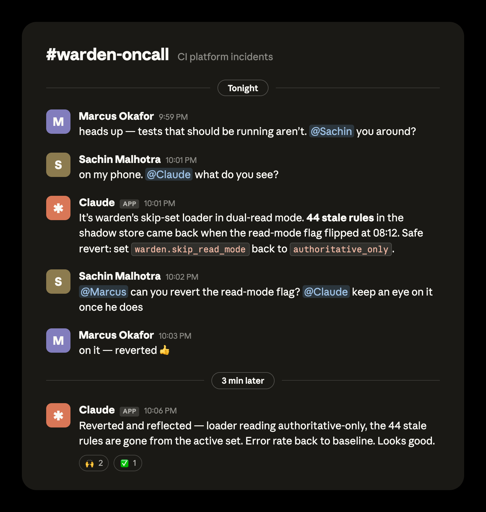
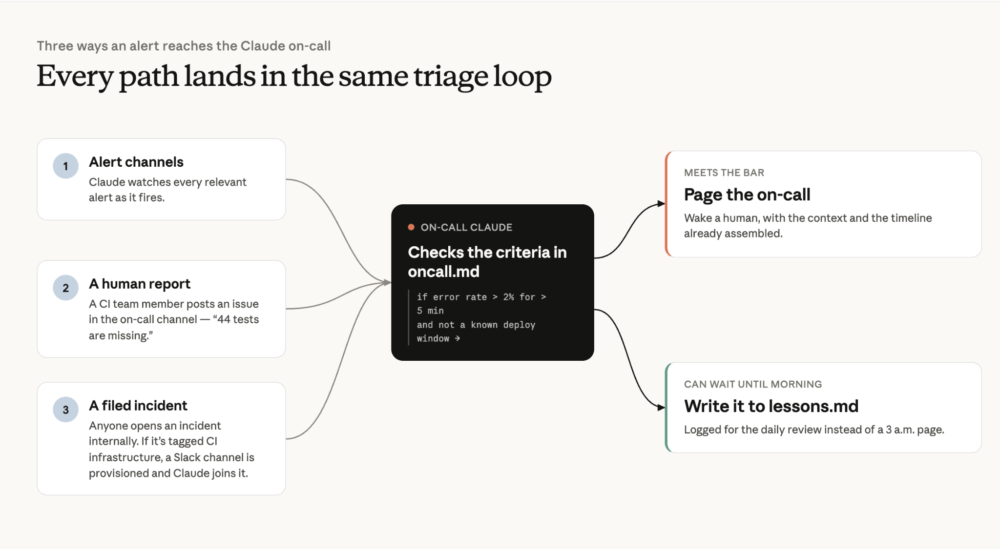
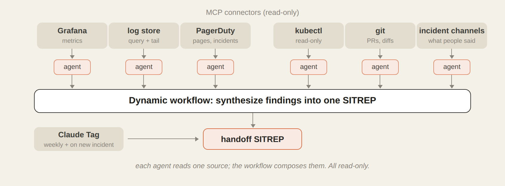
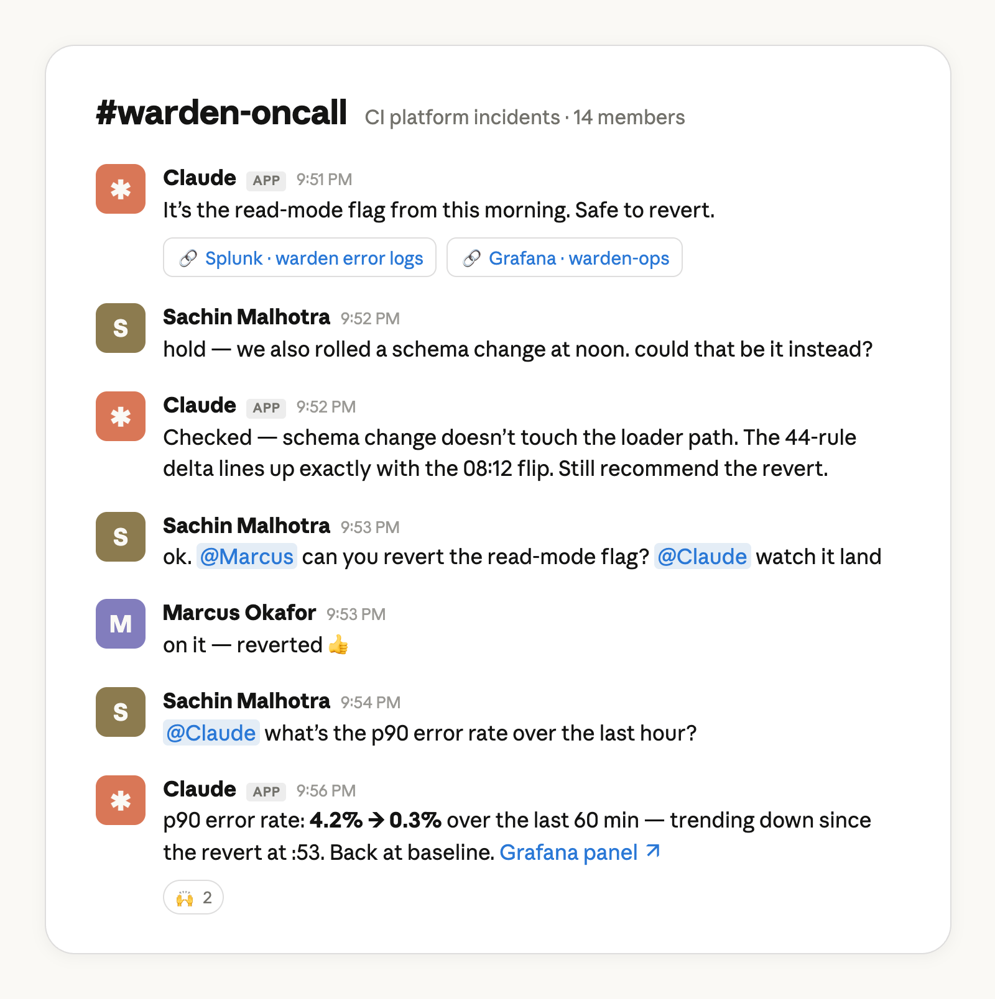
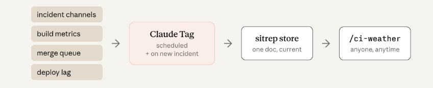

# Claude Tag：Anthropic 的 CI/CD 故障第一响应人（中英对照）

> 原文标题：How Claude Tag serves as Anthropic's first responder for CI/CD failures
> 原文链接：https://claude.com/blog/ai-ci-cd-on-call
> 原文作者：Sachin Malhotra
> 发布日期：2026-08-18
> **翻译模型：** GLM-5.3-Flash
> **评分：** ★★★☆☆（3/5，值得一看）--Claude Tag 当 CI/CD 值班 agent 的内部实践，附搭建思路
> 排版：每段英文原文在前，中文翻译紧随其后。默认收录正文主体。

---

## CI/CD 的 AI 事件响应：Anthropic 的 Claude 值班（AI incident response for CI/CD: Claude on call at Anthropic）

A few weeks ago, I was on-call and my colleague Slacked me a message at 10pm: roughly 44 tests on a new service weren't firing.

几周前，我正在值班（on-call），晚上 10 点同事在 Slack 上给我发来消息：一个新服务上大约 44 个测试没有被触发。

In the past, I would have stopped what I was doing, sat down with my laptop, sighed wearily, and began an hour-long investigate-and-fix process. But now, my workflow is entirely different: I pull in @Claude, and ask what it sees.

换作过去，我会停下手里的事，坐到笔记本电脑前，疲惫地叹口气，然后开始长达一小时的排查与修复流程。而现在，我的工作流完全不同了：我把 @Claude 拉进来，问它看到了什么。

In this case, Claude found the tests disappeared when a feature flag got turned on that morning, and also that it would be safe to revert. I asked my colleague to revert the flag. Claude pinged me on Slack 3 minutes later to verify the skip rules had indeed been removed and the error rate was back to baseline.

在这个案例里，Claude 发现这些测试是在那天早上某个 feature flag 被打开之后消失的，并且判断回退该开关是安全的。我请同事回退了这个开关。3 分钟后，Claude 在 Slack 上提醒我，确认跳过规则确实已被移除、错误率也回到了基线水平。

**Caption:** Redesigned from a real exchange for clarity.

**图注：** 为清晰起见，基于一次真实交流重新绘制。

For the last several months Claude Tag has been the on-call first responder for CI/CD failures at Anthropic. Not only has this helped with our social lives, it has given every CI incident an instant first responder: Claude authored the first situation report in every recent incident that had one, **typically publishing its first analysis within 15 minutes.**

最近几个月，Claude Tag 一直担任 Anthropic CI/CD 故障的值班第一响应人（first responder）。这不仅拯救了我们的社交生活，还为每一起 CI 事件配上了即刻到位的第一响应人：在最近每一起有首份情况报告（situation report）的事件中，第一份报告都是 Claude 撰写的，**通常会在 15 分钟内发布它的首次分析。**

In this article we'll walk through what we built and how it works so you can build it yourself and stop dreading your turn in the rotation.

在本文中，我们会完整介绍我们构建了什么以及它如何运作，这样你也可以自己搭建一套，从此不再害怕轮到自己值班。

## 我们的 Claude 值班配置（Our Claude on call setup）

Before we go into each stage of the incident response process, I'll provide a general overview of our setup here so you have the big picture in mind as we fill in the details.

在深入事件响应流程的各个阶段之前，我先在这里对我们的配置做一个总体概述，以便你在了解细节时心中有全局。

An on-call agent needs **memory** so it remembers what's been done; **connections and access** so it can investigate, understand, and act; **schedules** so it knows when to get back to work; and **instructions** so it knows what to do.

一个值班 agent 需要**记忆（memory）**，以便记住做过什么；需要**连接与权限（connections and access）**，以便调查、理解并采取行动；需要**日程（schedules）**，以便知道何时该回去干活；还需要**指令（instructions）**，以便知道该做什么。

[Claude Tag](https://claude.com/product/tag) is the backbone of our on-call agent. Claude Tag holds memory across our on-call Slack channel and the interface to provide per-turn instructions during an incident. Claude also acts in real time to events in the on-call channel and others. The scheduling of routines, or the regular actions Claude takes, happens on this channel as well with natural language prompts like "run CI handoff every Monday at 9:00am EST."

[Claude Tag](https://claude.com/product/tag) 是我们值班 agent 的骨干。Claude Tag 在我们的值班 Slack 频道中持有记忆，也是事件期间提供逐轮指令（per-turn instructions）的界面。Claude 还会实时响应值班频道及其他频道中发生的事件。例行事务的排期，也就是 Claude 定期执行的动作，同样在这个频道上完成，只需用自然语言提示，比如"每逢周一上午 9:00（美东时间）运行 CI handoff"。

[Claude Tag has its own service account](https://claude.com/blog/agent-identity-access-model) and access to the tools an Anthropic CI engineer needs such as Datadog or Grafana. This was set up one time by an administrator for the channel ([here's how](https://claude.com/docs/claude-tag/admins/setup-overview#choose-which-tools-to-connect)).

[Claude Tag 拥有自己的服务账号（service account）](https://claude.com/blog/agent-identity-access-model)，并能访问 Anthropic CI 工程师所需的工具，如 Datadog 或 Grafana。这由管理员为该频道做过一次性配置（[配置方法](https://claude.com/docs/claude-tag/admins/setup-overview#choose-which-tools-to-connect)）。

In addition to the on-call channel, we set up Claude to watch other relevant channels that also have Claude Tag as a member so it can get additional context like service alerts, configuration changes, or updates on PRs.

除了值班频道之外，我们还让 Claude 关注其他相关频道（这些频道也都添加了 Claude Tag 作为成员），这样它就能获得额外的上下文，比如服务告警、配置变更或 PR 的更新。

Standing instructions are in markdown files as skills, committed in a GitHub repository. This way multiple teammates can iterate on them and we can manage changes just like we do code. It also includes key information like routing instructions, policies, and a log of lessons learned as part of a self-improvement loop.

常设指令以 Skills 的形式写在 markdown 文件里，提交在 GitHub 仓库中。这样多位队友可以共同迭代它们，我们也能像管理代码一样管理变更。其中还包括路由指令、策略，以及作为自我改进循环（self-improvement loop）一环的经验教训日志（lessons learned log）。

This setup took us hours, not days. We created a generalized [on-call setup kit](https://github.com/anthropics/oncall-kit) in GitHub that can help get you started with a similar agent. It transforms your team's own incident history into triage playbooks and leaves you with a read-only Claude in your incident channel that diagnoses, escalates, and learns. [You can watch it run against a fictional team's history](https://github.com/anthropics/oncall-kit/blob/main/test-fixtures/RUNBOOK.md) in about ten minutes.

这套配置我们只花了几个小时，而不是几天。我们在 GitHub 上创建了一个通用的[值班配置套件（on-call setup kit）](https://github.com/anthropics/oncall-kit)，可以帮助你启动类似的 agent。它会把你们团队自己的事件历史转化为分诊手册（triage playbooks），并在事件频道里留下一个只读的 Claude，由它来诊断、上报并持续学习。[你可以观看它针对一个虚构团队的历史运行的过程](https://github.com/anthropics/oncall-kit/blob/main/test-fixtures/RUNBOOK.md)，大约只需十分钟。

To summarize the steps TL;DR fashion

以 TL;DR 的方式概括步骤：

- You'll need a  Claude Team or Claude Enterprise  plan

- 你需要一个 Claude Team 或 Claude Enterprise 套餐

- The organization owner needs to add Claude to the on call Slack channel via Claude Tag

- 组织所有者（organization owner）需要通过 Claude Tag 把 Claude 添加到值班 Slack 频道

- The org owner also needs to help connect Claude in the on-call Slack channel to the appropriate connectors, GitHub repo, and set up  Claude Code Remote .

- 组织所有者还需要协助把值班 Slack 频道中的 Claude 连接到相应的连接器（connectors）和 GitHub 仓库，并设置 Claude Code Remote。

- Add Claude to your incident channel and instruct it to monitor for incidents and immediately triage

- 把 Claude 添加到你的事件频道，并指示它监控事件并立即分诊

Now, let's dive into the details of what this transformation looks like at each step of an incident.

现在，让我们深入看看在事件的每个步骤中，这场转变具体是什么样子。

## 检测（Detection）

Claude doesn't just transform how you respond to incidents, it transforms how you detect them in the first place. Previously, there were two major failure modes for detecting incidents.

Claude 改变的不只是你响应事件的方式，它首先改变的是你发现事件的方式。过去，事件检测存在两大失效模式。

It's hard for humans to have the foresight to set perfect rules with perfect thresholds all the time. It's especially difficult when you don't have enough data to analyze traffic patterns.

人类很难总是有先见之明，设定出阈值完美的完美规则。当你没有足够的数据来分析流量模式时，这就格外困难。

To address this, we have Claude analyze the data and incoming alerts for the first few days of a new service to suggest additional rules and to fine-tune any that are overly broad or narrow.

为解决这个问题，我们让 Claude 分析新服务上线头几天的数据和涌入的告警，据此建议补充规则，并微调那些过宽或过窄的规则。

The second major failure mode for detecting incidents was alert fatigue: checking and vetting every alert that fires is tedious. However, Claude doesn't get fatigued the same way a human does.

事件检测的第二大失效模式是告警疲劳（alert fatigue）：逐一检查和甄别每条触发的告警令人厌倦。不过，Claude 不会像人类那样疲劳。

Claude monitors every relevant alert in each alert channel and goes through the criteria in the [root oncall.md file](https://github.com/anthropics/oncall-kit/blob/main/templates/ONCALL.md) to determine if it can wait until the morning or if the on-call needs a page. For example, once tuned from analyzing the data, a rule in the file could be, "If the error rate is greater than 2% for longer than 5 minutes AND it's not a known deploy window, page the on-call otherwise write it to lessons.md."

Claude 监控每个告警频道中的所有相关告警，并按照[根 oncall.md 文件](https://github.com/anthropics/oncall-kit/blob/main/templates/ONCALL.md)中的标准来判断：是可以等到早上，还是需要呼叫我（page）值班人员。例如，经过数据分析调优后，文件里的一条规则可以是："如果错误率超过 2% 且持续超过 5 分钟，并且不在已知的部署窗口内，就呼叫值班人员，否则写入 lessons.md。"

There are two other ways the Claude on-call alert process can trigger:

除此之外，还有两种方式可以触发 Claude 的值班告警流程：

- A member of the CI team can report an issue in the on-call channel, as was the case in the opening example of 44 missing tests; or

- CI 团队的成员可以在值班频道里报告问题，就像开头那个 44 个测试消失的例子一样；或者

- Anyone in the company can open an incident through an internal page. If it's marked as a CI infrastructure incident then a Slack channel is provisioned for that incident and our on-call Claude picks it up.

- 公司任何人都可以通过内部页面开一个事件（incident）。如果它被标记为 CI 基础设施事件，就会为该事件开通一个 Slack 频道，我们值班的 Claude 会接手处理。

The key takeaway here is that the alerting process is deterministic, while on-call escalation has both deterministic and agentic paths.

这里的关键要点是：告警流程是确定性的，而值班升级（escalation）则同时具有确定性和智能体式（agentic）两条路径。

## 分诊（Triage）

It's one thing to have Claude filter through the alert noise, but the real savings comes from the investigation. Claude posts its first evidence-grounded analysis a median of 14 minutes after an incident opens, and in the fastest cases names the root cause within 4 minutes in its first report.

让 Claude 过滤告警噪音是一回事，真正的节省来自调查环节。事件开启后，Claude 发布第一份基于证据的分析的中位时间是 14 分钟；在最快的案例中，它在第一份报告里就在 4 分钟内点名了根因（root cause）。

When an alert has been escalated to an incident, Claude is often ready in our Slack channel with a hypothesis grounded in evidence that we can review. Claude Tag kicks off a [dynamic workflow](https://claude.com/blog/a-harness-for-every-task-dynamic-workflows-in-claude-code) with an orchestration agent that spins up executor subagents to investigate each dependency and source of truth.

当一条告警被升级为事件时，Claude 通常已经在我们的 Slack 频道里准备好了一个有证据支撑、可供我们审阅的假设。Claude Tag 会启动一个[动态工作流（dynamic workflow）](https://claude.com/blog/a-harness-for-every-task-dynamic-workflows-in-claude-code)，由一个编排 agent（orchestration agent）拉起若干执行子代理（executor subagents），分别调查每一个依赖和数据源（source of truth）。

For us that's Grafana, our log store, PagerDuty, GitHub, Kubernetes and Slack incident channels—all wired up via [MCP Connectors](https://code.claude.com/docs/en/mcp). Claude can chase multiple leads in parallel, helping to reduce MTTR (mean time to resolution).

对我们来说，这些数据源是 Grafana、我们的日志存储、PagerDuty、GitHub、Kubernetes 以及 Slack 事件频道--全部通过 [MCP Connectors](https://code.claude.com/docs/en/mcp) 接入。Claude 可以并行追查多条线索，有助于缩短 MTTR（平均解决时间，mean time to resolution）。

Executors report the findings back to the orchestration agent which synthesizes and surfaces the information in a coherent SITREP.

执行子代理把发现汇报给编排 agent，后者将信息综合整理，以一份条理清晰的情况报告（SITREP）呈现出来。

The orchestrator and executor agents aren't searching blind. They are guided by an investigation skill with [more detailed reference markdown files for each bug class](https://github.com/anthropics/oncall-kit/tree/main/skills/triage).

编排 agent 和执行 agent 并不是在盲目搜索。它们由一个调查 Skill（investigation skill）指引，后者带有[针对每一类 bug 的更详细的参考 markdown 文件](https://github.com/anthropics/oncall-kit/tree/main/skills/triage)。

For example, a 617 line investigation skill for shadow divergence bugs encodes every step I take during a typical investigation. I built it by troubleshooting with Claude turn-by-turn during one of the incidents and then had it create the file from that experience.

例如，一个针对影子分歧（shadow divergence）bug 的 617 行调查 Skill，记录了我在一次典型调查中采取的每一个步骤。它是我趁其中一次事件与 Claude 逐轮排障时构建的，然后我让 Claude 根据这段经历创建了这个文件。

Lessons.md also guides Claude's troubleshooting. This markdown file is a running log of every incident we've resolved: what happened, the root cause, the fix, and the gotcha worth remembering. Claude appends to it on its own automatically. Every new investigation starts by reading it, so Claude's first hypothesis starts with what has happened recently.

lessons.md 也在指引 Claude 的排障。这个 markdown 文件是我们解决过的每一起事件的持续日志：发生了什么、根因是什么、怎么修复的，以及值得记住的坑。Claude 会自动往里追加内容。每一次新的调查都从读它开始，所以 Claude 的第一个假设就是从最近发生的事情出发的。

If the same pattern shows up enough times, we promote it into the investigation skill itself. My favorite entry is one Claude wrote about me. I'd made an assumption from a config file before checking the metrics, and the lessons.md file now states, "query the data first, then theorize. Config tells you what could go wrong; metrics tell you what did."

如果同一个模式出现的次数足够多，我们就把它提升进调查 Skill 本身。我最喜欢的一条，是 Claude 写关于我的。我曾先根据配置文件做了假设，然后才去查指标，现在 lessons.md 里写着："先查数据，再做推论。配置告诉你可能出什么问题；指标告诉你实际出了什么问题。"

Even with these tools and context, Claude doesn't always get it right the first time. Human intuition and experience matter. Claude Tag allows the team to troubleshoot incidents in multi-player mode. Either of us can steer the investigation or add a hypothesis in real-time, together.

即便有这些工具和上下文，Claude 也不会每次都第一次就做对。人类的直觉和经验依然重要。Claude Tag 让团队能以多人模式共同排障：我们任何人都可以实时引导调查方向或补充假设，一起协作。

**Caption:** Recreated from a real conversation for clarity.

**图注：** 为清晰起见，基于一次真实对话重现。

## 解决（Resolution）

If Claude can escalate and troubleshoot alerts, can it fix them too? The answer to this question will vary from team to team, but here's how we do it.

如果 Claude 能升级和排查告警，它也能修复它们吗？这个问题的答案因团队而异，但我们是这样做的。

Most deployments within our team happen behind a feature flag. I have created a separate agent in Claude Code, with my permissions, capable of progressive deployment behind each of these feature flags.

我们团队的大多数部署都在 feature flag 之后进行。我在 Claude Code 里创建了一个单独的 agent，使用我的权限，能够针对这些功能开关做渐进式部署（progressive deployment）。

The first stage of our rollout process usually involves Claude managing canary traffic, monitoring for issues, and automatically ramping a given feature flag up or down. This could be an entirely separate article, so I won't go into more detail here.

我们发布流程的第一阶段通常包括：Claude 管理金丝雀流量（canary traffic）、监控问题，并自动调高或调低某个 feature flag。这本身足可以写成另一篇文章，所以这里不再展开。

Other resolution paths that Claude Tag helps my team with are:

Claude Tag 还帮助我的团队走以下解决路径：

- Letting us know if we need to drain or cordon off certain sections of our Kubernetes cluster;.

- 告诉我们是否需要排空（drain）或隔离（cordon）Kubernetes 集群的某些部分；

- Giving us instructions on how to scale up some of our infrastructure in responses to demand-surges (this is rare but it's very helpful when Claude comes back with exactly what we can do for mitigation); and, most frequently,

- 在需求激增时给我们如何扩容部分基础设施的指引（这种情况很少见，但当 Claude 准确带回我们能做什么来缓解时，非常有用）；以及最常见的一种：

- Fixes in the form of a PR that the on-call can review, merge, and then deploy for a swift resolution.

- 以 PR 形式提交的修复，值班人员可以审阅、合并然后部署，快速解决问题。

## 验证、沟通与交接（Verification, communication, and handoff）

Claude uses many of the same MCP Connectors and tools that it did for its investigation to verify the fix worked as intended. As part of the standing instructions in oncall.md, it writes a post-mortem to lessons.md and for the handoff SITREP.

Claude 用调查时用过的许多同一批 MCP Connectors 和工具来验证修复是否达到预期。作为 oncall.md 常设指令的一部分，它会把事后复盘（post-mortem）写入 lessons.md，并生成交接用的 SITREP。

To communicate the full picture across multiple incidents, we created an agent called ci-weather. It compiles information from each incident Slack channel, build metrics, merge queue stats, and deploy lag. Then it posts a newsroom-style report to one public channel anyone in the company can read. Now, our engineers can reference that channel rather than pinging us when they are trying to determine if they should hold their merges or if they're trying to answer "what's wrong with CI?".

为了在多个事件之间传递全貌，我们创建了一个名为 ci-weather 的 agent。它汇总来自每个事件 Slack 频道的信息、构建指标、合并队列（merge queue）统计和部署延迟，然后把一份新闻编辑室风格的报告发布到一个公司任何人都能读取的公开频道。现在，工程师们在判断该不该暂缓合并，或者想回答"CI 到底怎么了"的时候，可以直接查看那个频道，而不必来 ping 我们。

One honest note: we needed to iterate the report format several times. Claude can one-shot a skill that generates a status report, but what makes it readable is team-specific taste. It's human communication, not plumbing.

说句实在话：我们反复迭代了好几版报告格式。Claude 可以一次性（one-shot）生成一个产出状态报告的 Skill，但让报告真正可读的，是团队特有的品味。这是人与人的沟通，不是管道工程。

Finally, while Claude keeps a journal for itself in lessons.md, we also want to produce handoff reports for humans as well every Monday. Claude produces daily and weekly summaries so one member of the team can pick up where the other left off.

最后，虽然 Claude 在 lessons.md 里为自己记日志，我们也希望每周一为人类产出交接报告。Claude 会生成每日和每周摘要，让团队里一位成员能够接着另一位成员的进度继续。

## 从监控事件到监控事件响应系统（From monitoring incidents to monitoring an incident response system）

Our software engineers on average [ship 8x as much code per quarter](https://www.anthropic.com/institute/recursive-self-improvement) as they did from 2021 to 2025. And while we have kept the quality bar high (every PR has a named human owner, every change requires approval to merge, every change goes through the same set of CI gates), the only way to keep up with agentic coding is agentic CI.

我们的软件工程师每个季度平均[交付的代码量是 2021 到 2025 年的 8 倍](https://www.anthropic.com/institute/recursive-self-improvement)。虽然我们把质量门槛维持在高位（每个 PR 都有具名的人类负责人，每次变更都需要批准才能合并，每次变更都要经过同一套 CI 门槛），但跟上智能体式编程（agentic coding）步伐的唯一办法，就是智能体式 CI（agentic CI）。

Claude has absorbed the tedious parts of my job, the after-hours disruptions and the incident comms, while allowing me to focus on the medium and long term architectural changes that truly move the needle for system reliability.

Claude 吸收了我工作中繁琐的部分，那些下班后的打扰和事件沟通，同时让我能专注于中长期架构改动，那才是真正能推动系统可靠性前进的东西。

The best part of what we have built is that it doesn't feel scattered. Our on-call processes live in Slack, but now Claude has joined the channel.

我们这套东西最好的地方在于，它并不让人觉得散乱。我们的值班流程本来就活在 Slack 里，而现在，Claude 也加入了频道。

How to get started:

如何开始：

- You'll need a  Claude Team or Claude Enterprise  plan

- 你需要一个 Claude Team 或 Claude Enterprise 套餐

- The organization owner needs to add Claude to the on call Slack channel via Claude Tag

- 组织所有者需要通过 Claude Tag 把 Claude 添加到值班 Slack 频道

- The org owner also needs to help connect Claude in the on-call Slack channel to the appropriate connectors, GitHub repo, and set up  Claude Code Remote .

- 组织所有者还需要协助把值班 Slack 频道中的 Claude 连接到相应的连接器和 GitHub 仓库，并设置 Claude Code Remote。

- Add Claude to your incident channel and instruct it to monitor for incidents and immediately triage

- 把 Claude 添加到你的事件频道，并指示它监控事件并立即分诊

*This article was written by Sachin Malhotra, technical member of Anthropic staff with contributions from Michael Segner, Anthropic staff.*

*本文由 Anthropic 技术成员（technical member of staff）Sachin Malhotra 撰写，Michael Segner（Anthropic 技术成员）亦有贡献。*
