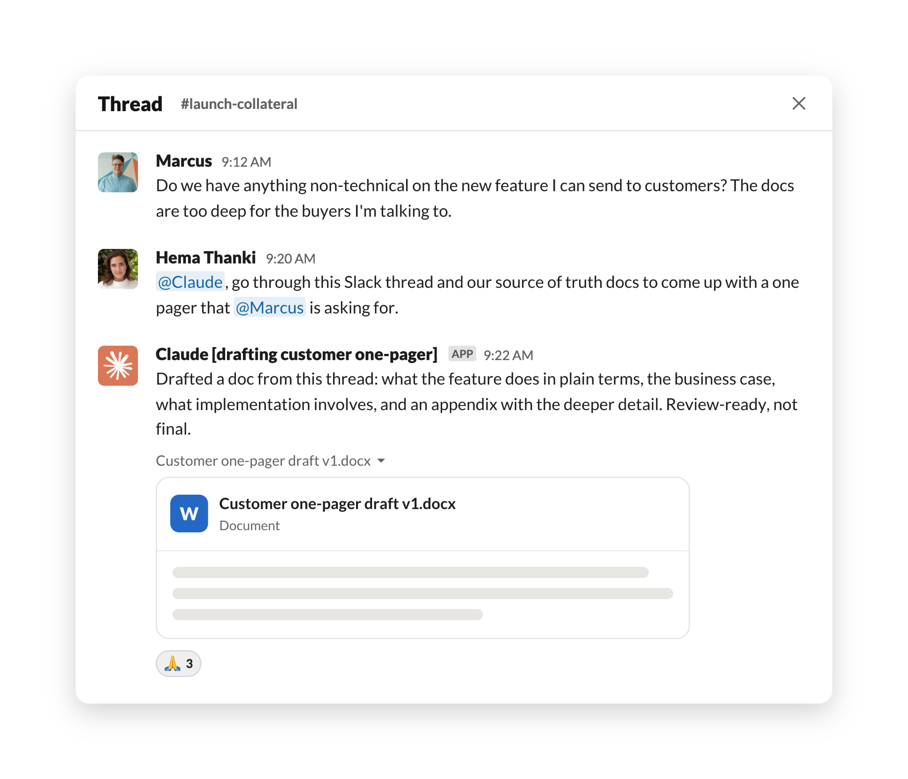
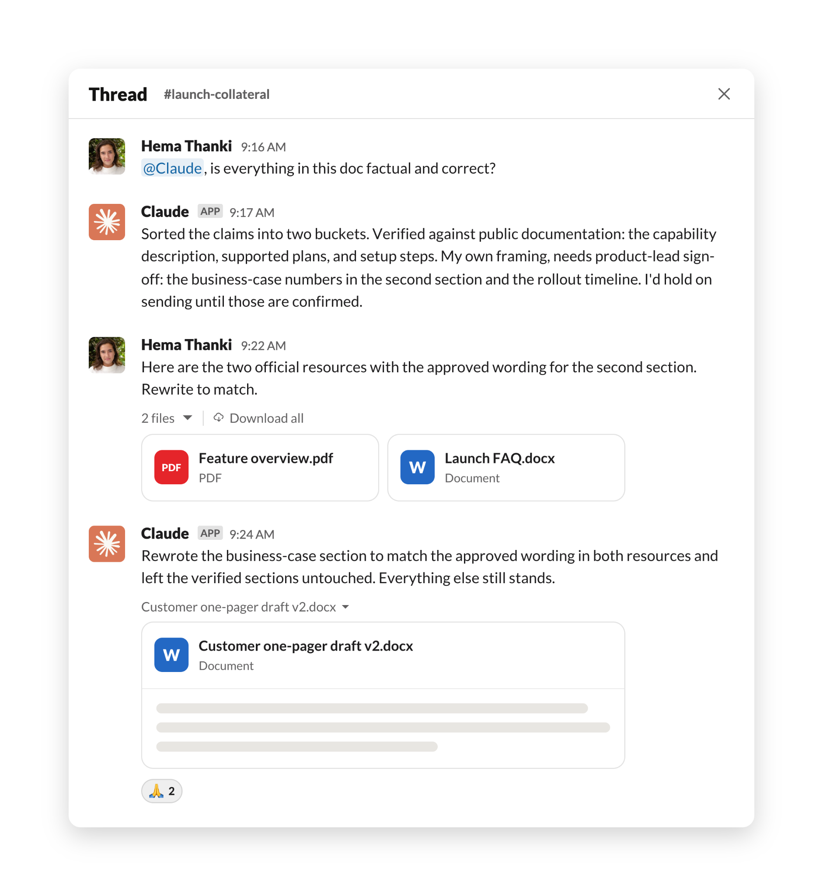
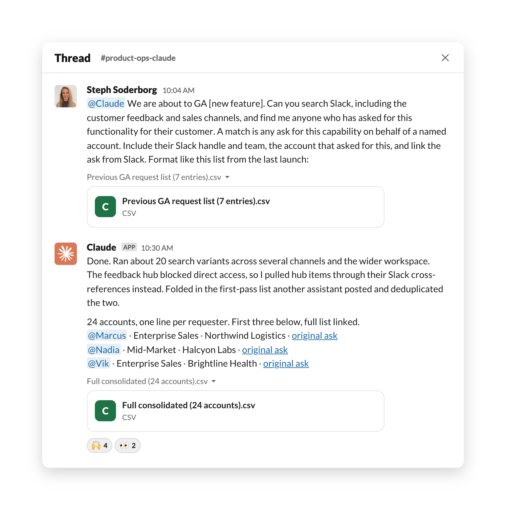
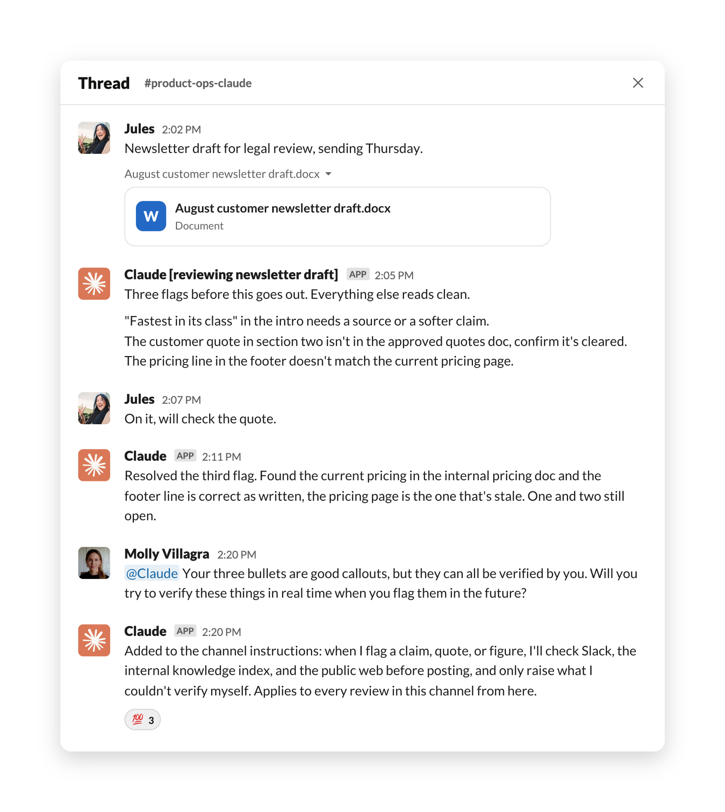

# Anthropic 员工如何使用 Claude Tag（中英对照）

> 原文标题：How Anthropic employees use Claude Tag
> 原文链接：https://claude.com/blog/how-anthropic-employees-use-claude-tag
> 原文作者：Anthropic
> 发布日期：2026-08-28
> **翻译模型：** GLM-5.3-Flash
> **评分：** ★★★☆☆—— 内部全员用例集，场景参考性强但组织偏松散
> 排版：每段英文原文在前，中文翻译紧随其后。默认收录正文主体。

Claude Tag brings Claude into chat tools like Slack, where you can tag @Claude in a thread the way you would a colleague and it picks up the context of the conversation, completes the task, and posts the answer or results back in the thread. It can also follow conversations and draw on available context, its memory, and standing instructions it's been given to decide when to participate in the chat. Over the past several months, teams at Anthropic have been using Claude Tag to self-serve data analysis in shared channels, work through support tickets, or help find the root cause of tricky bugs.

Claude Tag（Claude 标签功能）把 Claude 带进了 Slack 这类聊天工具：你可以像 @ 一位同事那样在讨论串里 @ Claude，它会接住对话上下文、完成任务，然后把答案或结果发回讨论串。它还能持续跟进对话，并借助可获得上下文、自身记忆以及被赋予的固定指令（standing instructions）来决定何时参与聊天。过去几个月里，Anthropic 的多个团队一直在用 Claude Tag 在共享频道里自助完成数据分析、处理支持工单，或帮忙定位棘手 bug 的根本原因。

We've assembled more than a dozen use case examples for Claude Tag inspired by our work at Anthropic, along with specific prompts and setup instructions. In this post, we highlight three ways Anthropic employees are making their workflows and processes more efficient with Claude Tag, with the prompts they used, so you can borrow or adapt the ones that best fit your work.

我们从 Anthropic 的实际工作中整理出了十多个 Claude Tag 用例，并附上具体的 prompt（提示词）与配置说明。本文重点介绍 Anthropic 员工用 Claude Tag 提升工作流与流程效率的三种方式，并附上他们使用的 prompt，方便你借用或改造成最适合自己工作的版本。

### 把 Slack 讨论串变成一份可供评审的文档（Turning a Slack thread into a polished document）

During a recent feature launch, a sales rep asked for non-technical collateral that explains how the feature works to customers and prospects; Hema Thanki, on the product marketing team, turned the Slack thread that followed into a review-ready document in 45 minutes.

在最近一次功能发布期间，一位销售希望有一份面向客户与潜在客户的非技术版说明材料；产品营销团队的 Hema Thanki 把随后展开的 Slack 讨论串在 45 分钟内变成了一份可供评审的文档。

That Slack thread ran to more than 15 messages, with multiple people chiming in with suggestions or additional asks, and a touch of tension around what was actually needed and whether the existing technical material was enough. Rather than attempting to clarify ambiguity, Hema tagged Claude in the thread:

这条 Slack 讨论串累积了超过 15 条消息，多人插话提出建议或追加要求，围绕“到底需要什么、现有技术材料够不够”还隐约有些紧张气氛。Hema 没有去逐一澄清这些模糊之处，而是直接在讨论串里 @ 了 Claude：

> @Claude, go through this Slack thread and come up with a one pager that [the requester] is asking for.

> @Claude，把这条 Slack 讨论串过一遍，整理出 [需求方] 要的一页纸文档（one pager）。

Claude generated a two-page draft in about two minutes, covering what the feature does in plain terms, the business case for it, what implementation involves, and an appendix with more detailed information.

Claude 在大约两分钟内生成了一份两页的草稿，涵盖该功能的通俗说明、它的商业价值（business case）、实施落地涉及哪些工作，以及一个包含更多细节的附录。

Next, Hema asked Claude to verify its responses:

接着，Hema 让 Claude 核实它给出的内容：

> @Claude, is everything in this doc factual and correct?

> @Claude，这份文档里的所有内容都属实且正确吗？

Claude sorted the document's claims into ones verified against public documentation and those that were its own framing, which it flagged for product-lead sign-off. Hema supplied two official resources with relevant information, and Claude rewrote one section to match the approved wording in those resources.

Claude 把文档中的论断分成两类：一类已对照公开文档核实，另一类是它自己的表述——后者被标记出来，等待产品负责人签字确认。Hema 提供了两份包含相关信息的官方资料，Claude 随即重写了其中一节，使其与这些资料中经过认可的措辞保持一致。

At that point, Hema noticed the truncated thread had skewed the framing, so she pasted in the fuller context. She went back and forth with Claude for a total of four versions. About 45 minutes after the first ask, she shared the document with the feature's product lead for review. Rather than spend hours researching and drafting the document, Hema's time went to challenging accuracy, supplying sources, and deciding what information to include, all tasks that required human judgment and made the customer asset even stronger.

这时，Hema 发现被截断的讨论串让文档的叙事角度出现了偏差，于是她把更完整的上下文粘贴了进去。她与 Claude 来回迭代，前后共出了四版。距第一次提出需求约 45 分钟后，她把文档分享给该功能的产品负责人评审。Hema 没有把时间花在研究和起草上，而是用于质疑准确性、补充来源、决定收录哪些信息——这些都需要人的判断，也让这份面向客户的材料更加扎实。

Beyond generating briefs from Slack threads, Hema also uses Claude Tag across her day to day work. She keeps a private Slack channel with Claude where she makes requests in separate threads, @-mentioning Claude the way she'd tag a colleague. In that channel, Claude reads whatever she pastes or attaches, searches the Slack workspace and public documentation, and works in the background, posting a progress checklist it updates as it goes. Claude's access is deliberately scoped: it only works from the channels and documents it has been granted access to, and will let her know when it does not have the access to these resources.

除了从 Slack 讨论串生成简报，Hema 在日常工作中也随处使用 Claude Tag。她专门建了一个与 Claude 的私人 Slack 频道，在不同讨论串里分别提出请求，像 @ 同事那样 @ 提及（@-mention）Claude。在这个频道里，Claude 会读取她粘贴或附上的任何内容，检索 Slack 工作区和公开文档，在后台工作的同时发出一份进度清单并随进展持续更新。Claude 的访问权限被刻意收窄：它只在被授权的频道和文档范围内工作，如果无法访问这些资源，会主动告知她。

### 整合并跟进散落在各 Slack 频道的需求（Consolidating and following up on requests scattered throughout Slack channels）

When a new feature launches, sales reps typically keep track and communicate it to customers they support who have requested that feature. Those requests are communicated via Slack or in a product feedback hub, and can be scattered across months' worth of history. Steph Soderborg, on the product strategy and operations team, was able to consolidate all asks related to an upcoming feature and directly notify each rep who had asked for it on behalf of a customer, in about 26 minutes.

新功能上线时，销售通常会记下相关信息，并告知自己支持的、曾提出过该功能的客户。这些需求通过 Slack 或产品反馈中心（product feedback hub）传达，可能散落在长达数月的历史记录中。产品战略与运营团队的 Steph Soderborg 用了约 26 分钟，就汇总起与一个即将上线功能相关的全部需求，并直接逐一通知了替客户提出该需求的每位销售。

To start, Steph messaged Claude with the search targets, a one-sentence definition of a match, and a pasted example of the output she wanted, a seven-entry list from a previous launch:

首先，Steph 给 Claude 发消息，说明搜索目标、用一句话定义“什么算命中”，并粘贴了一个她想要的输出示例——来自上一次功能发布的一份七条目的清单：

> @Claude We are about to GA [a new feature]. Can you search Slack ... find me anyone who has asked for this functionality for their customer ... include their Slack handle and team, the account that asked for this, and link the ask from Slack.

> @Claude 我们即将 GA（正式全量发布）[某个新功能]。你能在 Slack 里搜索一下……帮我找出所有曾为自己的客户提出过这一功能的请求……请包含对方的 Slack 用户名和所在团队、提出该需求的客户账户，并附上 Slack 中该需求的原文链接。

Claude ran about 20 search variants across several channels and the wider workspace. The product-feedback hub blocked its direct access, so it surfaced hub items through Slack cross-references instead, and it folded in a first-pass list another internal assistant had posted, deduplicating the two. The consolidated list came back in about 26 minutes and included roughly 24 accounts, with one line per requester containing their Slack handle, team, account, and a link to the original ask.

Claude 在多个频道及整个工作区范围内运行了约 20 种搜索变体。产品反馈中心阻断了它的直接访问，于是它改用 Slack 中的交叉引用来带出反馈中心的相关条目，并把另一位内部助手发布过的一份初筛清单也并入其中，对两份结果做了去重。汇总清单在约 26 分钟后返回，共包含约 24 个客户账户，每位需求提出者占一行，内容含其 Slack 用户名、团队、账户，以及原始需求的链接。

Steph then put Claude on a bigger consolidation job that she wouldn't have had the bandwidth to do on her own: she wanted a picture of every product problem enterprise customers had reported in the previous week, including what was broken, what was already fixed, and which, if any, reports pointed at the same underlying issue. She told Claude to read all Slack channels covering incident, escalation, support, and product-feedback, and roughly 50 minutes later Claude posted a write-up, organized by product area, that included 23 issues that were still open and 14 resolved ones, condensed from about 120 raw findings. Each issue included a summary and a link to the source thread. Steph then asked Claude to check its work, and it surfaced 15 more issues.

随后，Steph 又交给 Claude 一项她靠自己的带宽根本无法完成的大规模汇总任务：她想要一份全景图，覆盖企业客户在上一周报告的每一个产品问题——包括哪里出了故障、哪些已经修复，以及（如果存在）哪些报告指向同一个底层问题。她让 Claude 通读覆盖事故（incident）、升级（escalation）、支持与产品反馈的所有 Slack 频道，大约 50 分钟后，Claude 发出了一份按产品领域组织的报告，收录 23 个仍未解决的问题和 14 个已解决的问题——由约 120 条原始发现浓缩而来。每个问题都附有摘要和来源讨论串的链接。接着 Steph 让 Claude 自查，它又找出了 15 个问题。

Steph estimates that combing through, analyzing, and synthesizing this much information would have taken her at least a week of full-time work, or would never have gotten done. Instead, with Claude Tag, she took a few minutes to shape up her ask, and Claude worked in the background.

Steph 估计，梳理、分析并综合这么多信息，至少需要她一周的全职工作量，甚至根本不可能完成。而借助 Claude Tag，她只花了几分钟把自己的需求描述清楚，剩下的工作都由 Claude 在后台完成。

Steph also works with Claude in a private channel, sending full instructions up front that include where to search, what counts as a match, and usually an example of the output format. Claude searches the workspace, reads the channels it has been invited to, and posts progress updates as it works. When the feedback hub blocks access, Claude attempts to gather related or relevant information via accessible docs and channels, or even asks for access to these channels.

Steph 同样在一个私人频道里与 Claude 协作，预先发出完整的指令，包括去哪里搜索、什么算命中，通常还附一个输出格式示例。Claude 会检索工作区、阅读它被邀请加入的频道，并在工作过程中发布进度更新。当反馈中心阻断访问时，Claude 会尝试通过可访问的文档和频道收集相关或相近的信息，甚至会主动申请这些频道的访问权限。

### 加速法务文档审核（Expediting legal document reviews）

Anthropic's legal team reviews each blog, landing page, email, or any other collateral before it's publicly released. In the days leading up to a product launch, the marketing team can queue up dozens of different assets for review, on a tight deadline. That's on top of all other marketing collateral flowing through the review queue, ranging from one-paragraph social copy to 2,500-word blog drafts, planning documents with a dozen-plus tabs, and email series with multiple variants across multiple touchpoints. Molly Villagra, a product counsel on the legal team, created a dedicated Slack channel where Claude Tag examines every marketing asset first, compressing marketing legal review turnaround time from a day (or longer) to 30 minutes per asset.

Anthropic 的法务团队要在每篇博客、落地页、邮件或其他任何物料公开发布之前进行审核。产品发布前的几天里，营销团队可能会有几十份不同的物料在紧迫的截止时间前排队等待审核。这还不包括审核队列里其他源源不断的营销物料——从一段话的社交媒体文案，到 2500 字的博客草稿、带十几个标签页的规划文档，以及跨多个触点、含多个变体的邮件系列。法务团队的产品法律顾问（product counsel）Molly Villagra 建了一个专门的 Slack 频道，让 Claude Tag 先行审查每一份营销物料，把营销法务审核的周转时间从一天（或更长）压缩到每份物料 30 分钟。

To request legal review, marketers post a document link in the Slack channel, where Molly, who has no engineering background, has set up specific rules and instructions for Claude. Not only can Claude spot issues for legal (like unsubstantiated marketing claims), but it can also help check factual statements in the marketing content because it has access to the company Slack, an internal knowledge index, and the public web. If there are flags, Claude lists those with specific instructions on how to address them and works directly with the requester to do so. For remaining issues that need legal sign-off, Claude tags the appropriate product counsel, who can quickly review the flagged statements.

营销人员要申请法务审核时，只需在该 Slack 频道里贴出文档链接——没有任何工程背景的 Molly 已在这里为 Claude 设定了具体的规则和指令。Claude 不仅能为法务发现潜在问题（比如缺乏依据的营销宣称），还能帮忙核对营销内容中的事实性陈述，因为它可以访问公司 Slack、一个内部知识索引以及公开网络。如果标记出问题，Claude 会将其列出并附上如何处理的具体说明，然后直接与提出请求的人协作解决。对于剩余需要法务签字确认的问题，Claude 会 @ 相应的产品法律顾问，后者可以快速复审被标记的表述。

In a recent newsletter review, for example, Claude flagged three key items, then just minutes later, unprompted, resolved one of them after finding the information it needed in internal documents. Molly asked it to make this the default by tagging @Claude in the marketing legal review channel:

例如在最近一次新闻通讯（newsletter）审核中，Claude 标记了三个关键事项，而仅仅几分钟后，它就在没有收到任何指令的情况下，在内部文档中找到了所需信息并自行解决了其中一项。Molly 在营销法务审核频道里 @ 了 Claude，请它把这种做法固化为默认行为：

> Your three bullets are good callouts, but they can all be verified by you. Will you try to verify these things in real time when you flag them in the future?

> 你提出的三个要点都是很好的提醒，但它们其实你都能自己核实。以后你标记这类问题时，能不能尝试实时完成核实？

At Molly's request, Claude Tag added this new instruction to its set of instructions to follow in all future reviews, allowing it to improve with channel feedback in real time.

应 Molly 的要求，Claude Tag 把这条新指令加入了它在今后所有审核中都要遵循的指令集，从而能够根据频道反馈实时改进。

This feedback loop inspired Molly to create a new routine, instructing Claude to review the week's counsel feedback each Friday and propose an update to the shared instructions for her approval.

这一反馈循环还启发 Molly 建立了新的例行动作：让 Claude 每周五复盘当周法律顾问的反馈，并就共享指令的更新提出建议，交由她审批。

Each of the workflows we've shared above is saving Anthropic employees hours or days of work, and enables projects that simply wouldn't have happened before. What workflows or projects would your team hand over to Claude first?

上面分享的每一个工作流都在为 Anthropic 员工节省数小时乃至数天的工作量，并催生了一些过去根本不可能开展的项目。你的团队会把哪些工作流或项目最先交给 Claude？

Claude Tag, currently in public beta, is available on Team and Enterprise plans, on Anthropic's first-party service. Set it up for your workspace at claude.ai/admin-settings/claude-tag or learn more at claude.com/docs/claude-tag.

Claude Tag 目前处于公开测试（public beta）阶段，面向 Anthropic 第一方服务上的 Team 和 Enterprise 套餐开放。你可以在 claude.ai/admin-settings/claude-tag 为自己的工作区进行配置，或访问 claude.com/docs/claude-tag 了解更多。

Turnaround times in this post reflect individual employees' experiences with specific tasks; results vary with the task, the tools connected, and how Claude Tag is set up.

文中的周转时间反映的是个别员工在特定任务上的体验；实际结果会因任务本身、所连接的工具以及 Claude Tag 的配置方式而异。

All images have been generated to illustrate use cases and do not contain real names or information.

文中所有图片均用于演示用例，不含真实姓名或信息。

> 注：本文为官网导读，完整指南见原文链接。
