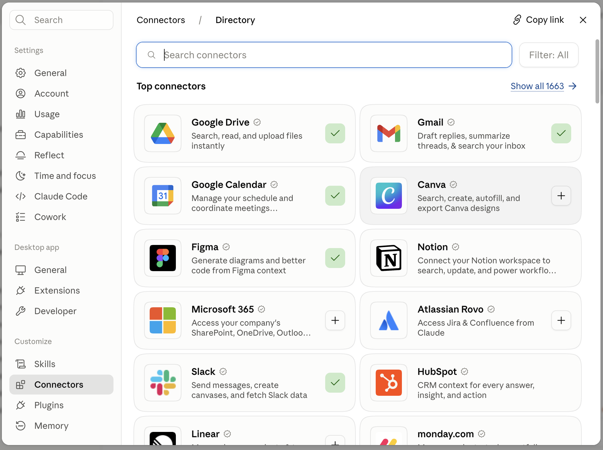
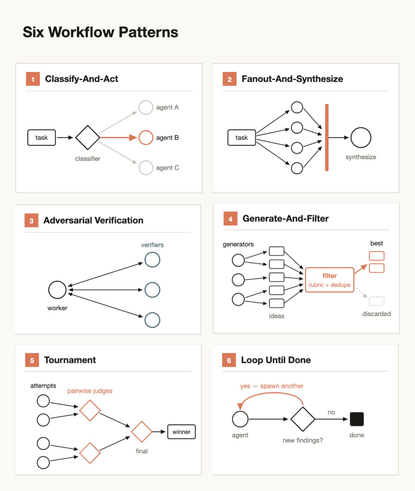
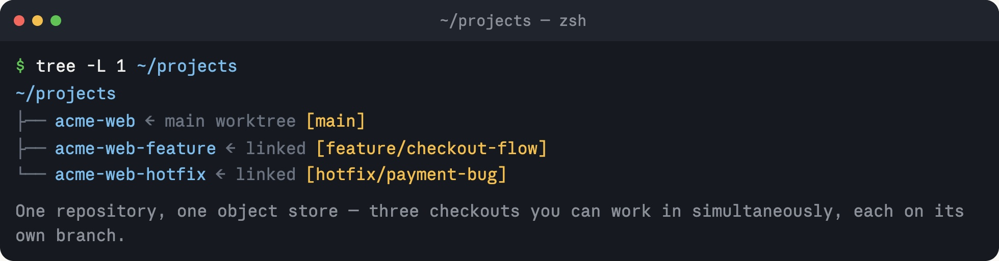

# Claude Code 初创公司指南：五条规则（中英对照）

> 原文标题：The Claude Code Guide For Startups
> 原文链接：https://claude.com/blog/claude-code-guide-for-startups
> 原文作者：Michael Segner
> 发布日期：2026-08-20
> **翻译模型：** GLM-5.3-Flash
> **评分：** ★★★☆☆（3/5，值得一看）--五条规则的实战指引，含十余家初创公司一手案例
> 排版：每段英文原文在前，中文翻译紧随其后。默认收录正文主体。

## 工作在前沿的 AI 原生公司（AI natives working at the frontier）

If you want to take a peek at the future of work, ask startups how they are operating today. So we did.

要想一窥未来工作方式的模样，去问初创公司今天是如何运转的。我们正是这么做的。

We spoke with more than a dozen fast-growing startups about how they use agentic coding tools to build products and scale their companies. These startups are changing the rules of who gets to build, what gets scrapped, and how to create a flywheel between how you build and what you build.

我们与十余家快速增长的初创公司交流，了解他们如何使用 agentic coding（代理式编程）工具来构建产品、扩展公司规模。这些初创公司正在改写规则：谁来构建、什么该被抛弃，以及如何在"如何构建"与"构建什么"之间创造飞轮（flywheel）效应。

And they are shipping like organizations ten times their size.

而且，他们的交付速度堪比体量十倍于己的组织。

- **ClickHouse**：30% more features shipped（功能交付量多 30%）

- **Omni**：2–3x engineering productivity（工程效率提升 2–3 倍）

- **Clay**：100% of bug triage automated（Bug 分流 100% 自动化）

- **Artemis Security**：6,000+ PRs a week（每周交付 6,000+ 个 PR）

In this guide, we'll dive into the unique deployments of these organizations to learn the rules they follow to ship fast and maintain their competitive advantage.

在本指南中，我们将深入这些组织各自独特的部署实践，学习他们遵循哪些规则来实现快速交付并保持竞争优势。

In doing so we'll also start to glean an answer to the question: what would it look like if an organization built their product development lifecycle with Claude Code from the ground up?

在此过程中，我们也将开始探寻一个问题的答案：如果一个组织从零开始用 Claude Code 搭建自己的产品开发生命周期，会是什么样子？

**The five rules**

**五条规则**

1. Everyone ships

2. Automate the tedium

3. Trust, but verify

4. Build for rebuilding

5. Prototype, dogfood, productionize

1. 人人出货（Everyone ships）

2. 自动化繁琐工作（Automate the tedium）

3. 信任，但要验证（Trust, but verify）

4. 为重建而构建（Build for rebuilding）

5. 原型、内部试用、产品化（Prototype, dogfood, productionize）

**Featuring founder insights from**

**收录以下公司创始人的洞见**

- Artemis Security

- Cainex

- Clay

- ClickHouse

- Cognition

- Commure

- Crosby

- Emergent

- Harvey

- Heidi

- Higgsfield

- Omni

- Parahelp

- Translucent

- Zingage

- Artemis Security

- Cainex

- Clay

- ClickHouse

- Cognition

- Commure

- Crosby

- Emergent

- Harvey

- Heidi

- Higgsfield

- Omni

- Parahelp

- Translucent

- Zingage

**Tip:** Only interested in the practical next steps? We've put a checklist at the end of this guide that consolidates the key technical tips contained in each chapter.

**提示：** 只关心实操步骤？我们在本指南末尾准备了一份清单，汇总了每一章包含的关键技术技巧。

## 规则 1：人人出货（Everyone ships）

Agentic coding lowers the barrier to entry, so the person who understands the problem can ship the first version of the fix.

Agentic coding 降低了准入门槛，因此最理解问题的人就能交付第一版修复。

Agentic coding lowers the barrier to entry for non-technical employees to build products. With Claude Code, you can create functional features without being fluent in a coding language or how to use an IDE.

Agentic coding 降低了非技术员工构建产品的门槛。借助 Claude Code，你无需精通某门编程语言或 IDE 的使用，也能创建可用的功能。

> "Not only were engineers shipping much more, but non-technical people (like me) were also suddenly shipping UI changes and other product improvements."
>
> "不仅工程师的交付量大增，非技术人员（比如我）也突然能够交付 UI 改动和其他产品改进了。"
>
> -- Mads Lunau Liechti · co-founder, Parahelp（Parahelp 联合创始人）

For startup founders this has obvious advantages. For one, they don't have the headcount of their larger competitors so it's "all hands on deck." But it's not just raw capacity that founders are after–these non-technical members of the team bring domain expertise as well.

对初创公司创始人来说，这优势显而易见。其一，他们没有大型竞争对手那样的人员编制，所以必须"全员上阵"。但创始人们追求的不只是单纯的人力--这些非技术团队成员还能带来领域专业知识。

> "Claude Code changed what it meant to be a lawyer at Crosby. The lawyers have the best product insights, because they are the users. It's been amazing to watch them cook."
>
> "Claude Code 改变了在 Crosby 当律师意味着什么。律师们拥有最好的产品洞见，因为他们就是用户。看着他们大显身手真是太棒了。"
>
> -- Ryan Daniels · co-founder and CEO, Crosby（Crosby 联合创始人兼 CEO）

We heard the same thing from Dr. Thomas Kelly, co-founder and CEO of Heidi.

Heidi 联合创始人兼 CEO Thomas Kelly 博士也向我们表达了同样的看法。

> "For us, Claude Code solved the broken telephone problem. The way a new idea used to move through a team was the person with the idea tells a PM, who tells a designer, who then tells an engineer… and inevitably the essence of the idea gets lost in that chain. By the time something shipped, it often didn't resemble what the person had in mind. And it took weeks. Claude Code collapses that chain. The person who actually understands the problem can ship a PR bringing in designers and engineers for the parts where their expertise matters."
>
> "对我们来说，Claude Code 解决了'传话走样'的问题。过去一个新想法在团队中流转的方式是：有想法的人告诉 PM，PM 告诉设计师，设计师再告诉工程师……想法的精髓不可避免地在这条链路中流失。等到东西交付时，往往已经和当初设想的样子对不上了，而且要花好几周。Claude Code 压缩了这条链路。真正理解问题的人可以直接提交一个 PR，在需要相应专业能力的部分再拉上设计师和工程师。"
>
> -- Dr. Thomas Kelly · co-founder and CEO, Heidi（Heidi 联合创始人兼 CEO）

Saying "everyone ships" makes for a great LinkedIn post, but how does that work in reality? Is the marketing team approving pull requests? Is the legal team working through the intricacies of bisecting flaky tests?

"人人出货"说起来很适合发 LinkedIn，但现实中究竟如何运作？是市场团队在审批 pull request 吗？是法务团队在钻研定位 flaky test（不稳定测试）的复杂细节吗？

The answer we got is that there is still a division of labor. Marketers still focus on marketing and developers still focus on developing. But the all important first step of getting an idea to working prototype, of going from 0 to 1, is open to everyone.

我们得到的答案是：分工依然存在。市场人员仍专注于营销，开发者仍专注于开发。但把一个想法变成可用原型这个至关重要的第一步--从 0 到 1--对所有人开放。

We also saw the most effective startups create mechanisms to make these contributions systemic rather than leaving it to chance or individual ambition.

我们还看到，最有效率的初创公司建立了机制，让这类贡献成为制度化常态，而不是听凭运气或个人热情。

### 建立连接（Create connections）

It's one thing to create expectations for employees to use AI, it's another to give them access to Claude Code and the tools they need.

要求员工使用 AI 是一回事，为他们提供 Claude Code 及所需工具的访问权限是另一回事。

> "We're actually not running away from [having non-technical employees contribute], we're going towards it. Our take is every role is becoming an engineering role because you can build software for it… so we hire people who are tinkerers, who are interested in building"
>
> "对于非技术员工做贡献这件事，我们非但没有回避，反而在主动拥抱。我们的看法是：每个角色都在变成工程角色，因为你可以为它构建软件……所以我们雇用那些喜欢捣鼓、对构建感兴趣的人。"
>
> -- Kareem Amin · co-founder and CEO, Clay（Clay 联合创始人兼 CEO）

At Crosby, the team didn't bring lawyers to Claude Code, they brought Claude Code to the lawyers by connecting it to the tools and operating systems they were familiar with and worked in every day.

在 Crosby，团队不是把律师拉到 Claude Code 面前，而是把 Claude Code 带到律师身边--将它接入律师们熟悉的、每天都在使用的工具和操作系统。

**Tip:** Claude can't understand what it can't see. One of the most effective ways to extend Claude's value is to connect it to sources of truth and the tools your team uses every day.

**提示：** Claude 无法理解它看不到的东西。扩展 Claude 价值最有效的方式之一，就是把它连接到事实来源（source of truth）以及团队每天使用的工具。

**MCP**

**MCP**（Model Context Protocol，模型上下文协议）

Connecting via CLI can be more token-efficient when a mature command-line tool already exists (`gh`, `kubectl`, `bq`, `psql`) and you want Claude working against the same ground truth your engineers do.

当已经存在成熟的命令行工具（`gh`、`kubectl`、`bq`、`psql`）时，通过 CLI 连接可以更节省 token，并且能让 Claude 与你的工程师基于同一份事实依据工作。

**Caption:** MCP Connector Directory in Claude Code desktop.

**图注：** Claude Code 桌面端中的 MCP 连接器目录。

### 站会展示（Standup showcases）

At some point, ideas need to be given the opportunity to be prioritized so that organizational resources can help bring them to market. That road is clear for product managers—it's their job after all—but not as clear for non-technical employees.

到某个时点，想法需要获得被排定优先级的机会，让组织资源帮助它走向市场。对产品经理而言这条路很清晰--这本来就是他们的工作--但对非技术员工来说就没那么清晰了。

Clay creates quarterly reviews where prototypes are considered and can enter the formal roadmap. This is how a go-to-market team member at Clay built an autonomous agent that visits your websites, fills out your lead-capture forms, times how long it takes to respond, rates the experience, and generates a performance report.

Clay 建立了季度评审机制，原型会在会上被评估，并有机会进入正式路线图。Clay 的一位 go-to-market（市场推广）团队成员正是借此构建了一个自主 agent：它访问你的网站、填写你的潜客表单、计时统计响应时长、给体验打分，并生成一份性能报告。

Omni has a dedicated Slack channel for Claude generated prototypes with contributions from everyone including senior technical staff. They also practice the corollary of "everyone ships," which is "everyone talks with customers."

Omni 有一个专门的 Slack 频道用于展示 Claude 生成的原型，包括资深技术人员在内的每个人都会参与贡献。他们还践行"人人出货"的推论--"人人都与客户交流"。

> Even though engineers don't naturally gravitate toward customer calls, Omni deliberately puts them in front of customers because it closes the feedback loop faster.
>
> 尽管工程师天生并不倾向于参加客户电话会，Omni 仍刻意让他们直面客户，因为这能更快闭合反馈回路。
>
> -- Chris Merrick · co-founder and CTO, Omni（Omni 联合创始人兼 CTO）

### 共享技能（Share skills）

The line between "everyone ships" and "piecemeal" can be a thin one. Feature prototypes, whoever they come from, still need to be integrated into a product that feels like a cohesive whole. This is where skills, reusable instruction files that encode your team's standards and context, can help ensure development stays aligned even as the process becomes increasingly democratized.

"人人出货"与"碎片化"之间的界限可能很窄。无论功能原型来自谁，最终仍需整合进一个浑然一体的产品。这正是 Skills（可复用的指令文件，编码了团队的标准与上下文）发挥作用的地方--即使开发流程日益民主化，也能确保开发方向保持一致。

"Anyone on the team can draft product components, marketing collateral or deck material from Claude Code using our design system as reference. AI that touches the product must clear a much higher bar, which Claude Code helps us meet with more precision," said Dr. Thomas Kelly, Heidi.

"团队任何人都可以用我们的设计系统作参考，通过 Claude Code 起草产品组件、营销物料或演示文稿素材。而触及产品本身的 AI 则必须达到高得多的标准，Claude Code 帮助我们更精准地达到这一标准。"Heidi 的 Thomas Kelly 博士说。

They can also get new developers and non-technical employees onboarded and up and running quickly.

Skills 还能让新开发者和非技术员工快速完成入职并上手工作。

> "...we also have a GitHub repo of Claude Code skills which works as a shared knowledge base to quickly bootstrap a Claude Code session with known Emergent details like database [and data warehouse] location, some schema [information], overall company context….instead of trying to be perfect here, it is ok to live with slightly outdated context files as long as the agent can quickly verify and course correct."
>
> "……我们还有一个存放 Claude Code Skills 的 GitHub 仓库，作为共享知识库，用来在启动 Claude Code 会话时快速注入已知的 Emergent 信息，比如数据库和数据仓库的位置、一些 schema 信息、公司整体背景……与其追求完美，不如接受略微过时的上下文文件，只要 agent 能快速验证并纠偏就行。"
>
> -- Mukund Jha · co-founder and CEO, Emergent（Emergent 联合创始人兼 CEO）

> "Our engineers use Claude Code to spin up an in-house marketplace of specialized internal agents, organized by role, so engineering, delivery, and sales each get tools built for how they actually work."
>
> "我们的工程师用 Claude Code 搭建了一个存放专用内部 agent 的内部市场（marketplace），按角色组织，让工程、交付和销售各自获得为其实际工作方式量身打造的工具。"
>
> -- Jack O'Hara · founder and CEO, Translucent（Translucent 创始人兼 CEO）

**Tip:** Skills [can be shared across the company using a directory](https://code.claude.com/docs/en/plugin-marketplaces) so one employee's best practice can be instantly transferred to another. Use `CLAUDE.md` files in each subdirectory of your repo for coding conventions specific to that subdirectory that apply every time. Use skills for on-demand procedural workflows. For more information, read: [Steering Claude Code: when to use CLAUDE.md, skills, hooks, and subagents](https://claude.com/blog/steering-claude-code-skills-hooks-rules-subagents-and-more).

**提示：** Skills 可以[通过一个目录在公司内共享](https://code.claude.com/docs/en/plugin-marketplaces)，让一位员工的最佳实践立即传递给另一位。在仓库的每个子目录中放置 `CLAUDE.md` 文件，用于定义该子目录专属、每次都会生效的编码约定。Skills 则用于按需的程序化工作流。更多信息请阅读：[Steering Claude Code: when to use CLAUDE.md, skills, hooks, and subagents](https://claude.com/blog/steering-claude-code-skills-hooks-rules-subagents-and-more)。

## 规则 2：自动化繁琐工作（Automate the tedium）

Agents own the mechanical 80% of the lifecycle so engineers spend their time on the cases that actually need judgment.

Agent 承担生命周期中机械性的 80%，让工程师把时间花在真正需要判断力的场景上。

All companies have sought to gain efficiencies through technology since the dawn of the industrial revolution, but these startups separated themselves by the speed and depth of their adoption.

自工业革命开端以来，所有公司都在寻求借助技术提升效率，但这些初创公司凭借采纳的速度与深度脱颖而出。

These founders believe AI is an essential component of their mission. Many are explicit that agents own the mechanical 80% so engineers spend their time on the cases that actually need judgment.

这些创始人相信，AI 是其使命中不可或缺的组成部分。许多公司明确表示：agent 负责机械性的 80%，工程师把时间花在真正需要判断力的场景上。

> "Everyone's racing to build AI products. Far fewer are rebuilding how their company actually runs. The second one is the bigger unlock. Artemis Security runs as an AI-native company, not a company that happens to use AI. This supercharges our velocity and allows us to help customers stop attacks at machine speed."
>
> "人人都在争先恐后地构建 AI 产品。但真正在重塑公司实际运转方式的少之又少。后者才是更大的解锁点。Artemis Security 是作为一家 AI 原生公司在运转，而不是一家碰巧在用 AI 的公司。这极大提升了我们的速度，让我们能帮助客户以机器速度阻止攻击。"
>
> -- Shachar Hirshberg · co-founder and CEO, Artemis Security（Artemis Security 联合创始人兼 CEO）

Specifically, we saw AI more tightly integrated across their SDLC stages than others as well as more purpose built agents designed to take recurring tasks end-to-end. Let's look at a couple examples of both.

具体而言，我们看到 AI 在他们的 SDLC（软件开发生命周期）各阶段的集成比其他公司更紧密，也看到更多为把重复性任务端到端接管下来而专门构建的 agent。下面来看这两方面的几个例子。

### AI 原生的 SDLC（AI-native SDLCs）

Many of these featured startups have implemented means of accelerating their teams' onboarding into their agentic coding processes. For example, at Emergent, Mukund told us, "on day one, a new hire bootstraps their entire dev setup by pointing Claude at the right markdown file. If Claude hits anything broken or out of date during onboarding, it updates that file."

许多这些被报道的初创公司都实现了加速团队融入其 agentic coding 流程的方法。例如在 Emergent，Mukund 告诉我们："入职第一天，新员工只要让 Claude 指向正确的 markdown 文件，就能搭好整套开发环境。如果 Claude 在入职过程中遇到任何损坏或过时的内容，它会直接更新那个文件。"

**Tip:** [Code Review](https://code.claude.com/docs/en/code-review) (research preview) is a managed multi-agent service in Claude Code. It runs an automated review pass on PRs in the repos you enable. You can manually fix the finding and push, or close the loop by commenting `@Claude` on the finding (if you've set up and configured GitHub Actions).

**提示：** [Code Review](https://code.claude.com/docs/en/code-review)（研究预览版）是 Claude Code 中一项托管的多 agent 服务。它会在你启用的仓库中对 PR 运行自动审查。你可以手动修复发现项后推送，也可以在发现项上评论 `@Claude` 来闭合循环（前提是你已设置并配置好 GitHub Actions）。

**Caption:** Code Review tags each finding with a severity level.

**图注：** Code Review 会为每个发现项标注严重级别。

These engineers need to be onboarded quickly because these teams ship fast.

这些工程师需要快速完成入职，因为这些团队交付速度极快。

> "Engineers here are orchestrating agent fleets, shipping fixes to production data problems the same day they're found, and running multiple PRs in flight simultaneously. One engineer ran a ~13-ticket initiative with Claude subagents in parallel, each owning a ticket and its PR."
>
> "这里的工程师在编排 agent 舰队，生产环境的数据问题发现当天就交付修复，同时并行推进多个 PR。有一位工程师用 Claude subagents 并行推进了一个约 13 张工单的项目，每个 subagent 负责一张工单及其 PR。"
>
> -- Tanay Tandon · CEO and founder, Commure（Commure 创始人兼 CEO）

At these organizations, Claude Code not only helps generate code, but reviews it too. "We run automated code reviews against our vetted technical and compliance frameworks, flagging critical issues and routing suggested changes to the right reviewers before anything ships," said Dr. Kelly of Heidi.

在这些组织中，Claude Code 不仅帮助生成代码，还参与代码审查。Heidi 的 Kelly 博士说："我们依据经过审核的技术与合规框架运行自动化代码审查，标记关键问题，并在任何东西交付之前把建议的修改路由给合适的审查者。"

Some of these organizations have also built custom agents for code review, testing, and CI. These startups have placed considerable attention on [building loops](https://claude.com/blog/getting-started-with-loops) vs just deploying code.

其中一些组织还构建了用于代码审查、测试和 CI 的定制 agent。这些初创公司高度关注[构建循环（loops）](https://claude.com/blog/getting-started-with-loops)，而不只是部署代码。

"My favorite [agent] is the "Translucent code reviewer," which fans out across a change, reviews it from multiple angles, and synthesizes the results the way one of our senior engineers would but faster than any one person could," said Translucent founder Jack.

Translucent 创始人 Jack 说："我最喜欢的 [agent] 是 'Translucent code reviewer'，它把一次变更分发给多个 agent，从多个角度审查，再像我们的资深工程师那样综合结果，但比任何单个人都快。"

Clay "...built an agent that handles…bug triage, from first pass to suggesting code changes for fixes," said Kareem.

Kareem 说，Clay "……构建了一个处理 bug 分流的 agent，从第一遍筛查到为修复建议代码改动"。

**Tip:** For the last several months Claude Tag has been the on-call first responder for CI/CD failures at Anthropic. Claude authored the first situation report in every recent incident that had one, typically publishing its first analysis within 15 minutes.

**提示：** 过去几个月里，Claude Tag 一直是 Anthropic CI/CD 故障的值班第一响应者。在近期每一起有情况报告的事故中，第一份报告都出自 Claude 之手，通常在 15 分钟内就发布首次分析。

Claude Tag has its own service account

Claude Tag 拥有自己的服务账号。

**Caption:** Claude Tag picks up an on-call thread in Slack and reports progress in-channel.

**图注：** Claude Tag 在 Slack 中接手值班线程，并在频道内报告进展。

> This was most pronounced at ClickHouse, where co-founder and CTO Alexey Milovidov reported the database company had turned nearly every SDLC stage into an autonomous loop. Two purpose-built agents designed to fix flaky tests and find missing test coverage are now the #2 and #3 contributors to the ClickHouse repo. A separate family of agents handles operations, and the team uses Claude Code to build and iterate on those agents themselves.
>
> 这一点在 ClickHouse 最为突出。联合创始人兼 CTO Alexey Milovidov 表示，这家数据库公司几乎把每一个 SDLC 阶段都变成了自主循环。两个分别用于修复 flaky test 和发现缺失测试覆盖的专用 agent，如今是 ClickHouse 仓库贡献量排名第 2 和第 3 的贡献者。另一组独立的 agent 负责运维，团队还用 Claude Code 来构建并迭代这些 agent 本身。

### 用 agent 加速流程（Accelerating processes with agents）

Another consistent pattern was that these startups were not only using agentic loops in Claude Code to accelerate their development efforts, but they were also creating agents to accelerate recurring and often tedious processes.

另一个一以贯之的模式是：这些初创公司不仅在 Claude Code 中用 agentic loop 来加速开发工作，还在创建 agent 来加速那些重复且往往枯燥的流程。

This was often routine work so that more attention could be focused on their competitive advantage, customer relationships, and on top-line growth. One of the most common processes we saw accelerated by Claude was self-service data analytics.

这通常是把例行工作交给 agent，从而把更多注意力集中在竞争优势、客户关系和营收增长上。我们看到被 Claude 加速的最常见流程之一，就是自助式数据分析。

Nearly every one of these companies had some process in place so they could make quick decisions with fresh data, including unstructured data, that fuels the pivoting so essential in the life of a startup.

这些公司几乎每一家都建立了相应流程，能够用新鲜数据（包括非结构化数据）快速做决策，为初创公司生命中至关重要的转向（pivot）提供燃料。

For example, Clay built an internal analytics agent and Heidi uses Claude Code to categorize customer and clinician feedback alongside usage data to surface signals that matter for product insights.

例如，Clay 构建了内部数据分析 agent；Heidi 用 Claude Code 把客户与临床医生的反馈连同使用数据一起分类，从中浮现对产品洞察重要的信号。

Both ClickHouse and Omni ship products that package this type of AI data analysis within them, all powered by Claude.

ClickHouse 和 Omni 交付的产品本身就打包了这类 AI 数据分析能力，全部由 Claude 驱动。

Other examples include summarizing thousands of legal documents with subagents (Crosby), sweeping claims data to flag anomalies across sites (Commure), and continuously mining hospital financial data for warning signs no analyst team could catch in time (Translucent).

其他例子包括：用 subagent 总结数千份法律文件（Crosby）、扫查理赔数据以跨站点标记异常（Commure）、持续挖掘医院财务数据中任何分析团队都无法及时捕捉的预警信号（Translucent）。

**Tip:** [Dynamic workflows](https://claude.com/blog/a-harness-for-every-task-dynamic-workflows-in-claude-code) can be used to fan multiple subagents to analyze large amounts of data in parallel or to conduct an adversarial review of another agent's work. When using a model like Claude Opus or Claude Fable say "fan out multiple subagents," or "use a workflow."

**提示：** [Dynamic workflows（动态工作流）](https://claude.com/blog/a-harness-for-every-task-dynamic-workflows-in-claude-code)可用于派发（fan out）多个 subagent 并行分析海量数据，或对另一个 agent 的工作进行对抗性审查。使用 Claude Opus 或 Claude Fable 这类模型时，直接说"fan out multiple subagents"或"use a workflow"即可。

## 规则 3：信任，但要验证（Trust, but verify）

You can't automate a process unless you have a reliable means of monitoring and verifying the outcome.

除非拥有监控和验证结果的可靠手段，否则你无法把一个流程自动化。

This rule is the necessary corollary to Rule 2: Automate the tedium. You can't automate a process, unless you have a reliable means of monitoring and verifying the outcome.

本条规则是规则 2"自动化繁琐工作"的必然推论：除非拥有监控和验证结果的可靠手段，否则你无法把流程自动化。

> Artemis Security co-founder Dan Shiebler said their increased deployment speed only works…"because we've invested deeply in testing infrastructure, codebase organization, and team knowledge systems that let agents ship end to end. This is the flywheel we've built with Claude: structure your codebase, knowledge base, and team the right way, and every contribution compounds."
>
> Artemis Security 联合创始人 Dan Shiebler 表示，他们部署速度的提升之所以可行……"是因为我们在测试基础设施、代码库组织和团队知识系统上投入巨大，让 agent 能够端到端交付。这就是我们用 Claude 打造的飞轮：以正确的方式组织代码库、知识库和团队，每一份贡献都会产生复利。"
>
> -- Dan Shiebler · co-founder, Artemis Security（Artemis Security 联合创始人）

> "Early on we gave Claude full autonomy and it did what AI does. It shipped plausible code fast. The problem was it drifted from our architecture in ways that looked right but weren't. So we…wrote down every invariant. How we frame problems. What has to be true no matter what. How to prove something works instead of trusting a confident answer. 567 lines of how this team thinks."
>
> "早期我们给了 Claude 完全的自主权，它也做了 AI 总会做的事：快速交付看似合理的代码。问题是它偏离了我们的架构，而且偏离得看起来很对、其实不对。于是我们……写下了每一条不变量（invariant）。我们如何界定问题。什么无论如何都必须为真。如何证明某个东西有效，而不是轻信一个自信的答案。567 行，写满了这个团队的思维方式。"
>
> -- Victor Hunt · co-founder and CEO, Zingage（Zingage 联合创始人兼 CEO）

**Tip:** Put what can't change in `CLAUDE.md` at the root of your repo. Claude reads it at the start of every session, so your architecture rules, security boundaries, and non-negotiables travel with every session.

**提示：** 把不可更改的内容放进仓库根目录的 `CLAUDE.md`。Claude 在每次会话开始时都会读取它，因此你的架构规则、安全边界和不可妥协的原则会伴随每一次会话。

To be clear, none of these startups are having agents merge to main and hoping for the best. Many of them operate in highly regulated industries and require strong governance frameworks. Cainex is a particularly illustrative example of combining agents with deterministic checks to read medical records and generate codes that direct hospital billing.

需要说明的是，这些初创公司中没有一家是让 agent 直接合并到 main 分支然后听天由命。它们中许多身处强监管行业，需要强大的治理框架。Cainex 是一个特别有代表性的例子：把 agent 与确定性检查相结合，读取医疗记录并生成指导医院计费的编码。

> "In medical coding, a wrong code isn't a typo. It's a billing and compliance event. That one fact governs how we build."
>
> "在医疗编码中，一个错误的编码不是笔误，而是一次计费与合规事件。这一个事实决定了我们如何构建。"
>
> -- Uriah Israel · co-founder and CTO, Cainex（Cainex 联合创始人兼 CTO）

"Here's the loop Claude Code runs for us. We process a batch with an agent, and our auditors review the output in an internal app. They don't just see the codes. They see the model's reasoning, and they comment on both….Everything is versioned and auditable," he said.

"这就是 Claude Code 为我们运行的循环。我们用 agent 处理一批数据，审计员在内部应用中审查输出。他们看到的不仅是编码，还有模型的推理过程，并对两者都进行评论……一切都有版本记录、可审计。"他说。

"Then Claude Code takes over. It reads the original predictions, along with every correction and comment, straight from the database. Each correction is tagged by the kind of code involved, so Claude Code knows whether it's looking at a diagnosis issue, a procedure issue, or another category, and it can go straight to the guidance that governs that specific kind of coding.

"然后 Claude Code 接手。它直接从数据库读取原始预测以及每一条修正和评论。每条修正都按涉及的编码类型打上标签，因此 Claude Code 知道自己面对的是诊断问题、操作（procedure）问题还是其他类别，并可以直接查阅管辖该类编码的指南。

From there, it finds the part of the agent's instructions that produced the mistake and revises it, or writes new guidance when the case is genuinely new. Every change is made against a versioned set of instructions and tested against the records that failed. The rule we enforce: fix the principle, not the example," he continued.

接着，它会找出 agent 指令中导致错误的部分并加以修订；如果案例确实是全新的，就撰写新的指南。每一次修改都针对一套有版本记录的指令进行，并用之前失败的记录来测试。我们执行的规则是：修原则，而不是修例子。"他继续说。

"Then the back-test. A record can have more than one acceptable coding, so it's not a string match. The check combines semantic matching against our accepted sets with a judge that asks, 'Is this a real error or just a different valid path,' and Claude Code adds its own comparisons on top.

"然后是回测。一条记录可能有不止一种可接受的编码方式，所以这不是简单的字符串匹配。这项检查把针对我们已接受答案集合的语义匹配，与一个裁判（judge）相结合--裁判会问：'这是真正的错误，还是另一条同样有效的路径？'--Claude Code 还会在此之上追加自己的比较。

It runs the candidate change across a golden set plus random samples and surfaces any regressions before anything ships. What comes back is a short list: suggested edits, the records it couldn't resolve, and the questions it wants answered. Engineers spend their time on genuinely hard cases rather than the mechanical 80%," he said.

它会让候选修改跑一遍 golden set（黄金测试集）加随机样本，在任何东西交付之前暴露所有回归。返回的是一份简短清单：建议的修改、它无法解决的记录，以及它希望得到解答的问题。工程师把时间花在真正困难的案例上，而不是机械性的 80%。"他说。

There are many generalized takeaways that founders can glean from this healthcare billing specific workflow.

创始人们可以从这个医疗计费专用工作流中提炼出许多普适性的经验。

For example, Cainex uses subject matter experts to routinely review and guide Claude's reasoning, and ensure that guidance becomes part of a self-improvement loop. However, those experts aren't there to fix example by example, their guidance is used as part of a self-improvement loop. As Uriah puts it "fix the principle, not the example."

例如，Cainex 让领域专家（subject matter expert）定期审查并引导 Claude 的推理，确保这些引导成为自改进循环的一部分。这些专家并不是在逐例修错，他们的引导被用作自改进循环的一环。正如 Uriah 所说："修原则，而不是修例子。"

**Tip:** Loops are agents that repeat cycles of work until a stop condition is met. They can be effective ways to use Claude Code for more autonomous or long-horizon work.

**提示：** Loops（循环）是重复执行工作周期直到满足停止条件的 agent。对于更自主或长时程（long-horizon）的工作，它们是使用 Claude Code 的有效方式。

You can use skills to define what criteria the agent needs to meet (the more clearly defined the better) and have the agent iterate until it reaches its goal.

你可以用 skills 定义 agent 需要满足的标准（定义得越清晰越好），并让 agent 不断迭代直到达成目标。

For example, many organizations create flaky test agents, or loops, because the stop condition is clear and self-contained: the agent can verify its own fix by rerunning the test until it passes.

例如，许多组织会创建 flaky test agent（即 loop），因为其停止条件清晰且自包含：agent 可以通过反复重跑测试直到通过，来验证自己的修复。

**Caption:** Loops repeat cycles of work until a stop condition is met.

**图注：** Loops 会重复执行工作周期，直到满足停止条件。

The other takeaway is the diligence placed on maintaining a strong evaluation "golden set," or group of verified question answer pairs the team uses to verify the agent's accuracy. Every startup should maintain multiple sets of evals for their key use cases, and update them regularly, so they can prevent drift and evaluate future models.

另一条经验是在维护高质量评估"golden set"上的用心--即一组经过验证的问答对，团队用它来验证 agent 的准确性。每家初创公司都应为自己的关键用例维护多套评估集（evals）并定期更新，以便防止漂移（drift）并评估未来的模型。

> "[Claude Code has] also transformed how we manage model velocity. New video and image models arrive constantly. Each requires new skills, evaluations, routing logic, and production testing before deployment. Claude Code has compressed that cycle from days to hours, allowing us to identify issues in production and deploy fixes in the same session….When you're competing against companies with 10x the headcount, that kind of leverage changes everything."
>
> "[Claude Code] 还改变了我们管理模型迭代速度的方式。新的视频和图像模型不断涌现，每一个在部署前都需要新的 skills、评估、路由逻辑和生产测试。Claude Code 把这个周期从几天压缩到几小时，让我们能在同一个会话中定位生产问题并部署修复……当你的竞争对手拥有 10 倍于你的人员编制时，这种杠杆作用会改变一切。"
>
> -- Alex Mashrabov · co-founder and CEO, Higgsfield（Higgsfield 联合创始人兼 CEO）

**Tip:** When teams first start building agents, they can get surprisingly far through a combination of manual testing, dogfooding, and intuition. The breaking point often comes when users report the agent feels worse after changes, and the team is "flying blind" with no way to verify except to guess and check. Teams can't distinguish real regressions from noise, automatically test changes against hundreds of scenarios before shipping, or measure improvements. For more information read: [Demystifying evals for AI agents](https://www.anthropic.com/engineering/demystifying-evals-for-ai-agents).

**提示：** 团队刚开始构建 agent 时，靠手动测试、dogfooding（内部试用）和直觉相结合就能走得惊人地远。临界点往往出现在用户反馈"改动之后 agent 变差了"的时候--团队"盲飞"，除了试错别无验证手段。他们无法把真正的回归与噪音区分开，无法在交付前针对数百个场景自动测试改动，也无法度量改进。更多信息请阅读：[Demystifying evals for AI agents](https://www.anthropic.com/engineering/demystifying-evals-for-ai-agents)。

The final point Uriah makes is that this process can take some work. "It didn't start this clean. Our first version overfitted. It would 'fix' things by encoding the specific case, and we were accumulating patches instead of getting smarter. We changed the approach to force general principles and to cap how many specifics can enter a change at all."

Uriah 提出的最后一点是，这个过程需要下一些功夫。"它一开始并没有这么干净。我们的第一版过拟合了。它会通过编码具体案例来'修复'问题，我们积累的是补丁，而不是变得更聪明。我们改变了方法：强制使用通用原则，并限制一次修改中最多能纳入多少具体细节。"

**Tip:** AI agents are not deterministic, but a lot of highly regulated work requires processes to be done the same way every time. Claude Code has features that can help combine frontier intelligence with deterministic processes.

**提示：** AI agent 不是确定性的，但许多高度受监管的工作要求流程每次都以相同方式执行。Claude Code 提供了一些功能，可以帮助把前沿智能与确定性流程结合起来。

**Hooks**

**Hooks**

**Dynamic workflows** orchestrate subagents with deterministic sequencing, separate context windows, and focused goals.

**Dynamic workflows（动态工作流）**以确定性的顺序编排（orchestrate）subagent，各 subagent 拥有独立的上下文窗口和聚焦的目标。

`/goal` is helpful for long complex tasks where Claude may prematurely call the job done, prefer its own findings when reviewing, and drift from its original goals.

`/goal` 对漫长复杂的任务很有帮助--在这类任务中，Claude 可能会过早宣布任务完成、在审查时偏爱自己已有的发现，或偏离最初的目标。

## 规则 4：为重建而构建（Build for rebuilding）

Model capability keeps shifting underneath these teams, so very little is treated as permanent.

模型能力在这些团队的脚下持续变化，因此几乎没有什么被当作一劳永逸。

Many of these AI-native startups are in a state of constant reinvention.

这些 AI 原生初创公司中有许多处于持续自我革新之中。

AI is often at the heart of what they are building as well as how they are building it. Since model capability continuously evolves, groundbreaking features and critical scaffolding were discarded the minute they became sunk costs. Many of these organizations saw this constant rebuilding as part of their competitive advantage.

AI 往往既是他们构建之物、也是其构建方式的核心。由于模型能力不断演进，开创性的功能和关键脚手架一旦沦为沉没成本便被立即丢弃。这些组织中，许多把这种持续重建视为竞争优势的一部分。

"What we do at Clay is you build it and then you build it again and then you build it again. And then the fourth time you build it, you know everything that's needed and you get it right. And so we don't necessarily throw away things. We just rebuild it: and this time with more clarity," said Kareem.

Kareem 说："我们在 Clay 的做法是：先构建，然后再构建一遍，再构建一遍。到第四次构建时，你已经了解所有需要知道的东西，就能把它做对。所以我们不一定要丢掉东西，我们只是重建它--而且这一次带着更清晰的认识。"

"A rebuild isn't done when the new path ships. It's done when the old path is gone. Teardown always lost the prioritization fight before: it's tedious and it ships no features," said Commure co-founder Tanay. "Now one of Commure's engineers just invokes a Claude skill to the tune of 'for every feature flag already released to everyone, open a PR removing it and the associated code,' then the engineer reviews what comes back. Migrations that used to eat a lot of dev cycles are now a plan and a fan out, done in a couple of hours."

Commure 联合创始人 Tanay 说："重建并不是在新路径交付时就完成了，而是在旧路径消失时才算完成。以前，拆除工作总是在优先级竞争中落败：它枯燥无味，而且不交付任何功能。""现在，Commure 的一位工程师只需调用一个 Claude skill，内容大致是'对每个已向所有人发布的 feature flag，开一个 PR 删掉它及相关代码'，然后由工程师审查返回的结果。过去要吃掉大量开发周期的迁移工作，现在变成了一个计划加一次分发，几小时内完成。"

**Tip:** Use [git worktrees](https://code.claude.com/docs/en/worktrees) to run a rebuild in an isolated copy of the repo while the current version stays untouched. Claude Code can spin one up for you — you get v2 running next to v1, run your evals against both, and only merge when the new one wins. This is what makes "build it four times" cheap.

**提示：** 使用 [git worktrees](https://code.claude.com/docs/en/worktrees) 在仓库的隔离副本中运行重建，同时当前版本保持不动。Claude Code 可以为你创建一个 worktree--让 v2 与 v1 并行运行，对两者运行你的评估（evals），只有在新版本胜出时才合并。这正是"构建四次"得以便宜可行的原因。

**Caption:** One repository, one object store — three checkouts you can work in simultaneously, each on its own branch.

**图注：** 一个仓库、一个对象存储--三个可以同时工作的检出（checkout），各自处于独立分支。

Each linked worktree is an ordinary directory with its own checked-out branch; all three share the single .git object store inside acme-web.

每个被链接的 worktree 都是一个普通目录，拥有各自检出的分支；三者共享 acme-web 中唯一的 .git 对象存储。

Kareem also described part of Clay's moat as the ability to constantly rebuild, evolve, and create self-improvement loops.

Kareem 还把 Clay 护城河的一部分描述为持续重建、演进并创建自改进循环的能力。

"I think the moat for any company right now is that it needs to be self-improving. So Clay is a self-learning revenue engine. So the more you use this, the more we know who your best customers are, what should you say, what's worked, what hasn't and that's changing over time," he said. "The race is really, whoever can get to the distribution fastest… so you can help each [customer] so that you can self-improve."

他说："我认为现在任何公司的护城河都在于它必须能够自我改进。所以 Clay 是一个自我学习的收入引擎。你用得越多，我们就越了解你最好的客户是谁、你该说什么、什么有效、什么无效，而这会随时间变化。""这场竞赛归根结底是看谁能最快触达分发渠道……这样你才能帮助每一位 [客户]，从而实现自我改进。"

At a [May 2026 Code with Claude event](https://www.youtube.com/live/OFDm3T7pVlc?si=Z_RENcJSqm8H79aj), Niko Grupen, Harvey's Head of Applied AI spoke about how each new wave of model capabilities — emergent reasoning, agentic automation, planning and orchestration — required a full re-architecture of the platform.

在 [2026 年 5 月的 Code with Claude 活动](https://www.youtube.com/live/OFDm3T7pVlc?si=Z_RENcJSqm8H79aj)上，Harvey 应用 AI 负责人 Niko Grupen 谈到，每一波新的模型能力--涌现推理、agentic 自动化、规划与编排--都要求对平台进行一次完整的重新架构。

> "If you asked me six months ago what our architecture looks like, I'd give a fundamentally different answer from what it looks like today. If we hadn't been willing to say 'Hey, we need to scrap this and go agent native' we simply could not have these capabilities in our platform right now."
>
> "如果你六个月前问我们的架构长什么样，我会给出与今天截然不同的答案。如果我们当时不愿说出'嘿，我们需要推倒重来，转向 agent 原生'，我们的平台现在根本不可能拥有这些能力。"
>
> -- Niko Grupen · Head of Applied AI, Harvey（Harvey 应用 AI 负责人）

At the same event, Cognition co-founder Walden Yan said:

在同一活动上，Cognition 联合创始人 Walden Yan 说：

> "The way of life of building AI right now is accepting that the thing you build today is very likely going to be scrapped in six months to a year.... [Devin] was very much not possible with the set of models we had two years ago, [but the bet was] this may not work today, but it will soon."
>
> "当下构建 AI 的生存之道，就是接受你今天构建的东西很可能在六个月到一年后被废弃……[Devin] 用两年前的模型集合是完全不可能实现的，[但当时的赌注是]它今天可能行不通，但很快就会行得通。"
>
> -- Walden Yan · co-founder, Cognition（Cognition 联合创始人）

**Tip:** For non-trivial rewrites, start Claude Code in [plan mode](https://code.claude.com/docs/en/permission-modes#analyze-before-you-edit-with-plan-mode) (`--plan` or hit Shift+Tab). Claude will explore the codebase and propose the rebuild approach before writing any code — you approve or redirect. It's the cheapest place to catch a rebuild that's about to drift from your architecture.

**提示：** 对于非平凡的改写，用 [plan mode](https://code.claude.com/docs/en/permission-modes#analyze-before-you-edit-with-plan-mode)（计划模式）启动 Claude Code（`--plan` 或按 Shift+Tab）。Claude 会在编写任何代码之前先探索代码库并提出重建方案--由你批准或调整方向。这是拦截一场即将偏离你架构的重建的最便宜时机。

## 规则 5：原型、内部试用、产品化（Prototype, dogfood, productionize）

Building with AI helps these startups create disruptive products with AI — the flywheel at the heart of their process.

用 AI 构建帮助这些初创公司用 AI 创造颠覆性产品--这是其流程核心的飞轮。

Many of these startups have a key flywheel at the heart of their development process. Building with AI helps them create disruptive products with AI.

这些初创公司中有许多在开发流程的核心拥有一个关键飞轮：用 AI 构建帮助它们用 AI 创造颠覆性产品。

When developers advance their agentic coding practices, they have a stronger grasp on the model's capabilities and insights into how harness design evolves at the frontier. They can then use this inspiration in their own agents and products.

当开发者精进其 agentic coding 实践时，他们对模型能力有更牢的把握，也对前沿的 harness（执行框架）设计如何演进拥有洞见。随后他们可以把这种启发用在自己的 agent 和产品中。

"We took inspiration from [Anthropic's] file vs embedding approach, which emboldened us to keep things simple in our own product. We avoided a lot of complexity that would have come from a RAG pipeline," said Chris, Omni. "We also saw how Claude Code's harness was enabling users to do things in parallel and adapted some of those concepts into our own UI."

Omni 的 Chris 说："我们从 [Anthropic] 的文件 vs 嵌入（embedding）方案中获得启发，这让我们更有底气在自己的产品中保持简单，避免了许多原本会因 RAG 管道而带来的复杂性。""我们还看到 Claude Code 的 harness 如何让用户并行做事，并把其中一些概念借鉴到了我们自己的 UI 中。"

It also helps them stay attuned to their own product performance.

这也能帮助他们与自家产品性能保持同频。

"Because our app builder also uses Anthropic models behind the scenes, if we ever see a behavior on our product… we can quickly debug locally via Claude Code to tell whether it's model behavior or a harness issue. This has tremendously helped improve our triage cycles," said Mukund, Emergent.

Emergent 的 Mukund 说："因为我们的应用构建器背后也在使用 Anthropic 模型，如果我们在产品上看到某种行为……可以通过 Claude Code 在本地快速调试，判断这是模型行为还是 harness 问题。这对改善我们的问题分诊周期帮助巨大。"

The pattern we heard repeatedly was build an internal agent with Claude Code, use internally (dogfood), and depending on the response, promote to a customer facing product often using the Claude API, SDK, or Claude Managed Agents.

我们反复听到的模式是：用 Claude Code 构建内部 agent，在内部使用（dogfood），再根据反馈，通常借助 Claude API、SDK 或 Claude Managed Agents 将其晋升为面向客户的产品。

"We built our own AI agents [in our product] that teams interact with directly, including an agent in the SQL console and an AI SRE. We use Claude Code to build and iterate on these agents themselves. The tooling that powers our customers' AI experiences is, in part, built with AI," said Alexey, ClickHouse.

ClickHouse 的 Alexey 说："我们在 [产品中] 构建了自己的 AI agent，团队直接与之交互，包括 SQL 控制台中的 agent 和一个 AI SRE。我们用 Claude Code 来构建并迭代这些 agent 本身。为客户 AI 体验提供动力的工具，有一部分正是用 AI 构建的。"

## 清单（The Checklist）

This guide covered a lot of ground. Here are the key tips consolidated on one page:

本指南涵盖了大量内容。以下是一页纸汇总的关键技巧：

#### 第 1 章：人人出货（Chapter 1: Everyone ships）

Claude can't understand what it can't see. Connect it to sources of truth and the tools your team uses every day via MCP or CLI.

Claude 无法理解它看不到的东西。通过 MCP 或 CLI，把它连接到事实来源以及团队每天使用的工具。

Create a company plugin marketplace so one employee's best practice can be instantly transferred to another via a skill. Use CLAUDE.md files in each subdirectory of your repo for coding conventions specific to that subdirectory that apply every time. Use skills for on-demand procedural workflows.

创建公司插件市场（plugin marketplace），让一位员工的最佳实践可以通过 skill 立即传递给另一位。在仓库的每个子目录中放置 CLAUDE.md 文件，用于定义该子目录专属、每次都会生效的编码约定。Skills 用于按需的程序化工作流。

#### 第 2 章：自动化繁琐工作（Chapter 2: Automate Tedium）

Set up Code Review (research preview) on a repo for an automated review pass on PRs.

在仓库上设置 Code Review（研究预览版），对 PR 进行一轮自动审查。

Make Claude Tag (public beta) part of your CI/CD on-call response and bug triage.

让 Claude Tag（公测版）成为你 CI/CD 值班响应和 bug 分流的一部分。

Dynamic workflows can be used to fan multiple subagents to analyze large amounts of data in parallel or to conduct an adversarial review of another agent's work.

Dynamic workflows（动态工作流）可用于派发多个 subagent 并行分析海量数据，或对另一个 agent 的工作进行对抗性审查。

#### 第 3 章：信任，但要验证（Chapter 3: Trust, but verify）

Put what can't change in CLAUDE.md at the root of your repo.

把不可更改的内容放进仓库根目录的 CLAUDE.md。

Use loops, agents that repeat cycles of work until a stop condition is met, for more autonomous or long-horizon work.

对于更自主或长时程的工作，使用 loops（重复执行工作周期直到满足停止条件的 agent）。

Establish a process for creating and maintaining agent evaluations.

建立创建和维护 agent 评估（evaluations）的流程。

Hooks are user-defined commands that fire at fixed points in Claude Code's lifecycle and can serve as hard gates. Use these when components of the work need to be deterministic.

Hooks（钩子）是在 Claude Code 生命周期固定节点触发的用户自定义命令，可以用作硬性关卡。当工作的某些部分需要确定性时，使用它们。

#### 第 4 章：为重建而构建（Chapter 4: Build for rebuilding）

Use git worktrees to run a rebuild in an isolated copy of the repo while the current version stays untouched. This is what makes "build it four times" cheap.

使用 git worktrees 在仓库的隔离副本中运行重建，同时当前版本保持不动。这正是"构建四次"得以便宜可行的原因。

For non-trivial rewrites, start Claude Code in plan mode (/plan or hit Shift+Tab). Claude will explore the codebase and propose the rebuild approach before writing any code — you approve or redirect. It's the cheapest place to catch a rebuild that's about to drift from your architecture.

对于非平凡的改写，用 plan mode（计划模式）启动 Claude Code（/plan 或按 Shift+Tab）。Claude 会在编写任何代码之前先探索代码库并提出重建方案--由你批准或调整方向。这是拦截一场即将偏离你架构的重建的最便宜时机。

## 在前沿的初创公司以前沿方式构建（Startups on the frontier build at the frontier）

These insights come from your peers building at the frontier and we hope you found them practical and actionable. The Claude startup community is a constant source of inspiration, best practices, and advice. You can join this community by:

这些洞见来自与你一样在前沿构建的同行，希望你觉得它们实用且可落地。Claude 初创公司社区是灵感、最佳实践和建议的持续来源。你可以通过以下方式加入这个社区：

- Subscribing to the Startup Newsletter and joining the startup program .

- Bookmarking upcoming Claude Code webinars .

- Attending an event near you

- Contributing on  Reddit  and  Discord .

- Early-stage companies can also apply to the  Claude for Startups program  for credits and support.

- 订阅 Startup Newsletter 并加入初创公司计划（startup program）。

- 收藏即将举行的 Claude Code 网络研讨会（webinar）。

- 参加你附近的活动。

- 在 Reddit 和 Discord 上参与交流。

- 早期公司还可以申请 Claude for Startups 计划，获取额度与支持。
