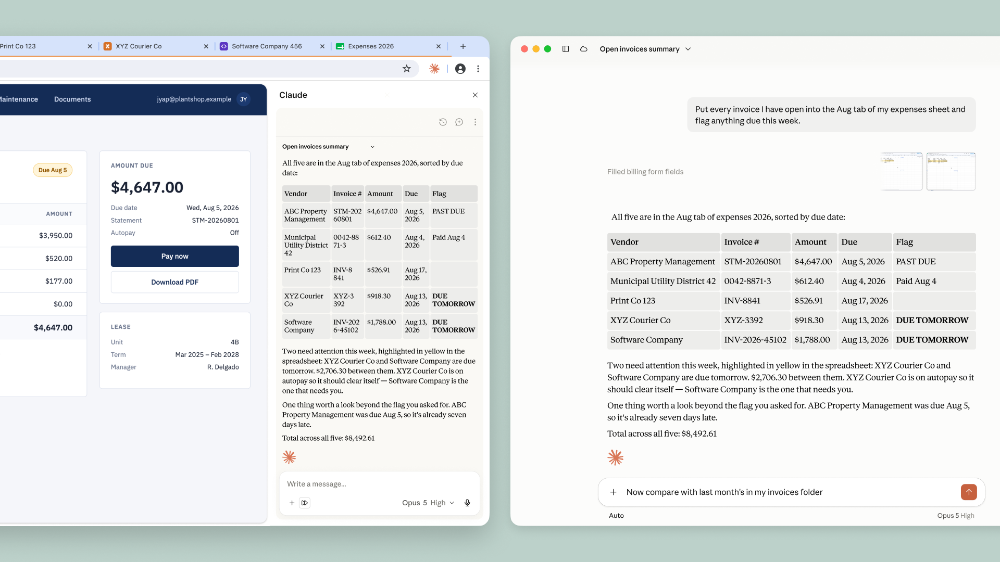
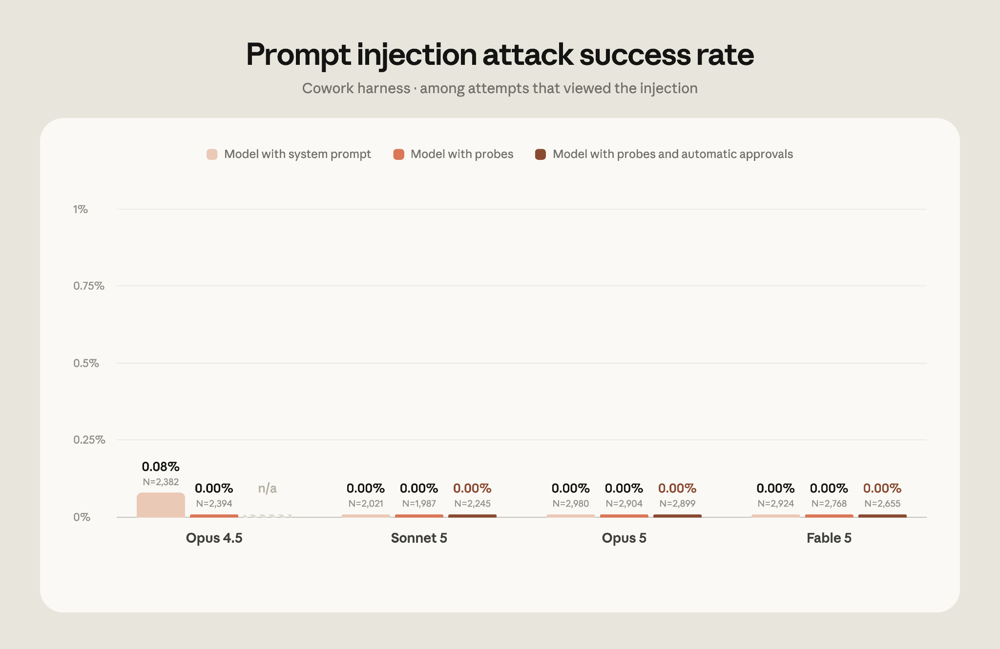
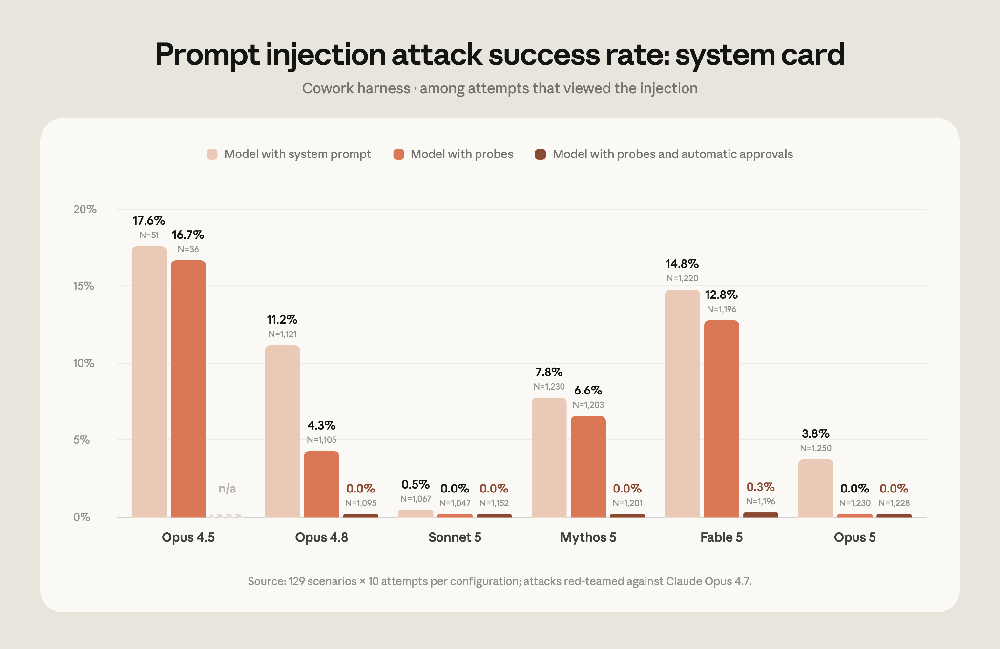

# Claude in Chrome 正式发布（中英对照）

> 原文标题：Claude in Chrome is generally available
> 原文链接：https://claude.com/blog/claude-in-chrome-generally-available
> 原文作者：Anthropic
> 发布日期：2026-08-26
> **翻译模型：** GLM-5.3-Flash
> **评分：** ★★★☆☆—— 浏览器端 agent 正式 GA 的产品节点，偏公告
> 排版：每段英文原文在前，中文翻译紧随其后。默认收录正文主体。

Give Claude a task in your browser, work across tabs, and continue the conversation in the desktop, mobile, and web apps.

在浏览器里给 Claude（Anthropic 的 AI 助手）布置任务，跨多个标签页协同工作，并可在桌面端、移动端与网页端应用中继续对话。

Claude in Chrome is now generally available on every paid Claude plan. Claude can now also take actions autonomously in the browser, instead of needing approval for every one. A safety classifier validates each action before it’s performed to ensure it’s safe and matches your request.

Claude in Chrome（Claude 的 Chrome 浏览器扩展）现已在所有 Claude 付费计划上正式发布（generally available）。Claude 现在还能在浏览器中自主执行操作，而无需你对每一步逐一批准。一个安全分类器（safety classifier）会在每个操作执行前进行校验，确保其安全且符合你的请求。

Many of the tools you use every day connect to Claude . But many others don’t, such as internal dashboards, legacy systems, and vendor portals. Claude in Chrome lets Claude access those. It can view the page you’re on and take actions like reading and typing text, clicking links, navigating between pages, and filling out forms, using your existing logins.

你每天使用的许多工具已经接入了 Claude，但也有不少没有——例如内部仪表盘、老旧系统和供应商门户。Claude in Chrome 让 Claude 能够访问这些工具。它可以查看你当前所在的页面，并借助你已有的登录状态，执行阅读与输入文字、点击链接、在页面之间跳转、填写表单等操作。

We first announced Claude in Chrome as a pilot last year, so we could test it while also shoring up our defenses against prompt injection : malicious instructions hidden in websites, emails, or documents that try to trick an AI agent into acting against the user’s wishes. These defenses, described below, give us the confidence to make Claude in Chrome generally available.

去年，我们首次以试点（pilot）形式发布了 Claude in Chrome，以便在测试它的同时，加固我们针对 prompt injection（提示词注入）的防御——所谓 prompt injection，是指隐藏在网站、电子邮件或文档中的恶意指令，试图诱骗 AI agent 做出违背用户意愿的行为。下文将描述这些防御措施，正是它们让我们有信心将 Claude in Chrome 正式发布。

### 防范 prompt injection（Safeguarding against prompt injection）

As we outlined when we announced the pilot, an AI agent that works in your browser is also vulnerable to prompt injection. So we’ve worked to improve our safeguards before releasing Claude in Chrome more widely.

正如我们在宣布试点时所述，在你的浏览器中工作的 AI agent 同样容易受到 prompt injection 攻击。因此，在更大范围发布 Claude in Chrome 之前，我们一直在努力改进安全防护措施。

In a prompt injection attack, malicious actors hide instructions in web content such as a web page, an email, or a form field. You may never see them, but these instructions can redirect the agent to do something you never asked for. For example, if you’ve asked Claude to draft replies to your emails, a hidden instruction in one message could tell Claude to forward your other emails to the attacker instead.

在 prompt injection 攻击中，恶意攻击者会把指令藏在网页、电子邮件或表单字段等网络内容里。你可能永远不会看到这些指令，但它们能让 agent 偏离方向，去做你从未要求过的事。例如，如果你让 Claude 起草邮件回复，某封邮件里的一条隐藏指令可能会命令 Claude 把你的其他邮件转发给攻击者。

At launch, we described how we tested Claude’s defenses against these attacks and the safeguards we had in place at the time; we later released a more detailed description of our browser-use safeguards . Since then, we’ve improved how we train both the model and our probes , and added an additional set of classifiers that make it possible for Claude to safely take more autonomous actions in Chrome. In the next section, we discuss the results of our evaluations, which show the efficacy of these safeguards.

发布之初，我们介绍了如何测试 Claude 针对这些攻击的防御，以及当时已就位的安全防护；随后我们又发布了关于 browser use（浏览器使用）安全防护的更详细说明。自那以后，我们改进了模型与 probes（内容探针）的训练方式，并新增了一组分类器，使 Claude 能够在 Chrome 中更安全地执行更自主的操作。下一节我们将讨论评估结果，它们展示了这些防护措施的有效性。

Claude recognizes more attacks. We train Claude against a growing library of prompt injection attacks, sourced from our internal automated attackers, external red-teamers, and real-world monitoring. When a new attack succeeds against a current model, it’s added to the library, where it informs the training of future models and our deployed safeguards so they learn to recognize it. Since we first wrote about our prompt injection defenses for browser use in November 2025, we’ve made Claude substantially more resistant to these attacks.

Claude 能识别更多攻击。我们用规模不断扩大的 prompt injection 攻击库来训练 Claude，攻击样本来自我们的内部自动化攻击系统、外部红队（red-teamers）以及真实世界的监控。当一种新攻击成功攻破当前模型时，它就会被加入攻击库，用于指导未来模型的训练和我们已部署防护措施的改进，使其学会识别这种攻击。自 2025 年 11 月我们首次撰文介绍 browser use 的 prompt injection 防御以来，Claude 对这类攻击的抵抗力已大幅增强。

Probes screen web content before Claude acts on it. Web content reaches Claude through tool results. To take an action like reading a page or opening an email, the model makes a tool call; the tool result lets the model read the output (in this case, the content of the page or the email). We train probes to scan those results for potential prompt injections. When a probe detects a likely attack, Claude is warned to treat the content with suspicion and, if needed, to check with you before taking an action. We first deployed these probes with Claude Opus 4.5, and have since expanded the types of attacks they cover.

探针会在 Claude 对网页内容采取行动之前先行筛查。网页内容是通过工具结果（tool results）到达 Claude 的。要执行诸如读取页面或打开邮件这样的操作，模型会发起一次工具调用（tool call）；工具结果让模型得以读取输出（在这里就是页面或邮件的内容）。我们训练探针扫描这些结果中潜在的 prompt injection。当探针检测到疑似攻击时，Claude 会收到警示，以怀疑的态度对待该内容，必要时在采取行动前先与你确认。这些探针最早随 Claude Opus 4.5 部署，此后我们扩大了它们所覆盖的攻击类型。

Actions are verified before they run . In Claude in Chrome, Claude will now automatically approve actions it determines to be safe, using the same mechanism as auto mode in Claude Code. (You can switch this off in your settings if you’d prefer to continue to approve Claude’s actions manually.) A classifier reviews actions Claude is about to take, such as navigating to a new website or entering text into a page, and checks them against what you originally asked for. If the action doesn’t match your request, it’s blocked.

操作在执行前会经过验证。在 Claude in Chrome 中，Claude 现在会自动批准它判定为安全的操作，其机制与 Claude Code 的 auto mode（自动模式）相同。（如果你希望继续手动批准 Claude 的每个操作，可以在设置中关闭此功能。）一个分类器会审查 Claude 即将执行的操作——例如跳转到新网站或在页面中输入文字——并将其与你最初的要求进行比对。如果操作与你的请求不符，就会被阻止。

### 度量 Claude 对 prompt injection 的鲁棒性（Measuring Claude’s robustness against prompt injection）

We’ve tested these safeguards to ensure that Claude in Chrome is safe to use for browser-based work. Here, we report the results from our most recent evaluations.

我们对这些防护措施进行了测试，以确保 Claude in Chrome 可以安全地用于浏览器端的工作。下面我们报告最近几轮评估的结果。

On our initial evaluation testing Claude Cowork’s resilience against prompt injection attacks (first developed when we released the Claude in Chrome pilot), no attack succeeded against Claude Fable 5, Claude Opus 5, or Claude Sonnet 5 in the Cowork harness , even without the probes and classifiers discussed above.

在我们最初为测试 Claude Cowork 抵御 prompt injection 攻击的韧性而构建的评估中（该评估于 Claude in Chrome 试点发布时首次开发），即使没有上述探针和分类器，也没有任何攻击能在 Cowork harness（测试环境）中成功攻破 Claude Fable 5、Claude Opus 5 或 Claude Sonnet 5。

Because we saturated that evaluation (as evidenced by the 0% success rate), we decided to retire it. On our current evaluation , which uses stronger attacks sourced by professional red-teamers, attacks that reached the model succeeded against Opus 4.5 17.6% of the time and against Opus 5 3.8% of the time, before any additional safeguards.¹ With the strongest safeguards available in November 2025, attacks against Opus 4.5 running with probes succeeded 16.7% of the time. Against every model from Opus 4.8 onwards, when running with probes and the safety classifier, no attacks succeeded against Claude Sonnet 5, Claude Opus 5, or Claude Mythos 5. We saw a 0.3% attack success rate against Fable 5. We have manually verified that all successful breaks are in low-severity scenarios and are working to mitigate them.

由于该评估已被“打满”（0% 的攻击成功率即为明证），我们决定将其退役。在我们当前的评估中——它采用由专业红队提供的更强攻击——在没有任何额外防护的情况下，到达模型的攻击对 Opus 4.5 的成功率为 17.6%，对 Opus 5 为 3.8%。¹ 在 2025 年 11 月可用的最强防护下，开启探针运行的 Opus 4.5 被攻击成功的比率为 16.7%。而从 Opus 4.8 起的每个模型，在配备探针与安全分类器运行时，没有任何攻击成功攻破 Claude Sonnet 5、Claude Opus 5 或 Claude Mythos 5；Fable 5 的攻击成功率为 0.3%。我们已人工核实，所有成功的突破都属于低危场景，并正在努力加以缓解。

Prompt injection remains a moving target. While this approach defends against current attacks, we also need to ensure our safeguards stay ahead of the evolving methods of attackers. With each model release, we continue to invest in developing more sophisticated automated systems for attack discovery, red-teaming, and building stronger classifiers.

prompt injection 仍然是一个不断变化的目标。虽然这套方法能够防御当前的攻击，我们还需确保防护措施始终领先于攻击者不断演化的手段。随着每一次模型发布，我们会继续投入开发更精密的自动化系统，用于攻击发现、红队测试，以及构建更强的分类器。

### 开始使用（Getting started）

To start using Claude in Chrome, install it from the Chrome Web Store . On Enterprise plans, admins can manage it in Organization Settings and limit it to approved domains. See the admin setup guide .

要开始使用 Claude in Chrome，请从 Chrome Web Store 安装。在企业版（Enterprise）计划中，管理员可以在 Organization Settings 中对其进行管理，并将其限制为仅在已批准的域名上使用。详见管理员配置指南。

You’ll still need to use the Claude desktop app to work with files on your computer or with other applications. Claude in Chrome doesn’t run on other Chromium browsers or on mobile yet.

如果要处理你电脑上的文件或与其他应用程序协同工作，你仍需使用 Claude 桌面应用。Claude in Chrome 暂不支持其他 Chromium 浏览器，也尚未支持移动端。

¹ Not all attacks reach—i.e., are seen by—the model. In some cases, the actions Claude takes result in it never encountering the malicious instructions.

¹ 并非所有攻击都能到达模型（即被模型看到）。在某些情况下，Claude 所采取的行动使其从未接触到那些恶意指令。
