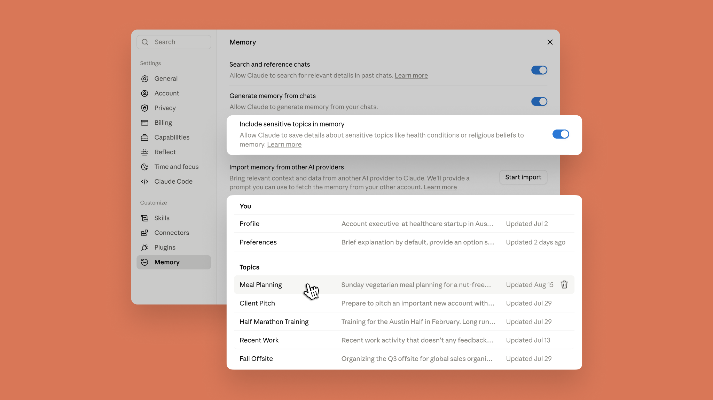
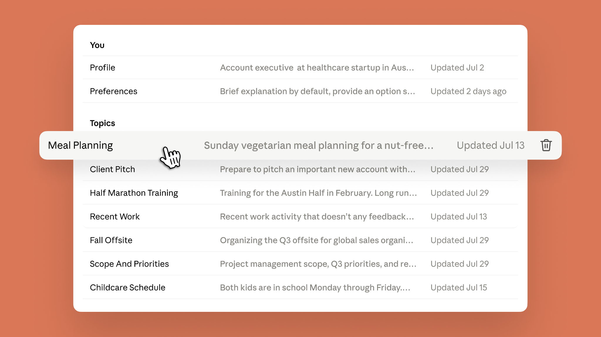
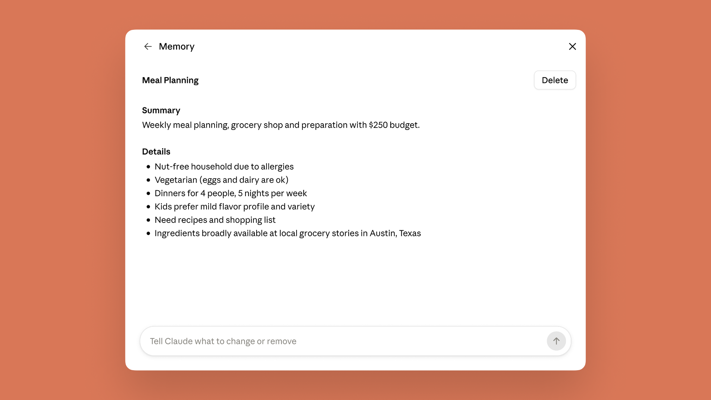

# Claude 的记忆无处不在，内容由你决定（中英对照）

> 原文标题：Claude's memory works everywhere, and you decide what's in it
> 原文链接：https://claude.com/blog/claudes-memory-works-everywhere-and-you-decide-whats-in-it
> 原文作者：Anthropic
> 发布日期：2026-08-25
> **翻译模型：** GLM-5.3-Flash
> **评分：** ★★★☆☆（3/5，值得一看）--记忆跨产品统一是 Claude 产品主线的关键节点，功能说明为主
> 排版：每段英文原文在前，中文翻译紧随其后。默认收录正文主体。

Starting today, the memory you use in chat is the same as in Claude Cowork. Now, wherever you work with Claude, it starts from what it already knows about you. You can see everything Claude remembers, topic by topic, and edit or delete any of it. Claude does not store subjects considered sensitive, like health or beliefs, to memory by default, but if those are the topics you're tired of re-explaining, you can turn them on in Memory settings.

从今天起，你在聊天中使用的记忆与 Claude Cowork 中的记忆是同一份。现在，无论你在哪里与 Claude 协作，它都会从它已知的关于你的信息出发。你可以逐个主题查看 Claude 记住的一切，并编辑或删除其中任何一项。默认情况下，Claude 不会将健康、信仰等敏感话题存入记忆；但如果这些正是你懒得反复解释的内容，可以在记忆设置（Memory settings）中把它们打开。

## **Cowork 与聊天共享同一份记忆（One memory across Claude Cowork and chat）**

Cowork now has memory, and it's the same one you use in chat, leading to less re-explaining and more picking up where you left off. When Cowork runs a task in the cloud, what Claude remembers from your chats is there, and vice versa. The context you've built up across months of conversations--for instance, your Q3 priorities and the status of your projects--is there the moment you hand Cowork a task, and what comes up in Cowork carries back to chat.

Cowork 现在有了记忆，而且它与你在聊天中使用的记忆是同一份，这让你少做重复解释，更多地从上次中断的地方继续。当 Cowork 在云端执行任务时，Claude 从你的聊天中记住的内容就在那里；反之亦然。你数月对话积累的上下文--比如你的三季度优先事项和项目进度--在你把任务交给 Cowork 的那一刻就在场，而 Cowork 中产生的新信息也会带回聊天。

Ask Cowork to draft an update for your manager, and it already knows who that is and how she likes updates written. Brainstorm the agenda in chat for a conference you're organizing; when Cowork builds the budget and logistics doc, it knows the headcount, the city, and the speakers. Explain once in chat how your team defines its metrics, and every quarterly business review deck Cowork builds after that uses them, with no rebriefing.

让 Cowork 为你的经理起草一份工作汇报，它已经知道对方是谁、她喜欢什么样的汇报写法。在聊天中为你筹办的会议头脑风暴议程；当 Cowork 制作预算与后勤文档时，它知道参会人数、城市和演讲嘉宾。在聊天中解释一次你的团队如何定义指标，此后 Cowork 制作的每一份季度业务评审幻灯片都会沿用这些定义，无需再次交代。

## **记忆随聊天实时更新（Memory updates as you chat）**

Claude now adds topics to memory as you chat, instead of summarizing conversations after they end. Mention that your project deadline moved to September, and your next conversation already knows without you having to say "remember this." You can pause memory or reset it at any time.

Claude 现在在你聊天的过程中就把话题加入记忆，而不是在对话结束后再做总结。你提到项目截止日期改到了九月，下一次对话它就已经知道，不需要你说"记住这一点"。你可以随时暂停或重置记忆。

## **查看并编辑已保存的记忆（See and edit your saved memories）**

Everything Claude remembers is in a list of files under Topics in Memory settings, where you can read, edit, or delete each one. The files are short, and a fix pays off everywhere: correct your company's old name in one file and every conversation from then on gets it right.

Claude 记住的一切都在记忆设置（Memory settings）的"主题"（Topics）下以文件列表呈现，你可以逐个阅读、编辑或删除。这些文件都很简短，而且一处修正处处生效：在某个文件里改正你公司的旧名称，此后所有对话都会用对。

## **敏感话题是否记忆由你决定（Decide if you want Claude to remember sensitive topics）**

By default, Claude does not store topics related to personal or sensitive subject matter, like your health, race, ethnicity, religious beliefs, politics, gender identity, and other similar areas.

默认情况下，Claude 不会存储涉及个人或敏感话题的内容，例如你的健康、种族、族裔、宗教信仰、政治倾向、性别认同以及其他类似领域。

But what some consider sensitive, others may consider useful for Claude to remember. If you choose to turn on "include sensitive topics in memory," Claude will remember things like your gluten allergy when suggesting recipes for weekly meal prep.

但有些人视为敏感的内容，在另一些人看来恰恰值得 Claude 记住。如果你选择开启"在记忆中包含敏感话题"（include sensitive topics in memory），Claude 在为你的每周备餐推荐食谱时就会记得你对麸质过敏。

With the setting turned on, each time Claude saves something on one of these topics to memory, you'll see a notice. Claude saves sensitive topics going forward. Anything from before you turned it on isn't saved retroactively. You can turn off this setting at any time.

该设置开启后，每当 Claude 将这类话题的内容存入记忆，你都会看到一条提示。Claude 只在此后保存敏感话题；开启之前的内容不会追溯保存。你可以随时关闭此设置。

To protect your safety and privacy, there are some topics that Claude does not store even when you have sensitive topics in memory turned on. This includes sensitive identification numbers (SSN, government ID numbers, etc), criminal history, immigration status, or anything that violates our Acceptable Use Policy (AUP) in its memory. Claude will inform you when it's unable to update memory to include any of this information. Visit the [Help Center](https://support.claude.com/en/articles/11817273-use-claude-s-chat-search-and-memory-to-build-on-previous-context#h_6fe1d0e66f) to learn more.

为保护你的安全与隐私，即便开启了敏感话题记忆，有些内容 Claude 也不会存储。这包括敏感证件号码（SSN、政府身份证号等）、犯罪记录、移民身份，以及任何违反我们可接受使用政策（AUP）的内容。当 Claude 无法将此类信息写入记忆时，会明确告知你。更多信息请访问[帮助中心](https://support.claude.com/en/articles/11817273-use-claude-s-chat-search-and-memory-to-build-on-previous-context#h_6fe1d0e66f)。

## **开始使用（Getting started）**

Memory is on by default on Free, Pro and Max plans across web, desktop, and mobile. Note that saving sensitive topics in memory is off by default. On iOS and Android, update to the latest version of the mobile app to get the most recent updates. For Team and Enterprise, admins control availability for their organization, and memory is off for individual users until they turn it on.

Free、Pro 和 Max 套餐在网页端、桌面端与移动端默认开启记忆。注意，"保存敏感话题到记忆"默认关闭。iOS 与 Android 用户请将移动应用更新到最新版本以获得上述更新。Team 与 Enterprise 套餐由管理员控制该功能对组织的开放情况，个体用户的记忆默认关闭，需自行开启。

Visit [Settings > Memory](https://claude.ai/new#settings/customize-memory) to turn memory on and control what Claude remembers.

前往 [Settings > Memory](https://claude.ai/new#settings/customize-memory) 开启记忆并控制 Claude 记住的内容。
