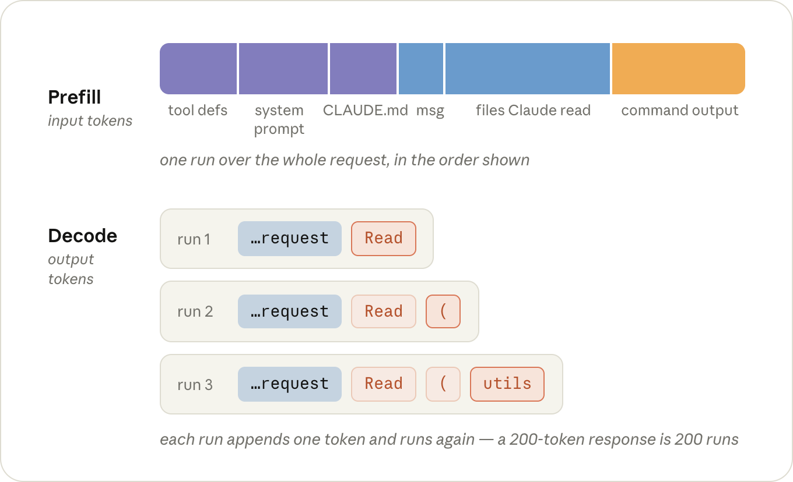
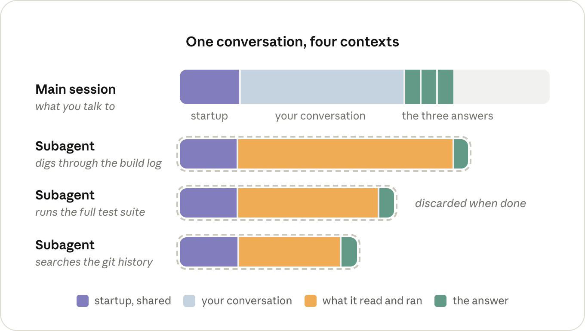

# 最大化 Claude Code 会话的价值（中英对照）

> 原文标题：Maximizing the value of your Claude Code sessions
> 原文链接：https://claude.com/blog/maximizing-the-value-of-your-claude-code-sessions
> 原文作者：Lydia Hallie
> 发布日期：2026-08-14
> **翻译模型：** GLM-5.3-Flash
> **评分：** ★★★☆☆（3/5，值得一看）--会话提效实操清单，建议搭配 SDLC 手册阅读
> 排版：每段英文原文在前，中文翻译紧随其后。默认收录正文主体。

---

### 输入与输出 token（Input and output tokens）

A request goes through the GPU in two phases, and they cost different amounts.

一个请求经过 GPU 要经历两个阶段，二者的成本不同。

First, during prefill, the model reads your request and context: the system prompt, your `CLAUDE.md`, your message, and everything that's been added to the conversation since (the files Claude has read and the output of the commands it ran). Those are your input tokens.

首先，在预填充（prefill）阶段，模型读取你的请求和上下文：系统提示词、你的 `CLAUDE.md`、你的消息，以及此后加入对话的一切（Claude 读过的文件和它运行过的命令的输出）。这些就是你的输入 token。

Then, during decode, it writes output tokens: its thinking, the tool calls it makes, and the text you see. This happens one token at a time; a 200-token response is 200 runs of the model, one after the other. Per token, decode keeps the GPU busy for a lot longer, which is why output is priced at roughly 5x input.

然后，在解码（decode）阶段，它写出输出 token：它的思考、它发起的工具调用，以及你看到的文本。这是一次一个 token 进行的；一个 200 token 的响应就是让模型一个接一个地运行 200 次。就单个 token 而言，解码让 GPU 忙碌的时间长得多，这就是为什么输出的价格大约是输入的 5 倍。

A lot of the output tokens in a session are thinking tokens, and how much thinking the model does per turn is what the effort level controls. Like the model, the level you pick with `/effort` sticks around as your default for the next session too.

会话中的输出 token 有很大一部分是思考 token，而模型每轮做多少思考，正是努力档位（effort level）所控制的。和模型一样，你用 `/effort` 选定的档位也会作为默认值延续到下一个会话。

> Tip: run `/model` and `/effort` once in a fresh session to see what you're actually on. Both remember whatever you picked last time, and you want that decision to be deliberate.

> 提示：在一个全新的会话里运行一次 `/model` 和 `/effort`，看看自己实际用的是什么。两者都会记住你上次的选择，而你应当让这个决定是深思熟虑的。

> Tip: if you already know a session is going to be grunt work, `MAX_THINKING_TOKENS=0 claude` turns thinking off for that one session (except on Fable 5), which is the step below `/effort` low.

> 提示：如果你已经知道某个会话就是苦力活，用 `MAX_THINKING_TOKENS=0 claude` 启动，可以为那一个会话关闭思考（Fable 5 除外），这比 `/effort` low 还要再低一档。

### 提示词缓存（Prompt caching）

If a request starts with exactly the same tokens as a request the server just saw, the state for that shared beginning comes out the same, so the server can keep it around from last time and only prefill whatever comes after it. This is called prompt caching.

如果一个请求的开头与服务器刚处理过的某个请求的 token 完全相同，那么这段共享开头的状态也会完全一样，因此服务器可以把上次的状态保留下来，只对之后的部分做预填充。这就是提示词缓存（prompt caching）。

Reading from the cache costs 0.1x the input price, because the server loads the state instead of computing it. Writing tokens into the cache costs a bit more than normal input, up to 2x, since the server also has to hold on to the state afterwards. But the write happens once per token, and the 0.1x reads happen on every turn after it.

从缓存读取的成本是输入价格的 0.1 倍，因为服务器是加载现成的状态，而不是重新计算。把 token 写入缓存则比普通输入贵一点，最高可达 2 倍，因为服务器此后还要保存这些状态。但写入对每个 token 只发生一次，而 0.1 倍的读取在此后的每一轮都会发生。

Claude Code manages the prompt cache on every request, there's nothing to turn on. However you can break it, so it's important to know how to avoid these cost spikes.

Claude Code 会在每个请求上自动管理提示词缓存，无需你打开任何开关。但你有可能把它弄失效，所以知道如何避开这些成本飙升很重要。

Say we type "fix the failing test in `utils.test.ts`". Here's what Claude Code sends for it:

假设我们输入"修复 `utils.test.ts` 中失败的测试"。Claude Code 为此发送的内容如下：

1. Claude Code assembles the first request out of the system prompt (tool definitions included), your CLAUDE.md, and your message, and sends it off (input tokens). Nothing is in the cache yet, so all of it gets prefilled and written into the cache.

1. Claude Code 用系统提示词（含工具定义）、你的 CLAUDE.md 和你的消息组装出第一个请求并发送出去（输入 token）。此时缓存里还什么都没有，所以全部内容都要预填充并写入缓存。

2. The model can't fix a test it hasn't seen, so it thinks for a moment and responds with a Read call for utils.test.ts (output tokens). Claude Code reads the file, appends it to the conversation, and sends the whole thing again (input tokens). This time everything from request 1 is read back out of the cache at a tenth of the price, and the only thing prefilled at full price is what's new: the Read call and the file.

2. 模型无法修复它没见过的测试，于是思考片刻，返回一个针对 utils.test.ts 的 Read 调用（输出 token）。Claude Code 读入该文件，把它追加到对话中，然后把整个内容再次发送（输入 token）。这一次，请求 1 的全部内容都以十分之一的价格从缓存中读回，唯一以全价预填充的只有新增的部分：Read 调用和该文件。

3. Now the model wants the file under test (output). Another Read, another append, and everything goes out again: requests 1 and 2 from the cache, the second file at full price (input).

3. 现在模型想要被测试的那个文件（输出）。又一次 Read，又一次追加，然后所有内容再次发出：请求 1 和 2 走缓存，第二个文件按全价（输入）。

4. The model responds with an Edit (output). Claude Code applies it, appends the result, and sends everything again. Same story: the Edit and its result are new, everything in front of them is a cache read (input).

4. 模型返回一个 Edit（输出）。Claude Code 应用它，追加结果，并再次发送全部内容。同样的故事：Edit 及其结果是新的，它们前面的一切都是缓存读取（输入）。

5. The model runs npm test (output). Claude Code appends the test output and sends everything again, with the test output as the only new part (input).

5. 模型运行 npm test（输出）。Claude Code 追加测试输出并再次发送全部内容，测试输出是唯一的新增部分（输入）。

6. The tests pass, and the model responds with a short summary (output). No tool call means nothing to append and no request 6, so we're done.

6. 测试通过，模型返回一段简短的总结（输出）。没有工具调用，就意味着没有可追加的内容，也就没有请求 6，到此结束。

That's five requests for one small fix, and every one of them contained the entire conversation up to that point. A typical turn is lopsided: tens of thousands of tokens going in, a few hundred coming out. But only what's new in that turn gets prefilled at full price.

一个小修复竟然发出了五个请求，而且每个请求都包含到那一刻为止的完整对话。典型的一轮是很不平衡的：几万 token 进去，几百 token 出来。但只有该轮新增的内容才按全价预填充。

That's the whole per-turn bill: cache reads on the history, full input price on whatever's new, and the output price on the response.

这就是每轮账单的全部构成：历史部分按缓存读取计价，新增部分按输入全价计价，响应按输出计价。

> This applies on a subscription too. You don't see these prices directly, but the same requests are what draw down your limits.

> 这一点同样适用于订阅。你不会直接看到这些价格，但正是同样的请求在消耗你的额度。

The cache has to match from the very start of the request forward, and requests always go out in the same order: tool definitions, then the system prompt, then the conversation (with `CLAUDE.md` at the front of it).

缓存必须从请求的最开头起逐字匹配，而请求总是按同样的顺序发出：先是工具定义，然后是系统提示词，再然后是对话（`CLAUDE.md` 位于对话的最前面）。

If anything in that prefix changes, everything behind it gets prefilled again. A tool result appended to the end of the conversation is the ideal case, since nothing is behind it. What throws the cache away is anything that changes the request further towards the front, or changes what the cache is keyed on:

如果这个前缀中的任何内容发生变化，它后面的所有内容都要重新预填充。追加到对话末尾的工具结果是理想情况，因为它后面什么都没有。会让缓存作废的，是任何在更靠近前部的位置改变请求的东西，或者改变缓存键（cache key）的东西：

- `/model` : every model has its own cache, so on the next turn the entire conversation gets prefilled again at full price. (This includes opusplan, which switches models every time you go in or out of plan mode.)

- `/model`：每个模型都有自己的缓存，所以下一轮整个对话都要按全价重新预填充。（opusplan 也包括在内，它每次进出 plan mode 都会切换模型。）

- `/effort:`  the effort level is part of what the cache is keyed on too, so it's the same story. It's why both  /model and  /effort ask you to confirm when you switch in the middle of a conversation.

- `/effort:`：努力档位也是缓存键的一部分，所以情况相同。这就是为什么 `/model` 和 `/effort` 在对话中途切换时都会要求你确认。

- Fast mode : also part of the key, and the re-prefill happens at fast mode prices, so if you're going to turn it on, turn it on at the start. (Turning it off again is free, cache-wise.)

- Fast mode：也是缓存键的一部分，而且重新预填充按 fast mode 的价格计费，所以如果你要开启它，就在会话一开始就开。（之后再关掉它，对缓存而言是免费的。）

- `/compact` : the conversation gets replaced with a shorter one, so nothing in it matches anymore (the system prompt in front of it survives). Writing the summary itself is cheap as long as the old conversation is still in the cache, so it's a lot cheaper before a long break than after one.

- `/compact`：对话被替换成更短的版本，于是其中的内容不再匹配（它前面的系统提示词得以保留）。只要旧对话还在缓存里，写入摘要本身就是便宜的，所以长时间离开之前做 compact 比离开之后便宜得多。

- Time:  every turn resets the clock, but the cache expires after an hour on a subscription or five minutes on an API key ( ENABLE_PROMPT_CACHING_1H=1 makes it an hour). Come back later than that, and the next turn prefills the whole conversation again. Resuming an old session almost always does too: the cache is usually gone by then, and the system prompt gets rebuilt at launch anyway.

- Time：每一轮都会重置计时器，但缓存在订阅下于一小时后过期、在 API key 下于五分钟后过期（`ENABLE_PROMPT_CACHING_1H=1` 可将其延长为一小时）。超过这个时间再回来，下一轮就会重新预填充整个对话。恢复旧会话几乎也总是如此：那时缓存通常已经失效，而且系统提示词在启动时反正也会重建。

None of this means you should never switch models or effort. It means there are cheap moments to do it, the start of a session or right after a `/clear`, and expensive ones, the middle of a long conversation.

这一切并不意味着你永远不要切换模型或 effort。它只是说，有便宜的时刻可以做这件事，比如会话开始时或 `/clear` 之后；也有昂贵的时刻，比如一段长对话的中途。

> Tip: if the last few turns went somewhere you don't want to keep, `/rewind` to just before them instead of running `/compact`. Rewinding only cuts those turns off the end, so everything before them is still cached and it costs nothing. Compacting rewrites the whole conversation, so it always costs something.

> 提示：如果最近几轮的走向是你不想要的，用 `/rewind` 回退到它们之前，而不是运行 `/compact`。回退只会把那几轮从末尾切掉，它们之前的一切仍在缓存里，分文不花。而 compact 会重写整个对话，所以总是有成本的。

## 什么决定了一个会话发送多少 token（What decides how many tokens a session sends）

The main thing to know here is that nothing gets sent just once. Everything that ends up in the conversation, a file Claude read or the output of a command it ran, gets sent again on every turn after it, for the rest of the session.

这里要知道的核心是：没有任何东西只被发送一次。所有最终进入对话的内容，无论是 Claude 读过的文件还是它运行过的命令的输出，在会话剩余的每一轮里都会被再次发送。

It's cached, so each of those re-sends is cheap, but cheap isn't nothing, and it's taking up room in the context the model has to think around on every turn too.

这些内容有缓存，所以每次重发都很便宜，但便宜不等于免费，而且它们还占用着上下文的空间，模型每一轮都得围着它们思考。

That's really the whole cost model of a session: how many tokens end up in the context, how many turns they stay there, and how many contexts you're running at the same time.

这其实就是会话成本模型的全部：有多少 token 最终进入上下文，它们在那里停留多少轮，以及你同时运行着多少个上下文。

### 什么会进入上下文（What ends up in the context）

Part of what's in the context is there before you type anything: the tool definitions, the system prompt, `CLAUDE.md`, and whatever else gets loaded at startup.

上下文中有一部分内容，在你输入任何东西之前就已经在那里了：工具定义、系统提示词、`CLAUDE.md`，以及启动时加载的其他东西。

> Tip: run `/context` in a fresh session to see what's in there before you've typed anything. Keep `CLAUDE.md` to specific instructions and move workflow-specific ones into skills, which only get loaded when they're used. If there's an MCP server you don't need in this session, turn it off with `/mcp`.

> 提示：在全新会话中运行 `/context`，看看你还没输入任何东西时里面有什么。让 `CLAUDE.md` 只保留具体指令，把工作流性质的指令移入 Skills，它们只会在被用到时才加载。如果本会话用不到某个 MCP 服务器，用 `/mcp` 把它关掉。

Nearly everything else that gets added during the session is tool results: the files Claude reads, and the output of the commands it runs.

会话期间添加的其他内容几乎都是工具结果：Claude 读的文件，以及它运行的命令的输出。

How much Claude reads mostly comes down to how much it has to figure out on its own. If you say "the tests are failing", it first has to find out which tests: a grep or two, a few files opened to see which one is relevant, and all of those results stay in the context long after they've stopped being useful.

Claude 读多少，主要取决于它需要自己弄清楚多少。如果你只说"测试挂了"，它首先得查明是哪些测试：一两次 grep、打开几个文件看看哪个相关，而所有这些结果在早已失去用处之后，还会长期留在上下文里。

"Fix the failing test in `utils.test.ts`" skips the searching and costs one Read call for the file, and "Fix the failing test in `@utils.test.ts`" doesn't cost the Read call either.

"修复 `utils.test.ts` 中失败的测试"跳过了搜索环节，只需为该文件付出一次 Read 调用；而"修复 `@utils.test.ts` 中失败的测试"连那次 Read 调用都省了。

> Tip: when you're referring to a file, @-mention it instead of typing the path. Claude Code attaches the file to your message before anything gets sent, so it's in the very first request and there's no Read call for it. The file itself takes up the same room in the context either way, so you only need to mention it once per conversation: it stays there, and @-mentioning it again on a later turn generally attaches a second copy.

> 提示：提到某个文件时，用 @ 提及（@-mention）而不是手敲路径。Claude Code 会在任何内容发送之前就把文件附加到你的消息上，所以它出现在第一个请求里，不需要 Read 调用。无论哪种方式，文件本身占用的上下文空间是一样的，所以每次对话只需提及一次：它会留在那里，而在之后的轮次再 @ 一次，通常会附加第二份副本。

The other thing that fills up the context is the output of the commands Claude runs. Every time it runs your tests, a build, or a git log, whatever that prints gets appended to the conversation just like a file it read, and stays there for the same number of turns.

另一件填满上下文的东西，是 Claude 运行的命令的输出。每当它运行你的测试、构建或 git log，打印出来的内容都会像它读过的文件一样被追加到对话中，并停留同样的轮数。

Really big outputs are actually fine: after 30,000 characters Claude Code writes the output to a file and only puts a short preview and the path in the conversation (`BASH_MAX_OUTPUT_LENGTH` if you want to change it).

特别大的输出其实没问题：超过 30,000 字符后，Claude Code 会把输出写入文件，只在对话中放一小段预览和路径（想改的话是 `BASH_MAX_OUTPUT_LENGTH`）。

The problem is everything under that. A test runner that prints 400 passing tests one line at a time comes in under the limit, and those 400 lines are now part of every remaining turn.

问题出在阈值之下的所有输出。一个把 400 个通过测试逐行打印出来的测试运行器不会超过限制，而这 400 行从此成为剩余每一轮的一部分。

Claude will often take care of this for you with flags and tail, and if you'd rather not leave it up to Claude, there's a small hook in the docs that rewrites noisy commands before they run so only the lines that matter come back.

Claude 常常会用 flags 和 tail 替你处理好这些；如果你不想把这事交给 Claude，文档里有一个小 hook，可以在嘈杂的命令运行之前重写它们，让只有重要的行返回。

> Tip: put the two or three commands you run all day in `CLAUDE.md`, quiet flags included, the way you'd type them yourself ("run a single test file with `npx vitest run <file> --reporter=dot`"). It's a small addition, but it saves a turn and a few hundred lines of output in every session after it.

> 提示：把你整天反复运行的两三个命令写进 `CLAUDE.md`，带上静音 flags，就按你自己会敲的方式写（"用 `npx vitest run <file> --reporter=dot` 运行单个测试文件"）。这只是很小的补充，但它在此后的每个会话里都能省下一轮对话和几百行输出。

### 它们会停留多少轮（How many turns it stays there）

One long session costs more than the same work spread over a few short ones, and by more than you'd think, because turn 40 is also re-reading the 39 turns before it. You want the context in your session to be short and relevant, so don't carry one task's context into the next: `/clear` when you start something new, and `/compact` when the earlier part of the same task is done.

一个长会话比把同样的工作分摊到几个短会话里花费更多，而且超出你的想象，因为第 40 轮还要重新读取它之前的 39 轮。你要让会话中的上下文保持简短且相关，所以不要把上一个任务的上下文带进下一个：开始新任务时用 `/clear`，同一任务的早期部分完成时用 `/compact`。

> Tip: `/rename` before you `/clear` if you'll want the session back later. When you `/compact`, tell it what to keep, or put a "Compact instructions" section in `CLAUDE.md` if it's always the same thing. And if you're on a 1M model and would rather have the auto-compact safety net where it used to be, `/autocompact 200k` puts it back (needs Claude Code v2.1.221+).

> 提示：如果之后还想找回这个会话，先 `/rename` 再 `/clear`。运行 `/compact` 时，告诉它要保留什么；如果每次都一样，就在 `CLAUDE.md` 里放一个"Compact instructions"小节。另外，如果你用的是 1M 上下文模型，希望自动压缩（auto-compact）的安全网回到原来的位置，`/autocompact 200k` 可以把它加回来（需要 Claude Code v2.1.221+）。

Keep an eye on turns that happen when you're not typing, too. A `/loop` fires as a full turn in the session you set it up in, carrying that whole conversation with it every time, and if it's been more than an hour since the last turn, it's a cache miss on top. Start a fresh session in another terminal and run the loop from there.

还要留意那些在你没有打字时发生的轮次。`/loop` 会在你设置它的那个会话里作为完整的一轮触发，每次都拖着整个对话走；而且如果距离上一轮已超过一小时，还要叠加一次缓存未命中（cache miss）。在另一个终端开一个全新会话，从那里运行循环。

### 子代理（Subagents）

The other way to keep something out of your context is to have it happen in a different one, which is what subagents are for. A subagent gets its own context window, with its own system prompt, the tools, and your `CLAUDE.md`, but not your conversation. It runs its own turns, and the only thing that comes back to the main session is its answer. Everything else is thrown away once it's done.

把某些内容挡在你的上下文之外的另一种办法，是让它们发生在另一个上下文里，这正是子代理（subagents）的用途。子代理拥有自己的上下文窗口，带有自己的系统提示词、那些工具和你的 `CLAUDE.md`，但没有你的对话。它运行自己的一轮轮处理，返回主会话的只有它的答案。其余一切在它完成之后就被丢弃。

The downside of not having your conversation is that a subagent sometimes has to re-read things the main session already had, and it's paying for its own turns while it does. For a small job it's just overhead.

没有你的对话的缺点是，子代理有时不得不重读主会话已经拥有的内容，而且在此期间它还要为自己的一轮轮处理付费。对小任务来说，这就是纯粹的额外开销。

It pays off when a job produces a lot of output you don't need to keep, like going through a log. Claude will often reach for one on its own for that kind of thing, and you can ask for one directly when it doesn't ("go through this log in a subagent"). Just keep in mind that the main session only gets back what the subagent chose to report.

当一个任务会产生大量你不需要保留的输出时，比如翻查日志，子代理就物有所值。Claude 经常会自己主动调用子代理处理这类事情；如果它没这么做，你也可以直接要求（"在子代理里过一遍这个日志"）。只是要记住，主会话只能拿回子代理选择汇报的内容。

> Tip: if there's a noisy job you hand off over and over, give it a subagent definition of its own with `model: haiku` (or sonnet). Otherwise it runs on whatever your main session is running on.

> 提示：如果有一件你反复交出去的嘈杂任务，就为它写一个专属的子代理定义，并设置 `model: haiku`（或 sonnet）。否则它会跑在你主会话所用的模型上。

## 先看哪里（Where to look first）

Of everything above, four things are worth keeping an eye on, roughly in order of how much they cost:

在以上所有内容中，有四件事值得关注，大致按开销大小排序：

