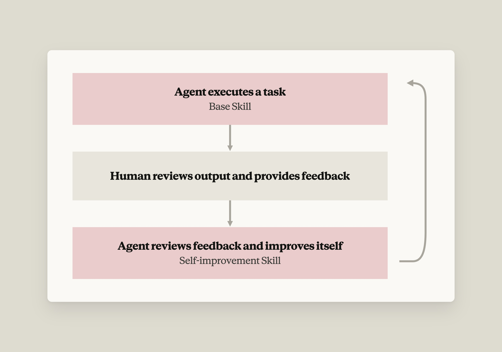

# Warp 如何在 Claude 上构建自改进 agent（中英对照）

> 原文标题：How Warp builds self-improving agents on Claude
> 原文链接：https://claude.com/blog/how-warp-builds-self-improving-agents-on-claude
> 原文作者：Michael Segner
> 发布日期：2026-08-26
> **翻译模型：** GLM-5.3-Flash
> **评分：** ★★★☆☆（3/5，值得一看）--自改进 agent 的可复用开发模式案例
> 排版：每段英文原文在前，中文翻译紧随其后。默认收录正文主体。

*In our series, we highlight how startups are transforming their industries with AI. In this article, we share how Warp turned stateless user feedback into a self-improvement loop for its agents.*

*在我们的系列内容中，我们重点介绍初创公司如何用 AI 变革其所在行业。在本文中，我们分享 Warp 如何把无状态的用户反馈转化为其 agent 的自改进循环。*

| The quick pitch |  |
|---|---|
| Name | Warp |
| Founded | 2020 |
| Founders | Zach Lloyd (CEO) |
| Stack | Rust, Golang, GitHub Actions, internal agent orchestration platform (Oz), Claude Platform |
| Growth | $73M raised. 800K monthly developers build on Warp. 56% of the Fortune 500 uses Warp. 10M Claude Code sessions run inside Warp to date, 400K+ per week. 40M total Warp Agent conversations. |

| 快速概览 |  |
|---|---|
| 名称 | Warp |
| 成立年份 | 2020 |
| 创始人 | Zach Lloyd (CEO) |
| 技术栈 | Rust, Golang, GitHub Actions, 内部 agent 编排平台（Oz）, Claude Platform |
| 增长数据 | 累计融资 $73M。每月有 800K 名开发者在 Warp 上构建。56% 的财富 500 强企业使用 Warp。Warp 内已累计运行 10M 次 Claude Code 会话，每周 400K+ 次。Warp Agent 对话总计 40M 次。 |

Agents need to handle recurring tasks reliably and effectively. A first-pass prompt that gets 80% of the task correct can create a noisy and annoying experience for the user. Warp learned this the hard way, and used this to inform its product strategy, creating an improved experience for nearly 1M developers worldwide.

Agent 需要可靠且高效地处理重复性任务。一个首次运行只能做对 80% 任务的 prompt，会给用户带来嘈杂而烦人的体验。Warp 用惨痛的教训学到了这一点，并将其纳入产品策略，为全球近 1M（一百万）名开发者创造了更好的体验。

Warp, the AI-powered terminal and agentic development environment, builds on the Claude Platform. The team ran into this "noisy experience" problem with their internal code review agent. Engineers complained that their agent made unhelpful comments and produced low-quality output.

Warp 是一款 AI 驱动的终端和 agentic 开发环境，构建在 Claude Platform 之上。团队在内部代码审查 agent 上就遇到了这种"嘈杂体验"问题。工程师们抱怨他们的 agent 发表无用的评论、产出低质量的输出。

The team initially tried stopgap solutions, like manually rewriting the prompt based on observed code review failures. This made output more usable but didn't scale. Improving context files like AGENTS.md also helped, but was far from a complete fix.

团队最初尝试了权宜之计，比如根据观察到的代码审查失败案例手动重写 prompt。这让输出更可用，但无法规模化。改进 AGENTS.md 等上下文文件也有帮助，但远非彻底的解决之道。

Ultimately, they realized, the real issue was that feedback to an agent, no matter what its purpose, typically disappears when the session ends, removing critical context from the agentic loop. Their solution: an [Agent Skills](https://platform.claude.com/docs/en/agents-and-tools/agent-skills/overview)-based framework to create self-improving agents where feedback compounds over time to continually refine and enhance agent output.

最终他们意识到，真正的问题在于：无论 agent 的用途是什么，给它的反馈通常在会话结束时就消失了，关键上下文因此脱离了 agentic loop（代理循环）。他们的解决方案：一个基于 [Agent Skills](https://platform.claude.com/docs/en/agents-and-tools/agent-skills/overview) 的框架，用来创建自改进 agent，让反馈随时间复利累积，持续打磨和增强 agent 的输出。

Read on to learn how they built it with skills on top of the Claude Platform.

请继续阅读，了解他们如何在 Claude Platform 之上用 skills 构建这套机制。

## 基于 Skills 的 agent 自改进循环（Agent self-improvement loops built on skills）

The central technique is a self-improvement loop using [**skills**](https://support.claude.com/en/articles/12512176-what-are-skills), which are file based encodings of knowledge that keep instructions out of the raw prompt. Warp evolved a self-improving agent architecture consisting of two skills, with human feedback in between.

核心技巧是使用 [**skills**](https://support.claude.com/en/articles/12512176-what-are-skills) 的自改进循环。skills 是基于文件的知识编码，把指令从原始 prompt 中剥离出来。Warp 演化出一种由两个 skill 组成、中间夹着人类反馈的自改进 agent 架构。

The **inner/base skill** holds the functional domain knowledge and instructions. For example, when a PR is opened, Warp's code agent executes using that base skill and context to produce its review.

**内部/基础 skill（inner/base skill）**保存功能性的领域知识和指令。例如，当一个 PR 被打开时，Warp 的代码 agent 使用该基础 skill 和上下文执行，产出审查意见。

**Human feedback** on agent output is a critical component for the self-improvement loop. For code review this could be something as simple as a thumbs up, but the more explicit the better.

对 agent 输出的**人类反馈（human feedback）**是自改进循环的关键组成部分。对代码审查来说，它可能简单到一个点赞（thumbs up），但越明确越好。

"A human could affirm, 'this was a good, useful comment'," Warp founder Zach Lloyd explains, "But the human could also give detailed reasons why a code review wasn't good. Specifics like 'you suggested renaming this variable, but our code base convention is this type of global variable uses this particular naming context' tell the agent how to do it right next time."

Warp 创始人 Zach Lloyd 解释说："人类可以肯定一句'这条评论不错、有用'，但也可以详细说明这条代码审查为什么不好。比如'你建议重命名这个变量，但我们代码库的约定是这类全局变量使用这种特定命名方式'这样的细节，会告诉 agent 下次怎样才做对。"

The **outer/improver skill** functions as an observer agent that runs on a schedule rather than per-task. It pulls the accumulated human feedback, compares what the agent suggested against how humans responded, and proposes a small, focused edit to the base skill.

**外部/改进者 skill（outer/improver skill）**充当一个观察者 agent，按计划定期运行而非逐任务运行。它拉取累积的人类反馈，把 agent 的建议与人类的实际反应进行对比，然后对基础 skill 提出一个小的、聚焦的修改建议。

Because skills are plain files, agents are extremely good at updating them. These updates, which are reviewable, approvable, and mergeable, can flow through a normal PR/code-review workflow; once merged, the next run of the inner skill inherits the improvement.

由于 skills 就是普通文件，agent 极其擅长更新它们。这些更新可审查、可批准、可合并，可以走正常的 PR/代码审查流程；一旦合并，基础 skill 的下一次运行就会继承这一改进。

Warp now runs this pattern across its entire open-source repo, with separate spec-writing, review, and triage agents, each carrying their own self-improvement loop.

Warp 现在在整个开源仓库上运行这一模式，配备独立的规格撰写（spec-writing）、审查和分流 agent，每个都带有自己的自改进循环。

"File-based skills are a way of encoding knowledge for agents without putting that knowledge directly in the prompt, as something the agent can simply look up in the course of doing its job," says Zach. "The framework is really simple actually: there's the base domain-specific skill and then there's the improver skill that refines  that domain-specific skill. This simplicity is the beauty of this approach."

Zach 说："基于文件的 skills 是一种为 agent 编码知识的方式，而不必把这些知识直接塞进 prompt--agent 在工作过程中直接查阅即可。""这个框架其实非常简单：一个领域专属的基础 skill，再加上一个打磨该领域 skill 的 improver skill。这种简单正是这个方法的妙处。"

## 如何为 agent 编写自改进 Skills（How to write self-improving skills for agents）

Here are some of the Warp team's tried and true tips for writing self-improving skills for agentic loops:

以下是 Warp 团队为 agentic loop 编写自改进 skills 的一些久经考验的技巧：

- Write principles, not rules.  "Construct the skill as though you're instructing a smart person, not like you're programming a computer," Zach says. "Including direction in the skill like 'Look for repeated code' provides better direction than exhaustive variable naming rules."

- Explain the why. Providing the rationale behind the rule lets the agent reason about the problem instead of following rigid instructions, again allowing for better generalization.

- Make feedback effortless to give.  Capture it where people already work, like by commenting directly on a PR or issue. Also, make this happen automatically, with no extra submission step. "Low friction is what keeps signal flowing," Zach notes. "If you make it too hard you're not going to get the feedback and you're not going to be able to improve the skill."

- Keep skills small and use progressive disclosure.   A good skill  file isn't large; it references resource files and scripts rather than dumping everything into context at once.

- Feedback quality > volume, but volume helps.  A small amount of detailed, domain-specific feedback from a senior engineer can be worth more than lots of cursory feedback because binary thumbs up/down doesn't say  why . "You can get really good signal even from a relatively small sample size if it's very detailed feedback from a person around domain specific knowledge that the agent otherwise would have no way of getting," Zach continues. "That said, the bigger the corpus of quality signal, the better. At Warp we're using a loop to manage our whole open source repo. We have hundreds of people contributing and we're doing thousands of code reviews."

- Put extra effort into the improver skill . Putting extra effort into writing the improver skill (the observer agent) pays off beyond the immediate agent loop, because improver skills are very reusable across different use cases.  "Outside of the domain specific knowledge component, this is a fairly reusable mechanism—the improver skill for a code review agent is not that different from the improver skill for any other agent."

- 写原则，而不是写规则。Zach 说："构建 skill 时，要像在指导一个聪明人，而不是在给计算机编程。"在 skill 中写入'寻找重复代码'这样的方向性指引，比穷举式的变量命名规则更能提供有效的方向。

- 解释为什么。提供规则背后的理由，让 agent 能对问题进行推理，而不是死板地执行指令，同样能带来更好的泛化能力。

- 让反馈的付出成本近乎为零。在人们本来就在工作的地方收集反馈，比如直接在 PR 或 issue 上评论。并且让这一过程自动发生，无需额外的提交步骤。Zach 指出："低摩擦才能让信号持续流动。如果太麻烦，你既收不到反馈，也无法改进 skill。"

- 保持 skill 精简，并使用渐进式披露（progressive disclosure）。一个好的 skill 文件并不庞大；它引用资源文件和脚本，而不是一次性把所有东西都塞进上下文。

- 反馈质量 > 数量，但数量也有帮助。来自资深工程师的少量详细、领域专属的反馈，可能比大量粗略的反馈更有价值，因为二元的点赞/点踩说不出"为什么"。Zach 继续说："即使样本量相对较小，只要反馈来自一个具备领域专业知识的人、非常详细、而且是 agent 否则无从获得的知识，你也能得到非常好的信号。话虽如此，高质量信号的语料越大越好。在 Warp，我们用一个 loop 来管理整个开源仓库，有数百人参与贡献，我们进行着数千次代码审查。"

- 在 improver skill 上多下功夫。在编写 improver skill（观察者 agent）上多投入，其回报会超出当前的 agent loop，因为 improver skill 在不同用例之间非常可复用。"除了领域专属知识部分，这是一个相当可复用的机制--代码审查 agent 的 improver skill，与任何其他 agent 的 improver skill 并没有太大差别。"

## 实战中的循环：Warp 的问题分流 agent（The loop in action: Warp's issue triage agent）

[Warp's issue triage agent](https://github.com/warpdotdev/warp-agents-demo-github-issue-triage) demonstrates the self-improving agent skills framework. The pattern is triggered whenever someone files a new GitHub issue: a GitHub Action fires an agent that analyzes the issue for complexity and feasibility, assigns labels, and suggests a direction for the fix. That triage agent runs off an inner skill file holding the domain knowledge about what each label means and how to research the codebase before acting.

[Warp 的问题分流 agent](https://github.com/warpdotdev/warp-agents-demo-github-issue-triage) 展示了自改进 agent skills 框架。每当有人提交新的 GitHub issue 时，这一模式就会被触发：一个 GitHub Action 启动一个 agent，分析该 issue 的复杂度与可行性、打上标签，并给出修复方向建议。这个分流 agent 依据一个内部 skill 文件运行，其中保存着关于每个标签含义以及在行动前如何调研代码库的领域知识。

On a sample issue, the first-stage inner skill did a solid job but missed one label, ready to spec, which signals that a contributor can start building product and technical specs against the issue. A maintainer on the Warp team caught the gap and left feedback directly on the issue, exactly where the work was happening. Critically, he explained both what he expected and why he expected it: actionable feedback easy for the agent to absorb later.

在一个示例 issue 上，第一阶段的基础 skill 表现扎实，但漏掉了一个标签 ready to spec--它表示贡献者可以开始就该 issue 编写产品与技术规格。Warp 团队的一位维护者发现了这个疏漏，直接在 issue 上留了反馈，就在工作实际发生的地方。关键在于，他既说明了自己期望什么，也解释了为什么这样期望：这样的反馈可操作，agent 日后也容易吸收。

The outer improver skill runs in [Oz, Warp's agent orchestration platform](https://docs.warp.dev/), as a scheduled "update triage" agent. The agent authenticated to GitHub, ran a Python script bundled with the skill to pull recent issues carrying feedback, summarized them into a JSON file, and read that back into context. The bundled script is itself a best practice; skills can reference resource files instead of writing fresh code on every run.

外部的 improver skill 运行在 [Oz（Warp 的 agent 编排平台）](https://docs.warp.dev/)中，作为一个定时调度的"update triage" agent。该 agent 认证到 GitHub，运行 skill 自带的 Python 脚本，拉取近期带有反馈的 issue，把它们汇总成一个 JSON 文件，再读回上下文。自带脚本本身就是一种最佳实践：skills 可以引用资源文件，而不必在每次运行时都现写代码。

From there, the agent identified the concrete feedback signals in the maintainer comments and proposed the smallest edit that captured them. It opened a PR editing the inner skill to apply the "ready to spec" label when an issue describes a real problem, even though the exact UI or UX shape is not yet defined.

接着，agent 从维护者的评论中识别出具体的反馈信号，并提出了能覆盖这些信号的最小修改。它开了一个 PR，修改基础 skill：当某个 issue 描述了一个真实问题、尽管确切的 UI 或 UX 形态尚未确定时，就打上 "ready to spec" 标签。

Because the whole update is a skill file, it moves through the normal code-review workflow. The PR arrived with a description explaining which signals prompted the change and what it altered. A human reviews, approves, and merges, and the next run of the triage skill inherits the new knowledge. That final human step closes the loop and keeps a person in control of what actually changes.

由于整个更新就是一个 skill 文件，它会走正常的代码审查流程。这个 PR 附带说明，解释了是哪些信号促成了修改、改动到底改了什么。由人来审查、批准并合并，分流 skill 的下一次运行就会继承新知识。这最后一步人工把关闭合了循环，也确保实际改动什么始终由人掌控。

This is the same mechanism Warp now runs at scale across its open-source repo, where spec-writing agents, review agents, and triage agents each carry their own self-improvement loop.

这正是 Warp 如今在整个开源仓库上规模化运行的同一机制：规格撰写 agent、审查 agent 和分流 agent 各自带有自己的自改进循环。

Any agent, no matter what its task, gets better over time if you build one of these loops into it from the start to capture human feedback signals, turn them into skill updates, and expand agents from one-off helpers into capable systems that compound across your org.

任何 agent，无论其任务是什么，只要从一开始就内置这样一个循环来捕获人类反馈信号、把它们转化为 skill 更新，就能随时间越变越好，让 agent 从一次性帮手成长为在整个组织中产生复利效应的强大系统。

| Best practices from the Warp team |  |
|---|---|
| Are you conflating skills with memory? | Skills are procedural and stable—"how to do X," run-agnostic, changed deliberately. Memory is auto-written by the agent at inference time and never stops changing. |
| Do you need one improver loop, or one per agent? | Meet in the middle: a templated base loop captures the overlap across your agents, with domain-specific weights layered on. A handful of improvers can each own one; a hundred should share. |
| What happens when the feedback is wrong? | Assume it will be. Don't let the agent accept feedback blindly — give it context to sanity-check, filter whose input counts, and keep a human in the loop at either the filtering or final-review stage. |
| Is your domain verifiable? | Build the verification harness first, then let the agent tune against it: generate a reference corpus, compare output to reference, fix, repeat. |
| And if it isn't domain verifiable? | Lean on deterministic evals against golden outputs wherever they exist. Where you must use human feedback, restrict it to domain experts — don't open the floodgates. |
| How do you know the whole system is improving? | Track the global metrics humans already eyeball—time to merge, contributor count, cost—and feed them back into the improver agents. Go crawl-walk-run on deployment. |

| Warp 团队的最佳实践 |  |
|---|---|
| 你是否把 skills 与 memory（记忆）混为一谈？ | Skills 是程序性且稳定的--"如何做 X"，与运行方式无关，经过深思熟虑才修改。Memory 由 agent 在推理时自动写入，并且从不停变化。 |
| 你需要一个 improver 循环，还是每个 agent 一个？ | 折中：用一个模板化的基础 loop 捕获各 agent 之间的共性，再叠加领域专属的权重。几个 improver 可以各自负责一个；一百个就应该共享。 |
| 反馈错了怎么办？ | 假定它一定会错。不要让 agent 盲目接受反馈--给它做合理性核查（sanity-check）所需的上下文，过滤谁的输入算数，并在过滤或最终审查阶段保留人工参与。 |
| 你的领域可验证吗？ | 先构建验证 harness，再让 agent 针对它进行调优：生成参考语料，把输出与参考对比，修复，重复。 |
| 如果领域不可验证呢？ | 在存在 golden outputs（黄金输出）之处，依赖针对它们的确定性评估（evals）。在必须使用人类反馈之处，把它限制在领域专家范围内--不要敞开闸门。 |
| 你如何知道整个系统在改进？ | 跟踪人类本来就在看的全局指标--合并耗时（time to merge）、贡献者数量、成本--并把它们反馈给 improver agent。部署上采取 crawl-walk-run（爬-走-跑）的渐进策略。 |

[*View the full webinar*](https://www.anthropic.com/webinars/how-warp-builds-self-improving-agents-on-claude)*for a live demo and deeper discussion of how Warp uses Claude to build agents that learn from team feedback and improve themselves over time.*

[*观看完整网络研讨会*](https://www.anthropic.com/webinars/how-warp-builds-self-improving-agents-on-claude)*，内有现场演示，并深入讨论 Warp 如何用 Claude 构建能从团队反馈中学习、并随时间自我改进的 agent。*

*Start building with the*[*Claude Platform*](https://platform.claude.com/)*today.*

*立即使用*[Claude Platform](https://platform.claude.com/)*开始构建。*
