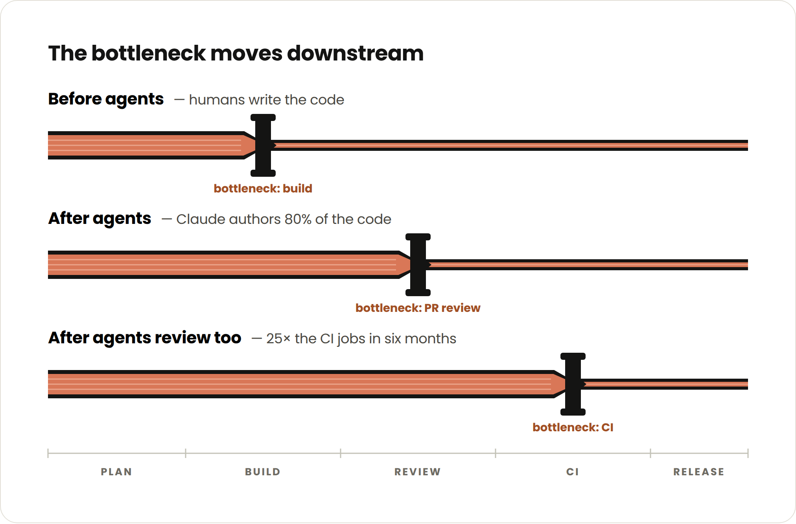
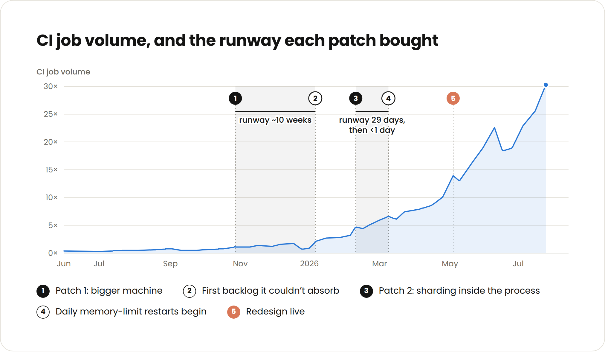
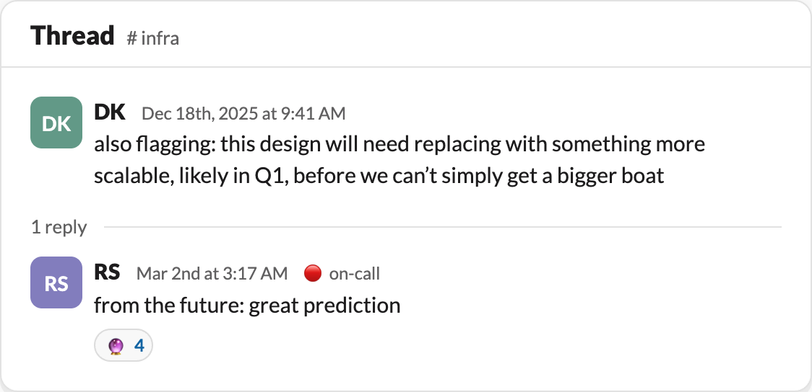
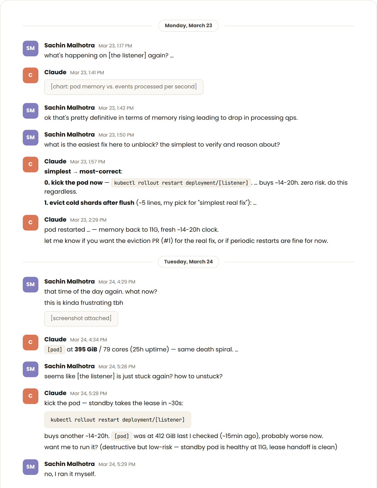
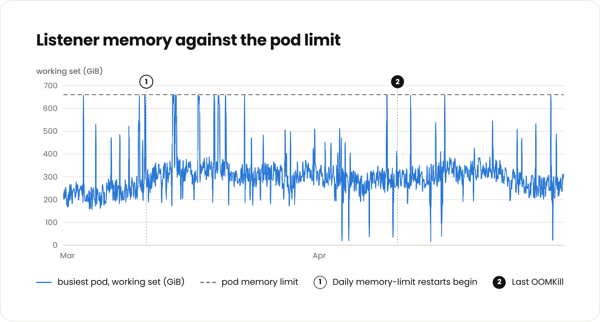
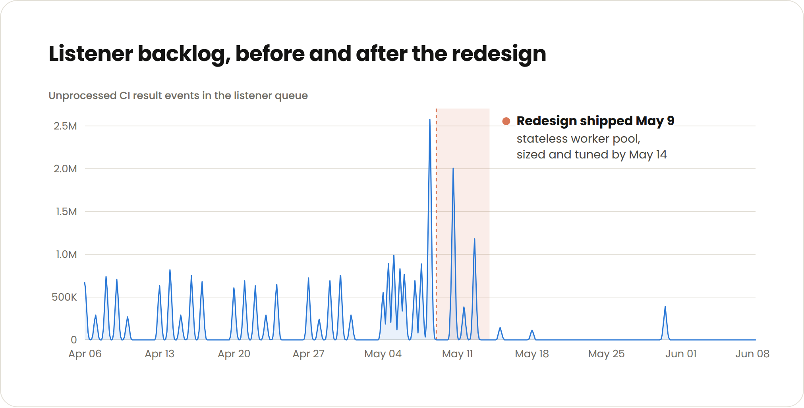

# Agentic coding 让 CI 不堪重负：Anthropic 如何规模化测试影响分析（中英对照）

> 原文标题：Agentic coding is straining CI. Here’s how we scaled test impact analysis at Anthropic
> 原文链接：https://claude.com/blog/agentic-coding-is-straining-ci-heres-how-we-scaled-test-impact-analysis-at-anthropic
> 原文作者：Anthropic
> 发布日期：2026-09-14
> **翻译模型：** GLM-5.3-Flash
> **评分：** ★★★★☆—— 官方一线 CI 规模化实战：8x 代码量、25x CI jobs 的真实数据与完整架构重构过程
> 排版：每段英文原文在前，中文翻译紧随其后。默认收录正文主体。

### AI 正在重塑 CI（AI is evolving CI）

Anthropic engineers on average ship 8x as much code per quarter as they did from 2021-2025. Claude authors 80% of that code and it also plays a large role in reviewing and approving PRs as well .

Anthropic 的工程师如今每个季度平均交付的代码量，是 2021–2025 年间的 8 倍。其中 80% 的代码由 Claude（Anthropic 的 AI 编码助手）编写，它在审查和批准 PR（Pull Request，拉取请求）方面也发挥着重要作用。

On top of that, the amount of tests across our codebase grew 10x and we added a nominal amount of engineers. This all led to a 25x increase in CI jobs over a six month period (in case you are trying to do the math, not every test runs on every PR as I will explain).

除此之外，我们整个代码库的测试数量增长了 10 倍，而新增的工程师数量却微乎其微。这一切叠加起来，导致 CI（Continuous Integration，持续集成）jobs 在六个月内增长了 25 倍（如果你正在心算这笔账：并非每个测试都会在每个 PR 上运行，原因我稍后会解释）。

This threatened to overload our test impact analysis service several times. To avoid becoming the next bottleneck, we blew up the whole thing and reimagined what the service's architecture looks like. But getting there was a bumpy path that started with three quick fixes, which lasted 70 days, then 29 days, and then less than a day respectively.

这曾数次险些把我们的 test impact analysis（测试影响分析）服务压垮。为了避免它成为下一个瓶颈，我们干脆推倒重来，重新设想了这项服务的架构。但通往新架构的道路并不平坦：它始于三个快速修复，分别撑了 70 天、29 天，然后是不到一天。

Scaling CI is a challenge more engineering teams are likely to soon face as agents continue to accelerate code generation and review. I anticipate horizontally scaled test selection architecture will become industry standard as teams running agents create both more PRs and more tests.

随着 AI agent（智能体）持续加速代码生成与代码审查，更多工程团队可能很快都会面临 CI 扩展的挑战。我预计，横向扩展（horizontally scaled）的测试选择（test selection）架构将成为行业标准，因为运行 agent 的团队既会产出更多 PR，也会积累更多测试。

In this article, I’ll discuss how we scaled our test impact analysis service at Anthropic and the lesson I learned the hard way: always plan for the exponential. The specific scaling techniques–buying bigger machines, parallelizing processes, or restarting the service (yeah, this one still works surprisingly well) – are common and not the insights to take from this article.

在本文中，我将讲述我们在 Anthropic 是如何扩展 test impact analysis 服务的，以及我付出惨痛代价才学到的一课：永远要为指数增长做好规划。那些具体的扩容手段——换更大的机器、把进程并行化，或者重启服务（没错，这一招至今依然出奇地好用）——都很常见，并不是本文想传达的洞见。

The point is that each of these techniques bought a fraction of the time they did a year ago. On the other hand, overhauling and completely redesigning a service also takes a fraction of the time and is much more sustainable now that writing code is no longer the bottleneck.

关键在于，同一种手段如今能争取到的时间只有一年前的零头。反过来看，彻底重构、重新设计一项服务所需的时间同样只剩过去的零头——在编写代码不再是瓶颈的今天，这条路要可持续得多。

The more you can anticipate this strain and plan how your architecture will evolve with it, the less time you will waste on half-measures.

你越是能预见这种压力、并提前规划架构将如何随之演进，浪费在权宜之计上的时间就越少。

### 测试影响分析架构（The test impact analysis architecture）

Many of my peers work at organizations where every test is still run on every change. This works up to a point, but doesn’t scale: CI gates get increasingly long, expensive, and untrustworthy.

我的许多同行所在的组织，至今仍是每次代码变更都运行全部测试。这在一定规模内行得通，但无法扩展：CI 门禁会变得越来越慢、越来越贵，也越来越不可信。

Additionally, humans are great at determining which test failures don’t apply to them while agents will require more context and direction. When they get a specific set of valid tests, they can self-verify and iterate more effectively.

此外，人类很擅长判断哪些测试失败与自己无关，而 agent 则需要更多的上下文和指引。当它们拿到一组明确有效的测试时，就能更高效地进行自我验证和迭代。

At Anthropic, we built a deterministic test impact analysis or test selection service that determines which tests run on each change based on past performance and package relevance. This isn’t an uncommon practice, and there is a category of vendors with offerings in this area.

在 Anthropic，我们构建了一个确定性的 test impact analysis（测试影响分析）服务，也叫 test selection（测试选择）服务：它基于历史表现和 package（代码包）相关性，决定每次变更应运行哪些测试。这种做法并不罕见，市面上已有一类厂商提供此类产品。

Our service depends on two deterministic components staying in sync:

我们的服务依赖两个必须保持同步的确定性组件：

- A “listener” records the test results from every CI run.
- A “selector” reads the test result history and determines which tests run on which opened PRs.

- “listener”（监听器）记录每一次 CI 运行的测试结果。
- “selector”（选择器）读取测试结果历史，决定在每个已打开的 PR 上运行哪些测试。

This is effective, but when there are multiple CI jobs running every second, the listener starts to increasingly fall behind the PR queue. For an AI-native SDLC , a small lag can have a big impact. For example, 20 minutes of listener lag can translate into tens of thousands of test updates not being applied to the selector.

这套机制行之有效，但当每秒都有多个 CI job 在运行时，listener 会越来越跟不上 PR 队列。在 AI 原生的 SDLC（Software Development Life Cycle，软件开发生命周期）中，一点小小的滞后就可能产生很大影响。例如，20 分钟的 listener 滞后，可能意味着数以万计的测试更新没有应用到 selector 上。

- If a bad change gets merged , then a test will start failing for everyone else causing multiple unnecessary investigations.
- If a dependency starts flaking , then flaky reds start blocking merges.
- If a test gets fixed or a new one gets added , it won't run until the listener catches up risking a regression.

- 如果一个有问题的变更被合并，这个测试就会开始在所有人那里失败，引发多起不必要的排查。
- 如果某个依赖开始 flaky（间歇性随机失败），这些不稳定的红色失败就会开始阻塞合并。
- 如果某个测试被修复、或者新增了一个测试，它要等 listener 追上进度后才会运行，从而带来回归风险。

All of this ran as a single process because keeping a running history per test meant a single writer needed to apply the results. This v0 design prevented us from being able to horizontally shard.

这一切当初都是作为单个进程运行的，因为要维护每个测试的运行历史，就意味着需要单一写入者（single writer）来应用这些结果。这个 v0 设计使我们无法进行水平分片（horizontally shard）。

### 崎岖的重构之路（The bumpy road to redesign）

By October of last year the service was already showing signs of strain, and we got paged two days straight.

到去年 10 月，这项服务已经显露出吃力的迹象，我们连续两天被告警呼叫（paged）。

#### 补丁 1：换更大的机器（Patch 1: A bigger machine）

The first fix was easy: we doubled the cores running the service. We also knew it would be fleeting.

第一个修法很简单：把运行这项服务的机器核数翻倍。我们也清楚，这只是权宜之计。

Even when the trend line was clear, ownership was murky. No one wanted to own another piece of infrastructure. Also, the CI team had bigger fish to fry.

即便趋势线已经一目了然，责任归属仍然模糊不清：没有人愿意再多认领一块基础设施。而且，CI 团队有更要紧的事要处理。

#### 补丁 2：分片（Patch 2: Sharding）

At this point we were getting paged pretty frequently by the lag building up in the listener of this service. To drive some long-term fixes, I started a long-running session in an internal version of Claude Tag dedicated to monitoring the service. Anytime the listener lag would get more than 50,000 jobs behind, Claude would ping me and resume our conversation on next steps.

到这个时候，这项服务的 listener 不断积压的滞后，已经让我们被呼得相当频繁。为了推动一些长期修复，我在内部版本的 Claude Tag 里开了一个长期会话，专门用来监控这项服务。每当 listener 滞后超过 50,000 个 job，Claude 就会来 ping 我，并接着我们之前关于下一步对策的对话继续讨论。

This would go on for months, and it was helpful not having to constantly remind it of past efforts or context. Claude often argued for an overhaul, but we usually settled on another patch.

这样的状态持续了好几个月；不必反复向它提醒此前做过哪些努力、背景是什么，这一点很有帮助。Claude 常常主张彻底重构，但我们通常最后还是决定再打一个补丁。

In February, the exponential growth of CI jobs started to strain the service once again. This time, we decided to parallelize.

到了二月，CI job 的指数级增长再次让这项服务不堪重负。这一次，我们决定并行化。

The listener didn’t need a single writer to order test results correctly, it needed a single writer per package to order the test results for each section of our codebase correctly. Claude generated the code for us to split each package’s state into a shard with its own worker.

listener 其实并不需要一个全局的单一写入者来正确排序测试结果；它需要的是每个 package 一个写入者，以便为代码库中每个部分的测试结果正确排序。Claude 为我们生成了代码，把每个 package 的状态拆分到一个独立的 shard（分片）中，各自配有一个 worker。

We also knew this fix would be fleeting, but we didn’t realize it would only buy us 29 days.

我们也知道这个修法同样撑不了多久，但没料到它只为我们争取到了 29 天。

#### 补丁 3：每日重启（Patch 3: Daily restarts）

In March, the process reached its memory limit by mid-afternoon on most weekdays. Again, we looked for quick fixes but:

到了三月，大多数工作日刚到下午中段，进程就会触及内存上限。我们再一次寻找快速修复方案，但结果是：

- We only found four bugs.
- Swapping the memory allocator as a quick-hack did nothing. We were trying to optimize garbage collection but that wasn’t really the solution.
- We didn’t want to risk memory profiling a singleton already under a heavy load.
- Restarting bought us less than a day.

- 我们总共只找到了四个 bug。
- 用更换内存分配器这种临时手段毫无效果。我们本想优化垃圾回收（garbage collection），但那其实并不是症结所在。
- 我们不愿冒险对一个本已承受高负载的单例（singleton）进程做内存剖析（memory profiling）。
- 重启只能给我们买到不到一天的时间。

We also discovered daily restarts were resulting in the service gradually falling further behind. When it fell behind for more than an hour, which happened several times, a ton of job results weren’t recorded by the listener.

我们还发现，每日重启会让服务逐渐越落越远。当它落后超过一个小时时——这种情况发生过好几次——大量 job 结果没有被 listener 记录下来。

To be clear, this doesn’t mean CI never ran on those PRs, or that untested code was pushed to production. What it meant was that the listener didn’t pick up some results, which meant our test-selection component was using stale data to decide what to run and what not to on PRs. Mostly this translated into us running tests that were already super flaky or widespread-failing across the board.

需要说明的是，这并不意味着那些 PR 从未运行过 CI，也不意味着未经测试的代码被推到了生产环境。它的意思是：listener 漏掉了一些结果，导致我们的测试选择组件在用过期数据决定 PR 上该运行什么、不该运行什么。这大多表现为：我们运行的那些测试，要么本来就已经极度 flaky，要么正在全线大面积失败。

#### 重新设计（The redesign）

It was (past) time to redesign the service, and we took Claude’s advice: we gave the test selection service a database, or an in-memory data store to be exact. By doing so, we effectively offloaded a huge chunk of in-memory processing that the singleton used to do.

是时候（早就该）重新设计这项服务了，我们采纳了 Claude 的建议：给测试选择服务配上一个数据库——确切地说，是一个内存数据存储（in-memory data store）。这样做之后，我们实际上把原先由这个单例进程承担的一大块内存处理工作卸载了出去。

Now, any listener worker can process any result, append it to a journal in the in-memory store, and move on without holding anything in memory - stateless and hence, horizontally scalable. A small separate consumer process rolls the journal up into per-test history every few seconds, and the selector can look up relevant result history quickly.

现在，任何一个 listener worker 都可以处理任何一条结果，把它追加到内存存储里的一份日志（journal）中，然后继续处理下一条，而不在内存中持有任何东西——无状态，因此可以水平扩展。一个独立的小型消费者进程每隔几秒就把这份日志汇总成按测试划分的历史记录，selector 则可以快速查询相关的结果历史。

This distributed architecture is more expensive to run, but it is much easier to scale and memory profile than a shaky singleton.This project took three weeks for a single engineer. A year ago it would have been closer to a quarter.

这种分布式架构的运行成本更高，但相比一个摇摇欲坠的单例进程，它要容易扩展、也更容易做内存剖析。这个项目由一名工程师花了三周完成。放在一年前，这大概要花上接近一个季度。

There was some fine tuning (sizing the journal and number of workers) which Claude did largely autonomously, but our service has remained stable since.

之后还有一些微调（确定 journal 的容量和 worker 的数量），这些工作基本由 Claude 自主完成。从那以后，我们的服务一直保持稳定。

### 如果重来一次，我会怎么做（What I would do differently）

If I was sent back in time to October 2025, I would have approached this and other projects differently with what I now know.

如果能被送回 2025 年 10 月，带着如今这些认知，我会用不同的方式来对待这个项目和其他项目。

The first difference is that I would account for the AI exponential. CI jobs increase exponentially as the average number of agents per engineer rises and as accelerated PR approval becomes more sophisticated.

第一个不同是，我会把 AI 带来的指数增长考虑进去：随着每名工程师平均使用的 agent 数量上升，以及加速 PR 审批的机制日趋成熟，CI job 会呈指数增长。

This has changed the shape of PRs over time at Anthropic as Claude prefers smaller, more granular PRs (another good reason not to run every test against every PR). This has translated into more CI jobs in a given day. Also, the activity level floor is raised as agents push overnight and on weekends, but it remains bursty as human engineers still drive and approve a significant amount of PRs.

在 Anthropic，这也随时间推移改变了 PR 的形态，因为 Claude 更偏爱更小、更细粒度的 PR（这也是不要在每个 PR 上运行所有测试的又一个理由）。这转化成了每天更多的 CI job。另外，由于 agent 会在夜间和周末持续推送代码，活动量的下限被抬高了；但负载仍然是突发式的（bursty），因为仍有相当大一部分 PR 由人类工程师来驱动和批准。

My advice to engineering teams is, whether you build or buy, assume your architecture will be at a 25x load within two quarters. Over-engineering as a concept is starting to slightly fade away, or at least the bar is moving much higher. You can now start to account for 10-20x the perceived scale in your v0 designs as long your budget allows for it.

我给工程团队的建议是：无论你选择自建还是采购，都要假设你的架构会在两个季度内承受 25 倍的负载。“过度设计”这一概念正在慢慢淡出——或者说，“过度”的门槛已经大幅提高。如今，只要预算允许，你在 v0 设计中就可以直接按当前预估规模的 10–20 倍来做规划。

Instrument your services to act as Claude’s eyes and ears. It allows Claude to hill-climb and fix problems incrementally much better and faster than we could manually. In particular, ensure that the same number of CI jobs coming in equals the same going out.

为你的服务加上完善的度量埋点，让它们充当 Claude 的眼睛和耳朵。这能让 Claude 更好、更快地爬山式优化（hill-climb）、增量地修复问题，远胜我们手动操作。特别要确保：流入的 CI job 数量等于流出的数量。

Keep state out of the process from the start. I’d also avoid running any critical service as a single instance unless you can measure it and any canary changes. CI is evolving too quickly to proceed any other way.

从一开始就把状态挡在进程之外。我也会避免以单实例方式运行任何关键服务，除非你能够对它以及任何金丝雀（canary）变更进行度量。CI 演进得太快，除此之外别无他法。

### 更多 CI 资源（Additional CI resources）

I’ve also written how we accelerated CI on call using Claude Tag (beta).

我还写过另一篇文章，介绍我们如何利用 Claude Tag（beta 版）加速 CI 的 on call（值班响应）。
