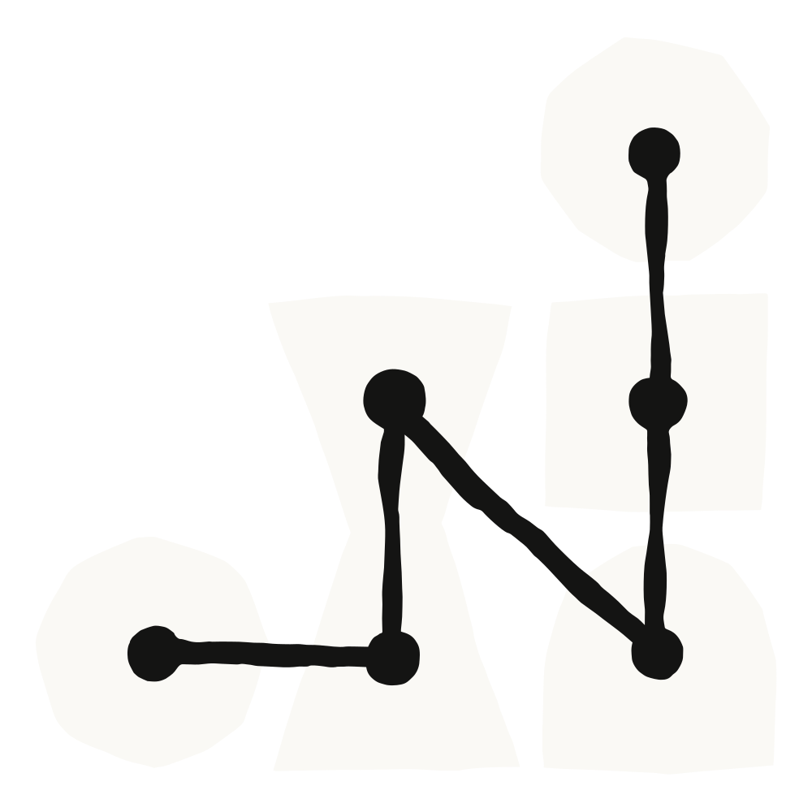
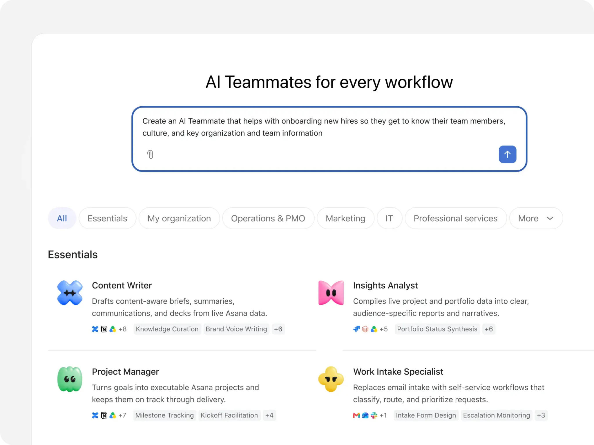

# 可调教的 agent：Asana 如何用 Claude 构建人机协作团队（中英对照）

> 原文标题：Agents you can coach: how Asana builds human-agent teams with Claude
> 原文链接：https://claude.com/blog/agents-you-can-coach-how-asana-builds-human-agent-teams-with-claude
> 原文作者：Aleksandra Todorova、Kristen Swanson（受访者：Asana CPO Arnab Bose）
> 发布日期：2026-09-29
> **翻译模型：** GLM-5.3-Flash
> **评分：** ★★★☆☆（3/5，值得一看）--Asana CPO 访谈，human-agent teams 系列第三篇
> 排版：每段英文原文在前，中文翻译紧随其后。默认收录正文主体。

**Figure 1:** Article hero illustration. / **图 1：** 文章头图插画。

*This is the third post in our series on building human-agent teams. The [first](https://claude.com/blog/building-effective-human-agent-teams) shared what we've learned working with multiplayer AI at Anthropic. The [second](https://claude.com/blog/turning-conversation-into-knowledge-how-slack-builds-human-agent-teams) shared how Slack turns workplace conversation into the context agents need. This one looks at what changes when agents operate on the same platform where teams work.*

*这是我们“构建人机协作团队”（human-agent teams）系列的第三篇文章。第一篇分享了我们在 Anthropic 用多人 AI（multiplayer AI）协作学到的经验；第二篇分享了 Slack 如何把职场对话转化为 agent 所需的上下文。这一篇要看的则是：当 agent 直接运行在团队日常工作所在的同一个平台上时，会发生什么变化。*

Years before they introduced AI agents, teams at Asana were iterating on ways to encode structure and accountability into how teams work together. They ultimately built the Work Graph® model, which maps out every task, project, goal, and conversation on a web of relationships, with defined owners, contributors, and dependencies.

在引入 AI agent 的多年前，Asana 的团队就在不断摸索：如何把结构与责任（accountability）编码进团队协作的方式之中。他们最终构建出了工作图（Work Graph®）模型：把每一项任务、项目、目标和对话都映射到一张关系网络上，并为其定义明确的负责人（owner）、参与者（contributor）和依赖关系（dependency）。

When they started building AI agents, they decided that rather than adding new context structures for AI, agents would operate within this same model. They would have defined roles, be assigned tasks, read and write messages, and show up in activity feeds alongside human collaborators—with additional safeguards around what agents can access, and share.

等到开始构建 AI agent 时，他们决定：与其为 AI 另建一套新的上下文结构，不如让 agent 直接运行在这个模型之内。agent 拥有明确的角色，会被分配任务，能读写消息，并与人类协作者一起出现在动态流（activity feed）里——同时在 agent 能访问什么、能分享什么方面附加了额外的安全约束。

We talked with Arnab Bose, Asana’s Chief Product Officer, about how Asana’s own teams use Claude and work alongside these agents, where Claude models power complex tasks: how each agent gets its role and access, who trains it, how work stays visible to everyone, and the types of jobs agents have on human-agent teams at Asana.

我们与 Asana 首席产品官（CPO）Arnab Bose 聊了聊：Asana 自己的团队如何使用 Claude、如何与这些 agent 共事，以及 Claude 模型在哪些复杂任务中发挥作用——每个 agent 如何获得角色与访问权限、由谁来训练它、工作如何保持对所有人可见，以及在 Asana 的人机协作团队（human-agent teams）里，agent 都承担哪些类型的工作。

## 先把工作想清楚、搭好结构，再让 agent 行动（Think through and structure your work before agents act on it）

For Asana employees, Claude is the default AI tool, connected to the platforms employees use to work, including Google Drive, Slack, and of course, Asana.

对 Asana 员工来说，Claude 是默认的 AI 工具，连接着员工日常工作所用的各个平台，包括 Google Drive、Slack，当然还有 Asana 本身。

"A person makes sense of their day by taking unstructured data, an idea they have, a conversation in Slack, a meeting recording in Zoom, a Databricks report, information from Google Docs,” Arnab says. “They talk it through with Claude, and then they can pump all of that into the structure that Asana provides with projects and tasks." Once the structure is in place, agents can act on it, with the three capabilities we described in the first post of this series, [Building effective human agent teams](https://claude.com/blog/building-effective-human-agent-teams) : persistent memory, their own credentials, and shared context.

“一个人是这样理清自己一天的：把非结构化的信息——一个想法、一段 Slack 对话、一份 Zoom 会议录像、一份 Databricks 报告、Google Docs 里的资料——拿来梳理，”Arnab 说，“他们与 Claude 把这些聊透，然后把所有内容注入 Asana 用项目和任务提供的结构之中。”一旦结构就位，agent 就能在其上行动，并具备本系列第一篇 [Building effective human agent teams](https://claude.com/blog/building-effective-human-agent-teams) 中描述的三种能力：持久记忆（persistent memory）、自己的凭证（credentials），以及共享上下文（shared context）。

### 如何付诸实践（How to put this into practice）

- Start with your own ideas. Bring the unstructured pieces of your day, an idea, a Slack conversation, or notes spread across docs, to Claude.

- Debate and discuss with Claude. Use it as a thinking partner: talk the idea through until the next steps are clear.

- Log the actionable items to the Work Graph. Move what's actionable into projects and tasks, where agents and colleagues can pick it up.

- 从你自己的想法出发。把你一天中那些非结构化的碎片——一个想法、一段 Slack 对话、散落在各份文档里的笔记——带到 Claude 面前。

- 与 Claude 辩论、讨论。把它当作思考伙伴（thinking partner）：把想法聊透，直到下一步行动清晰为止。

- 把可执行的事项记录到工作图（Work Graph）上。把可以行动的内容移入项目和任务，让 agent 和同事都能接手。

## 给每个 agent 明确的角色，以及它需要的工具与权限（Give every agent a role and the tools and access it needs）

Asana employees can work with AI agents in any project like they would with a human colleague. Humans design the teams they work on; each employee gets a list of recommended agents they can use to augment their teams’ goals.

Asana 员工可以在任何项目中与 AI agent 协作，就像与一位人类同事协作一样。团队由人来设计；每位员工都会拿到一份推荐 agent 清单，用来增强团队达成目标的能力。

Agents are built around roles or types of work, for example, content writer, insights analyst, project manager, work intake specialist, campaign analyst, or campaign coordinator. Each agent comes with pre-built skills based on Asana’s research into how its customers do that work, and with the integrations they would need, such as Hubspot or a document drive.

agent 围绕角色或工作类型来构建，例如内容作者（content writer）、洞察分析师（insights analyst）、项目经理（project manager）、工作需求受理专员（work intake specialist）、营销活动分析师（campaign analyst）或营销活动协调员（campaign coordinator）。每个 agent 都带有预置技能（pre-built skills）——它们来自 Asana 对客户如何完成此类工作的研究——并配备了所需的集成，比如 Hubspot 或文档云盘。

**Figure 2:** Asana’s gallery of pre-built AI teammates, organized by workflow and role. / **图 2：** Asana 预置 AI 队友（AI teammates）画廊，按工作流与角色分类。

Each agent also has a profile page that lists its name and purpose, the people who can use it, the administrators, instructions, skills, integrations, and permissions. Asana gives you the tools to make access intentional. “Asana is a contained work surface,” Arnab says. “You could choose to grant access to a specific set of projects versus everything, or a specific set of documents, or a combination of documents and apps.”

每个 agent 还有一个档案页（profile page），列出它的名字与用途、哪些人可以使用它、管理员是谁，以及指令、技能、集成与权限。Asana 提供工具，让权限授予成为一种有意识的决定。“Asana 是一个封闭的工作面（contained work surface），”Arnab 说，“你可以选择只授予某几个项目的访问权而不是全部；或者只授予某几份文档；也可以是文档与应用的组合。”

Like human users, agents are subject to explicit access controls, but have an additional safeguard: Asana says an agent’s effective access is bounded by the permissions of the person who triggers it. This allows agents to have broad access to public content, while minimizing the risk of anyone accessing information the agent has learned in a private context.

与人类用户一样，agent 也受明确的访问控制约束，但还有一道额外保障：Asana 表示，agent 的实际有效访问权限以其触发者的权限为上限。这样，agent 既能广泛访问公开内容，又能把“有人借此接触到 agent 在私密语境中学到的信息”的风险降到最低。

### 如何付诸实践（How to put this into practice）

- Define the role before you create the agent. Think about the types of jobs that agents can do on your team, then write down the agent’s purpose, instructions, and which specific jobs it owns, the way you would for a new hire’s first quarter.

- Scope access. Decide which projects and documents the agent can read, which applications it can access, and which actions it can take.

- Name users and admins separately. Many people can work with an agent, but only a small, named group should govern what it can access and how it behaves.

- 在创建 agent 之前先定义角色。想清楚 agent 能在你的团队里承担哪些类型的工作，然后写下它的用途、指令，以及它具体负责哪些工作——就像为新员工写入职第一个季度的岗位说明那样。

- 限定访问范围。决定 agent 可以读哪些项目和文档、可以使用哪些应用、可以执行哪些操作。

- 使用者与管理员分开指定。很多人可以与某个 agent 协作，但只有一小群点名到人的人，才应该治理它能访问什么、如何行事。

## 把“使用 agent”与“训练 agent”分开（Separate working with an agent from training it）

A key feature of Asana’s agents, which it calls AI teammates, is shared memory, which enables an agent to retain information from previous instructions, allowing multiple users to reuse that memory to complete tasks or jobs faster. “AI teammates can be coached and trained as if they were a person on your team,” Arnab says.

Asana 把自己的 agent 称为 AI 队友（AI teammates），它们的一个关键特性是共享记忆（shared memory）：agent 能保留此前指令中的信息，多位用户可以复用这些记忆，从而更快地完成任务或工作。“AI 队友可以像你团队里的一个人那样被调教（coach）和训练，”Arnab 说。

There is one role-based restriction in how shared memory works. While anyone can give an agent feedback on a task, only admins and editors can commit feedback to permanent memory, as well as undo, or delete from that memory. For everyone else, the feedback they provide applies only to the current task.

共享记忆的运作有一条基于角色的限制。任何人都可以就某个任务给 agent 反馈，但只有管理员（admin）和编辑者（editor）能把反馈写入永久记忆，也只有他们能撤销或从中删除内容。对其他所有人来说，他们提供的反馈只对当前任务生效。

The split is intentional, Arnab says. Asana's communications team hold the pen on the company's voice and tone, so they would be the editors and admins of an agent that writes. Arnab can draft with it, but he can't modify its behavior. And most people never need to touch the machinery at all: "Not everybody on the team needs to understand these concepts, like skills and behavior and memory. There are one or two people on the team who become experts, they set it up correctly, and all the other human beings on the team get the same benefits going forward."

Arnab 说，这种拆分是有意为之。Asana 的传播团队掌管着公司语气语调的笔杆子，所以他们会是一个写作类 agent 的编辑者和管理员。Arnab 可以用它起草，但他不能修改它的行为。而且大多数人根本不需要碰那些机器内部构造：“不是团队里每个人都得理解这些概念，比如技能、行为和记忆。团队里有一两个人成为专家，他们把它正确地设置好，之后团队里所有其他人都能持续获得同样的好处。”

### 如何付诸实践（How to put this into practice）

- Decide who trains each agent, and who works with it. Identify subject matter experts inside your business who can help build the agents that the team uses. Everyone else can provide feedback on tasks, but cannot rewrite the agent.

- Match editors to expertise. The team that owns the standard the agent applies, like brand voice or planning conventions, owns (or administers) the agent.

- Build the memory as you work. Feedback can improve the agent with time. Ask the agent to remember decisions worth keeping, or delete ones that are no longer relevant or true.

- 决定由谁训练每个 agent、由谁与它协作。找出你业务内部的主题专家（subject matter experts），请他们帮忙构建团队要用的 agent。其他所有人都可以就任务提供反馈，但不能改写 agent 本身。

- 让编辑者与专业知识对口。谁拥有 agent 所执行的标准——比如品牌语气或规划惯例——谁就拥有（或管理）这个 agent。

- 在工作中逐步构建记忆。反馈会让 agent 随时间变得更好。让 agent 记住值得保留的决定，或删掉不再相关、不再成立的内容。

## 让 agent 的工作留在人人可见的地方（Keep the agent’s work where everyone can see it）

Similar to how [agents in Slack post transparently in channels](https://claude.com/blog/turning-conversation-into-knowledge-how-slack-builds-human-agent-teams) , when a task is assigned to an AI teammate everyone can see that an agent is doing it, and what it does. The agent posts activity, including its research plan and the steps it took, so everyone with access to that task can read what it did, comment, and steer it toward the result they want.

与 [Slack 中的 agent 在频道里透明发帖](https://claude.com/blog/turning-conversation-into-knowledge-how-slack-builds-human-agent-teams) 类似：当一个任务被分配给 AI 队友时，所有人都能看到这个任务正由某个 agent 处理，以及它在做什么。agent 会发布动态，包括它的研究计划和采取的步骤，因此每个能访问该任务的人都可以读到它做了什么、发表评论，并把它引向自己想要的结果。

When Asana’s communications team asked Arnab to review a briefing document for a speaking engagement, he @-mentioned the agent on the task and asked it to also factor in his talk track from an earlier talk. The message was brief because he had used that agent many times and the material he referenced was already in the Work Graph. A colleague on the communications team could see his request and the agent’s response, and go back and forth with the agent at the same time.

当 Asana 的传播团队请 Arnab 审阅一份演讲活动的简报文档时，他在任务上 @ 了那个 agent，并要求它把自己早前一次演讲的讲稿要点（talk track）也纳入考量。消息很简短，因为他已经多次使用那个 agent，而且他引用的材料早已在工作图里。传播团队的一位同事可以看到他的请求和 agent 的回应，并且与此同时与 agent 来回互动。

"You could probably get great quality responses from a one-on-one AI agent if you are highly AI fluent, get that document out, and post it back into Slack or into Asana," Arnab says. "But at that point, the other human beings who are reviewing that content don't know what the prompt was and what the back-and-forth was. If they disagree with some of the guidance you provided, that's impossible for them to get aligned on." On a shared task, the request, the pushback, and the output are in one place, and the people reviewing the output can also revise the instructions that produced it.

“如果你对 AI 非常熟练，你或许也能从一个一对一的 AI agent 那里得到质量很高的回答，把文档拿出来，再贴回 Slack 或 Asana，”Arnab 说。“但这样一来，其他审阅这些内容的人就不知道提示词（prompt）是什么、来回沟通过什么。如果他们不认同你给出的某些指引，他们也无法就此达成一致。”而在共享任务上，请求、质疑（pushback）和产出都在同一个地方，审阅产出的人还可以直接修改产生这些产出的指令。

### 如何付诸实践（How to put this into practice）

- Bring in agents where your team reviews work. This way, the request, the agent’s steps, and the results are in one place, and reviewers can change the instructions or the output.

- Make agent work visibly agent work. This way, people will know the work is being done by an AI agent rather than a human colleague.

- Enable reviewers to coach the agent’s work. Asana’s agents post their plan and steps in the shared task, so other reviewers can provide further instructions or feedback.

- 在团队审阅工作的环节引入 agent。这样，请求、agent 的步骤和结果都在同一个地方，审阅者可以修改指令或产出。

- 让 agent 的工作显性地表现为 agent 的工作。这样，人们就会知道这项工作是由 AI agent 而不是人类同事完成的。

- 让审阅者能够调教（coach）agent 的工作。Asana 的 agent 会把计划和步骤贴在共享任务里，其他审阅者因此可以提供进一步的指令或反馈。

## Asana 交给 agent 的三项工作（Three jobs Asana has handed to agents）

Claude powers any agentic work that generates documents or runs complex tasks at Asana. Here are three examples from different teams across the company:

在 Asana，凡是生成文档或执行复杂任务的 agentic 工作，背后都由 Claude 驱动。以下是来自公司不同团队的三个例子：

### 在 Slack 频道里回答产品问题（Answering product questions from a Slack channel）

As Asana launches features, sellers and customer success staff can ask questions in a shared Slack channel. Before AI teammates, the same questions were posted repeatedly and subject-matter experts were @-mentioned each time. A searchable knowledge base wasn’t a practical solution, Arnab says, because the answers are nuanced and they change. "You kind of need to have some amount of taste-making around what is the current state of the product," he says.

随着 Asana 不断上线新功能，销售人员和客户成功人员可以在一个共享的 Slack 频道里提问。在 AI 队友出现之前，同样的问题被反复提出，主题专家（subject-matter experts）每次都会被 @。Arnab 说，一个可搜索的知识库并不是可行的解决方案，因为答案是微妙且不断变化的。“对于‘产品当前处于什么状态’这件事，你需要某种品味把关（taste-making），”他说。

Those questions still go to Slack, because that's the simplest place for the field to ask. Now, an Asana app in the channel turns each question into an Asana task, and an agent picks it up. If approved guidance exists, the agent replies with source links. If there is no approved answer and the question points to a gap in the product, the agent creates a task in the product team's intake project and adds it to the backlog. And if the same question keeps coming up and the agent keeps posting the same record, it creates a task for the enablement team to update the training material and documentation.

这些问题仍然去 Slack 提，因为对一线（field）团队来说，那是最简单的提问场所。现在，频道里的一个 Asana 应用把每个问题变成一条 Asana 任务，由一个 agent 接手。如果存在已获批准的指引，agent 会附上来源链接作答。如果没有获批的答案，而问题指向产品的某个缺口，agent 就会在产品团队的需求受理项目里创建任务并加入待办清单（backlog）。而如果同一个问题反复出现、agent 反复贴出同样的记录，它会为赋能团队（enablement team）创建一个任务，去更新培训材料和文档。

This process frees up valuable time for the enablement team to focus on strategic, higher priority work, while also informing other areas of the business. For example, if there are a lot of questions on a particular topic around a new product, that’s a signal for the enablement team to focus on it with extra training or information.

这一流程为赋能团队腾出了宝贵时间，让他们能专注于战略性的、优先级更高的工作，同时也为业务的其他领域提供信息。比如，如果围绕某个新产品、某个特定主题的问题特别多，那就是一个信号，提示赋能团队应该通过额外的培训或资料来重点关注它。

### 向高管简报有续约风险的客户（Briefing executives on at-risk renewals）

Asana's Chief Customer Officer, Josh Abdulla, used to produce a weekly at-risk renewals briefing for the executive team based on updates from customer success managers (CSMs) who flagged at-risk renewals and updated accounts as conditions changed. Across thousands of customers globally, the volume of updates made it impossible to stay current without a dedicated person synthesizing them, which was tedious work, and it made the process reactive. "Josh knew about problems when leaders told him, not when the data first showed it," Arnab says.

Asana 的首席客户官 Josh Abdulla 过去每周要为高管团队制作一份续约风险（at-risk renewals）简报，依据是客户成功经理（CSM）的更新——他们会标记有续约风险的客户，并随情况变化更新账户状态。面对全球数千家客户，更新量大到如果没有专人汇总就无法跟上最新情况；这种专人汇总是件枯燥的活，而且让整个流程变得被动。“Josh 是在领导告诉他时才知道问题，而不是在数据最初显现时，”Arnab 说。

The customer experience organization built an agent AI teammate in Asana called At-Risk Renewal. It reads every at-risk renewal task across the global portfolio, including each CSM's updates, status notes, and comments, and generates a structured daily digest organized into three buckets: positive momentum, negative momentum, and recommended follow-ups. It runs a global view first, then cuts by region, and pushes the digest automatically each morning to the Chief Customer Officer, the Chief Revenue Officer, and every regional customer success leader. Because the digest lands in a shared space, those leaders can ask follow-up questions, such as what the leading indicators were behind a particular account's churn forecast, and coach the agent to remember things for the next run, so the report improves each morning.

客户体验（customer experience）组织在 Asana 里构建了一个名为 At-Risk Renewal（续约风险）的 agent AI 队友。它会读取全球客户组合中每一条有续约风险的任务，包括每位 CSM 的更新、状态备注和评论，然后生成一份结构化的每日摘要，分为三个类别：正向势头（positive momentum）、负向势头（negative momentum）和建议跟进（recommended follow-ups）。它先给出全球视角，再按区域切分，并每天早晨自动推送给首席客户官、首席营收官（CRO）以及每位区域客户成功负责人。因为摘要落在一个共享空间里，这些负责人可以追问后续问题——比如某个账户流失预测背后的先行指标（leading indicators）是什么——还可以调教（coach）agent 记住一些内容供下次运行使用，让报告每天早晨都变得更好。

"They could probably have Claude generate a report for themselves," Arnab says. "But how do we get to the place where there's standardization of the report, there's a shared workspace, and it keeps getting better with every single run?"

“他们本来也可以让 Claude 给自己生成一份报告，”Arnab 说。“但怎样才能走到那一步：报告是标准化的，有一个共享工作区，而且每运行一次都变得更好一点？”

### 用 Command 规划工程周期（Planning engineering cycles with Command）

When Asana ran automated coding loops on its own product, its cycle times and releases slipped, because the cycles were getting bloated by automatically generated changes. The loop itself has become common at software companies: gather customer feedback from various channels, synthesize it, and trigger coding agents to turn it into pull requests (PRs). "Code generation is now no longer the bottleneck," Arnab says. "The bottleneck is around planning, decision-making, and refinement." Asana's engineering organization now runs on Command by Asana, a product for managing large engineering teams, and uses it to manage that loop.

当 Asana 在自己的产品上运行自动化编码循环时，周期时长和发布节奏都被拖慢了，因为周期被自动生成的改动撑得越来越臃肿。这种循环本身在软件公司已经很常见：从各个渠道收集客户反馈，加以综合，然后触发编码 agent 把反馈变成拉取请求（PR）。“代码生成如今已不再是瓶颈，”Arnab 说。“瓶颈在于规划、决策和打磨（refinement）。”Asana 的工程组织现在运行在 Command by Asana 之上——一个用于管理大型工程团队的产品——并用它来管理这个循环。

In Command, a team space holds a group of 10 to 12 engineers who work on one product. Agents populate the team's unplanned board with tickets pulled from customer feedback and from comments in the team's feedback channel in Slack. People decide what moves from that board into the cycle, and Command predicts time to completion for the cycle with optimistic, balanced, and conservative estimates.

在 Command 中，一个团队空间（team space）容纳一组 10 到 12 名、做同一个产品的工程师。agent 会把从客户反馈、以及从团队 Slack 反馈频道评论中提取的工单，填进团队的非计划看板（unplanned board）。由人来决定哪些从看板进入本轮周期（cycle），而 Command 会用乐观（optimistic）、均衡（balanced）、保守（conservative）三种估算来预测周期的完成时间。

A ticket can be assigned to a person or to a coding agent, and because the cycle data is all in one place, a manager can ask in chat why a release is off track and what tradeoffs would bring it back. Command answers from the data with what's driving the signal and which changes to trade. All of it is exposed through Asana's MCP server, the connection that lets an assistant like Claude read it, so someone like Arnab or his CTO counterpart can ask Claude what's on track without opening Command.

一张工单既可以分配给人，也可以分配给编码 agent；又因为周期数据都在同一个地方，管理者可以在聊天里直接问：为什么某个发布偏离了轨道、做哪些取舍能把它拉回来。Command 会基于数据回答：是什么在驱动这个信号、该拿哪些改动来做交换。这一切都通过 Asana 的 MCP 服务器对外暴露——正是这条连接让 Claude 这样的助手能够读取这些数据——所以像 Arnab 或他的 CTO 同僚这样的人，不用打开 Command 就能问 Claude：哪些事情在正轨上。

“Humanity thrives when teams can work together effortlessly, and today every team is part human, part agent,” Arnab says. “That’s the kind of work we design for: one shared context that both humans and agents can work from, with a distinct identity for every agent so its contributions and access can be audited, and a durable record of what agents can learn so the team’s knowledge compounds instead of evaporating.”

“当团队可以毫不费力地协作时，人类才能蒸蒸日上，而今天的每个团队都是一半人类、一半 agent，”Arnab 说。“这正是我们所设计的产品要成就的工作方式：一份人类和 agent 都能在其上工作的共享上下文；每个 agent 都有独立的身份，让它做出的贡献和拥有的访问权限都可被审计；以及对 agent 学到之物的持久记录，让团队的知识得以复利累积，而不是蒸发散逸。”
