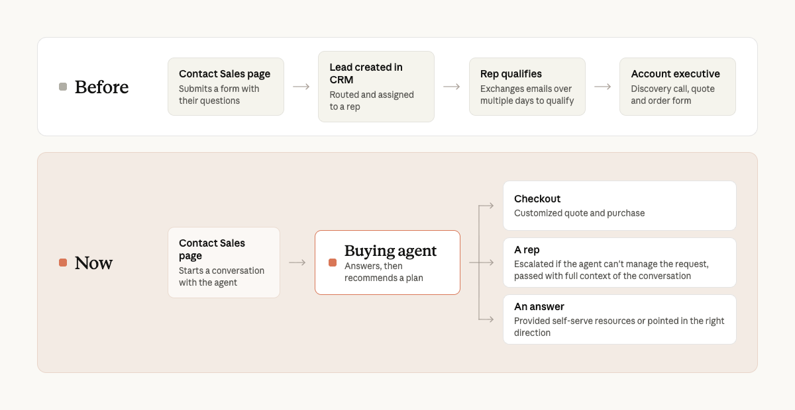
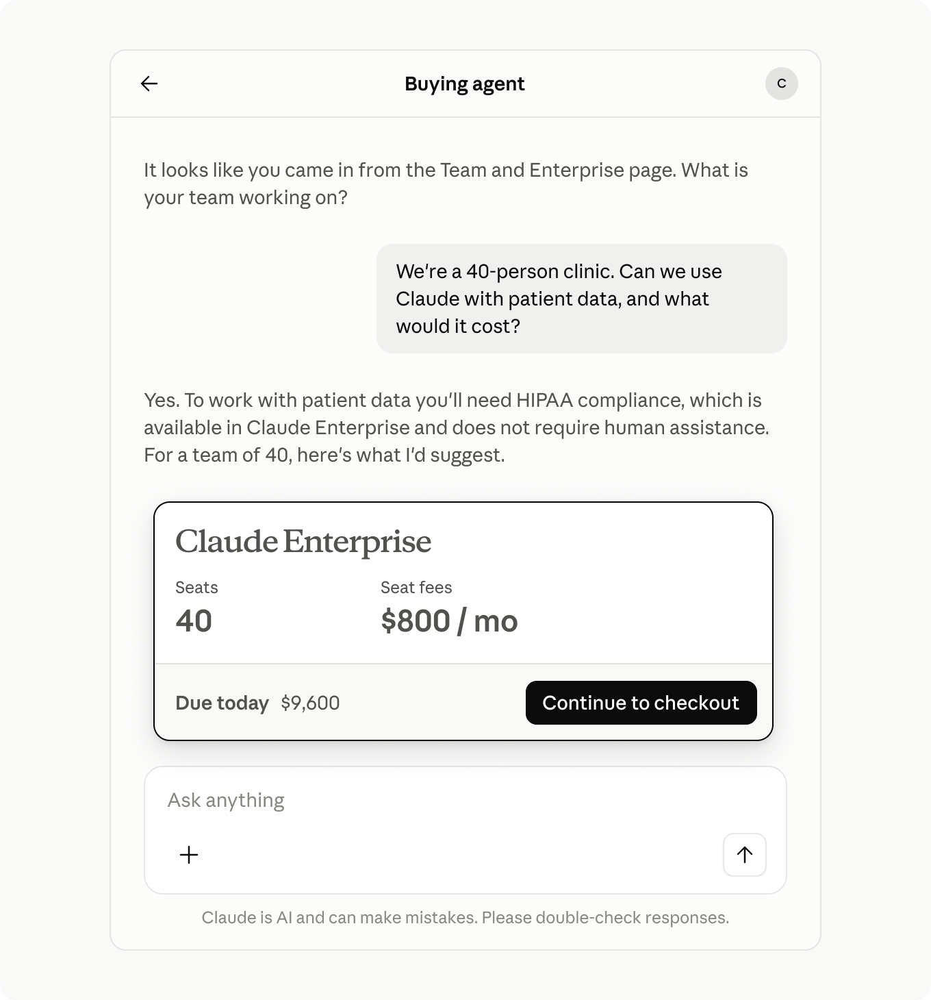
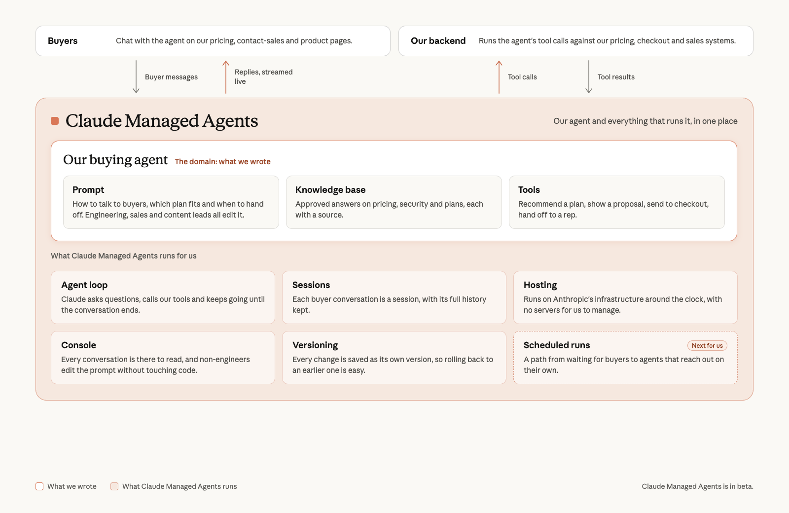

# Anthropic 销售团队如何用 Claude Managed Agents 重建 inbound（中英对照）

> 原文标题：How Anthropic's sales team rebuilt inbound with Claude Managed Agents
> 原文链接：https://claude.com/blog/how-anthropics-sales-team-rebuilt-inbound-with-claude-managed-agents
> 原文作者：Carl Johnson（Anthropic 销售开发负责人，sales development leader）
> 发布日期：2026-09-30
> **翻译模型：** GLM-5.3-Flash
> **评分：** ★★★☆☆ —— Anthropic 销售团队用 Managed Agents 重建 inbound 流程的一手实践复盘，含可借鉴的 agent 设计与组织落地经验
> 排版：每段英文原文在前，中文翻译紧随其后。默认收录正文主体。

As a sales leader, it pains me to admit that not long ago, people who wanted to buy Claude for their company weren't getting the answers they needed quickly enough. They had filled out our Contact Sales form but would wait too long to hear back, sometimes for multiple days. Most of their questions were simple: what a plan costs, whether there's a seat minimum, or whether we can meet HIPAA's contract requirements. The answers were in our documentation and support articles, but customers wanted someone to walk them through, quickly.

作为销售负责人，我不太情愿地承认：不久之前，那些想为公司采购 Claude 的人，往往不能足够快地得到他们需要的答案。他们填好了我们的 Contact Sales（联系销售）表单，却要等很久才有回音，有时长达数天。他们的问题大多很简单：某个方案多少钱、有没有最低席位数（seat minimum）要求、我们能否满足 HIPAA 的合同要求。答案明明就在我们的文档和支持文章里，但客户想要有人带着他们快速过一遍。

So we built a buying agent on Claude Managed Agents (beta) that takes a prospect from "I want Claude for my company" to a completed purchase. The buying agent now holds thousands of conversations a day, answers customers' most pressing questions, and gets them through checkout. The customers it escalates to our team arrive educated and more ready to make purchase decisions: they turn into opportunities more than twice as often as leads from the old form, and close about five days faster. We intentionally left this experience as opt-in, meaning our customers choose at the start if they'd like to talk to an agent or sales rep based on their preference.

于是我们在 Claude Managed Agents（beta，托管代理平台）上构建了一个购买代理（buying agent），把潜在客户（prospect）从"我想为公司购买 Claude"一路带到完成购买。如今这个购买代理每天承接数千场对话，回答客户最紧迫的问题，并引导他们完成结账（checkout）。被它升级转接（escalate）给我们团队的客户，都是已经做过功课、更接近购买决策的人：他们转化为销售机会（opportunity）的比率是旧表单线索（lead）的两倍多，成交周期快了约五天。我们有意把这个体验做成自愿选择（opt-in）：客户可以在一开始就按自己的偏好，选择与代理聊还是与销售代表谈。

**Figure 1:** The inbound flow, before and after: the old path (Contact Sales page → lead created in CRM → rep qualifies → account executive) versus the new path (Contact Sales page → buying agent → checkout, a rep, or an answer).

**图 1：** inbound 流程的前后对比：旧路径（Contact Sales 页面 → CRM 创建线索 → 销售代表做资格审核 → 客户经理）与新路径（Contact Sales 页面 → 购买代理 → 结账购买 / 转人工 / 直接解答）。

### 为什么旧的 inbound 流程失效了（Why the old inbound process broke）

Before building the buying agent, our inbound process was fairly straightforward. A buyer filled out a form. The lead was routed to a business development rep, who qualified it and passed it to an account executive. That still works well when a team can talk to everyone who's interested in the product.

在构建购买代理之前，我们的 inbound（入站咨询）流程相当直接：买家填一张表单，线索被分派给一位商务拓展代表（BDR, business development rep），由他做资格审核（qualify）后再转给客户经理（AE, account executive）。只要团队能和每一位对产品感兴趣的人谈上话，这套流程依然运转良好。

We had tens of thousands of inbound requests every month, and our inbound BDR team couldn't keep up. Reps spent their days answering questions the docs already covered, and we didn't have an effective way to reach all of the customers in the queue. This wasn't the experience we wanted for our customers.

我们每月有数以万计的 inbound 请求，inbound BDR 团队根本应接不暇。销售代表把大量时间花在回答文档里已经写清楚的问题上，而队列里排着的客户，我们也没有有效的办法一一触达。这不是我们希望给客户的体验。

We wanted every customer to get a knowledgeable answer at any hour and in any language, and to be able to buy however they preferred, which often means without talking to a sales rep. We wanted our reps to spend their time on the conversations where they can change the trajectory of the outcome.

我们希望每位客户在任何时间、用任何语言都能得到专业的解答，能以自己偏好的方式完成购买——这往往意味着不与销售代表交谈。我们也希望销售代表把时间花在那些他们能真正改变结果走向的对话上。

### 弥合差距的购买代理（A buying agent that closes the gap）

We deployed the agent where customers were already asking questions: on our Contact Sales and Pricing pages, inside the product, and in our emails. Any customer can find the buying agent within our Claude.ai product, it's a simple chat experience to help customers understand what plan is best for them. A customer describes what their team needs, the agent asks a few follow-up questions, and it then answers the ones about pricing, security and data before recommending a plan and seat count. Each conversation ends one of three ways:

我们把代理部署到了客户原本就在提问的地方：Contact Sales 与 Pricing 页面、产品内部，以及我们的邮件中。任何客户都能在 Claude.ai 产品里找到这个购买代理——它是一个简单的聊天体验，帮助客户弄清哪个方案最适合自己。客户描述团队的需求，代理追问几个问题，然后解答有关定价、安全与数据的疑问，最后推荐方案和席位数。每场对话都以三种方式之一收尾：

- **Purchase.** The buyer goes straight to checkout.

  **购买（Purchase）。** 买家直接进入结账流程。

- **Hand-off.** For larger or more complex deals, the agent passes the buyer to a rep along with the full conversation details.

  **转人工（Hand-off）。** 对于更大或更复杂的交易，代理会把买家转给销售代表，并附上完整的对话细节。

- **A quick answer.** Sometimes that's all a customer needs.

  **一个快速的答案。** 有时候客户需要的仅此而已。

We built the agent to follow the same work of our sales reps, which means understanding what the customer is trying to solve, what their current Claude usage looks like, and how we can best help them.

我们让代理遵循与销售代表相同的工作方式：先弄清客户想解决什么问题、他们目前使用 Claude 的情况如何，以及我们能怎样最好地帮助他们。

**Figure 2:** A buying agent conversation: a 40-person clinic asks whether Claude can be used with patient data and what it would cost; the agent confirms HIPAA compliance is available on Claude Enterprise and presents a 40-seat, $800/month quote with a path straight to checkout.

**图 2：** 购买代理的一段对话：一家 40 人的诊所询问能否在患者数据上使用 Claude、价格多少；代理确认 Claude Enterprise 支持 HIPAA 合规，并给出 40 席位、每月 800 美元的报价，可直接进入结账。

### 为什么选择 Claude Managed Agents？（Why did we use Claude Managed Agents?）

Under the hood, the buying agent is simple: a prompt, a handful of tools, and Claude, running on Claude Managed Agents. Because the platform takes care of hosting, session management and tool orchestration, our engineers spent their time with sales designing the buying experience instead of building the infrastructure.

拆开来看，购买代理其实很简单：一个 prompt（提示词）、少量工具，加上运行在 Claude Managed Agents 上的 Claude。由于平台替我们处理了托管（hosting）、会话管理（session management）和工具编排（tool orchestration），工程师得以把时间花在与销售团队一起设计购买体验上，而不是搭建基础设施。

We ultimately landed on Managed Agents for the following reasons:

我们最终选择 Managed Agents，出于以下原因：

- **Fast to production.** One engineer built the initial buying agent on Managed Agents in just a few weeks.

  **快速上线（Fast to production）。** 一位工程师仅用几周就在 Managed Agents 上搭出了购买代理的初始版本。

- **Tech & non-tech contributors.** Engineering owned the code, but sales and content leads reviewed and edited the system prompt directly in the Console. Changes went to our staging agent first, so anyone could try a tweak before it reached customers.

  **技术与非技术成员都能参与。** 代码由工程团队负责，但销售与内容负责人可以直接在 Console（控制台）里审阅并修改 system prompt（系统提示词）。改动先进入我们的 staging（预发布）代理，任何人在改动触达客户之前都可以先试一试。

- **Focus on the domain, not the harness.** Managed Agents runs the agent loop, sessions and hosting. We spent our time on the prompt, the tools, and the knowledge base—the three things that are specific to selling.

  **专注于领域，而非脚手架（harness）。** 代理循环（agent loop）、会话和托管都由 Managed Agents 负责。我们把时间花在 prompt、工具和知识库上——这三样才是"卖东西"特有的部分。

- **Versioning makes iteration less expensive.** Every change to the agent is saved as its own version. We were on v7 about a week into internal testing, and we kept shipping prompt changes weekly after launch. When needed, we could easily point new sessions back to a previous version.

  **版本管理让迭代更便宜。** 对代理的每一处修改都会保存为独立版本（versioning）。内部测试约一周时我们已经迭代到 v7，上线后仍保持每周发布 prompt 更新。必要时，我们可以轻松地把新会话指回某个旧版本。

- **Flexibility to support more use cases.** Today, customers discover the agent on our website. Managed Agents supports scheduled runs, which gives us a path to explore other types of customer engagement.

  **支撑更多用例的灵活性。** 如今，客户在我们的网站上发现这个代理。Managed Agents 支持定时运行（scheduled runs），这为我们探索其他类型的客户互动留出了路径。

**Figure 3:** The buying agent's architecture on Claude Managed Agents: what we wrote (prompt, knowledge base, tools) versus what Managed Agents runs for us (agent loop, sessions, hosting, console, versioning, scheduled runs).

**图 3：** 基于 Claude Managed Agents 的购买代理架构：我们编写的部分（prompt、知识库、工具）与 Managed Agents 代为运行的部分（代理循环、会话、托管、Console、版本管理、定时运行）。

### 构建购买代理的心得（What we learned building the buying agent）

**Give Claude a goal, not rules.** Explaining the goal of the agent worked better than a detailed list of instructions. For example, something as simple as "Your goal is to understand customer requirements, qualify prospects, and recommend the best plan" was more effective than listing out every qualification requirement in a flowchart.

**给 Claude 一个目标，而不是一堆规则。** 讲清楚代理的目标，比罗列一份详尽的指令清单更有效。比如，一句简单的"你的目标是理解客户需求、审核潜在客户的资格，并推荐最合适的方案"，比在流程图里列全每一条审核标准效果更好。

**Less is more.** We experimented with prompts of varying lengths, complexity, and structure, and found the maxim of 'less is more' works best. Models today can understand complex, nuanced goals and work backwards from them. In practice, that has meant getting out of Claude's way by giving it the knowledge and context it needs to be successful, such as what seat-based pricing covers or when billing cycles run.

**少即是多（Less is more）。** 我们试验了不同长度、复杂度和结构的 prompt，发现"少即是多"这条箴言最管用。如今的模型能够理解复杂而微妙的目标，并从目标出发反推做法。落实到实践中，就是不要碍 Claude 的事：把它成功所需的知识和上下文交给它，比如按席位计费（seat-based pricing）都涵盖什么、计费周期何时运行等。

**Use SMEs in the development loop.** This is something that is becoming increasingly valuable in a world where agent coding is speeding up development cycles. By virtue of saving time using Managed Agents and Claude Code, our engineers were able to spend more time with the sales team to shape a customer-centric experience. We were able to test the agent early and often, leading to quick iterations.

**把领域专家（SME, subject-matter expert）纳入开发循环。** 在 agent 编程不断加快开发周期的今天，这一点越来越有价值。借助于 Managed Agents 和 Claude Code 省下的时间，工程师能花更多时间与销售团队一起打磨以客户为中心的体验。我们可以尽早且频繁地测试代理，从而实现快速迭代。

**Focus on what's right for the customer.** The agent often points small teams to our Team plan instead of Enterprise, because that's the right answer for them in some cases. We decided that's a feature. A buyer who lands on the right plan instead of being upsold is more likely to stay and have a better experience.

**聚焦对客户正确的选择。** 代理经常建议小团队选择 Team 方案而不是 Enterprise，因为在某些情况下那才是对他们正确的答案。我们把这当作一个特性而非缺陷：买到合适方案的买家，比被向上销售（upsell）的买家更可能留下来，也会有更好的体验。

**Treat every agent to rep escalation as feedback.** Each time the agent passes a buyer to a rep, it explains why. Early on, most of those reasons were things customers couldn't yet do on their own with our self-service products. Those reasons shaped how we improve the experience, and the share of conversations that needed a person to help close the deal has fallen by about half.

**把每一次"代理转人工"都当作反馈。** 每当代理把买家转给销售代表，它都会说明原因。早期，这些原因大多是客户在我们的自助服务（self-serve）产品里还做不到的事。这些原因塑造了我们改进体验的方向，需要人来协助才能成交的对话占比已经下降了约一半。

### 对客户来说改变了什么（What changed for customers）

The agent now holds thousands of conversations a day, around the clock. Customers get their questions answered instantly instead of waiting for a scheduled call or exchanging emails over multiple days. A lot of our customers actually prefer to talk to an agent rather than a human, because it can give them quick, informed answers as questions arise. Many of our new self-serve Enterprise customers talk to the buying agent before they buy, and we've found that those who talked to the agent beforehand had a better understanding of what they were buying.

如今这个代理每天全天候（around the clock）承接数千场对话。客户的问题可以即刻得到解答，不用再等预约电话，也不用在邮件里往来好几天。实际上，很多客户更喜欢和代理而不是真人交谈，因为代理能在问题出现时立刻给出快捷且有依据的回答。许多新的自助式（self-serve）Enterprise 客户在购买前都会先和购买代理聊一聊，我们发现，事先与代理谈过的客户，对自己要买的东西理解得更清楚。

### 代理如何改变了我们的销售组织（How the agent changed our sales organization）

The agent changed what our reps spend their days. We've now been able to focus the majority of the team's time and energy on educating customers earlier in their buying journey, having more live customer conversations and spending time in person at events.

代理改变了销售代表每天的工作内容。现在我们能把团队大部分时间和精力集中到几件事上：在客户购买旅程的更早阶段做教育、进行更多实时客户对话，以及花时间线下参加活动。

The most impactful change has been that our reps now get more informed leads, convert leads to sales opportunities more often than our old contact form, and they close about five days faster. A rep starts the conversation already knowing what the customer needs, what they've been told, and how we can best help them.

影响最大的变化是：销售代表现在拿到的线索信息更充分，把线索转化为销售机会的比率高于旧的联系表单，成交也快了约五天。代表开始对话时就已经知道客户需要什么、已经被告知了什么，以及我们能怎样最好地帮助他们。

For example, one of our inside sales reps, Ojas, used to exchange about 10 emails to close a deal; now it takes about six. He's been able to 2.5x his output on closed won deals since launching the Buying Agent as it allowed him to focus on highly educated and ready customers who just needed help getting across the line.

举个例子，我们的一位内部销售（inside sales）代表 Ojas，过去成交一单大约要往来 10 封邮件，现在大约 6 封。自从购买代理上线以来，他的已成交订单（closed won）产出达到了原来的 2.5 倍，因为他可以专注于那些已经充分了解产品、只差临门一脚的客户。

Not long ago, inbound was a queue our team couldn't keep up with. Now it's a conversation any buyer can start at any hour, and our reps spend their time more efficiently. The buying agent is our first step toward agents across the whole customer relationship.

不久之前，inbound 还是一条我们团队跟不上的队列。现在，它是任何买家在任何时刻都能开启的一场对话，而我们的销售代表也能更高效地使用自己的时间。购买代理是我们迈向"覆盖整个客户关系的代理"的第一步。

This article was written by Carl Johnson, with contributions from Izzy Lee, Bobby P., Lina Ochman, Yana Gevorgyan, Jerico Johns, and Taylre Duarte.

本文由 Carl Johnson 撰写，Izzy Lee、Bobby P.、Lina Ochman、Yana Gevorgyan、Jerico Johns 和 Taylre Duarte 参与贡献。
