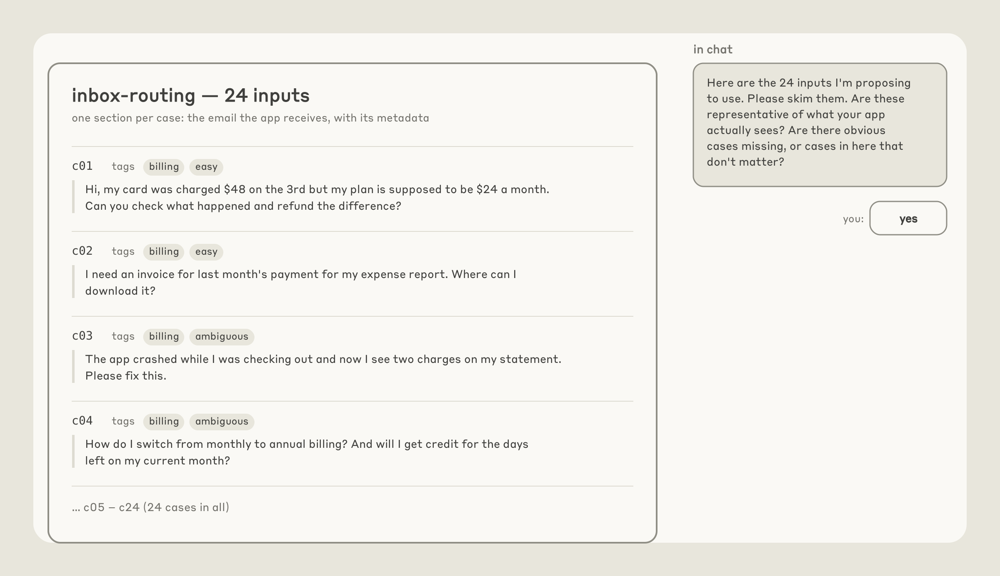

# 用 Claude 自动化评测（Eval）设计与 Hillclimbing 爬山法优化（中英对照）

> **原文标题：** Automating eval design and hillclimbing with Claude
> **原文链接：** https://claude.dev/blog/automating-eval-design-and-hillclimbing/
> **原文作者：** Lance Martin（Member of Technical Staff，Anthropic）
> **发布日期：** 2026-09-28
> **翻译模型：** GLM-5.3-Flash
> **评分：** ★★★★☆ —— 把评测（eval）设计与 hillclimbing（爬山法）的工程原则沉淀为 `/claude-api build-eval`、`/claude-api hillclimb` 两条命令化工作流：评分器（grader）校验、train/test 拆分防过拟合、噪音与 headroom（提升空间）检查，并用真实成本与性能案例佐证，是"验证回路"的完整工程实践。
> 排版：每段英文原文在前，中文翻译紧随其后。默认收录正文主体。术语保留英文并附中文释义。

---

Principles for designing evals and hillclimbing against them without fooling yourself, and how the claude-api skill's build-eval and hillclimb commands put them to work.

设计评测（eval）、并对照评测做 hillclimbing（爬山法优化）而不自欺欺人的原则，以及 [claude-api skill](https://github.com/anthropics/skills/tree/main/skills/claude-api) 的 `build-eval` 与 `hillclimb` 命令如何把这些原则付诸实践。

Evaluations provide a signal on how your app or skill is performing on specific tasks. But designing evaluations, and improving performance on them without fooling yourself, is hard. We've added guidance for both to the [claude-api skill](https://github.com/anthropics/skills/tree/main/skills/claude-api).

评测（eval，evaluation 的简称）为你的应用或 skill 在特定任务上的表现提供信号。但设计评测、并在不自欺欺人的前提下提升评测成绩，是件难事。我们已把这两方面的指南加入了 [claude-api skill](https://github.com/anthropics/skills/tree/main/skills/claude-api)。

With the skill, you can run `/claude-api build-eval` to build an evaluation inside your codebase, and run `/claude-api hillclimb` to improve your application against it, one change at a time, with a held-out set of examples to catch overfitting.

借助这个 skill，你可以运行 `/claude-api build-eval` 在你的代码库中构建评测，再运行 `/claude-api hillclimb` 对照评测改进你的应用：一次只做一处改动，并用一套留出（held-out）示例集来捕捉过拟合（overfitting）。

In this article, we highlight the principles of good eval design and hillclimbing first, then show how Claude Code with the `claude-api` skill applies those principles. We'll close by showing a few examples of these commands.

在本文中，我们先讲清良好 eval 设计与 hillclimbing 的原则，然后展示带 `claude-api` skill 的 Claude Code 如何践行这些原则，最后给出这些命令的几个实例。

# 评测设计（Eval design）

Well designed evaluations have a few common elements (Figure 1):

设计良好的评测有几个共同要素（图 1）：

1. **Eval tasks mirror production.** Sample tasks that you care about in "production," or the setting in which the capability or application you are testing will be used. Sometimes tasks are picked because they are easy to generate or they are easy to grade. But it's important to ensure that the task distribution represents what you *actually* care about.
2. **Performance improves with stronger models and more thinking**. More capable models and higher effort levels typically should perform better on an evaluation. If they don't, ambiguous tasks or a miscalibrated grader often are hobbling performance.
3. **There is "passable" headroom at the frontier**. The most capable model at the highest effort should be well below 100% on the evaluation, otherwise you can't reliably judge how changes impact performance. Importantly, the gap should not be explained by impossible or ambiguous tasks: a common tell is that a task fails every evaluation run, regardless of the number of replicates. A good task is one where two domain experts would reach the same verdict and everything the grader checks is stated in the task.
4. **Low run-to-run variance**. High variance is often due to poorly designed, ambiguous tasks or a grader that produces different verdicts on identical output. Variance can also hide in the configuration. For example, effort may not be applied consistently. Also, the environment can affect the results of the evaluation: leftover state from an earlier trial (a file, a git history) can hand the agent the answer.

1. **评测任务应映照生产环境（Eval tasks mirror production）。** 从"生产环境"——即被测能力或应用实际将被使用的场景——中采样你真正关心的任务。有时任务被选中只是因为容易生成或容易打分。但重要的是，要确保任务分布能代表你*真正*关心的东西。
2. **更强的模型与更多思考应带来更好表现（Performance improves with stronger models and more thinking）。** 能力更强的模型和更高的努力档位（effort level）通常应当在评测上表现更好。如果不是这样，往往是含糊的任务或校准失当的评分器（grader）在拖累成绩。
3. **前沿处要有"可通过"的提升空间（headroom）。** 能力最强的模型在最高努力档位下的评测成绩应远低于 100%，否则你无法可靠地判断各项改动对成绩的影响。重要的是，这个差距不应由不可能完成或含糊不清的任务造成：一个常见征兆是，无论重复运行（replicate）多少次，某个任务在每次评测运行中都会失败。好任务的标准是：两位领域专家会得出相同判定，且评分器要检查的一切内容都已在任务中言明。
4. **运行间方差要低（Low run-to-run variance）。** 高方差往往源于设计糟糕、含糊不清的任务，或是对相同输出给出不同判定的评分器。方差也可能藏在配置里，例如努力档位可能没有被一致地应用。此外，环境也会影响评测结果：此前一次试验残留的状态（一个文件、一段 git 历史）可能直接把答案递到智能体手上。

> **Figure 1:** *Figure: Score against action tokens per attempt for a smaller, a mid-size and the most capable model at low, medium and high effort. Numbered callouts mark the four elements: scores rise with a more capable model and with higher effort, the top line stays below a perfect score, and the error bars stay tight.* — *The four elements of a good eval.*
> **图 1：** *图示：较小模型、中等模型与最强模型在低/中/高努力档位下，得分对每次尝试动作 token 数的关系。带编号的标注标出四个要素：得分随模型能力增强与努力档位提高而上升，最高一条线仍低于满分，误差棒保持紧凑。* —— *好评测的四要素。*（图未收录：原页为 JS 渲染的 SVG 图表，无法静态获取）

## 对抗性采样（Adversarial sampling）

Model capability is jagged. If you pick cases because today's model fails them, you are sampling the valleys of one model's capability surface (Figure 2). The evaluation can end up measuring that model's failure fingerprint rather than what is intrinsically hard or valuable for your application to do.

模型能力是参差不齐的（jagged）。如果你因为今天的模型在某类用例上失败而挑选它们，你实际是在对某个模型能力表面的"波谷"采样（图 2）。这样的评测最终测量的可能是该模型的"失败指纹"，而不是你的应用真正有难度、有价值的事情。


> **Figure 2:** Two panels plotting capability across task space, each with today's model as a jagged curve and the next model as a smoother curve above it. On the left, cases sampled where today's model fails sit only in its valleys; on the right, cases a person judged hard are spread across peaks and valleys, with a few should-not-fire cases. — *Adversarial sampling.*
> **图 2：** 两幅面板各画出横跨任务空间的能力曲线：今日模型呈锯齿状，下一代模型是位于其上方的更平滑曲线。左图中，按"今日模型失败"采样的用例只落在其波谷；右图中，由人判定为难的用例分布于波峰与波谷之间，另有少量"不应触发"（should-not-fire）用例。 —— *对抗性采样（Adversarial sampling）。*

Pick hard cases because a human judged them hard: a useful test is to be able to say why a task is hard before you include it. Include cases that are specific failures in your application derived from production traffic, bug reports, or tickets. However, don't blindly trust user traffic: users sometimes try what they expect to work, so a task distribution drawn strictly from user traffic may skew easy.

挑选难例，要因为"人判定它难"：一个有用的检验标准是，在收录某个任务之前，你能说出它为什么难。也要收录那些来自生产流量、bug 报告或工单的、你应用中的特定失败案例。但不要盲信用户流量：用户总是尝试他们预期可行的东西，所以严格取自用户流量的任务分布可能偏容易。

# /claude-api build-eval（构建评测）

The `build-eval` command in the claude-api skill turns these principles into a guided workflow. When you run `/claude-api build-eval` in Claude Code, Claude interviews you, builds the eval inside your codebase, and pauses for approval at specific points.

claude-api skill 中的 `build-eval` 命令把这些原则变成一段有引导的工作流。在 Claude Code 中运行 `/claude-api build-eval` 时，Claude 会采访你、在你的代码库中构建评测，并在特定节点暂停等待你的批准。

## 设计示例（Designing examples）

Claude helps you sample inputs to build evaluations in this order:

Claude 按以下顺序帮你采样输入以构建评测：

1. Production transcripts, after asking about retention and sensitive data.
2. Bug reports and support tickets.
3. Five to ten cases you write by hand.
4. Cases synthesized from your codebase.

1. 生产环境的真实对话记录（transcripts），会先询问数据留存与敏感数据处理方式。
2. Bug 报告与支持工单。
3. 你亲手编写的五到十个用例。
4. 从你的代码库合成的用例。

The skill prioritizes production traffic, but it can also generate synthetic data anchored in a few real examples that you provide. The skill instructs Claude to generate a simple page that shows you every input and waits until you confirm them. As an illustration, below we show an example set of inputs for an e-mail router application that the skill may ask the user to review (Figure 3).

该 skill 优先使用生产流量，但也可以在你提供的少量真实示例基础上生成合成数据。skill 会指示 Claude 生成一个简单页面，向你展示每一条输入，并等待你逐一确认。作为示意，下面展示一个邮件路由（e-mail router）应用的示例输入集，skill 可能会请用户审阅它们（图 3）。



> **Figure 3:** The skill's review page for an inbox-routing eval with 24 inputs, listing each case's email text with tags such as billing, easy and ambiguous. Beside it, Claude asks in chat whether the inputs are representative, and the user answers yes. — *Example inputs review generated by the skill.*
> **图 3：** skill 为收件箱路由（inbox-routing）评测生成的审阅页，共 24 条输入，逐条列出邮件文本并带有 billing（计费）、easy（简单）、ambiguous（含糊）等标签。旁边聊天区里 Claude 询问这些输入是否有代表性，用户回答是。 —— *skill 生成的示例输入审阅页。*

## 验证评分器（Validating the grader）

After the inputs, Claude proposes the cheapest grader that fits your application's output:

确定输入之后，Claude 会为你的应用输出提出最省钱的评分器（grader）方案：

- **Programmatic verification**: If the output possibilities are constrained, it uses a code based check (exact match, a label from a fixed set, JSON that matches a schema, tests that pass).
- **LLM-as-judge**: It will default to this type of check if the output space is open-ended, with many valid answers but clear quality criteria. In this case, a second model reads the input, the output and a rubric written as checkable claims (not a 1-to-5 scale), and returns a score with its reasoning. If you have a baseline to compare against, the judge instead reads both inputs in random order, without being told which is the baseline, and picks the better one. You pick the judge model, and it should not be the model you are testing.

- **程序化验证（Programmatic verification）**：如果输出的可能性是受限的，它采用基于代码的检查（精确匹配、来自固定集合的标签、符合 schema 的 JSON、通过的测试）。
- **以 LLM 为裁判（LLM-as-judge）**：如果输出空间是开放式的——有许多有效答案但质量标准明确——它会默认采用这种检查。此时，由第二个模型读取输入、输出，以及一份写成"可核查论断"的评分细则（rubric，而非 1 到 5 打分），并连同理由返回分数。如果你有可对照的基线（baseline），裁判则改为以随机顺序读取两份输出，不被告知哪份是基线，并挑出更好的一份。裁判模型由你选定，且不应是你正在测试的那个模型。

Claude grades a handful of cases and asks whether you would have scored any of them differently (Figure 4). In general, it is important to [read a sample of scored transcripts](https://www.anthropic.com/engineering/demystifying-evals-for-ai-agents) before believing your evaluator; scoring failures are among the most common ways an evaluation is misconfigured.

Claude 会先给少量用例打分，然后问你：换作你，会不会有哪几条打分不一样（图 4）。一般而言，在相信你的评估器之前，先[抽读一部分已打分的对话记录](https://www.anthropic.com/engineering/demystifying-evals-for-ai-agents)非常重要；打分失败正是评测配置不当最常见的情形之一。

When you've validated the grader, the skill tells you the size of the evaluation set (cases × repeats × model, and roughly how long it will take), runs the baseline, and prints the score with a confidence interval. What you get back: the cases, the grader, the runner, one JSON line and one full transcript per case, and a plain page that lists each case's score with a link to its transcript. If you want more than that page shows (e.g., a chart), just ask and Claude will build it as an extra page next to it. By default, these extra pages are static files that open locally and load nothing from the network.

评分器验证通过后，skill 会告诉你评测集的规模（用例数 × 重复次数 × 模型，以及大致耗时），运行基线（baseline），并打印带置信区间（confidence interval）的分数。你最终会得到：用例、评分器、运行器（runner），每个用例一行 JSON 与一份完整对话记录，还有一个朴素的页面，列出每个用例的分数并附指向其对话记录的链接。如果你想要这个页面之外的东西（比如一张图表），开口要就行，Claude 会在旁边另建一页。默认情况下，这些额外页面都是静态文件，本地打开、不从网络加载任何东西。


> **Figure 4:** The skill's results page for the inbox-routing eval: a baseline scoring 0.681 mean correct across 24 cases, then a table of per-case scores with a link to each repetition. A rep link opens that case's raw JSON trace, shown alongside. — *Schematic of the results page generated with suggested grades for each input.*
> **图 4：** skill 为收件箱路由评测生成的结果页：基线在 24 个用例上平均正确率 0.681，下方是逐用例得分表，每个重复运行（rep）附链接。点击 rep 链接可打开该用例的原始 JSON 轨迹，如图右侧所示。 —— *结果页示意图：附每个输入的建议评分。*

## 诊断检查（Diagnostic checks）

During the baseline runs mentioned above, Claude checks a number of things:

在上面提到的基线运行期间，Claude 会检查若干事项：

- **Grader**: Claude runs the grader twice on the same output, and reports whether the verdict changed.
- **Plumbing**: Claude checks for timeouts, API errors, and cut-off answers to ensure infrastructure noise doesn't pass as model variance.
- **Headroom**: if the baseline already scores about 95% or higher, the skill warns the user and alerts that the hillclimb should aim to explore cost or latency rather than quality.

- **评分器（Grader）**：Claude 对同一输出运行评分器两次，报告判定结果是否发生变化。
- **管道（Plumbing）**：Claude 检查超时、API 错误与被截断的回答，确保基础设施噪音不会被误当作模型方差。
- **提升空间（Headroom）**：如果基线成绩已在 95% 上下或更高，skill 会向用户发出警告，提示 hillclimb 应当把目标转向探索成本或延迟，而非质量。

# Hillclimbing（爬山法优化）

Now that you have a reliable means of grading your application's performance on a task, you can try to improve it. Hillclimbing is an effective way to tune parameters like effort or prompts, which trade-off cost and performance. Some general tips for choosing where to apply it:

有了衡量应用在任务上表现的可靠评分手段之后，你就可以尝试改进它。hillclimbing（爬山法）是调节那些在成本与性能之间做权衡的参数（如努力档位、prompt）的有效方式。关于把它用在哪里，有几条通用建议：

- **Cheap iteration** - It should be inexpensive (in terms of time, cost, and effort) to modify whatever surface you are focused on for hillclimbing. Many internal efforts and customers have focused hillclimbing on text, such as prompts and skills. These are easy to change and revert. In contrast, open-ended modifications to an agent harness during hillclimbing may involve extensive code changes.
- **Attributable** - Changes in the score on your evaluation should be attributable to the surface you are modifying during hillclimbing. For example, several successful applications of hillclimbing have focused on skill triggering. The evaluation metric (the trigger rate for the skill) is directly coupled to the skill description that is being modified.
- **Well-scoped objective** - One common failure mode is an open-ended request to improve performance without careful consideration of the headroom available in the evaluation; an evaluation that's near saturation or a poorly scoped surface (e.g., an open-ended request to update the harness) is more likely to stall. One generally strong objective across various efforts is cost: even if an evaluation is saturated, you can ask Claude to [find ways to reduce cost](https://claude.com/blog/reducing-cost-and-improving-performance-with-claude-platform) while keeping performance at parity.

- **迭代要便宜（Cheap iteration）**：无论你把 hillclimbing 聚焦在哪个"表面"（surface）上，修改它都应当足够便宜（时间、成本与精力上）。许多内部项目与客户把 hillclimbing 聚焦在文本上，比如 prompt 与 skill：它们容易修改、也容易回滚。相比之下，在 hillclimbing 过程中对智能体外壳（harness，指围绕模型的代码，含 prompt、工具与调用 Claude 的循环）做开放式修改，可能牵涉大量代码变更。
- **可归因（Attributable）**：评测分数的变化应当能归因于你在 hillclimbing 中修改的那个表面。例如，若干成功的 hillclimbing 应用聚焦于 skill 触发（triggering）：评测指标（skill 的触发率）与被修改的 skill 描述直接耦合。
- **目标界定清晰（Well-scoped objective）**：一种常见的失败模式是不顾评测还有多少提升空间（headroom）就开放式地要求"把性能提上去"；接近饱和的评测，或界定糟糕的表面（比如开放式要求更新 harness）更容易停滞。在各类实践中通常都很强的目标是成本：即使评测已饱和，你仍可以让 Claude 在[保持性能持平的前提下想办法降低成本](https://claude.com/blog/reducing-cost-and-improving-performance-with-claude-platform)。

## 过拟合（Overfitting）

Even a well-designed evaluation rarely matches the exact task distribution you care about in production. As a result, "overfitting" to an evaluation is a common problem and results in a system that performs better on an evaluation than on production traffic.

即使设计良好的评测，也很少能精确匹配你在生产环境中关心的任务分布。因此，对评测"过拟合"（overfitting）是个常见问题：结果是系统在评测上的表现好于在生产流量上的表现。

There are many ways an evaluation can "leak" into your harness (the code around the model, including prompts, tools, and loop that calls Claude). For example, consider an evaluation task that benefits from OCR, but OCR is rarely beneficial in your production tasks. The evaluation harness might add an OCR tool to your application, which improves on the benchmark without any impact on production. More broadly, hillclimbing may add features to that harness that address edge cases in the particular evaluation examples you've chosen. These harness additions improve your evaluation score, but don't translate to improvements in production (Figure 5).

评测有许多方式会"泄漏"（leak）进你的 harness（围绕模型的代码，包括 prompt、工具以及调用 Claude 的循环）。比如，设想某个评测任务能从 OCR 中获益，而 OCR 在你的生产任务中几乎无用。评测 harness 可能会给你的应用加一个 OCR 工具，这在基准测试上得分更高，对生产却毫无影响。更一般地说，hillclimbing 可能会给 harness 增加一些专门应付你所选评测样例中边缘情况的功能。这些 harness 增补能提高评测分数，却换不来生产环境的改进（图 5）。


> **Figure 5:** The benchmark's traits on the left, each shaping a matching addition to the harness on the right: a task mix that needs OCR adds an OCR tool, tasks in /app add "always cd /app, run pytest", distinctive phrasings get a tuned prompt, and failures you've read get one patch each. A dashed arrow marks the outright leak: a public repo with answers lets the harness curl the reference solution. — *Common causes of harness overfitting.*
> **图 5：** 左侧是基准测试的特征，每一项都在右侧催生一项对应的 harness 增补：需要 OCR 的任务组合加了个 OCR 工具；任务都在 /app 下就有了"always cd /app, run pytest"；措辞独特就有了一个调过的 prompt；读过的失败各得到一个补丁。虚线箭头标出彻底的泄漏：答案公开的 repo 让 harness 直接 curl 参考答案。 —— *harness 过拟合的常见成因。*

Three things can help address this:

三件事有助于解决这个问题：

- **Split the cases**. Use a train set that the hillclimber may read and a test set that is never seen. If the train set scores improve while the test set scores stay flat, then that is a common overfitting warning sign.
- **Never paste failures into the prompt**. If the hillclimber reads the failing transcripts, it should never paste the failure content into the prompt.
- **Keep the answers structurally out of the model's reach**. Models can sometimes "reward hack" by directly finding answers to evaluations.

- **拆分用例（Split the cases）**。使用 hillclimber 可以读取的训练集（train set），以及永不示人的测试集（test set）。如果训练集分数上涨而测试集分数纹丝不动，那就是典型的过拟合警告信号。
- **绝不把失败内容贴进 prompt**。如果 hillclimber 要读失败对话记录，也绝不能把失败内容粘贴进 prompt。
- **在结构上让答案够不着模型**。模型有时会通过直接找到评测答案来"奖励作弊"（reward hack）。

As discussed below, the claude-api skill applies these principles for you.

正如下文所述，claude-api skill 会替你落实这些原则。

# /claude-api hillclimb（爬山优化命令）

The hillclimb command in the claude-api skill turns these principles into a guided workflow. When you run `/claude-api hillclimb` in Claude Code, Claude iterates to improve against a given evaluation. You choose what changes it can make including:

claude-api skill 中的 `hillclimb` 命令把这些原则变成一段有引导的工作流。在 Claude Code 中运行 `/claude-api hillclimb` 时，Claude 会针对给定评测迭代改进。你可以选择允许它修改哪些内容，包括：

- Your system prompt
- Skills or instruction files
- Tool descriptions
- Model choice, effort level, and other API parameters
- Your harness code

- 你的系统 prompt
- Skill 或指令文件
- 工具描述
- 模型选择、努力档位（effort level）与其他 API 参数
- 你的 harness 代码

Before it starts, Claude asks what you want to optimize (e.g., performance, or cost while performance holds) and then splits the evaluation set at random into test and train. With a cost goal, it considers [a few common cost drivers](https://claude.com/blog/reducing-cost-and-improving-performance-with-claude-platform), including prompt caching, auditing the prompt for compatibility with the selected model, and picking the model and effort setting.

开始之前，Claude 会问你想优化什么（比如性能，或者性能持平下的成本），然后把评测集随机拆分为测试集与训练集。如果目标是成本，它会考虑[几个常见的成本驱动因素](https://claude.com/blog/reducing-cost-and-improving-performance-with-claude-platform)，包括提示缓存（prompt caching）、审计 prompt 与所选模型的兼容性，以及挑选模型与努力档位设置。

Before the first round, Claude checks that the eval's noise (how far the score can move by chance alone) is smaller than the smallest improvement you'd act on; if it isn't, it says so and suggests more repetitions or cases.

首轮开始前，Claude 会检查评测的噪音（noise，即仅凭运气分数能波动多远）是否小于你愿意据以行动的最小改进幅度；如果不是，它会直说，并建议增加重复次数或用例。

Each round, Claude reads the previous round's train transcripts and proposes one change as a patch. It aims each round at a change whose effect can show above the eval's noise: it fixes the failing behavior at its root (e.g., rewrites the section that causes it or adds a missing rule) rather than rewording a line. It then runs evaluation with the patched change. At this point, Claude applies a check: if the `train` set improves but the `test` set is flat, Claude suspects overfitting and reverts the patch. If there is a regression, Claude reverts. If train and test sets improve, it keeps the patch (Figure 6).

每一轮，Claude 都会阅读上一轮训练集的对话记录，并以补丁（patch）形式提出一处改动。它让每一轮都瞄准效果能超出评测噪音的改动：从根子上修复失败行为（比如重写导致问题的段落，或补上一条缺失的规则），而不是改写某行措辞。随后它带着这个补丁运行评测。此时 Claude 会做一个检查：如果训练集（train）提升而测试集（test）持平，Claude 怀疑过拟合，回滚补丁。如果出现回退，Claude 回滚。如果训练集与测试集同时提升，则保留补丁（图 6）。


> **Figure 6:** The hillclimbing loop: the thing being edited, such as a prompt, feeds a fixed model and harness that is scored on a held-out test split and a train split. An analyzer reads only the train failures and proposes one diff per round; the diff is kept when train and test both rise, and reverted when only train rises or either score drops. — *The process used by the hillclimber.*
> **图 6：** hillclimbing 循环：被编辑的对象（如 prompt）喂给固定的模型与 harness，分别在留出的测试集与训练集上打分。分析器只读训练集的失败，每轮提出一个 diff；train 与 test 同时上涨则保留 diff，仅 train 上涨或任一分数下跌则回滚。 —— *hillclimber 所用流程。*

When the score stalls for two or three rounds, Claude reads each remaining train failure and sorts it by cause. It does the same early if no single fix could gain more than the eval's noise, and suggests more repetitions or cases, rather than spending rounds on changes too small to measure. This step can catch ambiguous evaluation cases, harness errors, or run-to-run variance.

当分数连续两三轮停滞时，Claude 会逐条阅读训练集中剩余的失败，并按原因归类。如果没有哪个单项修复的收益能超过评测噪音，它也会提前做同样的事，并建议增加重复次数或用例，而不是把轮次浪费在小到测不出来的改动上。这一步能揪出含糊的评测用例、harness 错误或运行间方差。

Only legitimate failures are included in more hillclimbing rounds.

只有正当的失败才会进入后续的 hillclimbing 轮次。

When hillclimbing completes, Claude leaves your code at the version that did best on the test set for your goal. It reports the test result against the baseline with confidence intervals (Figure 7). If the gain is within noise, it says so and recommends against merging.

hillclimbing 结束时，Claude 会把你的代码留在就你的目标而言在测试集上表现最好的版本。它以置信区间报告测试结果相对基线的差异（图 7）。如果提升在噪音范围内，它会明说，并建议不要合并。


> **Figure 7:** The inbox-routing results page after hillclimbing, comparing three variants on train and test scores. Variant v1, which defines each queue and adds a tie-break rule, is marked best at 0.875 on both; v2, which adds two worked examples, was reverted because train went up while test stayed flat. — *Schematic of the report generated following hillclimbing.*
> **图 7：** hillclimbing 之后的收件箱路由结果页，对比三个变体在 train 与 test 上的得分。变体 v1（定义了每个队列并加了平局裁决规则）在两者上均为最佳，得 0.875；变体 v2（加了两个示范示例）因 train 上涨而 test 持平被回滚。 —— *hillclimbing 之后生成的报告示意图。*

# 示例（Examples）

## 用 Hillclimbing 降低成本（Hillclimbing for cost reduction）

We ran `/claude-api hillclimb` on an [internal customer support benchmark](https://claude.com/blog/reducing-cost-and-improving-performance-with-claude-platform) with the goal of reducing cost and improving performance. The benchmark included 44 tickets, with 30 used for the search and 14 held out. It started on Opus 4.8 at default (high) effort settings with 74.4% decision accuracy on the search tickets and a token cost of 4.6 cents per ticket.

我们在一个[内部客户支持基准](https://claude.com/blog/reducing-cost-and-improving-performance-with-claude-platform)上运行 `/claude-api hillclimb`，目标是降低成本并提升性能。该基准包含 44 张工单，其中 30 张用于搜索（search，即 hillclimbing 的搜索过程），14 张留出（held out）。起点是 Opus 4.8 默认（高）努力档位，在搜索工单上的决策准确率为 74.4%，token 成本为每张工单 4.6 美分。

The hillclimb first audited the prompt, [removing](https://claude.com/blog/reducing-cost-and-improving-performance-with-claude-platform) mandatory tool-call rituals, a scratchpad step, and contradictory rules. Then it tried Opus 5.5 on low effort. This cleared the baseline accuracy bar at 87.8% and cut cost to 1.9 cents per ticket, less than half the starting cost.

hillclimb 首先审计了 prompt，[删掉了](https://claude.com/blog/reducing-cost-and-improving-performance-with-claude-platform)强制性的工具调用仪式、一个草稿板（scratchpad）步骤和自相矛盾的规则。接着它试了低努力档位的 Opus 5.5：以 87.8% 的准确率越过基线门槛，把成本降到每张工单 1.9 美分，不到起点成本的一半。

Part of that saving comes from [Opus 5.5's pricing](https://claude.dev/blog/getting-the-most-out-of-opus-5-5/): input and output tokens cost 20% less than on Opus 4.8, and cache reads cost 60% less. Because Opus 5.5 cleared the bar, the hillclimb then stepped down a tier to check whether a cheaper model could clear it too. Sonnet 5 on low effort scored about the same, 88.9%, at about half the cost, 1 cent per ticket (Figure 8).

这部分节省有一部分来自 [Opus 5.5 的定价](https://claude.dev/blog/getting-the-most-out-of-opus-5-5/)：输入与输出 token 比 Opus 4.8 便宜 20%，缓存读取便宜 60%。由于 Opus 5.5 越过了门槛，hillclimb 随即下调一档，看看更便宜的模型是否也能过线。低努力档位的 Sonnet 5 得分不相上下——88.9%，成本约为前者的一半，每张工单 1 美分（图 8）。

> **Figure 8:** *Figure: Decision accuracy on the search tickets against cost per ticket on a log scale, tracing the adopted path: the Opus 4.8 high-effort baseline at 74.4% and 4.6¢, Opus 5.5 at low effort with the audited prompt at 87.8% and 1.9¢, Sonnet 5 at low effort with the same prompt at 88.9% and about 1¢, and Sonnet 5 with an improved prompt at 98.9% and about 1¢. A dashed line marks the 74.4% starting accuracy.* — *Cost-focused hillclimbing.*
> **图 8：** *图示：以对数横轴刻画搜索工单上的决策准确率对每张工单成本的关系，沿被采纳路径描点：Opus 4.8 高档位基线 74.4%、4.6 美分；Opus 5.5 低档位加审计后 prompt 87.8%、1.9 美分；Sonnet 5 低档位同 prompt 88.9%、约 1 美分；Sonnet 5 加改进 prompt 98.9%、约 1 美分。虚线标出 74.4% 的起点准确率。* —— *面向成本的 hillclimbing。*（图未收录：原页为 JS 渲染的 SVG 图表，无法静态获取）

Finally, Claude improved the prompt with routing rules and a refund-cap cross-reference, bringing Sonnet 5 to 98.9% at about the same cost. On the 14 held-out tickets that the search never saw, the final configuration scored 90.5% against the original setup's 78.6%, at about one fifth of the cost.

最后，Claude 用路由规则和退款上限（refund-cap）交叉引用改进了 prompt，把 Sonnet 5 提到 98.9%，成本基本不变。在搜索从未见过的 14 张留出工单上，最终配置得分为 90.5%，对照初始设置的 78.6%，成本约为其五分之一。

## 用 Hillclimbing 提升性能（Hillclimbing for performance improvement）

Another example is our [claude-api](https://github.com/anthropics/skills/tree/main/skills/claude-api) skill, which provides guidance on using our APIs and general tips for working with Claude (including the sub-commands discussed in this article). We want to ensure our skill can correctly implement code that uses our APIs, and we built an evaluation set derived from our documentation to test the skill.

另一个例子是我们的 [claude-api](https://github.com/anthropics/skills/tree/main/skills/claude-api) skill，它提供使用我们 API 的指南以及与 Claude 协作的通用技巧（包括本文讨论的这些子命令）。我们想确保该 skill 能正确编写调用我们 API 的代码，于是从文档出发构建了一套评测集来测试它。

On our evaluation, the skill started at 66%. We gave the hillclimber access to documentation and our SDKs, allowing Claude to identify errors and self-correct them (Figure 9). Claude found that the skill was missing coverage of eight features.

在这套评测上，skill 起点为 66%。我们让 hillclimber 可以访问文档与我们的 SDK，让 Claude 能够发现错误并自我修正（图 9）。Claude 发现该 skill 缺失了八个特性的覆盖。

> **Figure 9:** *Figure: Pass rate across hillclimbing rounds on the claude-api skill's eval, rising from 66.1% at baseline to 87.9% at round 24. Three numbered phases mark the work: adding missing sections and type tables, then fixing how the skill tells Claude to write code, then fixing graders plus more skill edits.* — *Performance-focused hillclimbing.*
> **图 9：** *图示：claude-api skill 评测在各 hillclimbing 轮次中的通过率，从基线 66.1% 升至第 24 轮的 87.9%。三个带编号的阶段标注了工作内容：补齐缺失章节与类型表；修正 skill 教 Claude 写代码的方式；修复评分器并继续编辑 skill。* —— *面向性能的 hillclimbing。*（图未收录：原页为 JS 渲染的 SVG 图表，无法静态获取）

Adding sections for them in the skill improved performance to 74%. It then found errors in C# and Java type tables, boosting performance to 77%.

在 skill 中为这八个特性补上章节后，性能提升到 74%。随后它又在 C# 与 Java 类型表中找到错误，把性能推到 77%。

After the score stalled for two rounds, Claude analyzed the remaining failures and bucketed them by root-cause. A normal round makes one edit for the most common failure. This step makes no edit; it only sorts every remaining failure by cause. This reflection step was useful in a few ways:

分数连续两轮停滞之后，Claude 分析了剩余失败并按根因分桶。普通轮次会针对最常见的失败做一处修改；而这一步不做任何修改，只是把所有剩余失败按原因归类。这个反思（reflection）步骤在几方面派上了用场：

- Reflecting across a collection of failures, the hillclimber found that the skill content was present but Claude was simply writing older API shapes (e.g., from its trained priors). To address, the hillclimber added a table near the top of the skill that guided Claude from the forms it remembered to the current ones: for example, from extended thinking with a fixed token budget, which the API now rejects on recent Opus models, to adaptive thinking, and from older versions of the web search and web fetch tools to the current ones. It also moved the C# and Java warnings against fixed-budget thinking above their adaptive-thinking examples. This improved performance to 80%.
- Tasks that never improved in performance despite addressing obvious content gaps are tells that the example or grader is flawed. One task asked for code that catches one error type, while its grader wanted a chain of at least three. Claude reworded the task. Another grader's instructions contradicted our docs, and testing the real API showed the docs were right. Addressing these, along with more skill edits, brought performance to ~88%.

- 把一批失败放在一起反思，hillclimber 发现 skill 内容其实都在，只是 Claude 一味在写旧版 API 形态（例如来自其训练先验）。为此，hillclimber 在 skill 靠前位置加了一张表，引导 Claude 把它记住的旧形态对应到现行形态：例如从固定 token 预算的扩展思考（extended thinking，现行 API 在近期 Opus 模型上已拒绝该用法）对应到自适应思考（adaptive thinking），从旧版 web search 与 web fetch 工具对应到现行版本。它还把针对固定预算思考的 C# 与 Java 警告移到了自适应思考示例之前。这一步把性能提到 80%。
- 有些任务即便补齐了明显的内容缺口也始终不见性能起色，这是示例或评分器有毛病的信号。一个任务要求代码捕获一种错误类型，其评分器却要求至少三个组成的链。Claude 改写了任务表述。另一个评分器的指令与我们的文档相矛盾，而实测真实 API 证明文档是对的。处理完这些，再加上更多 skill 编辑，性能达到约 88%。

# 快速开始（Getting started）

**Note:** Run `claude update` first. The claude-api skill ships inside Claude Code, so updating gets you the latest version of these commands.

**注意：**先运行 `claude update`。claude-api skill 随 Claude Code 内置发布，更新即可获得这些命令的最新版本。

```
claude update
```

Then, in Claude Code:

然后在 Claude Code 中运行：

```prompt
/claude-api build-eval
/claude-api hillclimb
```

These sub-commands can be used directly in Claude Code via the [claude-api skill](https://github.com/anthropics/skills/tree/main/skills/claude-api):

这两个子命令可以通过 [claude-api skill](https://github.com/anthropics/skills/tree/main/skills/claude-api) 直接在 Claude Code 中使用：

Run `/claude-api build-eval` if you want to generate an evaluation set for a particular problem. You can steer it by providing access to examples (e.g., traces). Claude will employ the guidance shared in this article to design the examples and grader, and ensure you approve the examples and the grader.

想为某个特定问题生成评测集，就运行 `/claude-api build-eval`。你可以通过提供示例（例如 trace）来引导它。Claude 会运用本文分享的指南来设计示例与评分器，并确保由你批准示例与评分器。

Run `/claude-api hillclimb` if you have an evaluation and want Claude to improve on this, guided by your goal (e.g., better performance, or lower cost while performance holds). Claude will employ the guidance shared in this article to check for overfitting while climbing and check for bugs in the eval itself, such as a grader that marks a correct-looking answer wrong or a harness error, both before the first round and whenever the score stalls.

如果已有评测、想让 Claude 按你的目标（比如更好的性能，或性能持平下更低的成本）加以改进，就运行 `/claude-api hillclimb`。Claude 会运用本文分享的指南，在爬坡过程中检查过拟合，并检查评测本身的 bug——比如把看起来正确的答案判错的评分器，或 harness 错误——首轮之前做一次，之后每逢分数停滞再做。

*With special thanks to Misha Khalman for skill development. With thanks to Misha Khalman, Michael Segner, Matt Bell, Matt Thanabalan, and Punit Shah for reviews, contributions, and product support.*

*特别感谢 Misha Khalman 参与 skill 开发。感谢 Misha Khalman、Michael Segner、Matt Bell、Matt Thanabalan 与 Punit Shah 提供评审、贡献与产品支持。*
