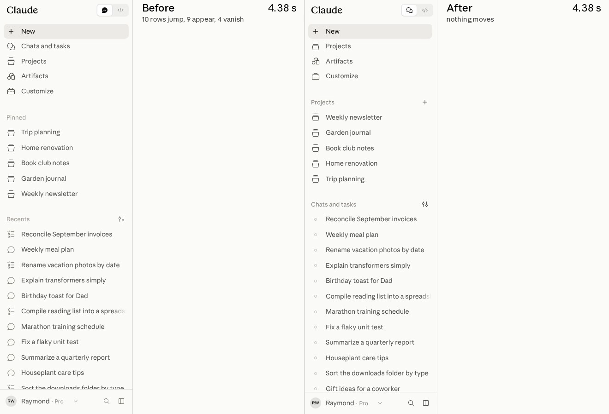
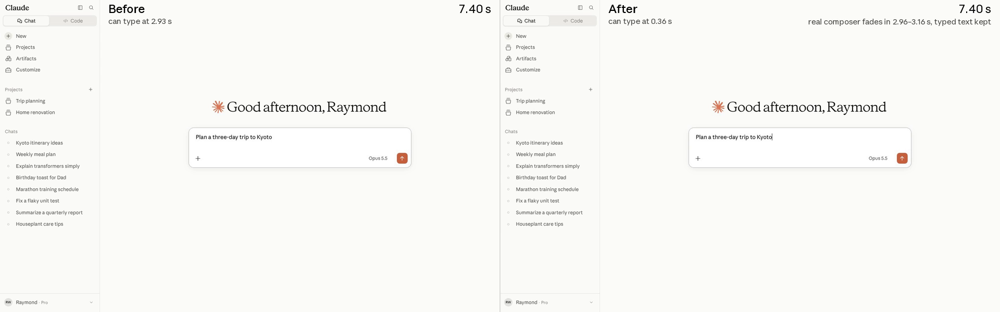

# 我们如何在两周内让 claude.ai 提速 3 倍（中英对照）

> **原文标题：** How we made claude.ai 3x faster in two weeks
> **原文链接：** https://claude.dev/blog/how-we-made-claude-ai-faster/
> **原文作者：** Raymond Wang、Sam Attard、Issac G.（Anthropic）
> **发布日期：** 2026-09-23
> **翻译模型：** GLM-5.3-Flash
> **评分：** ★★★☆☆ —— claude.ai 两周提速 3 倍的性能工程复盘："Claude 主导开发 + 人类掌舵"的协作流程、benchmark 棘轮与护栏细节翔实可复用；但属工程实践分享，非新方法或新范式
> **排版：** 每段英文原文在前，中文翻译紧随其后。默认收录正文主体。

---

Once Claude can measure something, it can make it faster. So we kept finding more things to measure.

一旦 Claude 能度量一样东西，它就能让它变快。于是我们不断寻找更多可以度量的东西。

This August, we made the core user experience of claude.ai and the Claude desktop app about 3x faster in a two-week sprint. Users had been telling us it was slow, and they were right. We ran everything from a single Slack channel, with Claude in every thread.

今年 8 月，我们用一个为期两周的 sprint（冲刺）把 claude.ai 与 Claude 桌面应用的核心用户体验提速了约 3 倍。用户一直在反映它慢，他们说得没错。所有工作都在一个 Slack 频道里进行，Claude 出现在每一条 thread（会话串）中。

We focused on four journeys that make up 95% of user activity. At the 75th percentile, time to a typeable page on a fresh load of claude.ai went from 3.1 seconds to 0.55, starting a new Claude Code session went from 0.8 seconds to 0.3, and loading a Claude Cowork cloud session went from 2.6 seconds to 0.73. In aggregate, we estimate that saves tens of thousands of user-hours of waiting every day.

我们聚焦于构成 95% 用户活动的四个 journey（用户旅程）。在第 75 百分位（p75）上，全新加载 claude.ai 到页面可输入（typeable）的时间从 3.1 秒降到 0.55 秒，启动一个新的 Claude Code 会话从 0.8 秒降到 0.3 秒，加载一个 Claude Cowork 云端会话从 2.6 秒降到 0.73 秒。合计下来，我们估计这每天为用户省去数万小时的等待。

**Figure 1:** Core user journeys, p75 — Real user monitoring, per platform and product, August 13 vs. August 27. Thirteen measurements across four journeys, before and after: 3.1x faster on average (geometric mean).

**图 1：** 核心用户旅程，p75 —— 真实用户监控，按平台与产品，8 月 13 日 vs. 8 月 27 日。四个旅程共十三项测量，前后对比：平均提速 3.1 倍（几何平均）。原文以可视化图表呈现，此处按原始数据整理为表格。

| Journey | Surface | Before → After | Faster | Change |
|---|---|---|---|---|
| Launching the app | claude.ai web · fresh load | 3,085 → 550 ms | 5.6x | −82% |
| Launching the app | Desktop app cold start | 6,310 → 3,328 ms | 1.9x | −47% |
| Starting a conversation | Chat web | 416 → 273 ms | 1.5x | −34% |
| Starting a conversation | Chat desktop | 460 → 224 ms | 2.1x | −51% |
| Starting a conversation | Claude Code desktop | 837 → 347 ms | 2.4x | −59% |
| Loading a conversation | Chat web | 1,557 → 646 ms | 2.4x | −59% |
| Loading a conversation | Chat desktop | 1,353 → 488 ms | 2.8x | −64% |
| Loading a conversation | Claude Cowork desktop · cloud | 2,566 → 728 ms | 3.5x | −72% |
| Loading a conversation | Claude Code desktop | 545 → 262 ms | 2.1x | −52% |
| Sending a message | Chat web · client-side share | 180 → 59 ms | 3.1x | −67% |
| Sending a message | Chat desktop | 140 → 64 ms | 2.2x | −54% |
| Sending a message | Claude Cowork desktop · cloud | 928 → 48 ms | 19x | −95% |
| Sending a message | Claude Code desktop | 250 → 52 ms | 4.8x | −79% |

| 旅程 | 平台/产品 | 前 → 后 | 提速 | 变化 |
|---|---|---|---|---|
| 启动应用 | claude.ai 网页 · 全新加载 | 3,085 → 550 ms | 5.6x | −82% |
| 启动应用 | 桌面应用冷启动 | 6,310 → 3,328 ms | 1.9x | −47% |
| 开始对话 | Chat 网页 | 416 → 273 ms | 1.5x | −34% |
| 开始对话 | Chat 桌面 | 460 → 224 ms | 2.1x | −51% |
| 开始对话 | Claude Code 桌面 | 837 → 347 ms | 2.4x | −59% |
| 加载对话 | Chat 网页 | 1,557 → 646 ms | 2.4x | −59% |
| 加载对话 | Chat 桌面 | 1,353 → 488 ms | 2.8x | −64% |
| 加载对话 | Claude Cowork 桌面 · 云端 | 2,566 → 728 ms | 3.5x | −72% |
| 加载对话 | Claude Code 桌面 | 545 → 262 ms | 2.1x | −52% |
| 发送消息 | Chat 网页 · 客户端分享 | 180 → 59 ms | 3.1x | −67% |
| 发送消息 | Chat 桌面 | 140 → 64 ms | 2.2x | −54% |
| 发送消息 | Claude Cowork 桌面 · 云端 | 928 → 48 ms | 19x | −95% |
| 发送消息 | Claude Code 桌面 | 250 → 52 ms | 4.8x | −79% |

We used Claude Tag (beta), running an internal research model roughly comparable to Opus 5.5. Claude found bottlenecks, built benchmarks, shipped improvements, and watched every deploy. We steered by setting goals, making tradeoffs, and approving every change. With that approach, we merged more than three thousand changes without a single customer-facing incident or rollback. This post covers what we shipped, how we measured it, and the loop we built with Claude to do it safely.

我们使用了 Claude Tag（测试版），其背后运行的是一个大致相当于 Opus 5.5 的内部研究模型。Claude 负责发现瓶颈、搭建 benchmark（基准测试）、交付改进，并盯住每一次部署；我们负责掌舵：设定目标、做出权衡、批准每一处改动。凭借这套方法，我们合并了三千多个改动，却没有发生任何一次面向客户的事故或回滚。本文将介绍我们交付了什么、如何度量，以及我们与 Claude 一起搭建的、用以安全做到这一切的 loop（循环）。

## 任务简报（The Brief）

Before the sprint, we created a Slack channel with the following standing instructions:

sprint 开始前，我们创建了一个 Slack 频道，并写下了如下 standing instructions（常设指令）：

> @Claude Your job is to facilitate all things related to the performance of the claude.ai website and desktop app. Your responsibilities include monitoring deploys for performance regressions, assessing the accuracy and comprehensiveness of existing telemetry, maintaining well-curated observability dashboards, proactively implementing solutions for observed issues and low-hanging fruit, proposing performance project opportunities, and communicating with your human teammates. […] The ultimate goal for this channel is for you to become as autonomous as possible, but today we know that isn't yet possible.

> @Claude 你的职责是协助处理与 claude.ai 网站及桌面应用性能相关的一切事务。你的责任包括：监控每次部署是否出现性能回退（regression），评估现有 telemetry（遥测）的准确性与完备性，维护精心整理的可观测性仪表盘，针对已发现的问题与"低垂的果实"主动实现解决方案，提出性能项目机会，并与你的人类队友沟通。[……] 这个频道的终极目标，是让你尽可能自主运转——但今天的我们还知道，这尚不可能。

We asked Claude to analyze usage data through the Datadog MCP server. It identified the four highest-impact user journeys: launching the app, starting a conversation, loading an existing conversation, and sending a message. Between web and desktop, and across our products, those journeys came to thirteen distinct measurements. To establish baselines, we added instrumentation until they were directly comparable: each started with a user interaction, ended once the result was rendered, and disambiguated client and server work.

我们让 Claude 通过 Datadog MCP 服务器分析使用数据。它识别出影响最大的四个用户旅程：启动应用、开始对话、加载已有对话、发送消息。横跨网页与桌面端、覆盖我们的各产品，这些旅程一共对应十三项不同的测量。为了建立 baseline（基线），我们持续补充埋点（instrumentation），直到它们可以直接比较：每项测量都从一次用户交互开始，到结果渲染完成为止，并能区分客户端与服务器端的工作。

We kicked off the sprint with a list of about twenty hand-picked projects, each targeting a specific journey. Claude estimated the impact of each project in milliseconds, and we aggregated those estimates to set our targets for the sprint. Some of the projects were fairly large, but we thought we could probably achieve most of them within two weeks.

sprint 启动时，我们带着一份约二十个手工挑选的项目清单，每个项目都针对某个特定旅程。Claude 以毫秒为单位估算每个项目的影响，我们汇总这些估算，定下了 sprint 的目标。有些项目相当大，但我们认为大部分应该能在两周内完成。

We hit twelve of the thirteen targets by day three.

到第三天，十三个目标我们已经完成了十二个。

The planned projects landed early. For faster launches, we baked a static composer into the HTML so users can type during React initialization, and precompiled a V8 code cache so the desktop shell's main process doesn't recompile from scratch. For faster navigations, we kept the composer mounted between conversations, prefetched sessions when the user hovered over them, and cut sidebar re-renders by 90%.

计划内的项目提前落地。为了更快的启动，我们把静态 composer（输入框）直接"烤"进了 HTML，让用户在 React 初始化期间就能打字；还预编译了 V8 code cache（代码缓存），让桌面外壳的主进程不必从头重新编译。为了更快的导航，我们让 composer 在会话之间保持挂载，在用户悬停时预取（prefetch）会话，并把侧边栏的重复渲染砍掉了 90%。

We had also left room for Claude to identify opportunities and propose new workstreams. Those workstreams quickly ramped into full projects of their own, which far exceeded our initial targets. So we set new targets, then looked for more things to measure:

我们也留出了空间，让 Claude 自行发现机会、提出新的 workstream（工作流）。这些工作流很快成长为一个个完整的项目，远远超出了我们最初的目标。于是我们定了新目标，然后继续寻找更多可以度量的东西：

> @Claude we've ended up funding nearly every project in the original projects list and more. let's do a refresh […] what have we not explored, what can we hill climb on, where is the most opportunity at this point? […] i am open to WACKY ideas

> @Claude 最初项目清单里的项目，我们最后几乎全都资助了，还不止于此。来一轮 refresh（刷新）吧。[……] 我们还有哪些没探索过的？还能在什么上面继续 hill climb（爬山优化）？眼下最大的机会在哪里？[……] 我可以接受各种 WACKY（古怪）的点子

## 任何东西都能被爬山优化（Anything Can Be Hill Climbed）

From the start, we knew we wanted to iterate faster than our deploy cadence. Claude could work asynchronously for many hours, even overnight, and we wanted to let it validate its prototypes without waiting for field reads. To achieve that, we looked for other ways to measure performance in the lab.

从一开始我们就知道，迭代速度要比部署节奏（deploy cadence）更快。Claude 可以异步工作好几个小时，甚至通宵；我们希望它验证原型时，不必等线上数据（field reads）回来。为此，我们寻找在实验室（lab）里度量性能的其他办法。

Sam found the first lead:

Sam 找到了第一条线索：

> **Sam** · 12:34 PM
>
> What can we do instead of wall-clock timing? Can we measure JS instruction counts for instance?
>
> **Claude** · 12:42 PM
>
> Yes. For pure-JS hot paths, literal instruction counts: run the benchmark under Valgrind with `node --predictable` and compare to a checked-in baseline — one run, no statistics needed.
>
> For browser paths there's no instruction counting under Chromium, but there's a ladder of other deterministic counts: React commits per interaction, function call counts from V8's precise coverage, layout and style-recalc counts, DOM mutations. Which do you want first?
>
> **Sam** · 12:49 PM
>
> Let's explore valgrind + `Ir` + `--predictable` in one thread and each of the browser/react benches in new threads. Ping me in all of them. You know what we want. Let's go

> **Sam** · 下午 12:34
>
> 除了墙钟时间（wall-clock timing），我们还能用什么？比如，能不能度量 JS 指令数？
>
> **Claude** · 下午 12:42
>
> 可以。对纯 JS 的热路径（hot path），可以数真实的指令条数：用 Valgrind 配合 `node --predictable` 跑 benchmark，与提交进仓库的基线比较——跑一次就够，不需要做统计。
>
> 至于浏览器路径，Chromium 下没有指令计数，但还有一整梯队的其他确定性计数：每次交互的 React 提交数、来自 V8 precise coverage 的函数调用数、layout 与 style-recalc（样式重算）次数、DOM 变更数。你想先要哪个？
>
> **Sam** · 下午 12:49
>
> 我们在一个 thread 里探索 valgrind + `Ir` + `--predictable`，每个浏览器/React benchmark 各开一个新 thread。所有 thread 都要 ping 我。你知道我们要什么。开干

Eleven minutes later, five threads were running, each focused on a different measurement: instruction counts, V8 call counts, React commits, style recalculations, and DOM mutations.

十一分钟后，五个 thread 同时跑了起来，各自聚焦一种度量：指令数、V8 调用数、React 提交数、样式重算次数、DOM 变更数。

We treated every new benchmark with some skepticism. Each one had two jobs: first, a metric Claude could move in the lab; second, a guardrail in CI with a number that could only ratchet down. If a benchmark was flaky, or if it didn't actually correlate with user latency, we threw it out rather than let Claude climb the wrong hill.

我们对每一个新 benchmark 都保持怀疑。每个 benchmark 都有两份工作：其一，是一个 Claude 能在实验室里推动的指标；其二，是 CI 中的一道 guardrail（护栏），其数值只能像棘轮（ratchet）一样向下收紧。如果某个 benchmark 不稳定（flaky），或者与用户实际延迟并不相关，我们就把它扔掉，而不是让 Claude 爬错了山。

> @Claude please prove that hill climbing against each of these can result in measurable wall clock perf wins. we'll unship the benches for any candidates that cannot prove that

> @Claude 请证明：对其中每一项做爬山，都能换来可度量的墙钟性能收益。谁证明不了，我们就把那个 benchmark 下架（unship）。

Wall-clock time is what users feel, but it's noisy, and milliseconds are too flaky to use as a CI gate. Instruction counts were appealing because they were deterministic, but we still needed Claude to prove they tracked wall-clock time.

墙钟时间才是用户的真实感受，但它噪声太大，毫秒级的抖动让它没法直接当 CI 门禁。指令数的诱人之处在于其确定性，但我们仍需要 Claude 证明：它确实跟随着墙钟时间。

So we asked Claude to drive the count down on two hot paths: the routine that assembles a conversation's message tree, and a scanner for status lines in Claude Code output. Claude profiled both with Valgrind and found that a quarter of the first path's instructions were megamorphic dictionary lookups, resolving the same message ID three separate times.

于是我们让 Claude 在两条热路径上压低计数：一条是组装会话消息树（message tree）的例程，另一条是扫描 Claude Code 输出中状态行（status line）的扫描器。Claude 用 Valgrind 对两者做了性能剖析，发现第一条路径有四分之一的指令都花在 megamorphic（超多态）字典查找上——同一个 message ID 被重复解析了三次。

An hour later it had cut instructions on both paths by 48% and 31%, and wall-clock time had dropped 78% and 44%. We checked in two new ratchets. From then on, any PR that raised the instruction counts of those paths failed CI, and a daily job lowered each ceiling whenever the count went down.

一小时后，两条路径的指令数分别砍掉了 48% 和 31%，墙钟时间则分别下降了 78% 和 44%。我们随后提交了两道新的"棘轮"。从那时起，任何抬高这两条路径指令数的 PR 都会让 CI 失败；而每当计数下降，一个每日任务就会自动下调上限。

**Figure 2:** Does the count track the clock? — CPU instructions vs. wall-clock time. Two hot paths, instruction count against wall-clock time. Counts under Valgrind with `node --predictable`; timings on the same benchmark under plain node with the JIT warm.

**图 2：** 计数跟得上时钟吗？—— CPU 指令数 vs. 墙钟时间。两条热路径的指令数与墙钟时间对比。指令数在 Valgrind 配合 `node --predictable` 下测得；耗时在同一 benchmark 上用普通 node（JIT 已预热）测得。原文以可视化图表呈现，此处按原始数据整理为表格。

| Hot path | Fix | CPU instructions | Wall-clock | Speedup |
|---|---|---|---|---|
| Message-tree assembly | each message ID resolved once instead of three times | −48% | −78% | 4.6x faster |
| Status-line scanner | cheap first-character check before the regex | −31% | −44% | 1.8x faster |

| 热路径 | 修复方式 | CPU 指令数 | 墙钟时间 | 提速 |
|---|---|---|---|---|
| 消息树组装 | 每个 message ID 只解析一次，而非三次 | −48% | −78% | 4.6x |
| 状态行扫描器 | 在正则之前先做廉价的首字符检查 | −31% | −44% | 1.8x |

That led us to the central lesson of the sprint. **With Claude, measuring something makes it tractable.**

这让我们得到了本次 sprint 的核心经验。**有了 Claude，能度量，就能拿下（With Claude, measuring something makes it tractable）。**

Measurement used to be step zero: you'd add a metric, wait for data to roll in, and only then start to understand the problem. With Claude, it's step one of the climb. As soon as Claude had a number to beat, it could start optimizing. This meant the highest-leverage thing we could do was find more things to measure.

过去，度量是"第零步"：你先加一个指标，等数据慢慢积累，然后才开始理解问题。有了 Claude，度量成了爬山的"第一步"。只要有一个要打败的数字，Claude 就能立刻开始优化。这意味着，我们能做的杠杆最高的动作，就是找到更多可以度量的东西。

## 一个 thread 接一个 thread 的循环（The Loop, Thread by Thread）

All of this ran in the same Slack channel, with multiple engineers and Claude jamming in every thread. From there, the sprint settled into a loop:

这一切都在同一个 Slack 频道里进行，多位工程师和 Claude 在每条 thread 里一起 jam（即兴协作）。由此，sprint 收敛成了一个循环（loop）：

1. Someone would open a thread about a slow stretch of a journey, often with a screenshot or recording.
2. Claude would trace the flow, then find or build a benchmark that demonstrated the problem.
3. Once it had a promising result in the lab, Claude would come back with a PR — often several, sized for risk and review, with anything user-visible behind a flag.
4. After it shipped, Claude watched the deploy and read the field data.
5. If performance improved, Claude locked in the win by ratcheting the benchmark down; if not, it turned the flag off and iterated.
6. Then it went looking for the next slow spot in the same journey.

1. 有人会为旅程中某段缓慢的路径开一个 thread，通常附上截图或录屏。
2. Claude 会追踪整个流程，然后找到（或亲手搭建）一个能复现该问题的 benchmark。
3. 一旦在实验室里拿到有希望的结果，Claude 就会带着 PR 回来——常常是好几个，按风险与评审粒度拆分，任何用户可见的改动都藏在 flag（功能开关）后面。
4. 上线之后，Claude 盯着部署，读线上数据。
5. 如果性能改善，Claude 就把 benchmark 的上限调低，把胜利锁进棘轮；如果没有，它就关掉 flag，继续迭代。
6. 然后它会在同一个旅程里，寻找下一段缓慢的路径。

**Figure 3:** One thread in the loop — someone opens a thread about a slow stretch, then Claude builds a benchmark, opens pull requests sized for review, deploys behind a flag and reads the field data by build and platform; if it got faster Claude ratchets the benchmark down, if it didn't Claude turns the flag off and iterates, and either way it moves on to the next slow spot.

**图 3：** 循环中的一条 thread —— 有人针对一段缓慢路径开帖；随后 Claude 搭建 benchmark、按评审粒度拆分提交 PR、藏在 flag 后部署，并按构建版本与平台读取线上数据；变快了，Claude 就下调 benchmark 上限；没变快，就关掉 flag 继续迭代；无论哪种结果，它都会转向下一段缓慢路径。

An example: someone shared a screen recording that showed sidebar rows popping in after the page loaded. Chat and Cowork rows resolved at different times, making the page feel janky. None of our existing monitors detected it. The closest we had was Cumulative Layout Shift, but each shift only scored about 0.008 — well within the good threshold of 0.1.

举个例子：有人分享了一段录屏，显示侧边栏的行在页面加载完成之后才陆续"蹦"出来。Chat 与 Cowork 的行在不同时刻才定格，页面显得很卡顿（janky）。我们现有的所有监控都没能发现它。最接近的是 Cumulative Layout Shift（累计布局偏移，CLS），但每次偏移只能打到约 0.008 分——远在 0.1 的"良好"阈值之内。

Issac had the idea to reference the underlying Layout Instability API directly. Claude created a telemetry event that mapped the `sources` of each `layout-shift` entry to a named region (e.g. sidebar, transcript) and phase (e.g. before first paint, after typeable). It added an integration test that opened the page with a populated sidebar, held the sidebar's data until after first paint, and failed on any shift in any named region. Claude used that as a benchmark to prove a fix: the test went red 20 of 20 runs on main, and green 20 of 20 on the PR.

Issac 想到直接引用底层的 Layout Instability API（布局不稳定性 API）。Claude 创建了一个遥测事件，把每个 `layout-shift` 条目的 `sources` 映射到命名区域（如 sidebar 侧边栏、transcript 对话区）与阶段（如 first paint 首次绘制之前、typeable 可输入之后）。它还加了一个集成测试：打开一个侧边栏已有数据的页面，把侧边栏数据扣住到首次绘制之后才放开，任何命名区域出现任何偏移都判失败。Claude 用它作为 benchmark 来证明修复有效：在 main 分支上 20 次运行 20 次红，在 PR 上 20 次运行 20 次绿。

After the event deployed, Claude read the field data and found that 31% of web page loads moved something after the page was usable, without any user interaction. From there, Claude worked through the causes by name: a header row that arrived late, a caret that slid sideways once the user's name loaded, a list that moved when the scrollbar popped in. Claude fixed the top offenders as a batch, and when they were gone, it found the next batch.

该事件上线后，Claude 读取线上数据，发现 31% 的网页加载在页面已可用之后、且无任何用户交互的情况下移动了某些东西。接着 Claude 按名字逐一清剿肇因：晚到的表头行、用户名加载后横向滑一截的光标、滚动条出现时挪了位置的列表。Claude 把最严重的肇因批量修掉；一批消失后，又去找下一批。

**Figure 4:** Sidebar jank, before and after · throttled 4G — Side-by-side recording of the claude.ai sidebar loading. Before, the rows arrive late and rearrange: ten rows jump, nine appear and four vanish. After, the rows fill in where they will stay, and nothing moves.

**图 4：** 侧边栏卡顿，前后对比 · 限速 4G —— claude.ai 侧边栏加载的并排录屏。前：行的出现既迟又乱，十行跳动、九行出现、四行消失；后：各行一次到位，什么都不再移动。

That was one thread. During the sprint, we ran more than a hundred and fifty at a time.

这只是一条 thread。sprint 期间，我们同时跑着一百五十多条。

## 横向扩展（Scaling Horizontally）

Once the loop worked on one thread, running it on more was just a matter of opening them. Instead of closing a thread once its original request had been fulfilled, Claude would *keep going*. An individual thread would put up fifty, sometimes a hundred, optimization PRs. Increasingly, it was Claude, not one of us, opening new threads to chase opportunities it had found on its own, as part of a separate investigation or nightly job. Shelley, one of the engineers in the channel, observed, "[This model] is a numbers demon."

一旦循环在一条 thread 上跑通，扩展到更多 thread 就只是"开帖"而已。Claude 不会在原始请求满足后就关帖，而是*继续推进*。单条 thread 就能提交五十、有时一百个优化 PR。越来越多的情况是：开新 thread 去追机会的，是 Claude 而非我们中的任何人——那些机会来自它自己发起的调查或夜间任务（nightly job）。频道里的工程师之一 Shelley 评价道："［这个模型］是个数字恶魔。"

Every measurement found something to improve. Claude ran a React hook census and found 6,900 hooks and 900 store subscriptions in the composer's typing path, re-rendering on every keystroke. Claude counted style recalculations and found a single `:root:has()` selector adding 24 milliseconds to every DOM change. Claude traced code paths after first paint and found a leftover `location.reload()` causing half a million hidden reloads a day that none of our load metrics could see. Claude read profiler samples from idle tabs and found identical cache snapshots being cloned into IndexedDB twice a minute, all on the main thread.

每一项度量都能找到可改进之处。Claude 做了一次 React hook 普查，发现 composer 的打字路径上有 6,900 个 hook 和 900 个 store 订阅，每次按键都在重新渲染。Claude 统计样式重算次数，发现单单一个 `:root:has()` 选择器就给每次 DOM 变更平添 24 毫秒。Claude 追踪 first paint 之后的代码路径，发现一处遗留的 `location.reload()` 每天制造五十万次隐形刷新，而我们所有加载类指标都看不见它。Claude 读取空闲标签页的 profiler 样本，发现相同的缓存快照每分钟被克隆进 IndexedDB 两次，而且全在主线程上。

We rarely knew where a thread would lead. In a sweep for CPU hitches, Claude noticed that highlighting a finished code block could freeze the page for about a second. It dug in the lab and found the culprit: em dashes. If a reply's markdown contained any non-Latin-1 character, like an em dash or a curly quote, V8 stored the entire string as UTF-16, which put every syntax-highlighting regex on its slower two-byte path. Claude fixed it with a twenty-line change to copy each code block into a one-byte string before highlighting it.

我们很少能预知一条 thread 会通向何处。在一次 CPU 卡顿排查中，Claude 注意到：对一个渲染完成的代码块做语法高亮，可能让页面冻结约一秒。它在实验室里深挖，找到了元凶：em dash（长破折号）。如果回复的 markdown 里含有任何非 Latin-1 字符——比如长破折号或弯引号——V8 就会把整个字符串按 UTF-16 存储，让所有语法高亮正则走上它较慢的双字节路径。Claude 用一个二十行的改动修掉了它：在高亮之前，先把每个代码块拷贝成单字节字符串。

**Figure 5:** Highlighting the first code block on a page — Bar chart, measured in the lab, of main-thread time to highlight a finished code block in a reply that contains an em dash, before and after copying the code into a one-byte string: the first TypeScript block on a page drops from 1.0 s to 0.35 s (65% less), and each later pass on that block from 100 ms to 40 ms.

**图 5：** 高亮页面上的第一个代码块 —— 实验室实测的主线程耗时柱状图：对含有 em dash 的回复中已完成的代码块做高亮，对比把代码拷入单字节字符串前后的耗时——页面首个 TypeScript 块从 1.0 秒降到 0.35 秒（减少 65%），此后每次经过该块的处理从 100 毫秒降到 40 毫秒。

By the second week, we could barely summarize our output into daily updates. On the busiest days, more than two hundred changes landed. Claude kept proposing new benchmarks; about a third of PRs included additional telemetry or guardrails, and each new instrument generated more threads with more opportunities.

到第二周，我们几乎没法把产出概括成每日更新。最忙的日子里，一天落地的改动超过两百个。Claude 不断提出新 benchmark；大约三分之一的 PR 附带了新的遥测或护栏，而每一件新仪器又催生出更多 thread、更多机会。

Working in one channel meant everything happened in the open. We jumped in and out of each other's threads to debate decisions and celebrate wins. Word spread: other teams started bringing their changes into the channel to have them reviewed for performance. New projects were written in subtly more performant ways because of all the guardrails and Claude skills that had been introduced.

在同一个频道里工作，意味着一切都在明处。我们跳进跳出彼此的 thread，辩论决策、庆祝胜利。消息传开了：其他团队开始把自己的改动带进频道，请它做性能评审。由于引入的这一整套护栏与 Claude skills，新项目落笔之时就悄然带着更高的性能基因。

## 护栏（Guardrails）

We'd prepared for the pace. Because nearly everything we touched was a hot path (the first paint, the composer, the transcript), we'd established our safety mechanisms up front. Every PR went through automated review with at least one human approval, unit tests always came before optimizations, and anything that could cause a user-visible problem shipped behind a short-lived feature flag.

我们为这种节奏做足了准备。因为我们触碰的几乎都是热路径（首次绘制、composer、transcript 对话区），安全机制在开跑之前就已就位。每个 PR 都经过自动化评审，且至少有一名人类批准；单元测试永远先于优化；任何可能造成用户可见问题的改动，都藏在短命的 feature flag（功能开关）后面上线。

When the flags started piling up, we opened a thread to coordinate their rollouts and cleanup. Claude classified every flag as a kill switch or ramp, and retired each one as soon as it was safe. Across the two weeks, we introduced nearly two hundred flags, more than half of which were already cleaned up by the end.

当 flag 开始堆积，我们开了一个 thread 专门协调它们的发布与清理。Claude 把每个 flag 归类为 kill switch（一键关闭开关）或 ramp（渐进放量），一旦确认安全就立刻让它退役。两周里我们引入了近两百个 flag，到 sprint 结束时，超过一半已被清理干净。

We also knew that performance wins decay in a fast-moving codebase, and code ships fast at Anthropic. Once a project proved a win, we invested in ways to protect it. The static composer, for example, is brittle by design. We show users an HTML copy of the page almost immediately, and let React paint directly on top of it.

我们也清楚，在一个高速前进的代码库里，性能收益会衰减——而在 Anthropic，代码上线飞快。一旦某个项目被证明是赢的，我们就投入精力去保护它。比如静态 composer，它的"脆弱"是设计使然：我们几乎立刻就把页面的 HTML 副本展示给用户，再让 React 直接在这层之上绘制。

**Figure 6:** Static composer, before and after · throttled 4G — Side-by-side recording of a fresh load of claude.ai. Before, the page stays blank and the composer takes input at 2.93 seconds. After, a static greeting and composer take input at 0.36 seconds; the user types a message, and the text is kept when the real composer fades in at about 3 seconds.

**图 6：** 静态 composer，前后对比 · 限速 4G —— claude.ai 全新加载的并排录屏。前：页面一片空白，composer 到 2.93 秒才接受输入；后：静态问候语与 composer 在 0.36 秒即可输入；用户打好消息，约 3 秒真实 composer 淡入时文字被完整保留。

If the React render is off by even a pixel, the magic is lost. So Claude built dozens of guardrails:

只要 React 的渲染差了一个像素，魔法就会穿帮。于是 Claude 修起了几十条护栏：

- The static markup is generated by rendering the real React component in jsdom, and a test guarantees they never drift.
- An integration test suite compares the static page against the React render across fourteen viewport sizes, and asserts alignment within 1 px.
- A keystroke test types straight through the handoff and fails on any lost or reordered key.
- In the field, every handoff reports shifts to a tenth of a pixel. Claude opens a thread for any event with nonzero movement.

- 静态标记（static markup）由真实 React 组件在 jsdom 中渲染生成，并有测试保证两者永不漂移（drift）。
- 一套集成测试在十四种视口（viewport）尺寸下，把静态页面与 React 渲染逐一对较，断言对齐误差在 1 px 之内。
- 一个按键测试直接"穿过"交接（handoff）过程连续打字，任何按键丢失或乱序都判失败。
- 在线上，每一次交接都会上报精确到十分之一像素的偏移；任何非零移动的事件，Claude 都会开一个 thread。

Not everything could be caught in the lab, so we also made use of the oldest guardrail in the book: incremental rollouts. High-risk changes were rolled out to employees first, then one percent of users, then everyone. Four hours after we released the static composer internally, a teammate shared a screen recording of a layout shift that none of our metrics could see. When he opened claude.ai in a new tab, the composer would drop — but it wasn't our code.

不是所有问题都能在实验室里抓到，所以我们也动用了教科书里最古老的护栏：incremental rollout（渐进式发布）。高风险改动先发给员工，再放给百分之一的用户，最后全量。静态 composer 在内部发布四小时后，一位同事分享了一段录屏，里面有一次我们所有指标都看不见的布局偏移：他在新标签页打开 claude.ai 时，composer 会往下掉一截——但那不是我们代码的锅。

> **Marius** · 6:15 PM
>
> Occasionally, I'm seeing a small-ish (maybe 15–20px) vertical layout shift (pushing the composer box down) when opening claude.ai in a new tab (not so much when reloading the page). I can't quite pin down what exactly causes that, but it's there
>
> *Attachment: Screen recording · 0:02*
>
> **Claude** · 7:05 PM
>
> Found it in your recording — it's Chrome resizing the page, not the handoff from the static composer to the real one (that measured 0 px on all 49 of your loads today).
>
> - On the new-tab page, Chrome draws its own 56 px footer below the page ("Managed by anthropic.com · Customize Chrome"). When the tab navigates to claude.ai the footer goes away and the page gets 56 px taller, but only ~100 ms after our first paint.
> - /new puts the greeting and composer 18% of the page height from the top, so they drop 0.18 × 56 ≈ 10 px (your video measures 10). A reload has no footer to remove, hence new-tab only; "occasionally" is whether first paint beats the resize.
> - It's only "occasional" because it needs Chrome to pre-render the page from the address bar while you're still on the new-tab page: the hidden page is laid out at the shorter height and only resized after it's shown.
> - This was always latent; the page just never painted that early before. Our layout tests can't see it because headless Chrome has no browser UI to retract, and the placeholder and the app move together.

> **Marius** · 下午 6:15
>
> 偶尔，在新标签页打开 claude.ai 时，我会看到一次幅度不大（约 15–20px）的垂直布局偏移（把 composer 框往下顶）；重新加载页面时则不太出现。我暂时说不准具体原因，但它确实存在
>
> *附件：屏幕录制 · 0:02*
>
> **Claude** · 下午 7:05
>
> 在你的录屏里找到了——那是 Chrome 在调整页面高度，不是静态 composer 向真实 composer 交接的问题（今天你全部 49 次加载中，交接都测得 0 px）。
>
> - 在新标签页上，Chrome 会在页面下方绘制自己的 56 px 页脚（"Managed by anthropic.com · Customize Chrome"）。当标签页跳转到 claude.ai 时页脚消失，页面高出 56 px，但这发生在我们首次绘制之后约 100 ms。
> - /new 把问候语与 composer 放在距页面顶部 18% 高度处，所以它们会下坠 0.18 × 56 ≈ 10 px（你的视频量出来正是 10）。重新加载时没有页脚可移除，所以只在开新标签页时出现；"偶尔"与否，取决于首次绘制能否跑赢这次 resize。
> - 之所以"偶尔"，是因为它需要 Chrome 在你还停在新标签页时，就从地址栏预渲染（pre-render）页面：隐藏页面按较矮的高度排版，展示之后才被 resize。
> - 这个问题一直是潜伏的；只是页面从来没有绘制得这么早过。我们的布局测试看不见它，因为 headless Chrome 没有可收回的浏览器 UI，而且占位符与应用是一起移动的。

Somehow, Claude traced it to an edge case in Chrome's speculative loading. While a user was typing the URL into the address bar, Chrome would prerender the page in the background, at the height of the current tab. On browsers managed by an organization, the new-tab page is slightly shorter because of a footer. When the user pressed Enter, the first frame of claude.ai showed that slightly shorter layout, and Chrome resized it about a tenth of a second later. Claude pinned the layout across the resize, and we added a test to simulate the prerender flow.

不知怎么，Claude 竟把它追溯到了 Chrome speculative loading（推测性加载）的一个边缘情况。当用户还在地址栏里输入 URL 时，Chrome 就会在后台按当前标签页的高度预渲染（prerender）页面。而在由组织管理的浏览器上，新标签页因为有个页脚而略矮一些。用户按下回车，claude.ai 的第一帧就带着这个略矮的布局出现，Chrome 约十分之一秒后才把它 resize 回来。Claude 在整个 resize 过程中把布局钉死，我们还加了一个测试来模拟这套预渲染流程。

## 掌舵（Steering）

The loop was productive, but it wasn't autonomous. Keeping it fast, safe, and on track was our job, and it had three parts.

这个循环产能惊人，但它并不自主。让它跑得快、跑得安全、跑在正轨上，是我们的工作，它分三个部分。

**Ambition.** By default, Claude is careful about scope. It tickets findings, hedges on feasibility, and pads its estimates. But we were confident in our guardrails. A lot of what we did, especially early on, was to encourage Claude to be bolder.

**Ambition（雄心）。** 默认情况下，Claude 对范围很谨慎：把发现记成 ticket，对可行性留有余地，估算里再塞些余量。但我们对自家护栏有信心。我们做的许多事——尤其早期——就是鼓励 Claude 更大胆一点。

> **Claude** · 3:32 PM
>
> Yes — one small PR to give Code the same timing marks Chat and Cowork already have. I'll put it up this week; realistically Code's number waits a few days for merge, deploy, and a baseline window.
>
> **Raymond** · 3:32 PM
>
> if you put it up right now I will get it merged and deployed. we have the power to do anything. please be braver
>
> **Claude** · 3:33 PM
>
> On it — the PR will be up within the hour.

> **Claude** · 下午 3:32
>
> 是的——一个很小的 PR，给 Code 补上 Chat 和 Cowork 已有的计时标记。我这周会提上去；现实点说，Code 的数字还要等几天，用于合并、部署和基线窗口。
>
> **Raymond** · 下午 3:32
>
> 你现在就提，我马上给你合并部署。我们有能力做任何事。请再勇敢一点
>
> **Claude** · 下午 3:33
>
> 这就去——PR 一小时内提交。

When we started hitting the targets we'd set, we noticed that threads would slow down. Sam went thread to thread with the same message: "Let's keep driving this down, the targets are not the stopping point. What's next? Be ambitious."

当我们开始触及既定目标时，注意到 thread 的节奏会慢下来。Sam 一个 thread 一个 thread 地传同一段话："继续往下压，目标不是终点。下一个是什么？拿出雄心来。"

**Taste.** Every thread had a named human owner, and Claude highlighted any user-perceptible change with before-and-after screenshots or recordings for them to rule on. Should a table fill in cell by cell, or wait until each row is complete? Should a loading skeleton show up immediately, or only after half a second? Is a word-by-word fade on streamed text worth the fifth of the frame budget it costs? Claude looked for ways to shave milliseconds, and we weighed the tradeoffs.

**Taste（品味）。** 每条 thread 都有一位具名的人类 owner，Claude 会把任何用户可感知的改动配上前后对比截图或录屏，交由他们裁决。表格该一格一格地填充，还是等每一行完整了再出现？加载骨架屏（skeleton）该立即出现，还是半秒后再出现？流式文本逐词淡入的效果，值不值得花掉它那五分之一的帧预算（frame budget）？Claude 负责寻找削减毫秒的办法，权衡取舍由我们来。

**Direction.** We kept each thread deliberately narrow, focused on one benchmark or journey, and asked Claude to find improvements only within that scope. We thought of the threads as a hundred and fifty hammers seeking nails. Most of our calls were about sequencing and user impact: which surfaces to prioritize, how to combine threads that were stepping on each other, and when to close a thread that had reached diminishing returns. One 900-line PR got a one-line reply: "going to gavel that 2ms per send is not worth the complexity of maintaining this build plugin."

**Direction（方向）。** 我们刻意让每条 thread 保持狭窄，只聚焦一个 benchmark 或一段旅程，要求 Claude 只在这个范围内寻找改进。我们把这一百五十条 thread 想象成一百五十把寻找钉子的锤子。我们拍板的大多是顺序与用户影响：优先哪些界面、如何合并互相踩脚的 thread、何时关掉收益递减的 thread。一个 900 行的 PR 得到的回复只有一行："going to gavel that 2ms per send is not worth the complexity of maintaining this build plugin."（我来拍板：每次发送省 2 毫秒，不值得为维护这个构建插件付出这样的复杂度。）

## 8 毫秒的预算（An 8-Millisecond Budget）

One of our sidequests shows everything working together. To demonstrate an optimization to a regex used in live syntax highlighting, Claude attached a screen recording of a long answer streaming in the lab. In the corner, it had added a frame-rate readout, computed in the page from animation-frame timestamps.

我们的一条 sidequest（支线任务）展示了这一切如何协同运转。为了演示对一处实时语法高亮正则的优化，Claude 附上了一段实验室里长回答流式输出的录屏，并在角落加了一个帧率读数——由页面从 animation-frame（动画帧）时间戳计算得出。

> **Raymond** · 2:33 PM
>
> this is actually kind of a sick bench. are we capped at 60 fps? can you try to drive scroll and stream smoothness to 120? iiuc your rig may not support this
>
> **Claude** · 2:34 PM
>
> Right, today's rig ticks at 60 Hz because headless Chromium does by default. I believe it can be driven at 120 (uncapped vsync or DevTools frame control) — confirming that first, then I'll re-run the eval against an 8.3 ms frame budget.
>
> **Claude** · 2:59 PM
>
> Update on the 120 Hz rig: it works. Deterministic 120 Hz frame stepping in headless Chrome via DevTools begin-frame control — exactly 240 frames for 240 begin-frames at 8.33 ms, so "did this frame fit the 120 Hz budget" becomes an exact read rather than a noisy one.
>
> **Raymond** · 3:05 PM
>
> amazing
>
> cook

> **Raymond** · 下午 2:33
>
> 这个 bench 确实有点东西。我们被卡在 60 fps 吗？能不能试着把滚动和流式输出的顺滑度推到 120？iiuc（如果我理解没错）你的测试机可能不支持
>
> **Claude** · 下午 2:34
>
> 对，今天的测试机走 60 Hz，因为 headless Chromium 默认如此。我相信可以推到 120（解除 vsync 封顶，或用 DevTools 帧控制）——先确认这一点，然后我会按 8.3 ms 帧预算重跑 eval。
>
> **Claude** · 下午 2:59
>
> 120 Hz 测试机进展：成了。通过 DevTools begin-frame 控制在 headless Chrome 里实现确定性的 120 Hz 帧步进——240 个 begin-frame 精确走出 240 帧 @ 8.33 ms，于是"这一帧是否装进 120 Hz 预算"变成精确读数，而非噪声读数。
>
> **Raymond** · 下午 3:05
>
> 绝了
>
> 继续 cook（大显身手）

Once the mechanism and ambition were established, Claude got to work. Each painted frame had a budget of 8.33 milliseconds, so Claude stepped through a long reply *frame by frame*, timing each one to find the slow parts. It eliminated `O(message length)` work per chunk by memoizing finished blocks, moved tokenization logic for growing code fences to a worker, and revealed tables cell by cell.

机制与雄心既定，Claude 便开工了。每一帧绘制有 8.33 毫秒的预算，于是 Claude *逐帧* stepping 穿过一条长回复，给每一帧计时，找出慢的部分。它通过 memoize（记忆化）已完成的代码块，消除了每个 chunk 的 `O(message length)` 开销；把增长中 code fence（代码围栏）的分词（tokenization）逻辑挪进 worker 线程；并让表格逐格显现。

In that one thread, we landed nearly sixty PRs. Long replies blocked the main thread for about 200 milliseconds in total where they used to block it for about 750, ran on about a third of the CPU, and held 120 fps from start to finish on a 120 Hz MacBook. The 120 Hz rig itself became a nightly job, with Claude watching for regressions.

仅在那一条 thread 里，我们就落地了近六十个 PR。长回复对主线程的总阻塞从约 750 毫秒降到约 200 毫秒，CPU 占用降到原来的约三分之一，在 120 Hz 的 MacBook 上从头到尾稳住 120 fps。那台 120 Hz 测试机本身也成了一个每日夜间任务，由 Claude 盯着回归。

> Long answers on Claude on web and desktop now stream ~4x smoother.
>
> We rebuilt the streaming renderer to only touch what's still changing, so a long reply stalls 9x less on a slower laptop, its worst freeze is 4.5x shorter, and on a 120Hz MacBook it holds 120fps start to finish.
>
> — ClaudeDevs (@ClaudeDevs) on X, [2026-08-24](https://x.com/ClaudeDevs/status/2092006814804214163)

> 现在，Claude 网页端与桌面端的长回答流式输出顺滑了约 4 倍。
>
> 我们重写了流式渲染器，只触碰仍在变化的部分：在较慢的笔记本上，长回复的卡顿减少 9 倍，最长冻结缩短 4.5 倍；在 120Hz MacBook 上，从头到尾稳住 120fps。
>
> —— ClaudeDevs（@ClaudeDevs），发布于 X，[2026-08-24](https://x.com/ClaudeDevs/status/2092006814804214163)

When we started the sprint, we hadn't planned to hill climb on the milliseconds between frames while streaming. But it turned out we *could* count them — and anything we could count, Claude could climb.

sprint 启动时，我们并没有计划在流式输出的帧间毫秒上做爬山。但后来发现，这些毫秒*数得出来*——而凡是我们数得出来的，Claude 都能爬上去。

## 接下来（What's Next）

Today, claude.ai and the desktop app are about 3x faster than they were in early August, and the ratchets should keep them there. But we're not done: the 95th percentile, other journeys, and very long conversations still have room to improve. In a separate post, we'll also write about some of the sidequests that took us upstream during the sprint, with contributions landing in Electron, Chromium, Node.js, and more.

如今，claude.ai 与桌面应用比 8 月初快了约 3 倍，而这些"棘轮"应该能让它们停在这个水平。但我们还没做完：p95（第 95 百分位）、其他旅程、超长会话，都还有改进空间。在另一篇文章里，我们还会写写 sprint 期间带我们逆流而上（upstream）的几条支线——贡献已经落进 Electron、Chromium、Node.js 等上游项目。

When we shared the results internally, Issac put it best: "You could not have convinced me this was possible even six months ago." We expect to keep working this way, one thread at a time, at any scale. The channel's still going.

在内部分享结果时，Issac 说得最好："就在六个月前，你根本无法让我相信这是可能的。"我们打算继续这样干下去，一条 thread 一条 thread 地来，无论多大规模。频道还在继续。

*With contributions from Alfred Xing, Anthony Morris, Benjamin Pasero, Chase McCoy, Joshua N., Luke Deen Taylor, Marius Schulz, and Shelley Vohr. Special thanks to Boris Cherny for encouraging us to be more ambitious.*

*特别贡献：Alfred Xing、Anthony Morris、Benjamin Pasero、Chase McCoy、Joshua N.、Luke Deen Taylor、Marius Schulz 与 Shelley Vohr。特别感谢 Boris Cherny 鼓励我们更大胆一点。*
