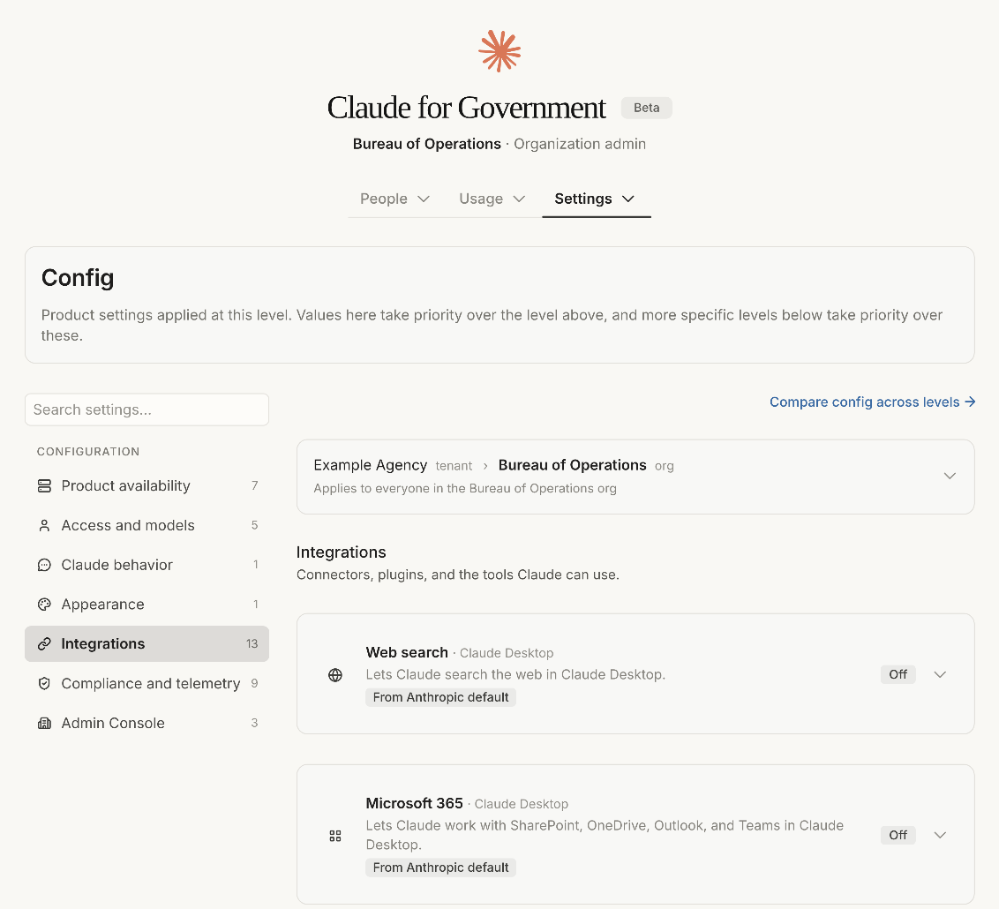
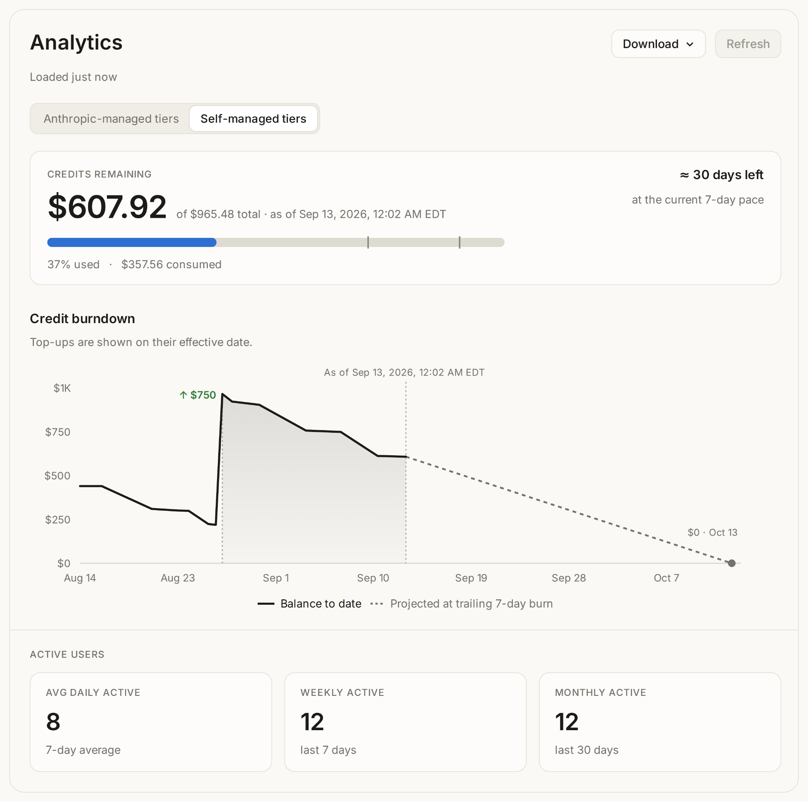

# Claude for Government 正式发布（中英对照）

> **原文标题：** Claude for Government is now generally available
> **原文链接：** https://claude.com/blog/claude-for-government-is-now-generally-available
> **原文作者：** Anthropic（原文未署名）
> **发布日期：** 2026-09-30
> **翻译模型：** GLM-5.3-Flash
> **评分：** ★★★☆☆ —— Claude for Government 正式 GA：政府市场落地的关键节点，产品与合规信息完整，但属产品公告、无技术细节。
> 排版：每段英文原文在前，中文翻译紧随其后。默认收录正文主体。

---

Claude Code CLI and Claude for Microsoft 365 also now available in early access.

Claude Code CLI 与 Claude for Microsoft 365 也已开放早期访问（early access）。

Today, Claude for Government is generally available for federal and state agencies. The platform, which delivers Claude's coding and agentic work capabilities through a FedRAMP High authorized environment, has been in public beta since July.

今天，Claude for Government 正式面向美国联邦与各州政府机构全面可用（generally available，GA）。该平台通过已获得 FedRAMP High（美国联邦风险与授权管理计划最高安全等级）授权的环境交付 Claude 的编码与智能体（agentic）工作能力，自 7 月起一直处于公测（public beta）阶段。

Agencies access capabilities comparable to Anthropic's commercial customers, without compromising compliance requirements. New capabilities generally arrive on the commercial release cadence.

各机构能够使用与 Anthropic 商业客户相当的能力，同时不牺牲合规要求。新功能通常也按商业版本的发布节奏同步到来。

Claude works directly with files on the desktop, allowing agency staff to use skills, plugins and projects for memo creation, RFP reviews, casework, and other tasks. With Claude Code, public sector teams can build and modernize the software systems that underpin public services.

Claude 可直接处理桌面上的文件，让机构工作人员能够借助技能（skills）、插件（plugins）和项目（projects）来完成备忘录撰写、RFP（Request for Proposal，征求意见书）评审、案件办理等任务。借助 Claude Code，公共部门团队可以构建并现代化支撑公共服务的软件系统。

Claude for Government governance controls are purpose-built for public sector agencies. Administrators can set configuration defaults as well as allocate and control spending across departments. Security teams and authorizing officials get audit logs and documentation that supports the agency ATO process. Procurement officers can contract with Anthropic directly and award on general-availability terms.

Claude for Government 的治理控制（governance controls）专为公共部门机构打造。管理员可以设置配置默认值，并在各部门之间分配和控制支出。安全团队与授权官员（authorizing officials）可获得审计日志与配套文档，为机构的 ATO（Authorization to Operate，运营授权）流程提供支持。采购官员可以直接与 Anthropic 签约，并按正式发布（GA）条款授标。

The Claude Code command-line interface and Claude for Microsoft 365 are also rolling out in early access through the same environment and with the same administrative controls.

Claude Code 命令行界面（CLI）与 Claude for Microsoft 365 也正在通过同一环境、以相同的管理控制推出早期访问（early access）。

**Figure 1:** Configuration view in the admin console
**图 1：** 管理控制台中的配置视图

## 计费、管理与监督（Billing, administration, and oversight）

**No seat fees.** Agencies pay for usage in fixed increments with a hard not-to-exceed cap, so spend does not exceed what an agency has obligated. Administrators define user tiers with spend and model limits per group, track usage by user and by model, and get burndown alerts before a balance runs low.

**不收取席位费（no seat fees）。** 机构按固定增量购买用量，并设有不可突破的硬性支出上限（not-to-exceed cap），因此支出不会超出机构已承诺（obligated）的预算额度。管理员可以定义用户层级（user tiers），为每个组设定支出与模型限制，按用户和按模型跟踪用量，并在余额耗尽前收到燃尽提醒（burndown alerts）。

**Figure 2:** Spend analytics view in the admin console
**图 2：** 管理控制台中的支出分析视图

**Administration that matches how departments are organized.** Department-level administrators allocate prepaid usage to sub-agencies while each manages its own users. Agencies connect their own identity provider for single sign-on, with self-serve setup in the admin portal. SCIM group mappings set rate limits, dollar caps, and allowed models for each seat tier. Layered configuration sets defaults for sub-agencies, including what Claude can connect to and which features are available.

**与部门组织方式相匹配的管理。** 部门级管理员向下属机构（sub-agencies）分配预付用量，而各下属机构自行管理其用户。机构可接入自己的身份提供方（identity provider）实现单点登录（single sign-on，SSO），并在管理门户中自助完成设置。SCIM 组映射（group mappings）为每个席位层级设定速率限制、金额上限和可用模型。分层配置（layered configuration）为下属机构设定默认值，包括 Claude 可连接的对象以及可用的功能。

**Oversight by design.** Administrative actions are recorded in an audit log that organization administrators can review. Sensitive operations on Anthropic's side require two-person approval. Usage exports are metering data only, so agencies can answer ATO and IG requests without moving sensitive material. Conversation history stays local on the agency-managed device.

**监督内建于设计（oversight by design）。** 管理操作都会记录在组织管理员可查阅的审计日志（audit log）中。Anthropic 侧的敏感操作需要双人批准（two-person approval）。用量导出仅包含计量数据（metering data），因此机构无需转移敏感材料，即可回应 ATO 与 IG（Inspector General，监察长办公室）的问询。对话历史仅保留在机构管理的设备本地。

## 上手使用（Getting started）

Claude for Government is generally available to federal and state agencies today. Agencies do not need a separate cloud-provider relationship to get started. Existing customers can move to the desktop application and bring their conversation history with them through an in-app import.

Claude for Government 从今天起正式面向联邦与各州机构开放。机构无需另行建立云服务商合作关系即可开始使用。现有客户可以迁移到桌面应用，并通过应用内导入（in-app import）一并迁移其对话历史。

Our FedRAMP Secure Configuration Guide is available through Anthropic's trust center. The application deploys through standard agency MDM platforms.

我们的《FedRAMP 安全配置指南》（FedRAMP Secure Configuration Guide）可通过 Anthropic 信任中心（trust center）获取。该应用可通过机构标准的 MDM（Mobile Device Management，移动设备管理）平台部署。

New agencies can request access at claude.com/solutions/government. To join the early access for Claude Code CLI or Claude for Microsoft 365, contact our public sector team.

新机构可在 claude.com/solutions/government 申请访问。如需加入 Claude Code CLI 或 Claude for Microsoft 365 的早期访问，请联系我们的公共部门团队。
