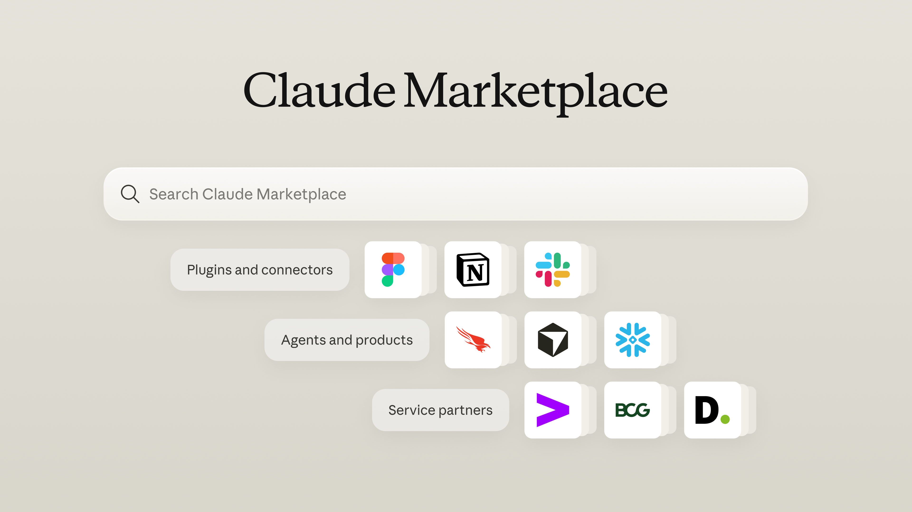

# Claude Marketplace：一站式发现插件、agent 与服务（中英对照）

> **原文标题：** Claude Marketplace: one place to discover plugins, agents, and services from our partners（页面 meta 标题为：Claude Marketplace: plugins and connectors, products and agents, and service partners）
> **原文链接：** https://claude.com/blog/claude-marketplace
> **原文作者：** Anthropic（原文未署名）
> **发布日期：** 2026-09-23
> **翻译模型：** GLM-5.3-Flash
> **评分：** ★★★☆☆ —— Claude Marketplace 上线公告：插件/连接器、agent 与产品、服务商三生态统一市场（产品资讯类），其中"已承诺消费额度可购买第三方 agent 产品"是 Claude 生态商业化的关键信号，但无技术细节
> 排版：每段英文原文在前，中文翻译紧随其后。默认收录正文主体。

---

Find the tools and services to do more with Claude, or list what you've built to grow alongside Claude customers.

发现助你的团队用 Claude 做更多事的工具与服务，或上架你构建的产品，与 Claude 客户共同成长。

Starting today, the [Claude Marketplace](https://claude.com/marketplace) brings plugins and connectors, agents and products, and service partners into one place. For customers, it provides a single destination to find the right tools and services. For builders and partners, it offers an easier way to reach teams using Claude.

从今天起，[Claude Marketplace](https://claude.com/marketplace) 将插件与连接器（plugins and connectors）、agent 与产品（agents and products）、服务商（service partners）汇聚于一处。对客户而言，它提供了一个找到合适工具与服务的统一入口；对构建者与合作伙伴而言，它提供了触达 Claude 用户团队的更便捷途径。

## 面向客户：发现帮你用 Claude 做更多事的工具与服务（For customers: discover tools and services to help you do more with Claude）

The Claude Marketplace is where teams find what they need to expand how they use Claude. You can:

Claude Marketplace 是团队各取所需、拓展 Claude 用法的场所。你可以：

- **Add connectors and plugins.** Choose from more than 2,000 available today, including Atlassian, Google, Microsoft, Notion, Salesforce, and more.

- **添加连接器与插件。** 从今天已上架的 2,000 多个中进行选择，包括 Atlassian、Google、Microsoft、Notion、Salesforce 等。

- **Buy agents and products.** Use a portion of your committed Anthropic spend on Claude-powered software from companies like CrowdStrike, Cursor, Harvey, Legora, Lovable, and Snowflake.

- **购买 agent 与产品。** 把你已承诺的 Anthropic 消费额度（committed spend）的一部分，用于购买 CrowdStrike、Cursor、Harvey、Legora、Lovable、Snowflake 等公司基于 Claude 的软件。

- **Scale with service partners.** Connect with a consulting partner or system integrator from the [Claude Partner Network](https://partnerhub.claude.com/directory/), such as Accenture, Boston Consulting Group, or Deloitte, to build your AI strategy and roll Claude out across your organization.

- **与服务伙伴协作实现规模化。** 从 [Claude Partner Network](https://partnerhub.claude.com/directory/)（Claude 合作伙伴网络）中联系咨询伙伴或系统集成商，例如埃森哲（Accenture）、波士顿咨询（BCG）或德勤（Deloitte），帮你制定 AI 战略，并在整个组织内推广落地 Claude。

**Figure 1:** The Claude Marketplace brings together plugins and connectors, agents and products, and service partners in one searchable place.

**图 1：** Claude Marketplace 将插件与连接器、agent 与产品、服务商汇聚到一个可搜索的统一入口。

## 面向构建者与合作伙伴：让使用 Claude 的团队发现你（For builders and partners: get discovered by teams using Claude）

Companies that build tools, products, or services for Claude customers can be listed in the Claude Marketplace. Pick the path that fits what you offer:

为 Claude 客户构建工具、产品或服务的公司，都可以上架进入 Claude Marketplace。请选择与自身业务相匹配的路径：

- **Building for teams that use Claude?** Create a [connector](https://claude.com/docs/connectors/building/submission) or [plugin](https://claude.com/docs/plugins/submit) using the Model Context Protocol (MCP) and Agent Skills, the open standards pioneered by Anthropic.

- **为使用 Claude 的团队做开发？** 使用 Model Context Protocol（MCP，模型上下文协议）和 Agent Skills（智能体技能）——由 Anthropic 率先推出的两项开放标准——创建[连接器](https://claude.com/docs/connectors/building/submission)或[插件](https://claude.com/docs/plugins/submit)。

- **Selling a Claude-powered agent or product?** [Apply](https://claude.com/marketplace-partners) to list it on the marketplace. Teams can then use a portion of their committed Anthropic spend to buy it.

- **在销售基于 Claude 的 agent 或产品？** [申请](https://claude.com/marketplace-partners)上架到市场。之后，各团队即可用其已承诺的 Anthropic 消费额度的一部分来购买。

- **Offering consulting or systems integration?** Join the [Claude Partner Network](https://claude.com/form/cpn-partner-application) to appear in the marketplace, where Claude customers can find and connect with you.

- **提供咨询或系统集成服务？** 加入 [Claude Partner Network](https://claude.com/form/cpn-partner-application) 即可出现在市场中，Claude 客户可以在这里找到你并与你取得联系。

## 客户案例（Customer spotlight）

Using Claude Marketplace, CodeRabbit put part of its Anthropic commitment toward Vercel, where its coding agents run, and Power Digital and ThoughtSpot did the same with Snowflake, where their data lives. Read how they did it [here](https://claude.com/blog/how-coderabbit-power-digital-and-thoughtspot-scale-with-snowflake-and-vercel-on-claude-marketplace).

借助 Claude Marketplace，CodeRabbit 把其已承诺 Anthropic 消费额度的一部分投向了 Vercel（其代码智能体的运行平台所在）；Power Digital 与 ThoughtSpot 也以同样的方式投向了 Snowflake（其数据所在之处）。点击[这里](https://claude.com/blog/how-coderabbit-power-digital-and-thoughtspot-scale-with-snowflake-and-vercel-on-claude-marketplace)了解他们的具体做法。

## 开始使用（Getting started）

[Claude Marketplace](https://claude.com/platform/marketplace) is live today. Explore the tools, agents, and services that can help your teams do more with Claude. For partners, see the [ways to join the marketplace](http://claude.com/marketplace#join) and grow alongside Claude customers.

[Claude Marketplace](https://claude.com/platform/marketplace) 今天已正式上线。欢迎探索那些能帮助你的团队用 Claude 做更多事的工具、agent 与服务。合作伙伴则可以查看[加入市场的各种方式](http://claude.com/marketplace#join)，与 Claude 客户共同成长。

---

> **未收录内容说明：** 页面中的合作伙伴 logo 走马灯（纯装饰性 UI）、FAQ（页面源码中为空模板）、相关文章推荐（Related posts）、订阅框与页脚 CTA 均未收录。
