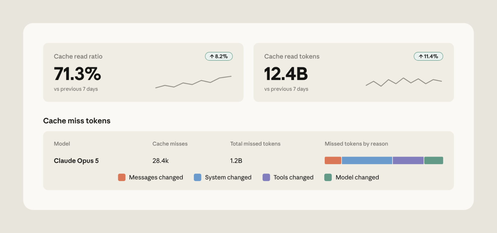
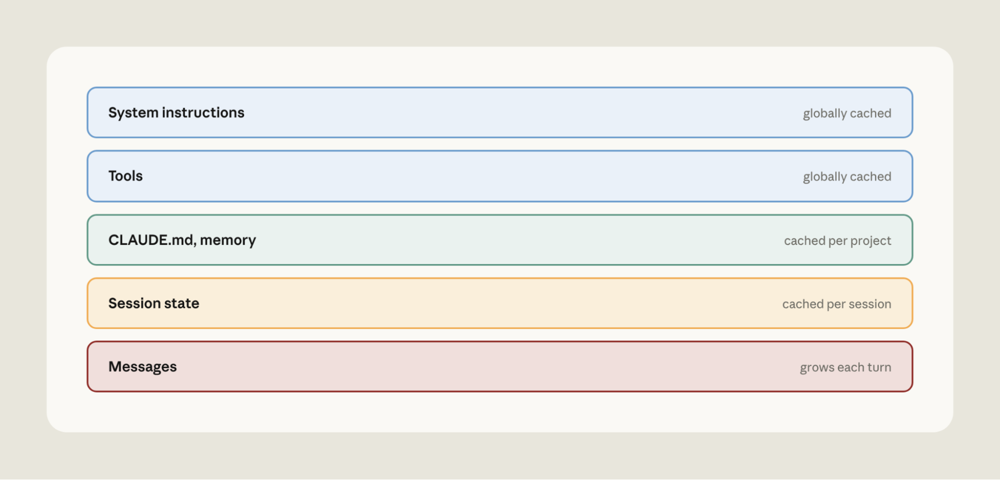
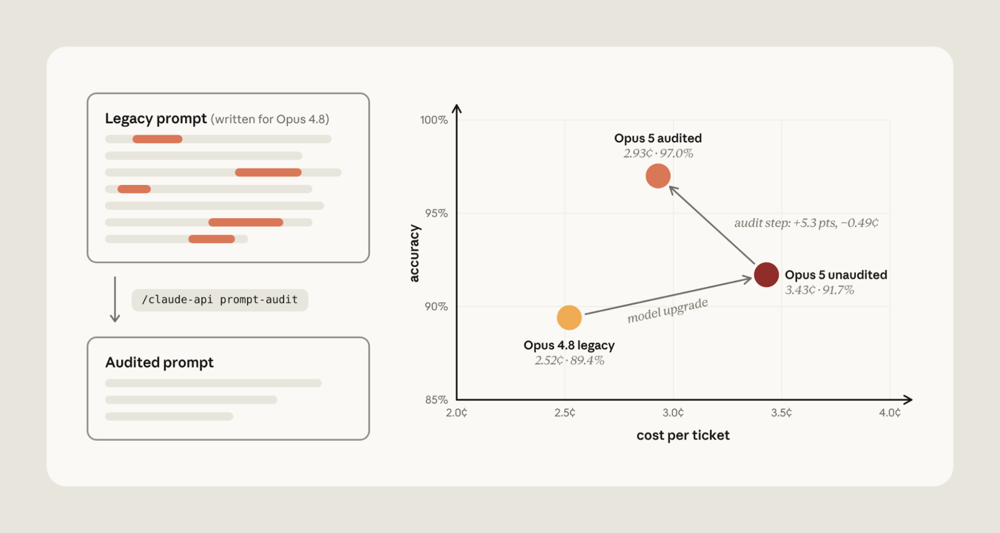
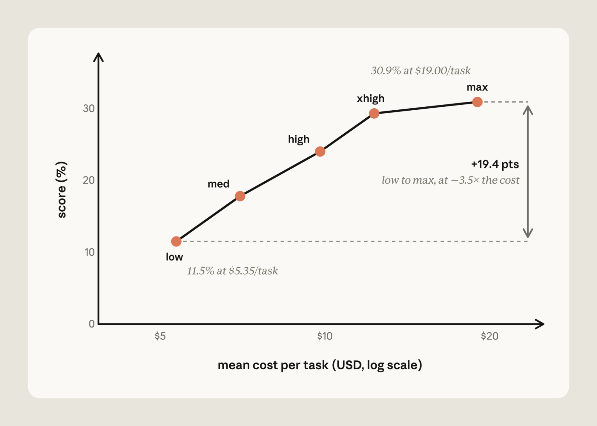
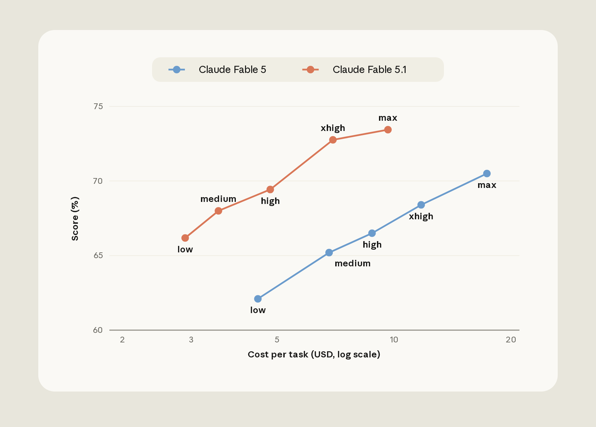
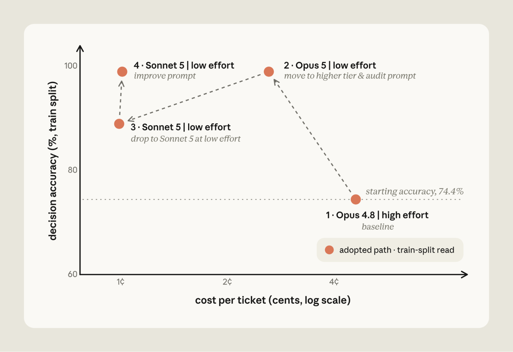
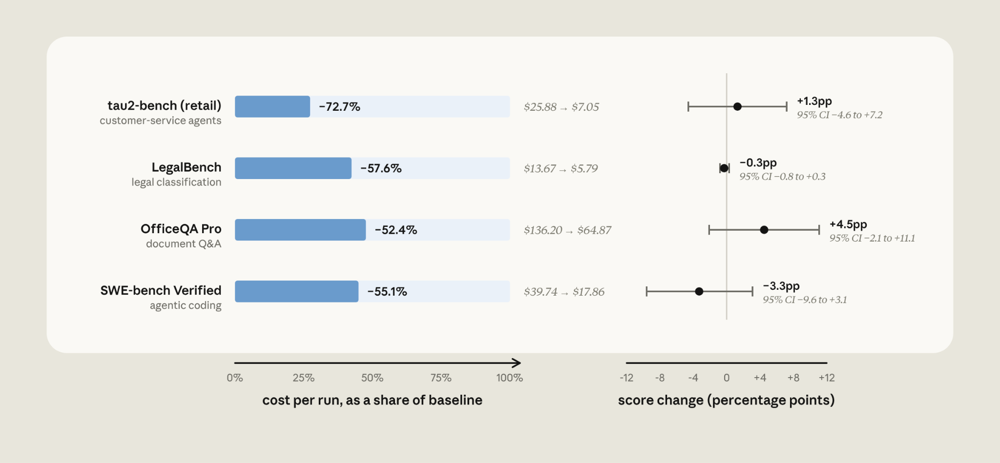

# 用 Claude Platform 降本增效（中英对照）

> 原文标题：Reducing cost and improving performance with Claude Platform
> 原文链接：https://claude.com/blog/reducing-cost-and-improving-performance-with-claude-platform
> 原文作者：Anthropic
> 发布日期：2026-09-08
> **翻译模型：** GLM-5.3-Flash
> **评分：** ★★★☆☆—— 平台侧降本与提效手段的官方汇总
> 排版：每段英文原文在前，中文翻译紧随其后。默认收录正文主体。

Performance and cost are often viewed as a trade-off: to spend less, you accept worse results. In practice, we've found that many applications using Claude Platform can cut costs without giving up performance with three fixes: maximize the prompt cache hit rate, remove anti-patterns from your prompts when upgrading to frontier Claude models, and calibrate effort to the task. We've put this guidance into the claude-api skill. In this article, we show how Claude Code with the claude-api can often find ways to reduce cost while maintaining or improving performance.

性能与成本常被视为一种权衡：想少花钱，就得接受更差的结果。但在实践中我们发现，许多使用 Claude Platform（Claude 平台）的应用可以通过三项改进在降低成本的同时不牺牲性能：最大化 prompt cache（提示词缓存）的命中率、在升级到前沿 Claude 模型时清除 prompt 中的反模式（anti-patterns）、以及根据任务校准 effort（努力程度）。我们已将这些指导整合进 claude-api skill。在本文中，我们将展示搭载 claude-api 的 Claude Code 如何常常找到在维持乃至提升性能的同时降低成本的方法。

### 提示词缓存（Prompt cache）

Before Claude generates a response, it first processes your prompt into an internal working state. This step, called prefill, is the expensive part of handling input. Prompt caching saves that state (the key–value, or KV, cache): when a request starts with the same prefix, Claude reads it back instead of recomputing it. Cache reads are billed at a fraction of the full input price.

在 Claude 生成回复之前，它首先会把你的 prompt 处理成一种内部工作状态。这一步称为 prefill（预填充），是处理输入时开销最大的部分。Prompt caching 会把这一状态（即键值缓存，KV cache）保存下来：当请求以相同前缀开头时，Claude 会直接读取它，而无需重新计算。缓存读取的计费只有完整输入价格的一小部分。

There are a few practical considerations to ensure effective use of the prompt cache. First, the prompt cache is pinned to a specific model. Second, prompt cache reads must be byte-exact across the full span of the prompt. Finally, the prompt cache has a limited time-to-live (TTL).

要有效使用 prompt cache，有几个实际问题需要注意。首先，prompt cache 与特定模型绑定。其次，缓存读取要求整个 prompt 范围内逐字节完全一致。最后，prompt cache 的有效期（TTL）是有限的。

With these points in mind, there are a few practical tips:

牢记这几点之后，以下是一些实用建议：

- Avoid changing effort or thinking settings mid-conversation. These settings render into the prompt ahead of your content, so they are part of the cached prefix. With Claude Opus 5 and Fable 5.1 specifically, you can update effort mid-conversation without breaking the cache.
- Keep volatile values out of the prefix. A dynamic timestamp or ID in the system prompt can change across model calls, and break the cache.
- Avoid tool definitions that reorder themselves. When using the Claude Messages API, the prompt is assembled in a fixed order with tool definitions rendered at the top. Any change to the tool definition will break the cache.
- Be careful when forking conversations. Subagents and branches only share the parent's cache when the fork's prefix is byte-identical, on the same model, and using the same effort.
- Avoid synchronous tool calls and subagents that outlive the cache TTL. If an agent blocks on a long-running tool call or sub-agent, the cache can expire before the results come back. The next turn has to rewrite the cache, at 1.25× the normal input price (2× for a 1-hour cache) instead of the cheap read price.

- 避免在对话中途更改 effort 或 thinking 设置。这些设置会在你的内容之前渲染进 prompt，因此属于缓存前缀的一部分。具体到 Claude Opus 5 和 Fable 5.1，你可以在对话中途更新 effort 而不破坏缓存。
- 不要把易变的值放进前缀。system prompt（系统提示词）中动态变化的时间戳或 ID 在多次模型调用之间会发生变化，从而破坏缓存。
- 避免会自行重新排序的工具定义。使用 Claude Messages API 时，prompt 按固定顺序组装，工具定义渲染在顶部。对工具定义的任何改动都会破坏缓存。
- 分叉对话时要小心。子代理（subagent）和分支只有在分叉前缀逐字节相同、模型相同且 effort 相同时，才与父对话共享缓存。
- 避免同步工具调用和超出缓存 TTL 的子代理。如果代理阻塞在一个长时间运行的工具调用或子代理上，缓存可能在结果返回之前过期。下一轮就不得不重写缓存，代价是正常输入价格的 1.25 倍（1 小时缓存为 2 倍），而不是便宜的读取价格。

#### 如何修复（How to fix it）

We've accumulated a few lessons for prompt cache management:

在 prompt cache 管理方面，我们积累了几条经验：

- Monitor your prompt cache hit rate carefully. Claude Console provides prompt cache diagnostics, including reasoning for prompt cache misses (Figure 1). If hits drop unexpectedly, the cache diagnostics API tells you exactly where two requests diverged.
- Defer rarely used tools. Declare all your tools up front but mark the rarely used ones defer_loading: they stay out of the cached prefix and are appended into the conversation only when Claude looks them up with tool search, so the cache is preserved.
- Apply system prompt updates as messages. Claude Platform lets you add a system instruction as a message mid-conversation instead of editing the system prompt, which preserves the cache.
- Lay out the request out so the stable part stays stable. Add static context (tool definitions and the system prompt) first and the growing conversation behind them (Figure 2).
- Make changes to model or effort when the prompt cache will already be broken. Certain operations, like compaction, already rewrite much of the cache (the conversation). That is a good moment to switch model or effort, since you are paying for a miss anyway.
- Move the cache breakpoint as the conversation grows. With Claude Platform, you can set automatic caching to automatically apply the cache breakpoint to the last cacheable block.
- Pre-warm the cache. To reduce latency, send a request with max_tokens: 0 and an explicit cache breakpoint. This processes the prompt and writes it to the cache without generating anything. If you run it at session start (for example, while a user is typing), the first real request hits a warm cache.
- Don't exceed the prompt cache TTL. The 5-minute cache TTL counts from the start of the request. If an agent blocks on tool calls or sub-agent requests that run longer than 5 minutes, the parent's cache expires before the result comes back. In cases like this, consider setting a 1-hour TTL on the prefix instead.

- 仔细监控 prompt cache 命中率。Claude Console 提供 prompt cache 诊断，包括缓存未命中（miss）的原因分析（图 1）。如果命中率意外下降，cache diagnostics API 会准确告诉你两个请求在哪里开始分岔。
- 延迟加载不常用的工具。事先声明所有工具，但把不常用的那些标记为 defer_loading：它们不会进入缓存前缀，只有当 Claude 通过工具搜索（tool search）查找它们时才会被追加进对话，因此缓存得以保留。
- 以消息形式应用 system prompt 更新。Claude Platform 允许你在对话中途以消息的形式追加系统指令，而不是编辑 system prompt，从而保留缓存。
- 合理组织请求，让稳定的部分保持稳定。先添加静态内容（工具定义和 system prompt），再把不断增长的对话放在其后（图 2）。
- 在缓存本来就会被打破的时机更改模型或 effort。某些操作（如 compaction，即上下文压缩）本来就会重写大部分缓存（对话内容）。此时切换模型或 effort 正合适，因为你反正要为一次未命中付费。
- 随对话增长移动缓存断点。在 Claude Platform 中，你可以启用自动缓存（automatic caching），让缓存断点自动落在最后一个可缓存的块上。
- 预热缓存。为了降低延迟，可以发送一个 max_tokens: 0 且带显式缓存断点的请求。这会处理 prompt 并把它写入缓存，而不生成任何内容。如果你在会话开始时执行（例如在用户输入的同时），第一个真正的请求就会命中热缓存。
- 不要超过 prompt cache 的 TTL。5 分钟的缓存 TTL 从请求开始时计时。如果代理阻塞在运行超过 5 分钟的工具调用或子代理请求上，父请求的缓存会在结果返回前过期。这种情况下，可以考虑改为给前缀设置 1 小时的 TTL。

### 指令（Instructions）

Prompts can accumulate instructions that patch model weaknesses. These instructions can drift relative to the capabilities of the latest Claude models. Here are common prompting "anti-patterns" that hobble frontier Claude model and can inadvertently increase costs:

Prompt 中会逐渐积累起一些为弥补模型弱点而添加的指令，而这些指令可能已经跟不上最新 Claude 模型的能力。以下是一些常见的 prompt 反模式，它们会束缚前沿 Claude 模型的发挥，并可能在无意中推高成本：

- Verification rituals. Instructions like "double-check your work" or "verify twice before responding" are often taken literally by frontier models and can waste tokens.
- Thoroughness and emphasis boosters. "Be maximally thorough," "CRITICAL: YOU MUST ALWAYS…" can lead to verbosity and extra tool calls when working with frontier models.
- Mandatory procedures and scratchpad scaffolds. Fixed step processes (e.g., "think step by step in a scratchpad") or reasoning templates are rituals that frontier models don't need. This scaffolding can stack on top of native reasoning and use unnecessary tokens.
- Stale examples. Few-shot examples tuned to an older model's failure modes can teach a frontier model to imitate long reasoning chains on requests that don't need them.
- Contradictory rules. Frontier models are better at instruction following. Contradictory instructions ("always refund within policy" vs. "never issue refunds without escalation") can be followed more literally by frontier models, resulting in degraded performance.
- Dated configuration. Settings written for an older Claude generation (e.g., manual thinking budgets) can be rejected by the Claude Platform when upgrading to frontier models.

- 验证仪式（verification rituals）。诸如"仔细检查你的工作（double-check your work）"或"回复前验证两次（verify twice before responding）"之类的指令，常被前沿模型按字面执行，从而浪费 token。
- 彻底性与强调性修饰语（thoroughness and emphasis boosters）。"务必最大程度地彻底（Be maximally thorough）""关键：你必须始终……（CRITICAL: YOU MUST ALWAYS…）"在与前沿模型协作时可能导致冗长输出和额外的工具调用。
- 强制流程与 scratchpad（草稿板）脚手架。固定的分步流程（如"在 scratchpad 中逐步思考（think step by step in a scratchpad）"）或推理模板，是前沿模型并不需要的仪式。这些脚手架会叠加在模型原生推理之上，消耗不必要的 token。
- 过时的示例（stale examples）。针对旧模型失败模式调校的 few-shot 示例，会教前沿模型在并不需要长推理链的请求上模仿长推理链。
- 相互矛盾的规则（contradictory rules）。前沿模型的指令遵循能力更强。相互矛盾的指令（"始终在政策范围内退款"与"未经升级审批绝不退款"）可能被前沿模型更加字面地执行，导致性能下降。
- 过时的配置（dated configuration）。为旧一代 Claude 编写的设置（如手动 thinking 预算）在升级到前沿模型时可能被 Claude Platform 拒绝。

#### 如何修复（How to fix it）

We've updated the claude-api skill with a new command that watches out for these anti-patterns. In Claude Code, run /claude-api prompt-audit against your prompts, skills, or tool descriptions. The audit covers anything in your working directory, including application code that calls the Claude API and Claude Code's own configuration (e.g., CLAUDE.md or skills).

我们已在 claude-api skill 中加入一个用于排查这些反模式的新命令。在 Claude Code 中，对你的 prompt、skill 或工具描述运行 /claude-api prompt-audit。该审计会覆盖工作目录中的所有内容，包括调用 Claude API 的应用代码，以及 Claude Code 自身的配置（如 CLAUDE.md 或 skills）。

For example, we tested a model migration from Opus 4.8 to Opus 5 on a customer support benchmark. We started from a clean prompt and planted one anti-pattern at a time (a retired thinking setting, a pair of contradictory refund rules, a manual scratchpad, "verify twice", "be maximally thorough", and a mandatory six-step procedure), giving six legacy prompts.

例如，我们在一个客服基准上测试了从 Opus 4.8 到 Opus 5 的模型迁移。我们从一个干净的 prompt 出发，每次植入一个反模式（一个已弃用的 thinking 设置、一对相互矛盾的退款规则、一个手动 scratchpad、"verify twice"、"be maximally thorough"，以及一个强制的六步流程），得到六个遗留 prompt。

We ran each on Opus 4.8, on Opus 5 with only the model ID changed, and on Opus 5 after running /claude-api prompt-audit once per prompt (Figure 3 shows the average across the six).

我们在三种设置下分别运行每个 prompt：Opus 4.8；仅更换模型 ID 的 Opus 5；以及先对每个 prompt 运行一次 /claude-api prompt-audit 之后的 Opus 5（图 3 展示了六个 prompt 上的平均值）。

With Opus 5, verification rituals ("verify twice") use unnecessary tokens by duplicating order lookup on every refund. Emphasis boosters ("be maximally thorough") became dozens of unneeded knowledge-base searches.

在 Opus 5 上，验证仪式（"verify twice"）会让每笔退款都重复查询订单，浪费不必要的 token；强调性修饰语（"be maximally thorough"）则变成了数十次不必要的知识库搜索。

Running /claude-api prompt-audit removed the anti-patterns, decreasing costs by 14.6% and increasing accuracy by 5.3% on average. Cost dropped because extra tool calls and duplicated reasoning were eliminated. Accuracy rose for three reasons. The retired thinking setting made the API reject every routing request outright. The contradictory refund rules led Opus 5 to withhold four refunds it owed while it asked the customer to confirm. And the manual scratchpad collided with Opus 5's built-in thinking: on three tickets it wrote the tool call inside its reasoning and never executed it.

运行 /claude-api prompt-audit 清除了这些反模式，平均降低成本 14.6%、提升准确率 5.3%。成本下降，是因为多余的工具调用和重复的推理被消除了。准确率提升则有三个原因：已弃用的 thinking 设置导致 API 直接拒绝每一个路由（routing）请求；相互矛盾的退款规则使 Opus 5 一边要求客户确认，一边扣下了本应退给客户的四笔退款；手动 scratchpad 与 Opus 5 内置的 thinking 相冲突——在三个工单上，它把工具调用写进了推理过程里，却从未执行。

### 努力程度（Effort）

Effort tells Claude "how hard to work." At low effort Claude generally reaches conclusions faster. At high effort, Claude deliberates, verifies, and explores alternatives before answering.

Effort（努力程度）告诉 Claude"要有多努力"。低 effort 时，Claude 通常更快得出结论；高 effort 时，Claude 会在回答之前深思熟虑、反复验证并探索其他可能。

Cost-versus-performance across effort levels on a single model can vary. For example, Claude Fable 5 scores 11.5% at low effort for $5.35 per task on FrontierCode Diamond (the hardest 50 tasks). At max effort, Fable 5 gets 30.9% for $19.00 per task; changing effort raises the score to about 2.7x (+19 points) for about 3.5x the cost (Figure 4).

在同一模型上，不同 effort 档位的成本-性能表现可能相差很大。例如，在 FrontierCode Diamond（最难的 50 个任务）上，Claude Fable 5 在低 effort 下得分为 11.5%，每任务成本 5.35 美元；在最高（max）effort 下得分为 30.9%，每任务成本 19.00 美元。调整 effort 使得分提高到约 2.7 倍（+19 个百分点），而成本约为原来的 3.5 倍（图 4）。

On Claude Fable 5.1, Humanity's Last Exam (without tools) shows a steep curve with a diminishing last step. It scores about 53% at low effort for about $0.30 per question and about 61% at max effort for about $2.23; the last step up to max adds about half a point for 46% more cost. The gain inside the benchmark's run-to-run noise, so you pay more for no measurable gain.

在 Claude Fable 5.1 上，Humanity's Last Exam（不使用工具）呈现出一条陡峭曲线，且最后一步收益递减：低 effort 下得分约 53%，每题约 0.30 美元；max effort 下得分约 61%，每题约 2.23 美元。最后一步升到 max 只增加约半个百分点，成本却增加 46%。这一增益落在基准测试多次运行的噪声范围之内——也就是说，你付出了更多成本，却得不到可测量的收益。

Effort can be miscalibrated in either direction:

Effort 在两个方向上都可能校准失当：

- Assuming higher is always better. High effort can cause over-thinking. Claude spends more time deliberating than the task warrants, which adds cost / latency and can degrade answer quality. Deliberation only helps while there's still evidence to find.
- Biasing to low effort. Set too low, Claude stops before it has enough evidence. It makes fewer tool calls, so it may answer from the first search result instead of the third. It thinks less on hard steps and skips the check it would normally run on its own. The answer looks finished, but it's built on partial information.

- 认为越高总是越好。高 effort 可能导致过度思考（over-thinking）：Claude 花在深思上的时间超出任务所需，这会增加成本和延迟，还可能降低答案质量。深思只有在还有证据可找时才有帮助。
- 偏向低 effort。设置得过低时，Claude 会在掌握足够证据之前就停下来。它发起的工具调用更少，因此可能只依据第一条搜索结果作答，而不是第三条；在困难步骤上思考得更少，并跳过它原本会自动执行的自检。答案看起来完成了，但其实是建立在残缺信息之上的。

#### 如何修复（How to fix it）

There are some useful ways to calibrate effort:

以下是一些校准 effort 的实用方法：

- Test stronger models at lower effort. A stronger model at low effort can be cheaper than a weaker model working hard (high effort). For example, on CursorBench 3.2, Claude Fable 5.1 at low effort matches the performance of Fable 5 at high effort at a third of the cost (Figure 5). Two things make the newer model cheaper: at low effort it does less work per task, and Fable 5.1's prompt-cache reads are priced at $0.25 per million tokens versus $1.00 for Fable 5. Even at Fable 5's prices, Fable 5.1 at low effort would cost about 40% less.
- Understand your task shape. Measuring application performance across a sweep of effort levels is a useful way to understand the cost-performance tradeoff for your particular task. On a non-saturated evaluation, a flat performance-cost curve across effort levels suggests that the task is not bound by thinking compute; increasing effort is not beneficial.

- 在更低 effort 下测试更强的模型。低 effort 的更强模型，可能比高 effort 下"拼命工作"的较弱模型更便宜。例如，在 CursorBench 3.2 上，低 effort 的 Claude Fable 5.1 以三分之一的成本达到高 effort 下 Fable 5 的性能（图 5）。新模型更便宜的原因有二：低 effort 下它每个任务做的工作更少；此外 Fable 5.1 的缓存读取价格为每百万 token 0.25 美元，而 Fable 5 为 1.00 美元。即便按 Fable 5 的价格计算，低 effort 的 Fable 5.1 成本也要低约 40%。
- 理解你的任务形态。在一系列 effort 档位上测量应用性能，是理解特定任务成本-性能权衡的有效方法。在未饱和的评测上，如果性能-成本曲线在不同 effort 档位之间是平坦的，说明该任务不受 thinking 算力的约束，提高 effort 没有收益。

This calibration often involves running an evaluation across models and effort levels. In Claude Code, /claude-api hillclimb performs this search for you: it splits your evaluation into train and test sets, proposes configuration changes, and reads failing train examples to fix what it finds.

这类校准通常需要在多个模型和 effort 档位上运行评测。在 Claude Code 中，/claude-api hillclimb 可以替你完成这一搜索：它把你的评测拆分为训练集和测试集，提出配置改动建议，并阅读训练集中失败的样例来修复发现的问题。

We ran it on a customer support benchmark, starting from Opus 4.8 at its default (high) effort. The hillclimber first tried Opus 5 at low effort, applying prompt-audit to remove mandatory tool-call rituals, scratchpad steps, and contradictory rules. That cleared the Opus 4.8 baseline at 98.9% train accuracy and cut cost to 2.6 cents per ticket.

我们在一个客服基准上运行了它，起点是默认（高）effort 的 Opus 4.8。hillclimber 首先尝试了低 effort 的 Opus 5，并用 prompt-audit 移除了强制的工具调用仪式、scratchpad 步骤和相互矛盾的规则。结果以 98.9% 的训练集准确率超过了 Opus 4.8 基线，并把成本降到每张工单 2.6 美分。

It then stepped down to Sonnet 5 at low effort, which was cheaper still at 1 cent per ticket, but accuracy fell to 88.9%. Reading the failing train tickets, Claude added routing rules and a refund-cap cross-reference to the prompt, bringing Sonnet 5 back to 98.9% at the same cost.

随后它降到低 effort 的 Sonnet 5——更便宜，每张工单 1 美分——但准确率降至 88.9%。通过阅读训练集中失败的工单，Claude 在 prompt 中加入了路由规则和退款上限的交叉引用，使 Sonnet 5 在相同成本下回到 98.9%。

On the 14 held-out tickets the search never saw, the final configuration scored 90.5% against the original setup's 78.6%, at about one fifth the cost.

在搜索过程从未见过的 14 张保留（held-out）工单上，最终配置取得 90.5% 的成绩，而原始设置为 78.6%，成本约为原来的五分之一。

### 自动化降本（Automating cost reduction）

Prompt caching, instructions, and effort are common levers for reducing cost. Our documentation covers even more. To run a holistic cost audit of application code that uses the Claude API, we've added /claude-api cost-optimize: it profiles where your spend goes, applies cost reductions, and, if you provide an evaluation, shows how savings trade off with performance.

Prompt caching、指令与 effort 是降低成本的常用杠杆，我们的文档还覆盖了更多手段。为了对使用 Claude API 的应用代码做一次整体成本审计，我们新增了 /claude-api cost-optimize：它会分析你的开销去向，实施降本措施，并且如果你提供了评测，还会展示节省与性能之间的权衡。

cost-optimize starts by finding where your tokens go: from your organization's usage and cost reports if you have a Claude Admin API key, from the usage object on each API response if your application logs it, or, failing both, by reading your request-building code and estimating.

cost-optimize 首先找出你的 token 花在了哪里：如果你有 Claude Admin API key，就从你所在组织的用量与成本报告中获取；如果你的应用记录了每次 API 响应中的 usage 对象，就从那里获取；两者都不可用时，则通过阅读你构建请求的代码进行估算。

It then ranks the available savings, starting with prompt caching, trimming what each request carries (including a prompt-audit), bounding output, and batching unattended work. If you supply an evaluation, it goes further and computes cost and performance across effort levels and model choices.

然后它会对可用的节省手段排序，首先是 prompt caching，此外还包括精简每个请求携带的内容（含一次 prompt-audit）、限制输出规模，以及把无人值守的工作改为批处理。如果你提供评测，它还会更进一步，计算不同 effort 档位和模型选择下的成本与性能。

We ran this on four public benchmarks, starting with Sonnet 5 as a baseline (Figure 7):

我们在四个公开基准上运行了它，以 Sonnet 5 作为基线（图 7）：

- LegalBench (~58% lower cost): cost-optimize proposed caching a shared prefix across tasks, setting low effort, and processing tasks via the Batch API. Thinking tokens fell from 102,779 to 8,284, but pass rate stayed within noise and cost dropped by ~58%.
- tau2-bench retail (~73% lower cost): By implementing prompt caching with explicit breakpoint placement, cost-optimize reduced spend by 73% while keeping pass rate flat.
- OfficeQA Pro (~52% lower cost): cost-optimize added batch processing and document caching, which brought cost down from $136.20 to $64.87.
- SWE-bench Verified (~55% lower cost): cost-optimize found that the default config already caches correctly. Savings came from setting effort to medium and constraining the agent's output to just a few concise sentences. Median steps per task went from 29 to 17 and prompt tokens fell from 75.2M to 33.7M.

- LegalBench（成本降低约 58%）：cost-optimize 提出跨任务缓存共享前缀、设置低 effort，并通过 Batch API 处理任务。thinking token 从 102,779 降至 8,284，通过率保持在噪声范围内，成本下降约 58%。
- tau2-bench retail（成本降低约 73%）：通过实现带显式断点位置的 prompt caching，cost-optimize 在保持通过率不变的情况下将开销降低了 73%。
- OfficeQA Pro（成本降低约 52%）：cost-optimize 增加了批处理和文档缓存，把成本从 136.20 美元降到 64.87 美元。
- SWE-bench Verified（成本降低约 55%）：cost-optimize 发现默认配置已经正确启用了缓存。节省来自把 effort 设为中等（medium），并把代理的输出限制为寥寥几句简洁的陈述。每任务中位步数从 29 降到 17，prompt token 从 75.2M 降至 33.7M。

### 上手指南（Getting started）

Start with /claude-api prompt-audit when you've migrated to a frontier Claude model and want to check your existing prompts against it. It scans the prompts, skills, and tool descriptions in your working directory. This can be application code that calls the Claude API or Claude Code's configuration (CLAUDE.md, skills). It removes common anti-patterns that hobble frontier models.

当你迁移到前沿 Claude 模型、想据此检查现有 prompt 是否匹配时，先从 /claude-api prompt-audit 开始。它会扫描工作目录中的 prompt、skill 和工具描述——可以是调用 Claude API 的应用代码，也可以是 Claude Code 的配置（CLAUDE.md、skills）。它会清除束缚前沿模型发挥的常见反模式。

Reach for /claude-api cost-optimize when your application uses the Claude API and you want a cost audit. It profiles token spend and then tests different levers: it applies prompt-audit, but also checks for ways to lower cost via prompt caching, batching unattended work, or bounding output. If you provide an evaluation, it measures the effort and model selection trade-offs.

当你的应用使用 Claude API、你想做一次成本审计时，可以使用 /claude-api cost-optimize。它先分析 token 开销，然后尝试不同的杠杆：应用 prompt-audit，同时检查通过 prompt caching、批处理无人值守工作或限制输出规模来降低成本的途径。如果你提供评测，它还会测量 effort 与模型选择之间的权衡。

Finally, use /claude-api hillclimb for an iterative search over cost and performance. Given an evaluation, Claude splits it into train and test sets, then proposes updates to your application that aim to reduce cost while maintaining baseline performance. Claude reads the failing train cases to guide the search, and the final configuration is scored on the held-out test set.

最后，用 /claude-api hillclimb 对成本与性能进行迭代搜索。给定一个评测，Claude 会把它拆分为训练集和测试集，然后提出针对你应用的改进建议，目标是在维持基线性能的前提下降低成本。Claude 会阅读训练集中失败的样例来引导搜索方向，最终配置在保留的测试集上评分。

To learn more:

了解更多：

- See our documentation, here
- See our cookbook, here

- 参见我们的文档（链接见原文）。
- 参见我们的 cookbook（链接见原文）。
