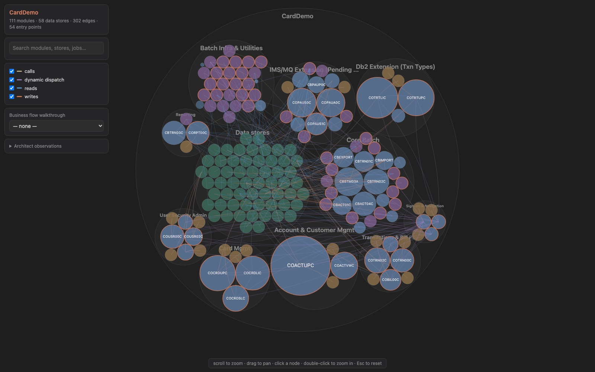
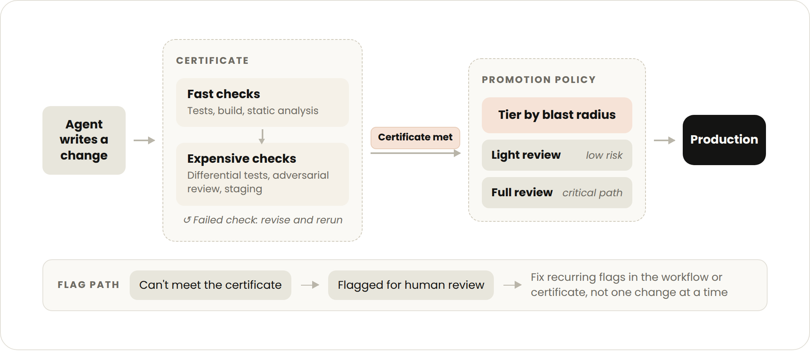
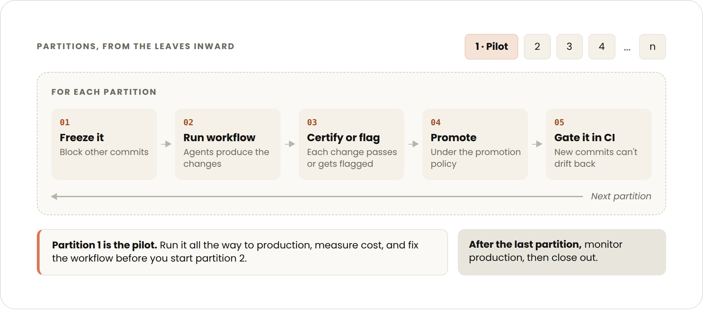

# 如何为 AI 驱动的代码现代化项目做好准备（中英对照）

> **原文标题：** How to prepare for AI-driven code modernization projects
> **原文链接：** https://claude.com/blog/how-to-prepare-for-ai-driven-code-modernization-projects
> **原文作者：** Jonah Ezekiel、Lexie Tonelli（Anthropic）
> **发布日期：** 2026-09-23
> **翻译模型：** GLM-5.3-Flash
> **评分：** ★★★☆☆ —— 源自真实企业客户部署的六步准备框架，重组织流程与变更管理（认证、晋级策略、前置条件），实践性强但技术细节相对少
> **排版：** 每段英文原文在前，中文翻译紧随其后。术语保留英文原文并附中文释义。默认收录正文主体。

---

In our Notes from the Field series, Anthropic forward deployed engineers share best practices inspired by real customer deployments. In this article, we share our experience managing large code modernization projects.

在我们的「Notes from the Field（一线见闻）」系列中，Anthropic 的前线部署工程师（forward deployed engineers）分享源自真实客户部署的最佳实践。本文分享我们管理大型代码现代化项目的经验。

Code modernizations once scoped as multi-year, all-hands efforts can now finish in months (or [weeks](https://claude.com/blog/ai-code-migration)), but the organizational work on either side often remains the same.

过去被界定为多年期、全员投入的代码现代化（[code modernization](https://claude.com/blog/how-ai-helps-break-cost-barrier-cobol-modernization)）项目，如今几个月（甚至[几周](https://claude.com/blog/ai-code-migration)）就能完成，但两端围绕它的组织工作往往一如既往。

For example, every change to a critical banking system must go through change management, review, and approval. It is a robust process because regulators, auditors, and the business require it.

例如，对关键银行系统的每一次变更都必须经过变更管理（change management）、审查与审批。之所以有一套如此严格的流程，是因为监管者、审计方和业务本身都要求如此。

Those processes are what make critical systems trustworthy, and they were built on the assumption that a human wrote each change and a human would review each diff. Once agents accelerate writing the changes, the bottleneck shifts from producing changes to mobilizing the organization around them.

正是这些流程让关键系统值得信赖，而它们建立在"每处变更都由人编写、每份 diff 都由人审查"的假设之上。一旦智能体（agent）加速了变更的编写，瓶颈就从"产出变更"转移到"动员整个组织围绕这些变更展开工作"。

This article covers the work enterprises must do before the modernization takes place: defining what done means, what evidence a change must carry, how certified changes will reach production, and what has to be staged so the run can start.

本文讨论企业在现代化启动之前必须完成的准备工作：定义"完成"意味着什么、一份变更必须携带什么证据、通过认证的变更如何进入生产环境，以及要预先布置好什么才能开跑。

We break this process into six steps:

我们把这一过程拆成六个步骤：

- Define the target: the tech stack and behavior the modernized code must have.
- Create the certificate: the conditions that the changes must meet to be considered correct in the target state.
- Set the promotion policy: the path by which certified changes get into production at the rate they're produced.
- Put the prerequisites in place: environment, CI/CD, review capacity, and approvals.
- Build and refine the agentic workflow: the custom Claude Code [dynamic workflow](https://claude.com/blog/introducing-dynamic-workflows-in-claude-code) that distributes the modernization across many smaller parallel subagent workstreams that produce the changes. This is built around the target, certificate, and promotion policy.
- Run the modernization: prove the workflow end to end on a small partition of the codebase, then scale.

- 定义目标（target）：现代化后的代码必须具备的技术栈与行为。
- 建立认证（certificate）：变更在目标状态下被视为正确所需满足的条件。
- 设定晋级策略（promotion policy）：通过认证的变更按其产出速度进入生产环境的路径。
- 备齐前置条件：环境、CI/CD、审查容量与各项审批。
- 构建并打磨智能体工作流（agentic workflow）：定制的 Claude Code [动态工作流](https://claude.com/blog/introducing-dynamic-workflows-in-claude-code)（dynamic workflow），把现代化拆分到许多更小的并行 subagent 工作流上来产出变更。它围绕目标、认证与晋级策略来搭建。
- 执行现代化：先在代码库的一个小分区（partition）上端到端验证工作流，然后再扩大规模。

## 第 1 步：定义目标（Step 1: Define the target）

The target is the end state of the modernization. The desired end state determines which of the three kinds of modernization you are doing, detailed in the table below.

目标是现代化的最终状态。你期望的最终状态决定了你在做三种现代化中的哪一种，详见下表。

| Type | What it is | Choose when | The target is |
|---|---|---|---|
| **Uplift** | Same-stack version bump (e.g., C++11 → C++20). | The stack is fine but the version has fallen behind: end-of-life runtimes, unpatched security issues, dependencies you can no longer upgrade. | A runtime version and package set. |
| **Transform** | Cross-stack rewrite that keeps behavior fixed (e.g., COBOL → Java). | The stack is the problem to resolve and the behavior is trusted. | Everything needed for an uplift, plus the language, frameworks, and architectural conventions the new code must follow. |
| **Reimagine** | Greenfield rebuild on a new architecture with modified behavior. | The behavior needs to be changed alongside the code. | Everything needed for a transform, plus a written behavioral spec for the new system. |

| 类型（Type） | 是什么（What it is） | 何时选择（Choose when） | 目标是什么（The target is） |
|---|---|---|---|
| **升级型（Uplift）** | 同栈版本升级（如 C++11 → C++20）。 | 技术栈本身没问题，只是版本落后了：运行时到达生命周期终点（EOL）、安全漏洞未修补、依赖无法再升级。 | 一个运行时版本和依赖包集合。 |
| **转换型（Transform）** | 跨栈重写，行为保持不变（如 COBOL → Java）。 | 技术栈才是要解决的问题，而行为是可信的。 | 升级型所需的全部内容，外加新代码必须遵循的语言、框架与架构约定。 |
| **重新构想型（Reimagine）** | 在新架构上全新重建，行为有所修改。 | 行为需要随代码一起改变。 | 转换型所需的全部内容，外加一份书面的新系统行为规格（behavioral spec）。 |

### 确定现代化类型（Determine the modernization type）

Determining which type of modernization to do is often debated inside an organization. In our experience, the people closest to production want the stack swapped with behavior held constant to contain risk (transform modernization). On the other side are often the engineers who have lived with the codebase and want the modernization to pay down tech debt, plus other business stakeholders who want to take the opportunity to name new requirements (reimagine modernization).

该做哪种类型的现代化，组织内部常常争论不休。据我们的经验，离生产环境最近的人希望只换技术栈、行为保持不变，以控制风险（转换型现代化，transform modernization）；另一边往往是与代码库长期相伴的工程师，希望现代化能顺带偿还技术债（tech debt），外加其他想借机提出新需求的业务利益相关方（重新构想型现代化，reimagine modernization）。

Both positions are reasonable, but if the question is left unresolved it resurfaces later as an argument over whether a given change is "correct." Building consensus on which path to take adds initial friction, but streamlines the project as a whole.

两种立场都合理，但如果悬而不决，这个问题日后会重新冒头，变成对"某个变更到底算不算正确"的争执。就走哪条路达成共识会带来初期摩擦，却能让整个项目更顺畅。

### 绘制代码库地图并编写行为规格（Map the codebase and create the behavioral spec）

Understanding the current system is often a good first step for defining the target. Extracting what the old code actually does and creating an inventory of current behavior makes it easy to decide if parts should be changed or dropped, and so whether the modernization is a transform or a reimagine. This also often reveals unknown business logic and edge cases.

理解现有系统通常是定义目标的好起点。提取旧代码的实际行为并盘点现有行为，就能轻松判断哪些部分该改、哪些该弃，进而决定现代化是转换型还是重新构想型。这一步也常常揭示不为人知的业务逻辑和边界情况（edge case）。

Claude can do much of that discovery by [mapping dependencies and documenting workflows that nobody remembers building](https://claude.com/blog/how-ai-helps-break-cost-barrier-cobol-modernization). The [code modernization plugin](https://github.com/anthropics/claude-plugins-official/tree/main/plugins/code-modernization)'s assess, map, and extract-rules commands mine business rules with source citations that engineers can then review.

Claude 可以完成这类探索的大部分工作：[绘制依赖关系图，把连当事人都不记得写过的流程记录成文档](https://claude.com/blog/how-ai-helps-break-cost-barrier-cobol-modernization)。[代码现代化插件](https://github.com/anthropics/claude-plugins-official/tree/main/plugins/code-modernization)（code modernization plugin）的 assess、map 和 extract-rules 命令会挖掘业务规则并附上出处引用，供工程师复核。

However, Claude's discovery alone may not capture how a legacy system fully behaves. Interviews with business users and developers, and internal documentation, can fill those gaps. Context gathering may take some time upfront, but the quality of that context shapes every decision the workflow makes later.

不过，仅靠 Claude 的探索未必能完整捕捉遗留系统的全部行为。对业务用户和开发者的访谈、以及内部文档，可以填补这些空白。前期收集上下文可能颇费时间，但这份上下文的质量会塑造工作流随后做出的每一个决策。

For a reimagine, defining the target requires additional work: a detailed behavioral spec should be written down and agreed with user groups.

对重新构想型而言，定义目标还需要额外工作：应当把详细的行为规格写下来，并与用户群体达成一致。

**Figure 1:** An interactive dependency map example from the code modernization plugin. / **图 1：** 代码现代化插件生成的交互式依赖图（dependency map）示例。

### 明确项目的立项理由与目标（Establish the project's justification and goals）

Alongside defining the target, the organization should consider why the modernization is worth undertaking at all. Modernizing legacy systems can reduce ongoing maintenance and operational costs, however, in our experience, cost reduction has not been the driving goal of most modernization projects.

在定义目标的同时，组织还应该想清楚：这场现代化到底值不值得做。现代化遗留系统可以降低持续的维护与运营成本，但据我们的经验，降本并非大多数现代化项目的首要动因。

> Risk reduction is often the most important modernization benefit. Consider the risk of not doing the modernization when debating whether or not to undergo the project.

> 降低风险往往才是现代化最重要的收益。在争论要不要立项时，请把"不现代化"的风险也纳入考量。

For example, a system carrying unpatched vulnerabilities can mean a cyber breach or an outage severe enough to put the business itself at risk. An unsupported runtime or a shrinking pool of engineers who understand the system exacerbates the risk.

例如，一个带着未修补漏洞运转的系统，可能意味着网络入侵或严重宕机，严重到足以把业务本身置于险境。失去支持的运行时（runtime），加上理解这套系统的工程师群体日益萎缩，会让风险进一步加剧。

Agentic coding tools like Claude Code have shortened modernization timelines, but budgets are still hard to estimate, which leads to inertia. We have released the costs of some of our [large-scale modernizations](https://claude.com/blog/ai-code-migration) as have [others](https://claude.com/customers/lg-cns). These can serve as a rough baseline, and we have additional guidance on budget projections at the bottom of this guide.

Claude Code 这类智能体编码工具缩短了现代化的时间线，但预算仍然难以估算，由此滋生观望。我们已公布自己部分[大规模现代化](https://claude.com/blog/ai-code-migration)的成本，[其他公司](https://claude.com/customers/lg-cns)也有公布。这些数字可以作为粗略基准，本指南末尾还有关于预算测算的补充指引。

The main challenge in initiating these projects is usually building the internal consensus and commitment from the teams that own the system, and the teams that depend on it. Building the business case and setting the goals of the project, often at the leadership level, make this part of the process easier. This also helps anchor the tradeoffs in the certificate and promotion policy that follow. When stakeholders disagree over how much risk a change can carry, the risk of not modernizing is the counterweight.

启动这类项目的主要挑战，通常在于凝聚内部共识，并取得系统所属团队和依赖该系统的团队的承诺。在领导层层面构建商业论证（business case）、设定项目目标，能让这一环更容易；这也有助于锚定后续认证与晋级策略中的权衡取舍。当利益相关方就"一份变更可以承载多少风险"争执不下时，"不现代化的风险"就是那个砝码。

## 第 2 步：定义认证（Step 2: Define the certificate）

The certificate is the set of conditions or tests that every modernization change must meet. Pick the conditions that give the strongest cumulative evidence that the change is correct against the target.

认证（certificate）是每一份现代化变更都必须满足的一组条件或测试。要挑选那些能就"变更相对目标而言是正确的"给出最强累计证据的条件。

Each condition should be checkable without a human in the loop, so the agentic workflow can iterate on a change until it meets the certificate or flag it for human review if it can't.

每个条件都应当可以在无人工参与的情况下自动检查，这样智能体工作流就能围绕一份变更反复迭代，直到满足认证；若始终无法满足，则将其标记出来交人工审查。

What goes into the certificate depends on the target, but will usually draw from this list:

认证里放什么取决于目标，但通常会从下面这份清单中取材：

- The original test suite passes
- Claude-authored tests written during the modernization all pass
- Test coverage meets an agreed threshold
- Performance benchmarks stay within an agreed bound
- Independent adversarial reviews by Claude, each in a fresh context window, find no blocking issues
- For user interfaces, Claude-driven computer use finds no regressions
- Current and target versions produce the same output from the same input, which can be live, recorded, or Claude-generated
- Persisted state and wire formats round-trip between current and target versions
- Changes run in staging for an agreed period with no regressions in error rates, latency, or alerts
- Static analysis and security scans show no new findings
- For compiled targets, the build is clean and type checks pass

- 原有测试套件全部通过
- 现代化期间由 Claude 编写的测试全部通过
- 测试覆盖率达到约定的阈值
- 性能基准测试保持在约定的界限内
- 由 Claude 独立开展的多轮对抗性审查（adversarial review，各自使用全新的上下文窗口）未发现阻断性问题
- 对用户界面，由 Claude 驱动的计算机操作（computer use）未发现回归
- 现有版本与目标版本对相同输入产出相同输出，输入可以是实时、录制或由 Claude 生成的
- 持久化状态与线上格式（wire format）可在现有版本与目标版本之间无损往返
- 变更在预发布环境（staging）运行一段约定时间，错误率、延迟与告警均无回归
- 静态分析与安全扫描没有新增发现
- 对编译型目标，构建干净通过、类型检查通过

> Write the certificate with the people who will review and promote changes into production. Bring in the developers, user groups, and business leads who depend on the codebase now, while the certificate and agentic workflow are still being designed.

> 与将来负责审查变更并将其推进生产环境的人一起制定认证。趁认证与智能体工作流还在设计阶段，就把现在依赖这个代码库的开发者、用户群体和业务负责人拉进来。

Their expertise shapes what the certificate measures, and their early involvement is what earns their buy-in when changes reach review. A good check on the finished certificate is whether they would be comfortable merging on the certificate's evidence alone. If they see their own bar in it, the promotion policy in Step 3 can be lighter.

他们的专业判断塑造了认证所衡量的内容，而他们的早期参与会在变更进入审查时换来他们的认可。检验认证是否合格的一个好办法，是看他们是否愿意仅凭认证给出的证据就执行合并。如果他们在其中看到了自己的标准，第 3 步的晋级策略就可以更轻量。

What the certificate checks against, and how, depends on the modernization type.

认证对照什么检查、怎么检查，取决于现代化的类型。

- For an uplift modernization, parity is against the original codebase, and the original test suite can be the core of the certificate.
- For a transform modernization, parity is also against the original codebase, but the original test suite rarely runs on the new stack. Replay of production traffic, differential testing between old and new, and a prod-parallel deployment do most of the work instead.
- For a reimagine modernization, the certificate is anchored in the behavioral spec. This is the hardest case. A spec is less objective than an existing system to diff against, so a larger degree of model judgement is involved, which can lead to more variable outcomes. Here, the certificate leans on tests written from the spec, independent adversarial reviews by Claude that check each change against the spec, and differential checks where the new system keeps the old one's behavior. Expect to revise the certificate as the spec is clarified: gaps in the spec show up here first.

- 对升级型现代化（uplift），行为对等性（parity）对照原代码库，原有测试套件可以充当认证的核心。
- 对转换型现代化（transform），对等性同样对照原代码库，但原有测试套件很少能在新栈上运行。此时主要由生产流量回放（replay）、新旧差分测试（differential testing）以及生产并行部署（prod-parallel deployment）来承担大部分验证工作。
- 对重新构想型现代化（reimagine），认证锚定在行为规格上。这是最难的情形：规格不像一个现成系统那样可供客观 diff，因此模型判断的成分更大，结果也更不稳定。此时，认证依靠依据规格编写的测试、由 Claude 独立进行并把每份变更对照规格核查的对抗性审查，以及在新系统保留旧行为之处开展的差分校验。要有心理准备：随着规格逐步澄清，认证也需要修订——规格的缺口最先在这里暴露。

Older systems often have thin test coverage, flaky tests, and little telemetry. Part of defining the certificate is identifying these gaps. If it will be difficult to support a strong certificate, one of the most useful things to do at this step is to use Claude to build the missing evidence, whether that's standing up a prod-parallel setup, building a replay harness, or writing more tests.

老旧系统往往测试覆盖单薄、测试不稳定（flaky）、遥测（telemetry）数据稀少。定义认证的一部分工作就是找出这些缺口。如果难以支撑一个强认证，这一步最有用的事情之一，就是用 Claude 把缺失的证据补建出来：无论是搭一套生产并行环境、建一个流量回放工具（replay harness），还是补写更多测试。

## 第 3 步：设定晋级策略（Step 3: Set the promotion policy）

Agents will produce changes far faster than any human team can review them diff-by-diff. The promotion policy is a tiered review path--written down and agreed in advance--that sets the depth of human review for a change, so the modernization can finish on an acceptable timeline.

智能体产出变更的速度，远远超过任何人类团队逐 diff 审查的能力。晋级策略（promotion policy）是一套分级审查路径——白纸黑字写下来并事先商定——它为每份变更设定人工审查的深度，让现代化能在可接受的时间线内完成。

Like the certificate, work this step with the reviewers, and fit it into your organization's existing change-management process wherever you can. The details will differ by organization and the risk tradeoffs it faces, but a few rules hold everywhere:

与认证一样，这一步要与审查者共同完成，并尽可能嵌入组织现有的变更管理流程。细节会因组织及其面临的风险权衡而异，但有几条规则放之四海而皆准：

- Tier changes by blast radius and agent confidence. Use your organization's own change or risk classification if it has one. Keep full human review for critical paths.
- Fix recurring flags at the source. Group and analyze the flagged changes over time. When the same kind of flag keeps recurring, fix the cause in the agentic workflow or the certificate rather than reviewing each one.
- Design the output format with the reviewers. Agree on what information and format make review the fastest, and what signals give more confidence than others. Have them review early sample outputs in Step 5.
- Allocate SME time effectively. SMEs won't read every final diff, but their judgment is still the scarce input. Make it easy for them to go straight to the changes in the highest-risk tiers, and to the flagged agent decisions within each one, without wading through large diffs. A small number of expert hours then covers the changes that carry the most risk.

- 按爆炸半径（blast radius）与智能体置信度为变更分级。如果组织有自己的变更或风险分级标准，就用它。关键路径保留完整人工审查。
- 从源头修复反复出现的标记。把被标记的变更按时间聚合分析。当同一类标记反复出现时，去智能体工作流或认证里修因，而不是逐一审查每一份。
- 与审查者共同设计输出格式。商定什么样的信息与格式让审查最快，哪些信号比其他信号更让人放心。在第 5 步请他们审查早期样本输出。
- 把领域专家（SME）的时间用在刀刃上。SME 不会读每一份最终 diff，但他们的判断仍是稀缺输入。要让他们能直达最高风险层级的变更、以及其中被标记的智能体决策，而不必在大量 diff 里跋涉。这样，少量专家时间就能覆盖风险最大的那些变更。

Many of these rules front-load SME hours by engaging them early in the project. Their feedback tunes the certificate and the agentic workflow before the full modernization begins.

其中许多规则通过在项目早期就请 SME 参与，把他们的时间前置。他们的反馈会在全面现代化开始之前校准认证与智能体工作流。

Their sign-off on the samples also becomes further justification for a lighter review path where there is high confidence. This is the reverse of the traditional, non-agentic pattern, where review happens at the end.

他们对样本的签认（sign-off），也为"高置信场景采用更轻量审查路径"提供了额外依据。这与传统的非智能体模式恰好相反：过去审查发生在最后。

**Figure 2:** The path of a change from generation to production. / **图 2：** 一次变更从生成到进入生产环境的路径。

The promotion policy should also reflect where the modernization sits on the spectrum between speed and review depth. A modernization racing to a hard deadline, such as a runtime losing support, needs a faster policy with lighter human review and an explicit agreement to accept more risk per change.

晋级策略还应反映这场现代化在"速度与审查深度"光谱上的位置。抢硬性截止日期的现代化——比如运行时即将失去支持——需要更快的策略：更轻的人工审查，并明确约定接受每份变更更高的风险。

A modernization on a longer timeline can afford deeper human review and a slower cutover. Stakeholders will land on different points of this spectrum depending on their risk appetite and constraints so it is worth locking in before the work starts.

时间线更宽裕的现代化则可以承受更深的人工审查和更慢的切换（cutover）。利益相关方会因风险偏好与约束不同而落在这条光谱的不同位置，因此值得在动工之前锁定。

In a regulated environment, taking a lighter human review path for any change can cause real discomfort. Individual approvers hesitate to sign off because they carry the risk of a bad change, while leadership carries the larger risk of an aging system.

在受监管环境中，让任何一份变更走更轻的人工审查路径都会带来真实的不适。审批者个人不敢签认，因为坏变更的风险由他们承担；而领导层承担的是系统持续老化这个更大的风险。

In our experience, it is best to have the directive for the promotion policy come from the top of the organization. It is also better to agree on it beforehand so responsibility for a bug that reaches production is shared, not pinned on whoever approved the change.

据我们的经验，晋级策略的指令最好由组织高层下达。而且最好事先商定，这样万一有 bug 进入生产，责任是共担的，而不是钉在恰好批准那份变更的人身上。

> All of this still depends on a certificate detailed enough to serve as real evidence, and on reviewers who understand how Claude arrived at a change well enough to trust it.

> 以上一切仍取决于两点：认证足够详细、足以充当真实证据；审查者足够理解 Claude 是如何得出一份变更的，从而能够信任它。

## 第 4 步：备齐前置条件（Step 4: Put the prerequisites in place）

Much of this step runs through teams outside the modernization: platform or infrastructure for the host, QA or release engineering for test capacity, security and compliance for approvals. Each of those teams often has its own backlog or approval process, so open the conversations early, as soon as you have identified the requirements, often while Steps 1 through 3 are still underway.

这一步的很多事情要经由现代化团队之外的团队推进：宿主环境找平台或基础设施团队，测试容量找 QA 或发布工程，审批找安全与合规。这些团队往往各有自己的 backlog 或审批流程，所以要尽早开启对话——需求一明确就去谈，通常在第 1 到第 3 步仍在进行时就要开始。

### 环境（Environment）

- A dedicated remote host for running the workflow with the codebase and other relevant sources reachable by Claude
- Test capacity as required by the certificate
- Anything that strengthens the certificate: production telemetry, a prod-parallel setup, or production data for replay

- 一台专用的远程主机，用于运行工作流，代码库和其他相关资源须是 Claude 可访问的
- 满足认证要求的测试容量
- 任何能强化认证的东西：生产遥测、生产并行环境，或用于回放的生产数据

### 代码库与 CI/CD（Codebase and CI/CD）

- A dependency map of the codebase, grounded in build and compile logs; import analysis; or runtime traces. Note: The plugin's map command is a good starting point, but depending on the size and age of the codebase, more extensive upfront work may need to be done
- Planned treatment of any dependencies or packages, as part of the target definition
- A compatibility check ready to add to CI/CD, if needed
- An agreed code-freeze policy, if you are modernizing in place
- A communication plan for active developers covering any code freezes and new compatibility requirements

- 代码库的依赖地图，以构建与编译日志、import 分析或运行时追踪为依据。注意：插件的 map 命令是个不错的起点，但视代码库的规模与年头，可能需要做更多前期工作
- 对各依赖或包的处理方案，作为目标定义的一部分
- 视需要准备好可加入 CI/CD 的兼容性检查
- 若采用就地现代化，需商定代码冻结（code freeze）策略
- 面向在岗开发者的沟通计划，覆盖所有代码冻结与新兼容性要求

### 团队与审查（Teams and review）

- Agreement from other teams that depend on the codebase on how they take part, like signing off on the certificate or reviewing under the promotion policy, with reviewer time set aside

- 与依赖该代码库的其他团队就参与方式达成一致，例如签认认证或按晋级策略参与审查，并预留审查者时间

### 安全与合规（Security and compliance）

- A model access path for Claude Code approved for source code
- Least-privilege access for the agentic workflow: write only to modernization branches and no production credentials
- Secrets and PII scrubbed or masked from the modernization branch
- Every change traceable and PR linked to an agent transcript and certificate evidence
- License and vulnerability checks on new dependencies

- 一条为 Claude Code 批准的、可用于源代码的模型访问通道
- 智能体工作流的最小权限访问：只写现代化分支，不持有任何生产凭证
- 从现代化分支中清除或脱敏秘密信息（secrets）与个人身份信息（PII）
- 每份变更可追溯，每个 PR 都关联智能体会话记录（agent transcript）与认证证据
- 对新依赖做许可证与漏洞检查

## 第 5 步：构建并打磨智能体工作流（Step 5: Build and refine the agentic workflow）

Use Claude Code to develop a customized dynamic workflow for modernizing the codebase.

用 Claude Code 开发一个为该代码库现代化定制的[动态工作流](https://claude.com/blog/introducing-dynamic-workflows-in-claude-code)。

We recommend starting with the [code modernization plugin](https://github.com/anthropics/claude-plugins-official/tree/main/plugins/code-modernization), and putting everything the workflow may need on the file system or over MCP, where Claude can reach it. This includes the target, certificate, promotion policy, codebase, documentation, and whatever data sources or tooling the certificate requires. You can give this article to Claude as context too. This forms the central knowledge base for the project.

我们建议从[代码现代化插件](https://github.com/anthropics/claude-plugins-official/tree/main/plugins/code-modernization)入手，把工作流可能用到的所有东西放到文件系统上或通过 MCP 提供，让 Claude 都够得着。这包括目标、认证、晋级策略、代码库、文档，以及认证所需的任何数据源或工具。你也可以把本文交给 Claude 作为上下文。这些共同构成项目的中央知识库。

With that in place, [building the modernization workflow](https://claude.com/blog/ai-code-migration) is the easy part. Have SMEs review Claude's work as needed, including any codebase-specific skills or extracted rules before anything downstream relies on it.

有了这些，[构建现代化工作流](https://claude.com/blog/ai-code-migration)反倒是容易的部分。让 SME 按需审查 Claude 的工作，包括任何代码库专属的技能（skills）或提取出的规则——要在下游任何环节依赖它们之前完成。

Refine what you've built by applying it to small parts of the codebase, with SMEs reviewing the changes it produces, the agents' process, and the evidence the certificate was met.

把建好的东西应用到代码库的小块上打磨：让 SME 审查它产出的变更、智能体的处理过程，以及认证已被满足的证据。

> You should modify the workflow, not each change, when issues surface. The goal is confidence that, once scaled, changes will meet the certificate almost everywhere and reviewers will be comfortable merging under the promotion policy.

> 问题浮现时，应当修改的是工作流，而不是逐一修改变更。目标是建立这样的信心：一旦扩量，变更几乎处处都能满足认证，审查者也能放心按晋级策略执行合并。

## 第 6 步：执行现代化（Step 6: Run the modernization）

First, complete the modernization end to end on a small part of the codebase, including reviewing and landing the changes through the promotion policy. Fix anything that doesn't work while it's still cheap, repeat the process until you are confident, then scale to the full codebase.

先在代码库的一小块上端到端完成现代化，包括通过晋级策略审查并落地变更。趁修复还便宜的时候修好一切不奏效之处，如此重复直到你有信心，然后再扩展到整个代码库。

While transform and reimagine modernizations involve building the target alongside the existing system and cutting over once complete, an uplift has a second option: modernizing in place on the live codebase while development continues.

转换型和重新构想型现代化要在现有系统之旁另建目标系统、完工后整体切换；升级型则有第二个选项：在活跃的代码库上就地现代化，同时开发照常继续。

This is the usual choice when the system cannot be down, or when the codebase changes so quickly that it's difficult to keep a separate modernized copy up to date. What we have seen work in this case is splitting the codebase into logical partitions from the leaves inward; freezing and modernizing one partition at a time; and gating CI/CD so new commits cannot undo a partition once it has been modernized.

当系统不能停机，或代码库变化太快、难以让一份独立的现代化副本保持同步时，这通常是必然选择。我们见过的有效做法是：把代码库按"从叶子向内"的顺序切分成逻辑分区（logical partition）；一次冻结并现代化一个分区；并在 CI/CD 上加闸门，使新提交无法破坏已经现代化的分区。

**Figure 3:** In-place modernization by partition: freeze it, run the workflow, certify or flag, promote, then gate it in CI, ordered from the leaves inward. / **图 3：**（原文无图注，译注）按分区的就地现代化循环：逐分区"冻结 → 运行工作流 → 认证或标记 → 晋级 → CI 闸门"，分区按"从叶子向内"的顺序处理。

## 关于成本（A note on cost）

We often get asked what a modernization like this will cost in tokens. Each modernization effort is different, but the main cost drivers include:

我们常被问到：这样的现代化要花多少 token。每次现代化都不相同，但主要的成本驱动因素包括：

- How much of the codebase has to be read versus changed;
- How involved the certificate is (verification, not writing the change, is usually the larger share in a regulated environment);
- How much new test writing and test repair the certificate demands; and
- How much reconciliation work comes from other teams merging around you while the run is in progress.

- 代码库有多少需要读取、多少需要改动；
- 认证的复杂程度（在受监管环境中，通常是验证而非编写变更占大头）；
- 认证要求新写与修复多少测试；以及
- 运行期间其他团队在你周围绕行合并，带来多少对账（reconciliation）工作。

> When completing the modernization on a small part of the codebase, measure token-usage and use that to extrapolate for the rest of the run. Treat anything the pilot couldn't see, such as reconciliation on a live codebase, as an unknown. This way you can get an estimate for the cost floor for the full modernization.

> 在代码库的一小块上完成现代化试点时，测量 token 用量，并据此外推其余部分。把试点看不到的东西——比如活跃代码库上的对账——当作未知量。这样你就能得到整场现代化的成本下限估计。

Measurements from the pilot also show where to optimize your agentic workflow for cost. Find the parts of the workflow that consumed the most tokens and consider how to make them more efficient. Move compute-heavy verification signals behind cheaper gates so they only run once easier checks have passed.

试点期间的测量还会告诉你该在何处为成本优化工作流。找出工作流中消耗 token 最多的环节，考虑如何提效。把计算昂贵的验证信号放到更便宜的闸门之后，只有便宜的检查先通过才运行它们。

Consider using models like Sonnet that balance cost and capability for the mechanical, high-volume work the certificate fully checks. Keep more intelligent models for hard transformations and the adversarial reviews that verify correctness.

对认证能完全校验的机械性、大批量工作，考虑使用 Sonnet 这类在成本与能力之间取得平衡的模型。把更聪明的模型留给困难的转换，以及验证正确性的对抗性审查。

You can also escalate to a more expensive model when a less expensive one fails to meet the certificate, but analyze retry rates carefully while piloting, since several cheap attempts can cost more than one expensive one. If you give Claude access to both the workflow and the pilot data, it can do much of this analysis with you.

也可以在较便宜的模型无法满足认证时升级到更贵的模型，但试点期间要仔细分析重试率，因为好几次便宜的尝试加起来可能比一次贵的尝试还贵。如果让 Claude 同时访问工作流和试点数据，它能陪你完成这类分析的大部分。

## 现代化之后（Beyond the modernization）

The modernized codebase is one output. The others are the workflow that produced it, a written certificate for what counts as correct, a promotion policy your change-management process has already accepted, and an evidence trail for every change that landed. Codify the playbook as a reusable asset, so the pattern is already in place for the next upgrade or rewrite.

现代化后的代码库只是产出之一。其他产出包括：产出它的那个工作流、一份写明"什么算正确"的成文认证、一套你的变更管理流程已经接受的晋级策略，以及每份已落地变更的证据链。把这套打法（playbook）沉淀为可复用资产，下次升级或重写时模式便已就位。

Our forward deployed engineers work through these steps with customers on their most critical systems. If you're preparing a modernization, [talk to our team](https://claude.com/contact-sales).

我们的前线部署工程师会与客户一起，在其最关键的系统上走完这些步骤。如果你正在筹备一场现代化，欢迎[与我们的团队交流](https://claude.com/contact-sales)。

## 延伸资源（Additional resources）

- [The public codemod plugin for Claude Code](https://github.com/anthropics/claude-plugins-official/tree/main/plugins/code-modernization)
- [The AI-Native SDLC playbook](https://claude.com/blog/the-ai-native-sdlc-playbook)
- [Code modernization playbook](https://resources.anthropic.com/code-modernization-playbook)
- [COBOL Modernization with AI: Breaking the Cost Barrier](https://claude.com/blog/how-ai-helps-break-cost-barrier-cobol-modernization)

- [Claude Code 公共 codemod 插件](https://github.com/anthropics/claude-plugins-official/tree/main/plugins/code-modernization)
- [AI 原生 SDLC 手册](https://claude.com/blog/the-ai-native-sdlc-playbook)
- [代码现代化手册](https://resources.anthropic.com/code-modernization-playbook)
- [AI 驱动的 COBOL 现代化：打破成本壁垒](https://claude.com/blog/how-ai-helps-break-cost-barrier-cobol-modernization)
