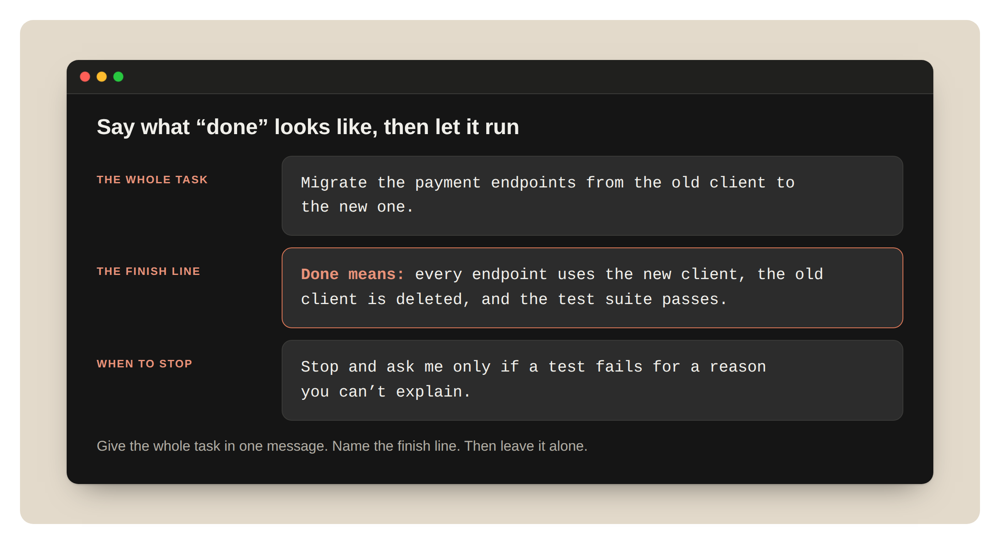
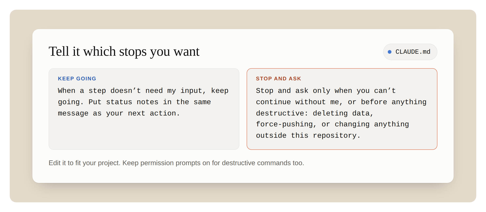
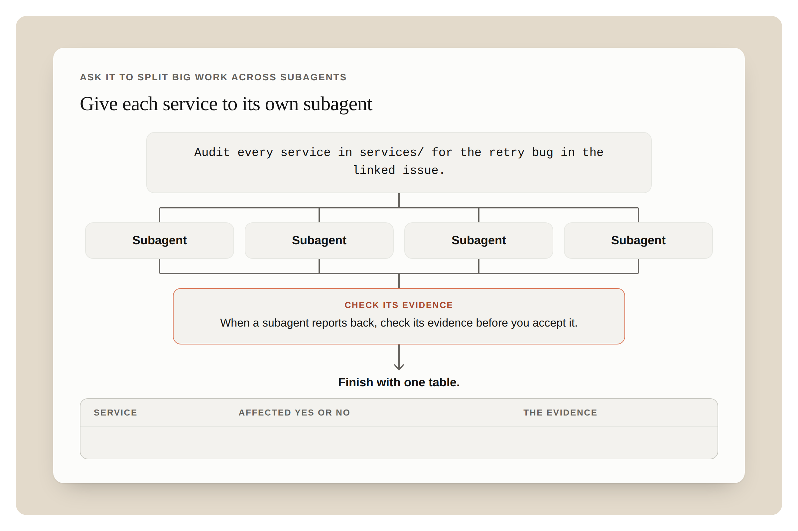
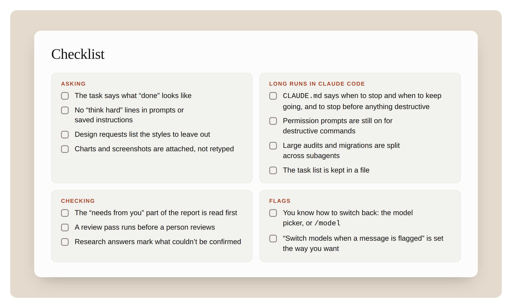

# 充分发挥 Claude 与 Claude Code 中 Opus 5.5 的实力（中英对照）

> **原文标题：** Getting the most out of Opus 5.5 in Claude and Claude Code
> **原文链接：** https://claude.dev/blog/getting-the-most-out-of-opus-5-5/
> **原文作者：** Addy Osmani（Member of Technical Staff）
> **发布日期：** 2026-09-22
> **翻译模型：** GLM-5.3-Flash
> **评分：** ★★★☆☆ —— Opus 5.5 官方使用指南：围绕模型特性给出提示写法、长任务驾驭与结果检查的实操建议
> **排版：** 每段英文原文在前，中文翻译紧随其后。默认收录正文主体。

---

How to prompt Opus 5.5, steer a long run, and check your results in Claude apps and Claude Code.

如何在 Claude 应用与 Claude Code 中为 Opus 5.5 编写提示（prompt）、驾驭长任务并检查结果。

Opus 5.5 works well with the way you already use Claude. A few things behave differently, though: it works for longer on its own, it tells you plainly what it did, and it thinks before every reply. This guide covers how to work with Opus 5.5 in Claude apps and Claude Code, including how to prompt the model, steer a long run, and check your results.

Opus 5.5 能很好地适配你现有的 Claude 使用方式。不过有几件事的表现有所不同：它能更长时间地独立工作，会直白地告诉你它做了什么，并且在每次回复前都会先思考。本指南介绍如何在 Claude 应用与 Claude Code 中与 Opus 5.5 协作，包括如何为模型编写提示、如何驾驭一次长任务运行，以及如何检查结果。

## 先试试这些（Try this first）

**Three things to try in your first session with Opus 5.5**

**初次使用 Opus 5.5 时值得尝试的三件事**

1. Hand over the whole task. Say what "done" looks like and when you want it to stop and ask. Then let it work.

   交出整个任务。说清"完成"是什么样子、什么情况下该停下来问你，然后让它放手去做。

2. Delete "think carefully" lines. Opus 5.5 already thinks before every reply.

   删掉"仔细思考"之类的句子。Opus 5.5 在每次回复前本来就会思考。

3. When a long run ends, read what it needs from you first.

   当一次长任务结束时，先读它需要你做什么。

## 1. 如何提问（How to ask）

### 说清"完成"长什么样，然后让它去做（Say what "done" looks like, then let it run）

**What to do.** Give the whole task in one message. Name the finish line, like "the tests pass" or "every endpoint is migrated." Then let it cook.

**要做什么。** 在一条消息里交出整个任务。指明终点线（finish line），比如"测试全部通过"或"每个端点都迁移完毕"。然后让它放手去干。

**Why it matters on Opus 5.5.** Opus 5.5 keeps going on long, multi-part work better than Opus 5 did. Compared to prior Opus models, its biggest gains are on multi-step work, like carrying a change through a large repository until the tests pass. Early testers had it run long coding tasks for hours with little oversight. With a clear finish line, it knows when it's done.

**为什么在 Opus 5.5 上重要。** 在漫长、多部分的工作上，Opus 5.5 比 Opus 5 更能坚持推进。与以往的 Opus 模型相比，它最大的提升在多步骤工作上，比如把一处改动贯穿整个大型代码库，直到测试通过。早期测试者让它几乎无人监督地连续运行数小时的编码任务。有了清晰的终点线，它知道什么时候算完成。

**How.** In Claude Code, for example:

**怎么做。** 以 Claude Code 为例：

```
Migrate the payment endpoints from the old client to the new one.

Done means: every endpoint uses the new client, the old client is deleted, and the test suite passes.

Stop and ask me only if a test fails for a reason you can't explain.
```

```
把支付端点从旧客户端迁移到新客户端。

完成的标准是：每个端点都使用新客户端、旧客户端被删除、测试套件全部通过。

只有当某个测试因你无法解释的原因失败时，才停下来问我。
```



**Figure 1:** One message: the whole task, the finish line, and when to stop.
**图 1：** 一条消息：整体任务、终点线，以及何时停下。

### 别再让它"使劲思考"（Stop telling it to "think hard"）

**What to do.** Remove "think carefully," "think step by step," and similar lines from your prompts and your saved instructions.

**要做什么。** 从你的提示词和保存的指令里删掉"仔细思考（think carefully）""一步一步思考（think step by step）"以及类似的句子。

**Why it matters on Opus 5.5.** Opus 5.5 always thinks before it replies, and it decides how much. You don't need to ask it to think. In our testing in a chat product, removing a "think carefully" line made replies start sooner, with no clear drop in quality.

**为什么在 Opus 5.5 上重要。** Opus 5.5 在回复前总会思考，思考多少由它自己决定。你不需要特意要求它思考。我们在一款聊天产品中的测试显示，删掉"仔细思考"这句后，回复来得更快，质量没有明显下降。

**How.** Delete the line. For a quick answer to a simple question, say so: "Answer directly." To change how much it thinks in Claude Code, change effort.

**怎么做。** 删掉那句话。如果只是简单问题想要快速回答，直接说明："直接回答（Answer directly）。"在 Claude Code 中想调整它的思考量，就去调整 effort（努力档位）。

### 在运行中的任务上追加要求（Add to a running task）

**What to do.** If you remember something mid-run, you can type a follow-up while it works.

**要做什么。** 如果任务运行到一半你想起什么，可以在它工作时直接输入补充消息。

**Why it matters on Opus 5.5.** Runs are longer now, so a restart costs more.

**为什么在 Opus 5.5 上重要。** 现在单次运行更长，重启的代价也更高。

**How to do it.** In Claude Code, type the message and press Enter while Claude works, for example, "Also keep the old endpoint names as aliases."

**如何操作。** 在 Claude Code 中，趁 Claude 工作时输入消息并按回车，比如"另外，把旧端点名保留为别名（alias）"。

### 设计类任务：点名你不想要的风格（For design work, name the styles you don't want）

**What to do.** When you ask for a page, an app, or an artifact, list the design habits you want left out.

**要做什么。** 当你要求做一个页面、应用或 artifact（Artifacts 产物）时，列出你想排除的设计习惯。

**Why it matters on Opus 5.5.** With no design direction, Opus 5.5 falls back on a few default styles. A general instruction like "avoid a generic look" mostly swaps one default for another. A list of specific patterns works much better.

**为什么在 Opus 5.5 上重要。** 没有设计方向时，Opus 5.5 会退回到几种默认风格。"避免千篇一律的样子"这类笼统指令，多半只是把一种默认换成另一种。列出具体的样式清单效果好得多。

**How.** Name the patterns:

**怎么做。** 点名那些样式：

```
Build a personal website with placeholder content.

Don't use a cream or off-white background, italic accent words in headings, numbered "01 / 02 / 03" section labels, monospace labels, or pill-shaped buttons.
```

```
用占位内容做一个个人网站。

不要使用奶油色或灰白色背景、标题中的斜体强调词、"01 / 02 / 03"式的编号小节标签、等宽字体标签，或胶囊形按钮。
```

Then look at what it chose instead. If you don't like that either, add it to the list and ask again.

然后看看它换成了什么。如果你也不喜欢，就把它加进清单再要一次。

## 2. 在 Claude Code 中驾驭长任务（Steering a long run in Claude Code）

### 告诉它你想要哪些停靠点（Tell it which stops you want）

**What to do.** Put a short rule in your CLAUDE.md file about when to stop and ask, and when to keep going.

**要做什么。** 在你的 CLAUDE.md 文件里写一条简短规则，说明什么时候该停下来问你、什么时候该继续推进。

**Why it matters on Opus 5.5.** Opus 5.5 keeps you posted as it works. On a long task, it sometimes stops to report instead of going on: a summary that names the next step without taking it, an offer to continue, or a list of choices that don't block the work. It follows instructions that name these stops. Name the stops you want, too.

**为什么在 Opus 5.5 上重要。** Opus 5.5 工作时会随时向你通报进展。在长任务中，它有时会停下来汇报而不是继续：一段点出下一步却不执行的总结、一句"要我继续吗"，或一份并不阻塞工作的选项清单。它会遵守点明这些停靠点（stop）的指令。所以，也请点名你想要的停靠点。

**How.** Add this to CLAUDE.md, and edit it to fit your project:

**怎么做。** 把下面的内容加进 CLAUDE.md，并按你的项目修改：

```
When a step doesn't need my input, keep going. Put status notes in the same message as your next action.

Stop and ask only when you can't continue without me, or before anything destructive: deleting data, force-pushing, or changing anything outside this repository.
```

```
某个步骤不需要我输入时，继续推进。把状态说明和你的下一个动作放在同一条消息里。

只有在没有我就无法继续，或在进行任何破坏性操作之前——删除数据、force-push，或改动本仓库之外的任何东西——才停下来问我。
```



**Figure 2:** The CLAUDE.md rule: when to keep going, and when to stop and ask.
**图 2：** CLAUDE.md 规则：何时继续推进，何时停下询问。

If a run stops with "Want me to continue?" reply "continue." If that happens often, the rule above will help.

如果一次运行以"要我继续吗（Want me to continue?）"停下，回复"continue（继续）"。如果这种事经常发生，上面那条规则会帮到你。

A rule to keep going means fewer stops, so keep your own check before anything risky or hard to undo. The last line of the rule above does that. Keep permission prompts on for destructive commands too.

一条"继续推进"的规则意味着停靠更少，所以对任何有风险或难以撤销的操作，要保留你自己的把关。上面那条规则的最后一行就是这个作用。对破坏性命令，也请保持权限确认提示（permission prompts）开启。

For pair programming, you may want the opposite: a one-line plan before it starts and a short recap at the end. Say that in your CLAUDE.md instead. Opus 5.5 follows either one.

如果是结对编程（pair programming），你可能想要相反的模式：开工前先给一行计划，结束时给一段简短回顾。那就把这条写进 CLAUDE.md。两种模式 Opus 5.5 都能遵守。

### 让它把大工作拆给多个 subagent（Ask it to split big work across subagents）

**What to do.** For an audit, a migration, or a review across a large codebase, ask Opus 5.5 to split the work across subagents and check each result.

**要做什么。** 面对审计、迁移或跨大型代码库的审查，让 Opus 5.5 把工作拆分给多个 subagent（子代理），并逐一核查每个结果。

**Why it matters on Opus 5.5.** Early testers had Opus 5.5 coordinate parallel subagents on long audits and migrations, with little oversight.

**为什么在 Opus 5.5 上重要。** 早期测试者让 Opus 5.5 在漫长的审计和迁移任务中协调并行的 subagent，几乎无需监督。

**How.**

**怎么做。**

```
Audit every service in services/ for the retry bug in the linked issue.

Give each service to its own subagent. When a subagent reports back, check its evidence before you accept it.

Finish with one table: service, affected yes or no, and the evidence.
```

```
对照关联 issue 里的 retry bug，审计 services/ 目录下的每一个服务。

把每个服务交给一个独立的 subagent。subagent 汇报后，先核查它的证据再采信。

最后用一张表格收尾：服务名、是否受影响（是/否）、以及证据。
```



**Figure 3:** Fan out to subagents, check each one's evidence, then finish with one table.
**图 3：** 分发给多个 subagent，逐一核查证据，最后汇总成一张表格。

### 把任务清单放进文件（Keep the task list in a file）

**What to do.** For a run that will take a while, ask Opus 5.5 to keep its task list in a file and update it as it goes. Then read the file, not the scrollback, to see where the run is.

**要做什么。** 对会跑上一阵子的任务，让 Opus 5.5 把任务清单写进一个文件并随时更新。之后想看进度，去读那个文件，而不是向上翻看历史消息（scrollback）。

**Why it matters on Opus 5.5.** Runs are longer now. A long run fills the context window, and Claude Code then summarizes older turns. A list in a file survives that, and it shows you at a glance what's done and what's left.

**为什么在 Opus 5.5 上重要。** 现在单次运行更长。长任务会填满上下文窗口（context window），随后 Claude Code 会把较早的对话轮次做摘要压缩。写在文件里的清单能躲过这一处理，还能让你一眼看清哪些已完成、哪些还没做。

**How.** "Keep a checklist in TASKS.md. Tick each item when it's done, and add anything new you find."

**怎么做。** "在 TASKS.md 里维护一份检查清单。每完成一项就打勾，发现新事项就补进去。"

## 3. 检查结果（Checking the result）

### 先读它需要你做什么（Read what it needs from you first）

**What to do.** When a long run ends, look first for anything Claude is waiting on you for, like a decision it left open or a change it wants you to approve. Then read the rest of Claude's summary.

**要做什么。** 长任务结束后，先找有没有 Claude 正在等你处理的事，比如它搁置未决的一个决定、或想请你批准的一处改动。然后再读 Claude 总结的其余部分。

**Why it matters on Opus 5.5.** Opus 5.5 reports on its work more clearly than Opus 5. Its updates and its final summary say what it did, what it found, and what it needs from you, in plain language.

**为什么在 Opus 5.5 上重要。** Opus 5.5 对工作的汇报比 Opus 5 更清晰。它的过程更新和最终总结会用平实的语言说明它做了什么、发现了什么、需要你做什么。

**How.** To change the summary's format, say so in CLAUDE.md, for example, "End every run with three headings: Blocked on me, Changed, Found."

**怎么做。** 想改总结的格式，就在 CLAUDE.md 里说明，比如"每次运行结束时用三个标题收尾：Blocked on me（等我处理）、Changed（已改动）、Found（发现的问题）。"

### 让它先审查代码（Ask it to review the code）

**What to do.** Ask Opus 5.5 to review a diff or a pull request before a person does.

**要做什么。** 在人动手之前，先让 Opus 5.5 审查一个 diff 或 pull request（拉取请求）。

**Why it matters on Opus 5.5.** One early tester said Opus 5.5 at its lowest effort caught more bugs than Opus 5 at high effort, with fewer false alarms. It also explains its changes in plain language, so its pull request descriptions are easier to review.

**为什么在 Opus 5.5 上重要。** 一位早期测试者说，Opus 5.5 在最低 effort 档位下抓到的 bug 比 Opus 5 在高档位下还多，而且误报更少。它还会用平实的语言解释自己的改动，所以它写的 pull request 描述更容易审阅。

**How.** Feed this prompt to Claude:

**怎么做。** 把这段提示词喂给 Claude：

```
Review the diff on this branch against main.

List only problems you'd block the merge for. For each one, give the file and line, why it's wrong, and how to show it fails.
```

```
对照 main 分支，审查本分支上的 diff。

只列出足以让你阻止合并的问题。对每个问题，给出文件与行号、错在哪里、以及如何演示它会失败。
```

### 让它标出无法确认的内容（Ask it to mark what it couldn't confirm）

**What to do.** For research and analysis, ask it to say what it couldn't find or couldn't check.

**要做什么。** 在调研与分析类任务中，让它说明哪些内容它没找到、或无法核实。

**Why it matters on Opus 5.5.** "I couldn't find this" is worth reading, and asking for it makes it easy to find.

**为什么在 Opus 5.5 上重要。** "这个我没找到"本身就很值得读，而主动要求它写出来，也让你更容易找到这类信息。

**How.** Add "Mark anything you couldn't confirm, and say where you looked" to the request. This works in a Claude research report and in Claude Code.

**怎么做。** 在请求里加上"把你无法确认的内容都标出来，并说明你在哪里找过（Mark anything you couldn't confirm, and say where you looked）"。这条在 Claude 研究报告和 Claude Code 里都适用。

## 4. 在 Claude 应用中（In Claude apps）

First, check that the model picker says Opus 5.5.

首先，确认模型选择器（model picker）里选的是 Opus 5.5。

### 直接分享图表或截图本身（Share the chart or screenshot itself）

**What to do.** Attach the chart, diagram, screenshot, or slide. Don't retype the numbers.

**要做什么。** 直接附上图表、示意图、截图或幻灯片。不要手动重新录入里面的数字。

**Why it matters on Opus 5.5.** Opus 5.5 reads charts, diagrams, and screenshots more accurately than Opus 5, and it needs no extra steps to do it. It's also better at meaning that depends on where things are in the image: which boxes an arrow connects, what changed between two versions of a diagram, or when a meeting starts and ends in a calendar screenshot.

**为什么在 Opus 5.5 上重要。** Opus 5.5 读取图表、示意图和截图比 Opus 5 更准确，而且无需额外步骤。它也更擅长理解取决于图中位置关系的含义：一条箭头连接了哪些框、一版示意图和另一版之间改了什么、或日历截图里一场会议的起止时间。

**How.** Attach the image and ask a specific question: "Which of these services call the billing API directly?"

**怎么做。** 附上图片并提一个具体的问题："这些服务里哪些直接调用了 billing API？"

### 让它检查长文档（Ask it to check a long document）

**What to do.** Give it a long plan, report, or deck, and ask it to find mistakes.

**要做什么。** 把一份长的计划、报告或幻灯片（deck）交给它，让它找错误。

**Why it matters on Opus 5.5.** Opus 5.5 pays more attention to detail than prior Opus models. In our testing, it caught a date that fell on the wrong weekday in a long planning thread, and a chart that didn't match the numbers in a deck.

**为什么在 Opus 5.5 上重要。** Opus 5.5 比以往的 Opus 模型更注意细节。在我们的测试中，它抓出了一条长规划串里落在错误星期几上的日期，以及一份 deck 里与数字对不上的图表。

**How.** Submit the prompt: "Check this deck for anything that contradicts itself: numbers, dates and names. Quote each problem and say where it is."

**怎么做。** 提交这样的提示词："检查这份 deck 里有没有自相矛盾的地方：数字、日期和名称。逐条引用问题并说明它在哪里。"

### 索要成品文件（Ask for the finished file）

**What to do.** When you want a spreadsheet or a document, ask for the file, not an outline.

**要做什么。** 当你想要一份电子表格或文档时，直接要文件本身，而不是大纲。

**Why it matters on Opus 5.5.** The spreadsheets and documents Opus 5.5 makes need less editing than Opus 5's before you share them.

**为什么在 Opus 5.5 上重要。** Opus 5.5 做出的电子表格和文档，在你分享之前需要再修改的地方比 Opus 5 的更少。

**How.** "Make this a spreadsheet I can share: one row per vendor, with columns for cost, contract end date and owner."

**怎么做。** "把它做成一份我能直接分享的电子表格：每个供应商一行，包含 cost（成本）、contract end date（合同到期日）和 owner（负责人）几列。"

### 在项目（Project）中，声明哪些答案已成定论（In a project, say when answers are settled）

**What to do.** If follow-up questions in a long chat feel slow, add an instruction that earlier answers are settled.

**要做什么。** 如果长对话中的追问感觉变慢了，就加一条指令，声明早先的回答已成定论。

**Why it matters on Opus 5.5.** In a long chat, Opus 5.5 sometimes goes back over an earlier answer while it thinks about a short follow-up. That slows the reply.

**为什么在 Opus 5.5 上重要。** 在长对话里，Opus 5.5 有时会在思考一个简短追问时，回头重新审视早先的回答。这会拖慢回复。

**How.** Add this to the project's instructions:

**怎么做。** 把下面的内容加进项目（Project）的指令里：

```
Once you have answered something, treat that answer as done. Focus on what I'm asking now, and don't go back over an earlier answer unless I ask about it or point out a problem with it.
```

```
一旦你回答过某个问题，就把那个答案当作定论。专注于我现在问的问题，不要回头重新审视早先的回答，除非我问起它或指出它有问题。
```

Leave it out of projects for long analysis, where a later step can show a mistake in an earlier one.

长分析类项目不要加这条——在那类工作里，后面的步骤可能会暴露前面步骤的错误。

## 5. 当消息被拦截时（When a message is flagged）

Opus 5.5 is the first Opus model to launch with Fable-level bio and cyber safeguards. In Claude apps and Claude Code, most flagged messages move to an older model, and your work goes on there. Finding security vulnerabilities in source code is allowed, and everyday health and educational questions should still work. These safeguards can sometimes flag legitimate work, and we're tuning them to cut down on incorrect flags. If you're switched, here's what you'll see and what to do.

Opus 5.5 是首个在发布时就带有 Fable 级别生物安全（bio）与网络安全（cyber）防护的 Opus 模型。在 Claude 应用与 Claude Code 中，大多数被拦截（flagged）的消息会切换到一个更旧的模型上，你的工作也会在那里继续。在源代码中查找安全漏洞是允许的，日常健康和教育类问题也应当照常可用。这些防护有时会误伤正当工作，我们正在调优，以减少错误拦截。如果你被切换了，下面是你将看到的内容和应对办法。

### 在 Claude 应用中（In Claude apps）

**What you see.** A notice that starts with "Switched to" and the name of an older model. Claude answers on that model, and the chat stays on it.

**你会看到什么。** 一条以"Switched to（已切换到）"开头、后接某个更旧模型名字的通知。Claude 会改用那个模型回答，而且对话会留在那个模型上。

**What to do.**

**要做什么。**

- To go back to Opus 5.5, choose it in the model picker. If the earlier message is still in the chat, it may be flagged again. Starting a new chat avoids that.

  要回到 Opus 5.5，在模型选择器里选中它即可。如果早先那条消息还在对话里，可能再次被拦截。开一个新对话可以避免这种情况。

- To be asked first, go to Settings, then Capabilities, and turn off "Switch models when a message is flagged." You'll see a "paused" card with your options.

  想让系统先询问你再切换，去 Settings（设置）里的 Capabilities（能力）页，关掉"Switch models when a message is flagged（消息被拦截时切换模型）"。你会看到一张"paused（已暂停）"卡片，上面列有你的选项。

The check covers everything in the conversation, including files and search results. So a flag can come from earlier content, not only your last message.

这项检查覆盖对话里的所有内容，包括文件和搜索结果。所以拦截可能来自更早的内容，而不仅仅是你最后那条消息。

### 在 Claude Code 中（In Claude Code）

**What you see.** A notice that names the older model. The session continues on that model.

**你会看到什么。** 一条点明更旧模型名字的通知。会话会在那个模型上继续。

**What to do.**

**要做什么。**

- Run /model to switch back.

  运行 /model 切换回去。

- Press Esc twice to edit your last message and try again.

  连按两次 Esc，编辑你最后那条消息后重试。

- To be asked first, run /config and change "Switch models when a message is flagged."

  想让系统先询问你再切换，运行 /config 并修改"Switch models when a message is flagged（消息被拦截时切换模型）"。

- Run /feedback if the flag was wrong.

  如果这次拦截是误判，运行 /feedback 反馈。

### 别要求它在回复里展示推理过程（Don't ask it to show its reasoning in the reply）

**What to do.** Remove requests to reproduce its internal reasoning in the reply from your prompts and instructions.

**要做什么。** 从你的提示词和指令里删掉"在回复中复现其内部推理"之类的要求。

**Why it matters on Opus 5.5.** A request to reproduce its internal reasoning in the reply can be declined. It's one of the flag categories.

**为什么在 Opus 5.5 上重要。** 要求在回复中复现其内部推理可能被拒绝——这是拦截类别之一。

**How.** Ask Claude for what you need instead, for example, "Explain why you chose this approach in three sentences."

**怎么做。** 改为直接向 Claude 要你需要的东西，比如"用三句话解释你为什么选这个方案"。

## 6. 速度（Speed）

### 当你在等每条回复时，开启 fast mode（Turn on fast mode when you're waiting on each reply）

**What to do.** In Claude Code, use fast mode for back-and-forth work, where you read each reply before you send the next message.

**要做什么。** 在 Claude Code 中，把 fast mode（快速模式）用于一问一答式的工作——也就是你每读完一条回复才发下一条消息的场景。

**Why it matters on Opus 5.5.** Fast mode is available for Opus 5.5 at launch as a research preview. You get the same model, and the text arrives sooner. It needs extra usage turned on, and it costs more per token than standard mode.

**为什么在 Opus 5.5 上重要。** Opus 5.5 发布时即提供 fast mode，目前是研究预览版（research preview）。模型是同一个，只是文字更快到达。它需要先开启额外用量（extra usage），且每 token 成本高于标准模式。

**How.** Type /fast into Claude.

**怎么做。** 在 Claude 里输入 /fast。

## 你的 Opus 5.5 检查清单（Your Opus 5.5 checklist）

Run through this before your next long task.

在下一个长任务开始前，把这份清单过一遍。



**Figure 4:** The checklist at a glance.
**图 4：** 检查清单一览。

**Asking**

**提问（Asking）**

- The task says what "done" looks like

  任务说清了"完成"是什么样子

- No "think hard" lines in prompts or saved instructions

  提示词和保存的指令里没有"使劲思考"类字句

- Design requests list the styles to leave out

  设计类请求列出了要排除的风格

- Charts and screenshots are attached, not retyped

  图表和截图是附上的，而不是重新录入

**Long runs in Claude Code**

**Claude Code 中的长任务（Long runs in Claude Code）**

- CLAUDE.md says when to stop and when to keep going, and to stop before anything destructive

  CLAUDE.md 写明了何时停下、何时继续，以及进行任何破坏性操作前要先停下

- Permission prompts are still on for destructive commands

  破坏性命令的权限确认提示仍然开启

- Large audits and migrations are split across subagents

  大型审计和迁移已拆分给多个 subagent

- The task list is kept in a file

  任务清单保存在文件里

**Checking**

**检查（Checking）**

- The "needs from you" part of the report is read first

  报告里"需要你处理"的部分被最先阅读

- A review pass runs before a person reviews

  在人工审查之前先跑过一遍模型审查

- Research answers mark what couldn't be confirmed

  调研类回答标出了无法确认的内容

**Flags**

**拦截（Flags）**

- You know how to switch back: the model picker, or /model

  你知道怎么切回来：模型选择器，或 /model

- "Switch models when a message is flagged" is set the way you want

  "消息被拦截时切换模型"已按你的偏好设置

*With thanks to Molly Vorwerck for reviewing.*

*感谢 Molly Vorwerck 审阅本文。*
