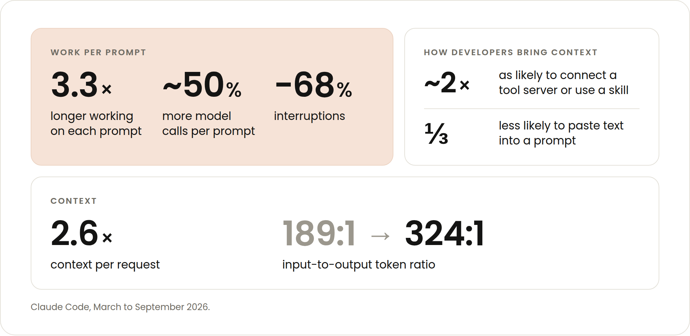
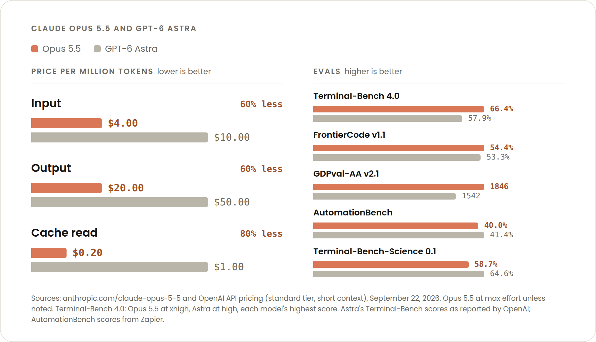

# 编码会话更长、上下文更重：Claude Opus 5.5 正是为此而生（中英对照）

> **原文标题：** Coding sessions are longer and use more context. Claude Opus 5.5 is built with that in mind.
> **原文作者：** Michael Segner
> **原文链接：** https://claude.com/blog/claude-opus-5-5-built-for-coding-sessions-that-use-more-context
> **发布日期：** 2026-09-24
> **翻译模型：** GLM-5.3-Flash
> **评分：** ★★★☆☆ —— Opus 5.5 发布的成本侧解读：用官方聚合数据刻画更长、更重上下文的 coding 会话趋势，并给出缓存与轮次两条省钱主线；信息实用，但整体偏产品公告性质。
> 排版：每段英文原文在前，中文翻译紧随其后。术语保留英文原文并附中文释义。默认收录正文主体。

---

We estimate Claude Opus 5.5 [costs about 40% less](https://www.anthropic.com/claude-opus-5-5) to run than Opus 5 for typical workloads billed by token. For developers, exactly how those savings stack up matters.

我们估计，对于按 token 计费的典型工作负载，Claude Opus 5.5 的运行成本比 Opus 5 [低约 40%](https://www.anthropic.com/claude-opus-5-5)。对开发者而言，这些节省究竟如何叠加起来，是很要紧的事。

If you pay by the token, you will see the greatest cost difference for longer-running, higher context sessions–the exact type of Claude Code sessions that have become more prevalent in the last six months.

如果你按 token 付费，那么成本差异最大的，会是那些运行时间更长、上下文更重的会话——而这正是过去六个月里变得越来越普遍的那类 Claude Code 会话。

This post will dive into the mechanics of what makes Opus 5.5 cost effective for how developers are coding today (and likely tomorrow).

本文将深入拆解其内在机制，说明 Opus 5.5 为什么能贴合开发者如今（以及很可能未来）的编码方式，做到省成本。

# Claude Code 使用趋势（Claude Code trends）

We've pulled aggregate data on how developers have been using Claude Code from March to September 2026. As model capabilities improve, developers have been deploying agents in increasingly sophisticated ways. The number of prompts per session has been steady, but we found some interesting behaviors:

我们汇总了 2026 年 3 月至 9 月间开发者使用 Claude Code 的整体数据。随着模型能力提升，开发者正以日益复杂精细的方式部署 agent（智能体）。每个会话的 prompt 数量保持稳定，但我们发现了一些有意思的行为：

- Claude works 3.3x longer on each prompt with more than 40% more model calls per prompt. There are 68% fewer interruptions.
- Claude 在每个 prompt 上的工作时间延长至 3.3 倍，每个 prompt 的模型调用次数增加超过 40%，中断（interruptions）次数减少 68%。

- Developers are about twice as likely to have a tool server connected or use a skill and a third less likely to paste text into a prompt.
- 开发者连接 tool server（工具服务器）或使用 skill（技能）的可能性约为原来的两倍，而把文本粘贴进 prompt 的可能性减少了三分之一。

- Context per request has grown 2.6x. The input to output token ratio moved from 189:1 to 324:1.
- 每次请求的上下文规模增长了 2.6 倍。输入与输出 token 之比从 189:1 升至 324:1。

**Figure 1:** Claude Code usage trends, March–September 2026: 3.3x longer work per prompt, ~50% more model calls, 68% fewer interruptions; ~2x tool server/skill adoption; 2.6x context per request with the input-to-output token ratio moving from 189:1 to 324:1.
**图 1：** Claude Code 使用趋势（2026 年 3 月至 9 月）：每个 prompt 的工作时长增至 3.3 倍、模型调用约多 50%、中断减少 68%；tool server/skill 的使用率约翻倍；每次请求上下文增长 2.6 倍，输入输出 token 比从 189:1 变为 324:1。

All of this points to developers aiming a harder working, better informed Claude toward bigger, more open-ended tasks. For these types of sessions, the economic impact of context engineering is compounded.

这一切都表明：开发者正把一个干活更卖力、掌握信息更充分的 Claude 指向更大、更开放式的任务。对于这类会话，context engineering（上下文工程）的经济影响会被成倍放大。

Simply put, Claude reads more tokens. You need to make sure [all the context you are providing is necessary](https://claude.com/blog/the-new-rules-of-context-engineering-for-claude-5-generation-models), and that [as much of that context as possible is reading from cache](https://claude.com/blog/maximizing-the-value-of-your-claude-code-sessions).

简而言之，Claude 读取的 token 更多。你需要确保[所提供的每一段上下文都是必要的](https://claude.com/blog/the-new-rules-of-context-engineering-for-claude-5-generation-models)，并且让其中[尽可能多的部分读取自 cache（缓存）](https://claude.com/blog/maximizing-the-value-of-your-claude-code-sessions)。

# 是什么让 Opus 5.5 在长而重的上下文会话中更具成本效益（What makes Opus 5.5 cost effective for long, context heavy sessions）

There are three changes that make long-running, context-heavy sessions more cost effective: changes to pricing, model behavior, and the Claude Code harness. Let's look at each.

有三项改动让长时间运行、上下文繁重的会话更具成本效益：定价的调整、模型行为的调整，以及 Claude Code harness（代理运行框架）的调整。下面逐一来看。

## 缓存很便宜（Cache is cheap）

For usage billed by the token, we reduced the cost of input and output tokens 20%, and *we dropped the price of reading a cached token 60%*. The latter reduction is significant because cache reads make up the majority of agentic and coding work costs.

对于按 token 计费的用量，我们把输入和输出 token 的成本降低了 20%，而且*我们把读取缓存 token 的价格下调了 60%*。后一项降幅意义重大，因为 cache read（缓存读取）占了 agentic 与编码工作成本的大头。

And as we just discussed, context per request has increased roughly 2.6x in six months, which means savings are trending in the right direction. The same price change for those billed by token saves more on today's Claude Code traffic than it would have six months ago, because more of the bill is now re-read context.

正如我们刚才讨论的，每次请求的上下文在六个月内增长了约 2.6 倍，这意味着省钱的方向是对的。同样幅度的降价，对按 token 计费的用户来说，在今天 Claude Code 的流量上所能省下的钱比六个月前更多——因为如今账单中有更大一部分是重复读取的上下文。

As of the publication date, a cached token on Opus 5.5 costs a fifth of what it does compared to competing models while outperforming them.

截至本文发布之日，Opus 5.5 上缓存 token 的价格仅为竞品模型的五分之一，同时性能还更胜一筹。

**Figure 2:** Claude Opus 5.5 vs. GPT-6 Astra — price per million tokens (input $4.00 vs $10.00, output $20.00 vs $50.00, cache read $0.20 vs $1.00) alongside benchmark evals including Terminal-Bench 4.0, FrontierCode v1.1, GDPval-AA v2.1, AutomationBench, and Terminal-Bench-Science 0.1.
**图 2：** Claude Opus 5.5 与 GPT-6 Astra 对比——每百万 token 价格（输入 $4.00 对 $10.00、输出 $20.00 对 $50.00、缓存读取 $0.20 对 $1.00），以及 Terminal-Bench 4.0、FrontierCode v1.1、GDPval-AA v2.1、AutomationBench、Terminal-Bench-Science 0.1 等基准评测成绩。

## Claude Code 更善于利用缓存（Claude Code is better at using the cache）

This is less specific to Opus 5.5, and more the result of many of the Claude Code features we've added in the last six months. Given the coding session trends we just discussed, you would expect a higher rate of cache misses, but the opposite is true. Input that misses the cache decreased by more than 50%.

与其说这是 Opus 5.5 特有的改进，不如说它更多是我们过去六个月为 Claude Code 添加的诸多功能共同带来的结果。考虑到刚才讨论的编码会话趋势，cache miss（缓存未命中）的比例本该更高，但事实恰恰相反：未命中缓存的输入减少了 50% 以上。

For example, we made it harder to unintentionally break your cache with smaller papercuts like refreshing a login. We also made it harder to break with larger actions, like adding instructions mid-conversation or loading tools on demand. For newer models like Opus 5.5 and Fable 5.1, you can now change effort levels during your sessions without resetting your cache.

举例来说，我们让那些小的 papercut（细微擦伤式的小毛病，比如刷新登录）更难在无意中破坏你的缓存；也让那些更大的操作——比如在对话中途添加 instructions（指令）或按需加载工具——更难破坏缓存。对于 Opus 5.5 和 Fable 5.1 这类较新的模型，你现在可以在会话进行中调整 effort level（努力档位），而不会重置缓存。

We also made the cache more useful for longer-running and delegated sessions. Developers on API keys and cloud providers can now set a one-hour cache lifetime (which subscribers already had) and forked subagents start from the parent's cache instead of paying for the same context again.

我们还让缓存对更长运行时间和委托式（delegated）的会话更加有用。使用 API key 和云服务商的开发者现在可以设置[一小时缓存有效期](https://code.claude.com/docs/en/prompt-caching#choose-the-ttl-yourself)（订阅用户此前已有此功能），而且 fork 出来的 subagent（子代理）可以直接从父级的缓存起步，不必为同样的上下文再付一遍钱。

## 同样的任务，更少的轮次（The same task, but with fewer turns）

Opus 5.5 can need fewer turns than other models to accomplish the same task. Zeta Labs saw fewer turns and tool calls per task than Opus 5, but at nearly half the cost and twice as many of their hardest tasks completed.

完成同样的任务，Opus 5.5 所需的 turn（轮次）可能比其他模型更少。Zeta Labs 观察到，与 Opus 5 相比，每个任务的轮次和工具调用都更少，而成本接近一半，最难任务的完成数量还翻了一倍。

This won't hold for every task. In [The cost of a task on Opus 5.5](https://claude.com/blog/what-a-task-costs-on-opus-5-5), Addy wrote, "On a well-scoped task, both models finish in about the same number of turns, and the price cut is all you get. The gap should be biggest on open-ended tasks, where a model can spend many turns on the wrong idea. No single number holds for every codebase, so measure it."

这一点并非对每个任务都成立。Addy 在[《The cost of a task on Opus 5.5》](https://claude.com/blog/what-a-task-costs-on-opus-5-5)（Opus 5.5 上一项任务的成本）一文中写道："在一个范围界定良好的任务上，两个模型完成的轮次大致相同，你能得到的好处就只有降价本身。差距最大的应该是开放式任务——模型可能在错误的思路上消耗掉许多轮次。没有一个数字能适用于所有代码库，所以要动手实测。"

In other words, simple, short, and mechanical tasks will take the same amount of turns while longer, harder tasks have more potential for Opus 5.5 to avoid burning tokens on the wrong approach. A reduced turn is even more cost efficient than a cached token.

换句话说，简单、短小、机械的任务所需轮次不变；而更长、更难的任务，则更有机会让 Opus 5.5 避免在错误思路上白白烧掉 token。省下一个 turn（轮次），甚至比命中一个缓存 token 更划算。

Also worth noting, especially as Claude works longer unattended or uninterrupted, is that Opus 5.5 generates output more than 30% faster than Opus 5. While this doesn't increase cache hit rate or use less tokens, it means waiting less on long runs.

另外值得一提（尤其当 Claude 需要在无人值守或不被打断的状态下工作更久时）：Opus 5.5 生成输出的速度比 Opus 5 快 30% 以上。这虽然既不会提高缓存命中率，也不会少用 token，但意味着长时间运行时等待更少。

# 守护你的缓存读取（Protect your cached reads）

As agentic coding has matured, organizations have shifted from asking developers to scale at all costs to asking developers to scale efficiently. Run /usage in Claude Code to see how much of your usage is cached reads. Then protect that number:

随着 agentic coding（智能体编程）走向成熟，组织对开发者的要求已从"不惜一切代价扩展规模"转变为"高效地扩展规模"。在 Claude Code 里运行 /usage，看看你的用量中有多少是缓存读取，然后守护好这个数字：

- Pick your model at the start of a session rather than switching midway,
- 在会话开始时就选定模型，而不是中途切换；

- Compact before you step away rather than after, and
- 在离开之前（而不是离开之后）先 compact（压缩会话上下文）；

- If you're on an API key or cloud provider, set the one-hour cache lifetime for long sessions.
- 如果你使用 API key 或云服务商，为长会话设置一小时缓存有效期。

Point Opus 5.5 at the open-ended, context-heavy work where those habits compound, and see [What a task costs on Opus 5.5](https://claude.com/blog/what-a-task-costs-on-opus-5-5) for the worked numbers.

把 Opus 5.5 指向那些能让上述习惯产生复利效应的开放式、重上下文工作，并参阅[《What a task costs on Opus 5.5》](https://claude.com/blog/what-a-task-costs-on-opus-5-5)（在 Opus 5.5 上一项任务要花多少钱）查看具体测算数字。
