# 用好 Claude Code:把 effort 花在刀刃上(中英对照)

> 原文标题:Using Claude Code: Spending your effort
> 原文链接:https://claude.dev/blog/spending-your-effort/
> 原文作者:Thariq Shihipar
> 发布日期:2026-09-25
> **翻译模型:** GLM-5.3-Flash
> **评分:** ★★★★☆ —— Anthropic 团队基于自测三次构建与 Terminal-Bench 3.0 深挖得出的 effort 档位使用策略,与官方档位选型指南同系列互补,重度用户可直接照做
> 排版:每段英文原文在前,中文翻译紧随其后。默认收录正文主体;原文的交互式图表以各 effort 档位截图呈现。

---

> *What effort really is and when to use which level in Claude Code, from my own tests of three builds and a deep dive into Terminal-Bench 3.0 on Opus 5.5 and Fable 5.1.*
>
> *effort 究竟是什么、在 Claude Code 中何时该用哪个档位——来自我亲自测试的三个构建任务,以及对 Opus 5.5 与 Fable 5.1 上 Terminal-Bench 3.0 的深入分析。*

One of the best parts of our newest Claude models is how they respond to effort without breaking the prompt cache in Claude Code, but I've received a lot of questions on this from users. What is effort really, and when do you use which effort level? Why do we need effort at all?

我们最新的 Claude 模型最令人称道的一点,是它们能响应 effort(努力档位)设置,同时又不会破坏 Claude Code 里的提示词缓存(prompt cache);不过我也收到了许多用户这方面的疑问。effort 到底是什么?什么时候该用哪个档位?我们为什么需要 effort?

To answer this, I decided to do a deep dive into the evals and do my own tests of effort across normal work.

为了回答这些问题,我决定深入研究各项评测(evals),并在日常工作中亲自测试 effort 的效果。

At a high level, I found that effort was a great way of modulating how much verification and edgecase testing Claude did and how much of its own judgement it used. Extra effort gave better results in domains where verification and edgecase testing was more useful like hardware, code review, and security.

总体上,我发现 effort 是一个很好的调节手段:它控制 Claude 做多少验证(verification)和边界情况(edge case)测试,以及它在多大程度上动用自己的判断。在验证与边界测试更有价值的领域——比如硬件、代码审查和安全——更高的 effort 带来了更好的结果。

For normal software engineering, I'm running a loop of getting the model to interview me then implementing on low effort, reviewing what it built, and then running verification on high effort.

对于日常软件工程,我在跑这样一个循环:先让模型"采访"我,然后用 low 档实现,审查它构建出的东西,最后用 high 档做验证。

## 什么是 effort?(WHAT IS EFFORT?)

At a high level, effort gives the model an approximation of how much compute you want it to spend on the task. It's somewhat related to your modeling of the difficulty of the task.

从高层看,effort 是在告诉模型:你希望它在这项任务上大约花多少算力(compute)。它与你对任务难度的判断多少有些关联。

Think of it this way, if someone asked you to do something in 12 hours straight, you might assume they just want you to do it and try very hard. If someone asked you to do the same task in 1 hour, you'd try to get them the best version that meets their task and then expect to iterate from there.

可以这样想:如果有人给你整整 12 个小时去做一件事,你大概会认为对方就是要你全力以赴把它做好;而如果同样的事只给你 1 小时,你会拿出在当时条件下最好的版本,并预期之后在此基础上迭代。

Or, you might push back and say the task requires at *least* 3 hours and then work for 3 hours to deliver it.

又或者,你可能会反驳说这件事*至少*需要 3 小时,然后干满 3 小时把它交付出来。

You should think of effort in the same way. Claude will always try and do your task reasonably, but higher effort will involve Claude taking more independent action for judgement and verification.

对 effort 也应该这样理解。Claude 总会尽力把你的任务完成得像样,但更高的 effort 意味着 Claude 会更主动地采取独立行动去做出判断、进行验证。

## effort 曲线(EFFORT CURVES)

Fable 5.1 and Opus 5.5's effort curves are our best yet: at each level, there is an uptick in benchmark scores and tokens consumed.

Fable 5.1 和 Opus 5.5 的 effort 曲线是我们迄今最好的:每升一档,基准测试(benchmark)得分和 token 消耗量都会同步上扬。

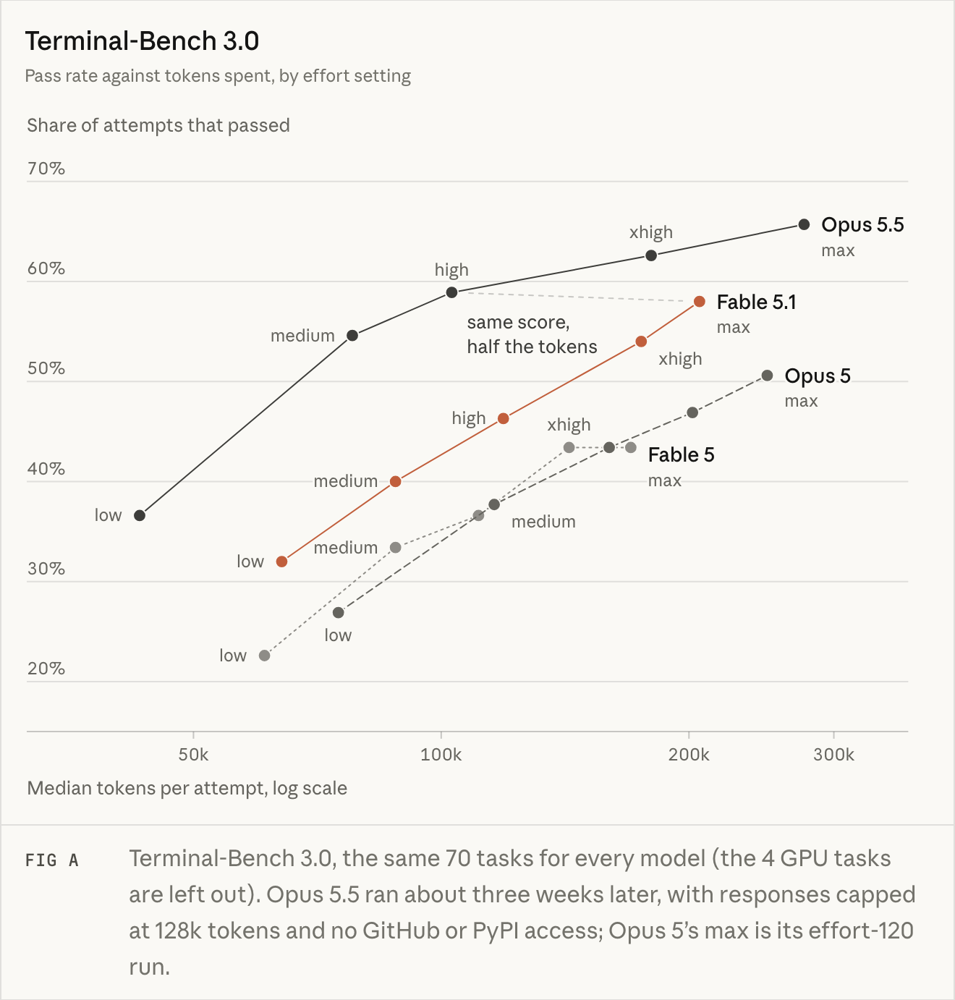

**Figure 1:** Terminal-Bench 3.0 — pass rate against tokens spent, by effort setting. The same 70 tasks for every model (the 4 GPU tasks are left out). Opus 5.5 ran about three weeks later, with responses capped at 128k tokens and no GitHub or PyPI access; Opus 5's max is its effort-120 run.

**图 1:** Terminal-Bench 3.0——各 effort 档位下,通过率对 token 消耗量的关系。所有模型使用同样的 70 个任务(不含 4 个 GPU 任务)。Opus 5.5 晚了约三周运行,响应上限 128k token,且无 GitHub 或 PyPI 访问;Opus 5 的 max 即其 effort-120 档运行。

But what does this mean in practice? To evaluate this, I tried several tasks at different effort levels and pored over the benchmarks.

但它在实践中意味着什么?为了评估这一点,我在不同 effort 档位下尝试了若干任务,并仔细研读了各项基准测试。

## 用不同档位做构建(BUILDING WITH EFFORT)

The best way to understand how models work is to run experiments. I tried doing the same tasks at several different effort levels on Opus 5.5 to understand the work it would do. I did this on a wide variety of work, but am illustrating this with a few toy examples.

理解模型行为的最好办法是做实验。我在 Opus 5.5 上用几个不同的 effort 档位执行同样的任务,以弄清它各会做哪些工作。我测试过各种各样的工作,这里用几个玩具示例来说明。

### 指示不足的构建任务(Underspecified build task)

If I ask Claude to "build a personal fitness and workout tracker app," effort changes dramatically how fleshed out the app is, but also results in Claude making more choices along the way. At low effort, the fitness app is just a log and a simple graph. At higher effort levels the app is more complex with additional detail. At max effort there's a heat chart.

如果我让 Claude"构建一个个人健身与训练记录应用",effort 会极大改变应用的完成度,同时也意味着 Claude 会在过程中替你做出更多决定。low 档下,这个健身应用只是一个记录表加一张简单的图表。档位越高,应用越复杂、细节越多。max 档下甚至还有一个热力图(heat chart)。

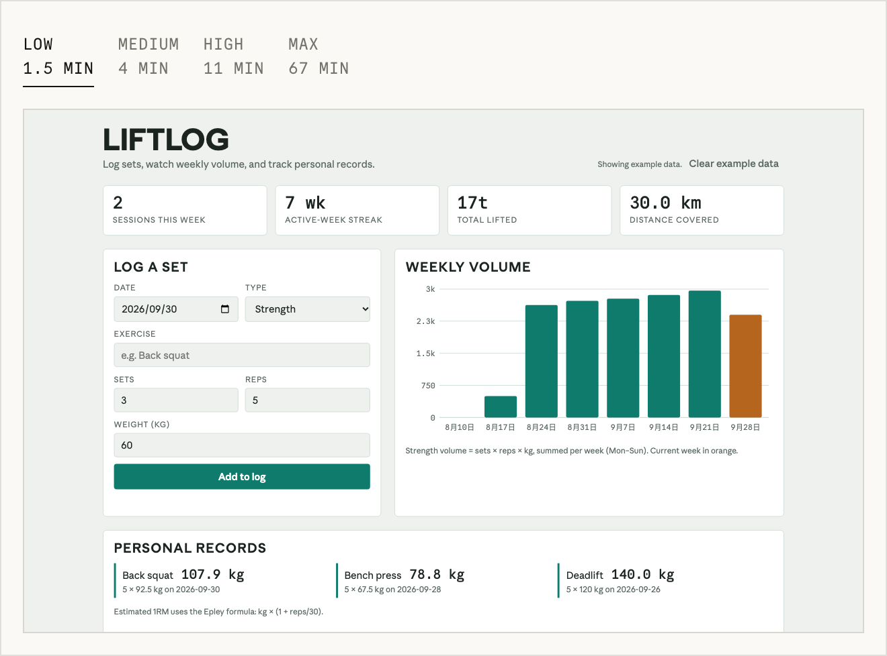

**Figure 2:** The fitness app built from a one-line prompt at low effort (1.5 min): a log plus a simple weekly-volume chart.

**图 2:** 用一句话提示词构建的健身应用,low 档(1.5 分钟):一个记录表加一张简单的周训练量图表。

**Figure 3:** The same one-line prompt at medium effort (4 min): more structure and detail.

**图 3:** 同一句话提示词,medium 档(4 分钟):结构和细节更多。

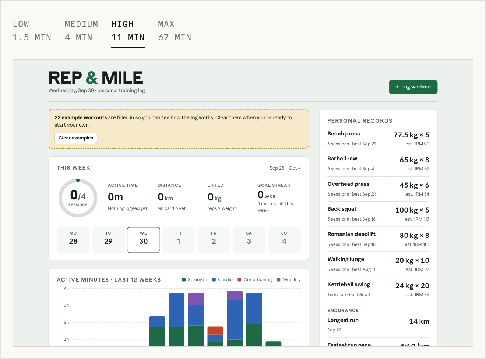

**Figure 4:** The same one-line prompt at high effort (11 min): a fuller app.

**图 4:** 同一句话提示词,high 档(11 分钟):应用更加完整。

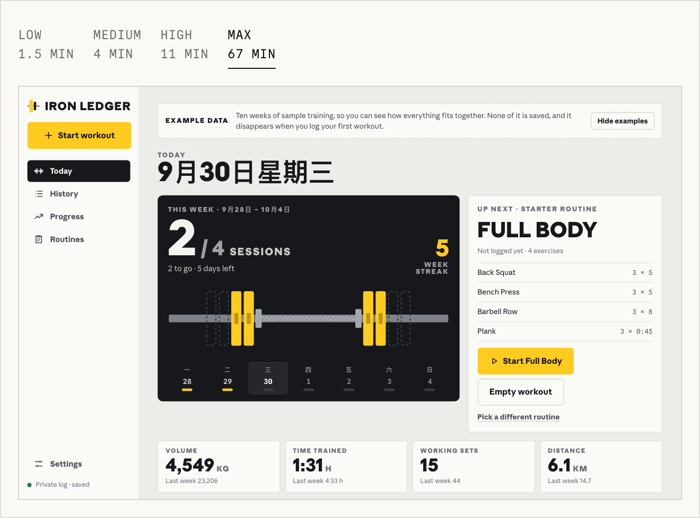

**Figure 5:** The same one-line prompt at max effort (67 min): a fully fleshed-out product — the article notes it even includes a heat chart.

**图 5:** 同一句话提示词,max 档(67 分钟):一件完整打磨的产品——原文指出其中还包含热力图。

If I wanted a simple base to iterate from, low effort would get it done. Max effort would be if I wanted Claude's best one shot.

如果我想要一个简单的底子方便后续迭代,low 档就能搞定。max 档则适用于我想让 Claude 一击即中、拿出它最好的单发成果。

### 轻度指定的设计任务(Lightly specified design task)

What if I have a task that is fairly specified already but I want some exploration with Claude? As an example I tried to ask it to redesign the `/config` menu in Claude Code. Every pass had roughly the same idea, to use submenus and better search.

如果任务本身已经相当明确,但我想和 Claude 一起做些探索呢?举个例子,我让 Claude 重新设计 Claude Code 的 `/config` 菜单。每一轮尝试的思路都大致相同:用子菜单和更好的搜索。

At low effort (which took 1 minute), I got an interactive sketch that conveyed the idea but didn't look very much like Claude Code.

low 档(耗时 1 分钟)给我的是一个交互式草图,能传达想法,但看起来不太像 Claude Code。

At max effort (which took 28 minutes), I got a mockup that looked very much like Claude Code, along with a bunch of walkthroughs for different flows.

max 档(耗时 28 分钟)给我的则是一个非常像 Claude Code 的原型(mockup),还附带了一组针对不同操作流程的走查(walkthrough)。

If my goal was to iterate and give feedback, low effort would get there much faster. But max effort gives me something much more polished right off the bat. For this particular task, I think I prefer using low effort to understand Claude's vision.

如果我的目标是迭代并给出反馈,low 档能快得多地达到目的。但 max 档一上来就给我打磨得精致得多的东西。就这个任务而言,我更愿意先用 low 档了解 Claude 的整体构想。

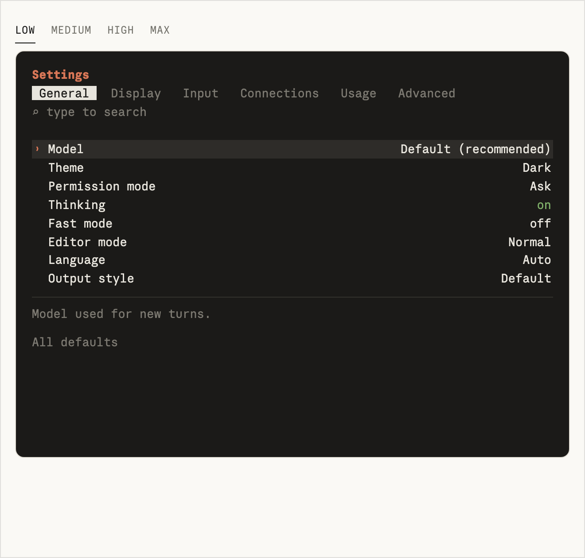

**Figure 6:** The Claude Code `/config` redesign at low effort: an interactive sketch conveying the idea.

**图 6:** low 档下的 Claude Code `/config` 重设计:传达想法的交互式草图。

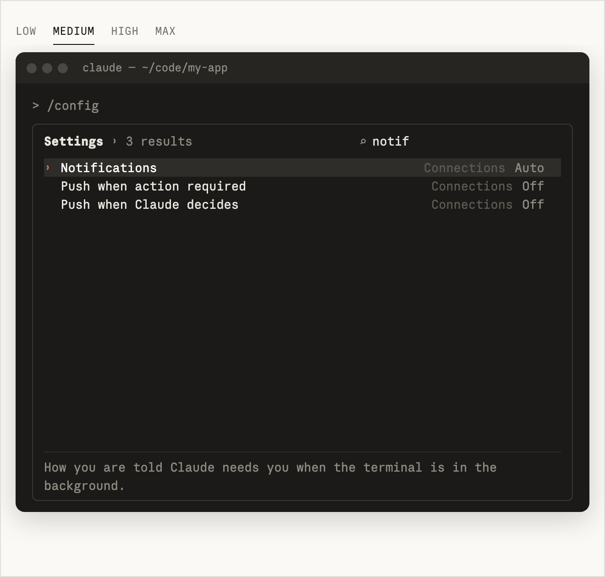

**Figure 7:** The `/config` redesign at medium effort.

**图 7:** medium 档下的 `/config` 重设计。

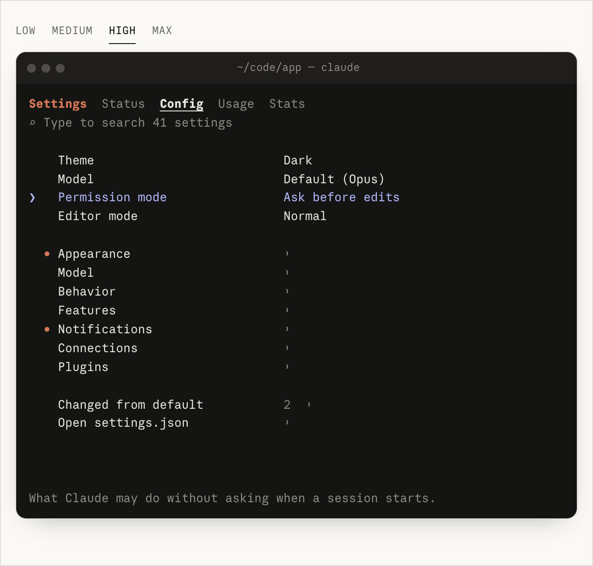

**Figure 8:** The `/config` redesign at high effort.

**图 8:** high 档下的 `/config` 重设计。

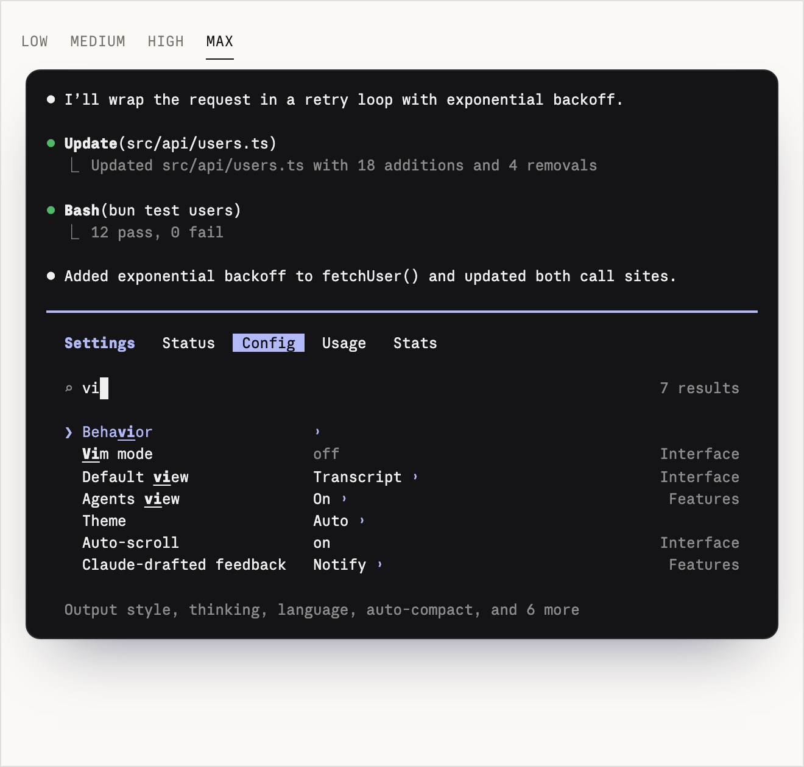

**Figure 9:** The `/config` redesign at max effort: a mockup that looks very much like Claude Code.

**图 9:** max 档下的 `/config` 重设计:外观非常接近 Claude Code 的原型。

### 高度指定的构建任务(Highly specified build task)

What if I gave Claude lots of details? I tried asking Claude to interview me in-depth about the fitness app and then gave that spec to be implemented by different models at different effort levels.

那如果我给 Claude 大量细节呢?我试着让 Claude 就这个健身应用对我做深度采访,然后把得到的规格说明(spec)交给不同模型、在不同 effort 档位下去实现。

I found that given this spec, the models behaved much more similarly. I got designs that looked fairly similar and had similar implementations but with different details, at max effort Claude took some time to simplify a few of the details.

我发现,有了这份 spec 之后,各次实现的行为要接近得多:得到的设计外观相当相似、实现也类似,只是细节不同;在 max 档下,Claude 还花了一些时间简化了若干细节。

**Figure 10:** The fitness app built from the interview spec at low effort (16 min).

**图 10:** 按采访得到的 spec 构建的健身应用,low 档(16 分钟)。

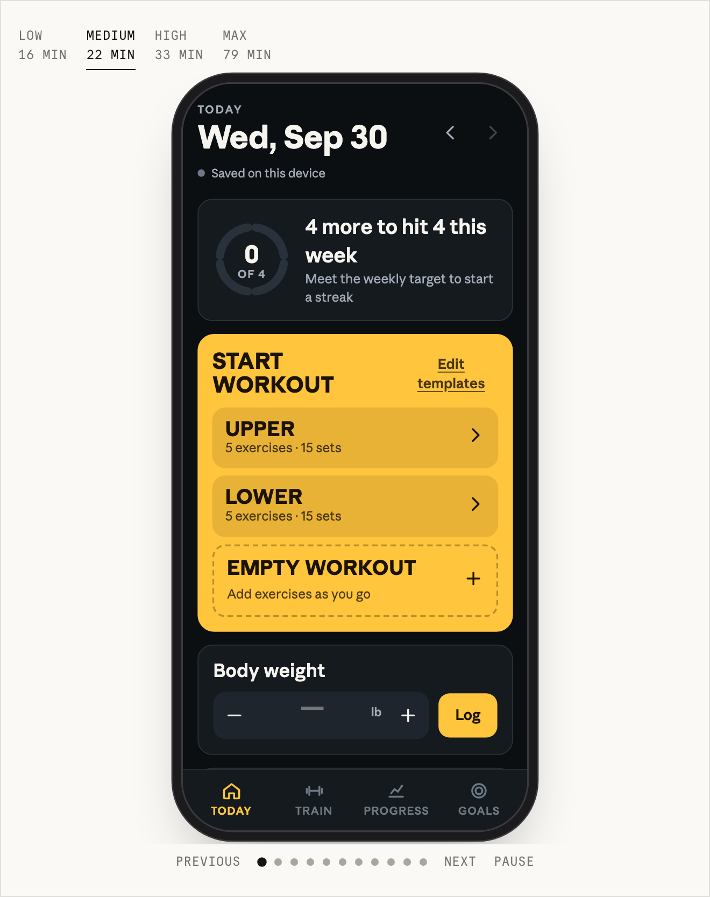

**Figure 11:** The same spec at medium effort (22 min).

**图 11:** 同一份 spec,medium 档(22 分钟)。

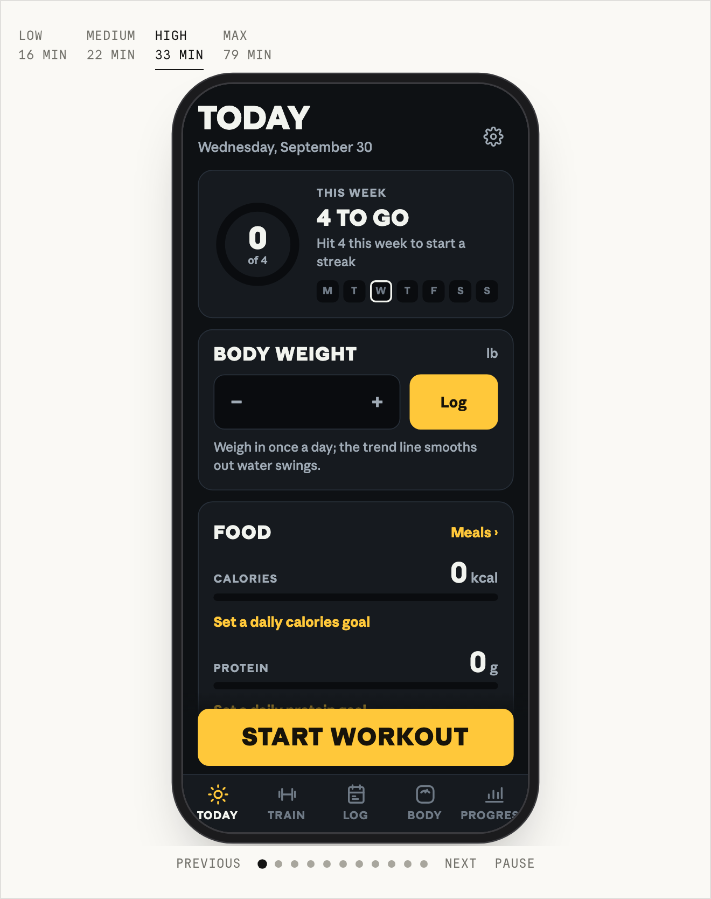

**Figure 12:** The same spec at high effort (33 min).

**图 12:** 同一份 spec,high 档(33 分钟)。

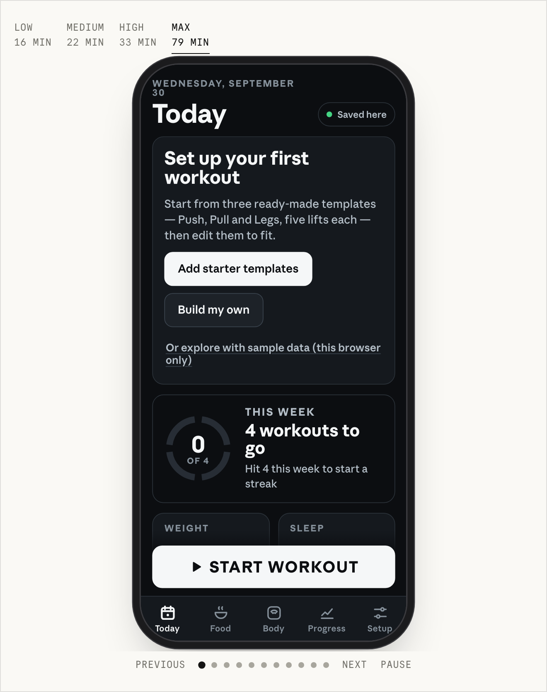

**Figure 13:** The same spec at max effort (79 min). Designs were fairly similar across levels; at max, Claude took some time to simplify a few details.

**图 13:** 同一份 spec,max 档(79 分钟)。各档位的设计相当相似;max 档下 Claude 还花时间简化了若干细节。

### 要点(Takeaways)

For regular software engineering, particularly new feature work, the effort level depends a lot on how in the loop I want to be. Low effort allows Claude to respond quickly with a starting point, higher effort levels will get more work done but Claude will also make more assumptions on my behalf.

对于日常软件工程,尤其是新功能开发,effort 档位很大程度上取决于我想多深地参与其中(in the loop)。low 档让 Claude 快速给出一个起点;更高的档位能完成更多工作,但 Claude 也会替我做更多假设。

A particularly fruitful loop for feature development I've been using is:

我一直在用的一个特别高效的功能开发循环是:

- Give Claude a spec and ask it to interview me about any details I'm missing
- Implement it on low effort
- Review to make sure it got the gist of it correct, iterate on low effort as needed
- Verify and test on high effort

- 给 Claude 一份 spec,让它就我遗漏的任何细节采访我
- 用 low 档实现
- 审查它是否抓住了要点,必要时继续在 low 档迭代
- 用 high 档做验证和测试

## 不同 effort 档位如何影响困难任务的产出(HOW EFFORT LEVELS IMPACT OUTPUT ON DIFFICULT TASKS)

But these are obviously toy examples, where Claude is well able to complete them. What about when the difference is between Claude completing the task or not completing the task?

但这些显然都是玩具示例,Claude 完全有能力完成。当差别变成"Claude 能不能完成任务"时,情况又如何?

To find these difficult problems, you have to go to the benchmarks so I dove into one I like: Terminal-Bench 3.0, a community-sourced benchmark.

要找到这类困难问题,就得去看基准测试,于是我深入研究了其中我很喜欢的一个:Terminal-Bench 3.0,一个由社区供稿的基准测试。

Terminal-Bench 3.0 problems can broadly be separated into categories like security, hardware, ML, science, software, operations and media. You can see all of the problems here: https://github.com/harbor-framework/terminal-bench/releases/tag/v3.0.0 . They're sourced from the community, so anyone can contribute.

Terminal-Bench 3.0 的题目大致可分为安全、硬件、机器学习(ML)、科学、软件、运维(operations)和媒体等类别。全部题目见这里:https://github.com/harbor-framework/terminal-bench/releases/tag/v3.0.0 。题目来自社区,任何人都可以投稿。

It's worth reading to get a sense of the type of problems these models face. I found I was surprised by the scope and ambition of a lot of these tasks. They are much more complicated than the average task I'd face.

值得读一读,感受一下这些模型面对的是哪类问题。很多任务的规模和雄心都让我吃惊——它们比我平时遇到的任务复杂得多。

For example, some of the tasks included:

举几个例子,其中包括:

- **Hardware** (`retro-console-soc`): build an 8-bit game console in Verilog that fits a small FPGA and renders a test ROM.
- **Science** (`takens-embedding-lean`): formally prove Takens' embedding theorem in Lean 4.
- **ML** (`mp-checkpoint-consolidation`): merge 16 shards of a mixture-of-experts checkpoint into one file that reproduces the reference logits.
- **Operations** (`intrastat-meldung`): run a company's month-end EU trade-statistics filing end to end.
- **Media** (`layout-config-recreation`): rebuild a poster image as an editable layout file.

- **硬件**(`retro-console-soc`):用 Verilog 构建一台能装进小型 FPGA 的 8 位游戏主机,并渲染一个测试 ROM。
- **科学**(`takens-embedding-lean`):在 Lean 4 中形式化证明 Takens 嵌入定理。
- **机器学习**(`mp-checkpoint-consolidation`):把混合专家(mixture-of-experts)检查点的 16 个分片合并成一个文件,且能复现参考 logits。
- **运维**(`intrastat-meldung`):端到端跑完一家公司月度的欧盟贸易统计申报。
- **媒体**(`layout-config-recreation`):把一张海报图片重建为可编辑的排版文件。

### 边界情况多时,高 effort 更有帮助(Higher effort levels help when there are many edge cases)

My main takeaway from reading the Terminal-Bench 3.0 results was that **higher effort is best for tasks with lots of hidden edge cases.**

阅读 Terminal-Bench 3.0 结果后,我最主要的收获是:**对隐藏边界情况很多的任务,高 effort 的收益最大。**

A clean example is `html-js-filter`, a Terminal-Bench 3.0 task that asks for an HTML sanitizer that strips every way of smuggling JavaScript into a page. Fable 5.1 went from 1/5 at low to 5/5 at xhigh.[^1]

一个干净的例子是 `html-js-filter`,这个 Terminal-Bench 3.0 任务要求写一个 HTML 消毒器(sanitizer),堵住把 JavaScript 偷偷塞进页面的所有途径。Fable 5.1 从 low 档的 1/5 提升到 xhigh 档的 5/5。[^1]

A typical attempt at low effort takes about 2 minutes. Each of these attempts wrote a filter in roughly one pass, then tested it against a single hand-written page.

low 档的一次典型尝试约 2 分钟。每次尝试基本都一遍写完过滤器,然后只拿一个手写页面测了测。

A high-effort run finishes in about 33 minutes. In the run I traced, it adversarially reviewed its first draft, then read the installed parser's source to check for bugs, ran many clean test cases until they gave the same output as the input, ran a standard XSS test suite, and finally, wrote a random-document fuzzer.

高 effort 的一次运行约 33 分钟完成。在我追踪的那次运行里,它先以对抗的视角审查了自己的初稿,然后阅读所装解析器(parser)的源码找漏洞,跑了许多"干净"测试用例直到输出与输入完全一致,又跑了一套标准 XSS 测试集,最后还写了一个随机文档模糊测试器(fuzzer)。

For something as edge-cased as a HTML sanitizer, this extra effort is well worth it. Spending more tokens for thoroughness also makes sense for complex tasks with high production requirements such as performance optimization or security review.

对 HTML 消毒器这种边界情况密集的东西,这些额外投入非常值得。对性能优化、安全审查这类生产要求很高的复杂任务,花更多 token 换取彻底性同样是划算的。

But you don't need this level of effort for every task.

但并非每个任务都需要这么高的档位。

The diagram below shows every Terminal-Bench 3.0 result and how it failed, across different models and effort levels. Overall, increasing effort tends to reduce failures due to missing edgecases (purple blocks), but does not fix when the model has the wrong approach (blue blocks).

下图展示了不同模型、不同 effort 档位下每一次 Terminal-Bench 3.0 尝试的结果及其失败方式。总体而言,提高 effort 能减少因漏掉边界情况导致的失败(紫色方块),但治不了方法本身就走错了的情形(蓝色方块)。

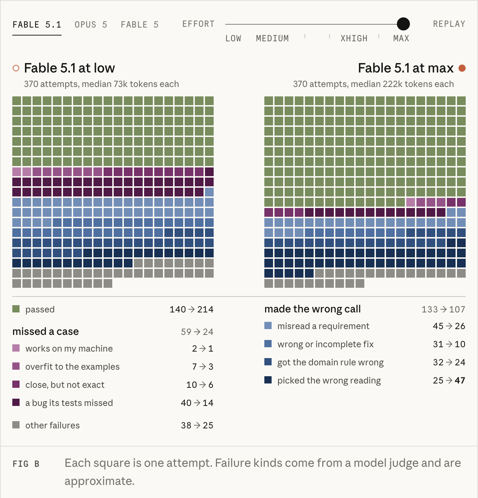

**Figure 14:** Terminal-Bench 3.0 attempts by outcome, Fable 5.1. Each square is one attempt. Failure kinds come from a model judge and are approximate.

**图 14:** Terminal-Bench 3.0 各次尝试的结果分布,Fable 5.1。每个方块代表一次尝试。失败类别由模型评审(model judge)给出,仅为近似。

Fable 5.1 at low: 140 passed, 2 works on my machine, 7 overfit to the examples, 10 close, but not exact, 40 a bug its tests missed, 45 misread a requirement, 31 wrong or incomplete fix, 32 got the domain rule wrong, 25 picked the wrong reading, 38 other failures, of 370 attempts. Fable 5.1 at max: 214 passed, 1 works on my machine, 3 overfit to the examples, 6 close, but not exact, 14 a bug its tests missed, 26 misread a requirement, 10 wrong or incomplete fix, 24 got the domain rule wrong, 47 picked the wrong reading, 25 other failures, of 370 attempts.

Fable 5.1 在 low 档:370 次尝试中,140 次通过,2 次"在我机器上能跑",7 次过拟合于示例,10 次接近但不完全对,40 次是测试没抓到的 bug,45 次误读了需求,31 次修复错误或不完整,32 次搞错了领域规则,25 次选错了理解方向,38 次其他失败。Fable 5.1 在 max 档:370 次尝试中,214 次通过,1 次"在我机器上能跑",3 次过拟合于示例,6 次接近但不完全对,14 次是测试没抓到的 bug,26 次误读了需求,10 次修复错误或不完整,24 次搞错了领域规则,47 次选错了理解方向,25 次其他失败。

#### effort 更能帮上忙的问题领域(Problem areas where effort helps)

One of the most interesting takeaways for me from evaluating these models on Terminal-Bench 3.0 was that there were some problem areas that benefited from effort more than others. You can see a breakdown in the following diagram:

在 Terminal-Bench 3.0 上评估这些模型时,对我而言最有趣的发现之一是:有些问题领域从 effort 中获益比其他领域更多。具体拆解见下图:

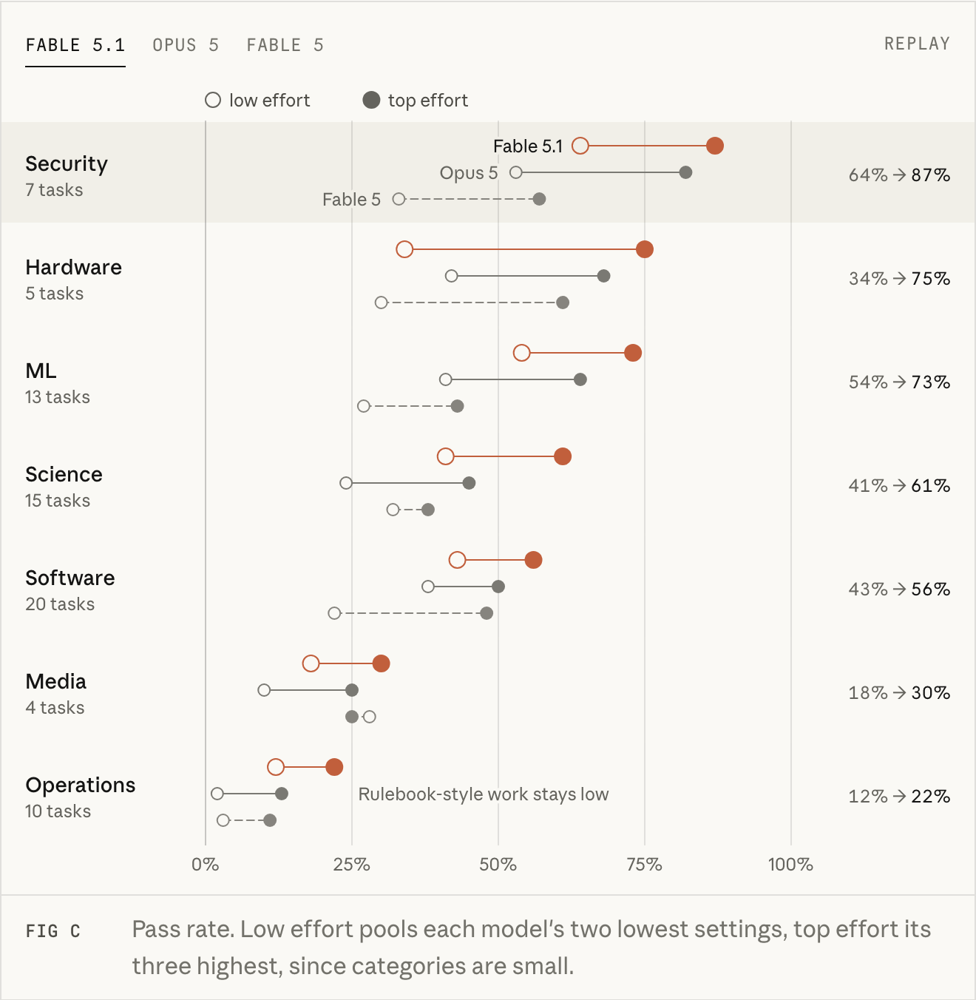

**Figure 15:** Where effort pays: pass rate by task category. Low effort pools each model's two lowest settings, top effort its three highest, since categories are small.

**图 15:** effort 的回报在哪里:按任务类别的通过率。由于各类别题量较小,low 档合并了每个模型最低的两档,最高档合并了最高的三档。

Fable 5.1, pass rate at low effort → top effort: Security 64% → 87%, Hardware 34% → 75%, ML 54% → 73%, Science 41% → 61%, Software 43% → 56%, Media 18% → 30%, Operations 12% → 22%.

Fable 5.1 的通过率,low 档 → 最高档:安全 64% → 87%,硬件 34% → 75%,机器学习 54% → 73%,科学 41% → 61%,软件 43% → 56%,媒体 18% → 30%,运维 12% → 22%。

To illustrate this, I chose a few problems from different areas from Terminal-Bench 3.0 where Opus 5.5 failed at low effort but succeeded at high effort — mostly because it tested and accounted for edge cases:

为了说明这一点,我从 Terminal-Bench 3.0 的不同领域挑了几道 Opus 5.5 在 low 档失败、在 high 档成功的题——多半是因为它测试并照顾到了边界情况:

`mvcc-lsm-compaction`: a Terminal-Bench 3.0 task that asks for a fix to a storage-engine bug from its crash report, without breaking compaction. Opus 5.5 went from 0/5 at low to 4/5 at xhigh.

`mvcc-lsm-compaction`:Terminal-Bench 3.0 任务,要求根据崩溃报告修复一个存储引擎 bug,且不能破坏压实(compaction)。Opus 5.5 从 low 档的 0/5 提升到 xhigh 档的 4/5。

At low (about a minute per attempt), Claude would edit the code before building it or running the reproducer, and did not check that its new test would have caught the original bug.

low 档(每次尝试约 1 分钟)下,Claude 会在构建代码或运行复现器(reproducer)之前就动手改代码,也不检查它新写的测试原本能不能抓住那个 bug。

At xhigh (about 11 minutes), Claude reproduced the crash first, wrote a randomized test against a reference that never compacts, and checked that its tests failed on half-finished fixes.

xhigh 档(约 11 分钟)下,Claude 先复现崩溃,再对照一个从不压实的参考实现写随机化测试,并检验其测试确实能在"修了一半"的版本上失败。

`cli-2ph-simplex`: a Terminal-Bench 3.0 task that asks for a CLI linear-program solver written in Python. Opus 5.5 went from 0/5 at low to 5/5 at high.

`cli-2ph-simplex`:Terminal-Bench 3.0 任务,要求用 Python 写一个命令行线性规划(linear-program)求解器。Opus 5.5 从 low 档的 0/5 提升到 high 档的 5/5。

The low attempts wrote a solver in one pass, checked it with a few small problems and stopped around 10k tokens. In the final message, Claude warned it might be slow on big problems, but did not check.

low 档的尝试一遍写出求解器,用几个小问题验证了一下,在约 1 万 token 处收工。在最后的消息里,Claude 警告说在大问题上可能很慢,但没有去验证。

During the high attempts, Claude tested its solver on random problems against a separate brute-force solver, then timed bigger ones, hit cases that ran far too long or crashed, and reworked its search.

high 档的尝试中,Claude 先拿随机问题把自己的求解器与一个独立的暴力求解器对照测试,再给更大的问题计时,撞上跑得过久或直接崩溃的用例,然后重写了它的搜索逻辑。

`gsea-proteomics`: a Terminal-Bench 3.0 task that asks for a gene set enrichment analysis (GSEA) on proteomics data to find which of eight treatments resemble a target tissue. Opus 5.5 went from 0/5 at low to 4/5 at high.

`gsea-proteomics`:Terminal-Bench 3.0 任务,要求对蛋白质组学(proteomics)数据做基因集富集分析(GSEA),找出八种处理中哪些与目标组织相似。Opus 5.5 从 low 档的 0/5 提升到 high 档的 4/5。

At low effort, Claude picked a reasonable-sounding way to prep the data, ran the analysis that one way, and reported the result.

low 档下,Claude 挑了一种听起来合理的数据预处理(data prep)方式,只按这一种方式跑分析,然后上报结果。

At high, Claude tried two ways of prepping the data, noticed that the list of significant treatments changed, and dug into why before choosing the correct one.

high 档下,Claude 尝试了两种数据预处理方式,注意到显著处理的名单随之变化,于是深挖原因,最后选对了方式。

If a user were in the loop, Claude may have asked the user about the way to set up the problem, but without a user in the loop, high effort does better.

如果有用户参与回路,Claude 也许会就此向用户请教问题的设定方式;但在没有用户参与的情况下,high 档表现更好。

#### 在 Claude Code 中何时使用哪个 effort 档位(When to use different effort levels in Claude Code)

Here's my rule of thumb on when to use which effort level:

下面是我关于何时使用哪个档位的经验法则:

- **Low**: for when I want quick responses that are in the loop, e.g. brainstorming, sketching, easy changes
- **Medium**: for most of my regular software engineering work, e.g. new feature implementation.
- **High**: for work where verification is important or there are edge cases, e.g. fixing a bug in a brownfield codebase.
- **Max**: When I want Claude to operate fully autonomously to solve difficult problems, e.g. end to end building and verification of an app, finding security vulnerabilities in critical software.

- **Low(低)**:当我想要快速响应、自己深度参与时,比如头脑风暴、画草图、小改动。
- **Medium(中)**:用于我大部分日常软件工程工作,比如新功能实现。
- **High(高)**:用于验证很重要或存在边界情况的工作,比如在存量代码库(brownfield codebase)里修 bug。
- **Max(最高)**:当我想让 Claude 完全自主地解决难题时,比如端到端地构建并验证一个应用、在关键软件中查找安全漏洞。

Try varying effort for Opus 5.5 and Fable 5.1 based on your task or even mid-conversation by using `/effort` in Claude Code and let me know if this matches your intuition.

试试在 Claude Code 里用 `/effort` 命令,根据任务、甚至在对话中途调整 Opus 5.5 和 Fable 5.1 的档位,然后告诉我这是否符合你的直觉。

[^1]: A note on the numbers: these come from our own internal runs, 5 attempts per task, with our production safety interventions off for Fable 5.1; in Claude products, Fable 5.1's safeguards hand some security requests to Opus. The security tasks also ran without internet access, so the per-task counts here won't line up with the public leaderboard or the launch post. The worked examples come from individual runs, some at intermediate effort settings. / 关于数字的说明:这些数据来自我们自己的内部运行,每个任务 5 次尝试,且 Fable 5.1 关闭了生产环境的安全干预;在 Claude 产品中,Fable 5.1 的安全防护会把部分安全类请求转交给 Opus。安全类任务还是在无互联网访问的环境下运行的,因此这里的每任务计数不会与公开排行榜或发布文章一致。文中实例来自单次运行,部分处于中间档位。
