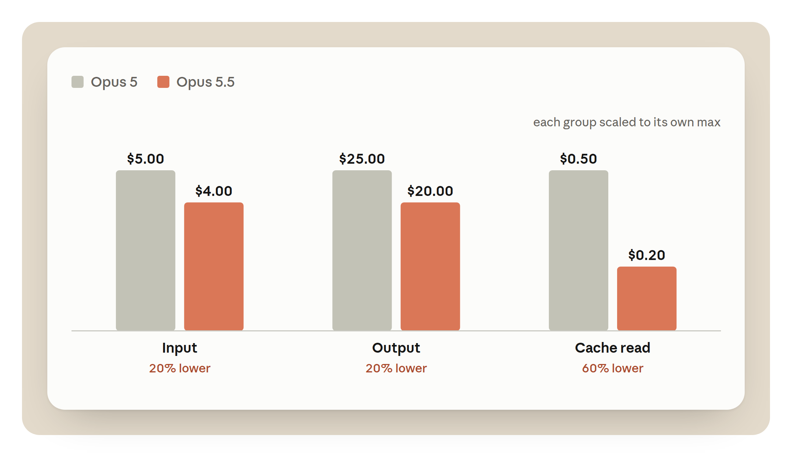
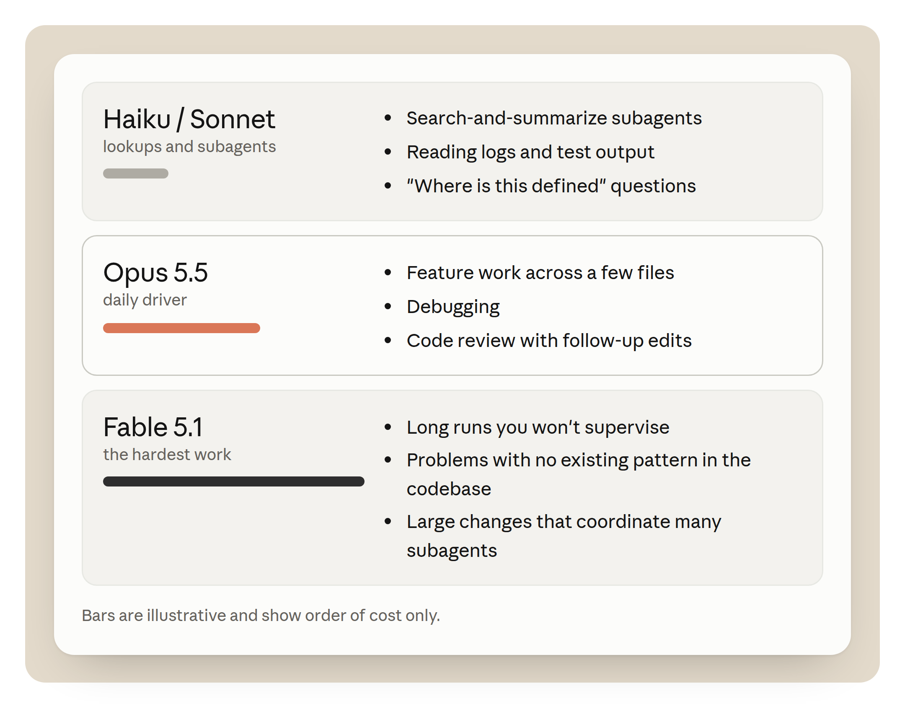

# 一项任务在 Opus 5.5 上要花多少钱（中英对照）

> **原文标题：** What a task costs on Opus 5.5
> **原文作者：** Addy Osmani（Member of Technical Staff，技术成员）
> **原文链接：** https://claude.dev/blog/what-a-task-costs-on-opus-5-5/
> **发布日期：** 2026-09-25
> **翻译模型：** GLM-5.3-Flash
> **评分：** ★★★★☆ —— 对 Opus 5.5 上任务成本的系统性拆解：从 turn、缓存读取、输出到模型选择逐项计价，并给出可操作的省费用法；数字多为基于牌价的示例性推算而非实测，故差半星。
> **排版：** 每段英文原文在前，中文翻译紧随其后。术语保留英文原文并附中文释义。默认收录正文主体（页面导航/CTA/订阅框不收；原文的交互计算器以占位说明收录）。

---

Opus 5.5 costs less per token than Opus 5.

Opus 5.5 的单 token 价格比 Opus 5 更低。

## 任务的成本，与重试的成本（The cost of a task, and the cost of a retry）

You don't set out to buy millions of tokens. You set out to build a feature, finish a migration, or run a task. The token count is whatever the model needed to get there.

你最初的目标并不是买下数百万 token，而是要实现一个功能、完成一次迁移，或跑完一项任务。token 数量只是模型抵达终点所需的代价。

Two models with the same cost per token can cost very different amounts on the same task. One reads the code once. The other reads it, tries a fix, and reads it again. Each of those steps is a turn, and each turn resends the conversation so far. So the model that needs more turns costs more, even at the same price.

两个单 token 成本相同的模型，在同一项任务上的花费可能天差地别。一个只读一遍代码；另一个读完代码、试一次修复、再读一遍。其中每一步都是一个 turn（轮次），而每个 turn 都会重发目前为止的全部对话。所以需要更多 turn 的模型花费更高，哪怕单价相同。

By the end of this post you should be able to answer three questions about your own work:

读完本文，你应该能回答关于自己工作的三个问题：

- What do my typical tasks cost me on Opus 5.5?
- 在 Opus 5.5 上，我的典型任务要花多少钱？
- Which settings change that, and by how much?
- 哪些设置会改变这一成本，改变多少？
- How do I check my own session usage?
- 我如何查看自己会话的用量（usage）？

The tradeoff I want to share upfront is that every way to spend fewer tokens can also cost you a finished task. Lower effort, a smaller model, or less context can all certainly save tokens. A retry costs more than those savings. This post attempts to put a price on each tradeoff.

我想开宗明义地指出一个权衡：每一种省 token 的办法，也都可能让你赔上一项没做完的任务。更低的 effort（投入度）、更小的模型或更少的上下文确实都能省 token，但一次重试的代价会超过这些节省。本文试图给每一种权衡标上价格。

Some numbers here are list prices, and some are illustrations built from them. The figures are interactive, so change the inputs as you read. These are best effort illustrations, so be sure to check our docs and your own math.

文中的数字有的是官方牌价（list price），有的是基于牌价构造的示例。图示都是可交互的，阅读时可以自己改动输入。这些只是尽力而为的示例，请务必核对我们的文档和你自己的算术。

## 一项任务的成本由什么决定？（What does a task cost?）

A task in Claude Code is a loop. The model reads the conversation, calls a tool, reads the result, and goes round again until it's done. Each trip round the loop is one request. Four things set what the loop costs.

在 Claude Code 中，一项任务就是一个循环：模型读取对话，调用工具，读取结果，如此往复直到完成。每绕一圈就是一个请求。有四件事决定了这个循环的成本。

**Turns.** Every turn resends the conversation so far. Fewer turns means less input processed.

**Turns（轮次）。** 每个 turn 都会重发目前为止的对话。turn 越少，处理的输入就越少。

**Cache reads.** Most of what a turn resends is text the model saw on the previous turn. It's billed as a cache read, at a small fraction of the input price.

**Cache reads（缓存读取）。** 一个 turn 重发的内容中，大部分是模型上一轮已经看过的文本。这部分按缓存读取计费，只有输入价格的一小部分。

**Output token type.** The most expensive tokens, at five times the input price. [Thinking](https://platform.claude.com/docs/en/build-with-claude/extended-thinking) is billed as output, so a model that reasons less on the way to the answer costs less.

**Output token type（输出 token 类型）。** 这是最贵的 token，是输入价格的五倍。[Thinking（思考）](https://platform.claude.com/docs/en/build-with-claude/extended-thinking)按输出计费，所以一个在得出答案前推理更少的模型成本更低。

**Model.** Each model has its own prices, listed on the pricing page, so the model you pick sets the price of every token.

**Model（模型）。** 每个模型都有自己的价格（见定价页），你选的模型决定了每个 token 的单价。

Our examples use Opus 5.5 API list prices: $4 per million input tokens, $20 per million output tokens and $0.20 per million cache reads. Like the calculator further down, the examples bill cached input at the read price and everything else at the input price, and leave out cache writes. The token counts are illustrations.

本文示例采用 Opus 5.5 的 API 官方牌价：输入 token 每百万 $4，输出 token 每百万 $20，缓存读取每百万 $0.20。与下文的计算器一样，示例把缓存命中的输入按读取价计费、其余按输入价计费，且不计缓存写入（cache write）。token 数量仅为示意。

### Turns（轮次）

Let's say a task starts with 20K tokens of context and grows to 120K as the model reads files and tool results. At 40 turns, the average turn sends about 70K tokens. That's about 2.8M input tokens for the task, though the conversation never grew past 120K. With 90% read from cache, the input costs about $1.62. The same task in 25 turns processes about 1.75M tokens and costs about $1.02 in input.

假设一项任务以 20K token 的上下文开始，随着模型读取文件和工具结果增长到 120K。若跑 40 个 turn，平均每个 turn 发送约 70K token，整个任务的输入约为 2.8M token——尽管对话从未超过 120K。在 90% 从缓存读取的情况下，输入成本约 $1.62。同一任务若在 25 个 turn 内完成，处理约 1.75M token，输入成本约 $1.02。

A turn costs more than the tokens it adds, because it resends everything before it. So the cheapest turn is the one you don't need.

一个 turn 的成本高于它新增的 token，因为它会重发在它之前的所有内容。所以最便宜的 turn，是你根本不需要的那个。

One habit that can cut turns is giving the model a way to check its work. For example, a test to run, a build, or a script that calls the endpoint. A model that can check its own work finds its mistakes earlier.

一个能减少 turn 的习惯，是给模型提供验证自身工作的手段。比如一个可以运行的测试、一次构建，或一个调用端点的脚本。能自我检查的模型会更早发现自己的错误。

A model that gathers what it needs in one pass, and batches its tool calls, pays the resend fewer times too.

一次性收集齐所需信息、并把工具调用成批发出的模型，重发的次数也更少。

### Cache reads（缓存读取）

The same 2.8M input tokens cost $11.20 if none come from cache. At a 90% hit rate they cost $1.62, and at 96% about $0.99. No other setting moves input cost this much. A steady session keeps a high hit rate on its own. I cover some actions to avoid breaking your cache later in this post.

同样这 2.8M 输入 token，如果完全没有缓存命中要花 $11.20；命中率（hit rate）90% 时是 $1.62，96% 时约 $0.99。没有任何其他设置对输入成本的影响有这么大。一个平稳推进的会话自己就能保持高命中率。本文后面会讲到哪些操作会破坏你的缓存。

### Output tokens（输出 token）

On Opus 5.5, an output token costs 100 times a cache read. The 60K output tokens of a typical task cost $1.20, the same as reading 6M tokens from cache. Output includes thinking. You pay for all of it, even when Claude Code only shows you a summary. That's why effort, which mostly changes how much the model thinks, moves the bill so much.

在 Opus 5.5 上，一个输出 token 的价格是一个缓存读取的 100 倍。一项典型任务的 60K 输出 token 花费 $1.20，相当于从缓存读取 6M token。输出包含 thinking（思考）。即便 Claude Code 只给你看摘要，你也要为全部思考付费。这就是为什么主要改变模型思考量的 effort 设置，对账单影响如此之大。

### Model（模型）

A model with cheaper cache reads mostly helps long sessions. One with cheaper output mostly helps tasks that need a lot of reasoning.

缓存读取更便宜的模型主要惠及长会话；输出更便宜的模型主要惠及需要大量推理的任务。

## Opus 5.5 变了什么（What changed in Opus 5.5）

Two things changed: the price, and how much work the model does.

有两件事变了：价格，以及模型的工作量。

**Every price line is lower.** Input and output tokens are 20% cheaper than on Opus 5. Cache reads are 60% cheaper. The input price falls, and the read rate falls with it, from a tenth of the input price to a twentieth. Fig A compares the two models per million tokens. These are API list prices. On a Pro, Max or Team plan, the lower Opus 5.5 price is passed on to your limits, including cached context, so they go about 25% further than on Opus 5. The extra cut on cache reads is an API price change.

**每一项价格都降低了。** 输入和输出 token 比 Opus 5 便宜 20%；缓存读取便宜 60%。输入价格下降的同时，读取费率也随之下降，从输入价格的十分之一降到二十分之一。图 A 比较了两个模型每百万 token 的价格。这些是 API 官方牌价。在 Pro、Max 或 Team 计划上，Opus 5.5 更低的价格会直接体现到你的用量额度上（包括缓存的上下文），所以同样的额度能比 Opus 5 多撑约 25%。缓存读取的额外降价是一项 API 价格调整。

> **Figure A:** API list price per million tokens — input $5.00 vs $4.00, output $25.00 vs $20.00, cache reads $0.50 vs $0.20, i.e. 20%, 20% and 60% lower on Opus 5.5.
> **图 A：** 每百万 token 的 API 官方牌价——输入 $5.00 对 $4.00，输出 $25.00 对 $20.00，缓存读取 $0.50 对 $0.20，即 Opus 5.5 分别低 20%、20% 和 60%。

Separately, five-hour limits went up on Pro, Max, Team and seat-based Enterprise plans, and eligible subscribers get a limit reset to use when they choose. You'll find it under Settings > Usage on the web or in Claude Desktop, not in Claude Code in your terminal. A reset applies across your account, Claude Code included.

另外，Pro、Max、Team 以及按席位付费的 Enterprise 计划的五小时限额提高了，符合条件的订阅者还会得到一次可自选时机使用的限额重置（limit reset）。你可以在网页版或 Claude Desktop 的 Settings > Usage 下找到它——终端里的 Claude Code 中没有。一次重置会作用于整个账户，也包括 Claude Code。

On an API key, the cache-read price cut matters most for Claude Code. A long agentic session spends most of its input on cache reads. In the session priced in Fig B below, the cache line falls from $1.00 to $0.40, the largest drop on the receipt.

在 API key 上，缓存读取的降价对 Claude Code 意义最大。一个长的 agentic 会话，其输入大部分都花在缓存读取上。在下文图 B 计价的那个会话中，缓存一项从 $1.00 降到 $0.40，是账单上降幅最大的一行。

How much you save depends on the shape of your work. A session that is mostly cache reads can save up to 60% on input. A short question with no cache and a long answer can save up to 20%, because output dominates it. Most Claude Code tasks sit between the two. The calculator below shows where yours sits.

你能省多少取决于你工作的形态。以缓存读取为主的会话，输入最多可省 60%；无缓存、问题短而回答长的情况最多省 20%，因为那种账单由输出主导。大多数 Claude Code 任务介于两者之间。下面的计算器可以显示你的任务落在哪个位置。

You may have seen that Opus 5.5 costs 40% less to run than Opus 5. That's our estimate for typical workloads billed by token, at default settings. It assumes Opus 5.5 uses fewer tokens per task at its medium default, on top of the lower prices, so it isn't a 40% cut to the price of a token. The token prices are the ones in Fig A, and Fig B shows what the price change does on its own.

你可能见过"Opus 5.5 的运行成本比 Opus 5 低 40%"的说法。那是我们对按 token 计费、默认设置下典型工作负载的估计：它假设 Opus 5.5 在默认的 medium 档位下每项任务消耗的 token 更少，是在降价之外再省一笔——所以并不是 token 单价直降 40%。token 价格见图 A，图 B 展示的则是单纯价格变化的效果。

Opus 5.5 can use more tokens on an answer, because it always thinks before it replies. We expect people to get more done on Opus 5.5, but it varies by task, so measure it on your own work. Fig C compares cost per task on the two models. This part depends on your work far more than the price does.

Opus 5.5 在一个回答上可能用更多 token，因为它回复前总是会先思考。我们预期人们在 Opus 5.5 上能完成更多工作，但因任务而异，请在你自己的工作上测量。图 C 比较了两个模型上每项任务的成本。这一部分比价格更取决于你的具体工作。

On a well-scoped task, both models finish in about the same number of turns, and the price cut is all you get. The gap should be biggest on open-ended tasks, where a model can spend many turns on the wrong idea. No single number holds for every codebase, so measure it (see the last section).

在范围清晰的任务上，两个模型用差不多相同的 turn 数完成，你得到的就是纯降价。差距应该在开放式任务上最大——模型可能在错误思路上耗费很多 turn。没有一个数字适用于所有代码库，所以要自己测量（见最后一节）。

**Long runs end with a report.** Opus 5.5 closes a long run with what it changed, what it found, and what it needs from you. That can save money too, because you rerun a session less often when you can see what happened.

**长任务以报告收尾。** Opus 5.5 结束一次长运行时，会汇报它改了什么、发现了什么、还需要你做什么。这同样能省钱：当你能看清发生了什么，就更少需要重跑一次会话。

## 同样的任务并排对比（The same tasks side-by-side）

Fig B prices one session on both models with the same token counts. So the difference is the price change and nothing else. Switch models to compare. The token counts are illustrative.

图 B 用相同的 token 数量给同一个会话在两个模型上计价，因此差异纯粹来自价格变化，别无其他。切换模型即可对比。token 数量为示意。

> *Interactive figure: one illustrative session priced on both models with the same tokens, so the difference is the price change alone.* Explore it on the page: <https://claude.dev/blog/what-a-task-costs-on-opus-5-5/>
> *交互图（Fig B）：一个示意会话按相同 token 数在两个模型上计价，差异仅来自价格变化。* 可在原文页面体验：https://claude.dev/blog/what-a-task-costs-on-opus-5-5/

The receipt has the three lines /usage shows for a session. Cache reads are the biggest line by tokens, at 2M. Output is the smallest by tokens and the biggest by cost. Fresh input sits between them. It covers the first read of each file and each new tool result.

这张"账单"就是 /usage 在一个会话中显示的三行。缓存读取按 token 数是最大的一项，达 2M；输出按 token 数最小、按成本最大；新输入（fresh input）居中，覆盖每个文件的首次读取和每条新的工具结果。

Fig B gives both models the same token counts, so it shows the price change alone. Your own sessions can use more or fewer tokens on Opus 5.5. Priced that way, the session costs about 31% less.

图 B 给两个模型相同的 token 数，因此它展示的只是价格变化本身。你自己的会话在 Opus 5.5 上可能用更多或更少的 token。按那个口径计价，该会话便宜约 31%。

A recorded run adds the second effect, the change in how much work the model does. On a task with a false start, the gap should widen.

一次实测运行会加上第二个效应——模型工作量本身的变化。在有"起步失误（false start）"的任务上，差距应该会进一步拉大。

### 用你自己的数字试试（Try your own numbers）

Set what one of your tasks uses, or start from a preset. The presets are pretty illustrative but I'd still recommend doing your own math. Cached input bills at the cache-read price and fresh input at the input price, so the cache slider shows how much of the gap comes from cache reads.

设定你的某项任务的用量，或从预设开始。这些预设相当粗略，我仍建议你自己算一遍。缓存输入按缓存读取价计费、新输入按输入价计费，因此缓存滑杆能显示差距中有多大份额来自缓存读取。

To fill the sliders from a real session, run /usage at the end of a task. The Session block gives input, output and cache figures. The last slider is your assumption about how much less work Opus 5.5 does on your tasks. Leave it at 0% for the price change alone. To set it from your own work, here's how: run the same task on Opus 5 and on Opus 5.5, and compare turns and output tokens. Measure it yourself walks through it, and Reading a session shows what to check in /usage.

要用真实会话的数据填充滑杆，在任务结束时运行 /usage。Session 区块给出输入、输出和缓存的数字。最后一个滑杆是你对"Opus 5.5 在你的任务上少做多少工作"的假设——只看价格变化就保持 0%。如何用自己的数据设定它：在 Opus 5 和 Opus 5.5 上跑同一任务，比较 turn 数和输出 token。"亲自测量"一节会带你走一遍流程，"解读会话"一节说明在 /usage 里看什么。

> *Interactive figure: a task's tokens priced on both models, for one run and for a month of runs, from sliders and presets.* Explore it on the page: <https://claude.dev/blog/what-a-task-costs-on-opus-5-5/>
> *交互图（Fig C）：用滑杆和预设给一项任务的 token 在两个模型上计价，可看单次运行和一个月（22 个工作日）的运行。* 可在原文页面体验。注：图中为 API 官方牌价；在 Pro、Max 或 Team 计划上这不是账单；不含批量与用量折扣，也不计缓存写入。

## 让会话物尽其用的技巧（Tips for maximizing the value of your session）

Opus 5.5's lower price makes each token cost less. How you run a session decides how many tokens you use, and these steps help.

Opus 5.5 更低的价格让每个 token 更便宜，而你会话的运行方式决定你用多少 token。以下做法会有帮助。

### 先调 effort，再换模型（Raise effort before you change models）

Effort sets a general disposition for how many tokens the model spends on each turn: its thinking, the text it writes, and its tool calls. At lower effort it makes fewer tool calls and keeps them shorter. Opus 5.5 has four levels (low, medium, high and xhigh), plus max for a single session. Pick a level below to see when to use it and the command that sets it.

Effort（投入度）为模型每个 turn 花费多少 token 设定一个总体倾向：包括它的思考、写出的文本和工具调用。低 effort 下，工具调用更少、更短。Opus 5.5 有四个档位（low、medium、high、xhigh），外加仅限单个会话的 max。在下面选一个档位，查看适用时机和设置命令。

> *Interactive figure: the effort levels, when to use each, and the commands that set them.* Explore it on the page: <https://claude.dev/blog/what-a-task-costs-on-opus-5-5/>
> *交互图（Fig D）：各 effort 档位、适用时机与设置命令。各档位按每 turn 思考量从少到多排列。* 可在原文页面体验。页面上的档位选择器共五档：
>
> - **low** — mechanical（机械活）：重命名、跨文件套用既有模式
> - **medium** — everyday（日常）：范围清晰的日常工作，默认档。"它每 turn 思考得比 high 少，所以每个 turn 更便宜。任务范围清晰时从这里起步。" 常用命令：`/effort medium`、`/effort status`、`/model`、`/usage`
> - **high** — if it stalls（卡住时）：medium 停滞不前时升档
> - **xhigh** — hard problems（难题）
> - **max** — one session（仅限单次会话）

Claude Code sets a default level for each model, and /effort status shows yours. Try **medium** for well-scoped, day-to-day work. When medium stalls, try **high**. It spends more per turn than medium, but less than moving to a bigger model. Use **low** for mechanical work, like renames or applying a known pattern across files.

Claude Code 为每个模型设定默认档位，/effort status 会显示你当前的档位。范围清晰的日常工作用 **medium**。medium 停滞不前时，试 **high**——它每 turn 的花费比 medium 高，但仍低于换更大的模型。机械性工作（如重命名、跨文件套用既有模式）用 **low**。

On Opus 5.5 the default is medium, one level below Opus 5's default of high. Levels don't mean the same amount of thinking on every model. At a given level, Opus 5.5 thinks more per turn than Opus 5, most of all at xhigh and max. So don't carry over a level you chose for Opus 5. Start at medium, and keep xhigh and max for work where you've measured a gain.

Opus 5.5 的默认档位是 medium，比 Opus 5 的默认档 high 低一级。档位在不同模型上不代表相同的思考量。同一档位下，Opus 5.5 每个 turn 的思考比 Opus 5 多，在 xhigh 和 max 上尤其明显。所以不要把为 Opus 5 选的档位照搬过来。从 medium 起步，xhigh 和 max 留给你实测过有收益的工作。

A rough way to think about effort pricing: say high adds 20K thinking tokens across a task. On Opus 5.5 that's $0.40. A retry loop of ten turns at 100K of cached context, with 10K output tokens in total, costs about the same. So high pays for itself on a task where it saves one retry. On a task medium would have finished the first time, it's wasted.

对 effort 定价的一个粗略理解：假设 high 在一项任务中多花 20K 思考 token，在 Opus 5.5 上是 $0.40。一个以 100K 缓存上下文重试十轮、共 10K 输出 token 的重试循环，花费与此相当。所以只要 high 帮你省下一次重试，它就值回票价；如果 medium 本可一次完成，那它就是浪费。

#### 当 medium 只修了一层（When medium fixes one layer）

The clearest sign you need more effort is a fix that stops at one layer.

你需要更高 effort 的最明确信号，就是修复只停在了一层上。

Say a field is renamed in an API handler. At medium, the model updates the handler, the handler's tests pass, and the client still sends the old field. It did what it was asked. It just didn't read far enough to find the second caller. At high, it spends more turns reading call sites before it writes, and it changes both layers in one pass.

假设一个字段在 API handler 里改名。medium 下，模型更新了 handler，handler 的测试通过，但客户端仍在发送旧字段。它做了被要求的事，只是没有读得足够远去发现第二个调用方。high 下，它会在动手前多花几个 turn 阅读调用点，一次改动同时更新两层。

A check can catch the same bug. If the model can run a test that goes through the client, the old field fails that test on the turn it was written, at medium. So before you raise effort, check whether the model has a way to check its work. A test run costs one turn and its output. More effort adds thinking to every turn.

一个检查手段同样能抓住这个 bug。如果模型能运行一个穿透客户端的测试，那么即使在 medium 下，旧字段也会在它被写入的当轮就让测试失败。所以在提高 effort 之前，先看模型有没有验证自身工作的手段。跑一次测试的成本是一个 turn 加它的输出；更高的 effort 则给每个 turn 都加上思考。

If upgrading effort levels and adding checks doesn't work, then switch to a bigger model.

如果升档和加检查都不奏效，那就换更大的模型。

#### 会话中途更改 effort（Changing effort mid-session）

In Claude Code, run /effort with a level, for example /effort high. /effort status prints the current level. You can change it mid-task, and the new level applies to the next request.

在 Claude Code 中，运行 /effort 加档位，例如 /effort high。/effort status 打印当前档位。你可以在任务中途更改，新档位从下一个请求开始生效。

On Opus 5.5 with an API key or a Claude subscription, changing effort keeps the cache. You can raise it for one hard step and lower it again without rewriting the conversation. On Amazon Bedrock, Google Cloud's Agent Platform or a Claude apps gateway, a change of effort still clears the cached conversation, and the next request pays the cache-write price on all of it. Thinking is always on for Opus 5.5, so there's no thinking setting to change.

在 Opus 5.5 上使用 API key 或 Claude 订阅时，更改 effort 会保留缓存。你可以为某一个难点升档、之后再降回来，而不必重写对话。在 Amazon Bedrock、Google Cloud 的 Agent Platform 或 Claude 应用网关上，更改 effort 仍会清空已缓存的对话，下一个请求要为全部内容支付缓存写入价。Opus 5.5 的思考是常开的，所以没有思考设置可改。

### 为你的工作选对模型（Choose the right model for your work）

Model choice sets the price of every token in a session, so it moves the bill more than effort does. It also reaches further. Every subagent that inherits the main model inherits its price too. Most days need three models: a small one for lookups, Opus 5.5 for work you supervise closely, and a bigger one for the hardest tasks.

模型选择决定会话中每个 token 的单价，因此它对账单的影响比 effort 更大，波及面也更广——继承主模型的每个 subagent（子代理）也继承它的价格。大多数日子需要三个模型：一个小模型做查询（lookup），Opus 5.5 做你密切监督的工作，更大的模型攻最难的任务。

> **Figure 2:** Three models in order of cost, with bars that show order of cost only: Haiku or Sonnet for lookups and subagents, Opus 5.5 as the daily driver, and Fable 5.1 for the hardest work.
> **图 2：** 按成本从低到高排列的三个模型（条形仅示意成本高低）：Haiku 或 Sonnet 负责查询和子代理，Opus 5.5 是日常主力（daily driver），Fable 5.1 攻最难的工作。

#### Opus 5.5 作为日常主力（Opus 5.5 as the daily driver）

Use Opus 5.5 for work you supervise: feature work across a few files, debugging, and code review with follow-up edits. You read what it does and step in when it drifts, so the loop stays short.

Opus 5.5 用于你在监督下进行的工作：跨少数文件的功能开发、调试，以及带后续修改的代码评审。你读它做的事，在它跑偏时介入，循环因此保持短促。

#### 升级到 Fable 5.1（Moving up to Fable 5.1）

**Move up to Fable 5.1 when the result matters more than the token price.** For example long runs you won't supervise, problems with no existing pattern in the codebase, and large changes that coordinate many subagents. Don't wait for a third failure. If Opus 5.5 on xhigh hits the same problem twice, switch, and switch back once it's solved. For interactive work, Opus 5.5 is a better fit as it has lower latency and costs less.

**当结果比 token 价格更重要时，升级到 Fable 5.1。** 例如你不会盯着看的长任务、代码库中没有现成模式可循的问题，以及需要协调大量子代理的大型改动。不要等到第三次失败：如果 Opus 5.5 在 xhigh 下两次撞上同一个问题，就切换，问题解决后再切回来。交互式工作更适合留在 Opus 5.5，它延迟更低、成本更小。

Fable 5.1 lists at $10 per million input tokens and $50 per million output, two and a half times the Opus 5.5 price. Its cache reads cost $0.25 per million, only 1.25 times the Opus 5.5 rate, because they bill at 0.025 times its input price. So the gap is smallest on a long, cache-heavy run, and largest on a task that writes a lot.

Fable 5.1 的牌价是输入每百万 $10、输出每百万 $50，是 Opus 5.5 的 2.5 倍。它的缓存读取为每百万 $0.25，仅为 Opus 5.5 费率的 1.25 倍，因为其按输入价格的 0.025 倍计费。所以差距在长而重缓存的运行中最小，在输出量大的任务上最大。

Switch at a natural break. The cache belongs to the previous model, so expect the first turn on the new model to pay the write price on the whole conversation. Run /compact first, or start a fresh session with a short written plan, to make that turn smaller. Run [/model](https://code.claude.com/docs/en/model-config) with an alias or a model name to switch. /model also saves your choice as the default for new sessions, so switch back when the hard part is done.

在自然的间歇处切换。缓存属于上一个模型，所以要有心理准备：新模型上的第一个 turn 要为整段对话支付写入价。先跑 /compact，或带着一份简短的书面计划开一个新会话，让这个 turn 小一点。运行 [/model](https://code.claude.com/docs/en/model-config) 加别名或模型名来切换。/model 还会把你的选择存为新会话的默认值，所以难点解决后记得切回来。

#### 向下换小模型做查询（Moving down for lookups）

**Move down to Sonnet or Haiku for lookups, not for writing code:** subagents that search and summarize, reading logs and test output, and "where is this defined" questions. For a mechanical edit across many files, keep Opus 5.5 and set effort to low. The edit stays on the model that writes the rest of your code, at a lower cost per turn.

**向下换到 Sonnet 或 Haiku 用于查询，而不是写代码：** 适合搜索和汇总的子代理、读日志和测试输出，以及"这个定义在哪"这类问题。跨大量文件的机械性修改，则保留在 Opus 5.5 上并把 effort 设为 low——修改仍由写你其余代码的那个模型完成，但每 turn 成本更低。

To put a [subagent](https://code.claude.com/docs/en/sub-agents) on a smaller model, set model: haiku or model: sonnet in its definition. To put every subagent on one model, set the CLAUDE_CODE_SUBAGENT_MODEL environment variable. A model named in a subagent's definition overrides the variable. A subagent with no model setting runs on your main model, unless the variable is set.

要让某个 [subagent](https://code.claude.com/docs/en/sub-agents)（子代理）用更小的模型，在它的定义中设置 model: haiku 或 model: sonnet。要让所有子代理都用同一个模型，设置环境变量 CLAUDE_CODE_SUBAGENT_MODEL。子代理定义里写明的模型优先于该变量；定义里没写模型且变量未设置时，子代理跑在主模型上。

Each subagent runs in its own context window and hands back a summary, so its file reads stay out of your main conversation. It still pays for its own tokens, so the model setting decides what that spend costs.

每个子代理在自己的上下文窗口中运行，只交回一份摘要，因此它的文件读取不会进入你的主对话。但它仍然要为自己的 token 付费，模型设置决定了这笔开销的大小。

Agent teams, an experimental feature, multiply this. Each teammate is a separate Claude Code instance with its own context window, and it keeps using tokens until it exits. Our [costs docs](https://code.claude.com/docs/en/costs) put a team at about seven times the tokens of a standard session when teammates run in plan mode. Keep teams small, keep each task self-contained, and shut teammates down when their part is done.

Agent teams（代理团队，实验性功能）会把这一点放大。每个 teammate 都是一个独立的 Claude Code 实例，有自己的上下文窗口，并且在退出前持续消耗 token。我们的[成本文档](https://code.claude.com/docs/en/costs)估计，teammates 以 plan mode（计划模式）运行时，一个团队的 token 约为标准会话的 7 倍。团队保持小规模，每个任务自成一体，teammate 完成分内之事就关掉。

The tradeoff: a small model that misreads a search result sends the main model after the wrong file, and the main model pays for the detour. Keep the small model on work where a mistake is cheap to spot, like finding files, running tests and reading logs.

权衡在于：小模型误读一条搜索结果，就会让主模型扑向错误的文件，绕路的账由主模型付。把小模型留在"错了也容易发现"的工作上，比如找文件、跑测试、读日志。

Keep judgment calls on the main model. The opusplan alias splits the work a different way: Opus plans in plan mode, and Sonnet carries out the plan. That puts the code edits on Sonnet, the opposite of the advice above. Measure it on your own tasks before you make it a default.

判断性决策留给主模型。opusplan 别名以另一种方式分工：Opus 在 plan mode 里做计划，Sonnet 执行计划。这会把代码修改交给 Sonnet，与上面的建议正好相反。在设为默认之前，先在你自己的任务上测量。

### 迁移时检查你的提示词（Check your prompts when you migrate）

Instructions written for an older model can make Opus 5.5 write more and repeat tool calls. Run /claude-api prompt-audit in Claude Code to check your Claude Code setup, such as your skills and CLAUDE.md file, for these [prompting anti-patterns](https://claude.com/blog/reducing-cost-and-improving-performance-with-claude-platform). It also checks the code of an app you build on the Claude Platform.

为旧模型写的指令可能让 Opus 5.5 写得更多、重复调用工具。在 Claude Code 中运行 /claude-api prompt-audit，检查你的 Claude Code 配置（如 skills 和 CLAUDE.md 文件）中是否存在这些 [prompting anti-patterns（提示反模式）](https://claude.com/blog/reducing-cost-and-improving-performance-with-claude-platform)。它也会检查你在 Claude Platform 上构建的应用代码。

We tested this on a migration from Opus 4.8 to Opus 5.5, using an internal customer support benchmark of 44 tickets whose prompt had several of these patterns. The move to Opus 5.5, at low effort, cut the benchmark's cost by about 18%. Running prompt-audit cut it by a further 9%, to about 25% below the Opus 4.8 starting point. The audit removed ritual instructions that made the model write more and repeat tool calls: a mandatory six-step procedure, a scratchpad rule, a verify-twice rule, and instructions that contradicted each other.

我们在一次从 Opus 4.8 到 Opus 5.5 的迁移上做了测试：用一个包含 44 张工单的内部客服基准，其提示词带有上述数种反模式。换到 Opus 5.5（low effort）使基准成本下降约 18%；再跑 prompt-audit 又降 9%，总计比 Opus 4.8 的起点低约 25%。审计移除了那些让模型写更多、重复调工具的仪式性指令：一个强制的六步流程、一条 scratchpad（草稿区）规则、一条"验证两遍"规则，以及相互矛盾的指令。

That result comes from one benchmark, so treat it as an example rather than a number to expect. Run the audit, then compare /usage on a real task before and after (see Measure it yourself).

这一结果来自单个基准，请把它当作示例，而非可预期的数字。跑一次审计，然后在真实任务上对比前后的 /usage（见"亲自测量"一节）。

### 缓存与压缩（Caching and compaction）

Claude Code handles caching and compaction for you. How you run a session decides how much they save.

Claude Code 会替你处理缓存与压缩（compaction）。会话的运行方式决定了它们能省下多少。

#### 缓存的工作原理（How the cache works）

Claude Code caches the parts of a request that repeat, such as the system prompt, tool definitions, and the conversation so far.

Claude Code 缓存请求中重复出现的部分，例如 system prompt、工具定义和目前为止的对话。

On Opus 5.5 a cached read costs 5% of a fresh input token. Writing to the cache costs more than a fresh read, at 1.25 times the input price for a five-minute cache and twice the input price for a one-hour cache, on today's pricing. Each hit resets the lifetime at no charge.

在 Opus 5.5 上，一次缓存读取的价格是一个新输入 token 的 5%。写入缓存比新读取更贵：按当前定价，五分钟缓存的写入是输入价格的 1.25 倍，一小时缓存是 2 倍。每次命中都会免费重置缓存的寿命（lifetime）。

In Claude Code the lifetime depends on how you pay. On a Claude subscription it's an hour. On an API key or a cloud provider it's five minutes by default, and a subscription drops to five minutes once it's drawing on usage credits.

在 Claude Code 中，缓存寿命取决于你的付费方式。Claude 订阅是一小时；API key 或云供应商默认五分钟，订阅一旦开始消耗用量积分（usage credits）也会降到五分钟。

At 120K tokens of context, a five-minute write on Opus 5.5 costs about $0.60 and a read about $0.02. One write costs as much as 25 reads. On an API key, a six-minute coffee break turns the next $0.02 read into a $0.60 write. A one-hour write at the same size costs about $0.96, and on the API you can pay that premium to cover the gaps in your day.

在 120K token 的上下文下，Opus 5.5 的一次五分钟写入约 $0.60，一次读取约 $0.02——一次写入等于 25 次读取。在 API key 上，一次六分钟的咖啡休息，就会把下一个 $0.02 的读取变成 $0.60 的写入。同规模的一小时写入约 $0.96，在 API 上你可以付这笔溢价来覆盖一天中的空档。

#### 会话形态与命中率（Session shape and hit rate）

The cache stores a prefix, so it can reuse only the part of a request that matches the previous one from the start.

缓存存储的是前缀（prefix），因此只能复用请求中从头开始与上一个请求一致的部分。

A steady session appends to the end of the conversation on every turn and keeps its hit rate high. Anything that changes an earlier part of the request lowers it. Changing the tool definitions clears the whole cache, and a change to the system prompt clears it from that point on, which is almost everything.

平稳推进的会话每个 turn 都在对话末尾追加内容，命中率自然保持在高水平。任何改动请求前部内容的操作都会拉低命中率。更改工具定义会清空整个缓存；更改 system prompt 则从改动点开始清空——那几乎等于全部。

In practice, expect a cache write when:

实践中，以下情况会发生缓存写入：

- You pause longer than the cache lifetime;
- 暂停时间超过缓存寿命；
- You change effort on Amazon Bedrock, Google Cloud's Agent Platform or a gateway, where the level is part of what the cache matches;
- 在 Amazon Bedrock、Google Cloud 的 Agent Platform 或网关上更改 effort——在那里档位是缓存匹配内容的一部分；
- You turn on fast mode for the first time in a conversation, which changes part of what the cache matches;
- 在对话中首次开启 fast mode（快速模式），这会改变缓存匹配内容的一部分；
- You connect or disconnect an MCP server, which can change what loads at the start of each request;
- 连接或断开 MCP 服务器，这可能改变每个请求开头加载的内容；
- You switch models, since the new model starts from an empty cache; and
- 切换模型，因为新模型从空缓存开始；
- The conversation is compacted, which rewrites the history the cache matched.
- 对话被压缩，这会重写缓存所匹配的历史。

So set these up when the session starts, and leave them alone while it works.

所以这些事请在会话开始时设置好，会话运行期间就不要动它们。

#### 为什么长会话每个 turn 更贵（Why long sessions cost more per turn）

Every turn resends the whole context, so a turn costs more as the context grows, even with a warm cache. At 20K tokens of context a turn's cache read costs about $0.004 on Opus 5.5. At 150K it costs about $0.03, and 30 turns at that size spend $0.90 on reads alone. The same 30 turns at 20K cost about $0.12. On Claude 4.6 and later models a bigger context window doesn't change the price per token, so the cost comes entirely from resending the conversation.

每个 turn 都重发全部上下文，因此即使缓存仍然温热（未过期），上下文越大 turn 越贵。在 20K token 上下文下，Opus 5.5 一个 turn 的缓存读取约 $0.004；150K 时约 $0.03，这个规模的 30 个 turn 光读取就花 $0.90。同样的 30 个 turn 在 20K 下约 $0.12。在 Claude 4.6 及之后的模型上，更大的上下文窗口不改变单 token 价格，所以成本完全来自重发对话。

Much of that context is left over from earlier work: a stack trace from an hour ago, a file you've finished with, the output of a test run you've since fixed. It's all still sent on every turn.

这些上下文中很大一部分是早前工作的遗留：一小时前的堆栈跟踪、你已经用完的文件、你后来已修复的某次测试运行的输出。它们仍会在每个 turn 被发送。

#### 压缩、/compact 与 /clear（Compaction, /compact and /clear）

When a session gets close to its context limit, Claude Code summarizes older history so later turns send less. Run /autocompact with a token count to change how full the context gets before that happens.

当会话接近上下文上限时，Claude Code 会把较早的历史做成摘要，让之后的 turn 发送更少的内容。运行 /autocompact 加 token 数，可以改变触发压缩前上下文允许填到多满。

Two commands let you do this yourself. /clear empties the conversation and costs nothing, so use it when you move to unrelated work. /compact keeps continuity and costs one request. It reads the conversation it summarizes, and you can say what to keep, for example /compact keep the failing test names and the schema change.

有两个命令让你手动完成这件事。/clear 清空对话且分文不收，切换到不相关的工作时用它。/compact 保留连续性，代价是一次请求：它要读取所摘要的对话，你还可以指定保留什么，例如 /compact keep the failing test names and the schema change（保留失败的测试名和 schema 改动）。

A rough price for compacting at 150K tokens is about $0.25. That's the read, a summary of a few thousand output tokens, and a new cache write on the shorter context. Each later turn saves about $0.025 in reads, so the compaction pays for itself within about ten turns. A compaction just before you finish costs more than it saves.

在 150K token 下压缩一次的粗略价格约 $0.25：包括一次读取、几千输出 token 的摘要，以及对更短上下文的一次新缓存写入。此后每个 turn 约省 $0.025 的读取费，所以压缩大约在十个 turn 内回本。收尾前一刻的压缩，花的比省的多。

That price assumes a warm cache. While the cache is warm, the summary request reads the conversation from it, so compact before a break, not after one. After a break longer than the cache lifetime, the same /compact reads the whole conversation again and writes it back to the cache. At 150K tokens on a five-minute cache, the input alone comes to about $0.75. If you've gone down a path you want to drop, /rewind to an earlier turn instead. While the cache is warm, that returns to a prefix that's already cached.

这个价格假设缓存是热的。缓存热着时，摘要请求从缓存读取对话，所以要在休息之前压缩，而不是休息之后。超过缓存寿命的休息之后，同样的 /compact 要把整个对话重新读一遍并写回缓存——150K token 加五分钟缓存时，光输入就约 $0.75。如果你走上了一条想放弃的路，改用 /rewind 回到较早的 turn：缓存热着时，它会回到一个已经缓存的前缀上。

The summary also loses detail. A compaction in the middle of a debugging session can drop the one log line that mattered. Compact at a natural break, and when the next step depends on something specific, say so in the /compact instruction.

摘要也会丢失细节。调试中途的压缩可能丢掉那条最要紧的日志。在自然间歇处压缩；当下一步依赖某个具体细节时，在 /compact 指令里写明。

#### 你打字之前加载了什么（What loads before you type）

Your [CLAUDE.md file](https://code.claude.com/docs/en/memory) loads into the context at the start of every session, so each line in it is part of what every turn resends. The [costs docs](https://code.claude.com/docs/en/costs) suggest keeping it under 200 lines. MCP tool definitions are deferred. Only tool names and server instructions load at the start, and a full definition loads when its tool is used. Run /mcp to see which servers are connected, and turn off the ones you aren't using.

你的 [CLAUDE.md 文件](https://code.claude.com/docs/en/memory)在每次会话开始时载入上下文，因此它每一行都是每个 turn 重发内容的一部分。[成本文档](https://code.claude.com/docs/en/costs)建议把它控制在 200 行以内。MCP 工具定义是延迟加载的：开头只载入工具名和服务器说明，完整定义在工具被使用时才载入。运行 /mcp 查看连接了哪些服务器，关掉不用的。

#### 账单的其余部分（The rest of the bill）

The table lists the other billing rules that affect a Claude Code session, with a link to the docs where one exists.

下表列出了影响 Claude Code 会话的其他计费规则，能找到文档的都附了链接。

**Table: Other billing rules that affect a Claude Code session**
**表：影响 Claude Code 会话的其他计费规则**

| What the bill counts | How it works |
| --- | --- |
| Cache lifetime | In Claude Code, one hour on a subscription; five minutes on an API key or cloud provider, or once a subscription draws on usage credits. Each hit resets the lifetime. The API offers a one-hour cache at a higher write price. [Costs docs (Claude Code lifetime) and prompt caching docs](https://code.claude.com/docs/en/costs) |
| Cache writes | 1.25× the input price for a five-minute cache and 2× for a one-hour cache, on today's API pricing. [Pricing docs](https://platform.claude.com/docs/en/about-claude/pricing) |
| Thinking | Billed as output tokens, including thinking that isn't returned to you. [Extended thinking docs](https://platform.claude.com/docs/en/build-with-claude/thinking) |
| Effort | Applies to every output token: text, tool calls and thinking. [Effort docs](https://platform.claude.com/docs/en/build-with-claude/effort) |
| Auto-compaction | Runs as the context window nears its limit. /autocompact with a token count sets the threshold. [Context window docs](https://code.claude.com/docs/en/context-window) |
| Subagents and agent teams | A subagent works in its own context window and returns a summary. Agent teams in plan mode use about 7× the tokens of a standard session. [Context window and costs docs](https://code.claude.com/docs/en/costs) |
| Batch API | Half price on input and output tokens for requests sent through the Message Batches API. [Batch processing docs](https://platform.claude.com/docs/en/build-with-claude/batch-processing) |
| Typical spend today | Average: about $13 per developer per active day across enterprise deployments. For 90% of users, cost stays below $30 per active day. Both figures are for current models. [Public docs, costs page (enterprise average and 90% bound)](https://code.claude.com/docs/en/costs) |

| 账单计入项 | 运作方式 |
| --- | --- |
| 缓存寿命（Cache lifetime） | 在 Claude Code 中，订阅为一小时；API key 或云供应商为五分钟，订阅开始消耗用量积分后也是五分钟。每次命中都会重置寿命。API 提供写入价更高的一小时缓存。[成本文档（Claude Code 寿命）与提示缓存文档](https://code.claude.com/docs/en/costs) |
| 缓存写入（Cache writes） | 按当前 API 定价，五分钟缓存为输入价的 1.25 倍，一小时缓存为 2 倍。[定价文档](https://platform.claude.com/docs/en/about-claude/pricing) |
| Thinking（思考） | 按输出 token 计费，包括不返回给你的思考。[扩展思考文档](https://platform.claude.com/docs/en/build-with-claude/thinking) |
| Effort（投入度） | 适用于所有输出 token：文本、工具调用与思考。[Effort 文档](https://platform.claude.com/docs/en/build-with-claude/effort) |
| 自动压缩（Auto-compaction） | 在上下文窗口接近上限时运行。/autocompact 加 token 数可设置阈值。[上下文窗口文档](https://code.claude.com/docs/en/context-window) |
| 子代理与代理团队（Subagents and agent teams） | 子代理在自己的上下文窗口中工作并返回摘要。代理团队在 plan mode 下约消耗标准会话 7 倍的 token。[上下文窗口与成本文档](https://code.claude.com/docs/en/costs) |
| Batch API | 通过 Message Batches API 发送的请求，输入输出 token 半价。[批处理文档](https://platform.claude.com/docs/en/build-with-claude/batch-processing) |
| 今天的典型支出（Typical spend today） | 平均：企业部署中每位开发者每个活跃日约 $13。90% 的用户成本低于每活跃日 $30。两个数字均针对当前模型。[公开文档，成本页（企业平均值与 90% 分位）](https://code.claude.com/docs/en/costs) |

Fast mode runs Opus 5.5 up to 2.5 times faster, at twice the standard price: $8 per million input tokens and $40 per million output. On a Claude subscription it's billed to usage credits, not your plan limits. The first request after you turn it on pays the fast-mode input price on the whole conversation, uncached. So turn it on at the start of a session, not deep into one.

Fast mode（快速模式）能让 Opus 5.5 快至 2.5 倍，价格是标准价的两倍：输入每百万 $8，输出每百万 $40。在 Claude 订阅上它计入用量积分，不占计划限额。开启后的第一个请求要按 fast mode 输入价为整段对话付费，且不走缓存。所以要在会话开始时开启，而不是开到一半再开。

## 亲自测量（Measure it yourself）

The figures in this post are illustrations. Your codebase, prompts and habits are different, so measure cost on your own tasks. Here's how to check.

本文中的数字都是示例。你的代码库、提示词和习惯都不同，所以请在你自己的任务上测量成本。方法如下。

1. **In a session, run [/usage](https://code.claude.com/docs/en/costs).** /cost does the same thing. The Session block shows token use and an estimated dollar cost at list price. A prompt-cache line shows how much of your input came from cache. On a Pro, Max, Team or Enterprise plan, the same screen shows your plan usage bars. The dollar figure is computed on your machine at list price, so on a subscription it is a guide to how much work you did, not a bill.

   1. **在会话中运行 [/usage](https://code.claude.com/docs/en/costs)。** /cost 功能相同。Session 区块显示 token 用量和按牌价估算的美元成本。prompt-cache 一行显示你的输入有多少来自缓存。在 Pro、Max、Team 或 Enterprise 计划上，同一界面还显示你的计划用量进度条。美元数字是在你本机上按牌价计算的，所以在订阅下它是你做了多少工作的参考，不是账单。

2. **Run the same task twice.** Opus 5.5 needs Claude Code v2.1.280 or later, so run `claude update` first. Pick something from your backlog, not a toy example. Use /model to switch between Opus 5 and Opus 5.5. Note turns, output tokens and cost for each run. Do three or four tasks before you draw a conclusion.

   2. **同一任务跑两遍。** Opus 5.5 需要 Claude Code v2.1.280 或更高版本，先运行 `claude update`。从你的待办里挑真任务，不要用玩具示例。用 /model 在 Opus 5 和 Opus 5.5 之间切换。记录每次运行的 turn 数、输出 token 和成本。做三四个任务再下结论。

3. **For a team, use the usage and cost reports.** The [Claude Code Analytics API](https://platform.claude.com/docs/en/manage-claude/claude-code-analytics-api) gives estimated cost per user. The [Usage and Cost API](https://platform.claude.com/docs/en/manage-claude/usage-cost-api) breaks spend down by model and by cached versus uncached tokens.

   3. **团队请用用量与成本报告。** [Claude Code Analytics API](https://platform.claude.com/docs/en/manage-claude/claude-code-analytics-api) 提供按用户估算的成本。[Usage and Cost API](https://platform.claude.com/docs/en/manage-claude/usage-cost-api) 按模型、按缓存与否拆分支出。

4. **Try the effort ladder.** Run one hard task at medium and then at high. Run one mechanical task at low.

   4. **试试 effort 阶梯。** 一个难任务分别在 medium 和 high 下各跑一遍；一个机械任务在 low 下跑。

### 解读一次会话（Reading a session）

Check three things in /usage at the end of a task.

任务结束时，在 /usage 里检查三件事。

- **Cache share.** For a long session it should be high. If it's low, look for a long pause, a model switch, an MCP server connected partway through or, on a cloud provider or gateway, a change of effort. The prompt cache line often names the likely cause of the last miss.
- **缓存占比（Cache share）。** 长会话的占比应该很高。如果偏低，找一找是否有长时间暂停、切换过模型、中途连过 MCP 服务器，或者在云供应商/网关上改过 effort。prompt cache 一行通常会点出最后一次未命中的可能原因。
- **Output against input.** A lot of output on a small change usually means the effort level is too high for the task, or the model is retrying.
- **输出对输入的比例（Output against input）。** 小改动伴随大量输出，通常意味着 effort 档位对这项任务太高，或者模型在反复重试。
- **Total input against the size of the conversation.** If the total is many times the size of the conversation, the session took many turns, and the conversation is worth reading to find where the loop repeated.
- **总输入对对话大小的比例（Total input against conversation size）。** 如果总输入是对话大小的许多倍，说明会话跑了很多 turn，值得读一遍对话找出循环重复的地方。

For a baseline, the Claude Code costs docs give an average across enterprise deployments of about $13 per developer per active day, and under $30 per active day for 90% of users. A session that costs well above your own normal level is worth reviewing.

作为参照，Claude Code 成本文档给出的企业部署平均值约为每位开发者每个活跃日 $13，90% 的用户低于每活跃日 $30。一次成本远高于你自己正常水平的会话，值得复盘。

## 牢记要点（Keep in mind）

- Use medium effort for well-scoped daily work.
- 范围清晰的日常工作用 medium effort。
- Give the model a way to check its work, and start changes that span files in plan mode.
- 给模型提供验证自身工作的手段；跨文件的改动从 plan mode 起步。
- When medium stalls, raise effort to high. With an API key or a subscription the change keeps your cache. On a cloud provider or gateway, change it at a break.
- medium 停滞时升到 high。用 API key 或订阅，更改会保留缓存；在云供应商或网关上，请在间歇处更改。
- If xhigh hits the same problem twice, switch to Fable 5.1. Switch back once it's solved.
- xhigh 两次撞上同一个问题，就切到 Fable 5.1；解决后切回来。
- Put search and log-reading subagents on Sonnet or Haiku. Keep code edits on Opus 5.5.
- 搜索和读日志的子代理用 Sonnet 或 Haiku；代码修改留给 Opus 5.5。
- Keep a long session moving, so its cache stays warm.
- 让长会话持续推进，缓存才不会凉。
- Use /clear between unrelated tasks, and /compact at a break with a note on what to keep.
- 不相关的任务之间用 /clear；间歇处用 /compact 并注明要保留什么。
- **The one that matters most:** run one real task on each model and compare what /usage reports. Your own numbers are the ones to trust.
- **最重要的一条：** 在两个模型上各跑一个真实任务，比较 /usage 的报告。你自己的数字才值得信赖。

I hope this post was helpful. If your limits don't go further on Opus 5.5 than on Opus 5, tell us with /feedback.

希望这篇文章对你有帮助。如果 Opus 5.5 并没有让你的额度比 Opus 5 更耐用，请用 /feedback 告诉我们。

Further reading: [Manage costs effectively](https://code.claude.com/docs/en/costs) · [Model configuration](https://code.claude.com/docs/en/model-config) · [Choosing a Claude model and effort level in Claude Code](https://claude.com/blog/claude-model-and-effort-level-in-claude-code) · [Effort](https://platform.claude.com/docs/en/build-with-claude/effort) · [Prompt caching](https://platform.claude.com/docs/en/build-with-claude/prompt-caching) · [Maximizing the value of your Claude Code sessions](https://claude.com/blog/maximizing-the-value-of-your-claude-code-sessions)

延伸阅读：[有效管理成本](https://code.claude.com/docs/en/costs) · [模型配置](https://code.claude.com/docs/en/model-config) · [在 Claude Code 中选择模型与 effort 档位](https://claude.com/blog/claude-model-and-effort-level-in-claude-code) · [Effort](https://platform.claude.com/docs/en/build-with-claude/effort) · [提示缓存](https://platform.claude.com/docs/en/build-with-claude/prompt-caching) · [让 Claude Code 会话物尽其用](https://claude.com/blog/maximizing-the-value-of-your-claude-code-sessions)

*With thanks to Michael Segner, Kacie Jenkins and Molly Vorwerck for their reviews.*

*感谢 Michael Segner、Kacie Jenkins 与 Molly Vorwerck 的审阅。*
