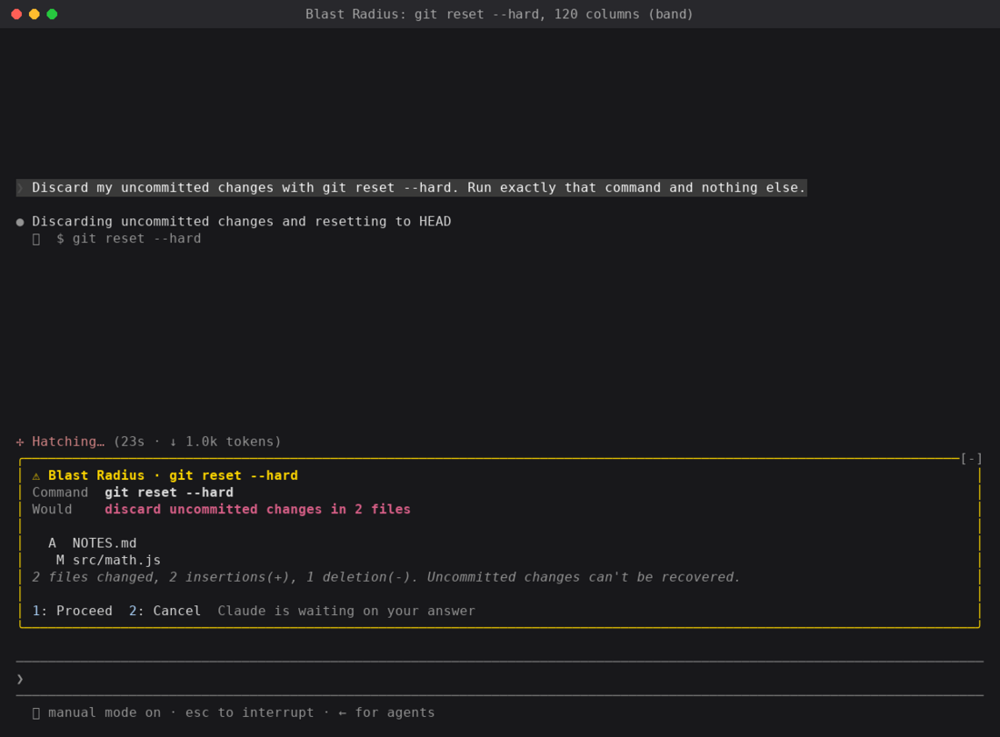
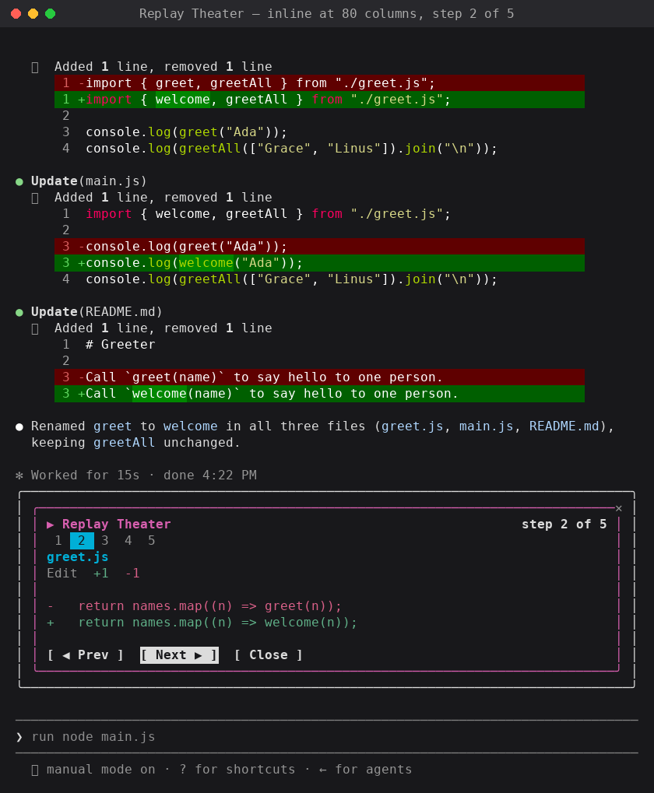

# Claude Code mods 入门（中英对照）

> **原文标题：** Getting started with Claude Code mods
> **原文作者：** Addy Osmani（Anthropic 技术组成员，Member of Technical Staff）
> **原文链接：** https://claude.dev/blog/getting-started-with-claude-code-mods/
> **发布日期：** 2026-10-01
> **翻译模型：** GLM-5.3-Flash
> **评分：** ★★★☆☆ —— mods 官方入门教程：从空文件夹写出第一个 mod，API 讲解系统、全程可跟做；但属入门向，无深度实战与实证内容
> **排版：** 每段英文原文在前，中文翻译紧随其后。术语保留英文原文并附中文释义。默认收录正文主体；原文 9 段演示视频未收录（见文末说明）。

---

A mod is a small JavaScript or TypeScript file that runs inside your Claude Code session. It can watch what's happening, change what Claude Code does, or draw its own UI, in the terminal or the desktop app. You don't need to learn the API to try one. Run `claude`, then describe the mod you want. Allow hot reload when it asks, and the mod shows up when the turn ends.

mod（模组）是一个运行在你 Claude Code 会话内部的小型 JavaScript 或 TypeScript 文件。它可以观察正在发生的事、改变 Claude Code 的行为，或者绘制自己的 UI——在终端里，也可以在桌面应用里。试用一个 mod 并不需要先学 API：运行 `claude`，描述你想要的 mod，在它询问时允许热重载（hot reload），一轮对话结束时 mod 就会出现。

Claude Code already lets you change a lot about how it behaves: settings, permission rules, slash commands, skills and a status line. Mods go further: they can rewrite or replace what Claude Code does, and draw custom UI. Under the hood, mods are hooks that ship inside plugins, and each one sees every event in your session as it happens.

Claude Code 本身已允许你大量改变它的行为方式：settings（设置）、permission rules（权限规则）、slash commands（斜杠命令）、skills（技能）和 status line（状态栏）。Mods 走得更远：它们可以重写或替换 Claude Code 的行为，还能绘制自定义 UI。底层来看，mod 是随 plugin（插件）一起分发的 hooks（钩子），每一个都能实时看到会话中发生的每个事件。

That makes mods a way to fit Claude Code to how you work. You can add a readout you check all the time, put a guard in front of the commands that make you nervous, or build a review view for how you like to read changes.

这让 mod 成为把 Claude Code 调校成你工作方式的一种手段。你可以加一个自己总会看的读数显示，给那些让你心里发慌的命令加一道守卫（guard），或者按你喜欢的读法做一个变更审阅视图。

This guide builds one mod from an empty folder, **Token Weather**, a live forecast of the context window drawn above the prompt. It's about 80 lines. Then it tours two larger mods, **Blast Radius** and **Replay Theater**, to show what else the API can do.

本指南从一个空文件夹开始构建一个 mod——**Token Weather**（令牌天气），绘制在提示词上方、关于上下文窗口（context window）占用度的实时预报。它只有约 80 行。随后参观两个更大的 mod——**Blast Radius**（爆炸半径）和 **Replay Theater**（回放剧场）——看看这套 API 还能做什么。

**Claude Code 2.1.287 or later.** Mods are on by default, so there's nothing to turn on. The API can change between releases. Each time Claude Code loads a mod, it writes the type declarations for your build into the mod's `.claude-plugin/types/` folder, and those are the authority for your version.

**需要 Claude Code 2.1.287 或更高版本。** Mods 默认开启，无需任何设置。API 可能随版本而变。每次 Claude Code 加载一个 mod，都会把与你所用构建对应的类型声明（type declarations）写入 mod 的 `.claude-plugin/types/` 文件夹——那才是你这个版本的权威参考。

## mod 的工作原理（How a mod works）

A mod is a Claude Code plugin whose behavior lives in a JavaScript or TypeScript module:

mod 是一个 Claude Code 插件，其行为放在一个 JavaScript 或 TypeScript 模块（module）里：

- The folder is a normal plugin, with a `.claude-plugin/plugin.json` manifest.
- `hooks/hooks.json` names one module under `modules`.
- The module exports `register(on, options)`. Inside it, `on(event, matcher?, hook)` adds a hook.

- 这个文件夹就是一个普通插件，带有 `.claude-plugin/plugin.json` 清单（manifest）。
- `hooks/hooks.json` 在 `modules` 下指名一个模块。
- 该模块导出 `register(on, options)`。在其内部，`on(event, matcher?, hook)` 用于添加一个 hook。

Every hook has the same shape:

每个 hook 都是同一个形状：

```javascript
on("tool.call", { tool: "Bash" }, async ($, e, next) => {
  // $    the mods API: ui, session, state, store, fs, process, clock, http, tool, command, model, ...
  // e    this event's input, as plain data
  // next passes e to the other plugins and then to Claude Code's own behavior
  return next(e);
});
```

Hooks form a chain, like middleware. Yours runs, `next(e)` hands the event to the next plugin, and at the bottom Claude Code does what it would have done anyway. A hook can do one of three things:

Hook 们组成一条链，类似中间件（middleware）。你的 hook 先运行，`next(e)` 把事件交给下一个插件，链条尽头 Claude Code 照常做它本来要做的事。一个 hook 可以做三件事之一：

*Figure: An event passes through your hook, then other plugins, then Claude Code. Each calls next(e) to pass it on, and the result flows back. A hook that answers returns without calling next.*

*图：事件依次穿过你的 hook、其他插件，再到 Claude Code。每一环都调用 next(e) 把事件往下传，结果再沿链返回。选择"回答"的 hook 不调用 next，直接返回自己的结果。*

| Move        | How                                            | Example                                                 |
| ----------- | ---------------------------------------------- | ------------------------------------------------------- |
| **Observe** | `const r = await next(e); /* look */ return r` | Record every file edit. Take a reading after each turn. |
| **Rewrite** | `return next({ ...e, command: safer })`        | Change what the rest of the chain sees.                 |
| **Answer**  | `return { deny: "…" }` without calling `next`  | Refuse a tool call. Serve a command or a tool yourself. |

| 动作 | 做法 | 示例 |
| --- | --- | --- |
| **观察（Observe）** | `const r = await next(e); /* 看一眼 */ return r` | 记录每一次文件编辑；每轮结束后读一次数。 |
| **改写（Rewrite）** | `return next({ ...e, command: safer })` | 改变链条下游看到的内容。 |
| **回答（Answer）** | `return { deny: "…" }`，不调用 `next` | 拒绝一个工具调用；自己来响应某个命令或工具。 |

The events cover tool calls, the prompt as submitted, turns starting and finishing, the session starting and ending, slash commands, and `ui.render`: every piece of the interface as it's drawn. The module runs in a sandbox of its own, with no DOM and no Node, so everything outside it goes through `$`.

事件覆盖工具调用、提交的提示词、轮次（turn）的开始与结束、会话的开始与结束、斜杠命令，以及 `ui.render`——界面被绘制的每一块。模块运行在它自己的沙箱（sandbox）里，没有 DOM 也没有 Node，所以外部世界的一切都要通过 `$` 来触达。

**How this differs from settings hooks.** A settings hook runs a shell command for each event and passes JSON over stdin and stdout. A mod is loaded once and stays in the session. It can keep state, draw UI that updates as events happen, and call back into Claude Code: open a pane, run a process, register a slash command, or register a tool the model can call.

**这与 settings hooks（settings.json 里配置的钩子）有何不同。** settings hook 对每个事件运行一条 shell 命令，通过 stdin/stdout 传递 JSON。mod 则只加载一次并驻留在会话中：它可以保存状态、绘制随事件实时更新的 UI，还能回呼（call back into）Claude Code——打开一个 pane（面板）、运行一个进程、注册一个斜杠命令，或者注册一个模型可以调用的工具。

**Claude Code uses them itself.** Some of Claude Code's own features are built as mods, including AGENTS.md support and the `/diff` pane beside the conversation. Their source, with tests, is in the public [anthropics/claude-code](https://github.com/anthropics/claude-code) repository under `mods/`, so you can read how the team builds them.

**Claude Code 自己也在用。** Claude Code 的一些自带功能就是用 mod 搭建的，包括 AGENTS.md 支持和对话旁边的 `/diff` 面板。它们的源码（连同测试）就在公开的 [anthropics/claude-code](https://github.com/anthropics/claude-code) 仓库的 `mods/` 目录下，你可以读一读团队是怎么写 mod 的。

## 构建你的第一个 mod：Token Weather（Build your first mod: Token Weather）

Token Weather reads how full the context window is after each turn and draws one line above the prompt: a weather icon, the percentage, the tokens used out of the window, a small chart of recent turns, and how much the last turn added.

Token Weather 在每轮结束后读取上下文窗口的占用程度，并在提示词上方画出一行内容：一个天气图标、百分比、已用 token 占窗口的比例、最近几轮的小图表，以及上一轮新增了多少。

| Used       | Forecast       |
| ---------- | -------------- |
| under 25%  | ☀ Clear        |
| 25–49%     | ☁ Cloudy       |
| 50–74%     | ☂ Showers      |
| 75–89%     | ☇ Storm        |
| 90% and up | ↯ Compact soon |

| 占用 | 预报 |
| --- | --- |
| 低于 25% | ☀ Clear（晴） |
| 25–49% | ☁ Cloudy（多云） |
| 50–74% | ☂ Showers（阵雨） |
| 75–89% | ☇ Storm（暴风雨） |
| 90% 及以上 | ↯ Compact soon（即将压缩） |

Here it is in a real session. Each turn reads more files, and the band fills from ☀ Clear to ☂ Showers to ☇ Storm:

下面是真实会话中的效果。每一轮读取更多文件，条带（band）从 ☀ Clear 渐渐变成 ☂ Showers，再到 ☇ Storm：

### 捷径：让 Claude 替你写（The shortcut: let Claude build it）

You can skip the six steps. Claude Code knows how to write mods, so you can describe the one you want and let it do the work. Start a session with `claude` and paste the prompt below:

你可以跳过后面六个步骤。Claude Code 自己知道怎么写 mod，所以你只需描述你想要的那个，让它动手。用 `claude` 开启一个会话，粘贴下面这段提示词：

```text
Make me a Claude Code mod called token-weather: a live forecast of my context window, shown in the band above the prompt.

What it should show, on one line:
- A weather icon and word for how full the context window is: under 25% ☀ Clear (yellow), 25–49% ☁ Cloudy (cyan), 50–74% ☂ Showers (blue), 75–89% ☇ Storm (magenta), 90% and up ↯ Compact soon (red).
- The percentage used, then the tokens used out of the window, like "134.4k / 200k".
- A small chart of the last 12 turns, drawn with ▁▂▃▄▅▆▇█.
- How much the last turn added, like "▲ +98.3k last turn".

It should update after every turn.
```

> **中文参考（实际使用建议保留英文原词）：**
> 帮我做一个叫 token-weather 的 Claude Code mod：我上下文窗口的实时预报，显示在提示词上方的条带里。
> 它应该在一行内显示：
> - 一个天气图标和词语，表示上下文窗口的占用程度：低于 25% ☀ Clear（黄色），25–49% ☁ Cloudy（青色），50–74% ☂ Showers（蓝色），75–89% ☇ Storm（品红），90% 及以上 ↯ Compact soon（红色）。
> - 已用百分比，以及已用 token 占窗口的比例，如 "134.4k / 200k"。
> - 用 ▁▂▃▄▅▆▇█ 绘制最近 12 轮的小图表。
> - 上一轮新增了多少，如 "▲ +98.3k last turn"。
> 它应该在每一轮结束后更新。

Claude asks once whether to turn on hot reloading for the session. Allow it, and the band appears above the prompt when Claude's turn ends. From then on, every change reloads in place, so you can keep asking for tweaks ("make Storm start at 70%", "add the dollar cost at the end") and watch the band change. The mod loads only in this session, and its folder is cleaned up later, so to keep it, copy the folder out and install it like any plugin (Step 6).

Claude 会询问一次是否为本会话开启热重载。允许它，Claude 这轮结束时条带就会出现在提示词上方。从那时起，每一处改动都会原地重载，你可以不断提出微调（"让 Storm 从 70% 开始"、"在末尾加上美元成本"），看着条带随之变化。这个 mod 只在本会话加载，其文件夹稍后会被清理；想保留的话，把文件夹拷出来，像安装普通插件那样安装它（见第 6 步）。

Notice that the prompt only describes what you want to see. You don't need to know the API to write one. Claude Code's built-in guide for writing mods covers the how: where to keep state so it survives a reload, how to check the plugin with `claude plugin validate`, and which events to hook. Change the "What it should show" lines and it's your mod, not ours.

注意，这段提示词只描述了你想看到什么。写一个 mod 并不需要懂 API。Claude Code 内置的 mod 编写指南负责讲清"怎么做"：状态存在哪里才能在重载后存活、如何用 `claude plugin validate` 检查插件、该挂钩哪些事件。把"What it should show"那几行改掉，它就是你的 mod，而不是我们的。

If you'd rather see how it's put together first, or want to check what Claude wrote, read on.

如果你想先看清它是怎么拼起来的，或者想检查 Claude 写了什么，请继续往下读。

### 第 1 步：创建文件夹（Step 1: Create the folder）

Check that your Claude Code is new enough:

先确认你的 Claude Code 版本够新：

```shell
claude --version   # 2.1.287 or later
```

（注释含义：2.1.287 或更高版本。）

Create this layout:

创建这样的目录结构：

```text
token-weather/
├── .claude-plugin/
│   ├── plugin.json
│   └── types/            (written by Claude Code when it loads the mod)
├── hooks/
│   ├── hooks.json
│   └── token-weather.mjs
├── types/
│   └── index.d.ts        (added in step 3)
└── tests/
    └── token-weather.test.ts   (added in step 5)
```

（括号注释：`types/` 由 Claude Code 加载 mod 时写入；`index.d.ts` 在第 3 步添加；`token-weather.test.ts` 在第 5 步添加。）

`.claude-plugin/plugin.json` is a standard plugin manifest:

`.claude-plugin/plugin.json` 是一份标准的插件清单：

```json
{
  "name": "token-weather",
  "version": "0.1.0",
  "description": "A live forecast of the context window, drawn above the prompt.",
  "author": { "name": "You" }
}
```

`hooks/hooks.json` points at the module. A mod has exactly one:

`hooks/hooks.json` 指向那个模块。一个 mod 有且只有一个模块：

```json
{
  "modules": ["./token-weather.mjs"]
}
```

### 第 2 步：画点什么（Step 2: Draw something）

The band directly above the prompt is a component called `AbovePrompt`. Claude Code draws nothing there itself, so it's a good first target. Hook its `ui.render` event and return a tree of elements:

紧贴提示词上方的条带是一个叫 `AbovePrompt` 的组件（component）。Claude Code 自己在那里什么都不画，所以它是很好的第一个目标。挂钩它的 `ui.render` 事件，返回一棵元素树：

```javascript
// hooks/token-weather.mjs
export function register(on) {
  on("ui.render", { component: "AbovePrompt" }, ($, e, next) => {
    const { Box, Text } = $.ui.resolve(e);
    return Box({
      paddingX: 1,
      children: [Text({ color: "yellow", bold: true, children: "☀  Clear skies" })],
    });
  });
}
```

The elements aren't globals. `$.ui.resolve(e)` returns the constructors for the surface being drawn, because each surface Claude Code draws on supports a slightly different set. JSX works too, with `h` as the factory.

这些元素并不是全局变量。`$.ui.resolve(e)` 返回当前绘制表面（surface）对应的构造器，因为 Claude Code 绘制的每种表面支持的元素集合略有不同。也可以用 JSX，工厂函数是 `h`。

Start a session with the plugin loaded:

加载插件并启动会话：

```shell
claude --plugin-dir ./token-weather
```

"☀ Clear skies" appears above the prompt. Keep the session open. The folder is watched, so every save reloads the module in place, with no restart. That quick feedback loop is most of what makes mods fun to write.

"☀ Clear skies" 出现在提示词上方。保持会话开着。这个文件夹是被监听的，每次保存都会原地重载模块，无需重启。这种快速反馈循环正是写 mod 好玩的主要原因。

**Tip:** Once you know the shape, describe the next mod to Claude the way the shortcut does. It writes the plugin to a folder that hot-reloads in the same session.

**提示：** 一旦你熟悉了这个形状，下一个 mod 就可以像"捷径"一节那样直接描述给 Claude。它会把你描述的插件写进一个在同一会话内热重载的文件夹。

### 第 3 步：读取真实数字并保存在 `$.state` 中（Step 3: Read real numbers and keep them in `$.state`）

`$.session.usage()` returns the same figures as the status line. `context.tokens` is the input the last response was answered over, `context.window` is the model's window, and `context.percent` is one over the other. The call is free: it only sends a token-count request if you ask for a `breakdown`.

`$.session.usage()` 返回与状态栏相同的数字。`context.tokens` 是上一条回复所基于的输入量，`context.window` 是模型的窗口大小，`context.percent` 是两者的比值。这个调用是免费的：只有你要求 `breakdown`（细分）时它才会额外发送一次 token 计数请求。

Take a reading when the session starts and after every turn:

在会话开始时和每轮结束后各读一次数：

```javascript
on("session.start", async ($, e, next) => {
  const result = await next(e);
  await takeReading($);
  return result;
});

on("turn.complete", async ($, e, next) => {
  const result = await next(e);
  if (!e.agentId) {
    await takeReading($); // main-loop turns only, not subagents
  }
  return result;
});
```

（代码注释含义：只统计主循环轮次，不含 subagent。）

Both hooks call `next(e)` first and then observe. Neither one changes what happens.

两个 hook 都先调用 `next(e)` 再观察，谁也不改变原本会发生的事。

**Where to keep the readings.** A module-level `let readings = []` looks like the obvious choice, but a hot reload is a fresh load: `register` runs again, `session.start` fires again, and module variables start over. Put the history in `$.state` instead. It holds named values in the host for the whole session, and they survive reloads.

**读数存在哪里。** 模块级的 `let readings = []` 看似显然之选，但热重载就是一次全新加载：`register` 重新运行、`session.start` 重新触发、模块变量从头再来。应该把历史放进 `$.state`——它把具名值保存在宿主（host）里，贯穿整个会话，重载也不会丢。

```javascript
// Held by the host, so the history survives a hot reload of this file.
const readings = { plugin: "token-weather", key: "readings" };

async function takeReading($) {
  const { context } = await $.session.usage();
  if (!context?.window) return;
  const tokens = context.tokens ?? 0;
  const percent = context.percent ?? Math.round((tokens / context.window) * 100);
  const { value: history = [] } = await $.state.get(readings);
  await $.state.set(readings, [...history, { tokens, window: context.window, percent }].slice(-HISTORY));
}
```

（代码注释含义：由宿主持有，因此这份历史能在本文件热重载后存活。）

A state value is declared in the plugin's **type contract**, which is a small `.d.ts` file the manifest points to. Add `types/index.d.ts`:

状态值要声明在插件的**类型契约（type contract）**里——清单所指向的一个很小的 `.d.ts` 文件。添加 `types/index.d.ts`：

```typescript
export type TokenWeatherReading = { tokens: number; window: number; percent: number };

declare module "claude-code" {
  interface PluginState {
    "token-weather": { readings: TokenWeatherReading[] };
  }
}
```

Then add `"types": "./types/index.d.ts"` to `plugin.json`. If you skip this step, `claude plugin validate` stops you with an error that names the fix: `token-weather.readings is not declared: the manifest's types contract must name it in interface PluginState { … }`.

然后在 `plugin.json` 里加上 `"types": "./types/index.d.ts"`。如果跳过这一步，`claude plugin validate` 会拦下你，报错信息直接给出修法：`token-weather.readings is not declared: the manifest's types contract must name it in interface PluginState { … }`（readings 未在清单的类型契约中声明）。

In return, you get redraws for free. A `$.state.get` made while a render hook runs subscribes that drawing, so every later `$.state.set` redraws the band. You never call `$.ui.invalidate`.

作为回报，你免费获得重绘。渲染 hook 运行期间发出的 `$.state.get` 会订阅这次绘制，此后每次 `$.state.set` 都会重绘条带。你永远不需要手动调用 `$.ui.invalidate`。

### 第 4 步：绘制预报（Step 4: Draw the forecast）

Here is the whole module:

整个模块如下：

```javascript
// Token Weather: a live forecast of the context window, above the prompt.

const HISTORY = 12;
const BARS = "▁▂▃▄▅▆▇█";
const FORECAST = [
  { upTo: 25, icon: "☀", word: "Clear", color: "yellow" },
  { upTo: 50, icon: "☁", word: "Cloudy", color: "cyan" },
  { upTo: 75, icon: "☂", word: "Showers", color: "blue" },
  { upTo: 90, icon: "☇", word: "Storm", color: "magenta" },
  { upTo: Infinity, icon: "↯", word: "Compact soon", color: "red" },
];

// Held by the host, so the history survives a hot reload of this file.
const readings = { plugin: "token-weather", key: "readings" };

export function register(on) {
  on("session.start", async ($, e, next) => {
    const result = await next(e);
    await takeReading($);
    return result;
  });

  on("turn.complete", async ($, e, next) => {
    const result = await next(e);
    if (!e.agentId) {
      await takeReading($); // main-loop turns only, not subagents
    }
    return result;
  });

  on("ui.render", { component: "AbovePrompt" }, async ($, e, next) => {
    const { value: history = [] } = await $.state.get(readings);
    if (e.props.hasSurvey || history.length === 0) {
      return next(e);
    }
    const { Box, Text } = $.ui.resolve(e);
    return band(Box, Text, history, e.props.bodyColumns);
  });
}

async function takeReading($) {
  const { context } = await $.session.usage();
  if (!context?.window) return;
  const tokens = context.tokens ?? 0;
  const percent = context.percent ?? Math.round((tokens / context.window) * 100);
  const { value: history = [] } = await $.state.get(readings);
  await $.state.set(readings, [...history, { tokens, window: context.window, percent }].slice(-HISTORY));
}

function band(Box, Text, history, columns) {
  const now = history[history.length - 1];
  const f = FORECAST.find((b) => now.percent < b.upTo);
  const parts = [
    Text({ color: f.color, bold: true, children: `${f.icon}  ${f.word}` }),
    Text({ children: `  ${now.percent}% of context` }),
    Text({ dimColor: true, children: `  ${short(now.tokens)} / ${short(now.window)}` }),
  ];
  if (columns >= 60) {
    parts.push(Text({ dimColor: true, children: "   last turns " }));
    parts.push(Text({ color: f.color, children: sparkline(history) }));
    if (history.length > 1) {
      parts.push(Text({ dimColor: true, children: trend(history) }));
    }
  }
  return Box({ flexDirection: "row", paddingX: 1, children: parts });
}

function sparkline(history) {
  const top = Math.max(...history.map((r) => r.tokens), 1);
  return history.map((r) => BARS[Math.floor((r.tokens / top) * (BARS.length - 1))]).join("");
}

function trend(history) {
  const delta = history[history.length - 1].tokens - history[history.length - 2].tokens;
  if (delta === 0) return "  steady";
  return delta > 0 ? `  ▲ +${short(delta)} last turn` : `  ▼ ${short(-delta)} last turn`;
}

function short(n) {
  if (n >= 1_000_000) return `${+(n / 1_000_000).toFixed(1)}M`;
  if (n >= 1_000) return `${+(n / 1_000).toFixed(1)}k`;
  return String(n);
}
```

Three details are worth copying into your own mods:

有三个细节值得抄进你自己的 mod：

- **The component's props are on `e.props`.** `hasSurvey` tells you a survey wants the band, so the hook yields to it with `next(e)`. `bodyColumns` is the band's real width, which is narrower than the terminal while a pane is docked beside the transcript. Size the tree to it. Only `e.component`, `e.surface`, `e.requestId` and `e.viewport` sit at the top level of `e`.
- **Pass when you have nothing to draw.** Returning `next(e)` gives the band back to Claude Code and to other mods.
- **Use single-width symbols, not emoji.** ☀ ☁ ☂ ☇ ↯ line up in every terminal font.

- **组件的 props 挂在 `e.props` 上。** `hasSurvey` 告诉你一份调查问卷想要这个条带，此时 hook 应以 `next(e)` 让位。`bodyColumns` 是条带的实际宽度——当面板停靠在对话记录旁边时，它比终端更窄。元素树要按它来定尺寸。只有 `e.component`、`e.surface`、`e.requestId` 和 `e.viewport` 位于 `e` 的顶层。
- **没东西可画时就放行。** 返回 `next(e)` 把条带还给 Claude Code 和其他 mod。
- **用单宽符号，别用 emoji。** ☀ ☁ ☂ ☇ ↯ 在任何终端字体里都能对齐。

Save the file and the running session picks it up. After a few turns that read large files, the band moves from Clear to Showers to Storm, as in the recording at the start of this section.

保存文件，运行中的会话立刻接住它。经过几轮读取大文件的对话，条带就会从 Clear 走到 Showers 再到 Storm，正如本节开头的演示录像那样。

### 第 5 步：校验与测试（Step 5: Validate and test）

`claude plugin validate` reads the manifest and the module's source the same way Claude Code will, and reports what the module hooks and calls:

`claude plugin validate` 会用与 Claude Code 相同的方式读取清单和模块源码，并报告模块挂钩了什么、调用了什么：

```text
$ claude plugin validate ./token-weather
  > types ./types/index.d.ts declares state: token-weather.readings
  > ./token-weather.mjs hooks: session.start, turn.complete, ui.render{component=AbovePrompt}
  > ./token-weather.mjs calls: $.session.usage (via takeReading), $.state.get, $.state.set (via takeReading), $.ui.resolve
  > ./token-weather.mjs state writes: token-weather.readings
  > ./token-weather.mjs state reads: token-weather.readings
√ Validation passed
```

（输出含义：类型声明文件声明了哪些状态、模块挂钩了哪些事件、调用了哪些 API、对哪些状态做了读写；最后一行 √ Validation passed 表示校验通过。）

`claude plugin test` runs the plugin's `*.test.ts` files against the real Claude Code runtime. Hooks that a test registers with `on` run *after* the mod in the chain and stub what Claude Code would answer, so you control exactly what `$.session.usage()` returns:

`claude plugin test` 在真实的 Claude Code 运行时上运行插件的 `*.test.ts` 文件。测试用 `on` 注册的 hook 在链条中排在该 mod *之后*运行，替身（stub）掉 Claude Code 本会作出的回答，因此你能精确控制 `$.session.usage()` 返回什么：

```typescript
// tests/token-weather.test.ts
import { describe, expect, test } from "claude-code/testing";

describe("token-weather", () => {
  test("the band follows the context window", async ($, on) => {
    // Hooks registered here run after the mod and stub what Claude Code would answer.
    let tokens = 36_100;
    on("session.start", ($, e) => ({ cwd: e.cwd }));
    on("session.usage", () => ({
      value: { startedAt: 0, rateLimits: [], context: { tokens, window: 200_000, percent: Math.round(tokens / 2_000) } },
    }));
    on("turn.complete", () => ({ text: "" }));

    await $.session.start({ surface: "terminal", isInteractive: true, cwd: "/work" } as any);
    const ui = await $.ui.mount({
      plugin: "token-weather",
      surface: "terminal",
      component: "AbovePrompt",
      props: { hasSurvey: false, isWorking: false, maxRows: 10, bodyColumns: 120 },
    } as any);
    expect(await ui.find({ type: "Text", text: /Clear/ })).toBeDefined();

    tokens = 134_400;
    await $.turn.complete({ reason: "answer", answer: "ok", durationMs: 1 } as any);
    expect(await ui.find({ type: "Text", text: /Showers/ })).toBeDefined();
    expect(await ui.find({ type: "Text", text: /67% of context/ })).toBeDefined();
    expect(await ui.find({ type: "Text", text: /▲ \+98\.3k last turn/ })).toBeDefined();
    await ui.unmount();
  });
});
```

（代码注释含义：这里注册的 hook 在该 mod 之后运行，替身掉 Claude Code 本会作出的回答。）

```text
$ claude plugin test ./token-weather
(pass) token-weather > the band follows the context window
 1 pass
 0 fail
```

（输出含义：1 项通过，0 项失败。）

The test also checks the redraw behavior from step 3. The band updates after `turn.complete` without the mod ever asking for a redraw.

这个测试还顺带验证了第 3 步的重绘行为：条带在 `turn.complete` 之后自动更新，mod 从未主动请求过重绘。

### 第 6 步：分享出去（Step 6: Share it）

A mod is a plugin, so it ships the same way. Put it in a marketplace, which can be as simple as a folder with a `.claude-plugin/marketplace.json`:

mod 就是插件，所以发布方式也相同。把它放进一个 marketplace（插件市场），它可以简单到只是一个带 `.claude-plugin/marketplace.json` 的文件夹：

```json
{
  "name": "my-mods",
  "owner": { "name": "You" },
  "plugins": [{ "name": "token-weather", "source": "./token-weather" }]
}
```

```shell
claude plugin marketplace add ./my-mods
claude plugin install token-weather@my-mods --scope user
```

## 分享你的 mod（Sharing your mod）

A mod is a Claude Code plugin, so you share it the same way as any other plugin, and there's nothing new to learn. Put the mod in a GitHub repo with a marketplace file and that repo becomes your marketplace. Anyone can install from it, and you can update it with a normal push.

mod 是 Claude Code 插件，分享方式与其他插件完全一样，没有新东西要学。把 mod 放进一个带 marketplace 文件的 GitHub 仓库，这个仓库就成了你的 marketplace。任何人都能从它安装，你也可以用一次普通的 push 来更新。

Installing takes three commands in Claude Code:

安装只需在 Claude Code 里三条命令：

```text
/plugin marketplace add your-org/my-mods
/plugin install token-weather@my-mods
/reload-plugins
```

The mod starts when you reload. If it doesn't show up, restart Claude Code.

重载后 mod 即启动。如果没出现，重启 Claude Code。

A mod is code that runs inside Claude Code on your machine, with the same access Claude Code has, and it's written by its publisher, not Anthropic. So install mods the way you'd install a package: read the repo first and only install from people you trust. Nothing gets installed until you run the command.

mod 是在你机器上的 Claude Code 内部运行的代码，拥有与 Claude Code 相同的访问权限，而且它由发布者编写，而非 Anthropic。所以要像安装软件包那样对待 mod 的安装：先读仓库，只从你信任的人那里安装。在你亲自运行命令之前，什么都不会被安装。

The Claude directory accepts plugins that include mods, and you can submit yours at [claude.ai/directory/manage](https://claude.ai/directory/manage), so people can find it without a link from you.

Claude directory（插件目录）也接受包含 mod 的插件，你可以在 [claude.ai/directory/manage](https://claude.ai/directory/manage) 提交自己的作品，让别人不靠你发的链接也能找到它。

## 再看两个 mod（Two more mods）

Token Weather only watches and draws. The next two mods step into events, open panes, and take input.

Token Weather 只观察和绘制。接下来两个 mod 会介入事件、打开面板、接收输入。

### Blast Radius：在危险命令运行前看清它会改什么（Blast Radius: see what a risky command would change before it runs）

When Claude calls Bash with `rm -rf`, `git reset --hard`, `git clean`, a force push, or a database migration, Blast Radius holds the call. It works out what the command would touch and opens a pane with **Proceed** and **Cancel**. Press `2` and Claude gets a refusal with the reason. Press `1` and the command runs as written.

当 Claude 用 Bash 调用 `rm -rf`、`git reset --hard`、`git clean`、强推（force push）或数据库迁移时，Blast Radius 会扣下这次调用。它算出命令会碰到什么，打开一个带 **Proceed**（继续）和 **Cancel**（取消）按钮的面板。按 `2`，Claude 会收到附带理由的拒绝；按 `1`，命令照原样执行。

It uses three hooks: `tool.call` on Bash, and `ui.render` on `Pane` and on `AbovePrompt`. The core of it is the "answer" move from the table above:

它用了三个 hook：Bash 上的 `tool.call`，以及 `Pane` 和 `AbovePrompt` 上的 `ui.render`。其核心正是上表中的"回答"（Answer）动作：

```javascript
on("tool.call", { tool: "Bash" }, async ($, e, next) => {
  const risk = classify(String(e.command ?? ""));
  if (risk === null) return next(e);                 // everything else runs as normal

  const report = await measure($, risk, await $.session.cwd());  // git status, git clean -n, du, ...
  held = { command: e.command, risk, report, decision: null };
  const opened = await $.ui.open({ id: "blast-radius", title: "Blast Radius", focus: true });
  if (!opened.isPlaced) held.where = "band";         // too narrow for a pane: draw above the prompt

  while (held.decision === null && !next.signal.aborted) {
    await $.process.run(["sleep", "0.25"]);          // time inside $ calls doesn't count against the hook's time limit
  }
  if (held.decision === "proceed") return next(e);   // let it run
  return { deny: `Blast Radius held this command: the user pressed Cancel. It would have: ${report.summary}.` };
});
```

（代码注释含义，自上而下：其余一切照常运行；即 git status、git clean -n、du 等；面板空间不够时改画在提示词上方；在 `$` 调用内部等待的时间不计入 hook 的时限；放行让它运行。）

What it teaches:

它教给我们：

- **`$.process.run` for dry runs.** The report comes from the tools' own commands: `git status --porcelain`, `git clean -n`, `git log HEAD..origin/main`, `showmigrations`. Arguments go in as an argv array, so nothing in a path is run as shell code.
- **Holding a call.** A hook gets 10 seconds of its own time per dispatch, but time spent waiting inside a `$` call doesn't count. The loop waits on short `sleep` processes until a button's `onPress` sets the decision, and it gives up when `next.signal` aborts (you pressed Esc).
- **Buttons with hotkeys.** `Button({ label: "Proceed", hotkey: "1", onPress })` works by click, by Tab and Enter, or by the digit.
- **Degrade to the band.** The terminal docks a pane beside the transcript when it's wide enough. When `$.ui.open` answers `isPlaced: false`, the same report is drawn above the prompt:

- **用 `$.process.run` 做演练（dry run）。** 报告来自各工具自己的命令：`git status --porcelain`、`git clean -n`、`git log HEAD..origin/main`、`showmigrations`。参数以 argv 数组传入，路径中的任何内容都不会被当作 shell 代码执行。
- **扣下一次调用。** 每次派发（dispatch）中 hook 有 10 秒属于自己的时间，但在 `$` 调用内部等待的时间不算在内。这个循环靠短暂的 `sleep` 进程等待，直到某个按钮的 `onPress` 设定决定；当 `next.signal` 中止（你按了 Esc）时它就放弃。
- **带快捷键的按钮。** `Button({ label: "Proceed", hotkey: "1", onPress })` 可以点击、Tab 加 Enter、或按数字键触发。
- **降级到条带。** 终端在足够宽时会把面板停靠在对话记录旁。当 `$.ui.open` 返回 `isPlaced: false` 时，同样的报告改画在提示词上方：



**Figure 1:** A terminal with no side pane: a yellow-bordered box above the prompt shows the command, the two files with uncommitted changes it would discard, and numbered Proceed and Cancel choices. At 120 columns, Blast Radius draws its report for `git reset --hard` in the band above the prompt.
**图 1：** 无侧边面板的终端：提示词上方的黄色边框盒子里显示命令、它将丢弃未提交改动的那两个文件，以及带编号的 Proceed / Cancel 选项。在 120 列宽度下，Blast Radius 把 `git reset --hard` 的报告画在提示词上方的条带里。

It's a safety net, not a permission system. It reads the command text, so `$(…)`, aliases and scripts that call `rm` get past it. Use permission rules for a hard block.

它是安全网，不是权限系统。它读的是命令文本，所以 `$(…)`、别名（alias）和调用 `rm` 的脚本都能绕过它。要硬性封锁请用 permission rules（权限规则）。

### Replay Theater：逐条回放上一轮的编辑（Replay Theater: step through the last turn's edits）

While a turn runs, Replay Theater records every Edit and Write call: the file, plus the text before and after. When the turn ends, a hint appears above the prompt. Press `r` (or type `/replay`) and a pane walks through the edits one diff at a time, with a strip of numbered steps and **Prev**, **Next** and **Close** buttons.

一轮对话进行时，Replay Theater 记录每一次 Edit 和 Write 调用：文件名，加上改动前后的文本。轮次结束时，提示词上方出现一条提示。按 `r`（或输入 `/replay`），一个面板会逐个 diff 地回放这些编辑，带一排编号步骤和 **Prev**（上一个）、**Next**（下一个）、**Close**（关闭）按钮。

It never blocks or changes an edit. It observes:

它从不阻塞、也不修改任何编辑，只是观察：

```javascript
on("tool.call", async ($, e, next) => {
  if (EDIT_TOOLS.has(e.tool)) state.pending.push(...(await stepsFor($, e)));  // old/new text → diff
  return next(e);                                                              // the edit runs untouched
});

on("turn.start", ($, e, next) => { if (!e.agentId) state.pending = []; return next(e); });

on("turn.complete", async ($, e, next) => {
  const r = await next(e);
  if (!e.agentId && state.pending.length) state.replay = state.pending;       // one replay per turn
  return r;
});

on("session.start", async ($, e, next) => {
  const r = await next(e);
  await $.command.register({ name: "replay", description: "Step through the last turn's file edits" });
  return r;
});
on("command.run", { command: "replay" }, async ($, e) => ({ text: (await openReplay($)) ? "Replaying" : "No edits" }));
```

（代码注释含义，自上而下：把旧/新文本转成 diff；编辑原样放行、不做任何改动；每轮只生成一次回放。）

What it teaches:

它教给我们：

- **Pairing events.** `turn.start` and `turn.complete` bracket the edits into one replay per turn, and `e.agentId` keeps subagent turns out of the grouping.
- **Registering a slash command.** `$.command.register` in `session.start`, then answer it on `command.run`.
- **Reading files.** For a Write, `$.fs.read` gets the old contents just before the write lands, so the diff is real.
- **Placement is the surface's job.** In fullscreen the pane docks on the right. At 80 columns it opens inline above the prompt. The mod draws the same tree either way.

- **配对事件。** `turn.start` 和 `turn.complete` 把编辑圈进每轮一次的回放，`e.agentId` 把 subagent 的轮次排除在分组之外。
- **注册斜杠命令。** 在 `session.start` 里 `$.command.register`，然后在 `command.run` 上响应它。
- **读取文件。** 对 Write 而言，`$.fs.read` 恰在写入落定之前取得旧内容，所以 diff 是真实的。
- **摆放位置由表面决定。** 全屏时面板停靠在右侧；80 列时内联打开在提示词上方。两种情况下 mod 画的都是同一棵元素树。



**Figure 2:** A tall terminal window with a magenta-bordered box above the prompt: a numbered step strip, the file `greet.js`, a one-line diff, and Prev, Next and Close buttons. Replay Theater at 80 columns, drawn inline above the prompt.
**图 2：** 一个高终端窗口，提示词上方是品红色边框的盒子：编号步骤条、文件 `greet.js`、一行 diff，以及 Prev / Next / Close 按钮。Replay Theater 在 80 列宽度下内联绘制在提示词上方。

## 值得坚持的四个习惯（Four habits worth keeping）

- **Lean on the types Claude Code writes for you.** Each time it loads your mod, Claude Code writes the declarations for your build into the mod's `.claude-plugin/types/` folder, so your editor and `tsc -p` work with no extra step. They're the reference for every event, every method on `$` and every element's props.
- **Read props from `e.props`.** `hasSurvey`, `bodyColumns` and the rest live there, not on `e` itself.
- **Plan for hot reload.** Every save runs `register` and `session.start` again, so keep data in `$.state`, not in module variables.
- **When a drawing doesn't show, read the log.** Run `claude --debug` and look for a line saying a hook returned a tree that does not validate.

- **依靠 Claude Code 替你写好的类型。** 每次加载你的 mod，Claude Code 都会把与你所用构建对应的声明写进 mod 的 `.claude-plugin/types/` 文件夹，编辑器和 `tsc -p` 无需任何额外步骤即可工作。它们是每个事件、`$` 的每个方法、每个元素 props 的权威参考。
- **从 `e.props` 读取 props。** `hasSurvey`、`bodyColumns` 以及其余 props 都住在那里，而不在 `e` 本身上。
- **为热重载做规划。** 每次保存都会重新运行 `register` 和 `session.start`，所以把数据放在 `$.state` 里，别放在模块变量里。
- **画不出来时去读日志。** 运行 `claude --debug`，找那一行说某个 hook 返回了未通过校验的元素树。

## 你会写什么 mod？（What will you mod?）

The three mods here came from one question each: *how full is my context?*, *what is this command about to delete?*, and *what did Claude just change?* Your questions will be different, and that's the point. Some ideas to start from:

这里的三个 mod 各来自一个问题：*我的上下文有多满？*、*这条命令即将删除什么？*、*Claude 刚刚改了什么？* 你的问题会不一样——这正是关键所在。一些可起步的点子：

- A cost or rate-limit meter from `$.session.usage()`, as a status line with `$.ui.status`
- A `prompt.submit` hook that adds your team's conventions to every prompt
- A pane that lists the files Claude read this session, as a live map of what it has seen
- A focus timer that sends a toast with `$.ui.toast` when a long turn finishes
- A `tool.call` guard tuned to your stack, such as production kubectl contexts or `terraform apply`

- 用 `$.session.usage()` 做一个成本或限额仪表，借 `$.ui.status` 做成状态栏
- 一个 `prompt.submit` hook，把你们团队的规范追加进每条提示词
- 一个面板，列出 Claude 本次会话读过的文件，作为它"看过什么"的实时地图
- 一个专注计时器，长轮次结束时用 `$.ui.toast` 发一条 toast 通知
- 一个针对你技术栈定制的 `tool.call` 守卫，比如生产环境的 kubectl 上下文或 `terraform apply`

### 分享你的作品（Share what you build）

Made a mod you now use every day? Post it on X or LinkedIn with a GIF or a screenshot of it running, so other developers can see what's possible. Put the plugin in a marketplace (Sharing your mod) and link to it, so anyone who likes it can install it with three commands.

做出了一个你现在每天都在用的 mod？把它发到 X 或 LinkedIn，配一张运行中的 GIF 或截图，让其他开发者看到可能性。把插件放进一个 marketplace（见"分享你的 mod"一节）并附上链接，喜欢的人用三条命令就能装上。

---

> **未收录内容说明：** 原文含 9 段演示视频（Terminal 与 Desktop 两个版本的 mp4 录像，展示 Token Weather 条带随上下文填充的变化、Blast Radius 拦截 `rm -rf build` 并列出将删除的 9 个文件、Replay Theater 逐 diff 回放重命名 greet 为 welcome 的过程），未收录本文，请至[原文链接](https://claude.dev/blog/getting-started-with-claude-code-mods/)观看。正文其余部分已完整收录。
