# Transformer 电路的数学框架（中英对照）

> 原文标题：A Mathematical Framework for Transformer Circuits
> 原文链接：https://transformer-circuits.pub/2021/framework/index.html
> 研究页：https://www.anthropic.com/research/a-mathematical-framework-for-transformer-circuits
> 原文作者：Nelson Elhage, Neel Nanda, Catherine Olsson 等（Anthropic）
> 发布日期：2021-12-22
> **翻译模型：** GLM-5.3-Flash
> **评分：** ★★★★☆（4/5，高价值）—— transformer circuits 研究纲领的数学奠基：残差流、QK/OV 电路分解与三种注意力头 composition 定义了机制可解释性的基本语言，但结论限于不超过两层的 attention-only 模型
> 排版：每段英文原文在前，中文翻译紧随其后。本文收录正文主体；原页附录（Additional Intuition、Notation、Technical Details、复现评论、致谢与引用信息等）未收录。

---

Transformer language models are an emerging technology that is gaining increasingly broad real-world use, for example in systems like GPT-3 , LaMDA , Codex , Meena , Gopher , and similar models.  However, as these models scale, their open-endedness and high capacity creates an increasing scope for unexpected and sometimes harmful behaviors.  Even years after a large model is trained, both creators and users routinely discover model capabilities – including problematic behaviors – they were previously unaware of.

Transformer 语言模型是一项新兴技术，正在获得越来越广泛的现实应用，例如 GPT-3、LaMDA、Codex、Meena、Gopher 等系统与类似模型。然而，随着这些模型不断规模化，其开放性与高容量为意料之外、有时甚至有害的行为创造了越来越大的空间。即使在大模型训练完成数年之后，开发者与用户仍会经常发现自己此前未曾察觉的模型能力——包括一些有问题的行为。

One avenue for addressing these issues is mechanistic interpretability, attempting to reverse engineer the detailed computations performed by transformers, similar to how a programmer might try to reverse engineer complicated binaries into human-readable source code.  If this were possible, it could potentially provide a more systematic approach to explaining current safety problems, identifying new ones, and perhaps even anticipating the safety problems of powerful future models that have not yet been built.  A previous project, the [Distill Circuits thread](https://distill.pub/2020/circuits/) , has attempted to reverse engineer vision models, but so far there hasn’t been a comparable project for transformers or language models.

解决这些问题的一条路径是机制可解释性（mechanistic interpretability）：它试图对 transformer 所执行的详细计算进行逆向工程，就像程序员试图把复杂的二进制文件逆向还原为人类可读的源代码一样。如果这可行，它或许能提供一种更系统的方法，来解释当前的安全问题、识别新的安全问题，甚至预见那些尚未被构建出来的强大未来模型的安全问题。此前的一个项目——[Distill Circuits 系列](https://distill.pub/2020/circuits/)——曾尝试对视觉模型进行逆向工程，但迄今为止，对 transformer 或语言模型还没有可与之类比的项目。

In this paper, we attempt to take initial, very preliminary steps towards reverse-engineering transformers.  Given the incredible complexity and size of modern language models, we have found it most fruitful to start with the simplest possible models and work our way up from there.  Our aim is to discover simple algorithmic patterns, motifs, or frameworks that can subsequently be applied to larger and more complex models.  Specifically, in this paper we will study transformers with two layers or less which have only attention blocks – this is in contrast to a large, modern transformer like GPT-3, which has 96 layers and alternates attention blocks with MLP blocks.

在本文中，我们尝试朝着对 transformer 进行逆向工程迈出最初的、非常初步的几步。鉴于现代语言模型惊人的复杂度与规模，我们发现最富有成效的做法是从尽可能简单的模型入手，再逐步向上推进。我们的目标是发现简单的算法模式、母题（motif）或框架，使其随后能够应用于更大、更复杂的模型。具体而言，本文将研究层数不超过两层、只含注意力块（attention block）的 transformer——这与 GPT-3 这样拥有 96 层、注意力块与 MLP 块交替出现的大型现代 transformer 形成对比。

We find that by conceptualizing the operation of transformers in a new but mathematically equivalent way, we are able to make sense of these small models and gain significant understanding of how they operate internally.  Of particular note, we find that specific attention heads that we term “induction heads” can explain in-context learning in these small models, and that these heads only develop in models with at least two attention layers.  We also go through some examples of these heads operating in action on specific data.

我们发现，通过一种新颖但在数学上等价的方式来概念化 transformer 的运行，我们能够理解这些小模型，并对它们的内部运作获得实质性认识。特别值得注意的是，我们发现一类我们称之为“归纳头（induction head）”的特定注意力头可以解释这些小模型中的上下文学习（in-context learning），而且这类头只在至少有两个注意力层的模型中出现。我们还在具体数据上展示了这些头实际运作的一些例子。

We don’t attempt to apply to our insights to larger models in this first paper, but in a [forthcoming paper](https://transformer-circuits.pub/2022/in-context-learning-and-induction-heads/index.html), we will show that both our mathematical framework for understanding transformers, and the concept of induction heads, continues to be at least partially relevant for much larger and more realistic models – though we remain a very long way from being able to fully reverse engineer such models.

在这第一篇论文中，我们不试图把洞见应用于更大的模型，但在一篇[即将发表的论文](https://transformer-circuits.pub/2022/in-context-learning-and-induction-heads/index.html)中，我们将展示：我们理解 transformer 的数学框架以及归纳头的概念，对于大得多、也更接近实际的模型仍至少部分适用——尽管要完全对这类模型进行逆向工程，我们仍有很长的路要走。

## 结果概要（Summary of Results）

#### 逆向工程结果（Reverse Engineering Results）

To explore the challenge of reverse engineering transformers, we reverse engineer several toy, attention-only models. In doing so we find:

为了探索对 transformer 进行逆向工程这一挑战，我们对几个玩具级的仅注意力（attention-only）模型进行了逆向工程。在此过程中我们发现：

- Zero layer transformers model bigram statistics. The bigram table can be accessed directly from the weights.

- 零层 transformer 建模二元模型（bigram）统计。二元模型表可以直接从权重中读出。

- One layer attention-only transformers are an ensemble of bigram and “skip-trigram” (sequences of the form "A… B C") models. The bigram and skip-trigram tables can be accessed directly from the weights, without running the model. These skip-trigrams can be surprisingly expressive. This includes implementing a kind of very simple in-context learning.

- 单层仅注意力 transformer 是一个由二元模型与若干“跳三元组（skip-trigram）”（形如 "A… B C" 的序列）模型组成的集成。二元模型表与跳三元组表可以直接从权重中读出，而无需运行模型。这些跳三元组可能出人意料地富有表现力，其中包括实现一种非常简单的上下文学习。

- Two layer attention-only transformers can implement much more complex algorithms using compositions of attention heads. These compositional algorithms can also be detected directly from the weights. Notably, two layer models use attention head composition to create “induction heads”, a very general in-context learning algorithm.[^1]

- 两层仅注意力 transformer 可以利用注意力头的组合（composition）实现复杂得多的算法。这些组合算法同样可以直接从权重中检测出来。值得注意的是，两层模型利用注意力头组合创造了“归纳头”——一种非常通用的上下文学习算法。[^1]

- One layer and two layer attention-only transformers use very different algorithms to perform in-context learning. Two layer attention heads use qualitatively more sophisticated inference-time algorithms — in particular, a special type of attention head we call an induction head — to perform in-context-learning, forming an important transition point that will be relevant for larger models.

- 单层与两层仅注意力 transformer 使用截然不同的算法来执行上下文学习。两层注意力头使用在质上更为复杂的推理期算法——尤其是我们称之为归纳头的一类特殊注意力头——来执行上下文学习，这构成了一个重要的转折点，并将与更大的模型相关。

#### 概念性要点（Conceptual Take-Aways）

We’ve found that many subtle details of the transformer architecture require us to approach reverse engineering it in a pretty different way from how the InceptionV1 Circuits work . We’ll unpack each of these points in the sections below, but for now we briefly summarize. We’ll also expand on a lot of the terminology we introduce here once we get to the appropriate sections. (To be clear, we don't intend to claim that any of these points are necessarily novel; many are implicitly or explicitly present in other papers.)

我们发现，transformer 架构的许多微妙细节要求我们以与 InceptionV1 Circuits 工作相当不同的方式来进行逆向工程。我们将在下文各节中逐一展开这些要点，这里先做简要总结。等到相应章节时，我们还会对这里引入的许多术语做进一步阐释。（需要说明的是，我们并不打算声称这些要点必然新颖；其中许多已在其他论文中或明或暗地出现过。）

- Attention heads can be understood as independent operations, each outputting a result which is added into the residual stream. Attention heads are often described in an alternate “concatenate and multiply” formulation for computational efficiency, but this is mathematically equivalent.

- 注意力头可以被理解为相互独立的运算，各自输出一个结果并加进残差流（residual stream）。出于计算效率的考虑，注意力头常用另一种“拼接再相乘”（concatenate and multiply）的表述来描述，但这在数学上是等价的。

- Attention-only models can be written as a sum of interpretable end-to-end functions mapping tokens to changes in logits. These functions correspond to “paths” through the model, and are linear if one freezes the attention patterns.

- 仅注意力模型可以写成若干可解释的端到端函数之和，这些函数把词元（token）映射为 logit 的变化。这些函数对应于穿过模型的“路径”，并且在冻结注意力模式时是线性的。

- Transformers have an enormous amount of linear structure. One can learn a lot simply by breaking apart sums and multiplying together chains of matrices.

- transformer 拥有大量的线性结构。仅仅通过把和式拆开、把矩阵链相乘，就能学到很多东西。

- Attention heads can be understood as having two largely independent computations: a QK (“query-key”) circuit which computes the attention pattern, and an OV (“output-value”) circuit which computes how each token affects the output if attended to.

- 注意力头可以被理解为包含两个大体独立的计算：一个计算注意力模式的 QK（“查询-键”，query-key）电路，以及一个计算“若被关注，每个词元会如何影响输出”的 OV（“输出-值”，output-value）电路。

- Key, query, and value vectors can be thought of as intermediate results in the computation of the low-rank matrices W_Q^TW_K and W_OW_V. It can be useful to describe transformers without reference to them.

- 键（key）、查询（query）和值（value）向量可以被看作计算低秩矩阵 W_Q^TW_K 与 W_OW_V 过程中的中间结果。在描述 transformer 时完全不提及它们，也可能很有用。

- Composition of attention heads greatly increases the expressivity of transformers. There are three different ways attention heads can compose, corresponding to keys, queries, and values. Key and query composition are very different from value composition.

- 注意力头的组合极大提升了 transformer 的表现力。注意力头有三种不同的组合方式，分别对应于键、查询和值。键组合与查询组合同值组合非常不同。

- All components of a transformer (the token embedding, attention heads, MLP layers, and unembedding) communicate with each other by reading and writing to different subspaces of the residual stream. Rather than analyze the residual stream vectors, it can be helpful to decompose the residual stream into all these different communication channels, corresponding to paths through the model.

- transformer 的所有组件（词元嵌入（token embedding）、注意力头、MLP 层与反嵌入（unembedding））都通过读写残差流的不同子空间来相互通信。与其直接分析残差流向量，不如把残差流分解为所有这些不同的通信信道——它们对应于穿过模型的各条路径——这往往更有帮助。
## Transformer 概览（Transformer Overview）

Before we attempt to reverse engineer transformers, it's helpful to briefly review the high-level structure of transformers and describe how we think about them.

在尝试对 transformer 进行逆向工程之前，先简要回顾 transformer 的高层结构，并描述我们如何看待它们，会很有帮助。

In many cases, we've found it helpful to reframe transformers in equivalent, but non-standard ways. Mechanistic interpretability requires us to break models down into human-interpretable pieces. An important first step is finding the representation which makes it easiest to reason about the model. In modern deep learning, there is — for good reason! — a lot of emphasis on computational efficiency, and our mathematical descriptions of models often mirror decisions in how one would write efficient code to run the model. But when there are many equivalent ways to represent the same computation, it is likely that the most human-interpretable representation and the most computationally efficient representation will be different.

在许多情况下，我们发现用等价但非标准的方式重新表述 transformer 很有帮助。机制可解释性要求我们把模型分解成人类可解释的部件，而重要的第一步，是找到最便于对模型进行推理的表示。在现代深度学习中，人们——理所当然地！——非常强调计算效率，我们对模型的数学描述往往也反映了“如何写出高效代码来运行模型”的种种决策。但当同一计算存在多种等价表示时，对人类最可解释的表示与计算上最高效的表示很可能并不相同。

Reviewing transformers will also let us align on terminology, which can sometimes vary. We'll also introduce some notation in the process, but since this notation is used across many sections, we provide a detailed description of all notation in the notation appendix as a concise reference for readers.

回顾 transformer 也有助于我们就术语达成一致——这些术语有时存在分歧。在此过程中我们还会引入一些记号；由于这些记号在许多章节中都会用到，我们在记号附录中对全部记号做了详细说明，作为读者的简明参考。

### 模型简化（Model Simplifications）

To demonstrate the ideas in this paper in their cleanest form, we focus on "toy transformers" with some simplifications.

为了以最简洁的形式展示本文的思想，我们把焦点放在经过若干简化的“玩具 transformer”上。

In most parts of this paper, we will make a very substantive change: we focus on “attention-only” transformers, which don't have MLP layers. This is a very dramatic simplification of the transformer architecture. We're partly motivated by the fact that circuits with attention heads present new challenges not faced by the Distill circuits work, and considering them in isolation allows us to give an especially elegant treatment of those issues. But we've also simply had much less success in understanding MLP layers so far; in normal transformers with both attention and MLP layers there are many circuits mediated primarily by attention heads which we can study, some of which seem very important, but the MLP portions have been much harder to get traction on. This is a major weakness of our work that we plan to focus on addressing in the future. Despite this, we will have some discussion of transformers with MLP layers in later sections.

在本文的大部分内容中，我们将做一个非常实质性的改变：我们聚焦于没有 MLP 层的“仅注意力”transformer。这是对 transformer 架构相当激进的简化。我们这样做，部分是因为含注意力头的电路带来了 Distill circuits 工作未曾面对的新挑战，而把它们单独拿出来考量，能让我们对这些问题给出格外优雅的处理。但也因为迄今为止我们在理解 MLP 层方面取得的进展要少得多；在同时含注意力层与 MLP 层的常规 transformer 中，有许多主要由注意力头介导的电路可供研究，其中一些看起来非常重要，但 MLP 部分一直很难取得进展。这是我们工作的一个重大弱点，我们计划在未来重点解决。尽管如此，在后面的章节中我们仍会讨论一些带 MLP 层的 transformer。

We also make several changes that we consider to be more superficial and are mostly made for clarity and simplicity. We do not consider biases, but a model with biases can always be simulated without them by folding them into the weights and creating a dimension that is always one. Additionally, biases in attention-only transformers mostly multiply out to functionally be biases on the logits. We also ignore layer normalization. It adds a fair amount of complexity to consider explicitly, and up to a variable scaling, layer norm can be merged into adjacent weights. We also expect that, modulo some implementational annoyances, layer norm could be substituted for batch normalization (which can fully be folded into adjacent parameters).

我们还做了几处我们认为更表面、主要是为了清晰与简单的改动。我们不考虑偏置（bias），但带偏置的模型总可以把偏置折叠进权重、并创建一个恒为 1 的维度，从而在没有偏置的情况下模拟。此外，在仅注意力 transformer 中，偏置在乘开之后在功能上大多成为作用于 logit 的偏置。我们还忽略 LayerNorm：显式地考虑它会增加不少复杂度，而且在不计一个可变缩放的情况下，LayerNorm 可以合并进相邻权重。我们还预期，除去一些实现上的麻烦，LayerNorm 可以用批归一化（batch normalization，它可以被完全折叠进相邻参数）来替代。

### 高层架构（High-Level Architecture）

There are several variants of transformer language models. We focus on autoregressive, decoder-only transformer language models, such as GPT-3. (The original transformer paper had a special encoder-decoder structure to support translation, but many modern language models don't include this.)

transformer 语言模型有若干变体。我们聚焦于自回归的、仅解码器（decoder-only）的 transformer 语言模型，例如 GPT-3。（最初的 transformer 论文为支持翻译采用了特殊的编码器-解码器结构，但许多现代语言模型并不包含这一结构。）

A transformer starts with a token embedding, followed by a series of “residual blocks”, and finally a token unembedding. Each residual block consists of an attention layer, followed by an MLP layer. Both the attention and MLP layers each “read” their input from the residual stream (by performing a linear projection), and then “write” their result to the residual stream by adding a linear projection back in. Each attention layer consists of multiple heads, which operate in parallel.

transformer 以词元嵌入开始，随后是一系列“残差块（residual block）”，最后是词元反嵌入。每个残差块由一个注意力层加一个 MLP 层组成。注意力层与 MLP 层都从残差流中“读取”各自的输入（通过执行线性投影），然后通过把一个线性投影加回去，将结果“写入”残差流。每个注意力层由多个并行运行的注意力头组成。

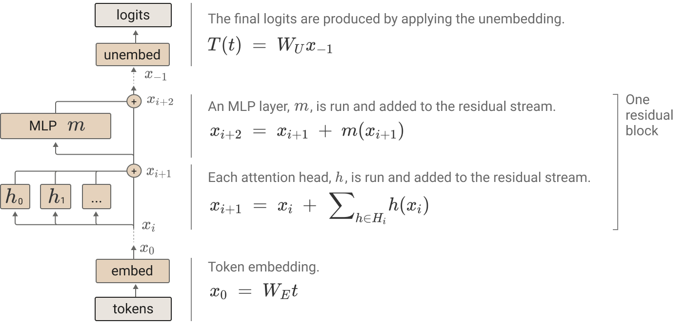

### 虚拟权重与作为通信信道的残差流（Virtual Weights and the Residual Stream as a Communication Channel）

One of the main features of the high level architecture of a transformer is that each layer adds its results into what we call the “residual stream.”[^2] The residual stream is simply the sum of the output of all the previous layers and the original embedding. We generally think of the residual stream as a communication channel, since it doesn't do any processing itself and all layers communicate through it.

transformer 高层架构的一个主要特征是：每一层都把它的结果加进我们所谓的“残差流”。[^2] 残差流就是之前所有层的输出与原始嵌入的总和。我们通常把残差流看作一个通信信道，因为它本身不做任何处理，而所有层都通过它进行通信。

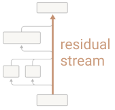

The residual stream has a deeply linear structure.[^3] Every layer performs an arbitrary linear transformation to "read in" information from the residual stream at the start,[^4] and performs another arbitrary linear transformation before adding to "write" its output back into the residual stream. This linear, additive structure of the residual stream has a lot of important implications. One basic consequence is that the residual stream doesn't have a "privileged basis"; we could rotate it by rotating all the matrices interacting with it, without changing model behavior.

残差流具有深刻的线性结构。[^3] 每一层在开始时执行某个任意线性变换，以从残差流中“读入”信息，[^4] 并在相加之前执行另一个任意线性变换，把输出“写回”残差流。残差流这种线性、可加的结构有许多重要含义。一个基本推论是：残差流并没有“特权基底（privileged basis）”；我们可以通过旋转所有与它交互的矩阵来旋转它，而不改变模型行为。

#### 虚拟权重（Virtual Weights）

An especially useful consequence of the residual stream being linear is that one can think of implicit "virtual weights" directly connecting any pair of layers (even those separated by many other layers), by multiplying out their interactions through the residual stream. These virtual weights are the product of the output weights of one layer with the input weights[^5] of another (ie. W_{I}^2W_{O}^1), and describe the extent to which a later layer reads in the information written by a previous layer.

残差流是线性的，由此得到的一个特别有用的推论是：可以把各层经由残差流发生的交互乘开，从而设想出直接连接任意两层（哪怕中间隔着许多层）的隐式“虚拟权重（virtual weights）”。这些虚拟权重是一层的输出权重与另一层的输入权重[^5] 的乘积（即 W_{I}^2W_{O}^1），描述了后一层在多大程度上读入了前一层写出的信息。

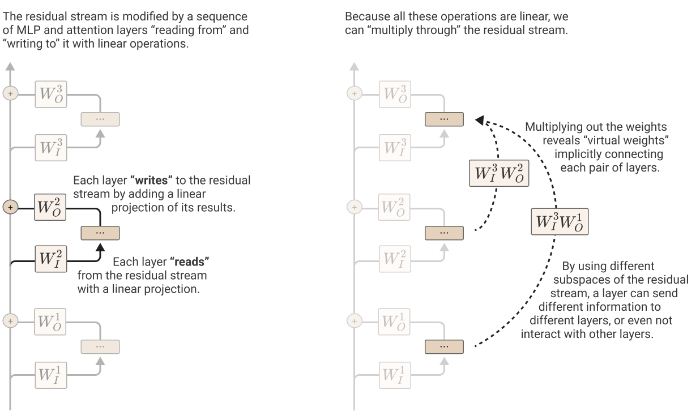

#### 子空间与残差流带宽（Subspaces and Residual Stream Bandwidth）

The residual stream is a high-dimensional vector space. In small models, it may be hundreds of dimensions; in large models it can go into the tens of thousands. This means that layers can send different information to different layers by storing it in different subspaces. This is especially important in the case of attention heads, since every individual head operates on comparatively small subspaces (often 64 or 128 dimensions), and can very easily write to completely disjoint subspaces and not interact.

残差流是一个高维向量空间。在小模型中它可能是数百维；在大模型中则可达数万维。这意味着各层可以把不同的信息存储在不同的子空间中，从而把不同信息发送给不同的层。这一点对注意力头尤其重要，因为每个单独的注意力头都在相对较小的子空间（通常是 64 或 128 维）上运作，很容易写到完全不相交的子空间中而互不干扰。

Once added, information persists in a subspace unless another layer actively deletes it. From this perspective, dimensions of the residual stream become something like "memory" or "bandwidth". The original token embeddings, as well as the unembeddings, mostly interact with a relatively small fraction of the dimensions.[^6] This leaves most dimensions "free" for other layers to store information in.

信息一旦被加入，就会持续存在于某个子空间中，除非另一层主动删除它。从这个视角看，残差流的维度就有点像“内存”或“带宽”。原始词元嵌入以及反嵌入大多只与相对较小的一部分维度交互。[^6] 这就为其他层留出了大多数“空闲”维度来存储信息。

It seems like we should expect residual stream bandwidth to be in very high demand! There are generally far more "computational dimensions" (such as neurons and attention head result dimensions) than the residual stream has dimensions to move information. Just a single MLP layer typically has four times more neurons than the residual stream has dimensions. So, for example, at layer 25 of a 50 layer transformer, the residual stream has 100 times more neurons as it has dimensions before it, trying to communicate with 100 times as many neurons as it has dimensions after it, somehow communicating in superposition! We call tensors like this "bottleneck activations" and expect them to be unusually challenging to interpret. (This is a major reason why we will try to pull apart the different streams of communication happening through the residual stream apart in terms of virtual weights, rather than studying it directly.)

看来我们应当预期残差流带宽会被高度争用！“计算维度”（如神经元与注意力头结果维度）通常远远多于残差流用来搬运信息的维度。仅仅一个 MLP 层的神经元数量通常就是残差流维度的四倍。举例来说，在一个 50 层 transformer 的第 25 层处，残差流前面有 100 倍于其维度的神经元，后面又要与 100 倍于其维度的神经元通信，以某种方式在叠加（superposition）中通信！我们把这类张量称为“瓶颈激活（bottleneck activations）”，并预期它们会异常难以解释。（这正是我们为什么倾向于用虚拟权重来拆分经由残差流发生的各路通信，而不是直接研究残差流本身的一个重要原因。）

Perhaps because of this high demand on residual stream bandwidth, we've seen hints that some MLP neurons and attention heads may perform a kind of "memory management" role, clearing residual stream dimensions set by other layers by reading in information and writing out the negative version.[^7]

或许正因为残差流带宽如此紧缺，我们已看到一些迹象，表明某些 MLP 神经元和注意力头可能扮演某种“内存管理”的角色：通过读入信息并写出其负版本，来清除其他层写入残差流维度的内容。[^7]

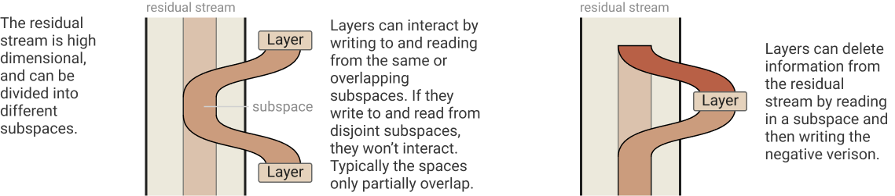
### 注意力头是独立且可加的（Attention Heads are Independent and Additive）

As seen above, we think of transformer attention layers as several completely independent attention heads h\in H which operate completely in parallel and each add their output back into the residual stream. But this isn't how transformer layers are typically presented, and it may not be obvious they're equivalent.

如上所述，我们把 transformer 的注意力层看作若干完全独立的注意力头 h\in H，它们完全并行地运作，各自把输出加回残差流。但这并不是 transformer 层通常的呈现方式，二者的等价性也可能并不显而易见。

In the original Vaswani et al. paper on transformers , the output of an attention layer is described by stacking the result vectors r^{h_1}, r^{h_2},..., and then multiplying by an output matrix W_O^H. Let's split W_O^H into equal size blocks for each head [W_O^{h_1}, W_O^{h_2}...]. Then we observe that:

在 Vaswani 等人关于 transformer 的原始论文中，注意力层的输出被描述为：把结果向量 r^{h_1}, r^{h_2},... 堆叠起来，然后乘以输出矩阵 W_O^H。我们把 W_O^H 按头拆成等大的块 [W_O^{h_1}, W_O^{h_2}...]。于是可以观察到：

W_O^H \left[\begin{matrix}r^{h_1}\\r^{h_2}\\... \end{matrix}\right] ~~=~~ \left[W_O^{h_1},~ W_O^{h_2},~ ... \right]\cdot\left[\begin{matrix}r^{h_1}\\r^{h_2}\\...\end{matrix}\right] ~~=~~ \sum_i W_O^{h_i} r^{h_i}

Revealing it to be equivalent to running heads independently, multiplying each by its own output matrix, and adding them into the residual stream. The concatenate definition is often preferred because it produces a larger and more compute efficient matrix multiply. But for understanding transformers theoretically, we prefer to think of them as independently additive.

这表明它与“让各头独立运行、各自乘以自己的输出矩阵、然后加进残差流”是等价的。拼接式定义常被优先采用，因为它产生更大、计算上更高效的矩阵乘法。但为了从理论上理解 transformer，我们更愿意把它们看作相互独立且可加的。

### 作为信息搬运的注意力头（Attention Heads as Information Movement）

But if attention heads act independently, what do they do? The fundamental action of attention heads is moving information. They read information from the residual stream of one token, and write it to the residual stream of another token. The main observation to take away from this section is that which tokens to move information from is completely separable from what information is “read” to be moved and how it is “written” to the destination.

但如果注意力头各自独立行动，它们究竟在做什么？注意力头的根本行动是搬运信息：它们从一个词元的残差流中读取信息，再写入另一个词元的残差流。本节要传达的主要观察是：从哪些词元搬运信息，与“读取”什么信息来搬运、以及如何把它“写入”目的地，是完全可分离的。

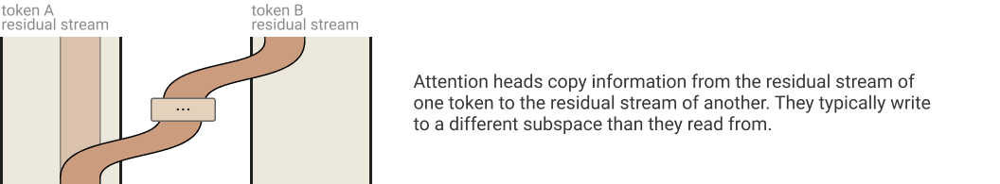

To see this, it’s helpful to write attention in a non-standard way. Given an attention pattern, computing the output of an attention head is typically described in three steps:

为了看清这一点，用一种非标准的方式写出注意力会很有帮助。给定一个注意力模式，计算注意力头的输出通常分三步描述：

1. Compute the value vector for each token from the residual stream (v_i = W_V x_i).

1. 从残差流为每个词元计算值向量（v_i = W_V x_i）。

1. Compute the “result vector” by linearly combining value vectors according to the attention pattern (r_i = \sum_j A_{i,j} v_j).

1. 根据注意力模式对值向量做线性组合，计算“结果向量”（r_i = \sum_j A_{i,j} v_j）。

1. Finally, compute the output vector of the head for each token (h(x)_i = W_O r_i).[^8]

1. 最后，为每个词元计算该头的输出向量（h(x)_i = W_O r_i）。[^8]

Each of these steps can be written as matrix multiply: why don’t we collapse them into a single step? If you think of x as a 2d matrix (consisting of a vector for each token), we’re multiplying it on different sides. W_V and W_O multiply the “vector per token” side, while A multiplies the “position” side. Tensors can offer us a much more natural language for describing this kind of map between matrices (if tensor product notation isn't familiar, we've included a short introduction in the notation appendix).  One piece of motivation that may be helpful is to note that we want to express linear maps from matrices to matrices: [n_\text{context},~ d_\text{model}] ~\to~ [n_\text{context},~ d_\text{model}]. Mathematicians call such linear maps "(2,2)-tensors" (they map two input dimensions to two output dimensions). And so tensors are the natural language for expressing this transformation.

这些步骤中的每一步都可以写成矩阵乘法——那为什么不把它们合并成一步？如果把 x 看作一个二维矩阵（每个词元对应一个向量），我们其实是在不同的侧面对它做乘法：W_V 和 W_O 乘在“每词元向量”那一侧，而 A 乘在“位置”那一侧。张量为描述这种矩阵之间的映射提供了一种自然得多的语言（如果不熟悉张量积记号，我们在记号附录中附了简短介绍）。一个可能有帮助的动机是：我们想要表达从矩阵到矩阵的线性映射 [n_\text{context},~ d_\text{model}] ~\to~ [n_\text{context},~ d_\text{model}]。数学家把这类线性映射称为“(2,2)-张量”（它们把两个输入维度映射到两个输出维度）。因此，张量是表达这种变换的自然语言。

Using tensor products, we can describe the process of applying attention as:

利用张量积，我们可以把应用注意力的过程描述为：

Applying the mixed product property and collapsing identities yields:

应用混合乘积性质并消去恒等项，得到：

What about the attention pattern? Typically, one computes the keys k_i = W_K x_i, computes the queries q_i = W_Q x_i and then computes the attention pattern from the dot products of each key and query vector A = \text{softmax}(q^T k). But we can do it all in one step without referring to keys and queries: A = \text{softmax}(x^T W_Q^T W_K x).

那注意力模式呢？通常的做法是：先计算键 k_i = W_K x_i，再计算查询 q_i = W_Q x_i，然后由每个键与查询向量的点积计算注意力模式 A = \text{softmax}(q^T k)。但我们完全可以一步到位、不提及键和查询：A = \text{softmax}(x^T W_Q^T W_K x)。

It's worth noting that although this formulation is mathematically equivalent, actually implementing attention this way (ie. multiplying by W_O W_V and W_Q^T W_K) would be horribly inefficient!

值得注意的是，尽管这种表述在数学上等价，但真按这种方式实现注意力（即乘以 W_O W_V 和 W_Q^T W_K）会是极其低效的！

#### 关于注意力头的若干观察（Observations about Attention Heads）

A major benefit of rewriting attention heads in this form is that it surfaces a lot of structure which may have previously been harder to observe:

以这种形式重写注意力头的一大好处是，它显露出了许多先前可能较难观察到的结构：

- Attention heads move information from the residual stream of one token to another.

- 注意力头把信息从一个词元的残差流移动到另一个词元的残差流。

- A corollary of this is that the residual stream vector space — which is often interpreted as a “contextual word embedding” — will generally have linear subspaces corresponding to information copied from other tokens and not directly about the present token.

- 由此得到的一个推论是：残差流向量空间——它常被解读为“上下文词嵌入”——通常会包含一些线性子空间，对应于从其他词元复制来的、与当前词元没有直接关系的信息。

- An attention head is really applying two linear operations, A and W_OW_V, which operate on different dimensions and act independently.

- 一个注意力头实际上是在应用两个线性操作 A 与 W_OW_V，它们作用于不同的维度并相互独立地起作用。

- A governs which token's information is moved from and to.

- A 决定从哪个词元搬运信息、搬到哪个词元。

- W_O W_V governs which information is read from the source token and how it is written to the destination token.[^9]

- W_O W_V 决定从源词元（source token）读取哪些信息，以及如何把这些信息写入目标词元（destination token）。[^9]

- A is the only non-linear part of this equation (being computed from a softmax). This means that if we fix the attention pattern, attention heads perform a linear operation. This also means that, without fixing A, attention heads are “half-linear” in some sense, since the per-token linear operation is constant.

- A 是这个等式中唯一的非线性部分（由 softmax 计算而来）。这意味着，如果固定注意力模式，注意力头执行的就是线性操作。这也意味着，在不固定 A 的情况下，注意力头在某种意义上是“半线性”的，因为逐词元的线性操作是恒定的。

- W_Q and W_K always operate together. They’re never independent. Similarly, W_O and W_V always operate together as well.

- W_Q 与 W_K 总是一起运作，从不独立；类似地，W_O 与 W_V 也总是一起运作。

- Although they’re parameterized as separate matrices, W_O W_V and W_Q^T W_K can always be thought of as individual, low-rank matrices.

- 尽管它们被参数化为分开的矩阵，W_O W_V 与 W_Q^T W_K 总可以被看作单独的低秩矩阵。

- Keys, queries and value vectors are, in some sense, superficial. They’re intermediary by-products of computing these low-rank matrices. One could easily reparametrize both factors of the low-rank matrices to create different vectors, but still function identically.

- 键、查询和值向量在某种意义上是表面的：它们是计算这些低秩矩阵过程中的中间副产品。人们可以轻易地对低秩矩阵的两个因子重新参数化，得到不同的向量，但功能完全相同。

- Because W_O W_V and W_Q W_K always operate together, we like to define variables representing these combined matrices, W_{OV} = W_O W_V and W_{QK} = W_Q^T W_K.

- 由于 W_O W_V 与 W_Q W_K 总是一起运作，我们喜欢定义表示这些组合矩阵的变量：W_{OV} = W_O W_V 和 W_{QK} = W_Q^T W_K。

- Products of attention heads behave much like attention heads themselves. By the distributive property, (A^{h_2}\otimes W_{OV}^{h_2}) \cdot (A^{h_1}\otimes W_{OV}^{h_1}) = (A^{h_2}A^{h_1})\otimes(W_{OV}^{h_2}W_{OV}^{h_1}). The result of this product can be seen as functionally equivalent to an attention head, with an attention pattern which is the composition of the two heads A^{h_2}A^{h_1} and an output-value matrix W_{OV}^{h_2}W_{OV}^{h_1}. We call these “virtual attention heads”, discussed in more depth later.

- 注意力头的乘积表现得很像注意力头本身。根据分配律，(A^{h_2}\otimes W_{OV}^{h_2}) \cdot (A^{h_1}\otimes W_{OV}^{h_1}) = (A^{h_2}A^{h_1})\otimes(W_{OV}^{h_2}W_{OV}^{h_1})。这个乘积的结果可以在功能上视为等价于一个注意力头：其注意力模式是两个头的组合 A^{h_2}A^{h_1}，其输出-值矩阵是 W_{OV}^{h_2}W_{OV}^{h_1}。我们把它们称为“虚拟注意力头（virtual attention head）”，后文会更深入讨论。
## 零层 Transformer（Zero-Layer Transformers）

Watch videos covering similar content to this section: [0 layer theory](https://www.youtube.com/watch?v=V3NQaDR3xI4&list=PLoyGOS2WIonajhAVqKUgEMNmeq3nEeM51&index=1)

观看与本节内容相近的视频：[0 layer theory](https://www.youtube.com/watch?v=V3NQaDR3xI4&list=PLoyGOS2WIonajhAVqKUgEMNmeq3nEeM51&index=1)

Before moving on to more complex models, it’s useful to briefly consider a “zero-layer” transformer. Such a model takes a token, embeds it, unembeds it to produce logits predicting the next token:

在转向更复杂的模型之前，有必要简要考察一下“零层” transformer。这样的模型接收一个词元，将其嵌入，再反嵌入，产生预测下一个词元的 logit：

T ~=~ W_U W_E

Because the model cannot move information from other tokens, we are simply predicting the next token from the present token. This means that the optimal behavior of W_U W_E is to approximate the bigram log-likelihood.[^10]

由于模型无法从其他词元搬运信息，它只是在从当前词元预测下一个词元。这意味着 W_U W_E 的最优行为是逼近二元模型对数似然（bigram log-likelihood）。[^10]

This is relevant to transformers more generally. Terms of the form W_U W_E will occur in the expanded form of equations for every transformer, corresponding to the “direct path” where a token embedding flows directly down the residual stream to the unembedding, without going through any layers. The only thing it can affect is the bigram log-likelihoods. Since other aspects of the model will predict parts of the bigram log-likelihood, it won’t exactly represent bigram statistics in larger models, but it does represent a kind of “residual”. In particular, the W_U W_E term seems to often help represent bigram statistics which aren’t described by more general grammatical rules, such as the fact that “Barack” is often followed by “Obama”. [^11]

这对更一般的 transformer 也有意义。形如 W_U W_E 的项会出现在每个 transformer 方程的展开式中，对应于词元嵌入不经任何层、直接沿残差流流到反嵌入的“直接路径”。它唯一能影响的就是二元模型对数似然。由于模型的其他方面会预测二元模型对数似然的一部分，它在更大的模型中并不会精确表示二元模型统计，但确实代表了一种“残差”。特别地，W_U W_E 项似乎常常有助于表示那些不被更一般的语法规则所描述的二元模型统计，比如 “Barack” 后面常跟着 “Obama” 这一事实。[^11]

## 单层仅注意力 Transformer（One-Layer Attention-Only Transformers）

Watch videos covering similar content to this section: [1 layer theory](https://www.youtube.com/watch?v=7crsHGsh3p8&list=PLoyGOS2WIonajhAVqKUgEMNmeq3nEeM51&index=3), [1 layer results](https://www.youtube.com/watch?v=ZBlHFFE-ng8&list=PLoyGOS2WIonajhAVqKUgEMNmeq3nEeM51&index=4).

观看与本节内容相近的视频：[1 layer theory](https://www.youtube.com/watch?v=7crsHGsh3p8&list=PLoyGOS2WIonajhAVqKUgEMNmeq3nEeM51&index=3)、[1 layer results](https://www.youtube.com/watch?v=ZBlHFFE-ng8&list=PLoyGOS2WIonajhAVqKUgEMNmeq3nEeM51&index=4)。

We claim that one-layer attention-only transformers can be understood as an ensemble of a bigram model and several "skip-trigram" models (affecting the probabilities of sequences "A… BC").[^12] Intuitively, this is because each attention head can selectively attend from the present token ("B") to a previous token ("A") and copy information to adjust the probability of possible next tokens ("C").

我们主张：单层仅注意力 transformer 可以理解为一个二元模型与若干“跳三元组”模型（影响形如 "A… BC" 的序列的概率）的集成。[^12] 直观地说，这是因为每个注意力头都可以选择性地从当前词元（"B"）关注到先前某个词元（"A"），并复制信息以调整可能的下一个词元（"C"）的概率。

The goal of this section is to rigorously show this correspondence, and demonstrate how to convert the raw weights of a transformer into interpretable tables of skip-trigram probability adjustments.

本节的目标是严格证明这种对应关系，并演示如何把 transformer 的原始权重转换成可解释的跳三元组概率调整表。

### 路径展开技巧（The Path Expansion Trick）

Recall that a one-layer attention-only transformer consists of a token embedding, followed by an attention layer (which independently applies attention heads), and finally an unembedding:

回顾一下，单层仅注意力 transformer 由一个词元嵌入、其后一个（独立应用各注意力头的）注意力层、以及最后的反嵌入组成：

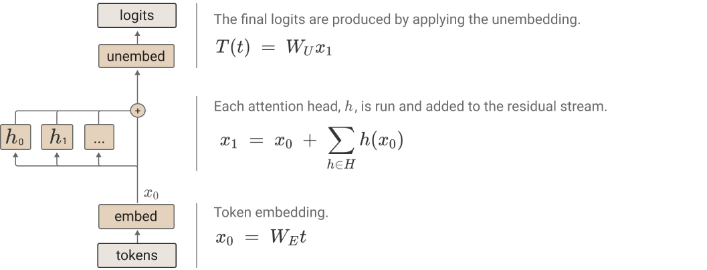

Using tensor notation and the alternative representation of attention heads we previously derived, we can represent the transformer as a product of three terms.

使用张量记号以及我们先前导出的注意力头替代表示，我们可以把这个 transformer 表示为三项的乘积。

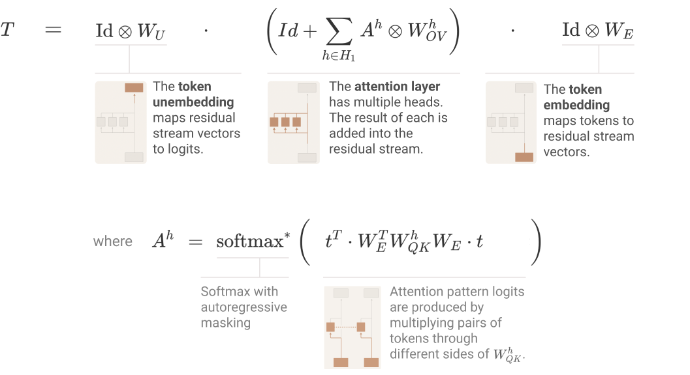

Our key trick is to simply expand the product. This transforms the product (where every term corresponds to a layer), into a sum where every term corresponds to an end-to-end path.

我们的关键技巧就是简单地把乘积展开。这把乘积（其中每一项对应一层）变成了一个和式，其中每一项对应一条端到端路径。

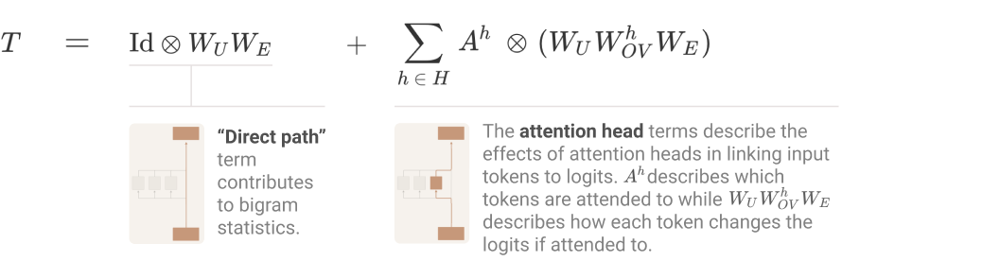

We claim each of these end-to-end path terms is tractable to understand, can be reasoned about independently, and additively combine to create model behavior.

我们主张：这些端到端路径项中的每一项都是易于理解的，可以独立推理，并且以可加的方式共同构成模型行为。

The direct path term, \text{Id} \otimes W_U W_E, also occurred when we looked at the zero-layer transformer. Because it doesn’t move information between positions (that's what \text{Id} \otimes … denotes!), the only thing it can contribute to is the bigram statistics, and it will fill in missing gaps that other terms don’t handle there.

直接路径项 \text{Id} \otimes W_U W_E 在考察零层 transformer 时也曾出现。因为它不在位置之间搬运信息（这正是 \text{Id} \otimes … 所表示的含义！），它唯一能贡献的是二元模型统计，并且会在那里填补其他项未能处理的空缺。

The more interesting terms are the attention head terms.

更有意思的是注意力头项。

### 把注意力头项拆分为查询-键电路与输出-值电路（Splitting Attention Head terms into Query-Key and Output-Value Circuits）

For each attention head h we have a term A^h \otimes (W_UW_{OV}^hW_E) where A^h= \text{softmax}\left( t^T \cdot W_E^T W_{QK}^h W_E \cdot t \right). How can we map these terms to model behavior? And while we’re at it, why do we get these particular products of matrices on our equations?

对每个注意力头 h，我们有项 A^h \otimes (W_UW_{OV}^hW_E)，其中 A^h= \text{softmax}\left( t^T \cdot W_E^T W_{QK}^h W_E \cdot t \right)。我们如何把这些项映射到模型行为上？顺便问一句，为什么方程里出现的恰好是这些特定的矩阵乘积？

The key thing to notice is that these terms consist of two separable operations, which are at their heart two [n_\text{vocab},~ n_\text{vocab}] matrices:

需要注意的关键是，这些项由两个可分离的操作组成，其核心是两个 [n_\text{vocab},~ n_\text{vocab}] 矩阵：

- W_E^T W_{QK}^h W_E — We call this matrix the "query-key (QK) circuit." It provides the attention score for every query and key token. That is, each entry describes how much a given query token "wants" to attend to a given key token.

- W_E^T W_{QK}^h W_E —— 我们称这个矩阵为“查询-键（QK）电路（query-key circuit）”。它为每一对查询词元与键词元给出注意力分数。也就是说，每个元素描述了给定的查询词元有多“想”关注给定的键词元。

- W_UW_{OV}^hW_E — We call this matrix the “Output-Value (OV) circuit.” It describes how a given token will affect the output logits if attended to.

- W_UW_{OV}^hW_E —— 我们称这个矩阵为“输出-值（OV）电路（output-value circuit）”。它描述了某个词元若被关注，将如何影响输出 logit。

To intuitively understand these products, it can be helpful to think of them as paths through the model, starting and ending at tokens. The QK circuit is formed by tracing the computation of a query and key vector up to their attention head, where they dot product to create a bilinear form. The OV circuit is created by tracing the path computing a value vector and continuing it through up to the logits.

要直观理解这些乘积，一个有用的办法是把它们看作穿过模型、起点和终点都在词元上的路径。QK 电路的成因是：追踪一个查询向量与一个键向量的计算，直到它们在注意力头处点积、形成一个双线性形式。OV 电路的成因则是：追踪计算值向量的路径，并一路延续到 logit。

The attention pattern is a function of both the source and destination token[^13], but once a destination token has decided how much to attend to a source token, the effect on the output is solely a function of that source token. That is, if multiple destination tokens attend to the same source token the same amount, then the source token will have the same effect on the logits for the predicted output token.

注意力模式同时是源词元与目标词元的函数[^13]，但一旦目标词元决定了对某个源词元关注多少，对输出的影响就只是该源词元的函数。也就是说，如果多个目标词元对同一源词元的关注程度相同，那么该源词元对被预测输出词元的 logit 的影响也相同。

#### OV 与 QK 的独立性：冻结注意力模式技巧（OV and QK Independence (The Freezing Attention Patterns Trick)）

Thinking of the OV and QK circuits separately can be very useful, since they're both individually functions we can understand (linear or bilinear functions operating on matrices we understand).

把 OV 电路与 QK 电路分开来思考可能非常有用，因为它们各自都是我们能理解的函数（作用在我们能理解的矩阵上的线性或双线性函数）。

But is it really principled to think about them independently? One thought experiment which might be helpful is to imagine running the model twice. The first time you collect the attention patterns of each head. This only depends on the QK circuit.[^14] The second time, you replace the attention patterns with the "frozen" attention patterns you collected the first time. This gives you a function where the logits are a linear function of the tokens! We find this a very powerful way to think about transformers.

但把它们分开来想真的有原则依据吗？一个或许有帮助的思想实验是：想象把模型运行两次。第一次，你收集每个头的注意力模式——这只依赖于 QK 电路。[^14] 第二次，你用第一次收集到的“冻结”注意力模式替换注意力模式。这样得到的函数中，logit 是词元的线性函数！我们发现这是思考 transformer 的一种非常有力的方式。

### 解释为跳三元组（Interpretation as Skip-Trigrams）

One of the core challenges of mechanistic interpretability is to make neural network parameters meaningful by contextualizing them (see discussion by Voss et al. in [Visualizing Weights](https://distill.pub/2020/circuits/visualizing-weights/) ). By multiplying out the OV and QK circuits, we've succeeded in doing this: the neural network parameters are now simple linear or bilinear functions on tokens. The QK circuit determines which "source" token the present "destination" token attends back to and copies information from, while the OV circuit describes what the resulting effect on the "out" predictions for the next token is. Together, the three tokens involved form a "skip-trigram" of the form [source]... [destination][out], and the "out" is modified.

机制可解释性的核心挑战之一，是通过语境化让神经网络参数变得有意义（参见 Voss 等人在 [Visualizing Weights](https://distill.pub/2020/circuits/visualizing-weights/) 中的讨论）。通过把 OV 电路与 QK 电路乘开，我们成功地做到了这一点：神经网络参数现在成了关于词元的简单线性或双线性函数。QK 电路决定当前的“目标”词元回头关注哪个“源”词元并从那里复制信息，而 OV 电路描述这对下一个词元的“输出”预测产生的效果。三者合起来构成形如 [source]... [destination][out] 的“跳三元组”，而 “out” 被修改了。

It's important to note that this doesn't mean that interpretation is trivial. For one thing, the resulting matrices are enormous (our vocabulary is ~50,000 tokens, so a single expanded OV matrix has ~2.5 billion entries); we revealed the one-layer attention-only model to be a compressed Chinese room, and we're left with a giant pile of cards. There's also all the usual issues that come with understanding the weights of generalized linear models acting on correlated variables and fungibility between variables. For example, an attention head might have a weight of zero because another attention head will attend to the same token and perform the same role it would have.  Finally, there's a technical issue where QK weights aren't comparable between different query vectors, and there isn't a clear right answer as to how to normalize them.

重要的是要指出，这并不意味着解释是件轻而易举的事。首先，所得矩阵极为庞大（我们的词表约 50,000 个词元，因此单个展开的 OV 矩阵约有 25 亿个元素）；我们把单层仅注意力模型揭示为一间压缩版的“中文房间”，而手里只剩下堆积如山的卡片。此外，还有理解广义线性模型权重时常见的一系列问题：变量相关、变量之间可相互替代（fungibility）。例如，某个注意力头的权重可能为零，因为另一个注意力头会关注同样的词元并扮演它本该扮演的角色。最后还有一个技术问题：不同查询向量之间的 QK 权重不可比，而如何归一化它们并没有明确的正确答案。

Despite this, we do have transformers in a form where all parameters are contextualized and understandable. And despite these subtleties, we can simply read off skip-trigrams from the joint OV and QK matrices. In particular, searching for large entries in these matrices reveals lots of interesting behavior.

尽管如此，我们确实得到了一个所有参数都被语境化且可理解的 transformer。而且尽管有这些微妙之处，我们仍然可以直接从联合的 OV 与 QK 矩阵中读出跳三元组。特别地，搜索这些矩阵中的大元素会揭示许多有趣行为。

In the following subsections, we give a curated tour of some interesting skip-trigrams and how they're embedded in the QK/OV circuits. But full, non-cherrypicked examples of the largest entries in several models are available by following the links:

在下面的小节中，我们精选导览了一些有趣的跳三元组，以及它们如何嵌入 QK/OV 电路。但若干模型中最大元素的完整、未加挑选的例子可以通过以下链接查看：

- [**Large QK/OV entries — 12 heads, d_head=64**](https://transformer-circuits.pub/2021/framework/head_dump/small_a.html)

- [**最大 QK/OV 元素 —— 12 个头，d_head=64**](https://transformer-circuits.pub/2021/framework/head_dump/small_a.html)

- [**Large QK/OV entries — 32 heads, d_head=128**](https://transformer-circuits.pub/2021/framework/head_dump/larger.html)

- [**最大 QK/OV 元素 —— 32 个头，d_head=128**](https://transformer-circuits.pub/2021/framework/head_dump/larger.html)

#### 复制／原始的上下文学习（Copying / Primitive In-Context Learning）

One of the most striking things about looking at these matrices is that most attention heads in one layer models dedicate an enormous fraction of their capacity to copying. The OV circuit sets things up so that tokens, if attended to by the head, increase the probability of that token, and to a lesser extent, similar tokens. The QK circuit then only attends back to tokens which could plausibly be the next token. Thus, tokens are copied, but only to places where bigram-ish statistics make them seem plausible.

观察这些矩阵时最令人印象深刻的事情之一是：单层模型中的大多数注意力头把极大一部分容量用于复制。OV 电路的设置使得词元在被该头关注时，会提高该词元自身的概率，以及在较小程度上提高相似词元的概率。而 QK 电路则只回头关注那些“有可能成为下一个词元”的词元。于是，词元被复制，但只被复制到那些基于近似二元模型统计显得合理的位置。

In the above example, we fix a given source token and look at the largest corresponding QK entries (the destination token) and largest corresponding OV entries (the out token). The source token is selected to show interesting behavior, but the destination and out token are the top entries unless entries are explicitly skipped with an ellipsis; they are colored by the intensity of their value in the matrix.

在上面的例子中，我们固定一个给定的源词元，然后查看与之对应的最大的 QK 元素（目标词元）和最大的 OV 元素（输出词元）。源词元是为了展示有趣行为而挑选的，但目标词元与输出词元就是排最前的元素，除非用省略号明确跳过了某些元素；它们的颜色深浅对应其在矩阵中的取值强度。

Most of the examples are straightforward, but two deserve explanation: the fourth example (with skip-trigrams like lambda… $\lambda) appears to be the model learning LaTeX, while the fifth example (with the skip-trigram nbsp… >&nbsp) appears to be the model learning HTML escape sequences.

大多数例子都直截了当，但有两个值得解释：第四个例子（含有类似 lambda… $\lambda 的跳三元组）看起来是模型在学习 LaTeX；第五个例子（含有 nbsp… >&nbsp 这样的跳三元组）看起来是模型在学习 HTML 转义序列。

Note that most of these examples are copying; this appears to be very common.

请注意，这些例子大多数都是复制；这种情况似乎非常普遍。

We also see more subtle kinds of copying. One particularly interesting one is related to how tokenization for transformers typically works. Tokenizers typically merge spaces onto the start of words. But occasionally a word will appear in a context where there isn't a space in front of it, such as at the start of a new paragraph or after a dialogue open quote. These cases are rare, and as such, the tokenization isn't optimized for them. So for less common words, it's quite common for them to map to a single token when a space is in front of them (" Ralph" → [" Ralph"]) but split when there isn't a space ("Ralph" → ["R", "alph"]).

我们还能看到更微妙的复制。一个特别有趣的例子与 transformer 的分词（tokenization）方式有关。分词器通常把空格合并到词的开头。但偶尔一个词会出现在前面没有空格的语境中，例如新段落的开头或对话开引号之后。这类情况很罕见，因此分词并没有为它们做优化。于是对于不那么常见的词，常见情形是：前面有空格时映射为单个词元（" Ralph" → [" Ralph"]），而前面没有空格时被拆分（"Ralph" → ["R", "alph"]）。

It's quite common to see skip-trigram entries dealing with copying in this case. In fact, we sometimes observe attention heads which appear to partially specialize in handling copying for words that split into two tokens without a space. When these attention heads observe a fragmented token (e.g. "R") they attend back to tokens which might be the complete word with a space (" Ralph") and then predict the continuation ("alph"). (It's interesting to note that this could be thought of as a very special case where a one-layer model can kind of mimic the induction heads we'll see in two layer models.)

在这种情形下，看到处理这种复制的跳三元组条目相当常见。事实上，我们有时观察到一些注意力头，似乎部分专门负责处理“无空格时拆成两个词元的词”的复制。当这些注意力头观察到碎片化的词元（例如 "R"）时，它们会回头关注可能是带空格完整词的词元（" Ralph"），然后预测后续部分（"alph"）。（有趣的是，这可以被看作一个非常特殊的情形：单层模型在某种程度上模仿了我们将在两层模型中看到的归纳头。）

We can summarize this copying behavior into a few abstract patterns that we've observed:

我们可以把这种复制行为总结为我们观察到的几个抽象模式：

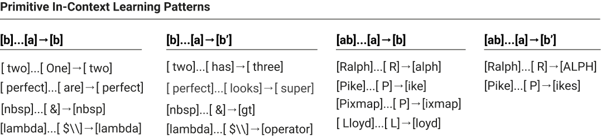

All of these can be seen as a kind of very primitive in-context learning. The ability of transformers to adapt to their context is one of their most interesting properties, and this kind of simple copying is a very basic form of it. However, we'll see when we look at a two-layer transformer that a much more interesting and powerful algorithm for in-context learning is available to deeper transformers.

所有这些都可以看作一种非常原始的上下文学习。transformer 适应其上下文的能力是它们最有趣的性质之一，而这种简单复制是它的一种非常基础的形式。不过，当我们考察两层 transformer 时会看到，更深的 transformer 可以使用一种有趣得多、也强大得多的上下文学习算法。
#### 其他有趣的跳三元组（Other Interesting Skip-Trigrams）

Of course, copying isn't the only behavior these attention heads encode.

当然，复制并不是这些注意力头编码的唯一行为。

Skip-trigrams seem trivial, but can actually produce more complex behavior than one might expect. Below are some particularly striking skip-trigram examples we found in looking through the largest entries in the expanded OV/QK matrices of our models.

跳三元组看似简单，但实际上能产生比预期更复杂的行为。下面是我们在翻查模型的展开 OV/QK 矩阵中最大元素时发现的一些特别醒目的跳三元组例子。

- [Python] Predicting that the python keywords else, elif and except are more likely after an indentation is reduced using skip-trigrams of the form: \n\t\t\t … \n\t\t → else/elif/except where the first part is indented N times, and the second part N-1, for various values of N, and where the whitespace can be tabs or spaces.

- [Python] 用形如 \n\t\t\t … \n\t\t → else/elif/except 的跳三元组预测：python 关键字 else、elif 和 except 在缩进减少后更可能出现，其中第一部分缩进 N 次、第二部分缩进 N-1 次，N 取多个不同值，空白可以是制表符或空格。

- [Python] Predicting that open() will have a file mode string argument: open … "," → [rb / wb / r / w] (for example open("abc.txt","r"))

- [Python] 预测 open() 会带一个文件模式字符串参数：open … "," → [rb / wb / r / w]（例如 open("abc.txt","r")）

- [Python] The first argument to a function is often self: def … ( → self (for example def method_name(self):)

- [Python] 函数的第一个参数常是 self：def … ( → self（例如 def method_name(self):）

- [Python] In Python 2, super is often used to call .__init__() after being invoked on self: super … self → ).__ (for example super(Parent, self).__init__())

- [Python] 在 Python 2 中，super 常用于在对 self 调用之后再调用 .__init__()：super … self → ).__（例如 super(Parent, self).__init__()）

- [Python] increasing probability of method/variables/properties associated with a library: upper … . → upper/lower/capitalize/isdigit, tf … . → dtype/shape/initializer, datetime… → date / time / strftime / isoformat, QtWidgets … . → QtCore / setGeometry / QtGui, pygame … . → display / rect / tick

- [Python] 提高与某个库相关的方法/变量/属性的概率：upper … . → upper/lower/capitalize/isdigit、tf … . → dtype/shape/initializer、datetime… → date / time / strftime / isoformat、QtWidgets … . → QtCore / setGeometry / QtGui、pygame … . → display / rect / tick

- [Python] common patterns for... in [range/enumerate/sorted/zip/tqdm]

- [Python] 常见模式 for... in [range/enumerate/sorted/zip/tqdm]

- [HTML] tbody is often followed by <td> tags: tbody … < → td

- [HTML] tbody 后面常跟 <td> 标签：tbody … < → td

- [Many] Matching of open and closing brackets/quotes/punctuation: (** … X → **), (' … X → ') , "% … X → %" , '</ … X → >' (see [32 head model, head 0:27](https://transformer-circuits.pub/2021/framework/head_dump/larger.html#head-0-27))

- [Many] 开括号与闭括号/引号/标点的匹配：(** … X → **)、(' … X → ')、"% … X → %"、'</ … X → >'（见 [32 head model, head 0:27](https://transformer-circuits.pub/2021/framework/head_dump/larger.html#head-0-27)）

- [LaTeX] In LaTeX, every \left command must have a corresponding \right command; conversely \right can only happen after a \left. As a result, the model predicts that future LaTeX commands are more likely to be \right after \left: left … \ → right

- [LaTeX] 在 LaTeX 中，每个 \left 命令必须有对应的 \right 命令；反之，\right 只能出现在 \left 之后。因此模型会预测：在 \left 之后，未来的 LaTeX 命令更可能是 \right：left … \ → right

- [English] Common phrases and constructions (e.g. keep … [in → mind / at → bay / under → wraps], difficult … not → impossible)

- [English] 常见短语与结构（例如 keep … [in → mind / at → bay / under → wraps]、difficult … not → impossible）

- For a single head, here are some trigrams associated with the query " and":   back and → forth, eat and → drink, trying and → failing, day and → night, far and → away, created and → maintained, forward and → backward, past and → present, happy and → satisfied, walking and → talking, sick and → tired, … (see [12 head model, head 0:0](https://transformer-circuits.pub/2021/framework/head_dump/small_a.html#head-0-0))

- 对于单个头，以下是一些与查询 " and" 相关的三元组：back and → forth、eat and → drink、trying and → failing、day and → night、far and → away、created and → maintained、forward and → backward、past and → present、happy and → satisfied、walking and → talking、sick and → tired、……（见 [12 head model, head 0:0](https://transformer-circuits.pub/2021/framework/head_dump/small_a.html#head-0-0)）

- [URLs] Common URL schemes: twitter … / → status, github … / → [issues / blob / pull / master], gmail … . → com, http … / → [www / google / localhost / youtube / amazon], http … : → [8080 / 8000], www … . → [org / com / net]

- [URLs] 常见 URL 模式：twitter … / → status、github … / → [issues / blob / pull / master]、gmail … . → com、http … / → [www / google / localhost / youtube / amazon]、http … : → [8080 / 8000]、www … . → [org / com / net]

One thing to note is that the learned skip-trigrams are often related to idiosyncrasies of one's tokenization. For example collapsing whitespace together allows individual tokens to reveal indentation. Not merging backslash into text tokens means that when the model is predicting LaTeX, there's a token after backslash that must be an escape sequence. And so on.

需要注意的一点是：学到的跳三元组往往与分词方案的特有性质有关。例如，把空白折叠在一起使得单个词元能够表达缩进；不把反斜杠合并进文本词元，则意味着模型在预测 LaTeX 时，反斜杠之后的词元必须是转义序列。诸如此类。

Many skip tri-grams can be difficult to interpret without specific knowledge (e.g. Israel … K → nes only makes sense if you know Israel's legislative body is called the "Knesset"). A useful tactic can be to try typing potential skip tri-grams into Google search (or similar tools) and look at autocompletions.

许多跳三元组若没有特定知识会很难解读（例如 Israel … K → nes 只有在知道以色列的立法机构叫 "Knesset" 时才说得通）。一个有用的技巧是把可能的跳三元组输入 Google 搜索（或类似工具），看看自动补全。

#### 以位置为主的注意力头（Primarily Positional Attention Heads）

Our treatment of attention heads hasn't discussed how attention heads handle position, largely because there are now several competing methods (e.g. ) and they would complicate our equations. (In the case of standard positional embeddings, the one-layer math works out to multiplying W_{QK} by the positional embeddings.)

我们对注意力头的处理还没有讨论注意力头如何处理位置，这主要是因为现在有好几种相互竞争的方法（例如……），它们会让我们的方程变得复杂。（在标准位置嵌入的情形下，单层数学推导的结果是把 W_{QK} 乘上位置嵌入。）

In practice, the one-layer models tend to have a small number of attention heads that are primarily positional, strongly preferring certain relative positions. Below, we present one attention head which either attends to the present token or the previous token.[^15]

在实践中，单层模型往往有少数几个以位置为主的注意力头，强烈偏好某些相对位置。下面我们展示一个注意力头，它要么关注当前词元，要么关注前一个词元。[^15]

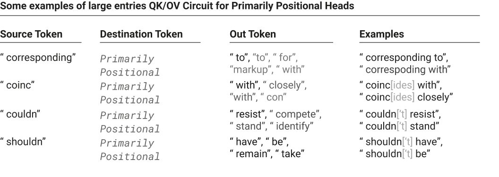

#### 跳三元组“bug”（Skip-Trigram "Bugs"）

One of the most interesting things about looking at the expanded QK and OV matrices of one layer transformers is that they can shed light on transformer behavior that seems incomprehensible from the outside.

观察单层 transformer 展开的 QK 与 OV 矩阵最有意思的事情之一，是它们能够揭示那些从外部看起来难以理解的 transformer 行为。

Our one-layer models represent skip-trigrams in a "factored form" split between the OV and QK matrices. It's kind of like representing a function f(a,b,c) = f_1(a,b) f_2(a,c). They can't really capture the three way interactions flexibly. For example, if a single head increases the probability of both keep… in mind and keep… at bay, it must also increase the probability of keep… in bay and keep… at mind. This is likely a good trade for the model on balance, but is also, in some sense, a bug. We frequently observe these in attention heads.

我们的单层模型以“因式分解形式”表示跳三元组，拆分在 OV 与 QK 矩阵之间。这有点像用 f(a,b,c) = f_1(a,b) f_2(a,c) 来表示一个函数。它们无法真正灵活地捕捉三者之间的交互。例如，如果一个头同时提高了 keep… in mind 和 keep… at bay 的概率，那它必然也会提高 keep… in bay 和 keep… at mind 的概率。综合来看，这对模型可能是一笔划算的交易，但在某种意义上也是一个 bug。我们在注意力头中经常观察到这类现象。

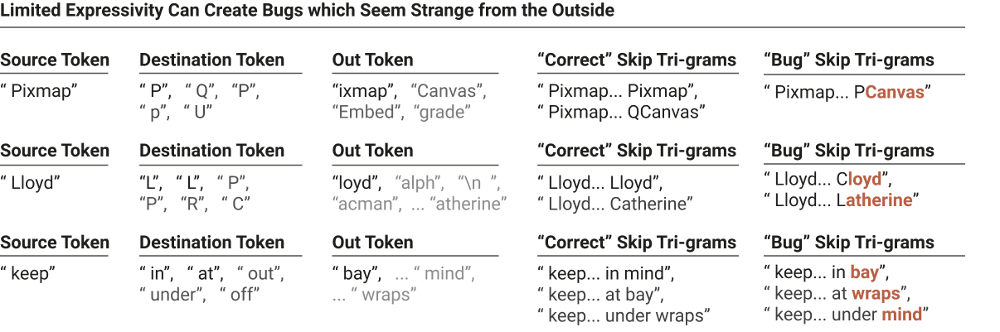

Highlighted text denotes skip-trigram continuations that the model presumably ideally wouldn't increase the probability of. Note that QCanvas [is a class](https://doc.qt.io/archives/3.3/qcanvas.html) involving pixmaps in the popular Qt library. Lloyd... Catherine likely refers to Catherine Lloyd Burns. These examples are slightly cherry-picked to be interesting, but very common if you look at the expanded weights for models linked above.

高亮文本表示模型在理想情况下大概不应提高其概率的跳三元组后续。注意，QCanvas [是一个类](https://doc.qt.io/archives/3.3/qcanvas.html)，属于流行的 Qt 库，涉及 pixmaps。Lloyd... Catherine 很可能指 Catherine Lloyd Burns。这些例子为了有趣而略有挑选，但如果你查看上面所链模型的展开权重，会发现它们非常常见。

Even though these particular bugs seem in some sense trivial, we’re excited about this result as an early demonstration of using interpretability to understand model failures. We have not further explored this phenomenon, but we’d be curious to do so in more detail. For instance, could we characterize how much performance (in points of loss or otherwise) these “bugs” are costing the model? Does this particular class continue to some extent in larger models (presumably partially, but not completely, masked by other effects)?

尽管这些特定的 bug 在某种意义上显得微不足道，我们仍对这一结果感到兴奋，因为它是用可解释性来理解模型失败的早期示范。我们没有进一步探索这一现象，但很有兴趣做更细致的研究。例如，我们能否刻画这些“bug”让模型付出了多少性能代价（以 loss 点数或其他方式衡量）？这一特定类别在更大的模型中是否仍会在一定程度上延续（估计会被其他效应部分但非完全掩盖）？

### 概括 OV/QK 矩阵（Summarizing OV/QK Matrices）

We've turned the problem of understanding one-layer attention-only transformers into the problem of understanding their expanded OV and QK matrices. But as mentioned above, the expanded OV and QK matrices are enormous, with easily billions of entries. While searching for the largest entries is interesting, are there better ways to understand them? There are at least three reasons to expect there are:

我们把理解单层仅注意力 transformer 的问题转化成了理解其展开的 OV 与 QK 矩阵的问题。但如上所述，展开的 OV 与 QK 矩阵极其庞大，动辄数十亿个元素。搜索最大的元素固然有趣，但是否存在更好的理解方式？至少有三个理由让我们预期存在：

- The OV and QK matrices are extremely low-rank. They are 50,000 × 50,000 matrices, but only rank d_\text{head} (64 or 128). In some sense, they're quite small even though they appear large in their expanded form.

- OV 与 QK 矩阵极为低秩。它们是 50,000 × 50,000 的矩阵，但秩仅为 d_\text{head}（64 或 128）。从某种意义上说，尽管展开形式看起来很大，它们其实相当小。

- Looking at individual entries often reveals hints of much simpler structure. For example, we observe one head where names of people all have the top queries like " by" (e.g. "Anne… by → Anne") while location names have top queries like " from" (e.g. "Canada… from → Canada"). This hints at something like cluster structure in the matrix.

- 查看单个元素常常能透露出更简单结构的线索。例如，我们观察到某个头：人名的最大查询都是类似 " by" 的（例如 "Anne… by → Anne"），而地名则有类似 " from" 的最大查询（例如 "Canada… from → Canada"）。这暗示矩阵中存在某种类似聚类的结构。

- Copying behavior is widespread in OV matrices and arguably one of the most interesting behaviors. (We'll see in the next section that there's analogous QK matrix structure in two layer models that's used to search for similar tokens to a query.) It seems like it should be possible to formalize this.

- 复制行为在 OV 矩阵中广泛存在，可以说是最有趣的行为之一。（下一节我们会看到，两层模型中存在类似的 QK 矩阵结构，用于搜索与查询相似的词元。）看起来应该有可能把它形式化。

We don't yet feel like we have a clear right answer, but we're optimistic that the right kind of matrix decomposition or dimensionality reduction could be highly informative. (See the technical details appendix for notes on how to efficiently work with these large matrices.)

我们还不觉得自己有明确的正确答案，但我们乐观地认为，恰当的矩阵分解或降维方法可能提供极多的信息。（关于如何高效处理这些大矩阵，参见技术细节附录中的说明。）

#### 检测复制行为（Detecting Copying Behavior）

The type of behavior we're most excited to detect in an automated way is copying. Since copying is fundamentally about mapping the same vector to itself (for example, having a token increase its own probability) it seems unusually amenable to being captured in some kind of summary statistic.

我们最希望以自动化方式检测的行为类型是复制。由于复制从根本上是把同一个向量映射到自身（例如让一个词元提高它自己的概率），它似乎格外适合用某种汇总统计量来刻画。

However, we've found it hard to pin down exactly what the right notion is; this is likely because there are lots of slightly different ways one could draw the boundaries of whether something is a "copying matrix" and we're not yet sure what the most useful one is. For example, we don't observe this in the models discussed in this paper, but in slightly larger models we often observe attention heads which "copy" some mixture of gender, plurality, and tense from nearby words, helping the model use the correct pronouns and conjugate verbs. The matrices for these attention heads aren't exactly copying individual tokens, but it seems like they are copying in some very meaningful sense. So copying is actually a more complex concept than it might first appear.

然而，我们发现很难精确定义正确的概念；这可能是因为“什么算复制矩阵”的边界可以有很多种略微不同的画法，而我们还不确定哪一种最有用。例如，在本文讨论的模型中我们没有观察到这种情况，但在稍大一些的模型中，我们经常观察到一些注意力头从附近的词“复制”性、数、时态的某种混合信息，帮助模型使用正确的代词并做动词变位。这些注意力头的矩阵并不是在逐字复制词元，但在某种非常有意义的意义上它们确实在复制。所以“复制”实际上是一个比表面看起来更复杂的概念。

One natural approach might be to use eigenvectors and eigenvalues. Recall that v_i is an eigenvector of the matrix M with an eigenvalue \lambda_i if Mv_i = \lambda_i v_i. Let's consider what that means for an OV circuit M=W_UW^h_{OV}W_E if \lambda_i is a positive real number. Then we're saying that there's a linear combination of tokens[^16] which increases the linear combination of logits of those same tokens. Very roughly you could think of this as a set of tokens (perhaps all tokens representing plural words for a very broad one, or all tokens starting with a given first letter, or all tokens representing different capitalizations and inclusions of space for a single word for a narrow one) which mutually increase their own probability. Of course, in general we expect the eigenvectors have both positive and negative entries, so it's more like there are two sets of tokens (e.g. tokens representing male and female words, or tokens representing singular and plural words) which increase the probability of other tokens in the same set and decrease those in others.

一个自然的做法是使用特征向量与特征值。回顾一下：若 Mv_i = \lambda_i v_i，则 v_i 是矩阵 M 属于特征值 \lambda_i 的特征向量。考虑这对 OV 电路 M=W_UW^h_{OV}W_E 意味着什么（若 \lambda_i 是正实数）：那等于说存在某个词元的线性组合[^16]，它会提高这些相同词元的 logit 的线性组合。非常粗略地说，你可以把它想成一组相互提升自身概率的词元（宽泛的例子：所有表示复数词的词元；较窄的例子：以某个首字母开头的所有词元，或者同一个词的所有大小写与是否带空格变体的词元）。当然，一般我们预期特征向量既有正元素也有负元素，所以更像是存在两组词元（例如表示男性词与女性词的词元，或表示单数与复数词的词元），组内词元相互提升概率，并降低另一组词元的概率。

The eigendecomposition expresses the matrix as a set of such eigenvectors and eigenvalues. For a random matrix, we expect to have an equal number of positive and negative eigenvalues, and for many to be complex.[^17] But copying requires positive eigenvalues, and indeed we observe that many attention heads have positive eigenvalues, apparently mirroring the copying structure:

特征分解把矩阵表示为一组这样的特征向量与特征值。对一个随机矩阵，我们预期正负特征值数量相当，且许多为复数。[^17] 但复制需要正特征值，而我们确实观察到许多注意力头具有正特征值，这显然映照了其复制结构：

One can even collapse that down further and get a histogram of how many of the attention heads are copying (if one trusts the eigenvalues as a summary statistic):

甚至可以把它进一步压缩，得到有多少注意力头在复制的直方图（如果相信特征值作为一个汇总统计量的话）：

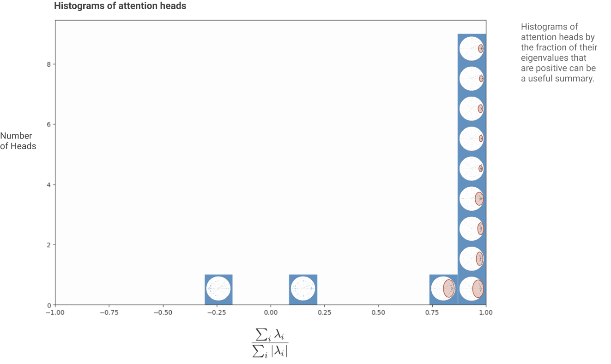

It appears that 10 out of 12 heads are significantly copying! (This agrees with qualitative inspection of the expanded weights.)

看起来 12 个头中有 10 个在显著复制！（这与对展开权重的定性检查一致。）

But while copying matrices must have positive eigenvalues, it isn't clear that all matrices with positive eigenvalues are things we necessarily want to consider to be copying. A matrix's eigenvectors aren't necessarily orthogonal, and this allows for pathological examples;[^18] for example, there can be matrices with all positive eigenvalues that actually map some tokens to decreasing the logits of that same token. Positive eigenvalues still mean that the matrix is, in some sense, "copying on average", and they're still quite strong evidence of copying in that they seem improbable by default and empirically seem to align with copying. But they shouldn't be considered a dispositive proof that a matrix is copying in all senses one might reasonably mean.

但是，虽然复制矩阵必定有正特征值，却不清楚是否所有具有正特征值的矩阵都是我们愿意称之为复制的对象。矩阵的特征向量不一定正交，这就给病态例子留了空间；[^18] 例如，可能存在所有特征值都为正、却实际上把某些词元映射为降低该词元自身 logit 的矩阵。正特征值仍然意味着矩阵在某种意义上“平均而言在复制”，而且它们仍是相当强的复制证据——因为它们默认情况下不太可能出现，且经验上似乎与复制相吻合。但不应把它们当作“矩阵在人们合理意指的所有意义上都在复制”的决定性证明。

One might try to formalize "copying matrices" in other ways. One possibility is to look at the diagonal of a matrix, which describes how each token affects its own probability. As expected, entries on the diagonal are very positive-leaning. We can also ask how often a random token increases its own probability more than any other token (or is one of the k-most increased tokens, to allow for tokens which are the same with a different capitalization or with a space). All of these seem to point in the direction of these attention heads being copying matrices, but it's not clear that any of them is a fully robust formalization of "the primary behavior of this matrix is copying". It's worth noting that all of these potential notions of copying are linked by the fact that the sum of the eigenvalues is equal to the trace is equal to the sum of the diagonal.

人们可以尝试用其他方式形式化“复制矩阵”。一种可能是查看矩阵的对角线，它描述每个词元如何影响其自身概率。如预期那样，对角线上的元素非常偏正。我们还可以问：一个随机词元有多大频率让自己概率的提升超过任何其他词元（或者是提升最多的 k 个词元之一，以容忍大小写不同或带空格的相同词元）。所有这些似乎都指向这些注意力头是复制矩阵，但并不清楚其中哪一个是对“该矩阵的主要行为是复制”的完全稳健的形式化。值得注意的是，所有这些关于复制的潜在概念都被一个事实联系在一起：特征值之和等于迹，等于对角线元素之和。

For the purposes of this paper, we'll continue to use the eigenvalue-based summary statistic. We don't think it's perfect, but it seems like quite strong evidence of copying, and empirically aligns with manual inspection and other definitions.

就本文而言，我们将继续使用基于特征值的汇总统计量。我们不认为它完美，但它似乎是相当强的复制证据，且经验上与人工检查及其他定义相一致。

### 我们“完全理解”单层模型了吗？（Do We "Fully Understand" One-Layer Models?）

There's often skepticism that it's even possible or worth trying to truly reverse engineer neural networks. That being the case, it's tempting to point at one-layer attention-only transformers and say "look, if we take the most simplified, toy version of a transformer, at least that minimal version can be fully understood."

常有人怀疑真正对神经网络进行逆向工程是否可能、是否值得。既然如此，人们很容易指着单层仅注意力 transformer 说：“看，如果我们取 transformer 最简化的玩具版本，至少这个最小版本是可以被完全理解的。”

But that claim really depends on what one means by fully understood. It seems to us that we now understand this simplified model in the same sense that one might look at the weights of a giant linear regression and understand it, or look at a large database and understand what it means to query it. That is a kind of understanding. There's no longer any algorithmic mystery. The contextualization problem of neural network parameters has been stripped away. But without further work on summarizing it, there's far too much there for one to hold the model in their head.

但这个主张实际上取决于“完全理解”是什么意思。在我们看来，我们现在理解这个简化模型，就像人们看着一个巨型线性回归的权重并理解它，或者看着一个大型数据库并理解对它查询意味着什么。那是一种理解：不再有任何算法上的神秘之处，神经网络参数的语境化问题已被消除。但若不对它做进一步的概括总结，其中的内容实在太多，人无法把整个模型装进脑子里。

Given that regular one layer neural networks are just generalized linear models and can be interpreted as such, perhaps it isn't surprising that a single attention layer is mostly one as well.

鉴于常规的单层神经网络只是广义线性模型、也可以这样解读，也许一个注意力层大体上也是如此并不令人惊讶。
## 两层仅注意力 Transformer（Two-Layer Attention-Only Transformers）

Videos covering similar content to this section: [2 layer theory](https://www.youtube.com/watch?v=UM-eJbx_YDk&list=PLoyGOS2WIonajhAVqKUgEMNmeq3nEeM51&index=5), [2 layer term importance](https://www.youtube.com/watch?v=qom0nxou4f4&list=PLoyGOS2WIonajhAVqKUgEMNmeq3nEeM51&index=6), [2 layer results](https://www.youtube.com/watch?v=VuxANJDXnIY&list=PLoyGOS2WIonajhAVqKUgEMNmeq3nEeM51&index=7)

覆盖与本节相近内容的视频：[2 layer theory](https://www.youtube.com/watch?v=UM-eJbx_YDk&list=PLoyGOS2WIonajhAVqKUgEMNmeq3nEeM51&index=5)、[2 layer term importance](https://www.youtube.com/watch?v=qom0nxou4f4&list=PLoyGOS2WIonajhAVqKUgEMNmeq3nEeM51&index=6)、[2 layer results](https://www.youtube.com/watch?v=VuxANJDXnIY&list=PLoyGOS2WIonajhAVqKUgEMNmeq3nEeM51&index=7)

Deep learning studies models that are deep, which is to say they have many layers. Empirically, such models are very powerful. Where does that power come from? One intuition might be that depth allows composition, which creates powerful expressiveness.

深度学习研究“深”的模型，也就是有许多层的模型。经验上，这类模型非常强大。这种力量从何而来？一个直觉是：深度使组合成为可能，而组合造就了强大的表现力。

Composition of attention heads is the key difference between one-layer and two-layer attention-only transformers. Without composition, a two-layer model would simply have more attention heads to implement skip-trigrams with. But we'll see that in practice, two-layer models discover ways to exploit attention head composition to express a much more powerful mechanism for accomplishing in-context learning. In doing so, they become something much more like a computer program running an algorithm, rather than look-up tables of skip-trigrams we saw in one-layer models.

注意力头的组合是单层与两层仅注意力 transformer 之间的关键差异。没有组合的话，两层模型只不过是拥有更多可实现跳三元组的注意力头而已。但我们会看到，在实践中两层模型发现了利用注意力头组合来表达一种强大得多的上下文学习机制的方法。这样一来，它们变得更像运行算法的计算机程序，而不是我们在单层模型中看到的那种跳三元组查找表。

### 三种组合（Three Kinds of Composition）

Recall that we think of the residual stream as a communication channel. Every attention head reads in subspaces of the residual stream determined by W_Q, W_K, and W_V, and then writes to some subspace determined by W_O. Since the attention head vectors are much smaller than the size of the residual stream (typical values of d_\text{head} / d_\text{model} might vary from around 1/10 to 1/100), attention heads operate on small subspaces and can easily avoid significant interaction.

回顾一下，我们把残差流看作通信信道。每个注意力头读入由 W_Q、W_K 和 W_V 决定的残差流子空间，然后写入由 W_O 决定的某个子空间。由于注意力头向量远小于残差流的尺寸（d_\text{head} / d_\text{model} 的典型值大约在 1/10 到 1/100 之间），注意力头在小子空间上运作，很容易避免显著的相互作用。

When attention heads do compose, there are three options:

当注意力头确实发生组合时，有三种可能：

- Q-Composition: W_Q reads in a subspace affected by a previous head.

- Q 组合（Q-Composition）：W_Q 读入一个受先前头影响的子空间。

- K-Composition: W_K reads in a subspace affected by a previous head.

- K 组合（K-Composition）：W_K 读入一个受先前头影响的子空间。

- V-Composition: W_V reads in a subspace affected by a previous head.

- V 组合（V-Composition）：W_V 读入一个受先前头影响的子空间。

Q- and K-Composition are quite different from V-Composition. Q- and K-Composition both affect the attention pattern, allowing attention heads to express much more complex patterns. V-Composition, on the other hand, affects what information an attention head moves when it attends to a given position; the result is that V-composed heads really act more like a single unit and can be thought of as creating an additional "virtual attention heads". Composing movement of information with movement of information gives movement of information, whereas attention heads affecting attention patterns is not reducible in this way.

Q 组合与 K 组合同 V 组合相当不同。Q 组合与 K 组合都影响注意力模式，使注意力头能够表达复杂得多的模式。V 组合则影响注意力头在关注给定位置时搬运什么信息；结果是，发生 V 组合的头实际上更像一个单一单元行动，可以被看作额外创造了“虚拟注意力头”。信息搬运与信息搬运的组合得到的仍是信息搬运，而影响注意力模式的头则无法以这种方式归约。

To really understand these three kinds of composition, we'll need to study the OV and QK circuits again.

要真正理解这三种组合，我们需要再次研究 OV 与 QK 电路。

### logit 的路径展开（Path Expansion of Logits）

The most basic question we can ask of a transformer is "how are the logits computed?" Following our approach to the one-layer model, we write out a product where every term is a layer in the model, and expand to create a sum where every term is an end-to-end path through the model.

我们对 transformer 能提出的最基本问题是：“logit 是如何计算的？”按照我们对单层模型的做法，我们写出一个每一项对应模型一层的乘积，然后展开成路径展开（path expansion）后的和式，其中每一项都是穿过模型的端到端路径。

Two of these terms, the direct path term and individual head terms, are identical to the one-layer model. The final "virtual attention head" term corresponds to V-Composition. Virtual attention heads are conceptually very interesting, and we'll discuss them more later. However, in practice, we'll find that they tend to not play a significant role in small two-layer models.

其中的两项——直接路径项与各个单独的头项——与单层模型完全相同。最后一项“虚拟注意力头”项对应 V 组合。虚拟注意力头在概念上非常有趣，我们稍后会更详细讨论。但在实践中我们会发现，它们往往在小型两层模型中不起显著作用。

### 注意力分数 QK 电路的路径展开（Path Expansion of Attention Scores QK Circuit）

Just looking at the logit expansion misses what is probably the most radically different property of a two-layer attention-only transformer: Q-composition and K-composition cause them to have much more expressive second layer attention patterns.

只看 logit 的展开，会错过两层仅注意力 transformer 可能最根本的不同之处：Q 组合与 K 组合使其第二层注意力模式的表现力大大增强。

To see this, we need to look at the QK circuits computing the attention patterns. Recall that the attention pattern for a head h is A^h~ =~ \text{softmax}^*\!\left( t^T \cdot C_{QK}^h t \right), where C_{QK}^h is the "QK-circuit" mapping tokens to attention scores. For first layer attention heads, the QK-circuit is just the same matrix we saw in the one-layer model: C^{\,h\in H_1}_{\,QK}~ =~ W_E^T W_{QK}^h W_E.

要看到这一点，我们需要考察计算注意力模式的 QK 电路。回顾一下，头 h 的注意力模式是 A^h~ =~ \text{softmax}^*\!\left( t^T \cdot C_{QK}^h t \right)，其中 C_{QK}^h 是把词元映射到注意力分数的“QK 电路”。对第一层注意力头而言，QK 电路就是我们在单层模型中看到的那个矩阵：C^{\,h\in H_1}_{\,QK}~ =~ W_E^T W_{QK}^h W_E。

But for the second layer QK-circuit, both Q-composition and K-composition come into play, with previous layer attention heads potentially influencing the construction of the keys and queries. Ultimately, W_{QK} acts on the residual stream. In the case of the first layer this reduced to just acting on the token embeddings: C^{\,h\in H_1}_{\,QK}~ =~ x_0^T W_{QK}^h x_0 =~ W_E^T W_{QK}^h W_E. But by the second layer, C^{\,h\in H_2}_{\,QK}~ =~ x_1^T W_{QK}^h x_1 is acting on x_1, the residual stream after first layer attention heads. We can write this down as a product, with the first layer both on the "key side" and "query side." Then we apply our path expansion trick to the product.

但对第二层的 QK 电路而言，Q 组合与 K 组合都开始起作用，前一层的注意力头可能影响键与查询的构造。归根结底，W_{QK} 作用在残差流上。在第一层的情形，这退化为只作用在词元嵌入上：C^{\,h\in H_1}_{\,QK}~ =~ x_0^T W_{QK}^h x_0 =~ W_E^T W_{QK}^h W_E。但到第二层，C^{\,h\in H_2}_{\,QK}~ =~ x_1^T W_{QK}^h x_1 作用在 x_1 上，即第一层注意力头之后的残差流。我们可以把它写成一个乘积，第一层同时出现在“键侧”和“查询侧”。然后我们对这个乘积应用路径展开技巧。

One complicating factor is that we have to write it as a 6-dimensional tensor, using two tensor products on matrices. This is because we're trying to express a multilinear function of the form  [n_\text{context},~ d_\text{model}] \times [n_\text{context},~ d_\text{model}] ~\to~ [n_\text{context},~ n_\text{context}]. In the one-layer case, we could side step this by implicitly doing an outer product, but that no longer works. A natural way to express this is as a (4,2)-tensor (one with 4 input dimensions and 2 output dimensions). Each term will be of the form A_q \otimes A_k \otimes W where x (A_q \otimes A_k \otimes W) y = A_q^T x W y A_k, meaning that A_q describes the movement of query-side information between tokens, A_k describes the movement of key-side information between tokens, and W describes how they product together to form an attention score.

一个复杂的因素是，我们不得不把它写成一个 6 维张量，对矩阵使用两个张量积。这是因为我们要表达的是一个形如 [n_\text{context},~ d_\text{model}] \times [n_\text{context},~ d_\text{model}] ~\to~ [n_\text{context},~ n_\text{context}] 的多重线性函数。在单层情形中，我们可以通过隐式地做外积来绕开这一点，但现在行不通了。一个自然的表达方式是把它表示为 (4,2)-张量（有 4 个输入维度、2 个输出维度）。每一项形如 A_q \otimes A_k \otimes W，其中 x (A_q \otimes A_k \otimes W) y = A_q^T x W y A_k，即 A_q 描述查询侧信息在词元之间的移动，A_k 描述键侧信息在词元之间的移动，而 W 描述它们如何相乘形成一个注意力分数。

Each of these terms corresponds to a way the model can implement more complex attention patterns. In the abstract, it can be hard to reason about them. But we'll return to them with a concrete case shortly, when we talk about induction heads.

这些项中的每一项都对应模型实现更复杂注意力模式的一种方式。抽象地谈论它们可能很难推理，但稍后当我们谈到归纳头时，会用一个具体案例再来讨论它们。

### 分析一个两层模型（Analyzing a Two-Layer Model）

So far, we've developed a theoretical model for understanding two-layer attention-only models. We have an overall equation describing the logits (the OV circuit), and then an equation describing how each attention head's attention pattern is computed (the QK circuit). But how do we understand them in practice? In this section, we'll reverse engineer a single two-layer model.

到目前为止，我们已经建立了一个用于理解两层仅注意力模型的理论模型：我们有描述 logit 的总体方程（OV 电路），以及描述每个注意力头的注意力模式如何计算的方程（QK 电路）。但在实践中如何理解它们？本节将对一个具体的两层模型做逆向工程。

Recall that the key difference between a two-layer model and a one-layer model is Q-, K-, and V-composition. Without composition, the model is just a one-layer model with extra heads.

回顾一下，两层模型与单层模型的关键差异在于 Q 组合、K 组合与 V 组合。没有组合的话，这个模型只不过是多了几个头的单层模型。

Small two-layer models seem to often (though not always) have a very simple structure of composition, where the only type of composition is K-composition between a single first layer head and some of the second layer heads.[^19] The following diagram shows Q-, K-, and V-composition between first and second layer heads in the model we wish to analyze. We've colored the heads involved by our understanding of their behavior. The first layer head has a very simple attention pattern: it primarily attends to the previous token, and to a lesser extent the present token and the token two back. The second layer heads are what we call *induction heads*.

小型两层模型似乎常常（尽管不总是）具有非常简单的组合结构：唯一的组合类型是单个第一层头与若干第二层头之间的 K 组合。[^19] 下图展示了我们想要分析的模型中第一层头与第二层头之间的 Q 组合、K 组合与 V 组合。我们基于对它们行为的理解给相关的头上了色。第一层头的注意力模式非常简单：它主要关注前一个词元，其次关注当前词元和往前第二个词元。第二层的头就是我们所说的*归纳头*。

The following diagram has an error introduced by a bug in an underlying library we wrote to accelerate linear algebra on low-rank matrices. A detailed comment on this, along with a corrected figure, can be found below.

下图存在一个错误，源于我们为加速低秩矩阵线性代数而编写的一个底层库中的 bug。关于此事的详细评论以及更正后的图，见下文。

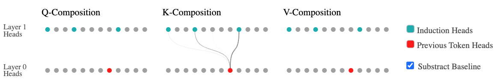

The above diagram shows Q-, K-, and V-Composition between attention heads in the first and second layer. That is, how much does the query, key or value vector of a second layer head read in information from a given first layer head? This is measured by looking at the Frobenius norm of the product of the relevant matrices, divided by the norms of the individual matrices. For Q-Composition, ||W_{QK}^{h_2~T}W_{OV}^{h_1}||_F / (||W_{QK}^{h_2~T}||_F ||W_{OV}^{h_1}||_F), for K-Composition ||W_{QK}^{h_2}W_{OV}^{h_1}||_F / (||W_{QK}^{h_2}||_F ||W_{OV}^{h_1}||_F), for V-Composition ||W_{OV}^{h_2}W_{OV}^{h_1}||_F / (||W_{OV}^{h_2}||_F ||W_{OV}^{h_1}||_F). By default, we subtract off the empirical expected amount for random matrices of the same shapes (most attention heads have a much smaller composition than random matrices). In practice, for this model, there is only significant K-composition, and only with one layer 0 head.

上图展示了第一层与第二层注意力头之间的 Q 组合、K 组合与 V 组合。也就是说：第二层头的查询、键或值向量从某个给定的第一层头读入了多少信息？这通过查看相关矩阵乘积的 Frobenius 范数除以各矩阵范数来度量。Q 组合为 ||W_{QK}^{h_2~T}W_{OV}^{h_1}||_F / (||W_{QK}^{h_2~T}||_F ||W_{OV}^{h_1}||_F)，K 组合为 ||W_{QK}^{h_2}W_{OV}^{h_1}||_F / (||W_{QK}^{h_2}||_F ||W_{OV}^{h_1}||_F)，V 组合为 ||W_{OV}^{h_2}W_{OV}^{h_1}||_F / (||W_{OV}^{h_2}||_F ||W_{OV}^{h_1}||_F)。默认情况下，我们会减去同形状随机矩阵的经验期望值（大多数注意力头的组合远小于随机矩阵）。在实践中，对这个模型而言，只有显著的 K 组合，而且只与一个第 0 层的头发生。

One quick observation from this is that most attention heads are not involved in any substantive composition. We can think of them as, roughly, a larger collection of skip tri-grams. This two-layer model has a mystery for us to figure out, but it's a fairly narrowly scoped one. (We speculate this means that having a couple induction heads in some sense "outcompetes" a few potential skip-trigram heads, but no other type of composition did. That is, having more skip-trigram heads is a competitive use of second layer attention heads in a small model.)

由此可以快速观察到一个现象：大多数注意力头并未参与任何实质性的组合。我们可以把它们粗略地看作更大一批跳三元组。这个两层模型有一个待解之谜，但范围相当有限。（我们猜测这意味着：拥有几个归纳头在某种意义上“胜过”了几个潜在的跳三元组头，而其他类型的组合没能做到这一点。也就是说，在小型模型中，拥有更多的跳三元组头是对第二层注意力头的一种有竞争力的用法。）

In the next few sections, we'll develop a theory of what's going on, but before we do, we provide an opportunity to poke around at the attention heads using the interactive diagram below, which displays value-weighted attention patterns over the first paragraph of *Harry Potter and the Philosopher's Stone*. We've colored the attention heads involved in K-composition using the same scheme as above. (This makes it a bit hard to investigate the other heads; if you want to look at those, an interface for general exploration is available [here](https://transformer-circuits.pub/2021/framework/2L_HP_normal.html)).

在接下来的几节中，我们将建立一个关于“发生了什么”的理论。但在此之前，我们提供一个机会，让你可以用下面的交互图来探究这些注意力头：它展示了《哈利·波特与魔法石》第一段上的值加权注意力模式（value-weighted attention pattern）。我们用与上文相同的配色标出了参与 K 组合的注意力头。（这使得考察其他头有点困难；如果你想看那些头，[这里](https://transformer-circuits.pub/2021/framework/2L_HP_normal.html)提供了一个用于一般探索的界面。）

We recommend isolating individual heads and both looking at the pattern and hovering over tokens. For induction heads, note especially the off-diagonal lines in the attention pattern, and the behavior on the tokens compositing Dursley and Potters.

我们建议把各个头单独隔离出来，既看注意力模式，也把鼠标悬停在词元上。对于归纳头，请特别注意注意力模式中的非对角线，以及在组合出 Dursley 和 Potters 的那些词元上的行为。

The above diagram shows the *value-weighted attention pattern* for various attention heads; that is, the attention patterns with attention weights scaled by the norm of the value vector at the source position ||v_{src}^h||. You can think of the value-weighted attention pattern as showing "how big a vector is moved from each position." (This approach was also recently introduced by Kobayashi et al. .) This is especially useful because attention heads will sometimes use certain tokens as a kind of default or resting position when there isn't a token that matches what they're looking for; the value vector at these default positions will be small, and so the value weighted pattern is more informative. The interface allows one to isolate attention heads, shows the overall attention pattern, and allows one to explore the attention for individual tokens. Attention heads involved in K-composition are colored using the same scheme as above. We suggest trying to isolate these heads.

上图展示了各个注意力头的*值加权注意力模式*，即注意力权重按源位置值向量范数 ||v_{src}^h|| 缩放后的注意力模式。你可以把值加权注意力模式理解为展示“从每个位置搬走了多大的一个向量”。（这一方法最近也由 Kobayashi 等人提出。）这特别有用，因为当找不到与它们所寻找内容匹配的词元时，注意力头有时会把某些词元当作一种默认或“歇脚”位置；这些默认位置上的值向量会很小，因此值加权后的模式信息量更大。该界面允许隔离注意力头、展示整体注意力模式，并允许探究单个词元的注意力。参与 K 组合的注意力头使用与上文相同的配色。我们建议试着把这些头隔离出来。

If you look carefully, you'll notice that the aqua colored "induction heads" often attend back to previous instances of the token which *will* come next. We'll investigate this more in the next section. Of course, looking at attention patterns on a single piece of text — especially a well-known paragraph like this one — can't give us very high confidence as to how these heads behave in generality. We'll return to this later, once we have a stronger hypothesis of what's going on.

如果仔细观察，你会注意到浅绿色的“归纳头”常常回头关注接下来*将要*出现的那个词元的先前实例。我们将在下一节更深入地研究这一点。当然，只看一段文本——尤其是这样一段广为人知的段落——上的注意力模式，无法让我们对这些头的一般行为抱有很高的信心。等我们对正在发生的事有了更强的假说后，再回到这一点。
### 归纳头（Induction Heads）

In small two-layer attention-only transformers, composition seems to be primarily used for one purpose: the creation of what we call induction heads. We previously saw that the one-layer model dedicated a lot of its capacity to copying heads, as a crude way to implement in-context learning. Induction heads are a much more powerful mechanism for achieving in-context learning. (We will explore the role of induction heads in in-context learning in more detail in our [next paper](https://transformer-circuits.pub/2022/in-context-learning-and-induction-heads/index.html).)

在小型两层仅注意力 transformer 中，组合似乎主要服务于一个目的：创造我们所谓的归纳头。前面我们看到，单层模型把大量容量用于复制头（copying head），作为实现上下文学习的一种粗糙方式。归纳头则是实现上下文学习的一种强大得多的机制。（我们将在[下一篇论文](https://transformer-circuits.pub/2022/in-context-learning-and-induction-heads/index.html)中更详细地探讨归纳头在上下文学习中的作用。）

#### 归纳头的功能（Function of Induction Heads）

If you played around with the attention patterns above, you may have already guessed what induction heads do. Induction heads search over the context for previous examples of the present token. If they don't find it, they attend to the first token (in our case, a special token placed at the start), and do nothing. But if they do find it, they then look at the next token and copy it. This allows them to repeat previous sequences of tokens, both exactly and approximately.

如果你把玩过上面的注意力模式，可能已经猜到归纳头在做什么。归纳头在上下文中搜索当前词元先前的例子。如果找不到，它们就关注第一个词元（在我们的设定中，是放在开头的一个特殊词元），什么也不做。但如果找到了，它们就会看下一个词元并复制它。这使得它们能够（精确地或近似地）重复之前出现过的词元序列。

It's useful to compare induction heads to the types of in-context learning we observed in one layer models:

把归纳头与我们在单层模型中观察到的各类上下文学习比较一下会很有帮助：

- One layer model copying head: [b] … [a] → [b]

- 单层模型复制头：[b] … [a] → [b]

- And when rare quirks of tokenization allow: [ab] … [a] → [b]

- 以及在罕见的分词特例允许时：[ab] … [a] → [b]

- Two layer model induction head: [a][b] … [a] → [b]

- 两层模型归纳头：[a][b] … [a] → [b]

The two-layer algorithm is more powerful. Rather than generically looking for places it might be able to repeat a token, it knows how the token was previously used and looks out for similar cases. This allows it to make much more confident predictions in those cases. It's also less vulnerable to distributional shift, since it doesn't depend on learned statistics about whether one token can plausibly follow another. (We'll see later that induction heads can operate on repeated sequences of completely random tokens)

两层算法更强大。它不是泛泛地寻找可能重复某个词元的位置，而是知道该词元先前是如何被使用的，并留意类似的情形。这使它在这些情形下能做出自信得多的预测。它也更不容易受分布偏移的影响，因为它不依赖于“一个词元是否可能跟在另一个词元之后”这类学到的统计。（我们稍后会看到，归纳头可以在完全随机的重复词元序列上运作）

The following examples highlight a few cases where induction heads help predict tokens in the first paragraph of Harry Potter:

下面的例子突出展示了归纳头在《哈利·波特》第一段中帮助预测词元的若干情形：

Raw attention pattern and logit effect for the induction head 1:8 on some segments of the first paragraph of *Harry Potter and the Philosopher's Stone*. The "logit effect" value shown is the effect of the result vector for the present token on the logit for the next token, (W_U W_O^h r^h_\text{pres\_tok})_\text{next\_tok}, which is equivalent to running the full OV circuit and inspecting the logit this head contributes to the next token.

归纳头 1:8 在《哈利·波特与魔法石》第一段某些片段上的原始注意力模式与 logit 效应。图中所示的“logit 效应”值是当前词元的结果向量对下一个词元 logit 的影响，即 (W_U W_O^h r^h_\text{pres\_tok})_\text{next\_tok}，这等价于运行完整的 OV 电路并检查该头对下一个词元 logit 的贡献。

Earlier, we promised to show induction heads on more tokens in order to better test our theory of them. We can now do this.

前面我们承诺过要在更多词元上展示归纳头，以便更好地检验我们关于它们的假说。现在我们可以做到了。

Given that we believe induction heads are attending to previous copies of the token and shifting forward, they should be able to do this on totally random repeated patterns. This is likely the hardest test one can give them, since they can't rely on normal statistics about which tokens typically come after other tokens. Since the tokens are uniformly sampled random tokens from our vocabulary, we represent the nth token in our vocabulary as <n>, with the exception of the special token <START>. (Notice that this is totally off distribution. Induction heads can operate on wildly different distributions as long as the more abstract property that repeated sequences are more likely to reoccur holds true.)

鉴于我们相信归纳头是关注词元的先前副本并向前移位，它们应该能在完全随机的重复模式上做到这一点。这可能是人们能给它们的最难测试，因为它们无法依赖“哪些词元通常跟在哪些词元后面”这类常规统计。由于这些词元是从我们的词表中均匀采样的随机词元，我们把词表中的第 n 个词元表示为 <n>，特殊词元 <START> 除外。（请注意，这完全偏离了分布。只要“重复过的序列更可能再次出现”这一更抽象的性质成立，归纳头就能在截然不同的分布上运作。）

As in our previous attention pattern diagram, this diagram shows the value-weighted attention pattern for various heads, with each head involved in K-composition colored by our theory. Attention heads are shown acting on a random sequence of tokens, repeated three times.<n> denotes the nth token in our vocabulary.

与前面的注意力模式图一样，此图展示了各个头的值加权注意力模式，参与 K 组合的每个头按我们的假说着色。图中注意力头作用于一个重复三次的随机词元序列。<n> 表示词表中的第 n 个词元。

This seems like pretty strong evidence that our hypothesis of induction heads is right. We now know what K-composition is used for in our two layer model. The question now is *how* K-composition accomplishes it.

这看起来是“我们对归纳头的假说是正确的”这一判断的相当有力的证据。我们现在知道了 K 组合在两层模型中的用途。现在的问题是，K 组合究竟是*如何*做到这一点的。

#### 归纳头如何工作（How Induction Heads Work）

The central trick to induction heads is that the key is computed from tokens shifted one token back.[^20] The query searches for "similar" key vectors, but because keys are shifted, finds the next token.

归纳头的核心技巧在于：键是从向后移一个词元的词元计算出来的。[^20] 查询搜索“相似”的键向量，但由于键被移位了，实际找到的是下一个词元。

The following example, from a larger model with more sophisticated induction heads, is a useful illustration:

下面这个例子来自一个归纳头更精细的更大模型，是一个有用的说明：

QK circuits can be expanded in terms of tokens instead of attention heads. Above, key and query intensity represent the amount each token increases the attention score. Logit effect is the OV circuit.

QK 电路可以按词元（而非注意力头）展开。上图中，键与查询的强度表示每个词元对注意力分数的提升量。logit 效应则是 OV 电路。

The minimal way to create an induction head is to use K-composition with a previous token head to shift the key vector forward one token. This creates a term of the form \text{Id} \otimes A^{h_{-1}} \otimes W in the QK-circuit (where A^{h_{-1}} denotes an attention pattern attending to the previous token). If W matches cases where the tokens are the same — the QK version of a "copying matrix" — then this term will increase attention scores when the previous token before the source position is the same as the destination token. (Induction heads can be more complicated than this; for example, other 2-layer models will develop an attention head that attends a bit further than the previous token, presumably to create a A^{h_{-1}} \otimes A^{h_{-2}} \otimes W term so some heads can match back further).

构造归纳头的最简方式，是利用与前一词元头（previous token head）的 K 组合，把键向量向前移一个词元。这会在 QK 电路中产生一个形如 \text{Id} \otimes A^{h_{-1}} \otimes W 的项（其中 A^{h_{-1}} 表示关注前一词元的注意力模式）。如果 W 在“词元相同”的情形下匹配——即“复制矩阵”的 QK 版本——那么当源位置之前的那个词元与目标词元相同时，这一项会提升注意力分数。（归纳头可以比这更复杂；例如，其他两层模型会发展出比前一词元看得更远一点的注意力头，大概是为了产生 A^{h_{-1}} \otimes A^{h_{-2}} \otimes W 这样的项，让某些头能向前匹配更远。）

#### 检验机制理论（Checking the Mechanistic Theory）

Our mechanistic theory suggests that induction heads must do two things:

我们的机制理论表明，归纳头必须做到两件事：

- Have a "copying" OV circuit matrix.

- 拥有一个“复制型”的 OV 电路矩阵。

- Have a "same matching" QK circuit matrix associated with the \text{Id} \otimes A^{h_{-1}} \otimes W term.

- 拥有一个与 \text{Id} \otimes A^{h_{-1}} \otimes W 项相关联的“相同匹配型”QK 电路矩阵。

Although we're not confident that the eigenvalue summary statistic from the Detecting Copying section is the best possible summary statistic for detecting "copying" or "matching" matrices, we've chosen to use it as a working formalization. If we think of our attention heads as points in a 2D space of QK and OV eigenvalue positivity, all the induction heads turn out to be in an extreme right hand corner.

虽然我们并不确信“检测复制”一节中的特征值汇总统计量是检测“复制”或“匹配”矩阵的最佳汇总统计量，但我们选择把它作为一个可操作的形式化。如果把我们的注意力头看作 QK 与 OV 特征值正性构成的二维空间中的点，那么所有归纳头都落在极右侧的角落。

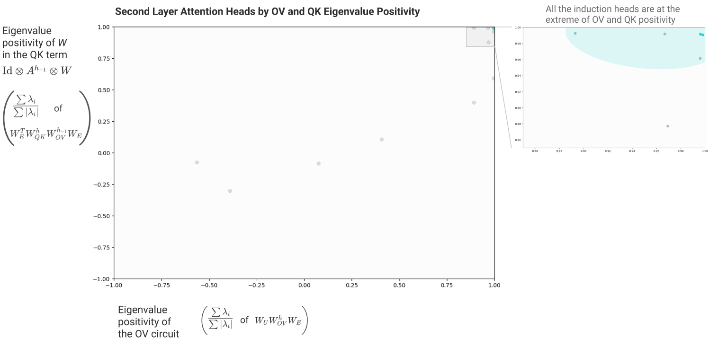

One might wonder if this observation is circular. We originally looked at these attention heads because they had larger than random chance K-composition, and now we've come back to look, in part, at the K-composition term. But in this case, we're finding that the K-composition creates a matrix that is extremely biased towards positive eigenvalues — there wasn't any reason to suggest that a large K-composition would imply a positive K-composition. Nor any reason for all the OV circuits to be positive.

有人可能怀疑这个观察是否循环论证。我们最初注意这些注意力头，是因为它们的 K 组合大于随机水平；而现在我们又部分回到 K 组合项上来考察。但在这种情形下，我们发现 K 组合创造了一个极其偏向正特征值的矩阵——并没有任何理由表明大的 K 组合会意味着正的 K 组合，也没有任何理由让所有 OV 电路都为正。

But that is exactly what we expect if the algorithm implemented is the described algorithm for implementing induction.

但如果所实现的算法正是我们描述的那个实现归纳的算法，这恰恰是我们所预期的。
### 项重要性分析（Term Importance Analysis）

Earlier, we decided to ignore all the "virtual attention head" terms because we didn't observe any significant V-composition. While that seems like it's probably right, there's ways we could be mistaken. In particular, it could be the case that while every individual virtual attention head wasn't important, they matter in aggregate. This section will describe an approach to double checking this using ablations.

前面我们决定忽略所有“虚拟注意力头”项，因为我们没有观察到任何显著的 V 组合。这看起来大概是对的，但我们也有可能出错。特别是，有可能每个单独的虚拟注意力头都不重要，但它们在总体上却有影响。本节将描述一种用消融（ablation）来二次检验这一判断的方法。

Ordinarily, when we ablate something in a neural network, we're ablating something that's explicitly represented in the activations. We can simply multiply it by zero and we're done. But in this case, we're trying to ablate an implicit term that only exists if you expand out the equations. We could do this by trying to run the version of a transformer described in our equations, but that would be horribly slow, and get exponentially worse as we considered deeper models.

通常，当我们消融神经网络中的某个东西时，我们消融的是激活中显式表示的东西：只需把它乘以零即可。但在这里，我们试图消融的是一个只有把方程展开后才存在的隐式项。我们可以尝试运行我们的方程所描述的那个版本的 transformer 来做到这一点，但那会非常慢，而且随着考虑更深的模型，情况会呈指数级恶化。

But it turns out there's an algorithm which can determine the marginal effect of ablating the nth order terms (that is, the terms corresponding to paths through V-composition of n attention heads). The key trick is to run the model multiple times, replacing the present activations with activations from previous times you ran the model. This allows one to limit the depth of path, ablating all terms of order greater than that. Then by taking differences between the observed losses for each ablation, we can get the marginal effect of the nth order terms.

但事实证明，有一个算法可以确定消融 n 阶项（即对应于穿过 n 个注意力头的 V 组合路径的项）的边际效应。关键技巧是多次运行模型，用之前运行模型时的激活替换当前的激活。这使得我们可以限制路径深度，消融所有阶数大于该深度的项。然后，通过取各次消融所观测到的 loss 之间的差，我们可以得到 n 阶项的边际效应。

(Note that freezing the attention patterns to ground truth is what makes this ablation only target V-composition. Although this is in some ways the simplest algorithm, focused on the OV circuit, variants of this algorithm could also be used to isolate Q- or K-composition.)

（注意，把注意力模式冻结为真实值，正是该消融只针对 V 组合的原因。虽然在某种意义上这是聚焦于 OV 电路的最简单算法，但这一算法的变体也可用于分离 Q 组合或 K 组合。）

As the V-composition results suggested, the second order “virtual attention head” terms have a pretty small marginal effect in this model. (Although they may very well be more important in other — especially larger — models.)

正如 V 组合的结果所提示的，二阶“虚拟注意力头”项在这个模型中的边际效应相当小。（尽管它们在其他——尤其是更大的——模型中很可能更重要。）

We conclude that for understanding two-layer attention only models, we shouldn’t prioritize understanding the second order “virtual attention heads” but instead focus on the direct path (which can only contribute to bigram statistics) and individual attention head terms. (We emphasize that this says nothing about Q- and K-Composition; higher order terms in the OV circuit not mattering only rules out V-Composition as important. Q- and K-Composition correspond to terms in the QK circuits of each head instead.)

我们的结论是：为了理解两层仅注意力模型，我们不应优先理解二阶“虚拟注意力头”，而应聚焦于直接路径（它只能贡献二元模型统计）与各个单独的注意力头项。（我们强调，这与 Q 组合和 K 组合无关：OV 电路中高阶项不重要，只排除了 V 组合作为重要因素。Q 组合与 K 组合对应的是每个头的 QK 电路中的项。）

We can further subdivide these individual attention head terms into those in layer 1 and layer 2:

我们可以把这些单独的注意力头项进一步细分为第 1 层与第 2 层的项：

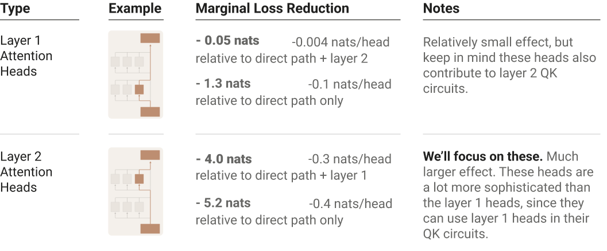

This suggests we should focus on the second layer head terms.

这提示我们应聚焦于第二层的头项。

### 虚拟注意力头（Virtual Attention Heads）

Although virtual heads turned out to be fairly unimportant for understanding the performance of the two layer model, we speculate that these may be much more important in larger and more complex transformers. We're also struck by them because they seem theoretically very elegant.

尽管虚拟头最终对理解两层模型的性能相当不重要，我们猜测它们在更大、更复杂的 transformer 中可能重要得多。我们也为它们所触动，因为它们在理论上显得非常优雅。

Recall that virtual attention heads were the terms of the form (A^{h_2}A^{h_1}) \otimes (\ldots W_{OV}^{h_2}W_{OV}^{h_1}\ldots) in the path expansion of the logit equation, corresponding to the V-composition of two heads.

回顾一下，虚拟注意力头是 logit 方程路径展开中形如 (A^{h_2}A^{h_1}) \otimes (\ldots W_{OV}^{h_2}W_{OV}^{h_1}\ldots) 的项，对应于两个头的 V 组合。

Where Q- and K-Composition affect the attention pattern, V-Composition creates these terms which really operate as a kind of independent unit which performs one head operation and then the other. This resulting object really is best thought of as the composition of the heads, h_2 \circ h_1. It has its own attention pattern, A^{h_2 \circ h_1} = A^{h_2}A^{h_1} and its own OV matrix W_{OV}^{h_2 \circ h_1} = W_{OV}^{h_2}W_{OV}^{h_1}. In deeper models, one could in principle have higher order virtual attention heads (e.g. h_3 \circ h_2 \circ h_1).

Q 组合与 K 组合影响注意力模式，而 V 组合创造的这些项实际上是作为一种独立单元运作的：先执行一个头的操作，再执行另一个的。所得的这个对象最好被看作头的组合 h_2 \circ h_1。它有自己的注意力模式 A^{h_2 \circ h_1} = A^{h_2}A^{h_1}，也有自己的 OV 矩阵 W_{OV}^{h_2 \circ h_1} = W_{OV}^{h_2}W_{OV}^{h_1}。在更深的模型中，原则上可以存在更高阶的虚拟注意力头（例如 h_3 \circ h_2 \circ h_1）。

There are two things worth noting regarding virtual attention heads.

关于虚拟注意力头，有两点值得注意。

Firstly, this kind of composition seems quite powerful. We often see heads whose attention pattern attends to the previous token, but not heads who attend two tokens back — this may be because any useful predictive power from the token two back is gained via virtual heads. Attention patterns can also implement more abstract things, such as attending to the start of the current clause, or the subject of the sentence — composition enables functions such as ‘attend to the subject of the previous clause’.

首先，这种组合似乎相当强大。我们经常看到注意力模式关注前一个词元的头，却看不到关注往前第二个词元的头——这可能是因为“从往前第二个词元获得的有用预测能力”是经由虚拟头获得的。注意力模式还可以实现更抽象的东西，例如关注当前子句的开头，或句子的主语——组合使得“关注前一个子句的主语”这类功能成为可能。

Secondly, there are a lot of virtual attention heads. The number of normal heads grows linearly in the number of layers, while the number of virtual heads based on the composition of two heads grows quadratically, on three heads grows cubically, etc. This means the model may, in theory, have a lot more space to gain useful predictive power via the virtual attention heads. This is particularly important because normal attention heads are, in some sense, “large”. The head has a single attention pattern determining which source tokens it attends to, and d_{\text{head}} dimensions to copy from the source to destination token. This makes it unwieldy to use for intuitively “small” tasks where not much information needs to be conveyed, eg attending to previous pronouns to determine whether the text is in first, second or third person, or attending to tense markers to detect whether the text is in past, present or future text.

其次，虚拟注意力头的数量非常之多。普通头的数量随层数线性增长，而基于两个头组合的虚拟头数量按平方增长，基于三个头的按立方增长，依此类推。这意味着模型在理论上可以拥有大得多的空间，经由虚拟注意力头获得有用的预测能力。这一点尤其重要，因为普通注意力头在某种意义上是“大”的：一个头只有一个决定它关注哪些源词元的注意力模式，以及 d_{\text{head}} 个用于从源词元向目标词元复制的维度。这使得它难以用于那些直觉上“小”、不需要传递多少信息的任务，例如关注先前的代词以判断文本是第一、第二还是第三人称，或关注时态标记以检测文本是过去、现在还是将来时态。

## 这把我们带到了哪里？（Where Does This Leave Us?）

Over the last few sections, we've made progress on understanding one-layer and two-layer attention-only transformers. But our ultimate goal is to understand transformers in general. Has this work actually brought us any closer? Do these special, limited cases actually shed light on the general problem? We'll explore this issue in follow-up work, but our general sense is that, yes, these methods can be used to understand portions of general transformers, including large language models.

在过去几节中，我们在理解单层与两层仅注意力 transformer 上取得了进展。但我们的终极目标是理解一般的 transformer。这项工作真的让我们更接近这个目标了吗？这些特殊、受限的例子真的能照亮一般问题吗？我们将在后续工作中探讨这个问题，但我们的总体判断是：是的，这些方法可以用来理解一般 transformer——包括大型语言模型——的某些部分。

One reason is that normal transformers contain some circuits which appear to be primarily attentional. Even in the presence of MLP layers, attention heads still operate on the residual stream and can still interact directly with each other and with the embeddings. And in practice, we find instances of interpretable circuits involving only attention heads and the embeddings. Although we may not be able to understand the entire model, we're very well positioned to reverse engineer these portions.

一个原因是，常规 transformer 包含一些看起来主要以注意力为主的电路。即使存在 MLP 层，注意力头仍在残差流上运作，仍然可以彼此直接交互、并与嵌入直接交互。而且在实践中，我们确实发现了只涉及注意力头与嵌入的可解释电路的实例。尽管我们可能无法理解整个模型，但我们非常有条件对这些部分进行逆向工程。

In fact, we actually see some analogous attention heads and circuits in large models to those we analyzed in these toy models! In particular, we'll find that large models form many induction heads, and that the basic building block of their construction is K-composition with a previous token head, just as we saw here. This appears to be a central driver of in-context learning in language models of all sizes – a topic we'll discuss in our next paper.

事实上，我们确实在大模型中看到了与我们在这几个玩具模型中所分析的注意力头和电路类似的东西！特别地，我们会发现大模型形成了许多归纳头，而且其构造的基本组件是与前一词元头的 K 组合，正如我们在这里看到的一样。这似乎是各种规模语言模型中上下文学习的一个核心驱动因素——这是我们要在下一篇论文中讨论的主题。

That said, we can probably only understand a small portion of large language models this way. For one thing, MLP layers make up 2/3rds of a standard transformer's parameters. Clearly, there are large parts of a model’s behaviors we won’t understand without engaging with those parameters. And in fact the situation is likely worse: because many attention heads interact with the MLP layers, the fraction of parameters we can understand without considering MLP layers is even smaller than 1/3rd. More complete understanding will require progress on MLP layers. At a mechanistic level, their circuits actually have a very nice mathematical structure (see additional intuition). However, the clearest path forward would require individually interpretable neurons, which we've had limited success finding.

尽管如此，用这种方式我们可能只能理解大型语言模型的一小部分。首先，MLP 层占标准 transformer 参数的三分之二。显然，不触及那些参数，我们就无法理解模型行为的很大一部分。而实际情况可能更糟：由于许多注意力头与 MLP 层交互，在不考虑 MLP 层的情况下我们能理解的参数比例甚至小于三分之一。更完整的理解需要在 MLP 层上取得进展。在机制层面上，它们的电路实际上有非常好的数学结构（见附加直觉一节）。然而，最清晰的前进路径需要单个可解释的神经元，而我们在寻找这类神经元方面成效有限。

Ultimately, our goal in this initial paper is simply to establish a foothold for future efforts on this problem. Much future work remains to be done.

归根结底，我们在这篇开篇论文中的目标只是为未来解决这一问题的努力建立一个立足点。未来还有大量工作要做。
## 相关工作（Related Work）

#### 电路（Circuits）

The [Distill Circuits thread](https://distill.pub/2020/circuits/) was a concerted effort to reverse engineer the InceptionV1 model. Our work seeks to do something similar for large language models.

[Distill Circuits 系列](https://distill.pub/2020/circuits/)是一项协力对 InceptionV1 模型进行逆向工程的工作。我们的工作试图为大型语言模型做类似的事情。

The Circuits approach needs to be significantly rethought in the context of language models. Attention heads are quite different from anything in conv nets and needed a new approach. The linear structure of the residual stream creates both new challenges (the lack of a privileged basis removes some options for studying it) but also creates opportunities (we can expand through it). Having circuits which are bilinear forms rather than just linear is also quite unusual (although it was touched on by Goh et al. who investigated bilinear interactions between the image and language models).

在语言模型的语境下，Circuits 方法需要被大幅重新思考。注意力头与卷积网络中的任何东西都相当不同，需要新的方法。残差流的线性结构既带来新挑战（缺乏特权基底去除了研究它的一些选项），也创造了机会（我们可以穿过它做展开）。电路是双线性形式而不只是线性的，这一点也相当不寻常（尽管 Goh 等人在研究图像模型与语言模型之间的双线性交互时曾触及这一点）。

We've noticed several interesting, high-level differences between the original circuits work on InceptionV1 and studying circuits in attention-only transformer language models:

我们注意到，最初的 InceptionV1 circuits 工作与研究仅注意力 transformer 语言模型中的电路之间存在几个有趣的高层差异：

- It's possible that circuit analysis of attention-only models scales very differently with model size. In an attention-only model, parameters are arranged in comparatively large, meaningful, largely linearly operating chunks corresponding to attention heads. This creates lots of opportunities to "roughly understand" quite large numbers of parameters. Even very large models only have a few thousand attention heads — a scale where looking at every single one seems plausible. Of course, once one adds MLP layers, the majority of parameters are inside of them and this becomes a smaller relative win for understanding models.

- 仅注意力模型的电路分析随模型规模的伸缩方式可能非常不同。在仅注意力模型中，参数被组织成相对较大、有意义、基本按线性方式运作的块，对应于注意力头。这为“粗略理解”相当大量的参数创造了很多机会。即使是很大的模型也只有几千个注意力头——在这个规模上，逐一查看每一个头似乎是可行的。当然，一旦加上 MLP 层，大多数参数都在其中，这对理解模型而言就变成了相对较小的优势。

- We've had a lot more success studying circuits in tiny attention-only transformers than we did with attempting to study circuits in small vision models. In small vision models, the problem is that neurons often aren't interpretable; nothing analogous seems to happen here, since we can reduce everything into end-to-end terms. However, perhaps when we study models with MLP layers (which can't be reduced into end-to-end terms) more closely, we'll also find that scale is needed to make neurons interpretable.

- 与尝试研究小型视觉模型中的电路相比，我们在研究微型仅注意力 transformer 中的电路方面成功得多。在小型视觉模型中，问题在于神经元往往不可解释；而这里似乎没有类似的问题，因为我们可以把一切归约为端到端的项。不过，也许当我们更贴近地研究带 MLP 层的模型（它们无法被归约为端到端的项）时，我们也会发现需要规模才能让神经元变得可解释。

#### Logit 透镜（The Logit Lens）

Previous work by the LessWrong user Nostalgebraist on a method they call the ["Logit Lens"](https://www.lesswrong.com/posts/AcKRB8wDpdaN6v6ru/interpreting-gpt-the-logit-lens) explores the same linear structure of the residual stream we heavily exploit. The logit lens approach notes that, since the residual stream is iteratively refined, one can apply the unembedding matrix to earlier stages of the residual stream (ie. essentially look at W_U x_i) to look at how model predictions evolve in some sense.

LessWrong 用户 Nostalgebraist 之前提出了一种称为[“Logit Lens”](https://www.lesswrong.com/posts/AcKRB8wDpdaN6v6ru/interpreting-gpt-the-logit-lens)的方法，探索的正是我们大量利用的残差流线性结构。logit lens 方法指出：由于残差流是被迭代精炼的，可以把反嵌入矩阵应用到残差流的较早阶段（即本质上查看 W_U x_i），从而在某种意义上观察模型预测的演化。

Our approach could be seen as making a similar observation, but deciding that the residual stream isn't actually the fundamental object to study. Since it's the sum of linear projections of many attention heads and neurons, it's natural to simply multiply out the weights to look at how all the different parts contributing to the sum connect to the logits. One can then continue to exploit linear structure and try to push linearity as far back into the model as possible, which roughly brings one to our approach.

我们的做法可以被看作作出了类似的观察，但判定残差流实际上并不是要研究的基本对象。既然它是许多注意力头与神经元的线性投影之和，很自然的做法就是把权重乘开，看看贡献于这个和的所有不同部分如何连接到 logit。然后可以继续利用线性结构，尽量把线性往模型深处推进——这大致就把我们带到了本文的方法。

#### 注意力头分析（Attention Head Analysis）

Our work follows the lead of several previous papers in investigating transformer attention heads. Investigation of attention patterns likely began with visualizations by Llion Jones and was quickly expanded on by others . More recently, several papers have begun to seriously investigate correspondences between attention heads and grammatical structures .

在研究 transformer 注意力头方面，我们的工作沿袭了几篇先前论文的思路。对注意力模式的研究可能始于 Llion Jones 的可视化，随后很快被其他人扩展。最近，一些论文开始认真考察注意力头与语法结构之间的对应关系。

The largest difference between these previous analyses of attention heads and our work really seems to be a matter of goals: we seek to provide an end-to-end mechanistic account, rather than empirically describe attention patterns. Of course, this preliminary paper is also different from this prior work in that we only studied very small toy models, and only really then to illustrate and support our theory. Finally, we focus on autoregressive transformers, rather than a denoising model like BERT .

这些先前的注意力头分析与我们的工作之间最大的差别，看来确实在于目标：我们寻求提供端到端的机制性解释，而不是经验性地描述注意力模式。当然，这篇初步论文与先前工作的不同之处还在于：我们只研究了非常小的玩具模型，而且即便如此也主要是为了说明和支持我们的理论。最后，我们聚焦于自回归 transformer，而不是像 BERT 那样的去噪模型。

Our investigations benefitted from these previous papers, and we have some miscellaneous thoughts on how our results relate to them:

我们的研究受益于这些先前的论文，关于我们的结果与它们的关系，我们有一些零散的想法：

- Like most of these papers (e.g. ), we observe the existence of a previous token attention head in most models. Sometimes in small models we get an attention head that's more smeared out over the last two or three tokens instead.

- 与这些论文中的大多数（例如……）一样，我们观察到大多数模型中都存在前一词元注意力头。有时在小型模型中，我们得到的注意力头则更多是涂抹在最后两三个词元上。

- We mirror others' findings that many attention heads appear to use punctuation or special tokens as a default  (e.g. ). Induction heads provide a concrete example of this. Similar to Kobayashi et al.  we find scaling attention patterns by the magnitude of value vectors to be very helpful for clarifying this.

- 我们的发现与他人的相呼应：许多注意力头似乎把标点或特殊词元用作默认位置（例如……）。归纳头为这一点提供了一个具体例子。与 Kobayashi 等人类似，我们发现用值向量的幅值缩放注意力模式，对澄清这一点非常有帮助。

- The toy models discussed in this paper do not exhibit the sophisticated grammatical attention heads described by some of this prior work. However, we do find more similar attention heads in larger models.

- 本文讨论的玩具模型并未展现先前某些工作所描述的复杂语法注意力头。不过，我们在更大的模型中确实发现了更为相似的注意力头。

- Voita et al.  describe attention heads which preferentially attend to rare tokens; we wonder if those might be similar to the skip-trigram attention heads we describe.

- Voita 等人描述了优先关注罕见词元的注意力头；我们好奇这些头是否与我们描述的跳三元组注意力头类似。

- Several papers note the existence of attention heads which attend to previous references to the present token. It occurs to us that what we call an "induction head" might appear like this in a bidirectional model trained on masked data rather than an autoregressive model (the mechanistic signature would be an A^{h_{prev}} \otimes A^{h_{prev}} \otimes W in the QK expansion with large positive eigenvalues).

- 若干论文指出了存在“关注当前词元先前出现位置”的注意力头。我们想到，我们所谓的“归纳头”在以掩码数据训练的双向模型（而非自回归模型）中可能就呈现为这种样子（其机制特征会是 QK 展开中带有大正特征值的 A^{h_{prev}} \otimes A^{h_{prev}} \otimes W 项）。

#### 对“注意力即解释”的批评（Criticism of Attention as Explanation）

An important line of work critiques the naive interpretation of attention weights as describing how important a given token is in effecting the model's output (see empirically ; related conceptual discussion e.g. ; but see ).

一条重要的研究路线批评了对注意力权重的朴素解读，即把权重视为描述“某个词元在影响模型输出方面有多重要”（实证研究见……；相关概念性讨论如……；但另见……）。

Our framework might be thought of as offering — for the limited case of attention-only models — a typology of ways in which naive interpretation of attention patterns can be misleading, and a specific way in which they can be correct. When attention heads act in isolation, corresponding to the first order terms in our equations, they are indeed straightforwardly interpretable. (In fact, it's even better than that: as we saw for the one-layer model, we can also easily describe how these first order terms affect the logits!) However, there are three ways that attention heads can interact (Q-, K-, and V-Composition) to produce more complex behavior that doesn't map well to naive interpretation of the attention patterns (corresponding to an explosion of higher-order terms in the path expansion of the transformer). The question is how important these higher-order terms are, and we've observed cases where they seem very important!

我们的框架可以被视为——就仅注意力模型这一受限情形——提供了一份关于“对注意力模式的朴素解读可能在哪些方面造成误导”的类型学，以及一种它们可以正确的具体方式。当注意力头单独行动时（对应于我们方程中的一阶项），它们确实可以直接解读。（事实上，情况比这还要好：正如我们在单层模型中看到的，我们还能轻松描述这些一阶项如何影响 logit！）然而，注意力头有三种相互作用的方式（Q 组合、K 组合与 V 组合），会产生无法很好对应于注意力模式朴素解读的更复杂行为（对应于 transformer 路径展开中高阶项的爆炸）。问题在于这些高阶项有多重要，而我们已经观察到它们看起来非常重要的案例！

Induction heads offer an object lesson in how naive interpretation of attention patterns can both be very informative and also misleading. On the one hand, the attention pattern of an induction head itself is very informative; in fact, for a non-trivial number of tokens, model behavior can be explained as "an induction head attended to this previous token and predicted it was going to reoccur." But the induction heads we found are totally reliant on a previous token head in the prior layer, through K-composition, in order to determine where to attend. Without understanding the K-composition effect, one would totally misunderstand the role of the previous token head, and also miss out on a deeper understanding of how the induction head decides where to attend. (This might also be a useful test case for thinking about gradient-based attribution methods; if an induction head confidently attends somewhere, its softmax will be saturated, leading to a small gradient on the key and thus low attribution to the corresponding token, obscuring the crucial role of the token preceding the one it attends to.)

归纳头提供了一个活生生的教训，说明对注意力模式的朴素解读既可能信息量很大，也可能造成误导。一方面，归纳头的注意力模式本身就非常有信息量；事实上，对相当多的词元而言，模型行为可以被解释为“某个归纳头关注了这个先前的词元，并预测它将再次出现”。但我们发现的归纳头完全依赖前一层中的前一词元头、通过 K 组合来决定关注哪里。如果不理解 K 组合效应，人们会完全误解前一词元头的角色，也会错失对“归纳头如何决定关注哪里”的更深层理解。（这也可能是思考基于梯度的归因方法的一个有用测试案例：如果一个归纳头很自信地关注某处，它的 softmax 将饱和，导致键上的梯度很小，从而对相应词元的归因很低，掩盖了它所关注的词元的前一个词元的关键作用。）

#### 广义的 Bertology（Bertology Generally）

The research on attention heads mentioned above is often grouped in a larger body of work called "Bertology", which studies the internal representations of transformer language model representations, especially BERT . Besides the analysis of attention heads, bertology research has several strands of inquiry, likely the largest is a line of work using probing methods to explore the linguistic properties at various stages of BERTs residual stream, referred to as embeddings in that literature. Unfortunately, we'd be unable to do justice to the full scope of Bertology here and instead refer readers to a [fantastic review](https://arxiv.org/pdf/2002.12327.pdf) by Rogers et al. .

上面提到的关于注意力头的研究，常被归入一个更大的研究体系，称为 “Bertology”，它研究 transformer 语言模型（尤其是 BERT）的内部表示。除了注意力头分析之外，bertology 研究还有若干探究方向，其中规模最大的可能是一系列使用探测（probing）方法来探索 BERT 残差流各阶段语言性质的工作——在该文献中残差流被称为嵌入。遗憾的是，我们无法在这里完整公允地介绍 Bertology 的全貌，请读者参阅 Rogers 等人的一篇[精彩综述](https://arxiv.org/pdf/2002.12327.pdf)。

Our work in this paper primarily intersected with the attention head analysis aspects of Bertology for a few reasons, including our focus on attention-only models, our decision to avoid directly investigating the residual stream, and our focus on mechanistic over top-down probing approaches.

本文的工作之所以主要与 Bertology 中注意力头分析的方面相交，有几个原因：我们聚焦于仅注意力模型、我们决定不直接研究残差流，以及我们聚焦于机制性方法而非自上而下的探测方法。

#### 数学框架（Mathematical Framework）

Our work leverages a number of mathematical observations about transformers to reverse engineer them. For the most part, these mathematical observations aren't in themselves novel. Many of them have been implicitly or explicitly noted by prior work. The most striking example of this is likely Dong et al. , who consider paths through a self-attention network in their analysis of the expressivity of transformers, deriving the same structure we find in our path expansion of logits. But there are many other examples. For instance, a recent paper by Shazeer et al.  include a "multi-way einsums" description of multi-headed attention, which might be seen as another expression of same tensor structure we've tried to highlight in attention heads. Even in cases where we aren't aware of papers observing mathematical structure we mention, we'd assume that they're known to some of the researchers deeply engaged in thinking about transformers. Instead, we think our contribution here is in leveraging this type of thinking to mechanistic interpretability of models.

我们的工作利用了关于 transformer 的若干数学观察来对它们进行逆向工程。总体而言，这些数学观察本身并不新颖，其中许多已被先前的工作或明或暗地指出。最突出的例子可能是 Dong 等人：他们在分析 transformer 表现力时考察了穿过自注意力网络的路径，推导出了我们在 logit 路径展开中发现的相同结构。但还有许多其他例子。例如，Shazeer 等人最近的一篇论文包含了对多头注意力的“多路 einsum”描述，这可以看作我们在注意力头中试图凸显的张量结构的另一种表达。即便在我们不知道有论文观察到我们所提及的数学结构的情况下，我们也假定它们已为一些深入思考 transformer 的研究者所知。我们认为，我们在这里的贡献在于把这类思考运用到模型的机制可解释性上。

#### 其他可解释性方向（Other Interpretability Directions）

There are many additional approaches to neural network interpretability, including:

神经网络可解释性还有许多其他方法，包括：

- Interpreting individual neurons (in transformers ; other LMs ; vision ; but see )

- 解释单个神经元（transformer 中……；其他语言模型……；视觉……；但另见……）

- Influence functions (; but see )

- 影响函数（……；但另见……）

- Saliency maps (e.g. ; but see )

- 显著性图（例如……；但另见……）

- Feature visualization (in LMs ; vision ; tutorial ; but see )

- 特征可视化（语言模型中……；视觉……；教程……；但另见……）

#### 可解释性界面（Interpretability Interfaces）

It seems to us that interpretability research is deeply linked with visualizations and interactive interfaces supporting model exploration. Without visualizations one is forced to rely on summary statistics, and understanding something as complicated as a neural network in such a low-dimensional way is very limiting. The right interfaces can allow researchers to rapidly explore various kinds of high-dimensional structure: examine attention patterns, activations, model weights, and more. When used to ask the right questions, interfaces support both exploration and rigor.

在我们看来，可解释性研究与支持模型探索的可视化和交互界面深度相关。没有可视化，人们就不得不依赖汇总统计量，而以如此低维的方式理解神经网络这样复杂的东西是非常受限的。合适的界面能让研究者快速探索各类高维结构：查看注意力模式、激活、模型权重等等。当被用来提出正确的问题时，界面同时支持探索与严谨。

Machine learning has a rich history of using visualizations and interactive interfaces to explore models (e.g. ). This has continued in the context of Transformers (e.g. ), especially with visualizations of attention (e.g. ).

机器学习在使用可视化与交互界面探索模型方面有着丰富的历史（例如……）。这一传统在 Transformer 的语境中得到了延续（例如……），尤其是在注意力的可视化方面（例如……）。

#### 近期的架构改动（Recent Architectural Changes）

Some recent proposed improvements to the transformer architecture have interesting interpretations from the perspective of our framework and findings:

最近提出的一些对 transformer 架构的改进，从我们的框架与发现的视角来看有有趣的解读：

- Primer is a transformer architecture discovered through automated architecture search for more efficient transformer variants. The authors, So et al., isolate two key changes, one of which is to perform a depthwise convolution over the last three spatial positions in computing keys, queries and value vectors. We observe that this change would make induction heads possible to express without K-composition.

- Primer 是通过自动化架构搜索发现的、更高效的 transformer 变体架构。作者 So 等人分离出两个关键改动，其中之一是在计算键、查询和值向量时，对最后三个空间位置执行深度卷积（depthwise convolution）。我们观察到，这一改动将使归纳头无需 K 组合即可被表达。

- Talking Heads Attention is a recent proposal which can be a bit tricky to understand. An alternative way to frame it is that, where regular transformer attention heads have W^h_{OV} = W_O^hW_V^h, talking heads attention effectively does W^h_{OV} = \alpha_1^h W_O^1W_V^1 + \alpha_2^h W_O^2W_V^2 ..., and the same thing for W_{QK}. This means that the OV and QK matrices of different attention heads can share components; if you believe that, say, multiple copying heads could share part of their OV matrix, this becomes natural.

- Talking Heads Attention 是一个近期提案，理解起来可能有点微妙。另一种表述方式是：常规 transformer 注意力头有 W^h_{OV} = W_O^hW_V^h，而 talking heads attention 实际上做的是 W^h_{OV} = \alpha_1^h W_O^1W_V^1 + \alpha_2^h W_O^2W_V^2 ...，对 W_{QK} 也一样。这意味着不同注意力头的 OV 与 QK 矩阵可以共享组件；如果你相信——比如说——多个复制头可以共享其 OV 矩阵的一部分，这就变得很自然。

## 评论与复现（Comments & Replications）

Inspired by the original [Circuits Thread](https://distill.pub/2020/circuits/) and [Distill's Discussion Article experiment](https://distill.pub/2019/advex-bugs-discussion/), transformer circuits articles sometimes include comments and replications from other researchers, or updates from the original authors.

受最初的 [Circuits Thread](https://distill.pub/2020/circuits/) 与 [Distill 的讨论文章实验](https://distill.pub/2019/advex-bugs-discussion/)启发，transformer circuits 文章有时会包含其他研究者的评论与复现，或原作者的更新。

---
## 脚注（Footnotes）

[^1]: We’ll explore induction heads in much more detail in a forthcoming paper. / 我们将在即将发表的论文中更详细地探讨归纳头。

[^2]: Constructing models with a residual stream traces back to early work by the Schmidhuber group, such as highway networks  and LSTMs, which have found significant modern success in the more recent residual network architecture . In transformers, the residual stream vectors are often called the “embedding.” We prefer the residual stream terminology, both because it emphasizes the residual nature (which we believe to be important) and also because we believe the residual stream often dedicates subspaces to tokens other than the present token, breaking the intuitions the embedding terminology suggests. / 用残差流构造模型的做法可以追溯到 Schmidhuber 组的早期工作，如 highway networks 与 LSTM，它们在更近的残差网络架构中取得了显著的现代成功。在 transformer 中，残差流向量常被称为“嵌入”。我们更倾向于使用残差流这一术语，既因为它强调了残差性质（我们认为这很重要），也因为我们认为残差流常常为当前词元之外的其他词元保留子空间，打破了“嵌入”一词所暗示的直觉。

[^3]: It's worth noting that the completely linear residual stream is very unusual among neural network architectures: even ResNets , the most similar architecture in widespread use, have non-linear activation functions on their residual stream, or applied whenever the residual stream is accessed! / 值得注意的是，完全线性的残差流在神经网络架构中非常罕见：即便是 ResNets 这一与之最相似、广泛使用的架构，也在残差流上（或每当访问残差流时）应用非线性激活函数！

[^4]: This ignores the layer normalization at the start of each layer, but up to a constant scalar, the layer normalization is a constant affine transformation and can be folded into the linear transformation. See discussion of how we handle layer normalization in the appendix. / 这忽略了每层开头的层归一化（LayerNorm），但除一个常数标量外，LayerNorm 是一个常数仿射变换，可以折叠进线性变换。关于我们如何处理 LayerNorm，见附录中的讨论。

[^5]: Note that for attention layers, there are three different kinds of input weights: W_Q,  W_K,  and W_V. For simplicity and generality, we think of layers as just having input and output weights here. / 注意，对注意力层而言有三种不同的输入权重：W_Q、W_K 和 W_V。为简单与一般起见，我们在这里把层看作只有输入权重与输出权重。

[^6]: We performed PCA analysis of token embeddings and unembeddings. For models with large d_\text{model}, the spectrum quickly decayed, with the embeddings/unembeddings being concentrated in a relatively small fraction of the overall dimensions. To get a sense for whether they occupied the same or different subspaces, we concatenated the normalized embedding and unembedding matrices and applied PCA. This joint PCA process showed a combination of both "mixed" dimensions and dimensions used only by one; the existence of dimensions which are used by only one might be seen as a kind of upper bound on the extent to which they use the same subspace. / 我们对词元嵌入与反嵌入做了 PCA 分析。对 d_\text{model} 较大的模型，谱衰减很快，嵌入/反嵌入集中在整体维度中相对较小的一部分上。为了解它们占据的是相同还是不同的子空间，我们把归一化后的嵌入矩阵与反嵌入矩阵拼接起来再做 PCA。这次联合 PCA 显示既有“混合”维度，也有只被其中一方使用的维度；只被一方使用的维度的存在，或许可以看作它们共享同一子空间程度的一种上界。

[^7]: Some MLP neurons have very negative cosine similarity between their input and output weights, which may indicate deleting information from the residual stream. Similarly, some attention heads have large negative eigenvalues in their W_OW_V matrix and primarily attend to the present token, potentially serving as a mechanism to delete information. It's worth noticing that while these may be generic mechanisms for "memory management" deletion of information, they may also be mechanisms for conditionally deleting information, operating only in some cases. / 一些 MLP 神经元的输入权重与输出权重之间的余弦相似度非常负，这可能表明它们在从残差流中删除信息。类似地，一些注意力头的 W_OW_V 矩阵有很大的负特征值，且主要关注当前词元，可能充当删除信息的机制。值得注意的是，这些虽然可能是“内存管理”式信息删除的一般机制，但也可能是只在某些情形下运作的条件性信息删除机制。

[^8]: As discussed above, often multiplication by the output matrix is written as one matrix multiply applied to the concatenated results of all heads; however this version is equivalent. / 如上所述，乘以输出矩阵通常被写成对全部头的拼接结果做一次矩阵乘法；但这个版本与之等价。

[^9]: What do we mean when we say that W_{OV}=W_O W_V governs which subspace of the residual stream the attention head reads and writes to when it moves information? It can be helpful to consider the singular value decomposition USV = W_{OV}. Since d_{head} < d_{model}, W_{OV} is low-rank and only a subset of the diagonal entries in S are non-zero. The right singular vectors V describe which subspace of the residual stream being attended to is “read in” (somehow stored as a value vector), while the left singular vectors U describe what subspace of the destination residual stream they are written to. / 当我们说 W_{OV}=W_O W_V 决定注意力头搬运信息时读写残差流的哪个子空间，我们是什么意思？考虑奇异值分解 USV = W_{OV} 会有帮助。由于 d_{head} < d_{model}，W_{OV} 是低秩的，S 中只有一部分对角元素非零。右奇异向量 V 描述了被关注词元的残差流中哪个子空间被“读入”（以某种方式存储为值向量），而左奇异向量 U 描述了它们被写入目标残差流的哪个子空间。

[^10]: This parallels an observation by Levy & Goldberg, 2014 that many early word embeddings can be seen as matrix factorizations of a log-likelihood matrix. / 这与 Levy & Goldberg, 2014 的一个观察相呼应：许多早期的词嵌入可以被看作某个对数似然矩阵的矩阵分解。

[^11]: An interesting corollary of this is to note that, though W_U is often referred to as the “un-embedding” matrix, we should not expect this to be the inverse of embedding with W_E. / 由此得到的一个有趣推论是：尽管 W_U 常被称为“反嵌入”矩阵，我们不应期望它是 W_E 所做嵌入的逆。

[^12]: Our use of the term "skip-trigram" to describe sequences of the form "A… BC" is inspired by Mikolov et al. 's use of the term "skip-gram" in their classic paper on word embeddings. / 我们用“skip-trigram（跳三元组）”一词描述形如 "A… BC" 的序列，灵感来自 Mikolov 等人在其关于词嵌入的经典论文中对 “skip-gram” 一词的使用。

[^13]: Technically, it is a function of all possible source tokens from the start to the destination token, as the softmax calculates the score for each via the QK circuit, exponentiates and then normalises / 严格来说，它是从开头到目标词元之间所有可能源词元的函数，因为 softmax 会经由 QK 电路计算每一个的分数，做指数化然后再归一化

[^14]: In models with more than one layer, we'll see that the QK circuit can be more complicated than W_E^T W_{QK}^h W_E. / 在多于单层的模型中，我们会看到 QK 电路可能比 W_E^T W_{QK}^h W_E 更复杂。

[^15]: How can a one layer model learn an attention head that attends to a relative position? For a position mechanism that explicitly encodes relative position like rotary the answer is straightforward. However, we use a mechanism similar to (and, for the purposes of this point, ) where each token index has a position embedding that affects keys and queries. Let's assume that the embeddings are either fixed to be sinusoidal, or the model learns to make them sinusoidal. Observe that, in such an embedding, translation is equivalent to multiplication by a rotation matrix. Then W_{QK} can select for any relative positional offset by appropriately rotating the dimensions containing sinusoidal information. / 单层模型怎么能学到关注相对位置的注意力头？对于像 rotary（旋转位置编码）这样显式编码相对位置的位置机制，答案很直接。不过，我们使用的是一种类似的机制（就本文这一点而言，与……类似）：每个词元索引都有一个影响键与查询的位置嵌入。假设这些嵌入要么固定为正弦形式，要么模型学成让它们为正弦形式。注意，在这样的嵌入中，平移等价于乘以一个旋转矩阵。于是 W_{QK} 可以通过恰当地旋转包含正弦信息的维度来选择任意相对位置偏移。

[^16]: Before token embedding, we think of tokens as being one-hot vectors in a very high-dimensional space. Logits are also vectors. As a result, we can think about linear combinations of tokens in both spaces. / 在词元嵌入之前，我们把词元看作极高维空间中的 one-hot 向量。logit 也是向量。因此，我们可以在两个空间中都谈论词元的线性组合。

[^17]: The most similar class of random matrix for which eigenvalues are well characterized is likely Ginibre matrices, which have Gaussian-distributed entries similar to our neural network matrices at initialization. Real valued Ginibre matrices are known to have positive-negative symmetric eigenvalues, with extra probability mass on the real numbers, and "repulsion" near them . Of course, in practice we are dealing with products of matrices, but empirically the distribution of eigenvalues for the OV circuit with our randomly initialized weights appears to mirror the Ginibre distribution. / 在特征值被充分刻画的随机矩阵中，与我们的情形最相似的可能是 Ginibre 矩阵：其元素服从高斯分布，类似于初始化时的神经网络矩阵。已知实值 Ginibre 矩阵的特征值正负对称，在实数附近有额外的概率质量，且在实数附近存在“排斥”现象。当然，实践中我们处理的是矩阵的乘积，但经验上，随机初始化权重下 OV 电路的特征值分布似乎与 Ginibre 分布相仿。

[^18]: Non-orthogonal eigenvectors can have unintuitive properties. If one tries to express a matrix in terms of eigenvectors, one needs to multiply by the inverse of the eigenvector matrix, which can behave quite differently than naively projecting onto the eigenvectors in the non-orthogonal case. / 非正交的特征向量可能有反直觉的性质。如果想用特征向量来表示一个矩阵，需要乘以特征向量矩阵的逆；在非正交情形下，它的行为可能与天真地投影到特征向量上大不相同。

[^19]: There appears to be no significant V- or Q- composition in this particular model. / 在这个特定模型中，似乎不存在显著的 V 组合或 Q 组合。

[^20]: For models with position embeddings which are available in the residual stream (unlike rotary attention), a second algorithm for implementing induction heads is available; see our intuitions around position embeddings and pointer arithmetic algorithms in transformers. / 对于位置嵌入存在于残差流中的模型（与 rotary attention 不同），还存在第二种实现归纳头的算法；参见我们关于 transformer 中位置嵌入与指针算术算法的直觉讨论。

---

> 注：本文收录正文主体。原页附录（Additional Intuition and Observations、Notation、Technical Details）与复现评论、致谢、引用信息未收录，如需可补充。
