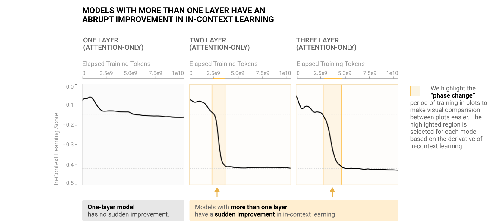
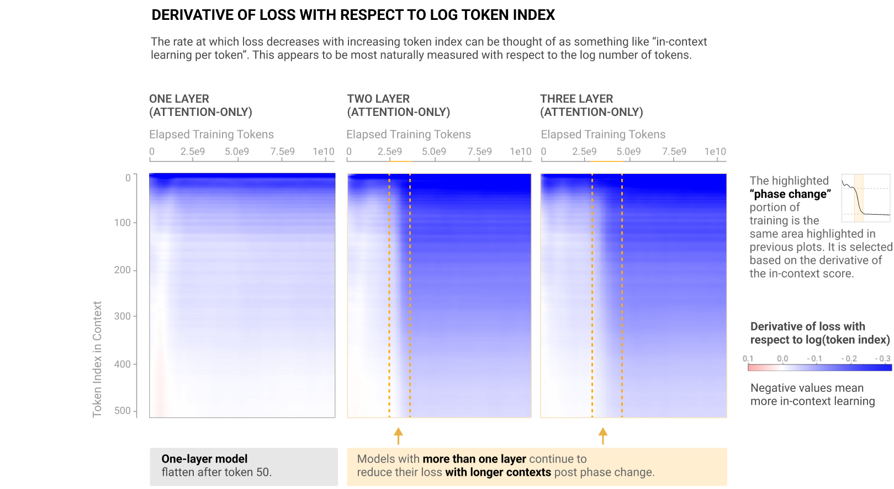
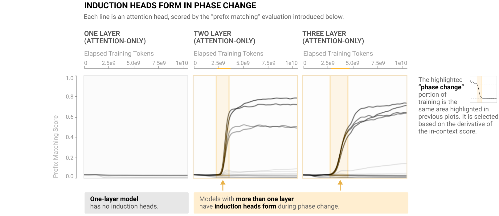
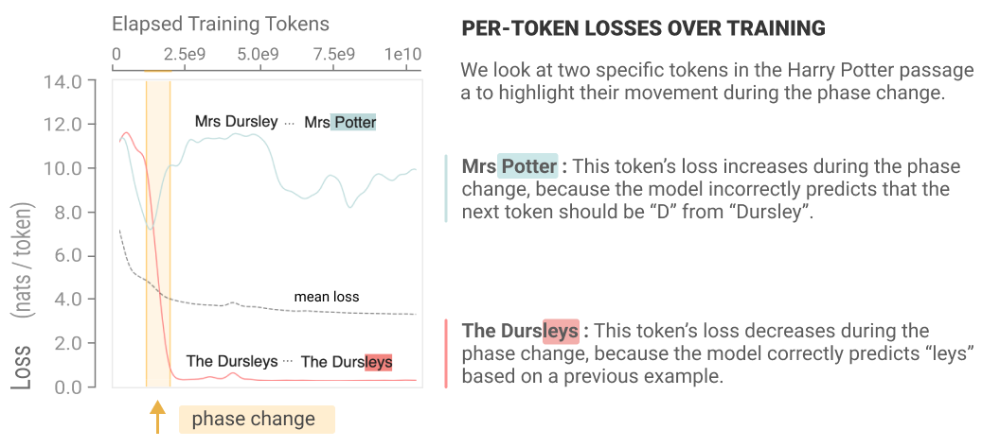
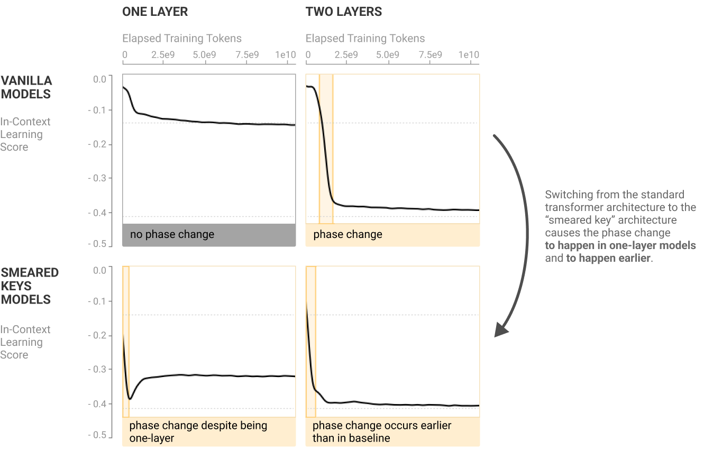
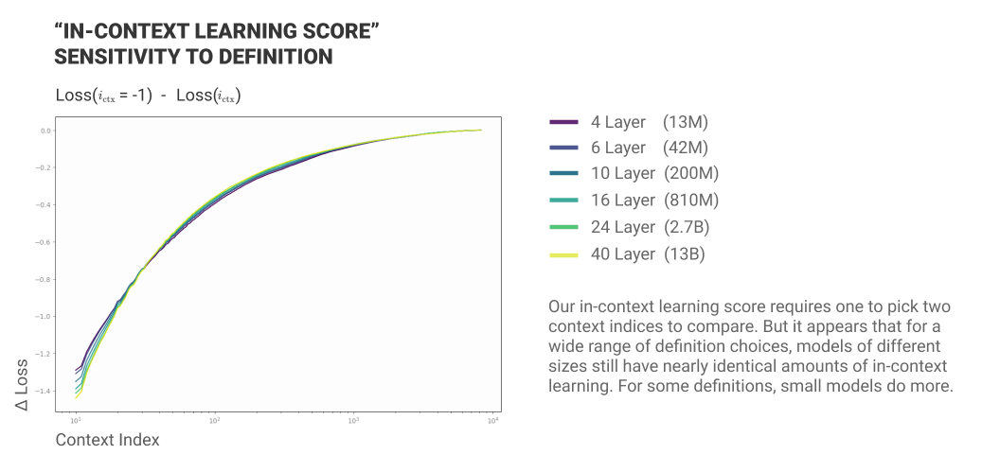
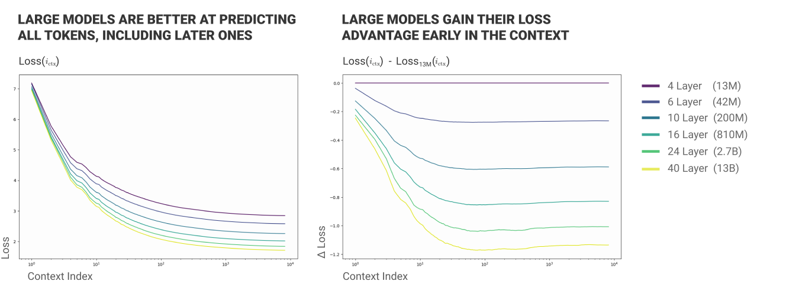
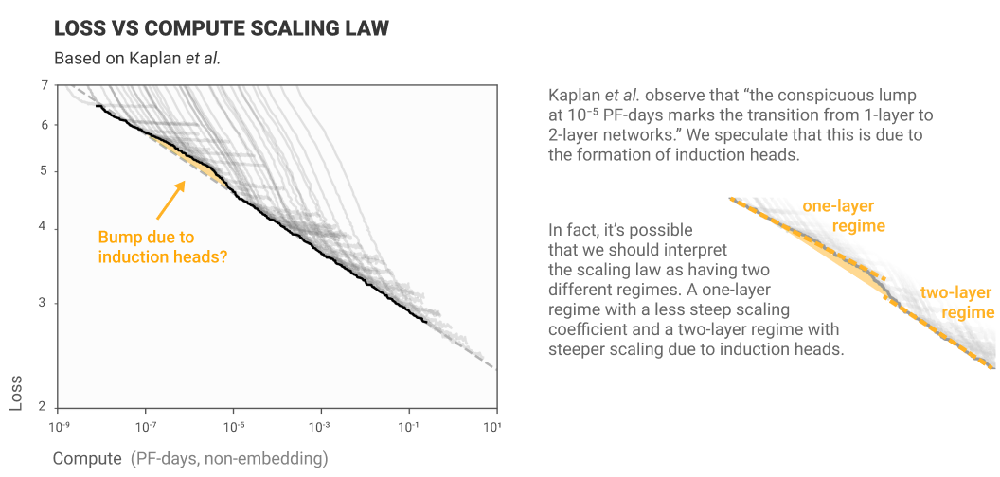

# 上下文学习与归纳头（中英对照）

> 原文标题：In-context Learning and Induction Heads
> 原文链接：https://transformer-circuits.pub/2022/in-context-learning-and-induction-heads/index.html
> 研究页：https://www.anthropic.com/research/in-context-learning-and-induction-heads
> 原文作者：Catherine Olsson, Nelson Elhage, Neel Nanda 等（Anthropic）
> 发布日期：2022-03-08
> **翻译模型：** GLM-5.3-Flash
> **评分：** ★★★★★（5/5，里程碑）—— 用六条互补证据（宏观共现、架构扰动、直接消融、抽象行为示例、机制可行性、跨规模连续性）论证归纳头是 in-context learning 的机制来源，机制可解释性从玩具模型迈向真实模型的关键一步
> 排版：每段英文原文在前，中文翻译紧随其后。本文收录正文主体；原页附录（模型明细表、数据收集与方法细节、复现评论、致谢与引用信息等）未收录。

---

As Transformer generative models continue to scale and gain increasing real world use , addressing their associated safety problems becomes increasingly important. Mechanistic interpretability – attempting to reverse engineer the detailed computations performed by the model – offers one possible avenue for addressing these safety issues. If we can understand the internal structures that cause Transformer models to produce the outputs they do, then we may be able to address current safety problems more systematically, as well as anticipating safety problems in future more powerful models. [^1]

随着 Transformer 生成式模型不断扩展规模、获得越来越多的现实应用，解决其相关安全问题正变得日益重要。机制可解释性（mechanistic interpretability）——尝试对模型所执行的详细计算进行逆向工程——为应对这些安全问题提供了一条可能的途径。如果我们能理解促使 Transformer 模型产生其输出的那些内部结构，那么我们也许就能更系统地处理当前的安全问题，并更好地预判未来更强大模型中可能出现的安全问题。[^1]

In the past, mechanistic interpretability has largely focused on CNN vision models, but recently, we [presented](https://transformer-circuits.pub/2021/framework/index.html) some very preliminary progress on mechanistic interpretability for Transformer language models​​. Specifically, in our prior work we developed a mathematical framework for decomposing the operations of transformers, which allowed us to make sense of small (1 and 2 layer attention-only) models and give a near-complete account of how they function. Perhaps the most interesting finding was the induction head, a circuit whose function is to look back over the sequence for previous instances of the current token (call it A), find the token that came after it last time (call it B), and then predict that the same completion will occur again (e.g. forming the sequence [A][B] … [A] → [B]). In other words, induction heads “complete the pattern” by copying and completing sequences that have occurred before. Mechanically, induction heads in our models are implemented by a circuit of two attention heads: the first head is a “previous token head” which copies information from the previous token into the next token, while the second head (the actual “induction head”) uses that information to find tokens preceded by the present token. For 2-layer attention-only models,[^2] we were able to show precisely that induction heads implement this pattern copying behavior and appear to be the primary source of in-context learning.

过去，机制可解释性主要聚焦于 CNN 视觉模型；但最近，我们针对 Transformer 语言模型的机制可解释性[提出了](https://transformer-circuits.pub/2021/framework/index.html)一些非常初步的进展。具体来说，在前作中我们开发了一套用于分解 transformer 运算的数学框架，使我们能够理解小型（1 层与 2 层纯注意力）模型，并对它们如何运作给出近乎完整的解释。其中最有趣的发现也许是归纳头（induction head）：这类电路的功能是回看序列、寻找当前 token（记作 A）此前出现过的实例，找到上一次紧随其后的 token（记作 B），然后预测同样的补全会再次出现（例如形成序列 [A][B] … [A] → [B]）。换言之，归纳头通过复制并补全以前出现过的序列来“完成模式”。从机制上讲，我们模型中的归纳头由两个注意力头（attention head）构成的电路实现：第一个头是“前一 token 头”（previous token head），它把前一个 token 的信息复制到下一个 token；第二个头（即真正的“归纳头”）则利用这一信息去寻找其前面是当前 token 的那些 token。对于 2 层纯注意力模型，[^2] 我们能够精确证明归纳头实现了这种模式复制行为，而且它们似乎就是上下文学习（in-context learning）的主要来源。

Ultimately, however, our goal is to reverse-engineer frontier language models (which often contain hundreds of layers and billions or trillions of parameters), not merely 2-layer attention-only models. Unfortunately, both the presence of many layers, and the presence of MLPs, makes it much more difficult to mathematically pin down the precise circuitry of these models. However, a different approach is possible: by empirically observing, perturbing, and studying the learning process and the formation of various structures, we can try to assemble an indirect case for what might be happening mechanistically inside the network. This is somewhat similar to how a neuroscientist might gain understanding of how part of the brain functions by looking at neural development over time, studying patients with an injury to that part of the brain, perturbing brain function in animals, or looking at a select small number of relevant neurons.

然而，我们最终的目标是对前沿语言模型（它们通常包含数百层以及数十亿乃至数万亿参数）进行逆向工程，而不仅仅是 2 层纯注意力模型。遗憾的是，层数众多与 MLP 的存在，都使得从数学上精确锁定这些模型的电路结构变得困难得多。不过，另一条路是可行的：通过对学习过程与各种结构的形成进行经验性观察、扰动与研究，我们可以尝试为“网络内部机制上可能正在发生什么”拼合出一个间接论证。这在某种程度上类似于神经科学家的做法：通过长期观察神经发育过程、研究该脑区受损的病人、扰动动物的脑功能，或观察挑选出的少量相关神经元，来理解大脑某一部分的功能。

In this paper, we take the first preliminary steps towards building such an indirect case. In particular, we present preliminary and indirect evidence for a tantalizing hypothesis: that induction heads might constitute the mechanism for the actual majority of all in-context learning in large transformer models. Specifically, the thesis is that there are circuits which have the same or similar mechanism to the 2-layer induction heads and which perform a “fuzzy” or “nearest neighbor” version of pattern completion, completing [A*][B*] … [A] → [B] , where  A* ≈ A and B* ≈ B are similar in some space; and furthermore, that these circuits implement most in-context learning in large models.

在本文中，我们朝着构建这样一个间接论证迈出了初步的第一步。特别地，我们为一个引人遐想的假说提供了初步且间接的证据：归纳头可能构成了大型 transformer 模型中所有上下文学习的实际主体机制。具体来说，我们的论点是：存在一些电路，其机制与 2 层模型中的归纳头相同或相似，执行的是一种“模糊”或“最近邻”版本的模式补全，即补全 [A*][B*] … [A] → [B]，其中 A* ≈ A、B* ≈ B 在某种空间中彼此相似；此外，这些电路实现了大型模型中的大部分上下文学习。

The primary way in which we obtain this evidence is via discovery and study of a phase change that occurs early in training for language models of every size (provided they have more than one layer), and which is visible as a bump in the training loss. During this phase change, the majority of in-context learning ability (as measured by difference in loss between tokens early and late in the sequence) is acquired, and simultaneously induction heads form within the model that are capable of implementing fairly abstract and fuzzy versions of pattern completion. We study this connection in detail to try to establish that it is causal, including showing that if we perturb the transformer architecture in a way that causes the induction bump to occur in a different place in training, then the formation of induction heads as well as formation of in-context learning simultaneously move along with it.

我们获得这些证据的主要方式，是发现并研究一种发生在训练早期的相变（phase change）——只要语言模型层数超过一层，无论规模大小都会出现，并在训练损失上表现为一个凸起。在这一相变期间，大部分上下文学习能力（以序列前部与后部 token 的损失之差来衡量）被习得；与此同时，模型内部形成了能够实现相当抽象、相当模糊的模式补全的归纳头。我们详细研究了这一联系，试图确立它是因果的，包括证明：如果我们以某种方式扰动 transformer 架构，使得“归纳凸起”在训练中出现在别的位置，那么归纳头的形成与上下文学习的形成也会随之同步移动。

Specifically, the paper presents six complementary lines of evidence arguing that induction heads may be the mechanistic source of general in-context learning in transformer models of any size:

具体而言，本文给出了六条互补的证据线，论证归纳头可能是任意规模 transformer 模型中一般性上下文学习的机制来源：

- Argument 1 (Macroscopic co-occurrence): Transformer language models undergo a “phase change” early in training, during which induction heads form and simultaneously in-context learning improves dramatically.

- 论据 1（宏观共现，Macroscopic co-occurrence）：Transformer 语言模型在训练早期经历一次“相变”，在此期间归纳头形成，同时上下文学习急剧改善。

- Argument 2 (Macroscopic co-perturbation): When we change the transformer architecture in a way that shifts whether induction heads can form (and when), the dramatic improvement in in-context learning shifts in a precisely matching way.

- 论据 2（宏观共扰动，Macroscopic co-perturbation）：当我们以某种改变“归纳头能否形成（以及何时形成）”的方式修改 transformer 架构时，上下文学习的急剧改善也会以精确匹配的方式随之移动。

- Argument 3 (Direct ablation):  When we directly “knock out” induction heads at test-time in small models, the amount of in-context learning greatly decreases.

- 论据 3（直接消融，Direct ablation）：当我们在小型模型中于测试时直接“敲除”（knock out）归纳头时，上下文学习的量会大幅下降。

- Argument 4 (Specific examples of induction head generality): Although we define induction heads very narrowly in terms of copying literal sequences, we empirically observe that these same heads also appear to implement more sophisticated types of in-context learning, including highly abstract behaviors, making it plausible they explain a large fraction of in-context learning.

- 论据 4（归纳头普适性的具体实例，Specific examples of induction head generality）：尽管我们对归纳头的定义非常狭窄——仅针对逐字复制序列——但我们通过经验观察到，这些同样的头似乎也实现着更复杂的上下文学习类型，包括高度抽象的行为，这使得“它们解释了相当大一部分上下文学习”变得可信。

- Argument 5 (Mechanistic plausibility of induction head generality): For small models, we can explain mechanistically how induction heads work, and can show they contribute to in-context learning. Furthermore, the actual mechanism of operation suggests natural ways in which it could be re-purposed to perform more general in-context learning.

- 论据 5（归纳头普适性的机制可行性，Mechanistic plausibility of induction head generality）：对于小模型，我们可以从机制上解释归纳头如何工作，并能证明它们对上下文学习有贡献。此外，其实际运作机制暗示了一些自然的方式，可将其重新用于执行更一般性的上下文学习。

- Argument 6 (Continuity from small to large models): In the previous 5 arguments, the case for induction heads explaining in-context learning is stronger for small models than for large ones. However, many behaviors and data related to both induction heads and in-context learning are smoothly continuous from small to large models, suggesting the simplest explanation is that mechanisms are the same.

- 论据 6（从小模型到大模型的连续性，Continuity from small to large models）：在前 5 条论据中，归纳头解释上下文学习的论证在小模型上比在大模型上更强。然而，与归纳头和上下文学习都相关的许多行为与数据，在从小模型到大模型的过程中平滑连续，这暗示最简单的解释是：机制是相同的。

Together the claims establish a circumstantial case that induction heads might be responsible for the majority of in-context learning in state-of-the-art transformer models. We emphasize that our results here are only the beginnings of evidence for such a case, and that like any empirical or interventional study, a large number of subtle confounds or alternative hypotheses are possible – which we discuss in the relevant sections. But we considered these results worth reporting, both because future work could build on our results to establish the claim more firmly, and because this kind of indirect evidence is likely to be common in interpretability as it advances, so we’d like to establish a norm of reporting it even when it is not fully conclusive.

这些主张合在一起，构成了一个间接性的论证：归纳头可能是最先进 transformer 模型中大部分上下文学习的成因。我们要强调，本文的结果只是这类论证的开端性证据；而且像任何经验性或干预性研究一样，可能存在大量微妙的混淆因素或替代假说——我们会在相关章节中讨论。但我们认为这些结果值得报告，一是因为后续工作可以在我们的结果之上更牢固地确立这一主张，二是因为随着可解释性的推进，这类间接证据可能会越来越常见，我们希望确立一种惯例：即便证据尚不完全确凿，也要予以报告。

Finally, in addition to being instrumental for tying induction heads to in-context learning, the phase change may have relevance to safety in its own right. Neural network capabilities — such as multi-digit addition — are known to sometimes abruptly form or change as models train or increase in scale, and are of particular concern for safety as they mean that undesired or dangerous behavior could emerge abruptly. For example reward hacking, a type of safety problem, can emerge in such a phase change. Thus, studying a phase change “up close” and better understanding its internal mechanics could contain generalizable lessons for addressing safety problems in future systems. In particular, the phase change we observe forms an interesting potential bridge between the microscopic domain of interpretability and the macroscopic domain of scaling laws and learning dynamics.

最后，除了有助于把归纳头与上下文学习联系起来之外，相变本身也可能与安全直接相关。众所周知，神经网络的能力——例如多位数加法——有时会在模型训练或规模扩大时突然形成或改变；这对安全尤其令人担忧，因为这意味着不期望的或危险的行为可能突然出现。例如，奖励劫持（reward hacking）这类安全问题就可能在这样的相变中出现。因此，“近距离”研究一次相变、更好地理解其内部机制，可能蕴含着应对未来系统安全问题的可推广启示。特别是，我们观察到的相变在可解释性的微观领域与缩放定律（scaling laws）和学习动态（learning dynamics）的宏观领域之间，构成了一座有趣的潜在桥梁。

The rest of the paper is organized as follows. We start by clarifying several key concepts and definitions, including in-context learning, induction heads, and a “per-token loss analysis” method we use throughout. We then present the 6 arguments one by one, drawing on evidence from analysis of 34 transformers over the course of training, including more than 50,000 attention head ablations (the data of which is shown in the Model Analysis Table). We then discuss some unexplained “curiosities” in our findings, as well as reviewing related work.

本文其余部分的组织如下。我们首先澄清若干关键概念与定义，包括上下文学习、归纳头，以及我们贯穿全文使用的一种“逐 token 损失分析”（per-token loss analysis）方法。随后我们借助对 34 个 transformer 训练过程的分析证据——包括超过 50,000 次注意力头消融（数据展示于模型分析表（Model Analysis Table）中）——逐一给出这 6 条论据。接着我们讨论发现中一些尚未解释的“疑点”（curiosities），并回顾相关工作。
## 关键概念（Key Concepts）

### 上下文学习（In-context Learning）

In modern language models, tokens later in the context are easier to predict than tokens earlier in the context. As the context gets longer, loss goes down. In some sense this is just what a sequence model is designed to do (use earlier elements in the sequence to predict later ones), but as the ability to predict later tokens from earlier ones gets better, it can increasingly be used in interesting ways (such as specifying tasks, giving instructions, or asking the model to match a pattern) that suggest it can usefully be thought of as a phenomenon of its own. When thought of in this way, it is usually referred to as in-context learning.[^3]

在现代语言模型中，上下文中较靠后的 token 比靠前的 token 更容易预测。随着上下文变长，损失随之下降。从某种意义上说，这正是序列模型被设计出来要做的事（用序列中较早的元素预测较晚的元素）；但随着“从较早的 token 预测较晚的 token”的能力越来越好，它可以被越来越多地以有趣的方式使用（例如指定任务、给出指令，或要求模型匹配某种模式），这表明把它富有成效地视为一种独立的现象是合理的。当这样看待它时，人们通常称之为上下文学习。[^3]

Emergent in-context learning was noted in GPT-2 and gained significant attention in GPT-3. Simply by adjusting a “prompt”, transformers can be adapted to do many useful things without re-training, such as translation, question-answering, arithmetic, and many other tasks. Using “prompt engineering” to leverage in-context learning became a popular topic of study and discussion.

GPT-2 中已经注意到涌现的上下文学习，而它在 GPT-3 中获得了极大关注。仅仅通过调整一个“提示”（prompt），transformer 就能无需重新训练而被适配去做许多有用的事情，例如翻译、问答、算术以及许多其他任务。利用“提示工程”（prompt engineering）来发挥上下文学习的力量，成了一个热门的研究与讨论话题。

At least two importantly different ways of conceptualizing and measuring in-context learning exist in the literature. The first conception, represented in Brown et al., focuses on few-shot learning of specific tasks. The model is prompted with several instances of some “task” framed in a next-token-prediction format (such as few-digit addition, or English-to-French translation). The second conception of in-context learning, represented in Kaplan et al., focuses on observing the loss at different token indices, in order to measure how much better the model gets at prediction as it receives more context. The first conception can be thought of as a micro perspective (focusing on specific tasks), whereas the second conception can be seen as a macro perspective (focusing on general loss, which on average correlates with these tasks).

文献中至少存在两种重要不同的、对上下文学习进行概念化与测量的方式。第一种以 Brown et al. 为代表，聚焦于特定任务的少样本学习（few-shot learning）：用若干以“下一个 token 预测”格式呈现的某个“任务”实例来提示模型（例如多位数加法，或英译法）。第二种以 Kaplan et al. 为代表，聚焦于观察不同 token 位置上的损失，以衡量模型在获得更多上下文时预测能力提升多少。第一种可以看作微观视角（聚焦具体任务），第二种可以看作宏观视角（聚焦总体损失，它在平均意义上与这些任务相关）。

The “few-shot learning” conception of in-context learning has tended to receive greater community attention. The ability to do many different tasks with one large model, even without further fine-tuning, is a notable change to the basic economics of model training. Moreover, it gives evidence of wide-ranging general capabilities and the ability to adapt on the fly, which nudges us to re-examine what it means for a model to “understand” or to “reason”.

上下文学习的“少样本学习”概念往往获得了社区更多的关注。用一个大模型完成许多不同的任务，甚至无需进一步微调，这是对模型训练基本经济学的一次显著改变。此外，它提供了广泛通用能力与即时适应能力的证据，促使我们重新审视模型“理解”或“推理”意味着什么。

However, for the purposes of this work, we focus instead on the Kaplan et al. conception: decreasing loss at increasing token indices. We do so because it's a more general framing of the phenomenon than “few-shot learning”. A drawback of this definition is it fails to isolate specific behaviors of interest. At the same time, it allows us to measure models’ overall ability to learn on-the-fly from the context, without depending on our specific choices of “task”.  We’ll also see that, starting from this definition, we are also able to study a couple classic few-shot learning examples (see Argument 4).

然而，就本文的目的而言，我们转而聚焦于 Kaplan et al. 的概念：损失随 token 位置的增大而下降。我们这样做，是因为它比“少样本学习”更能概括这一现象的一般性。这一定义的缺点是无法分离出我们感兴趣的具体行为；与此同时，它使我们能够测量模型从上下文中即时学习的整体能力，而不依赖于我们对“任务”的特定选择。我们还将看到，从这个定义出发，我们也能够研究几个经典的少样本学习例子（见论据 4）。

Throughout this work we compute a simple heuristic measure of in-context learning:

在整个工作中，我们使用一个简单的启发式度量来计算上下文学习：

- In-context learning score: the loss of the 500th token in the context minus the average loss of the 50th token in the context, averaged over dataset examples.

- 上下文学习分数（in-context learning score）：上下文中第 500 个 token 的损失减去第 50 个 token 的平均损失，再对数据集样本取平均。

We chose the 500th and 50th token indices somewhat arbitrarily. The 500th token is near the end of a length-512 context, and the 50th token is far enough into the context that some basic properties of the text have been established (such as language and document type) while still being near the start. We will also show that picking different numbers here does not change our conclusions.

我们对第 500 和第 50 个 token 位置的选择略显随意。第 500 个 token 接近长度为 512 的上下文的末端，而第 50 个 token 已深入上下文到足以确定文本的一些基本属性（例如语言与文档类型），同时仍靠近开头。我们还将证明，在这里换用别的数字并不会改变我们的结论。

Finally, it is worth noting that in-context learning is of potentially special relevance to safety. In-context learning makes it harder to anticipate how a model might behave after a long context. In the longer run, concepts such as mesa-optimization or inner-alignment postulate that meaningful learning or optimization could occur at test time (without changing the weights). In-context learning would be an obvious future mechanism for such hidden optimization to occur, whether or not it does so today. Thus, studying in-context learning seems valuable for the future.

最后，值得指出的是，上下文学习对安全可能具有特殊的相关性。上下文学习使人更难预料模型在长上下文之后会如何行事。从更长远看，mesa-optimization（内部优化）或 inner-alignment（内部对齐）等概念假定，有意义的学习或优化可能发生在测试时（不改变权重）。上下文学习将是这类隐藏优化未来发生的一种显而易见的机制——无论它今天是否已经如此。因此，研究上下文学习对未来而言似乎很有价值。

(See Related Work for more on in-context learning, and Discussion for more on the connection to safety.)

（关于上下文学习的更多内容，见“相关工作”一节；关于其与安全之间联系的更多内容，见“讨论”一节。）

### 归纳头（Induction Heads）

In our [previous paper](https://transformer-circuits.pub/2021/framework/index.html), we discovered a special kind of attention head – which we named induction heads – in two layer attention-only models. Induction heads are implemented by a circuit consisting of a pair of attention heads in different layers that work together to copy or complete patterns. The first attention head copies information from the previous token into each token. This makes it possible for the second attention head to attend to tokens based on what happened before them, rather than their own content. Specifically, the second head (which we call the "induction head") searches for a previous place in the sequence where the present token A occurred and attends to the next token (call it B), copying it and causing the model to be more likely to output B as the next token. That is, the two heads working together cause the sequence …[A][B]…[A] to be more likely to be completed with [B].

在我们的[前一篇论文](https://transformer-circuits.pub/2021/framework/index.html)中，我们在两层纯注意力模型中发现了一种特殊的注意力头——我们将其命名为归纳头。归纳头由一个电路实现，该电路由处于不同层、协同工作以复制或补全模式的一对注意力头构成。第一个注意力头把前一个 token 的信息复制到每个 token 上。这使得第二个注意力头能够基于某个位置之前发生的内容、而不是该位置自身的内容来决定关注哪里。具体来说，第二个头（我们称之为“归纳头”）会搜索序列中先前出现过当前 token A 的位置，并关注其后的 token（记作 B），把它复制过来，使模型更有可能输出 B 作为下一个 token。也就是说，这两个头协同工作，使序列 …[A][B]…[A] 更有可能以 [B] 补全。

Induction heads are named by analogy to inductive reasoning. In inductive reasoning, we might infer that if A is followed by B earlier in the context, A is more likely to be followed by B again later in the same context. Induction heads crystallize that inference. They search the context for previous instances of the present token, attend to the token which would come next if the pattern repeated, and increase its probability. Induction heads attend to tokens that would be predicted by basic induction (over the context, rather than over the training data).

归纳头的命名类比于归纳推理（inductive reasoning）。在归纳推理中，我们可能会推断：如果在此上下文中较早处 A 后面跟着 B，那么在同一个上下文中较晚处 A 更可能再次跟着 B。归纳头把这种推断“结晶”下来：它们在上下文中搜索当前 token 的先前实例，关注“若模式重复则接下来会出现”的那个 token，并提高其概率。归纳头关注的，正是由基本归纳所预测的 token（在上下文之上归纳，而不是在训练数据之上归纳）。

Notice that induction heads are implementing a simple algorithm, and are not memorizing a fixed table of n-gram statistics. The rule [A][B] … [A] → [B] applies regardless of what A and B are.[^4] This means that induction heads can in some sense work out of distribution, as long as local statistics early in the context are representative of statistics later. This hints that they may be capable of more general and abstract behavior.

注意，归纳头实现的是一个简单算法，并不是在记忆一张固定的 n-gram 统计表。规则 [A][B] … [A] → [B] 的成立与 A、B 具体是什么无关。[^4] 这意味着，只要上下文前部的局部统计量能够代表后部的统计量，归纳头在某种意义上就能在分布外工作。这暗示它们可能具备更一般、更抽象的行为能力。

Our previous paper focused on a few explorations of induction heads, including showing that these heads occur in 2-layer attention-only models (but not 1-layer models); tracking down how they operate mechanistically as part of our mathematical decomposition of transformers; and making an eigenvalue-based test for detecting their presence. However, we were a bit vague on the exact definition of induction heads: it was more like we found a cluster of behaviors and mechanisms that tended to occur together, and called heads in that cluster “induction heads”.

我们的前一篇论文对归纳头做了若干探索，包括证明这些头出现在 2 层纯注意力模型中（而不出现在 1 层模型中）；作为 transformer 数学分解的一部分，追踪它们在机制上如何运作；以及提出一种基于特征值的检验来检测它们的存在。不过，我们对归纳头的确切定义当时有些含糊：更像是我们发现了一簇倾向于同时出现的行为与机制，并把该簇中的头称为“归纳头”。

In this paper our goal is to provide evidence for something more expansive: that induction heads play a major role in general in-context learning (not just literal [A][B]...[A]→[B] copying), for large models and not just for small 2-layer attention only models.  To do this clearly and coherently, we need a more precise definition of induction heads. Mechanistic analysis of weights and eigenvalue analysis are much more complicated in large models with MLP’s, so for this paper we choose to define induction heads by their narrow empirical sequence copying behavior (the [A][B]...[A]→[B]), and then attempt to show that they (1) also serve a more expansive function that can be tied to in-context learning, and (2) coincide with the mechanistic picture for small models.

在本文中，我们的目标是为一个更宏大的命题提供证据：归纳头在一般性上下文学习（而不仅仅是字面上的 [A][B]...[A]→[B] 复制）中扮演主要角色，而且是在大型模型中，而不仅仅是小型 2 层纯注意力模型。为了清晰而连贯地做到这一点，我们需要一个更精确的归纳头定义。在带 MLP 的大模型中，基于权重的机制分析与特征值分析都要复杂得多，因此本文选择按归纳头狭义的经验性序列复制行为（即 [A][B]...[A]→[B]）来定义它们，然后尝试证明：(1) 它们还服务于一种更宽泛的功能，且该功能可以与上下文学习挂钩；(2) 它们与小模型的机制图景相吻合。

Formally, we define an induction head as one which exhibits the following two properties[^5] on a repeated random sequence[^6] of tokens:

形式上，我们把归纳头定义为在 token 组成的重复随机序列[^6] 上展现以下两种性质[^5] 的头：

- Prefix matching: The head attends back to previous tokens that were followed by the current and/or recent tokens.[^7] That is, it attends to the token which induction would suggest comes next.

- 前缀匹配（prefix matching）：该头回看关注那些其后跟着当前 token 和/或近期 token 的先前 token。[^7] 也就是说，它关注的正是归纳推断中接下来会出现的那个 token。

- Copying: The head’s output increases the logit corresponding to the attended-to token.

- 复制（copying）：该头的输出会提高与被关注 token 相对应的 logit。

In other words, induction heads are any heads that empirically increase the likelihood of [B] given [A][B]...[A] when shown a repeated sequence of completely random tokens. An illustration of induction heads’ behavior is shown here:

换言之，归纳头就是任何这样的头：当看到完全随机 token 组成的重复序列时，它们会在给定 [A][B]...[A] 的情况下，经验性地提高 [B] 的可能性。归纳头行为的示例如下：

Note that, as a consequence, induction heads will tend to be good at repeating sequences wholesale. For example, given “The cat sat on the mat. The cat …”, induction heads will promote the continuation “sat on the mat”. This gives a first hint of how they might be connected to general in-context learning and even few-shot learning: they learn to repeat arbitrary sequences, which is a (simple) form of few-shot learning.

注意，由此可以推知，归纳头往往会擅长整段重复序列。例如，给定 “The cat sat on the mat. The cat …”，归纳头会促进续写 “sat on the mat”。这首次暗示了它们可能与一般性上下文学习乃至少样本学习之间的联系：它们学会重复任意序列，而这正是（一种简单的）少样本学习。

One of the things we’ll be trying to establish is that when induction heads occur in sufficiently large models and operate on sufficiently abstract representations, the very same heads that do this sequence copying also take on a more expanded role of analogical sequence copying or in-context nearest neighbors. By this we mean that they promote sequence completions like [A*][B*] … [A] → [B] where A* is not exactly the same token as A but similar in some embedding space, and also B is not exactly the same token as B*. For example, A and A* (as well as B and B*) might be the same word in different languages, and the induction head can then translate a sentence word by word by looking for “something like A”, finding A* followed by B*, and then completing with “something like B*” (which is B). We are not yet able to prove mechanistically that induction heads do this in general, but in Argument 4 we show empirical examples of induction heads behaving in this way (including on translation), and in Argument 5 we point out that the known copying mechanism of induction heads in small models can be naturally adapted to function in this way.

我们要试图确立的一点是：当归纳头出现在足够大的模型中、并作用于足够抽象的表示时，执行这种序列复制的同一批头也会承担起更扩展的角色——类比式序列复制，或上下文中的最近邻。我们指的是，它们会促进形如 [A*][B*] … [A] → [B] 的序列补全，其中 A* 与 A 并非同一个 token，而是在某个嵌入空间中相似，B 与 B* 的关系同理。例如，A 与 A*（以及 B 与 B*）可能是不同语言中的同一个词，这样归纳头就可以通过寻找“类似 A 的东西”、找到其后跟着 B* 的 A*、然后用“类似 B* 的东西”（即 B）来补全，从而逐词翻译一个句子。我们尚无法从机制上普遍证明归纳头会这样做，但在论据 4 中我们给出了归纳头如此行事的实证例子（包括翻译任务），并在论据 5 中指出：小模型中归纳头已知的复制机制可以自然地改造为以这种方式运作。

### 逐 token 损失分析（Per-Token Loss Analysis）

To better understand how models evolve during training, we analyze what we call the "per-token loss vectors." The core idea traces back to a method used by Erhan et al. , and more generally to the idea of "function spaces" in mathematics.[^8]

为了更好地理解模型在训练中如何演化，我们分析一种我们称之为“逐 token 损失向量”（per-token loss vectors）的东西。其核心思想可以追溯到 Erhan et al. 使用过的方法，以及更一般意义上数学中的“函数空间”思想。[^8]

We start with a collection of models. (In our use, we'll train several different model architectures, saving dozens of “snapshots” of each over the course of training. We’ll use this set of snapshots as our collection of models.) Next, we collect the log-likelihoods each model assigns to a consistent set of 10,000 random tokens, each taken from a different example sequence. We combine these log-likelihoods into a "per-token loss vector" and apply Principal Component Analysis (PCA):

我们从一组模型出发。（在我们的用法中，我们会训练几种不同的模型架构，并在训练过程中为每个模型保存数十个“快照”。我们将用这组快照作为我们的模型集合。）接下来，我们收集每个模型分配给一组固定的 10,000 个随机 token 的对数似然，每个 token 取自不同的样本序列。我们把这些对数似然组合成一个“逐 token 损失向量”，并对其应用主成分分析（PCA）：

A more detailed discussion of technical details can be found in the Appendix.

关于技术细节的更详细讨论见附录。

By applying this method to snapshots over training for multiple models, we can visualize and compare how different models' training trajectories evolve in terms of their outputs. Since we're using PCA, each direction can be thought of as a vector of log-likelihoods that models are moving along. We particularly focus on the first two principal components, since we can easily visualize those. Of course, models also move in directions not captured by the first two principal components, but it's a useful visualization for capturing the highest-level story of training.

通过把该方法应用于多个模型训练过程中的快照，我们可以可视化并比较不同模型的训练轨迹在其输出层面如何演化。由于使用的是 PCA，每个方向都可以被看作一个由对数似然构成的向量，模型正沿着它移动。我们特别关注前两个主成分，因为它们易于可视化。当然，模型也会在前两个主成分未能捕捉的方向上移动，但作为捕捉训练最高层故事的可视化手段，它已经相当有用。

## 论证归纳头是大多数上下文学习之机制的论据（Arguments that induction heads are the mechanism for the majority of in-context learning.）

Now we’ll proceed to the main part of the paper, which makes the case that induction heads may provide the primary mechanism for the majority of in-context learning for transformer models in general. As stated in the introduction, this is a very broad hypothesis and much of our evidence is indirect, but nevertheless we believe that all the lines of evidence together make a relatively strong, though not conclusive, case.

现在我们进入本文的主体部分，论证归纳头可能为一般 transformer 模型中大部分上下文学习提供主要机制。如引言所述，这是一个非常宽泛的假说，我们的许多证据是间接的；但我们仍然相信，所有证据线合在一起构成了一个相对有力、虽然并非决定性的论证。

Before we go through the arguments, it’s useful to delineate where the evidence is more conclusive vs. less conclusive. This is shown in the table below. For small, attention-only models, we believe we have strong evidence that attention heads are the mechanism for the majority of in-context learning, as we have evidence supported by ablations and mechanistic reverse engineering. Conversely, for all models, we can make a strong case that induction heads play some role in in-context learning, as we can demonstrate examples and show suggestive correlations. However, the larger the models get, the harder it is to establish that induction heads account for the actual majority of in-context learning. For large models with MLP’s, we must therefore rely on mainly correlational evidence, which could be confounded. We explore alternate hypotheses throughout, including at the end of Argument 1 and again briefly in ​​Argument 6.

在逐条展开论据之前，先划清哪些证据更确凿、哪些不那么确凿是有益的。下表给出了展示。对于小型纯注意力模型，我们相信我们拥有强有力的证据表明注意力头是大部分上下文学习的机制，因为我们的证据有消融和机制层面的逆向工程支持。相反，对于所有模型，我们都能有力地论证归纳头在上下文学习中扮演某种角色，因为我们可以展示实例并给出有暗示性的相关性。然而，模型越大，就越难确立归纳头占上下文学习实际大多数这一论断。因此，对于带 MLP 的大模型，我们不得不主要依赖相关性证据，而相关性证据可能存在混淆。我们会全程探索替代假说，包括在论据 1 的末尾，以及在论据 6 中再次简要讨论。

Here is the list of arguments we’ll be making, one per section, repeated from the introduction:

下面是我们要给出的论据清单，每节一条，重复自引言：

- Argument 1 (Macroscopic co-occurrence): Transformer language models undergo a “phase change” early in training, during which induction heads form and simultaneously in-context learning improves dramatically.

- 论据 1（宏观共现，Macroscopic co-occurrence）：Transformer 语言模型在训练早期经历一次“相变”，在此期间归纳头形成，同时上下文学习急剧改善。

- Argument 2 (Macroscopic co-perturbation): When we change the transformer architecture in a way that shifts whether induction heads can form (and when), the dramatic improvement in in-context learning shifts in a precisely matching way.

- 论据 2（宏观共扰动，Macroscopic co-perturbation）：当我们以某种改变“归纳头能否形成（以及何时形成）”的方式修改 transformer 架构时，上下文学习的急剧改善也会以精确匹配的方式随之移动。

- Argument 3  (Direct ablation):  When we directly “knock out” induction heads at test-time in small models, the amount of in-context learning greatly decreases.

- 论据 3（直接消融，Direct ablation）：当我们在小型模型中于测试时直接“敲除”归纳头时，上下文学习的量会大幅下降。

- Argument 4 (Specific examples of induction head generality): Although we define induction heads very narrowly in terms of copying literal sequences, we empirically observe that these same heads also appear to implement more sophisticated types of in-context learning, including highly abstract behaviors, making it plausible they explain a large fraction of in-context learning.

- 论据 4（归纳头普适性的具体实例，Specific examples of induction head generality）：尽管我们对归纳头的定义非常狭窄——仅针对逐字复制序列——但我们通过经验观察到，这些同样的头似乎也实现着更复杂的上下文学习类型，包括高度抽象的行为，这使得“它们解释了相当大一部分上下文学习”变得可信。

- Argument 5 (Mechanistic plausibility of induction head generality): For small models, we can explain mechanistically how induction heads work, and can show they contribute to in-context learning.  Furthermore, the actual mechanism of operation suggests natural ways in which it could be repurposed to perform more general in-context learning.

- 论据 5（归纳头普适性的机制可行性，Mechanistic plausibility of induction head generality）：对于小模型，我们可以从机制上解释归纳头如何工作，并能证明它们对上下文学习有贡献。此外，其实际运作机制暗示了一些自然的方式，可将其重新用于执行更一般性的上下文学习。

- Argument 6 (Continuity from small to large models): In the previous 5 arguments, the case for induction heads explaining in-context learning is stronger for small models than for large ones.  However, many behaviors and data related to both induction heads and in-context learning are smoothly continuous from small to large models, suggesting the simplest explanation is that mechanisms are the same.

- 论据 6（从小模型到大模型的连续性，Continuity from small to large models）：在前 5 条论据中，归纳头解释上下文学习的论证在小模型上比在大模型上更强。然而，与归纳头和上下文学习都相关的许多行为与数据，在从小模型到大模型的过程中平滑连续，这暗示最简单的解释是：机制是相同的。

For each argument, we’ll have a similar table to the one in this section, showing the strength of the evidence provided by that claim as it applies to large/small models and some/most of context learning. The table above is the sum of the evidence from all six lines of reasoning.

对于每条论据，我们都会给出一个与本节类似的表格，展示该主张在适用于大/小模型以及部分/大部分上下文学习时所能提供的证据强度。上表是全部六条推理线索证据的总和。
## 论据 1：Transformer 语言模型在训练中经历「相变」，归纳头在此期间形成，上下文学习能力同时急剧提升（Argument 1: Transformer language models undergo a “phase change” during training, during which induction heads form and simultaneously in-context learning improves dramatically.）

Our first line of evidence comes from correlating measures of in-context learning and measures of induction head presence over the course of training. Specifically, we observe a tight co-variation between them across dozens of models, of different sizes, trained on different datasets (See Model Analysis Table for more on the models in which we observe this co-occurrence.).

我们的第一条证据来自把上下文学习的度量与归纳头存在性的度量在训练过程中进行关联。具体而言，我们在数十个不同规模、在不同数据集上训练的模型中观察到两者之间紧密的共变（关于我们观察到这种共现的模型，详见模型分析表（Model Analysis Table））。

The table below summarizes the quality of this evidence for the models we have studied: it applies to both large and small models, and is the expected outcome if induction heads were responsible for the majority of in-context learning, but it is only correlational and so could be confounded (discussed more below).

下表总结了这一证据对我们所研究模型的质量：它同时适用于大模型与小模型，并且是“若归纳头负责大部分上下文学习”时的预期结果；但它只是相关性的，因此可能存在混淆（下文详述）。

Our first observation is that if we measure in-context learning for transformer models over the course of training (defined as the 50th token loss minus the 500th token loss as described in Key Concepts), it develops abruptly in a narrow window early in training (roughly 2.5 to 5 billion tokens) and then is constant for the rest of training (see figure below).  Before this window there is less than 0.15 nats of in-context learning, after it there is roughly 0.4 nats, an amount that remains constant for the rest of training and is also constant across many different model sizes (except for the one layer model where not much in-context learning ever forms).  This seems surprising – naively, one might expect in-context learning to improve gradually over training, and improve with larger model sizes,[^9] as most things in machine learning do.

我们的第一项观察是：如果在训练过程中测量 transformer 模型的上下文学习（定义为第 50 个 token 损失减去第 500 个 token 损失，如“关键概念”所述），它会在训练早期一个狭窄的窗口内（大约 25 亿至 50 亿 token）突然发展出来，然后在其余训练过程中保持恒定（见下图）。在这个窗口之前，上下文学习不足 0.15 nats；之后约为 0.4 nats，这个量在其余训练中保持恒定，并且在许多不同的模型规模之间也保持恒定（唯一例外是 1 层模型，它几乎没有形成什么上下文学习）。这看起来令人惊讶——想当然地，人们会期望上下文学习随着训练逐渐改善，并随着模型规模增大而改善，[^9] 就像机器学习中的大多数事物那样。

Although we only show three models above, the pattern holds true very generally: many examples are shown in the Model Analysis Table later in the paper, including models of varying model architecture and size.

虽然上图只展示了三个模型，但这一模式在非常普遍的范围内成立：本文后面的模型分析表中展示了许多例子，包括不同架构与规模的模型。

One might wonder if the sudden increase is somehow an artifact of the choice to define in-context learning in terms of the difference between the 500th and 50th tokens. We'll discuss this in more depth later. But for now, an easy way to see that this is a robust phenomenon is to look at the derivative of loss with respect to the logarithm token index in context. You can think of this as measuring something like "in-context learning per ε% increase in context length." We can visualize this on a 2D plot, where one axis is the amount of training that has elapsed, the other is the token index being predicted. Before the phase change, loss largely stops improving around token 50, but after the phase change, loss continues to improve past that point.

有人可能会怀疑，这一突然增长是否是“以第 500 与第 50 个 token 之差来定义上下文学习”这一选择的某种人为产物。我们稍后会更深入地讨论。但现在，看出这是一个稳健现象的一个简单方法，是观察损失对上下文中 token 位置对数的导数。你可以把它理解为测量某种“上下文长度每增加 ε% 带来的上下文学习量”。我们可以把它画在一张二维图上：一个轴是已经过去的训练量，另一个轴是被预测的 token 位置。相变之前，损失大约在第 50 个 token 处就基本停止改善；相变之后，损失在那之后仍会继续改善。

It turns out that a sudden improvement in in-context learning isn't the only thing that changes in this window. If we go through the attention heads of a model and score them for whether they are induction heads (using a prefix matching score which measures their ability to perform the task we used to define induction heads in Key Concepts), we find that induction heads form abruptly during exactly the same window where in-context learning develops (figure below). Again we show only a few models here, but a full set is shown in the Model Analysis Table. The exception is the one-layer model, where induction heads never form – just as in-context learning never substantially develops for the one-layer model.

事实证明，在这个窗口中发生变化的并不只有上下文学习的突然改善。如果我们遍历模型的注意力头，为它们是否是归纳头打分（使用前缀匹配分数（prefix matching score），它衡量头完成我们在“关键概念”中用于定义归纳头的那项任务的能力），我们发现归纳头恰恰在上下文学习形成的同一个窗口内突然形成（下图）。这里我们同样只展示少数几个模型，完整集合见模型分析表。例外是 1 层模型：归纳头从不形成——正如 1 层模型的上下文学习从不实质性发展一样。

This already strongly suggests some connection between induction heads and in-context learning, but beyond just that, it appears this window is a pivotal point for the training process in general: whatever's occurring is visible as a bump on the training curve (figure below). It is in fact the only place in training where the loss is not convex (monotonically decreasing in slope).

这已经强烈暗示了归纳头与上下文学习之间存在某种联系；但不止于此，这个窗口似乎还是整个训练过程的一个关键节点：无论正在发生什么，它都表现为训练曲线上的一个凸起（下图）。事实上，这是整个训练过程中损失唯一不具有凸性（斜率单调递减）的地方。

That might not sound significant, but the loss curve is averaging over many thousands of tokens. Many behaviors people find interesting in language models, such as the emergence of arithmetic, would be microscopic on the loss curve. For something to be visible at that scale suggests it's a widespread, major change in model behavior. This shift also appears to be the first point where, at least for small models, the loss curve diverges from a one-layer model – which does not display the bump, just as it does not display the other abrupt changes.

这听起来也许无关紧要，但损失曲线是对数千个 token 求平均的结果。人们在语言模型中觉得有趣的许多行为（例如算术能力的涌现）在损失曲线上都将是微观的。某种东西能在这一尺度上可见，意味着它是模型行为中一次广泛而重大的改变。这一转变似乎也是（至少对小模型而言）损失曲线首次偏离 1 层模型之处——1 层模型不显示这一凸起，正如它也不显示其他突变一样。

We can also apply principal components analysis (PCA) to the per-token losses, as described in per-token-loss analysis, which allows us to summarize the main dimensions of variation in how several models' predictions vary over the course of training.

我们还可以对逐 token 损失应用主成分分析（PCA），如“逐 token 损失分析”所述，这使我们能够概括若干模型的预测在训练过程中变化的主要维度。

Below we show the first two principal components of these models’ predictions, with the golden outline highlighting the same interval shown above, when in-context learning abruptly improved. We see that the training trajectories pivot during exactly the same window where the other changes happen. In some sense, whatever is occurring when in-context learning improves is the primary deviation from the basic trajectory our transformers follow during the course of their training.  Once again the only exception is the one-layer model – where induction heads cannot form and in-context learning does not improve.

下图展示这些模型预测的前两个主成分，金色轮廓标出的正是上文所示、上下文学习突然改善的同一区间。我们看到，训练轨迹恰恰在其他变化发生的同一个窗口内发生转折。在某种意义上，上下文学习改善时所发生的事情，正是我们的 transformer 在整个训练过程中对基本轨迹的首要偏离。同样，唯一的例外是 1 层模型——归纳头无法形成，上下文学习也不改善。

In summary, the following things all co-occur during the same abrupt window:

总结一下，以下几件事都在同一个突变窗口内同时发生：

- Capacity for in-context learning sharply improves (as measured via the in-context learning score).

- 上下文学习能力急剧提升（以上下文学习分数衡量）。

- Induction heads form.

- 归纳头形成。

- Loss undergoes a small “bump” (that is, the loss curve undergoes a period of visibly steeper improvement than the parts of the curve before and after).

- 损失经历一个小的“凸起”（即损失曲线经历一段改善明显陡于曲线前后部分的时期）。

- The model’s trajectory abruptly changes (in the space of per-token losses, as visualized with PCA).

- 模型的轨迹突然改变（在逐 token 损失空间中，以 PCA 可视化）。

Collectively these results suggest that some important transition is happening during the 2.5e9 to 5e9 token window early in training (for large models this is maybe 1–2% of the way through training). We call this transition “the phase change”, in that it’s an abrupt change that alters the model’s behavior and has both macroscopic (loss and in-context learning curves) and microscopic (induction heads) manifestations, perhaps analogous to e.g. ice melting. [^10]

综合来看，这些结果暗示：在训练早期 2.5e9 到 5e9 token 的窗口内（对大模型而言大约是整个训练进程的 1–2%）正在发生某种重要转变。我们称这一转变为“相变”（the phase change）——它是一次突然的改变，改变了模型的行为，并兼具宏观（损失与上下文学习曲线）与微观（归纳头）两个层面的表现，或许可以类比于例如冰的融化。[^10]

### 更近距离地观察相变（Looking at the Phase Change More Closely）

A natural explanation would be that for all these models, the induction heads implement in-context learning: their formation is what drives all the other changes observed. To strengthen this hypothesis a bit, we check a few things. First, the window where the phase change happens doesn’t appear to correspond to a scheduled change in learning rate, warmup, or weight decay; there is not some known exogenous factor precipitating everything. Second, we tried out training some of the small models on a different dataset, and we observed the phase change develop in the same way (see Model Analysis Table for more details). [^11]

一个自然的解释是：对所有这些模型而言，归纳头实现了上下文学习——归纳头的形成驱动了所有其他被观察到的变化。为了稍稍强化这一假说，我们检查了几件事。首先，相变发生的窗口似乎并不对应于学习率、预热（warmup）或权重衰减（weight decay）的任何计划性变化；并不存在某个已知的外生因素促成了这一切。其次，我们尝试在另一个数据集上训练部分小模型，并观察到相变以同样的方式出现（更多细节见模型分析表）。[^11]

Third, to strengthen the connection a little more, we look qualitatively and anecdotally at what’s going on with the model’s behavior during the phase change. One way to do this is to look at specific tokens the model gets better and worse at predicting. The model's loss is an average of billions of log-likelihood losses for individual tokens. By pulling them apart, we can get a sense for what's changed.

第三，为了进一步强化这一联系，我们对相变期间模型行为中正在发生什么做一点定性、轶事式的考察。一种方法是观察模型在哪些具体 token 上预测得更好、哪些更糟。模型的损失是数十亿个单独 token 对数似然损失的平均值。把这些拆开来看，我们就能对发生了什么变化有一个感觉。

Concretely, let's pick a piece of text – for fun, we'll use the first paragraph of Harry Potter – and look at the differences in log-likelihoods comparing the start and the end of the phase change.[^12] We'll notice that the majority of the changes occur when tokens are repeated multiple times in the text. If a sequence of tokens occurs multiple times, the model is better at predicting the sequence the second time it shows up. On the other hand, if a token is followed by a different token than it previously was, the post-phase-change model is worse at predicting it:

具体来说，让我们选一段文本——为了好玩，我们用《哈利·波特》的第一段——并比较相变开始与结束时对数似然的差异。[^12] 我们会注意到，大多数变化发生在文本中多次重复的 token 上。如果一个 token 序列出现了多次，模型在第二次见到它时预测得更好。反过来，如果一个 token 后面跟着的 token 与它此前的情况不同，相变后的模型对它的预测会更差：

We can also do this same analysis over the course of model training. The loss curve is the average of millions of per-token loss curves. We can break this apart and look at the loss curves for individual tokens.

我们也可以在整个模型训练过程中做同样的分析。损失曲线是数百万条逐 token 损失曲线的平均。我们可以把它拆开，观察单个 token 的损失曲线。

In particular, let’s take a look at per-token loss trajectories for two tokens in the first paragraph of Harry Potter. In red, we show a token whose prediction gets dramatically better during the phase change: it’s the last of four tokens in “ The Dursleys”, a sequence that appears several times in the text. In blue, we show a token that gets meaningfully worse during the phase change: it’s the first-ever appearance of “ Mrs Potter”, after both previous instances of “ Mrs” were followed by “ Dursley” instead.

特别地，让我们看看《哈利·波特》第一段中两个 token 的逐 token 损失轨迹。红色显示的是一个在相变期间预测显著变好的 token：它是 “ The Dursleys” 中四个 token 的最后一个，该序列在文本中出现了数次。蓝色显示的是一个在相变期间明显变差的 token：它是 “ Mrs Potter” 的首次出现，此前两个 “ Mrs” 实例后面跟的都是 “ Dursley”。

All of this shows that during the phase change, we see exactly the behaviors we’d expect to see if induction heads were indeed contributing the majority of in-context learning.

所有这些都表明，在相变期间，我们看到的正是“如果归纳头确实贡献了大部分上下文学习”时所预期的行为。

### 评估证据（Assessing the Evidence）

Despite all of the co-occurrence evidence above (and more in the Model Analysis Table), the fact remains that we haven’t shown that induction heads are the primary mechanism for in-context learning. We have merely shown that induction heads form at the same time as in-context learning, and that in-context learning does not improve thereafter. There are a number of potential confounds in this story. Below we summarize reasons in favor and against thinking the connection is causal. The argument in favor might look like this:

尽管有上述全部共现证据（以及模型分析表中的更多证据），事实仍然是：我们尚未证明归纳头是上下文学习的主要机制。我们只是证明了归纳头与上下文学习同时形成，而且此后上下文学习不再改善。这一叙事中存在若干潜在混淆。下面我们总结支持与反对“这一联系是因果的”的理由。支持一方的论证可能是这样的：

- The formation of induction heads is correlated with a great increase in models' capacity for in-context learning, for a wide variety of models large and small.

- 归纳头的形成与模型上下文学习能力的大幅提升相关，适用于大大小小的各种模型。

- It's highly improbable these two sharp transitions would co-occur across so many models by pure chance, without any causal connection.

- 这两个剧变在如此多的模型上纯粹出于巧合而同时发生、却没有任何因果联系，是极不可能的。

- There is almost surely some connection, and the simplest possibility is that induction heads are the primary mechanism driving the observed increase in in-context learning. (However, as discussed below, it could also be a confounding variable.)

- 几乎可以肯定存在某种联系，而最简单的可能是：归纳头是驱动所观察到的上下文学习增长的主要机制。（不过，如下文所述，它也可能是一个混淆变量。）

- Since over 75% of final in-context learning forms in this window, one might naively believe this to be the amount of in-context learning that induction heads are responsible for.

- 由于最终上下文学习的 75% 以上都在这个窗口内形成，人们可能天真地认为这就是归纳头所负责的上下文学习量。

However, the following issues and confounds suggest caution:

然而，以下问题与混淆提示我们保持谨慎：

- In large models, we have low time resolution on our analysis over training. Co-occurrence when one only has 15 points in time is less surprising and weaker evidence.

- 在大模型上，我们对训练过程分析的时间分辨率很低。当只有 15 个时间点时，共现就没那么令人惊讶，证据也更弱。

- Perhaps other mechanisms form in our models at this point, that contribute to not only induction heads, but also other sources of in-context learning. (For example, perhaps the phase change is really the point at which the model learns how to compose layers through the residual stream, enabling both induction heads and potentially many other mechanisms that also require composition of multiple heads) Put another way, perhaps the co-occurrence is primarily caused by a shared latent variable, rather than direct causality from induction heads to the full observed change in in-context learning.

- 也许我们的模型此时形成了其他机制，它们不仅促成归纳头，也促成了上下文学习的其他来源。（例如，也许相变实际上正是模型学会如何通过残差流（residual stream）组合各层的时刻，这既使归纳头成为可能，也可能使许多同样需要多头组合的其他机制成为可能。）换个说法，也许共现主要是由一个共同的潜变量引起的，而不是由“归纳头直接导致所观察到的上下文学习全部变化”这种直接因果性引起的。

- The fact that in-context learning score is roughly constant (at 0.4 nats) after the phase change doesn't necessarily mean that the underlying mechanisms of in-context learning are constant after that point. In particular, the metric we use measures a relative loss between the token index 500 and 50, and we know that the model’s performance at token 50 improves over training time. Reducing the loss a fixed amount from a lower baseline is likely harder, and so may be driven by additional mechanisms as training time goes on. [^13][^14]

- 相变之后上下文学习分数大致恒定（在 0.4 nats）这一事实，并不必然意味着上下文学习的底层机制在那之后也恒定。特别是，我们使用的度量衡量的是 token 位置 500 与 50 之间的相对损失，而我们知道模型在第 50 个 token 处的表现随训练时间提升。从一个更低的基线出发降低同样的损失量可能更难，因此随着训练时间的推移，它可能由额外的机制驱动。[^13][^14]

One point worth noting here is that the argument that induction heads account for most in-context learning at the transition point of the phase change is more solid than the argument that they account for most in-context learning at the end of training – a lot could be changing during training even as the in-context learning score remains constant.

这里值得指出的一点是：归纳头在相变这一转折点上解释大部分上下文学习的论证，比“它们在训练结束时解释大部分上下文学习”的论证更扎实——即使上下文学习分数保持恒定，训练期间仍可能有很多东西在变化。
## 论据 2：当我们以改变归纳头何时形成或能否形成的方式修改 transformer 架构时，上下文学习的急剧提升会以精确匹配的方式移动（Argument 2: When we change the transformer architecture in a way that shifts when induction heads form or whether they can form, the dramatic improvement in in-context learning shifts in a precisely matching way.）

One thing that falls short about Argument 1 is that we’re just observing induction heads and in-context learning co-vary; like any observational study, it is not as convincing as if we actively changed one thing and measured what happened to the other. In this section we do a more “interventional” experiment, in which we change the model architecture in a way that makes induction heads easier to form, and observe the effect on in-context learning. The change makes a bigger difference for smaller models so is more convincing there, but also carries some amount of weight for larger models (see table above).

论据 1 的不足之处在于，我们只是在观察归纳头与上下文学习的共变；与任何观察性研究一样，它不如“主动改变一件事并测量另一件事如何变化”有说服力。在本节中，我们做了一个更“干预性”的实验：以一种使归纳头更容易形成的方式改变模型架构，并观察其对上下文学习的影响。这一改动对更小的模型影响更大，因此在小模型上更有说服力，但对更大的模型也有一定分量（见上表）。

To design our experiment, we start with the observation (noted in the previous section) that the phase change and the corresponding improvement in in-context learning only occurs in transformers with more than one layer. This is what we'd predict if induction heads were the mechanism for the majority of in-context learning: induction heads require a composition of attention heads, which is only possible with two or more layers.[^15]

为了设计实验，我们从上一节指出的观察出发：相变以及相应的上下文学习改善，只发生在层数大于一的 transformer 中。如果归纳头是大部分上下文学习的机制，这正是我们会做出的预测：归纳头需要注意力头之间的组合（composition），而这只有在两层或更多层时才可能。[^15]

Of course, the observation about one-layer models is pretty weak evidence by itself. (One could imagine one-layer models being different from models with more layers in all sorts of ways!) But it suggests a more general line of attack. If induction heads are the mechanism behind the large improvement in in-context learning, that makes predictions about the minimum architectural requirements in order to achieve the observed improvement. For a standard transformer, the important thing is to have two attention layers. But that's only because the key vectors need to be a function of the attended token and the token before it.

当然，关于 1 层模型的观察本身是相当弱的证据。（人们可以想象 1 层模型在方方面面都与多层模型不同！）但它提示了一条更一般的攻击路线。如果归纳头是上下文学习大幅改善背后的机制，那它就对“实现所观察到的改善所需的最小架构要求”做出了预测。对于标准 transformer，关键在于拥有两个注意力层。但这只是因为 key 向量需要是被关注 token 及其前一 token 的函数。

We define a “smeared key" architecture with a very simple modification that should make it easy for transformers of any depth to express induction heads. In our modified models, for each head h, we introduce a trainable real parameter \alpha^h which we use as \sigma(\alpha^h) \in [0, 1] to interpolate between the key for the current token and previous token[^16]: k^h_j ~=~ \sigma(\alpha^h) k^h_j ~+~ (1-\sigma(\alpha^h)) k^h_{j-1} The hypothesis that induction heads are the primary mechanism of in-context learning predicts that the phase change will happen in one-layer models with this change, and perhaps might happen earlier in models with more layers. If they're one of several major contributing factors, we might expect some of the in-context learning improvement to happen early, and the rest at the same time as the original phase change.

我们定义了一种“涂抹 key”（smeared key）架构，只需一个非常简单的修改，就应当能让任何深度的 transformer 都容易表达归纳头。在修改后的模型中，对每个头 h，我们引入一个可训练的实参数 \alpha^h，并将其用作 \sigma(\alpha^h) \in [0, 1]，在当前 token 与前一 token 的 key 之间做插值[^16]：k^h_j ~=~ \sigma(\alpha^h) k^h_j ~+~ (1-\sigma(\alpha^h)) k^h_{j-1} “归纳头是上下文学习主要机制”这一假说预测：有了这一修改，相变将发生在 1 层模型中，而且在更多层的模型中也许会更早发生。如果归纳头只是若干主要促成因素之一，我们可能预期一部分上下文学习改善提前发生，其余部分则与原有相变同时发生。

The results (figure below) are in line with the predictions: when we use the smeared-key architecture, in-context learning does indeed form for one-layer models (when it didn’t before), and it forms earlier for two-layer and larger models.  More such results can be seen in the model analysis table.

结果（下图）与预测一致：当我们使用涂抹 key 架构时，1 层模型确实形成了上下文学习（此前不会形成），而 2 层及更大的模型则更早形成。更多此类结果见模型分析表。

However, we probably shouldn't make too strong an inference about large models on this evidence. This experiment suggests that induction heads are the minimal mechanism for greatly increased in-context learning in transformers. But one could easily imagine that in larger models, this mechanism isn’t the whole story, and also this experiment doesn’t refute the idea of the mechanism of in-context learning changing over the course of training.

不过，基于这一证据，我们或许不应对大模型做出太强的推断。这个实验表明，归纳头是 transformer 中上下文学习大幅增加的最小机制。但人们很容易想象，在更大的模型中这一机制并非故事的全部；而且该实验也无法反驳“上下文学习的机制在训练过程中发生改变”这一想法。

## 论据 3：当我们在测试时直接“敲除”小模型中的归纳头时，上下文学习的量会大幅下降（Argument 3: When we directly “knock out” induction heads in small models at test-time, the amount of in-context learning greatly decreases.）

For the cases they cover, ablations are by far our strongest evidence. The basic argument is that knocking out induction heads decreases the amount of in-context learning we observe in our models. By “knocking out” we mean that we remove a given attention head from the model at test time, doing a forward pass on the transformer without it. (See our methods section for exact details of how the ablation is done.)

就其所覆盖的情形而言，消融（ablation）是我们目前最强的证据。基本论证是：敲除归纳头会减少我们在模型中观察到的上下文学习量。所谓“敲除”，是指在测试时从模型中移除给定的注意力头，在没有它的情况下对 transformer 做一次前向传播。（消融如何完成的确切细节见我们的方法部分。）

The ablations presented below show how attention heads contribute to in-context learning, but we can also do ablations to study how attention heads contribute to the overall behavior change that occurs during the phase change (see the Model Analysis Table).

下面展示的消融显示注意力头如何影响上下文学习；但我们也可以做消融，研究注意力头如何影响相变期间发生的整体行为变化（见模型分析表）。

In fact, almost all the in-context learning in small attention-only models appears to come from these induction heads! This begins at the start of the phase change, and remains true through the end of training.[^17]

事实上，小型纯注意力模型中几乎所有的上下文学习似乎都来自这些归纳头！这从相变开始时起成立，并一直保持到训练结束。[^17]

Unfortunately, we do not have ablations for our full-scale models.[^18] For the models where we do have ablations, it seems like this evidence is clearly dispositive that induction heads increase in-context learning (at least as we've chosen to evaluate it). But can we further infer that they're the primary mechanism? A couple considerations:

遗憾的是，我们没有对全尺寸模型的消融。[^18] 对于我们确有消融的模型，这一证据似乎清楚地表明确实是归纳头增加了上下文学习（至少按我们所选择的评估方式）。但我们能否进一步推断它们是主要机制？有几点考虑：

- In attention-only models, in-context learning must essentially be a sum of contributions from different attention heads.[^19] But in models with MLPs, in-context learning could also come from interactions between MLP and attention layers. While ablating attention heads would affect such mechanisms, the relationship between the effect of the ablation on in-context learning and its true importance becomes more complicated.[^20] As a result, we can't be fully confident that head ablations in MLP models give us the full picture.

- 在纯注意力模型中，上下文学习在本质上必然是不同注意力头贡献之和。[^19] 但在带 MLP 的模型中，上下文学习也可能来自 MLP 层与注意力层之间的交互。消融注意力头会影响这类机制，但“消融对上下文学习的影响”与“其真实重要性”之间的关系变得更加复杂。[^20] 因此，我们不能完全确信 MLP 模型中的头消融给了我们完整的图景。

- Our ablations measure the marginal effects of removing attention heads from the model. To the extent two heads do something similar and the layer norm before the logits rescales things, the importance of individual heads may be masked.

- 我们的消融测量的是“从模型中移除注意力头”的边际效应。当两个头做着类似的事情、且 logits 之前的层归一化（layer norm）会重新缩放时，单个头的重要性可能被掩盖。

All things considered, we feel comfortable concluding from this that induction heads are the primary mechanism for in-context learning in small attention-only models, but see this evidence as only suggestive for the MLP case.

综合考虑，我们觉得可以放心地由此得出结论：归纳头是小型纯注意力模型中上下文学习的主要机制；但对 MLP 情形，我们只把这证据视为暗示性的。

## 论据 4：尽管被狭窄地定义为复制随机序列，归纳头却能实现出人意料地抽象的上下文学习类型（Argument 4: Despite being defined narrowly as copying random sequences, induction heads can implement surprisingly abstract types of in-context learning.）

All of our previous evidence (in Arguments 1–3) focused on observing or perturbing the connection between induction head formation and macroscopic in-context learning. A totally different angle is to just find examples of induction heads implementing seemingly-difficult in-context learning behaviors; this would make it plausible that induction heads account for the majority of in-context learning. This evidence applies even to the very largest models (and we study up to 12B parameter models), but since it shows only a small number of tasks, it’s only suggestive regarding in-context learning in general.

我们之前的所有证据（论据 1–3）都聚焦于观察或扰动归纳头形成与宏观上下文学习之间的联系。一个完全不同的角度，是直接寻找归纳头实现看似困难的上下文学习行为的实例；这会使“归纳头解释了大部分上下文学习”变得可信。这一证据甚至适用于最大的模型（我们研究到 120 亿参数模型），但由于它只展示了少量任务，对一般性的上下文学习而言只是暗示性的。

Recall that we define induction heads as heads that empirically copy arbitrary token sequences using a “prefix matching” attention pattern. Our goal is to find heads that meet this definition but also perform more interesting and sophisticated behaviors, essentially showing that induction heads in large models can be “generalizable”.

回顾一下，我们把归纳头定义为使用“前缀匹配”注意力模式、经验性地复制任意 token 序列的头。我们的目标是找到既满足这一定义、又执行更有趣更复杂行为的头，本质上是想表明：大模型中的归纳头可以是“可泛化的”。

In this argument, we show some anecdotal examples of induction heads from larger transformers (our 40-layer model with 13 billion parameters) that exhibit exactly such behaviors – namely literal copying, translation, and a specific type of abstract pattern matching. The behaviors are all of the form [A*][B*]...[A][B], aka the “fuzzy nearest neighbor match” or “find something similar early in the sequence and complete the sequence in analogy”. We verify that these heads score highly on our “copying” and “prefix matching” evaluations (that is, they increase the probability of the token they attend to, and attend to tokens where the prefix matches the present token on random text), and are thus “induction heads” by our strict empirical definition, at the same time as they also perform these more sophisticated tasks.

在这条论据中，我们展示一些来自更大 transformer（我们的 40 层、130 亿参数模型）的归纳头的轶事式实例，它们展现的恰恰是这样一些行为——即逐字复制、翻译，以及一种特定类型的抽象模式匹配。这些行为都是 [A*][B*]...[A][B] 的形式，亦称“模糊最近邻匹配”，或“在序列前部找到相似之物并按类比补全该序列”。我们验证了这些头在我们的“复制”与“前缀匹配”评估中得分很高（即它们提高被关注 token 的概率，并且在随机文本上关注那些前缀与当前 token 匹配的位置），因此按我们严格的经验定义它们是“归纳头”，与此同时它们也在执行这些更复杂的任务。

The results of some example heads are shown in the table below, and described in the subsections below.

一些示例头的结果如下表所示，并在下面的小节中加以描述。

| Head | Layer Depth | Copying score (?) | Prefix matching score (?) |
|---|---|---|---|
| Literal copying head | 21 / 40 | 0.89 | 0.75 |
| Translation head | 7 / 40 | 0.20 | 0.85 |
| Pattern-matching head | 8 / 40 | 0.69 | 0.94 |

| 头（Head） | 层深度（Layer Depth） | 复制分数（Copying score）(?) | 前缀匹配分数（Prefix matching score）(?) |
|---|---|---|---|
| 逐字复制头（Literal copying head） | 21 / 40 | 0.89 | 0.75 |
| 翻译头（Translation head） | 7 / 40 | 0.20 | 0.85 |
| 模式匹配头（Pattern-matching head） | 8 / 40 | 0.69 | 0.94 |

### 行为 1：逐字序列复制（Behavior 1: Literal sequence copying）

We'll start with the simplest case of a head that literally copies repeated text, to get familiar with the visualization interface we're using and the basic dynamics of these heads. We've selected an induction head which seems to perform very basic copying behavior and will look at how it behaves on the first paragraph of Harry Potter. We've repeated the first few sentences afterwards to show the head's behavior on longer segments of repeated text.

我们从最简单的情形开始——一个逐字复制重复文本的头——以此熟悉我们使用的可视化界面以及这些头的基本动态。我们选择了一个似乎执行非常基本复制行为的归纳头，并观察它在《哈利·波特》第一段上的表现。我们在其后重复了开头几句，以展示该头在更长重复文本段上的行为。

The visualization will show two different things:

可视化将展示两件不同的事：

- In red, "Attention" lets you see where the head is attending to predict the next token.

- 红色的 "Attention"（注意力）让你看到该头为预测下一个 token 而正在关注的位置。

- In blue, "Logit attr" shows the earlier tokens that contributed to the prediction of the current token, using "direct-path" logit attribution.[^21]

- 蓝色的 "Logit attr"（logit 归因）使用“直接路径”（direct-path）logit 归因，展示对当前 token 的预测做出贡献的更早 token。[^21]

To start exploring the visualization, we suggest to try hovering your cursor over the second paragraph.

要开始探索这个可视化，我们建议试着把光标悬停在第二段上。

If you explore the visualization, you'll see that the head predicts repeating the names "Dursley" and "Potters"; the phrase "a small son”; and then the entire repeated sentences at the end. In all cases, these successful predictions are made by attending back to a previous instance where this phrase was present in the text.

如果你探索这个可视化，你会看到该头预测重复出现名字 “Dursley” 与 “Potters”、短语 “a small son”，以及末尾整段重复的句子。在所有这些情形中，成功的预测都是通过回看文本中先前出现该短语的位置做出的。
### 行为 2：翻译（Behavior 2: Translation）

It's a well-known result that language models can translate between languages. Intriguingly, we've encountered many examples of induction heads that can do translation. Here, we explore a head we found in layer 7 of our 40-layer model, showcasing translation between English, French, and German. (As with the others in this section, this head is also an “induction head” by the same definition we’ve been using all along, because when shown repeated random tokens, it uses a “prefix matching” attention pattern to copy the sequence verbatim.)

语言模型能够在不同语言之间进行翻译，这是一个广为人知的结果。有趣的是，我们遇到了许多能够做翻译的归纳头实例。这里我们探索一个在我们 40 层模型第 7 层中发现的头，展示英语、法语与德语之间的翻译。（与本节中的其他头一样，按照我们一直在使用的定义，这个头同样是一个“归纳头”：当看到重复的随机 token 时，它会用“前缀匹配”注意力模式逐字复制序列。）

Note that the overall attention pattern (in red, top left) is more or less an “off-diagonal”, but it meanders a little bit away from a sharp diagonal. The meandering is because different languages have different word order and token lengths. As this head attends sequentially to past tokens that will semantically come next, the attended token position in the earlier sentences jumps around.

注意，整体注意力模式（红色，左上）大体是一条“非对角线”，但它会略微偏离一条尖锐的对角线而蜿蜒游走。之所以蜿蜒，是因为不同语言有不同的语序和 token 长度。当这个头按顺序关注过去那些“语义上即将出现”的 token 时，前面句子中被关注 token 的位置会来回跳动。

The logit attribution patterns for this head are not perfectly sharp; that is, even in cases where the attention head is attending to the matching word in an earlier language, it does not always directly increase the logit of the corresponding prediction. We would guess that this is because this head’s output needs to be further processed by later layers. However, taken overall, the direct logit attributions show clear evidence of contributing on net to the correct translation.

这个头的 logit 归因模式并非完全尖锐；也就是说，即使在该注意力头关注更早语言中匹配词的情形下，它也不总是直接提高相应预测的 logit。我们猜测，这是因为该头的输出还需要由后面的层进一步处理。不过，总体来看，直接 logit 归因清楚地表明它在净效果上贡献于正确的翻译。

### 行为 3：模式匹配（Behavior 3: Pattern matching）

In this final example, we show an attention head (found at layer 26 of our 40-layer model) which does more complex pattern matching. One might even think of it as learning a simple function in context! (Again, this head also scores highly on our measurements of “basic” induction behavior when shown repeated random sequences, so it is an induction head by that definition.)

在最后一个例子中，我们展示一个做更复杂模式匹配的注意力头（位于我们 40 层模型的第 26 层）。人们甚至可以把它看作在上下文中学习了一个简单函数！（同样，这个头在看到重复随机序列时，在我们对“基本”归纳行为的测量上也得分很高，因此按该定义它是一个归纳头。）

To explore this behavior, we've generated some synthetic text which follows a simple pattern. Each line follows one of four templates, followed by a label for which template it is drawn from. The template is randomly selected, as are the words which fill in the template:

为了探索这一行为，我们生成了一些遵循简单模式的合成文本。每行遵循四个模板之一，后面跟着一个标明它来自哪个模板的标签。模板是随机选择的，填充模板的词也是随机的：

- (month) (animal): 0

- （月份）（动物）: 0

- (month) (fruit): 1

- （月份）（水果）: 1

- (color) (animal): 2

- （颜色）（动物）: 2

- (color) (fruit): 3

- （颜色）（水果）: 3

Below, we show how the attention head behaves on this synthetic example. To make the diagram easier to read, we've masked the attention pattern to only show the ":" tokens as the destination, and the logit attribution to only show where the output is the integer tokens.

下面我们展示该注意力头在这个合成样例上的表现。为了让图更容易读，我们把注意力模式遮罩为只显示以 “:” token 为目的地的部分，并把 logit 归因遮罩为只显示输出为整数 token 的部分。

This head attends back to a previous instance of the correct category more often than not. It often knows to skip over lines where one of the words is identical but the pattern is wrong (such as “January bird” primarily attending to “April fish” and not “grey bird”). This head isn’t perfect at this, but empirically it allocates about 65% of its attention from the colons to the correct positions, when tested on a range of similar problems.

这个头在多数情况下都会回看关注正确类别的先前实例。它常常知道跳过那些某个词相同但模式错误的行（例如 “January bird” 主要关注 “April fish” 而不是 “grey bird”）。这个头在这方面并不完美，但在一系列类似问题上的测试中，它经验上把大约 65% 的注意力从冒号分配到了正确的位置。

### 那些同时也是归纳头的更抽象的头是怎么回事？（What’s going on with more abstract heads that are also induction heads?）

We emphasize again that the attention heads that we described above simultaneously implement both the abstract behaviors that we described, and these very same attention heads (as in, the exact same head in the same layer) also satisfy the formal definition of induction head (literal copying of random sequences using prefix matching).  The comparison is not a metaphor or a blurring of the definition: induction heads which are defined by their ability to copy literal sequences turn out to also sometimes match more abstract patterns.  This is what the table at the beginning of the section shows empirically.

我们再次强调：上文描述的注意力头同时实现了我们所描述的抽象行为，而这些非常相同的注意力头（即同一层中的完全相同的头）也满足归纳头的形式定义（使用前缀匹配逐字复制随机序列）。这种对照不是隐喻，也不是定义上的模糊：由“能逐字复制序列”定义的归纳头，结果发现有时也能匹配更抽象的模式。这正是本节开头那张表以经验方式展示的内容。

But this still leaves the question: why do the same heads that inductively copy random text also exhibit these other behaviors?  One hint is that these behaviors can be seen as “spiritually similar” to copying.  Recall that where an induction head is defined as implementing a rule like [A][B] … [A] → [B], our empirically observed heads also do something like [A*][B*] … [A] → [B] where A* and B* are similar to A and B in some higher-level representation.  There are several ways these similar behaviors could be connected.  For example, note that the first behavior is a special case of the second, so perhaps induction heads are implementing a more general algorithm that reverts to the special case of copying when given a repeated sequence [^22] .  Another possibility is that induction heads implement literal copying when they take a path through the residual stream that includes only them, but implement more abstract behaviors when they process the outputs of earlier layers that create more abstract representations (such as representations where the same word in English and French are embedded in the same place).

但这仍然留下一个问题：为什么这些归纳式复制随机文本的头也会表现出这些其他行为？一个提示是：这些行为可以被视为与复制在“精神上相似”。回顾一下，归纳头被定义为实现 [A][B] … [A] → [B] 这样的规则，而我们经验观察到的头也会做类似 [A*][B*] … [A] → [B] 的事情，其中 A* 与 B* 在某个更高层的表示中相似于 A 与 B。这些相似的行为有几种可能彼此关联的方式。例如，注意第一种行为是第二种行为的特例，所以也许归纳头实现的是一个更一般的算法，当给定重复序列时会退回到复制这个特例。[^22] 另一种可能性是：归纳头在走一条只包含它们自身的残差流路径时实现逐字复制，而当它们处理由更早各层产生的、携带更抽象表示的输出时（例如英语与法语中同一个词被嵌入到相同位置的表示），则实现更抽象的行为。

In Argument 5 we’ll strengthen this argument by giving a mechanistic account of how induction heads (when doing simple copying with prefix-matching) attend back to the token that comes next in the pattern, and observe that the actual mechanism they use could naturally generalize to more abstract pattern matching.  Our point in this section is just that it's actually quite natural for these more abstract induction heads to also exhibit the basic copying behaviors underlying our definition.

在论据 5 中，我们将通过给出归纳头（在用前缀匹配做简单复制时）如何回看关注模式中下一个 token 的机制性解释来强化这一论证，并观察到它们实际使用的机制可以自然地泛化到更抽象的模式匹配。我们在本节的要点只是：这些更抽象的归纳头同时也展现出作为我们定义基础的基本复制行为，这其实相当自然。

## 论据 5：对小模型，我们可以从机制上解释归纳头如何工作，并能证明它们对上下文学习有贡献；此外，其真实运作机制暗示了可将其重新用于执行更一般上下文学习的自然方式（Argument 5: For small models, we can explain mechanistically how induction heads work, and can show they contribute to in-context learning. Furthermore, the actual mechanism of operation suggests natural ways in which it could be re-purposed to perform more general in-context learning.）

One of the main reasons we care about whether induction heads drive in-context learning is that we can understand them and so have a path to understanding in-context learning. But we can also turn this around: we can use our understanding of induction heads to make a purely logical argument that they should contribute to in-context learning.

我们关心归纳头是否驱动上下文学习的主要原因之一是：我们能够理解归纳头，因此拥有一条理解上下文学习的路径。但我们也可以反过来：利用我们对归纳头的理解，做一个纯逻辑的论证，说明它们应当对上下文学习有贡献。

We begin with a semi-empirical argument. Let's take for granted that induction heads behave the way we've described and empirically seen, searching the context for previous examples and copying what happened next. We should expect such a procedure to improve a model's ability to predict tokens later in its context. We're essentially using the previous context as data points for a nearest neighbor algorithm, and nearest neighbors improves as one gives it more data points. Therefore, if induction heads exist as described, they would contribute to in-context learning as we've defined it.

我们从一个半经验性的论证开始。让我们姑且认定：归纳头以我们所描述并经验看到的方式行事——在上下文中搜索先前的例子，并复制其后发生的内容。我们应当预期，这样的过程会提升模型预测其上下文中较后 token 的能力。我们实际上是把先前的上下文当作最近邻算法的数据点来用，而最近邻方法随着数据点的增多而改进。因此，如果归纳头如所描述的那样存在，它们就会对我们所定义的上下文学习有所贡献。

In some sense, this argument is quite strong if we're only arguing that there exist some cases where induction heads contribute to in-context learning. We've seen concrete examples above where induction heads improve token predictions by copying earlier examples. If nothing else, they must help in those cases! And more generally, our definition of induction heads (in terms of their behavior on repeated random sequences) suggests they behave this way quite generally. This argument doesn't say anything about what fraction of in-context learning is performed by induction heads, but it seems like a very strong argument that some is, both in large and small models.

在某种意义上，如果我们只是论证“存在归纳头对上下文学习有贡献的某些情形”，这个论证是相当强的。上文我们已经看到归纳头通过复制先前例子改善 token 预测的具体实例。至少在这些情形中，它们必定有帮助！更一般地，我们对归纳头的定义（按它们在重复随机序列上的行为）表明它们相当普遍地以这种方式行事。这个论证没有说明归纳头执行了多大比例的上下文学习，但对于“有一部分上下文学习由它们执行”——无论大模型还是小模型——这似乎是一个非常强的论证。

But the really satisfying thing about this line of attack — namely, using our understanding of induction heads to anticipate their impact on in-context learning — is that we can actually drop the dependency on empirical observations of induction head behavior, at the cost of needing to make a more complex argument. In our [previous paper](https://transformer-circuits.pub/2021/framework/index.html), we were able to [reverse engineer](https://transformer-circuits.pub/2021/framework/index.html#how-induction-heads-work) induction heads, showing from the parameter level how they implement induction behavior (and that they should). If we trust this analysis, we can know how induction heads behave without actually running them, and the argument we made in the previous paragraph goes through. Of course, there are some limitations. In the previous paper, we only reverse engineered a single induction head in a small attention-only model, although we can reverse engineer others (and have done so). A bigger issue is that right now we're unable to reverse engineer induction heads in models with MLP layers. But at least in some cases we’ve observed, we can look at the parameters of a transformer and identify induction heads, just as a programmer might identify an algorithm by reading through source code.

但这一路线真正令人满意的地方——利用我们对归纳头的理解来预判它们对上下文学习的影响——在于我们实际上可以去掉对归纳头行为经验观察的依赖，代价是需要一个更复杂的论证。在我们的[前一篇论文](https://transformer-circuits.pub/2021/framework/index.html)中，我们能够对归纳头进行[逆向工程](https://transformer-circuits.pub/2021/framework/index.html#how-induction-heads-work)，从参数层面展示它们如何实现归纳行为（以及它们为何应当如此）。如果我们信任这一分析，我们就能在不实际运行归纳头的情况下知道它们会如何行事，于是上一段的论证便成立了。当然，存在一些限制。在前一篇论文中，我们只逆向工程了小型纯注意力模型中的一个归纳头，尽管我们可以逆向工程其他的头（并且已经这样做了）。一个更大的问题是：目前我们还无法逆向工程带 MLP 层的模型中的归纳头。但至少在我们观察到的一些情形中，我们可以查看 transformer 的参数并识别出归纳头，就像程序员通过阅读源代码识别一个算法那样。

We can actually push this argument a bit further in the case of the two-layer attention only transformer we reverse engineered in the previous paper. Not only do we understand the induction heads and know that they should contribute to in-context learning, but there doesn't seem to really be an alternative mechanism that could be driving it.[^23] This suggests that induction heads are the primary driver of in-context learning, at least in very small models.

对于我们在前一篇论文中逆向工程过的那个两层纯注意力 transformer，我们实际上可以把这个论证再推进一步。我们不仅理解归纳头、知道它们应当对上下文学习有贡献，而且似乎并不存在真正能够驱动它的替代机制。[^23] 这表明归纳头是上下文学习的主要驱动者，至少在非常小的模型中如此。

The following section will briefly summarize reverse engineering induction heads. Note that it relies heavily on linking to our previous paper. We do not expect it to be possible to follow without reading the linked portions. After that, we briefly discuss how the described mechanism could also implement more abstract types of induction head behavior.

下一节将简要总结归纳头的逆向工程。请注意，它严重依赖指向我们前一篇论文的链接；如果不阅读所链接的部分，我们预计无法跟上其内容。在那之后，我们简要讨论所描述的机制如何也能实现更抽象类型的归纳头行为。

### 归纳头逆向工程小结（Summary of Reverse Engineering Induction Heads）

Recall from Key Concepts that induction heads are defined as heads that exhibit both copying and prefix matching.

回顾“关键概念”：归纳头被定义为同时展现复制与前缀匹配的头。

Copying is done by the OV ("Output-Value") circuit. One of the defining properties of an induction head is that it copies. Induction heads are not alone in this! Transformers seem to have quite a number of [copying heads](https://transformer-circuits.pub/2021/framework/index.html#copying--primitive-in-context-learning), of which induction heads are a subset. This is done by having a "copying matrix" OV circuit, most easily characterized by its [positive eigenvalues](https://transformer-circuits.pub/2021/framework/index.html#copying-matrix).

复制由 OV（"Output-Value"，输出-值）电路完成。归纳头的一个定义性性质就是复制。在这方面归纳头并非独有！Transformer 似乎拥有相当数量的[复制头](https://transformer-circuits.pub/2021/framework/index.html#copying--primitive-in-context-learning)，归纳头是其中的一个子集。复制是通过一个“复制矩阵”式 OV 电路实现的，其最易刻画的特点是[正特征值](https://transformer-circuits.pub/2021/framework/index.html#copying-matrix)。

Prefix matching is implemented with K-composition (and to a lesser extent Q-composition) in the QK ("Query-Key") Circuit. In order to do prefix matching, the key vector at the attended token needs to contain information about the preceding tokens — in fact, information about the attended token itself is quite irrelevant to calculating the attention pattern for induction.[^24] In the models we study, “key shifting” occurs primarily using what we call [K-composition](https://transformer-circuits.pub/2021/framework/index.html#three-kinds-of-composition). That is to say that an induction head’s W_K reads from a subspace written to by an earlier attention head. The most basic form of an induction head uses pure K-composition with an earlier “previous token head” to create a QK-Circuit term of the form \text{Id}\otimes h_{prev} \otimes W where W has positive eigenvalues. This term [causes the induction head](https://transformer-circuits.pub/2021/framework/index.html#how-induction-heads-work) to compare the current token with every earlier position's preceding token and look for places where they're similar. More complex QK circuit terms can be used to create induction heads which match on more than just the preceding token.

前缀匹配通过 QK（"Query-Key"，查询-键）电路中的 K 组合（K-composition）（以及在较低程度上的 Q 组合（Q-composition））实现。为了做前缀匹配，被关注 token 处的 key 向量需要包含其前面 token 的信息——事实上，被关注 token 自身的信息对于计算归纳所需的注意力模式是相当无关的。[^24] 在我们研究的模型中，“key 移位”主要借助我们所谓的 [K 组合](https://transformer-circuits.pub/2021/framework/index.html#three-kinds-of-composition)发生。也就是说，归纳头的 W_K 从一个由更早的注意力头写入的子空间中读取。最基本的归纳头形式使用与更早的“前一 token 头”之间的纯 K 组合，构造出形如 \text{Id}\otimes h_{prev} \otimes W 的 QK 电路项，其中 W 具有正特征值。这一项[使归纳头](https://transformer-circuits.pub/2021/framework/index.html#how-induction-heads-work)得以把当前 token 与每个更早位置的前一 token 进行比较，并寻找它们相似的位置。更复杂的 QK 电路项可以用来构造不只匹配前一 token 的归纳头。

Combined, these are a detectable mechanism for induction heads. In the small models we studied in our previous paper, [all induction heads have](https://transformer-circuits.pub/2021/framework/index.html#checking-the-mechanistic-theory) the described QK term driving their attention pattern and a positive eigenvalue circuit performing copying.

合在一起，这些构成了归纳头的一种可检测机制。在我们前一篇论文研究的小模型中，[所有归纳头都拥有](https://transformer-circuits.pub/2021/framework/index.html#checking-the-mechanistic-theory)所描述的驱动其注意力模式的 QK 项，以及一个执行复制的正特征值电路。

Some models use a different mechanism to implement induction heads. In GPT-2, we've seen evidence of a second ["pointer-arithmetic" mechanism](https://transformer-circuits.pub/2021/framework/index.html#pointer-arithmetic) for induction heads. This mechanism makes use of the positional embedding and “Q-composition”. In GPT-2, the earlier attention head attends to previous copies of the current token, and its W_OV circuit copies their positional embedding into a subspace in the present token. The induction head then uses Q-composition to rotate that position embedding one token forward, and thereby attend to the following token. This mechanism isn't available to the models we study here, since they do not add positional information into the residual stream.[^25]

一些模型用不同的机制来实现归纳头。在 GPT-2 中，我们看到了归纳头第二种[“指针算术”机制](https://transformer-circuits.pub/2021/framework/index.html#pointer-arithmetic)的证据。该机制利用位置嵌入与“Q 组合”。在 GPT-2 中，较早的注意力头关注当前 token 的先前副本，其 W_OV 电路把它们的位置嵌入复制到当前 token 的一个子空间中。然后，归纳头用 Q 组合把该位置嵌入向前旋转一个 token，从而关注其后的 token。我们在此研究的模型无法使用这一机制，因为它们不把位置信息加入残差流。[^25]

### 更复杂的归纳头呢？（What About More Complex Induction Heads?）

What about the induction heads we saw in Argument 2 with more complex behavior? Can we also reverse engineer them? Do they operate on the same mechanisms? Presently, fully reverse engineering them is beyond us, since they exist in large models with MLPs, which we don't have a strong framework for mechanistically understanding.  However, we hypothesize they're different in two ways: (1) using more complex QK terms rather than matching on just the previous token; and (2) matching and copying more abstract and sophisticated linguistic features, rather than precise tokens.

那么我们在论据 2 中看到的具有更复杂行为的归纳头呢？我们也能对它们进行逆向工程吗？它们是以相同的机制运作吗？目前，对它们做完全的逆向工程超出了我们的能力，因为它们存在于带 MLP 的大模型中，而我们尚无一个从机制上理解这类模型的强有力框架。不过，我们假说它们在两个方面有所不同：(1) 使用更复杂的 QK 项，而不只是匹配前一 token；(2) 匹配并复制更抽象、更复杂的语言特征，而不是精确的 token。

When we first introduced induction heads, we observed that they could be seen as a kind of "in-context nearest neighbor" algorithm. From this perspective, it seems natural that applying the same mechanism to more abstract features can produce more complex behavior.

当我们最初引入归纳头时，我们曾观察到它们可以被看作一种“上下文最近邻”算法。从这个视角看，把同样的机制应用于更抽象的特征便能产生更复杂的行为，这似乎是自然而然的。
## 论据 6：从小模型的外推表明，归纳头是大模型中大部分上下文学习的成因（Argument 6: Extrapolation from small models suggests induction heads are responsible for the majority of in-context learning in large models.）

This argument is really an extended inference from all the above arguments. Arguments 1–5 present fairly strong evidence that in small transformers (especially small attention-only models), induction heads are responsible for the majority of in-context learning, while for large transformers, the evidence is not as strong. To what extent can one reasonably infer from small models that the same thing is happening in larger models? Obviously this is a matter of judgment.

这条论据实际上是对上述所有论据的扩展推断。论据 1–5 给出了相当有力的证据，表明在小型 transformer（尤其是小型纯注意力模型）中，归纳头是大部分上下文学习的成因；而对大型 transformer，证据则不那么强。人们能在多大程度上合理地从小模型推断大模型中也在发生同样的事？显然，这是一个判断问题。

The measurements in the model analysis table look fully analogous between the small attention-only, small models with MLPs, and full-scale model cases. Provided there's more than one layer, all of them go through a phase change. All of them have the same sharp increase in in-context learning, with the same rough amounts before and after the transition. All of them trace similar paths in PCA space. All of them form induction heads.

模型分析表中的各项测量，在“小型纯注意力模型、带 MLP 的小模型、全尺寸模型”三种情形之间看起来完全类似。只要层数多于一层，它们全都经历相变。它们全都有同样急剧的上下文学习增长，转变前后的量级也大致相同。它们全都在 PCA 空间中走出相似的轨迹。它们全都形成归纳头。

If things change from the small model case to the large model case, where do they change? And why is there no visible sign of the change in all our measurements?

如果从小模型情形到大模型情形发生了某些变化，那么变化发生在哪里？为什么在我们所有的测量中都看不到这一变化的可见迹象？

On the flip side, there are many cases where large models behave very differently than small models (see discussion of phase changes with respect to model size in Related Work). Extrapolating from small models to models many orders of magnitude larger is something one should do with caution.

反过来说，也有很多大模型行为与小模型非常不同的情形（见“相关工作”中关于相变与模型规模关系的讨论）。从小模型外推到大若干个数量级的模型时，人们应当保持谨慎。

The most compelling alternative possibility we see is that other composition mechanisms may also form during the phase change. Larger models have more heads, which gives them more capacity for other interesting Q-composition and K-composition mechanisms that small models can’t afford to express. If all “composition heads” form simultaneously during the phase change, then it’s possible that above some size, non-induction composition heads could together account for more of the phase change and in-context learning improvement than induction heads do.

我们看到的最值得认真对待的替代可能性是：其他组合机制也可能在相变期间形成。更大的模型拥有更多的头，这给了它们更多的容量去表达小模型无力表达的其他有趣的 Q 组合与 K 组合机制。如果所有“组合头”都在相变期间同时形成，那么有可能在某个规模之上，非归纳的组合头合计起来对相变与上下文学习改善的贡献会超过归纳头。

## 模型分析表（Model Analysis Table）

The arguments above are based on analysis of 34 decoder-only Transformer language models, with different snapshots saved over the course of training, for one run of training per model. The models are drawn from four different model series as follows:

以上论据基于对 34 个 decoder-only Transformer 语言模型的分析；每个模型各训练一次，训练过程中保存多个快照。这些模型来自如下四个不同的模型系列：

- “Small, attention-only models”, a series of models (from 1-layer to 6-layer) that do not have MLPs, and were trained specifically for the present investigations.

- “小型纯注意力模型”（Small, attention-only models）：一系列没有 MLP 的模型（从 1 层到 6 层），专为本次研究训练。

- “Small models with MLPs”, a series of models (from 1-layer to 6-layer) that have both attention and MLP layers, and were trained specifically for the present investigations.

- “带 MLP 的小模型”（Small models with MLPs）：一系列同时具有注意力层与 MLP 层的模型（从 1 层到 6 层），专为本次研究训练。

- “Full-scale models”, a series of successively-larger models with MLPs (ranging from 4 layers and 13M parameters, up to 40 layers and 13B parameters), that are used as the basis for multiple projects at Anthropic.

- “全尺寸模型”（Full-scale models）：一系列规模递增的带 MLP 模型（从 4 层 13M 参数到 40 层 13B 参数），被用作 Anthropic 多个项目的基础。

- “Smeared key models”, a targeted architectural experiment designed to allow transformers of any depth to express induction heads.

- “涂抹 key 模型”（Smeared key models）：一项有针对性的架构实验，旨在让任何深度的 transformer 都能表达归纳头。

The dataset used for training the small models and smeared key models was an earlier version of the dataset described in Askell et al., consisting of filtered common crawl data and internet books, along with several other smaller distributions, including approximately 10% python code. The full-scale models were trained on an improved version of roughly the same data distribution. Additionally, another set of the small models was trained on a different dataset, consisting of just internet books, to explore the impact of varying the dataset. All models trained on a given dataset saw the same examples in the same order. Models never saw the same training data twice.

用于训练小模型与涂抹 key 模型的数据集，是 Askell et al. 所述数据集的一个较早版本，由过滤后的 common crawl 数据和互联网书籍，外加其他若干更小的分布组成，其中包含约 10% 的 Python 代码。全尺寸模型则在改进过的、大致相同的数据分布上训练。此外，另一批小模型在一个不同的数据集（仅含互联网书籍）上训练，以探索更换数据集的影响。在同一数据集上训练的所有模型都以相同顺序看到相同的样本。任何模型都从未两次见到相同的训练数据。

For more details on model architecture and training, continue past the table below, to the Model Details section.

关于模型架构与训练的更多细节，请继续阅读下表之后的“模型细节”（Model Details）一节。

In the Model Analysis Table below, each row includes a brief summary of the measurement shown. For a more in-depth explanation of the data collection and results analysis, see the Appendix.

在下方的模型分析表中，每一行都包含所示测量的简要摘要。关于数据收集与结果分析的更深入解释，见附录。

### 模型细节（Model Details）

#### 小模型（Small models）

The small models are 1- through 6-layer Transformers. These include models both with MLPs and without MLPs (i.e. “attention only” models). They have a context window of 8192 tokens, a 2^{16} token vocabulary, a residual stream dimension d_{model}=768, and 12 attention heads per layer regardless of total model size. They were trained for 10,000 steps (~10 billion tokens), saving 200 snapshots at intervals of every 50 steps. Their positional embeddings are implemented with a variant on the standard positional embeddings (similar to Press et al.). The training dataset is described earlier at the start of the Model Analysis Table.

小模型是 1 至 6 层的 Transformer。其中既有带 MLP 的模型，也有不带 MLP 的模型（即“纯注意力”模型）。它们拥有 8192 token 的上下文窗口、2^{16} 的词表、d_{model}=768 的残差流维度，并且无论模型总规模如何，每层都有 12 个注意力头。它们被训练了 10,000 步（约 100 亿 token），每隔 50 步保存一次，共保存 200 个快照。它们的位置嵌入通过标准位置嵌入的一个变体实现（类似于 Press et al.）。训练数据集已在模型分析表开头处描述。

We observe a “phase change” phenomenon that appears at approximately 1–3 billion tokens in the small models. It might be reasonable to ask whether these phenomena are driven by scheduled changes to the hyperparameters, such as learning rate or weight decay. Weight decay was reduced at 4750 steps (approximately 5 billion tokens), the effects of which can be seen as a slight deviation about halfway through the displayed loss curves, occurring at the exact same point for all models; this is not related to the phase change, as this step number is notably beyond the range in which the phase change occurs. The only other hyperparameter change that occurs within the range of the phase change is the learning rate warm-up, which ramps up over the first 1.5e9 tokens.

我们观察到小模型在大约 10 亿至 30 亿 token 处出现“相变”现象。人们可能会合理地问：这些现象是否由学习率或权重衰减等超参数的计划性变化所驱动？权重衰减在第 4750 步（约 50 亿 token）被降低，其效果可以在所展示损失曲线中段的一个轻微偏离中看到，且所有模型都发生在完全相同的步数处；这与相变无关，因为该步数明显超出相变发生的范围。相变范围内唯一发生的其他超参数变化是学习率预热，它在头 1.5e9 个 token 内逐渐上升。

#### 全尺寸模型（Full-scale models）

The “full-scale models” are from the same set of models as described in Askell et al. The context window and vocabulary size are the same as the small models (that is, 8192 tokens and 2^{16} tokens respectively). Unlike the small models, their dimensions are adjusted to scale up with increasing size, with an activation dimension d_{model} = 128 * n_{layer}, and a varying number of attention heads (See ​​Appendix for full details). The models have both dense and local attention heads. In a local attention head, each token may only attend to earlier tokens within a fixed window of relative positions. Dense heads are the standard head, where a token may attend to any earlier token (including itself). The training dataset is described earlier at the start of the Model Analysis Table.

“全尺寸模型”来自与 Askell et al. 所述相同的一组模型。其上下文窗口与词表大小与小模型相同（即分别为 8192 token 与 2^{16} token）。与小模型不同，它们的维度随规模增大而调整：激活维度为 d_{model} = 128 * n_{layer}，注意力头数量可变（完整细节见附录）。这些模型同时拥有稠密（dense）注意力头与局部（local）注意力头。在局部注意力头中，每个 token 只能关注相对位置在固定窗口内的更早 token。稠密头是标准头：一个 token 可以关注任何更早的 token（包括其自身）。训练数据集已在模型分析表开头处描述。

Snapshots from these models were saved at exponential step numbers, at an interval of 2\times. For our analyses we use snapshots at steps from 2^5 through 2^{17}, plus one or two final saves thereafter, for a total of 15 saved snapshots (except the 40L which has 14 saved snapshots).[^26] This corresponds to a consistent number of tokens across all models up through 2^{11} steps (= 2.15e09 tokens), after which adjustments to the training schedule cause the number of tokens per step to increase for the 24L and 40L models.

这些模型的快照按指数步数保存，间隔为 2\times。在我们的分析中，我们使用从 2^5 到 2^{17} 步的快照，外加其后的一次或两次最终保存，共 15 个保存的快照（40L 除外，它有 14 个保存的快照）。[^26] 这对应于所有模型在直至 2^{11} 步（= 2.15e09 token）时一致的 token 数；此后训练日程的调整使 24L 与 40L 模型每步的 token 数增加。

#### 全尺寸模型的模型属性表（Table of model properties for full-scale models）

| n_layer | Non-embedding parameter counts | Activation dimension d_{model} = 128 * n_{layer} | Attention heads per layer | Attention dimension d_{head} |
|---|---|---|---|---|
| 4 | 13M | 512 | 8 | 64 |
| 6 | 42M | 768 | 12 | 64 |
| 10 | 200M | 1280 | 20 | 64 |
| 16 | 810M | 2048 | 32 | 64 |
| 24 | 2.7B | 3072 | 48 | 64 |
| 40 | 13B | 5120 | 40 | 128 |

| n_layer | 非嵌入参数量 | 激活维度 d_{model} = 128 * n_{layer} | 每层注意力头数 | 注意力维度 d_{head} |
|---|---|---|---|---|
| 4 | 13M | 512 | 8 | 64 |
| 6 | 42M | 768 | 12 | 64 |
| 10 | 200M | 1280 | 20 | 64 |
| 16 | 810M | 2048 | 32 | 64 |
| 24 | 2.7B | 3072 | 48 | 64 |
| 40 | 13B | 5120 | 40 | 128 |

#### 涂抹 key 模型（Smeared key models）

The “smeared key” architecture modification described in Argument 2 is as follows: we introduce a trainable real parameter \alpha used as \sigma(\alpha) \in [0, 1] that interpolates between the key for the current token and previous token: k_j = \sigma(\alpha) k_j + (1-\sigma(\alpha)) k_{j-1} (In the case of the very first token in the context, no interpolation happens). These models were otherwise proportioned and trained exactly the same as the small models. We present these only at one-layer and two-layer sizes.

论据 2 中描述的“涂抹 key”架构修改如下：我们引入一个可训练的实参数 \alpha，将其用作 \sigma(\alpha) \in [0, 1]，在当前 token 与前一 token 的 key 之间做插值：k_j = \sigma(\alpha) k_j + (1-\sigma(\alpha)) k_{j-1}（对于上下文中的第一个 token，不做插值）。除此之外，这些模型的比例设置与训练和小模型完全相同。我们只在 1 层与 2 层规模上给出这些模型。

## 未解释的疑点（Unexplained Curiosities）

As with all scientific investigations, in the course of this work we’ve encountered a few unexplained phenomena. In this section, we discuss these and provide very preliminary investigations of a few that were especially surprising.

与所有科学研究一样，在这项工作中我们也遇到了一些未解释的现象。在本节中，我们讨论这些现象，并对其中几个尤其令人惊讶的现象提供非常初步的考察。

### 看似恒定的上下文学习分数（Seemingly Constant In-Context Learning Score）

One of the stranger observations in this paper is that in-context learning score (as we've defined it: the loss of the 500th token in the context minus the loss of the 50th token in the context) is more or less the same for all models after the phase change. It appears to not matter whether the model is a tiny two layer model or a fairly large 13 billion parameter model, nor whether the model has just gone through the phase change or trained much longer. The only thing that matters, seemingly, is whether the model has gone through the phase change at all.

本文一个比较奇怪的观察是：相变之后，所有模型的上下文学习分数（按我们的定义：上下文中第 500 个 token 的损失减去第 50 个 token 的损失）都或多或少相同。无论模型是微小的两层模型还是相当大的 130 亿参数模型，也无论模型是刚刚经历相变还是训练了更久，似乎都不重要。看起来，唯一重要的是模型是否经历过相变。

A natural question is whether this might be an artifact of the relatively arbitrary definition. After all, there's no reason to privilege token index 50 or 500 in the context. But it appears that varying these doesn't matter. In the following plot, we show how the large models' "in-context learning score" varies if we define it instead as the difference between the loss at the final token in the context (8192) and other indices. While there are small differences between models – for some definitions, small models would do slightly more "in-context learning"![^27] – all definitions appear to show that the amount of in-context learning varies only slightly between models.

一个自然的问题是：这是否可能是那个相对随意的定义造成的伪影。毕竟，没有理由特别优待上下文中的第 50 或第 500 个 token 位置。但看来改变这些数字并无影响。在下图中，我们展示如果改用“上下文最后一个 token（第 8192 个）的损失与其他位置的损失之差”来定义，大模型的“上下文学习分数”会如何变化。虽然模型之间存在细微差异——按某些定义，小模型反而会做略多的“上下文学习”！[^27]——所有定义似乎都表明，上下文学习的量在模型之间只有微小差别。

How can this be? First, it's important to be clear that large models still predict tokens at all indices better than small models, and they're best at predicting later tokens. What's going on is that the large models gain all their advantage over small models very early in the context. In fact, the majority of the difference forms in the first ten tokens:

怎么会这样？首先，需要明确：大模型在所有 token 位置上的预测都优于小模型，而且它们最擅长预测较后的 token。实际情况是：大模型在上下文极早的位置就获得了其对小模型的全部优势。事实上，大部分差异在前十个 token 内就已形成：

It seems that large models are able to pull a lot of information out of the very early context. (This might partly be, as an example, because their increased world knowledge mean they don't need to gain as much information from the context.) They then further decrease their loss by a roughly fixed amount over the remainder of the context.[^28] It seems likely this fixed amount is in some sense "more difficult in-context learning" for large models, since they're starting from a lower loss baseline. While it still seems mysterious to us why models should have the same in-context learning score, this perspective makes it "strange" rather than "shocking".

看起来，大模型能够从极早的上下文中提取大量信息。（这可能部分是因为，举例来说，它们增多的世界知识意味着它们不需要从上下文中获取那么多信息。）随后，它们在上下文剩余部分把损失再降低一个大致固定的量。[^28] 这个固定的量对大模型来说在某种意义上似乎是“更困难的上下文学习”，因为它们是从更低的损失基线出发的。虽然为什么模型会有相同的上下文学习分数对我们来说仍显神秘，但这个视角使它从“令人震惊”变成了“奇怪”。

### 相变对损失导数的影响（Phase Change Effect on Loss Derivatives）

Another observation we find quite striking is that if one looks at the derivative of the loss curves of models of different sizes, it appears that their order switches at the phase change. This is most easily seen by plotting the derivative of loss with respect to the log of elapsed tokens (since loss curves are often most easily reasoned about on a log x-axis). The key observation is that the loss decreases more slowly for small models than large models before the phase change, but the opposite is true after.

我们另一个觉得相当显著的观察是：如果观察不同规模模型的损失曲线的导数，它们的排序似乎会在相变处发生互换。这最容易通过绘制损失对已训练 token 数对数的导数看出来（因为损失曲线通常在对数横轴上最易于推理）。关键观察是：相变之前，小模型的损失下降得比大模型慢；相变之后，情况正好相反。

While it doesn't seem that surprising that small models learn more quickly in early training, it is striking that this inversion seems to coincide with the phase change. It's another piece of evidence that suggests the phase change is an important transition point in the training of transformers.

小模型在训练早期学得更快，这一点似乎并不那么令人惊讶；令人惊讶的是，这种反转似乎恰好与相变重合。这是又一条表明相变是 transformer 训练中一个重要转折点的证据。

### 其他疑点（Additional Curiosities）

In the model analysis table:

在模型分析表中：

- The 6-layer attention-only model has an unusual head that develops in the later half of training. This head is not an induction head, and yet ablating it has an effect similar to reversing the phase change (in the “before-and-after vector” attribution plot). What is this head?

- 6 层纯注意力模型有一个在训练后半程发展出来的异常的头。这个头不是归纳头，然而消融它却产生类似于逆转相变的效果（在“前后向量”归因图中）。这是什么头？

- The 4-layer MLP model ablations are nowhere near as “peaky” as those of any other model. What is different about this model’s development?

- 4 层 MLP 模型的消融远不如任何其他模型的那样“尖锐”。这个模型的发展有什么不同？

- The 6-layer MLP model shows a “loss spike”. We don’t yet know what causes loss spikes.

- 6 层 MLP 模型出现了一次“损失尖峰”。我们还不知道损失尖峰的成因。

- The 6-layer MLP model has one lone induction head whose ablation has the opposite effect on the in-context learning score. What is this head?

- 6 层 MLP 模型有一个孤零零的归纳头，消融它对上下文学习分数产生相反的效果。这是什么头？

And in the Appendix:

在附录中：

- Full-scale models above 16 layers start to show a small number of heads that score well on “prefix search”, but get a negative score on copying, which means they are not induction heads. What can we learn about these “anti-copying prefix-search” heads?

- 16 层以上的全尺寸模型开始出现少数在“前缀搜索”上得分很高、但在复制上得负分的头，这意味着它们不是归纳头。关于这些“反复制前缀搜索”头，我们能学到什么？
## 讨论（Discussion）

### 安全意涵（Safety Implications）

The ultimate motivation of our research is the theory that reverse engineering neural networks might help us be confident in their safety. Our work is only a very preliminary step towards that goal, but it does begin to approach several safety-relevant issues:

我们研究的最终动机是这样一种想法：对神经网络进行逆向工程或许能帮助我们对其安全性更有信心。我们的工作只是迈向这一目标的非常初步的一步，但它确实开始触及若干与安全相关的问题：

Phase changes: If neural network behavior discontinuously changes from one scale to the next, this makes it more challenging for researchers and society to prepare for future problems.

相变（Phase changes）：如果神经网络行为从一个规模到下一个规模发生不连续变化，这会使研究人员与社会更难为未来的问题做好准备。

In-Context Learning: In-context learning has been a topic of concerned speculation in the safety community. With less-capable neural networks, one might be tempted to treat their behavior as relatively fixed after training. (That said, demonstrations of adversarial reprogramming shed some doubt on this assumption.) In-context learning highlights that model behavior can in some sense “change” during inference, without further training. Even if we think of in-context learning as “locating” an already-learned behavior, rather than learning something new, the behavior could be a surprising and unwanted off-distribution generalization.

上下文学习（In-Context Learning）：上下文学习一直是安全界忧虑性推测的话题。对于能力较弱的神经网络，人们或许会倾向于认为其行为在训练后相对固定。（话虽如此，对抗性重编程的演示已使这一假设有所动摇。）上下文学习凸显出：模型行为可以在某种意义上于推理期间“改变”，而无需进一步训练。即便我们把上下文学习看作“定位”一个已经学会的行为，而不是学习新东西，该行为也可能是一种出人意料且不合期望的分布外泛化。

Mesa-Optimization: There have been some concerns that the underlying mechanism of in-context learning might be mesa-optimization, a hypothesized situation where models develop an internal optimization algorithm. Our work suggests that the primary mechanism of in-context learning, at least in small models, is induction heads. We did not observe any evidence of mesa-optimizers.

Mesa 优化（Mesa-Optimization）：有人担心，上下文学习的底层机制可能是 mesa-optimization——一种假想的情形，即模型发展出内部的优化算法。我们的工作表明，至少在小模型中，上下文学习的主要机制是归纳头。我们没有观察到任何 mesa 优化器的证据。

### 将学习动态、缩放定律与机制可解释性联系起来（Linking Learning Dynamics, Scaling Laws, and Mechanistic Interpretability）

The in-context-learning phase change may be a useful "Rosetta stone" linking mechanistic interpretability, learning dynamics, and statistical physics-like empirical properties of neural networks (e.g. scaling laws or phase changes). If one wants to investigate the intersections of these lines of work, the phase change seems like an ideal starting point: a concrete example where these lines of inquiry are intertwined, which can be explored in small models, bounded in a small sliver of the training process, and is linked to a capability (in-context learning) the community is excited about.

上下文学习相变也许是一块有用的“罗塞塔石碑”，把机制可解释性、学习动态以及神经网络的类统计物理经验性质（例如缩放定律或相变）连接起来。如果有人想研究这些工作路线的交叉点，相变似乎是一个理想的起点：它是一个这些探究路线交织在一起的具体例子，可以在小模型中探索，被限定在训练过程的一小段之内，并且与社区为之兴奋的一种能力（上下文学习）相关联。

## 相关工作（Related Work）

The general approach of this paper to reverse engineering transformers is based heavily on our previous paper, [A Mathematical Framework for Transformer Circuits](https://transformer-circuits.pub/2021/framework/index.html). There is much to be said about how that framework relates to other work in interpretability. Rather than repeating it, we refer readers to [Related Work](https://transformer-circuits.pub/2021/framework/index.html#related-work) in our previous paper, especially discussion of the relationship [to circuits](https://transformer-circuits.pub/2021/framework/index.html#circuits) , [to analysis of attention heads](https://transformer-circuits.pub/2021/framework/index.html#attention-head-analysis) (e.g. ), and [to related mathematical analysis](https://transformer-circuits.pub/2021/framework/index.html#mathematical-framework) (e.g. ).

本文对 transformer 进行逆向工程的一般方法，在很大程度上建立在我们前一篇论文[《Transformer 电路的数学框架》](https://transformer-circuits.pub/2021/framework/index.html)之上。关于该框架与可解释性领域其他工作的关系，有很多可说。与其重复，我们请读者参阅前一篇论文的[相关工作](https://transformer-circuits.pub/2021/framework/index.html#related-work)部分，特别是关于[与电路](https://transformer-circuits.pub/2021/framework/index.html#circuits)、[与注意力头分析](https://transformer-circuits.pub/2021/framework/index.html#attention-head-analysis)（例如 ），以及[与相关数学分析](https://transformer-circuits.pub/2021/framework/index.html#mathematical-framework)（例如 ）之关系的讨论。

Building on that perspective, we here focus on how aspects of this paper raise new connections to the machine learning literature, separate from the connections raised simply by the underlying framework.

在那一视角的基础上，我们在这里聚焦于本文的哪些方面为机器学习文献带来了新的联系——这些联系不同于仅仅由底层框架带来的联系。

#### 上下文学习（In-Context Learning）

Emergent in-context learning was compellingly demonstrated in GPT-3 . A number of papers have studied how to effectively leverage in-context learning, especially with "prompt engineering". But of particular importance to us, several papers have tried to study how and when in-context learning occurs (e.g. ).

GPT-3 中令人信服地展示了涌现的上下文学习。许多论文研究了如何有效利用上下文学习，尤其是借助“提示工程”。但对我们特别重要的是，有几篇论文尝试研究上下文学习如何以及何时出现（例如 ）。

Some of the findings of these papers are consistent with the induction head hypothesis, or support our methodology:

这些论文的一些发现与归纳头假说一致，或支持我们的方法论：

- Kaplan et al.  is the origin of our approach for using loss at different token indices as a formalism for studying in-context learning.

- Kaplan et al. 是我们这一方法的出处：用不同 token 位置上的损失作为研究上下文学习的形式化工具。

- O’Connor & Andreas find that preserving word order in contexts is important, as the induction head hypothesis would suggest.

- O’Connor & Andreas 发现保持上下文中的词序很重要，正如归纳头假说所暗示的那样。

However, there are also places where experiments in these papers seem in tension with the induction head hypothesis:

然而，这些论文中的实验也有一些地方似乎与归纳头假说存在张力：

- O’Connor & Andreas have some experiments suggesting that removing all words except nouns can improve loss. This seems inconsistent with the induction head hypothesis. However, they only find this for experiments where they retrain the model on modified data. This seems both less directly related to our work (because we aim to study models trained on natural data) and subtle to interpret (because retraining models introduces the possibility of run-to-run loss variation, and the measured loss differences are small). The experiments where they don't retrain models on modified data seem consistent with the induction head hypothesis.

- O’Connor & Andreas 的一些实验提示，移除名词以外的所有词反而可以改善损失。这似乎与归纳头假说不一致。不过，他们只在“用修改后的数据重新训练模型”的实验中发现这一点。这看起来与我们的工作不那么直接相关（因为我们的目标是研究在自然数据上训练的模型），而且解释起来也很微妙（因为重新训练模型引入了不同运行之间损失波动的可能，而测得的损失差异很小）。他们那些不在修改后数据上重新训练模型的实验，则似乎与归纳头假说一致。

- Xie et al.  finds that LSTMs outperform Transformers when fit to synthetic data generated by a Hidden Markov Model (HMM) designed to isolate a particular theoretical model of in-context learning. We generally expect Transformers to outperform LSTMs at in-context learning on natural text (as seen in Kaplan et al. ), with induction heads as a major explanation. But in the case of the Xie et al. experiments (which don’t use natural text), we suspect that the structure of the synthetic data doesn't benefit from Transformers, and that LSTMs are perhaps better at simulating HMMs.

- Xie et al. 发现，当拟合到一个为分离某种特定上下文学习理论模型而设计的隐马尔可夫模型（HMM）所生成的合成数据时，LSTM 的表现优于 Transformer。我们一般期望在自然文本的上下文学习上 Transformer 胜过 LSTM（如 Kaplan et al. 所见），归纳头是一个主要解释。但在 Xie et al. 实验的情形中（不使用自然文本），我们怀疑合成数据的结构并不能让 Transformer 获益，而 LSTM 也许更擅长模拟 HMM。

Note that we are using a broader conception of “in-context learning”, rather than something as specific as “few-shot learning”. This is in contrast with Brown et al., which describes that a language model “develops a broad set of skills and pattern recognition abilities. It then uses these abilities at inference time to rapidly adapt to or recognize the desired task,” with examples of tasks such as few-digit addition and typo correction. In our conception of “in-context learning”, we refer to all the ways that a model rapidly adapts to or recognizes what is going on in the context, even if “what is going on in the context” isn’t well-conceived-of as multiple “shots” of some other specific repeated task.

注意，我们使用的是一个更宽泛的“上下文学习”概念，而不是像“少样本学习”那样具体的东西。这与 Brown et al. 形成对比：后者描述语言模型“发展出一套广泛的技能与模式识别能力，然后在推理时运用这些能力来快速适应或识别所需任务”，并给出多位数加法与错别字纠正等任务示例。在我们的“上下文学习”概念中，我们指的是模型快速适应或识别“上下文中正在发生什么”的所有方式，即便“上下文中正在发生什么”并不很适合被设想为某个其他特定重复任务的多个“样本”（shots）。

#### 缩放定律（Scaling Laws）

Over the last few years, the observation that machine learning models change in smooth, predictable ways described by scaling laws has emerged as a useful tool for modeling the properties of models before training them.

过去几年，“机器学习模型以缩放定律所描述的平滑、可预测方式变化”这一观察，已成为一种有用的工具，可用于在训练模型之前为其性质建模。

The relationship between scaling laws and mechanistic interpretability might be seen as analogous to the relationship between thermodynamics and the physics of individual particles. For both thermodynamics and scaling laws, even though the underlying system is very complicated, we're able to find simple relationships between the variables – for thermodynamics: entropy, temperature, volume and pressure; for neural networks: loss, compute, parameters, and data. In contrast, mechanistic interpretability studies the individual circuits underlying our models, vaguely analogous to how one might carefully study individual particles in physics. In physics, these two layers of abstraction were bridged by statistical physics.

缩放定律与机制可解释性之间的关系，或许可以类比于热力学与单个粒子物理之间的关系。对热力学和缩放定律而言，即便底层系统非常复杂，我们也能找到变量之间的简单关系——热力学中是熵、温度、体积与压强；神经网络中是损失、算力、参数与数据。相比之下，机制可解释性研究模型底层的单个电路，隐约类似于物理学中对单个粒子的仔细研究。在物理学中，这两个抽象层次由统计物理学架起了桥梁。

Can we bridge these two levels of abstraction in machine learning? The induction head phase change is the first time we're aware of a bridge. They give us a phenomenon at the level of macroscopic properties at loss which can be explained at the level of circuits and mechanistic interpretability.

我们能在机器学习中把这两个抽象层次连接起来吗？归纳头相变是我们所知道的第一次出现这样的桥梁。它给了我们一个在宏观损失性质层面可见的现象，而这个现象可以在电路与机制可解释性的层面得到解释。

In fact, induction heads may be able to explain previous observed exceptions to scaling laws. In our work, 1-layer transformers seem very different from deeper transformers. This was previously observed by Kaplan et al.  who found that 1-layer transformers do not follow the same scaling laws as larger transformers. It seems quite plausible that the reason why the scaling laws are different for one-layer models is that they don't have induction heads.

事实上，归纳头或许能够解释先前观察到的缩放定律的一些例外。在我们的工作中，1 层 transformer 似乎与更深的 transformer 非常不同。Kaplan et al. 之前曾观察到这一点，他们发现 1 层 transformer 不遵循与更大 transformer 相同的缩放定律。1 层模型的缩放定律之所以不同，其原因很可能是它们没有归纳头——这看起来相当可信。

#### 相变与不连续的模型行为（Phase Changes & Discontinuous Model Behavior）

In the previous section, we discussed how scaling laws describe smooth predictable relationships between model loss and properties like scale. However, a more recent set of results have made the situation seem more subtle. While models’ losses often scale in predictable ways, there are cases where behavior is more complex:

在上一节中，我们讨论了缩放定律如何描述模型损失与规模等性质之间平滑可预测的关系。然而，较新的一批结果使情况显得更加微妙。虽然模型的损失常常以可预测的方式缩放，但也存在行为更为复杂的情形：

- Brown et al.  find that, while aggregate loss scales predictably with model size, models’ ability to perform specific tasks like arithmetic can change abruptly.

- Brown et al. 发现，虽然总体损失随模型规模可预测地缩放，但模型执行算术等特定任务的能力可能突然改变。

- Power et al.  observe a phenomenon they call "grokking" where models discontinuously jump from random chance to perfect generalization as they train.

- Power et al. 观察到一种他们称之为 “grokking”（顿悟）的现象：模型在训练过程中从随机水平不连续地跃迁到完美泛化。

- Double Descent is a phenomenon where model performance first gets worse due to overfitting as one makes a model larger (the "classical” regime), but then gets better again past a certain point (the "modern" regime). Generalizations of double descent can occur with respect to parameter size, dataset size, or amount of training . These phenomena are not discontinuous in loss, but they are surprising trend reversals, and perhaps discontinuous in derivatives.

- 双下降（Double Descent）是这样一种现象：随着模型变大，性能先因过拟合而变差（“经典”区制），但越过某一点后又重新变好（“现代”区制）。双下降的推广可以发生在参数规模、数据集规模或训练量上。这些现象在损失上并非不连续，但它们是出人意料的趋势反转，或许在导数上不连续。

For more general discussion of these phase change phenomena, see a [recent blog post](https://bounded-regret.ghost.io/future-ml-systems-will-be-qualitatively-different/) by Steinhardt .

关于这些相变现象更一般的讨论，参见 Steinhardt 的一篇[近期博文](https://bounded-regret.ghost.io/future-ml-systems-will-be-qualitatively-different/)。

The discontinuous phase change behavior we observe with induction heads is most analogous to Power et al. 's "grokking", in that it occurs over the course of training. We think our main contribution to this literature is linking the changes we observe to the formation of induction heads and a parameter-level understanding of the circuits involved. As far as we know, induction heads are the first case where a mechanistic account has been provided for a phase change in machine learning.

我们在归纳头上观察到的这种不连续相变行为，与 Power et al. 的 “grokking” 最为类似，因为它发生在训练过程中。我们认为，我们对这一文献的主要贡献在于：把我们所观察到的变化与归纳头的形成以及所涉电路的参数层面理解联系起来。据我们所知，归纳头是机器学习中第一个为相变提供机制性解释的案例。

#### 学习动态（Learning Dynamics）

If neural networks can genuinely be understood mechanistically, in terms of circuits, it seems like there almost has to be some way to understand the learning process in terms of the dynamics of circuits changing. Induction heads offer an interesting preliminary bridge between these topics, and are a source of optimism for such a connection. This section will briefly review some strands of work on the learning dynamics side, which seem particularly promising to think about if one wanted to pursue such a connection further.

如果神经网络真的可以以电路的方式从机制上被理解，那么似乎几乎必然存在某种方式，用电路变化的动态来理解学习过程。归纳头为这些主题之间提供了一座有趣的初步桥梁，也是对这种联系抱有乐观态度的一个理由。本节将简要回顾学习动态一侧的若干工作线索；如果有人想进一步追寻这种联系，这些线索看起来特别有希望。

One remarkable result in learning dynamics, by Saxe et al , has been the discovery of closed form solutions to learning dynamics for linear neural networks without activation functions. The exciting thing about this work is that it actually provides a simple way to conceptually think about neural network learning in a simplified case. (In follow up work, Saxe et al also explore connections between this framework and models learning to represent semantic information .) We're unable to provide a detailed review of this work here, but we note that Saxe et al's framework could naturally suggest a circuit lens for thinking about learning dynamics. Very roughly, they find that linear neural networks can be understood in terms of the evolution of independent paths through the network, with each path corresponding to a principal component of the data. These paths might be thought of as circuits.

学习动态中一个引人注目的结果来自 Saxe et al.：他们发现了不含激活函数的线性神经网络学习动态的闭式解。这项工作令人兴奋之处在于，它实际上提供了一种在简化情形下从概念上思考神经网络学习的简单方式。（在后续工作中，Saxe et al. 还探索了这一框架与“学习表示语义信息的模型”之间的联系。）我们无法在此对这项工作做详细综述，但我们注意到，Saxe et al. 的框架可以自然地启发一种以电路视角思考学习动态的思路。非常粗略地说，他们发现线性神经网络可以被理解为穿过网络的若干独立路径的演化，每条路径对应数据的一个主成分。这些路径或许可以被看作电路。

Another interesting line of work has been the study of the geometry of neural network loss surfaces (e.g. ). Here, our thoughts on the connection are more superficial, but it seems like there must be some way in which aspects of the loss surface connect to the formation of circuits. Very concretely, it seems like the phase change we've described in this paper must correspond to some very large feature in the loss landscape of transformers.

另一条有趣的工作线索是对神经网络损失曲面几何的研究（例如 ）。在这一联系上我们的想法较为肤浅，但似乎损失曲面的某些方面必然以某种方式与电路的形成相关。非常具体地说，我们在这篇论文中描述的相变，必然对应于 transformer 损失景观中的某个非常大的特征。

#### 普适性（Universality）

In the context of interpretability and circuits, ["universality"](https://distill.pub/2020/circuits/zoom-in/#claim-3) or "convergent learning" is when multiple models develop the same features and circuits. Universality might seem like an intellectual curiosity, but the circuits thread argues that universality plays a critical role in what kind of interpretability makes sense:

在可解释性与电路的语境中，[“普适性”](https://distill.pub/2020/circuits/zoom-in/#claim-3)（universality）或“趋同学习”（convergent learning）指的是多个模型发展出相同的特征与电路。普适性看起来也许只是一个学术上的好奇，但 Circuits 系列认为，普适性在“何种可解释性才有意义”的问题上扮演着关键角色：

Research on universality began with Li et al.  who showed that many neurons are highly correlated with neurons in retrained versions of the same model. More recently, a number of papers have shown that in aggregate, neural networks develop representations with a lot of shared information (e.g. ). The Circuits thread tried to extend this notion of universality from features to circuits, finding that not only do at least some families of well-characterized neurons reoccur across multiple networks of different architectures and that the same circuits , but the same circuits appear to implement them .

关于普适性的研究始于 Li et al.，他们证明许多神经元与同一模型重新训练版本中的神经元高度相关。更近一些，多篇论文表明，总体而言神经网络发展出的表示带有大量共享信息（例如 ）。Circuits 系列试图把这种普适性概念从特征扩展到电路，发现不仅至少某些已被充分刻画的神经元家族会重新出现在多个不同架构的网络中，而且似乎正是相同的电路实现了它们。

Certain kinds of universality are often implicitly assumed in the language model attention head interpretability literature. For example, it seems widely accepted that "previous token" attention heads form across many transformer language models (e.g. ). The implicit hypothesis of universal attention heads – that is, attention heads with the same attention patterns in different models – isn't exactly the same thing as the kind of feature universality studied in the vision context, but is kind of analogous.

在语言模型注意力头可解释性文献中，某些类型的普适性常常被默认。例如，“前一 token”注意力头会跨许多 transformer 语言模型形成，这一点似乎已被广泛接受（例如 ）。“普适注意力头”的隐含假说——即在不同模型中具有相同注意力模式的注意力头——并不完全等同于视觉领域所研究的那种特征普适性，但有几分类似。

Our work in this paper has analogies to many of these strands of prior work. Like the previous attention head papers, we describe the induction head pattern as a universal attention pattern. However, our analysis of these heads’ OV and QK circuits extends this claim of universality to the circuit level, similar to the original Circuits thread. And a corollary of our analysis of the OV circuit is a claim about what feature the attention head computes (roughly: the token embedding of the token following a previous copy of the present token) which is more similar to the traditional work on universality.

我们在本文中的工作与这些先前工作的许多线索都有类似之处。与之前的注意力头论文一样，我们把归纳头模式描述为一种普适的注意力模式。然而，我们对这些头 OV 与 QK 电路的分析，把这一普适性主张扩展到了电路层面，类似于最初的 Circuits 系列。而我们对 OV 电路分析的一个推论，是关于“该注意力头计算什么特征”的一个主张（大致是：当前 token 的先前副本之后那个 token 的 token 嵌入），这与传统的普适性研究更为相似。

Separate from all of this, it's worth mentioning that increasingly there's evidence for a particularly extreme kind of universality at the intersection of neuroscience and deep learning. Increasingly, research suggests that biological and artificial neural networks learn similar representations (e.g. ). In fact, Goh et al.  find that multimodal "concept" neurons found in humans (such as the famous "Jennifer Anniston neuron") occur in neural networks.

与以上这些分开，值得一提的是：在神经科学与深度学习的交叉点上，越来越多证据表明存在一种特别极端的普适性。越来越多的研究表明，生物神经网络与人工神经网络学到的表示是相似的（例如 ）。事实上，Goh et al. 发现，人类中发现的多模态“概念”神经元（例如著名的“Jennifer Aniston 神经元”）也会出现在神经网络中。

#### 类翻译任务中的注意力模式（Attention Patterns in Translation-like Tasks）

In Argument 4, we saw an induction head that helps implement translation. Although we're not aware of anything quite so general in the prior literature, there are reports of attention patterns which, in retrospect, seem somewhat similar. Often, in translation-like tasks, we see attention attend to the token which is about to be translated. We see this in literal translation (e.g. ) and also in voice recognition (e.g. where the model attends to the portion of the audio about to be transcribed). Visualizations of this in the encoder-decoder context often slightly obscure the induction-like nature of the attention patterns, because the decoder is visualized in terms of the output tokens predicted per time step rather than its input tokens.

在论据 4 中，我们看到了一个帮助实现翻译的归纳头。虽然我们不知道先前文献中有任何如此普遍的东西，但有一些已报告的注意力模式，事后看来似乎有些类似。在类翻译任务中，我们常常看到注意力关注即将被翻译的 token。我们在逐字翻译（例如 ）中看到这一点，也在语音识别中看到（例如模型关注音频中即将被转录的部分）。在编码器-解码器语境下，这类可视化往往略微掩盖了注意力模式的归纳本质，因为解码器是按“每个时间步预测的输出 token”而非其输入 token 来可视化的。
## 评论与复现（Comments & Replications）

Inspired by the original [Circuits Thread](https://distill.pub/2020/circuits/) and [Distill's Discussion Article experiment](https://distill.pub/2019/advex-bugs-discussion/), the authors invited several external researchers who were also investigating induction heads to comment on this work. Their comments are included below.

受最初的 [Circuits Thread](https://distill.pub/2020/circuits/) 与 [Distill 的讨论文章实验](https://distill.pub/2019/advex-bugs-discussion/)启发，作者们邀请了多位同样在研究归纳头的外部研究者对这项工作进行评论。他们的评论收录如下。

---

## 脚注（Footnotes）

[^1]: Note that mechanistic interpretability is a subset of the broader field of interpretability, which encompasses many different methods for explaining the outputs of a neural network. Mechanistic interpretability is distinguished by a specific focus on trying to systematically characterize the internal circuitry of a neural net. / 请注意，机制可解释性是更广义的可解释性领域的一个子集，后者涵盖了解释神经网络输出的许多不同方法。机制可解释性的独特之处在于，它特别聚焦于尝试系统地刻画神经网络的内部电路。

[^2]: Note that induction heads don’t occur in 1 layer models, because they require a composition of attention heads in different layers. / 请注意，归纳头不出现在 1 层模型中，因为它们需要不同层的注意力头之间进行组合。

[^3]: Or sometimes metalearning, although this term implicitly makes the stronger claim that the model is learning how to do a new ability (as opposed to “locating” an ability, i.e. learning what it is supposed to do), an implication which is both controversial and not entirely precise in its meaning. / 有时也被称为元学习（metalearning），不过这一术语隐含了一个更强的主张：模型在学习如何执行一种新能力（而不是“定位”一种能力，即弄清它应当做什么）；这一含义既有争议，意义上也不完全精确。

[^4]: More specifically, induction heads seem to largely decouple A and B. While some induction heads may specialize on certain kinds of As or Bs, this significant decoupling of A and B means that they don't have a fixed table of bigram statistics they can update on, but rather can abstract to new patterns. / 更具体地说，归纳头似乎在很大程度上把 A 与 B 解耦。虽然某些归纳头可能专精于特定种类的 A 或 B，但 A 与 B 之间这种显著的解耦意味着：它们没有一张可以更新的固定 bigram 统计表，而是能够抽象到新的模式。

[^5]: In practice, induction heads don't exhibit these properties perfectly, and our measurements give us a continuum, but there is a clear subset of heads which exhibit these properties with much greater than random chance. / 在实践中，归纳头并不会完美地展现这些性质，我们的测量给出的也是一个连续谱，但存在一个清晰的头子集，它们展现这些性质的程度远高于随机水平。

[^6]: By defining induction heads in terms of their behavior on repeated copies of random sequences, we can be confident that it's actually relying on induction rather than, say, a simple copying head that heuristically attends to previous tokens which could plausibly slot in well after the next token, even if that hasn’t occurred yet in the current context. / 通过按归纳头在随机序列重复副本上的行为来定义它们，我们可以确信它确实依赖于归纳，而不是，比如说，一个启发式地关注先前 token 的简单复制头——那些先前 token 看起来能很好地接在下一个 token 之后，即使这在当前上下文中尚未发生过。

[^7]: The simplest induction heads match just one preceding token. But we also often observe induction heads that perform a fuzzy match over several preceding tokens. / 最简单的归纳头只匹配一个前导 token。但我们也经常观察到在若干前导 token 上做模糊匹配的归纳头。

[^8]: In mathematics, one sometimes thinks of a function as an infinite dimensional vector of the values it would give for different inputs. For neural networks, this can be a nice way to abstract away the fact that functionally identical models can have very different parameter vectors. Of course, we can't directly represent these infinite dimensional vectors, but we can approximate them by sampling. / 在数学中，人们有时把函数看作一个无穷维向量，其分量是函数对不同输入给出的值。对神经网络而言，这是一种把“功能上相同的模型可能有非常不同的参数向量”这一事实抽象掉的好方法。当然，我们无法直接表示这些无穷维向量，但可以通过采样来近似它们。

[^9]: Although see later discussion for a way in which a constant 0.4 nats can be viewed as a “larger” improvement for a more-powerful model, because attaining the same magnitude of improvement starting from a better baseline is more challenging. / 不过，后文的讨论给出了一种视角：恒定的 0.4 nats 可以被视为更强大模型的“更大”提升，因为从一个更好的基线出发取得同样幅度的提升更具挑战性。

[^10]: As we'll see, many other curious phenomena occur during the phase change as well. / 正如我们将看到的，相变期间还发生许多其他奇特现象。

[^11]: That said, it’s also the case that aside from the experiments varying the dataset, all these models were trained on the same tokens in the same order / 话虽如此，除了更换数据集的实验之外，所有这些模型都是在相同的 token 上按相同顺序训练的

[^12]: Of course, this passage is merely a single piece of anecdata, shown here to provide a qualitative intuition rather than meant as systematic evidence. For a more comprehensive analysis of the observed behavioral change before and after the phase change, consult the “ablation to before-and-after vector” analyses in the Model Analysis Table / 当然，这一段文本只是一则轶事式数据，在此展示是为了提供定性直觉，而非作为系统性证据。关于相变前后所观察到的行为变化的更全面分析，请参阅模型分析表中的“消融到前后向量”分析

[^13]: Some bits of information are harder to learn than others. For example, near the start of training, the model can achieve a significant decrease in loss with simple approaches such as memorizing bigram statistics. But later in training all the low-hanging fruit has been plucked, and the model must learn more sophisticated algorithms such as induction heads, which is likely harder to learn yet results in fewer bits of information. In today’s state of the art models, such as GPT-3, we observe complex capabilities such as addition, and we can imagine future models approaching near-perfect loss might need human-level understanding of language and beyond to get those last few fractions of a bit.  So the relative loss between token 50 and token 500 likely represents harder and harder bits over the course of training. / 有些信息比特比另一些更难学到。例如，训练初期，模型可以通过记忆 bigram 统计这类简单方法显著降低损失。但训练后期，所有低垂的果实都已被摘取，模型必须学习更复杂的算法（如归纳头），这大概率更难学到、却只带来更少的信息比特。在当今最先进的模型（如 GPT-3）中，我们观察到加法等复杂能力；可以想象，逼近近乎完美损失的未来模型，可能需要对语言的人类水平乃至更高的理解，才能拿到最后那几个分数比特。因此，token 50 与 token 500 之间的相对损失，很可能代表着训练过程中越来越难的比特。

[^14]: It is still a mystery why these forces of increased capacity for in-context learning and increasing difficulty of marginal bits would so exactly balance, and this seems a promising avenue of future research. Perhaps there is not, in fact, much overlap in the information that could be gained from both in-context learning and other approaches, so these bits do not get harder with time. We'll revisit this in the Discussion. / 为什么“上下文学习能力提升”与“边际比特难度增加”这两种力量会如此精确地平衡，这仍是一个谜，这似乎是一个有前景的未来研究方向。也许实际上，从上下文学习与其他途径所能获得的信息并没有太多重叠，因此这些比特并不随时间变难。我们将在“讨论”一节中重新审视这一点。

[^15]: Why do induction heads require composition? In an induction head, where the head attends must be a function of the token before the token it attends to. But an individual attention head computes attention scores only from the source and destination token. Without using information written by a second earlier attention head, the score from the attended token can’t be a function of the token that precedes it. / 为什么归纳头需要组合？在归纳头中，头关注哪里必须是被关注 token 之前那个 token 的函数。但单个注意力头只从源 token 与目标 token 计算注意力分数。若不使用更早的第二个注意力头写入的信息，来自被关注 token 的分数就不可能是其前导 token 的函数。

[^16]: The key vector for the first token is unchanged. / 第一个 token 的 key 向量保持不变。

[^17]: In fact, ablating most other attention heads appears to increase in-context learning. At first, that seems kind of crazy: how could damaging the model make it better at in-context learning? It appears that some tokens can be predicted with both "normal prediction" and in-context learning. If ablating a head makes the model bad at "normal prediction", in-context learning can predict more tokens that otherwise wouldn't be predicted, and in-context learning score as we've defined it increases. / 事实上，消融大多数其他注意力头似乎会增加上下文学习。起初这显得有些疯狂：损害模型怎么反而让它更擅长上下文学习？看起来，某些 token 既可以靠“常规预测”也可以靠上下文学习来预测。如果消融某个头使模型不擅长“常规预测”，上下文学习就能预测更多原本不会被预测的 token，于是按我们的定义上下文学习分数上升。

[^18]: Note that the cost of a full set of ablations scales superlinearly with model size at O(N^{1.33}), since there are O(N^{0.33}) heads and each ablation is O(N) where N is the number of parameters. The base cost of an ablation is also non-trivial, since we're evaluating each ablation on 10,000 examples, for each training checkpoint. / 请注意，完整一套消融的成本随模型规模超线性增长，为 O(N^{1.33})，因为共有 O(N^{0.33}) 个头，而每次消融是 O(N)，其中 N 是参数量。单次消融的基础成本也不小，因为我们要对每个训练检查点在 10,000 个样本上评估每次消融。

[^19]: In attention-only models, the logits can be expressed (up to a rescaling due to LayerNorm) as a sum of terms from each attention head, along with a "direct path term" to the token embedding (see our [previous paper](https://transformer-circuits.pub/2021/framework/index.html)). The direct path term is solely a function of the present token, so it can't contribute to in-context learning. That means that all in-context learning must ultimately originate with attention heads, and since the relationship is almost linear, ablations (with frozen attention patterns) are a principled way to measure their contribution. / 在纯注意力模型中，logits 可以表示为（在 LayerNorm 带来的缩放意义下）来自每个注意力头的项之和，外加一个通向 token 嵌入的“直接路径项”（见我们的[前一篇论文](https://transformer-circuits.pub/2021/framework/index.html)）。直接路径项只是当前 token 的函数，因此对上下文学习没有贡献。这意味着所有上下文学习最终都必须源自注意力头；而且由于这种关系几乎是线性的，消融（冻结注意力模式）是测量其贡献的一种有原则的方法。

[^20]: Why is ablating attention heads harder to reason about if they can interact with MLP layers? At a high-level, the issue is that in-context learning is a complicated function of which heads are ablated, rather than a sum of their contributions. But it may be helpful to consider specific examples. One possibility is that ablating a head might shift the statistics of an MLP layer and "break" neurons by shifting their effective bias, without actually having a meaningful role. Another possibility is that an important MLP layer mechanism relies on two attention heads, but can function reasonably well with one if the other is ablated. / 如果注意力头能与 MLP 层交互，为什么消融它们就更难推理？高层次地说，问题在于上下文学习是“哪些头被消融”的复杂函数，而非它们贡献之和。不过，考虑具体例子可能有帮助。一种可能是：消融某个头可能改变一个 MLP 层的统计量，通过移动神经元的有效偏置而“弄坏”神经元，而该头本身并无有意义的角色。另一种可能是：某个重要的 MLP 层机制依赖两个注意力头，但若另一个被消融，仅凭一个也能相当好地运作。

[^21]: We compute this by taking the value vector produced at each position, weighting it by the attention matrix, and multiplying it by W_O and the unembedding, and selecting the logit value for the corresponding token. Note that we first normalise the vector of logits to have zero mean, as adding a constant to every argument in a softmax has no effect. / 我们的计算方式是：取每个位置产生的 value 向量，用注意力矩阵对其加权，再乘以 W_O 与 unembedding，并选取对应 token 的 logit 值。注意，我们先把 logits 向量归一化为零均值，因为给 softmax 的每个输入加上一个常数没有影响。

[^22]: For example, a special case of translating from English to another language is translating English to itself, which is precisely the same as literal copying. / 例如，“从英语翻译到另一种语言”的一个特例就是“把英语翻译成英语”，这与逐字复制完全相同。

[^23]: The only other potential contender for driving in-context learning in two-layer attention only models would be basic copying heads. However, basic copying heads also exist in one-layer models, which don't have the greatly increased in-context learning we see in two-layer models. Further, induction heads just seem conceptually more powerful. / 在两层纯注意力模型中，驱动上下文学习的唯一其他潜在竞争者是基本的复制头。然而，基本的复制头在 1 层模型中也存在，而 1 层模型并没有我们在两层模型中看到的那种大幅增加的上下文学习。此外，归纳头在概念上似乎就更强大。

[^24]: Note that the attended token is only ignored when calculating the attention pattern through the QK-circuit. It is extremely important for calculating the head’s output through the OV-circuit! As observed in [our previous work](https://transformer-circuits.pub/2021/framework/index.html#architecture-attn-as-movement), the parts of the head that calculate the attention pattern, and the output if attended to, are separable and are often useful to consider independently. / 请注意，被关注 token 只在通过 QK 电路计算注意力模式时被忽略；它对于通过 OV 电路计算头的输出极其重要！正如在[我们之前的工作](https://transformer-circuits.pub/2021/framework/index.html#architecture-attn-as-movement)中所观察到的，头中计算注意力模式的部分与其“被关注时的输出”部分是可分离的，独立考虑它们往往很有用。

[^25]: Instead, they use a slightly unusual positional mechanism similar to Press et al. / 相反，它们使用一种略不寻常的位置机制，类似于 Press et al.。

[^26]: Note that this is different to the small models, which have 200 snapshots saved at linear intervals. As the full-scale models have only 14 or 15 snapshots, this makes it harder to judge the shape of the curves as confidently as for small models. / 请注意，这与小模型不同，后者以线性间隔保存 200 个快照。由于全尺寸模型只有 14 或 15 个快照，这使得我们更难像对小模型那样自信地判断曲线的形状。

[^27]: Around token 100, there's a regime where small models reduce their loss very slightly more per token than large models. We interpret this as the small models picking up low-hanging fruit that the large models already got in the very early context. / 在第 100 个 token 附近存在一个区制：小模型每个 token 降低损失的幅度比大模型略多。我们把这解释为小模型在捡拾大模型在上下文极早处已经摘取的低垂果实。

[^28]: In fact, small models gain slightly more in the mid-context, catching up a tiny bit with large models, but it's a small effect. / 事实上，小模型在上下文中段略有更多收获，略微追回一点与大模型的差距，但这是一个很小的效应。

---

> 注：本文收录正文主体（含 Comments & Replications 引言）。原页附录（Model Details、Data Collection、Analyses 等技术细节、复现评论、更新日志、致谢与引用信息）未收录，如需可补充。
