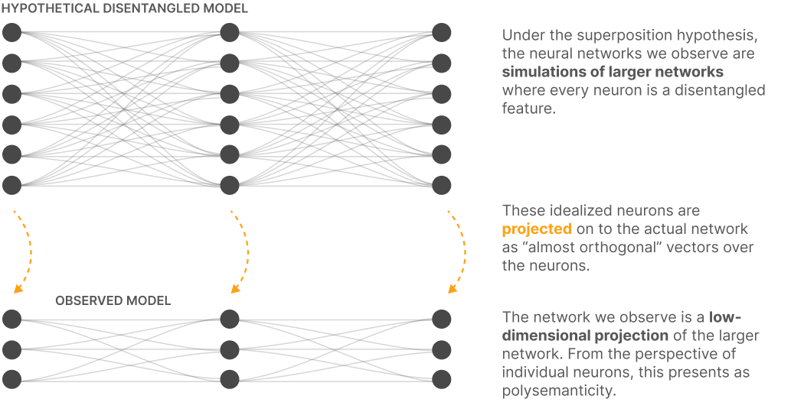
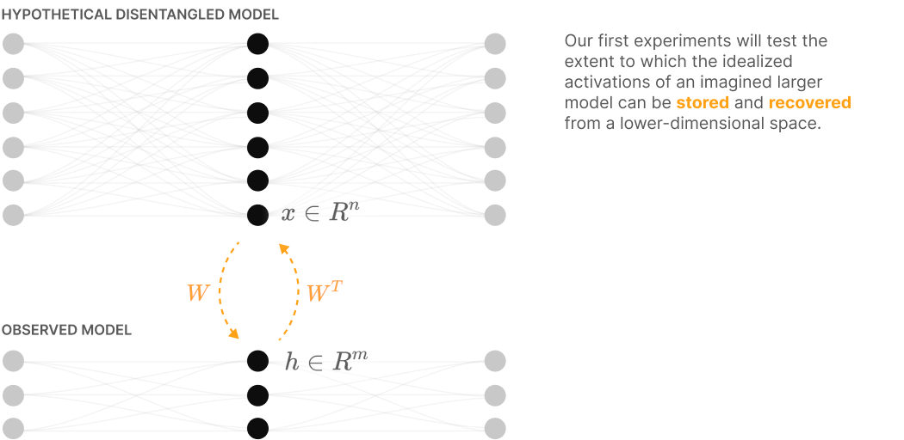
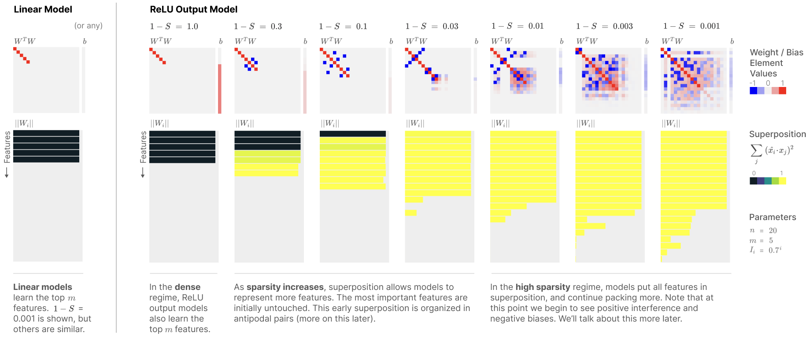
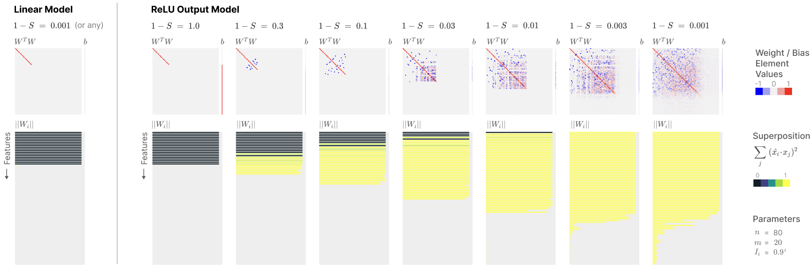
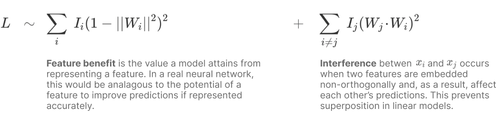
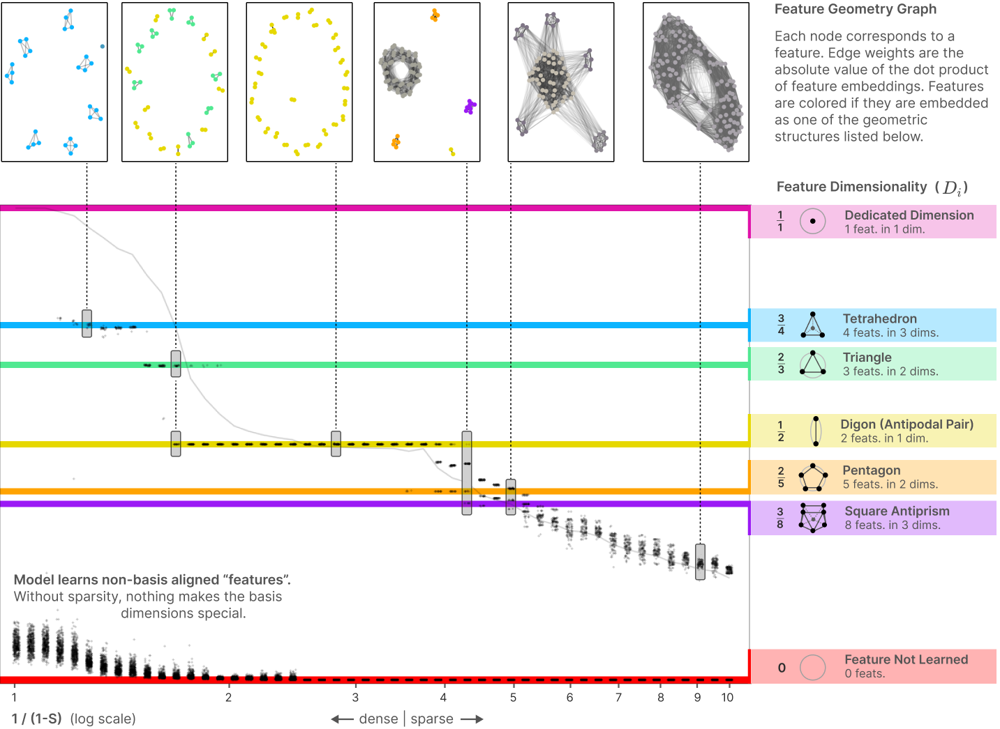
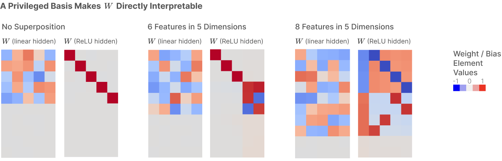
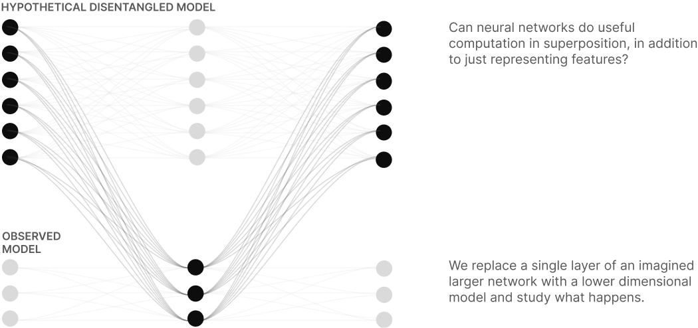
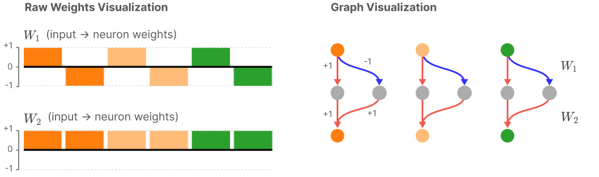
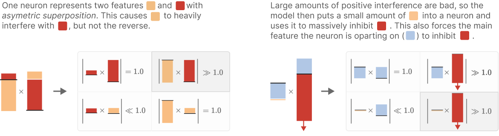

# 叠加的玩具模型（中英对照）

> 原文标题：Toy Models of Superposition
> 原文链接：https://transformer-circuits.pub/2022/toy_model/index.html
> 研究页：https://www.anthropic.com/research/toy-models-of-superposition
> 原文作者：Nelson Elhage, Tristan Hume, Catherine Olsson 等（Anthropic）
> 发布日期：2022-09-14
> **翻译模型：** GLM-5.3-Flash
> **评分：** ★★★★★（5/5，里程碑）—— 叠加假说：神经网络用近乎正交的高维方向以稀疏方式表示远多于维数的特征，给出相变、几何结构（简单/均匀多面体对）与学习动力学解释，机制可解释性领域影响最大的论文之一
> 排版：每段英文原文在前，中文翻译紧随其后。本文收录正文主体；原页附录（权重衰减、解决方案细节、复现评论、致谢与引用信息等）未收录。

---

It would be very convenient if the individual neurons of artificial neural networks corresponded to cleanly interpretable features of the input. For example, in an “ideal” ImageNet classifier, each neuron would fire only in the presence of a specific visual feature, such as the color red, a left-facing curve, or a dog snout. Empirically, in models we have studied, some of the neurons do cleanly map to features. But it isn't always the case that features correspond so cleanly to neurons, especially in large language models where it actually seems rare for neurons to correspond to clean features. This brings up many questions. Why is it that neurons sometimes align with features and sometimes don't? Why do some models and tasks have many of these clean neurons, while they're vanishingly rare in others?

如果人工神经网络的每个神经元都能与输入中干净、可解释的特征一一对应，那将是非常理想的情况。例如，在一个“理想的” ImageNet 分类器中，每个神经元应当只在对某个特定视觉特征（比如红色、朝左的曲线，或狗的鼻口）出现时才激活。从经验上看，在我们研究过的模型中，确实有一些神经元能干净地映射到特征。但特征并不总是与神经元如此干净地对应，尤其是在大语言模型中，神经元对应干净特征的情况实际上相当少见。这引出了许多问题：为什么神经元有时与特征对齐，有时却不？为什么有些模型和任务拥有大量这种“干净”的神经元，而在另一些模型中它们却几乎绝迹？

In this paper, we use toy models — small ReLU networks trained on synthetic data with sparse input features — to investigate how and when models represent more features than they have dimensions. We call this phenomenon superposition . When features are sparse, superposition allows compression beyond what a linear model would do, at the cost of "interference" that requires nonlinear filtering.

在本文中，我们使用玩具模型（toy model）——在具有稀疏输入特征的合成数据上训练的小型 ReLU 网络——来研究模型如何、以及何时会表示比其维度数更多的特征。我们把这种现象称为叠加（superposition）。当特征稀疏时，叠加使模型能够实现超越线性模型的压缩，代价是需要非线性滤波来处理的“干涉”（interference）。

Consider a toy model where we train an embedding of five features of varying importance[^1] in two dimensions, add a ReLU afterwards for filtering, and vary the sparsity of the features. With dense features, the model learns to represent an orthogonal basis of the most important two features (similar to what Principal Component Analysis might give us), and the other three features are not represented. But if we make the features sparse, this changes:

考虑这样一个玩具模型：我们把五个重要性各不相同的特征[^1]嵌入到二维空间中训练，随后加一个 ReLU 做滤波，并改变特征的稀疏性（sparsity）。当特征稠密时，模型学会用正交基表示最重要的两个特征（类似主成分分析给我们的结果），其余三个特征则不被表示。但如果我们让特征变得稀疏，情况就变了：

Not only can models store additional features in superposition by tolerating some interference, but we'll show that, at least in certain limited cases, models can perform computation while in superposition. (In particular, we'll show that models can put simple circuits computing the absolute value function in superposition.) This leads us to hypothesize that the neural networks we observe in practice are in some sense noisily simulating larger, highly sparse networks. In other words, it's possible that models we train can be thought of as doing “the same thing as” an imagined much-larger model, representing the exact same features but with no interference.

模型不仅可以通过容忍一定的干涉把额外的特征存进叠加之中，我们还将展示：至少在某些受限情形下，模型可以一边处于叠加一边执行计算。（特别地，我们将展示模型可以把计算绝对值函数的简单电路放入叠加。）这使我们提出如下假说：我们在实践中观察到的神经网络，在某种意义上是在带噪声地模拟更大的、高度稀疏的网络。换言之，我们训练出的模型或许可以被理解为在做与某个想象中“大得多的模型”相同的事情——表示完全相同的特征，只是存在干涉。

Feature superposition isn't a novel idea. A number of previous interpretability papers have considered it , and it's very closely related to the long-studied topic of compressed sensing in mathematics , as well as the ideas of distributed, dense, and population codes in neuroscience and deep learning . What, then, is the contribution of this paper?

特征叠加并不是一个新想法。此前已有多篇可解释性论文讨论过它，它与数学中被长期研究的压缩感知（compressed sensing）课题密切相关，也与神经科学和深度学习中的分布式表示、稠密编码与群体编码等思想息息相通。那么，本文的贡献是什么？

For interpretability researchers, our main contribution is providing a direct demonstration that superposition occurs in artificial neural networks given a relatively natural setup, suggesting this may also occur in practice. That is, we show a case where interpreting neural networks as having sparse structure in superposition isn't just a useful post-hoc interpretation, but actually the "ground truth" of a model. We offer a theory of when and why this occurs, revealing a  phase diagram for superposition. This explains why neurons are sometimes "monosemantic" responding to a single feature, and sometimes "polysemantic" responding to many unrelated features. We also discover that, at least in our toy model, superposition exhibits complex geometric structure.

对可解释性研究者而言，我们的主要贡献在于直接演示了：在一个相对自然的设定下，人工神经网络中确实会出现叠加，这暗示它在真实模型中也可能发生。也就是说，我们展示了一个案例：把神经网络理解为“以叠加方式承载稀疏结构”，不再只是一种有用的事后解释，而是一个模型真实的“地面真相”。我们给出了关于这种现象何时、为何发生的理论，揭示了叠加的相图。这解释了为什么神经元有时是“单语义”（monosemantic）的——只响应单个特征，有时又是“多语义”（polysemantic）的——同时响应许多不相关的特征。我们还发现，至少在我们的玩具模型中，叠加会呈现出复杂的几何结构。

But our results may also be of broader interest. We find preliminary evidence that superposition may be linked to adversarial examples and grokking, and might also suggest a theory for the performance of mixture of experts models. More broadly, the toy model we investigate has unexpectedly rich structure, exhibiting phase changes, a geometric structure based on uniform polytopes, "energy level"-like jumps during training, and a phenomenon which is qualitatively similar to the fractional quantum Hall effect in physics, among other striking phenomena. We originally investigated the subject to gain understanding of cleanly-interpretable neurons in larger models, but we've found these toy models to be surprisingly interesting in their own right.

但我们的结果也可能有更广泛的意义。我们发现了初步证据，表明叠加可能与对抗样本和 grokking（顿悟）有关联，还可能为混合专家（mixture of experts）模型的性能提供一种理论解释。更宽泛地说，我们研究的这个玩具模型具有出人意料地丰富的结构：表现出相变、基于均匀多胞体（polytope）的几何结构、训练过程中类似“能级”的跳变，以及一个在定性上与物理学中分数量子霍尔效应相似的现象，还有其他许多引人注目的现象。我们最初研究这个课题是为了理解更大模型中干净可解释的神经元，却发现这些玩具模型本身就出奇地有趣。

#### 玩具模型的关键结果（Key Results From Our Toy Models）

In our toy models, we are able to demonstrate that:

在我们的玩具模型中，我们能够证明：

- Superposition is a real, observed phenomenon.

- 叠加是一种真实存在、可被观察到的现象。

- Both monosemantic and polysemantic neurons can form.

- 单语义神经元和多语义神经元都可以形成。

- At least some kinds of computation can be performed in superposition.

- 至少某些类型的计算可以在叠加中进行。

- Whether features are stored in superposition is governed by a phase change.

- 特征是否以叠加方式存储，受相变（phase change）支配。

- Superposition organizes features into geometric structures such as digons, triangles, pentagons, and tetrahedrons.

- 叠加会把特征组织成几何结构，例如二边形（digon）、三角形、五边形和四面体。

Our toy models are simple ReLU networks, so it seems fair to say that neural networks exhibit these properties in at least some regimes, but it's very unclear what to generalize to real networks.

我们的玩具模型只是简单的 ReLU 网络，所以说“神经网络至少在某些机制区间中会表现出这些性质”应该是公允的，但这些结论能推广到真实网络的什么程度，仍非常不清楚。

## 定义与动机：特征、方向与叠加（Definitions and Motivation: Features, Directions, and Superposition）

In our work, we often think of neural networks as having features of the input represented as directions in activation space. This isn't a trivial claim. It isn't obvious what kind of structure we should expect neural network representations to have. When we say something like "word embeddings have a gender direction" or "vision models have curve detector neurons", one is implicitly making strong claims about the structure of network representations.

在我们的工作中，我们常常把神经网络理解为：输入的特征以激活空间中的方向（direction）来表示。这并不是一个平淡无奇的主张。我们应当期待神经网络表示具有什么样的结构，并不显而易见。当我们说出“词嵌入有性别方向”或“视觉模型有曲线检测器神经元”这类话时，实际上是在对网络表示的结构作出很强的断言。

Despite this, we believe this kind of "linear representation hypothesis" is supported both by significant empirical findings and theoretical arguments. One might think of this as two separate properties, which we'll explore in more detail shortly:

尽管如此，我们相信这种“线性表示假说”既有重要的实证发现支持，也有理论论证支撑。可以把它看作两个独立的性质，我们稍后会详细展开：

- Decomposability: Network representations can be described in terms of independently understandable features.

- 可分解性（decomposability）：网络表示可以用彼此独立、可分别理解的特征来描述。

- Linearity: Features are represented by direction.

- 线性性（linearity）：特征以方向来表示。

If we hope to reverse engineer neural networks, we need a property like decomposability. Decomposability is what [allows us to reason about the model](https://transformer-circuits.pub/2022/mech-interp-essay/index.html) without fitting the whole thing in our heads! But it's not enough for things to be decomposable: we need to be able to access the decomposition somehow. In order to do this, we need to identify the individual features within a representation. In a linear representation, this corresponds to determining which directions in activation space correspond to which independent features of the input.

如果我们希望对神经网络进行逆向工程，就需要类似可分解性这样的性质。正是可分解性[让我们无需把整个模型装进脑子里](https://transformer-circuits.pub/2022/mech-interp-essay/index.html)就能对它进行推理！但仅仅可分解还不够：我们还需要能够以某种方式访问这个分解。要做到这一点，我们需要在表示中识别出各个单独的特征。在线性表示中，这对应于确定激活空间中哪些方向对应于输入的哪些独立特征。

Sometimes, identifying feature directions is very easy because features seem to correspond to neurons. For example, many neurons in the early layers of InceptionV1 clearly correspond to features (e.g. curve detector neurons ). Why is it that we sometimes get this extremely helpful property, but in other cases don't? We hypothesize that there are really two countervailing forces driving this:

有时，识别特征方向非常容易，因为特征似乎直接对应于神经元。例如，InceptionV1 早期层中的许多神经元就清晰地对应着特征（比如曲线检测器神经元）。为什么我们有时能得到这种极其有用的性质，有时却得不到？我们假设，背后真正起作用的是两股相互对抗的力量：

- Privileged Basis: Only some representations have a privileged basis which encourages features to align with basis directions (i.e. to correspond to neurons).

- 特权基（privileged basis）：只有一部分表示拥有特权基，它会鼓励特征与基方向对齐（即与神经元对应）。

- Superposition: Linear representations can represent more features than dimensions, using a strategy we call superposition. This can be seen as neural networks simulating larger networks. This pushes features away from corresponding to neurons.

- 叠加：线性表示可以用我们称为叠加的策略表示比维度更多的特征。这可以看作神经网络在模拟更大的网络。它会把特征推离与神经元的对应关系。

Superposition has been hypothesized in previous work , and in some cases, assuming something like superposition has been shown to help find interpretable structure . However, we're not aware of feature superposition having been unambiguously demonstrated to occur in neural networks before ( demonstrates a closely related phenomenon of model superposition). The goal of this paper is to change that, demonstrating superposition and exploring how it interacts with privileged bases. If superposition occurs in networks, it deeply influences what approaches to interpretability research make sense, so unambiguous demonstration seems important.

此前的工作已经提出过叠加假说，并且在某些情形下，假设类似叠加的存在确实有助于找到可解释的结构。然而，据我们所知，此前还没有人毫不含糊地证明特征叠加确实发生在神经网络中（有工作演示了一种密切相关的“模型叠加”现象）。本文的目标就是改变这一点：演示叠加的存在，并探索它与特权基如何相互作用。如果叠加确实出现在网络中，它会深刻影响哪些可解释性研究进路才是有意义的，因此给出毫不含糊的演示十分重要。

The goal of this section will be to motivate these ideas and unpack them in detail.

本节的目标是为这些想法提供动机，并将它们逐一展开。

It's worth noting that many of the ideas in this section have close connections to ideas in other lines of interpretability research (especially disentanglement), neuroscience (distributed representations, population codes, etc), compressed sensing, and many other lines of work. This section will focus on articulating our perspective on the problem. We'll discuss these other lines of work in detail in Related Work.

值得注意的是，本节中的许多想法与其他研究方向（尤其是解耦表示/disentanglement）、神经科学（分布式表示、群体编码等）、压缩感知以及许多其他工作都有密切联系。本节将集中阐述我们对该问题的视角，其他相关工作将在“相关工作”一节中详细讨论。
### 经验现象（Empirical Phenomena）

When we talk about "features" and how they're represented, this is ultimately theory building around several observed empirical phenomena. Before describing how we conceptualize those results, we'll simply describe some of the major results motivating our thinking:

当我们谈论“特征”及其表示方式时，归根结底是围绕若干已被观察到的经验现象构建理论。在描述我们如何概念化这些结果之前，先简单列举促使我们思考的一些主要结果：

- Word Embeddings – A famous result by Mikolov et al. found that word embeddings appear to have directions which correspond to semantic properties, allowing for embedding arithmetic vectors such as V("king") - V("man") + V("woman") = V("queen") (but see ).

- 词嵌入（Word Embeddings）——Mikolov 等人的著名结果发现，词嵌入中似乎存在与语义属性对应的方向，使得我们可以做类似 V("king") - V("man") + V("woman") = V("queen") 的嵌入向量算术（但也有相反的证据）。

- Latent Spaces – Similar "vector arithmetic" and interpretable direction results have also been found for generative adversarial networks (e.g. ).

- 潜空间（Latent Spaces）——在生成对抗网络中也发现了类似的“向量算术”和可解释方向的结果（例如）。

- Interpretable Neurons – There is a significant body of results finding neurons which appear to be interpretable (in RNNs ; in CNNs ; in GANs ), activating in response to some understandable property. This work has faced some skepticism . In response, several papers have aimed to give extremely detailed accounts of a few specific neurons, in the hope of dispositively establishing examples of neurons which truly detect some understandable property (notably Cammarata et al. , but also ).

- 可解释神经元（Interpretable Neurons）——大量研究发现了看似可解释的神经元（在 RNN 中；在 CNN 中；在 GAN 中），它们会响应某种可理解的性质而激活。这项工作也曾遭遇质疑。作为回应，若干论文致力于对少数特定神经元给出极其细致的论证，希望以无可争辩的方式确立“某些神经元确实在检测某种可理解性质”的实例（最著名的是 Cammarata 等人的工作，但也有其他工作）。

- Universality – Many analogous neurons responding to the same properties can be found across networks .

- 普适性（Universality）——在不同网络中可以找到许多响应相同性质的类似神经元。

- Polysemantic Neurons – At the same time, there are also many neurons which appear to not respond to an interpretable property of the input, and in particular, many polysemantic neurons which appear to respond to unrelated mixtures of inputs .

- 多语义神经元（Polysemantic Neurons）——与此同时，也有许多神经元似乎并不响应输入的某个可解释性质；特别是许多多语义神经元，它们似乎响应的是不相关输入的混合。

As a result, we tend to think of neural network representations as being composed of features which are represented as directions. We'll unpack this idea in the following sections.

因此，我们倾向于认为神经网络表示由特征组成，而特征以方向来表示。我们将在接下来几节中展开这个想法。

### 什么是特征？（What are Features?）

Our use of the term "feature" is motivated by the interpretable properties of the input we observe neurons (or word embedding directions) responding to. There's a rich variety of such observed properties![^2] We'd like to use the term "feature" to encompass all these properties.

我们使用“特征”这个词的动机，来自我们观察到的神经元（或词嵌入方向）所响应的输入的可解释性质。这类被观察到的性质种类繁多！[^2]我们希望用“特征”一词涵盖所有这些性质。

But even with that motivation, it turns out to be quite challenging to create a satisfactory definition of a feature. Rather than offer a single definition we're confident about, we consider three potential working definitions:

但即便有这样的动机，要给出一个令人满意的“特征”定义也相当困难。与其给出一个我们自信满满的单一定义，不如考虑三种可能的工作定义：

- Features as arbitrary functions. One approach would be to define features as any function of the input (as in ). But this doesn't quite seem to fit our motivations. There's something special about these features that we're observing: they seem to in some sense be fundamental abstractions for reasoning about the data, with the same features forming reliably across models. Features also seem identifiable: cat and car are two features while cat+car and cat-car seem like mixtures of features rather than features in some important sense.

- 作为任意函数的特征。一种做法是把特征定义为输入的任意函数（如某些工作所做）。但这似乎并不符合我们的动机。我们观察到的这些特征有其特殊之处：它们在某种意义上像是用于推理数据的基本抽象，同样的特征会可靠地跨越不同模型形成。特征似乎还是可辨识的：cat（猫）和 car（汽车）是两个特征，而 cat+car 和 cat-car 则在某种重要的意义上像是特征的混合，而非特征本身。

- Features as interpretable properties. All the features we described are strikingly understandable to humans. One could try to use this for a definition: features are the presence of human understandable "concepts" in the input. But it seems important to allow for features we might not understand. If AlphaFold discovers some important chemical structure for predicting protein folding, it very well might not be something we initially understand!

- 作为可解释性质的特征。我们描述的所有特征都对人类显著可理解。可以尝试以此下定义：特征是输入中存在的人类可理解的“概念”。但允许存在我们可能无法理解的特征似乎很重要。如果 AlphaFold 发现了某种用于预测蛋白质折叠的重要化学结构，它很可能一开始并不是我们能理解的东西！

- Neurons in Sufficiently Large Models. A final approach is to define features as properties of the input which a sufficiently large neural network will reliably dedicate a neuron to representing.[^3] For example, curve detectors appear to reliably occur across sufficiently sophisticated vision models, and so are a feature. For interpretable properties which we presently only observe in polysemantic neurons, the hope is that a sufficiently large model would dedicate a neuron to them. This definition is slightly circular, but avoids the issues with the earlier ones.

- 足够大的模型中的神经元。最后一种做法是把特征定义为：足够大的神经网络会可靠地专门用一个神经元来表示的输入性质。[^3]例如，曲线检测器似乎可靠地出现在所有足够复杂的视觉模型中，因此是一个特征。对于那些我们目前只在多语义神经元中观察到的可解释性质，我们希望足够大的模型会为它们专门分配一个神经元。这个定义略有循环论证之嫌，但避开了前两种定义的问题。

We've written this paper with the final "neurons in sufficiently large models" definition in mind. But we aren't overly attached to it, and actually think it's probably important to not prematurely attach to a definition.[^4]

我们撰写本文时心中的正是最后这个“足够大模型中的神经元”定义。但我们并不过分执着于它，而且实际上认为，不过早地锁定某个定义可能很重要。[^4]

### 作为方向的特征（Features as Directions）

As we've mentioned in previous sections, we generally think of features as being represented by directions. For example, in word embeddings, "gender" and "royalty" appear to correspond to directions, allowing arithmetic like V("king") - V("man") + V("woman") = V("queen") . Examples of interpretable neurons are also cases of features as directions, since the amount a neuron activates corresponds to a basis direction in the representation

正如前面几节提到的，我们通常认为特征由方向来表示。例如，在词嵌入中，“性别”和“皇室”似乎对应于某些方向，使得 V("king") - V("man") + V("woman") = V("queen") 这样的算术成为可能。可解释神经元的例子同样属于“特征即方向”的情形，因为神经元的激活量对应于表示中的一个基方向。

Let's call a neural network representation linear if features correspond to directions in activation space. In a linear representation, each feature f_i has a corresponding representation direction W_i. The presence of multiple features f_1, f_2… activating with values x_{f_1}, x_{f_2}… is represented by x_{f_1}W_{f_1} + x_{f_2}W_{f_2}.... To be clear, the features being represented are almost certainly nonlinear functions of the input. It's only the map from features to activation vectors which is linear. Note that whether something is a linear representation depends on what you consider to be the features.

如果特征对应于激活空间中的方向，我们就称这个神经网络表示是线性的。在线性表示中，每个特征 f_i 都有一个对应的表示方向 W_i。多个特征 f_1, f_2… 分别以值 x_{f_1}, x_{f_2}… 激活时，表示为 x_{f_1}W_{f_1} + x_{f_2}W_{f_2}…。需要说明的是，被表示的特征几乎可以肯定是输入的非线性函数；只有从特征到激活向量的映射是线性的。另外要注意，一个东西是不是线性表示，取决于你把什么当作特征。

We don't think it's a coincidence that neural networks empirically seem to have linear representations. Neural networks are built from linear functions interspersed with non-linearities. In some sense, the linear functions are the vast majority of the computation (for example, as measured in FLOPs). Linear representations are the natural format for neural networks to represent information in! Concretely, there are three major benefits:

我们不认为神经网络在经验上似乎拥有线性表示是一种巧合。神经网络由线性函数穿插非线性函数构成。在某种意义上，线性函数占了计算的绝大部分（例如按 FLOPs 衡量）。线性表示正是神经网络表示信息的天然格式！具体而言，它有三大好处：

- Linear representations are the natural outputs of obvious algorithms a layer might implement. If one sets up a neuron to pattern match a particular weight template, it will fire more as a stimulus matches the template better and less as it matches it less well.

- 线性表示是一层网络可能实现的最直接算法的天然输出。如果让一个神经元对某个特定的权重模板做模式匹配，刺激与模板匹配得越好它就越活跃，匹配得越差就越不活跃。

- Linear representations make features "linearly accessible." A typical neural network layer is a linear function followed by a non-linearity. If a feature in the previous layer is represented linearly, a neuron in the next layer can "select it" and have it consistently excite or inhibit that neuron. If a feature were represented non-linearly, the model would not be able to do this in a single step.

- 线性表示使特征“线性可及”。典型的神经网络层是先线性函数后非线性函数。如果上一层中的某个特征以线性方式表示，下一层的一个神经元就可以“选中它”，让它持续地兴奋或抑制该神经元。如果特征是非线性表示的，模型就无法在一步之内做到这一点。

- Statistical Efficiency. Representing features as different directions may allow non-local generalization in models with linear transformations (such as the weights of neural nets), increasing their statistical efficiency relative to models which can only locally generalize. This view is especially advocated in some of Bengio's writing (e.g. ). A more accessible argument can be found in [this blog post](https://colah.github.io/posts/2014-07-NLP-RNNs-Representations/#word-embeddings).

- 统计效率。把特征表示为不同的方向，或许能让带线性变换的模型（如神经网络的权重）实现非局部泛化，从而相对于只能局部泛化的模型提高统计效率。Bengio 的部分文章尤其倡导这一观点（例如）。一个更容易理解的论证见[这篇博客文章](https://colah.github.io/posts/2014-07-NLP-RNNs-Representations/#word-embeddings)。

It is possible to construct non-linear representations, and retrieve information from them, if you use multiple layers (although even these examples can be seen as linear representations with more exotic features). We provide an example in the appendix. However, our intuition is that non-linear representations are generally inefficient for neural networks.

如果使用多个层，构造非线性表示并从中检索信息是可能的（尽管即便这些例子也可以被看作是带有更奇特特征的线性表示）。我们在附录中给出了一个例子。不过，我们的直觉是：对神经网络而言，非线性表示通常是低效的。

One might think that a linear representation can only store as many features as it has dimensions, but it turns out this isn't the case! We'll see that the phenomenon we call superposition will allow models to store more features – potentially many more features – in linear representations.

有人可能以为线性表示只能存储与维度数相同数量的特征，但事实并非如此！我们将看到，我们称为叠加的现象会让模型在线性表示中存储更多特征——甚至可能多得多。

For discussion on how this view of features squares with a conception of features as being multidimensional manifolds, see the appendix “What about Multidimensional Features?”.

关于这种特征观如何与“特征是多维流形”的观念相调和，参见附录《那么多维特征怎么办？》。

### 特权基与非特权基（Privileged vs Non-privileged Bases）

Even if features are encoded as directions, a natural question to ask is which directions? In some cases, it seems useful to consider the basis directions, but in others it doesn't. Why is this?

即便特征以方向编码，一个自然会问的问题是：哪些方向？在某些情况下，考虑基方向似乎是有用的，在另一些情况下则不然。这是为什么？

When researchers study word embeddings, it doesn't make sense to analyze basis directions. There would be no reason to expect a basis dimension to be different from any other possible direction. One way to see this is to imagine applying some random linear transformation M to the word embedding, and apply M^{-1} to the following weights. This would produce an identical model where the basis dimensions are totally different. This is what we mean by a non-privileged basis. Of course, it's possible to study activations without a privileged basis, you just need to identify interesting directions to study somehow, such as creating a gender direction in a word embedding by taking the difference vector between "man" and "woman".

研究词嵌入时，分析基方向是没有意义的。我们没有理由指望某个基维度会与其他任何可能的方向有什么不同。理解这一点的一个方式是：想象对词嵌入施加某个随机线性变换 M，再对后续权重施加 M^{-1}。这样会得到一个完全相同的模型，只是基维度完全不同。这就是我们所说的非特权基（non-privileged basis）。当然，没有特权基也可以研究激活，只是需要以某种方式找出值得研究的有意思的方向，比如取 "man" 与 "woman" 的差向量来构造词嵌入中的性别方向。

But many neural network layers are not like this. Often, something about the architecture makes the basis directions special, such as applying an activation function. This "breaks the symmetry", making those directions special, and potentially encouraging features to align with the basis dimensions. We call this a privileged basis, and call the basis directions "neurons." Often, these neurons correspond to interpretable features.

但许多神经网络层并非如此。架构中的某些因素常常使基方向变得特殊，例如施加激活函数。这“打破了对称性”，使这些方向变得特殊，并可能鼓励特征与基维度对齐。我们称之为特权基（privileged basis），并把基方向称为“神经元”。这些神经元往往对应可解释的特征。

From this perspective, it only makes sense to ask if a neuron is interpretable when it is in a privileged basis. In fact, we typically reserve the word "neuron" for basis directions which are in a privileged basis. (See longer discussion [here](https://transformer-circuits.pub/2022/solu/index.html#section-3-2).)

从这个视角看，只有在特权基中，追问“一个神经元是否可解释”才有意义。事实上，我们通常把“神经元”一词专用于特权基中的基方向。（更长的讨论见[这里](https://transformer-circuits.pub/2022/solu/index.html#section-3-2)。）

Note that having a privileged basis doesn't guarantee that features will be basis-aligned – we'll see that they often aren't! But it's a minimal condition for the question to even make sense.

注意，拥有特权基并不保证特征会与基对齐——我们会看到它们经常不对齐！但这至少是让这个问题有意义的最小条件。

### 叠加假说（The Superposition Hypothesis）

Even when there is a privileged basis, it's often the case that neurons are "polysemantic", responding to several unrelated features. One explanation for this is the [superposition hypothesis](https://distill.pub/2020/circuits/zoom-in/#claim-2-superposition). Roughly, the idea of superposition is that neural networks "want to represent more features than they have neurons", so they exploit a property of high-dimensional spaces to simulate a model with many more neurons.

即便存在特权基，神经元也常常是“多语义”的——同时响应若干不相关的特征。对此的一种解释是[叠加假说](https://distill.pub/2020/circuits/zoom-in/#claim-2-superposition)（superposition hypothesis）。粗略地说，叠加的意思是：神经网络“想要表示比它的神经元数更多的特征”，于是它们利用高维空间的某种性质来模拟一个神经元多得多的模型。

Several results from mathematics suggest that something like this might be plausible:

数学中的若干结果暗示，这样的事情或许是可行的：

- Almost Orthogonal Vectors. Although it's only possible to have n orthogonal vectors in an n-dimensional space, it's possible to have \exp(n) many "almost orthogonal" (<\epsilon cosine similarity) vectors in high-dimensional spaces. See the [Johnson–Lindenstrauss lemma](https://en.wikipedia.org/wiki/Johnson%E2%80%93Lindenstrauss_lemma).

- 几乎正交的向量。虽然 n 维空间中最多只能有 n 个正交向量，但在高维空间中却可以拥有 \exp(n) 个“几乎正交”（余弦相似度 <\epsilon）的向量。参见 [Johnson–Lindenstrauss 引理](https://en.wikipedia.org/wiki/Johnson%E2%80%93Lindenstrauss_lemma)。

- Compressed sensing. In general, if one projects a vector into a lower-dimensional space, one can't reconstruct the original vector. However, this changes if one knows that the original vector is sparse. In this case, it is often possible to recover the original vector.

- 压缩感知（compressed sensing）。一般而言，把向量投影到低维空间后，是无法重建原向量的。但如果知道原向量是稀疏的，情况就不同了：此时通常可以恢复原向量。

Concretely, in the superposition hypothesis, features are represented as almost-orthogonal directions in the vector space of neuron outputs. Since the features are only almost-orthogonal, one feature activating looks like other features slightly activating. Tolerating this "noise" or "interference" comes at a cost. But for neural networks with highly sparse features, this cost may be outweighed by the benefit of being able to represent more features! (Crucially, sparsity greatly reduces the costs since sparse features are rarely active to interfere with each other, and non-linear activation functions create opportunities to filter out small amounts of noise.)

具体而言，在叠加假说中，特征以神经元输出向量空间中几乎正交的方向来表示。由于特征只是几乎正交，一个特征激活时看起来就像其他特征也在轻微激活。容忍这种“噪声”或“干涉”是有代价的。但对于特征高度稀疏的神经网络，能够表示更多特征的好处可能会超过这个代价！（关键在于，稀疏性大大降低了代价：稀疏特征很少同时激活而互相干涉，而非线性激活函数又提供了滤除少量噪声的机会。）

One way to think of this is that a small neural network may be able to noisily "simulate" a sparse larger model:

一种理解方式是：小型神经网络也许能带噪声地“模拟”一个稀疏的更大模型：

Although we've described superposition with respect to neurons, it can also occur in representations with an unprivileged basis, such as a word embedding. Superposition simply means that there are more features than dimensions.

虽然我们是围绕神经元来描述叠加的，但它也可以发生在没有特权基的表示中，比如词嵌入。叠加的含义很简单：特征数多于维度数。

### 小结：特征性质的层级（Summary: A Hierarchy of Feature Properties）

The ideas in this section might be thought of in terms of four progressively more strict properties that neural network representations might have.

本节的想法可以整理为神经网络表示可能具有的四个由宽到严的性质：

- Decomposability: Neural network activations which are decomposable can be decomposed into features, the meaning of which is not dependent on the value of other features. (This property is ultimately the most important – see the role of decomposition in defeating the curse of dimensionality.)

- 可分解性（decomposability）：可分解的神经网络激活可以分解为若干特征，且每个特征的含义不依赖于其他特征的取值。（这条性质归根结底最重要——参见分解在击败维度灾难中的作用。）

- Linearity: Features correspond to directions. Each feature f_i has a corresponding  representation direction W_i. The presence of multiple features f_1, f_2… activating with values x_{f_1}, x_{f_2}… is represented by x_{f_1}W_{f_1} + x_{f_2}W_{f_2}....

- 线性性（linearity）：特征对应于方向。每个特征 f_i 有对应的表示方向 W_i。多个特征 f_1, f_2… 分别以值 x_{f_1}, x_{f_2}… 激活时，表示为 x_{f_1}W_{f_1} + x_{f_2}W_{f_2}…。

- Superposition vs Non-Superposition: A linear representation exhibits superposition if W^TW is not invertible. If W^TW is invertible, it does not exhibit superposition.

- 叠加与非叠加：若 W^TW 不可逆，则线性表示呈现叠加；若 W^TW 可逆，则不呈现叠加。

- Basis-Aligned: A representation is basis aligned if all W_i are one-hot basis vectors. A representation is partially basis aligned if all W_i are sparse. This requires a privileged basis.

- 基对齐（basis-aligned）：若所有 W_i 都是独热基向量，则表示是基对齐的；若所有 W_i 都是稀疏的，则表示是部分基对齐的。这要求特权基。

The first two (decomposability and linearity) are properties we hypothesize to be widespread, while the latter (non-superposition and basis-aligned) are properties we believe only sometimes occur.

前两个性质（可分解性与线性性）是我们假设普遍存在的，而后两个（非叠加与基对齐）则是我们认为只在某些时候出现的性质。
## 演示叠加（Demonstrating Superposition）

If one takes the superposition hypothesis seriously, a natural first question is whether neural networks can actually noisily represent more features than they have neurons. If they can't, the superposition hypothesis may be comfortably dismissed.

如果认真对待叠加假说，一个自然的头号问题就是：神经网络究竟能否带噪声地表示比神经元数更多的特征？如果不能，叠加假说就可以被轻松打发掉。

The intuition from linear models would be that this isn't possible: the best a linear model can do is to store the principal components. But we'll see that adding just a slight nonlinearity can make models behave in a radically different way! This will be our first demonstration of superposition. (It will also be an object lesson in the complexity of even very simple neural networks.)

从线性模型的直觉看，这不可能：线性模型充其量只能存储主成分。但我们将会看到，仅仅加一点非线性就能让模型的行为发生根本变化！这将是我们对叠加的第一次演示。（它也将是一堂生动的课，展示哪怕非常简单的神经网络也有多么复杂。）

### 实验设置（Experiment Setup）

Our goal is to explore whether a neural network can project a high dimensional vector x \in R^n into a lower dimensional vector h\in R^m and then recover it.[^5]

我们的目标是探究：神经网络能否把高维向量 x \in R^n 投影为低维向量 h\in R^m，然后再把它恢复出来。[^5]

#### 特征向量（x）（The Feature Vector (x)）

We begin by describing the high-dimensional vector x: the activations of our idealized, disentangled larger model. We call each element x_i a "feature" because we're imagining features to be perfectly aligned with neurons in the hypothetical larger model. In a vision model, this might be a Gabor filter, a curve detector, or a floppy ear detector. In a language model, it might correspond to a token referring to a specific famous person, or a clause being a particular kind of description.

我们先来描述高维向量 x：它是我们理想化的、已解耦的更大模型的激活。我们把每个元素 x_i 称为一个“特征”，因为我们假设在这个假想的更大模型中，特征与神经元完美对齐。在视觉模型中，它可能是 Gabor 滤波器、曲线检测器或垂耳检测器；在语言模型中，它可能对应于指向某位特定名人的词元，或是“某从句是某种特定类型的描述”这样的性质。

Since we don't have any ground truth for features, we need to create synthetic data for x which simulates any important properties we believe features have from the perspective of modeling them. We make three major assumptions:

由于我们没有任何关于特征的地面真相，我们需要为 x 构造合成数据，从建模的角度模拟我们认为特征所具备的重要性质。我们做三个主要假设：

- Feature Sparsity: In the natural world, many features seem to be sparse in the sense that they only rarely occur. For example, in vision, most positions in an image don't contain a horizontal edge, or a curve, or a dog head. In language, most tokens don't refer to Martin Luther King or aren't part of a clause describing music. This idea goes back to classical work on vision and the statistics of natural images (see e.g. Olshausen, 1997, the section "Why Sparseness?" ). For this reason, we will choose a sparse distribution for our features.

- 特征稀疏性：在自然界中，许多特征似乎都是稀疏的——即很少出现。例如在视觉中，图像中的大多数位置并不包含水平边缘、曲线或狗头；在语言中，大多数词元并不指代马丁·路德·金，也不属于描述音乐的从句。这一想法可以追溯到关于视觉与自然图像统计的经典工作（例如 Olshausen 1997 的 "Why Sparseness?" 一节）。因此，我们将为特征选择一个稀疏的分布。

- More Features Than Neurons: There are an enormous number of potentially useful features a model might represent.[^6] This imbalance between features and neurons in real models seems like it must be a central tension in neural network representations.

- 特征多于神经元：模型可能表示的潜在有用特征数量极其庞大。[^6]真实模型中特征与神经元之间的这种失衡，似乎必然是神经网络表示中的核心张力。

- Features Vary in Importance: Not all features are equally useful to a given task. Some can reduce the loss more than others. For an ImageNet model, where classifying different species of dogs is a central task, a floppy ear detector might be one of the most important features it can have. In contrast, another feature might only very slightly improve performance.[^7]

- 特征重要性各异：并非所有特征对给定任务都同等有用。有些特征比其他特征更能降低损失。对一个以区分不同犬种为核心任务的 ImageNet 模型而言，垂耳检测器可能是它所能拥有的最重要特征之一；相比之下，另一个特征可能只能非常轻微地提升性能。[^7]

Concretely, our synthetic data is defined as follows: The input vectors x are synthetic data intended to simulate the properties we believe the true underlying features of our task have. We consider each dimension x_i to be a "feature". Each one has an associated sparsity S_i and importance I_i. We let x_i=0 with probability S_i, but it is otherwise uniformly distributed between [0,1].[^8] In practice, we focus on the case where all features have the same sparsity, S_i = S.

具体地，我们的合成数据定义如下：输入向量 x 是合成数据，用以模拟我们认为任务的真实底层特征所具有的性质。我们把每个维度 x_i 视为一个“特征”，每个特征都有对应的稀疏度 S_i 和重要性 I_i。我们以概率 S_i 令 x_i=0，否则 x_i 均匀分布于 [0,1]。[^8]在实践中，我们聚焦于所有特征稀疏度相同的情形，即 S_i = S。

#### 模型（x \to x'）（The Model (x \to x')）

We will actually consider two models, which we motivate below. The first "linear model" is a well understood baseline which does not exhibit superposition. The second "ReLU output model" is a very simple model which does exhibit superposition. The two models vary only in the final activation function.

我们实际上会考虑两个模型，动机见下文。第一个“线性模型”是已被充分理解的基线，不呈现叠加；第二个“ReLU 输出模型”是一个非常简单却呈现叠加的模型。两个模型只在最后的激活函数上有差别。

Why these models?

为什么选这两个模型？

The superposition hypothesis suggests that each feature in the higher-dimensional model corresponds to a direction in the lower-dimensional space. This means we can represent the down projection as a linear map h=Wx. Note that each column W_i corresponds to the direction in the lower-dimensional space that represents a feature x_i.

叠加假说意味着，高维模型中的每个特征对应低维空间中的一个方向。这表明我们可以把下投影表示为线性映射 h=Wx。注意，W 的每一列 W_i 对应低维空间中表示特征 x_i 的方向。

To recover the original vector, we'll use the transpose of the same matrix W^T. This has the advantage of avoiding any ambiguity regarding what direction in the lower-dimensional space really corresponds to a feature. It also seems relatively mathematically principled[^9], and empirically works.

为了恢复原向量，我们使用同一矩阵的转置 W^T。这样做的好处是避免了“低维空间中哪个方向才真正对应某个特征”的歧义。它在数学上也相对有原则[^9]，并且经验上确实有效。

We also add a bias. One motivation for this is that it allows the model to set features it doesn't represent to their expected value. But we'll see later that the ability to set a negative bias is important for superposition for a second set of reasons – roughly, it allows models to discard small amounts of noise.

我们还加入了一个偏置。一个动机是，它让模型可以把未表示的特征设为期望值。但稍后我们会看到，能够设置负偏置对叠加还有另一层重要意义——大致来说，它让模型可以丢弃少量噪声。

The final step is whether to add an activation function. This turns out to be critical to whether superposition occurs. In a real neural network, when features are actually used by the model to do computation, there will be an activation function, so it seems principled to include one at the end.

最后一步是要不要加激活函数。事实证明，这一点对叠加是否出现至关重要。在真实神经网络中，当模型实际使用特征做计算时，中间会有激活函数，所以在末端包含一个激活函数看起来是有原则的做法。

#### 损失函数（The Loss）

Our loss is weighted mean squared error weighted by the feature importances, I_i, described above: L = \sum_x \sum_i I_i (x_i - x'_i)^2

我们的损失是以特征重要性 I_i（如上所述）加权的均方误差：L = \sum_x \sum_i I_i (x_i - x'_i)^2

### 基本结果（Basic Results）

Our first experiment will simply be to train a few ReLU output models with different sparsity levels and visualize the results. (We'll also train a linear model – if optimized well enough, the linear model solution does not depend on sparsity level.)

我们的第一个实验很简单：训练几个不同稀疏度的 ReLU 输出模型并可视化结果。（我们也会训练一个线性模型——只要优化得足够好，线性模型的解不依赖于稀疏度。）

The main question is how to visualize the results. The simplest way is to visualize W^TW (a features by features matrix) and b (a feature length vector). Note that features are arranged from most important to least, so the results have a fairly nice structure. Here's an example of what this type of visualization might look like, for a small model (n=20; ~m=5;) which behaves in the "expected linear model-like" way, only representing as many features as it has dimensions:

主要问题是如何可视化结果。最简单的方法是可视化 W^TW（特征×特征矩阵）和 b（特征长度的向量）。注意，特征是按重要性从高到低排列的，所以结果有相当规整的结构。下面是这类可视化对一个小模型（n=20; ~m=5;）的样子，该模型以“预期的线性模型式”方式行动，只表示与自身维度数相同数量的特征：

But the thing we really care about is this hypothesized phenomenon of superposition – does the model represent "extra features" by storing them non-orthogonally? Is there a way to get at it more explicitly? Well, one question is just how many features the model learns to represent. For any feature, whether or not it is represented is determined by ||W_i||, the norm of its embedding vector.

但我们真正关心的是叠加这个假想现象——模型是否通过非正交地存储来表示“额外的特征”？有没有更直接的办法来考察它？一个直观的问题就是：模型学会了表示多少个特征。对任意特征而言，它是否被表示由 ||W_i||（其嵌入向量的范数）决定。

We'd also like to understand whether a given feature shares its dimension with other features. For this, we calculate \sum_{j\neq i} (\hat{W_i}\cdot W_j)^2, projecting all other features onto the direction vector of W_i. It will be 0 if the feature is orthogonal to other features (dark blue below). On the other hand, values \geq 1 mean that there is some group of other features which can activate W_i as strongly as feature i itself!

我们还想了解某个特征是否与其他特征共享它的维度。为此，我们计算 \sum_{j\neq i} (\hat{W_i}\cdot W_j)^2，即把所有其他特征投影到 W_i 的方向向量上。如果该特征与其他特征正交，这个值为 0（下图中深蓝色）；另一方面，值 \geq 1 意味着存在某组其他特征，它们对 W_i 的激活能力不亚于特征 i 本身！

We can visualize the model we looked at previously this way:

我们可以用这种方式把之前看过的模型可视化：

Now that we have a way to visualize models, we can start to actually do experiments.  We'll start by considering models with only a few features (n=20; ~m=5;~ I_i=0.7^i). This will make it easy to visually see what happens. We consider a linear model, and several ReLU-output models trained on data with different feature sparsity levels:

有了可视化模型的方法，我们就可以真正开始做实验了。我们先考虑只有少量特征的模型（n=20; ~m=5;~ I_i=0.7^i），这样便于直观地看到发生了什么。我们考察一个线性模型和若干在不同特征稀疏度数据上训练的 ReLU 输出模型：

As our standard intuitions would expect, the linear model always learns the top-m most important features, analogous to learning the top principal components. The ReLU output model behaves the same on dense features (1-S=1.0), but as sparsity increases, we see superposition emerge. The model represents more features by having them not be orthogonal to each other. It starts with less important features, and gradually affects the most important ones. Initially this involves arranging them in antipodal pairs, where one feature’s representation vector is exactly the negative of the other’s, but we observe it gradually transition to other geometric structures as it represents more features.  We'll discuss feature geometry further in the later section, The Geometry of Superposition.

正如标准直觉所预期的，线性模型总是学会最重要的前 m 个特征，类似于学习前 m 个主成分。ReLU 输出模型在稠密特征（1-S=1.0）下表现相同，但随着稀疏度增大，我们看到叠加浮现出来：模型让特征彼此不再正交，从而表示更多特征。它先从较不重要的特征开始，逐渐波及最重要的特征。起初的表现是把特征排成对跖对（antipodal pairs）——一个特征的表示向量恰好是另一个的负向量——但我们观察到，随着表示的特征增多，它会逐渐过渡到其他几何结构。我们将在后文“叠加的几何结构”一节进一步讨论特征几何。

The results are qualitatively similar for models with more features and hidden dimensions. For example, if we consider a model with m=20 hidden dimensions and n=80 features (with importance increased to I_i=0.9^i to account for having more features), we observe essentially a rescaled version of the visualization above:

对特征和隐藏维度更多的模型，结果在定性上是类似的。例如，考虑一个 m=20 个隐藏维度、n=80 个特征的模型（重要性提高到 I_i=0.9^i，以适应更多的特征），我们观察到的基本上是上面可视化的等比缩放版：

### 数学理解（Mathematical Understanding）

In the previous section, we observed a surprising empirical result: adding a ReLU to the output of our model allowed a radically different solution – superposition – which doesn't occur in linear models.

在上一节中，我们观察到一个令人惊讶的经验结果：在模型输出端加一个 ReLU，就能允许一种截然不同的解——叠加——而它在线性模型中不会出现。

The model where it occurs is still quite mathematically simple. Can we analytically understand why superposition is occurring? And for that matter, why does adding a single non-linearity make things so different from the linear model case? It turns out that we can get a fairly satisfying answer, revealing that our model is governed by balancing two competing forces – feature benefit and interference – which will be useful intuition going forwards. We'll also discover a connection to the famous Thomson Problem in chemistry.

出现叠加的这个模型在数学上仍然相当简单。我们能解析地理解叠加为什么会发生吗？顺带地，为什么加一个非线性就会使情况与线性模型如此不同？事实证明，我们可以得到相当令人满意的答案：模型由两股相互竞争的力量——特征收益（feature benefit）与干涉（interference）——的平衡所支配。这将是今后很有用的直觉。我们还会发现它与化学中著名的 Thomson 问题之间的联系。

Let's start with the linear case. This is well understood by prior work! If one wants to understand why linear models don't exhibit superposition, the easy answer is to observe that linear models essentially perform PCA. But this isn't fully satisfying: if we set aside all our knowledge and intuition about linear functions for a moment, why exactly is it that superposition can't occur?

让我们从线性情形开始。先前工作对此已有充分理解！如果想理解线性模型为什么不呈现叠加，简单的答案是：线性模型本质上就是在做 PCA。但这并不完全令人满意：如果暂时搁置我们关于线性函数的全部知识和直觉，究竟为什么叠加无法发生？

A deeper understanding can come from the results of Saxe et al. who study the learning dynamics of linear neural networks – that is, neural networks without activation functions. Such models are ultimately linear functions, but because they are the composition of multiple linear functions the dynamics are potentially quite complex. The punchline of their paper reveals that neural network weights can be thought of as optimizing a simple closed-form solution. We can tweak their problem to be a bit more similar to our linear case,[^10] revealing the following equation:

更深入的理解来自 Saxe 等人的结果，他们研究了线性神经网络（即没有激活函数的神经网络）的学习动力学。这类模型归根结底是线性函数，但由于是多个线性函数的复合，其动力学可能相当复杂。他们论文的核心结论是：神经网络权重可以看作在优化一个简单的闭式解。我们可以把他们的问题的设定稍作调整，使之更接近我们的线性情形，[^10]从而得到如下方程：

The Saxe results reveal that there are fundamentally two competing forces which control learning dynamics in the considered model. Firstly, the model can attain a better loss by representing more features (we've labeled this "feature benefit"). But it also gets a worse loss if it represents more than it can fit orthogonally due to "interference" between features.[^11] In fact, this makes it never worthwhile for the linear model to represent more features than it has dimensions.[^12]

Saxe 的结果表明，在所考虑的模型中，根本上由两股相互竞争的力量控制着学习动力学。其一，模型可以通过表示更多特征获得更好的损失（我们称之为“特征收益”）；但另一方面，如果它表示的特征多到无法正交容纳，特征之间的“干涉”会使损失变差。[^11]事实上，这使得线性模型表示超过自身维度数的特征永远不会有利。[^12]

Can we achieve a similar kind of understanding for the ReLU output model? Concretely, we'd like to understand L=\int_x ||I(x-\text{ReLU}(W^TWx+b))||^2 d\textbf{p}(x) where x is distributed such that x_i=0 with probability S.

对 ReLU 输出模型，我们能否获得类似的理解？具体来说，我们想理解 L=\int_x ||I(x-\text{ReLU}(W^TWx+b))||^2 d\textbf{p}(x)，其中 x 的分布使得 x_i 以概率 S 为 0。

The integral over x decomposes into a term for each sparsity pattern according to the binomial expansion of ((1\!-\!S)+S)^n. We can group terms of the sparsity together, rewriting the loss as L = (1\!-\!S)^n L_n +\ldots+ (1\!-\!S)S^{n-1} L_1+ S^n L_0, with each L_k corresponding to the loss when the input is a k-sparse vector. Note that as S\to 1, L_1 and L_0 dominate. The L_0 term, corresponding to the loss on a zero vector, is just a penalty on positive biases, \sum_i \text{ReLU}(b_i)^2. So the interesting term is L_1, the loss on 1-sparse vectors:

根据 ((1\!-\!S)+S)^n 的二项式展开，对 x 的积分可以分解为每个稀疏模式对应的一项。我们可以把同一稀疏度的项归并，把损失改写为 L = (1\!-\!S)^n L_n +\ldots+ (1\!-\!S)S^{n-1} L_1+ S^n L_0，其中每个 L_k 对应输入为 k-稀疏向量时的损失。注意，当 S\to 1 时，L_1 与 L_0 占主导。L_0 项对应零向量输入的损失，只是对正偏置的惩罚 \sum_i \text{ReLU}(b_i)^2。因此，有意思的项是 L_1——1-稀疏向量上的损失：

This new equation is vaguely similar to the famous [Thomson problem](https://en.wikipedia.org/wiki/Thomson_problem) in chemistry. In particular, if we assume uniform importance and that there are a fixed number of features with ||W_i|| = 1 and the rest have ||W_i|| = 0, and that b_i = 0, then the feature benefit term is constant and the interference term becomes a generalized Thomson problem – we're just packing points on the surface of the sphere with a slightly unusual energy function. (We'll see this can be a productive analogy when we resume our empirical investigation in the following sections!)

这个新方程与化学中著名的 [Thomson 问题](https://en.wikipedia.org/wiki/Thomson_problem)大致相似。特别地，如果我们假设重要性均匀、固定数量的特征满足 ||W_i|| = 1 而其余特征满足 ||W_i|| = 0，并且 b_i = 0，那么特征收益项就是常数，而干涉项就变成了一个广义 Thomson 问题——我们只是在球面上打包一些点，只是能量函数稍有不同。（在后面几节恢复实证研究时，我们会看到这个类比很有启发性！）

Another interesting property is that ReLU makes negative interference free in the 1-sparse case. This explains why the solutions we've seen prefer to only have negative interference when possible. Further, using a negative bias can convert small positive interferences into essentially being negative interferences.

另一个有趣的性质是：在 1-稀疏情形下，ReLU 使得负干涉是没有代价的。这解释了为什么我们看到的解只要可能就倾向于只保留负干涉。此外，利用负偏置可以把小的正干涉实质上转化为负干涉。

What about the terms corresponding to less sparse vectors? We leave explicitly writing these out to the reader, but the main idea is that there are multiple compounding interferences, and the "active features" can experience interference. In a later section, we'll see that features often organize themselves into sparse interference graphs such that only a small number of features interfere with another feature – it's interesting to note that this reduces the probability of compounding interference and makes the 1-sparse loss term more important relative to others.

那么对应于不那么稀疏的向量的项呢？我们留给读者自行展开，但主要思想是：会出现多重复合式的干涉，且“活跃特征”本身也可能受到干涉。在后面的一节中我们会看到，特征常常自发组织成稀疏的干涉图（interference graph），使得只有少数特征会干涉到另一个特征——值得指出的是，这降低了复合干涉的概率，并使 1-稀疏损失项相对其他项更加重要。
## 作为相变的叠加（Superposition as a Phase Change）

The results in the previous section seem to suggest that there are three outcomes for a feature when we train a model: (1) the feature may simply not be learned; (2) the feature may be learned, and represented in superposition; or (3) the model may represent a feature with a dedicated dimension. The transitions between these three outcomes seem sharp. Possibly, there's some kind of phase change. [^13]

上一节的结果似乎暗示，训练模型时每个特征有三种可能的结局：（1）特征干脆没被学到；（2）特征被学到，并以叠加方式表示；或者（3）模型用一个专属维度来表示该特征。这三种结局之间的转变看起来非常陡峭，可能存在某种相变（phase change）。[^13]

One way to understand this better is to explore if there's something like a "phase diagram" from physics, which could help us understand when a feature is expected to be in one of these regimes.  Although we can see hints of this in our previous experiment, it's hard to really isolate what's going on because many features are changing at once and there may be interaction effects. As a result, we set up the following experiment to better isolate the effects.

更好地理解这一点的一种方式，是探究是否存在类似物理学“相图”的东西，帮助我们理解特征在什么条件下会处于哪种状态。虽然在上一个实验中我们已经能看到一些苗头，但由于许多特征在同时变化、可能存在交互效应，很难真正隔离出发生了什么。因此，我们设计了下面的实验来更好地隔离这些效应。

As an initial experiment, we consider models with 2 features but only 1 hidden layer dimension. We still consider the ReLU output model, \text{ReLU}(W^T W x - b). The first feature has an importance of 1.0. On one axis, we vary the importance of the 2nd "extra" feature from 0.1 to 10. On the other axis, we vary the sparsity of all features from 1.0 to 0.01. We then plot whether the 2nd "extra" feature is not learned, learned in superposition, or learned and represented orthogonally. To reduce noise, we train ten models for each point and average over the results, discarding the model with the highest loss.

作为初始实验，我们考虑有 2 个特征但只有 1 个隐藏层维度的模型。我们仍使用 ReLU 输出模型 \text{ReLU}(W^T W x - b)。第一个特征的重要性为 1.0；在一个坐标轴上，我们把第二个“额外”特征的重要性从 0.1 变到 10；在另一个坐标轴上，我们把所有特征的稀疏度从 1.0 变到 0.01。然后我们画出第二个“额外”特征的结局：没被学到、以叠加方式学到、或被学到且正交表示。为了降低噪声，每个点训练十个模型并对结果取平均，同时丢弃损失最高的模型。

We can compare this to a theoretical "toy model of the toy model" where we can get closed form solutions for the loss of different weight configurations as a function of importance and sparsity. There are three natural ways to store 2 features in 1 dimension: W=[1,0] (ignore [0,1], throwing away the extra feature), W=[0,1] (ignore [1,0], throwing away the first feature to give the extra feature a dedicated dimension), and W=[1,-1] (store the features in superposition, losing the ability to represent [1,1], the combination of both features at the same time). We call this last solution “antipodal” because the two basis vectors [1, 0] and [0, 1] are mapped in opposite directions. It turns out we can analytically determine the loss for these solutions (details can be found in [this notebook](https://github.com/wattenberg/superposition/blob/main/Exploring_Exact_Toy_Models.ipynb)).

我们可以把它与一个理论上的“玩具模型的玩具模型”相比较：对于不同的权重配置，我们可以得到损失关于重要性与稀疏度的闭式解。在 1 个维度中存储 2 个特征有三种自然方式：W=[1,0]（忽略 [0,1]，丢弃额外特征）；W=[0,1]（忽略 [1,0]，舍弃第一个特征，给额外特征一个专属维度）；以及 W=[1,-1]（以叠加方式存储两个特征，代价是无法再表示 [1,1]——两个特征同时出现的组合）。我们称最后这个解为“对跖”（antipodal），因为两个基向量 [1, 0] 与 [0, 1] 被映射到相反的方向。事实证明，我们可以解析地确定这些解的损失（细节见[这个 notebook](https://github.com/wattenberg/superposition/blob/main/Exploring_Exact_Toy_Models.ipynb)）。

As expected, sparsity is necessary for superposition to occur, but we can see that it interacts in an interesting way with relative feature importance. But most interestingly, there appears to be a real phase change, observed in both the empirical and theoretical diagrams! The optimal weight configuration discontinuously changes in magnitude and superposition. (In the theoretical model, we can analytically confirm that there's a first-order phase change: there's crossover between the functions, causing a discontinuity in the derivative of the optimal loss.)

正如预期，稀疏是叠加出现的必要条件，而且我们可以看到它与特征相对重要性以有趣的方式相互作用。但最有意思的是，经验图和理论图中都观察到了真正的相变！最优权重配置在范数大小与叠加程度上发生不连续变化。（在理论模型中，我们可以解析地确认这是一级相变：两条损失函数曲线相交，导致最优损失的导数出现不连续。）

We can ask this same question of embedding three features in two dimensions. This problem still has a single "extra feature" (now the third one) we can study, asking what happens as we vary its importance relative to the other two and change sparsity.

我们可以对“三个特征嵌入两个维度”提出同样的问题。这个问题仍然只有一个“额外特征”（现在是第三个）可供研究：当我们改变它相对于另外两个特征的重要性并改变稀疏度时，会发生什么？

For the theoretical model, we now consider four natural solutions. We can describe solutions by asking "what feature direction did W ignore?" For example, W might just not represent the extra feature – we'll write this W \perp [0, 0, 1]. Or W might ignore one of the other features, W \perp [1, 0, 0]. But the interesting thing is that there are two ways to use superposition to make antipodal pairs. We can put the "extra feature" in an antipodal pair with one of the others (W \perp [0, 1, 1]) or put the other two features in superposition and give the extra feature a dedicated dimension (W \perp [1, 1, 0]). Details on the closed form losses for these solutions can be found in [this notebook](https://github.com/wattenberg/superposition/blob/main/Exploring_Exact_Toy_Models.ipynb). We do not consider a last solution of putting all the features in joint superposition, W \perp [1, 1, 1].

对理论模型，我们现在考虑四种自然的解。描述这些解的方式是问“W 忽略了哪个特征方向？”例如，W 可以干脆不表示额外特征——记作 W \perp [0, 0, 1]；或者 W 忽略另外两个特征之一，记作 W \perp [1, 0, 0]。但有意思的是，用叠加构造对跖对有两种方式：可以把“额外特征”与其他特征之一组成对跖对（W \perp [0, 1, 1]），也可以让另外两个特征相互叠加、给额外特征一个专属维度（W \perp [1, 1, 0]）。这些解的闭式损失细节见[这个 notebook](https://github.com/wattenberg/superposition/blob/main/Exploring_Exact_Toy_Models.ipynb)。我们不考虑最后一种把所有特征共同叠加的解，即 W \perp [1, 1, 1]。

These diagrams suggest that there really is a phase change between different strategies for encoding features. However, we'll see in the next section that there's much more complex structure this preliminary view doesn't capture.

这些图表明，不同特征编码策略之间确实存在相变。不过下一节我们会看到，还有这张初步图景未能捕捉的复杂得多的结构。

## 叠加的几何结构（The Geometry of Superposition）

We've seen that superposition can allow a model to represent extra features, and that the number of extra features increases as we increase sparsity. In this section, we'll investigate this relationship in more detail, discovering an unexpected geometric story: features seem to organize themselves into geometric structures such as pentagons and tetrahedrons! In some ways, the structure described in this section seems "too elegant to be true" and we think there's a good chance it's at least partly idiosyncratic to the toy model we're investigating. But it seems worth investigating because if anything about this generalizes to real models, it may give us a lot of leverage in understanding their representations.

我们已经看到，叠加可以让模型表示额外的特征，而且额外特征的数量随稀疏度增大而增加。本节将更细致地考察这种关系，并发现一个出人意料的几何故事：特征似乎会自发组织成五边形、四面体之类的几何结构！从某些角度看，本节描述的结构“优雅得令人难以置信”，我们认为它很可能至少部分是所研究的玩具模型特有的。但它值得研究，因为只要其中有任何部分能推广到真实模型，就可能为我们理解这些模型的表示提供巨大的抓手。

We'll start by investigating uniform superposition, where all features are identical: independent, equally important and equally sparse. It turns out that uniform superposition has a surprising connection to the geometry of uniform polytopes! Later, we'll move on to investigate non-uniform superposition, where features are not identical. It turns out that this can be understood, at least to some extent, as a deformation of uniform superposition.

我们先研究均匀叠加（uniform superposition）：所有特征完全相同——独立、同等重要、同等稀疏。事实证明，均匀叠加与均匀多胞体（polytope）的几何有一个出人意料的联系！之后我们会转向非均匀叠加，即特征不再完全相同的情形。事实证明，至少在一定程度上，这可以被理解为均匀叠加的形变。

### 均匀叠加（Uniform Superposition）

As mentioned above, we begin our investigation with uniform superposition, where all features have the same importance and sparsity. We'll see later that this case has some unexpected structure, but there's also a much more basic reason to study it: it's much easier to reason about than the non-uniform case, and has fewer variables we need to worry about in our experiments.

如上所述，我们从均匀叠加开始研究：所有特征具有相同的重要性和稀疏度。稍后我们会看到这种情形有着出人意料的结构，但研究它还有一个更基本的原因：它比非均匀情形容易推理得多，实验中需要操心的变量也更少。

We'd like to understand what happens as we change feature sparsity, S. Since all features are equally important, we will assume without loss of generality[^14] that each feature has importance I_i = 1 . We'll study a model with n=400 features and m=30 hidden dimensions, but it turns out the number of features and hidden dimensions doesn't matter very much. In particular, it turns out that the number of input features n doesn't matter as long as it's much larger than the number of hidden dimensions, n \gg m. And it also turns out that the number of hidden dimensions doesn't really matter as long as we're interested in the ratio of features learned to hidden features. Doubling the number of hidden dimensions just doubles the number of features the model learns.

我们想理解改变特征稀疏度 S 时会发生什么。既然所有特征同等重要，我们可以不失一般性地[^14]假设每个特征的重要性 I_i = 1。我们研究一个 n=400 个特征、m=30 个隐藏维度的模型，但事实证明特征数和隐藏维度数并不太要紧。具体来说，只要输入特征数 n 远大于隐藏维度数（n \gg m），n 的具体数值就不重要；而只要我们关心的是“学到的特征数与隐藏维度数之比”，隐藏维度数也无关紧要——隐藏维度翻倍，模型学到的特征数也翻倍。

A convenient way to measure the number of features the model has learned is to look at the Frobenius norm, ||W||_F^2. Since ||W_i||^2\simeq 1 if a feature is represented and ||W_i||^2\simeq 0 if it is not, this is roughly the number of features the model has learned to represent. Conveniently, this norm is basis-independent, so it still behaves nicely in the dense regime S=0 where the feature basis isn't privileged by anything and the model represents features with arbitrary directions instead.

衡量模型学到了多少特征的一个便捷方法是看 Frobenius 范数 ||W||_F^2。由于特征被表示时 ||W_i||^2\simeq 1、未被表示时 ||W_i||^2\simeq 0，这个量大致就是模型学会表示的特征数。方便的是，这个范数与基无关，因此在稠密区间 S=0 下也表现良好——那里特征基不被任何东西赋予特权，模型改用任意方向来表示特征。

We'll plot D^* = m / ||W||_F^2, which we can think of as the "dimensions per feature":

我们将画出 D^* = m / ||W||_F^2，可以把它理解为“每个特征分到的维度数”：

Surprisingly, we find that this graph is "sticky" at 1 and 1/2. (This very vaguely resembles the fractional quantum Hall effect – see e.g. [this diagram](https://www.researchgate.net/profile/Charles-Dunkl/publication/318205131/figure/fig3/AS:512607505350656@1499226561051/Fractional-quantum-Hall-effect.png).) Why is this? On inspection, the 1/2 "sticky point" seems to correspond to a precise geometric arrangement where features come in "antipodal pairs", each being exactly the negative of the other, allowing two features to be packed into each hidden dimension. It appears that antipodal pairs are so effective that the model preferentially uses them over a wide range of the sparsity regime.

出人意料的是，我们发现这条曲线在 1 和 1/2 处是“粘滞”的。（这让人非常隐约地想起分数量子霍尔效应——例如参见[这张图](https://www.researchgate.net/profile/Charles-Dunkl/publication/318205131/figure/fig3/AS:512607505350656@1499226561051/Fractional-quantum-Hall-effect.png)。）这是为什么？仔细观察可以发现，1/2 这个“粘滞点”似乎对应一种精确的几何排列：特征两两组成“对跖对”，彼此恰好互为负向量，从而每个隐藏维度可以塞进两个特征。对跖对似乎非常高效，以至于模型在相当宽的稀疏度区间内都优先使用它。

It turns out that antipodal pairs are just the tip of the iceberg. Hiding underneath this curve are a number of extremely specific geometric configurations of features.

然而对跖对只是冰山一角。这条曲线之下还隐藏着许多极其特定的特征几何构型。

#### 特征维度（Feature Dimensionality）

In the previous section, we saw that there's a sticky regime where the model has "half a dimension per feature" in some sense. This is an average statistical property of the features the model represents, but it seems to hint at something interesting. Is there a way we could understand what "fraction of a dimension" a specific feature gets?

上一节我们看到，存在一个“粘滞”区间，模型在某种意义上处于“每个特征半个维度”的状态。这是模型所表示特征的平均统计性质，但它似乎暗示着什么有意思的东西。有没有办法理解某个特定特征分到了“几分之几个维度”？

We'll define the dimensionality of the ith feature, D_i, as:

我们把第 i 个特征的特征维度（dimensionality）D_i 定义为：

D_i ~=~ \frac{||W_i||^2}{\sum_j (\hat{W_i} \cdot W_j)^2}

D_i ~=~ \frac{||W_i||^2}{\sum_j (\hat{W_i} \cdot W_j)^2}（公式原样保留）

where W_i is the weight vector column associated with the ith feature, and \hat{W_i} is the unit version of that vector.

其中 W_i 是与第 i 个特征相关的权重列向量，\hat{W_i} 是该向量的单位化版本。

Intuitively, the numerator represents the extent to which a given feature is represented, while the denominator is "how many features share the dimension it is embedded in" by projecting each feature onto its dimension. In the antipodal case, each feature participating in an antipodal pair will have a dimensionality of D = 1 / (1+1) = 1/2 while features which are not learned will have a dimensionality of 0. Empirically, it seems that the dimensionality of all features add up to the number of embedding dimensions when the features are "packed efficiently" in some sense.

直观地说，分子表示某个特征被表示的程度，而分母通过把每个特征投影到它的维度上，度量“有多少特征在共享它所嵌入的那个维度”。在对跖情形中，参与对跖对的每个特征维度为 D = 1 / (1+1) = 1/2，而没被学到的特征维度为 0。经验上，当特征在某种意义上被“高效打包”时，所有特征的特征维度之和似乎等于嵌入维度数。

We can now break the above plot down on a per-feature basis. This reveals many more of these "sticky points"! To help us understand this better, we're going to create a scatter plot annotated with some additional information:

现在我们可以把上面的图按单个特征拆开来看。这会揭示出多得多的“粘滞点”！为了帮助理解，我们打算构造一张带附加信息的散点图：

- We start with the line plot we had in the previous section.

- 以上一节中的折线图为底。

- We overlay this with a scatter plot of the individual feature dimensionalities for each feature in the models at each sparsity level.

- 在其上叠加散点图：画出每个稀疏度下模型中每个特征的个体特征维度。

- The feature dimensionalities cluster at certain fractions, so we draw lines for those. (It turns out that each fraction corresponds to a specific weight geometry – we'll discuss this shortly.)

- 特征维度会聚集在某些分数值上，我们为这些分数画线。（事实证明，每个分数都对应一种特定的权重几何——稍后讨论。）

- We visualize the weight geometries for a few models with a "feature geometry graph" where each feature is a node and edge weights are based on the absolute value of the dot product feature embedding vectors. So features are connected if they aren't orthogonal.

- 对若干模型，我们用“特征几何图”来可视化其权重几何：每个特征是一个节点，边权基于特征嵌入向量点积的绝对值——也就是说，不正交的特征之间有边相连。

Let's look at the resulting plot, and then we'll try to figure out what it's showing us:

我们来看看得到的图，然后试着弄清它在告诉我们什么：

What is going on with the points clustering at specific fractions?? We'll see shortly that the model likes to create specific weight geometries and kind of jumps between the different configurations.

这些点为什么聚集在特定的分数上？？我们很快会看到，模型偏爱创造特定的权重几何，并在不同构型之间来回跳变。

In the previous section, we developed a theory of superposition as a phase change. But everything on this plot between 0 (not learning a feature) and 1 (dedicating a dimension to a feature) is superposition. Superposition is what happens when features have fractional dimensionality. That is to say – superposition isn't just one thing!

在上一节中，我们发展了“叠加即相变”的理论。但请注意，这张图上介于 0（不学某个特征）与 1（为某个特征专设一个维度）之间的一切都是叠加。叠加就是特征具有分数维度时发生的现象。也就是说——叠加并非只有一种形态！

How can we relate this to our original understanding of the phase change? We often think of water as only having three phases: ice, water and steam. But this is a simplification: there are actually many phases of ice, often corresponding to different crystal structures (eg. hexagonal vs cubic ice). In a vaguely similar way, neural network features seem to also have many other phases within the general category of "superposition."

这与我们最初对相变的理解如何联系起来？我们常以为水只有三种相：冰、水和蒸汽。但这是一种简化：冰实际上有许多相，往往对应不同的晶体结构（例如六方冰与立方冰）。以一种隐约相似的方式，神经网络特征在“叠加”这个大类之下，似乎也还有许多其他的相。

#### 为什么是这些几何结构？（Why these geometric structures?）

In the previous diagram, we found that there are distinct lines corresponding to dimensionality of: ¾ (tetrahedron), ⅔ (triangle), ½ (antipodal pair), ⅖ (pentagon), ⅜ (square antiprism), and 0 (feature not learned). We believe there would also be a 1 (dedicated dimension for a feature) line if not for the fact that basis features are indistinguishable from other directions in the dense regime.

在上一张图中，我们发现有几条清晰的线，分别对应特征维度：¾（四面体）、⅔（三角形）、½（对跖对）、⅖（五边形）、⅜（四角反棱柱），以及 0（特征未被学到）。我们相信，要不是稠密区间中基特征与其他方向无法区分，本应还有一条 1（特征专属维度）的线。

Several of these configurations may jump out as solutions to the famous [Thomson problem](https://en.wikipedia.org/wiki/Thomson_problem). (In particular, [square antiprisms](https://en.wikipedia.org/wiki/Square_antiprism) are much less famous than cubes and are primarily of note for their [role in molecular geometry](https://en.wikipedia.org/wiki/Square_antiprismatic_molecular_geometry) due to being a Thomson problem solution.) As we saw earlier, there is a very real sense in which our model can be understood as solving a generalized version of the Thomson problem. When our model chooses to represent a feature, the feature is embedded as a point on an m-dimensional sphere.

其中一些构型会让人一眼想到著名 [Thomson 问题](https://en.wikipedia.org/wiki/Thomson_problem)的解。（特别地，[四角反棱柱](https://en.wikipedia.org/wiki/Square_antiprism)远不如立方体出名，它之所以为人所知，主要是因为它是 Thomson 问题的解，因而在[分子几何](https://en.wikipedia.org/wiki/Square_antiprismatic_molecular_geometry)中占有一席之地。）正如前面所见，我们的模型在非常实在的意义上可以被理解为在求解一个广义 Thomson 问题。当模型选择表示某个特征时，该特征就被嵌入为 m 维球面上的一个点。

A second clue as to what's going on is that there are lines for the Thomson solutions which are uniform polyhedra (e.g. tetrahedron), but there seem to be split lines where we'd expect to see non-uniform solutions (e.g. instead of a ⅗ line for triangular bipyramids we see a co-occurrence of points at ⅔ for triangles and points at ½ for antipodes). In a uniform polyhedron, all vertices have the same geometry, and so if we embed features as them each feature has the same dimensionality. But if we embed features as a non-uniform polyhedron, different features will have more or less interference with others.

第二条线索是：均匀多面体类的 Thomson 解（如四面体）有对应的线，而在我们预期出现非均匀解的地方，线似乎“分裂”了（例如，我们没有看到三双锥对应的 ⅗ 线，而是看到三角形的 ⅔ 点与对跖的 ½ 点同时出现）。在均匀多面体中，所有顶点几何相同，因此若以它嵌入特征，每个特征的特征维度都相同；但若以非均匀多面体嵌入特征，不同特征与其他特征之间的干涉就会有多有少。

In particular, many of the Thomson solutions can be understood as [tegum products](https://polytope.miraheze.org/wiki/Tegum_product) (an operation which constructs polytopes  by embedding two polytopes in orthogonal subspaces) of smaller uniform polytopes. (In the earlier graph visualizations of feature geometry, two subgraphs are disconnected if and only if they are in different tegum factors.) As a result, we should expect their dimensionality to actually correspond to the underlying factor uniform polytopes.

特别地，许多 Thomson 解可以被理解为更小的均匀多胞体的 [tegum 积](https://polytope.miraheze.org/wiki/Tegum_product)（tegum product：一种把两个多胞体嵌入相互正交的子空间以构造新多胞体的运算）。（在前面的特征几何图可视化中，两个子图不连通当且仅当它们分属不同的 tegum 因子。）因此，我们应当预期其特征维度实际上对应于底层的因子均匀多胞体。

This also suggests a possible reason why we observe 3D Thomson problem solutions, despite the fact that we're actually studying a higher dimensional version of the problem. Just as many 3D Thomson solutions are tegum products of 2D and 1D solutions, perhaps higher dimensional solutions are often tegum products of 1D, 2D, and 3D solutions.

这也提示了为什么我们观察到的是 3D Thomson 问题的解——尽管我们实际研究的是该问题的高维版本。正如许多 3D Thomson 解是 2D 与 1D 解的 tegum 积，高维解或许常常是 1D、2D、3D 解的 tegum 积。

The orthogonality of factors in tegum products has interesting implications. For the purposes of superposition, it means that there can't be any "interference" across tegum-factors. This may be preferred by the toy model: having many features interfere simultaneously could be really bad for it. (See related discussion in our earlier mathematical analysis.)

tegum 积中因子之间的正交性有一个有意思的推论：就叠加而言，这意味着不同的 tegum 因子之间不可能存在“干涉”。这也许是玩具模型所偏好的：让许多特征同时发生干涉对它可能非常糟糕。（参见前文数学分析中的相关讨论。）

### 题外话：多胞体与低秩矩阵（Aside: Polytopes and Low-Rank Matrices）

At this point, it's worth making explicit that there's a correspondence between polytopes and symmetric, positive-definite, low-rank matrices (i.e. matrices of the form W^TW). This correspondence underlies the results we saw in the previous section, and is generally useful for thinking about superposition.

至此，值得明确指出：多胞体与对称、正定、低秩的矩阵（即形如 W^TW 的矩阵）之间存在对应关系。这一对应是上一节那些结果的基础，对思考叠加问题也普遍有用。

In some ways, the correspondence is trivial. If one has a rank-m n\!\times\!n-matrix of the form W^TW, then W is a n\!\times\!m-matrix. We can interpret the columns of W as n points in a m-dimensional space. The place where this starts to become interesting is that it makes it clear that W^TW is driven by the geometry. In particular, we can see how the off-diagonal terms are driven by the geometry of the points.

从某些角度看，这个对应是平凡的。若有一个秩为 m 的 n\!\times\!n 矩阵 W^TW，则 W 是 n\!\times\!m 矩阵。我们可以把 W 的列解释为 m 维空间中的 n 个点。真正开始变得有意思的地方在于：它清楚地表明 W^TW 由几何驱动。特别地，我们可以看到非对角项如何由这些点的几何决定。

Put another way, there's an exact correspondence between polytopes and strategies for superposition. For example, every strategy for putting three features in superposition in a 2-dimensional space corresponds to a triangle, and every triangle corresponds to such a strategy. From this perspective, it doesn't seem surprising that if we have three equally important and equally sparse features, the optimal strategy is an equilateral triangle.

换句话说，多胞体与叠加策略之间存在精确的对应。例如，在二维空间中把三个特征放入叠加的每一种策略都对应一个三角形，而每个三角形也对应这样一种策略。从这个视角看，三个同等重要、同等稀疏的特征的最优策略是等边三角形，也就不足为奇了。

This correspondence also goes the other direction. Suppose we have a rank (n\!-\!i)-matrix of the form W^TW. We can characterize it by the dimensions W did not represent – that is, which directions are orthogonal to W? For example, if we have a (n\!-\!1)-matrix, we might ask what single direction did W not represent? This is especially informative if we assume that W^TW will be as "identity-like" as possible, given the constraint of not representing certain vectors.

这种对应也可以反着看。假设我们有一个形如 W^TW、秩为 (n\!-\!i) 的矩阵。我们可以用 W 没有表示的那些维度来刻画它——也就是说，哪些方向与 W 正交？例如，对于秩为 (n\!-\!1) 的矩阵，我们可以问：W 没有表示的唯一方向是什么？如果我们假设 W^TW 在“不表示某些向量”的约束下会尽可能地“像单位矩阵”，这个刻画尤其富含信息。

In fact, given such a set of orthogonal vectors, we can construct a polytope by starting with n basis vectors and projecting them to a space orthogonal to the given vectors. For example, if we start in three dimensions and then project such that W \perp (1,1,1), we get a triangle. More generally, setting W \perp (1,1,1,...) gives us a [regular n-simplex](https://polytope.miraheze.org/wiki/Simplex). This is interesting because it's in some sense the "minimal possible superposition." Assuming that features are equally important and sparse, the best possible direction to not represent is the fully dense vector (1,1,1,...)!

事实上，给定这样一组正交向量，我们可以从 n 个基向量出发，把它们投影到与这组向量正交的空间中，从而构造出一个多胞体。例如，从三维出发，投影使得 W \perp (1,1,1)，我们得到一个三角形。更一般地，令 W \perp (1,1,1,...) 给出[正 n-单纯形](https://polytope.miraheze.org/wiki/Simplex)（simplex）。这很有意思，因为它在某种意义上是“最小可能的叠加”。假设各特征同等重要且稀疏，那么“不表示”的最佳方向恰恰是完全稠密的向量 (1,1,1,...)！
### 非均匀叠加（Non-Uniform Superposition）

So far, this section has focused on the geometry of uniform superposition, where all features are of equal importance, equal sparsity, and independent. The model is essentially solving a variant of the Thomson problem. Because all features are the same, solutions corresponding to uniform polyhedra get especially low loss. In this subsection, we'll study non-uniform superposition, where features are somehow not uniform. They may vary in importance and sparsity, or have a correlational structure that makes them not independent. This distorts the uniform geometry we saw earlier.

到目前为止，本节聚焦于均匀叠加的几何：所有特征同等重要、同等稀疏且相互独立，模型本质上在求解 Thomson 问题的一个变体。因为所有特征都一样，对应均匀多面体的解会获得特别低的损失。在这个小节中，我们将研究非均匀叠加——特征以某种方式不再均匀。它们可能在重要性和稀疏度上有所不同，或具有使其不再独立的相关结构。这会扭曲我们前面看到的均匀几何。

In practice, it seems like superposition in real neural networks will be non-uniform, so developing an understanding of it seems important. Unfortunately, we're far from a comprehensive theory of the geometry of non-uniform superposition at this point. As a result, the goal of this section will merely be to highlight some of the more striking phenomena we observe:

在实践中，真实神经网络中的叠加似乎将是非均匀的，因此建立对它的理解很重要。遗憾的是，我们在这一点上远未形成关于非均匀叠加几何的全面理论。因此，本节的目标仅仅是突出我们观察到的若干较为惊人的现象：

- Features varying in importance or sparsity causes smooth deformation of polytopes as the imbalance builds, up until a critical breaking point at which they snap to another polytope.

- 特征在重要性或稀疏度上的差异，会随着失衡加剧使多胞体发生平滑形变，直至某个临界断裂点，多胞体突然跳到另一个多胞体。

- Correlated features prefer to be orthogonal, often forming in different tegum factors. As a result, correlated features may form an orthogonal local basis. When they can't be orthogonal, they prefer to be side-by-side. In some cases correlated features merge into a single feature: this hints at some kind of interaction between "superposition-like behavior" and "PCA-like behavior".

- 相关特征（correlated features）倾向于正交，常常分属不同的 tegum 因子。因此，相关特征可能形成一个正交的局部基。当无法正交时，它们倾向于并排排列。在某些情况下，相关特征会合并为单一特征：这暗示“叠加式行为”与“PCA 式行为”之间存在某种相互作用。

- Anti-correlated features prefer to be in the same tegum factor when superposition is necessary. They prefer to have negative interference, ideally being antipodal.

- 当必须叠加时，反相关特征倾向于处于同一个 tegum 因子中。它们偏好负干涉，理想情况是互为对跖。

We attempt to illustrate these phenomena with some representative experiments below.

下面我们尝试用一些代表性实验来说明这些现象。

#### 扰动单个特征（Perturbing a Single Feature）

The simplest kind of non-uniform superposition is to vary one feature and leave the others uniform. As an experiment, let's consider an experiment where we represent n=5 features in m=2 dimensions. In the uniform case, with importance I=1 and activation density 1-S=0.05, we get a regular pentagon. But if we vary one point – in this case we'll make it more or less sparse – we see the pentagram stretch to account for the new value. If we make it denser, activating more frequently (yellow) the other features repel from it, giving it more space. On the other hand, if we make it sparser, activating less frequently (blue) it takes less space and other points push towards it.

最简单的非均匀叠加是只改变一个特征，其余保持均匀。作为实验，考虑在 m=2 个维度中表示 n=5 个特征。均匀情形下，取重要性 I=1、激活密度 1-S=0.05，我们得到一个正五边形。但如果我们改变其中一个点——这里我们让它变得更稀疏或更稠密——就会看到五边形为适应新取值而拉伸。如果我们让它更稠密、更频繁激活（黄色），其他特征会远离它，给它让出更多空间；反之，如果我们让它更稀疏、更少激活（蓝色），它占据的空间变小，其他点会向它靠拢。

If we make it sufficiently sparse, there's a phase change, and it collapses from a pentagon to a pair of digons with the sparser point at zero. The phase change corresponds to loss curves corresponding to the two different geometries crossing over. (This observation allows us to directly confirm that it is genuinely a first order phase change.)

如果把它弄得足够稀疏，就会出现一次相变：图形从五边形坍缩为一对二边形（digon），且较稀疏的那个点落在零点。这次相变对应于两种不同几何各自的损失曲线相互交叉。（这一观察使我们能够直接确认，它确实是一级相变。）

To visualize the solutions, we canonicalize them, rotating them to align with each other in a consistent manner.

为了可视化这些解，我们对它们做规范化处理：以一致的方式旋转它们，使之彼此对齐。

These results seem to suggest that, at least in some cases, non-uniform superposition can be understood as a deformation of uniform superposition and jumping between uniform superposition configurations rather than a totally different regime. Since uniform superposition has a lot of understandable structure, but real world superposition is almost certainly non-uniform, this seems very promising!

这些结果似乎表明，至少在某些情况下，非均匀叠加可以被理解为均匀叠加的形变、以及在均匀叠加构型之间的跳变，而非一个完全不同的机制。均匀叠加具有大量可理解的结构，而现实世界的叠加几乎可以肯定是非均匀的——这么看来，前景相当可观！

The reason pentagonal solutions are not on the unit circle is because models reduce the effect of positive interference, setting a slight negative bias to cut off noise and setting their weights to ||W_i|| = 1 / (1-b_i) to compensate. Distance from the unit circle can be interpreted as primarily driven by the amount of positive interference.

五边形解不在单位圆上的原因是：模型为了削减正干涉的影响，会设置一个略为负的偏置来切断噪声，并把权重设为 ||W_i|| = 1 / (1-b_i) 以作补偿。离开单位圆的距离，主要可以解读为正干涉大小的反映。

A note for reimplementations: optimizing with a two-dimensional hidden space makes this easier to study, but the actual optimization process turns out to be really challenging from gradient descent – a lot harder than even just having three dimensions. Getting clean results required fitting each model multiple times and taking the solution with the lowest loss. However, there's a silver lining to this: visualizing the sub-optimal solutions on a scatter plot as above allows us to see the loss curves for different geometries and gain greater insight into the phase change.

给复现者的提示：用二维隐藏空间来优化更容易研究，但实际的优化过程对梯度下降而言非常困难——甚至比三维还要难得多。要得到干净的结果，需要对每个模型拟合多次并取损失最低的解。不过这也有一线好处：像上面那样把次优解画在散点图上，让我们得以看到不同几何各自的损失曲线，从而更深入地洞察相变。

### 相关与反相关特征（Correlated and Anticorrelated Features）

A more complicated form of non-uniform superposition occurs when there are correlations between features. This seems essential for understanding superposition in the real world, where many features are correlated or anti-correlated.

当特征之间存在相关性时，就会出现一种更复杂的非均匀叠加。这对理解现实世界中的叠加似乎至关重要，因为现实中的许多特征是相关的或反相关的。

For example, one very pragmatic question to ask is whether we should expect polysemantic neurons to group the same features together across models. If the groupings were random, you could use this to detect polysemantic neurons, by comparing across models! However, we'll see that correlational structure strongly influences which features are grouped together in superposition.

例如，一个非常实际的问题是：我们是否应该预期多语义神经元在不同模型中把相同的特征聚在一起？如果分组是随机的，你就可以通过跨模型比较来检测多语义神经元！然而我们将看到，相关结构强烈影响着哪些特征在叠加中被聚在一起。

The behavior seems to be quite nuanced, with a kind of "order of preferences" for how correlated features behave in superposition. The model ideally represents correlated features orthogonally, in separate tegum factors with no interactions between them. When that fails, it prefers to arrange them so that they're as close together as possible – it prefers positive interference between correlated features over negative interference. Finally, when there isn't enough space to represent all the correlated features, it will collapse them and represent their principal component instead! Conversely, when features are anti-correlated, models prefer to have them interfere, especially with negative interference. We'll demonstrate this with a few experiments below.

这种行为相当微妙，相关特征在叠加中的表现似乎遵循一种“偏好次序”。理想情况下，模型以正交方式表示相关特征，让它们分属不同的 tegum 因子、互不作用。当做不到这一点时，模型偏好把它们安排得尽可能接近——即偏好相关特征之间发生正干涉而非负干涉。最后，当空间不足以表示所有相关特征时，模型会把它们坍缩，转而表示它们的主成分！相反，当特征反相关时，模型偏好让它们相互干涉，尤其是负干涉。下面我们用几个实验来演示这一点。

#### 探索相关与反相关特征的实验设置（Setup for Exploring Correlated and Anticorrelated Features）

Throughout this section we'll refer to "correlated feature sets" and "anticorrelated feature sets".

在本小节中，我们会反复提到“相关特征集”和“反相关特征集”。

Correlated Feature Sets. Our correlated feature sets can be thought of as "bundles" of co-occurring features. One can imagine a highly idealized version of what might happen in an image classifier: there could be a bundle of features used to identify animals (fur, ears, eyes) and another bundle used to identify buildings (corners, windows, doors). Features from one of these bundles are likely to appear together. Mathematically, we represent this by linking the choice of whether all the features in a correlated feature set are zero or not together. Recall that we originally defined our synthetic distribution to have features be zero with probability S and otherwise uniformly distributed between [0,1]. We simply have the same sample determine whether they're zero.

相关特征集。我们的相关特征集可以看作共同出现的特征的“捆绑包”。可以想象图像分类器中一种高度理想化的情形：可能有一束用于识别动物的特征（毛发、耳朵、眼睛），另一束用于识别建筑的特征（棱角、窗户、门）。同一束中的特征很可能一起出现。数学上，我们把“相关特征集中所有特征是否为零”的选择绑定在一起来表示这一点。回顾我们最初对合成分布的定义：特征以概率 S 为零，否则均匀分布于 [0,1]。我们只是让同一个采样决定它们是否为零。

Anticorrelated Feature Sets. One could also imagine anticorrelated features which are extremely unlikely to occur together. To simulate these, we'll have anticorrelated feature sets where only one feature in the set can be active at a time. To simulate this, we'll have the feature set be entirely zero with probability S, but then only have one randomly selected feature in the set be uniformly sampled from [0,1] if it's active, with the others being zero.

反相关特征集。也可以设想极不可能同时出现的反相关特征。为了模拟它们，我们构造这样的反相关特征集：同一时刻集合中只有一个特征可以激活。具体做法是：整个特征集以概率 S 全为零；若激活，则集合中只有一个随机选中的特征从 [0,1] 均匀采样，其余特征为零。

#### 相关与反相关特征的组织方式（Organization of Correlated and Anticorrelated Features）

For our initial investigation, we simply train a number of small toy models with correlated and anti-correlated features and observe what happens. To make this easy to study, we limit ourselves to the m=2 case where we can explicitly visualize the weights as points in 2D space. In general, such solutions can be understood as a collection of points on a unit circle. To make solutions easy to compare, we rotate and flip solutions to align with each other.

在初步研究中，我们只是训练若干带相关与反相关特征的小型玩具模型，然后观察发生了什么。为了便于研究，我们把自己限制在 m=2 的情形，此时可以把权重显式地可视化为二维空间中的点。一般而言，这样的解可以理解为单位圆上的一个点集。为了便于比较不同的解，我们对它们做旋转和翻折，使之彼此对齐。

#### 局部几乎正交基（Local Almost-Orthogonal Bases）

It turns out that the tendency of models to arrange correlated features to be orthogonal is actually quite a strong phenomenon. In particular, for larger models, it seems to generate a kind of "local almost-orthogonal basis" where, even though the model as a whole is in superposition, the correlated feature sets considered in isolation are (nearly) orthogonal and can be understood as having very little superposition.

事实证明，模型安排相关特征彼此正交的倾向其实是一种相当强的现象。特别是对于较大的模型，它似乎会产生一种“局部几乎正交基”：尽管模型整体处于叠加之中，但单独考察各相关特征集时，它们（几乎）是正交的，可以理解为几乎不发生叠加。

To investigate this, we train a larger model with two sets of correlated features and visualize W^TW.

为了研究这一点，我们训练一个带两组相关特征的较大模型，并可视化 W^TW。

If this result holds in real neural networks, it suggests we might be able to make a kind of "local non-superposition" assumption, where for certain sub-distributions we can assume that the activating features are not in superposition. This could be a powerful result, allowing us to confidently use methods such as PCA which might not be principled to generally use in the context of superposition.

如果这一结果在真实神经网络中成立，就意味着我们或许可以做出某种“局部无叠加”假设：对某些子分布，可以假设正在激活的特征并未处于叠加之中。这可能是一个强有力的结果，让我们可以放心地使用 PCA 之类的方法——在叠加的背景下普遍使用这些方法本可能是不合原则的。

#### 相关特征的坍缩（Collapsing of Correlated Features）

One of the most interesting properties is that there seems to be a trade off with Principal Components Analysis (PCA) and superposition. If there are two correlated features a and b, but the model only has capacity to represent one, the model will represent their principal component (a+b)/\sqrt{2}, a sparse variable that has more impact on the loss than either individually, and ignore the second principal component (a-b)/\sqrt{2}.

最有趣的性质之一是：主成分分析（PCA）与叠加之间似乎存在一种此消彼长的关系。如果有两个相关特征 a 和 b，而模型的容量只够表示一个，模型就会表示它们的主成分 (a+b)/\sqrt{2}——一个稀疏变量，对损失的影响比 a 或 b 单独都大——并忽略第二主成分 (a-b)/\sqrt{2}。

As an experiment, we consider six features, organized into three sets of correlated pairs. Features in each correlated pair are represented by a given color (red, green, and blue). The correlation is created by having both features always activate together – they're either both zero or neither zero. (The exact non-zero values they take when they activate is uncorrelated.)

作为实验，我们考虑六个特征，组织成三对相关特征。每对相关特征用一种给定的颜色表示（红、绿、蓝）。相关性的构造方式是让两个特征总是同时激活——要么都为零，要么都不为零。（它们激活时取的具体非零值则互不相关。）

As we vary the sparsity of the features, we find that in the very sparse regime, we observe superposition as expected, with features arranged in a hexagon and correlated features side-by-side. As we decrease sparsity, the features progressively "collapse" into their principal components. In very dense regimes, the solution becomes equivalent to PCA.

当我们改变特征稀疏度时，我们发现：在非常稀疏的区间，如预期出现叠加，特征排成六边形，相关特征并排；随着稀疏度降低，特征逐渐“坍缩”成各自的主成分；在非常稠密的区间，解变得与 PCA 等价。

These results seem to hint that PCA and superposition are in some sense complementary strategies which trade off with one another. As features become more correlated, PCA becomes a better strategy. As features become sparser, superposition becomes a better strategy. When features are both sparse and correlated, mixtures of each strategy seem to occur. It would be nice to more deeply understand this space of tradeoffs.

这些结果似乎暗示：PCA 与叠加在某种意义上是彼此互补、相互权衡的策略。特征越相关，PCA 越占优；特征越稀疏，叠加越占优。当特征既稀疏又相关时，两种策略的混合似乎就会出现。更深入地理解这个权衡空间将是非常有价值的。

It's also interesting to think about this in the context of continuous [equivariant features](https://distill.pub/2020/circuits/equivariance/), such as features which occur in different rotations.

结合连续的[等变特征](https://distill.pub/2020/circuits/equivariance/)（equivariant features）来思考这个问题也很有意思，例如以不同旋转出现的特征。

## 叠加与学习动力学（Superposition and Learning Dynamics）

The focus of this paper is how superposition contributes to the functioning of fully trained neural networks, but as a brief detour it's interesting to ask how our toy models – and the resulting superposition – evolve over the course of training.

本文的重点是叠加如何作用于训练完成的神经网络的功能，但作为一段简短的插曲，问一问我们的玩具模型——以及由此产生的叠加——在训练过程中如何演化，也是很有意思的。

There are several reasons why these models seem like a particularly interesting case for studying learning dynamics. Firstly, unlike most neural networks, the fully trained models converge to a simple but non-trivial structure that rhymes with an emerging thread of evidence that neural network learning dynamics might have geometric weight structure that we can understand. One might hope that understanding the final structure would make it easier for us to understand the evolution over training. Secondly, superposition hints at surprisingly discrete structure (regular polytopes of all things!). We'll find that the underlying learning dynamics are also surprisingly discrete, continuing an emerging trend of evidence that neural network learning might be less continuous than it seems. Finally, since superposition has significant implications for interpretability, it would be nice to understand how it emerges over training – should we expect models to use superposition early on, or is it something that only emerges later in training, as models struggle to fit more features in?

这些模型之所以像是研究学习动力学的特别有趣的案例，有几个原因。首先，与大多数神经网络不同，训练完成的模型收敛到一个简单却不平凡的结构，这与一条正在浮现的证据线索相呼应：神经网络的学习动力学可能具有我们能够理解的几何权重结构。人们可以期望，理解了最终结构会让理解训练过程中的演化变得更容易。其次，叠加暗示着出人意料的离散结构（居然是正多胞体！）。我们将会发现，底层的学习动力学同样出人意料地离散——这延续了“神经网络学习可能没有表面看起来那么连续”这一正在积累的证据趋势。最后，既然叠加对可解释性有重大影响，弄清它在训练中如何浮现自然很有价值——我们应该期待模型早早使用叠加，还是它只在训练后期、模型挣扎着塞进更多特征时才出现？

Unfortunately, we aren't able to give these questions the detailed investigation they deserve within the scope of this paper. Instead, we'll limit ourselves to a couple particularly striking phenomena we've noticed, leaving more detailed investigation for future work.

遗憾的是，在本文的篇幅内，我们无法对这些问题展开应有的细致研究。我们将只限于讨论我们注意到的两个特别显著的现象，更详细的探究留待未来工作。

#### 现象 1：离散的“能级”跃迁（Phenomenon 1: Discrete "Energy Level" Jumps）

Perhaps the most striking phenomenon we've noticed is that the learning dynamics of toy models with large numbers of features appear to be dominated by "energy level jumps" where features jump between different feature dimensionalities. (Recall that a feature's dimensionality is the fraction of a dimension dedicated to representing a feature.)

我们注意到的最惊人的现象也许是：具有大量特征的玩具模型，其学习动力学似乎被“能级跃迁”主导——特征在不同的特征维度值之间跳来跳去。（回顾一下，特征维度是指专用于表示某特征的维度份额。）

Let's consider the problem setup we studied when investigating the geometry of uniform superposition in the previous section, where we have a large number of features of equal importance and sparsity. As we saw previously, the features ultimately arrange themselves into a small number of polytopes with fractional dimensionalities.

让我们考虑上一节研究均匀叠加几何时的问题设定：大量同等重要、同等稀疏的特征。如前所述，这些特征最终会组织成少数几个具有分数维度的多胞体。

A natural question to ask is what happens to these feature dimensionalities over the course of training. Let's pick one model where all the features converge into digons and observe. In the first plot, each colored line corresponds to the dimensionality of a single feature. The second plot shows how the loss curve changes over the same duration.

一个自然的问题是：训练过程中这些特征维度会发生什么？我们选取一个所有特征都收敛为二边形（digon）的模型来观察。在第一张图中，每条彩色线对应单个特征的特征维度；第二张图显示同一时间段内损失曲线的变化。

Note how the dimensionality of some features "jump" between different values and swap places. As this happens, the loss curve also undergoes a sudden drop (a very small one at the first jump, and a larger one at the second jump).

注意某些特征的特征维度如何在不同的取值之间“跳跃”并互换位置。与此同时，损失曲线也出现突然的下降（第一次跳跃时降幅很小，第二次跳跃时降幅更大）。

These results make us suspect that seemingly smooth decreases of the loss curve in larger models are in fact composed of many small jumps of features between different configurations. (For similar results of sudden mechanistic changes, see Olsson et al.'s induction head phase change , and Nanda and Lieberum's results on phase changes in modular arithmetic . More broadly, consider the phenomenon of grokking .)

这些结果让我们怀疑：较大模型中损失曲线看似平滑的下降，实际上是由特征在不同构型之间的许多次小跳跃组成的。（关于突然机制变化的类似结果，参见 Olsson 等人的归纳头相变，以及 Nanda 和 Lieberum 关于模算术相变的结果。更宽泛地，可以看看 grokking 现象。）

#### 现象 2：作为几何变换的学习（Phenomenon 2: Learning as Geometric Transformations）

Many of our toy model solutions can be understood as corresponding to geometric structures. This is especially easy to see and study when there are only m=3 hidden dimensions, since we can just directly visualize the feature embeddings as points in 3D space forming a polyhedron.

我们的许多玩具模型解都可以理解为对应着几何结构。当只有 m=3 个隐藏维度时，这一点尤其容易观察和研究，因为我们可以直接把特征嵌入可视化为 3D 空间中构成多面体的点。

It turns out that, at least in some cases, the learning dynamics leading to these structures can be understood as a sequence of simple, independent geometric transformations!

事实证明，至少在某些情况下，通往这些结构的学习动力学可以被理解为一系列简单、相互独立的几何变换！

One particularly interesting example of this phenomenon occurs in the context of correlated features, as studied in the previous section. Consider the problem of representing n=6 features in superposition within m=3 dimensions. If we have the 6 features be 2 sets of 3 correlated features, we observe a really interesting pattern. The learning proceeds in distinct regimes which are visible in the loss curve, with each regime corresponding to a distinct geometric transformation:

这个现象一个特别有趣的例子出现在上一节研究的相关特征情境中。考虑在 m=3 个维度内以叠加方式表示 n=6 个特征的问题。如果这 6 个特征是 2 组各 3 个的相关特征，我们会观察到一个非常有趣的模式：学习在几个可从损失曲线上辨认出的不同阶段中进行，每个阶段对应一种独特的几何变换：

(Although the last solution – an octahedron with features from different correlated sets arranged in antipodal pairs – seems to be a strong attractor, the learning trajectory visualized above appears to be one of a few different learning trajectories that attract the model. The different trajectories vary at step C: sometimes the model gets pulled directly into the antiprism configuration from the start or organizes features into antipodal pairs. Presumably this depends on which feature geometry the model is closest to when step B ends.)

（尽管最后一个解——一个八面体，来自不同相关组的特征排成对跖对——似乎是一个强吸引子，但上面可视化的学习轨迹似乎只是吸引模型的若干不同学习轨迹之一。不同轨迹在 C 步产生分歧：有时模型从一开始就被直接拉入反棱柱构型，或者把特征组织成对跖对。推测这取决于 B 步结束时模型最接近哪种特征几何。）

The learning dynamics we observe here seem directly related to previous findings on simple models. found that two-layer neural networks, in early stages of training, tend to learn a linear approximation to a problem. Although the technicalities of our data generation process do not precisely match the hypotheses of their theorem, it seems likely that the same basic mechanism is at work. In our case, we see the toy network learns a linear PCA solution before moving to a better nonlinear solution. A second related finding comes from , who looked at hierarchical sets of features, with a data generation process similar to the one we consider. They find empirically that certain networks (nonlinear and deep linear) “split” embedding vectors in a manner very much like what we observed. They also provide a theoretical analysis in terms of the underlying dynamical system. A key difference is that they focus on the topology—the branching structure of the emerging feature representations—rather than the geometry. Despite this difference, it seems likely that their analysis could be generalized to our case.

我们在这里观察到的学习动力学，似乎与先前关于简单模型的结果直接相关。有研究发现，两层神经网络在训练早期倾向于学习问题的一个线性近似。尽管我们数据生成过程的技术细节并不完全符合其定理的前提，但起作用的很可能是同一个基本机制。在我们的情形中，我们看到玩具网络先学到一个线性 PCA 解，然后转向更好的非线性解。另一项相关发现来自研究层级化特征集的工作，其数据生成过程与我们考虑的类似。他们从经验上发现，某些网络（非线性和深度线性网络）会以与我们观察到的非常相似的方式“分裂”嵌入向量。他们还基于底层动力系统给出了理论分析。一个关键区别是，他们关注的是拓扑——新生的特征表示的分支结构——而非几何。尽管有这个区别，他们的分析似乎仍可能推广到我们的情形。
## 与对抗鲁棒性的关系（Relationship to Adversarial Robustness）

Although we're most interested in the implications of superposition for interpretability, there appears to be a connection to adversarial examples. If one gives it a little thought, this connection can actually be quite intuitive.

虽然我们最关心的是叠加对可解释性的意义，但它似乎也与对抗样本有联系。稍加思索，这种联系其实相当直观。

In a model without superposition, the end-to-end weights for the first feature are:

在没有叠加的模型中，第一个特征的端到端权重为：

(W^TW)_0 ~~=~~ (1,~ 0,~ 0,~ 0,~ ...)

(W^TW)_0 ~~=~~ (1,~ 0,~ 0,~ 0,~ ...)（公式原样保留）

But in a model with superposition, it's something like:

而在带叠加的模型中，它大致是这样的：

(W^TW)_0 ~~=~~ (1,~ \epsilon,~ -\epsilon,~ \epsilon,~ ...)

(W^TW)_0 ~~=~~ (1,~ \epsilon,~ -\epsilon,~ \epsilon,~ ...)（公式原样保留）

The \epsilon entries (which are solely an artifact of superposition "interference") create an obvious way for an adversary to attack the most important feature. Note that this may remain true even in the infinite data limit: the optimal behavior of the model fit to sparse infinite data is to use superposition to represent more features, leaving it vulnerable to attack.

这些 \epsilon 项（它们纯粹是叠加“干涉”的产物）为攻击者攻击最重要的特征提供了显而易见的途径。注意，即使在无限数据的极限下这一点可能依然成立：拟合稀疏无限数据的最优行为就是利用叠加表示更多特征，从而留下受攻击的弱点。

To test this, we generated L2 adversarial examples (allowing a max L2 attack norm of 0.1 of the average input norm). We originally generated attacks with gradient descent, but found that for extremely sparse examples where ReLU neurons are in the zero regime 99% of the time, attacks were difficult, effectively due to gradient masking . Instead, we found it worked better to analytically derive adversarial attacks by considering the optimal L2 attacks for each feature (\lambda (W^TW)_i / ||(W^TW)_i||_2) and taking the one of these attacks which most harms model performance.

为了验证这一点，我们生成了 L2 对抗样本（允许的最大 L2 攻击范数为平均输入范数的 0.1）。我们最初用梯度下降生成攻击，但发现在极稀疏样本（ReLU 神经元 99% 的时间处于零区）上攻击很难奏效，实际上是由于梯度遮蔽（gradient masking）。于是我们发现，更好的做法是解析地推导对抗攻击：对每个特征考虑最优 L2 攻击（\lambda (W^TW)_i / ||(W^TW)_i||_2），然后取其中对模型性能伤害最大的那个。

We find that vulnerability to adversarial examples sharply increases as superposition forms (increasing by >3×), and that the level of vulnerability closely tracks the number of features per dimension (the reciprocal of feature dimensionality).

我们发现，随着叠加的形成，模型对对抗样本的脆弱性急剧上升（增幅超过 3 倍），且脆弱性水平与每维度特征数（即特征维度的倒数）紧密同步。

We're hesitant to speculate about the extent to which superposition is responsible for adversarial examples in practice. There are compelling theories for why adversarial examples occur without reference to superposition (e.g. ). But it is interesting to note that if one wanted to try to argue for a "superposition maximalist stance", it does seem like many interesting phenomena related to adversarial examples can be predicted from superposition. As seen above, superposition can be used to explain why adversarial examples exist. It also predicts that adversarially robust models would have worse performance, since making models robust would require giving up superposition and representing less features. It predicts that more adversarially robust models might be more interpretable (see e.g. ). Finally, it could arguably predict that adversarial examples transfer (see e.g. ) if the arrangement of features in superposition is heavily influenced by which features are correlated or anti-correlated (see earlier results on this). It might be interesting for future work to see how far the hypothesis that superposition is a significant contributor to adversarial examples can be driven.

对于叠加在多大程度上导致了实践中的对抗样本，我们不愿过度推测。不借助叠加也有很有说服力的理论来解释对抗样本为何出现（例如）。但值得玩味的是，如果有人想为一种“叠加至上主义立场”辩护，与对抗样本相关的许多有趣现象似乎确实都能从叠加推演出来。如上所示，叠加可以用来解释对抗样本为何存在；它还预测对抗鲁棒的模型性能会更差，因为让模型鲁棒需要放弃叠加、表示更少的特征；它预测对抗鲁棒性更强的模型可能更可解释（例如参见）；最后，如果叠加中特征的排布深受哪些特征相关或反相关的影响（参见前面的相关结果），那么它甚至可以说可以预测对抗样本的可迁移性（例如参见）。叠加是对抗样本的重要因素这一假说究竟能走多远，值得未来工作继续探究。

In addition to observing that superposition can cause models to be vulnerable to adversarial examples, we briefly experimented with adversarial training to see if the relationship could be used in the other direction to reduce superposition. To keep training reasonably efficient, we used the analytic optimal attack against a random feature. We found that this did reduce superposition, but attacks had to be made unreasonably large (80% input L2 norm) to fully eliminate it, which didn't seem satisfying. Perhaps stronger adversarial attacks would work better. We didn't explore this further since the increased cost and complexity of adversarial training made us want to prioritize other lines of attack on superposition first.

除了观察到叠加会使模型易受对抗样本攻击之外，我们还简要试验了对抗训练，看看能否反其道而行之，用它来减少叠加。为了保持训练效率，我们使用了针对随机特征的解析最优攻击。我们发现这确实能减少叠加，但要把叠加彻底消除，攻击必须大到不合情理的地步（输入 L2 范数的 80%），这并不令人满意。也许更强的对抗攻击会有效。我们没有继续深究，因为对抗训练的成本与复杂度上升，让我们想优先从其他途径攻克叠加。

## 特权基中的叠加（Superposition in a Privileged Basis）

So far, we've explored superposition in a model without a privileged basis. We can rotate the hidden activations arbitrarily and, as long as we rotate all the weights, have the exact same model behavior. That is, for any ReLU output model with weights W, we could take an arbitrary orthogonal matrix O and consider the model W' = OW. Since (OW)^T(OW) = W^TW, the result would be an identical model!

到目前为止，我们研究的是没有特权基的模型中的叠加。我们可以任意旋转隐藏激活，只要同时旋转所有权重，模型行为就完全相同。也就是说，对任意带权重 W 的 ReLU 输出模型，我们可以取任意正交矩阵 O 并考虑模型 W' = OW。由于 (OW)^T(OW) = W^TW，得到的将是同一个模型！

Models without a privileged basis are elegant, and can be an interesting analogue for certain neural network representations which don't have a privileged basis – word embeddings, or the transformer residual stream. But we'd also (and perhaps primarily) like to understand neural network representations where there are neurons which do impose a privileged basis, such as transformer MLP layers or conv net neurons.

没有特权基的模型很优雅，并且可以作为某些没有特权基的神经网络表示的有趣类比——例如词嵌入或 transformer 的残差流（residual stream）。但我们也想（或许首先是）理解那些存在确实施加了特权基的神经元的神经网络表示，例如 transformer 的 MLP 层或卷积网络的神经元。

Our goal in this section is to explore the simplest toy model which gives us a privileged basis. There are at least two ways we could do this: we could add an activation function or apply L1 regularization to the hidden layer. We'll focus on adding an activation function, since the representation we are most interested in understanding is hidden layers with neurons, such as the transformer MLP layer.

本节的目标是探索能给我们带来特权基的最简单玩具模型。至少有两种做法：添加激活函数，或对隐藏层施加 L1 正则化。我们将聚焦于添加激活函数，因为我们最想理解的表示正是带神经元的隐藏层，比如 transformer 的 MLP 层。

This gives us the following "ReLU hidden layer" model:

这就得到了如下的“ReLU 隐藏层”模型：

We'll train this model on the same data as before.

我们将用与之前相同的数据训练这个模型。

Adding a ReLU to the hidden layer radically changes the model from an interpretability perspective. The key thing is that while W in our previous model was challenging to interpret (recall that we visualized W^TW rather than W), W in the ReLU hidden layer model can be directly interpreted, since it connects features to basis-aligned neurons.

从可解释性的角度看，在隐藏层加入 ReLU 从根本上改变了模型。关键在于：前一个模型中的 W 很难解读（回想我们可视化的是 W^TW 而非 W），而 ReLU 隐藏层模型中的 W 可以被直接解读，因为它把特征连接到与基对齐的神经元。

We'll discuss this in much more detail shortly, but here's a comparison of weights resulting from a linear hidden layer model and a ReLU hidden layer model:

我们稍后会详细讨论这一点，这里先看一个比较：线性隐藏层模型与 ReLU 隐藏层模型得到的权重对比：

Recall that we think of basis elements in the input as "features," and basis elements in the middle layer as "neurons". Thus W is a map from features to neurons.

回顾一下：我们把输入的基元素视为“特征”，把中间层的基元素视为“神经元”。因此 W 是一个从特征到神经元的映射。

What we see in the above plot is that the features are aligning with neurons in a structured way! Many of the neurons are simply dedicated to representing a feature! (This is the critical property that justifies why neuron-focused interpretability approaches – such as much of the work in the original Circuits thread – can be effective in some circumstances.)

我们在上图中看到的是：特征正在以结构化的方式与神经元对齐！许多神经元干脆就是专门用来表示某个特征的！（这正是核心性质，它解释了为什么以神经元为中心的可解释性方法——例如最初 Circuits 系列的大量工作——在某些情形下能够奏效。）

Let's explore this in more detail.

让我们更详细地探讨这一点。

#### 以神经元视角可视化叠加（Visualizing Superposition in Terms of Neurons）

Having a privileged basis opens up new possibilities for visualizing our models. As we saw above, we can simply inspect W. We can also make a per-neuron stacked bar plot where, for every neuron, we visualize its weights as a stack of rectangles on top of each other:

拥有特权基为模型可视化开辟了新的可能。如上所述，我们可以直接查看 W。我们还可以做按神经元的堆叠条形图：对每个神经元，把它的权重画成一摞上下叠放的矩形：

- Each column in the stack plot visualizes one column of W.

- 堆叠图中的每一列对应 W 的一列。

- Each rectangle represents one weight entry, with height corresponding to the absolute value.

- 每个矩形代表一个权重项，高度对应其绝对值。

- The color of each rectangle corresponds to the feature it acts on (i.e. which row of W it's in).

- 每个矩形的颜色对应它作用的特征（即它位于 W 的哪一行）。

- Negative values go below the x-axis.

- 负值画在 x 轴下方。

- The order of the rectangles is not significant.

- 矩形的排列顺序没有含义。

This stack plot visualization can be nice as models get bigger. It also makes polysemantic neurons obvious: they simply correspond to having more than one weight.

随着模型变大，这种堆叠图可视化会很方便。它也让多语义神经元一目了然：它们就是拥有不止一个权重的神经元。

We'll now visualize a ReLU hidden layer toy model with n=10;~ m=5; I^i = 0.75^i and varying feature sparsity levels. We chose a very small model (only 5 neurons) both for ease of visualization, and to circumvent some issues with this toy model we'll discuss below.

现在我们来可视化一个 ReLU 隐藏层玩具模型：n=10;~ m=5; I^i = 0.75^i，并改变特征稀疏度。我们特意选择了一个非常小的模型（只有 5 个神经元），既是为了便于可视化，也是为了绕开这个玩具模型的一些问题（下文讨论）。

However, we found that these small models were harder to optimize. For each model shown, we trained 1000 models and visualized the one with the lowest loss. Although the typical solutions are often similar to the minimal loss solutions shown, selecting the minimal loss solutions reveals even more structure in how features align with neurons. It also reveals that there are ranges of sparsity values where the optimal solution for all models trained on data with that sparsity has the same weight configurations.

不过我们发现，这些小模型更难优化。对展示的每个模型，我们都训练了 1000 个模型并可视化其中损失最低的那个。虽然典型解往往与所展示的最低损失解相似，但挑选最低损失解能揭示出特征与神经元对齐方式中更多的结构。它还揭示出：存在一些稀疏度区间，凡是用该稀疏度数据训练的所有模型，其最优解都具有相同的权重构型。

The solutions are visualized below, both visualizing the raw W and a neuron stacked bar plot. We color features in the stacked bar plot based on whether they're in superposition, and color neurons as being monosemantic or polysemantic depending on whether they store more than one feature. Neuron order was chosen by hand (since it's arbitrary).

解的可视化如下：既画出原始的 W，也画出神经元堆叠条形图。堆叠图中特征按是否处于叠加着色；神经元则按存储的特征是否多于一个而标为单语义或多语义。神经元顺序是手工排列的（因为它本身是任意的）。

The most important thing to pay attention to is how there's a shift from monosemantic to polysemantic neurons as sparsity increases. Monosemantic neurons do exist in some regimes! Polysemantic neurons exist in others. And they can both exist in the same model! Moreover, while it's not quite clear how to formalize this, it looks a great deal like there's a neuron-level phase change, mirroring the feature phase changes we saw earlier.

最值得注意的是：随着稀疏度增大，神经元从单语义转变为多语义。单语义神经元在某些区间确实存在！多语义神经元在另一些区间存在。而且两者可以共存于同一个模型！此外，虽然还不太清楚如何将其形式化，但这看上去非常像存在一种神经元层面的相变，与我们前面看到的特征相变遥相呼应。

It's also interesting to examine the structure of the polysemantic solutions, which turn out to be surprisingly structured and neuron-aligned. Features typically correspond to sets of neurons (monosemantic neurons might be seen as the special case where features only correspond to singleton sets). There's also structure in how polysemantic neurons are. They transition from monosemantic, to only representing a few features, to gradually representing more. However, it's unclear how much of this is generalizable to real models.

考察多语义解的结构也很有意思：它们出人意料地富有结构，且与神经元对齐。特征通常对应一组神经元（单语义神经元可以看作特征只对应单元素集合的特例）。多语义的程度本身也有结构：神经元从单语义，过渡到只表示少数几个特征，再逐渐表示更多。不过，这些结论有多少能推广到真实模型尚不清楚。

#### 模拟恒等函数的 ReLU 隐藏层玩具模型的局限（Limitations of The ReLU Hidden Layer Toy Model Simulating Identity）

Unfortunately, the toy model described in this section has a significant weakness, which limits the regimes in which it shows interesting results. The issue is that the model doesn't benefit from the ReLU hidden layer – it has no role except limiting how the model can encode information. If given any chance, the model will circumvent it. For example, given a hidden layer bias, the model will set all the biases to be positive, shifting the neurons into a positive regime where they behave linearly. If one removes the bias, but gives the model enough features, it will simulate a bias by averaging over many features. The model will only use the ReLU activation function if absolutely forced, which is a significant mark against studying this toy model.

遗憾的是，本节描述的玩具模型有一个显著弱点，限制了它能展示有趣结果的区间。问题在于：模型并不能从 ReLU 隐藏层中获益——它除了限制模型编码信息的方式之外别无作用。只要有机会，模型就会绕开它。例如，若给隐藏层偏置，模型会把所有偏置设为正，把神经元移入按线性方式行事的正区间；若去掉偏置但给模型足够的特征，它会通过对许多特征求平均来模拟偏置。只有在被逼无奈时模型才会使用 ReLU 激活函数，这是反对研究这个玩具模型的重要理由。

We'll introduce a model without this issue in the next section, but wanted to study this model as a simpler case study.

下一节我们会引入一个没有这一问题的模型，但我们想先把这个模型当作一个更简单的案例来研究。

## 叠加中的计算（Computation in Superposition）

So far, we've shown that neural networks can store sparse features in superposition and then recover them. But we actually believe superposition is more powerful than this – we think that neural networks can perform computation entirely in superposition rather than just using it as storage. This model will also give us a more principled way to study a privileged basis where features align with basis dimensions.

到目前为止，我们已经展示了神经网络能把稀疏特征存入叠加并在之后恢复。但我们实际上相信叠加的威力不止于此——我们认为神经网络可以完全在叠加中执行计算，而不只是把叠加当作存储。这个模型还将为我们提供一种更有原则的方式来研究特征与基维度对齐的特权基。

To explore this, we consider a new setup where we imagine our input and output layer to be the layers of our hypothetical disentangled model, but have our hidden layer be a smaller layer we're imagining to be the observed model which might use superposition. We'll then try to compute a simple non-linear function and explore whether it can use superposition to do this. Since the model will have (and need to use) the hidden layer non-linearity, we'll also see features align with a privileged basis.

为了探究这一点，我们考虑一个新的设定：输入层和输出层是假想的已解耦模型的层，而隐藏层则是一个更小的层——我们把它想象为可能使用叠加的、被观测的模型。然后我们将尝试计算一个简单的非线性函数，并探索它能否利用叠加来完成。由于这个模型将拥有（且必须使用）隐藏层非线性，我们还将看到特征与特权基对齐。

Specifically, we'll have the model compute y=\text{abs}(x). Absolute value is an appealing function to study because there's a very simple way to compute it with ReLU neurons: \text{abs}(x) = \text{ReLU}(x) + \text{ReLU}(-x). This simple structure will make it easy for us to study the geometry of how the hidden layer is leveraged to do computation.

具体地，我们让模型计算 y=\text{abs}(x)。绝对值是一个很值得研究的函数，因为用 ReLU 神经元计算它有一种非常简单的方式：\text{abs}(x) = \text{ReLU}(x) + \text{ReLU}(-x)。这个简单的结构将便于我们研究隐藏层被用来执行计算的几何方式。

Since this model needs ReLU to compute absolute value, it doesn't have the issues the model in the previous section had with trying to avoid the activation function.

由于这个模型需要 ReLU 来计算绝对值，它就不会像上一节的模型那样想方设法避开激活函数。

### 实验设置（Experiment Setup）

The input feature vector, x, is still sparse, with each feature x_i having probability S_i of being 0. However, since we want to have the model compute absolute value, we need to allow it to take on non-positive values for this to be a non-trivial task. As a result, if it is non-zero, its value is now sampled uniformly from [-1,1]. The target output y is y=\text{abs}(x).

输入特征向量 x 仍然是稀疏的，每个特征 x_i 以概率 S_i 为 0。不过，既然我们想让模型计算绝对值，就必须允许特征取非正值，否则这个任务就失去了非平凡性。因此，特征非零时，其值现在从 [-1,1] 均匀采样。目标输出为 y=\text{abs}(x)。

Following the previous section, we'll consider the "ReLU hidden layer" toy model variant, but no longer tie the two weights to be identical:

沿用上一节的做法，我们考虑“ReLU 隐藏层”玩具模型的变体，但不再把两个权重绑定为相同：

h = \text{ReLU}(W_1x) y' = \text{ReLU}(W_2h+b)

h = \text{ReLU}(W_1x)、y' = \text{ReLU}(W_2h+b)（公式原样保留）

The loss is still the mean squared error weighted by feature importances I_i as before.

损失仍然和以前一样，是以特征重要性 I_i 加权的均方误差。

### 基本结果（Basic Results）

With this model, it's a bit less straightforward to study how individual features get embedded; because of the ReLU on the hidden layer, we can't just study W_2^TW_1. And because W_2 and W_1 are now learned independently, we can't just study columns of W_1. We believe that with some manipulation we could recover much of the simplicity of the earlier model by considering "positive features" and "negative features" independently, but we're going to focus on another perspective instead.

对于这个模型，研究单个特征如何嵌入就不那么直接了：由于隐藏层上有 ReLU，我们不能只研究 W_2^TW_1；而且 W_2 和 W_1 现在是独立学习的，也不能只研究 W_1 的列。我们相信，通过一些处理——独立地考虑“正特征”与“负特征”——可以恢复早期模型的许多简洁性，但我们打算换成另一个视角。

As we saw in the previous section, having a hidden layer activation function means that it makes sense to visualize the weights in terms of neurons. We can visualize W directly or as a neuron stack plot as we did before. We can also visualize it as a graph, which can sometimes be helpful for understanding computation.

正如上一节所见，隐藏层带有激活函数意味着用神经元视角来可视化权重是有意义的。我们可以直接可视化 W，或像之前那样画成神经元堆叠图。我们还可以把它可视化为图（graph），这有时有助于理解计算。

Let's look at what happens when we train a model with n=3 features to perform absolute value on m=6 hidden layer neurons. Without superposition, the model needs two hidden layer neurons to implement absolute value on one feature.

让我们看看：用 n=3 个特征、m=6 个隐藏层神经元的模型来做绝对值，会发生什么。如果没有叠加，模型需要两个隐藏层神经元才能对单个特征实现绝对值。

The resulting model – modulo a subtle issue about rescaling input and output weights[^15] – performs absolute value exactly as one might expect. For each input feature x_i, it constructs a "positive side" neuron \text{ReLU}(x_i) and a "negative side" neuron \text{ReLU}(-x_i). It then adds these together to compute absolute value:

所得模型——除了一个关于输入/输出权重缩放的微妙问题[^15]——完全按人们预期的方式执行绝对值：对每个输入特征 x_i，它构造一个“正侧”神经元 \text{ReLU}(x_i) 和一个“负侧”神经元 \text{ReLU}(-x_i)，然后把两者相加得到绝对值：

### 叠加 vs 稀疏性（Superposition vs Sparsity）

We've seen that – as expected – our toy model can learn to implement absolute value. But can it use superposition to compute absolute value for more features? To test this, we train models with n=100 features and m=40 neurons and a feature importance curve I_i = 0.8^i, varying feature sparsity.[^16]

我们已经看到——正如预期——我们的玩具模型能够学会实现绝对值。但它能利用叠加为更多特征计算绝对值吗？为了测试这一点，我们训练 n=100 个特征、m=40 个神经元、特征重要性曲线为 I_i = 0.8^i 的模型，并改变特征稀疏度。[^16]

A couple of notes on visualization: Since we're primarily interested in understanding superposition and polysemantic neurons, we'll show a stacked weight plot of the absolute values of weights. The features are colored by superposition. To make the diagrams easier to read, neurons are faintly colored based on how polysemantic they are (as judged by eye based on the plots). Neuron order is sorted by the importance of the largest feature.

关于可视化的几点说明：由于我们主要想理解叠加与多语义神经元，我们将展示权重绝对值的堆叠图。特征按是否处于叠加着色。为了让图更易读，神经元按其多语义程度（根据图目测判断）做了淡淡的着色。神经元顺序按其最大特征的重要性排序。

Much like we saw in the ReLU hidden layer models, these results demonstrate that activation functions, under the right circumstances, create a privileged basis and cause features to align with basis dimensions. In the dense regime, we end up with each neuron representing a single feature, and we can read feature values directly off of neuron activations.

与 ReLU 隐藏层模型中看到的一样，这些结果表明：在合适的条件下，激活函数会创造特权基，并使特征与基维度对齐。在稠密区间，最终每个神经元表示单个特征，我们可以直接从神经元激活中读出特征值。

However, once the features become sufficiently sparse, this model, too, uses superposition to represent more features than it has neurons. This result is notable because it demonstrates the ability of neural networks to perform computation even on data that is represented in superposition.[^17] Remember that the model is required to use the hidden layer ReLU in order to compute an absolute value; gradient descent manages to find solutions that usefully approximate the computation even when each neuron encodes a mix of multiple features.

然而，一旦特征变得足够稀疏，这个模型同样会利用叠加来表示比神经元数更多的特征。这一结果值得注意，因为它证明了神经网络有能力对以叠加方式表示的数据执行计算。[^17]别忘了，模型必须使用隐藏层 ReLU 才能计算绝对值；而即使每个神经元编码的是多个特征的混合，梯度下降也设法找到了对该计算的有用近似解。

Focusing on the intermediate sparsity regimes, we find several additional qualitative behaviors that we find fascinatingly reminiscent of behavior that has been observed in real, full-scale neural networks:

聚焦于中间稀疏度区间，我们还发现了若干额外的定性行为，它们令人着迷地让人联想到在真实大规模神经网络中观察到的行为：

To begin, we find that in some regimes, many of the model's neurons will encode pure features, but a subset of them will be highly polysemantic. This is similar to the phase change we saw earlier in the ReLU output model. However, in that case, the phase change was with respect to features, with more important features not being put in superposition. In this experiment, the neurons don't have any intrinsic importance, but we see that the neurons representing the most important features (on the left) tend to be monosemantic.

首先，我们发现在某些区间中，模型的许多神经元会编码纯特征，但其中一部分神经元会高度多语义。这类似于我们先前在 ReLU 输出模型中看到的相变，但那里的相变是针对特征的：越重要的特征越不会被放入叠加。而在这个实验里，神经元本身没有任何内在重要性，我们却看到表示最重要特征的神经元（图左侧）倾向于单语义。

We find this to bear a suggestive resemblance to [some previous work in vision models](https://distill.pub/2020/circuits/zoom-in/#claim-2-superposition), which found some layers that contained "mostly pure" feature neurons, but with some neurons representing additional features on a different scale.

我们发现，这与[先前在视觉模型中的一些工作](https://distill.pub/2020/circuits/zoom-in/#claim-2-superposition)有耐人寻味的相似之处：那些工作发现某些层包含“基本纯粹”的特征神经元，但仍有一些神经元在不同尺度上表示额外的特征。

We also note that many neurons appear to be associated with a single "primary" feature – encoded by a relatively large weight – coupled with one or more "secondary" features encoded with smaller-magnitude weights to that neuron. If we were to observe the activations of such a neuron over a range of input examples, we would find that the largest activations of that neuron were all or nearly-all associated with the presence of the "primary" feature, but that the lower-magnitude activations were much more polysemantic.

我们还注意到，许多神经元似乎关联着一个“主”特征——由相对较大的权重编码——同时以较小的权重编码一个或多个“次”特征。如果在一系列输入样本上观察这种神经元的激活，我们会发现：它的最大激活几乎全部与“主”特征的出现相关，而幅度较低的激活则多语义得多。

Intriguingly, that description closely matches what researchers have found in previous work on language models – many neurons appear interpretable when we examine their strongest activations over a dataset, but can be shown on further investigation to activate for other meanings or patterns, often at a lower magnitude. While only suggestive, the ability of our toy model to reproduce these qualitative features of larger neural networks offers an exciting hint that these models are illuminating general phenomena.

有趣的是，这一描述与研究人员在先前语言模型工作中的发现高度吻合——许多神经元在检查其在数据集上的最强激活时显得可解释，但进一步调查显示它们也会为其他含义或模式激活，且往往幅度较低。虽然只是提示性的，但我们的玩具模型能够重现更大神经网络的这些定性特征，让人兴奋地暗示：这些模型正在照亮一些普遍现象。

### 非对称叠加模式（The Asymmetric Superposition Motif）

If neural networks can perform computation in superposition, a natural question is to ask how exactly they're doing so. What does that look like mechanically, in terms of the weights? In this subsection, we'll (mostly) work through one such model and see an interesting motif of asymmetric superposition. (We use the term "motif" in the [sense](https://distill.pub/2020/circuits/zoom-in/#claim-2-motifs) of the original circuit thread, inspired by its use in systems biology .)

如果神经网络能在叠加中执行计算，一个自然的问题是：它们究竟是怎么做到的？从权重角度看，这在机制上是什么样子？在这个小节中，我们将（大致）剖析一个这样的模型，并看到一种有趣的非对称叠加模式（motif）。（我们按最初 Circuits 系列的[意义](https://distill.pub/2020/circuits/zoom-in/#claim-2-motifs)使用“模式/motif”一词，其灵感来自系统生物学中的用法。）

The model we're trying to understand is shown below on the left, visualized as a neuron weight stack plot, with features corresponding to colors. The model is only doing a limited amount of superposition, and many of the weights can be understood as simply implementing absolute value in the expected way.

我们想理解的模型如下图左侧所示，画成神经元权重堆叠图，特征对应颜色。这个模型只做了有限的叠加，许多权重可以直接理解为按预期方式实现绝对值。

However, there are a few neurons doing something else…

然而，有几个神经元在做别的事情……

These other neurons implement two instances of asymmetric superposition and inhibition. Each instance consists of two neurons:

这些其他神经元实现了两个“非对称叠加与抑制”的实例。每个实例由两个神经元组成：

One neuron does asymmetric superposition. In normal superposition, one might store features with equal weights (eg. W=[1,-1]) and then have equal output weights (W=[1,1]). In asymmetric superposition, one stores the features with different magnitudes (eg. W=[2,-\frac{1}{2}]) and then has reciprocal output weights (eg. W=[\frac{1}{2}, 2]). This causes one feature to heavily interfere with the other, but avoid the other interfering with the first!

一个神经元执行非对称叠加。在正常叠加中，人们可能用相等的权重存储特征（如 W=[1,-1]），再配以相等的输出权重（W=[1,1]）。而在非对称叠加中，特征以不同幅度存储（如 W=[2,-\frac{1}{2}]），再配以互为倒数的输出权重（如 W=[\frac{1}{2}, 2]）。这使得一个特征对另一个特征产生强烈干涉，却避免后者干涉前者！

To avoid the consequences of that interference, the model has another neuron heavily inhibit the feature in the case where there would have been positive interference. This essentially converts positive interference (which could greatly increase the loss) into negative interference (which has limited consequences due to the output ReLU).

为了避免这种干涉的后果，模型让另一个神经元在原本会出现正干涉的情况下强烈抑制该特征。这实质上是把正干涉（可能大幅增加损失）转化成了负干涉（由于输出端 ReLU 的存在，其后果有限）。

There are a few other weights this doesn't explain. (We believe they're effectively small conditional biases.) But this asymmetric superposition and inhibition pattern appears to be the primary story.

还有一些权重是这套解释没有覆盖的。（我们认为它们实质上是小的条件偏置。）但这种非对称叠加与抑制的模式似乎是主要的机制。

## 叠加的战略图景（The Strategic Picture of Superposition）

Although superposition is scientifically interesting, much of our interest comes from a pragmatic motivation: we believe that superposition is deeply connected to the challenge of using interpretability to make claims about the safety of AI systems. In particular, it is a clear challenge to the most promising path we see to be able to say that neural networks won't perform certain harmful behaviors or to catch "unknown unknowns" safety problems. This is because superposition is deeply linked to the ability to identify and enumerate over all features in a model, and the ability to enumerate over all features would be a powerful primitive for making claims about model behavior.

尽管叠加在科学上很有意思，但我们的兴趣很大程度上源于一个务实的动机：我们认为叠加与“用可解释性为 AI 系统的安全性作断言”这一挑战深度相关。特别是，它对我们所看到的最有希望的路径构成了明显挑战——那条路径本想让我们能够断言神经网络不会执行某些有害行为，或捕捉“未知的未知”安全问题。这是因为叠加与“识别并枚举模型中所有特征”的能力深度绑定，而枚举所有特征的能力将成为对模型行为作断言的强大原语。

We begin this section by describing how "solving superposition" in a certain sense is equivalent to many strong interpretability properties which might be useful for safety. Next, we'll describe three high level strategies one might take to "solving superposition." Finally, we'll describe a few other additional strategic considerations.

本节首先描述某种意义上的“解决叠加”如何等价于许多对安全可能有用的高度可解释性性质；接着描述“解决叠加”可能采取的三种高层策略；最后补充几点战略层面的其他考量。

### 安全、可解释性与“解决叠加”（Safety, Interpretability, & "Solving Superposition"）

We'd like a way to have confidence that models will never do certain behaviors such as "deliberately deceive" or "manipulate." Today, it's unclear how one might show this, but we believe a promising tool would be the ability to identify and enumerate over all features. The ability to have a universal quantifier over the fundamental units of neural network computation is a significant step towards saying that certain types of circuits don't exist.[^18] It also seems like a powerful tool for addressing "unknown unknowns", since it's a way that one can fully cover network behavior, in a sense.

我们希望有办法确信模型永远不会做出“蓄意欺骗”或“操纵”之类的行为。如今尚不清楚如何证明这一点，但我们相信一个有希望的工具是识别并枚举所有特征的能力。拥有一个覆盖神经网络计算基本单元的全称量词，是朝“断言某类电路不存在”迈出的重要一步。[^18]它似乎也是应对“未知的未知”的有力工具，因为在某种意义上，它是一种可以完整覆盖网络行为的途径。

How does this relate to superposition? It turns out that the ability to enumerate over features is deeply intertwined with superposition. One way to see this is to imagine a neural network with a privileged basis and without superposition (like the monosemantic neurons found in early InceptionV1, e.g. ): features would simply correspond to neurons, and you could enumerate over features by enumerating over neurons. [^19] The connection also goes the other way: if one has the ability to enumerate over features, one can perform compressed sensing using the feature directions to (with high probability) "unfold" a superposition model's activations into those of a larger, non-superposition model.

这与叠加有什么关系？事实证明，枚举特征的能力与叠加深度交织。一个理解方式是：想象一个有特权基且没有叠加的神经网络（就像早期 InceptionV1 中发现的那些单语义神经元）：特征直接对应神经元，通过枚举神经元即可枚举特征。[^19]这种联系也是双向的：如果拥有枚举特征的能力，就可以利用特征方向做压缩感知，以（高概率）把叠加模型的激活“展开”为一个更大的、无叠加模型的激活。

For this reason, we'll call any method that gives us the ability to enumerate over features – and equivalently, unfold activations – a "solution to superposition". Any solution is on the table, from creating models that just don't have superposition, to identifying what directions correspond to features after the fact. We'll discuss the space of possibilities shortly.

因此，我们把任何能让我们枚举特征（等价地，展开激活）的方法都称为“叠加的解决方案”。任何方案都可以考虑：从构造根本没有叠加的模型，到事后识别哪些方向对应特征。我们稍后将讨论这个可能性空间。

We've motivated "solving superposition" in terms of feature enumeration, but it's worth noting that it's equivalent to (or necessary for) many other interpretability properties one might care about:

我们已经从特征枚举的角度论证了“解决叠加”的意义，但值得指出的是，它还等价于（或是其前提）许多人们可能关心的其他可解释性性质：

- Decomposing Activation Space. The most fundamental challenge of any interpretability agenda is to defeat the curse of dimensionality. For mechanistic interpretability, this ultimately reduces to [whether we can decompose activation space](https://transformer-circuits.pub/2022/mech-interp-essay/index.html) into independently understandable components, analogous to how computer program memory can be decomposed into variables. Identifying features is what allows us to decompose the model in terms of them.

- 分解激活空间。任何可解释性议程最根本的挑战都是击败维度灾难。对机制可解释性（mechanistic interpretability）而言，这最终归结为：我们能否[把激活空间分解](https://transformer-circuits.pub/2022/mech-interp-essay/index.html)为可以独立理解的成分——就像计算机程序的内存可以分解为变量那样。识别特征，正是让我们能够以特征为单元分解模型的关键。

- Describing Activations in Terms of Pure Features. One of the most obvious casualties of superposition is that we can't describe activations in terms of pure features. When features are relatively basis aligned, we can take an activation – say the activations for a dog head in a vision model – and decompose them into individual underlying features, like a floppy ear, short golden fur, and a snout. (See the "semantic dictionary" interface in [Building Blocks](https://distill.pub/2018/building-blocks/) .) Solving superposition would allow us to do this for every model.

- 用纯特征描述激活。叠加最明显的牺牲品之一是：我们无法用纯特征来描述激活。当特征大致基对齐时，我们可以取一份激活——比如视觉模型中对狗头的激活——把它分解为底层的一个个特征，如垂耳、短金毛、鼻口。（参见[《Building Blocks》](https://distill.pub/2018/building-blocks/)中的“语义词典”界面。）解决叠加将使我们能对每个模型都这样做。

- Understanding Weights (ie. Circuit Analysis). Neural network weights can typically only be understood when they're connecting together understandable features. All the circuit analysis seen in the original circuit thread (see especially ), was fundamentally only possible because the weights connected non-polysemantic neurons. We need to solve superposition for this to work in general.

- 理解权重（即电路分析）。神经网络权重通常只有在连接的都是可理解特征时才能被理解。最初电路系列中的全部分析（尤其参见），从根本上说之所以可能，是因为权重连接的是非多语义神经元。要让这种做法普遍可行，我们需要先解决叠加。

- Even very basic approaches become perilous with superposition. It isn't just sophisticated approaches to interpretability which are harmed by superposition. Even very basic methods one might consider become unreliable. For example, if one is concerned about language models exhibiting manipulative behavior, one might ask if an input has a significant cosine similarity to the representations of other examples of deceptive behavior. Unfortunately, superposition means that cosine similarity has the potential to be misleading, since unrelated features start to be embedded with positive dot products to each other. However, if we solve superposition, this won't be an issue – either we'll have a model where features align with neurons, or a way to use compressed sensing to lift features to a space where they no longer have positive dot products.

- 有了叠加，连最基本的手段也变得危险。受叠加危害的不只是精密的可解释性方法，连人们可能想到的非常基本的方法也会变得不可靠。例如，如果担心语言模型表现出操纵性行为，人们可能会问：某个输入与其他欺骗性行为样本的表示是否有显著的余弦相似度。不幸的是，叠加意味着余弦相似度可能产生误导，因为不相关的特征之间也开始出现正点积。不过，如果我们解决了叠加，这就不再是问题——要么模型中特征与神经元对齐，要么我们有办法用压缩感知把特征提升到不再有正点积的空间中。
### 三条出路（Three Ways Out）

At a very high level, there seem to be three potential approaches to resolving superposition:

在非常高的层面上，解决叠加似乎有三种潜在路径：

- Create models without superposition.

- 构造没有叠加的模型。

- Find an overcomplete basis that describes how features are represented in models with superposition.

- 为带叠加的模型找到一个超完备（overcomplete）基，描述特征在其中是如何表示的。

- Hybrid approaches in which one changes models, not resolving superposition, but making it easier for a second stage of analysis to find an overcomplete basis that describes it.

- 混合方法：改变模型，不直接解决叠加，而是让第二阶段的分析更容易找到描述叠加的超完备基。

Our sense is that all of these approaches are possible if one doesn't care about having a competitive model. For example, we believe it's possible to accomplish any of these for the toy models described in this paper. However, as one starts to consider serious neural networks, let alone modern large language models, all of these approaches begin to look very difficult. We'll outline the challenges we see for each approach in the following sections.

我们的感觉是：如果不在乎模型是否有竞争力，这三种方法都是可行的。例如，我们相信对本文描述的玩具模型而言，任何一种都能实现。然而，一旦开始考虑真正的神经网络，更不用说现代大语言模型，这些方法就都开始显得非常困难。我们将在下面几节中逐一概述我们所看到的挑战。

With that said, it's worth highlighting one bright spot before we focus on the challenges. You might have believed that superposition was something you could never fully get rid of, but that doesn't seem to be the case. All our results seem to suggest that superposition and polysemanticity are phases with sharp transitions. That is, there may exist a regime for every model where it has no superposition or polysemanticity. The question is largely whether the cost of getting rid of or otherwise resolving superposition is too high.

话虽如此，在聚焦挑战之前，值得先指出一个亮点。你可能以为叠加是永远无法彻底摆脱的东西，但事实似乎并非如此。我们的所有结果都表明，叠加与多语义性是带有陡峭转变的相。也就是说，对每个模型而言，都可能存在一个既无叠加也无多语义性的区间。问题主要在于：摆脱或以其他方式解决叠加的代价是否过高。

#### 方法 1：构造没有叠加的模型（Approach 1: Creating Models Without Superposition）

It's actually quite easy to get rid of superposition in the toy models described in this paper, albeit at the cost of a higher loss. Simply apply an L1 regularization term to the hidden layer activations (i.e. add \lambda ||h||_1 to the loss). This actually has a nice interpretation in terms of killing features below a certain importance threshold, especially if they're not basis aligned. Generalizing this to real neural networks isn't trivial, but we expect it can be done. (This approach would be similar to work attempting to use sparsity to encourage basis-aligned word embeddings .)

对本文描述的玩具模型而言，摆脱叠加其实相当容易，代价只是损失升高：只需对隐藏层激活施加 L1 正则化项（即在损失中加入 \lambda ||h||_1）。这有一个漂亮的解释：相当于杀死重要性低于某个阈值的特征，尤其是那些不与基对齐的特征。把它推广到真实神经网络并非易事，但我们预计可以做到。（这种做法类似于尝试用稀疏性促成基对齐词嵌入的工作。）

However, it seems likely that models are significantly benefitting from superposition. Roughly, the sparser features are, the more features can be squeezed in per neuron. And many features in language models seem very sparse! For example, language models know about individuals with only modest public presences, such as several of the authors of this paper. Presumably we only occur with frequency significantly less than one in a million tokens. As a result, it may be the case that superposition effectively makes models much bigger.

然而，模型似乎正从叠加中获得显著收益。大致而言，特征越稀疏，每个神经元能挤进的特征就越多。而语言模型中的许多特征看起来非常稀疏！例如，语言模型知道一些公众曝光度不高的个人——比如本文的几位作者。据推测，我们出现的频率远低于百万分之一词元。如此说来，叠加可能在实际上让模型大了很多。

All of this paints a picture where getting rid of superposition may be fairly achievable, but doing so will have a large performance cost. For a model with a fixed number of neurons, superposition helps – potentially a lot.

以上种种描绘出这样一幅图景：摆脱叠加或许是相当可行的，但会付出巨大的性能代价。对神经元数固定的模型来说，叠加是有帮助的——而且可能帮助巨大。

But this is only true if the constraint is thought of in terms of neurons. That is, a superposition model with n neurons likely has the same performance as a significantly larger monosemantic model with kn neurons. But neurons aren't the fundamental constraint: flops are. In the most common model architectures, flops and neurons have a strict correspondence, but this doesn't have to be the case and it's much less clear that superposition is optimal in the broader space of possibilities.

但这只有在把约束理解为神经元时才成立。也就是说，一个有 n 个神经元的叠加模型，其性能很可能与一个大得多的、有 kn 个神经元的单语义模型相当。但神经元并不是根本约束：FLOPs 才是。在最常见的模型架构中，FLOPs 与神经元严格对应，但这并非必然；而在更广阔的可能性空间中，叠加是否最优就远没有那么清楚了。

One family of models which change the flop-neuron relationship are Mixture of Experts (MoE) models (see review  ). The intuition is that most neurons are for specialized circumstances and don't need to activate most of the time. For example, German-specific neurons don't need to activate on French text. Harry Potter neurons don't need to activate on scientific papers. So MoE models organize neurons into blocks or experts, which only activate a small fraction of the time. This effectively allows the model to have k times more neurons for a similar flop budget, given the constraint that only 1/k of the neurons activate in a given example and that they must activate in a block. Put another way, MoE models can recover neuron sparsity as free flops, as long as the sparsity is organized in certain ways.

改变 FLOPs-神经元关系的一类模型是混合专家（Mixture of Experts, MoE）模型（参见相关综述）。其直觉是：大多数神经元只在特定情形下才需要，大部分时间无需激活。例如，德语专用神经元不必在法语文本上激活，“哈利·波特”神经元不必在科学论文上激活。于是 MoE 模型把神经元组织成块或“专家”，只在很小比例的时间里激活。这样一来，在“每个样本只有 1/k 的神经元激活、且必须成块激活”的约束下，模型实际上可以用相近的 FLOPs 预算拥有 k 倍的神经元。换句话说，只要稀疏性以特定方式组织，MoE 模型就能把神经元的稀疏性兑换成免费的算力。

It's unclear how far this can be pushed, especially given difficult engineering constraints. But there's an obvious lower bound, which is likely too optimistic but is interesting to think about: what if models only expended flops on neuron activations, and recovered the compute of all non-activating neurons? In this world, it seems unlikely that superposition would be optimal: you could always split a polysemantic neuron into dedicated neurons for each feature with the same cost, except for the cases where there would have been interference that hurt the model anyways. Our preliminary investigations comparing various types of superposition in terms of "loss reduction per activation frequency" seem to suggest that superposition is not optimal on these terms, although it asymptotically becomes as good as dedicated feature dimensions. Another way to think of this is that superposition exploits a gap between the sparsity of neurons and the sparsity of the underlying features; MoE eats that same gap, and so we should expect MoE models to have less superposition.

这种思路能推到多远尚不清楚，尤其是考虑到艰难的工程约束。但有一个明显的下界——它可能过于乐观，但值得思考：如果模型只为神经元激活花费 FLOPs，并回收所有未激活神经元的算力，会怎样？在这个世界里，叠加似乎不太可能是最优的：你总可以把一个多语义神经元拆分成每个特征一个的专属神经元，成本不变——除非原本就存在反正会伤害模型的干涉。我们初步比较了各种叠加方式在“单位激活频率的损失下降”上的表现，结果似乎表明：按这些标准，叠加并非最优，尽管它渐近地变得与专属特征维度一样好。另一种理解方式是：叠加利用了“神经元稀疏性”与“底层特征稀疏性”之间的空隙；MoE 吃掉的正是同一空隙，因此我们应当预期 MoE 模型的叠加更少。

To be clear, MoE models are already well studied, and we don't think this changes the capabilities case for them. (If anything, superposition offers a theory for why MoE models have not proven more effective for capabilities when the case for them seems so initially compelling!) But if one's goal is to create competitive models that don't have superposition, MoE models become interesting to think about. We don't necessarily think that they specifically are the right path forward – our goal here has been to use them as an example of why we think it remains plausible there may be ways to build competitive superposition-free models.

需要说明的是，MoE 模型已被充分研究，我们认为这并不会改变它们在能力层面的论证。（如果有什么的话，叠加恰好提供了一种理论，解释为什么 MoE 模型在能力上没有像其最初论证看起来那么有效！）但如果目标是构造没有叠加且有竞争力的模型，MoE 模型就值得思考。我们不必然认为它们本身就是正确的道路——这里的目的只是借它们说明：我们认为“构造出有竞争力的无叠加模型”仍然是可能的。

#### 方法 2：寻找超完备基（Approach 2: Finding an Overcomplete Basis）

The opposite strategy of creating a superposition-free model is to take a regular model, which has superposition, and find an overcomplete basis describing how features are embedded after the fact. This appears to be a relatively standard sparse coding (or dictionary learning) problem, where we want to take the activations of neural network layers and find out which directions correspond to features.[^20] This approach has been explored by some prior work .

与构造无叠加模型相反的策略是：拿一个常规的、带叠加的模型，事后找到一个超完备基来描述特征是如何嵌入的。这似乎是一个比较标准的稀疏编码（sparse coding，或称字典学习/dictionary learning）问题：取神经网络层的激活，找出哪些方向对应特征。[^20]已有一些先前工作探索过这一途径。

The advantage of this is that we don't need to worry about whether we're damaging model performance. On the other hand, many other things are harder:

这样做的好处是无需担心损害模型性能。但另一方面，许多其他事情变得更难了：

- It’s no longer easy to know how many features you have to enumerate. A monosemantic model represents a feature per neuron, but when finding an overcomplete basis there’s an additional challenge of identifying how many features to use for it.

- 很难再知道需要枚举多少个特征。单语义模型每个神经元表示一个特征，而在寻找超完备基时，还要额外确定该用多少个特征来描述它。

- Solutions are no longer integrated into the surface computational structure. Neural networks can be understood in terms of their surface structure – neurons, attention heads, etc – and virtual structure that implicitly emerge (e.g. virtual attention heads ). A model described by an overcomplete basis has "virtual neurons": there's a further gap between the surface and virtual structure.

- 解不再内嵌于表层计算结构。神经网络可以按其表层结构（神经元、注意力头等）以及隐式浮现的虚拟结构（如虚拟注意力头）来理解。而由超完备基描述的模型拥有“虚拟神经元”：表层结构与虚拟结构之间的鸿沟更大。

- It's a different, major engineering challenge. Seriously attempting to solve superposition by applying sparse coding to real neural nets suggests a massive sparse coding problem. For truly large language models, one would be starting with something like a millions (neurons) by billions (tokens) matrix and then trying to do an extremely overcomplete factorization, perhaps trying to factor it to be a thousand or more times larger. This is a major engineering challenge which is different from the standard distributed training challenges ML labs are set up for.

- 这是另一个量级的重大工程挑战。认真尝试用稀疏编码解决真实神经网络的叠加，意味着一个巨大的稀疏编码问题。对于真正的大型语言模型，起点将是一个数百万（神经元）× 数十亿（词元）的矩阵，然后尝试做极其超完备的分解——也许要把矩阵分解到一千倍甚至更大的规模。这是一项不同于 ML 实验室惯常应对的分布式训练挑战的重大工程挑战。

- Interference is no longer pushing in your favor. If you try to train models without superposition, interference between features is pushing the training process to have less superposition. If you instead try to decode superposition after the fact, whatever amount of superposition is "baked in" by the training process and you don't have part of the objective pushing in your favor.

- 干涉不再站在你这边。如果你尝试训练无叠加模型，特征间的干涉会推动训练过程减少叠加；而如果你改为事后解码叠加，叠加的量就是训练过程“烤进去”的，目标函数中没有任何部分在帮你往减少叠加的方向推。

#### 方法 3：混合方法（Approach 3: Hybrid Approaches）

In addition to approaches which address superposition purely at training time, or purely after the fact, it may be possible to take "hybrid approaches" which do a mixture. For example, even if one can't change models without superposition, it may be possible to produce models with less superposition, which are then easier to decode.[^21] Alternatively, it may be possible for architecture changes to make finding an overcomplete basis easier or more computationally tractable in large models, separately from trying to reduce superposition.

除了纯粹在训练时、或纯粹在事后处理叠加的方法之外，还可以采取“混合方法”双管齐下。例如，即使无法把模型改造成完全没有叠加，也许能造出叠加更少的模型，从而更容易解码。[^21]另外，与减少叠加分开，架构上的改变或许也能让“寻找超完备基”在大型模型中更容易、计算上更可行。

### 其他考量（Additional Considerations）

Phase Changes as Cause For Hope. Is totally getting rid of superposition a realistic hope? One could easily imagine a world where it can only be asymptotically reduced, and never fully eliminated. While the results in this paper seem to suggest that superposition is hard to get rid of because it's actually very useful, the upshot of it corresponding to a phase change is that there's a regime where it totally doesn't exist. If we can find a way to push models in the non-superposition regime, it seems likely it can be totally eliminated.

相变是希望所在。彻底摆脱叠加是一个现实的期望吗？人们很容易想象一种世界：叠加只能被渐近削减，永远无法根除。虽然本文的结果似乎表明叠加难以摆脱是因为它确实非常有用，但它对应于相变这一点带来的推论是：存在一个叠加完全不存在于其中的区间。只要我们能找到把模型推进非叠加区间的办法，看起来就有可能把它彻底消除。

Any superposition-free model would be a powerful tool for research. We believe that most of the research risk is in whether one can make performant superposition free models, rather than whether it's possible to make superposition free models at all. Of course, ultimately, we need to make performant models. But a non-performant superposition free model could still be a very useful research tool for studying superposition in normal models. At present, it's challenging to study superposition in models because we have no ground truth for what the features are. (This is also the reason why the toy models described in this paper can be studied – we do know what the features are!) If we had a superposition-free model, we may be able to use it as a ground truth to study superposition in regular models.

任何无叠加模型都会是强大的研究工具。我们认为，研究风险主要在于能否造出高性能的无叠加模型，而不是能不能造出无叠加模型。当然，归根结底我们需要高性能的模型。但一个性能不佳的无叠加模型，仍可以是研究常规模型中叠加的非常有用的工具。目前，在模型中研究叠加很困难，因为我们不知道特征的地面真相。（这也正是本文描述的玩具模型之所以可研究的原因——我们确实知道特征是什么！）如果我们有了一个无叠加模型，也许就能把它当作地面真相，用来研究常规模型中的叠加。

Local bases are not enough. Earlier, when we considered the geometry of non-uniform superposition, we observed that models often form local orthogonal bases, where co-occurring features are orthogonal. This suggests a strategy for locally understanding models on sufficiently narrow sub-distributions. However, if our goal is to eventually make useful statements about the safety of models, we need mechanistic accounts that hold for the full distribution (and off distribution). Local bases seem unlikely to give this to us.

局部基是不够的。前面考察非均匀叠加的几何时，我们观察到模型常常形成局部正交基：共同出现的特征彼此正交。这提示了一种在足够窄的子分布上局部理解模型的策略。然而，如果我们的目标终究要对模型的安全性作出有用的断言，我们就需要适用于全分布（以及分布外）的机制性解释。局部基似乎给不了我们这些。

## 讨论（Discussion）

### 叠加在真实模型中存在到什么程度？（To What Extent Does Superposition Exist in Real Models?）

Why are we interested in toy models? We believe they are useful proxies for studying the superposition we suspect might exist in real neural networks. But how can we know if they're actually a useful toy model? Our best validation is whether their predictions are consistent with empirical observations regarding polysemanticity. To the best of our knowledge they are. In particular:

我们为什么对玩具模型感兴趣？因为我们相信它们是研究真实神经网络中疑似存在的叠加的有用代理。但我们怎么知道它们是不是一个有用的玩具模型？最好的验证是：它们的预测与关于多语义性的经验观察是否一致。据我们所知，是一致的。具体来说：

- Polysemantic neurons exist. Polysemantic neurons form in our third model, just as they are observed in a wide range of neural networks.

- 多语义神经元存在。多语义神经元在我们的第三个模型中形成，正如人们在范围广泛的神经网络中所观察到的那样。

- Neurons are sometimes "cleanly interpretable" and sometimes "polysemantic", often in the same layer. Our third model exhibits both polysemantic and non-polysemantic neurons, often at the same time. This is analogous to how real neural networks often have a mixture of polysemantic and non-polysemantic neurons in the same layer.

- 神经元有时“干净可解释”，有时“多语义”，且常常在同层共存。我们的第三个模型同时表现出多语义与非多语义神经元，而且常常同时出现。这类似于真实神经网络常常在同一层中混合出现多语义与非多语义神经元。

- InceptionV1 has more polysemantic neurons in later layers. Empirically, the fraction of neurons which are polysemantic in InceptionV1 increases with depth. One natural explanation is that as features become higher-level the stimuli they detect become rarer and thus sparser (for example, in vision, a high-level floppy ear feature is less common than a low-level Gabor filter's edge). A major prediction of our model is that superposition and polysemanticity increase as sparsity increases.

- InceptionV1 的更深层有更多多语义神经元。经验上，InceptionV1 中多语义神经元所占比例随深度增加。一个自然的解释是：特征越高层，它们检测的刺激越罕见、因而越稀疏（例如在视觉中，高层的垂耳特征比低层 Gabor 滤波器的边缘更少见）。我们模型的一个主要预测就是：叠加与多语义性随稀疏度增大而增加。

- Early Transformer MLP neurons are extremely polysemantic. Our experience is that neurons in the first MLP layer in Transformer language models are often extremely polysemantic. If the goal of the first MLP layer is to distinguish between different interpretations of the same token (eg. "die" in English vs German vs Dutch vs Afrikaans), such features would be very sparse and our toy model would predict lots of polysemanticity.

- 早期 Transformer MLP 神经元极度多语义。我们的经验是，Transformer 语言模型第一层 MLP 的神经元往往极度多语义。如果第一层 MLP 的目标是区分同一个词元的不同解释（例如英语、德语、荷兰语、南非语中的 "die"），这类特征就会非常稀疏，而我们的玩具模型会预测出大量的多语义性。

This doesn't mean that everything about our toy model reflects real neural networks. Our intuition is that some of the phenomena we observe (superposition, monosemantic vs polysemantic neurons, perhaps the relationship to adversarial examples) are likely to generalize, while other phenomena (especially the geometry and learning dynamics results) are much more uncertain.

这并不意味着我们玩具模型的一切都反映了真实神经网络。我们的直觉是：我们观察到的部分现象（叠加、单语义与多语义神经元，或许还有与对抗样本的关系）很可能可以推广，而另一些现象（尤其是几何与学习动力学的结果）则要不确定得多。
### 开放问题（Open Questions）

This paper has shown that the superposition hypothesis is true in certain toy models. But if anything, we're left with many more questions about it than we had at the start. In this final section, we review some of the questions which strike us as most important: what do we know, and would we like for future work to clarify?

本文已经证明叠加假说在某些玩具模型中成立。但如果说有什么变化，那就是我们对它的疑问比一开始更多了。在最后这一节中，我们回顾一些在我们看来最重要的问题：我们已经知道什么？希望未来工作澄清什么？

- Is there a statistical test for catching superposition?

- 是否存在能捕捉叠加的统计检验？

- How can we control whether superposition and polysemanticity occur? Put another way, can we change the phase diagram such that features don't fall into the superposition regime? Pragmatically, this seems like the most important question. L1 regularization of activations, adversarial training, and changing the activation function all seem promising.

- 我们如何控制叠加与多语义性是否发生？换句话说，能否改变相图，使特征不落入叠加区间？从务实角度看，这似乎是最重要的问题。对激活做 L1 正则化、对抗训练、更换激活函数，看来都很有希望。

- Are there any models of superposition which have a closed-form solution? Saxe et al. demonstrate that it's possible to create nice closed-form solutions for linear neural networks. We made some progress towards this for the n=2; m=1 ReLU output model (and Tom McGrath makes further progress in his comment), but it would be nice to solve this more generally.

- 是否存在具有闭式解的叠加模型？Saxe 等人证明可以为线性神经网络构造漂亮的闭式解。我们在 n=2; m=1 的 ReLU 输出模型上取得了一些进展（Tom McGrath 在其评论中更进一步），但更一般地求解会更好。

- How realistic are these toy models? To what extent do they capture the important properties of real models with respect to superposition? How can we tell?

- 这些玩具模型有多现实？它们在叠加方面究竟捕捉了真实模型的哪些重要性质？我们如何判断？

- Can we estimate the feature importance curve or feature sparsity curve of real models? If one takes our toy models seriously, the most important properties for understanding the problem are the feature importance and sparsity curves. Is there a way we can estimate them for real models? (Likely, this would involve training models of varying sizes or amounts of regularization, observing the loss and neuron sparsities, and trying to infer something.)

- 我们能否估计真实模型的特征重要性曲线或特征稀疏度曲线？如果认真对待我们的玩具模型，理解该问题最重要的性质就是特征重要性与稀疏度曲线。有没有办法在真实模型上估计它们？（这可能需要训练不同规模或不同正则化程度的模型，观察损失与神经元稀疏度，并尝试推断出一些东西。）

- Should we expect superposition to go away if we just scale enough? What assumptions about the feature importance curve and sparsity would need to be true for that to be the case? Alternatively, should we expect superposition to remain a constant fraction of represented features, or even to increase as we scale?

- 如果我们扩大规模足够多，叠加就会消失吗？为此需要对特征重要性曲线与稀疏度作哪些假设？或者，叠加会保持为所表示特征中的一个恒定比例，甚至随规模扩大而增加？

- Are we measuring the maximally principled things? For example, what is the most principled definition of superposition / polysemanticity?

- 我们测量的东西是否最符合原则？例如，叠加/多语义性最有原则的定义是什么？

- How important are polysemantic neurons? If X% of the model is interpretable neurons and 1-X% are polysemantic, how much should we believe we understand from understanding the X% interpretable neurons? (See also the "feature packing principle" suggested above.)

- 多语义神经元有多重要？如果模型有 X% 是可解释神经元、1-X% 是多语义的，那么理解了那 X% 的可解释神经元，我们能在多大程度上相信自己理解了模型？（另见上文提出的“特征打包原理”。）

- How many features should we expect to be stored in superposition? This was briefly discussed in the previous section. It seems like results from compressed sensing should be able to give us useful upper-bounds, but it would be nice to have a clearer understanding – and perhaps tighter bounds!

- 我们应该预期有多少特征被存入叠加？上一节简要讨论过。压缩感知的结果似乎应当能给出有用的上界，但如果有更清晰的理解——或许还有更紧的界——就更好了！

- Does the apparent phase change we observe in features/neurons have any connection to phase changes in compressed sensing?

- 我们在特征/神经元中观察到的明显相变，与压缩感知中的相变有没有联系？

- How does superposition relate to non-robust features? An interesting [paper by Gabriel Goh](https://distill.pub/2019/advex-bugs-discussion/response-3/) ([archive.org backup](https://web.archive.org/web/20190811044354/https://distill.pub/2019/advex-bugs-discussion/response-3/)) explores features in a linear model in terms of the principal components of the data. It focuses on a trade off between "usefulness" and "robustness" in the principal component features, but it seems like one could also relate it to the interpretability of features. How much would this perspective change if one believed the superposition hypothesis – could it be that the useful, non-robust features are an artifact of superposition?

- 叠加与非鲁棒特征有什么关系？Gabriel Goh 的一篇有趣[文章](https://distill.pub/2019/advex-bugs-discussion/response-3/)（[archive.org 备份](https://web.archive.org/web/20190811044354/https://distill.pub/2019/advex-bugs-discussion/response-3/)）从数据主成分的角度考察了线性模型中的特征。它聚焦于主成分特征在“有用性”与“鲁棒性”之间的权衡，但似乎也可以把它与特征的可解释性联系起来。如果相信叠加假说，这一视角会改变多少——有没有可能，有用而非鲁棒的特征正是叠加的产物？

- To what extent can neural networks "do useful computation" on features in superposition? Is the absolute value problem representative of computation in superposition generally, or idiosyncratic? What class of computation is amenable to being performed in superposition? Does it require a sparse structure to the computation?

- 神经网络能在多大程度上对处于叠加中的特征“执行有用的计算”？绝对值问题究竟是叠加中计算的普遍代表，还是特例？哪一类计算适合在叠加中执行？它是否要求计算本身具有稀疏结构？

- How does superposition change if features are not independent? Can superposition pack features more efficiently if they are anti-correlated?

- 如果特征不独立，叠加会如何变化？如果特征反相关，叠加能否更高效地打包它们？

- Can models effectively use nonlinear representations? We suspect models will tend not to use them, but further experimentation could provide good evidence. See the appendix on nonlinear compression. For example investigating the representations used by autoencoders with multi-layer encoders and decoders with really small bottlenecks on random uncorrelated data.

- 模型能有效地使用非线性表示吗？我们怀疑模型倾向于不使用它们，但进一步的实验可以提供有力证据。参见关于非线性压缩的附录。例如：在随机不相关数据上，研究具有多层编码器/解码器和极小瓶颈的自编码器所使用的表示。

## 相关工作（Related Work）

#### 可解释特征（Interpretable Features）

Our work is inspired by research exploring the features that naturally occur in neural networks. Many models form at least some interpretable features. Word embeddings have semantic directions (see ). There is evidence of interpretable neurons in RNNs (e.g. ), convolutional neural networks (see generally e.g. ; individual neuron families ), and in some limited cases, transformer language models (see detailed discussion in our previous paper). However this work has also found many "polysemantic" neurons which are not interpretable as a single concept .

我们的工作受到探索神经网络中自然出现的特征的研究的启发。许多模型会形成至少一些可解释特征。词嵌入具有语义方向（参见相关研究）。在 RNN（例如相关研究）、卷积神经网络（一般性综述例如；单个神经元族）以及某些受限情形下的 transformer 语言模型（详见我们之前的论文）中，都有可解释神经元的证据。但这些工作也发现了许多无法作为单一概念解释的“多语义”神经元。

#### 叠加（Superposition）

The earliest reference to superposition in artificial neural networks that we're aware of is Arora et al.'s work , who suggest that the word embeddings of words with multiple different word senses may be superpositions of the vectors for the distinct meanings. Arora extend this idea to there being many sparse "atoms of discourse" in superposition, an idea which was generalized to other kinds of embedding vectors and explored in more detail by Goh .

就我们所知，人工神经网络中最早提及叠加的是 Arora 等人的工作：他们提出，具有多个不同词义的词，其词嵌入可能是各个独立含义向量的叠加。Arora 进一步把这个想法扩展为“存在许多处于叠加中的稀疏‘话语原子’”，Goh 将这一想法推广到其他类型的嵌入向量并作了更细致的探讨。

In parallel with this, investigations of individual neurons in models with privileged bases were beginning to grapple with "polysemantic" neurons which respond to unrelated inputs . A natural hypothesis was that these polysemantic neurons are disambiguated by the combined activation of other neurons. This line of thinking eventually became the "superposition hypothesis" for circuits .

与此并行，对特权基模型中单个神经元的研究开始直面响应不相关输入的“多语义”神经元。一个自然的假设是：这些多语义神经元由其他神经元的联合激活来消歧。这条思路最终形成了电路研究中的“叠加假说”。

Separate from all of this, Cheung et al. explore a slightly different idea one might describe as "model level" superposition: can neural network parameters represent multiple completely independent models? Their investigation is motivated by catastrophic forgetting, but seems quite related to the questions investigated in this paper. Model level superposition can be seen as feature level superposition for highly correlated sets of features, similar to the "almost orthogonal bases" experiment we considered above.

与以上各条独立地，Cheung 等人探索了一个略有不同的想法，可以称为“模型层面”的叠加：神经网络的参数能否表示多个完全独立的模型？他们的研究由灾难性遗忘驱动，但与本文研究的问题颇为相关。模型层面的叠加可以看作高度相关特征集上的特征层面叠加，类似于我们前面考虑的“几乎正交基”实验。

#### 解耦表示（Disentanglement）

The goal of learning disentangled representations arises from Bengio et al.'s influential position paper on representation learning : "we would like our representations to disentangle the factors of variation…  to learn representations that separate the various explanatory sources." Since then, a literature has developed motivated by this goal, tending to focus on creating generative models which separate out major factors of variation in their latent spaces. This research touches on questions related to superposition, but is also quite different in a number of ways.

学习解耦表示（disentangled representations）的目标源自 Bengio 等人那篇颇有影响的表示学习立场论文：“我们希望表示能解耦各个变化因子……学到能分离各种解释性来源的表示。”从那时起，受这一目标驱动形成了大量文献，倾向于聚焦于构造能在潜空间中分离主要变化因子的生成模型。这一研究与叠加相关的问题有所交集，但在许多方面也相当不同。

Concretely, disentanglement research often explores whether one can train a VAE or GAN where basis dimensions correspond to the major features one might use to describe the problem (e.g. rotation, lighting, gender… as relevant). Early work often focused on semi-supervised approaches where the features were known in advance, but fully unsupervised approaches started to develop around 2016 .

具体而言，解耦研究常常探讨能否训练这样的 VAE 或 GAN：其基维度对应于描述该问题可能用到的主要特征（如旋转、光照、性别……视问题而定）。早期工作多聚焦于特征预先已知的半监督方法，而完全无监督的方法大约在 2016 年前后开始发展。

Put another way, the goal of disentanglement might be described as imposing a strong privileged basis on representations which are rotationally invariant by default. This helps get at ways in which the questions of polysemanticity and superposition are a bit different from disentanglement. Consider that when we deal with neurons, rather than embeddings, we have a privileged basis by default. It varies by model, but many neurons just cleanly respond to features. This means that polysemanticity arises as a kind of anomalous behavior, and superposition arises as a hypothesis for explaining it. The question then isn't how to impose a privileged basis, but how to remove superposition as a fundamental problem to accessing features.

换一种说法，解耦的目标可以被描述为：给默认旋转不变的表示强加一个特权基。这有助于说明多语义性与叠加的问题为何与解耦略有不同。试想：当我们处理的是神经元而非嵌入时，特权基是默认存在的。它因模型而异，但许多神经元会干净地响应特征。这意味着多语义性是作为一种异常行为出现的，而叠加则是为解释这种异常而提出的假说。于是，问题就不再是“如何强加一个特权基”，而是“如何消除叠加”——它才是通达特征的根本障碍。

Of course, if the superposition hypothesis is true, there are still a number of connections to disentanglement. On the one hand, it seems likely superposition occurs in the latent spaces of generative models, even though that isn't an area we've investigated. If so, it may be that superposition is a major reason why disentanglement is difficult. Superposition may allow generative models to be much more effective than they would otherwise be without. Put another way, disentanglement often assumes a small number of important latent variables to explain the data. There are clearly examples of such variables, like the orientation of objects – but what if a large number of sparse, rare, individually unimportant features are collectively very important? Superposition would be the natural way for models to represent this.[^22] On the other hand, one could imagine ideas from the disentanglement literature being useful in creating architectures that resist superposition by creating an even more strongly privileged basis.

当然，如果叠加假说为真，它与解耦仍有许多联系。一方面，叠加很可能也出现在生成模型的潜空间中，尽管这并非我们考察过的领域。若果真如此，叠加也许正是解耦困难的主要原因。叠加或许让生成模型远比没有它时更有效。换句话说，解耦通常假设用少量重要的潜变量来解释数据。这类变量显然存在，比如物体的朝向——但如果大量稀疏、罕见、单个不重要的特征在集体意义上非常重要呢？叠加正是模型表示这种情况的自然方式。[^22]另一方面，可以想象解耦文献中的想法反过来也有用处：通过构造更强的特权基来创建抵抗叠加的架构。

#### 压缩感知（Compressed Sensing）

The toy problems we consider are quite similar to the problems considered in the field of [compressed sensing](https://en.wikipedia.org/wiki/Compressed_sensing), which is also known as compressive sensing and sparse recovery. However, there are some important differences:

我们考虑的玩具问题与[压缩感知](https://en.wikipedia.org/wiki/Compressed_sensing)（compressed sensing，又称 compressive sensing、稀疏恢复）领域所研究的问题颇为相似。不过，有一些重要区别：

- Compressed sensing recovers vectors by solving an optimization problem using general techniques, while our toy model must use a neural network layer. Compressed sensing algorithms are, in principle, much more powerful than our toy model.

- 压缩感知通过用通用技术求解优化问题来恢复向量，而我们的玩具模型必须用一个神经网络层。原则上，压缩感知算法比我们的玩具模型强大得多。

- Compressed sensing works using the number of non-zero entries as the measure of sparsity, while we use the probability that each dimension is zero as the sparsity. These are not wholly unrelated: concentration of measure implies that our vectors have a bounded number of non-zero entries with high probability.

- 压缩感知以非零元素个数作为稀疏性度量，而我们以每个维度为零的概率作为稀疏度。两者并非全无关系：测度集中性意味着我们的向量以高概率拥有有界的非零元素个数。

- Compressed sensing requires that the embedding matrix (usually called the measurement matrix) have a certain “incoherent” structure such as the restricted isometry property or nullspace property . Our toy model learns the embedding matrix, and will often simply ignore many input dimensions to make others easier to recover.

- 压缩感知要求嵌入矩阵（通常称为测量矩阵）具有某种“非相干”结构，如受限等距性质或零空间性质。而我们的玩具模型是学习嵌入矩阵的，它常常干脆忽略许多输入维度，以使其他维度更容易恢复。

- Features in our toy model have different "importances", which means the model will often prefer to be able to recover “important” features more accurately, at the cost of not being able to recover “less important” features at all.

- 我们玩具模型中的特征有不同的“重要性”，这意味着模型常常偏好更精确地恢复“重要”特征，代价是完全无法恢复“不重要”的特征。

In general, our toy model is solving a similar problem using less powerful methods than compressed sensing algorithms, especially because the computational model is so much more restricted (to just a single linear transformation and a non-linearity) compared to the arbitrary computation that might be used by a compressed sensing algorithm.

总的来说，我们的玩具模型在用比压缩感知算法更弱的方法求解一个类似的问题，尤其是因为它的计算模型受限太多（只有一个线性变换加一个非线性），而压缩感知算法可以使用任意计算。

As a result, compressed sensing lower bounds—which give lower bounds on the dimension of the embedding such that recovery is still possible—can be interpreted as giving an upper bound on the amount of superposition in our toy model. In particular, in various compressed sensing settings, one can recover an n-dimensional k-sparse vector from an m dimensional projection if and only if m = \Omega(k \log (n/k)) . While the connection is not entirely straightforward, we apply one such result to the toy model in the appendix.

因此，压缩感知的下界——它给出“使恢复仍然可能”的嵌入维度下界——可以解读为给出玩具模型中叠加量的上界。特别地，在各种压缩感知设定下，当且仅当 m = \Omega(k \log (n/k)) 时，才能从 m 维投影中恢复 n 维 k-稀疏向量。这一联系并不完全直接，但我们在附录中把其中一个这样的结果应用到了玩具模型上。

At first, this bound appears to allow a number of features that is exponential in m to be packed into the m-dimensional embedding space. However, in our setting, the integer k for which all vectors have at most k non-zero entries is determined by the fixed density parameter S as k = O((1 - S)n). As a result, our bound is actually m = \Omega(-n (1 - S) \log(1 - S)). Therefore, the number of features is linear in m but modulated by the sparsity. [^23] This is good news if we are hoping to eliminate superposition as a phenomenon! However, these bounds also allow for the amount of superposition to increase dramatically with sparsity – hopefully this is an artifact of the techniques in the proofs and not an inherent barrier to reducing or eliminating superposition.

乍看之下，这个界似乎允许与 m 呈指数关系的特征数被打包进 m 维嵌入空间。但在我们的设定中，所有向量的非零元素个数都不超过的那个整数 k 由固定的密度参数 S 决定：k = O((1 - S)n)。于是，我们的界实际上是 m = \Omega(-n (1 - S) \log(1 - S))。因此，特征数关于 m 是线性的，但受稀疏度调制。[^23]如果我们希望把叠加作为一个现象加以消除，这是个好消息！不过，这些界也允许叠加量随稀疏度急剧增加——希望这只是证明技术的产物，而不是减少或消除叠加的固有障碍。

A striking parallel between our toy model and compressed sensing is the existence of phase changes.[^24] In compressed sensing, if one considers a two-dimensional space defined by the sparsity and dimensionality of the vectors, there are sharp phase changes where the vector can almost surely be recovered in one regime and almost surely not in the other . It isn't immediately obvious how to connect these phase changes in compressed sensing – which apply to recovery of the entire vector, rather than one particular component – to the phase changes we observe in features and neurons. But the parallel is suspicious.

我们的玩具模型与压缩感知之间一个惊人的相似之处是相变的存在。[^24]在压缩感知中，如果考虑一个由向量稀疏性与维度定义的二维空间，会存在陡峭的相变：在其中一个区间向量几乎必然可恢复，在另一个区间则几乎必然不可恢复。这些相变适用于整个向量的恢复，而非某个特定分量；如何把它们与我们观察到的特征和神经元的相变联系起来，并不一目了然。但这种平行关系令人起疑。

Another interesting line of work has tried to build useful sparse recovery algorithms using neural networks . While we find it useful for analysis purposes to view the toy model as a sparse recovery algorithm, so that we may apply sparse recovery lower bounds, we do not expect that the toy model is useful for the problem of sparse recovery. However, there may be an exciting opportunity to relate our understanding of the phenomenon of superposition to these and other techniques.

另一条有意思的工作路线尝试用神经网络构建有用的稀疏恢复算法。虽然出于分析目的，把玩具模型看作一个稀疏恢复算法是有用的——这样我们就能应用稀疏恢复的下界——但我们并不期待这个玩具模型对稀疏恢复问题本身有用。不过，把我们对叠加现象的理解与这些技术及其他技术联系起来，也许是一个激动人心的机会。
#### 稀疏编码与字典学习（Sparse Coding and Dictionary Learning）

[Sparse Coding](https://en.wikipedia.org/wiki/Sparse_dictionary_learning) studies the problem of finding a sparse representation of dense data. One can think of it as being like compressed sensing, except the matrix projecting sparse vectors into the lower dimensional space is also unknown. This topic goes by many different names including sparse coding (most common in neuroscience), dictionary learning (in computer science), and sparse frame design (in mathematics). For a general introduction, we refer readers to a textbook by Michael Elad .

[稀疏编码](https://en.wikipedia.org/wiki/Sparse_dictionary_learning)（sparse coding）研究的是为稠密数据寻找稀疏表示的问题。可以把它想成压缩感知的变体：只不过把稀疏向量投影到低维空间的那个矩阵也是未知的。这个主题有许多名字：稀疏编码（在神经科学中最常用）、字典学习（在计算机科学中）、稀疏框架设计（在数学中）。一般性介绍可参考 Michael Elad 的教科书。

Classic sparse coding algorithms take an expectation-maximization approach (this includes Olshausen et al's early work , the MOD algorithm , and the k-SVD algorithm ). More recently, new methods based on gradient descent and autoencoders have begun building on these ideas .

经典的稀疏编码算法采用期望最大化方法（包括 Olshausen 等人的早期工作、MOD 算法和 k-SVD 算法）。近来，基于梯度下降与自编码器的新方法开始在这些想法之上发展。

From our perspective, sparse coding is interesting because it's probably the most natural mathematical formulation of trying to "solve superposition" by discovering which directions correspond to features.[^25] But can we actually use these methods to solve superposition in practice? Previous work has attempted to use sparse coding to find sparse structure . More recently, [research](https://www.lesswrong.com/posts/z6QQJbtpkEAX3Aojj/interim-research-report-taking-features-out-of-superposition) by Sharkey et al following up on the original publication of this paper has had preliminary success in extracting features out of superposition in toy models using a sparse autoencoder. In general, we're only in the very preliminary investigations of using sparse coding and dictionary learning in this way, but the situation seems quite optimistic. See the section Approach 2: Finding an Overcomplete Basis for more discussion.

在我们看来，稀疏编码之所以有趣，是因为它可能是“通过发现哪些方向对应特征来解决叠加”的最自然的数学表述。[^25]但我们真能在实践中用这些方法解决叠加吗？先前工作曾尝试用稀疏编码寻找稀疏结构。更近一些，在本文初次发表之后，Sharkey 等人的[后续研究](https://www.lesswrong.com/posts/z6QQJbtpkEAX3Aojj/interim-research-report-taking-features-out-of-superposition)用稀疏自编码器在玩具模型中初步成功地从叠加中提取出了特征。总的来说，以这种方式使用稀疏编码与字典学习还处于非常初步的探索阶段，但局面看起来相当乐观。更多讨论参见“方法 2：寻找超完备基”一节。

#### 神经编码与表示理论（Theories of Neural Coding and Representation）

Our work explores representations in artificial “neurons”. Neuroscientists study similar questions in biological neurons. There are a variety of theories for how information could be encoded by a group of neurons. At one extreme is a local code, in which every individual stimulus is represented by a separate neuron. At the other extreme is a maximally-dense distributed code, in which the information-theoretic capacity of the population is fully utilized, and every neuron in the population plays a necessary role in representing every input.

我们的工作探索的是人工“神经元”中的表示。神经科学家在生物神经元中研究类似的问题。关于信息如何被一组神经元编码，存在多种理论。一个极端是局部编码（local code）：每个单独的刺激都由一个单独的神经元表示。另一个极端是最大密度的分布式编码：群体的信息论容量被充分利用，群体中的每个神经元都在表示每个输入中扮演必要角色。

One challenge in comparing our work with the neuroscience literature is that a “distributed representation” seems to mean different things. Consider an overly-simplified example of a population of neurons, each taking a binary value of active or inactive, and a stimulus set of sixteen items: four shapes, with four colors  (example borrowed from ). A “local code” would be one with a “red triangle” neuron, a “red square” neuron, and so on. In what sense could the representation be made more “distributed”? One sense is by representing independent features separately — e.g. four “shape” neurons and four “color” neurons. A second sense is by representing more items than neurons — i.e. using a binary code over four neurons to encode 2^4 = 16 stimuli. In our framework, these senses correspond to decomposability (representing stimuli as compositions of independent features) and superposition (representing more features than neurons, at cost of interference if features co-occur).

将我们的工作与神经科学文献比较的一个挑战是：“分布式表示”似乎有不同的含义。考虑一个过度简化的例子：一群神经元，每个取激活/未激活的二值；刺激集包含十六个条目：四种形状、各配四种颜色（例子借自相关文献）。“局部编码”是有一个“红色三角形”神经元、一个“红色正方形”神经元等等。那么，这种表示能在什么意义上变得更“分布式”呢？一种意义是把独立特征分开表示——例如四个“形状”神经元和四个“颜色”神经元。另一种意义是表示的条目多于神经元——即用四个神经元上的二进制编码来编码 2^4 = 16 个刺激。在我们的框架中，这两种意义分别对应可分解性（把刺激表示为独立特征的组合）与叠加（表示多于神经元的特征，代价是特征同时出现时发生干涉）。

Decomposability doesn’t necessarily mean each feature gets its own neuron. Instead, it could be that each feature corresponds to a “direction in activation-space”[^26], given scalar “activations” (which in biological neurons would be firing rate). Then, only if there is a privileged basis, “feature neurons” are incentivized to develop. In biological neurons, metabolic considerations are often hypothesized to induce a privileged basis, and thus a “sparse code”. This would be expected if the nervous system’s energy expenditure increases linearly or sublinearly with firing rate.[^27] Additionally, neurons are the units by which biological neural networks can implement non-linear transformations, so if a feature needs to be non-linearly transformed, a “feature neuron” is a good way to achieve that.

可分解性并不必然意味着每个特征独占一个神经元。它也可以是每个特征对应“激活空间中的一个方向”[^26]，配合标量的“激活值”（在生物神经元中就是放电率）。这样，只有当存在特权基时，“特征神经元”才有发展起来的激励。对生物神经元而言，代谢方面的考量常被假设会诱导出特权基，从而产生“稀疏编码”。如果神经系统的能量消耗随放电率线性或亚线性增长，这种结果就在意料之中。[^27]此外，神经元是生物神经网络实现非线性变换的基本单元，所以如果一个特征需要非线性变换，“特征神经元”就是实现它的好办法。

Any decomposable linear code that uses orthogonal feature vectors is functionally equivalent from the viewpoint of a linear readout. So, a code can both be “maximally distributed” — in the sense that every neuron participates in representing every input, making each neuron extremely polysemantic — and also have no more features than it has dimensions. In this conception, it’s clear that a code can be fully “distributed” and also have no superposition.

任何使用正交特征向量的可分解线性编码，从线性读出的角度看都是功能等价的。因此，一个编码可以既是“最大分布的”——每个神经元都参与表示每个输入，使每个神经元极度多语义——同时其特征数又不超过维度数。在这个观念下，很明显：一个编码可以完全“分布式”而没有叠加。

A notable difference between our work, and the neuroscience literature we have encountered, is that we consider as a central concept the likelihood that features co-occur with some probability.[^28] A “maximally-dense distributed code” makes the most sense in the case where items never co-occur; if the network only needs to represent one item at a time, it can tolerate a very extreme degree of superposition. By contrast, a network that could plausibly need to represent all the items at once can do so without interference between the items if it uses a code with no superposition. One example of high feature co-occurrence could be encoding spatial frequency in a receptive field; these visual neurons need to be able to represent white noise, which has energy at all frequencies. An example of limited co-occurrence could be a motor “reach” task to discrete targets, far enough apart that only one can be reached at a time.

我们的工作与我们接触过的神经科学文献之间一个显著的不同是：我们把“特征以某种概率共同出现”的可能性当作核心概念。[^28]“最大密度的分布式编码”在条目从不共同出现的情形下最为合理：如果网络一次只需表示一个条目，它就能容忍极端程度的叠加。相反，如果网络可能需要同时表示所有条目，那么只要使用无叠加的编码，就可以做到条目之间互不干涉。特征高度共同出现的一个例子是感受野中的空间频率编码：这些视觉神经元需要能够表示白噪声，而白噪声在所有频率上都有能量。共同出现受限的一个例子是朝离散目标做运动的“伸手”任务：目标相距足够远，一次只能够到其中一个。

One hypothesis in neuroscience is that highly compressed representations might have an important use in long-range communication between brain areas. Under this theory, sparse representations are used within a brain area to do computation, and then are compressed for transmission across a small number of axons. Our experiments with the absolute value toy model shows that networks can do useful computation even under a code with a moderate degree of superposition. This suggests that all neural codes, not just those used for efficient communication, could plausibly be “compressed” to some degree; the regional code might not necessarily need to be decompressed to a fully sparse one.

神经科学中有一个假说：高度压缩的表示可能在脑区之间的长程通信中有重要用途。按照这一理论，稀疏表示在脑区内部用于执行计算，随后被压缩以便通过少量轴突传输。我们用绝对值玩具模型做的实验表明：即使在一个具有中等程度叠加的编码下，网络也能执行有用的计算。这暗示，所有神经编码——而不仅仅是用于高效通信的那些——都可能在某种程度上被“压缩”；局部编码未必需要被解压成完全稀疏的编码。

It's worth noting that the term "distributed representation" is also used in deep learning, and has the same ambiguities of meaning there. Our sense is that some influential early works (e.g. ) may have primarily meant the "independent features are represented independently" decomposability sense, but we believe that other work intends to suggest something similar to what we call superposition.

值得注意的是，“分布式表示”一词在深度学习中也有使用，并且同样含义含混。我们的感觉是，一些有影响的早期工作（例如）可能主要取“独立特征被独立表示”的可分解性含义，但我们相信其他一些工作想表达的东西更接近我们所说的叠加。

#### 其他联系（Additional Connections）

After publishing the original version of this paper, a number of readers generously brought to our attention additional connections to prior work. We don't have a sufficiently deep understanding of this work to offer a detailed review, but we offer a brief overview below:

在本文初版发表后，多位读者慷慨地向我们提示了与先前工作的更多联系。我们对这些工作的理解还不够深入，无法给出详细述评，但在此提供一个简要概览：

- Vector Symbolic Architectures and Hyperdimensional Computing (see reviews ) are models from theoretical neuroscience of how neural systems can manipulate symbols. Many of the core ideas of how quasi-orthogonal vectors and the "blessings of dimensionality" enable computation are closely related to our notions of superposition.

- 向量符号架构（Vector Symbolic Architectures）与超维计算（hyperdimensional computing，参见相关综述）是来自理论神经科学的模型，研究神经系统如何操纵符号。其中许多核心想法——准正交向量与“维度之福”如何使计算成为可能——与我们的叠加观念密切相关。

- Frames (see review ) are a generalization of the idea of a mathematical basis. The way superposition encodes features in lower dimensional spaces might be seen as frames, at least in some cases. In particular, the "Mercedes-Benz Frame" is equivalent to the triangular geometry superposition we sometimes observe.

- 框架（frames，参见相关综述）是数学基概念的推广。叠加在低维空间中编码特征的方式，至少在某些情况下可以看作框架。特别地，“梅赛德斯-奔驰框架”等价于我们有时观察到的三角形几何叠加。

- Although we discuss compressed sensing and sparse coding above, it's worth noting that this only scratches the surface of research on how sparse vectors can be encoded in lower dimensional dense vectors, and there's a large body of additional work not captured by these topics.

- 尽管上文讨论了压缩感知与稀疏编码，但值得指出，这仅触及“稀疏向量如何被编码进低维稠密向量”这一研究的皮毛，还有大量工作未被这两个主题覆盖。

## 评论与复现（Comments & Replications）

Inspired by the original [Circuits Thread](https://distill.pub/2020/circuits/) and [Distill's Discussion Article experiment](https://distill.pub/2019/advex-bugs-discussion/), the authors invited several external researchers who we had previously discussed our preliminary results with to comment on this work. Their comments are included below.

受最初的 [Circuits 系列](https://distill.pub/2020/circuits/)和 [Distill 的“讨论文章”实验](https://distill.pub/2019/advex-bugs-discussion/)的启发，作者们邀请了此前与我们讨论过初步结果的几位外部研究者对本文进行评论。他们的评论收录如下。

---

## 脚注（Footnotes）

[^1]: Where “importance” is a scalar multiplier on mean squared error loss. / 其中“重要性”是作用在均方误差损失上的一个标量乘子。

[^2]: In the context of vision, these have ranged from low-level neurons like [curve detectors](https://distill.pub/2020/circuits/curve-detectors/) and [high-low frequency detectors](https://distill.pub/2020/circuits/frequency-edges/), to more complex neurons like [oriented dog-head detectors](https://distill.pub/2020/circuits/zoom-in/#claim-2-dog) or [car detectors](https://distill.pub/2020/circuits/zoom-in/#claim-2-superposition), to extremely abstract neurons corresponding to [famous people](https://distill.pub/2021/multimodal-neurons/#person-neurons), [emotions](https://distill.pub/2021/multimodal-neurons/#emotion-neurons), [geographic regions](https://distill.pub/2021/multimodal-neurons/#region-neurons), and [more](https://distill.pub/2021/multimodal-neurons/#guided-tour-of-neuron-families) . In language models, researchers have found word embedding directions such as a male-female or singular-plural direction , low-level neurons disambiguating words that occur in multiple languages, much more abstract neurons, and "action" output neurons that help produce certain words . / 在视觉领域，这些特征从低层神经元（如[曲线检测器](https://distill.pub/2020/circuits/curve-detectors/)与[高低频检测器](https://distill.pub/2020/circuits/frequency-edges/)），到更复杂的神经元（如[朝向狗头检测器](https://distill.pub/2020/circuits/zoom-in/#claim-2-dog)或[汽车检测器](https://distill.pub/2020/circuits/zoom-in/#claim-2-superposition)），再到对应[名人](https://distill.pub/2021/multimodal-neurons/#person-neurons)、[情绪](https://distill.pub/2021/multimodal-neurons/#emotion-neurons)、[地理区域](https://distill.pub/2021/multimodal-neurons/#region-neurons)及[更多](https://distill.pub/2021/multimodal-neurons/#guided-tour-of-neuron-families)概念的极抽象神经元。在语言模型中，研究者发现了诸如男-女方向、单数-复数方向等词嵌入方向，为多语言歧义词消歧的低层神经元，抽象程度高得多的神经元，以及帮助生成特定词汇的“动作”输出神经元。

[^3]: This definition is trickier than it seems. Specifically, something is a feature if there exists a large enough model size such that it gets a dedicated neuron. This creates a kind "epsilon-delta" like definition. Our present understanding – as we'll see in later sections – is that arbitrarily large models can still have a large fraction of their features be in superposition. However, for any given feature, assuming the feature importance curve isn't flat, it should eventually be given a dedicated neuron. This definition can be helpful in saying that something is a feature – curve detectors are a feature because you find them across a range of models larger than some minimal size – but unhelpful for the much more common case of features we only hypothesize about or observe in superposition. / 这个定义比看上去更微妙。具体来说，某事物是特征，当且仅当存在足够大的模型规模使它获得专属神经元。这构成了某种类似“epsilon-delta”式的定义。我们目前的理解——正如后文将看到的——是任意大的模型仍可能有很大比例的特征处于叠加中。但对任何给定特征而言，只要特征重要性曲线不是平的，它最终应会被分配一个专属神经元。这个定义有助于论证“某事物是特征”——曲线检测器是特征，因为你能在大于某个最小尺寸的一系列模型中找到它们——但对于更常见的、我们只能提出假说或只在叠加中观察到的特征，它就无能为力了。

[^4]: A famous book by Lakatos illustrates the importance of uncertainty about definitions and how important rethinking definitions often is in the context of research. / Lakatos 的一本名著说明了“对定义保持不确定”的重要性，以及在研究中重新思考定义往往何等关键。

[^5]: This experiment setup could also be viewed as an autoencoder reconstructing x. / 这个实验设定也可以看作一个重构 x 的自编码器。

[^6]: A vision model of sufficient generality might benefit from representing every species of plant and animal and every manufactured object which it might potentially see. A language model might benefit from representing each person who has ever been mentioned in writing. These are only scratching the surface of plausible features, but already there seem more than any model has neurons. In fact, large language models demonstrably do in fact know about people of very modest prominence – presumably more such people than they have neurons. This point is a common argument in discussion of the plausibility of "grandmother neurons" in neuroscience, but seems even stronger for artificial neural networks. / 一个足够通用的视觉模型可能会受益于表示它可能看到的每一种动植物和每一件人造物；一个语言模型可能会受益于表示每一个曾在文字中被提及的人。这些还只是合理特征的冰山一角，但数量似乎已经超过任何模型的神经元数。事实上，大语言模型确实认识许多名气非常有限的人——这样的人恐怕比它们的神经元还多。这一点在神经科学关于“祖母细胞”是否可行的讨论中是常见论据，而对人工神经网络来说似乎更加有力。

[^7]: For computational reasons, we won't focus on it in this article, but we often imagine an infinite number of features with importance asymptotically approaching zero. / 出于计算上的原因，本文不会聚焦于此，但我们常常设想存在无穷多个重要性渐近趋近于零的特征。

[^8]: The choice to have features distributed uniformly is arbitrary. An exponential or power law distribution would also be very natural. / 让特征均匀分布这一选择是任意的。指数分布或幂律分布同样非常自然。

[^9]: Recall that W^T = W^{-1} if W is orthonormal. Although W can't be literally orthonormal, our intuition from compressed sensing is that it will be "almost orthonormal" in the sense of Candes & Tao . / 回顾一下，若 W 是标准正交的，则 W^T = W^{-1}。虽然 W 不可能字面上标准正交，但我们从压缩感知得到的直觉是：它会像 Candes & Tao 所刻画的那样“几乎标准正交”。

[^10]: We have the model be x' = W^TWx, but leave x Gaussianly distributed as in Saxe. / 我们把模型取为 x' = W^TWx，但让 x 保持像 Saxe 那样呈高斯分布。

[^11]: As a brief aside, it's interesting to contrast the linear model interference, \sum_{i\neq j}|W_i \cdot W_J|^2, to the notion of [coherence](https://en.wikipedia.org/wiki/Mutual_coherence_(linear_algebra)) in compressed sensing, \max_{i\neq j}|W_i \cdot W_J|. We can see them as the L^2 and L^\infty norms of the same vector. / 顺带一提，把线性模型的干涉 \sum_{i\neq j}|W_i \cdot W_J|^2 与压缩感知中的[相干性](https://en.wikipedia.org/wiki/Mutual_coherence_(linear_algebra))（coherence）概念 \max_{i\neq j}|W_i \cdot W_J| 加以对比是很有意思的：可以把它们看作同一个向量的 L^2 范数与 L^\infty 范数。

[^12]: To prove that superposition is never optimal in a linear model, solve for the gradient of the loss being zero or consult Saxe et al. / 要证明在线性模型中叠加永远不会最优，可以求解“损失梯度为零”的条件，或参考 Saxe 等人的结果。

[^13]: Here, we use “phase change” in the generalized sense of “discontinuous change”, rather than in the more technical sense of a discontinuity arising in the limit of infinite system size. / 这里我们对“相变”取广义的“不连续变化”之义，而非“在无穷大系统尺寸极限下出现不连续”这一更专业的含义。

[^14]: Scaling the importance of all features by the same amount simply scales the loss, and does not change the optimal solutions. / 把所有特征的重要性按同一比例缩放只会等比缩放损失，不会改变最优解。

[^15]: Note that there's a degree of freedom for the model in learning W_1: We can rescale any hidden unit by scaling its row of W_1 by \alpha, and its column of W_2 by \alpha^{-1}, and arrive at the same model. For consistency in the visualization, we rescale each hidden unit before visualizing so that the largest-magnitude weight to that neuron from W_1 has magnitude 1. / 注意，模型在学习 W_1 时存在一个自由度：把 W_1 的某一行乘以 \alpha、同时把 W_2 的对应列乘以 \alpha^{-1}，得到的仍是同一个模型。为了可视化的连贯性，我们在可视化前对每个隐藏单元重新缩放，使得 W_1 指向该神经元的最大幅值权重的大小为 1。

[^16]: These specific values were chosen to illustrate the phenomenon we're interested in: the absolute value model learns more easily when there are more neurons, but we wanted to keep the numbers small enough that it could be easily visualized. / 选择这些具体数值是为了展示我们感兴趣的现象：神经元越多，绝对值模型学得越容易，但我们希望数字足够小以便于可视化。

[^17]: One question you might ask is whether we can quantify the ability of superposition to enable extra computation by examining the loss. Unfortunately, we can't easily do this. Superposition occurs when we change the task, making it sparser. As a result, the losses of models with different amounts of superposition are not comparable – they're measuring the loss on different tasks! / 你可能会问：能否通过考察损失来量化“叠加使额外计算成为可能”的能力？遗憾的是，这不容易做到。叠加是我们在改变任务、使其更稀疏时出现的。因此，不同叠加程度的模型的损失不可比较——它们度量的是不同任务上的损失！

[^18]: Ultimately we want to say that a model doesn't implement some class of behaviors. Enumerating over all features makes it easy to say a feature doesn't exist (e.g. "there is no 'deceptive behavior' feature") but that isn't quite what we want. We expect models that need to represent the world to represent unsavory behaviors. But it may be possible to build more subtle claims such as "all 'deceptive behavior' features do not participate in circuits X, Y and Z." / 归根结底，我们想说的是模型不实现某一类行为。枚举所有特征使“断言某特征不存在”（例如“不存在‘欺骗行为’特征”）变得容易，但这并不是我们想要的。我们预期需要表征世界的模型会表征不光彩的行为。但或许可以构造更微妙的断言，例如“所有‘欺骗行为’特征都不参与电路 X、Y、Z”。

[^19]: Superposition also makes it harder to find interpretable directions in a model without a privileged basis. Without superposition, one could try to do something like the Gram–Schmidt process, progressively identifying interpretable directions and then removing them to make future features easier to identify. But with superposition, one can't simply remove a direction even if one knows that it is a feature direction. / 叠加也让“在没有特权基的模型中寻找可解释方向”变得更难。没有叠加时，可以尝试类似 Gram–Schmidt 正交化的做法：逐步识别可解释方向并将其移除，让后续特征更容易识别。但有了叠加，即使知道某个方向是特征方向，也无法简单地把它移除。

[^20]: More formally, given a matrix H \sim [d,m] ~=~[h_0, h_1, …] of hidden layer activations h \sim [m] sampled over d stimuli, if we believe there are n underlying features, we can try to find matrices A\sim [d,n] and B \sim [n,m] such that A is sparse. / 更形式化地说，给定在 d 个刺激上采样得到的隐藏层激活矩阵 H \sim [d,m] ~=~[h_0, h_1, …]（其中 h \sim [m]），如果我们认为存在 n 个底层特征，就可以尝试寻找矩阵 A\sim [d,n] 与 B \sim [n,m]，且 A 是稀疏的。

[^21]: In particular, it seems like we should expect to be able to reduce superposition at least a little bit with essentially no effect on performance, just by doing something like L1 regularization without any architectural changes.  Note that models should have a level of superposition where the derivative of loss with respect to the amount of superposition is zero – otherwise, they'd use more or less superposition. As a result, there should be at least some margin within which we can reduce the amount of superposition without affecting model performance. / 特别是，我们应当能预期：仅通过类似 L1 正则化的手段、不做任何架构改动，就能至少少许减少叠加，而对性能几乎没有影响。注意，模型的叠加水平应当处于“损失对叠加量的导数为零”处——否则它们会使用更多或更少的叠加。因此，应当至少存在某个余量，使我们能在不影响模型性能的前提下减少叠加量。

[^22]: A more subtle issue is that GANs and VAEs often assume that their latent space is Gaussianly distributed. Sparse latent variables are very non-Gaussian, but the central limit theorem means that the superposition of many such variables will gradually look more Gaussian. So the latent spaces of some generative models may in fact force models to use superposition! / 一个更微妙的问题是：GAN 和 VAE 常常假设其潜空间服从高斯分布。稀疏潜变量是非常非高斯的，但中心极限定理意味着，许多这样的变量的叠加会逐渐看起来更像高斯分布。所以某些生成模型的潜空间实际上可能是在强迫模型使用叠加！

[^23]: Note that this has a nice information-theoretic interpretation: \log(1 - S) is the surprisal of a given dimension being non-zero, and is multiplied by the expected number of non-zeros. / 注意这有一个漂亮的信息论解释：\log(1 - S) 是“某一维度非零”的意外度（surprisal），再乘以非零元素的期望个数。

[^24]: Note that in the compressed sensing case, the phase transition is in the limit as the number of dimensions becomes large – for finite-dimensional spaces, the transition is fast but not discontinuous. / 注意，压缩感知情形中的相变是维度数趋于无穷时的极限行为——对有限维空间而言，转变是快速的，但并非不连续。

[^25]: Interestingly, this is the reverse of how sparse coding is typically thought of in neuroscience. Neuroscience often thinks of biological neurons as sparse coding their inputs, whereas we're interested in applying it the opposite direction, to find features in superposition over neurons. / 有趣的是，这与神经科学中对稀疏编码的通常理解正好相反。神经科学常把生物神经元看作对其输入进行稀疏编码，而我们感兴趣的是反方向的应用——在神经元之上的叠加中寻找特征。

[^26]: We haven’t encountered a specific term in the distributed coding literature that corresponds to this hypothesis specifically, although the idea of a “direction in activation-space” is common in the literature, which may be due to ignorance on our part. We call this hypothesis linearity. / 我们在分布式编码文献中尚未遇到专门对应这一假说的术语——尽管“激活空间中的方向”这一想法在文献中很常见——这可能是因为我们孤陋寡闻。我们把这个假说称为线性性（linearity）。

[^27]: Experimental evidence seems to support this / 实验证据似乎支持这一点。

[^28]: A related, but different, concept in the neuroscience literature is the “binding problem” in which e.g. a red triangle is a co-occurrence of exactly one shape and exactly one color, which is not a representational challenge, but a binding problem arises if a decomposed code needs to represent simultaneously also a blue square — which shape feature goes with which color feature? Our work does not engage with the binding question, merely treating this as a co-occurrence of “blue”, “red”, “triangle”, and “square”. / 神经科学文献中有一个相关但不同的概念：“捆绑问题”（binding problem）。例如，红色三角形是“恰好一个形状”与“恰好一种颜色”的共同出现，这本身不构成表征挑战；但如果一个已分解的编码需要同时表示一个蓝色正方形，捆绑问题就出现了——哪个形状特征与哪个颜色特征相配？我们的工作不处理捆绑问题，只是把这一切当作“蓝”“红”“三角”“方”的共同出现。

---

> 注：本文收录正文主体（含 Comments & Replications 引言）。原页附录（技术细节、复现评论、更新日志、致谢与引用信息）未收录，如需可补充。
