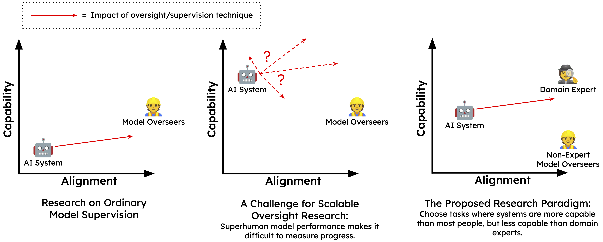
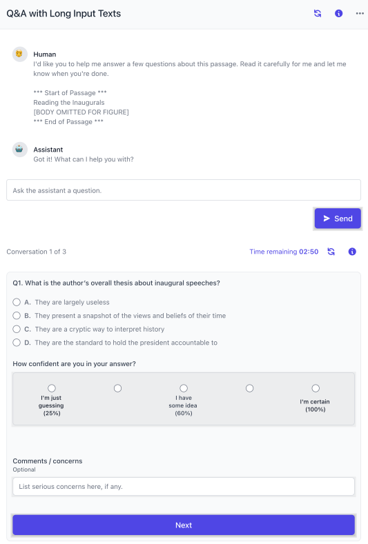

# 测量大语言模型可扩展监督的进展（中英对照）

> 原文标题：Measuring Progress on Scalable Oversight for Large Language Models
> 原文链接：https://www.anthropic.com/research/measuring-progress-on-scalable-oversight-for-large-language-models
> 论文地址：https://arxiv.org/abs/2211.03540
> 原文作者：Samuel R. Bowman, Jeeyoon Hyun, Ethan Perez 等（Anthropic）
> 发布日期：2022-11-04
> **翻译模型：** GLM-5.3-Flash
> **评分：** ★★★☆☆（3/5，值得一读）—— 可扩展监督的首批人类实证对比：四个问答任务上 AI 助手能显著提升人类监督者表现，但辩论方案未显示出相对直接建议的优势
> 排版：每段英文原文在前，中文翻译紧随其后。本文收录 arXiv 论文正文（第 1–6 节与作者贡献、致谢）；附录 A–C 未收录。

---

## 1 引言（Introduction）

To build and deploy powerful AI responsibly, we will need to develop robust techniques for scalable oversight : the ability to provide reliable supervision—in the form of labels, reward signals, or critiques—to models in a way that will remain effective past the point that models start to achieve broadly human-level performance (( Amodei et al., 2016 )) . These techniques are likely to build on the methods we use today for steering large models (( Christiano et al., 2017 ; Stiennon et al., 2020 , like RLHF;)) , but will need to be further developed to continue behaving as expected in regimes where models have important knowledge or capabilities that we lack or where models are acting intentionally to mislead us. If this is possible, it will very likely involve finding ways of extracting trustworthy information from untrustworthy models. There have been many promising proposals for methods that could yield progress in this direction (( Irving et al., 2018 ; Hubinger, 2020 ; Leike et al., 2018 ; Christiano et al., 2018 , i.a.)) , but relatively little empirical work to date (( Wu et al., 2021 ; Saunders et al., 2022 , with exceptions including:)) .

为了负责任地构建和部署强大的 AI，我们需要为可扩展监督（scalable oversight）发展出稳健的技术：所谓可扩展监督，是指以标签、奖励信号或批评意见等形式向模型提供可靠监督的能力，并且这种能力在模型开始广泛达到人类水平表现之后仍然有效（( Amodei et al., 2016 )）。这些技术很可能建立在我们今天用于引导大模型的方法之上（( Christiano et al., 2017 ; Stiennon et al., 2020 , like RLHF;)），但还需要进一步发展，才能在如下情形中继续表现得符合预期：模型拥有我们所缺乏的重要知识或能力，或者模型在蓄意误导我们。如果这有可能实现，它将极有可能涉及从不怎么可信的模型中提取可信信息的方法。已有许多有望沿此方向取得进展的方案（( Irving et al., 2018 ; Hubinger, 2020 ; Leike et al., 2018 ; Christiano et al., 2018 , i.a.)），但迄今为止的实证工作相对较少（( Wu et al., 2021 ; Saunders et al., 2022 , with exceptions including:)）。

In this paper, we present a technique—based closely on the as-yet-untested sandwiching proposal (( Cotra, 2021 )) —for the evaluation of scalable oversight techniques with present-day models. We then present a simple baseline experiment motivated by this lens in which we ask humans to solve difficult question-answering tasks with the help of a large-language-model assistant. The experiment reinforces existing evidence that humans can benefit from this kind of assistance and shows that key assumptions of the paradigm hold for two existing question-answering datasets.

本文提出一种技术——紧密切基于尚未经过检验的夹心（sandwiching）提案（( Cotra, 2021 )）——用于在当今模型上评估可扩展监督技术。随后，我们受这一视角启发，给出一个简单的基线（baseline）实验：让人类在大型语言模型助手（assistant）的协助下解决困难的问答任务。该实验强化了既有证据——人类可以从这类协助中受益——并证明该范式的若干关键假设在两个现有问答数据集上均成立。

**Figure 1:** A schematic of the research paradigm for scalable oversight that we outline here, based on (Cotra) ’s ( (2021) ) sandwiching . Scalable oversight techniques aim to improve a model’s capability and, especially, its alignment—its ability to apply that capability to tasks and goals that we choose—in a way that we expect to continue to work with highly capable models.  
**图 1：** 我们在此勾勒的可扩展监督研究范式示意图，基于 (Cotra)（(2021)）的夹心（sandwiching）方案。可扩展监督技术旨在提升模型的能力（capability），尤其是其对齐（alignment）水平——即把该能力应用于我们所选定的任务与目标的能力——并期望这一方式在能力极强的模型上仍能继续奏效。

#### 范式（The Paradigm）

The goal of scalable oversight is difficult to pursue experimentally since current systems differ in many important ways from the future systems that we are most concerned with being able to align, such that scalable oversight techniques are often both unnecessary and cumbersome. However, there is empirical work we can do that will bring us evidence about the problem and experience with many (though not all) of its challenges: Under the proposed sandwiching experimental paradigm (( Cotra, 2021 )) , researchers choose problem settings where a model is already more capable than a typical human, but less capable than an expert (‘sandwiching’ the model’s capabilities between that of the typical humans and the experts). Non-expert human research participants then attempt to train or align the model to perform the task reliably with an artificial constraint: They may not use any help or input (including preexisting written materials) from the experts. The experts participate only at the end of each experimental cycle, when their role is to evaluate the degree to which the non-expert participants succeeded.

可扩展监督这一目标很难直接通过实验来追求，因为当前系统与我们最希望有能力去对齐的未来系统在许多重要方面都不相同，这使得可扩展监督技术往往既无必要又显得笨重。不过，仍有一些实证工作可以为我们带来关于该问题的证据，以及应对其诸多（虽非全部）挑战的经验：在所提出的夹心实验范式（( Cotra, 2021 )）下，研究者选择这样的问题场景——某个模型已经比普通人更能干，但还不如专家（即把模型的能力“夹”在普通人与专家之间）。随后，非专家的人类研究参与者在一个人为约束下尝试训练或对齐模型，使其可靠地完成任务：他们不得使用来自专家的任何帮助或输入（包括现成的书面材料）。专家只在每轮实验的最后参与，其角色是评估非专家参与者在多大程度上取得了成功。

The situation of the non-expert participants is analogous to the situation we expect to find ourselves in with more capable future models: They have a wide range of tools and techniques at their disposal, including access to an untrustworthy but capable AI system, but they have no straightforward way to be certain that any of the decisions that they make are correct. However, in the case of these experiments, we can use the experts to catch and learn from our mistakes rather than waiting for them to yield consequences in the outside world. If research under this paradigm succeeds, it will produce a technique that allows us to gain enough justified confidence in our oversight that we will no longer need the experts, allowing us to ultimately provide sound oversight to AI systems even in regimes where they outperform our best experts.

非专家参与者所处的境地，类似于我们预计自己面对更强大的未来模型时的处境：他们手头有各种工具和技术可用，包括使用一个不怎么可信但颇为能干的 AI 系统，却没有任何直接的办法确信自己所做的决策是正确的。不过，在这类实验中，我们可以借助专家来发现错误并从中吸取教训，而不必等待这些错误在外部世界造成后果。如果在这一范式下的研究取得成功，它将产出一种技术，使我们对自己的监督获得足够充分的正当信心，以至于不再需要专家，从而最终能够对 AI 系统提供健全的监督——即便在它们超越我们最优秀专家的领域。

For a purely illustrative example, drawn from (Cotra) , consider the task of eliciting medical advice from a large language model like GPT-3. While large language models have serious limitations that prevent us from actually deploying them for medical advice, it is reasonable to expect that they could be helpful in some cases if they were well aligned: They have memorized large swaths of internet and book texts, including far more medical research than any one clinician. However, they have also memorized large swaths of inaccurate, dated, or debunked research, as well as uninformed social media writing on medicine (( Lin et al., 2022 , see)) . So by default, we should not expect their responses to be reliably aligned with our goals. Can a group of non-clinicians prompt or train a language model to give only appropriate advice, without at any point involving any clinicians or consulting the medical literature? One might first attempt this, for example, by prompting a model with a diverse array of prompts and strategies, and accepting only answers that the model gives consistently on the basis of consistent and reasonable-sounding evidence, though this technique is not guaranteed to succeed across the board. Any technique that could address such a challenge with high reliability would likely represent important progress on scalable oversight.

举一个纯粹用于说明的例子（取自 (Cotra)）：考虑从一个类似 GPT-3 的大型语言模型那里获取医疗建议的任务。虽然大型语言模型存在严重局限，使我们不会真的把它们部署用于医疗建议，但可以合理预期，如果它们对齐良好，在某些情况下会有所帮助：它们记忆了海量互联网与书籍文本，其中包括远超任何一位临床医生的医学研究内容。然而，它们同样记忆了大量不准确、过时或已被证伪的研究，以及关于医学的不专业的社交媒体文字（( Lin et al., 2022 , see)）。因此默认情况下，我们不应指望它们的回答会可靠地符合我们的目标。一群非临床医生能否在不引入任何临床医生、不查阅医学文献的前提下，通过提示或训练让语言模型只给出恰当的建议？举例来说，一个初步做法是：用多样化的提示与策略对模型进行提示，只接受模型在一致且听起来合理的证据基础上稳定给出的答案，尽管这一技术并不能保证处处奏效。任何能够高可靠性地应对此类挑战的技术，都很可能代表可扩展监督方面的重要进展。

Proposed scalable oversight techniques like debate (( Irving et al., 2018 )) or market making (( Hubinger, 2020 )) offer more sophisticated options for attacking this problem and could provide leverage on the problem, but none have been proven out empirically. The sandwiching experimental design allows us to gain evidence and experience that will allow us to refine techniques like these to better meet the challenges of future more capable AI systems.

诸如辩论（debate）（( Irving et al., 2018 )）或做市（market making）（( Hubinger, 2020 )）等被提出的可扩展监督技术，为攻克这一问题提供了更精细的选择，也可能提供解题的杠杆，但尚无一种在实证上被验证过。夹心实验设计让我们能够积累证据与经验，从而改进这类技术，以更好地迎接未来更强 AI 系统带来的挑战。

#### 我们的概念验证实验（Our Proof-of-Concept Experiment）

This paper presents a simple baseline experiment, meant to demonstrate the viability of sandwiching-style experiments on two tasks with current large language models, focusing on a slightly relaxed version of the paradigm: We present human participants with difficult multiple-choice questions from two datasets (( Hendrycks et al., 2020 ; Pang et al., 2022 , MMLU and time-limited QuALITY;)) on which we expect our existing natural language assistant (( Bai et al., 2022 )) to perform better than the participants could naïvely perform on their own, but on which we expect our assistant to nonetheless make frequent mistakes. We then ask the participants to interact with the assistant in any way they see fit to elicit answers in which they can be justifiably confident. This simple paradigm does not succeed fully, but the results are encouraging, with model-assisted humans outperforming machines by about 10 percentage points on the MMLU and timed QuALITY question-answering tasks, and exceeding their own model-unassisted performance by up to 36 points.

本文给出一个简单的基线实验，旨在证明在当前大型语言模型上开展夹心式实验的可行性，并聚焦于该范式的一个略微放宽的版本：我们向人类参与者提供来自两个数据集（( Hendrycks et al., 2020 ; Pang et al., 2022 , MMLU and time-limited QuALITY;)，即 MMLU 与限时版 QuALITY）的困难多选题；我们预计现有的自然语言助手（( Bai et al., 2022 )）在这些题目上的表现会好于参与者的朴素水平，但同时也预计助手会频繁出错。随后，我们请参与者以自己认为合适的任何方式与助手互动，以引出他们能够有正当信心采信的答案。这一简单范式并未完全成功，但结果令人鼓舞：在 MMLU 和限时 QuALITY 问答任务上，模型辅助的人类比机器（模型单独作答）高出约 10 个百分点，且比他们自身无模型辅助时的表现最多高出 36 个百分点。

In (Askell et al. (2021)) we framed the problem of aligning present-day language models for helpfulness, harmlessness, and honesty and presented experiments pursuing that goal with simple baseline techniques. In a similar spirit, this paper frames the narrower problem of developing scalable oversight techniques through sandwiching and presents results with a simple technique. In both cases, we choose techniques because they represent an obvious starting point that we expect we will need to learn about to make progress, not because they represent the approach that we ultimately expect to be most fruitful for AI safety.

在 (Askell et al. (2021)) 中，我们界定了让当今语言模型对齐于有用性（helpfulness）、无害性（harmlessness）与诚实性（honesty）的问题，并以简单的基线技术给出了朝此目标推进的实验。本着类似的精神，本文界定了一个更窄的问题——通过夹心来发展可扩展监督技术——并以一种简单技术给出了结果。在这两项工作中，我们之所以选择这些技术，是因为它们代表一个显而易见的起点，我们预计要取得进展就必须了解它们，而不是因为它们代表我们最终预计对 AI 安全最富有成效的方法。

#### 贡献（Contributions）

- **The Sandwiching Paradigm:** We lay out a research agenda for scalable oversight built around the sandwiching experimental paradigm.

- **夹心范式（The Sandwiching Paradigm）：** 我们围绕夹心实验范式，勾画了一份可扩展监督的研究议程。

- **The Experiment:** We show that two existing NLP tasks satisfy the constraints of sandwiching well with large language models and that a simple baseline strategy for language-model conversational agents—asking humans to elicit knowledge from them through conversation—works imperfectly but surprisingly well at producing high-quality labels on two hard question-answering tasks.

- **实验（The Experiment）：** 我们证明，两个现有 NLP 任务与大型语言模型搭配能很好地满足夹心的约束条件；并且，针对语言模型对话智能体的一种简单基线策略——让人类通过对话从模型中引出知识——在两个困难的问答任务上生成高质量标注的效果虽不完美，却出奇地好。

- **Conclusions:** This result represents a simple proof of concept for sandwiching experiments with multiple-choice question answering and shows—echoing (Saunders et al. (2022)) —that present large language models can help humans achieve difficult tasks in settings that are relevant to scalable oversight.

- **结论（Conclusions）：** 这一结果是围绕多选题问答开展夹心实验的一个简单概念验证，并呼应 (Saunders et al. (2022)) 地表明：当今的大型语言模型能够在与可扩展监督相关的场景中帮助人类完成困难任务。
## 2 可扩展监督的研究范式（A Research Paradigm for Scalable Oversight）

Sandwiching experiments (( Cotra, 2021 , sketched in Figure 1 )) pose an empirical test of a scalable oversight technique’s ability to align a model. Alignment in this context is best defined by contrast with capability : We can say that a language-model-based system is capable of solving a task if it can be made to perform well on the task through some small-to-moderate intervention, such as fine-tuning or few-shot prompting with a moderate amount of high-quality task data, with the intuition that this shows that the model already has most of the skills and knowledge needed to succeed at the task. Such a system is misaligned if it is capable under this definition but performs poorly under naïve zero-shot prompting.

夹心实验（( Cotra, 2021 , sketched in Figure 1 )，即图 1 所简述者）对一个可扩展监督技术对齐模型的能力提出了实证检验。在本文语境下，对齐（alignment）最好通过与能力（capability）的对比来定义：如果一个基于语言模型的系统能够通过某种小到中等程度的干预（例如微调，或使用适量高质量任务数据做少样本（few-shot）提示）在某个任务上表现良好，我们就说它有能力解决该任务——其背后的直觉是，这说明模型已经具备了在该任务上取得成功所需的大部分技能与知识。如果一个系统在此定义下有能力、却在朴素的零样本（zero-shot）提示下表现糟糕，那么它就是未对齐的（misaligned）。

Experiments in this paradigm sandwich a model’s effective capability level between two groups of human participants on some task:

在此范式下的实验，将模型在某个任务上的有效能力水平夹在两组人类参与者之间：

- **The Expert Evaluators:** These human participants have all of the skills or knowledge they need to oversee a system’s performance on the task and are aligned in the sense that they will make a good-faith effort to do so. Their evaluation represents an upper bound on the quality of supervision signal we can provide to the model, and their role in the experiment is only to serve as a reference in the evaluation of the other two parties.

- **专家评估者（The Expert Evaluators）：** 这些人类参与者具备监督系统在该任务上的表现所需的全部技能或知识，而且是“对齐的”——即他们会本着善意认真履行职责。他们的评估代表我们所能提供给模型的监督信号质量的上限；他们在实验中的角色，仅是在评估另外两方时充当参照。

- **The Model:** The machine-learning model is also expected to have most or all of the skills or knowledge needed to solve the task but is not expected to be aligned so as to reliably do so. Its performance when evaluated in straightforward ways is significantly worse than that of the experts.

- **模型（The Model）：** 机器学习模型同样被预期具备解决该任务所需的大部分乃至全部技能或知识，但不被预期已对齐到能可靠地加以运用的程度。以直接方式评估时，其表现会显著逊色于专家。

- **The Non-Expert Participants:** These human participants understand the task and are well aligned, but are missing some crucial skills or knowledge, such that without assistance they cannot reliably perform the task or oversee a model’s performance of the task. Their objective during the experiment is to use a scalable oversight technique with the model to perform the task reliably and to build justified confidence that they are in fact doing so.

- **非专家参与者（The Non-Expert Participants）：** 这些人类参与者理解任务且对齐良好，但缺少某些关键技能或知识，因此若无协助，他们既无法可靠地完成任务，也无法监督模型对该任务的执行。他们在实验中的目标是：与模型一起运用某种可扩展监督技术来可靠地完成任务，并建立起“自己确实做到了这一点”的正当信心。

A full research agenda built around sandwiching will generally have an inner loop and an outer loop. In the inner loop, the non-experts make iterative attempts to align the model. The loop terminates when they are convinced that the model has been aligned and achieves satisfactory performance. The experts then review the behavior of the resulting model and evaluate whether it was successfully aligned by comparing its performance with that of a model aligned under their own careful expert supervision. The outer loop consists of multiple attempts to develop the scalable oversight strategy and repeat the inner loop. It ends with a verdict on whether any scalable oversight strategy of the type being studied is sufficient to align the model on the task and, if it is not, how often it fails and how harmful its failures are likely to be.

围绕夹心构建的完整研究议程，通常会包含一个内环（inner loop）与一个外环（outer loop）。在内环中，非专家参与者迭代地尝试对齐模型；当他们确信模型已被对齐、且达到令人满意的性能时，内环终止。随后，专家审查所得模型的行为，并通过将其表现与自己亲自细心监督下对齐的模型进行比较，来评估对齐是否成功。外环则由多轮“发展可扩展监督策略并重复内环”的尝试构成；它最终给出一个判定：所研究的这类可扩展监督策略是否足以在该任务上对齐模型；如果不够，其失败频率有多高、失败可能造成多大危害。

The goal of such an agenda is to develop techniques that will allow us to conduct the work in the inner loop confidently and correctly on the first attempt , with no grounded feedback from the outer loop, across a wide range of tasks with increasingly capable models. If this succeeds, it suggests that—at least in some important ways—our techniques are likely to be up to the task of aligning potential future systems that show broadly superhuman performance on important tasks.

这一议程的目标，是发展出一类技术，使我们能够在能力越来越强的模型上的广泛任务中，在首次尝试时就自信且正确地完成内环中的工作，而不依赖外环提供的任何有据可依的反馈。如果这一点成功，就意味着——至少在某些重要方面——我们的技术有能力去对齐那些在重要任务上展现广泛超人类表现的潜在未来系统。

The paradigm we describe here closely follows the original proposal from (Cotra) . For our initial experiment below, we add two relaxations that depart from the original proposal. Both significantly simplify what needs to be done to conduct a minimally viable experiment at the cost of reducing the scope of conclusions that can be drawn. We expect it to be most productive to conduct research with these relaxations in place at first and to remove them as it becomes clearer which techniques show promise.

我们在此描述的范式紧随 (Cotra) 的原始提案。对于下文的初步实验，我们加入了两处偏离原始提案的放宽（relaxations）。这两处放宽都显著降低了开展一个最小可行实验所需的工作量，代价是缩小了可下结论的范围。我们预计，先带着这些放宽开展研究、再随着哪些技术有前景逐渐明朗而将其移除，是最具成效的做法。

#### 放宽条件一：静态模型（Relaxation: Static Model）

Sandwiching places no limitation on how the participants interact with the model (and potentially additional outside resources). In our initial experiments, we focus on the special case where participants can interact with the model only through dialog, without the ability to inspect it or further fine-tune it. The model we use was previously fine-tuned to act as a dialog assistant, and this fine-tuning allows humans to elicit a surprisingly rich range of knowledge and behavior from the model through prompting, few-shot learning, and guided conversation. The participants’ goal in this case is to reach the highest level of performance on the task that is achievable through direct interaction with the model, rather than fine-tuning or otherwise modifying the model to cause it to perform well on its own as in the original paradigm.

夹心对参与者如何与模型（以及可能的额外外部资源）互动没有限制。在初步实验中，我们聚焦于一个特例：参与者只能通过对话与模型互动，无法检查模型内部，也无法进一步微调它。我们使用的模型此前已被微调为对话助手，这一微调使人类能够通过提示、少样本学习（few-shot learning）和引导式对话，从模型中引出惊人丰富的知识与行为。在这种情况下，参与者的目标是：在与模型的直接交互所能达到的范围内，取得该任务上最高的表现水平，而不是像原始范式那样通过微调或其他方式修改模型、使其自己表现良好。

This relaxation rules out many potentially viable oversight strategies, but when participants succeed in this setting, that success yields positive evidence that is nearly as strong as the evidence we would get from a success in the full sandwiching regime. If the participants can reliably and confidently elicit the desired behavior from models, that suffices as a valuable solution to the alignment problem for some purposes, at least in the context of the task under study and the capability regime of the model being aligned. This result shows that a human–model team is capable of exploiting the model’s knowledge and skills to achieve reliable aligned high performance, and if desired, the outputs of such a pipeline can likely be used to update the model to demonstrate more aligned behavior on its own, at least given sufficiently many instances of human–model interactions and a sufficiently large base model.

这一放宽排除了许多潜在可行的监督策略，但当参与者在这种设定下取得成功时，该成功所提供的正面证据，几乎与我们在完整夹心机制下取得成功所能获得的证据同样有力。如果参与者能够可靠且有信心地从模型中引出所希望的行为，那么就某些目的而言，这已足以作为对齐问题的一个有价值解法——至少在所研究任务的语境、以及被对齐模型的能力区间内是如此。这一结果表明，“人类+模型”的团队有能力利用模型的知识与技能，实现可靠且对齐的高水平表现；而且如有需要，这类流程的输出大概率可以反过来用于更新模型，使其独立展现出更对齐的行为——至少在“人类—模型交互实例足够多、基座模型足够大”的条件下是可行的。

#### 放宽条件二：以标注数据替代专家（Relaxation: Labels in Place of Experts）

Our second relaxation requires that we choose a task like multiple-choice question answering where we can reliably evaluate model performance on a preexisting test dataset without any expert involvement at test time. In this setting, we can relax the paradigm further by omitting the expert role, and instead evaluate the success of an alignment attempt by the scores it produces on the metric. The absence of experts limits the degree to which we can precisely measure the satisfactoriness of our solutions—since we cannot as easily measure the best possible performance that an expert could cause the model to achieve—but incremental progress in this relaxed setting is nonetheless progress on the more general problem.

我们的第二处放宽要求所选任务类似多选题问答：在测试阶段无需任何专家参与，就能依据现成的测试数据集可靠地评估模型表现。在这种设定下，我们可以进一步放宽范式——省去专家角色，转而以对齐尝试在指标上产生的分数来评估其成败。缺少专家限制了我们能以多高的精度衡量解法的令人满意程度——因为我们不再能轻易测出专家所能让模型达到的最佳表现——但在这一放宽设定下的渐进式进展，依然是对更一般问题的进展。

#### 潜在技术（Potential Techniques）

Sandwiching experiments are appropriate with any technique for scalable oversight—any technique that allows one to reliably use or train a machine learning model that is more capable than its operators in important ways but not reliably aligned. These include:

夹心实验适用于任何可扩展监督技术——即任何让人能够可靠地使用或训练这样一种机器学习模型的技术：该模型在重要方面比其操作者更能干，但并未被可靠地对齐。这包括：

- **Plain Model Interaction:** This paper shows that plain text-based interaction with a large language model—in this case, one fine-tuned to act as a dialog system—can be an imperfect but surprisingly effective strategy for oversight. Human participants can elicit relevant knowledge and reasoning from the model, circumvent some degree of misaligned model behavior by interrogating the model for consistency or reviewing multiple output samples for the same query, and synthesize the resulting findings using their own judgment.

- **纯模型交互（Plain Model Interaction）：** 本文表明，与大型语言模型（此处是微调为对话系统的模型）进行纯文本交互，可以是一种虽不完美却出奇有效的监督策略。人类参与者可以从模型中引出相关知识与其推理；通过质询模型的一致性、或对同一问题审查多个输出样本，来绕开一定程度的模型未对齐行为；并运用自己的判断综合所得发现。

- **Debate:** Techniques in this family (( Irving et al., 2018 ; Irving and Askell, 2019 )) adapt a model (potentially but not necessarily a natural-language assistant) to propose an answer to a question and then alternately play the role of two participants in a debate, surfacing and critiquing arguments for and against the proposed answer. A human judge is then expected to use these arguments to choose an answer. While this can be approximated using simple model prompting, the full protocol requires the use of a training objective that sets up adversarial incentives for the two sides of the debate.

- **辩论（Debate）：** 这一类技术（( Irving et al., 2018 ; Irving and Askell, 2019 )）将一个模型（可以是、但不必须是自然语言助手）改造为：先就某个问题提出一个答案，然后交替扮演辩论中两方参与者的角色，呈现并批评支持与反对该答案的论据。随后由人类裁判依据这些论据选出答案。虽然可以用简单的模型提示来近似这一流程，但完整协议要求使用一种训练目标，为辩论双方设置对抗性激励。

- **Market-Making:** In this derivative of debate (( Hubinger, 2020 )) , a single debater aims to iteratively generate arguments that maximally change the belief of a judge (loosely speaking, a learned predictor of a human participant’s judgment) at each turn. This strategy aims to accomplish the same goals without encouraging unnecessary long-horizon planning in the participating agents (( Bostrom, 2014 , which is potentially concerning in sufficiently capable agents; see e.g.)) .

- **做市（Market-Making）：** 作为辩论的一个衍生变体（( Hubinger, 2020 )），由单一“辩手”在每一轮迭代地生成论据，以最大限度地改变裁判（宽泛地说，即一个学习得到的、对人类参与者判断的预测器）的信念。该策略旨在达成与辩论相同的目标，同时不鼓励参与智能体进行不必要的长程规划（( Bostrom, 2014 , which is potentially concerning in sufficiently capable agents; see e.g.)）——就能力足够强的智能体而言，这种规划可能令人担忧。

- **Self-Critique, Amplification and Recursive Reward Modeling:** In this family of approaches (( Leike et al., 2018 ; Christiano et al., 2018 ; Wu et al., 2021 ; Saunders et al., 2022 )) , loosely speaking, the human participants iteratively (i) supervise a model using a human-supervision-based technique like RLHF using input from a critique-assistant model that raises supervision-relevant considerations, and (ii) supervise the critique-assistant model by the same means.

- **自我批评、放大与递归奖励建模（Self-Critique, Amplification and Recursive Reward Modeling）：** 在这一类方法（( Leike et al., 2018 ; Christiano et al., 2018 ; Wu et al., 2021 ; Saunders et al., 2022 )）中，宽泛地说，人类参与者迭代地：(i) 使用基于人类反馈的技术（如 RLHF）监督一个模型，监督时参考一个批评助手（critique-assistant）模型的输入，该模型负责提出与监督相关的考量；(ii) 用同样的手段监督这个批评助手模型。

Debate and market-making notably incentivize the model under study to present misleading arguments or evidence in some instances. For example, a model participating in a debate on the side of an incorrect answer would be under pressure to present the most compelling evidence for that wrong answer. This attribute of these strategies is meant to elicit the strongest available arguments and evidence relevant to some question, and it also makes them a particularly good fit with the sandwiching paradigm: Even a model that is typically helpful and aligned is likely to demonstrate capable misaligned behavior, making the experiment an especially difficult and realistic challenge for the human participants.

辩论与做市有一个显著特点：在某些情况下，它们会激励被研究的模型提出误导性的论据或证据。例如，在辩论中为某个错误答案站台的一方，会处于压力之下，要为该错误答案提供最有说服力的证据。这些策略的这一属性，本意是引出与某个问题相关的最强的现有论据与证据；这也使它们与夹心范式格外契合：即便是通常乐于助人且对齐良好的模型，也很可能展现出“有能力但未对齐”的行为，这使实验对人类参与者而言成为一个格外困难且贴近现实的挑战。

## 3 一个简单实验（A Simple Experiment）

While sandwiching may be conceptually appealing, it is not immediately clear that there currently exist tasks and models that satisfy its constraints. Our proof-of-concept experiment here is meant to demonstrate that two existing tasks satisfy two constraints with a typical large language model: (i) typical careful human participants perform poorly on their own, such that sandwiching is possible, and (ii) those same participants can improve their performance substantially through interaction with the model, such that scalable oversight techniques that rely on help from the model are likely to get off the ground.

夹心虽然在概念上颇具吸引力，但当前是否真的存在满足其约束条件的任务与模型，并不一目了然。我们在此的概念验证实验，旨在证明两个现有任务在典型大型语言模型上满足两个约束条件：(i) 认真投入的普通人类参与者凭自身表现很差，从而使夹心成为可能；(ii) 同一批参与者通过与模型交互能大幅提升表现，从而使依赖模型协助的可扩展监督技术有望起步。

### 3.1 任务（Tasks）

#### 回答专业考试题（Answering Specialized Exam Questions）

We evaluate human--model team performance on multiple-choice questions from the MMLU benchmark 1 As far as we understand, ours is the first attempt to ask human participants to answer questions drawn from MMLU. This means that we found some recurring formatting errors in our pilots. The maintainers of MMLU fixed the most systematic of these issues, and we use the updated version of the dataset dated Aug 30, 2022. (( Hendrycks et al., 2020 )) . MMLU questions are largely drawn from practice tests for exams targeted at high-school, undergraduate, and professional students, and a significant fraction of them draw on specialized knowledge that we don’t expect most people to be familiar with. We expect the model to be able to use significant domain knowledge from pretraining that our human participants aren’t familiar with, but we also expect the model to be relatively ineffective at synthesizing this knowledge, allowing the human participant to contribute.

我们在来自 MMLU 基准 1（据我们所知，我们是首次尝试让人类参与者回答取自 MMLU 的题目。这意味着我们在试点中发现了一些反复出现的格式错误。MMLU 的维护者修复了其中最系统性的问题，我们使用的是 2022 年 8 月 30 日的更新版数据集。）的多选题上评估人类—模型团队的表现（( Hendrycks et al., 2020 )）。MMLU 的题目大多取自面向高中生、本科生与职业考生的模拟考试，其中相当一部分依赖大多数人并不熟悉的专业知识。我们预计模型能够利用预训练中习得的、人类参与者所不熟悉的大量领域知识，但我们也预计模型在综合运用这些知识方面相对低效，从而给人类参与者留出发挥空间。

#### 长篇材料的限时问答（Timed Question Answering with Long Passages）

We also evaluate human--model team performance on multiple-choice reading-comprehension questions from QuALITY 2 We use the plain text (‘HTML-stripped’) variant of the 1.0.1 version of the dataset for both our human participants and the model. (( Pang et al., 2022 )) . QuALITY questions are meant to be answerable by English-fluent college-educated adults, but they require readers to thoroughly understand a short story of about 5,000 words, which would ordinarily take 15–30 minutes to read. To create a challenging task that requires model assistance, we ask human participants to answer QuALITY questions under a 5-minute time limit (( Pang et al., 2022 ; Parrish et al., 2022b ; Parrish et al., 2022a , roughly paralleling)) . This prevents them from reading the story in full and forces them to rely on the model to gather relevant information. 3 (Pang et al.) show that annotators with strong incentives to choose correct answers fail to answer QuALITY questions reliably when working on a 45-second time limit on their access to the passage, suggesting that it is not possible to quickly answer these questions with one or two simple keyword searches.

我们还在来自 QuALITY 2（对人类参与者和模型，我们都使用该数据集 1.0.1 版的纯文本（“去除 HTML 标记”）变体。）的多选题阅读理解（reading comprehension）题上评估人类—模型团队的表现（( Pang et al., 2022 )）。QuALITY 的题目设计上应由英语流利、受过大学教育的成年人可以作答，但要求读者透彻理解一篇约 5,000 词的短篇小说——通读通常需要 15–30 分钟。为了构造一个有挑战性、需要模型协助的任务，我们要求人类参与者在 5 分钟时限内回答 QuALITY 题目（( Pang et al., 2022 ; Parrish et al., 2022b ; Parrish et al., 2022a , roughly paralleling)）。这使他们无法通读全文，不得不依赖模型来收集相关信息。3 (Pang et al.) 表明，即使标注者有强烈的动机选对答案，在只能用 45 秒浏览文章的条件下也无法可靠地答对 QuALITY 题目——这说明不可能仅靠一两个简单的关键词搜索快速答对这些问题。

**Figure 2:** The data collection interface for QuALITY. The story is truncated in this example but would be available to scroll through in real use. The MMLU variant of the interface omits the timer and starts with an empty dialog pane. The first unlabeled button resets the conversation history for the model and the second shows the task instructions.  
**图 2：** QuALITY 的数据采集界面。本示例中故事文本被截断，实际使用时可以滚动浏览全文。界面的 MMLU 变体去掉了计时器，且初始对话窗格为空。第一个无标签按钮用于重置模型的对话历史，第二个按钮显示任务说明。

### 3.2 参与者与规模（Participants and Scale）

We hire participants through data-labeling startup Surge AI, 4 https://surgehq.ai deferring the qualification, training, and payment process to specialists there. We work with two groups of five participants each for the two tasks (ten total), and each participant works on every question. For each experiment, we collect answers for only 100 randomly-sampled validation-set 5 Our experimental process involves significant in-house piloting and significant conversation with our hired participants. For this reason, we use the validation sets in all experiments to avoid violating the norm in NLP research against having researchers read test datasets. questions, focusing on quality of work at the expense of quantity. (For fully-automatic baselines, we use the full validation sets.)

我们通过数据标注初创公司 Surge AI 4（https://surgehq.ai）招募参与者，把资格筛选、培训与支付流程交给那里的专业团队。两个任务各配一组、每组五名参与者（共十人），每位参与者作答每一道题。每个实验中，我们只随机抽取 100 道验证集 5（我们的实验流程包含大量的内部试点以及与受雇参与者的深入交流。因此，我们在所有实验中都使用验证集，以避免违反 NLP 研究中“研究者不得阅读测试集”的规范。）题目来收集答案，以保证质量、宁可牺牲数量。（对于全自动基线，我们使用完整验证集。）

Our results only include data from four of the five participants assigned to each task, since in each case, one participant achieved far greater accuracy than the other four in the model-unassisted condition (84% vs. 57% for MMLU, 89% vs. 49% for QuALITY) and outperformed the best result by the model. Including these two outlier participants would have likely violated a key assumption of the sandwiching paradigm: that the human participants lack some key task-relevant knowledge or skills that the model under study is capable of providing. While we cannot fully rule out some form of cheating in these cases, our other interactions with these participants suggest that they are unusually talented at trivia and speed-reading respectively.

我们的结果只包含每个任务五名参与者中四名的数据，因为在两个任务中，都各有一名参与者在无模型辅助条件下的准确率远高于其余四人（MMLU 上为 84% 对 57%，QuALITY 上为 89% 对 49%），并且超过了模型的最好成绩。纳入这两名离群参与者，很可能会违背夹心范式的一个关键假设：人类参与者缺乏某些关键的任务相关知识或技能，而这些正是被研究模型所能提供的。虽然我们无法完全排除这两例存在某种作弊的可能，但我们与他们的其他交流表明，他们分别在冷门知识问答和快速阅读上异乎寻常地有天赋。

Surge pays a minimum of $20/hr for active work. Participants were not directly incentivized to answer questions correctly, but in our experience, all made a serious effort to do so and sent us extensive questions and comments on their experiences, amounting to several pages for each participant.

Surge 对有效工作的报酬不低于每小时 20 美元。参与者并没有因答对题目而直接获得激励，但据我们的经验，他们都认真作答，并给我们发来了大量问题与关于自身体验的意见，每人累计达数页之多。
### 3.3 方法（Methods）

#### 界面（The Interface）

Figure 2 shows the annotation interface. It consists of a chat pane to interact with the model and a question-answering pane that shows a question, four choices and a five-way Likert scale for confidence. The chat pane also includes a reset button which restarts the conversation—preserving the chat history for the human participant but stripping it from the model’s context. The ability to reset the model makes it possible for users to reevaluate the model when they suspect that it may have confidently asserted something that is not true, something we anecdotally found to be helpful during internal pilots. The question and answer choices are not automatically provided to the model.

图 2 展示了标注界面。它由一个与模型交互的聊天窗格和一个问答窗格组成，后者显示题目、四个选项以及一个用于表达置信度的五级李克特量表（Likert scale）。聊天窗格还包含一个重置按钮，用于重启对话——保留人类参与者一侧的聊天记录，但把这些记录从模型的上下文中剥离。重置模型的能力使用户可以在怀疑模型可能自信地断言了不实内容时重新考验模型——据我们的内部试点经验，这一点颇有帮助。题目与选项不会自动提供给模型。

Two additional features are specific to QuALITY: The passage to which the question refers is injected into the conversation as the body of the first turn. In addition, a timer begins running when the task is opened. When the timer runs out, the current answer choice is automatically submitted.

另有两个功能为 QuALITY 特有：题目所指的文章会作为对话第一轮的正文注入对话。此外，任务打开时计时器开始计时；计时结束时，当前所选答案会被自动提交。

After a participant submits their answer choice and confidence for a question, we reveal the correct answer. This compromise represents a divergence from the core sandwiching protocol and has no analog in settings where we need to use scalable oversight strategies to supervise model behavior on questions for which we are genuinely uncertain. However, it enables our participants to recognize which of the strategies they try are working and thereby encourages them to explore a broader range of approaches, supporting our qualitative goals for the project. Since the questions in both datasets are quite diverse, we do not expect this feedback to have taught our participants any reusable information about the material that the questions test. Participants complete all 100 questions in the assisted condition before beginning the unassisted condition, so any learning effect would yield a bias toward a null result.

参与者为某题提交答案选择与置信度后，我们会公布正确答案。这一折中做法偏离了夹心协议的核心，在那些我们确实不确定、需要用可扩展监督策略来监督模型作答的场景中没有对应物。不过，它使参与者能够识别自己尝试的哪些策略是有效的，从而鼓励他们探索更广泛的方法，服务于我们为该项目设定的定性目标。由于两个数据集中的题目都相当多样，我们并不预期这种反馈会让参与者学到任何关于题目所考内容的可复用信息。参与者会先完成辅助条件下的全部 100 题再开始无辅助条件，因此任何学习效应都只会造成偏向零结果的偏差。

The full participant instructions are shown in Appendix A .

完整的参与者说明见附录 A。

#### 模型（The Model）

We use a 52B-parameter language model fine-tuned for use as a helpful dialog assistant according to the RLHF-based technique described in (( Bai et al., 2022 )) . 6 We use a model trained only to be helpful, rather than helpful and harmless as in the core experiments from (Bai et al.)

我们使用一个 52B 参数的语言模型，按照 (（Bai et al., 2022）) 中所述的基于 RLHF（基于人类反馈的强化学习）的技术，将其微调为乐于助人的对话助手。6 我们使用的模型只训练了有用性，而不像 (Bai et al.) 的核心实验那样同时训练有用性与无害性。

#### 实验条件（Experimental Conditions）

We report results from five conditions:

我们报告五种条件下的结果：

1. **Unassisted Human:** We ask our human participants to answer the questions to the best of their ability without the help of the model or any other outside resources (including web search). For these results and our other human results, we report average individual human accuracy and the accuracy of the confidence-weighted majority-vote 7 We score each answer using the product of the probabilities assigned to each answer by each participant and select the answer with the highest score. This allows a highly-uncertain annotator who chooses the minimum 25% confidence value to avoid influencing the consensus answer. We assign equal probability to each non-selected answer, so an annotator who selects answer (B) with 60% confidence would implicitly be assigning probabilities $[.13,.60,.13,.13]$ . We map the ‘Certain (100%)’ value in the interface to 99% to avoid zeroes. answer from all four active participants together. This uses the same UI as our target model-assisted condition, but without the UI connected to a model.

1. **无辅助人类（Unassisted Human）：** 我们请人类参与者在没有模型或任何其他外部资源（包括网络搜索）帮助的情况下尽力作答。对于这一结果及我们的其他人类结果，我们同时报告人类个体的平均准确率，以及全体四名在岗参与者合并给出的置信度加权多数投票 7（我们用每名参与者赋予每个答案的概率之乘积为每个答案打分，并选择得分最高的答案。这使得选择最低 25% 置信度、高度不确定的标注者得以避免影响共识答案。我们给每个未被选中的答案分配相等概率，因此以 60% 置信度选择答案 (B) 的标注者隐含地赋出了概率 $[.13,.60,.13,.13]$。为避免出现零，我们把界面上的 ‘Certain (100%)’ 取值映射为 99%。）的准确率。该条件使用与目标“模型辅助”条件相同的界面，只是界面未连接模型。

2. **Model:** We present the model with each question, one by one, zero-shot. We use the following minimal prompt, which was designed to dovetail well with RLHF training without injecting any new information about the task: Human: Question: `[question]` Choices: (A) `[choice A]` (B) `[choice B]` (C) `[choice C]` (D) `[choice D]` Answer: Assistant: We then choose the answer letter (in parentheses) that has the highest likelihood conditioned on the prompt.

2. **模型（Model）：** 我们把每道题逐一以零样本（zero-shot）方式呈给模型，使用下面这个最小提示——它的设计意图是与 RLHF 训练良好衔接，且不注入任何关于任务的新信息：Human: Question: `[question]` Choices: (A) `[choice A]` (B) `[choice B]` (C) `[choice C]` (D) `[choice D]` Answer: Assistant: 随后，我们选择在该提示条件下似然最高的那个答案字母（括号中的字母）。

3. **Model (5-shot):** We use the same process and format as above but prepend five questions and their answers to the prompt. We use this method only for MMLU. Since QuALITY examples average about 5,000 words, it is not possible to fit multiple examples in our assistant’s context window. Since this technique uses ground-truth labels from experts, we should expect it to be somewhat artificially strong, and potentially stronger than would be achievable without expert involvement. We include it for comparison with non-expert human participant performance, since our participants also see some labels.

3. **模型（5-shot）（Model (5-shot)）：** 采用与上面相同的过程与格式，但在提示前附加五道题及其答案。该方法只用于 MMLU。由于 QuALITY 样本平均约 5,000 词，无法在助手的上下文窗口中放入多个样本。由于该技术使用了来自专家的真实标签（ground-truth labels），我们应预期它有几分人为虚高，可能强于无专家参与时所能达到的水平。我们收录它以便与非专家人类参与者的表现进行比较，因为我们的参与者同样能看到一些标签。

4. **Model (best-of-20 CoT):** Here, we prompt the model with a chain-of-thought -style input before asking them to answer (( Nye et al., 2021 ; Wei et al., 2022 )) . We sample 20 instances of model reasoning and choose the one that scores best under our RLHF preference model before conditioning on that reasoning string to generate the answer. For MMLU, we additionally prepend five examples in their labels to the context (as above), with no added reasoning information, subjecting it to the same caveat as the 5-shot condition above. Inspired by (Kojima et al. (2022)) , we use the following prompt structure: `[optional 5-shot context, formatted as above without chain-of-thought]` Human: `[target question, formatted as above]` Assistant: Let’s think step by step: `[model-generated reasoning]` Human: Based on the above, what is the single, most likely answer choice? Assistant: The single, most likely answer choice is

4. **模型（best-of-20 思维链）（Model (best-of-20 CoT)）：** 此方法在让模型作答之前，先用思维链（chain-of-thought）风格的输入对模型进行提示（( Nye et al., 2021 ; Wei et al., 2022 )）。我们采样 20 个模型推理实例，选出在我们 RLHF 偏好模型下得分最高的那个，再以该推理文本为条件生成答案。对 MMLU，我们还会像上文那样把五个样例及其标签附加到上下文之前（不含额外的推理信息），因此它同样带有 5-shot 条件的上述注意事项。受 (Kojima et al. (2022)) 启发，我们使用如下提示结构：`[optional 5-shot context, formatted as above without chain-of-thought]` Human: `[target question, formatted as above]` Assistant: Let’s think step by step: `[model-generated reasoning]` Human: Based on the above, what is the single, most likely answer choice? Assistant: The single, most likely answer choice is

5. **Human + Model:** For our main target condition, we ask our human participants to attempt to use the model to help them answer. This condition uses a separate 100-example sample from the unassisted human condition above.

5. **人类 + 模型（Human + Model）：** 作为我们的主目标条件，我们请人类参与者尝试利用模型来帮助自己作答。该条件使用的 100 题样本与上面的无辅助人类条件相互独立。

The model-prompting conditions here are relatively weak at showing that our model is misaligned in the relevant sense, but we take our ability to improve upon its performance substantially in a human–model team setting as prima facie evidence of some degree of misalignment.

这些模型提示条件，在“证明我们的模型在相关意义上未对齐”这一点上相对乏力，但我们把人类—模型团队能够大幅超越其单独表现这一点，视为模型存在一定程度未对齐的初步证据（prima facie evidence）。

**Table 1:** Validation set results, showing accuracy (higher is better) and calibration error (lower is better): Human–model teams tend to substantially outperform humans or models alone. The best-of-20 result is 5-shot for MMLU and zero-shot for QuALITY. 5-shot QuALITY experiments are not possible due to input length limitations.  
**表 1：** 验证集结果，展示准确率（Acc，越高越好）与校准误差（CE，越低越好）：人类—模型团队的表现往往大幅优于单独的人类或模型。best-of-20 结果在 MMLU 上为 5-shot，在 QuALITY 上为零样本。由于输入长度限制，QuALITY 无法开展 5-shot 实验。

[TABLE]
|  | **MMLU** | **MMLU** | **QuALITY** | **QuALITY** |
|  | Acc | CE | Acc | CE |
| Unassisted Human | 57.2 | 6 | 48.6 | 17 |
| Unassisted Human (weighted majority vote) | 66.0 | 10 | 50.0 | 15 |
| Model | 57.2 | 6 | 59.2 | 7 |
| Model (5-shot) | 61.9 | 4 | – | – |
| Model (best-of-20 chain-of-thought) | 65.6 | 16 | 66.9 | 17 |
| Human + Model | 75.4 | 12 | 76.8 | 7 |
| Human + Model (weighted majority vote) | **78.0** | 18 | **86.0** | 11 |
| Expert Human (published estimates) | 90.0 | – | 93.5 | – |

|  | **MMLU** | **MMLU** | **QuALITY** | **QuALITY** |
|  | 准确率 | 校准误差 | 准确率 | 校准误差 |
| 无辅助人类 | 57.2 | 6 | 48.6 | 17 |
| 无辅助人类（加权多数投票） | 66.0 | 10 | 50.0 | 15 |
| 模型 | 57.2 | 6 | 59.2 | 7 |
| 模型（5-shot） | 61.9 | 4 | – | – |
| 模型（best-of-20 思维链） | 65.6 | 16 | 66.9 | 17 |
| 人类 + 模型 | 75.4 | 12 | 76.8 | 7 |
| 人类 + 模型（加权多数投票） | **78.0** | 18 | **86.0** | 11 |
| 专家人类（已发表估计值） | 90.0 | – | 93.5 | – |

## 4 结果与讨论（Results and Discussion）

#### 结果（Results）

Table 1 shows results on both tasks. Looking first to individual human accuracy, our best model results outperform unassisted humans on both tasks by a large margin (66% vs. 57% on MMLU, 67% vs. 49% on QuALITY) and model-assisted humans outperform our best model results by similarly large margins (75% vs. 66% on MMLU, 77% vs. 67% on QuALITY). All participants performed well, exceeding 71% individual accuracy in the model-assisted condition on both tasks.

表 1 给出了两个任务上的结果。先看人类个体准确率：我们最好的模型结果在两个任务上都大幅超过无辅助人类（MMLU 上 66% 对 57%，QuALITY 上 67% 对 49%），而模型辅助的人类又以相近幅度超过我们最好的模型结果（MMLU 上 75% 对 66%，QuALITY 上 77% 对 67%）。所有参与者的表现都不错，在两个任务的模型辅助条件下个体准确率均超过 71%。

Turning to weighted-majority-vote aggregate human performance, our best models outperform humans substantially only on QuALITY (66% vs. 66% on MMLU, 67% vs. 50% on QuALITY), and model-assisted humans outperform our best model results by large margins on both tasks (78% vs. 66% on MMLU, 86% vs. 67% on QuALITY). Model-assisted human performance on timed QuALITY falls short of the best known untimed human team performance (( Pang et al., 2022 , 86% vs. 94% from)) . We are not aware of any other reported human annotator scores on MMLU, but our best observed result falls short of (Hendrycks et al.) ’s hypothesized performance for a committee of experts (78% vs. 90%). The results discussed so far show that present large language models can help humans make difficult decisions, even in a regime where the questions cannot be straightforwardly answered by the model or the human alone.

再看加权多数投票聚合后的人类表现：我们最好的模型仅在 QuALITY 上大幅超过人类（MMLU 上 66% 对 66%，QuALITY 上 67% 对 50%），而模型辅助的人类在两个任务上都以较大幅度超过我们最好的模型结果（MMLU 上 78% 对 66%，QuALITY 上 86% 对 67%）。限时 QuALITY 上模型辅助人类的表现，尚不及已知最好的不限时人类团队成绩（( Pang et al., 2022 , 86% vs. 94% from)）。我们没有看到关于 MMLU 的其他人类标注者成绩的报道，但我们观察到的最好结果仍低于 (Hendrycks et al.) 对专家委员会表现的假设值（78% 对 90%）。到目前为止所讨论的结果表明，当今的大型语言模型能够帮助人类做出困难的决策——即便处于“模型与人类单独都无法直接答对”的区间。

Incidentally, we observe that few-shot learning is helpful (62% vs. 57% on MMLU), and that best-of-20 chain-of-thought prompting is helpful on both tasks (66% vs. 62% on MMLU, 67% vs. 59% on QuALITY).

顺带一提，我们观察到少样本学习是有帮助的（MMLU 上 62% 对 57%），而 best-of-20 思维链提示在两个任务上都有帮助（MMLU 上 66% 对 62%，QuALITY 上 67% 对 59%）。

We also report calibration error (CE) 8 We start with five bins, centered at 25%, 42%, 60%, 80%, and 100%, and collect all predictions that fall in that bin. (Human predictions are always at the exact center of the bin, because they’re selected using a Likert scale tool, while model predictions are scalar.) We then measure the accuracy of the prediction in each bin, measure the absolute difference between that accuracy and the center of the bin (i.e. 39% prediction accuracy in the 42% bin yields 3% error), and average that absolute difference across bins. for all results, using the same five bins—based on our UI—for both models and humans. On MMLU, humans and models alone are reasonably well calibrated, with a CE of no more than 10. Human-model teams, and models with chain-of-thought prompting, are substantially worse. On QuALITY, unaided humans do poorly, with human-model teams doing substantially better. These results are consistent with (Kadavath et al. (2022)) ’s report that our plain pretrained language models tend to be very well calibrated on multiple-choice question answering, but that their calibration degrades after RLHF training for helpfulness, which we use for all runs in this paper. We expect that explicit calibration training on the task would have improved these results for human participants and human–model teams (( Lichtenstein and Fischhoff, 1980 )) , which could potentially improve raw accuracy as well by better weighting votes across participants.

我们还对所有结果报告校准误差（calibration error, CE）8（我们以 25%、42%、60%、80% 和 100% 为中心设五个区间，把所有预测归入相应区间。（人类预测总恰好位于区间中心，因为它们通过李克特量表工具选择，而模型预测是标量。）然后我们测量每个区间内预测的准确率，计算该准确率与区间中心的绝对差（例如 42% 区间内 39% 的预测准确率产生 3% 的误差），再对各区间求这一绝对差的平均。），对模型和人类使用基于我们界面的同样五个区间。在 MMLU 上，单独的人类和模型校准都相当不错，CE 不超过 10；人类—模型团队以及使用思维链提示的模型则明显更差。在 QuALITY 上，无辅助的人类表现很差，人类—模型团队则好得多。这些结果与 (Kadavath et al. (2022)) 的报告一致：我们朴素的预训练语言模型在多选题问答上往往校准得非常好，但在经过面向有用性的 RLHF 训练（本文所有运行均采用这种训练）之后，其校准会退化。我们预计，针对任务的显式校准训练本可以改善人类参与者与人类—模型团队的这些结果（( Lichtenstein and Fischhoff, 1980 )），并且有望通过对跨参与者的投票进行更好的加权而同时提升原始准确率。

Unsurprisingly, giving annotators access to the model increases their confidence in answering (from 54% to 80% on MMLU; 38% to 75% on QuALITY). If we limit ourselves to responses where the weighted majority vote yields the maximum possible confidence of 99%—the answers that participants were most confident in—we see an accuracy of 88% on QuALITY ( $N=89$ ) and 81% on MMLU ( $N=84$ ).

不出所料，让标注者可以使用模型会提高他们的作答置信度（MMLU 上从 54% 升至 80%；QuALITY 上从 38% 升至 75%）。如果只看加权多数投票达到最高可能置信度 99% 的那些回答——即参与者最有信心的答案——其准确率在 QuALITY 上为 88%（ $N=89$ ），在 MMLU 上为 81%（ $N=84$ ）。

Human–machine dialogs averaged 10.9 turns and 2.0 conversation resets on MMLU and 6.3 turns and 0.1 conversation resets on QuALITY, with the lower figures for QuALITY likely explained in substantial part by the use of a time limit. These figures saw only modest variation across participants.

人机对话平均在 MMLU 上为 10.9 轮、2.0 次对话重置，在 QuALITY 上为 6.3 轮、0.1 次对话重置；QuALITY 数值较低，很大程度上可由限时设定解释。这些数字在参与者之间的波动不大。

Looking to potential learning effects from our choice to reveal question labels to annotators, only two of four MMLU annotators and three of four QuALITY annotators improved in accuracy between the first and second halves of their work in the Human + Model condition, for an average improvement of 0.7%.

关于我们向标注者公布题目答案这一选择可能带来的学习效应：在“人类 + 模型”条件中，四名 MMLU 标注者中只有两人、四名 QuALITY 标注者中只有三人在工作前半程与后半程之间准确率有所提升，平均提升幅度为 0.7%。
#### 定性发现（Qualitative Findings）

We show a few example human–model dialogs in Appendix B . Drawing on our observations of human–model conversation transcripts and participants’ shared notes (in italics ), we observe the following.

我们在附录 B 中展示了若干人类—模型对话示例。基于我们对人机对话记录的观察以及参与者共享的笔记（斜体部分），我们有以下发现。

For MMLU:

关于 MMLU：

- Participants learned to largely trust the model’s presentation of facts but to distrust long chains of reasoning and (especially) arithmetic operations. “The assistant performed rather well when asked questions that involved retrieving historical facts. In general, it seems to excel when there is only one answer to a (non-math) question.” “The assistant can successfully do calculus despite being subpar with arithmetic.”

- 参与者学会大体上相信模型对事实的陈述，但不信任冗长的推理链，尤其是算术（arithmetic）运算。“在问到涉及检索历史事实的问题时，助手表现得相当好。总体而言，对于一个（非数学）问题只有一个答案的情况，它似乎很擅长。”“助手能成功完成微积分，尽管算术水平欠佳。”

- Participants found it helpful to ask the model for many specific facts and term definitions before asking for holistic help with the question. “This helped me not get primed into believing false answers the assistant could have provided.”

- 参与者发现在寻求对问题的整体性帮助之前，先向模型询问许多具体事实和术语定义很有帮助。“这帮助我没有先入为主地相信助手本可能给出的错误答案。”

- Participants found that the model will reliably update its assumptions in response to corrections. This allows it to continue to be helpful when participants spot and correct a reasoning error, but also causes it to be overly deferential at times, going along with participant misunderstandings.

- 参与者发现，模型会可靠地根据纠正更新自己的假设。这使它在参与者发现并纠正某个推理错误之后仍能继续提供帮助，但也导致它有时过于顺从，跟着参与者的误解走。

- Participants found it helpful to ask the model about each answer choice as a separate true–false question (with a reset after each) to spot any uncertainty or inconsistency in the model’s reasoning. “Outside of simply providing answers that were more likely to be correct, constraining the answer to a simple True/False seemed to lead to the model staying more focused on the question at hand and less on inventing plausible context to sell the answer to me or other distractions.” Perhaps due to the time limit, participants did not tend to pursue this strategy with QuALITY.

- 参与者发现，把每个选项当作一个单独的对错判断题来问模型（每次问完重置），有助于发现模型推理中的不确定性或不一致之处。“除了给出的答案更可能正确之外，把答案限定为简单的对/错，似乎能让模型更专注于手头的问题，而不是去编造看似合理的上下文来向我推销答案，或陷入其他跑题内容。”也许是由于限时设定，参与者在 QuALITY 上往往不采用这一策略。

- Participants found it helpful to ask for explicit reasoning, often closely mirroring chain-of-thought prompting. “Asking for the steps[:] By having it go through the process of arriving at an answer (getting the formula to do the math, getting it to walk the user through each arithmetic step, etc.), the user can get the assistant to arrive at the right answer.”

- 参与者发现，让模型给出显式推理很有帮助，这常常与思维链提示如出一辙。“要求给出步骤：让模型走完得出答案的整个过程（拿到做数学要用的公式、让它带用户走一遍每个算术步骤等），用户就能让助手得出正确答案。”

- Participants found it helpful to pursue several of the above strategies for each question. “I had good success using multiple strategies on each question, resetting between each one. This gave a natural way to cross-examine the assistant’s answers.”

- 参与者发现，对每道题同时运用上述若干策略很有帮助。“我在每道题上使用多种策略、并在策略之间重置，效果很好。这为交叉质询助手的答案提供了一条自然的途径。”

For QuALITY:

关于 QuALITY：

- Participants used the model as a tool to find relevant quotes in the passage. “The most reliable strategy I found was to ask the assistant a question, followed by saying ‘Please provide a quote from the passage that contains the answer.’ This allowed me to fact-check the assistant, and perhaps even influence it to write answers with more basis in the text.”

- 参与者把模型当作在文章中查找相关引文（quoting）的工具。“我找到的最可靠的策略是：先问助手一个问题，然后接着说‘请提供一段包含答案的原文引文’。这让我能够核查助手的说法，甚至可能促使它写出更有文本依据的答案。”

- Participants found that even non-quoted responses can often be verified, usually by searching the story for keywords that the model brings up. “Even when it was paraphrasing instead of quoting, it would often mention another specific term (radium gun, Jupiter, etc.) that I could then use to scan the passage and check its interpretation.”

- 参与者发现，即使是没有直接引用的回答，通常也能得到验证，办法一般是检索模型提到的关键词。“即便它在转述而不是引用，也常常会提到另一个具体名词（镭枪、木星等），我随即可以用它在文章中检索，核验它的解读。”

- Participants found it helpful to ask questions that explicitly presuppose any relevant information that they have already confirmed to be true. “This entailed implying in my query that something was true, and for the model to find the specifics of that true thing. An example of an assertive query could be ‘Tell me why Maitland was not at the party.’ instead of ‘Was Maitland at the party?’.”

- 参与者发现，提问时显式预设自己已核实为真的相关信息会很有帮助。“这要求我在提问中暗示某事为真，然后让模型去找该事实的具体细节。一个‘断言式提问’的例子是‘告诉我为什么 Maitland 没有参加聚会’，而不是‘Maitland 参加聚会了吗？’。”

- Participants found the model more helpful for factual questions than questions of interpretation. “The more a question was open to interpretation, the more it seemed that the model would hallucinate things that didn’t exist or latch on to very weak concepts in the text. This category includes questions like ‘What was the story’s message’, ‘why wouldn’t you want to live on this story’s planet’, and so on.”

- 参与者发现，模型对事实性问题的帮助大于解释性问题。“一个问题越开放、越可作多种解读，模型似乎就越容易幻觉出根本不存在的东西，或死死抓住文中非常单薄的概念。诸如‘这个故事的主旨是什么’‘你为什么不想住在这个故事的星球上’之类的问题都属于这一类。”

These quantitative and qualitative results make it clear that the model under study here has significant room to improve in both its abstract reasoning skill and its reliability. We also see these results as suggestive evidence that chain-of-thought-style reasoning techniques have room to improve: Our participants appear to find that relatively simple and systematic prompting strategies cause models to argue for the correct answer more often than it would choose the correct answer in our baseline conditions. This can point the way toward more automatic ways of eliciting the same behavior.

这些定量与定性结果表明，此处研究的模型在抽象推理能力与可靠性两方面都有很大的改进空间。我们也把这些结果视为思维链式推理技术仍有改进空间的提示性证据：我们的参与者似乎发现，相对简单而系统的提示策略，使模型为正确答案进行论证的频率高于它在我们的基线条件下直接选对答案的频率。这可以为以更自动化的方式引出同样行为指明方向。

#### 我们结果的局限性（Limitations of Our Results）

This experiment does not fully implement the sandwiching protocol, and despite our encouraging results, we do not think that our results justify concluding that our simple dialog-based baseline technique will be satisfactory for the oversight of more capable future systems. We see six major reasons for this:

本实验并未完整实现夹心协议；尽管结果令人鼓舞，我们并不认为这些结果足以让人下结论说：我们这种简单的基于对话的基线技术，对监督能力更强的未来系统而言已经足够。我们认为主要有六个原因：

- The relaxations introduced in Section 2 limit the applicability of our results: We are limiting ourselves to the controlled, relatively unrealistic setting of unambiguous multiple-choice questions, and we are not examining the effects of any form of further fine-tuning based on the knowledge we elicit, which a practitioner looking for optimal performance would likely want to pursue.

- 第 2 节引入的放宽限制了结果的适用范围：我们把自己限定在“无歧义多选题”这一受控且相对不现实的场景中，也没有考察基于所引出知识的任何形式的进一步微调的效果——而追求最优表现的实际从业者多半会想这样做。

- The fact that we reveal the answers to our participants after they complete each question removes one of the major points of difficulty in scalable oversight (and one that sandwiching is meant to elicit in its base form): the need for participants to identify when they have developed a method that is reliable enough to deploy. In follow-up work, we expect to allow participants to do some amount of practice on a task other than our primary evaluation target to avoid this limitation.

- 我们在参与者完成每题后公布答案，这去掉了可扩展监督的一个主要难点（也是夹心在其基本形态下所要引出的难点）：参与者需要判断自己何时已经发展出一种足够可靠、可以投入实际部署的方法。在后续工作中，我们预计会让参与者先在一个非主要评估目标的任务上做一定练习，以规避这一局限。

- This technique potentially leaves significant value on the table by eliciting only knowledge that the RLHF-tuned language model will produce when directly asked. It is likely that there is a good deal of additional information that could be elicited with the help of additional incentives or model interpretability techniques (( Christiano et al., 2021 , see e.g.)) , and it is plausible that eliciting information of this kind will be important to the successful oversight of future highly-capable systems (( Hubinger et al., 2019 )) .

- 这一技术只引出 RLHF 微调后的语言模型在被直接问到时才会给出的知识，可能因此浪费了大量潜在价值。很可能还有大量额外信息，可以借助额外激励或模型可解释性技术（( Christiano et al., 2021 , see e.g.)）来引出；而且，能否引出这类信息，对于未来高度强大系统的成功监督可能是关键（( Hubinger et al., 2019 )）。

- Our removal of the two outlier high-performing participants (out of an initial population of ten) creates a real but unavoidable selection effect. It is hard to guarantee that we satisfy the requirements for a sandwiching experiment without removing such participants, but removing them makes it harder for us to observe cases where model assistance fails to help our participants at all.

- 我们剔除了两名离群的高水平参与者（最初共十人），这造成了一个真实却无可避免的选择效应。不剔除这样的参与者，很难保证满足夹心实验的前提；但剔除他们，又使我们更难观察到模型协助完全帮不上忙的情形。

- Our results are simply not strong enough to validate our simple human–model interaction protocol for use in high-stakes situations: Human participants in this protocol sometimes give highly confident judgments that turn out to be wrong. We sometimes see participants accepting false claims from the model makes that sound confident and plausible, since they have limited domain knowledge and limited ability to fact-check the model. Appendix C shows an example of this behavior.

- 我们的结果根本不够强，不足以验证这一简单的人机交互协议可用于高风险场景：在该协议下，人类参与者有时会给出事后被证明是错误的高置信判断。我们有时看到参与者接受了模型做出的听上去自信而合理的虚假断言，因为他们的领域知识有限、核查模型的能力有限。附录 C 展示了这种行为的一个例子。

- More broadly, multiple-choice questions like those that we use here are reasonably common on the web, and the task that we use the model for here is therefore one that it was—at least to some extent—given supervised training for. We expect scalable alignment to matter most in settings where a model is asked to help us do something more substantially different from what it was trained to do.

- 更一般地说，像我们这里使用的多选题在网络上相当常见，因此我们在此让模型完成的任务，至少在一定程度上属于它接受过监督训练的任务。我们预计，可扩展对齐最重要的用武之地，是模型被要求帮助我们完成与其训练内容有实质性差异的事情的场景。
## 5 相关工作（Related Work）

In addition to the work on scalable oversight strategies described above, this work has clear parallels with the literature on human–AI team decision making, surveyed in (Lai et al. (2021)) , and including targeted case studies on recidivism prediction (( Liu et al., 2021 , e.g.)) , medical diagnosis (( Lakkaraju et al., 2016 , e.g.)) , and credit risk prediction (( Chromik et al., 2021 , e.g.)) , among many others. Our work stands out from these in particular through our use of a more general-purpose AI system with a natural-language interface, which allows human participants to (in a potentially untrustworthy way) interactively probe a model’s knowledge or reasoning in the context of a specific task and question.

除上文所述的可扩展监督策略方面的工作外，本研究与人类—AI 团队决策的文献有明显呼应，该文献在 (Lai et al. (2021)) 中被综述，其中包括针对累犯预测（( Liu et al., 2021 , e.g.)）、医学诊断（( Lakkaraju et al., 2016 , e.g.)）、信用风险预测（( Chromik et al., 2021 , e.g.)）等诸多方向的个案研究。我们的工作与它们的显著不同在于：我们使用了一个带有自然语言界面的更通用的 AI 系统，使人类参与者能够（以一种未必可信的方式）在特定任务与问题的语境下交互式地探查模型的知识或推理。

Especially relevant from this literature is (Bansal et al. (2021)) , which focuses on the human–AI collaboration in the critical regime where (i) we can reasonably expect a human–AI team to outperform the AI system and (ii) the AI system can offer explanations. They find that simple non-interactive explanation techniques generally increase user trust in AI systems to an inappropriate degree, and thereby harm overall team performance. They also find that human–AI teams are less effective when the AI system presents its answer and rationale before the human is given a chance to attempt the problem on its own, an observation that our participants appear to have informally reproduced in their notes.

该文献中与我们尤其相关的是 (Bansal et al. (2021))，它研究的是关键区间（critical regime）中的人类—AI 协作：在该区间中，(i) 我们有理由预期人类—AI 团队能胜过 AI 系统单独的表现，且 (ii) AI 系统能够给出解释。他们发现，简单的非交互式解释技术通常会不恰当地提升用户对 AI 系统的信任，从而损害团队整体表现。他们还发现，如果在人类获得独立尝试问题的机会之前，AI 系统就先给出自己的答案和理由，人类—AI 团队的效果会更差——我们的参与者在笔记中似乎自发地复现了这一观察。

## 6 结论（Conclusion）

Safely deploying AI systems that are broadly at or above human capabilities will require progress on scalable oversight. Such progress will likely require us to find ways to use models to assist humans in confidently making difficult decisions. This paper introduces a paradigm for research toward this goal, which represents an attempt to make concrete the sandwiching proposal first outlined in (Cotra (2021)) . It then presents results with a simple human–model chat protocol for eliciting high-quality answers to questions with the help of a dialog model. Though the results fall short of fully satisfactory performance, they reinforce the finding that present-day large-language-model-based systems can assist humans with difficult tasks and suggest that there is substantial room to improve the effective performance of present-day systems without further large-scale pretraining. More importantly for our purposes, they establish that it is possible to productively evaluate scalable oversight techniques on existing NLP task datasets.

安全地部署能力广泛达到或超越人类水平的 AI 系统，需要在可扩展监督上取得进展。这类进展很可能要求我们找到办法，利用模型帮助人类自信地做出困难决策。本文为实现该目标引入了一个研究范式，是对 (Cotra (2021)) 最初勾勒的夹心提案的一次具体化尝试。随后，本文以一种简单的“人类—模型”聊天协议，给出了借助对话模型引出高质量答案的结果。虽然这些结果尚未达到完全令人满意的性能，但它们强化了如下发现：当今基于大型语言模型的系统能够协助人类完成困难任务；并且表明，无需进一步的大规模预训练，当今系统的有效表现仍有很大提升空间。对我们的目的而言更重要的是，这些结果确立了：在现有 NLP 任务数据集上富有成效地评估可扩展监督技术是可能的。

This paper lays out a roadmap for what we see as important work, and we are eager to see empirical trials of techniques like debate, market-making, and recursive reward modeling that will help us minimize the risks and maximize the potential of general-purpose AI systems.

本文铺开了我们认为重要的工作路线图，我们期待看到辩论、做市、递归奖励建模（recursive reward modeling）等技术的实证试验，帮助我们把通用 AI 系统的风险降到最低、把潜力发挥到最大。

## 作者贡献（Author Contributions）

**Sam Bowman** led the project, wrote much of the paper, and conducted all experimental work not otherwise attributed. **Jeeyoon Hyun** implemented the custom web UI for the project. **Ethan Perez** consulted extensively and developed the best-of-20 baseline technique. **Edwin Chen** , **Craig Pettit** , and **Scott Heiner** at Surge AI recruited and managed the team of participants. **Kamilė Lukošiūtė** contributed writing and reviewed annotator transcripts before starting at Anthropic. **Jared Kaplan** and **Ben Mann** oversaw the project. All other listed authors contributed to the development of otherwise-unpublished models or infrastructure that made possible our use of the model.

**Sam Bowman** 领导了本项目，撰写了论文的大部分内容，并完成了所有未另行署名的实验工作。**Jeeyoon Hyun** 为本项目实现了定制的网页界面。**Ethan Perez** 提供了大量咨询并开发了 best-of-20 基线技术。Surge AI 的 **Edwin Chen**、**Craig Pettit** 与 **Scott Heiner** 招募并管理了参与者团队。**Kamilė Lukošiūtė** 在入职 Anthropic 之前贡献了文字并审阅了标注记录。**Jared Kaplan** 与 **Ben Mann** 监督了本项目。其余列名作者为本文所用模型背后的未发表模型或基础设施的开发做出了贡献。

## 致谢（Acknowledgments）

We thank our Surge participants, Katherine Beyer, Samuel Ernst, Gina Bixby, Jensen Ruud, Adam Nelson, Shannon Minyard-Simms, Matt Palma, Tierney Kuhn, Matt Guthrie, and Matt Elliott, for both for their consistently thoughtful and capable direct work with the model and for the detailed notes and feedback they shared. We thank Julian Michael, Geoffrey Irving, Javier Rando, Ajeya Cotra, William Saunders, Jan Leike, and Chenhao Tan for feedback and discussion.

我们感谢 Surge 的参与者们——Katherine Beyer、Samuel Ernst、Gina Bixby、Jensen Ruud、Adam Nelson、Shannon Minyard-Simms、Matt Palma、Tierney Kuhn、Matt Guthrie 与 Matt Elliott——既感谢他们在与模型直接打交道的工作中始终如一的周到与能干，也感谢他们分享的详细笔记与反馈。我们感谢 Julian Michael、Geoffrey Irving、Javier Rando、Ajeya Cotra、William Saunders、Jan Leike 与 Chenhao Tan 的反馈与讨论。

---

> 注：本文收录 arXiv 论文正文（第 1–6 节与作者贡献、致谢）；附录 A–C（参与者说明与示例对话）未收录，如需可补充。
