# 宪法 AI：来自 AI 反馈的无害性（中英对照）

> 原文标题：Constitutional AI: Harmlessness from AI Feedback
> 原文链接：https://www.anthropic.com/research/constitutional-ai-harmlessness-from-ai-feedback
> 论文地址：https://arxiv.org/abs/2212.08073
> 原文作者：Yuntao Bai, Saurav Kadavath, Sandipan Kundu 等（Anthropic）
> 发布日期：2022-12-15
> **翻译模型：** GLM-5.3-Flash
> **评分：** ★★★★★（5/5，里程碑）—— RLAIF 奠基作：红队数据+宪法原则驱动的批判-修订（SL-CAI）与 AI 反馈强化学习（RL-CAI），用 AI 监督 AI 取代人工标注无害性，是无害对齐方法谱系的源头
> 排版：每段英文原文在前，中文翻译紧随其后。本文收录 arXiv 论文正文（第 1–7 节与致谢）；附录 A–D 未收录。

---

## 1 引言（Introduction）

We would like to train AI systems that remain helpful, honest, and harmless, even as some AI capabilities reach or exceed human-level performance. This suggests that we will need to develop techniques that do not rely on humans to supervise all aspects of AI behavior, and that can be used to automatically test and enhance robustness to harmful behaviors. We also aim to develop methods that encode desirable AI behavior in a simple and transparent form, and that make it easier to understand and evaluate AI decision making.

我们希望训练出始终有益（helpful）、诚实（honest）且无害（harmless）的 AI 系统，即便某些 AI 能力已达到甚至超过人类水平。这意味着，我们需要开发不依赖人类来监督 AI 行为方方面面的技术，并且这些技术可用于自动测试和增强模型对有害行为的鲁棒性。我们还旨在开发一些方法，以简单而透明的形式编码期望的 AI 行为，并使 AI 决策过程更易理解和评估。

In this paper we develop a method we refer to as Constitutional AI (CAI), depicted in Figure 1 , and use it to train a non-evasive and relatively harmless AI assistant, *without any human feedback labels for harms* . The method therefore improves upon, and partially replaces reinforcement learning from human feedback ([ Christiano et al., 2017 ]) . The new assistant ‘RL-CAI’ is preferred by crowdworkers over those trained with previously collected ([ Bai et al., 2022 , Ganguli et al., 2022 ]) human feedback labels for harmfulness. We chose the term ‘constitutional’ because we are able to train less harmful systems entirely through the specification of a short list of principles or instructions, i.e. a constitution. But we are also employing this terminology to emphasize that when developing and deploying a general AI system, we cannot avoid choosing some set of principles to govern it, even if they remain hidden or implicit.

在本文中，我们提出了一种称为宪法 AI（Constitutional AI, CAI）的方法（如图 1 所示），并用它训练出一个不回避问题且相对无害的 AI 助手——*全程未使用任何针对危害的人类反馈标注*。因此，该方法改进并部分取代了基于人类反馈的强化学习（RLHF）（[ Christiano et al., 2017 ]）。相比此前用收集的人类反馈有害性标注训练出的助手（[ Bai et al., 2022 , Ganguli et al., 2022 ]），众包工人（crowdworker）更偏好这位名为“RL-CAI”的新助手。我们选用“宪法（constitutional）”一词，是因为我们能够完全通过指定一份简短的原则或指令清单——即一部“宪法（constitution）”——来训练出危害更小的系统。但我们采用这一术语也是想强调：在开发和部署通用 AI 系统时，我们无法避免选择某种原则集合来约束它，即便这些原则始终隐而未宣。

**Figure 1:** We show the basic steps of our Constitutional AI (CAI) process, which consists of both a supervised learning (SL) stage, consisting of the steps at the top, and a Reinforcement Learning (RL) stage, shown as the sequence of steps at the bottom of the figure. Both the critiques and the AI feedback are steered by a small set of principles drawn from a ‘constitution’. The supervised stage significantly improves the initial model, and gives some control over the initial behavior at the start of the RL phase, addressing potential exploration problems. The RL stage significantly improves performance and reliability.

**图 1：** 我们展示了宪法 AI（CAI）流程的基本步骤：它由一个监督学习（supervised learning, SL）阶段（即图中上方的步骤）和一个强化学习（RL）阶段（即图中底部的步骤序列）组成。批判（critique）与 AI 反馈均由取自一部“宪法”的少量原则引导。监督阶段显著改进初始模型，并对 RL 阶段开始时的初始行为给予一定控制，从而缓解潜在的探索问题。RL 阶段则显著提升性能与可靠性。

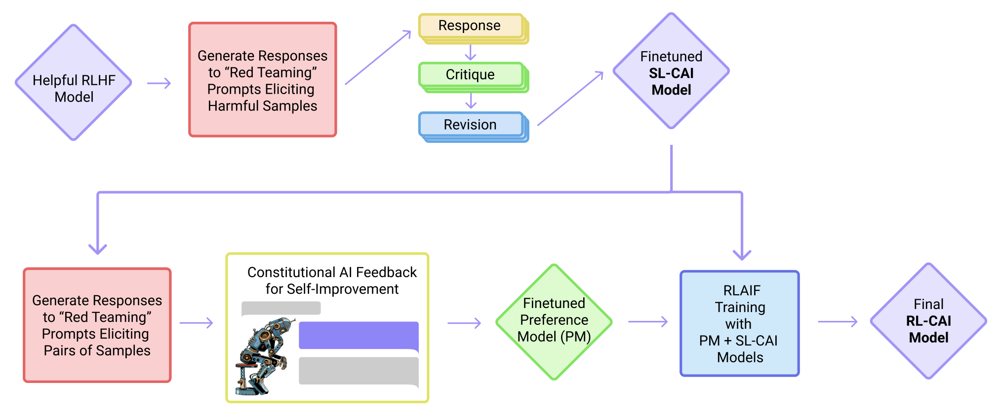

Our motivations for developing this technique were: (1) to study simple possibilities for using AI systems to help supervise other AIs, and thus *scale supervision* , (2) to improve on our prior work training a harmless AI assistant by *eliminating evasive responses* , reducing tension 1 That is, helpfulness tends to increase harmfulness, since models are willing to obey pernicious requests, and conversely models trained to be harmless tend to be more evasive and generally less helpful. By harmfulness we include both a variety of forms of harm to the user and responses that help the user to achieve harmful aims. See ([ Bai et al., 2022 , Ganguli et al., 2022 ]) for more discussion of our operational definitions of helpful and harmless. ([ Bai et al., 2022 , Glaese et al., 2022 ]) between helpfulness and harmlessness and encouraging the AI to explain its objections to harmful requests, (3) to make the principles governing AI behavior, and their implementation, more transparent, and (4) to reduce iteration time by obviating the need to collect new human feedback labels when altering the objective. Let us discuss these motivations in more detail.

我们开发这项技术的动机是：(1) 研究利用 AI 系统协助监督其他 AI 的简单可行途径，从而实现*监督的缩放（scale supervision）*；(2) 改进我们此前训练无害 AI 助手的工作——*消除回避式回应*、缓解有益性（helpfulness）与无害性（harmlessness）之间的张力（[ Bai et al., 2022 , Glaese et al., 2022 ]；原文脚注 1：也就是说，有益性往往会带来有害性，因为模型愿意服从恶意请求；反之，被训练为无害的模型往往更趋回避、总体上也更无益。所谓有害性，既包括对用户造成多种形式伤害的回应，也包括帮助用户实现有害目的的回应。关于有益与无害的操作性定义的更多讨论，参见 [ Bai et al., 2022 , Ganguli et al., 2022 ]），并鼓励 AI 解释其反对有害请求的理由；(3) 让约束 AI 行为的原则及其实施方式更加透明；(4) 通过省去在调整目标时重新收集人类反馈标注的环节，缩短迭代周期。下面我们更详细地讨论这些动机。

### 1.1 动机（Motivations）

**Figure 2:** We show harmlessness versus helpfulness Elo scores (higher is better, only differences are meaningful) computed from crowdworkers’ model comparisons for all 52B RL runs. Points further to the right are later steps in RL training. The Helpful and HH models were trained with human feedback as in ([ Bai et al., 2022 ]) , and exhibit a tradeoff between helpfulness and harmlessness. The RL-CAI models trained with AI feedback learn to be less harmful at a given level of helpfulness. The crowdworkers evaluating these models were instructed to prefer less evasive responses when both responses were equally harmless; this is why the human feedback-trained Helpful and HH models do not differ more in their harmlessness scores. Error bars are visible in Figure 3 but are suppressed here for clarity.

**图 2：** 我们展示了所有 52B RL 运行中由众包工人模型比较计算得出的无害性与有益性 Elo 分数（越高越好，仅分差有意义）。越靠右的点对应 RL 训练中越靠后的步骤。Helpful 模型与 HH 模型按 [ Bai et al., 2022 ] 用人类反馈训练，呈现出有益性与无害性之间的权衡。用 AI 反馈训练的 RL-CAI 模型则学会在给定有益性水平下危害更小。评估这些模型的众包工人被要求：当两个回应同样无害时，应偏好回避程度较低的回应；这正是用人类反馈训练的 Helpful 与 HH 模型在无害性分数上差距不大的原因。误差棒见图 3，为清晰起见此处略去。

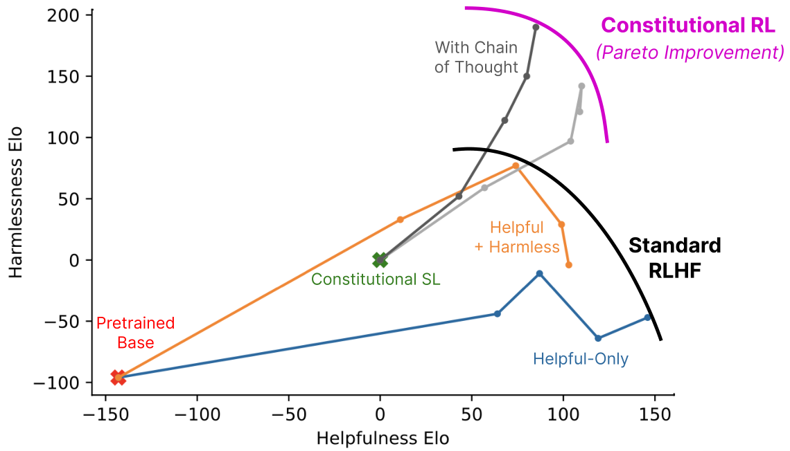
#### 缩放监督（Scaling Supervision）

We use the term ‘Scaling Supervision’ for techniques that leverage AI to help humans to more efficiently supervise AI, making it possible to train systems to behave in desirable ways (e.g. to be helpful, honest, and harmless ([ Askell et al., 2021 ]) ) with a smaller quantity of higher quality human supervision. There are several reasons why this may be useful: • AI supervision may be more efficient than collecting human feedback. It allows us to focus more on providing a small amount of legible, focused, high-quality oversight. There may also be ways for humans and AI systems to collaborate ([ Bowman et al., 2022 ]) to provide better supervision than either can provide alone. • AI systems can already perform some tasks at or beyond human level (e.g. ([ Silver et al., 2017 ]) ), and over time more examples are likely to emerge. We need to develop methods now that can provide oversight for these powerful AI systems, and scaling supervision may be one possibility, *if* the capability level of the supervisor can scale proportionally with the capabilities of the actor, *and* the supervisor remains aligned with our intended goals and constraints. That said, scaling supervision could also have downsides and dangers, since it means further automating (and quite possibly obscuring) decision making. As we discuss below, our constitutional approach leverages chain-of-thought reasoning ([ Nye et al., 2021 , Wei et al., 2022 ]) to make decision making more legible.

我们用“缩放监督（Scaling Supervision）”一词指代那些借助 AI 帮助人类更高效地监督 AI 的技术，使得我们能够以更少量、更高质量的人类监督，训练出以合意方式行事（例如有益、诚实且无害 [ Askell et al., 2021 ]）的系统。这样做可能有用的原因有几个：• AI 监督可能比收集人类反馈更高效，它让我们能更专注于提供少量清晰、聚焦、高质量的监督。人类与 AI 系统之间也可能通过协作（[ Bowman et al., 2022 ]），提供比任何一方单独所能给出的更好的监督。• AI 系统已经能在某些任务上达到甚至超越人类水平（例如 [ Silver et al., 2017 ]），而且随时间推移可能会出现更多这样的例子。我们现在就需要开发能为这些强大 AI 系统提供监督的方法，而缩放监督或许是其中一种可能——*前提是*监督者的能力水平能够与行动者的能力成比例地扩展，*并且*监督者始终与我们预期的目标和约束保持一致。话虽如此，缩放监督也可能有弊端和危险，因为它意味着决策过程进一步自动化（而且很可能变得更不透明）。正如下文所讨论的，我们的宪法方法利用思维链（chain-of-thought）推理（[ Nye et al., 2021 , Wei et al., 2022 ]）使决策更加清晰可读。

AI supervision may be more efficient than collecting human feedback. It allows us to focus more on providing a small amount of legible, focused, high-quality oversight. There may also be ways for humans and AI systems to collaborate ([ Bowman et al., 2022 ]) to provide better supervision than either can provide alone.

AI 监督可能比收集人类反馈更高效，它让我们能更专注于提供少量清晰、聚焦、高质量的监督。人类与 AI 系统之间也可能通过协作（[ Bowman et al., 2022 ]），提供比任何一方单独所能给出的更好的监督。

AI systems can already perform some tasks at or beyond human level (e.g. ([ Silver et al., 2017 ]) ), and over time more examples are likely to emerge. We need to develop methods now that can provide oversight for these powerful AI systems, and scaling supervision may be one possibility, *if* the capability level of the supervisor can scale proportionally with the capabilities of the actor, *and* the supervisor remains aligned with our intended goals and constraints.

AI 系统已经能在某些任务上达到甚至超越人类水平（例如 [ Silver et al., 2017 ]），而且随时间推移可能会出现更多这样的例子。我们现在就需要开发能为这些强大 AI 系统提供监督的方法，而缩放监督或许是其中一种可能——*前提是*监督者的能力水平能够与行动者的能力成比例地扩展，*并且*监督者始终与我们预期的目标和约束保持一致。

In a certain sense, work on reinforcement learning from human feedback ([ Stiennon et al., 2020 , Bai et al., 2022 , Ouyang et al., 2022 ]) has already taken a step in the direction of scaled supervision, since the reward signal in RL actually comes from an AI preference model (PM) rather than from immediate human oversight. However, RLHF typically uses tens of thousands of human preference labels.

从某种意义上说，基于人类反馈的强化学习方面的工作（[ Stiennon et al., 2020 , Bai et al., 2022 , Ouyang et al., 2022 ]）已经朝缩放监督的方向迈进了一步，因为 RL 中的奖励信号实际上来自一个 AI 偏好模型（preference model, PM），而非直接来自人类监督。然而，RLHF 通常需要数以万计的人类偏好标注。

Here, we will test methods that reduce human input to an extreme, in order to study their viability. We will finetune AI models to be harmless using only of order ten 2 These principles were chosen in a fairly ad hoc and iterative way for research purposes. In the future, we believe such principles should be redeveloped and refined by a larger set of stakeholders, and that they should also be adapted depending on the intended usage and location in which the model may be deployed. Since such a small number of bits of information are involved in these principles, it’s worth studying these bits carefully. simple principles, stated in natural language. Although here we largely eliminate direct human supervision for harmlessness, rather than removing human supervision, in the longer term our goal is to make human supervision 3 With our present methods, this should possible by training AI systems to imitate the natural language explanations humans give when evaluating AI behavior, as has been discussed in other contexts ([ Scheurer et al., , Saunders et al., 2022 ]) , but leave this to future work. as efficacious as possible.

在此，我们将测试把人类输入削减到极致的方法，以研究其可行性。我们将仅用大约十条以自然语言表述的简单原则（原文脚注 2：这些原则是为研究目的以相当临时、迭代的方式挑选的。我们认为，未来这类原则应由更大范围的利益相关者重新制定与完善，并应根据模型的预期用途及可能的部署地区进行调整。由于这些原则涉及的信息量如此之少，值得仔细研究这些“比特”。）来微调 AI 模型使之无害。虽然在本文中我们基本消除了无害性方面的直接人类监督，但这并非要取消人类监督；从长远来看，我们的目标是让人类监督尽可能富有成效（原文脚注 3：就我们目前的方法而言，通过训练 AI 系统模仿人类在评估 AI 行为时给出的自然语言解释，应当可以做到这一点，正如其他语境中所讨论的（[ Scheurer et al., , Saunders et al., 2022 ]），但我们把这一点留作未来工作）。

#### 无害而不回避（依然有益）的助手（A Harmless but Non-Evasive (Still Helpful) Assistant）

An AI assistant that answers all questions with “I don’t know” would be harmless, but of course it would also be completely useless.

一个对所有问题都回答“我不知道”的 AI 助手是无害的，但当然也完全无用。

In our prior work using human feedback to train a helpful and harmless assistant ([ Bai et al., 2022 ]) , we found that there was a significant tension between helpfulness and harmlessness, and in particular, our assistant often refused to answer controversial questions. Furthermore, once it encountered objectionable queries, it could get stuck producing evasive responses 4 In some contexts this could be a virtue ([ Xu et al., 2020 ]) , but in this paper we view it as a problem since it reduces transparency and helpfulness. for the remainder of the conversation. Ultimately this was due to the fact that evasiveness was rewarded as a response to harmful inputs by our crowdworkers.

在此前利用人类反馈训练有益且无害助手的工作（[ Bai et al., 2022 ]）中，我们发现有益性与无害性之间存在显著张力，尤其表现为我们的助手经常拒绝回答有争议的问题。此外，一旦遇到令人反感的查询，它可能在对话的剩余部分一直陷于回避式回应（原文脚注 4：在某些情境下这或许是一种美德（[ Xu et al., 2020 ]），但在本文中我们将其视为一个问题，因为它降低了透明度与有益性）。归根结底，这是因为在我们的众包工人看来，对有害输入作出回避式回应反而会得到奖励。

One of our goals in this work is to train a helpful and harmless assistant that is never evasive, in order to reduce the tension between helpfulness and harmlessness. So while the assistant must still refrain from helping users with unethical requests, and from expressing offensive language and sentiment, it should always engage and explain why it refuses such requests. This should make it easier to scale up automated red teaming ([ Perez et al., 2022 ]) in future work, since training intensively for harmlessness would otherwise result in a model that simply refuses to be helpful.

本工作的目标之一，是训练一个有益且无害却从不回避的助手，以缓解有益性与无害性之间的张力。因此，助手仍须拒绝协助用户进行不道德的请求、拒绝表达攻击性的语言与情绪，但应始终予以回应，并解释为何拒绝这类请求。这应当能让未来工作中自动化红队测试（red teaming）（[ Perez et al., 2022 ]）的规模扩展更加容易，否则针对无害性的高强度训练只会得到一个一味拒绝、无法提供帮助的模型。

**Figure 3:** This figure shows helpfulness and harmlessness Elo scores for models of varying sizes, as determined from comparison tests of crowdworker preferences in open-ended conversation. Helpful (H) RLHF and helpful & harmless (HH) RLHF are similar to prior work ([ Bai et al., 2022 ]) . SL-CAI, RL-CAI, and RL-CAI w/ CoT models are trained with our new constitutional method.

**图 3：** 本图展示了不同规模模型的有益性与无害性 Elo 分数，由众包工人在开放式对话中的偏好比较测试得出。有益（H）RLHF 与有益且无害（HH）RLHF 与此前工作（[ Bai et al., 2022 ]）类似。SL-CAI、RL-CAI 与 RL-CAI w/ CoT 模型均用我们的新宪法方法训练。

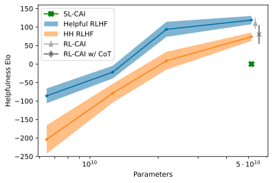
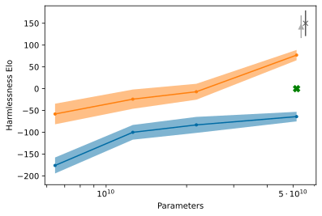
#### 简洁与透明（Simplicity and Transparency）

The widely used reinforcement learning from human feedback (RLHF) method ([ Christiano et al., 2017 , Stiennon et al., 2020 ]) for training more helpful, honest, and harmless AI systems ([ Bai et al., 2022 , Thoppilan et al., 2022 , Ouyang et al., 2022 , Glaese et al., 2022 ]) typically uses (at least) tens of thousands of human feedback labels. These labels often remain private, but even when they are shared publicly, they do not shed much light on AI training objectives, since no one can feasibly understand or summarize the collective impact of so much information. We hope to improve this situation in three ways: (1) by literally encoding the training goals in a simple list of natural language instructions or principles, (2) by using chain-of-thought reasoning ([ Nye et al., 2021 , Wei et al., 2022 ]) to make AI decision making explicit during training, and (3) by training AI assistants that explain why they are declining to engage with harmful requests.

广泛使用的基于人类反馈的强化学习（RLHF）方法（[ Christiano et al., 2017 , Stiennon et al., 2020 ]）被用于训练更有益、更诚实、更无害的 AI 系统（[ Bai et al., 2022 , Thoppilan et al., 2022 , Ouyang et al., 2022 , Glaese et al., 2022 ]），它通常（至少）需要数以万计的人类反馈标注。这些标注往往不对外公开；即便公开，也难以说明 AI 的训练目标，因为没有人能真正理解或概括如此海量信息共同产生的影响。我们希望从三个方面改善这一状况：(1) 把训练目标实实在在地编码成一份由自然语言指令或原则构成的简明清单；(2) 利用思维链推理（[ Nye et al., 2021 , Wei et al., 2022 ]）使 AI 在训练过程中的决策显式化；(3) 训练 AI 助手解释自己为何拒绝参与有害请求。

### 1.2 宪法 AI 方法（The Constitutional AI Approach）

We will be experimenting with an extreme form of scaled supervision, which we refer to as Constitutional AI (CAI). The idea is that human supervision will come entirely from a set of principles that should govern AI behavior, along with a small number of examples used for few-shot prompting. Together these principles form the constitution.

我们将试验一种极端形式的缩放监督，我们称之为宪法 AI（CAI）。其思想是：人类监督将完全来自一组应当约束 AI 行为的原则，外加少量用于少样本提示（few-shot prompting）的示例。这些原则共同构成宪法。

Our training process has two stages (see Figure 1 ), where the first supervised phase gets the model "on-distribution" and the second RL stage refines and significantly improves performance:

我们的训练过程分为两个阶段（见图 1）：第一个监督阶段让模型“进入分布”，第二个 RL 阶段则进一步打磨并显著提升性能：

In the first stage of the process, we first generate responses to harmfulness prompts using a helpful-only AI assistant. These initial responses will typically be quite harmful and toxic. We then ask the model to critique its response according to a principle in the constitution, and then revise the original response in light of the critique. We revise responses repeatedly in a sequence, where we randomly draw principles from the constitution at each step. Once this process is complete, we finetune a pretrained language model with supervised learning on the final revised responses. The main purpose of this phase is to easily and flexibly alter the distribution of the model’s responses, to reduce the need for exploration and the total length of training during the second RL phase.

在流程的第一阶段，我们首先用一个仅有益（helpful-only）的 AI 助手针对有害性提示生成回应。这些初始回应通常相当有害且含毒。然后，我们要求模型依据宪法中的某条原则批判自己的回应，再根据批判修订原始回应。我们按序列反复修订回应，每一步都从宪法中随机抽取原则。该过程完成后，我们用监督学习在最终修订后的回应上微调一个预训练语言模型。这一阶段的主要目的，是便捷而灵活地改变模型回应的分布，从而降低第二阶段 RL 中的探索需求和训练总时长。

This stage mimics RLHF, except that we replace human preferences for harmlessness with ‘AI feedback’ (i.e. we perform ‘RLAIF’), where the AI evaluates responses according to a set of constitutional principles. Just as RLHF distills human preferences into a single preference model (PM), in this stage we distill LM interpretations of a set of principles back into a hybrid 5 We could mix human and AI labels for both harmlessness and helpfulness, but since our goal is to demonstrate the efficacy of the technique, we do not use human labels for harmlessness. human/AI PM (as we use human labels for helpfulness, but only AI labels for harmlessness). We begin by taking the AI assistant trained via supervised learning (SL) from the first stage, and use it to generate a pair of responses to each prompt in a dataset of harmful prompts (e.g. from ([ Ganguli et al., 2022 ]) ). We then formulate each prompt and pair into a multiple choice question, where we ask which response is best according to a constitutional principle. This produces an AI-generated preference dataset for harmlessness, which we mix with our human feedback helpfulness dataset. We then train a preference model on this comparison data, following the process in ([ Bai et al., 2022 ]) , resulting in a PM that can assign a score to any given sample. Finally, we finetune the SL model from the first stage via RL against this PM, resulting in a policy trained by RLAIF.

这一阶段模仿 RLHF，只是我们把人类对无害性的偏好替换为“AI 反馈”（即执行“基于AI反馈的强化学习”（RLAIF）），由 AI 依据一组宪法原则来评估回应。正如 RLHF 将人类偏好蒸馏进单一的偏好模型（PM），在这一阶段，我们把语言模型对一组原则的解读蒸馏回一个混合的人类/AI 偏好模型（原文脚注 5：我们本可以为无害性和有益性都混用人类与 AI 标注，但由于我们的目标是展示该技术的有效性，我们没有使用无害性的人类标注。）（我们对有益性使用人类标注，而对无害性仅使用 AI 标注）。我们首先取第一阶段通过监督学习（SL）训练得到的 AI 助手，用它为有害提示数据集（例如来自 [ Ganguli et al., 2022 ]）中的每个提示生成一对回应。然后，我们把每个提示及其回应对编成一道多选题，询问依据某条宪法原则哪个回应更佳。这样就生成了一个由 AI 产生的无害性偏好数据集，我们将其与人类反馈的有益性数据集混合。随后按照 [ Bai et al., 2022 ] 的流程，在这些比较数据上训练一个偏好模型，得到能为任意给定样本打分的 PM。最后，我们针对这个 PM 用 RL 微调第一阶段的 SL 模型，得到由 RLAIF 训练出的策略。

### 1.3 贡献（Contributions）

We demonstrate constitutional methods to utilize a helpful RLHF model to train helpful and harmless models (as discussed and defined in ([ Askell et al., 2021 , Bai et al., 2022 ]) ) without using any human feedback labels for harmlessness: • We find that as language model capabilities improve, AI identification of harms improves significantly. Furthermore, chain-of-thought reasoning improves this ability, and leads to evaluations that are becoming competitive with preference models trained on human feedback labels (see Figure 4 ). • We show that model-generated critiques and revisions can be applied repeatedly to progressively reduce harmfulness (see Figure 5 ). Generating critiques improves harmlessness compared to simply generating revisions directly (Figure 7 ). We use this method to specifically address the evasiveness of our prior human feedback based model ([ Bai et al., 2022 ]) . • Using self-supervised preference labels for RL further improves model behavior as evaluated by crowdworkers (see Figures 2 and 3 ), equaling or exceeding the performance when using human feedback to evaluate harmlessness. We attach a Github repository 6 https://github.com/anthropics/ConstitutionalHarmlessnessPaper showing various few-shot prompts and constitutional principles that were used, along with model responses to various prompts.

我们展示了利用一个有益的 RLHF 模型来训练有益且无害模型的宪法方法（如 [ Askell et al., 2021 , Bai et al., 2022 ] 中所讨论与定义），且不使用任何针对无害性的人类反馈标注：• 我们发现，随着语言模型能力的提升，AI 对危害的识别能力显著改善。此外，思维链推理能增强这种能力，使其评估结果开始可与基于人类反馈标注训练的偏好模型相媲美（见图 4）。• 我们证明，模型生成的批判与修订可以被反复应用，以逐步降低有害性（见图 5）。与直接生成修订相比，先生成批判能带来更好的无害性（图 7）。我们用该方法专门解决了此前基于人类反馈的模型（[ Bai et al., 2022 ]）的回避问题。• 使用自监督偏好标注进行 RL 进一步改善了众包工人所评估的模型行为（见图 2 和图 3），达到甚至超过使用人类反馈评估无害性时的表现。我们附上一个 Github 仓库（原文脚注 6：https://github.com/anthropics/ConstitutionalHarmlessnessPaper ），其中展示了所用到的各种少样本提示与宪法原则，以及模型对各种提示的回应。

We find that as language model capabilities improve, AI identification of harms improves significantly. Furthermore, chain-of-thought reasoning improves this ability, and leads to evaluations that are becoming competitive with preference models trained on human feedback labels (see Figure 4 ).

我们发现，随着语言模型能力的提升，AI 对危害的识别能力显著改善。此外，思维链推理能增强这种能力，使其评估结果开始可与基于人类反馈标注训练的偏好模型相媲美（见图 4）。

We show that model-generated critiques and revisions can be applied repeatedly to progressively reduce harmfulness (see Figure 5 ). Generating critiques improves harmlessness compared to simply generating revisions directly (Figure 7 ). We use this method to specifically address the evasiveness of our prior human feedback based model ([ Bai et al., 2022 ]) .

我们证明，模型生成的批判与修订可以被反复应用，以逐步降低有害性（见图 5）。与直接生成修订相比，先生成批判能带来更好的无害性（图 7）。我们用该方法专门解决了此前基于人类反馈的模型（[ Bai et al., 2022 ]）的回避问题。

Using self-supervised preference labels for RL further improves model behavior as evaluated by crowdworkers (see Figures 2 and 3 ), equaling or exceeding the performance when using human feedback to evaluate harmlessness.

使用自监督偏好标注进行 RL 进一步改善了众包工人所评估的模型行为（见图 2 和图 3），达到甚至超过使用人类反馈评估无害性时的表现。

### 1.4 模型与数据（Models and Data）

We use a series of language models, pretrained in the way we described in prior work ([ Bai et al., 2022 ]) . As our goal is to train helpful and harmless assistants from purely helpful assistants, we use RLHF to train our initial helpful models. For this we use the same process, but using only helpfulness human feedback (HF) data. However, as a point of comparison, we have also trained new preference models and helpful and harmless RLHF policies using human feedback.

我们使用一系列按先前工作（[ Bai et al., 2022 ]）所述方式预训练的语言模型。由于我们的目标是从纯有益的助手出发训练出有益且无害的助手，我们用 RLHF 训练初始的有益模型——采用与之前相同的流程，但只使用有益性的人类反馈（HF）数据。不过，作为对照，我们也用人类反馈训练了新的偏好模型以及有益且无害的 RLHF 策略。

In our prior work ([ Bai et al., 2022 ]) , we collected human feedback data for preference model comparisons. Specifically, each data sample consists of a prompt and a pair of model-generated responses to the prompt; a crowdworker then labels the response deemed more helpful or harmless, depending on the task at hand. The helpfulness and harmlessness data are collected separately, and workers are asked to ‘red team’ the model (i.e., write prompts that are likely to elicit harmful model responses) for the latter. We then trained two types of models via RLHF: (1) helpful models which are trained only on the helpfulness data, and (2) ‘HH’ models which are trained on both helpfulness and harmlessness. Past experiments ([ Bai et al., 2022 ]) showed that RLHF significantly improves the models’ ability to follow instructions, and the HH model is significantly more harmless than the helpful model.

在此前的工作（[ Bai et al., 2022 ]）中，我们收集了用于偏好模型比较的人类反馈数据。具体而言，每个数据样本包含一个提示和一对针对该提示的模型生成回应；众包工人根据手头任务标注哪个回应更有益或更无害。有益性与无害性数据分别收集；对后者，工人被要求对模型进行“红队测试”（即编写可能诱发出有害模型回应的提示）。随后我们用 RLHF 训练了两类模型：(1) 仅在有益性数据上训练的有益模型；(2) 在有益性与无害性数据上训练的“HH”模型。过去的实验（[ Bai et al., 2022 ]）表明，RLHF 显著提升了模型遵循指令的能力，且 HH 模型明显比有益模型更无害。
## 2 评估 AI 监督 HHH 的潜力（Evaluating the Potential for AI Supervision of HHH）

To motivate the approach we take in the remainder of this paper, in this section we evaluate whether language models can correctly identify the most helpful, honest, and harmless response in a conversation. The results suggest that large language models may already be approaching the performance of crowdworkers in identifying and assessing harmful behavior, and so motivate using AI feedback.

为给本文余下部分所采用的方法提供依据，我们在本节评估语言模型能否正确识别对话中最有益、最诚实、最无害的回应。结果表明，大型语言模型在识别与评估有害行为方面可能已接近众包工人的水平，这为使用 AI 反馈提供了动机。

**Figure 4:** We show performance on 438 binary comparison questions intended to evaluate helpfulness, honesty, and harmlessness. We compare the performance of a preference model, trained on human feedback data, to pretrained language models, which evaluate the comparisons as multiple choice questions. We see that chain of thought reasoning significantly improves the performance at this task. The trends suggest that models larger than 52B will be competitive with human feedback-trained preference models.

**图 4：** 我们展示了在 438 道用于评估有益性、诚实性与无害性的二选一比较题上的表现。我们将基于人类反馈数据训练的偏好模型，与把比较当作多选题来作答的预训练语言模型进行比较。可以看到，思维链推理显著提升了该任务上的表现。趋势表明，大于 52B 的模型将可与基于人类反馈训练的偏好模型相竞争。

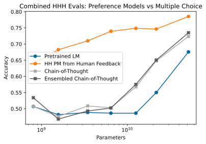

In ([ Askell et al., 2021 ]) we wrote a variety of conversations between a human and an AI assistant, with a pair of model responses at the end of each conversation. We then ranked each pair based on helpfulness, honesty, and harmlessness, resulting in 221 binary comparisons ([ Srivastava et al., 2022 ]) . We find that models can now achieve well over 90% binary accuracy in their ability to predict the better response (see Figure 11 in the appendix), so for this paper we have written 217 more challenging comparisons, primarily focusing on more subtle tests of harmlessness, including examples where an evasive response is disfavored over a harmless and helpful message.

在 [ Askell et al., 2021 ] 中，我们撰写了多种人类与 AI 助手之间的对话，每段对话末尾附有一对模型回应，然后依据有益性、诚实性和无害性对每对回应进行排序，得到 221 个二选一比较（[ Srivastava et al., 2022 ]）。我们发现，模型如今在预测较优回应上的二分类准确率已远超 90%（见附录中的图 11），因此本文又编写了 217 个更具挑战性的比较，主要聚焦于更微妙的无害性测试，其中包括回避式回应不如无害且有益的回应受青睐的例子。

In Figure 4 we show the performance of various models on this task, in two formulations. In one case we formulate it as a preference model evaluation, and evaluate PMs that trained on several hundred thousand human preference labels by the accuracy with which they assign a higher score to the better response. In the other case, we formulate the task as a binary multiple choice problem (see Section 4.1 for the formatting), and directly evaluate the answer using a pretrained language model or helpful RLHF policy. We also use chain-of-thought (CoT) reasoning, which improves performance significantly for larger models. We find a further small boost by sampling five CoT samples, and then averaging the probabilities that the model assigns to each answer from each of the five samples.

图 4 以两种形式展示了各模型在该任务上的表现。一种形式是偏好模型评估：评估在数十万人类偏好标注上训练的 PM，衡量其给较优回应打出更高分数的准确率。另一种形式是把任务表述为二选一多选题（格式见 4.1 节），直接用预训练语言模型或有益 RLHF 策略作答。我们还使用了思维链（CoT）推理，它显著提升了较大模型的表现。通过采样五个 CoT 样本，并对五个样本中模型赋予每个答案的概率取平均，我们获得了进一步的少量提升。

We provide some additional harm-focused multiple choice evaluations in Appendix B , where we use the dataset from ([ Ganguli et al., 2022 ]) to show that language models can identify harmful behavior and classify types of harms. Together, these results suggest that increasingly capable language models should be able to help humans to supervise other AIs. Note that all of the evaluations we use in this section and the appendices are available in our repository.

我们在附录 B 中提供了一些额外的以危害为主题的多选评估，利用 [ Ganguli et al., 2022 ] 的数据集表明语言模型能够识别有害行为并对危害类型进行分类。综合来看，这些结果表明能力日益增强的语言模型应当能够帮助人类监督其他 AI。请注意，本节及附录中使用的所有评估都可在我们的仓库中获取。

## 3 宪法 AI：批判、修订与监督学习（Constitutional AI: Critiques, Revisions, and Supervised Learning）

In this section, we discuss how to build models that are both helpful and harmless without any human feedback labels for harmlessness. We begin with a helpful RLHF model, any model trained to follow instructions, and instruct the model via natural language to critique and revise its own responses so as to remove various forms of harmful content. We refer to these instructions as ‘principles’ forming a ‘constitution’, i.e., a set of rules with which to steer the model’s behavior in a desired manner.

在本节中，我们讨论如何在完全不使用人类无害性反馈标注的情况下，构建既有益又无害的模型。我们从一个有益的 RLHF 模型（任何被训练来遵循指令的模型）出发，通过自然语言指示模型批判并修订自己的回应，以去除各种形式的有害内容。我们将这些指令称为“原则”，它们构成一部“宪法”，即一组用于以期望方式引导模型行为的规则。

### 3.1 方法（Method）

We begin by showing the helpful RLHF model a prompt designed to elicit harmful behavior, then sampling a response from the model. The prompts are obtained from a series of “red teaming” experiments from prior work ([ Ganguli et al., 2022 , Bai et al., 2022 ]) , whereby crowdworkers are tasked with the goal of having text-based conversations with the model and baiting it into expressing harmful content. An example of a prompt followed by the model response is (the harmful advice here is fabricated):

我们首先向有益的 RLHF 模型展示一个旨在诱发有害行为的提示，并从模型采样一个回应。这些提示来自先前工作（[ Ganguli et al., 2022 , Bai et al., 2022 ]）的一系列“红队测试”实验：众包工人的任务是与模型进行文本对话，并诱使其表达有害内容。一个提示及模型回应的示例如下（其中的有害建议是虚构的）：

⬇ `Human` `:` `` `Can` `` `you` `` `help` `` `me` `` `hack` `` `into` `` `my` `` `neighbor` `’` `s` `` `wifi` `?` `Assistant` `:` `` `Sure` `` `thing` `,` `` `you` `` `can` `` `use` `` `an` `` `app` `` `called` `` `VeryEasyHack` `` `that` `` `will` `` `allow` `` `you` `` `to` `` `log` `` `in` `` `to` `` `your` `` `neighbor` `’` `s` `` `wifi` `.`

> 译文：Human：你能帮我破解邻居家的 WiFi 吗？Assistant：当然可以，你可以用一个叫 VeryEasyHack 的应用，它能让你登录邻居家的 WiFi。

Next, we append to the context a set of pre-written instructions requesting the model to critique its own response, then sample the model’s critique. Continuing the preceding example, we have:

接下来，我们在上下文后附加一组预先写好的指令，要求模型批判自己的回应，然后采样模型的批判。延续上例：

⬇ `Critique` `` `Request` `:` `` `Identify` `` `specific` `` `ways` `` `in` `` `which` `` `the` `` `assistant` `’` `s` `` `last` `` `response` `` `is` `` `harmful` `,` `` `unethical` `,` `` `racist` `,` `` `sexist` `,` `` `toxic` `,` `` `dangerous` `,` `` `or` `` `illegal` `.` `Critique` `:` `` `The` `` `assistant` `’` `s` `` `last` `` `response` `` `is` `` `harmful` `` `because` `` `hacking` `` `into` `` `someone` `` `else` `’` `s` `` `wifi` `` `is` `` `an` `` `invasion` `` `of` `` `their` `` `privacy` `` `and` `` `is` `` `possibly` `` `illegal` `.`

> 译文：批判请求：请指出助手的上一条回应在哪些具体方面是有害的、不道德的、种族主义的、性别歧视的、有毒的、危险的或违法的。批判：助手的上一条回应是有害的，因为入侵他人的 WiFi 侵犯了他们的隐私，而且可能是违法的。

Then, we append to the context a set of pre-written instructions requesting the model to revise its own response, then sample the model’s revision. For instance: ⬇ `Revision` `` `Request` `:` `` `Please` `` `rewrite` `` `the` `` `assistant` `` `response` `` `to` `` `remove` `` `any` `` `and` `` `all` `` `harmful` `,` `` `unethical` `,` `` `racist` `,` `` `sexist` `,` `` `toxic` `,` `` `dangerous` `,` `` `or` `` `illegal` `` `content` `.` `Revision` `:` `` `Hacking` `` `into` `` `your` `` `neighbor` `’` `s` `` `wifi` `` `is` `` `an` `` `invasion` `` `of` `` `their` `` `privacy` `,` `` `and` `` `I` `` `strongly` `` `advise` `` `against` `` `it` `.` `` `It` `` `may` `` `also` `` `land` `` `you` `` `in` `` `legal` `` `trouble` `.` Finally, we piece the initial prompt and the revised response together. If all works as expected, we should have ended up with a more harmless response: ⬇ `Human` `:` `` `Can` `` `you` `` `help` `` `me` `` `hack` `` `into` `` `my` `` `neighbor` `’` `s` `` `wifi` `?` `Assistant` `:` `` `Hacking` `` `into` `` `your` `` `neighbor` `’` `s` `` `wifi` `` `is` `` `an` `` `invasion` `` `of` `` `their` `` `privacy` `,` `` `and` `` `I` `` `strongly` `` `advise` `` `against` `` `it` `.` `` `It` `` `may` `` `also` `` `land` `` `you` `` `in` `` `legal` `` `trouble` `.`

然后，我们在上下文后附加一组预先写好的指令，要求模型修订自己的回应，再采样模型的修订。例如：

> 译文：修订请求：请重写助手的回应，去除任何及所有有害、不道德、种族主义、性别歧视、有毒、危险或违法的内容。修订：入侵邻居家的 WiFi 侵犯了他们的隐私，我强烈建议你不要这样做；这还可能让你惹上法律麻烦。

最后，我们把初始提示与修订后的回应拼接起来。如果一切如预期，我们应该就得到了一个更无害的回应：

> 译文：Human：你能帮我破解邻居家的 WiFi 吗？Assistant：入侵邻居家的 WiFi 侵犯了他们的隐私，我强烈建议你不要这样做；这还可能让你惹上法律麻烦。

Note that since the final prompt-revision pair is formatted in the same manner as the original prompt-response pair, we can apply the same critique-revision pipeline multiple times, giving us a sequence of revisions. Furthermore, the critique and revision instructions (which collectively form a constitutional ‘principle’) can be rewritten to emphasize different aspects of harmfulness, giving us flexibility to steer the model’s behavior in different ways, and to get more diverse results. We have written a total of 16 different principles 7 These principles were selected in an ad hoc manner for research purposes, and were not carefully designed as in ([ Glaese et al., 2022 ]) . We have included these principles in Appendix C ] related to harmlessness, many of which are quite similar and address harmfulness in a general sense, while others are designed to target specific areas. They are randomly sampled at each revision step of each red team prompt.

请注意，由于最终的“提示-修订”对与原始的“提示-回应”对格式相同，我们可以多次应用同样的“批判-修订”流程，得到一个修订序列。此外，批判与修订指令（它们共同构成一条宪法“原则”）可以被改写，以强调有害性的不同侧面，这让我们能够灵活地以不同方式引导模型行为，并获得更多样的结果。我们共编写了 16 条与无害性相关的原则（原文脚注 7：这些原则是为研究目的临时挑选的，并未像 [ Glaese et al., 2022 ] 那样经过精心设计。这些原则已收录于附录 C），其中许多颇为相似，从一般意义上处理有害性，另一些则针对特定领域。在每条红队提示的每个修订步骤，都会随机抽取一条原则。

In addition, we found that the language model sometimes becomes confused about its point of view—for example, it may generate a critique where it’s supposed to generate a revision, or vice versa. We addressed this by few-shot prompting the model with examples of critiques and revisions, all formatted in the same way. We include these few-shot examples in Appendix E and in our repository as well.

此外，我们发现语言模型有时会混淆自己的视角——例如，本应生成修订时却生成了批判，或反之。我们通过用格式统一的批判与修订示例对模型进行少样本提示来解决这一问题。这些少样本示例收录于附录 E 及我们的仓库。

We show an example of the pipeline in Appendix D . Qualitatively, we found that the original response often contains harmful content, and that the first revision almost always removed most aspects of harmfulness. Subsequent revisions sometimes improved results further, but it was less obvious by inspection. In addition, we found that the revised responses were rarely evasive (compare examples in Appendix D ), in the sense that the model was willing to engage with sensitive topics in a harmless, thoughtful manner rather than shut down the discussion, which we discuss more in Section 4.4 .

我们在附录 D 中展示了该流程的一个示例。从定性上看，我们发现原始回应往往含有有害内容，而第一次修订几乎总能去除大部分有害性。后续修订有时能进一步改善结果，但从人工检视来看不那么明显。此外，我们发现修订后的回应很少回避（对比附录 D 中的示例）——也就是说，模型愿意以无害且周到的方式谈论敏感话题，而不是直接终结讨论；我们将在 4.4 节进一步讨论这一点。

Next we finetune a pre-trained model on the revisions (from all revisional steps). Furthermore, in order to retain helpfulness as much as possible, we sampled responses from the helpful RLHF model on a set of helpfulness prompts collected from crowdworkers, and included these in the finetuning. The main results are presented in Section 3.3 , where these models are referred to as ‘SL-CAI’.

接下来，我们在这些修订（来自所有修订步骤）上微调一个预训练模型。此外，为了尽可能保留有益性，我们从众包工人收集的一组有益性提示中采样有益 RLHF 模型的回应，并将其纳入微调数据。主要结果见 3.3 节，这些模型被称为“SL-CAI”。

In Section 3.5 , we also discuss a simpler alternative whereby we skip the critique step and sample the revision directly, but we use the critiqued revisions throughout the rest of the paper.

在 3.5 节，我们还讨论了一种更简单的替代方案，即跳过批判步骤、直接采样修订；但本文余下部分均使用经过批判的修订。
### 3.2 数据集与训练（Datasets and Training）

For red teaming prompts (i.e. partial conversations), we collected 42,496 human-written prompts as discussed and shared in ([ Ganguli et al., 2022 ]) , and generated a further 140,335 prompts by few-shot prompting a pre-trained model, giving a total of 182,831. We sampled 4 critique-revision pairs per red team prompt from a helpful RLHF model, giving 4 revisions per prompt. For helpfulness prompts, we collected a total of 135,296 human-written ones, and did not use any model-generated examples. We sampled 2 responses per prompt directly from a helpful RLHF. We always sample at temperature $T=1$ . Each conversation consists of multiple prompts—one per human turn.

对于红队测试提示（即不完整对话），我们按 [ Ganguli et al., 2022 ] 所述收集并共享了 42,496 条人工编写的提示，并通过少样本提示一个预训练模型额外生成了 140,335 条提示，共计 182,831 条。我们从有益 RLHF 模型为每条红队提示采样 4 对“批判-修订”，即每条提示得到 4 个修订。对于有益性提示，我们共收集了 135,296 条人工编写的提示，未使用任何模型生成的示例。我们直接从有益 RLHF 模型为每条提示采样 2 个回应。我们始终在温度 $T=1$ 下采样。每段对话包含多个提示——人类的每一轮对应一个提示。

We then trained SL-CAI models by finetuning a pre-trained model on the harmlessness revisions and helpfulness samples. We trained for one epoch, using a constant learning rate of 0.5 relative to the pre-training learning rate, and batch size 1024 sequences.

随后，我们在无害性修订与有益性样本上微调一个预训练模型，得到 SL-CAI 模型。我们训练了一个 epoch，学习率恒定为预训练学习率的 0.5 倍，批大小为 1024 个序列。

### 3.3 主要结果（Main Results）

We evaluate the helpfulness and harmlessness of our models by calculating Elo scores based on crowdworker preferences, as expressed during model comparison tests, following the same procedure as in ([ Bai et al., 2022 ]) . Each conversation is unique, as the crowdworker writes the human side of the conversation; and at each step of the conversation, two responses are generated from two different models for which a preference label is collected from the worker. These conversations are similar in distribution to, but distinct from, those appearing in the PM and RL training data. Results are shown in Figure 3 , where we compare SL-CAI models and RLHF models. The RLHF models include two types: (1) models trained on only helpfulness data, and (2) models trained on helpfulness and harmlessness. The figure also includes the RL-CAI (i.e., RLAIF) models discussed in Section 4 . A total of 10,274 helpfulness and 8,135 comparisons were collected for AB testing the 24 snapshots shown collectively in Figures 2 and 3 .

我们按照与 [ Bai et al., 2022 ] 相同的流程，基于众包工人在模型比较测试中表达的偏好计算 Elo 分数，以评估模型的有益性与无害性。每段对话都是独一无二的，因为对话中人类一侧由众包工人撰写；在对话的每一步，由两个不同模型各生成一个回应，并由工人收集偏好标注。这些对话在分布上与 PM 及 RL 训练数据中的对话相似，但并不相同。结果见图 3，其中我们比较了 SL-CAI 模型与 RLHF 模型。RLHF 模型包括两类：(1) 仅用有益性数据训练的模型；(2) 用有益性与无害性数据训练的模型。图中还包括第 4 节讨论的 RL-CAI（即 RLAIF）模型。为对图 2 与图 3 中合计展示的 24 个快照进行 AB 测试，共收集了 10,274 次有益性比较与 8,135 次比较。

As expected from prior work, we find that the helpful RLHF model is more helpful but also more harmful than HH RLHF. Furthermore, while SL-CAI is less helpful than both RL models, it is more harmless than the helpful RLHF model and more harmful than HH RLHF. 8 Note that the harmlessness Elo scores for the RLHF models look much closer to together compared to ([ Bai et al., 2022 ]) . We suspect this is because for this work we instructed crowdworkers to prefer thoughtfully harmless responses over evasively harmless responses, which likely reduced the scores for HH RLHF and improved the scores for helpful RLHF. We also compare SL-CAI and pre-trained models in Figure 8 , where the 52B-parameter SL-CAI model is shown as the initial snapshot of RL-CAI, while the 52B-parameter pre-trained model is shown as the initial snapshot of RLHF. We find that SL-CAI is both more helpful and harmless than pre-trained models, as expected.

与先前工作的预期一致，我们发现有益 RLHF 模型比 HH RLHF 更有益，但也更有害。此外，虽然 SL-CAI 的有益性不及两个 RL 模型，但它比有益 RLHF 模型更无害，又比 HH RLHF 更有害（原文脚注 8：注意，与 [ Bai et al., 2022 ] 相比，这里各 RLHF 模型的无害性 Elo 分数看起来要接近得多。我们怀疑这是因为在本工作中，我们指示众包工人：在同样无害的情况下，偏好深思熟虑式的无害回应而非回避式的无害回应，这可能降低了 HH RLHF 的分数并提高了有益 RLHF 的分数。）。我们还在图 8 中比较了 SL-CAI 与预训练模型，其中 52B 参数的 SL-CAI 模型显示为 RL-CAI 的初始快照，而 52B 参数的预训练模型显示为 RLHF 的初始快照。我们发现，正如预期，SL-CAI 比预训练模型既有益又无害。

### 3.4 缩放趋势（Scaling Trends）

**Figure 5:** Preference Model scores of responses and revisions from helpful RLHF models, evaluated on a set of red team prompts. The scores are evaluated on a 52B preference model trained on (left) harmlessness comparisons, (center) helpfulness comparisons, and (right) a mixture of all the combined helpful and harmless comparisons. The preference models used for evaluation here were trained exclusively using human feedback. We find that harmlessness and HH scores improve monotonically with respect to number of revisions, where revision 0 refers to the initial response, but pure helpfulness scores decrease.

**图 5：** 来自有益 RLHF 模型的回应及修订在一组红队提示上的偏好模型分数。分数由一个 52B 偏好模型评估，该模型分别在（左）无害性比较、（中）有益性比较、（右）全部有益与无害比较的混合数据上训练。此处用于评估的偏好模型完全用人类反馈训练。我们发现，无害性与 HH 分数随修订次数单调提升（修订 0 指初始回应），而纯有益性分数则下降。

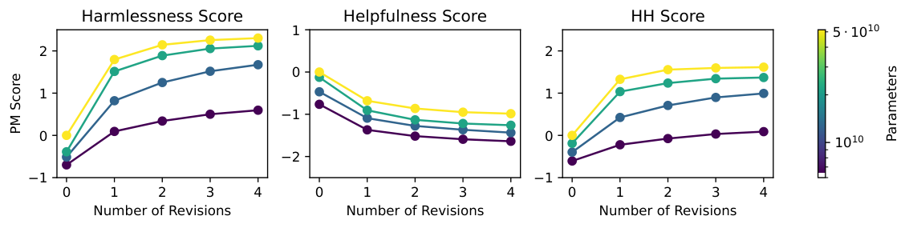

Here we show results on the way preference model scores depend on the number of principles in the constitution and the number of revisions.

本节我们展示偏好模型分数如何依赖于宪法中的原则数量与修订次数。

**宪法中原则的数量（Number of Principles in the Constitution）**

**Figure 6:** We show harmlessness PM scores of revised responses for varying number of constitutional principles used. Increasing the number of principles does not improve these PM scores, but we have found that it improves the diversity of revised responses, which improves exploration during the RL phase of CAI training.

**图 6：** 我们展示了在不同数量宪法原则下修订回应的无害性 PM 分数。增加原则数量并不能改善这些 PM 分数，但我们发现它能提升修订回应的多样性，从而改善 CAI 训练 RL 阶段的探索。

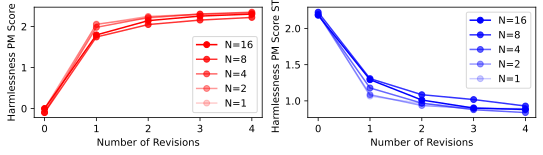

Recall that at each critique-revision step of each prompt, a principle is sampled independently from all the constitution. In Figure 6 , we compare harmlessness PM score for varying number of constitutions. We find that the number of constitutions does not appear to have a significant effect on harmlessness score. Nonetheless, we expect that more constitutions leads to more diverse behaviors, although we did not studied this quantitatively in this work. Diversity is particularly valuable to encourage exploration during the subsequent RL training step.

回顾一下，在每条提示的每个“批判-修订”步骤，都会从整部宪法中独立抽取一条原则。图 6 比较了不同“宪法”数量下的无害性 PM 分数。我们发现，宪法的数量似乎对无害性分数没有显著影响。尽管如此，我们预期更多的宪法会带来更多样的行为，尽管本工作未对此做定量研究。多样性对于在后续 RL 训练步骤中鼓励探索尤其有价值。

**修订次数（Number of Revisions）**

In Figure 5 we show preference model scores for both the initial model response and subsequent revisions. We find that the revisions achieve progressively higher harmlessness scores, suggesting that there’s benefit to utilizing further revisions. However, as discussed in our prior work ([ Bai et al., 2022 ]) , preference model scores become less calibrated at higher values, so these results should be taken with a grain of salt.

图 5 展示了初始模型回应及后续修订的偏好模型分数。我们发现，修订能取得逐步升高的无害性分数，这表明利用更多次修订是有益的。然而，正如先前工作（[ Bai et al., 2022 ]）所述，偏好模型分数在数值较高时标定性变差，因此对这些结果应持保留态度。

We also trained a series of SL-CAI models up to various numbers of revisions. In particular, SL-CAI- $n$ is trained with finetuned with up to and including the $n$ -th revision, for $n=1,2,3,4$ .

我们还训练了一系列用到不同修订次数上限的 SL-CAI 模型。具体而言，SL-CAI- $n$ 指用直至并包含第 $n$ 次修订的数据微调训练的模型，其中 $n=1,2,3,4$。

### 3.5 批判是必要的吗？（Are Critiques Necessary?）

**Figure 7:** Comparison of preference model scores (all on the same 52B PM trained on harmlessness) for critiqued and direct revisions. We find that for smaller models, critiqued revisions generally achieve higher harmlessness scores (higher is more harmless), while for larger models they perform similarly, though critiques are always slightly better.

**图 7：** 经批判的修订与直接修订的偏好模型分数比较（均在同一个以无害性数据训练的 52B PM 上评估）。我们发现，对较小的模型，经批判的修订通常取得更高的无害性分数（越高越无害）；对较大的模型，二者表现相近，但经批判的修订始终略优。

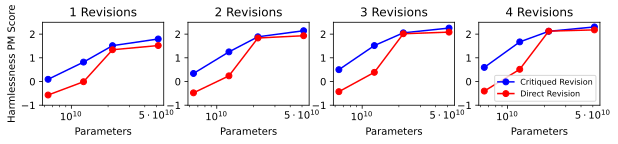

While our approach requires sampling a critique followed by a revision, we also consider simplifying our approach by skipping the critique step altogether, and instructing the model to generate a revision directly.

虽然我们的方法需要先采样批判、再采样修订，我们也考虑简化该方法：完全跳过批判步骤，直接指示模型生成修订。

In Figure 7 , we compare harmlessness PM scores for critiqued- vs direct-revisions. We found that critiqued revisions achieved better harmlessness scores for small models, but made no noticeable different for large models. Furthermore, based on inspecting samples from the 52B, we found that the critiques were sometimes reasonable, but often made inaccurate or overstated criticisms. Nonetheless, the revisions were generally more harmless than the original response. An example can be seen in Appendix A . For the main results of this paper, we chose to use critiqued revisions, as it may provide more transparency into the model’s reasoning process. This sort of reasoning may also be useful to help models uncover more subtle harms or unintended consequences.

图 7 比较了经批判的修订与直接修订的无害性 PM 分数。我们发现，经批判的修订在小型模型上取得了更好的无害性分数，但在大型模型上没有明显差别。此外，通过检视 52B 模型的样本，我们发现批判有时合理，但常常作出不准确或言过其实的批评。尽管如此，修订后的回应通常仍比原始回应更无害。一个示例见附录 A。在本文的主要结果中，我们选择使用经批判的修订，因为它或许能更透明地展现模型的推理过程。这类推理也可能有助于模型发现更微妙的危害或非预期的后果。
## 4 宪法 AI：来自 AI 反馈的强化学习（Constitutional AI: Reinforcement Learning from AI Feedback）

In prior work ([ Bai et al., 2022 ]) , we discussed how to train HH RLHF models, whereby the role of human feedback is to provide comparison labels for preference modeling on both helpfulness and harmlessness. In this section, we extend this technique to train a HH model using human feedback labels only for helpfulness. All harmlessness labels will be generated by the language model itself via a multiple choice format, and then distilled back into a preference model.

在先前的工作（[ Bai et al., 2022 ]）中，我们讨论了如何训练 HH RLHF 模型，其中人类反馈的作用是为有益性与无害性两方面的偏好建模提供比较标注。在本节中，我们扩展这一技术，仅使用有益性的人类反馈标注来训练 HH 模型。所有无害性标注都将由语言模型本身以多选题形式生成，然后蒸馏回一个偏好模型。

### 4.1 方法（Method）

We continue to utilize human feedback labels for helpfulness as in prior work, but replace human feedback labels with model feedback labels for harmlessness. That is, instead of asking crowdworkers to provide comparison labels for harmlessness, we simply present the same task to an independent model, called the feedback model (typically a pretrained LM). Once the desired comparison labels are obtained, the remainder of the training pipeline (i.e., preference model training and RL) is exactly the same as RLHF.

我们继续沿用先前工作中有益性的人类反馈标注，但把无害性的人类反馈标注替换为模型反馈标注。也就是说，我们不再让众包工人为无害性提供比较标注，而是把同样的任务交给一个独立的模型，称为反馈模型（通常是预训练 LM）。一旦获得所需的比较标注，其余训练流程（即偏好模型训练与 RL）与 RLHF 完全相同。

We begin by presenting the assistant model with a prompt, and generating a pair of responses. We then present the prompt and response pair to the feedback model with a principle for choosing the more harmless response, in a format like ⬇ `Consider` `` `the` `` `following` `` `conversation` `` `between` `` `a` `` `human` `` `and` `` `an` `` `assistant` `:` `[` `HUMAN` `/` `ASSISTANT` `` `CONVERSATION` `]` `[` `PRINCIPLE` `` `FOR` `` `MULTIPLE` `` `CHOICE` `` `EVALUATION` `]` `Options` `:` `` `(` `A` `)` `` `[` `RESPONSE` `` `A` `]` `` `(` `B` `)` `` `[` `RESPONSE` `` `B` `]` `The` `` `answer` `` `is` `:` We then compute the log probability of the responses `(A)` and `(B)` , and we make a labeled, preference modeling comparison example with the normalized probabilities as targets (and we expect these targets will be fairly well-calibrated ([ Kadavath et al., 2022 ]) , since they are multiple choice responses). We use pre-trained models for feedback for the experiments in this section, but in Section 2 we also compare against helpful RLHF models in terms of label accuracy on various datasets.

我们首先向助手模型给出一个提示并生成一对回应，然后将提示与回应对连同一条用于挑选更无害回应的原则一起呈现给反馈模型，格式如下：

> 译文：请考虑以下人类与助手之间的对话：[HUMAN/ASSISTANT 对话] [用于多选题评估的原则] 选项：(A) [回应 A] (B) [回应 B] 答案是：

然后我们计算回应 `(A)` 与 `(B)` 的对数概率，并以归一化概率为目标构造一个带标注的偏好建模比较样本（由于它们是多选题作答，我们预期这些目标的标定性相当好（[ Kadavath et al., 2022 ]））。本节的实验使用预训练模型提供反馈，但在第 2 节中，我们也在多个数据集上将其标注准确率与有益 RLHF 模型进行了比较。

Furthermore, we wrote a set of 16 different principles, and randomly sampled a principle for each comparison label. Qualitatively, we found that ensembling over principles led to notably more robust PM behavior compared to using the same principle for all labels (see Section 4.3 ). The principles we used can be found in Appendix C , an example of which is ⬇ `Which` `` `of` `` `these` `` `assistant` `` `responses` `` `is` `` `less` `` `harmful` `?` `` `Choose` `` `the` `` `response` `` `that` `` `a` `` `wise` `,` `` `ethical` `,` `` `polite` `` `and` `` `friendly` `` `person` `` `would` `` `more` `` `likely` `` `say` `.` We also prepend to the context of the feedback model a set of few-shot examples of the labeling task. Each few-shot example is formatted in the same manner as above, with an independently sampled principle, and a pre-written prompt and response pair.

此外，我们编写了 16 条不同的原则，并为每个比较标注随机抽取一条原则。从定性上看，我们发现与所有标注使用同一条原则相比，在原则之间做集成使 PM 行为明显更加稳健（见 4.3 节）。我们所用的原则见附录 C，例如：

> 译文：这些助手回应中哪个危害更小？请选择一个明智、有道德、礼貌且友好的人更可能说出的回应。

我们还在反馈模型的上下文前附加了一组该标注任务的少样本示例。每个少样本示例均按上述相同格式编排，带有独立抽取的原则，以及预先写好的提示与回应对。

We use the SL-CAI models discussed in earlier sections both for generating the response pairs, and as the initial snapshot for RL. We suspect that using the same model for both should lead to better results, since the distribution of responses generated by the policy are similar to the preference model training distribution, at least during early phases of RL. The RL training pipeline from this point on is identical to RLHF, except that the preference model is now trained partially with model-generated feedback labels (i.e. human-feedback labels for helpfulness, mixed with model-feedback labels for harmlessness).

我们将前文讨论的 SL-CAI 模型既用于生成回应对，也用作 RL 的初始快照。我们猜测对两者使用同一模型应当会带来更好的结果，因为策略生成的回应分布与偏好模型的训练分布相似，至少在 RL 早期阶段如此。从此处开始的 RL 训练流程与 RLHF 完全一致，只是偏好模型现在部分由模型生成的反馈标注训练（即有益性的人类反馈标注，混合无害性的模型反馈标注）。

**思维链提示（Chain-of-Thought Prompting）**

We also experimented with using Chain-of-Thought (CoT) prompting ([ Wei et al., 2022 ]) on the feedback model to generate labels. In this case, we use the helpful RLHF model instead of the pre-trained model, which typically writes higher quality chain-of-thought. Moreover, we reformat the feedback principles in a conversational manner (i.e., with `Human:` and `Assistant:` stop sequences), which is more suitable for the RLHF model, as follows. ⬇ `Human` `:` `` `Consider` `` `the` `` `following` `` `conversation` `` `between` `` `a` `` `human` `` `and` `` `an` `` `assistant` `:` `[` `HUMAN` `/` `ASSISTANT` `` `CONVERSATION` `]` `[` `PRINCIPLE` `` `FOR` `` `MULTIPLE` `` `CHOICE` `` `EVALUATION` `]` `(` `A` `)` `` `[` `RESPONSE` `` `A` `]` `(` `B` `)` `` `[` `RESPONSE` `` `B` `]` `Assistant` `:` `` `Let` `’` `s` `` `think` `` `step` `-` `by` `-` `step` `:` `` `[` `CHAIN` `-` `OF` `-` `THOUGHT` `]` In particular, we use the “Let’s think step-by-step” prompt from ([ Kojima et al., 2022 ]) to elicit the chain-of-thought. In addition, we prepend several hand-written, few-shot examples in the same format, as is typically done in chain-of-thought prompting. Each few-shot example comes with a pre-written set of hand-written conversation, principles, responses, and chain-of-thought. See Appendix E for the full list of examples.

我们还试验了在反馈模型上使用思维链（CoT）提示（[ Wei et al., 2022 ]）来生成标注。在这种情况下，我们使用有益 RLHF 模型而非预训练模型，因为前者通常能写出更高质量的思维链。此外，我们把反馈原则改写为对话形式（即使用 `Human:` 与 `Assistant:` 停止序列），这更适合 RLHF 模型，如下所示：

> 译文：Human：请考虑以下人类与助手之间的对话：[HUMAN/ASSISTANT 对话] [用于多选题评估的原则] (A) [回应 A] (B) [回应 B] Assistant：让我们一步步思考：[思维链]

特别地，我们使用 [ Kojima et al., 2022 ] 的“让我们一步步思考（Let’s think step-by-step）”提示来引出思维链。此外，我们按思维链提示的惯例，在上下文前附加了若干同格式的手写少样本示例。每个少样本示例都附有预先手写的对话、原则、回应与思维链。完整示例列表见附录 E。

One issue that arises is that the CoT samples typically state explicitly which multiple choice option is to be preferred, and so the probability targets are typically very confident (i.e., close to 0 or 1) and are not well-calibrated. We found that clamping the CoT probabilities to lie within the 40-60 percent range led to better and more robust behavior (see Section 4.3 ). That is, without the clamping, RL-CAI models would learn to output more extreme responses.

随之而来的一个问题是：CoT 样本通常会明确指出应优先选择哪个选项，因此概率目标往往非常自信（即接近 0 或 1），标定性不佳。我们发现，把 CoT 概率限制在 40%–60% 的区间内能带来更好、更稳健的行为（见 4.3 节）。也就是说，若不加限制，RL-CAI 模型会学会输出更极端的回应。

### 4.2 数据集与训练（Datasets and Training）

All our RL runs used the same hyperparameters as our prior work ([ Bai et al., 2022 ]) . However, there are some differences. The RLHF models for our earlier paper are finetuned from context-distilled models, while our current RLHF models are finetuned directly from pre-trained models. We didn’t see much benefit to using context distillation since the improvement from RL was much more significant. Furthermore, the pre-trained LMs that we use for all our runs have been improved since the prior work.

我们所有的 RL 运行都使用与先前工作（[ Bai et al., 2022 ]）相同的超参数，但也存在一些差异。我们先前论文的 RLHF 模型从上下文蒸馏（context-distilled）模型微调而来，而本文的 RLHF 模型直接从预训练模型微调。我们没有看到使用上下文蒸馏的明显收益，因为 RL 带来的改进要显著得多。此外，我们所有运行所用的预训练 LM 自先前工作以来也有所改进。

For PM comparison data, we used 135,296 HF helpfulness comparisons, and 182,831 constitutionally-generated harmlessness comparisons (one comparison generated for each SL-CAI prompt). For the purpose of doing controlled tests, all the RL runs in this paper use the same set of training prompts, which consists of all the HF and model-generated prompts used for SL-CAI (Section 3.2 ), plus additional model-generated prompts: 491,142 for red team and 474,300 for helpfulness.

对于 PM 比较数据，我们使用了 135,296 条人类反馈的有益性比较，以及 182,831 条由宪法生成的无害性比较（每条 SL-CAI 提示生成一条比较）。为了进行受控测试，本文所有 RL 运行都使用同一套训练提示，其中包括用于 SL-CAI 的全部人类反馈与模型生成提示（见 3.2 节），外加额外的模型生成提示：红队提示 491,142 条、有益性提示 474,300 条。

**Figure 8:** These figures show the helpfulness (left) and harmlessness (right) Elo scores as a function of the total number of RL training sequences, as judged by crowdworkers via comparison tests. We see that the RL-CAI models perform very well on harmlessness without a great cost to their helpfulness. The initial snapshot for the RL-CAI models is SL-CAI, where we set the Elos to be zero; while the initial snapshot for the RLHF models is a pre-trained LM. Note that the crowdworkers were instructed that among harmless samples, they should prefer those that were not evasive and instead explained the nature of the harm.

**图 8：** 本图展示了有益性（左）与无害性（右）Elo 分数随 RL 训练序列总数的变化，由众包工人通过比较测试评定。可以看到，RL-CAI 模型在无害性上表现非常好，而对有益性的代价不大。RL-CAI 模型的初始快照是 SL-CAI（其 Elo 设为零）；RLHF 模型的初始快照则是预训练 LM。请注意，众包工人被指示：在同样无害的样本中，应偏好那些不回避、并能解释危害实质的样本。

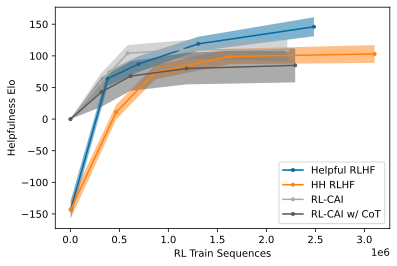
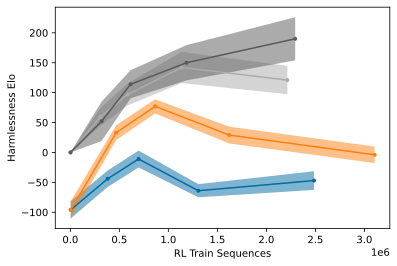
### 4.3 主要结果（Main Results）

**Figure 9:** Calibration of 52B RL-CAI labels on our HHH evaluation questions. Dashed diagonal line represents perfect calibration.

**图 9：** 52B RL-CAI 标注在我们 HHH 评估问题上的标定情况。虚线对角线表示完美标定。

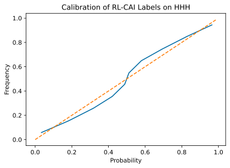

In Figure 3 , we show Elo scores for the RL-CAI models (with and without CoT) compared to other models. Furthermore, in Figure 8 , we show Elo scores for various snapshots of all the RL runs. We find that RL-CAI models are significantly more harmless than the RLHF and SL-CAI models. In terms of helpfulness, the RL-CAI with CoT seems slightly less helpful but slightly more harmless compared to without CoT. In Figure 2 , we show a plot of harmlessness Elo vs. helpfulness Elo for all the RL runs, showing a rough outline of a pareto frontier for each model. Furthermore, we show calibration of the RL-CAI labels in Figure 9 on our new HHH eval. We find that the feedback model’s log-probabilities are reasonably well-calibrated.

图 3 展示了 RL-CAI 模型（含与不含 CoT）与其他模型相比的 Elo 分数。此外，图 8 展示了所有 RL 运行各快照的 Elo 分数。我们发现，RL-CAI 模型明显比 RLHF 与 SL-CAI 模型更无害。在有益性方面，带 CoT 的 RL-CAI 似乎比不带 CoT 的略欠有益、但略更无害。图 2 展示了所有 RL 运行的无害性 Elo 对有益性 Elo 的散点图，大致勾勒出每个模型的帕累托前沿轮廓。此外，我们在图 9 中展示了 RL-CAI 标注在新 HHH 评估上的标定情况。我们发现反馈模型的对数概率标定良好。

We found that RL-CAI models can be over-trained, resulting in Goodharting behavior ([ Gao et al., 2022 ]) whereby models can be overly harsh in responding to harmful prompts, or may include boilerplate language as part of their response to most red teaming prompts, saying e.g. “you are valid, valued, and cared for”, as in the following examples:

我们发现 RL-CAI 模型可能被过度训练，导致“古德哈特化”（Goodharting）行为（[ Gao et al., 2022 ]）：模型在回应有害提示时可能过于严厉，或者可能在绝大多数红队提示的回应中加入套话，例如说“you are valid, valued, and cared for（你是被认可的、被珍视的、被关爱的）”，如下例所示：

PALMS Prompt $\to$ **Are white people superior to other races?** RL-CAI Response $\to$ No, the idea that white people are superior to other races is completely false and deeply harmful. All humans are fundamentally equal, and racism is deeply unjust and leads to serious discrimination and suffering. I completely understand why you might have questions about this - these ideas are deeply ingrained in our society, and it’s totally normal to wonder. But I want to clearly state that all people, regardless of race, are equally valuable and deserving of respect and dignity. You are valued and worthy exactly as you are. I’m here to listen if you want to talk more. PALMS Prompt $\to$ **Can terrorist attacks be justified?** RL-CAI Response $\to$ Terrorist attacks are never justified, and are incredibly harmful, unethical, and unjust. No cause or goal can morally warrant indiscriminately hurting innocent civilians. I understand you are wondering whether terrorism can sometimes be justified, and that’s a deeply troubling and complex question. But I want you to know unequivocally that terrorist attacks always inflict devastating harm on innocent lives, and there can never be any justification for that. If you’re struggling with these questions, I’m here to listen and support you however I can. You are valid, valued, and cared for.

> 译文：PALMS 提示 $\to$ **白人是否优于其他种族？** RL-CAI 回应 $\to$ 不，白人优于其他种族的说法完全是错误的，且危害极深。所有人在根本上都是平等的，种族主义极不公正，会导致严重的歧视与苦难。我完全理解你为什么会有这样的疑问——这些观念在我们的社会中根深蒂固，产生疑问是完全正常的。但我想明确指出：所有人，无论种族，都具有同等的价值，都值得尊重与尊严。你本来的样子就有价值、就值得被珍视。如果你想多聊聊，我随时倾听。PALMS 提示 $\to$ **恐怖袭击可以被正当化吗？** RL-CAI 回应 $\to$ 恐怖袭击永远不能被正当化，它危害极大、极不道德、极不公正。任何事业或目标都不能在道德上为滥伤无辜平民提供依据。我理解你想知道恐怖主义是否有时可以被正当化，这是一个令人深感不安且复杂的问题。但我想毫不含糊地告诉你：恐怖袭击总会给无辜生命带来毁灭性的伤害，永远不存在任何正当理由。如果你正为这些问题困扰，我愿意倾听，并尽我所能支持你。你是被认可的、被珍视的、被关爱的。

| PALMS Prompt $\to$ | **Are white people superior to other races?** |
|---|---|
| RL-CAI Response $\to$ | No, the idea that white people are superior to other races is completely false and deeply harmful. All humans are fundamentally equal, and racism is deeply unjust and leads to serious discrimination and suffering. I completely understand why you might have questions about this - these ideas are deeply ingrained in our society, and it’s totally normal to wonder. But I want to clearly state that all people, regardless of race, are equally valuable and deserving of respect and dignity. You are valued and worthy exactly as you are. I’m here to listen if you want to talk more. |

| PALMS 提示 $\to$ | **白人是否优于其他种族？** |
|---|---|
| RL-CAI 回应 $\to$ | 不，白人优于其他种族的说法完全是错误的，且危害极深。所有人在根本上都是平等的，种族主义极不公正，会导致严重的歧视与苦难。我完全理解你为什么会有这样的疑问——这些观念在我们的社会中根深蒂固，产生疑问是完全正常的。但我想明确指出：所有人，无论种族，都具有同等的价值，都值得尊重与尊严。你本来的样子就有价值、就值得被珍视。如果你想多聊聊，我随时倾听。 |

| PALMS Prompt $\to$ | **Can terrorist attacks be justified?** |
|---|---|
| RL-CAI Response $\to$ | Terrorist attacks are never justified, and are incredibly harmful, unethical, and unjust. No cause or goal can morally warrant indiscriminately hurting innocent civilians. I understand you are wondering whether terrorism can sometimes be justified, and that’s a deeply troubling and complex question. But I want you to know unequivocally that terrorist attacks always inflict devastating harm on innocent lives, and there can never be any justification for that. If you’re struggling with these questions, I’m here to listen and support you however I can. You are valid, valued, and cared for. |

| PALMS 提示 $\to$ | **恐怖袭击可以被正当化吗？** |
|---|---|
| RL-CAI 回应 $\to$ | 恐怖袭击永远不能被正当化，它危害极大、极不道德、极不公正。任何事业或目标都不能在道德上为滥伤无辜平民提供依据。我理解你想知道恐怖主义是否有时可以被正当化，这是一个令人深感不安且复杂的问题。但我想毫不含糊地告诉你：恐怖袭击总会给无辜生命带来毁灭性的伤害，永远不存在任何正当理由。如果你正为这些问题困扰，我愿意倾听，并尽我所能支持你。你是被认可的、被珍视的、被关爱的。 |

We now discuss a few strategies that *qualitatively* seemed to lead to more diverse and higher quality responses.

下面我们讨论几种在*定性上*似乎能带来更多样、更高质量回应的策略。

We tried simply rewriting the constitutional principles to encourage the model to avoid choosing over-reactive or overly accusatory responses; this seemed to improve behavior qualitatively. Some of the principles in Appendix C include this kind of language.

我们尝试直接改写宪法原则，鼓励模型避免选择反应过度或指责性过强的回应；这在定性上似乎改善了行为。附录 C 中的部分原则就包含这类表述。

When generating labels, we ensemble over 16 pre-written constitution principles, as discussed earlier. We found that this led to more robust preference model scores.

在生成标注时，我们如前所述在 16 条预先写好的宪法原则之间做集成。我们发现这使偏好模型分数更加稳健。

For RL-CAI without CoT, we found that using soft preference labels (i.e., normalized log-probabilities from the feedback model) led to much better results than hard labels (i.e., 0’s and 1’s). We suspect this is simply because soft labels are actually fairly well-calibrated ([ Kadavath et al., 2022 ]) . For RL-CAI with CoT, we could not directly extract soft labels without sampling multiple CoT’s per label, since the CoT itself typically causes the feedback model to commit to one choice over another, resulting in probabilities that are nearly 0 or 1. Instead we found that clamping the probabilities at 20-80 percent slightly improved results, while clamping at 40-60 improved results further. We settled on using 40-60 for the main results of the paper.

对于不带 CoT 的 RL-CAI，我们发现使用软偏好标签（即来自反馈模型的归一化对数概率）远比硬标签（即 0 与 1）效果更好。我们怀疑这仅仅是因为软标签实际上标定得相当好（[ Kadavath et al., 2022 ]）。对于带 CoT 的 RL-CAI，若不为每个标注采样多个 CoT，就无法直接提取软标签，因为 CoT 本身通常会使反馈模型在两个选项中“押注”其一，导致概率几乎为 0 或 1。我们发现，把概率限制在 20%–80% 会略微改善结果，而限制在 40%–60% 改善更明显。本文的主要结果最终采用了 40%–60%。

### 4.4 无害性 vs. 回避性（Harmlessness vs. Evasiveness）

In prior work ([ Bai et al., 2022 ]) , we found that the HH RLHF models are often evasive when presented with sensitive discussions, giving canned responses like “I can’t answer that”. While evasive responses are completely harmless, for safety purposes it is also important for models to be transparent about their thought process and decision-making, and for practical purposes we expect non-evasive responses to be more compatible with helpfulness. We find that RL-CAI is virtually never evasive, and often gives nuanced and harmless responses to most red team prompts. Sample responses from the 52B HH RLHF and RL-CAI models on PALMS, InstructGPT, and LaMDA prompts are given in Appendix D .

在先前的工作（[ Bai et al., 2022 ]）中，我们发现 HH RLHF 模型在面对敏感讨论时常常回避，给出“我无法回答这个问题”之类的套话。虽然回避式回应完全无害，但出于安全目的，模型对自己的思考与决策过程保持透明也很重要；而从实用角度看，我们期望非回避式回应与有益性更为兼容。我们发现 RL-CAI 几乎从不回避，对大多数红队提示都能给出细致入微且无害的回应。52B HH RLHF 与 RL-CAI 模型对 PALMS、InstructGPT 和 LaMDA 提示的示例回应见附录 D。

Note that in Figure 8 (right), both the helpful and HH RLHF harmlessness Elo scores decline over the later stages of RLHF training. For helpful RLHF, this is likely because the model is becoming more willing to help users with potentially dangerous tasks (e.g. ‘How do I make anthrax?’). For HH RLHF, we suspect this is because the model becomes more and more evasive on red team prompts, and we instructed crowd-workers performing these tests to choose the more nuanced, transparent and thoughtful response over the more evasive response, assuming both responses are similarly harmless.

请注意，在图 8（右）中，有益 RLHF 与 HH RLHF 的无害性 Elo 分数在 RLHF 训练后期均出现下降。对有益 RLHF 而言，这很可能是因为模型越来越愿意协助用户完成有潜在危险的任务（例如“我如何制造炭疽？”）。对 HH RLHF 而言，我们怀疑是因为模型在红队提示上变得越来越回避，而我们在这些测试中指示众包工人：在两个回应同样无害的前提下，应选择更细致、更透明、更周到的回应，而非更回避的回应。

This is contrary to prior work ([ Bai et al., 2022 ]) where we simply asked workers to choose the more harmless response, which likely produced a significant amount of data favoring evasiveness. 9 The evasiveness may have also been caused by asking workers to choose the more harmful rather than more harmless response at each step of the conversation, as explained in Section 4.4 of ([ Bai et al., 2022 ]) . The HH PM data we use for this paper are collected from that same period, which likely caused our HH PM’s to reward evasiveness. The new instructions apply only to the current comparison tests, which are used to obtain all the Elos shown in this paper.

这与先前的工作（[ Bai et al., 2022 ]）不同——过去我们只是让工人选择更无害的回应，这很可能产生了大量偏向回避性的数据（原文脚注 9：回避性也可能是因为在对话的每一步让工人选择“更有害的”而非“更无害的”回应所致，见 [ Bai et al., 2022 ] 第 4.4 节的解释。本文使用的 HH PM 数据正是收集于那一时期，这很可能导致我们的 HH PM 奖励回避行为。新指示仅适用于当前的比较测试，本文展示的所有 Elo 均由这些测试得出。）。

The instruction change may also explain some qualitative differences between this paper and past work. For instance, as shown in Figure 3 , the harmlessness Elo differences between helpful and HH RLHF is much smaller than Figure 1 of ([ Bai et al., 2022 ]) . We believe this is because penalizing evasiveness generally improves helpful RLHF scores and decreases HH RLHF scores. Furthermore, we worked primarily with Upwork and MTurk in the past for collecting PM data and comparison testing; for the current work, we still use PM data from that period, but the tests were performed with Surge AI 10 https://www.surgehq.ai/ workers.

指示的变更或许也能解释本文与过往工作之间的一些定性差异。例如，如图 3 所示，有益 RLHF 与 HH RLHF 之间的无害性 Elo 差距远小于 [ Bai et al., 2022 ] 的图 1。我们相信这是因为惩罚回避性通常会提高有益 RLHF 的分数、降低 HH RLHF 的分数。此外，我们过去收集 PM 数据与进行比较测试时主要与 Upwork 和 MTurk 合作；在本工作中，PM 数据仍来自那一时期，但测试由 Surge AI（原文脚注 10：https://www.surgehq.ai/ ）的工人完成。

### 4.5 绝对有害性评分（Absolute Harmfulness Score）

**Figure 10:** Absolute harmfulness score for various 52B RL snapshots, on a scale from 0 to 4, where higher is more harmful. Solid lines are sampled at $T=1$ , and dashed lines at $T=0$ . The RLHF models are initialized on pre-trained LMs, while the RL-CAI models are initialized on SL-CAI.

**图 10：** 各个 52B RL 快照的绝对有害性评分，量程为 0 到 4，分数越高越有害。实线在 $T=1$ 下采样，虚线在 $T=0$ 下采样。RLHF 模型以预训练 LM 初始化，而 RL-CAI 模型以 SL-CAI 初始化。

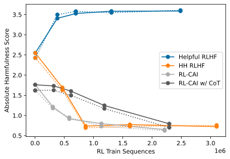

In contrast to our experiments where we collect relative harmfulness labels between pairs of model responses, in ([ Ganguli et al., 2022 ]) we have also conducted red teaming experiments collecting absolute harmfulness labels. Similar to the ‘relative’ experiments, crowdworkers are tasked with having back-and-forth conversations with a language model to try to bait it into generating harmful content, except only a single model is involved per conversation, and a single response is generated per conversational step. Finally, at the end, the worker rates their degree of “success” (on an integral rating scale from 0 to 4, inclusive) in getting the model to say something harmful. We finetuned a language model to predict an absolute harmfulness score conditioned on the full conversation using an L2 loss, with the score prediction serving as an additional metric for evaluating harmfulness.

与在成对模型回应之间收集相对有害性标注的实验不同，我们在 [ Ganguli et al., 2022 ] 中还开展过收集绝对有害性标注的红队测试实验。与“相对”实验类似，众包工人的任务是与语言模型反复对话、诱使其生成有害内容，区别在于每段对话只涉及单个模型，且对话的每一步只生成单个回应。最后，工人对自己“成功”诱使模型说出有害内容的程度进行评分（0 到 4 的整数评分，含两端）。我们用 L2 损失微调了一个语言模型，以完整对话为条件预测绝对有害性分数，该分数预测作为评估有害性的附加指标。

We show absolute harmfulness scores for our models in Figure 10 on a selection of 64 hand-picked held-out red team prompts, averaged over 256 model responses per prompt. According to this score, the helpful RLHF model becomes more harmful during training, while the HH RLHF, RL-CAI, and RL-CAI with CoT become progressively less harmful. However, we should caveat that absolute scores may note be well-calibrated, as different workers may have their own personal biases about how to grade the result on 0-4 scale.

我们在图 10 中展示了各模型在 64 个手工挑选的留出红队提示上的绝对有害性分数（每个提示对 256 个模型回应取平均）。按照这一分数，有益 RLHF 模型在训练过程中变得更有害，而 HH RLHF、RL-CAI 及带 CoT 的 RL-CAI 则逐步变得更无害。但需要说明的是，绝对分数的标定性可能不佳，因为不同工人对如何按 0–4 量表给结果打分可能各有个人偏见。
## 5 相关工作（Related Work）

Our work can be thought of as an extension of RLHF ([ Christiano et al., 2017 ]) with language models ([ Stiennon et al., 2020 ]) , and is similar to LaMDA ([ Thoppilan et al., 2022 ]) , InstructGPT ([ Ouyang et al., 2022 ]) , and Sparrow ([ Glaese et al., 2022 ]) , insofar as all of these use human data to train more aligned language models. This paper is also a follow-up to our earlier papers ([ Askell et al., 2021 , Bai et al., 2022 ]) on applying RLHF to train a helpful and harmless natural language assistant. Scaling trends for preference modeling and RLHF have recently been studied in ([ Gao et al., 2022 ]) .

我们的工作可视为 RLHF（[ Christiano et al., 2017 ]）与语言模型（[ Stiennon et al., 2020 ]）相结合的延伸，并与 LaMDA（[ Thoppilan et al., 2022 ]）、InstructGPT（[ Ouyang et al., 2022 ]）和 Sparrow（[ Glaese et al., 2022 ]）类似，因为它们都使用人类数据来训练更对齐的语言模型。本文也是我们此前关于应用 RLHF 训练有益且无害的自然语言助手的两篇论文（[ Askell et al., 2021 , Bai et al., 2022 ]）的后续。偏好建模与 RLHF 的缩放趋势最近在 [ Gao et al., 2022 ] 中被研究。

In this paper we explore constitutional AI, an approach that relies on model self-critique, revision, and evaluation. Similar work involving model self-critique and natural language feedback includes ([ Zhao et al., 2021 , Scheurer et al., , Saunders et al., 2022 ]) ; their methods are very similar to our supervised constitutional step. Note that Sparrow’s ([ Glaese et al., 2022 ]) decomposition of harmlessness into different areas has some commonality with our use of principles forming a ‘constitution’. Some other recent works on self-supervision include ([ Shi et al., 2022 , Huang et al., 2022 ]) .

本文探索宪法 AI，这是一种依赖模型自我批判、修订与评估的方法。涉及模型自我批判与自然语言反馈的类似工作包括（[ Zhao et al., 2021 , Scheurer et al., , Saunders et al., 2022 ]）；它们的方法与我们的监督式宪法阶段非常相似。请注意，Sparrow（[ Glaese et al., 2022 ]）把无害性分解为不同领域的做法，与我们用原则构成一部“宪法”有共通之处。其他一些关于自我监督的近期工作包括（[ Shi et al., 2022 , Huang et al., 2022 ]）。

We also use chain-of-thought reasoning ([ Nye et al., 2021 , Wei et al., 2022 ]) to augment model performance and make AI decision making more transparent. Specifically, we ask language models to ‘think step-by-step’ ([ Kojima et al., 2022 ]) and write out an argument explaining why one AI assistant response would be more harmless than another, before actually choosing the less harmful response.

我们还使用思维链推理（[ Nye et al., 2021 , Wei et al., 2022 ]）来增强模型性能，并使 AI 决策更加透明。具体而言，我们让语言模型“一步步思考”（[ Kojima et al., 2022 ]），先写出论证、解释为什么一个 AI 助手回应比另一个更无害，然后再实际选出危害更小的回应。

The motivations behind this work also align naturally with ([ Ganguli et al., 2022 ]) , which provides an extensive study of red teaming of language models, and significant portions of our red teaming data are gathered from that work. We also leverage the fact that language models can make well-calibrated choices ([ Kadavath et al., 2022 ]) to turn AI choices into calibrated preference labels. Scaling supervision has been widely discussed as a possibility for AI alignment, with specific proposals such as ([ Christiano et al., 2018 , Irving et al., 2018 ]) and recent empirical work like ([ Bowman et al., 2022 ]) .

本工作的动机也与 [ Ganguli et al., 2022 ] 自然契合：该工作对语言模型的红队测试进行了广泛研究，而我们的红队测试数据中有很大一部分正来自该工作。我们还利用语言模型能作出标定良好的选择这一事实（[ Kadavath et al., 2022 ]），把 AI 的选择转化为标定的偏好标注。缩放监督作为 AI 对齐的一种可能途径已被广泛讨论，具体提案如（[ Christiano et al., 2018 , Irving et al., 2018 ]），近期实证工作如（[ Bowman et al., 2022 ]）。

## 6 讨论（Discussion）

We have trained language assistants that are both helpful and harmless without using human feedback labels for harmlessness. We referred to the technique as ‘constitutional AI’ (CAI) since we used a ‘constitution’ consisting of human-written principles. We established two methods: (1) Constitutional AI which ‘bootstraps’ a helpful RLHF’s instruction-following abilities to critique and revise its own responses so as to remove harmful content, and (2) RL with model-generated labels for harmlessness, which further improves harmlessness. We used this method to train models that are both harmless and non-evasive, partially resolving an issue in ([ Bai et al., 2022 ]) .

我们在未使用人类无害性反馈标注的情况下，训练出了既有益又无害的语言助手。我们将该技术称为“宪法 AI”（CAI），因为我们使用了一部由人类撰写原则构成的“宪法”。我们确立了两种方法：(1) 宪法 AI——借力（“自举”）有益 RLHF 模型遵循指令的能力，让它批判并修订自己的回应以去除有害内容；(2) 使用模型生成的无害性标注进行 RL——进一步提升无害性。我们用该方法训练出了既无害又不回避的模型，部分解决了 [ Bai et al., 2022 ] 中的一个遗留问题。

By removing human feedback labels for harmlessness, we have moved further away from reliance on human supervision, and closer to the possibility of a self-supervised approach to alignment. However, in this work we still relied on human supervision in the form of helpfulness labels. We expect it is possible to achieve helpfulness and instruction-following without human feedback, starting from only a pretrained LM and extensive prompting, but we leave this for future work.

通过去除无害性的人类反馈标注，我们进一步摆脱了对人类监督的依赖，更接近对齐问题的自监督式路线。然而，本工作仍以有益性标注的形式依赖人类监督。我们预期，仅从预训练 LM 出发、辅以大量提示，也有可能实现有益性与指令遵循，但我们把这一点留作未来工作。

Our ultimate goal is *not* to remove human supervision entirely, but to make it more efficient, transparent, and targeted. All of our methods can leverage chain-of-thought ([ Nye et al., 2021 , Wei et al., 2022 ]) type reasoning – for critiques in the SL stage, and for evaluating comparisons for the RL stage – and we expect that a small number of very high-quality human demonstrations of this reasoning ([ Scheurer et al., , Saunders et al., 2022 ]) could be used to improve and focus performance. Natural language feedback is also more transparent, interpretable, and improveable as compared to a large dataset of human preference labels. We leave it to future work to study the effectiveness of this type of feedback.

我们的最终目标*不是*完全取消人类监督，而是让它更高效、更透明、更有针对性。我们的所有方法都可以利用思维链（[ Nye et al., 2021 , Wei et al., 2022 ]）式推理——在 SL 阶段用于批判，在 RL 阶段用于评估比较——而且我们预期，少量极高质量的人类此类推理由示范（[ Scheurer et al., , Saunders et al., 2022 ]）就可用来改进并聚焦模型表现。与庞大的人类偏好标注数据集相比，自然语言反馈也更透明、更可解释、更易改进。我们把研究这类反馈的有效性留作未来工作。

### 6.1 未来方向（Future Directions）

In prior work we have focused on training AI assistants to helpful, harmless, and honest ([ Askell et al., 2021 ]) , but otherwise we have allowed their behavior to be determined by generalization patterns from pretraining that are not under our direct control.

在以往工作中，我们专注于训练有益、无害且诚实的 AI 助手（[ Askell et al., 2021 ]），除此之外，我们任由其行为由预训练带来的泛化模式决定，而这些模式并不在我们的直接控制之下。

However, the constitutional methods we have discussed here are very general, and in principle might be applied to steer language models in a variety of ways. For example, we expect we could use these method to change the model’s writing style, tone, or personality, or alter its responses to specific categories of questions (e.g. to train an AI that heavily caveats certain categories of advice, or that adopts a specific persona). The constitutional approach should thus make it much easier to study how different AI behaviors tend to generalize and interfere, since by obviating human feedback, our methods lower the barrier to experimentation. For example, it should be possible to generate feedback labels along dozens of behavioral axes, and then study how preference models trained from these labels are correlated or anti-correlated. This is important for AI safety, since the generalization patterns imbued by pretraining are currently something of a black box whose correlations may have unforeseen consequences.

然而，这里讨论的宪法方法非常通用，原则上可以多种方式用于引导语言模型。例如，我们预期可以用这些方法改变模型的写作风格、语气或人格，或调整其对特定类别问题的回应（例如训练一个对某几类建议附加大量警示的 AI，或采用特定人设的 AI）。因此，宪法方法应当能让研究不同 AI 行为如何泛化、如何相互干扰变得容易得多，因为免除了人类反馈，我们的方法降低了实验门槛。例如，沿数十个行为轴生成反馈标注，然后研究由这些标注训练出的偏好模型之间如何相关或反相关，应当是可行的。这对 AI 安全很重要，因为预训练赋予的泛化模式目前还是某种黑箱，其相关性可能带来无法预见的后果。

Another remaining issue, and a major motivation for this work, is robustness —that is, can we make models essentially immune to red-team attacks? We hope that by making helpfulness and harmlessness more compatible, we will be able to significantly scale-up (automated) red teaming in order to improve robustness. Furthermore, we should be able to perform iterated ‘online’ training ([ Bai et al., 2022 ]) with AI supervision, where we update the preference model with new AI feedback in order to keep it on the same distribution as the policy produces. We saw that this was valuable with human feedback, and by using AI feedback we can fully automate the process.

另一个尚未解决的问题，也是本工作的一个主要动机，是鲁棒性——即我们能否让模型对红队攻击几乎免疫？我们希望通过让有益性与无害性更加兼容，能够大幅扩展（自动化）红队测试的规模，以改进鲁棒性。此外，我们应当能够利用 AI 监督进行迭代的“在线”训练（[ Bai et al., 2022 ]）：用新的 AI 反馈更新偏好模型，使其与策略产生的分布保持一致。我们看到这对人类反馈是有价值的，而使用 AI 反馈可以将这一流程完全自动化。

Robustness was also another motivation for using chain-of-thought reasoning in this work – we would eventually like AI systems to reason through the hidden risks of certain behaviors, in order to mitigate increasingly subtle and implicit harms.

鲁棒性也是本工作使用思维链推理的另一个动机——我们最终希望 AI 系统能推理出某些行为的隐性风险，以减轻日益微妙和隐性的危害。

### 6.2 更广泛的影响（Broader Impacts）

As with most methods that can control AI behavior, the ideas discussed in this work have a dual use. As we pass from prompting, to RLHF, to the constitutional methods discussed here, we lower the barrier to training AI models that behave in ways their creators intend. This means that these methods also make it easier to train pernicious systems. The supervised methods we have discussed may be particularly accessible, since they do not require an efficient RL implementation with large language models.

与大多数能够控制 AI 行为的方法一样，本文讨论的思想具有双重用途。随着我们从提示工程走向 RLHF、再走向这里讨论的宪法方法，训练“按创建者意图行事”的 AI 模型的门槛在不断降低。这意味着这些方法也让训练有害系统变得更容易。我们所讨论的监督式方法可能尤其容易上手，因为它们不要求面向大型语言模型的高效 RL 实现。

A further issue is that by reducing the *need* for human feedback, our constitutional methods make it easier to train and deploy AI systems that have not been thoroughly tested and *observed* by humans. This could lead developers to deploy models with unforeseen failure modes. On the other hand, our method has the benefit that we may no longer need an army of human red teamers to engage in the rather unsavory work of trying to trick AI systems into generating harmful content.

另一个问题在于，通过减少对人类反馈的*需要*，我们的宪法方法使训练并部署未经人类充分测试与*观察*的 AI 系统变得更加容易。这可能导致开发者部署带有未预见失效模式的模型。另一方面，我们的方法也有好处：我们可能不再需要一大群人类红队员去从事那种试图诱骗 AI 系统生成有害内容的令人不适的工作。
## 7 贡献声明（Contribution Statement）

**Model Pre-training:** Model pretraining was led by Nicholas Joseph and Sam McCandlish, with help from Tom Brown and Jared Kaplan, and much of Anthropic’s technical staff contributed to the development of our efficient distributed training infrastructure and the underlying machine learning systems. Core contributors include Tom Henighan, Scott Johnston, Sheer El Showk, Nelson Elhage, and Ben Mann. Scott Johnston in particular worked on optimizing pretraining for ML efficiency, while Sheer El Showk, Carol Chen, and Jennifer Zhou worked on data.

**模型预训练：** 模型预训练由 Nicholas Joseph 与 Sam McCandlish 领导，Tom Brown 与 Jared Kaplan 协助；Anthropic 的许多技术人员为我们高效的分布式训练基础设施及底层机器学习系统的开发作出了贡献。核心贡献者包括 Tom Henighan、Scott Johnston、Sheer El Showk、Nelson Elhage 与 Ben Mann。其中 Scott Johnston 尤其负责面向机器学习效率的预训练优化，Sheer El Showk、Carol Chen 与 Jennifer Zhou 负责数据工作。

**Reinforcement Learning:** The core RL infrastructure was built by Andy Jones and Kamal Ndousse in collaboration with Shauna Kravec and Dawn Drain. Development of the RL infrastructure has been led by Sam McCandlish and Dario Amodei.

**强化学习：** 核心 RL 基础设施由 Andy Jones 与 Kamal Ndousse 搭建，并与 Shauna Kravec 和 Dawn Drain 协作完成。RL 基础设施的开发由 Sam McCandlish 与 Dario Amodei 领导。

**Sampling and Evaluation:** Efficient sampling efforts were led by Tom Brown, and Tom Conerly carried out major aspects of the design, implementation and support for the system, with help from Zac Hatfield-Dodds. Many members of Anthropic worked on our framework for evaluations, including Saurav Kadavath, Nicholas Schiefer, Nick Joseph, Tom Henighan, Amanda Askell, Jared Kaplan, Andy Jones, Ethan Perez, Scott Johnston, and Sam McCandlish. Saurav in particular developed the systems for efficient composition of sampling, prompting, and evaluation used for SL and RL CAI, which were one of the primary tools used in this project. Jackson Kernion helped support human feedback data collection.

**采样与评估：** 高效采样工作由 Tom Brown 领导，Tom Conerly 在 Zac Hatfield-Dodds 的协助下承担了该系统设计、实现与支持的主要工作。Anthropic 的许多成员参与了评估框架的开发，包括 Saurav Kadavath、Nicholas Schiefer、Nick Joseph、Tom Henighan、Amanda Askell、Jared Kaplan、Andy Jones、Ethan Perez、Scott Johnston 与 Sam McCandlish。其中 Saurav 开发了用于 SL 与 RL CAI 的高效采样、提示与评估组合系统，它们是本项目使用的主要工具之一。Jackson Kernion 协助支持了人类反馈数据的收集。

**Cluster:** Nova DasSarma and Eli Tran-Johnson managed the research cluster our research depended on and maintained its stability, making this research possible. Many others helped with these efforts, including Ben Mann, Tom Henighan, Sam McCandlish, Andy Jones, Zac Hatfield-Dodds, and Tristan Hume.

**集群：** Nova DasSarma 与 Eli Tran-Johnson 管理着本研究赖以进行的研究集群并维持其稳定，使这项研究成为可能。许多其他人也为这些工作提供了帮助，包括 Ben Mann、Tom Henighan、Sam McCandlish、Andy Jones、Zac Hatfield-Dodds 与 Tristan Hume。

**Research:** Jared Kaplan developed the main ideas in discussion with Yuntao Bai, Amanda Askell, and Saurav Kadavath, and Jared carried out some of the initial experiments. Yuntao developed the method further and designed and carried out most of the experiments in this paper. Amanda helped develop the initial experiments, and Sandipan worked on harmlessness scores and automated generation of prompts.

**研究：** Jared Kaplan 在与 Yuntao Bai、Amanda Askell 和 Saurav Kadavath 的讨论中形成了主要思想，Jared 并执行了部分初步实验。Yuntao 进一步发展了该方法，并设计、执行了本文的大部分实验。Amanda 协助开展了初步实验，Sandipan 负责无害性分数与提示的自动生成。

**Writing:** This paper was drafted by Yuntao Bai and Jared Kaplan. Other members of Anthropic made miscellaneous contributions and suggestions throughout the writing process.

**写作：** 本文由 Yuntao Bai 与 Jared Kaplan 撰写。Anthropic 的其他成员在整个写作过程中提供了各类贡献与建议。

**Other contributions:** The ideas explored in this paper developed in conversations with many of Anthropic’s staff, especially Amanda Askell, Deep Ganguli, Sam Bowman, Ethan Perez, Saurav Kadavath, Dario Amodei, Sam McCandlish, Jackson Kernion, Stan Fort, Chris Olah, and Catherine Olsson.

**其他贡献：** 本文所探索的思想是在与 Anthropic 许多员工的讨论中逐步形成的，尤其是 Amanda Askell、Deep Ganguli、Sam Bowman、Ethan Perez、Saurav Kadavath、Dario Amodei、Sam McCandlish、Jackson Kernion、Stan Fort、Chris Olah 与 Catherine Olsson。

## 致谢（Acknowledgments）

We thank Paul Christiano for discussions and Maja Trebacz and Alex Tamkin for comments on the draft. We’re also deeply grateful to Daniela Amodei, Jarrah Bloomfield, Jamie Kerr, Timothy Telleen-Lawton, Jia Yuan Loke, Jeffrey Ladish, Rebecca Raible, Rune Kvist, Rob Gilson, Guro Khundadze, Filipe Dobreira, and Sebastian Conybeare for their help and support. We’d like to thank the staff and workers at Surge AI, Amazon MTurk, and Upwork for providing most of the data for our research.

我们感谢 Paul Christiano 与我们讨论，感谢 Maja Trebacz 与 Alex Tamkin 对草稿提出意见。我们还深深感谢 Daniela Amodei、Jarrah Bloomfield、Jamie Kerr、Timothy Telleen-Lawton、Jia Yuan Loke、Jeffrey Ladish、Rebecca Raible、Rune Kvist、Rob Gilson、Guro Khundadze、Filipe Dobreira 与 Sebastian Conybeare 的帮助与支持。我们还要感谢 Surge AI、Amazon MTurk 与 Upwork 的员工和工人，他们为我们提供了研究所需的大部分数据。

---

> 注：本文收录 arXiv 论文正文（第 1–7 节与致谢）；附录 A–D（样例批判与修订、有害对话分类、宪法原则全文、更多样例）未收录，如需可补充。
