# 走向单义性：用字典学习分解语言模型（中英对照）

> 原文标题：Towards Monosemanticity: Decomposing Language Models With Dictionary Learning
> 原文链接：https://transformer-circuits.pub/2023/monosemantic-features/index.html
> 研究页：https://www.anthropic.com/research/towards-monosemanticity-decomposing-language-models-with-dictionary-learning
> 原文作者：Trenton Bricken, Adly Templeton, Joshua Batson 等（Anthropic）
> 发布日期：2023-10-05
> **翻译模型：** GLM-5.3-Flash
> **评分：** ★★★★★（5/5，里程碑）—— 用稀疏自编码器（SAE）从单层 Transformer 中分解出单义特征：从多义神经元到可解释特征字典，可解释性工程化并延伸至生产级模型（mapping the mind）的奠基作
> 排版：每段英文原文在前，中文翻译紧随其后。本文收录正文主体；原页附录（训练细节、附加实验与界面说明、复现评论、致谢与引用信息）未收录。

---

Mechanistic interpretability seeks to understand neural networks by breaking them into components that are more easily understood than the whole. By understanding the function of each component, and how they interact, we hope to be able to reason about the behavior of the entire network. The first step in that program is to identify the correct components to analyze.

机制可解释性（mechanistic interpretability）试图通过把神经网络拆解为比整体更容易理解的组件来理解它们。只要理解每个组件的功能以及它们如何相互作用，我们就有望对整个网络的行为进行推理。这一研究计划的第一步，是找出值得分析的"正确"组件。

Unfortunately, the most natural computational unit of the neural network – the neuron itself – turns out not to be a natural unit for human understanding. This is because many neurons are polysemantic: they respond to mixtures of seemingly unrelated inputs. In the vision model Inception v1, a single neuron responds to faces of cats and fronts of cars . In a small language model we discuss in this paper, [a single neuron](https://transformer-circuits.pub/2023/monosemantic-features/vis/a-neurons.html?ordering=index#feature-83) responds to a mixture of academic citations, English dialogue, HTTP requests, and Korean text. Polysemanticity makes it difficult to reason about the behavior of the network in terms of the activity of individual neurons.

遗憾的是，神经网络中最自然的计算单元——神经元本身——并不是一个对人类理解而言自然的单元。这是因为许多神经元是多义的（polysemantic）：它们对看似无关的输入混合体作出响应。在视觉模型 Inception v1 中，单个神经元同时对猫的脸和汽车的车头作出响应。在本文讨论的一个小型语言模型中，[单个神经元](https://transformer-circuits.pub/2023/monosemantic-features/vis/a-neurons.html?ordering=index#feature-83)则对学术论文引用、英语对话、HTTP 请求和韩语文本的混合作出响应。多义性（polysemanticity）使我们难以以单个神经元的活动为基础来推理网络的行为。

One potential cause of polysemanticity is superposition , a hypothesized phenomenon where a neural network represents more independent "features" of the data than it has neurons by assigning each feature its own linear combination of neurons. If we view each feature as a vector over the neurons, then the set of features form an overcomplete linear basis for the activations of the network neurons. In our previous paper on [Toy Models of Superposition](https://transformer-circuits.pub/2022/toy_model/index.html#strategic-ways-out) , we showed that superposition can arise naturally during the course of neural network training if the set of features useful to a model are sparse in the training data. As in compressed sensing, sparsity allows a model to disambiguate which combination of features produced any given activation vector.[^1]

多义性的一个潜在成因是叠加（superposition），这是一个假想的现象：神经网络通过给每个特征分配各自独有的神经元线性组合，来表示比神经元数量更多的相互独立的"特征"。如果把每个特征看作神经元上的一个向量，那么这组特征就构成了网络神经元激活的一组过完备（overcomplete）线性基。在我们之前的论文《[叠加的玩具模型](https://transformer-circuits.pub/2022/toy_model/index.html#strategic-ways-out)》（Toy Models of Superposition）中，我们证明了：只要对模型有用的特征集在训练数据中是稀疏的，叠加就可能在神经网络训练过程中自然产生。正如压缩感知（compressed sensing）中的情形，稀疏性使模型能够消歧，判断出是哪个特征组合产生了某个给定的激活向量。[^1]

In Toy Models of Superposition, we described [three strategies](https://transformer-circuits.pub/2022/toy_model/index.html#strategic-ways-out) to finding a sparse and interpretable set of features if they are indeed hidden by superposition: (1) creating models without superposition, perhaps by encouraging activation sparsity; (2) using dictionary learning to find an overcomplete feature basis in a model exhibiting superposition; and (3) hybrid approaches relying on a combination of the two. Since the publication of that work, we've explored all three approaches. We eventually developed counterexamples which persuaded us that the sparse architectural approach (approach 1) was insufficient to prevent polysemanticity, and that standard dictionary learning methods (approach 2) had significant issues with overfitting.

在《叠加的玩具模型》中，我们描述了当特征确实被叠加所隐藏时，寻找一个稀疏且可解释特征集的[三种策略](https://transformer-circuits.pub/2022/toy_model/index.html#strategic-ways-out)：(1) 构造没有叠加的模型，比如通过鼓励激活稀疏性；(2) 用字典学习（dictionary learning）在表现出叠加的模型中找到过完备的特征基；(3) 结合两者的混合方法。自那项工作发表以来，我们对这三种方法都进行了探索。我们最终构造出一些反例，它们让我们确信：稀疏架构方法（方法 1）不足以阻止多义性，而标准字典学习方法（方法 2）则存在严重的过拟合问题。

In this paper, we use a weak dictionary learning algorithm called a sparse autoencoder to generate learned features from a trained model that offer a more monosemantic unit of analysis than the model's neurons themselves. Our approach here builds on a significant amount of prior work, especially in using dictionary learning and related methods on neural network activations (e.g. ), and a more general allied literature on disentanglement. We also note interim reports which independently investigated the sparse autoencoder approach in response to Toy Models, culminating in the recent manuscript of Cunningham et al. .

在本文中，我们使用一种称为稀疏自编码器（sparse autoencoder）的弱字典学习算法，从训练好的模型中生成"学到的特征"（learned features），它们提供了比模型神经元本身更具单义性（monosemanticity）的分析单元。我们的方法建立在大量先前工作的基础上，尤其是对神经网络激活使用字典学习及相关方法的工作（例如），以及关于解缠（disentanglement）的更广泛的同盟文献。我们还注意到一些中期报告，它们独立地响应《叠加的玩具模型》而研究了稀疏自编码器方法，并最终形成了 Cunningham 等人最近的手稿。

The goal of this paper is to provide a detailed demonstration of a sparse autoencoder compellingly succeeding at the goals of extracting interpretable features from superposition and enabling basic circuit analysis. Concretely, we take a one-layer transformer with a 512-neuron MLP layer, and decompose the MLP activations into relatively interpretable features by training sparse autoencoders on MLP activations from 8 billion data points, with expansion factors ranging from 1× (512 features) to 256× (131,072 features). We focus our detailed interpretability analyses on the 4,096 features learned in one run we call A/1.

本文的目标是详细展示稀疏自编码器在两个目标上的令人信服的成功：从叠加中提取可解释特征，以及支持基本的电路分析。具体而言，我们取一个带 512 神经元 MLP 层的单层模型（one-layer transformer），通过在 80 亿数据点的 MLP 激活上训练稀疏自编码器，把 MLP 激活分解为相对可解释的特征，扩展倍数从 1×（512 个特征）到 256×（131,072 个特征）不等。我们把详细的可解释性分析聚焦于其中一次称为 A/1 的运行中学到的 4,096 个特征。

This report has four major sections. In Problem Setup, we provide motivation for our approach and describe the transformers and sparse autoencoders we train. In Detailed Investigations of Individual Features, we offer an existence proof – we make the case that several features we find are functionally specific causal units which don't correspond to neurons. In Global Analysis, we argue that the typical feature is interpretable and that they explain a non-trivial portion of the MLP layer. Finally, in Phenomenology we describe several properties of our features, including feature-splitting, universality, and how they can form "finite state automata"-like systems implementing interesting behaviors.

本报告有四个主要章节。在"问题设定"中，我们为该方法提供动机，并描述我们所训练的 Transformer 与稀疏自编码器。在"对单个特征的详细研究"中，我们给出一个存在性证明——论证我们发现的若干特征是功能上特异的因果单元，而它们并不对应任何神经元。在"全局分析"中，我们论证典型特征是可解释的，并且它们解释了 MLP 层中不可忽略的一部分。最后，在"现象学"中，我们描述特征的若干性质，包括特征分裂（feature splitting）、普适性（universality），以及它们如何形成实现有趣行为的、类似"有限状态自动机"的系统。

We also provide three comprehensive visualizations of features. First, for all features from [90 learned dictionaries](https://transformer-circuits.pub/2023/monosemantic-features/vis/) we present activating dataset examples and downstream logit effects. We recommend the reader begin with the [visualization of A/1](https://transformer-circuits.pub/2023/monosemantic-features/vis/a1.html). Second, we provide a [data-oriented view](https://transformer-circuits.pub/2023/monosemantic-features/vis/index.html#example-texts), showing all features active on each token of 25 texts. Finally, we coembed all 4,096 features from A/1 and all 512 features from A/0 into the plane using UMAP to allow for interactive exploration of the space of features:

我们还提供了三个全面的特征可视化。第一，针对来自 [90 个学到的字典](https://transformer-circuits.pub/2023/monosemantic-features/vis/)的所有特征，我们展示了激活它们的数据集样本以及对下游 logit 的影响。我们建议读者从 [A/1 的可视化](https://transformer-circuits.pub/2023/monosemantic-features/vis/a1.html)开始。第二，我们提供了一个[面向数据的视图](https://transformer-circuits.pub/2023/monosemantic-features/vis/index.html#example-texts)，展示 25 篇文本中每个词元上激活的所有特征。最后，我们用 UMAP 把 A/1 的全部 4,096 个特征和 A/0 的全部 512 个特征共同嵌入平面，以便交互式地探索特征空间：

### 结果概要（Summary of Results）

- Sparse Autoencoders extract relatively monosemantic features. We provide four different lines of evidence: detailed investigations for a few features firing in specific contexts for which we can construct computational proxies, human analysis for a large random sample of features, automated interpretability analysis of activations for all the features learned by the autoencoder, and finally automated interpretability analysis of logit weights for all the features. Moreover, the last three analyses show that most learned features are interpretable. While we do not claim that our interpretations catch all aspects of features' behaviors, by constructing metrics of interpretability consistently for features and neurons, we quantitatively show their relative interpretability.

- 稀疏自编码器提取出了相对单义的特征。我们提供了四条不同的证据线：对少数在特定语境中激活、且我们能为其构建计算代理（computational proxies）的特征做详细研究；对一个较大的随机特征样本做人工分析；对自编码器学到的所有特征的激活做自动可解释性分析；最后，对所有特征的 logit 权重做自动可解释性分析。此外，后三种分析表明大多数学到的特征都是可解释的。虽然我们并不声称我们的解释抓住了特征行为的所有方面，但通过为特征和神经元一致地构建可解释性指标，我们定量地展示了它们相对的可解释性。

- Sparse autoencoders produce interpretable features that are effectively invisible in the neuron basis. We find features (e.g., one firing on Hebrew script) which are not active in any of the top dataset examples for any of the neurons.

- 稀疏自编码器产生的可解释特征在神经元基下实际上是不可见的。我们发现一些特征（例如一个在希伯来文字上激活的特征）在任何神经元的任何 top 数据集样本中都没有激活。

- Sparse autoencoder features can be used to intervene on and steer transformer generation. For example, activating the base64 feature we study causes the model to generate base64 text, and activating the Arabic script feature we study produces Arabic text. (See discussion of pinned feature sampling in Global Analysis.)

- 稀疏自编码器特征可用于干预并引导 Transformer 的生成。例如，激活我们研究的 base64 特征会使模型生成 base64 文本，激活我们研究的阿拉伯文字特征会产生阿拉伯语文本。（参见"全局分析"中关于钉定特征采样（pinned feature sampling）的讨论。）

- Sparse autoencoders produce relatively universal features. Sparse autoencoders applied to different transformer language models produce mostly similar features, more similar to one another than they are to their own model's neurons. (See Universality)

- 稀疏自编码器产生相对普适的特征。将稀疏自编码器应用于不同的 Transformer 语言模型，得到的大部分特征是相似的，它们彼此之间的相似程度高于它们与各自模型中神经元的相似程度。（参见"普适性"）

- Features appear to "split" as we increase autoencoder size. When we gradually increase the width of the autoencoder from 512 (the number of neurons) to over 131,000 (256×), we find features which naturally fit together into families. For example, one base64 feature in a small dictionary splits into three, with more subtle and yet still interpretable roles, in a larger dictionary. The different size autoencoders offer different "resolutions" for understanding the same object. (See Feature Splitting.)

- 随着自编码器规模增大，特征似乎会"分裂"。当我们将自编码器宽度从 512（神经元数量）逐步增加到 131,000 以上（256×）时，会发现一些特征自然地组合成家族。例如，小字典中的一个 base64 特征在更大的字典中分裂成三个，其角色更加微妙但仍然可解释。不同规模的自编码器为理解同一个对象提供了不同的"分辨率"。（参见"特征分裂"）

- Just 512 neurons can represent tens of thousands of features. Despite the MLP layer being very small, we continue to find new features as we scale the sparse autoencoder.

- 仅仅 512 个神经元就能表示数以万计的特征。尽管 MLP 层非常小，但随着稀疏自编码器的扩大，我们仍能不断发现新特征。

- Features connect in "finite-state automata"-like systems that implement complex behaviors. For example, we find features that work together to generate valid HTML. (See "Finite State Automata".)

- 特征以类似"有限状态自动机"的系统相互连接，实现复杂的行为。例如，我们发现多个特征协同工作以生成合法的 HTML。（参见""有限状态自动机""）
## 问题设定（Problem Setup）

A key challenge to our agenda of reverse engineering neural networks is the curse of dimensionality: as we study ever-larger models, the volume of the latent space representing the model's internal state that we need to interpret grows exponentially. We do not currently see a way to understand, search or enumerate such a space unless it can be decomposed into independent components, each of which we can understand on its own.

我们这一逆向工程神经网络议程的一个关键挑战是维度灾难：随着研究的模型越来越大，我们需要解释的、表示模型内部状态的潜空间体积呈指数级增长。除非这样的空间能够被分解成相互独立的组件——每个组件我们都能独立理解——否则我们目前看不到有什么办法去理解、搜索或枚举它。

In certain limited cases, it is possible to side step these issues by rewriting neural networks in ways that don't make reference to certain hidden states. For example, in A Mathematical Framework for Transformer Circuits , we were able to analyze a one-layer attention-only network without addressing this problem. But this approach becomes impossible if we consider even a simple standard one-layer transformer with an MLP layer with a ReLU activation function. Understanding such a model requires us to have a way to decompose the MLP layer.

在某些有限的情况下，可以通过改写神经网络、使其不再引用某些隐藏状态来绕过这些问题。例如，在《Transformer 电路的数学框架》（A Mathematical Framework for Transformer Circuits）中，我们得以分析一个单层纯注意力网络而无需面对这个问题。但只要考虑一个哪怕最简单的、带 ReLU 激活函数 MLP 层的标准单层 Transformer，这种方法就变得不可行。理解这样的模型要求我们找到分解 MLP 层的办法。

In some sense, this is the simplest language model we profoundly don't understand. And so it makes a natural target for our paper. We aim to take its MLP activations – the activations we can't avoid needing to decompose – and decompose them into "features":

从某种意义上说，这是我们彻底无法理解的最简单的语言模型。因此它自然成为本文的目标。我们的目标是取它的 MLP 激活——那些我们无法回避、必须分解的激活——并把它们分解成"特征"：

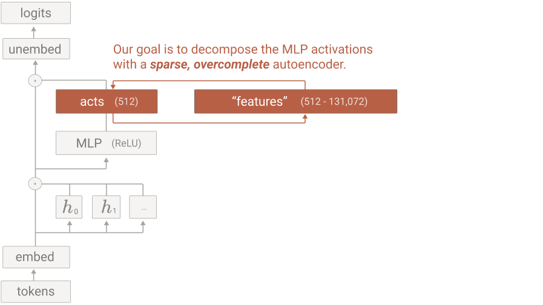

Crucially, we decompose into more features than there are neurons. This is because we believe that the MLP layer likely uses superposition to represent more features than it has neurons (and correspondingly do more useful non-linear work!). In fact, in our largest experiments we'll expand to have 256 times more features than neurons, although we'll primarily focus on a more modest 8× expansion.

关键在于，我们分解出的特征比神经元更多。这是因为我们认为 MLP 层很可能利用叠加来表示比神经元数量更多的特征（并因此完成更多有用的非线性工作！）。事实上，在最大的实验中我们将扩展到神经元数量的 256 倍特征，尽管我们主要关注较为温和的 8× 扩展。

|  | Transformer | Sparse Autoencoder |
| Layers | 1 Attention Block 1 MLP Block (ReLU) | 1 ReLU (up) 1 Linear (down) |
| MLP Size | 512 | 512 (1×) – 131,072 (256×) |
| Dataset | The Pile (100 billion tokens) | Transformer MLP Activations (8 billion samples) |
| Loss | Autoregressive Log-Likelihood | L2 reconstruction + L1 on hidden layer activation |

|  | Transformer | 稀疏自编码器 |
|---|---|---|
| 层数 | 1 个注意力块，1 个 MLP 块（ReLU） | 1 个 ReLU（向上），1 个线性层（向下） |
| MLP 大小 | 512 | 512（1×）– 131,072（256×） |
| 数据集 | The Pile（1000 亿词元） | Transformer MLP 激活（80 亿样本） |
| 损失 | 自回归对数似然 | L2 重构 + 隐层激活上的 L1 |

In the following subsections, we will motivate this setup at more length. Additionally, a more detailed discussion of the architectural details and training of these models can be found in the appendix.

在接下来的小节中，我们会更详细地论证这一设置。此外，关于这些模型的架构细节与训练的更深入讨论可以在附录中找到。

### 作为分解的特征（Features as a Decomposition）

There is significant empirical evidence suggesting that neural networks have interpretable linear directions in activation space. This includes classic work by Mikolov et al. investigating "vector arithmetic" in word embeddings (but see ) and similar results in other latent spaces (e.g. ). There is also a large body of work investigating interpretable neurons, which are just basis dimensions (e.g. in RNNs ; in CNNs ; in GANs ; but see ). A longer review and discussion of this work can be found in the [Motivation section](https://transformer-circuits.pub/2022/toy_model/index.html#motivation) of Toy Models , although it doesn't cover more recent work (e.g. ).[^2]

大量实证证据表明，神经网络在激活空间中存在可解释的线性方向。这包括 Mikolov 等人对词嵌入中"向量算术"的经典研究（但另见），以及其他潜空间中的类似结果（例如）。还有大量工作研究了可解释神经元——它们就是基维度（例如 RNN 中的；CNN 中的；GAN 中的；但另见）。对这些工作更长的综述与讨论可以在《叠加的玩具模型》的"[动机"部分](https://transformer-circuits.pub/2022/toy_model/index.html#motivation)找到，不过它没有涵盖更近期的工作（例如）。[^2]

If linear directions are interpretable, it's natural to think there's some "basic set" of meaningful directions which more complex directions can be created from. We call these directions features, and they're what we'd like to decompose models into. Sometimes, by happy circumstances, individual neurons appear to be these basic interpretable units (see examples above). But quite often, this isn't the case.

如果线性方向是可解释的，那么很自然地会想到存在某个由有意义方向组成的"基础集合"，更复杂的方向可以由它们构造出来。我们把这些方向称为特征（features），它们正是我们想把模型分解成的对象。有时，出于幸运的巧合，单个神经元看起来就是这些基础的可解释单元（见上文例子）。但很多时候，情况并非如此。

Instead, we decompose the activation vector \mathbf{x}^j as a combination of more general features which can be any direction:

相反，我们把激活向量 \mathbf{x}^j 分解为更一般的特征的组合，这些特征可以是任意方向：

where \mathbf{x}^j is the activation vector of length d_{\rm MLP} for datapoint j, f_i(\mathbf{x}^j) is the activation of feature i, each \mathbf{d}_i is a unit vector in activation space we call the direction of feature i, and \mathbf{b} is a bias.[^3] Note that this decomposition is not new: it is just a linear matrix factorization of the kind commonly employed in dictionary learning.

其中 \mathbf{x}^j 是数据点 j 的长度为 d_{\rm MLP} 的激活向量，f_i(\mathbf{x}^j) 是特征 i 的激活，每个 \mathbf{d}_i 是激活空间中的一个单位向量，我们称之为特征 i 的方向，\mathbf{b} 是偏置。[^3] 需要指出，这种分解并不新鲜：它只是字典学习中常见的那类线性矩阵分解。

In our sparse autoencoder setup, the feature activations are the output of the encoder

在我们的稀疏自编码器设置中，特征激活是编码器（encoder）的输出

f_i(x) = \text{ReLU}( W_e (\mathbf{x} - \mathbf{b}_d) + \mathbf{b}_e )_i,

where W_e is the weight matrix of the encoder and \mathbf{b}_d, \mathbf{b}_e are a pre-encoder and an encoder bias. The feature directions are the columns of the decoder weight matrix W_d. (See appendix for full notation.)

其中 W_e 是编码器的权重矩阵，\mathbf{b}_d 与 \mathbf{b}_e 分别是编码器前偏置和编码器偏置。特征方向是解码器（decoder）权重矩阵 W_d 的列。（完整记号见附录。）

If such a sparse decomposition exists, it raises an important question: are models in some fundamental sense composed of features or are features just a convenient post-hoc description? In this paper, we take an agnostic position, though our results on feature universality suggest that features have some existence beyond individual models.

如果这样的稀疏分解存在，就引出一个重要问题：模型在某种根本意义上是由特征构成的，还是特征只是一种方便的事后描述？在本文中，我们对这个问题持不可知立场，尽管我们在特征普适性上的结果暗示，特征拥有超越单个模型的某种存在性。

#### 叠加假设（Superposition Hypothesis）

To see how this decomposition relates to superposition, recall that the superposition hypothesis postulates that neural networks “want to represent more features than they have neurons”. We think this happens via a kind of “noisy simulation”, where small neural networks exploit feature sparsity and properties of high-dimensional spaces to approximately simulate much larger much sparser neural networks .

要理解这种分解与叠加的关系，请回想叠加假设（superposition hypothesis）的主张：神经网络"想要表示比它们所拥有的神经元更多的特征"。我们认为这通过一种"含噪模拟"来实现：小型神经网络利用特征稀疏性和高维空间的性质，近似地模拟规模大得多、稀疏得多的神经网络。

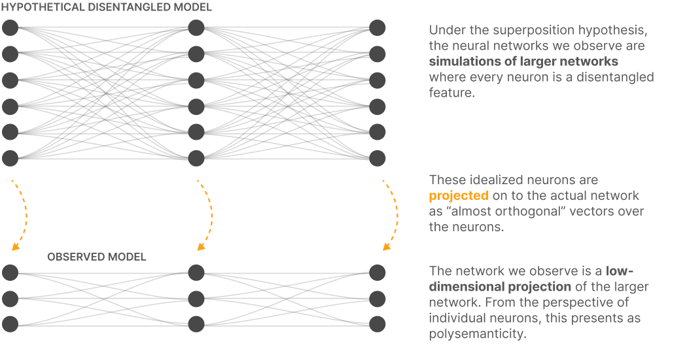

A consequence of this is that we should expect the feature directions to form an overcomplete basis. That is, our decomposition should have more directions \mathbf{d}_i than neurons. Moreover, the feature activations should be sparse, because sparsity is what enables this kind of noisy simulation. This is mathematically identical to the classic problem of dictionary learning.

这样做的后果是，我们应该预期特征方向构成一个过完备基。也就是说，我们的分解中方向 \mathbf{d}_i 的数量应当多于神经元数量。此外，特征激活应当是稀疏的，因为稀疏性正是使这种含噪模拟成为可能的关键。这在数学上与经典的字典学习问题完全一致。
### 什么样的分解才是好的分解？（What makes a good decomposition?）

Suppose that a dictionary exists such that the MLP activation of each datapoint is in fact well approximated by a sparse weighted sum of features as in equation 1. That decomposition will be useful for interpreting the neural network if:

假设存在这样一个字典：每个数据点的 MLP 激活实际上都能被很好地近似为如方程 1 所示的特征稀疏加权和。那么，如果以下条件成立，该分解将有助于解释神经网络：

1. We can interpret the conditions under which each feature is active. That is, we have a description of which datapoints j cause the feature to activate (i.e. for which f_i(\mathbf{x}^j) is large) that makes sense on a diverse dataset (including potentially synthetic or off-distribution examples meant to test the hypothesis).[^4]

1. 我们能够解释每个特征在什么条件下激活。也就是说，对于哪些数据点 j 会引起特征激活（即 f_i(\mathbf{x}^j) 较大），我们有一种描述，并且该描述在多样的数据集上（包括可能用于检验该假设的合成样本或分布外样本）是说得通的。[^4]

1. We can interpret the downstream effects of each feature, i.e. the effect of changing the value of f_i on subsequent layers. This should be consistent with the interpretation in (1).

1. 我们能够解释每个特征的下游效应，即改变 f_i 的值对后续层的影响。这应当与 (1) 中的解释一致。

1. The features explain a significant portion of the functionality of the MLP layer (as measured by the loss; see How much of the model does our interpretation explain?).

1. 这些特征解释了 MLP 层功能的相当大一部分（以损失衡量；参见"我们的解释解释了模型的多少？"）。

A feature decomposition satisfying these criteria would allow us to:

满足这些标准的特征分解将使我们能够：

1. Determine the contribution of a feature to the layer’s output, and the next layer’s activations, on a specific example.

1. 在具体样例上确定一个特征对该层输出以及下一层激活的贡献。

1. Monitor the network for the activation of a specific feature (see e.g. speculation about [safety-relevant features](https://transformer-circuits.pub/2023/july-update/index.html#safety-features)).

1. 监控网络中某个特定特征的激活（例如参见关于[安全相关特征](https://transformer-circuits.pub/2023/july-update/index.html#safety-features)的推测）。

1. Change the behavior of the network in predictable ways by changing the values of some features. In multilayer models this could look like predictably influencing one layer by changing the feature activations in an earlier layer.

1. 通过改变某些特征的值，以可预测的方式改变网络的行为。在多层模型中，这可以表现为通过改变较早一层的特征激活来可预测地影响另一层。

1. Demonstrate that the network has learned certain properties of the data.

1. 证明网络已经学到了数据的某些性质。

1. Demonstrate that the network is using a given property of the data in producing its output on a specific example.[^5]

1. 证明网络在特定样例上产生输出时确实使用了数据的某个给定性质。[^5]

1. Design inputs meant to activate a given feature and elicit certain outputs.

1. 设计旨在激活某个给定特征并引发特定输出的输入。

Of course, decomposing models into components is just the beginning of the work of mechanistic interpretability! It provides a foothold on the inner workings of models, allowing us to start in earnest on the task of unraveling circuits and building a larger-scale understanding of models.

当然，将模型分解成组件只是机制可解释性工作的开端！它为我们提供了一个进入模型内部运作的立足点，使我们能够真正着手解开电路（circuits）、建立对模型更大规模理解的任务。

### 为什么不使用架构方法？（Why not use architectural approaches?）

In [Toy Models of Superposition](https://transformer-circuits.pub/2022/toy_model/index.html) , we highlighted several different approaches to solving superposition. One of those approaches was to engineer models to simply not have superposition in the first place.

在《[叠加的玩具模型](https://transformer-circuits.pub/2022/toy_model/index.html)》中，我们强调了解决叠加问题的几种不同方法。其中一种方法是通过工程手段让模型从一开始就不存在叠加。

Initially, we thought that this might be possible but come with a large performance hit (i.e. produce models with greater loss). Even if this performance hit had been too large to use in practice for real models, we felt that success at creating monosemantic models would have been very useful for research, and in a lot of ways this felt like the "cleanest" approach for downstream analysis.

起初，我们认为这也许是可能的，但会带来很大的性能损失（即产生损失更大的模型）。即便这种性能损失大到无法在实践中用于真实模型，我们也觉得，成功创建单义模型对研究非常有用，而且在很多方面，这感觉上是下游分析"最干净"的方法。

Unfortunately, having spent a significant amount of time investigating this approach, we have ultimately concluded that it is more fundamentally non-viable.

遗憾的是，在花了大量时间研究这一方法之后，我们最终得出结论：它在更根本的层面上是不可行的。

In particular, we made several attempts to induce activation sparsity during training to produce models without superposition, even to the point of training models with 1-hot activations. This indeed eliminates superposition, but it fails to result in cleanly-interpretable neurons! Specifically, we found that individual neurons can be polysemantic even in the absence of superposition. This is because in many cases models achieve lower loss by representing multiple features ambiguously (in a polysemantic neuron) than by representing a single feature unambiguously and ignoring the others.

具体来说，我们多次尝试在训练期间诱导激活稀疏性来产生没有叠加的模型，甚至训练了具有独热（1-hot）激活的模型。这确实消除了叠加，但却无法产生干净可解释的神经元！具体而言，我们发现即使在没有叠加的情况下，单个神经元仍然可能是多义的。这是因为在很多情况下，模型通过（在一个多义神经元中）模糊地表示多个特征所达到的损失，比明确地只表示单个特征而忽略其他特征更低。

To understand this, consider a toy model with a single neuron trained on a dataset with four mutually-exclusive features (A/B/C/D), each of which makes a distinct (correct) prediction for the next token, labeled in the same fashion. Further suppose that this neuron’s output is binary: it either fires or it doesn’t. When it fires, it produces an output vector representing the probabilities of the different possible next tokens.

为理解这一点，考虑一个玩具模型：单个神经元，在具有四个互斥特征（A/B/C/D）的数据集上训练，每个特征都对下一个词元作出一个不同（且正确）的预测，预测以相同方式标记。进一步假设该神经元的输出是二值的：要么激活，要么不激活。激活时，它产生一个表示不同可能下一词元概率的输出向量。

We can calculate the cross-entropy loss achieved by this model in a few cases:

我们可以计算该模型在几种情形下达到的交叉熵损失：

1. Suppose the neuron only fires on feature A, and correctly predicts token A when it does. The model ignores all of the other features, predicting a uniform distribution over tokens B/C/D when feature A is not present. In this case the loss is \frac{3}{4}\ln 3 \approx 0.8.

1. 假设神经元只在特征 A 上激活，并且在激活时正确预测词元 A。模型忽略所有其他特征，当特征 A 不存在时，对词元 B/C/D 预测均匀分布。此时损失为 \frac{3}{4}\ln 3 \approx 0.8。

1. Instead suppose that the neuron fires on both features A and B, predicting a uniform distribution over the A and B tokens. When the A and B features are not present, the model predicts a uniform distribution over the C and D tokens. In this case the loss is \ln 2 \approx 0.7.

1. 再假设神经元在特征 A 和 B 上都激活，对 A 和 B 词元预测均匀分布。当 A 和 B 特征不存在时，模型对 C 和 D 词元预测均匀分布。此时损失为 \ln 2 \approx 0.7。

Because the loss is lower in case (2) than in case (1), the model achieves better performance by making its sole neuron polysemantic, even though there is no superposition.

由于情形 (2) 的损失低于情形 (1)，模型让它唯一的神经元变成多义的反而获得了更好的性能，即使这里并不存在叠加。

This example might initially seem uninteresting because it only involves one neuron, but it actually points at a general issue with highly sparse networks. If we push activation sparsity to its limit, only a single neuron will activate at a time. We can now consider that single neuron and the cases where it fires. As seen earlier, it can still be advantageous for that neuron to be polysemantic.

这个例子乍看之下可能没什么意思，因为它只涉及一个神经元，但它实际上指出了高度稀疏网络的一个普遍问题。如果我们将激活稀疏性推向极限，那么每次将只有一个神经元激活。此时我们可以考察那个唯一的神经元以及它激活的那些情形。如前所述，该神经元是多义的仍然可能更有利。

Based on this reasoning, and the results of our experiments, we believe that models trained on cross-entropy loss will generally prefer to represent more features polysemantically than to represent fewer "true features" monosemantically, even in cases where sparsity constraints make superposition impossible.

基于这一推理和我们的实验结果，我们相信：以交叉熵损失训练的模型通常更愿意以多义的方式表示更多的特征，而不是以单义的方式表示较少的"真实特征"，即便在稀疏约束使叠加不可能成立的情况下也是如此。

Models trained on other loss functions do not necessarily suffer this problem. For instance, models trained under mean squared error loss (MSE) may achieve the same loss for both polysemantic and monosemantic representations (e.g. ), and for some feature importance curves they may actively prefer the monosemantic solution . But language models are not trained with MSE, and so we do not believe architectural changes can be used to create fully monosemantic language models.

用其他损失函数训练的模型不一定有这个问题。例如，在均方误差损失（MSE）下训练的模型，多义表示和单义表示可能达到相同的损失（例如），并且对于某些特征重要性曲线，它们可能反而主动偏好单义解。但语言模型并不是用 MSE 训练的，因此我们不认为可以靠架构上的改变来创建完全单义的语言模型。

Note, however, that in learning to decompose models post-training we do use an MSE loss (between the activations and their representation in terms of the dictionary), so sparsity can inhibit superposition from forming in the learned dictionary. (Otherwise, we might have superposition "all the way down.")

不过请注意，在训练后学习分解模型时，我们确实使用了 MSE 损失（激活与其在字典下的表示之间），因此稀疏性能够抑制叠加在学到的字典中形成。（否则，我们可能会得到"层层皆是叠加"的局面。）
### 用稀疏自编码器寻找好的分解（Using Sparse Autoencoders To Find Good Decompositions）

There is a long-standing hypothesis that many natural latent variables in the world are sparse (see , section "Why Sparseness?"). Although we have a limited understanding of the features that exist in language models, the examples we do have (e.g. ) are suggestive of highly sparse variables. Our work on Toy Models of Superposition shows that a large set of sparse features could be represented in terms of directions in a lower dimensional space.

一个长期存在的假设是，世界上许多自然的潜变量是稀疏的（见"Why Sparseness?"一节）。虽然我们对语言模型中存在的特征了解有限，但我们已有的例子（例如）暗示了高度稀疏的变量。我们在《叠加的玩具模型》上的工作表明，一个庞大的稀疏特征集合可以用较低维空间中的方向来表示。

For this reason, we seek a decomposition which is sparse and overcomplete. This is essentially the problem of [sparse dictionary learning](https://en.wikipedia.org/wiki/Sparse_dictionary_learning). (Note that, since we're only asking for a sparse decomposition of the activations, we make no use of the downstream effects of \mathbf{d}_i on the model's output. This means we'll be able to use those downstream effects in later sections as a kind of validation on the features found.)

出于这个原因，我们寻求一个既稀疏又过完备的分解。这本质上就是[稀疏字典学习](https://en.wikipedia.org/wiki/Sparse_dictionary_learning)（sparse dictionary learning）问题。（注意，由于我们只要求对激活的稀疏分解，我们没有利用 \mathbf{d}_i 对模型输出的下游效应。这意味着在后面的章节中，我们可以把那些下游效应当作对所找到特征的一种验证来使用。）

It's important to understand why making the problem overcomplete – which might initially sound like a trivial change – actually makes this setting very different from similar approaches seeking sparse disentanglement in the literature. It's closely connected to why dictionary learning is such a non-trivial operation; in fact, as we'll see, it's actually kind of miraculous that this is possible at all. At the heart of dictionary learning is an inner problem of computing the feature activations f_i(\mathbf{x}) for each datapoint \mathbf{x}, given the feature directions \mathbf{d}_i. On its surface, this problem may seem impossible: we're asking to determine a high-dimensional vector from a low-dimensional projection. Put another way, we're trying to invert a very rectangular matrix. The only thing which makes it possible is that we are looking for a high-dimensional vector that is sparse! This is the famous and well-studied problem of [compressed sensing](https://en.wikipedia.org/wiki/Compressed_sensing), which is NP-hard in its exact form. It is possible to store high-dimensional sparse structure in lower-dimensional spaces, but recovering it is hard.

理解为什么把问题变成过完备——这最初听起来像个微不足道的变化——实际上使这一设置与文献中寻求稀疏解缠的类似方法截然不同，这一点很重要。它也与"字典学习为何是一项相当不容易的操作"密切相关；事实上，正如我们将看到的，这在某种程度上堪称奇迹。字典学习的核心是一个内层问题（inner problem）：在给定特征方向 \mathbf{d}_i 的情况下，为每个数据点 \mathbf{x} 计算特征激活 f_i(\mathbf{x})。表面上看，这个问题似乎不可能：我们要求从低维投影中确定一个高维向量。换个说法，我们试图对一个十分"扁长"的矩阵求逆。唯一使之可能的是，我们寻找的高维向量是稀疏的！这就是著名且被充分研究过的[压缩感知](https://en.wikipedia.org/wiki/Compressed_sensing)（compressed sensing）问题，其精确形式是 NP 难的。人们可以把高维稀疏结构存储在低维空间中，但要恢复它是困难的。

Despite its difficulty, there are a host of sophisticated methods for dictionary learning (e.g. ). These methods typically involve optimizing a relaxed problem or doing a greedy search. We tried several of these classic methods, but ultimately decided to focus on a simpler sparse autoencoder approximation of dictionary learning (similar to Sharkey, et al. ). This was for two reasons. First, a sparse autoencoder can readily scale to very large datasets, which we believe is necessary to characterize the features present in a model trained on a large and diverse corpus.[^6] Secondly, we have a concern that iterative dictionary learning methods might be ["too strong"](https://transformer-circuits.pub/2023/may-update/index.html#dictionary-worries), in the sense of being able to recover features from the activations which the model itself cannot access. Exact compressed sensing is NP-hard, which the neural network certainly isn't doing. By contrast, a sparse autoencoder is very similar in architecture to the MLP layers in language models, and so should be similarly powerful in its ability to recover features from superposition.

尽管困难，仍有许多复杂的字典学习方法（例如）。这些方法通常涉及优化一个松弛问题或进行贪心搜索。我们尝试了其中几种经典方法，但最终决定专注于一种更简单的、以稀疏自编码器近似字典学习的方法（类似于 Sharkey 等人）。这有两个原因。首先，稀疏自编码器可以很容易地扩展到非常大的数据集，我们认为这对于刻画在庞大而多样的语料上训练的模型中存在的特征是必要的。[^6] 其次，我们担心迭代式字典学习方法可能"[过于强大](https://transformer-circuits.pub/2023/may-update/index.html#dictionary-worries)"，即能够从激活中恢复出模型本身无法访问的特征。精确的压缩感知是 NP 难的，而神经网络肯定没在这么做。相比之下，稀疏自编码器在架构上与语言模型中的 MLP 层非常相似，因此它从叠加中恢复特征的能力应当与 MLP 相当。

### 稀疏自编码器的设置（Sparse Autoencoder Setup）

We briefly overview the architecture and training of our sparse autoencoder here, and provide further details in Basic Autoencoder Training. Our sparse autoencoder is a model with a bias at the input, a linear layer with bias and ReLU for the encoder, and then another linear layer and bias for the decoder. In toy models we found that the bias terms were quite important to the autoencoder’s performance.[^7]

我们在此简要概述稀疏自编码器的架构与训练，并在"基础自编码器训练"一节提供更多细节。我们的稀疏自编码器是一个模型：输入端有一个偏置，编码器是一个带偏置和 ReLU 的线性层，解码器则是另一个线性层加偏置。在玩具模型中我们发现，偏置项对自编码器的性能相当重要。[^7]

We train this autoencoder using the Adam optimizer to reconstruct the MLP activations of our transformer model, with an MSE[^8] loss plus an L1 penalty to encourage sparsity.

我们使用 Adam 优化器训练这个自编码器来重构 Transformer 模型的 MLP 激活，损失为 MSE[^8] 加上一个鼓励稀疏性的 L1 惩罚（sparsity penalty 的一种形式）。

In training the autoencoder, we found a couple of principles to be quite important. First, scale really matters. We found that training the autoencoder on more data made features subjectively “sharper” and more interpretable. In the end, we decided to use 8 billion training points for the autoencoder (see Autoencoder Dataset).

在训练自编码器的过程中，我们发现有几条原则相当重要。首先，规模真的很重要。我们发现用更多数据训练自编码器，会使特征在主观上更"锐利"、更可解释。最终，我们决定为自编码器使用 80 亿个训练点（见"自编码器数据集"）。

Second, we found that over the course of training some neurons cease to activate, even across a large number of datapoints. We found that “resampling” these dead neurons during training gave better results by allowing the model to represent more features for a given autoencoder hidden layer dimension. Our resampling procedure is detailed in Neuron Resampling, but in brief we periodically check for neurons which have not fired in a significant number of steps and reset the encoder weights on the dead neurons to match data points that the autoencoder does not currently represent well.

其次，我们发现在训练过程中，一些神经元会停止激活，即使跨越大量数据点也是如此。我们发现，在训练期间对这些死神经元（dead neurons）进行"重采样"（resampling）会带来更好的结果，因为它使模型在给定自编码器隐层维度的情况下能够表示更多的特征。我们的重采样程序在"神经元重采样"一节有详细说明：简而言之，我们会周期性地检查在大量步骤中未曾激活的神经元，并将死神经元上的编码器权重重置，使其匹配那些自编码器当前无法很好表示的数据点。

For readers looking to apply this approach, we supply an appendix with Advice for Training Sparse Autoencoders.

对于希望应用这一方法的读者，我们在附录中提供了"训练稀疏自编码器的建议"。

#### 如何判断自编码器是否有效？（How can we tell if the autoencoder is working?）

Usually in machine learning we can quite easily tell if a method is working by looking at an easily-measured quantity like the test loss. We spent quite some time searching for an equivalent metric to guide our efforts here, and unfortunately have yet to find anything satisfactory.

通常在机器学习中，通过观察测试损失这类易于测量的量，我们可以相当容易地判断一个方法是否有效。我们花了相当长的时间寻找一个能在此指导我们工作的等效指标，但遗憾的是，至今尚未找到任何令人满意的东西。

We began by looking for [an information-based metric](https://transformer-circuits.pub/2023/may-update/index.html#simple-factorization), so that we could say in some sense that the best factorization is the one that minimizes the total information of the autoencoder and the data. Unfortunately, this total information did not generally correlate with subjective feature interpretability or activation sparsity. (Runs whose feature activations had an average L0 norm in the hundreds but low reconstruction error could have lower total information than those with smaller average L0 norm and higher reconstruction error.)

我们起初寻找[一种基于信息的指标](https://transformer-circuits.pub/2023/may-update/index.html#simple-factorization)，以便在某种意义上说，最好的分解是使自编码器与数据的总信息量最小的分解。遗憾的是，这个总信息量通常与主观的特征可解释性或激活稀疏性不相关。（特征激活平均 L0 范数为数百但重构误差较低的运行，其总信息量可能低于平均 L0 范数更小、重构误差更高的运行。）

Thus we ended up using a combination of several additional metrics to guide our investigations:

于是我们最终使用以下几个额外指标的组合来指导我们的研究：

1. Manual inspection: Do the features seem interpretable?

1. 人工检查：特征看起来可解释吗？

1. Feature density: we found that the number of “live” features and the percentage of tokens on which they fire to be an extremely useful guide. (See appendix for details.)

1. 特征密度：我们发现"存活"特征的数量以及它们激活的词元百分比是一个极其有用的指导。（详见附录。）

1. Reconstruction loss: How well does the autoencoder reconstruct the MLP activations? Our goal is ultimately to explain the function of the MLP layer, so the MSE loss should be low.

1. 重构损失：自编码器对 MLP 激活的重构有多好？我们的目标终究是解释 MLP 层的功能，因此 MSE 损失应当很低。

1. Toy models: Having toy models where we know the ground truth and so can cleanly evaluate the autoencoder’s performance was crucial to our early progress.

1. 玩具模型：拥有已知真值、从而可以干净地评估自编码器性能的玩具模型，对我们早期的进展至关重要。

Interpreting or measuring some of these signals can be difficult, though. For instance, at various points we thought we saw features which at first didn’t make any sense, but with deeper inspection we could understand. Likewise, while we have identified some desiderata for the distribution of feature densities, there is much that we still do not understand and which prevents this from providing a clear signal of progress.

不过，解释或测量其中一些信号可能很困难。例如，我们曾多次以为看到了一些起初完全讲不通的特征，但经过更深入的检查后又能理解了。同样，虽然我们已经为特征密度分布确定了一些期望标准（desiderata），但仍有许多我们尚未理解的地方，使它无法成为一个清晰的进展信号。

We think it would be very helpful if we could identify better metrics for dictionary learning solutions from sparse autoencoders trained on transformers.

我们认为，如果能找到更好的指标来评估在 Transformer 上训练的稀疏自编码器所给出的字典学习解，将非常有帮助。
### 我们研究的（单层）模型（The (one-layer) model we're studying）

We chose to study a one-layer transformer model. We view this model as a testbed for dictionary learning, and in that role it brings three key advantages:

我们选择研究一个单层 Transformer 模型。我们把该模型视为字典学习的试验台，在这个角色上它带来三个关键优势：

1. Because one-layer models are small they likely have fewer "true features" than larger models, meaning features learned by smaller dictionaries might cover all their "true features". Smaller dictionaries are cheaper to train, allowing for fast hyperparameter optimization and experimentation.

1. 因为单层模型很小，它们的"真实特征"可能比更大的模型更少，这意味着较小字典学到的特征也许能覆盖其全部"真实特征"。更小的字典训练起来更便宜，便于快速进行超参数优化和实验。

1. We can highly overtrain a one-layer transformer quite cheaply. We hypothesize that a very high number of training tokens may allow our model to learn cleaner representations in superposition.

1. 我们可以非常廉价地对单层 Transformer 进行高度过训练。我们假设，非常多的训练词元也许能让模型在叠加中学到更干净的表示。

1. We can easily analyze the effects features have on the logit outputs, because these are approximately linear in the feature activations.[^9] This provides helpful corroboration that the features we have found are not just telling us about the data distribution, and actually reflect the functionality of the model.

1. 我们可以轻松分析特征对 logit 输出的影响，因为这些影响对特征激活而言近似为线性。[^9] 这为"我们找到的特征不仅仅是在告诉我们数据分布，而是确实反映了模型的功能"提供了有用的佐证。

We trained two one-layer transformers with the same hyperparameters and datasets, differing only in the random seed used for initialization. We then learned dictionaries of many different sizes on both transformers, using the same hyperparameters for each matched pair of dictionaries but training on the activations of different tokens for each transformer.

我们训练了两个超参数和数据集相同、仅在初始化随机种子上不同的单层 Transformer。然后在两个 Transformer 上学习许多不同大小的字典：对每对匹配的字典使用相同的超参数，但对每个 Transformer 使用不同词元的激活来训练。

We refer to the main transformer we study in this paper as the “A” transformer. We primarily use the other transformer (“B”) to study feature universality, as we can e.g. compare features learned from the “A” and “B” transformers and see how similar they are.

我们把本文研究的主要 Transformer 称为"A"Transformer。我们主要用另一个 Transformer（"B"）来研究特征普适性，因为我们可以比较从"A"和"B"Transformer 学到的特征，看它们有多相似。

### 特征记号（Notation for Features）

Throughout this draft, we'll use strings like "A/1/2357" to denote features. The first portion "A" or "B" denote which model the features come from. The second part (e.g. the "1" in "A/1") denotes the dictionary learning run. These vary in the number of learned factors and the L1 coefficient used. A table of all of our runs is available [here](https://transformer-circuits.pub/2023/monosemantic-features/vis/index.html). Notably, A/0…A/5 form a sequence with fixed L1 coefficients and increasing dictionary sizes. The final portion (e.g. the "2357" in "A/1/2357") corresponds to the specific feature in the run.

在整篇草稿中，我们将使用像"A/1/2357"这样的字符串来表示特征。第一部分"A"或"B"表示特征来自哪个模型。第二部分（例如"A/1"中的"1"）表示字典学习运行。它们在学到的因子数量和所用的 L1 系数上各不相同。我们所有运行的一览表见[此处](https://transformer-circuits.pub/2023/monosemantic-features/vis/index.html)。值得注意的是，A/0…A/5 构成一个 L1 系数固定、字典大小递增的序列。最后一部分（例如"A/1/2357"中的"2357"）对应于该运行中的具体特征。

Sometimes, we want to denote neurons from the transformer rather than features learned by the sparse autoencoder. In this case, we use the notation "A/neurons/32".

有时，我们想表示 Transformer 的神经元而非稀疏自编码器学到的特征。这时我们使用记号"A/neurons/32"。

### 探索特征的界面（Interface for Exploring Features）

We provide an interface for exploring all the features in all our dictionary learning runs. Links to the visualizations for each run can be found [here](https://transformer-circuits.pub/2023/monosemantic-features/vis/index.html). We suggest beginning with the [interface for A/1](https://transformer-circuits.pub/2023/monosemantic-features/vis/a1.html), which we discuss the most.

我们提供了一个界面，用于探索所有字典学习运行中的所有特征。每个运行的可视化链接见[此处](https://transformer-circuits.pub/2023/monosemantic-features/vis/index.html)。我们建议从 [A/1 的界面](https://transformer-circuits.pub/2023/monosemantic-features/vis/a1.html)开始，它是我们讨论最多的。

These interfaces provide extensive information on each feature. This includes examples of when they activate, what effect they have on the logits when they do, examples of how they affect the probability of tokens if the feature is ablated, and much more:

这些仪表板（dashboards）式的界面为每个特征提供了广泛的信息，包括它们在什么样本上激活、激活时对 logit 的影响、若消融（ablation）该特征会如何影响词元概率的样例，等等：

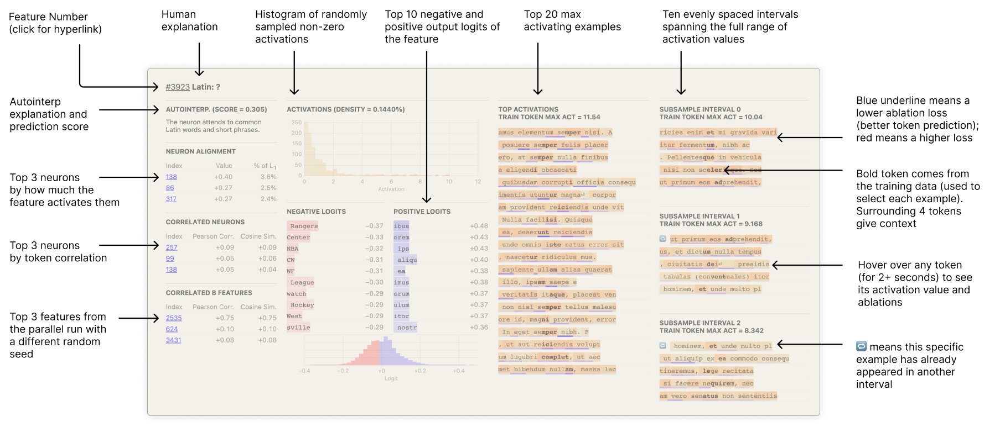

Our interface also allows users to search through features:

我们的界面还允许用户搜索特征：

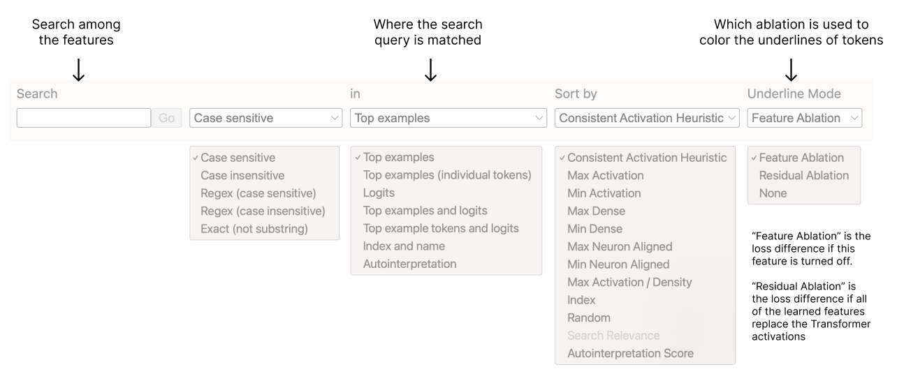

Additionally, we provide a [second ](https://transformer-circuits.pub/2023/monosemantic-features/vis/index.html#example-texts)[interface](https://transformer-circuits.pub/2023/monosemantic-features/vis/index.html#example-texts) displaying all features active on a given dataset example. This is available for a set of example texts.

此外，我们提供了[第二个界面](https://transformer-circuits.pub/2023/monosemantic-features/vis/index.html#example-texts)，显示在给定数据集样例上激活的所有特征。它可用于一组示例文本。

## 对单个特征的详细研究（Detailed Investigations of Individual Features）

The most important claim of our paper is that dictionary learning can extract features that are significantly more monosemantic than neurons. In this section, we give a detailed demonstration of this claim for a small number of features which activate in highly specific contexts.

本文最重要的主张是：字典学习能够提取出比神经元单义得多的特征。在本节中，我们针对少数在高度特定语境中激活的特征，对这一主张给出详细论证。

The features we study respond to

我们研究的特征响应于

- Text written in Arabic script (like "الكتاب المختصر في حساب الجبر والمقابلة")

- 用阿拉伯文书写的文本（如"الكتاب المختصر في حساب الجبر والمقابلة"）

- DNA sequences (like "CCTGGTACTGTACGAACGAACGAACGTAGCCTTGG")

- DNA 序列（如"CCTGGTACTGTACGAACGAACGAACGTAGCCTTGG"）

- base64 strings (like the final characters in "https://www.youtube.com/watch?v=dQw4w9WgXcQ")

- base64 字符串（如"https://www.youtube.com/watch?v=dQw4w9WgXcQ"的最后几个字符）

- Text written in Hebrew script (like "בראשית ברא אלהים את השמים ואת הארץ")

- 用希伯来文书写的文本（如"בראשית ברא אלהים את השמים ואת הארץ"）

For each learned feature, we attempt to establish the following claims:

对于每个学到的特征，我们都试图确立以下主张：

1. The learned feature activates with high specificity for the hypothesized context. (When the feature is on the context is usually present.)

1. 学到的特征对假想语境具有高特异性（specificity）地激活。（特征激活时，该语境通常存在。）

1. The learned feature activates with high sensitivity for the hypothesized context. (When the context is present, the feature is usually on.)

1. 学到的特征对假想语境具有高敏感性（sensitivity）。（该语境存在时，特征通常激活。）

1. The learned feature causes appropriate downstream behavior.

1. 学到的特征引发适当的下游行为。

1. The learned feature does not correspond to any neuron.

1. 学到的特征不对应任何神经元。

1. The learned feature is universal – a similar feature is found by dictionary learning applied to a different model.

1. 学到的特征是普适的——把字典学习应用于另一个模型能找到类似特征。

To demonstrate claims 1–3, we devise computational proxies for each context, numerical scores estimating the (log-)likelihood that a string (or token) is from the specific context. The contexts chosen above are easy to model based on the defined sets of unicode characters involved. We model DNA sequences as random strings of characters from [ATCG] and we model base64 strings as random sequences of characters from [a-zA-Z0-9+/]. For Arabic script and Hebrew features, we exploit the fact that each language is written in a script consisting of well-defined Unicode blocks. Each computational proxy is then an estimate of the log-likelihood ratio of a string under the hypothesis versus under the full empirical distribution of the dataset. The full description of how we estimate \log(P(s|\text{context}) / P(s)) for each feature hypothesis is given in the appendix section on proxies.

为了证明主张 1–3，我们为每个语境设计了计算代理（computational proxies）：估计一个字符串（或词元）来自特定语境的（对数）似然的数值分数。上面选择的语境可以基于所涉 Unicode 字符的确定集合轻松建模。我们把 DNA 序列建模为来自 [ATCG] 的随机字符串，把 base64 字符串建模为来自 [a-zA-Z0-9+/] 的随机序列。对于阿拉伯文字和希伯来特征，我们利用每种语言都用由明确定义的 Unicode 块组成的文字书写这一事实。于是，每个计算代理都是字符串在假说之下的对数似然相对于数据集完整经验分布之下对数似然的比值的估计。关于我们如何为每个特征假说估计 \log(P(s|\text{context}) / P(s)) 的完整描述，见附录中关于代理的部分。

In this section we primarily study the learned feature which is most active in each context. There are typically other features that also model that context, and we find that rare “gaps” in the sensitivity of a main feature are often explained by the activity of another. We discuss this phenomenon in detail in sections on Activation Sensitivity and Feature Splitting.

在本节中，我们主要研究在每个语境中最活跃的学到的特征。通常还有其他特征也在建模该语境，而且我们发现一个主特征的敏感性中罕见的"空隙"往往由另一个特征的活动来解释。我们将在"激活敏感性"和"特征分裂"两节中详细讨论这一现象。

We take pains to demonstrate the specificity of each feature, as we believe that to be more important for ruling out polysemanticity. Polysemanticity typically involves neurons activating for clearly unrelated concepts. [^10] If our proxy shows that a feature only activates in some relatively rare and specific context, that would exclude the typical form of polysemanticity.

我们不遗余力地证明每个特征的特异性，因为我们认为这对排除多义性更为重要。多义性通常表现为神经元对明显不相关的概念激活。[^10] 如果我们的代理显示某特征只在某个相对罕见且特定的语境中激活，那就能排除典型的多义性形式。

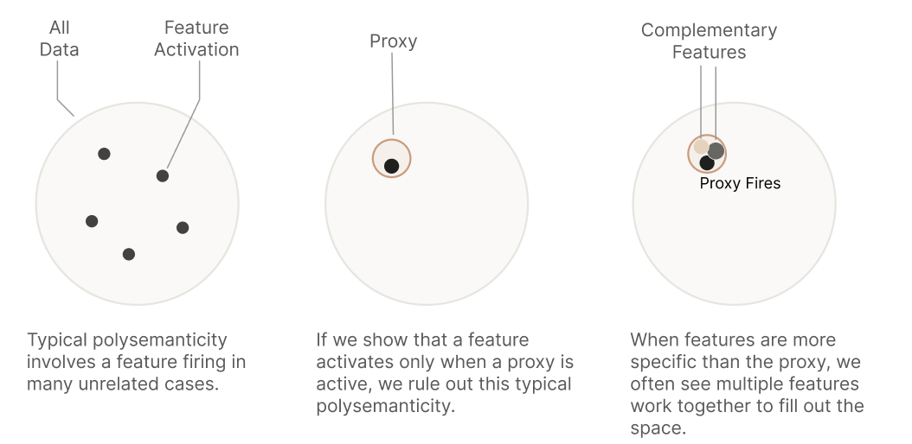

We finally note that the features in this section are cherry-picked to be easier to analyze. Defining simple computational proxies for most features we find, such as text concerning [fantasy games](https://transformer-circuits.pub/2023/monosemantic-features/vis/a1.html?search_target_mode=index_name&search_mode=case_insensitive#feature-129), would be difficult, and we analyze them in other ways in the following section.

最后我们指出，本节的特征是经过挑选、更易于分析的。为我们找到的大多数特征定义简单的计算代理会很困难，例如关于[奇幻游戏](https://transformer-circuits.pub/2023/monosemantic-features/vis/a1.html?search_target_mode=index_name&search_mode=case_insensitive#feature-129)的文本，我们在下一节以其他方式分析它们。

### 阿拉伯文字特征（Arabic Script Feature）

The first feature we'll consider is an Arabic Script feature, [A/1/3450](https://transformer-circuits.pub/2023/monosemantic-features/vis/a1.html#feature-3450). It activates in response to text in Arabic, Farsi, Urdu (and possibly other languages), which use the Arabic script. This feature is quite specific and relatively sensitive to Arabic script, and effectively invisible if we view the model in terms of individual neurons.

我们要考虑的第一个特征是阿拉伯文字特征 [A/1/3450](https://transformer-circuits.pub/2023/monosemantic-features/vis/a1.html#feature-3450)。它对阿拉伯语、波斯语、乌尔都语（可能还有其他语言）等使用阿拉伯文字的文本激活。这个特征相当特异且对阿拉伯文字相对敏感，而如果我们以单个神经元来审视模型，它实际上是不可见的。

#### 激活特异性（Activation Specificity）

Our first step is to show that this feature fires almost exclusively on text in Arabic script. We give each token an "Arabic script" score using an estimated likelihood ratio \log(P(s|\text{Arabic Script}) / P(s)), and break down the histogram of feature activations by that score. Arabic text is quite rare in our overall data distribution –  just 0.13% of training tokens — but it makes up 81% of the tokens on which our feature is active. That percentage varies significantly by feature activity level, from 25% when the feature is barely active to 98% when the feature activation is above 5.

我们的第一步是证明该特征几乎只在阿拉伯文字文本上激活。我们用估计的似然比 \log(P(s|\text{Arabic Script}) / P(s)) 给每个词元一个"阿拉伯文字"分数，并按该分数分解特征激活的直方图。阿拉伯语文本在我们的整体数据分布中相当罕见——仅占训练词元的 0.13%——但它占我们特征激活的词元的 81%。该比例随特征活跃水平显著变化：从特征勉强激活时的 25%，到特征激活值高于 5 时的 98%。

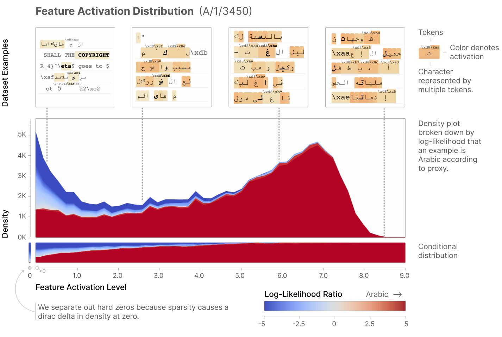

We also show dataset examples demonstrating different levels of feature activity. In interpreting them, it's important to note that Arabic Unicode characters are often split into multiple tokens. For example, the character ث ([U+062B](https://www.compart.com/en/unicode/U+062B)) is tokenized as \xd8 followed by \xab.[^11] When this happens, A/1/3450 typically only fires on the last token of the Unicode character.

我们还展示了体现不同特征活跃程度的数据集样本。解读它们时要注意，阿拉伯 Unicode 字符常被拆分成多个词元。例如，字符 ث（[U+062B](https://www.compart.com/en/unicode/U+062B)）被分词为 \xd8 后跟 \xab。[^11] 当这种情况发生时，A/1/3450 通常只在 Unicode 字符的最后一个词元上激活。

The upper parts of the activation spectrum, above an activity of ~5, clearly respond with high specificity to Arabic script. What should we make of the lower portions? We have three hypotheses:

激活谱中活跃度约 5 以上的较高部分，显然以高特异性响应阿拉伯文字。那么较低的部分呢？我们有三个假说：

- The proxy is imperfect. It has false negatives due to common characters which are in other Unicode blocks (e.g., whitespace, punctuation), and also due to places where tokenization has created strange behavior.[^12]

- 代理并不完美。它有假阴性，原因包括其他 Unicode 块中的常见字符（如空白、标点），以及分词造成奇怪行为的地方。[^12]

- The model may be imperfect (but still calibrated). If features activate proportional to their "confidence" that some property is present, then we should expect them to sometimes be wrong in their weak activations. Although it might seem silly to fail to recognize which language a piece of text is, this is a very weak one layer transformer model, and the fact that characters are often split into multiple tokens adds additional difficulty.

- 模型可能不完美（但仍有校准性）。如果特征按其对某性质存在的"置信度"成比例激活，那么我们应该预期它们在弱激活时有时会出错。虽然识别不出一段文本是什么语言看起来很蠢，但这是一个非常弱的单层 Transformer 模型，而且字符常被拆成多个词元也增加了额外的难度。

- The autoencoder may be imperfect: If the width of our autoencoder is less than the number of "true features" being used by the model, then unrecovered features may show up as low activations across many of our learned features.

- 自编码器可能不完美：如果自编码器的宽度小于模型所使用的"真实特征"数量，那么未被恢复的特征可能表现为我们许多学到的特征上的低激活。

Regardless, large feature activations have larger impacts on model predictions,[^13] so getting their interpretation right matters most. One useful tool for assessing the impact of false positives at low activation levels is the "expected value plot" of Cammarata et al. . We plot the distribution of feature activations weighted by activation level. Most of the magnitude of activation provided by this feature comes from dataset examples which are in Arabic script.

无论如何，大的特征激活对模型预测有更大的影响，[^13] 因此正确解释它们最为重要。评估低激活水平下假阳性影响的一个有用工具是 Cammarata 等人的"期望值图"（expected value plot）。我们绘制按激活水平加权的特征激活分布。该特征提供的激活量的大部分来自阿拉伯文字的数据集样本。

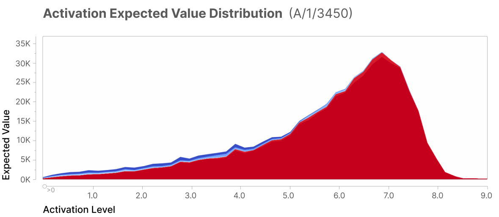

#### 激活敏感性（Activation Sensitivity）

In the Feature Activation Distribution above, it's clear that A/1/3450 is not sensitive to all tokens in Arabic script. In the random dataset examples, it fails to fire on five examples of the prefix "ال", transliterated as "al-", which is the equivalent of the definite article "the" in English. However, in exactly those places, another feature which is specific to Arabic script, [A/1/3134](https://transformer-circuits.pub/2023/monosemantic-features/vis/a1.html#feature-3134), fires. There are several additional features that fire on Arabic and related scripts (e.g. [A/1/1466](https://transformer-circuits.pub/2023/monosemantic-features/vis/a1.html#feature-1466), [A/1/3134](https://transformer-circuits.pub/2023/monosemantic-features/vis/a1.html#feature-3134), [A/1/3399](https://transformer-circuits.pub/2023/monosemantic-features/vis/a1.html#feature-3399)) which contribute to representing Arabic script. Another example deals with Unicode tokenization: when Arabic characters are split into multiple tokens, the feature we analyze here only activates at the final token comprising the character, while [A/1/3399](https://transformer-circuits.pub/2023/monosemantic-features/vis/a1.html#feature-3399) activates on the first token comprising the character.  To see how these features collaborate, we provide an [alternative visualization](https://transformer-circuits.pub/2023/monosemantic-features/vis/a1-ar.html) showing all the features active on a snippet of Arabic text. We consider such interactions more in the Phenomenology section below.

在上面的特征激活分布中，很明显 A/1/3450 对阿拉伯文字的所有词元并不都敏感。在随机数据集样本中，它未在前缀"ال"（转写为"al-"，相当于英语中的定冠词"the"）的五个样本上激活。然而，恰好在那些位置上，另一个对阿拉伯文字特异的特征 [A/1/3134](https://transformer-circuits.pub/2023/monosemantic-features/vis/a1.html#feature-3134) 激活了。还有若干额外的特征在阿拉伯语及相关文字上激活（例如 [A/1/1466](https://transformer-circuits.pub/2023/monosemantic-features/vis/a1.html#feature-1466)、[A/1/3134](https://transformer-circuits.pub/2023/monosemantic-features/vis/a1.html#feature-3134)、[A/1/3399](https://transformer-circuits.pub/2023/monosemantic-features/vis/a1.html#feature-3399)），它们共同参与表示阿拉伯文字。另一个例子涉及 Unicode 分词：当阿拉伯字符被拆分成多个词元时，我们在此分析的特征只在组成该字符的最后一个词元上激活，而 [A/1/3399](https://transformer-circuits.pub/2023/monosemantic-features/vis/a1.html#feature-3399) 在组成该字符的第一个词元上激活。为了看这些特征如何协作，我们提供了一个[替代可视化](https://transformer-circuits.pub/2023/monosemantic-features/vis/a1-ar.html)，展示一段阿拉伯语文本片段上激活的所有特征。我们将在下文的现象学部分进一步讨论这类交互。

Nevertheless, we find a Pearson correlation of 0.74 between the activity of our feature and the activity of the Arabic script proxy (thresholded at 0), over a dataset of 40 million tokens. Correlation provides a joint measure of sensitivity and specificity that takes magnitude into account, and 0.74 is a substantial correlation.

尽管如此，在 4000 万词元的数据集上，我们发现该特征的活跃度与阿拉伯文字代理的活跃度（阈值为 0）之间的 Pearson 相关为 0.74。相关性同时衡量了敏感性与特异性并考虑了幅值，0.74 是相当可观的相关。
#### 特征的下游效应（Feature Downstream Effects）

Because the autoencoder is trained on model activations, the features it learns could in theory represent structure in the training data alone, without any relevance to the network’s function. We show instead that the learned features have interpretable causal effects on model outputs which make sense in light of the features’ activations. Note that these downstream effects are not inputs to the dictionary learning process, which only sees the activations of the MLP layer. If the resulting features also mediate important downstream behavioral effects then we can be confident that the feature is truly connected to the MLP’s functional role in the network and not just a property of the underlying data.

由于自编码器是在模型激活上训练的，它学到的特征理论上可能只表示训练数据中的结构，而与网络的功能无关。我们则要证明：学到的特征对模型输出有可解释的因果效应（causal intervention 的表现），且这些效应与特征的激活相符。注意，这些下游效应并不是字典学习过程的输入，字典学习只看到 MLP 层的激活。如果得到的特征还介导了重要的下游行为效应，那么我们就能确信该特征真正连接到 MLP 在网络中的功能角色，而不只是底层数据的一个属性。

We begin with a linear approximation to the effect of each feature on the model logits. We compute the logit weight following the path expansion approach of , [^14] multiplying each feature direction by the MLP output weights, an approximation of the layer norm operation combining a projection to remove the mean and a diagonal matrix approximating the scaling terms, and the unembedding matrix (d_iW_{down}\pi L W_{unembed}). Because the softmax function is shift-invariant there is no absolute scale for the logit weights; we shift these so that the median logit weight for each feature is zero.

我们先从每个特征对模型 logit 影响的线性近似开始。我们按照路径展开（path expansion）方法计算 logit 权重，[^14] 将每个特征方向乘以 MLP 输出权重，乘以层范数操作的近似（结合一个去除均值的投影和一个近似缩放项的对角矩阵），再乘以 unembedding 矩阵（d_iW_{down}\pi L W_{unembed}）。因为 softmax 函数是平移不变的，logit 权重没有绝对尺度；我们对其进行平移，使每个特征的 logit 权重中位数为零。

Each feature, when active, makes some output tokens more likely and some output tokens less likely. We plot that distribution of logit weights.[^15] There is a large primary mode at zero, and a second much smaller mode on the far right, the tokens whose likelihood most increases when our feature is on. This second mode appears to correspond to Arabic characters, and tokens which help represent Arabic script characters (especially \xd8 and \xd9, which are often the first half of the UTF-8 encodings of Arabic Unicode characters in the [basic Arabic Unicode block](https://www.compart.com/en/unicode/block/U+0600)).

每个特征激活时会使一些输出词元更可能出现、另一些更不可能出现。我们绘制了 logit 权重的分布。[^15] 零点附近有一个大的主峰，极右侧还有一个远小得多的第二峰，即当特征激活时似然增加最多的词元。这第二峰似乎对应阿拉伯文字字符，以及帮助表示阿拉伯文字字符的词元（尤其是 \xd8 和 \xd9，它们通常是[基本阿拉伯 Unicode 块](https://www.compart.com/en/unicode/block/U+0600)中阿拉伯 Unicode 字符 UTF-8 编码的前一半）。

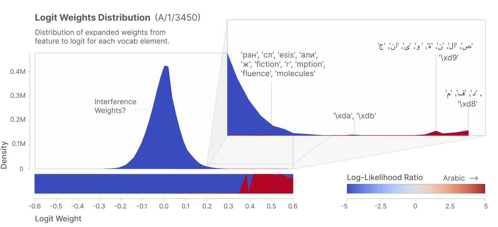

This suggests that activating this feature increases the probability the network predicts Arabic script tokens.[^16]

这表明激活（clamping 式干预的一种）该特征会增加网络预测阿拉伯文字词元的概率。[^16]

To visualize these effects on actual data, we causally ablate the feature. For a given dataset example, we run the context through the model until the MLP layer, decode the activations into features, then subtract off the activation of [A/1/3450](https://transformer-circuits.pub/2023/monosemantic-features/vis/a1.html#feature-3450), artificially setting it to zero on the whole context, before applying the rest of the model. We visualize the effect of ablating the feature using underlines in the visualization; tokens whose predictions were helped by the feature (ablation decreased likelihood) are underlined in blue and tokens whose predictions were hurt by the feature (ablation increased likelihood) are underlined in red.

为了在真实数据上可视化这些效应，我们对该特征进行因果消融。对于给定的数据集样本，我们把上下文输入模型直到 MLP 层，把激活解码成特征，然后减去 [A/1/3450](https://transformer-circuits.pub/2023/monosemantic-features/vis/a1.html#feature-3450) 的激活——在整个上下文上人为将其置零——再应用模型的其余部分。我们在可视化中用下划线展示消融该特征的效应：预测曾被该特征帮助的词元（消融降低了似然）标蓝色下划线，预测曾被该特征损害的词元（消融提高了似然）标红色下划线。

In the example on the right below we see that the [A/1/3450](https://transformer-circuits.pub/2023/monosemantic-features/vis/a1.html#feature-3450) was active on every token in a short context (orange background). Ablating it hurt the predictions of all the tokens in Arabic script (purple underlines), but helped the prediction of the period . (orange underline). The rest of the figure displays contexts from two different ranges of feature activation levels. (The feature activation on the middle token of examples on the right ("subsample interval 5") is about half that of the middle token of examples on the left ("subsample interval 0")). We see that the feature was causally helping the model predictions on Arabic script through that full range, and the only tokens made less likely by the feature are punctuation shared with other scripts. The magnitudes of the impact are larger when the feature is more active.

在下方的右侧示例中，我们看到 [A/1/3450](https://transformer-circuits.pub/2023/monosemantic-features/vis/a1.html#feature-3450) 在一个短上下文的每个词元上都处于活跃状态（橙色背景）。消融它损害了所有阿拉伯文字词元的预测（紫色下划线），但帮助了对句点 . 的预测（橙色下划线）。图的其余部分展示了来自两个不同特征激活水平区间的上下文。（右侧示例（"subsample interval 5"）中间词元上的特征激活大约是左侧示例（"subsample interval 0"）中间词元的一半。）我们看到，在整个区间内该特征都在因果地帮助模型对阿拉伯文字的预测，而唯一被特征降低可能性的词元是与其他文字共享的标点。特征越活跃，影响的幅度越大。

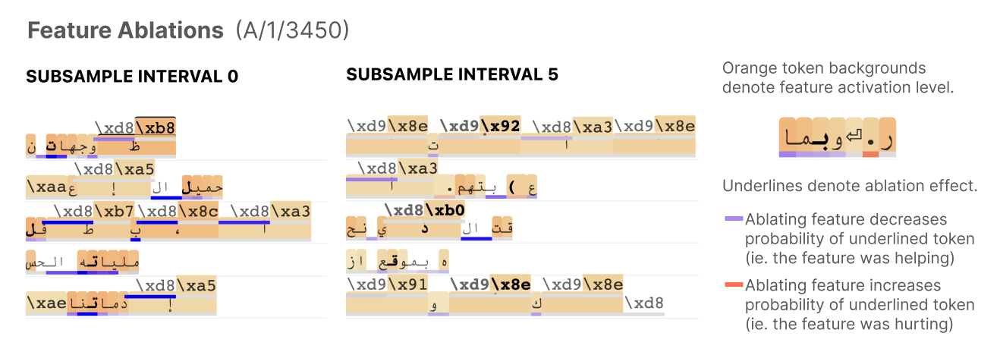

We encourage interested readers to view the feature visualization for [A/1](https://transformer-circuits.pub/2023/monosemantic-features/vis/a1.html) to review this and other effects.

我们鼓励有兴趣的读者查看 [A/1](https://transformer-circuits.pub/2023/monosemantic-features/vis/a1.html) 的特征可视化，以回顾此效应及其他效应。

We also validate that the feature's downstream effect is in line with our interpretation as an Arabic script feature by sampling from the model with the feature activity "pinned" at a high value. To do this, we start with a prefix 1,2,3,4,5,6,7,8,9,10 where the model has an expected continuation (keep in mind that this is a one layer model that is very weak!). We then instead set [A/1/3450](https://transformer-circuits.pub/2023/monosemantic-features/vis/a1.html#feature-3450) to its maximum observed value and see how that changes the samples:

我们还通过将特征活跃度"钉定"（pinned）在一个高值并从模型采样，来验证该特征的下游效应与我们作为阿拉伯文字特征的解释一致。为此，我们从 1,2,3,4,5,6,7,8,9,10 的前缀开始，模型对此有一个预期的续写（请记住，这是一个非常弱的单层模型！）。然后我们把 [A/1/3450](https://transformer-circuits.pub/2023/monosemantic-features/vis/a1.html#feature-3450) 设为其观测到的最大值，看看这会如何改变采样结果：

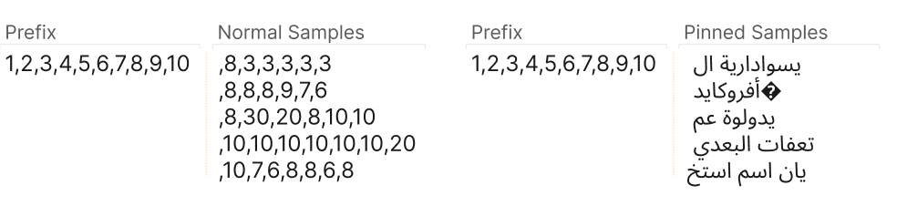

#### 该特征不是一个神经元（The feature is not a neuron）

This feature seems rather monosemantic, but some models have relatively monosemantic neurons, and we want to check that dictionary learning didn't merely hand us a particularly nice neuron.[^17] We first note that when we [search](https://transformer-circuits.pub/2023/monosemantic-features/vis/a-neurons.html?search_mode=regex_case_sensitive&ordering=count&search_text=%5B%5Cu0600-%5Cu06FF%5D+) for neurons with Arabic script in their top dataset 20 examples, only one neuron turns up, with a single example in Arabic script. (Eighteen of the remaining examples are in English, and one is in Cyrillic.)

这个特征看起来相当单义，但有些模型拥有相对单义的神经元，我们想确认字典学习不只是递给我们一个特别漂亮的神经元。[^17] 我们首先注意到，当我们[搜索](https://transformer-circuits.pub/2023/monosemantic-features/vis/a-neurons.html?search_mode=regex_case_sensitive&ordering=count&search_text=%5B%5Cu0600-%5Cu06FF%5D+) top 数据集 20 样本中含有阿拉伯文字的神经元时，只出现了一个神经元，且只有一个样本是阿拉伯文字。（其余样本中 18 个是英语，一个是西里尔文。）

We then look at the coefficients of the feature in the neuron basis, and find that the three largest coefficients by magnitude are all negative (!) and there are a full 27 neurons whose coefficients are at least 0.1 in magnitude.

然后我们查看该特征在神经元基下的系数，发现按幅值计最大的三个系数全是负的（!），并且有多达 27 个神经元的系数幅值至少为 0.1。

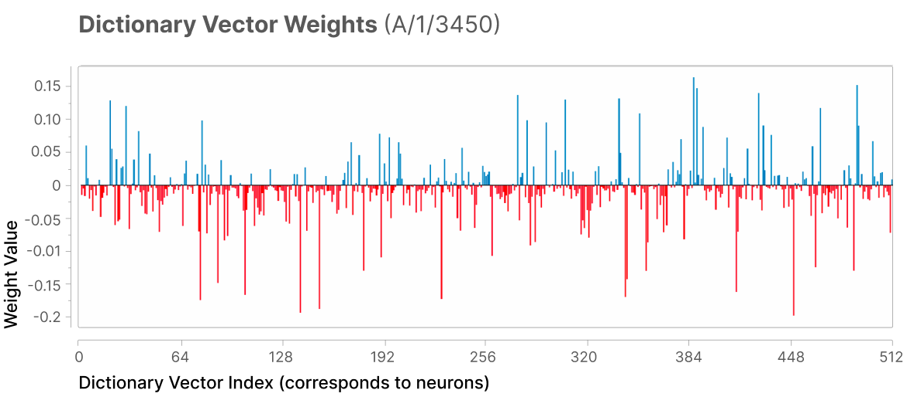

It is of course possible that these neurons engage in a delicate game of cancellation, resulting in one particular neuron's primary activations being sharpened. To check for this, we find the neuron whose activations are most correlated to the feature's activations over a set of ~40 million dataset examples. [^18] The most correlated neuron ([A/neurons/489](https://transformer-circuits.pub/2023/monosemantic-features/vis/a-neurons.html#feature-489)) responds to a mixture of different non-English languages.[^19] We can see this by visualizing the activation distribution of the neuron – the dataset examples are all other languages, with Arabic script present only as a small sliver.

当然，这些神经元有可能在玩一场微妙的抵消游戏，使得某个特定神经元的主要激活被锐化。为检查这一点，我们在约 4000 万数据集样本上找到激活与该特征激活最相关的神经元。[^18] 最相关的神经元（[A/neurons/489](https://transformer-circuits.pub/2023/monosemantic-features/vis/a-neurons.html#feature-489)）响应的是不同非英语语言的混合。[^19] 我们可以通过可视化该神经元的激活分布看到这一点——数据集样本全是其他语言，阿拉伯文字只占很小一条。

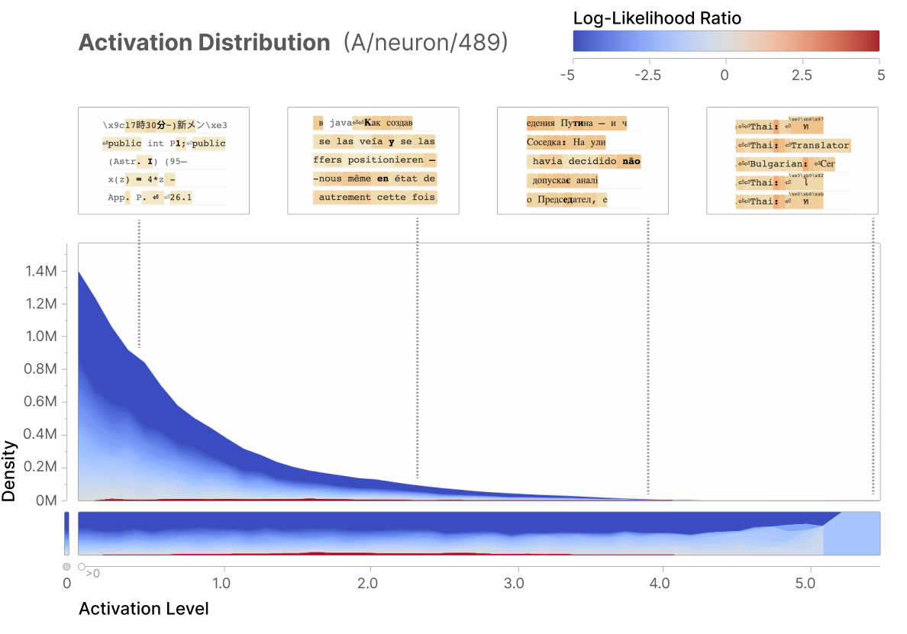

Logit weight analysis is also consistent with this neuron responding to a mixture of languages. For example, in the figure below many of the top logit weights appear to include Russian and Korean tokens. Careful readers will observe a thin red sliver corresponding to rare Arabic script tokens in the distribution. These Arabic script tokens have weight values that are very slightly positive leaning overall, but some are negative.

logit 权重分析也与"该神经元响应多种语言的混合"相一致。例如，在下图中，许多 top logit 权重似乎包含俄语和韩语词元。细心的读者会观察到分布中有一条对应稀有阿拉伯文字词元的细红条。这些阿拉伯文字词元的权重值总体上略为正偏，但有些是负的。

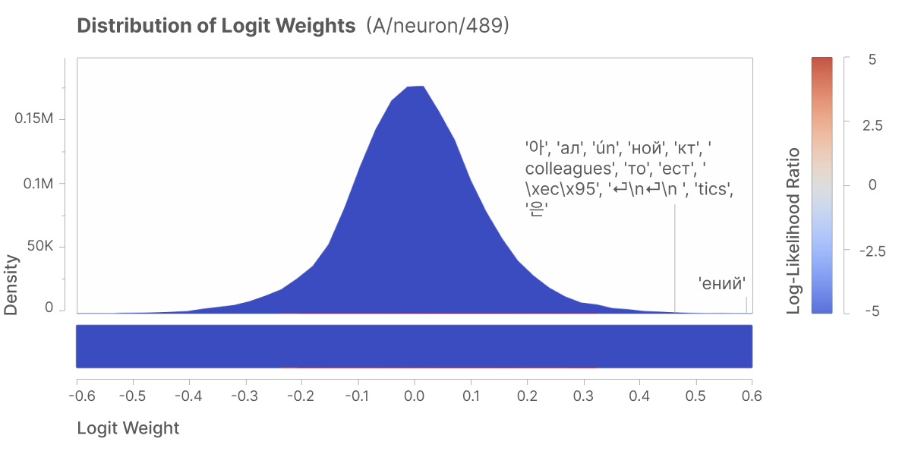

Finally, scatter plots and correlations suggest the similarities between [A/1/3450](https://transformer-circuits.pub/2023/monosemantic-features/vis/a1.html#feature-3450) and the neuron are non-zero, but quite minimal.[^20] In particular, note how the y-axis of the logit weights scatter plot (corresponding to the feature) cleanly separates the Arabic script token logits, while the x-axis does not. More generally, note how the y-marginals both clearly exhibit specificity, but the x-marginals do not.

最后，散点图和相关性表明 [A/1/3450](https://transformer-circuits.pub/2023/monosemantic-features/vis/a1.html#feature-3450) 与该神经元之间的相似性非零，但相当小。[^20] 特别注意 logit 权重散点图的 y 轴（对应特征）干净地把阿拉伯文字词元的 logit 分开，而 x 轴做不到。更一般地，注意两个 y 边缘分布都清晰表现出特异性，而 x 边缘分布则不然。

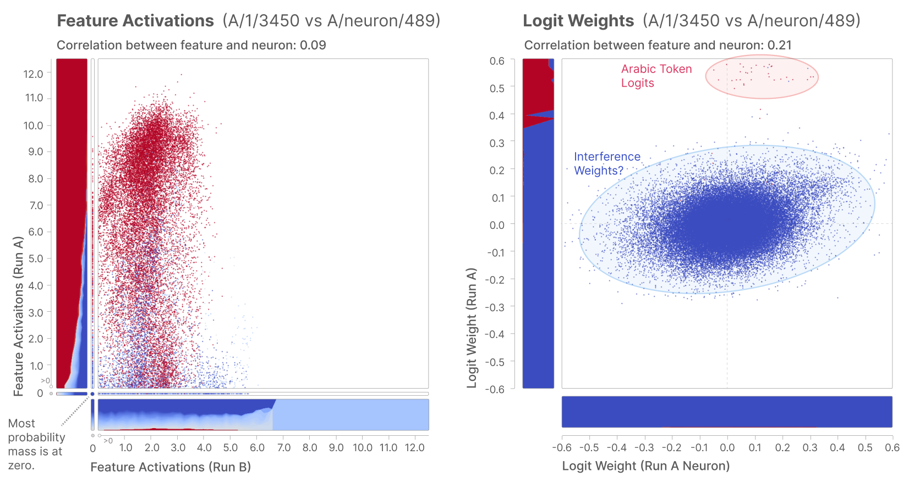

We conclude that the features we study do not trivially correspond to a single neuron. The Arabic script feature would be effectively invisible if we only analyzed the model in terms of neurons.

我们得出结论：我们研究的特征并非轻易就能对应到单个神经元。如果我们只以神经元来分析模型，这个阿拉伯文字特征实际上是不可见的。

#### 普适性（Universality）

We will now ask whether A/1/3450 is a universal feature that forms in other models and can be consistently discovered by dictionary learning. This would indicate we are discovering something more general about how one-layer transformers learn representations of the dataset.

我们现在要问：A/1/3450 是否是一个普适（universal）特征——在其他模型中形成、并且能被字典学习一致地发现？这将表明我们正在发现关于单层 Transformer 如何学习数据集表示的某种更一般的东西。

We search for a similar feature in [B/1](https://transformer-circuits.pub/2023/monosemantic-features/vis/b1.html), a dictionary learning run on a transformer trained on the same dataset but with a different random seed. We search for the feature with the highest activation correlation [^21] and find [B/1/1334](https://transformer-circuits.pub/2023/monosemantic-features/vis/b1.html#feature-1334) (corr=0.91), which is strikingly similar:

我们在 [B/1](https://transformer-circuits.pub/2023/monosemantic-features/vis/b1.html) 中搜索类似特征，它是在相同数据集上训练、但随机种子不同的 Transformer 上做的字典学习运行。我们搜索激活相关性[^21]最高的特征，找到 [B/1/1334](https://transformer-circuits.pub/2023/monosemantic-features/vis/b1.html#feature-1334)（corr=0.91），它惊人地相似：

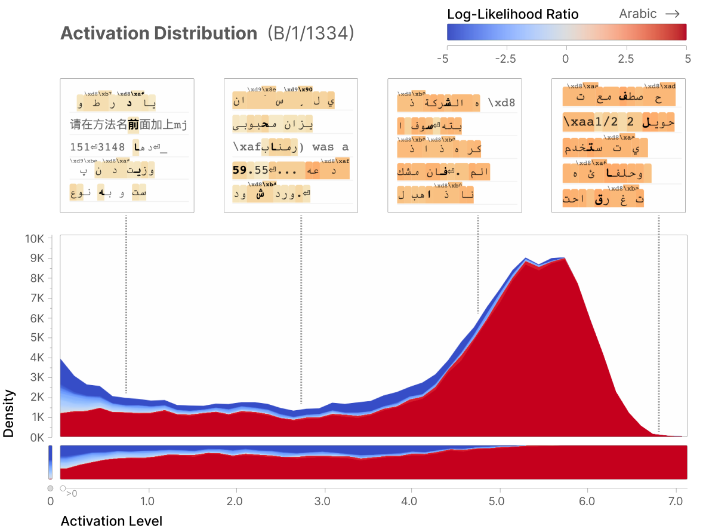

This feature clearly responds to Arabic script as well. If anything, it's nicer than our original feature – it's more specific in the 0–1 range. The logit weights tell a similar story:

这个特征同样明显响应阿拉伯文字。甚至可以说它比我们原本的特征更好——它在 0–1 区间内更具特异性。logit 权重也讲了一个类似的故事：

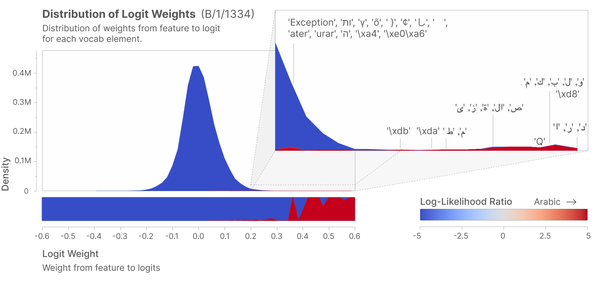

The effects of ablating this feature are also consistent with this (see the visualization for [B/1/1334](https://transformer-circuits.pub/2023/monosemantic-features/vis/b1.html#feature-1334)).

消融该特征的效应也与之一致（见 [B/1/1334](https://transformer-circuits.pub/2023/monosemantic-features/vis/b1.html#feature-1334) 的可视化）。

To more systematically analyze the similarities between A and B, we look at scatter plots comparing the activations or logit weights:

为了更系统地分析 A 与 B 之间的相似性，我们查看比较激活或 logit 权重的散点图：

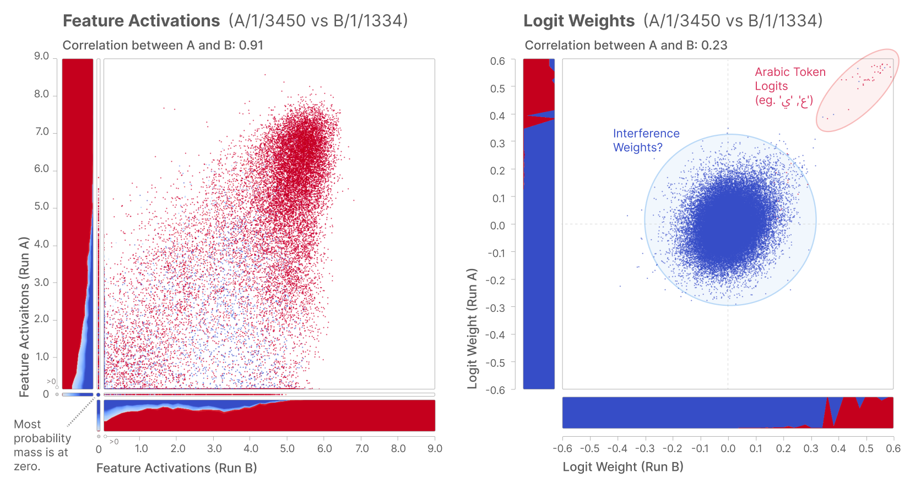

The activations are strongly correlated (Pearson correlation of 0.91), especially in the main Arabic mode.

激活高度相关（Pearson 相关 0.91），尤其是在主阿拉伯峰处。

The logit weights reveal a two-dimensional version of the bimodality we saw in the histogram for A/1, with logit weights for Arabic tokens clustering at the top right. The correlation is more modest than that of the activations because the distribution is dominated by a relatively uncorrelated mode in the center. We hypothesize this central mode corresponds to "weight interference" and that the shared outlier mode is the important observation – that is, the model may ideally prefer to have all those weights be zero, but due to superposition with other features and their weights, this isn't possible.

logit 权重揭示了我们在 A/1 直方图中看到的双峰性的二维版本，阿拉伯词元的 logit 权重聚在右上角。相关性比激活的相关性更温和，因为分布由中心一个相对不相关的峰主导。我们假设这个中心峰对应"权重干扰"（weight interference），而共享的离群峰才是重要的观察点——也就是说，模型理想上可能希望所有这些权重为零，但由于与其他特征及其权重的叠加，这不可能实现。

### DNA 特征（DNA Feature）

We now consider a DNA feature, [A/1/2937](https://transformer-circuits.pub/2023/monosemantic-features/vis/a1.html#feature-2937). It activates in response to long uppercase strings consisting of A, T, C, and G, typically used to represent nucleotide sequences. We closely follow the analysis of the Arabic script feature above to show activation specificity and sensitivity for the feature, sensible downstream effects, a lack of neuron alignment, and universality between models. The main differences will be that (1)  [A/1/2937](https://transformer-circuits.pub/2023/monosemantic-features/vis/a1.html#feature-2937) is the only feature devoted to modeling the DNA context, and (2) our proxy is less sensitive to DNA than our feature is, missing strings containing punctuation, spaces, and missing bases.

现在考虑一个 DNA 特征 [A/1/2937](https://transformer-circuits.pub/2023/monosemantic-features/vis/a1.html#feature-2937)。它对由 A、T、C、G 组成的长的大写字符串激活，这些字符串通常用于表示核苷酸序列。我们紧循上文对阿拉伯文字特征的分析，展示该特征的激活特异性与敏感性、合理的下游效应、与神经元缺乏对齐，以及模型间的普适性。主要区别在于：(1) [A/1/2937](https://transformer-circuits.pub/2023/monosemantic-features/vis/a1.html#feature-2937) 是唯一专注于建模 DNA 语境的特征；(2) 我们的代理对 DNA 的敏感性低于特征本身，会漏掉含标点、空格和缺失碱基的字符串。

#### 激活的特异性与敏感性（Activation Specificity and Sensitivity）

We begin with the computational proxy for "is a DNA sequence", \log(P(s|\text{DNA}) / P(s)). Because there are some vocabulary tokens, such as CAT, which could occur in DNA but also occur in other contexts, we always look at groups of at least two tokens when evaluating the proxy. The log-probabilities turn out to be quite bimodal, so we binarize the proxy (based on its sign). This binarized proxy then has a Pearson correlation of 0.8 with the feature activations.

我们从"是 DNA 序列"的计算代理 \log(P(s|\text{DNA}) / P(s)) 开始。由于有一些词汇表词元（如 CAT）既可能出现在 DNA 中也可能出现在其他语境中，我们在评估代理时总是看至少两个词元的组合。对数概率结果相当双峰，因此我们（按其符号）将代理二值化。这个二值化代理与特征激活的 Pearson 相关为 0.8。

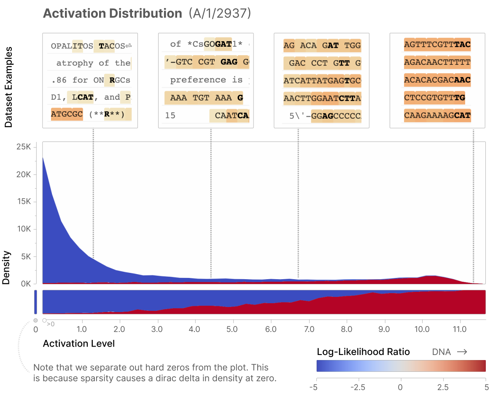

While the feature appears to be quite monosemantic in the feature's higher registers (all 10 random dataset examples above activation of 6.0 are DNA sequences), there is significant blue indicating the DNA proxy not firing in the lower registers. Below we show a grid of random examples at four activation levels (including feature off) where the proxy does and doesn't fire.

虽然该特征在其较高区段显得相当单义（激活 6.0 以上的全部 10 个随机数据集样本都是 DNA 序列），但较低区段中存在大量蓝色，表示 DNA 代理未激活。下面我们展示四个激活水平（包括特征关闭）上、代理激活与未激活的随机样本网格。

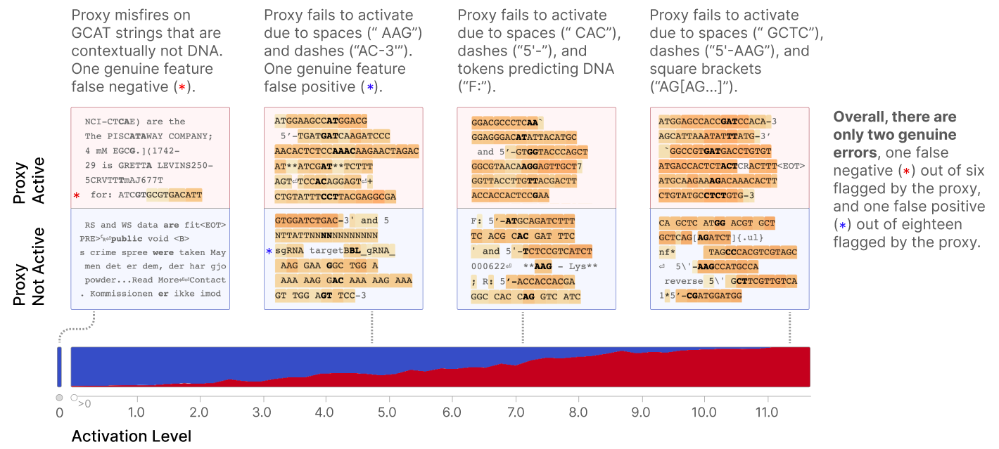

We note that in all but two cases where the feature and proxy disagree, the feature does indicate a DNA sequence, just one outside our proxy's strict ATCG vocabulary. For example, the space present in the triplets TGG AGT makes the proxy fail to fire. The feature also fires productively on '- in the string 5'-TCT, because what follows that prefix should be DNA, even though the prefix is not itself DNA. (The causal ablation reveals that turning off the DNA feature hurts the prediction of the strings that follow.) We thus believe that [A/1/2937](https://transformer-circuits.pub/2023/monosemantic-features/vis/a1.html#feature-2937) is quite sensitive and specific for DNA. The case where the proxy fires and the feature does not is indeed a DNA sequence, though the feature begins firing on the very next token. We observe that the DNA feature may not fire on the first few tokens of a DNA sequence, [but by the end of a long DNA sequence](https://transformer-circuits.pub/2023/monosemantic-features/vis/a1-dna.html), it is the only feature active.

我们注意到，在特征与代理不一致的所有案例中除两个以外，特征确实指示了一个 DNA 序列，只是超出了我们代理严格的 ATCG 词汇范围。例如，三联体 TGG AGT 中的空格使代理未能激活。该特征还在字符串 5'-TCT 中的 '- 上有效激活，因为该前缀之后应当是 DNA，即便前缀本身不是 DNA。（因果消融显示，关闭 DNA 特征损害了对后续字符串的预测。）因此我们相信 [A/1/2937](https://transformer-circuits.pub/2023/monosemantic-features/vis/a1.html#feature-2937) 对 DNA 相当敏感且特异。代理激活而特征未激活的那一例确实是 DNA 序列，只是特征在紧接着的下一个词元上才开始激活。我们观察到，DNA 特征可能不会在 DNA 序列的头几个词元上激活，[但到一条长 DNA 序列的末尾](https://transformer-circuits.pub/2023/monosemantic-features/vis/a1-dna.html)，它是唯一激活的特征。

#### 特征的下游效应（Feature Downstream Effect）

The downstream effect of the DNA feature being active, as measured by logit weights, make sense, with all the top tokens being combinations of nucleotides like AGT and GCC.

以 logit 权重衡量，DNA 特征激活的下游效应是合理的：所有 top 词元都是核苷酸组合，如 AGT 和 GCC。

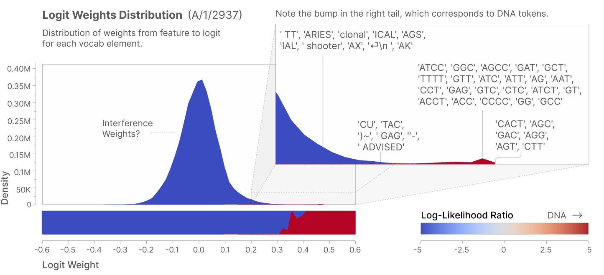

#### 该特征不是一个神经元（The Feature Is Not A Neuron）

The most similar neuron to [A/1/2937](https://transformer-circuits.pub/2023/monosemantic-features/vis/a1.html#feature-2937), as measured by activation correlation, is [A/neurons/67](https://transformer-circuits.pub/2023/monosemantic-features/vis/a-neurons.html#feature-67). DNA contexts form a tiny sliver of that neuron's activating examples. The neuron whose coefficient is the highest in our feature's vector, [A/neurons/227](https://transformer-circuits.pub/2023/monosemantic-features/vis/a-neurons.html#feature-227), also has no DNA sequences in its top activating examples.

以激活相关性衡量，与 [A/1/2937](https://transformer-circuits.pub/2023/monosemantic-features/vis/a1.html#feature-2937) 最相似的神经元是 [A/neurons/67](https://transformer-circuits.pub/2023/monosemantic-features/vis/a-neurons.html#feature-67)。DNA 语境只占该神经元激活样本的极小一条。在我们特征的向量中系数最高的神经元 [A/neurons/227](https://transformer-circuits.pub/2023/monosemantic-features/vis/a-neurons.html#feature-227)，其 top 激活样本中同样没有 DNA 序列。

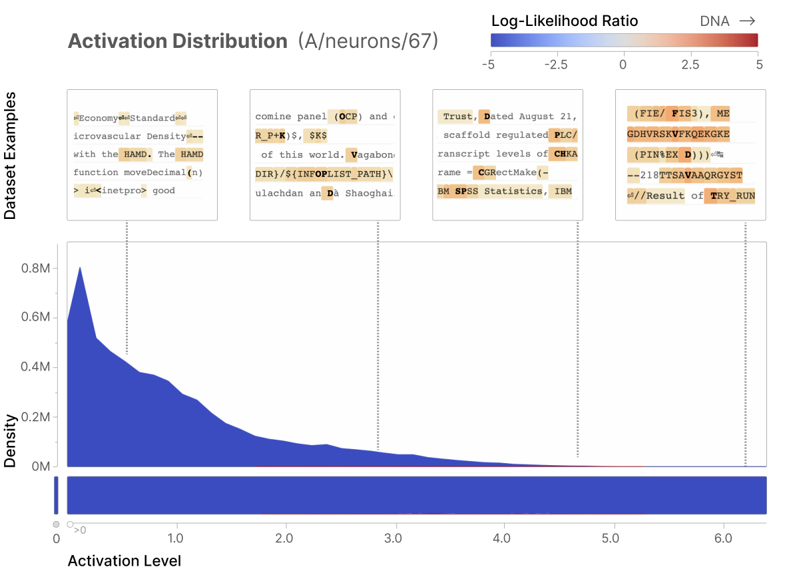

#### 普适性（Universality）

[A/1/2937](https://transformer-circuits.pub/2023/monosemantic-features/vis/a1.html#feature-2937) has a correlated feature (corr=0.92) in run B/1, [B/1/3680](https://transformer-circuits.pub/2023/monosemantic-features/vis/b1.html#feature-3680). Their top logit weights agree, and are DNA tokens (e.g. AGT) forming a separate mode (circled on the right) than the bulk of the logit weights for both.

[A/1/2937](https://transformer-circuits.pub/2023/monosemantic-features/vis/a1.html#feature-2937) 在运行 B/1 中有一个相关特征（corr=0.92）[B/1/3680](https://transformer-circuits.pub/2023/monosemantic-features/vis/b1.html#feature-3680)。它们的 top logit 权重一致，都是 DNA 词元（如 AGT），构成一个区别于两者其余 logit 权重的独立峰（右图中圈出）。

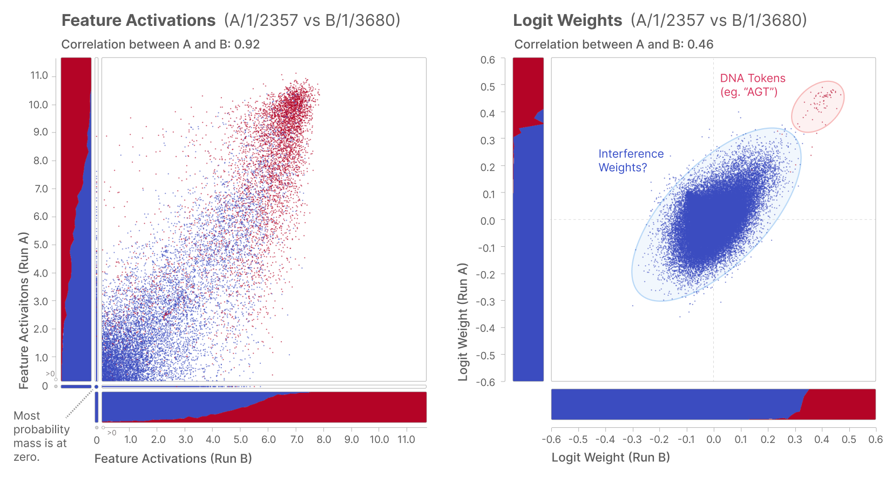
### base64 特征（Base64 Feature）

We now consider a [base64](https://en.wikipedia.org/wiki/Base64) feature, [A/1/2357](https://transformer-circuits.pub/2023/monosemantic-features/vis/a1.html#feature-2357). We're particularly excited by this feature because we discovered a base64 neuron in our SoLU paper , suggesting that base64 might be quite universal – even across models trained on somewhat different datasets and with different architectures. We model base64 strings as random sequences of characters from [a-zA-Z0-9+/]. The activation distribution colored by the corresponding computational proxy, together with the random dataset examples from each activation level, shows that this feature is quite specific to base64.

现在考虑一个 [base64](https://en.wikipedia.org/wiki/Base64) 特征 [A/1/2357](https://transformer-circuits.pub/2023/monosemantic-features/vis/a1.html#feature-2357)。我们对该特征特别兴奋，因为我们在 SoLU 论文中发现过一个 base64 神经元，这暗示 base64 可能相当普适——甚至在训练数据集和架构都有些不同的模型之间也是如此。我们把 base64 字符串建模为来自 [a-zA-Z0-9+/] 的随机序列。由相应计算代理着色的激活分布，连同每个激活水平的随机数据集样本，表明该特征对 base64 相当特异。

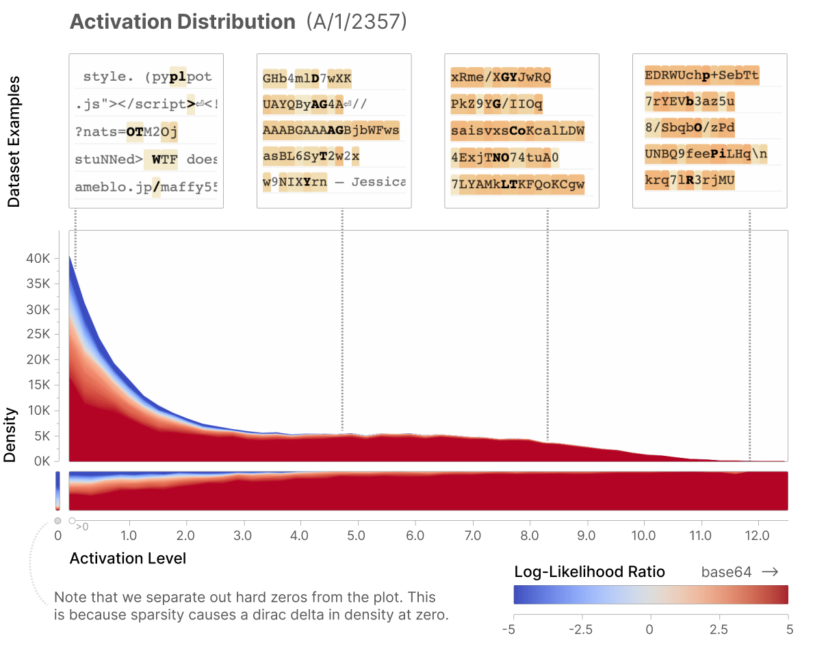

This is not the only feature active in base64 contexts, and in a section below we discuss the two others, one of which fires on single digits in base64 contexts (like the 2, 4, 7, and 9 on which A/1/2357 doesn't activate in the figure above), exploiting a property of the BPE tokenizer to make a better prediction.

这并不是 base64 语境中唯一激活的特征。在下文的一节中我们会讨论另外两个特征，其中一个在 base64 语境中的单个数字上激活（如上图中 A/1/2357 未激活的 2、4、7 和 9），并利用 BPE 分词器的一个性质做出更好的预测。

Turning to the logit weights, they have a second mode consisting of highly base64-specific tokens. The main mode seems to primarily be interference, but the right side is skewed towards base64-neutral or slightly base64-leaning tokens. (If we look at the conditional below, we see a more continuous transition to base64-specific tokens.)

转向 logit 权重，它们有一个由高度 base64 特异词元组成的第二峰。主峰似乎主要是干扰，但右侧偏向 base64 中性或略偏 base64 的词元。（如果看下面的条件分布，会看到向 base64 特异词元的更连续的过渡。）

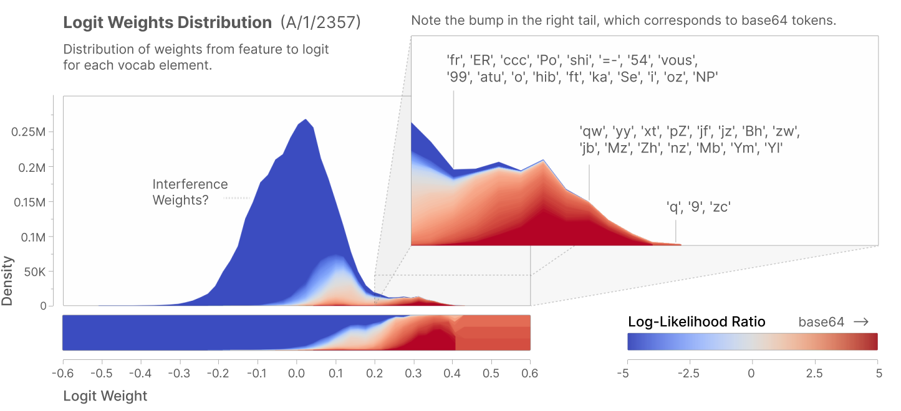

There is a more continuous transition between non-base64 and base64 tokens than we saw in the Arabic script example. This difference likely arises because whether a token occurs more in Arabic script than in other text is a relatively binary distinction, whereas whether a token occurs more in base64 or other text varies more continuously. For instance, fr is both a common abbreviation for the French language and also a base64 token, so it makes sense for the model to be cautious in up-weighting fr because it might already have a higher prior due to use in French. Indeed, any token consisting of letters from the English alphabet will have some nontrivial probability of appearing in base64 strings.

非 base64 词元与 base64 词元之间存在比阿拉伯文字示例中更连续的过渡。这一差异很可能源于：一个词元是否更多出现在阿拉伯文字而非其他文本中，是相对二元的区分；而一个词元是否更多出现在 base64 还是其他文本中，其变化则更连续。例如，fr 既是法语（French）的常见缩写，也是 base64 词元，因此模型对上调 fr 保持谨慎是合理的，因为它可能因在法语中的使用而已经具有较高的先验。事实上，任何由英文字母组成的词元都有一定的非平凡概率出现在 base64 字符串中。

The Pearson correlation between the computational proxy and the activity of [A/1/2357](https://transformer-circuits.pub/2023/monosemantic-features/vis/a1.html#feature-2357) is just 0.38. We believe that is mostly because the proxy is too broad. For example hexadecimal strings (those made of [0-9A-F]) activate the proxy, as they are quite different from the overall data distribution, but are actually predicted by a feature of their own, [A/1/3817](https://transformer-circuits.pub/2023/monosemantic-features/vis/a1.html#feature-3817).

计算代理与 [A/1/2357](https://transformer-circuits.pub/2023/monosemantic-features/vis/a1.html#feature-2357) 活跃度之间的 Pearson 相关只有 0.38。我们认为这主要因为代理过于宽泛。例如，十六进制字符串（由 [0-9A-F] 组成）会激活该代理，因为它们与整体数据分布相当不同，但它们实际上由一个专属特征 [A/1/3817](https://transformer-circuits.pub/2023/monosemantic-features/vis/a1.html#feature-3817) 预测。

#### 普适性（Universality）

[A/1/2357](https://transformer-circuits.pub/2023/monosemantic-features/vis/a1.html#feature-2357) has a correlated feature (corr=0.85) in run B/1, [B/1/2165](https://transformer-circuits.pub/2023/monosemantic-features/vis/b1.html#feature-2165). It also has high activation specificity for base64 strings:

[A/1/2357](https://transformer-circuits.pub/2023/monosemantic-features/vis/a1.html#feature-2357) 在运行 B/1 中有一个相关特征（corr=0.85）[B/1/2165](https://transformer-circuits.pub/2023/monosemantic-features/vis/b1.html#feature-2165)。它对 base64 字符串同样具有高激活特异性：

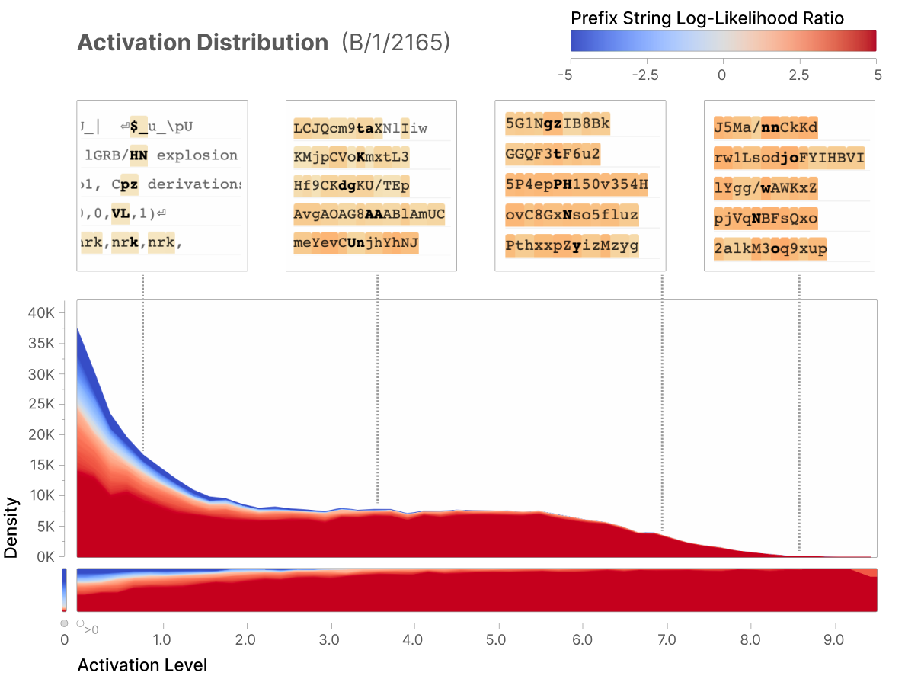

Like [A/1/2357](https://transformer-circuits.pub/2023/monosemantic-features/vis/a1.html#feature-2357), [B/1/2165](https://transformer-circuits.pub/2023/monosemantic-features/vis/b1.html#feature-2165)'s logit weights have a second mode corresponding to base64 tokens:

与 [A/1/2357](https://transformer-circuits.pub/2023/monosemantic-features/vis/a1.html#feature-2357) 一样，[B/1/2165](https://transformer-circuits.pub/2023/monosemantic-features/vis/b1.html#feature-2165) 的 logit 权重也有对应 base64 词元的第二峰：

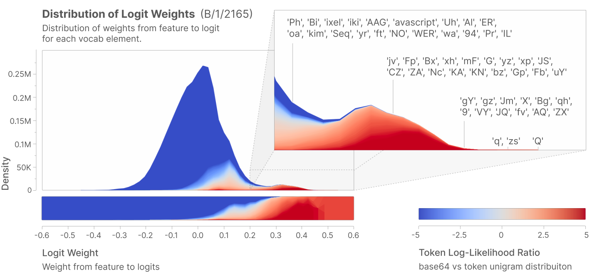

Correlations and scatter plots are also consistent with them being very similar features:

相关性与散点图同样与"它们是非常相似的特征"相一致：

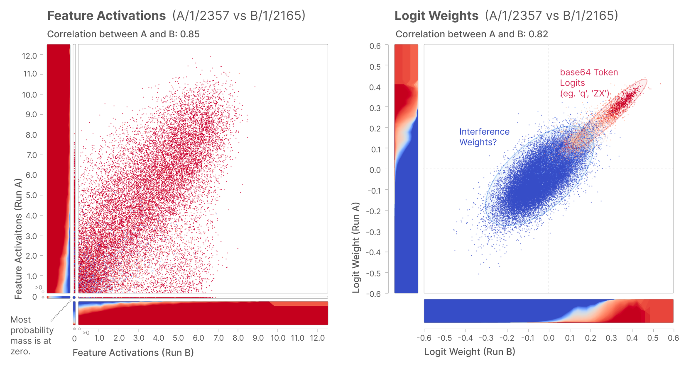

Note that we expect the overlap between the interference and base64 token logit weights to be from the aforementioned usage of base64 tokens across many other contexts.

注意，我们预期干扰与 base64 词元 logit 权重之间的重叠，来自前述 base64 词元在许多其他语境中的使用。

#### 该特征不是一个神经元（The Feature Is Not A Neuron）

Looking at the neuron in model A that most correlates with this feature: [A/neurons/470](https://transformer-circuits.pub/2023/monosemantic-features/vis/a-neurons.html#feature-470) (corr=0.18), we find that while it does notably respond to base64 strings, it also activates for lots of other things, including code, HTML labels, parts of URLs, etc.:

看模型 A 中与该特征最相关的神经元：[A/neurons/470](https://transformer-circuits.pub/2023/monosemantic-features/vis/a-neurons.html#feature-470)（corr=0.18）。我们发现，虽然它确实显著响应 base64 字符串，但它也会因许多其他东西激活，包括代码、HTML 标签、URL 的一部分等：

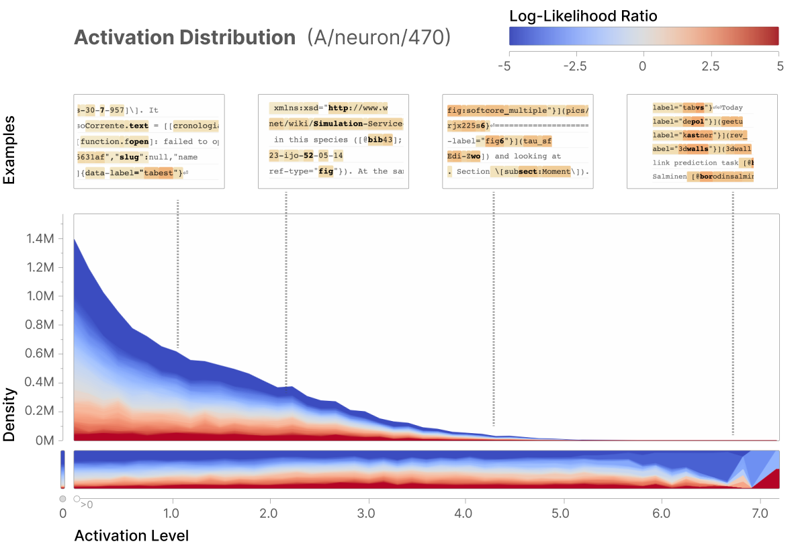

The logit weights suggest it somewhat increases base64 tokens, but is much more focused on upweighting other tokens, e.g. filename endings.

logit 权重表明它在一定程度上提高 base64 词元，但更专注于上调其他词元，例如文件名后缀。

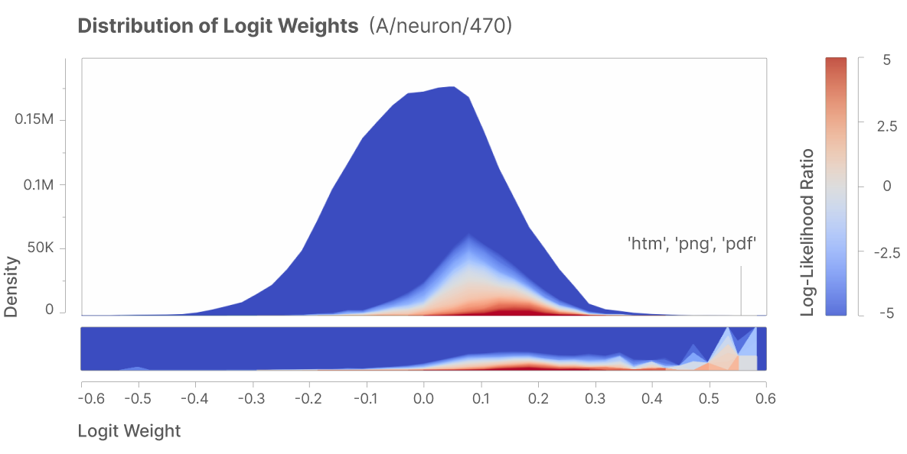

The activation and logit correlations are consistent with this neuron helping represent the same feature, but largely doing other things.

激活相关和 logit 相关与"该神经元帮助表示同一特征，但主要在做其他事情"相一致。

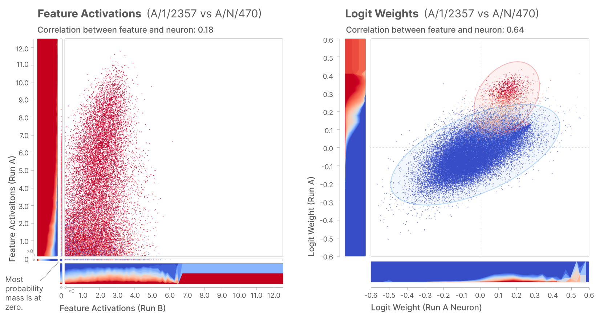

### 希伯来文字特征（Hebrew Feature）

Another interesting example is the Hebrew feature [A/1/416](https://transformer-circuits.pub/2023/monosemantic-features/vis/a1.html#feature-416). Like the Arabic feature, it's easy to computationally identify Hebrew text based on Unicode blocks.

另一个有趣的例子是希伯来文字特征 [A/1/416](https://transformer-circuits.pub/2023/monosemantic-features/vis/a1.html#feature-416)。与阿拉伯文字特征一样，基于 Unicode 块在计算上识别希伯来文本很容易。

[A/1/416](https://transformer-circuits.pub/2023/monosemantic-features/vis/a1.html#feature-416) has high activation specificity in the upper spectrum. It does weakly activate for other things (especially other languages with Unicode scripts). There is also some blue in strong activations; this appears to significantly be on "common characters", such as whitespace or punctuation, which are from other unicode blocks (see more discussion of similar issues in the Arabic feature section).

[A/1/416](https://transformer-circuits.pub/2023/monosemantic-features/vis/a1.html#feature-416) 在激活谱的较高区段具有高激活特异性。它对其他东西也会弱激活（尤其是其他有 Unicode 文字的语言）。强激活中也有一些蓝色；这些似乎很大程度上落在"常见字符"上，例如来自其他 Unicode 块的空白或标点（关于类似问题的更多讨论见阿拉伯文字特征一节）。

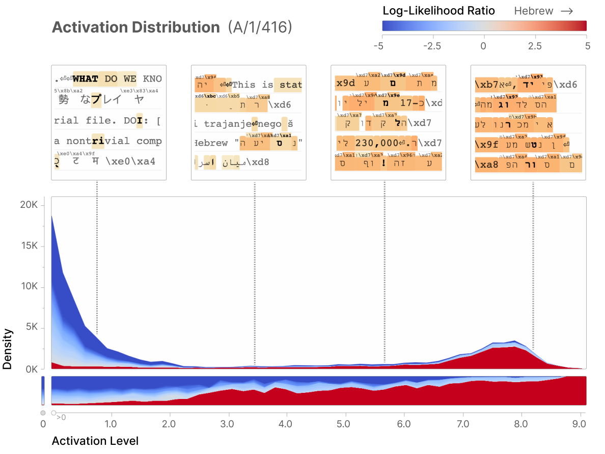

Its logit weights have a notable second mode, corresponding to Hebrew characters and relevant incomplete Unicode characters. Note that \xd7 is the first token in the UTF-8 encoding of most characters in the [basic Hebrew Unicode block](https://www.compart.com/en/unicode/block/U+0590).

它的 logit 权重有一个显著的第二峰，对应希伯来字符及相关的未完成 Unicode 字符。注意，\xd7 是[基本希伯来 Unicode 块](https://www.compart.com/en/unicode/block/U+0590)中大多数字符 UTF-8 编码的第一个词元。

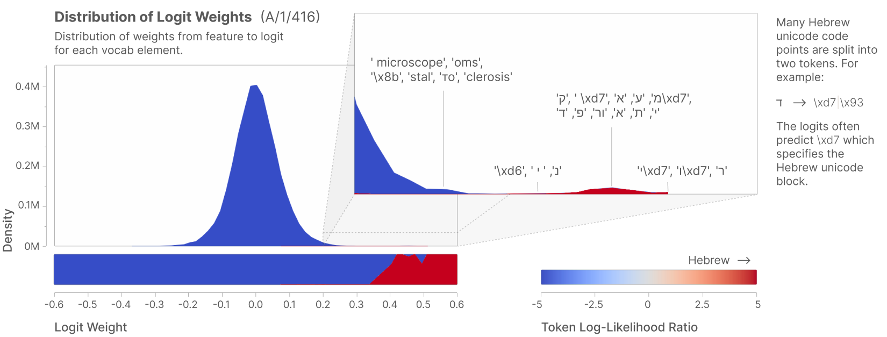

The Pearson correlation of the Hebrew script proxy with [A/1/416](https://transformer-circuits.pub/2023/monosemantic-features/vis/a1.html#feature-416) is 0.55. Some of the failure of sensitivity may be due to a complementary feature[ A/1/1016](https://transformer-circuits.pub/2023/monosemantic-features/vis/a1.html#feature-1016) that fires on \xd7 and predicts the bytes that complete Hebrew characters' codepoints.

希伯来文字代理与 [A/1/416](https://transformer-circuits.pub/2023/monosemantic-features/vis/a1.html#feature-416) 的 Pearson 相关为 0.55。敏感性的一部分缺失可能归因于一个互补特征 [A/1/1016](https://transformer-circuits.pub/2023/monosemantic-features/vis/a1.html#feature-1016)，它在 \xd7 上激活并预测补全希伯来字符码点的字节。

#### 该特征不是一个神经元（The Feature Is Not A Neuron）

There doesn't appear to be a similar neuron. The most correlated neuron in model A is [A/neurons/489](https://transformer-circuits.pub/2023/monosemantic-features/vis/a-neurons.html?ordering=index#feature-489) (corr=0.1), which has low activation and logit specificity. Consider the following activation and logit correlation plots:

似乎不存在类似的神经元。模型 A 中最相关的神经元是 [A/neurons/489](https://transformer-circuits.pub/2023/monosemantic-features/vis/a-neurons.html?ordering=index#feature-489)（corr=0.1），它的激活特异性和 logit 特异性都很低。请看下面的激活与 logit 相关图：

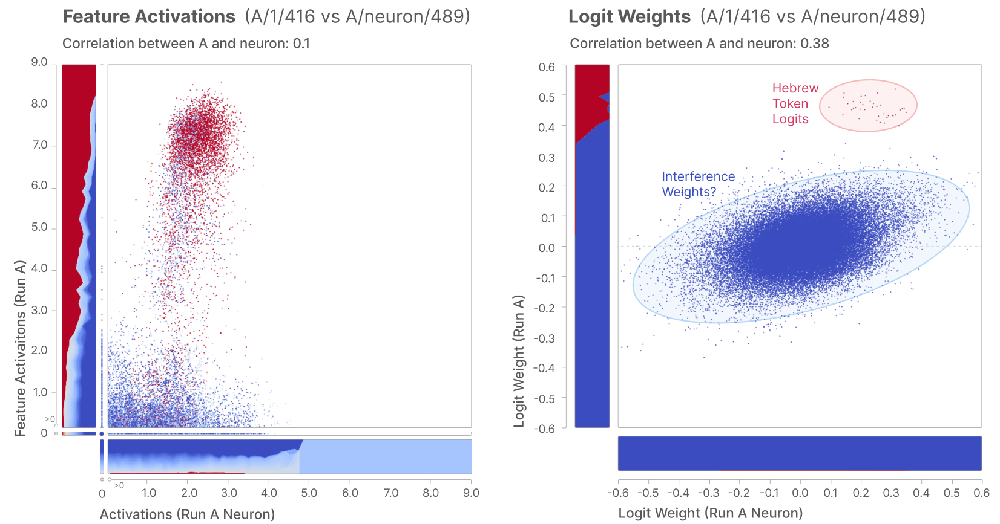

To cross-validate this, we also [searched](https://transformer-circuits.pub/2023/monosemantic-features/vis/a-neurons.html?search_mode=regex_case_sensitive&ordering=count&search_text=%5B%5Cu0590-%5Cu05FF%5D) for any neuron where the main Hebrew Unicode block appeared in the top dataset examples. We found none.

为了交叉验证，我们还[搜索](https://transformer-circuits.pub/2023/monosemantic-features/vis/a-neurons.html?search_mode=regex_case_sensitive&ordering=count&search_text=%5B%5Cu0590-%5Cu05FF%5D)了主希伯来 Unicode 块出现在 top 数据集样本中的任何神经元。我们没有找到。

#### 普适性（Universality）

[A/1/416](https://transformer-circuits.pub/2023/monosemantic-features/vis/a1.html#feature-416) has a correlated feature in the B/1 run, [B/1/1901](https://transformer-circuits.pub/2023/monosemantic-features/vis/b1.html#feature-1901) (corr=0.92) that has significant activation specificity:

[A/1/416](https://transformer-circuits.pub/2023/monosemantic-features/vis/a1.html#feature-416) 在 B/1 运行中有一个相关特征 [B/1/1901](https://transformer-circuits.pub/2023/monosemantic-features/vis/b1.html#feature-1901)（corr=0.92），它有显著的激活特异性：

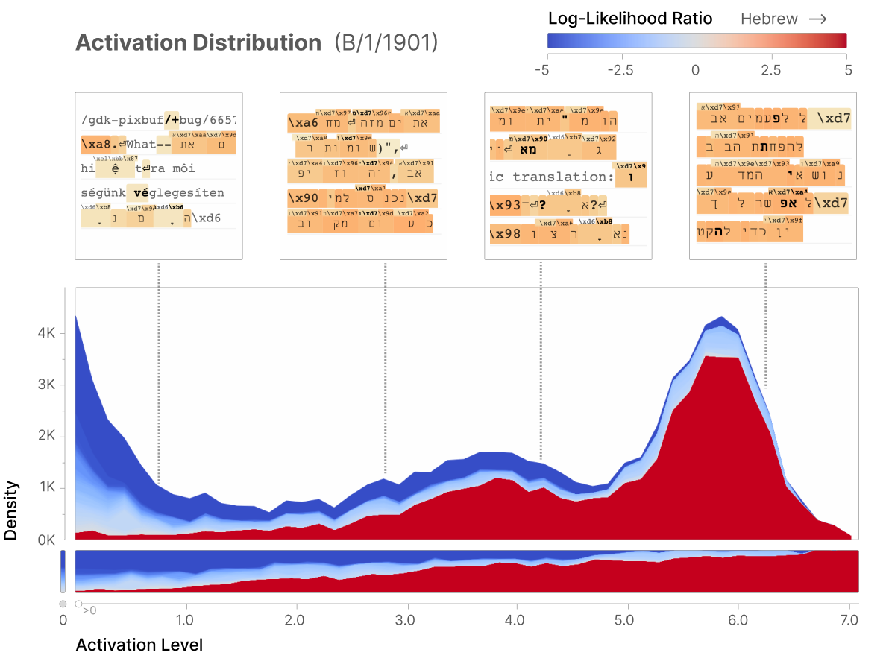

Logit weights have a second mode, as before:

logit 权重如前一样有第二峰：

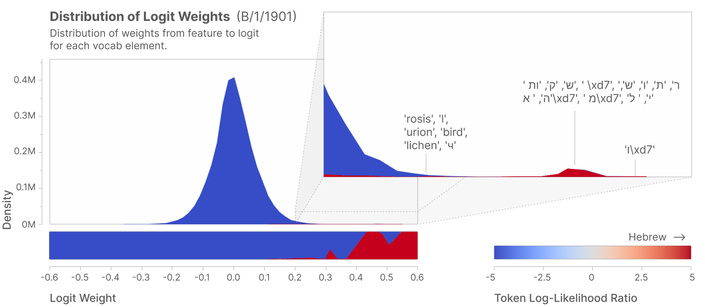

Activation and logit weight correlations are again consistent:

激活相关与 logit 权重相关同样一致：

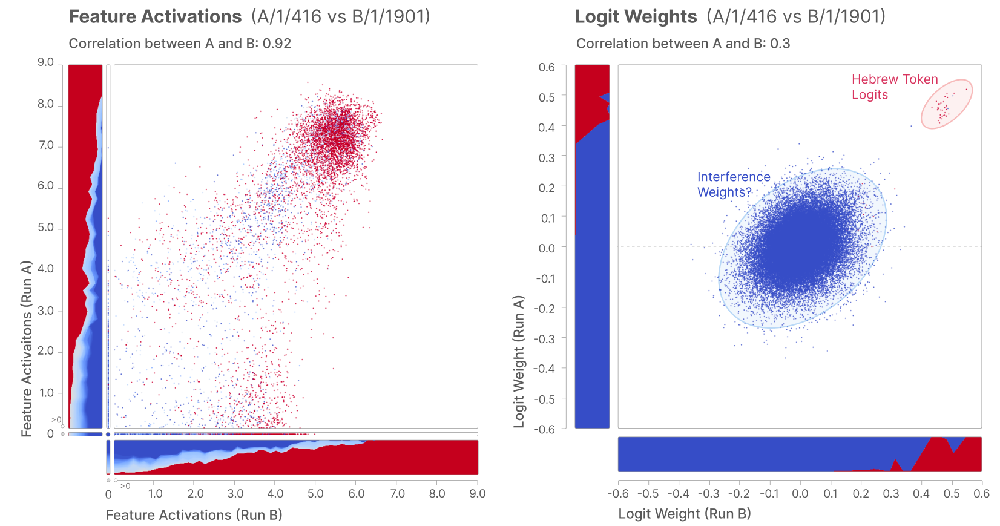
## 全局分析（Global Analysis）

If the previous section has persuaded you that at least some of the features are genuinely interpretable and reflect the underlying model mechanics, it's natural to wonder how broadly this holds outside of those cherry-picked features. The primary focus of this section will be to answer the question, "how interpretable are the rest of the features?" We show that both humans and large language models find our features to be significantly more interpretable than neurons, and quite interpretable in absolute terms.

如果上一节让你相信至少有一部分特征是真正可解释的、并反映了底层模型的机制，那么很自然想知道，这在那些精挑细选的特征之外有多大范围的成立。本节的主要焦点是回答一个问题："其余特征的可解释性如何？"我们将展示，人类和大语言模型都发现我们的特征比神经元显著更可解释，而且从绝对意义上讲也相当可解释。

There are a number of other questions one might also ask. To what extent is our dictionary learning method discovering all the features necessary to understand the MLP layer? Holistically, how much of the MLP layer's mechanics have been made interpretable? We are not yet able to fully answer these questions to our satisfaction, but will provide some preliminary speculation towards the end of this section.

人们可能还会问许多其他问题。我们的字典学习方法在多大程度上发现了理解 MLP 层所需的全部特征？整体而言，MLP 层的机制有多少已被变得可解释？我们还不能令人满意地完全回答这些问题，但会在本节末尾给出一些初步推测。

We note that of the 4,096 learned features in the A/1 autoencoder, 168 of them are "dead" (active on none of the 100 million dataset examples) and 292 of them are "ultralow density", active on less than 1 in a million dataset examples and exhibiting other atypical properties. We exclude both these groups of features from further analyses.

我们注意到，A/1 自编码器的 4,096 个学到的特征中，168 个是"死"的（在 1 亿数据集样本上从未激活），292 个是"超低密度"的——在不到百万分之一的数据集样本上激活，并表现出其他非典型性质。我们在后续分析中排除这两组特征。

### 典型特征的可解释性如何？（How Interpretable is the Typical Feature?）

In this section, we use three different methods to analyze how interpretable the typical feature is, and how that compares to neurons: human analysis, and two forms of automated interpretability. All three approaches find that features are much more interpretable than neurons.

在本节中，我们用三种不同的方法分析典型特征有多可解释，以及与神经元相比如何：人工分析，以及两种形式的自动可解释性（autointerpretability）。三种方法都发现，特征比神经元可解释得多。

#### 人工分析（Manual Human Analysis）

At present, we do not have any metric we trust more than human judgment of interpretability. Thus, we had a blinded annotator (one of the authors, Adam Jermyn) score features and neurons based on how interpretable they are. The scoring rubric can be found in the appendix and accounts for confidence in an explanation, consistency of the activations with that explanation, consistency of the logit output weights with that explanation, and specificity.

目前，我们没有任何比人类对可解释性的判断更值得信任的指标。因此，我们让一位盲评标注者（作者之一 Adam Jermyn）根据特征和神经元的可解释程度打分。评分细则见附录，它考虑了对解释的信心、激活与该解释的一致性、logit 输出权重与该解释的一致性，以及特异性。

In doing this evaluation, we wanted to avoid a weakness we perceived in our prior work (e.g., ) of focusing evaluation predominantly on maximal dataset examples, and paying less attention to the rest of the activation spectrum. Many polysemantic neurons appear monosemantic if you only look at top dataset examples, but are revealed to be polysemantic if you look at lower parts of the activation spectrum. To avoid this, we draw samples uniformly across the spectrum of feature activations,[^22] and score each interval separately in light of the overall hypothesis suggested by the feature.

在做这一评估时，我们想避免我们在先前工作中察觉的一个弱点（例如）：评估主要集中于最大的数据集样本，而对激活谱其余部分关注较少。许多多义神经元如果只看 top 数据集样本会显得单义，但如果看激活谱的较低部分就会暴露出多义性。为避免这一点，我们在特征激活谱上均匀抽样，[^22] 并参照该特征所提示的整体假设对每个区间分别打分。

Unfortunately, this approach is labor intensive and so the number of scored samples is small. In total, 412 feature activation intervals were scored across 162 features and neurons.

遗憾的是，这一方法耗费人力，因此打分的样本数量很少。总计在 162 个特征和神经元上对 412 个特征激活区间进行了打分。

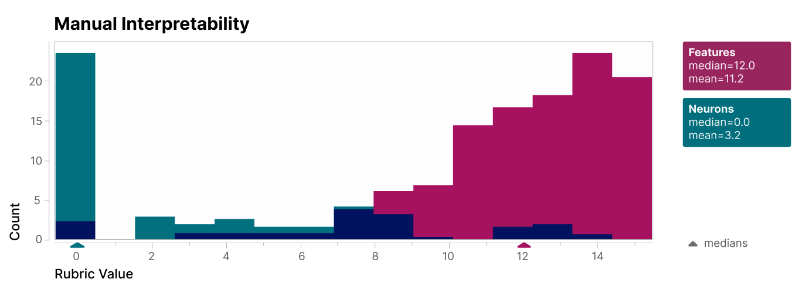

We see that features are substantially more interpretable than neurons. Very subjectively, we found features to be quite interpretable if their rubric value was above 8. The median neuron scored 0 on our rubric, indicating that our annotator could not even form a hypothesis of what the neuron could represent! Whereas the median feature interval scored a 12, indicating that the annotator had a confident, specific, consistent hypothesis that made sense in terms of the logit output weights.

我们看到，特征比神经元可解释得多。非常主观地说，我们发现细则得分高于 8 的特征相当可解释。神经元的中位数得分为 0，这表明我们的标注者甚至无法形成关于该神经元可能表示什么的假设！而特征区间的中位数得分为 12，表明标注者形成了一个有把握、具体、一致的假设，并且该假设与 logit 输出权重相符。

#### 自动可解释性——激活（Automated Interpretability – Activations）

To analyze features at a larger scale, we turned to automated interpretability . Following the approach of Bills et al. , we have a large language model, Anthropic’s Claude, generate explanations of features using examples of tokens where they activate. Next, we have the model use that explanation to predict new activations on previously unseen tokens.[^23]

为了在更大规模上分析特征，我们转向自动可解释性。遵循 Bills 等人的方法，我们让一个大语言模型——Anthropic 的 Claude——利用特征激活所在的词元样例来生成对特征的解释。接着，我们让模型使用该解释来预测它在之前未见词元上的新激活。[^23]

Like with the human analysis, we used samples across the full range of activation intervals to evaluate monosemanticity.[^24] Concretely, for each feature, we computed the Spearman correlation coefficient between the predicted activation and the true activations for 60 dataset examples made up of nine tokens each, resulting in 540 predictions per feature. While only using completely random sequences would be the most principled approach to scoring, half of the examples are from across the feature intervals to get a more accurate correlation. See the appendix for additional information including the use of importance scoring to precisely counter-weight the bias of providing tokens the feature fires for.

与人类分析一样，我们使用横跨全部激活区间的样本来评估单义性。[^24] 具体而言，对每个特征，我们计算预测激活与真实激活在 60 个数据集样本（每个样本由 9 个词元组成）上的 Spearman 相关系数，即每个特征 540 个预测。虽然只用完全随机的序列是最有原则的评分方式，但我们让一半样本取自各特征区间，以获得更准确的相关。更多信息（包括使用重要性评分来精确抵消"提供特征激活词元"带来的偏差）见附录。

In agreement with the human analysis, Claude is able to explain and predict activations for features significantly better than for neurons.[^25]

与人类分析一致，Claude 对特征的解释和激活预测显著好于对神经元的。[^25]

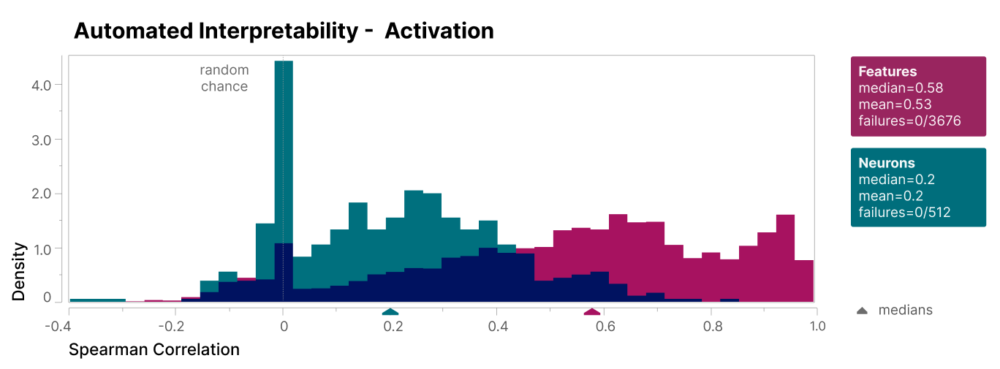

#### 自动可解释性——logit 权重（Automated Interpretability – Logit Weights）

In our earlier analysis of individual features, we found that looking at the logits is a powerful tool for cross-validating the interpretability of features. We can take this approach in automated interpretability as well. Using the explanations of features generated in the previous analysis, we ask a language model to predict if a previously unseen logit token is something the feature should predict as likely to come next. This is then scored against a 50/50 mix of top positive logit tokens and random other logit tokens. Randomly guessing would give a 50% accuracy, but the model instead achieves a 74% average across features, compared to a 58% average across neurons. Failures here refer to instances where Claude failed to reply in the correct format for scoring.

在我们之前对单个特征的分析中，我们发现查看 logit 是交叉验证特征可解释性的有力工具。我们也可以在自动可解释性中采用这一方法。利用前面分析中生成的特征解释，我们让语言模型预测：一个之前未见过的 logit 词元是否是该特征应当预测为可能出现的。然后用 top 正 logit 词元与随机其他 logit 词元的 50/50 混合来评分。随机猜测会得到 50% 的准确率，但模型在特征上平均达到 74%，而神经元上平均为 58%。此处的失败指 Claude 未按正确格式回复从而无法评分的情形。

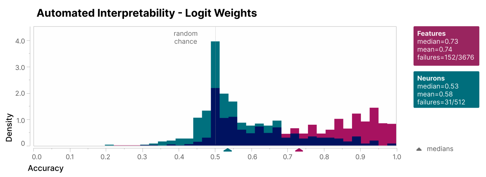

#### 激活区间分析（Activation Interval Analysis）

In addition to studying features as a whole, in our manual analysis we can zoom in on portions of the feature activation spectrum using the feature intervals. As before, a feature interval is the set of examples with activations closest to a specific evenly-spaced fraction of the max activation. So, rather than asking if a feature seems interpretable, we ask whether a range of activations is consistent with the overall hypothesis suggested by the full spectrum of the feature’s activation. This allows us to ask how interpretability changes with feature activation strength.

除了把特征作为整体来研究之外，在人工分析中我们还可以利用特征区间（feature intervals）放大观察特征激活谱的局部。与之前一样，特征区间是激活值最接近最大激活某个特定等距比例的样本集合。因此，我们不再问某个特征看起来是否可解释，而是问某一段激活是否与该特征完整激活谱所提示的整体假设一致。这使我们能够追问：可解释性如何随特征激活强度变化？

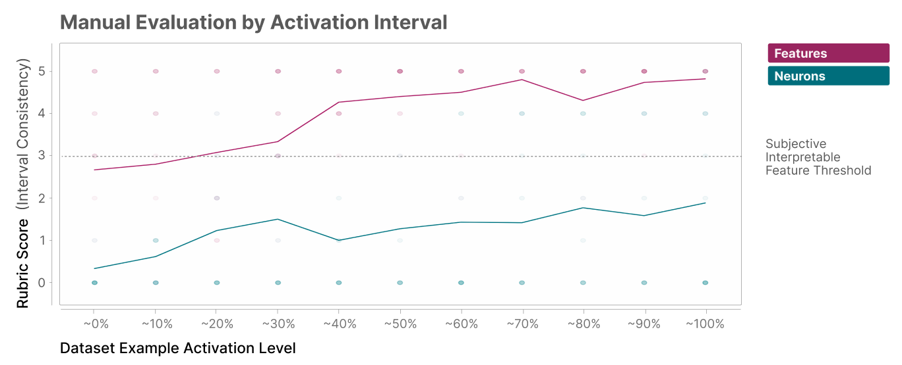

Higher-activating feature intervals were more consistent with our interpretations than lower-activating ones. In particular:

高激活的特征区间比低激活的区间更符合我们的解释。具体来说：

- Many features show consistent activations across the entire activation spectrum.

- 许多特征在整个激活谱上表现出一致的激活。

- Some features show consistent activations across the top ~60% of the activation spectrum, and then quickly become less interpretable as we look to smaller and smaller activations.

- 一些特征在激活谱顶部约 60% 的范围内表现出一致的激活，然后随着我们看向越来越小的激活，可解释性迅速下降。

It is possible that this is a sign that our features are not quite right. For instance, if one of our features is at a slight angle to the feature we’d really like to have learned, that can show up as inconsistent behavior in the lower activation intervals.

有可能这是一个信号，表明我们的特征并不完全正确。例如，如果我们的某个特征与我们真正想学到的特征之间有一个小夹角，那可能会在较低的激活区间表现为不一致的行为。

#### 注意事项（Caveats）

Our manual and automated interpretability experiments have a few caveats:

我们的人工和自动可解释性实验有几个注意事项：

- Feature activations are skewed towards the lower intervals. Most feature activations are quite small, and so fall in the lower (and less-interpretable) feature intervals. That said, as we found in our detailed analysis, most of the effect of a feature[^26] is due to its higher activations, which are quite interpretable.

- 特征激活偏向较低的区间。大多数特征激活都相当小，因此落入较低（且可解释性较差）的特征区间。话虽如此，正如我们在详细分析中所发现的，特征的大部分效应[^26]来自其较高的激活，而那些激活相当可解释。

- The evaluated features are sampled uniformly from among the set of all features, and interpretability might be correlated with importance. One could imagine evaluating the features with the largest magnitude of activations, or the largest effect when ablated. Our sense is that these would be more interpretable than the randomly sampled features we considered. One could imagine a situation where the most important features in some sense were systematically less interpretable, though inspection of the [most active features](https://transformer-circuits.pub/2023/monosemantic-features/vis/a1.html?ordering=max_dense) suggests the opposite.

- 被评估的特征是从所有特征集合中均匀采样的，而可解释性可能与重要性相关。可以想象去评估那些激活幅值最大的特征，或消融时影响最大的特征。我们的感觉是，这些会比我们考虑的随机采样特征更可解释。当然也可以想象某种意义上的最重要特征系统性地更不可解释的情形，不过对[最活跃特征](https://transformer-circuits.pub/2023/monosemantic-features/vis/a1.html?ordering=max_dense)的检查表明情况相反。

Based on our inspection of many features in the visualization, we believe these caveats do not affect the experimental results. We encourage interested readers to open the visualization for [A/1](https://transformer-circuits.pub/2023/monosemantic-features/vis/a1.html) and the [corresponding neurons](https://transformer-circuits.pub/2023/monosemantic-features/vis/a-neurons.html). You can sort by ‘random’ to get an unbiased sample and do your own version of the above experiment, or sort features by importance metrics such as max activation and max density to evaluate the final caveat above.

基于我们在可视化中对许多特征的检查，我们相信这些注意事项不影响实验结果。我们鼓励有兴趣的读者打开 [A/1 的可视化](https://transformer-circuits.pub/2023/monosemantic-features/vis/a1.html)和[对应神经元](https://transformer-circuits.pub/2023/monosemantic-features/vis/a-neurons.html)的可视化。你可以按"random"排序获得无偏样本，做你自己的上述实验；或者按 max activation、max density 等重要性指标排序特征，以评估上面的最后一个注意事项。

### 我们的解释解释了模型的多少？（How much of the model does our interpretation explain?）

We now turn to the question we're least able to answer – to what extent do these seemingly interpretable features represent the "full story" of the MLP? One could imagine posing this question in a variety of ways. What fraction of the MLP loss contribution have we made interpretable? How much model behavior can we understand? If there really are some discrete set of "true features", what fraction have we discovered?

现在我们转向我们最无力回答的问题——这些看似可解释的特征在多大程度上代表了 MLP 的"完整故事"？可以用多种方式提出这个问题：MLP 损失贡献中我们已使其可解释的比例是多少？我们能理解多少模型行为？如果确实存在某个离散的"真实特征"集合，我们发现了其中的多大比例？

One way to partly get at this question is to ask how much of the loss is explained by our features. For [A/1](https://transformer-circuits.pub/2023/monosemantic-features/vis/a1.html), the run we've focused most on in this paper, 79% of the log-likelihood loss reduction provided by the MLP layer is recovered by our features. That is, the additional loss incurred by replacing the MLP activations with the autoencoder's output is just 21% of the loss that would be incurred by zero ablating the MLP. This loss penalty can be reduced by using more features, or using a lower L1 coefficient. As an extreme example, [A/](https://transformer-circuits.pub/2023/monosemantic-features/vis/a5.html)[5](https://transformer-circuits.pub/2023/monosemantic-features/vis/a5.html) (n_learned_sparse=131,072, l1_coefficient=0.004) recovers 94.5% of log-likelihood loss.

部分触及该问题的一种方法是问：损失中有多少被我们的特征解释。对于本文最聚焦的运行 [A/1](https://transformer-circuits.pub/2023/monosemantic-features/vis/a1.html)，MLP 层提供的对数似然损失降低中有 79% 被我们的特征恢复。也就是说，用自编码器的输出替换 MLP 激活所带来的额外损失，仅为将 MLP 零消融所致损失的 21%。这一损失代价可以通过使用更多特征或更低的 L1 系数来降低。作为一个极端例子，[A/](https://transformer-circuits.pub/2023/monosemantic-features/vis/a5.html)[5](https://transformer-circuits.pub/2023/monosemantic-features/vis/a5.html)（n_learned_sparse=131,072，l1_coefficient=0.004）恢复了对数似然损失的 94.5%。

These numbers should be taken with a significant grain of salt. The biggest issue is that framing this question in terms of fraction of loss may be misleading – we expect there to be a long-tail of features such that as the fraction of loss explained increases, more and more features are needed to explain the residual. Another issue is that we don't believe our features are completely monosemantic (some polysemanticity may be hiding in low activations), nor are all of them necessarily cleanly interpretable. With all of that said, our earlier analyses of individual features (e.g. the Arabic feature, base64 feature, etc.) do show that specific interpretable features are used by the model in interpretable ways – ablating them decreases probabilities in the appropriate way, and artificially activating them causes a corresponding behavior. This seems to confirm that the 79% of loss recovered is measuring something real, despite these caveats.

这些数字应当打上很大的折扣。最大的问题在于，用损失比例来框定这个问题可能有误导性——我们预期存在一个特征长尾：随着损失解释比例的增加，解释残差所需的特征越来越多。另一个问题是我们不认为我们的特征是完全单义的（一些多义性可能藏在低激活中），也不是所有特征都一定干净可解释。话虽如此，我们早先对单个特征的分析（如阿拉伯文字特征、base64 特征等）确实表明，具体的可解释特征被模型以可解释的方式使用——消融它们会以适当的方式降低概率，人为激活它们会引发相应的行为。这似乎确认了那 79% 的损失恢复确实在度量某种真实的东西，尽管有这些注意事项。

In principle, one could use automated interpretability to produce a better measure here: replacing activations with those predicted from explanations. (We believe others in the community have recently been considering this!) The naive versions of this would be quite computationally expensive,[^27] although there may be approximations. More generally, there is a much broader space of possibilities here. Perhaps there's a principled way to do this analysis in terms of single features – there are significant conceptual issues, but one might be able to formalize earlier notions of "feature importance" as an independent loss contribution a feature makes, and then analyze how much of that specific feature can be recovered.

原则上，可以用自动可解释性在这里产生一个更好的度量：用由解释预测出的激活替换真实激活。（我们相信社区中的其他人最近也在考虑这个！）这一想法的朴素版本计算开销会相当大，[^27] 尽管可能存在近似方法。更一般地，这里有广阔得多的可能性空间。也许存在一种以单个特征为单位进行这一分析的有原则的方法——这里存在重要的概念性问题，但人们也许能把早期的"特征重要性"概念形式化为一个特征独立做出的损失贡献，然后分析该特定特征中可恢复的比例。

Overall, we view the problem of measuring the degree to which a feature-based interpretation explains a model to be an important open question, where significant work is necessary on both defining metrics and finding efficient ways to compute them.

总体而言，我们把"衡量基于特征的解释在多大程度上解释了模型"视为一个重要的开放问题，在定义指标和寻找高效计算方式上都需要大量工作。

### 特征告诉我们的是模型还是数据？（Do features tell us about the model or the data?）

A model's activations reflect two things: the distribution of the dataset and the way that distribution is transformed by the model. Dictionary learning on activations thus mixes data and model properties, and intriguing properties of learned features may be attributed to either or both sources. Correlations in the data can persist after application of the first part of the model (up to the MLP), and it is in theory possible that the intriguing features we see are merely artifacts of dataset correlations projected into a different space. However, the use of those features by the second half of the model (MLP downprojection and unembedding) are not an input to dictionary learning, so the interpretability of the downstream effects of those features must be a property of the model.

模型的激活反映两件事：数据集的分布，以及该分布被模型变换的方式。因此在激活上做字典学习会混合数据与模型的属性，学到的特征的有趣性质可能归因于两者之一或两者。数据中的相关性可以在经过模型前半部分（直到 MLP）之后依然存在，因此理论上可能，我们看到的有趣特征只是数据集相关性投影到另一个空间的产物。然而，模型后半部分（MLP 下投影和 unembedding）对这些特征的使用并不是字典学习的输入，因此这些特征下游效应的可解释性必然是模型的属性。

To assess the effect of dataset correlations on the interpretability of feature activations, we run dictionary learning on a version of our one-layer model with random weights.[^28] The resulting features are [here](https://transformer-circuits.pub/2023/monosemantic-features/vis/random1.html), and contain many single-token features (such as "span", "file", ".", and "nature") and some other features firing on seemingly arbitrary subsets of different broadly recognizable contexts (such as [LaTeX](https://transformer-circuits.pub/2023/monosemantic-features/vis/random1.html#feature-1143) or [code](https://transformer-circuits.pub/2023/monosemantic-features/vis/random1.html#feature-3050)). However, we are unable to construct interpretations for the non-single-token features that make much sense and invite the reader to examine feature visualizations from the model with randomized weights to confirm this for themselves. We conclude that the learning process for the model creates a richer structure in its activations than the distribution of tokens in the dataset alone.

为了评估数据集相关性对特征激活可解释性的影响，我们对一个权重随机的单层模型版本运行字典学习。[^28] 得到的特征见[此处](https://transformer-circuits.pub/2023/monosemantic-features/vis/random1.html)，其中包含许多单词元特征（如"span"、"file"、"."和"nature"），以及一些在其他广泛可识别语境（如 [LaTeX](https://transformer-circuits.pub/2023/monosemantic-features/vis/random1.html#feature-1143) 或[代码](https://transformer-circuits.pub/2023/monosemantic-features/vis/random1.html#feature-3050)）的看似任意的子集上激活的特征。然而，我们无法为那些非单词元特征构建有多少意义的解释，并邀请读者自行检查随机化权重模型的特征可视化来确认这一点。我们得出结论：模型的学习过程在其激活中创造了比仅由数据集词元分布所产生的更丰富的结构。

To assess the interpretability of the downstream feature effects, we again use the three main approaches of the previous section:

为了评估下游特征效应的可解释性，我们再次使用上一节的三个主要方法：

1. Logit weight inspection. The logit weights represent the effect of each feature on the logits, and, as demonstrated in our earlier investigations of individual features, they are consistent with the feature activations for the base64, Arabic, and Hebrew features. The reader is invited to inspect logit weights for all features in the visualization.

1. logit 权重检查。logit 权重表示每个特征对 logit 的效应，正如我们之前对单个特征的研究所演示的，对于 base64、阿拉伯文字和希伯来文字特征，它们与特征激活相一致。邀请读者在可视化中检查所有特征的 logit 权重。

1. Feature ablation. We set the value of a feature to zero throughout a context, and record how the loss on each token changes. Ablations are available for all features in the visualization.

1. 特征消融。我们把一个特征在整个上下文中的值设为零，并记录每个词元上的损失如何变化。可视化中所有特征都有消融结果。

1. Pinned feature sampling. We artificially pinned the value of a feature to a fixed high number and then sample from the model. We find that the generated text matches the interpretation of the feature.

1. 钉定特征采样。我们把一个特征的值人为钉定在一个固定的高数上，然后从模型采样。我们发现生成的文本与该特征的解释相符。

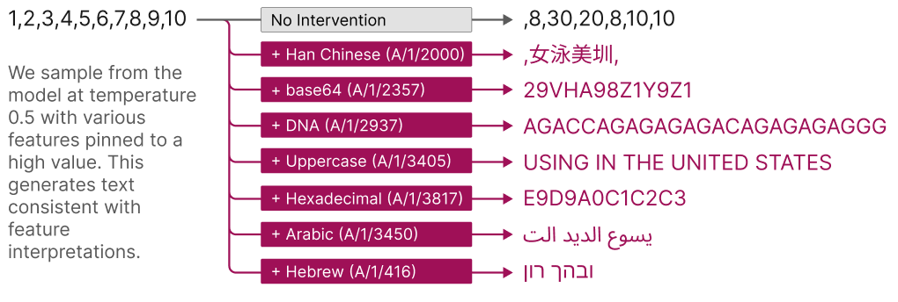

The empirical consistency of feature activations with their downstream effects across all these metrics provides evidence that the features found are being used by the model.

特征激活与其下游效应在所有这些指标上的经验一致性，为"所找到的特征正被模型使用"提供了证据。
## 现象学（Phenomenology）

Ultimately, the goal of our work is to understand neural networks. Decomposition of models into features is simply a means to this end, and one might very reasonably wonder if it's genuinely advancing our overall goal. So, in this section, we'll turn attention to the lessons these features can teach us about neural networks. (We've taken to calling this work of leveraging our theoretical understanding to reason about model properties phenomenology by analogy to [phenomenology in physics](https://en.wikipedia.org/wiki/Phenomenology_(physics)), and the [2019 ICML workshop](https://deep-phenomena.org/) on phenomena in deep learning.)

归根结底，我们工作的目标是理解神经网络。把模型分解成特征只是达到这一目的的手段，人们很有理由怀疑这是否真正推进了我们的总体目标。因此在本节中，我们将把注意力转向这些特征能教给我们的关于神经网络的东西。（我们把这种利用理论理解来推理模型性质的工作称为现象学（phenomenology），类比[物理学中的现象学](https://en.wikipedia.org/wiki/Phenomenology_(physics))以及[2019 年 ICML 关于深度学习中现象的研讨会](https://deep-phenomena.org/)。）

One way to do this would be to give a detailed discussion of the features we've found (similar to ), but we believe the best way to get a sense of the features we discovered is simply to [browse the interface](https://transformer-circuits.pub/2023/monosemantic-features/vis/a1.html) for exploring features which we've published alongside this paper. The features we find vary enormously, and no concise summary will capture their breadth. Instead, we will largely focus on more abstract properties and patterns that we notice. These abstract properties will be able to inform – although by no means answer – questions like "Are these the real features?" and "What is actually going on in a one-layer model?"

做到这一点的一种方式是对我们发现的特征做详细讨论（类似），但我们认为，要领会我们发现的特征，最好的方式就是直接[浏览界面](https://transformer-circuits.pub/2023/monosemantic-features/vis/a1.html)——我们随论文一起发布的特征探索界面。我们发现的特征差异巨大，任何简明的总结都无法涵盖其广度。因此，我们将主要关注我们注意到的更抽象的性质与模式。这些抽象性质将有助于——尽管绝不能回答——诸如"这些是真实的特征吗？"和"单层模型中究竟发生了什么？"之类的问题。

We begin by discussing some basic motifs and observations about features. We'll then discuss how the features we relate compare to features in other dictionary learning runs and in other models. This will suggest that features are universal and that dictionary learning can be understood as a process of feature splitting that reflects something deep about the geometry of superposition. Finally, we'll explore how features connect together into "finite state automata" as systems that implement more complex behaviors.

我们先讨论关于特征的一些基本母题（motifs）和观察。然后讨论我们所论及的特征与其他字典学习运行及其他模型中特征的比较。这将表明特征是普适的，并且字典学习可以被理解为一个特征分裂的过程，它反映了叠加几何中某种深刻的东西。最后，我们将探讨特征如何连接成"有限状态自动机"，作为实现更复杂行为的系统。

### 特征母题（Feature Motifs）

What kinds of features do we find in our model?

我们在模型中发现的是什么样的特征？

One strong theme is the prevalence of context features (e.g. DNA, base64) and token-in-context features (e.g. the in mathematics – [A/0/341](https://transformer-circuits.pub/2023/monosemantic-features/vis/a0.html#feature-341), < in HTML – [A/0/20](https://transformer-circuits.pub/2023/monosemantic-features/vis/a0.html#feature-20)).[^29] These have been observed in prior work (context features e.g. ; token-in-context features e.g.  ; preceding observations ), but the sheer volume of token-in-context features has been striking to us. For example, in [A/4](https://transformer-circuits.pub/2023/monosemantic-features/vis/a4.html), there are over a hundred features which primarily respond to the token "the" in different contexts.[^30] Often these features are connected by feature splitting (discussed in the next section), presenting as pure context features or token features in dictionaries with few learned features, but then splitting into token-in-context features as more features are learned.

一个强烈的主题是上下文特征（context features，如 DNA、base64）和上下文中的词元特征（token-in-context features，如数学中的 the – [A/0/341](https://transformer-circuits.pub/2023/monosemantic-features/vis/a0.html#feature-341)、HTML 中的 < – [A/0/20](https://transformer-circuits.pub/2023/monosemantic-features/vis/a0.html#feature-20)）的盛行。[^29] 这些在先前工作中已被观察到（上下文特征例如；上下文中的词元特征例如；先前的观察），但上下文中的词元特征数量之巨令我们震撼。例如，在 [A/4](https://transformer-circuits.pub/2023/monosemantic-features/vis/a4.html) 中，有超过一百个特征主要响应不同语境中的词元"the"。[^30] 这些特征常常由特征分裂（下一节讨论）连接起来：在学到特征较少的字典中呈现为纯上下文特征或词元特征，而随着更多特征被学到，它们分裂成上下文中的词元特征。

Another interesting pattern is the implementation of what seem to be "trigram" features, such as a feature that predicts the 19 in COVID-19 ([A/2/12310](https://transformer-circuits.pub/2023/monosemantic-features/vis/a2.html#feature-9143)). Such features could in principle be implemented with attention alone, but in practice the model uses the MLP layer as well. We also see features which seem to respond to specific, longer sequences of tokens. These are particularly striking because they may implement "memorization" like behavior – we'll discuss this more later.

另一个有趣模式是似乎实现了"三元组"（trigram）特征的东西，例如一个预测 COVID-19 中 19 的特征（[A/2/12310](https://transformer-circuits.pub/2023/monosemantic-features/vis/a2.html#feature-9143)）。这类特征原则上可以仅用注意力实现，但实践中模型也使用了 MLP 层。我们还看到一些似乎响应特定的较长词元序列的特征。这些特别引人注目，因为它们可能实现类似"记忆"（memorization）的行为——我们稍后会更多讨论。

Finally, it's worth noting that all the features we find in a one-layer model can be interpreted as "action features" in addition to their role as "input features". For example, a base64 feature can be understood both as activating in response to base64 strings, and also as acting to increase the probability of base64 strings. The "action" view can clarify some of the token-in-context features: the feature [A/0/341](https://transformer-circuits.pub/2023/monosemantic-features/vis/a0.html#feature-341) predicts noun phrases in mathematical text, upweighting nouns like denominator and adjectives like latter. Consequently, while it activates most strongly on the, it also activates on adjectives like special and this which are also followed by noun phrases. This dual interpretation of features can be explored by browsing our interface. Several papers have previously explored interpreting neurons as actions (e.g. ), and one-layer models are particularly suited to this, since it's a particularly principled way to understand the last MLP layer, and the only MLP in a one-layer model is the last layer.

最后，值得注意的是，我们在单层模型中发现的所有特征，除了作为"输入特征"的角色外，都可以被解释为"动作特征"（action features）。例如，一个 base64 特征既可以理解为响应 base64 字符串而激活，也可以理解为起到提高 base64 字符串概率的作用。"动作"视角可以澄清一些上下文中的词元特征：特征 [A/0/341](https://transformer-circuits.pub/2023/monosemantic-features/vis/a0.html#feature-341) 预测数学文本中的名词短语，上调如 denominator 的名词和如 latter 的形容词。因此，虽然它在 the 上激活最强，但它在 special 和 this 等同样后接名词短语的形容词上也激活。这种特征的双重解释可以通过浏览我们的界面来探索。以前有几篇论文探索过把神经元解释为动作（例如），而单层模型特别适合这样做，因为这是理解最后一个 MLP 层特别有原则的方式，而单层模型中唯一的 MLP 就是最后一层。

### 特征分裂（Feature Splitting）

One striking thing about the features we’ve found is that they appear in clusters. For instance, we observed above multiple base64 features, multiple Arabic script features, and so on. We see more of these features as we increase the total number of learned sparse features, a phenomenon we refer to as feature splitting. As we go from 512 features in A/0 to 4,096 features in A/1 and to 16,384 features in A/2, the number of features specific to base64 contexts goes from 1 to 3 to many more.

关于我们发现的特征，一个引人注目的事情是它们成簇出现。例如，我们在上文中观察到多个 base64 特征、多个阿拉伯文字特征等等。随着学到的稀疏特征总数增加，我们会看到更多这类特征，我们把这一现象称为特征分裂（feature splitting）。当从 A/0 的 512 个特征到 A/1 的 4,096 个特征再到 A/2 的 16,384 个特征时，base64 语境特有的特征数量从 1 到 3 再到更多。

To understand how the geometry of the dictionary elements correspond to these qualitative clusters, we do a 2-D UMAP on the combined set of feature directions from A/0, A/1, and A/2.

为了理解字典元素的几何如何对应这些定性簇，我们对来自 A/0、A/1 和 A/2 的特征方向的合并集合做了 2 维 UMAP。

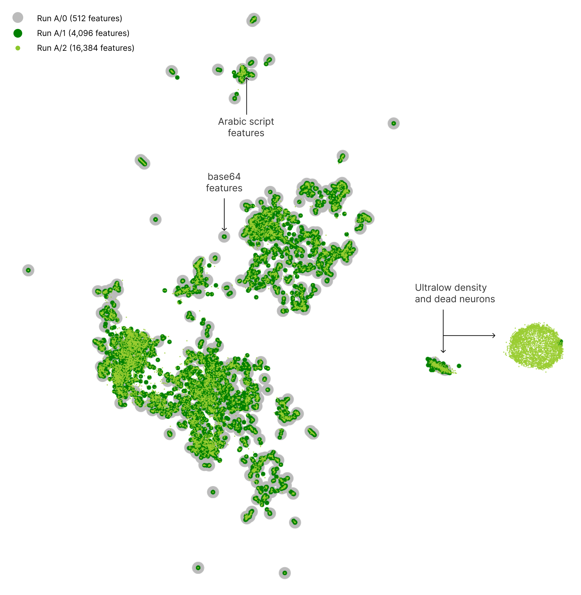

We see clusters corresponding to the base64 and Arabic script features, together with many other tight clusters from specific contexts and a variety of other interesting geometric structures for other features. This confirms that the qualitative clusters are reflected in the geometry of the dictionary: similar features have small angles between their dictionary vectors.

我们看到对应 base64 和阿拉伯文字特征的簇，还有来自特定语境的许多其他紧凑簇，以及其他特征的多种有趣的几何结构。这证实定性簇反映在字典的几何中：相似特征的字典向量之间夹角很小。

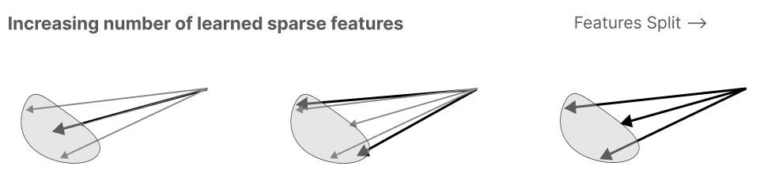

We conjecture that there is some idealized set of features that dictionary learning would return if we provided it with an unlimited dictionary size. Often, these "true features" are clustered into sets of similar features, which the model puts in very tight superposition. Because the number of features is restricted, dictionary learning instead returns features which cover approximately the same territory as the idealized features, at the cost of being somewhat less specific.

我们猜想，如果我们提供无限的字典大小，字典学习会返回某个理想化的特征集合。这些"真实特征"常常聚成相似特征的集合，模型把它们放在非常紧密的叠加中。由于特征数量受限，字典学习返回的特征近似覆盖理想化特征所覆盖的范围，代价是特异性稍差。

In this picture, the reason the dictionary vectors of conceptually similar features are similar is that they are likely to produce similar behaviors in the model, and so should be responsible for similar effects in the neuron activations. For instance, it would be natural for a feature that fires on periods to predict tokens with a leading space followed by a capital letter. If there are multiple features that fire on periods, perhaps on periods in somewhat different contexts, these might all predict tokens with a leading space, and those predictions might well involve producing similar neuron activations. The combination of features being highly correlated and having similar "output actions", causes real models to have both denser and more structured superposition than what we observed in our previous toy models work .[^31]

在这幅图景中，概念上相似特征的字典向量之所以相似，是因为它们很可能在模型中产生相似的行为，因此应当对神经元激活中的相似效应负责。例如，一个在句号上激活的特征，自然会预测前导空格加大写字母的词元。如果有多个在句号上激活的特征（也许是在稍不同语境中的句号），它们可能都预测带前导空格的词元，而这些预测很可能涉及产生相似的神经元激活。特征高度相关且具有相似"输出动作"的组合，使真实模型具有比我们之前玩具模型工作中观察到的更稠密、更有结构的叠加。[^31]

If this picture is true, it would be important for a number of reasons. It suggests that determining the "correct number of features" for dictionary learning is less important than it might initially seem. It also suggests that dictionary learning with fewer features can provide a "summary" of model features, which might be very important in studying large models. Additionally, it would explain some of the stranger features we observe in the process of dictionary learning, suggesting that these are either "collapsed" features which would make sense if split further (see "Bug" 1: Single Token Features), or else highly-specific "split" features which do in fact make sense if analyzed closely (see "Bug" 2: Multiple Features for a Single Context). Finally, it suggests that our basic theory of superposition in toy models is missing an important dimension of the problem by not adequately studying highly correlated and "action sharing" features.

如果这幅图景是真的，那么出于几个原因它很重要。它表明，为字典学习确定"正确的特征数量"没有初看那么重要。它还表明，特征较少的字典学习可以提供模型特征的"摘要"，这在研究大模型时可能非常重要。此外，它会解释我们在字典学习过程中观察到的一些更奇怪的特征，暗示它们要么是进一步分裂后便说得通的"塌缩"特征（见"Bug" 1：单词元特征），要么是仔细分析后确实说得通的高度特异的"分裂"特征（见"Bug" 2：单个语境的多个特征）。最后，它表明我们在玩具模型中的基本叠加理论，因未充分研究高度相关和"共享动作"的特征而缺失了问题的一个重要维度。

#### 例子：数学与物理特征（Example: Mathematics and Physics Features）

In this example, our coarsest run (with 512 learned sparse features) has three features describing tokens in different technical settings. Using the masked cosine similarity[^32] between feature activations, we are able to identify how these features refine and split in runs with more learned sparse features.

在这个例子中，我们最粗的运行（512 个学到的稀疏特征）有三个特征描述不同技术场景中的词元。利用特征激活之间的掩码余弦相似度（masked cosine similarity），[^32] 我们能够识别这些特征在具有更多学到的稀疏特征的运行中如何细化与分裂。

What we see is that the finer runs reveal more fine-grained distinctions between e.g. concepts in technical writing, and distinguish between the articles the and a, which are followed by slightly different sets of noun phrases. We also see that the structure of this refinement is more complex than a tree: rather, the features we find at one level may both split and merge to form refined features at the next. In general though, we see that runs with more learned sparse features tend to be more specific than those with fewer.

我们看到，更精细的运行揭示了技术写作中概念之间更细粒度的区别，并区分了冠词 the 和 a——它们后面所跟的名词短语集合略有不同。我们还看到，这种细化的结构比树更复杂：更确切地说，我们在某一层看到的特征既可能分裂也可能合并，形成下一层更精细的特征。不过总体而言，我们看到学到的稀疏特征更多的运行往往比特征更少的运行更特异。

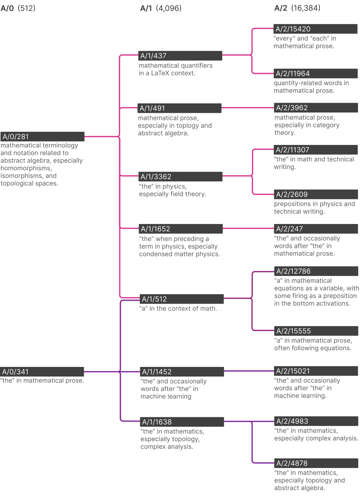

It's worth noting that these more precise features reflect differences in model predictions as well as activations. The general the in mathematical prose feature ([A/0/341](https://transformer-circuits.pub/2023/monosemantic-features/vis/a0.html#feature-341)) has highly generic mathematical tokens for its top positive logits (e.g. supporting the denominator, the remainder, the theorem), whereas the more finely split machine learning version ([A/2/15021](https://transformer-circuits.pub/2023/monosemantic-features/vis/a2.html#feature-15021)) has much more specific topical predictions (e.g. the dataset, the classifier). Likewise, our abstract algebra and topology feature ([A/2/4878](https://transformer-circuits.pub/2023/monosemantic-features/vis/a2.html#feature-4878)) supports the quotient and the subgroup, and the gravitation and field theory feature ([A/2/2609](https://transformer-circuits.pub/2023/monosemantic-features/vis/a2.html#feature-2609)) supports the gauge, the Lagrangian, and the spacetime.

值得注意的是，这些更精确的特征不仅反映激活的差异，也反映模型预测的差异。数学散文中泛指的 the 特征（[A/0/341](https://transformer-circuits.pub/2023/monosemantic-features/vis/a0.html#feature-341)）的 top 正 logit 是高度泛用的数学词元（如 supporting the denominator、the remainder、the theorem），而分裂更细的机器学习版本（[A/2/15021](https://transformer-circuits.pub/2023/monosemantic-features/vis/a2.html#feature-15021)）则有具体主题得多的预测（如 the dataset、the classifier）。同样，我们的抽象代数与拓扑特征（[A/2/4878](https://transformer-circuits.pub/2023/monosemantic-features/vis/a2.html#feature-4878)）支持 the quotient 和 the subgroup，引力与场论特征（[A/2/2609](https://transformer-circuits.pub/2023/monosemantic-features/vis/a2.html#feature-2609)）支持 the gauge、the Lagrangian 和 the spacetime。

#### 看起来像 Bug 的特征（Features which seemed like Bugs）

When we limit dictionary learning to use very few learned sparse features, the features that emerge sometimes look quite strange. In particular, there are a large number of high-activation magnitude features which each only fire on a single token, and which seem to fire on every instance of that token. Such features are strange because the model could achieve the same effect entirely by learning different bigram statistics, and so should have no reason to devote MLP capacity to these. Similar features were also recently observed in a report by Smith .

当我们限制字典学习只使用很少的学到的稀疏特征时，涌现的特征有时看起来相当奇怪。特别地，存在大量高激活幅值的特征，它们各自只在一个单词元上激活，而且似乎在该词元的每个实例上都激活。这类特征很奇怪，因为模型完全可以通过学习不同的二元组（bigram）统计来达到同样效果，因此应该没有理由为这些分配 MLP 容量。类似特征最近也在 Smith 的报告中观察到。

We believe that feature splitting explains this phenomenon: the model hasn’t learned a single feature firing on the letter P,[^33] for instance. Rather, it’s learned many features which fire on P in different contexts[^34], with correspondingly different effects on the neuron activations and output logits (see below). At a sufficiently coarse level dictionary learning cannot tell the difference between these, but when we allow it to use more learned sparse features, the features split and refine into a zoo of different P features that fire in different contexts.

我们相信特征分裂解释了这一现象：例如，模型并没有学到一个在字母 P 上激活的单个特征。[^33] 相反，它学到了许多在不同语境中 P 上激活的特征[^34]，它们对神经元激活和输出 logit 有相应不同的影响（见下文）。在足够粗的层面上，字典学习无法区分这些；但当我们允许它使用更多学到的稀疏特征时，这些特征便分裂并细化为一大群在不同语境中激活的不同的 P 特征。

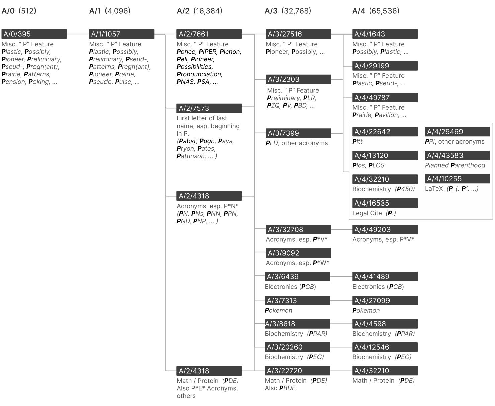

We also observed the converse, where multiple features seemed to cover roughly the same concept or context. For example, there were three features in [A/1](https://transformer-circuits.pub/2023/monosemantic-features/vis/a1.html) which fired on (subsets of) base64 strings, and predicted plausible base64 tokens like zf, mF, and Gp. One of these features was discussed in detail earlier, where we showed it fired for base64 strings. But we also observed that it didn't fire for all base64 strings – why? And what are the other two features doing? Why are there three?

我们也观察到了相反的情况：多个特征似乎覆盖大致相同的概念或语境。例如，[A/1](https://transformer-circuits.pub/2023/monosemantic-features/vis/a1.html) 中有三个特征在（子集的）base64 字符串上激活，并预测貌似合理的 base64 词元如 zf、mF 和 Gp。其中一个特征在之前有详细讨论，我们展示了它在 base64 字符串上激活。但我们也观察到它并非对所有 base64 字符串都激活——为什么？另外两个特征在做什么？为什么是三个？

In [A/0](https://transformer-circuits.pub/2023/monosemantic-features/vis/a0.html) (with 512 features), the story is simple. There is only one base64-related feature, [A/0/45](https://transformer-circuits.pub/2023/monosemantic-features/vis/a0.html#feature-45), which seems to activate on all tokens of base64-encoded strings. But in [A/1](https://transformer-circuits.pub/2023/monosemantic-features/vis/a1.html), that feature splits into three different features whose activations seem to jointly cover those of [A/0/45](https://transformer-circuits.pub/2023/monosemantic-features/vis/a0.html#feature-45):

在 [A/0](https://transformer-circuits.pub/2023/monosemantic-features/vis/a0.html)（512 个特征）中，情况很简单。只有一个与 base64 相关的特征 [A/0/45](https://transformer-circuits.pub/2023/monosemantic-features/vis/a0.html#feature-45)，它似乎在 base64 编码字符串的所有词元上激活。但在 [A/1](https://transformer-circuits.pub/2023/monosemantic-features/vis/a1.html) 中，该特征分裂成三个不同特征，它们的激活似乎联合覆盖了 [A/0/45](https://transformer-circuits.pub/2023/monosemantic-features/vis/a0.html#feature-45) 的激活：

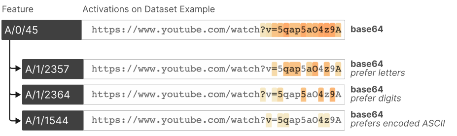

Two of these features seem relatively straightforward. [A/1/2357](https://transformer-circuits.pub/2023/monosemantic-features/vis/a1.html#feature-2357) seems to fire preferentially on letters in base64, while [A/1/2364](https://transformer-circuits.pub/2023/monosemantic-features/vis/a1.html#feature-2364) seems to fire preferentially on digits.

其中两个特征看起来相当直接。[A/1/2357](https://transformer-circuits.pub/2023/monosemantic-features/vis/a1.html#feature-2357) 似乎优先在 base64 中的字母上激活，而 [A/1/2364](https://transformer-circuits.pub/2023/monosemantic-features/vis/a1.html#feature-2364) 似乎优先在数字上激活。

Comparing the logit weights of these features reveals that they predict largely the same sets of tokens, with one significant difference: the feature that fires on digits has much lower logit weights for predicting digits. Put another way, if the present token is made of digits, the model will predict that the next token is a non-digit base64 token.

比较这些特征的 logit 权重会发现，它们预测的词元集合大体相同，但有一个显著差异：在数字上激活的特征对预测数字的 logit 权重要低得多。换句话说，如果当前词元由数字组成，模型会预测下一个词元是非数字的 base64 词元。

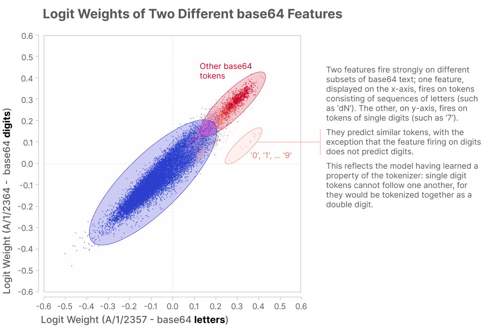

We believe this is likely an artifact of tokenization! If a single digit were followed by another digit, they would have been tokenized together as a single token; [Bq][8][9][mp] would never occur, as it would be tokenized instead as [Bq][89][mp]. Thus even in a random base64 string, the fact that the current token is a single digit gives information about the next token.

我们认为这很可能是分词的产物！如果一个数字后面跟着另一个数字，它们会被一起分词为单个词元；[Bq][8][9][mp] 永远不会出现，因为它会被分词为 [Bq][89][mp]。因此即使在随机 base64 字符串中，当前词元是单个数字这一事实也携带关于下一个词元的信息。

But what about the third feature, [A/1/1544](https://transformer-circuits.pub/2023/monosemantic-features/vis/a1.html#feature-1544)? At first glance, there isn't an obvious rule for when it fires. But if we look more closely, we notice that it seems to respond to base64 strings which encode ASCII text.[^35] If we look at the top dataset examples for each feature, we find that examples for [A/1/1544](https://transformer-circuits.pub/2023/monosemantic-features/vis/a1.html#feature-1544) contain substrings which decode as ASCII, while none of the top activating examples for [A/1/2357](https://transformer-circuits.pub/2023/monosemantic-features/vis/a1.html#feature-2357) or [A/1/2364](https://transformer-circuits.pub/2023/monosemantic-features/vis/a1.html#feature-2364) do:[^36]

但第三个特征 [A/1/1544](https://transformer-circuits.pub/2023/monosemantic-features/vis/a1.html#feature-1544) 呢？乍一看，它的激活时机没有明显规律。但如果我们看得更仔细，会注意到它似乎响应编码 ASCII 文本的 base64 字符串。[^35] 如果查看每个特征的 top 数据集样本，我们会发现 [A/1/1544](https://transformer-circuits.pub/2023/monosemantic-features/vis/a1.html#feature-1544) 的样本包含解码为 ASCII 的子串，而 [A/1/2357](https://transformer-circuits.pub/2023/monosemantic-features/vis/a1.html#feature-2357) 或 [A/1/2364](https://transformer-circuits.pub/2023/monosemantic-features/vis/a1.html#feature-2364) 的 top 激活样本都没有：[^36]

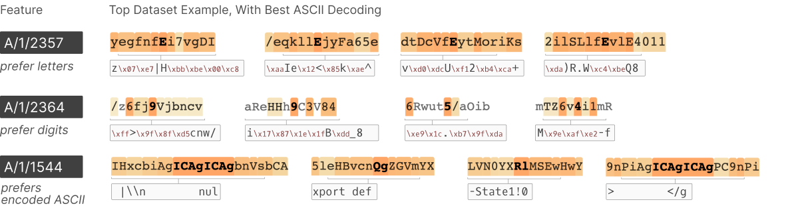

This pattern of investigation, where one looks at coarser sets of features to understand categories of model behavior, and then at more refined sets of features to investigate the subtleties of that behavior, may prove well adapted to larger models where the feature set is expected to be quite large.

这种研究模式——先看较粗的特征集合来理解模型行为的类别，再看更精细的特征集合来研究该行为的微妙之处——可能被证明非常适合特征集合预期会非常庞大的更大模型。

It's also worth noting how dictionary learning features were able to surprise us here. Many approaches to interpretability are top-down, and look for things we expect. But who would have known that models not only have a base64 feature, but that they distinguish between distinct kinds of base64 strings? This reminds us of cases like high-low frequency detectors or multimodal neurons where surprising and unexpected features were discovered in vision models.

同样值得注意的是，字典学习特征在这里让我们感到惊讶。许多可解释性方法是自顶向下的，寻找我们预期的东西。但谁能想到，模型不仅有 base64 特征，还区分不同种类的 base64 字符串？这让我们想起视觉模型中发现令人惊讶的意外特征的案例，例如高频-低频检测器或多模态神经元。
### 普适性（Universality）

One of the biggest "meta questions" about features is whether they're [universal](https://distill.pub/2020/circuits/zoom-in/#claim-3) – do the same features form across different models? This question is generally important because it bears on whether the hard-earned lessons from studying one model will generalize to others. But it's especially important in the context of attempting to extract features from superposition because universality could provide significant evidence that the features we're extracting are "real", or at least reproducible.[^37]

关于特征最大的"元问题"之一是它们是否[普适](https://distill.pub/2020/circuits/zoom-in/#claim-3)（universal）——同样的特征是否会在不同模型中形成？这个问题总体上很重要，因为它关系到研究一个模型所得来的来之不易的经验是否会推广到其他模型。但在试图从叠加中提取特征的背景下它尤其重要，因为普适性可以提供重要证据，表明我们提取的特征是"真实的"，或至少是可复现的。[^37]

Earlier, we saw that all the features we performed detailed analyses of (e.g. the Arabic feature, or base64 feature) were universal between two one-layer models. But is this true for typical features in our model? And how broadly is it true – do we only observe the same feature if we train models of the same architectures on the same dataset, or do these features also occur in more divergent models? This section will seek to address these two questions. The first subsection will quantitatively analyze how widespread universality is between the two one-layer models we studied, while the second will compare the features we find to others reported in the literature in search of a stronger form of universality.

在前文我们看到，我们做过详细分析的所有特征（如阿拉伯文字特征或 base64 特征）在两个单层模型之间都是普适的。但这对于模型中的典型特征也成立吗？它在多大范围内成立——我们只有在相同数据集上训练相同架构的模型时才观察到相同特征，还是这些特征也出现在更分化的模型中？本节将试图解决这两个问题。第一小节将定量分析普适性在我们研究的两个单层模型之间的广泛程度；第二小节将把我们发现的特征与文献中报道的其他特征进行比较，以寻找更强形式的普适性。

We observe substantial universality of both types.[^38] At a high-level, this makes sense: if a feature is useful to one model in representing the dataset, it's likely useful to others, and if two models represent the same feature then a good dictionary learning algorithm should find it.

我们观察到这两种类型都有实质性的普适性。[^38] 从高层来看，这是合理的：如果一个特征对某个模型表示数据集有用，它很可能对其他模型也有用；而如果两个模型表示同一个特征，那么一个好的字典学习算法应该能找到它。

#### 比较两个单层 Transformer 之间的特征（Comparing features between two one-layer transformers）

To compare features from different models, we need model-independent ways to represent a feature.

为了比较不同模型的特征，我们需要与模型无关的方式来表示一个特征。

One natural approach is to think of a feature as a function assigning values to datapoints; two features would be similar in this sense if they take similar values over a diverse set of data. This general approach has been explored by a number of prior papers (e.g. ). In practice, this can be approximated by representing the feature as a vector, with indices corresponding to a fixed set of data points. We call the correlations between these vectors the activation similarity between features.

一种自然方法是把特征看作给数据点赋值的函数；如果两个特征在多样的数据上取相似值，那么它们在这个意义上是相似的。这一总体思路已被许多先前论文探索过（例如）。实践中，这可以近似为把特征表示为一个向量，其索引对应一组固定的数据点。我们把这些向量之间的相关称为特征之间的激活相似度（activation similarity）。

A second natural approach is to think of a feature in terms of its downstream effects; two features would be similar in this sense if their activation changes their models' predictions in similar ways. In our one-layer model, a simple approximation to this is the logit weights. This approximation represents each feature as a vector with indices corresponding to vocabulary tokens. We call the correlations between these vectors the logit weight similarity between features.

第二种自然方法是从下游效应的角度考虑特征；如果两个特征的激活以相似的方式改变各自模型的预测，那么它们在这个意义上是相似的。在我们的单层模型中，它的一个简单近似就是 logit 权重。该近似把每个特征表示为一个向量，其索引对应词汇表词元。我们把这些向量之间的相关称为特征之间的 logit 权重相似度（logit weight similarity）。

These two notions of similarity correspond to the correlations of the points in the two scatter plots we used when analyzing individual features earlier. We've reproduced the plots for the Arabic feature below:

这两种相似度对应我们之前分析单个特征时使用的两幅散点图中点的相关性。我们在下图中重现了阿拉伯文字特征的这些图：

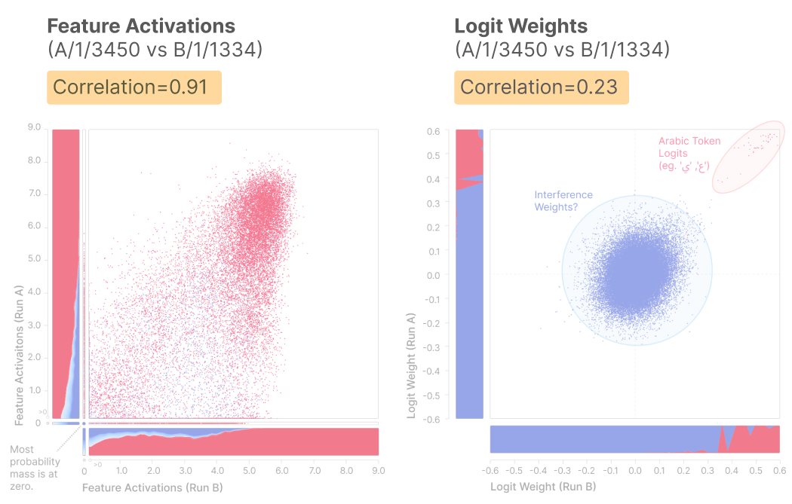

For each feature in run [A/1](https://transformer-circuits.pub/2023/monosemantic-features/vis/a1.html), we find the closest feature by activation similarity in run [B/1](https://transformer-circuits.pub/2023/monosemantic-features/vis/b1.html), which is a different dictionary learning run trained on different activations from a different transformer with different random seeds but otherwise identical hyperparameters. We find that many features are highly similar between models, with features in [A/1](https://transformer-circuits.pub/2023/monosemantic-features/vis/a1.html) having a median activation correlation of 0.72 with the most similar feature from [B/1](https://transformer-circuits.pub/2023/monosemantic-features/vis/b1.html). (We perform the same analysis finding the closest neurons between the transformers, and find significantly less similarity, with median activation correlation 0.46.) The features with low activation correlation between models may represent different "feature splittings" in the dictionaries learned or different "true features" learned by the base models.

对于运行 [A/1](https://transformer-circuits.pub/2023/monosemantic-features/vis/a1.html) 中的每个特征，我们在运行 [B/1](https://transformer-circuits.pub/2023/monosemantic-features/vis/b1.html) 中按激活相似度找到最接近的特征；B/1 是另一个字典学习运行，它在来自另一个 Transformer 的不同激活上训练，随机种子不同，但其他超参数完全相同。我们发现许多特征在模型之间高度相似：[A/1](https://transformer-circuits.pub/2023/monosemantic-features/vis/a1.html) 中的特征与 [B/1](https://transformer-circuits.pub/2023/monosemantic-features/vis/b1.html) 中最相似特征的激活相关中位数为 0.72。（我们对 Transformer 之间最接近的神经元做了同样的分析，发现相似性显著更低，激活相关中位数为 0.46。）模型间激活相关较低的特征，可能代表所学字典中不同的"特征分裂"，或基础模型学到的不同"真实特征"。

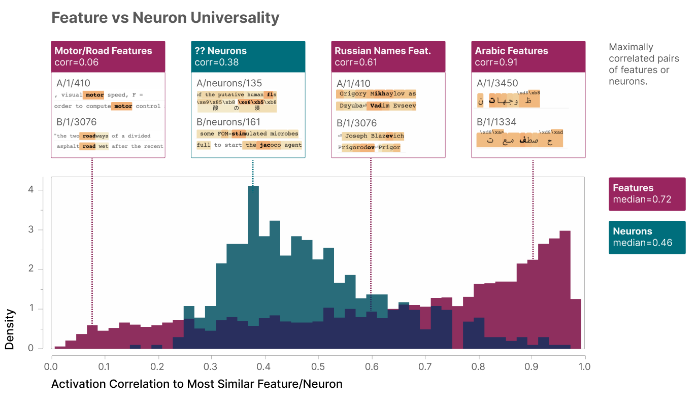

A natural next question is whether features that fire on the same tokens also have the same logit effects. That is, how well do activation similarity and logit weight similarity agree?

一个自然的后续问题是：在相同词元上激活的特征是否也有相同的 logit 效应？也就是说，激活相似度与 logit 权重相似度的一致程度如何？

Some gap between the two is visible for the Arabic feature above: the "important tokens" for the features' effects (the ones in Arabic script) are upweighted by features from both models, but there is a large cloud of tokens with smaller effects that appear to almost be isotropic noise, resulting in a logit weight correlation of just 0.23, significantly below the activation correlation of 0.91.

在上面的阿拉伯文字特征中可以看到两者之间的一些差距：对特征效应而言的"重要词元"（阿拉伯文字的那些）被两个模型的特征上调，但存在一大团效应较小的词元，看起来几乎是各向同性的噪声，导致 logit 权重相关仅为 0.23，显著低于 0.91 的激活相关。

In the scatterplot below, we find that this kind of disagreement is widespread.

在下面的散点图中，我们发现这种不一致是普遍存在的。

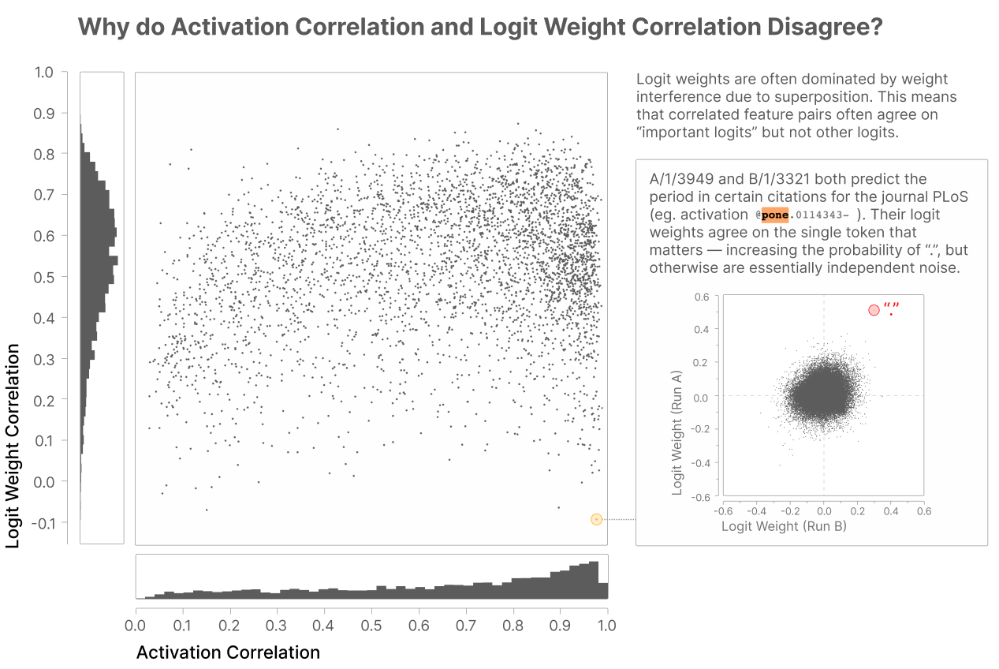

The most dramatic example of this disparity is for the features [A/1/3949](https://transformer-circuits.pub/2023/monosemantic-features/vis/a1.html#feature-3949) and [B/1/3321](https://transformer-circuits.pub/2023/monosemantic-features/vis/b1.html#feature-3321), with an activation correlation of 0.98 but a negative logit weight correlation. These features fire on pone (and occasionally on pgen and pcbi) as abbreviations for the journal name PLOSOne in citations, like @pone.0082392, and predict the . that follows.[^39]

这种差异最戏剧性的例子是特征 [A/1/3949](https://transformer-circuits.pub/2023/monosemantic-features/vis/a1.html#feature-3949) 与 [B/1/3321](https://transformer-circuits.pub/2023/monosemantic-features/vis/b1.html#feature-3321)：激活相关为 0.98，但 logit 权重相关为负。这些特征在 pone（偶尔在 pgen 和 pcbi）上激活——它们是引用中期刊名 PLOSOne 的缩写，如 @pone.0082392——并预测其后紧跟的句点 .。[^39]

Zooming in on the logit weight scatterplot (inset in the figure above), we see that only the . token has high logit weight in both models, and that every other token is in the 'interference' portion of the logit weight distribution. Indeed, the model may simply not care about what the feature does to tokens which were already implausible because they are suppressed by the direct path, attention layer, or other features of the MLP.

放大 logit 权重散点图（上图插图），我们看到只有词元 . 在两个模型中都有高 logit 权重，其他所有词元都处于 logit 权重分布的"干扰"部分。确实，模型可能根本不在乎特征对本已不太可能的词元做什么，因为那些词元已被直接路径、注意力层或 MLP 的其他特征所压制。

We want to measure something more like "the actual effect a feature has on token probabilities." One way to get at this would be to compute a vector of ablation effects for every feature on every data point; pairs of features whose ablations hurt the model's predictions on the same tokens must have been predicting the same thing. Unfortunately, this would be rather expensive computationally. Instead, we scale the activation vector of a feature by the logit weights of the tokens that empirically come next in the dataset to produce an attribution vector.[^40] Correlations between those vectors provide an attribution similarity that combines both the activity of the feature with the effect it has on the loss. We find that the attribution similarity correlates quite highly with the activation similarity, meaning that features that were coactive between models were useful at predicting the same tokens.

我们想度量更类似"特征对词元概率的实际影响"的东西。达到这一目的的一种方式，是为每个特征在每个数据点上计算消融效应向量；其消融在同一批词元上损害模型预测的特征对，必然在预测相同的东西。遗憾的是，这在计算上相当昂贵。作为替代，我们把一个特征的激活向量乘以数据集中经验上接下来出现的词元的 logit 权重，得到归因向量（attribution vector）。[^40] 这些向量之间的相关提供了归因相似度（attribution similarity），它同时结合了特征的活动与它对损失的影响。我们发现归因相似度与激活相似度相当高度相关，这意味着在模型间共同激活的特征在预测相同词元上是有用的。

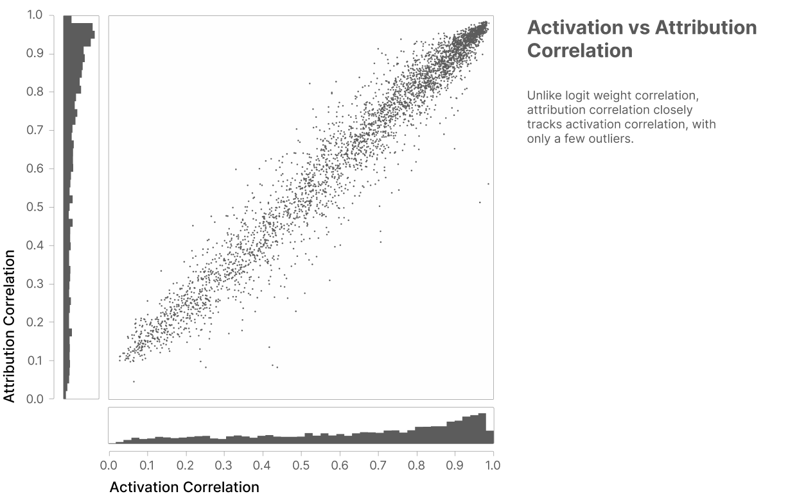

In light of this, we feel that the activation correlation used throughout the paper is in fact a good proxy for both notions of universality in the context of our one-layer models.

鉴于此，我们认为全文使用的激活相关，实际上是在我们单层模型背景下两种普适性概念的良好代理。

#### 与文献中的特征比较（Comparing features with the literature）

So far, we've established that many of our features are universal in a limited sense. Features found in one of our transformers can also be found in an alternative version trained with a different random seed. But this second model has an identical architecture and was trained on identical data. This is the most minimal version of universality one could hope for. Despite this, we believe that many of the features we've found are universal in a deeper sense, because very similar features have been reported in the literature before.

到目前为止，我们已经确立许多特征在有限意义上是普适的：在其中一个 Transformer 中发现的特征，也可以在用不同随机种子训练的替代版本中找到。但这第二个模型有完全相同的架构，并在相同数据上训练。这是人们所能期望的最小版本的普适性。尽管如此，我们相信我们发现的许多特征在更深的意义上是普适的，因为非常相似的特征先前已在文献中被报道过。

The first comparison which struck us is that many features seem quite similar to neurons we previously found in one-layer SoLU models, which use an activation function designed to make neurons more monosemantic . In particular, we observed a base64 neuron, hexadecimal neuron, and all caps neuron in our SoLU investigations, and base64 ([A/0/45](https://transformer-circuits.pub/2023/monosemantic-features/vis/a0.html#feature-45)), hexadecimal ([A/0/119](https://transformer-circuits.pub/2023/monosemantic-features/vis/a0.html#feature-119)), and all caps ([A/0/317](https://transformer-circuits.pub/2023/monosemantic-features/vis/a0.html#feature-317)) features here. Discussion of some of these neurons can be found in [Section 6.3.1](https://transformer-circuits.pub/2022/solu/index.html#section-6-3-1) of the SoLU paper.

第一个令我们印象深刻的比较是：许多特征看起来与我们之前在单层 SoLU 模型中发现的神经元相当相似，SoLU 使用一种旨在使神经元更单义的激活函数。特别地，我们在 SoLU 研究中观察到 base64 神经元、十六进制神经元和全大写神经元，而这里有 base64（[A/0/45](https://transformer-circuits.pub/2023/monosemantic-features/vis/a0.html#feature-45)）、十六进制（[A/0/119](https://transformer-circuits.pub/2023/monosemantic-features/vis/a0.html#feature-119)）和全大写（[A/0/317](https://transformer-circuits.pub/2023/monosemantic-features/vis/a0.html#feature-317)）特征。其中一些神经元的讨论见 SoLU 论文的[第 6.3.1 节](https://transformer-circuits.pub/2022/solu/index.html#section-6-3-1)。

We also find many features similar to Smith , who applies dictionary learning to the residual stream. In addition to us also observing preponderance of single token features they note (see our interpretation of this phenomenon), we find a similar German detector (e.g. [A/0/493](https://transformer-circuits.pub/2023/monosemantic-features/vis/a0.html#feature-493)) and similar title case detectors (e.g. [A/0/508](https://transformer-circuits.pub/2023/monosemantic-features/vis/a0.html#feature-508)). Likewise, we find a number of features similar to Gurnee et al. , including a "prime factors" feature  ([A/4/22414](https://transformer-circuits.pub/2023/monosemantic-features/vis/a4.html#feature-22414)) and a French feature ([A/0/14](https://transformer-circuits.pub/2023/monosemantic-features/vis/a0.html#feature-14)).

我们还发现许多与 Smith 相似的特征，后者把字典学习应用于残差流（residual stream）。除了我们也观察到他们所指出的单词元特征的盛行之外（见我们对此现象的解释），我们还发现了类似的德语检测器（如 [A/0/493](https://transformer-circuits.pub/2023/monosemantic-features/vis/a0.html#feature-493)）和类似的标题式大小写检测器（如 [A/0/508](https://transformer-circuits.pub/2023/monosemantic-features/vis/a0.html#feature-508)）。同样，我们发现许多与 Gurnee 等人相似的特征，包括一个"质因数"特征（[A/4/22414](https://transformer-circuits.pub/2023/monosemantic-features/vis/a4.html#feature-22414)）和一个法语特征（[A/0/14](https://transformer-circuits.pub/2023/monosemantic-features/vis/a0.html#feature-14)）。

At a more abstract level, many features we find seem similar to features reported in multimodal models by Goh et al. . For example, we find many similar features including an Australia feature ([A/3/16085](https://transformer-circuits.pub/2023/monosemantic-features/vis/a3.html#feature-16085)), Canada feature ([A/3/13683](https://transformer-circuits.pub/2023/monosemantic-features/vis/a3.html#feature-13683)), Africa feature ([A/3/14490](https://transformer-circuits.pub/2023/monosemantic-features/vis/a3.html#feature-14490)), and Israel-Palestine feature ([A/3/739](https://transformer-circuits.pub/2023/monosemantic-features/vis/a3.html#feature-739)) which predict locations in those regions when grammatically appropriate. This vaguely mirrors "region neurons" reported by Goh et al.'s paper. For other families of features, the parallels are less clear. For example, one of the most striking results of Goh et al. was person detector neurons (similar to famous results in neuroscience). We find some features that are person detectors in very narrow contexts, such as responding to a person’s name and predicting appropriate next words, or predicting their name (e.g. [A/1/3240](https://transformer-circuits.pub/2023/monosemantic-features/vis/a1.html#feature-3240)  is somewhat similar to Goh et al.'s Trump neuron), but they seem quite narrow. We also don't find features that seem clearly analogous to Goh et al.'s emotion neurons.

在更抽象的层面上，我们发现的许多特征似乎与 Goh 等人在多模态模型中报道的特征相似。例如，我们发现许多相似的特征，包括澳大利亚特征（[A/3/16085](https://transformer-circuits.pub/2023/monosemantic-features/vis/a3.html#feature-16085)）、加拿大特征（[A/3/13683](https://transformer-circuits.pub/2023/monosemantic-features/vis/a3.html#feature-13683)）、非洲特征（[A/3/14490](https://transformer-circuits.pub/2023/monosemantic-features/vis/a3.html#feature-14490)）和以色列-巴勒斯坦特征（[A/3/739](https://transformer-circuits.pub/2023/monosemantic-features/vis/a3.html#feature-739)），它们在语法合适时预测这些地区的位置。这隐约映照了 Goh 等人论文报道的"区域神经元"。对其他特征家族，对应关系则不那么清晰。例如，Goh 等人最引人注目的结果之一是人物检测神经元（类似神经科学中的著名结果）。我们发现了在一些非常狭窄的语境中作为人物检测器的特征，例如响应人名并预测合适的下一个词，或预测他们的名字（如 [A/1/3240](https://transformer-circuits.pub/2023/monosemantic-features/vis/a1.html#feature-3240) 与 Goh 等人的 Trump 神经元有些相似），但它们看起来相当狭窄。我们也没有发现明显类似 Goh 等人的情绪神经元的特征。

### "有限状态自动机"（"Finite State Automata"）

One of the most striking phenomena we've observed in our study of the features in one-layer models is the existence of "finite state automata"-like assemblies of features. These assemblies aren't circuits in the conventional sense – they're formed by one feature increasing the probability of tokens, which in turn cause another feature to fire on the next step, and so on.[^41]

我们在研究单层模型特征时观察到的最引人注目的现象之一，是"有限状态自动机"式的特征组合的存在。这些组合并不是常规意义上的电路——它们由一个特征提高某些词元的概率、这些词元又反过来使另一个特征在下一步激活、如此往复而形成。[^41]

The simplest example of this is features which excite themselves on the next token, forming a single node loop. For example, a base64 feature increases the probability of tokens like Qg and zA – plausible continuations which would continue to activate it.

最简单的例子是那些在下一个词元上激发自己的特征，形成单节点回路。例如，一个 base64 特征提高 Qg 和 zA 等词元的概率——这些合理的续写会继续激活它。

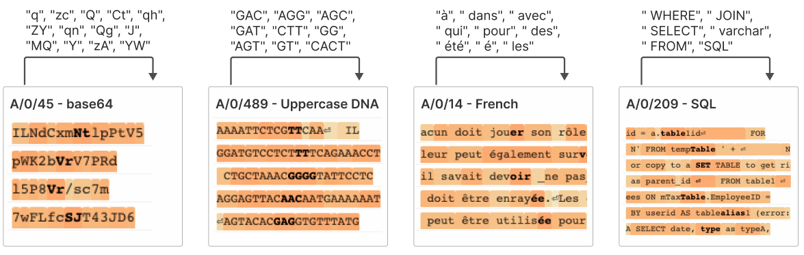

It's worth noting that these examples are from [A/0](https://transformer-circuits.pub/2023/monosemantic-features/vis/a0.html), a dictionary learning run which is not overcomplete (the dictionary dimensionality is 512, equal to the transformer MLP dimension). As we move to runs with larger numbers of features, the central feature will experience feature splitting, and become a more complex system.

值得注意的是，这些例子来自 [A/0](https://transformer-circuits.pub/2023/monosemantic-features/vis/a0.html)，一个并不过完备的字典学习运行（字典维度为 512，等于 Transformer 的 MLP 维度）。当我们转向特征数更多的运行时，中心特征会经历特征分裂，变成一个更复杂的系统。

Let's now consider a two-node system for producing variables in "all caps snake case" (e.g. ARRAY_MAX_VALUE). One node ([A/0/207](https://transformer-circuits.pub/2023/monosemantic-features/vis/a0.html#feature-207)) activates on the all caps text tokens, the other ([A/0/358](https://transformer-circuits.pub/2023/monosemantic-features/vis/a0.html#feature-358)) on underscores:

现在考虑一个用于产生"全大写蛇形命名"（all caps snake case，如 ARRAY_MAX_VALUE）变量的两节点系统。一个节点（[A/0/207](https://transformer-circuits.pub/2023/monosemantic-features/vis/a0.html#feature-207)）在全大写文本词元上激活，另一个（[A/0/358](https://transformer-circuits.pub/2023/monosemantic-features/vis/a0.html#feature-358)）在下划线上激活：

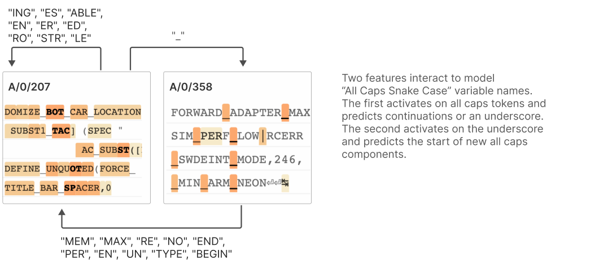

This type of two-node system is quite common for languages where Unicode characters are sometimes split into two tokens. (Again, with more feature splitting, these would expand into more complex systems.)

这种两节点系统在 Unicode 字符有时被拆成两个词元的语言中相当常见。（同样，随着更多特征分裂，这些会扩展成更复杂的系统。）

For example, Tamil Unicode characters ([block U+0B80–U+0BFF](https://www.compart.com/en/unicode/block/U+0B80)) are typically split into two tokens. For example, the character "ண" ([U+0BA3](https://www.compart.com/en/unicode/U+0BA3)) is tokenized as \xe0\xae followed by \xa3.  The first part (\xe0\xae or \xe0\xaf) roughly specifies the Unicode block, while the second component specifies the character within that block. Thus, it's natural for the model to alternate between two features, one for the Unicode prefix token, and one for the suffix token.

例如，泰米尔 Unicode 字符（[块 U+0B80–U+0BFF](https://www.compart.com/en/unicode/block/U+0B80)）通常被拆成两个词元。例如，字符"ண"（[U+0BA3](https://www.compart.com/en/unicode/U+0BA3)）被分词为 \xe0\xae 后跟 \xa3。前半部分（\xe0\xae 或 \xe0\xaf）大致指定 Unicode 块，而第二部分指定该块中的字符。因此，模型在两个特征之间交替是很自然的：一个对应 Unicode 前缀词元，一个对应后缀词元。

A more complex example is Chinese. While many common Chinese characters get dedicated tokens, many others are split. This is further complicated by Chinese characters being spread over many Unicode blocks, and those blocks being large and cutting across many logical blocks specified in terms of bytes. To understand the state machine the model implements to handle this, the key observation is that complete characters are similar to the "suffix" part of a split character: both can be followed by either a new complete character, or a new prefix. Thus, we observe two features, one of which fires on either complete characters or the suffix (predicting either a new complete character, or a prefix), while the other only fires on the prefixes and predicts suffixes.

一个更复杂的例子是中文。虽然许多常用汉字有专属词元，但许多其他汉字被拆分。汉字分布在许多 Unicode 块上，而这些块很大、并按字节切分许多逻辑块，这使情况更加复杂。为理解模型为处理这一情况而实现的状态机，关键观察是：完整字符与被拆分字符的"后缀"部分相似——两者之后既可以跟新的完整字符，也可以跟新的前缀。因此，我们观察到两个特征：一个在完整字符或后缀（无论哪个）上激活（预测新的完整字符或前缀），另一个只在前缀上激活并预测后缀。

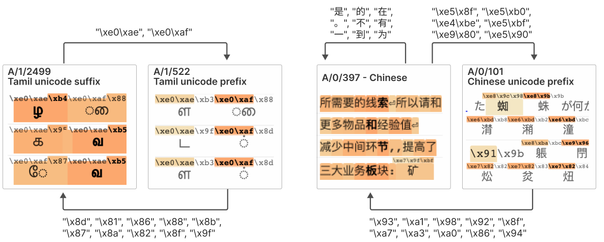

Let's now consider a very simple four node system which models HTML. The "main path" through it is:

现在考虑一个非常简单的、对 HTML 建模的四节点系统。穿过它的"主路径"是：

- [A/0/20](https://transformer-circuits.pub/2023/monosemantic-features/vis/a0.html#feature-20) fires on open tags and predicts tag names

- [A/0/20](https://transformer-circuits.pub/2023/monosemantic-features/vis/a0.html#feature-20) 在开始标签上激活并预测标签名

- [A/0/0](https://transformer-circuits.pub/2023/monosemantic-features/vis/a0.html#feature-0) fires on tag names and predicts tag closes

- [A/0/0](https://transformer-circuits.pub/2023/monosemantic-features/vis/a0.html#feature-0) 在标签名上激活并预测标签闭合

- [A/0/30](https://transformer-circuits.pub/2023/monosemantic-features/vis/a0.html#feature-30) fires on tag closes and predicts whitespace

- [A/0/30](https://transformer-circuits.pub/2023/monosemantic-features/vis/a0.html#feature-30) 在标签闭合上激活并预测空白

- [A/0/494](https://transformer-circuits.pub/2023/monosemantic-features/vis/a0.html#feature-494) fires on whitespace and predicts new tag opens.

- [A/0/494](https://transformer-circuits.pub/2023/monosemantic-features/vis/a0.html#feature-494) 在空白上激活并预测新的标签开始。

A prototypical sample this might generate is something like 
\n\t\t.

它可能生成的一个原型样本形如 
\n\t\t。

The full system can be seen below:

完整系统如下图所示：

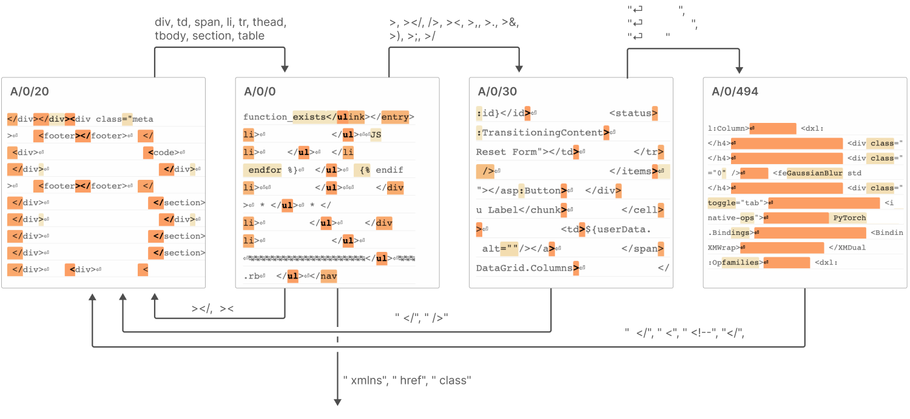

Keep in mind that we're focusing on the [A/0](https://transformer-circuits.pub/2023/monosemantic-features/vis/a0.html) features where this is very simple – if we looked at [A/1](https://transformer-circuits.pub/2023/monosemantic-features/vis/a1.html), we'd find something much more complex! One particularly striking shortcoming of the [A/0](https://transformer-circuits.pub/2023/monosemantic-features/vis/a0.html) features is that they don't describe what happens when [A/0/0](https://transformer-circuits.pub/2023/monosemantic-features/vis/a0.html#feature-0) emits a token like href, which leads to a more complex state.

请记住，我们聚焦的是 [A/0](https://transformer-circuits.pub/2023/monosemantic-features/vis/a0.html) 的特征，这里的系统非常简单——如果我们看 [A/1](https://transformer-circuits.pub/2023/monosemantic-features/vis/a1.html)，会发现复杂得多的东西！[A/0](https://transformer-circuits.pub/2023/monosemantic-features/vis/a0.html) 特征一个特别明显的不足是：它们没有描述当 [A/0/0](https://transformer-circuits.pub/2023/monosemantic-features/vis/a0.html#feature-0) 产生像 href 这样的词元时会发生什么，那会导向一个更复杂的状态。

It's important to note that these features can be quite contextual. There are several features related to IRC transcripts which form a totally different finite state automata like system:

重要的是要注意，这些特征可以相当语境化。有几个与 IRC 聊天记录相关的特征，形成一个完全不同的有限状态自动机式系统：

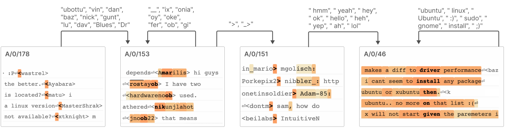

A prototypical sample this might generate is something like <nickonia_> lol ubuntu ;). Presumably the Pile dataset heavily represents IRC transcripts about linux.

它可能生成的一个原型样本形如 <nickonia_> lol ubuntu ;)。推测 The Pile 数据集中大量包含关于 linux 的 IRC 聊天记录。

One particularly interesting behavior is the apparent memorization of specific phrases. This can be observed only in runs with relatively large numbers of features (like [A/4](https://transformer-circuits.pub/2023/monosemantic-features/vis/a4.html)). In the following example, a sequence of features seem to functionally memorize the bolded part of the phrase MERCHANTABILITY or FITNESS FOR A PARTICULAR PURPOSE. This is a relatively standard legal language, and notably occurs in the file headers for popular open source software licenses, meaning the model likely saw it many times during training.

一个特别有趣的行为是对特定短语的明显记忆。这只能在特征数相对较多的运行（如 [A/4](https://transformer-circuits.pub/2023/monosemantic-features/vis/a4.html)）中观察到。在下面的例子中，一串特征似乎在功能上记住了短语 MERCHANTABILITY or FITNESS FOR A PARTICULAR PURPOSE 中加粗的部分。这是相对标准的法律用语，特别出现在流行开源软件许可证的文件头中，意味着模型在训练期间很可能多次见过它。

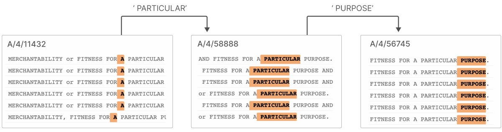

This seems like an example of the mechanistic theory of memorization we described in Henighan et al. – we observe features which appear to be relatively binary and respond to a very specific situation. This might also be seen as an instance of mechanistic anomaly detection : the model behaves differently in a specific, narrow case. It's somewhat surprising that something so narrow can be found in a model with only 512 neurons; from this perspective it's an interesting example of superposition's ability to embed many things in few neurons. On the other hand, because these mechanisms are buried deep in superposition, they are likely very noisy.

这似乎是我们在 Henighan 等人中描述的记忆机制理论的一个例子——我们观察到一些看起来相对二值、响应非常特定情形的特征。这也可以看作机制异常检测（mechanistic anomaly detection）的一个实例：模型在特定的狭窄情形下表现不同。如此狭窄的东西竟能在只有 512 个神经元的模型中找到，这有些令人惊讶；从这个角度看，它是叠加在少量神经元中嵌入许多事物的能力的一个有趣例子。另一方面，由于这些机制深埋在叠加之中，它们可能非常嘈杂。
## 相关工作（Related Work）

Superposition and attempts to resolve it have deep connections to many lines of research, including general investigations of interpretable features, linear probing, compressed sensing, dictionary learning and sparse coding, theories of neural coding, distributed representations, mathematical frames, vector symbolic architectures, and much more. Rather than attempt to do justice to all these connections here, we refer readers to the [related work section](https://transformer-circuits.pub/2022/toy_model/index.html#related) of Toy Models of Superposition where we discuss these topics in depth, and also to our essay [Distributed Representations: Composition & Superposition](https://transformer-circuits.pub/2023/superposition-composition/index.html) . Instead, we'll focus our discussion on work connected to our attempts to solve superposition, and also more recent advancements in our understanding of superposition.

叠加以及解决叠加的尝试与许多研究路线有深刻的联系，包括对可解释特征的一般研究、线性探针、压缩感知、字典学习与稀疏编码、神经编码理论、分布式表示、数学框架（mathematical frames）、向量符号架构等等。与其在这里试图面面俱到，我们请读者参阅《叠加的玩具模型》的[相关工作部分](https://transformer-circuits.pub/2022/toy_model/index.html#related)（我们在其中深入讨论了这些主题），以及我们的文章《[分布式表示：组合与叠加](https://transformer-circuits.pub/2023/superposition-composition/index.html)》。在此，我们将把讨论聚焦在与我们解决叠加的尝试相关的工作，以及我们对叠加理解的最新进展上。

#### 叠加（Superposition）

Since we published Toy Models of Superposition there has been significant further work attempting to better understand superposition. We briefly summarize below.

自我们发表《叠加的玩具模型》以来，已有大量进一步的工作试图更好地理解叠加。我们在此简要总结。

Is superposition real? Gurnee et al.  demonstrate some compelling examples of features which may be in superposition, using sparse linear probes. Separately, an exchange between Li et al.  and Nanda et al.  seems like an update on whether the general picture of features as directions is correct; Li et al. seemed to show that it wasn't, putting the hypothesis in jeopardy, which was then resolved by Nanda et al.

叠加是真的吗？Gurnee 等人使用稀疏线性探针展示了一些可能处于叠加中的特征的令人信服的例子。另外，Li 等人与 Nanda 等人之间的一次交流，似乎是对"特征作为方向"这一总体图景是否正确的一次更新：Li 等人似乎表明它不正确，使该假说陷入危机，随后由 Nanda 等人化解。

When and why does superposition occur? Scherlis et al.  provide a mathematical framework for thinking about monosemanticity vs polysemanticity. lsgos explored the effects of dropout on toy models of superposition.

叠加何时以及为何发生？Scherlis 等人提供了思考单义性与多义性的数学框架。lsgos 探索了 dropout 对叠加玩具模型的影响。

Memorization – In Henighan et al. , we studied the same toy model as in Toy Models of Superposition, but this time trained on many repetitions of finite-sized datasets. We found that small datasets are memorized in superposition, instead of generalizing features in the case of large datasets. Hobbhahn replicated some of these findings, and further showed extensions to other settings including bottlenecks between layers (analogous to the residual stream between MLP layers). Subsequently, in a monthly update we [examined](https://transformer-circuits.pub/2023/july-update/index.html#finite-data) the boundary between the memorization and generalization regimes and found a sharp phase transition, as well as dataset clustering in superposition on the memorization side of the boundary.

记忆——在 Henighan 等人中，我们研究了与《叠加的玩具模型》相同的玩具模型，但这次是在有限大小数据集的多次重复上训练。我们发现小数据集会以叠加的方式被记忆，而不是像大数据集的情形那样泛化出特征。Hobbhahn 复现了其中一些发现，并进一步展示了向其他情形的扩展，包括层间瓶颈（类似于 MLP 层之间的残差流）。随后，在一篇月度更新中，我们[考察](https://transformer-circuits.pub/2023/july-update/index.html#finite-data)了记忆机制与泛化机制之间的边界，发现了一个尖锐的相变，以及在边界记忆一侧的叠加中的数据集聚类。

#### 解缠与架构方法（Disentanglement and Architectural Approaches）

There is also a rich and related literature on disentanglement, which seeks to find representations of data that separate out (disentangle) conceptually-distinct phenomena influencing the data. In contrast to superposition, this work typically seeks to find a number of factors of variation or features which are equal to the dimensionality of the space being represented, whereas superposition seeks to find more.

还有大量相关的解缠（disentanglement）文献，它寻求找到能把影响数据的概念上不同的现象分离（解缠）出来的数据表示。与叠加相反，这一工作通常寻求找到数量等于所表示空间维数的变异因子或特征，而叠加则寻求找到更多。

This is often approached as an architecture/training-time problem. For instance, Kim & Mnih proposed a method that pushes variational autoencoders to disentangle factors by encouraging independence across dimensions. Similarly, Chen et al.  developed a Generative Adversarial Network approach that attempts to disentangle factors by maximizing the mutual information between a small subset of factors and the dataset. And Makhzani & Frey use a TopK activation to encourage sparsity and hence disentanglement. See Bengio et al.  and Räuker et al.  for a discussion of other such approaches.

这通常被视为架构/训练时的问题。例如，Kim & Mnih 提出了一种方法，通过鼓励维度间的独立性来推动变分自编码器解缠因子。类似地，Chen 等人开发了一种生成对抗网络方法，通过最大化小子集因子与数据集之间的互信息来试图解缠因子。Makhzani & Frey 使用 TopK 激活来鼓励稀疏性进而实现解缠。关于其他这类方法的讨论，见 Bengio 等人和 Räuker 等人。

Framed this way, some architectural approaches to superposition may also be understood as attempts at disentanglement. For instance, in Elhage et al. , we proposed the SoLU activation function, which increases the number of interpretable neurons in transformers by encouraging features to align to the neuron basis. Unfortunately, it appears that training models with the SoLU activation function may make some neurons more interpretable at the cost of making others even less interpretable than before.

按这种方式框定，一些解决叠加的架构方法也可以被理解为解缠的尝试。例如，在 Elhage 等人中，我们提出了 SoLU 激活函数，它通过鼓励特征对齐到神经元基来增加 Transformer 中可解释神经元的数量。遗憾的是，用 SoLU 激活函数训练模型，似乎可能让一些神经元更可解释，代价是让另一些神经元比以前更不可解释。

Similarly, Jermyn et al.  studied MLP layers trained on a compressed sensing task and found multiple equal-loss minima, with some strongly polysemantic and others strongly monosemantic. This suggested that training interventions could steer models towards more monosemantic minima, though subsequent investigations on more realistic tasks suggested that the equal-loss property was specific to the chosen task.

类似地，Jermyn 等人研究了在压缩感知任务上训练的 MLP 层，发现了多个等损失的极小值，其中一些强烈多义，另一些强烈单义。这表明训练干预可以把模型推向更单义的极小值，不过随后在更现实任务上的调查表明，等损失性质是所选任务特有的。

These two examples of attempts to tackle superposition through architecture, and the challenges they encountered, highlight a key distinction between the problems of disentanglement and that of superposition: disentanglement fundamentally seeks to ensure that the dimensions in the model’s latent space are disentangled, whereas superposition hypothesizes that this disentanglement typically hurts performance (since success would require throwing away many features), and that models will typically respond to disentangling interventions by making some features more strongly entangled (as was found by both Mahinpei et al.  and Elhage et al. 2022 in somewhat different contexts).

这两个试图通过架构解决叠加的例子及它们遇到的挑战，凸显了解缠问题与叠加问题之间的一个关键区别：解缠从根本上寻求确保模型潜空间中的维度是解缠的，而叠加则假设这种解缠通常会损害性能（因为成功将要求丢弃许多特征），并且模型通常会通过使一些特征更强烈地缠结来应对解缠干预（Mahinpei 等人与 Elhage 等 2022 在略有不同的背景下都发现了这一点）。

#### 字典学习与特征（Dictionary Learning and Features）

Our work builds on a longer tradition of using dictionary learning and sparse autoencoders to decompose neural network activations.

我们的工作建立在用字典学习和稀疏自编码器分解神经网络激活的更悠久传统之上。

Early work in this space focused on word embeddings and other non-transformer neural networks. Faruqui et al.  and [Arora ](https://arxiv.org/abs/1601.03764)[et al.](https://arxiv.org/abs/1601.03764)  both found linear structure in word embeddings using sparse coding approaches. Subramanian et al.  similarly found linear factors for word embeddings, in this case using a sparse autoencoder. Zhang et al.  solved a similar problem using methods from dictionary learning while Panigrahi et al. approached this with Latent Dirichlet Allocation.

这一领域的早期工作聚焦于词嵌入和其他非 Transformer 神经网络。Faruqui 等人与 [Arora ](https://arxiv.org/abs/1601.03764)[等人](https://arxiv.org/abs/1601.03764)都用稀疏编码方法在词嵌入中发现了线性结构。Subramanian 等人同样为词嵌入找到了线性因子，这里使用的是稀疏自编码器。Zhang 等人用字典学习的方法解决了类似问题，而 Panigrahi 等人则用潜在狄利克雷分配（Latent Dirichlet Allocation）来处理。

More recently, a number of works have applied dictionary learning methods to transformer models. Yun et al.  applied dictionary learning to the residual stream of a 12-layer transformer to find an undercomplete basis of features.

最近，许多工作把字典学习方法应用于 Transformer 模型。Yun 等人把字典学习应用于一个 12 层 Transformer 的残差流，以寻找欠完备的特征基。

At this point, our work in Toy Models  advocated for dictionary learning as a potential approach to superposition. This motivated a parallel investigation by our colleagues Cunningham et al., published as a series of interim reports with very similar themes to this paper, culminating in a manuscript . We've been excited to see so many corroborating findings between our work.

到这时，我们在《玩具模型》中的工作已倡导把字典学习作为解决叠加的潜在方法。这促使我们的同事 Cunningham 等人进行了一项平行研究，以一系列与本论文主题非常相似的中期报告的形式发表，并最终形成一篇手稿。我们很高兴看到我们的工作之间有如此多相互印证的发现。

In their interim reports, Sharkey et al.  used sparse autoencoders to perform dictionary learning on a one-layer transformer, identifying a large (overcomplete) basis of features. (Sharkey et al. deserve credit for focusing on dictionary learning and especially the sparse autoencoder approach, while our investigation was only exploring it as one of several approaches in parallel.) This work was then partially replicated by Cunningham & Smith and Huben . Next, Smith used an autoencoder to find features in one MLP layer of a six-layer model. The resulting features appear interpretable, e.g. detecting ‘$’ in the context of LaTeX equations. In follow up work, Smith then extended this approach to the residual stream of the same model, identifying a number of interesting features (see earlier discussion). Building on these results, Cunningham applied autointerpretability techniques from Bills et al.  to features in the residual stream and an MLP layer of the same six-layer model, finding that the features discovered by the sparse autoencoder are substantially more interpretable than neurons.

在他们的中期报告中，Sharkey 等人使用稀疏自编码器在单层 Transformer 上进行字典学习，识别出一个大的（过完备的）特征基。（Sharkey 等人值得称赞，因为他们专注于字典学习、尤其是稀疏自编码器方法，而我们的调查当时只是把它作为并行探索的几种方法之一来探索。）这项工作随后被 Cunningham & Smith 和 Huben 部分复现。接着，Smith 使用自编码器在一个六层模型的单个 MLP 层中寻找特征。得到的特征看起来可解释，例如在 LaTeX 方程语境中检测'$'。在后续工作中，Smith 又把这一方法扩展到同一模型的残差流，识别出许多有趣的特征（见前文讨论）。在这些结果的基础上，Cunningham 把 Bills 等人的自动可解释性技术应用于同一六层模型的残差流和 MLP 层中的特征，发现稀疏自编码器发现的特征比神经元可解释得多。

## 讨论（Discussion）

### 叠加的理论（Theories of Superposition）

Coming into this work, our understanding of superposition was mostly informed by Toy Models . This gave us a picture one might call the isotropic superposition model. Features are discrete, one-dimensional objects which repel from each other due to interference, creating a roughly evenly spaced organization of feature directions.

在开展这项工作之前，我们对叠加的理解主要来自《玩具模型》。它给了我们一幅可以称为各向同性叠加模型（isotropic superposition model）的图景：特征是离散的一维对象，由于干扰而相互排斥，形成大致均匀分布的特征方向组织。

This work has persuaded us that our previous model was missing something crucial. At a minimum, features seem to clump together in higher density groups of related features. One explanation for this (considered briefly by Toy Models) is that the features may have correlated activations – firing together. Another – which we suspect to be more central – is that the features produce similar actions. The feature which fires on single digits in base64 predicts approximately the same set of tokens as the feature firing on other characters in base64, with the exception of other digits; these similar downstream effects manifest as geometrically close feature directions.

这项工作让我们确信，我们之前的模型缺失了某个关键的东西。至少，特征似乎以更高密度的相关特征群聚在一起。对此的一种解释（《玩具模型》简要考虑过）是特征可能有相关的激活——一起激活。另一种我们认为更核心的解释是：特征产生相似的动作。在 base64 中单个数字上激活的特征，与在 base64 中其他字符上激活的特征，所预测的词元集合大致相同（其他数字除外）；这些相似的下游效应表现为几何上接近的特征方向。

Moreover, it isn't clear that features need to be one-dimensional objects (encoding only some intensity). In principle, it seems possible to have higher-dimensional "feature manifolds" (see earlier discussion [here](https://transformer-circuits.pub/2023/may-update/index.html#feature-manifolds)).

此外，特征是否必须是一维对象（只编码某种强度）并不清楚。原则上，似乎可能存在更高维的"特征流形"（feature manifolds）（参见[此前的讨论](https://transformer-circuits.pub/2023/may-update/index.html#feature-manifolds)）。

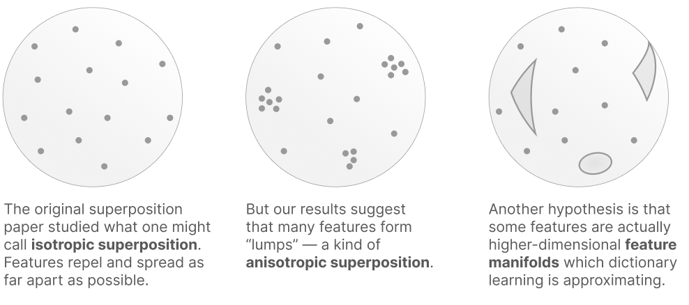

These hypotheses are not mutually exclusive. The convex hull of several correlated features might be understood as a feature manifold. On the other hand, some manifolds would not admit a unique description in terms of a finite number of one-dimensional features. (Perhaps this accounts for the continued feature splitting observed above.)

这些假说并不互斥。若干相关特征的凸包可以被理解为特征流形。另一方面，某些流形无法用有限数量的一维特征给出唯一描述。（也许这解释了上文中观察到的持续特征分裂。）

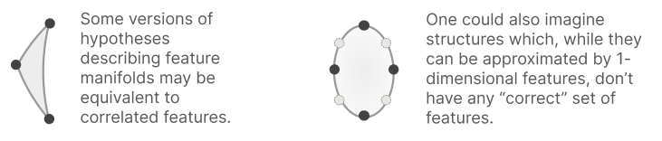

Nevertheless, these experiments have left us more confident that some version of the superposition hypothesis (and the linear representation hypothesis) is true. The number of interpretable features found, the way activation level seems to correspond to "intensity" or "confidence," the fact that logit weights mostly make sense, and the observation of "interference weights": all of these observations are what you would expect from superposition.

尽管如此，这些实验让我们更有信心相信叠加假说（和线性表示假说）的某种版本是正确的。发现的可解释特征数量、激活水平似乎对应"强度"或"置信度"的方式、logit 权重大体讲得通的事实，以及"干扰权重"的观察：所有这些观察都是叠加所预期的。

Finally, we note that in some of these expanded theories of superposition, finding the "correct number of features" may not be well-posed. In others, there is a true number of features, but getting it exactly right is less essential because we "fail gracefully", observing the "true features" at resolutions of different granularity as we increase the number of learned features in the autoencoder.

最后，我们注意到，在这些扩展的叠加理论中的一些里，寻找"正确的特征数量"可能不是良定义的；在另一些里，存在一个真实的特征数量，但把它精确弄对并不那么关键，因为我们会"优雅地失败"：随着自编码器中学到的特征数量增加，我们以不同粒度的分辨率观察"真实特征"。

### "上下文中的词元"特征是真实的吗？（Are "Token in Context" Features Real?）

One of the most common motifs we found were "token-in-context" features. They also represent many of the features that emerge via feature splitting with increasing dictionary size. Some of these are intuitive – borrowing an example from , it makes sense to represent "die" in German (where it's the definite article) as distinct from "die" in English (where it means "death" or "dice").

我们发现的最常见母题之一是"上下文中的词元"特征。它们也构成了随字典大小增加而经由特征分裂涌现的许多特征。其中一些很直观——借用一个例子，把德语中的"die"（在那里它是定冠词）表示为与英语中的"die"（意为"死亡"或"骰子"）不同的东西是有道理的。

But why do we see hundreds of different features for "the" (such as "the" in Physics, as distinct from "the" in mathematics)? We also observe this for other common words (e.g. "a", "of"), and for punctuation like periods. These features are not what we expected to find when we set out to investigate one-layer models!

但为什么我们会看到几百个不同的"the"特征（如物理学中的"the"，与数学中的"the"不同）？我们在其他常见词（如"a"、"of"）和句号等标点上观察到同样的现象。这些特征并不是我们着手研究单层模型时期望找到的！

To make the question a bit more precise, it is helpful to borrow the language and examples of local vs compositional representations . Individually representing token-context pairs (such as "the" in Physics) is technically a ["local code"](https://transformer-circuits.pub/2023/superposition-composition/index.html#distributed-local). The more intuitive way to represent this would instead be a ["compositional code"](https://transformer-circuits.pub/2023/superposition-composition/index.html#distributed-compositional)[ – representing ](https://transformer-circuits.pub/2023/superposition-composition/index.html#distributed-compositional)"the" as an independent feature from Physics. So the thing we really want to ask is why we're observing a local code, and whether it's really what's going on. There are two hypotheses:

为了让问题更精确一点，借用局部（local）表示与组合（compositional）表示的语言和例子会很有帮助。单独表示词元-上下文对（如物理学中的"the"）在技术上是一种["局部编码"](https://transformer-circuits.pub/2023/superposition-composition/index.html#distributed-local)。更直观的表示方式应是一种["组合编码"](https://transformer-circuits.pub/2023/superposition-composition/index.html#distributed-compositional)——把"the"表示为一个独立于 Physics 的特征。所以我们真正想问的是：为什么我们观察到的是局部编码，以及它是否真的就是实际情况。有两个假说：

- The underlying transformer uses a compositional code, and a quirk of our dictionary learning scheme produces features using a local code.

- 底层 Transformer 使用组合编码，而我们的字典学习方案的一个怪癖产生了使用局部编码的特征。

- The underlying transformer is genuinely using a local code (at least in part), and dictionary learning is correctly representing this.

- 底层 Transformer 确实在使用（至少部分地）局部编码，而字典学习正确地表示了这一点。

If the former holds, then better dictionary learning schemes may help uncover a more compositional set of features from the same transformer. Local codes are sparser than compositional codes, and our L1 penalty may be pushing the model too far towards sparsity.

如果前者成立，那么更好的字典学习方案可能有助于从同一个 Transformer 中挖掘出更具组合性的特征集合。局部编码比组合编码更稀疏，我们的 L1 惩罚可能把模型推向了过于稀疏的方向。

However, we believe the second hypothesis is likely to hold to some extent. Let's consider the example of "the" in Physics again, which predicts noun phrases in Physics: if the model represented "the" and Physics context independently, it would be forced to have logits be the sum of "upweight tokens which come after the" and "upweight tokens which occur in Physics". But the model might wish to have "sharper" predictions than this, which is only possible with a local code.

然而，我们相信第二个假说在一定程度上可能成立。再考虑物理学中的"the"的例子，它预测物理学中的名词短语：如果模型独立地表示"the"和 Physics 上下文，它将被迫使 logit 成为"上调 the 之后出现的词元"和"上调 Physics 中出现的词元"之和。但模型可能希望有比这更"锐利"的预测，而这只有局部编码才可能实现。

### 未来工作（Future Work）

Scaling Sparse Autoencoders. Scaling the application of sparse autoencoders to frontier models strikes us as one of the most important questions going forward. We're quite hopeful that these or similar methods will work – Cunningham et al.'s work seems to suggest this approach can work on somewhat larger models, and we have preliminary results that point in the same direction. However, there are significant computational challenges to be overcome. Consider an autoencoder with a 100× expansion factor applied to the activations of a single MLP layer of width 10,000: it would have ~20 billion parameters. Additionally, many of these features are likely quite rare, potentially requiring the autoencoder to be trained on a substantial fraction of the large model's training corpus. So it seems plausible that training the autoencoder could become very expensive, potentially even more expensive than the original model. We remain optimistic, however, and there is a silver lining – it increasingly seems like a large chunk of the mechanistic interpretability agenda will now turn on succeeding at a difficult engineering and scaling problem, which frontier AI labs have significant expertise in.

扩展稀疏自编码器。把稀疏自编码器的应用扩展到前沿模型，在我们看来是未来最重要的问题之一。我们非常希望这些或类似的方法能奏效——Cunningham 等人的工作似乎表明这一方法可以在稍大的模型上工作，我们也有指向同一方向的初步结果。然而，仍有重大的计算挑战需要克服。考虑一个对宽度 10,000 的单个 MLP 层的激活应用 100× 扩展倍数的自编码器：它将有约 200 亿参数。此外，这些特征中许多可能相当罕见，可能需要自编码器在大模型训练语料的相当大一部分上训练。因此，训练自编码器可能变得非常昂贵，甚至可能比原始模型更贵。不过我们仍然乐观，而且有一线希望——机制可解释性议程的很大一部分似乎将越来越取决于在一个困难的工程与扩展问题上取得成功，而前沿 AI 实验室在这方面拥有深厚的专业能力。

Scaling Laws for Dictionary Learning. It's worth noting that there's enormous uncertainty about the dynamics of scaling dictionary learning and sparse autoencoders discussed above. As we make the subject model bigger, how does the ideal expansion factor change? (Does it stay constant?) How does the necessary amount of data change? The resolution of these questions will determine whether it's possible for this approach, if executed well, to scale up to frontier models. Ideally, we'd like to have scaling laws  which could answer this.

字典学习的缩放定律。值得注意的是，关于上文讨论的字典学习与稀疏自编码器的缩放动态，存在巨大的不确定性。随着我们把主模型变大，理想的扩展倍数如何变化？（是否保持不变？）所需的数据量如何变化？这些问题的答案将决定：如果执行得当，这一方法是否可能扩展到前沿模型。理想情况下，我们希望有能回答这个问题的缩放定律（scaling laws）。

How Can We Recognize Good Features? One of the greatest challenges of this work is that we're "wandering in the dark" to some extent. We don't have a great, systematic way to know if we're successfully extracting high quality features. Automated interpretability  seems like a strong contender for solving this question. Alternatively, one might hope for some purely abstract definition (e.g. the [information-based metric](https://transformer-circuits.pub/2023/may-update/index.html#simple-factorization) proposal), but we have not yet seen compelling signs of life for this on real data. It would also be helpful to have metrics beyond MMCS, activation similarity, and attribution similarity for comparing sets of features for the purposes of assessing consistency and universality.

我们如何识别好的特征？这项工作最大的挑战之一是我们在某种程度上"在黑暗中摸索"。我们没有很好的、系统的方法来知道我们是否成功提取了高质量的特征。自动可解释性似乎是解决这一问题的有力候选。或者，人们也许期待某种纯抽象的定义（例如[基于信息的指标](https://transformer-circuits.pub/2023/may-update/index.html#simple-factorization)提案），但我们尚未在真实数据上看到这方面令人信服的迹象。拥有超出 MMCS、激活相似度和归因相似度的指标来比较特征集合（以评估一致性与普适性）也会很有帮助。

Scalability of Analysis. Suppose that sparse autoencoders fully solve superposition. Do we have a home run to fully mechanistically understanding models? It seems clear that there would be at least one other fundamental barrier: scaling analysis of models, so that we can turn microscopic insights into a more macroscopic understanding. Again, one approach here could be automated interpretability. But delegating the understanding of AI to AI may not be fully satisfying, for various reasons. It is possible that there may be other paths based on discovering larger scale structure (see discussion [here](https://transformer-circuits.pub/2023/interpretability-dreams/index.html#larger-scale)).

分析的可扩展性。假设稀疏自编码器完全解决了叠加。那么我们就拥有了完全机制性理解模型的本垒打了吗？显然至少还有另一个根本性障碍：扩展模型分析，使我们能把微观洞察转化为更宏观的理解。同样，这里的一种方法可以是自动可解释性。但由于种种原因，把对 AI 的理解委托给 AI 可能并不完全令人满意。也可能存在基于发现更大尺度结构的其他路径（参见[此处的讨论](https://transformer-circuits.pub/2023/interpretability-dreams/index.html#larger-scale)）。

Algorithmic Improvements for Sparse Autoencoders. New algorithms refining the sparse autoencoder approach could be useful. One might explore the use of variational autoencoders (e.g., ), or sparsity promoting priors regularization techniques beyond a simple L1 penalty on activations (e.g., ), for example encouraging sparsity in the interactions between learned features in different layers. Earlier research has shown that noise injection can also increase neuron interpretability separately from an L1 penalty .

稀疏自编码器的算法改进。改进稀疏自编码器方法的新算法可能有用。人们可以探索使用变分自编码器（例如），或超出对激活的简单 L1 惩罚的、促进稀疏性的先验/正则化技术（例如），例如鼓励不同层中学到的特征之间交互的稀疏性。早期研究还表明，噪声注入可以在 L1 惩罚之外独立地提高神经元可解释性。

Attentional Superposition? Many of the motivations for the presence of superposition in MLP layers apply to self-attention layers as well. It seems conceivable that similar methods may extract useful structure from attention layers, although a clear example has not yet been established (e.g., see our [May](https://transformer-circuits.pub/2023/may-update/index.html#attention-superposition) and [July](https://transformer-circuits.pub/2023/july-update/index.html#attn-skip-trigram) Updates). If this is true, addressing this may become a future bottleneck for the mechanistic interpretability agenda.

注意力叠加？MLP 层中存在叠加的许多动机同样适用于自注意力层。可以设想类似方法也许能从注意力层提取有用的结构，尽管尚未确立明确的例子（例如，参见我们的 [5 月](https://transformer-circuits.pub/2023/may-update/index.html#attention-superposition)和 [7 月](https://transformer-circuits.pub/2023/july-update/index.html#attn-skip-trigram)更新）。如果这是真的，解决这个问题可能成为机制可解释性议程未来的瓶颈。

Theory of Superposition and Features. Many fundamental questions remain for our understanding of superposition, even if the hypothesis is right in some very broad sense. For example, as discussed above, this work suggests extensions of the superposition hypothesis covering clusters of features with similar effects, or continuous families of features. We believe there is important work to be done in exploring the theory of superposition further, perhaps through the use of toy models.

叠加与特征的理论。即使该假说在某种非常宽泛的意义上是正确的，对于理解叠加仍有许多根本性问题。例如，如上所述，这项工作暗示叠加假说的扩展，以涵盖具有相似效应的特征簇，或连续的特征族。我们相信，在进一步探索叠加理论上有重要工作可做，或许可以通过使用玩具模型来实现。

## 评论与复现（Comments & Replications）

Inspired by the original [Circuits Thread](https://distill.pub/2020/circuits/) and [Distill's Discussion Article experiment](https://distill.pub/2019/advex-bugs-discussion/), the authors invited several external researchers who we had previously discussed our preliminary results with to comment on this work. Their comments are included below.

受最初的 [Circuits 专栏](https://distill.pub/2020/circuits/)（Circuits Thread）和 [Distill 讨论文章实验](https://distill.pub/2019/advex-bugs-discussion/)的启发，作者们邀请了多位曾与我们讨论过初步结果的外部研究者对本工作发表评论。他们的评论收录如下。
---

## 脚注（Footnotes）

[^1]: For more discussion of this point, see [Distributed Representations: Composition and Superposition](https://transformer-circuits.pub/2023/superposition-composition/index.html). / 关于这一点的更多讨论，见[《分布式表示：组合与叠加》](https://transformer-circuits.pub/2023/superposition-composition/index.html)。

[^2]: We'd particularly highlight an exciting exchange between Li et al.  and Nanda et al. : Li et al. found an apparent counterexample where features were not represented as directions, which was then resolved by Nanda finding an alternative interpretation in which features were directions. / 我们特别想强调 Li 等人与 Nanda 等人之间一次令人兴奋的交流：Li 等人发现了一个表面上的反例——特征并未表示为方向，随后 Nanda 找到了一种特征确为方向的替代解释，化解了这一反例。

[^3]: While not the focus of this paper, we could also imagine decomposing other portions of the model’s latent state or activations in this way. For instance, we could apply this decomposition to the residual stream (see e.g. ), or to the keys and queries of attention heads, or to their outputs. / 虽然这不是本文的重点，但我们也可以想象用这种方式分解模型潜状态或激活的其他部分。例如，我们可以把这种分解应用于残差流（例如见），或应用于注意力头的键（key）与查询（query），或它们的输出。

[^4]: This property is closely related to the desiderata of Causality, Generality, and Purity discussed in Cammarata et al. , and those provide an example of how we might make this property concrete in a specific instance. / 这一性质与 Cammarata 等人讨论的因果性（Causality）、普适性（Generality）与纯净性（Purity）等期望标准密切相关，而后者给出了如何在具体实例中使这一性质落地的例子。

[^5]: This is similar in spirit to the evidence provided by influence functions. / 这在精神上类似于影响函数（influence functions）所提供的证据。

[^6]: For the model discussed in this paper, we trained the autoencoder on 8 billion datapoints. / 对于本文讨论的模型，我们在 80 亿个数据点上训练了自编码器。

[^7]: We tie the biases applied in the input and output, so the result is equivalent to subtracting a fixed bias from all activations and then using an autoencoder whose only bias is before the encoder activation. / 我们把施加在输入与输出上的偏置绑在一起，其效果等价于：先从所有激活中减去一个固定偏置，再使用一个唯一偏置位于编码器激活之前的自编码器。

[^8]: Note that using an MSE loss avoids the challenges with polysemanticity that we discussed above in Why Not Architectural Approaches? / 注意，使用 MSE 损失避免了我们在上文"为什么不使用架构方法？"中讨论的多义性难题。

[^9]: Note that this linear structure makes it even more likely that features should be linear. On the one hand, this means that the linear representation hypothesis is more likely to hold for this model. On the other hand, it potentially means that our results are less likely to generalize to multilayer models. Fortunately, others have studied multilayer transformers with sparse autoencoders and found interpretable linear features, which gives us more confidence that what we see in the one-layer model indeed generalizes . / 注意，这种线性结构使"特征应当是线性的"更有可能成立。一方面，这意味着线性表示假说对该模型更可能成立。另一方面，它可能意味着我们的结果更不容易推广到多层模型。幸运的是，其他人已经用稀疏自编码器研究了多层 Transformer 并发现了可解释的线性特征，这让我们更有信心：我们在单层模型中看到的东西确实可以推广。

[^10]: For example, [one neuron](https://transformer-circuits.pub/2023/monosemantic-features/vis/a-neurons.html?ordering=index#feature-83) in our transformer model responds to a mix of academic citations, English dialogue, HTTP requests, and Korean text. In vision models, there is a classic example of a neuron which responds to cat faces and fronts of cars . / 例如，我们的 Transformer 模型中的[一个神经元](https://transformer-circuits.pub/2023/monosemantic-features/vis/a-neurons.html?ordering=index#feature-83)响应学术论文引用、英语对话、HTTP 请求和韩语文本的混合。在视觉模型中，有一个经典例子：一个神经元同时响应猫的脸和汽车的车头。

[^11]: This kind of split tokenization is common for Unicode characters outside the Latin script and the most common characters from other Unicode blocks. / 这种拆分式分词，对拉丁文字之外的 Unicode 字符以及其他 Unicode 块中最常用的字符来说很常见。

[^12]: For example, in the figure above, there is a newline character ⏎ that our feature fires on but our proxy assigns a low score to because it is outside the Unicode block. / 例如，在上图中有一个换行符 ⏎，我们的特征在它上面激活，但我们的代理给它打了低分，因为它在该 Unicode 块之外。

[^13]: Why do we believe large activations have larger effects? In the case of a one-layer transformer like the one we consider in this paper, we can make a strong case for this: features have a linear effect on the logits (modulo rescaling by layer norm), and so a larger activation of the feature has a larger effect on the logits. In the case of larger models, this follows from a lot of conjectures and heuristic arguments (e.g. the abundance of linear pathways in the model and the idea of linear features at each layer), and must be true for sufficiently small activations by continuity, but doesn't have a watertight argument. / 为什么我们相信大激活有更大的效应？对于像本文所考虑的单层 Transformer，我们可以为此给出强有力的论证：特征对 logit 有线性影响（在层范数重新缩放的意义上），因此特征更大的激活对 logit 有更大的影响。对于更大的模型，这来自许多猜想与启发式论证（例如模型中线性通路的丰富性，以及每层线性特征的想法），并且根据连续性，对足够小的激活必然成立，但目前没有无懈可击的论证。

[^14]: (also called “logit attribution”, see similar work e.g. ) / （也称为"logit 归因"（logit attribution），类似工作例如见）

[^15]: We exclude weights corresponding to extremely rare or never used vocabulary elements. These are perhaps similar to the "anomalous tokens" (e.g., "SolidGoldMagikarp") of Rumbelow & Watkins . / 我们排除对应于极罕见或从未使用的词汇表元素的权重。它们或许类似于 Rumbelow & Watkins 所说的"异常词元"（anomalous tokens，如"SolidGoldMagikarp"）。

[^16]: There are in theory several ways the logit weights could overestimate the model's actual use of a feature: 1. It could be that these output weights are small enough that, when multiplied by activations, they don't have an appreciable effect on the model’s output. 2. The feature might only activate in situations where other features make these tokens extremely unlikely, such that the feature in fact has little effect. 3. It is possible that our approximation of linearizing the layer norm (see Framework ) is poor. Based on the subsequent analysis, which confirms the logit weight effects, we do not believe these issues arise in practice. / 从理论上说，logit 权重有几种可能高估模型对特征实际使用程度的方式：1. 这些输出权重可能足够小，以致乘以激活后对模型输出没有可感知的影响。2. 特征可能只在其他特征使这些词元极不可能出现的情形下激活，以致该特征实际上影响甚微。3. 我们对层范数做线性化的近似（见 Framework）可能很差。基于随后证实 logit 权重效应的分析，我们相信这些问题在实践中并未出现。

[^17]: Of course, some features might genuinely be neuron aligned. But we'd like to know that at least some of the features dictionary learning discovers were not trivial. / 当然，有些特征可能真的与神经元对齐。但我们想知道，字典学习发现的特征中至少有一些不是平凡的。

[^18]: We also tried looking at the neurons which have the largest contribution to the dictionary vector for the feature. However, we found looking at the most correlated neuron to be more reliable – in earlier experiments, we found rare cases where the correlated method found a seemingly similar neuron, while the dictionary method did not. This may be because neurons can have different scales of activations. / 我们也尝试过查看对该特征的字典向量贡献最大的神经元。然而我们发现，查看最相关的神经元更可靠——在早期实验中，我们发现过罕见情形：相关方法找到了一个看似相似的神经元，而字典方法却没有。这可能是因为神经元可以有不同尺度的激活。

[^19]: This makes sense as a superposition strategy: since languages are essentially mutually exclusive, they're natural to put in superposition with each other / 作为一种叠加策略这是合理的：既然各种语言本质上是互斥的，把它们彼此放进叠加是很自然的。

[^20]: By analogy, this also applies to [B/1/1334](https://transformer-circuits.pub/2023/monosemantic-features/vis/b1.html#feature-1334). / 依此类推，这也适用于 [B/1/1334](https://transformer-circuits.pub/2023/monosemantic-features/vis/b1.html#feature-1334)。

[^21]: "Activation correlation" is defined as the feature whose activations across 40,960,000 tokens has the highest Pearson correlation with those of [A/1/3450](https://transformer-circuits.pub/2023/monosemantic-features/vis/a1.html#feature-3450). / "激活相关"定义为：在 40,960,000 个词元上，激活值与 [A/1/3450](https://transformer-circuits.pub/2023/monosemantic-features/vis/a1.html#feature-3450) 的激活值具有最高 Pearson 相关的特征。

[^22]: In order to sample uniformly across the spectrum of feature activations, we divide the activation spectrum into 11 "activation intervals" evenly spaced between 0 activation and the maximum activation. We sample uniformly from these intervals. / 为了在特征激活谱上均匀采样，我们把激活谱从 0 激活到最大激活之间等距划分为 11 个"激活区间"，然后从这些区间中均匀采样。

[^23]: It's worth explicitly stating that our automated interpretability setup was designed to ensure that there's no leak of information about activation patterns, except for the explanation. For example, when predicting new activations, the model cannot see any true activations of that feature. / 值得明确说明的是，我们的自动可解释性设置被设计为确保：除解释本身之外，不会泄露任何关于激活模式的信息。例如，在预测新激活时，模型看不到该特征的任何真实激活。

[^24]: This is distinct from the evaluation strategy of Bills et al., who calculated their correlation of predicted and true activations on a mixture of maximal dataset examples and random samples. For sparse features, which don't fire on most random samples, this effectively tests the model's ability to distinguish a feature's large activations from zero. / 这有别于 Bills 等人的评估策略，后者在最大数据集样本与随机样本的混合上计算预测激活与真实激活的相关。对于在大多数随机样本上不激活的稀疏特征而言，那实际上检验的是模型区分特征的大激活与零的能力。

[^25]: In instances where Claude predicts a constant score, most often all 0s, a correlation can't be computed and we assign a score of zero which explains the uptick there. / 在 Claude 预测出一个常数分数（最常见是全 0）的情形中，无法计算相关，我们记为 0 分，这解释了图中该处出现的小幅抬升。

[^26]: with respect to the effect it has on the model outputs see e.g. the activation expected value plot in Arabic Feature's Activations Specificity Analysis. / 就特征对模型输出的效应而言，参见"阿拉伯文字特征的激活特异性分析"中的激活期望值图。

[^27]: Naively, simulating a layer with 100k features would be 100,000 times more expensive than sampling a large language model such as Claude 2 or GPT-4 (we'd need to sample the explaining large model once for every feature at every token). At current prices, this would suggest simulating 100k features on a single 4096 token context would cost $12,500–$25,000, and one would presumably need to evaluate over many contexts. / 朴素地做，模拟一个有 10 万特征的层，其开销将是采样一个 Claude 2 或 GPT-4 这类大语言模型的 100,000 倍（我们需要在每个词元上为每个特征采样一次解释用大模型）。按当前价格，在单个 4096 词元上下文上模拟 10 万特征将花费 12,500–25,000 美元，而且大概需要在许多上下文上进行评估。

[^28]: We generate a model with random weights by randomly shuffling the entries of each weight matrix of the trained transformer used in Run A. This guarantees that the distributions of individual weights match, and differences are due to structure. / 我们通过随机打乱运行 A 所用已训练 Transformer 的每个权重矩阵的元素，来生成一个权重随机的模型。这保证了单个权重的分布一致，从而差异来自结构。

[^29]: From a purely theoretical lens, attention heads can largely implement "three point functions" (with two inputs, and an output). MLP layers are well positioned to instead implement N-token conjunctions, perhaps the most extreme of which are context features or token-in-context features. Thus, it is perhaps natural that we see many of these. / 从纯理论的视角看，注意力头在很大程度上可以实现"三点函数"（两个输入，一个输出）。MLP 层则更有条件实现 N 词元合取，其中最极端的或许就是上下文特征或上下文中的词元特征。因此，我们看到许多这类特征也许是自然的。

[^30]: Token-in-context features may offer a significant opportunity for simplifying analysis of the model – as Elhage et al.  note, it may be possible to understand these features as two-dimensional family of features parameterized by a context and a token. / 上下文中的词元特征可能为简化模型分析提供重要机会——正如 Elhage 等人所指出的，也许可以把这些特征理解为由一个上下文和一个词元参数化的二维特征族。

[^31]: Toy Models considered correlated features (see in particular [organization of correlated features](https://transformer-circuits.pub/2022/toy_model/index.html#geometry-organization) and [collapsing of correlated features](https://transformer-circuits.pub/2022/toy_model/index.html#geometry-collapsing)), but only features which were correlated in whether they were active (and not their value if active), and had nothing analogous to the similar "output actions" described here. Nonetheless, Toy Models' experiments may be a useful intuition pump, especially in noticing the distinction between similar features in superposition vs features collapsing into a single broader feature. / 《玩具模型》考虑过相关特征（特别见["相关特征的组织"](https://transformer-circuits.pub/2022/toy_model/index.html#geometry-organization)与["相关特征的塌缩"](https://transformer-circuits.pub/2022/toy_model/index.html#geometry-collapsing)），但只考虑了在"是否激活"上相关（而非激活时的取值）的特征，并且没有任何类似此处所述相似"输出动作"的东西。尽管如此，《玩具模型》的实验或许仍是一个有用的直觉泵，尤其有助于注意到"叠加中的相似特征"与"多个特征塌缩为单个更宽泛特征"之间的区别。

[^32]: For each pair of features, we compute the cosine similarity between their activations on the subset of tokens for which one of them fires. We repeat this, restricting to the subset on which the other fires, and take the greater of the two. We draw a connection between the features if this measure exceeds ~0.4. This threshold was chosen to balance producing a small enough graph to visualize while also showing some of the richness of feature splitting. We omit the ultralow density features from this analysis. / 对每一对特征，我们计算它们在其中一个特征激活的词元子集上的激活之间的余弦相似度；再以另一个特征激活的子集重复这一计算，并取两者中较大者。如果该度量超过约 0.4，我们就在两个特征之间连一条边。选择这一阈值是为了在生成足够小、可可视化的图与展示特征分裂的部分丰富性之间取得平衡。在此分析中我们略去超低密度特征。

[^33]: The features fire on the token " P" of words where it appears as the first token, such as [ P][attern]. / 这些特征在单词中作为首词元出现的词元" P"上激活，例如 [ P][attern]。

[^34]: In this instance we found the refined P features by manual inspection rather than by cosine similarity. / 在这个例子中，我们是通过人工检查而非余弦相似度找到这些细化的 P 特征的。

[^35]: Our initial clue that [A/1/1544](https://transformer-circuits.pub/2023/monosemantic-features/vis/a1.html#feature-1544) might fire on base64 strings encoding ASCII text was the token ICAgICAg which this feature particularly responds to, and corresponds to six spaces in a row. / 我们最初注意到 [A/1/1544](https://transformer-circuits.pub/2023/monosemantic-features/vis/a1.html#feature-1544) 可能在编码 ASCII 文本的 base64 字符串上激活的线索，是该特征特别响应的词元 ICAgICAg——它对应连续六个空格。

[^36]: Determining when a dataset example encodes ASCII text is somewhat subtle because base64 can only be decoded to ASCII in groups of four characters, since four base64 characters [encode triples](https://en.wikipedia.org/wiki/Base64#Examples) of ASCII characters. Thus, we select substrings which – when decoded with the python base64 library – contain the maximal number of printable ASCII characters. / 判断一个数据集样本何时编码了 ASCII 文本有些微妙，因为 base64 只能按四个字符一组解码为 ASCII——四个 base64 字符[编码三个](https://en.wikipedia.org/wiki/Base64#Examples) ASCII 字符组成的三元组。因此，我们选择那些用 Python base64 库解码后包含最多可打印 ASCII 字符的子串。

[^37]: In what sense does universality suggest features are "real"? One basic observation is that they suggest the features we're finding are not just artifacts of the dictionary learning process – or at least that if they come from the dictionary learning process, it's in some consistent way. But there are also several deeper ways in which it's suggestive. It means that, whatever the source of the features, we can talk about features as replicable, reliable, recurring units of analysis. It's also just a surprising observation that one would expect if a strong version of the features in superposition hypothesis was true and models were literally representing some finite, discrete set of features in superposition. / 普适性在何种意义上暗示特征是"真实的"？一个基本的观察是，它们暗示我们正在找到的特征不只是字典学习过程的产物——或者至少，如果它们来自字典学习过程，也是以某种一致的方式。此外还有几个更深层的暗示意义：这意味着，无论特征来源为何，我们都可以把特征当作可复现、可靠、反复出现的分析单元来讨论；而且，如果"特征叠加"假说的强版本为真、模型确实在叠加中字面地表示某个有限离散的特征集合，那么这正是人们会预期的令人惊讶的观察。

[^38]: In fact, we found some features so universal that we began to take it for granted as a basic tool in our workflow of evaluating dictionary learning runs. For example, the base64 feature – which we previously observed in SoLU models – was so consistently universal that its presence was a useful debugging heuristic. / 事实上，我们发现有些特征如此普适，以至于我们开始把它当作评估字典学习运行工作流中的基本工具而不假思索地使用。例如，base64 特征——我们先前在 SoLU 模型中观察到过——如此一致地普适，以致它的存在成了一个有用的调试启发式。

[^39]: The feature is bimodal, monosemantic in the larger of the modes, and fires on 0.02% of tokens. This means that at least 1 in 10,000 tokens in the Pile dataset are abbreviations for PLoS journals in citations! This is an example of how inspecting features can reveal properties of the dataset, in this case the strong bias of the Pile towards scientific content. / 该特征是双峰的，在较大的峰中是单义的，在 0.02% 的词元上激活。这意味着 The Pile 数据集中至少每 10,000 个词元中就有 1 个是引用中 PLoS 期刊的缩写！这是"检查特征可以揭示数据集性质"的一个例子，在此例中是 The Pile 对科学内容的强烈偏重。

[^40]: Suppose feature f_i has logit weights v_{ik} for k \in \{1,\ldots,n_{\text{vocab}}\}. At a given token t_j, we compute the activation of the feature f_i(t_j) and multiply it by the logit weight v_{it_{j+1}} of the token t_{j+1} that comes next to get an attribution score of f_i(t_j)v_{it_{j+1}}. The attribution vector is given by stacking the attribution scores for a random sampling of datapoints. This approximates the classic attribution method of multiplying the gradient by the activation, differing in that we ignore the denominators of the softmax and the layer norm. / 假设特征 f_i 的 logit 权重为 v_{ik}，其中 k \in \{1,\ldots,n_{\text{vocab}}\}。在给定词元 t_j 处，我们计算特征激活 f_i(t_j)，并把它乘以紧接着出现的词元 t_{j+1} 的 logit 权重 v_{it_{j+1}}，得到归因分数 f_i(t_j)v_{it_{j+1}}。归因向量由对数据点随机抽样所得的归因分数堆叠而成。这近似于"梯度乘激活"的经典归因方法，不同之处在于我们忽略了 softmax 和层范数的分母。

[^41]: The "finite state automata"-esque feature assemblies are also different from circuits in that the model didn't learn them to work together. Rather, in the course of learning to autoregressively model text, it learned features that interact via the token stream because of patterns in the real datasets. In contrast, a language model trained with reinforcement learning might have systems like this – circuits whose feature components interact via generated tokens – which co-evolved and adapted to work together during RL training. / "有限状态自动机"式的特征组合与电路的另一处不同在于：模型并不是为了协同工作而学习它们的。确切地说，在学习自回归地建模文本的过程中，模型学到了一些因为真实数据集中的模式而经由词元流相互作用的特征。相比之下，用强化学习训练的语言模型可能会拥有这样的系统——其特征组件经由生成的词元相互作用的电路——它们在 RL 训练中协同演化并适应于协同工作。

---

> 注：本文收录正文主体（含 Comments & Replications 引言）。原页附录（训练与实验细节、复现评论、更新日志、致谢与引用信息）未收录，如需可补充。
