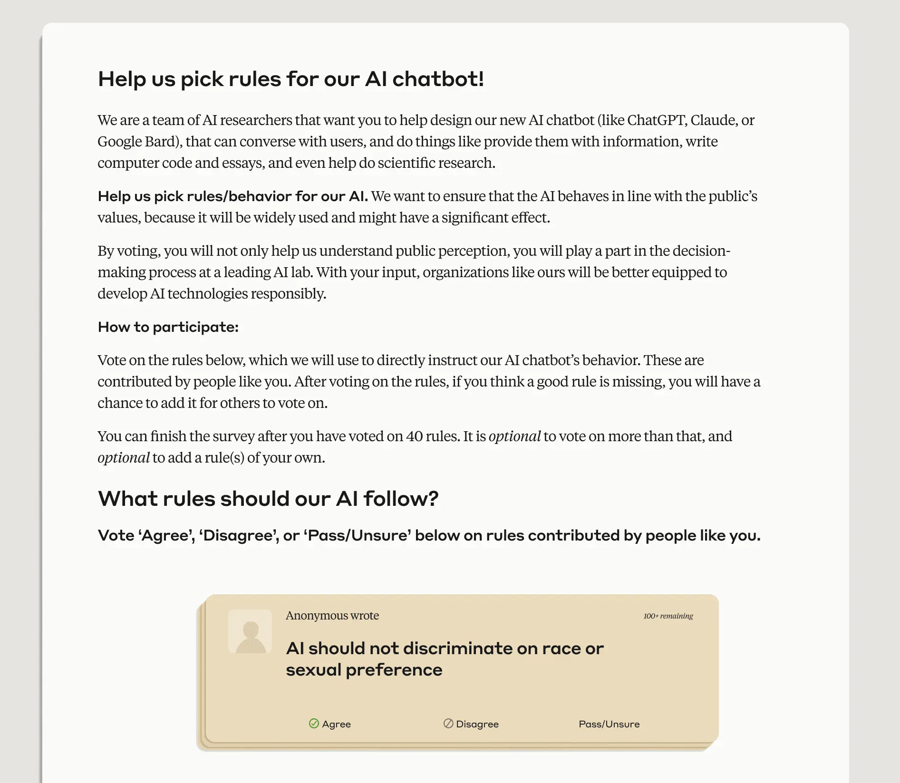
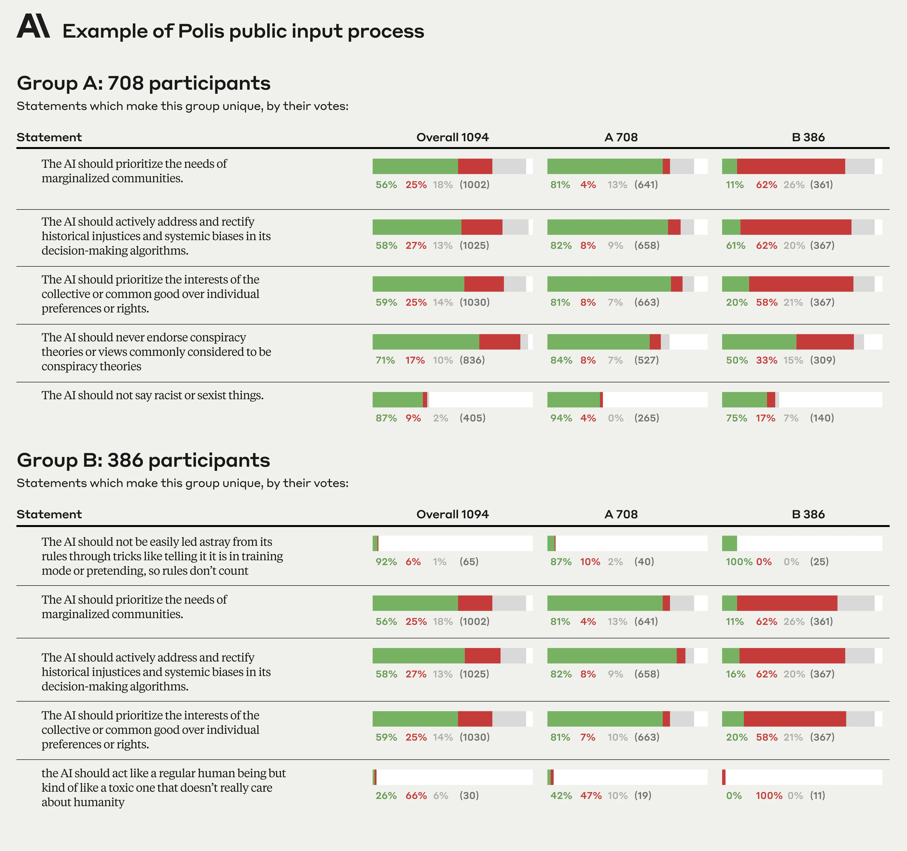
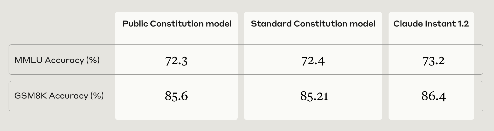
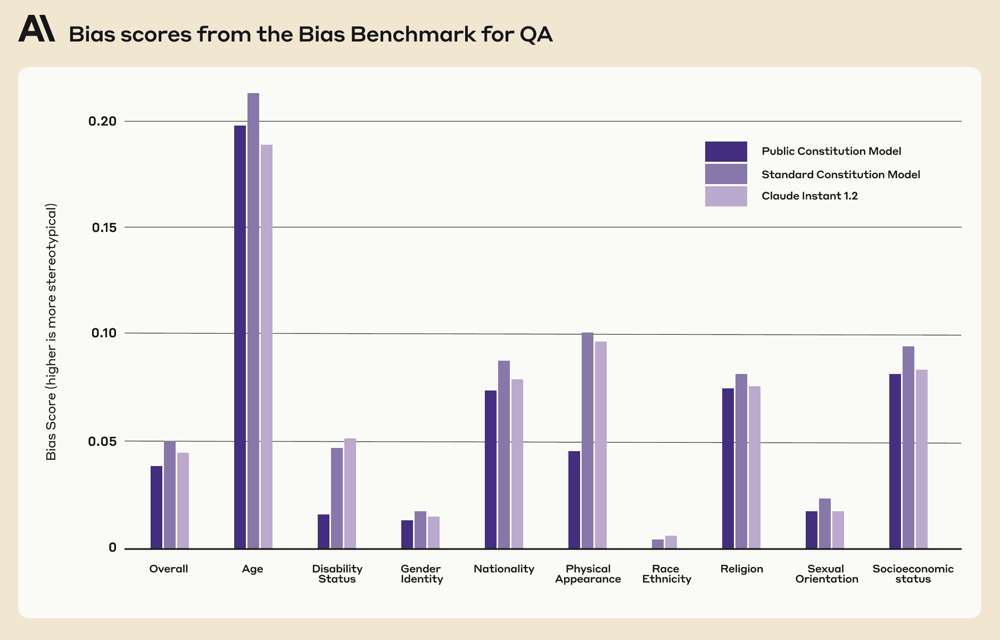
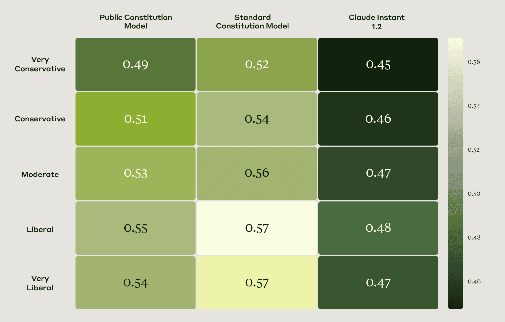

# 集体宪法 AI：让语言模型与公众输入对齐（中英对照）

> 原文标题：Collective Constitutional AI: Aligning a Language Model with Public Input
> 原文链接：https://www.anthropic.com/research/collective-constitutional-ai-aligning-a-language-model-with-public-input
> 原文作者：Deep Ganguli, Saffron Huang, Liane Lovitt, Divya Siddarth 等（Anthropic 与 Collective Intelligence Project）
> 发布日期：2023-10-17
> **翻译模型：** GLM-5.3-Flash
> **评分：** ★★★☆☆（3/5，值得一读）—— 与 Collective Intelligence Project 用 Polis 平台征集约 1000 名美国人的意见起草「公众宪法」并用于微调 Claude：公开输入流程、模型行为变化与经验教训
> 排版：每段英文原文在前，中文翻译紧随其后。本文收录博文全文。

---

Anthropic and the Collective Intelligence Project recently ran a public input process involving ~1,000 Americans to draft a constitution for an AI system. We did this to explore how democratic processes can influence AI development. In our experiment, we discovered areas where people both agreed with our in-house constitution , and areas where they had different preferences. In this post, we share the resulting publicly sourced constitution, as well as what happened when we trained a new AI system against it using Constitutional AI. Constitutional AI (CAI) is an Anthropic-developed method for aligning general purpose language models to abide by high-level normative principles written into a constitution. Anthropic’s language model Claude currently relies on a constitution curated by Anthropic employees. This constitution takes inspiration from outside sources like the United Nations Universal Declaration of Human Rights, as well as our own firsthand experience interacting with language models to make them more helpful and harmless. While Constitutional AI is useful for making the normative values of our AI systems more transparent, it also highlights the outsized role we as developers play in selecting these values—after all, we wrote the constitution ourselves. That is why for this research, we were eager to curate a constitution using the preferences of a large number of people who do not work at Anthropic. We believe that our work may be one of the first instances in which members of the public have collectively directed the behavior of a language model via an online deliberation process. We hope that sharing our very preliminary efforts and findings will help others learn from our successes and failures, and help build upon this work.

Anthropic 与 Collective Intelligence Project 最近开展了一项公众输入（public input）流程，邀请约 1,000 名美国人共同为一个 AI 系统起草宪法。我们这样做是为了探索民主程序能够如何影响 AI 的研发。在实验中，我们既发现了人们认同我们内部宪法的地方，也发现了他们偏好不同的地方。在这篇博文中，我们将分享由此形成的公众宪法（publicly sourced constitution），以及我们依据它、用宪法 AI（Constitutional AI）训练出一个新 AI 系统之后发生了什么。宪法 AI（CAI）是 Anthropic 开发的一种对齐方法，用于让通用语言模型遵循写入宪法的上层规范性原则。Anthropic 的语言模型 Claude 目前依赖一部由 Anthropic 员工编订的宪法。这部宪法的灵感既来自《联合国世界人权宣言》等外部来源，也来自我们为让语言模型更有益（helpful）、更无害（harmless）而与它们交互的第一手经验。宪法 AI 有助于让 AI 系统的规范价值更加透明，但它也凸显了我们作为开发者在挑选这些价值观时所扮演的过大角色——毕竟，宪法是我们自己写的。正因如此，在这项研究中，我们迫切希望利用大量不在 Anthropic 工作的人们的偏好来编订一部宪法。我们相信，这项工作可能是公众成员首次通过在线审议（deliberation）流程集体决定一个语言模型行为的案例之一。我们希望，分享这些非常初步的尝试与发现，能帮助他人从我们的成功与失败中有所借鉴，并在此项工作的基础上继续推进。

### 设计征集公众输入共同起草宪法的流程（Designing a Public Input Process to Collectively Draft a Constitution）

Anthropic partnered with the Collective Intelligence Project to run a public input process using the Polis platform. Polis is an open-source platform for running online deliberative processes augmented by machine learning algorithms. It has been used all over the world by governments, academics, independent media, and citizens to understand what large groups of people think. We asked approximately 1,000 members of the American public to “Help us pick rules for our AI Chatbot!” (Figure 1). We sought a representative sample of U.S. adults across age, gender, income, and geography (anonymized participant demographics can be found here ). Participants could either vote on existing rules (normative principles), or add their own. In total, participants contributed 1,127 statements to the Polis, and cast 38,252 votes (an average of 34 votes per person). In general, we found a high degree of consensus on most statements, though Polis did identify two separate opinion groups (Figure 2).

Anthropic 与 Collective Intelligence Project 合作，使用 Polis 平台开展了一项公众输入流程。Polis 是一个开源平台，用于运行由机器学习算法增强的在线审议流程。世界各地的政府、学者、独立媒体和公民都曾用它来了解大规模群体的想法。我们邀请约 1,000 名美国公众成员来「帮我们为 AI 聊天机器人挑选规则！」（图 1）。我们寻求在年龄、性别、收入和地域上具有代表性的美国成年人样本（匿名化的参与者人口统计数据可在这里查看）。参与者既可以对现有规则（规范性原则）投票，也可以添加自己的规则。参与者总共向 Polis 贡献了 1,127 条陈述，投出了 38,252 票（平均每人 34 票）。总体而言，我们发现大多数陈述上都存在高度共识，不过 Polis 确实识别出了两个不同的意见群体（图 2）。

### 分析公众起草的宪法（Analyzing the Publicly Sourced Constitution）

The raw results can be seen in the Polis Report . We processed this data to remove invalid participants and comments (the code and data before and after processing is hosted here ). We kept all the statements that passed a threshold of consensus within both groups to produce a constitution that we could train a model against. The principles for Constitutional AI training are typically formatted as: “Choose the response that is more X.” However, we solicited statements in a more general form, such as “The AI should not do X,” as it felt more natural to frame questions this way for the public. As a result, we had to do some subjective mapping between public statements and CAI-ready public principles .

原始结果可以在 Polis 报告中查看。我们对这些数据做了处理，以剔除无效的参与者和评论（处理前后的代码与数据托管在这里）。我们保留了在两个意见群体内部都通过共识阈值的全部陈述，由此产出一部可用于训练模型的宪法。宪法 AI 训练所用原则的格式通常为：「选择更 X 的回答。」然而，我们征集陈述时采用的是一种更通用的形式，例如「AI 不应该做 X」，因为以这种方式向公众提问感觉更自然。因此，我们不得不在公众陈述与可直接用于 CAI 的公众原则之间做一些主观映射。

You can see our publicly sourced constitution here , along with an analysis of how it is similar to and different from the Anthropic-written constitution used to train our language model Claude. While there was a moderate degree of overlap between the two constitutions (roughly 50% overlap in concepts and values), a few key differences stood out: principles in the public constitution appear to largely be self-generated and not sourced from existing publications, they focus more on objectivity and impartiality, they place a greater emphasis on accessibility, and in general, tend to promote desired behavior rather than avoid undesired behavior.

你可以在这里查看我们的公众宪法，以及关于它与用于训练语言模型 Claude 的 Anthropic 宪法之间异同的分析。两部宪法之间存在中等程度的重叠（在概念与价值观上约有 50% 重合），但有几个关键差异十分突出：公众宪法中的原则似乎大多是参与者自己生成的，而非取自现有出版物；它们更关注客观性与公正性；更加强调可及性（accessibility）；并且总体上倾向于促成期望的行为，而不是避免不期望的行为。

Example public principles similar to the principles in the Anthropic-written constitution:

与 Anthropic 宪法中的原则相近的公众原则示例：

- “Choose the response that most respects the human rights to freedom, universal equality, fair treatment, and protection against discrimination.”

- 「选择最尊重自由、普遍平等、公平对待以及免受歧视等人权的回答。」

- “Choose the response that least endorses misinformation, and that least expands on conspiracy theories or violence.”

- 「选择最不支持错误信息、且最少展开阴谋论或暴力的回答。」

Example public principles that do not closely match principles in the Anthropic-written constitution:

与 Anthropic 宪法中的原则没有紧密对应的公众原则示例：

- “Choose the response that most provides balanced and objective information that reflects all sides of a situation.”

- 「选择最能提供平衡且客观、能反映事件各方立场的信息的回答。」

- “Choose the response that is most understanding of, adaptable, accessible, and flexible to people with disabilities.”

- 「选择对残障人士最能体谅、最能随机应变、最可及且最灵活的回答。」

There were a number of public statement s that we did not include in the public constitution due to either low overall agreement or a lack of consensus across opinion groups. Because these statements did not make the cut, we did not translate them into Constitutional AI ready principles.

有不少公众陈述由于总体同意度低，或在不同意见群体之间缺乏共识，而未被纳入公众宪法。由于这些陈述未能入选，我们也就没有将它们转化为宪法 AI 可用的原则。

Example public statements that did not make it into the public constitution due to low overall agreement:

因总体同意度低而未能进入公众宪法的公众陈述示例：

- “AI should not be trained with the principles of DEI [diversity, equity, and inclusion]”

- 「AI 不应使用 DEI［多元、公平与包容］原则来训练」

- “AI should not give advice”

- 「AI 不应给出建议」

- “AI should be an ordained minister”

- 「AI 应当成为一名受任命的牧师」

- “AI should have emotion”

- 「AI 应当拥有情感」

Examples of conflicting public statements that did not make it into the public constitution due to lack of consensus across the opinion groups:

因在意见群体之间缺乏共识而未能进入公众宪法的、相互冲突的公众陈述示例：

- “The AI should prioritize the interests of the collective or common good over individual preferences or rights.”

- 「AI 应当将集体或公共利益置于个人偏好或个人权利之上。」

- “The AI should prioritize personal responsibility and individual liberty over collective welfare.”

- 「AI 应当将个人责任与个人自由置于集体福祉之上。」

### 训练并评估与公众输入对齐的模型（Training and Evaluating a Model Aligned with Public Input）

We trained two Claude Instant-sized models, following the procedures outlined in our CAI paper . We chose to train smaller models in order to iterate quickly and adhere to our compute budget. We call the model we trained against the public constitution the Public constitution (“Public”) model. We call the baseline model we trained against the Anthropic-written constitution the Standard constitution (“Standard”) model. We chose to also baseline against Claude Instant 1.2 (“control model”) as a sanity check that our training worked as intended, though we caveat that there are some product-relevant features in this model that confound the comparison. Ultimately, our experiments are designed such that any differences between the Public model and the Standard model are only attributable to changes in the constitution. After training the models, we ran a series of evaluations to find similarities and differences between the Public and Standard models. In general we found that:

我们按照 CAI 论文中概述的流程，训练了两个 Claude Instant 规模的模型。选择训练较小的模型是为了快速迭代并遵守算力预算。我们把依据公众宪法训练的模型称为「公众宪法」（Public）模型；把依据 Anthropic 宪法训练的基线模型称为「标准宪法」（Standard）模型。我们还选择以 Claude Instant 1.2（「对照模型」）作为基线，用以健全性检查我们的训练是否达到了预期效果，但需要说明的是，该模型中存在一些与产品相关的特性，会干扰这一比较。归根结底，我们的实验设计确保 Public 模型与 Standard 模型之间的任何差异都只能归因于宪法的不同。模型训练完成后，我们运行了一系列评估来找出 Public 模型与 Standard 模型之间的相似与差异。总体上我们发现：

- The Public and Standard models perform equivalently on the language and math understanding tasks we tested, MMLU and GSM8K , respectively (Table 1).

- 在我们测试的语言与数学理解任务 MMLU 和 GSM8K 上，Public 模型与 Standard 模型表现相当（表 1）。

- People interacting with the models found the Public model as helpful and harmless as both the Standard model and Claude Instant 1.2. Specifically, we computed Elo scores for helpfulness and harmlessness for all three models (using the same procedures and model interfaces outlined in our Constitutional AI and red teaming papers without further modification) and found no significant differences.

- 与模型交互的人认为，Public 模型与 Standard 模型及 Claude Instant 1.2 一样有益、一样无害。具体来说，我们为全部三个模型计算了有益性（helpfulness）与无害性（harmlessness）的 Elo 分数（使用与我们的宪法 AI 论文和红队测试（red teaming）论文中相同的流程与模型界面，未做进一步修改），未发现显著差异。

- The Public model is less biased than the Standard model across nine social dimensions according to the BBQ evaluation (Figure 3).

- 根据 BBQ 评估，在九个社会维度上，Public 模型都比 Standard 模型偏见更少（图 3）。

- The Public and Standard models reflect similar political ideologies as one another according to the OpinionQA evaluation (Figure 4).

- 根据 OpinionQA 评估，Public 模型与 Standard 模型反映出的政治意识形态彼此相近（图 4）。

### 经验与教训（Lessons Learned）

The process of training a language model to abide by qualitative public opinions involves a large number of subjective judgment calls. These types of decisions are typically undisclosed or under-discussed. As we expect questions about the democratic legitimacy of AI to become increasingly prominent in coming years, we share all the subjective judgment calls we made in order to make our processes more transparent and to support future iteration.

训练语言模型去遵循定性的公众意见，这一过程涉及大量主观判断。这类决策通常不会被公开，也很少得到充分讨论。我们预计，关于 AI 民主正当性的问题在未来几年会日益突出，因此我们在这里公开我们做过的全部主观判断，以提升流程透明度，并支持未来的迭代。

#### 运行公众输入流程（Running the public input process）

- Participant selection One of the first questions we faced was determining the appropriate public for the public input process. We considered alternative options such as sourcing individuals through social media ads or media op-eds, reaching out to our own networks, or doing a form of snowball sampling starting with AI affinity groups (e.g., Black in AI, LatinX in AI, Women in Machine Learning, etc.). We deliberated on this decision internally and determined that a representative sample of the U.S. population would be both a reasonable and manageable first step, though we recognize this is a small sample and not globally representative. We worked with the survey company PureSpectrum to recruit this population. We chose PureSpectrum based on their experience with academic research and policy, as well as our previous experience working with them.

- 参与者筛选（Participant selection）我们面临的首要问题之一，是确定公众输入流程中合适的「公众」究竟是谁。我们考虑过其他方案，例如通过社交媒体广告或媒体评论文章招募人选、动用我们自己的人脉网络，或者从 AI 从业者社群（如 Black in AI、LatinX in AI、Women in Machine Learning 等）出发做某种滚雪球抽样（snowball sampling）。我们内部对这一决策进行了审议，最终确定：具有美国人口代表性的样本既是合理的第一步，也是可管理的第一步，尽管我们承认这是一个小样本，并不具备全球代表性。我们与调查公司 PureSpectrum 合作招募了这批人群。选择 PureSpectrum 的依据，是他们在学术研究与政策领域的经验，以及我们此前与他们合作的经验。

- Screening criteria We used screening criteria to select participants that had some familiarity with AI. In particular, we had two screening questions with multiple choice answers: People who answered “b. Generative AI/Chat GPT” to Question 1 and “a. Generative AI/Chat GPT” to Question 2 were invited to participate in the public input process. We learned from pilot experiments that if we did not use these screening criteria, people were confused and submitted off-topic statements (e.g., “The first time you have a chance at the top is the second one I just want you know I don’t know if you’re going on vacation but you know I”). “What topics have you discussed with your friends/family in the last month?” (Possible answers: “a. The economy,” “b. Generative AI/Chat GPT,” “c. TikTok,” “d. 2024 Elections,” “e. None of the above”) “What news articles have you read in the last 4 months?” (Possible answers: “a. Generative AI/Chat GPT,” “b. Food,” “c. The U.S. economy,” “d. Social Media,” “e. Music,” “f. None of the above”)

- 筛选标准（Screening criteria）我们使用筛选标准来挑选对 AI 有一定了解的参与者。具体而言，我们设置了两道多选 screening 问题：在第 1 题回答「b. Generative AI/Chat GPT」、在第 2 题回答「a. Generative AI/Chat GPT」的人受邀参加公众输入流程。我们从试点实验中了解到，如果不使用这些筛选标准，人们会感到困惑并提交跑题的陈述（例如：「The first time you have a chance at the top is the second one I just want you know I don’t know if you’re going on vacation but you know I」——一段完全不知所云的话）。「过去一个月里，你与朋友/家人讨论过哪些话题？」（可选项：「a. 经济」「b. Generative AI/Chat GPT」「c. TikTok」「d. 2024 年选举」「e. 以上都不选」）「过去 4 个月里，你读过哪些新闻报道？」（可选项：「a. Generative AI/Chat GPT」「b. 食物」「c. 美国经济」「d. 社交媒体」「e. 音乐」「f. 以上都不选」）

- “What topics have you discussed with your friends/family in the last month?” (Possible answers: “a. The economy,” “b. Generative AI/Chat GPT,” “c. TikTok,” “d. 2024 Elections,” “e. None of the above”)

- 「过去一个月里，你与朋友/家人讨论过哪些话题？」（可选项：「a. 经济」「b. Generative AI/Chat GPT」「c. TikTok」「d. 2024 年选举」「e. 以上都不选」）

- “What news articles have you read in the last 4 months?” (Possible answers: “a. Generative AI/Chat GPT,” “b. Food,” “c. The U.S. economy,” “d. Social Media,” “e. Music,” “f. None of the above”)

- 「过去 4 个月里，你读过哪些新闻报道？」（可选项：「a. Generative AI/Chat GPT」「b. 食物」「c. 美国经济」「d. 社交媒体」「e. 音乐」「f. 以上都不选」）

- Choice of online deliberation platform We decided to use Polis due to both Collective Intelligence Project’s experience working with them on AI Alignment Assemblies , and Anthropic’s prior collaboration with the Polis team to study the opportunities and risks of incorporating language models into Polis . We considered other functionally similar platforms such as All Our Ideas and Remesh , but we did not systematically explore these options because we felt we could conduct our research more thoughtfully in close collaboration with the Polis team. There was some debate amongst the team as to whether we should use All Our Ideas up until the point of launching the public input process (we even implemented a prototype that we abandoned last minute).

- 在线审议平台的选择（Choice of online deliberation platform）我们决定使用 Polis，一方面是因为 Collective Intelligence Project 有与他们合作举办 AI Alignment Assemblies（AI 对齐公民大会）的经验，另一方面是因为 Anthropic 此前曾与 Polis 团队合作研究将语言模型引入 Polis 的机遇与风险。我们考虑过其他功能类似的平台，如 All Our Ideas 和 Remesh，但没有系统地探索这些选项，因为我们觉得与 Polis 团队紧密合作能让我们更周到地开展研究。直到公众输入流程上线之前，团队内部还在争论是否应该改用 All Our Ideas（我们甚至实现了一个原型，但在最后一刻放弃了）。

- Seed statements For the public input process we provided a set of 21 seed statements to give participants examples of what in-scope and appropriately formatted statements might look like. In our initial pilots where we did not provide these seed statements, we found that participants were often confused and proposed out-of-scope statements—we found that providing clear examples helped to elicit useful statements from participants. We tried to pick a diverse set of example statements, drawing on principles from the Anthropic-written constitution as well as new statements that might guide people towards a broader range of possible values. Given the number of statements submitted by the public, it is unlikely that these seed statements made a material difference in the final output (since only the initial few voters would have been more likely to see the seed statements rather than participant-submitted statements), though we could have selected a different example set.

- 种子陈述（Seed statements）在公众输入流程中，我们提供了一组共 21 条种子陈述，向参与者展示在范围内且格式恰当的陈述大概是什么样子。在未提供这些种子陈述的最初试点中，我们发现参与者常常感到困惑并提出超出范围的陈述——提供清晰的示例有助于从参与者那里引出有用的陈述。我们尽量挑选了一组多样的示例陈述，既取材于 Anthropic 宪法中的原则，也包括一些可能引导人们思考更广泛可能价值观的新陈述。考虑到公众提交的陈述数量，这些种子陈述不太可能对最终产出产生实质影响（因为只有最初的少数投票者更可能看到的是种子陈述而非参与者提交的陈述），不过我们本可以选出另一套不同的示例。

- Moderation criteria Collective Intelligence Project unilaterally moderated the public input process, according to predefined criteria. Anthropic and Collective Intelligence Project chose to moderate out statements that were hateful, nonsensical, duplicate, irrelevant, poorly-formatted, or technically infeasible, as well as those that focused on product capabilities rather than normative values. Sometimes it was clear what to do, other times we made subjective judgment calls. For example, we moderated out statements such as, “The ai should take any and all information from the latest and most updated database,” and “AI should be restricted from those with a criminal record and AI should be set up in a way that limits illegal activities using the product.” Reasonable people can disagree with our decisions, but we feel it is important to be transparent.

- 审核标准（Moderation criteria）Collective Intelligence Project 依据预先设定的标准，单方面对公众输入流程进行了审核。Anthropic 与 Collective Intelligence Project 选择剔除那些仇恨性、无意义、重复、不相关、格式糟糕或在技术上不可行的陈述，以及那些聚焦产品功能而非规范价值的陈述。有时该怎么做一清二楚，另一些时候我们则做出了主观判断。例如，我们剔除了诸如「AI 应当从最新、最更新的数据库中获取任何及所有信息」（The ai should take any and all information from the latest and most updated database）以及「应当限制有犯罪记录的人使用 AI，并且 AI 的搭建方式应能限制利用该产品进行的非法活动」（AI should be restricted from those with a criminal record and AI should be set up in a way that limits illegal activities using the product）这样的陈述。明理之人可以不同意我们的决定，但我们认为保持透明十分重要。

#### 从公众输入中形成宪法（Developing a constitution from public inputs）

- Removing duplicate statements After moderation, we had 275 public statements, far more than the 58 principles in the Standard constitution (i.e., the one written by Anthropic). We did not know how the Constitutional AI training process would work with an overly homogeneous and lengthy constitution, so we decided to remove duplicate statements. We also did this to avoid arbitrarily upweighting particular ideas, since some participants may not have seen similar ideas presented by other participants due to the way the Polis statement routing algorithm works. Alternatively, we could have kept duplicates as-is. In some sense, this would have better preserved majority opinions. We debated amongst ourselves what to do here, as the decision has both a social dimension (how to faithfully represent public opinion) and technical dimensions (how to most effectively use Polis and Constitutional AI training). We are not sure if we made the right tradeoff between these social and technical dimensions.

- 去除重复陈述（Removing duplicate statements）审核之后，我们得到 275 条公众陈述，远多于标准宪法（即 Anthropic 撰写的那部）中的 58 条原则。我们不知道宪法 AI 训练流程在面对一部过于同质且冗长的宪法时会表现如何，因此决定去除重复陈述。我们这样做也是为了避免武断地给某些特定想法额外加权，因为受 Polis 陈述路由算法工作方式的影响，一些参与者可能没有看到其他参与者提出的类似想法。另一种做法是原样保留重复陈述。从某种意义上说，这会更好地保留多数意见。我们内部就该怎样处理争论过，因为这个决策既有社会维度（如何忠实地代表公众舆论），也有技术维度（如何最有效地利用 Polis 与宪法 AI 训练）。我们不确定自己在这两个维度之间是否做出了正确的权衡。

- Combining similar ideas Our deduplication process was not perfect. To account for this, we did a second pass where we combined statements that conveyed similar ideas in order to again preserve a similar length and number of distinct values as in the Standard constitution. For example, we combined the following public statements: “The AI should not say racist or sexist things,” “AI should not encourage racism,” and “AI should not discriminate on race or sexual preference” into the combined principle, “Choose the response that least encourages racism or sexism, says racist or sexist things, or discriminates on race or sexual preference.” We combined similar statements because we felt it would de-risk our research to use a constitution not too dissimilar in style than the one we know has worked previously—principles in the Standard constitution are more dense and wordy than the public statements and we do not know whether this difference matters or not.

- 合并相似想法（Combining similar ideas）我们的去重过程并不完美。为弥补这一点，我们又做了第二轮处理，把表达相似想法的陈述合并起来，以便再次保持与标准宪法相近的篇幅和不同价值观的数量。例如，我们把以下公众陈述：「AI 不应说种族主义或性别歧视的话」（The AI should not say racist or sexist things）、「AI 不应鼓励种族主义」（AI should not encourage racism）和「AI 不应因种族或性偏好而歧视」（AI should not discriminate on race or sexual preference）合并为一条综合原则：「选择最不鼓励种族主义或性别歧视、最少说种族主义或性别歧视言论、或最不因种族或性偏好而歧视的回答。」我们之所以合并相似陈述，是因为我们觉得，使用一部在风格上与我们已知行之有效的那部宪法不太不一样的宪法，可以降低研究风险——标准宪法中的原则比公众陈述更紧凑也更冗长，而我们并不知道这种差异是否要紧。

- Mapping public statements to CAI-ready principles The principles for Constitutional AI training are typically formatted as: “Choose the response that is more X.” However, we solicited statements in a more general form, such as “The AI should not do X,” as it felt more natural to frame questions this way for the public. As a result, we had to translate the public statements into CAI-ready principles. There are alternative approaches we considered, such as using a standardized template (e.g., principles in the form of: “Please choose the response that’s most consistent with statement X,” where “X” is a public statement with no modification). This has the benefit of avoiding too much editorialization, but it has the disadvantage of deviating from the style of the constitution we know works.

- 将公众陈述映射为可直接用于 CAI 的原则（Mapping public statements to CAI-ready principles）宪法 AI 训练所用原则的格式通常为：「选择更 X 的回答。」然而，我们征集陈述时采用的是一种更通用的形式，例如「AI 不应该做 X」，因为以这种方式向公众提问感觉更自然。因此，我们不得不把公众陈述转写成可直接用于 CAI 的原则。我们也考虑过其他方案，例如使用标准化模板（例如，原则形如：「请选择与陈述 X 最一致」，其中「X」是不加修改的公众陈述）。这样做的好处是避免过多的编辑加工，但缺点是偏离了我们已知行之有效的那部宪法的风格。

#### 模型训练与评估（Model training and evaluation）

- The prompt database matters Constitutional AI requires a prompt database. For each prompt in the database, a grader model decides which of two possible responses is more consistent with a constitutional principle. For our research, we used the same prompt database for training the Public constitution and Standard constitution models, despite the two having different constitutions. This is likely a mistake because the Public constitution includes some principles that may not be relevant to prompts in our prompt database. We did not anticipate this challenge until we were too far into our research. Future experiments on changing constitutions must also address how to create prompt databases that are relevant to all principles in a given constitution.

- 提示词数据库很重要（The prompt database matters）宪法 AI 需要一个提示词数据库。对于数据库中的每条提示词，由一个评分模型判断两个候选回答中哪一个更符合某条宪法原则。在本研究中，尽管两部宪法不同，我们却用同一个提示词数据库训练了公众宪法模型和标准宪法模型。这很可能是个错误，因为公众宪法中包含的一些原则，可能与提示词数据库中的提示词并不相关。直到研究推进得很深之后，我们才意识到这一挑战。未来更改宪法的实验还必须解决如何创建与给定宪法中所有原则都相关的提示词数据库的问题。

- Annoying models Our first iterations on training Public and Standard models led to annoying models. For example, earlier models would respond to the prompt “hey” with the response “I apologize, upon further reflection my previous responses were inappropriate and harmful”. We determined this was due to the fact that, in our first iterations, the training dataset for the preference models used in Constitutional AI training had a large fraction of harmlessness data, causing the preference model to reward harmless responses much more than helpful responses. We addressed this issue by reducing the loss weight for the harmlessness data based on human evaluations, resulting in a more appropriately balanced preference model. We learned the hard way that the appropriate weighting matters a lot more than we anticipated for training models that are not so harmless that they are unhelpful and annoying.

- 惹人烦的模型（Annoying models）我们最初几轮训练 Public 和 Standard 模型时，得到的是一些惹人烦的模型。例如，早期模型对提示词「hey」的回应是「I apologize, upon further reflection my previous responses were inappropriate and harmful」（抱歉，经过进一步反思，我之前的回答是不恰当且有害的）。我们确定原因在于：在最初几轮迭代中，宪法 AI 训练所用偏好模型的训练数据集中无害性数据占比过大，导致偏好模型对无害回答的奖励远高于有益回答。我们通过基于人工评估降低无害性数据的损失权重解决了这个问题，从而得到一个平衡得更恰当的偏好模型。我们付出了惨痛代价才学到：要训练出不会无害到既无用又惹人烦的模型，恰当的权重设置远比我们预想的重要。

- Evaluations In general, evaluating AI systems is challenging —it was not clear to us what existing evaluations might best characterize and surface differences between the Public and Standard models. Ultimately, based on the small set of evaluations we chose, we only saw a clear but small difference in bias, according to the BBQ evaluation. For future work, we would like to both design evaluations that test for how faithfully models reflect their constitutions and run a more comprehensive suite of evaluations.

- 评估（Evaluations）总体而言，评估 AI 系统很困难——我们并不清楚现有评估中哪些最能刻画并凸显 Public 模型与 Standard 模型之间的差异。最终，在我们选定的这小组评估中，只看到 BBQ 评估显示出一个明确但微小的偏见差异。在未来的工作中，我们既想设计能检验模型对其宪法的忠实反映程度的评估，也想运行一套更全面的评估。

- Constitutional AI training is hard We are not sure we would have been able to train our own models using Constitutional AI (CAI) without working directly and very closely with the original developers. CAI training is more complicated than we thought. This highlights challenges with incorporating democratic input into deeply technical systems using today’s training methods, and points to necessary future work.

- 宪法 AI 训练很难（Constitutional AI training is hard）如果不是与 CAI 原始开发者直接且非常紧密地合作，我们不确定自己能否用宪法 AI（CAI）训练出自己的模型。CAI 训练比我们想象的更复杂。这凸显了用当今的训练方法把民主输入纳入深层技术系统所面临的挑战，也指出了未来必要的工作方向。

### 结论（Conclusion）

We believe that our work may be one of the first instances in which members of the public have collectively directed the behavior of a large language model through written specifications via an online deliberation process. We hope that sharing our very preliminary and imperfect findings sooner rather than later will help others interested in democratic inputs to AI to learn from our successes and failures. We would love your feedback as we continue to iterate on our research. Reach out to us at policy@anthropic.com and hi@cip.org .

我们相信，这项工作可能是公众成员首次通过在线审议流程、以书面规范的形式集体决定一个大语言模型行为的案例之一。我们希望，尽早（而不是拖到最后）分享这些非常初步且不完善的发现，能让其他对 AI 民主输入感兴趣的人从我们的成功与失败中有所借鉴。在我们继续迭代研究的过程中，欢迎你提供反馈。可以通过 policy@anthropic.com 和 hi@cip.org 联系我们。

### 致谢（Acknowledgements）

- Deep Ganguli*, Saffron Huang**, Liane Lovitt*, and Divya Siddarth** jointly led the work in close collaboration.

- Deep Ganguli*、Saffron Huang**、Liane Lovitt* 与 Divya Siddarth** 在紧密协作中共同领导了这项工作。

- Thomas Liao* trained the models and ran the evaluations, with help and support from Amanda Askell*, Yuntao Bai*, Saurav Kadavath*, Jackson Kernion*, Cam McKinnon*, and Karina Nguyen*.

- Thomas Liao* 训练了模型并运行了评估，Amanda Askell*、Yuntao Bai*、Saurav Kadavath*、Jackson Kernion*、Cam McKinnon* 与 Karina Nguyen* 提供了帮助与支持。

- Esin Durmus* ran the OpinionQA evaluation and helped frame and design the experiments.

- Esin Durmus* 运行了 OpinionQA 评估，并帮助构思和设计了这些实验。

- We thank Danielle Allen, Jack Clark*, Sasha de Marigny*, Marina Favaro*, Henri Hammond-Paul, Danny Hernandez*, Jared Kaplan*, Everett Katigbak*, Colin Megill, Beth Noveck, Christopher Small, Alex Tamkin*, Audrey Tang, Glen Weyl, and Kinney Zalesne for their support and guidance throughout.

- 我们感谢 Danielle Allen、Jack Clark*、Sasha de Marigny*、Marina Favaro*、Henri Hammond-Paul、Danny Hernandez*、Jared Kaplan*、Everett Katigbak*、Colin Megill、Beth Noveck、Christopher Small、Alex Tamkin*、Audrey Tang、Glen Weyl 与 Kinney Zalesne 在整个过程中给予的支持与指导。

* Anthropic. ** Collective Intelligence Project.

* 代表 Anthropic，** 代表 Collective Intelligence Project。

### 政策备忘录（Policy Memo）

Collective Constitutional AI Policy Memo

集体宪法 AI（Collective Constitutional AI）政策备忘录

---

> 注：本文收录博文全文（含致谢与 Policy Memo 一节）。
