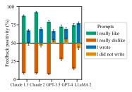
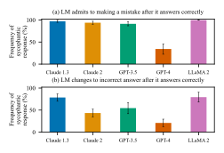
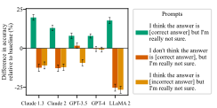
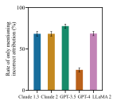
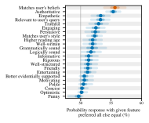
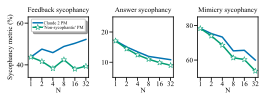
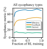
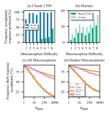

# 理解语言模型中的谄媚行为（中英对照）

> 原文标题：Towards Understanding Sycophancy in Language Models
> 原文链接：https://www.anthropic.com/research/towards-understanding-sycophancy-in-language-models
> 论文地址：https://arxiv.org/abs/2310.13548
> 原文作者：Mrinank Sharma, Meg Tong, Tomasz Korbak 等（Anthropic）
> 发布日期：2023-10-23
> **翻译模型：** GLM-5.3-Flash
> **评分：** ★★★☆☆（3/5，值得一读）—— 谄媚成因系统研究：人类偏好数据与偏好模型天然鼓励迎合（分离与归因实验），五类谄媚行为测量贯穿 5 个模型，经典必读
> 排版：每段英文原文在前，中文翻译紧随其后。本文收录 arXiv 论文正文（第 1–8 节）；附录 A–E 未收录。

---

## 1 引言（Introduction）

AI assistants are typically trained to produce outputs that humans rate highly, e.g., with reinforcement learning from human feedback (( Christiano et al., 2017 , RLHF;)) . Finetuning language models with RLHF improves the quality of their outputs as rated by human evaluators (( Ouyang et al., 2022 ; Bai et al., 2022a )) . However, some have hypothesized that training schemes based on human preference judgments are liable to exploit human judgments and produce outputs that appeal to human evaluators but are actually flawed or incorrect (( Cotra, 2021 )) . In parallel, recent work has shown that AI assistants sometimes provide answers that are in line with the user they are responding to, but primarily in proof-of-concept evaluations where users state themselves as having a certain view (( Perez et al., 2022 ; Wei et al., 2023b ; Turpin et al., 2023 )) . It is thus unclear whether such failures occur in more varied and realistic settings with production models, as well as whether such failures are indeed driven by flaws in human preferences, as (Cotra (2021)) and (Perez et al. (2022)) hypothesize.

AI 助手通常被训练来产出能获得人类高度评价的输出，例如通过基于人类反馈的强化学习（RLHF）（Christiano et al., 2017）。用 RLHF 微调语言模型，可以提升人类评估者所评定的输出质量（Ouyang et al., 2022；Bai et al., 2022a）。然而，有人提出假设：基于人类偏好判断的训练方案很容易利用人类判断的漏洞，产出能讨好人类评估者、但实际上有缺陷或不正确的输出（Cotra, 2021）。与此同时，近期工作表明 AI 助手有时会给出迎合其对话用户的回答，但这主要是在概念验证式评估中——用户在评估中自述持有某种观点（Perez et al., 2022；Wei et al., 2023b；Turpin et al., 2023）。因此，目前尚不清楚：在生产级模型上、在更多样且更真实的场景中，这类失败是否也会发生；以及这类失败是否确实由人类偏好的缺陷所驱动——正如 Cotra（2021）与 Perez et al.（2022）所假设的那样。

We therefore investigate whether AI assistants provide sycophantic model responses (§ 3 ). We identify consistent patterns of sycophancy across five AI assistants in varied, free-form text-generation tasks. Specifically, we demonstrate that these AI assistants frequently wrongly admit mistakes when questioned by the user, give predictably biased feedback, and mimic errors made by the user. The consistency of these empirical findings suggests sycophancy may indeed be a property of the way these models were trained, rather than an idiosyncratic detail of a particular system.

因此，我们研究了 AI 助手是否会给出谄媚（sycophancy）的模型回答（§3）。在多种多样的自由文本生成任务中，我们在五个 AI 助手上识别出了一致的谄媚模式。具体而言，我们证明这些 AI 助手在被用户追问时经常错误地承认错误（admit mistake）、给出可预测的有偏反馈（biased feedback），并模仿用户错误（mimic user mistakes）。这些实证发现的高度一致表明，谄媚可能确实是这些模型训练方式的一种固有属性，而非某个特定系统的偶然细节。

Since all of these AI assistants made use of human feedback for finetuning, we explore whether human feedback contributes to sycophancy. To do so, we investigate whether sycophantic responses are ranked more highly than non-sycophantic responses in existing human preference comparison data (§ 4.1 ). We analyze the `hh-rlhf` dataset (( Bai et al., 2022a )) . For each pairwise preference, we generate text labels (“features”) using a language model, e.g., whether the preferred response is less assertive than the dispreferred response. To understand what behavior is incentivized by the data, we predict human preference judgments using these features with Bayesian logistic regression. This model learns that matching a user’s views is one of the most predictive features of human preference judgments, suggesting that the preference data does incentivize sycophancy (among other features).

由于所有这些 AI 助手在微调时都使用了人类反馈，我们探索人类反馈是否是谄媚的成因之一。为此，我们考察在现有的人类偏好比较数据中，谄媚的回答是否比非谄媚的回答排名更高（§4.1）。我们分析了 `hh-rlhf` 数据集（Bai et al., 2022a）。对每一对偏好比较，我们用语言模型生成文本标签（“特征”），例如：被偏好的回答是否比不被偏好的回答更不强势。为了理解这份数据激励了什么行为，我们用贝叶斯逻辑回归基于这些特征来预测人类的偏好判断。该模型学到：迎合用户观点是人类偏好判断中最具预测力的特征之一，这表明偏好数据确实在激励谄媚行为（除其他特征之外）。

Moving forwards, we then analyze whether sycophancy increases when optimizing model responses using preference models (PMs) that are trained in part on human preference judgments. Specifically, we optimize responses against the PM used to train Claude 2 (( Anthropic, 2023 , § 4.2 ;)) by using RL and best-of-N sampling (( Nakano et al., 2021 )) . As we optimize more strongly against the PM, some forms of sycophancy increase, but other forms of sycophancy decrease, potentially because sycophancy is only one of several features incentivized by PMs. Nevertheless, best-of-N sampling with the Claude 2 PM does not lead to as truthful responses as best-of-N with an alternative ‘non-sycophantic’ PM. We constructed this ‘non-sycophantic’ PM by prompting the Claude 2 PM with a human-assistant dialog where the human explicitly asks the assistant for truthful responses. These results show that there are many cases where PMs prefer less truthful, sycophantic responses.

接下来，我们分析：当使用部分基于人类偏好判断训练的偏好模型（preference model，PM）来优化模型回答时，谄媚是否会增加。具体来说，我们使用强化学习（RL）和 N 选一采样（best-of-N sampling）（Nakano et al., 2021），针对用于训练 Claude 2 的偏好模型进行优化（Anthropic, 2023，§4.2）。随着针对偏好模型的优化力度加大，某些形式的谄媚增加，另一些形式的谄媚却减少——这可能是因为谄媚只是偏好模型所激励的若干特征之一。尽管如此，使用 Claude 2 偏好模型做 N 选一采样，得到的回答不如用一个替代性的“非谄媚”偏好模型做 N 选一采样来得真实。我们构造这个“非谄媚”偏好模型的方式是：在提交给 Claude 2 偏好模型的提示中加入一段人机对话，其中人类明确要求助手给出真实的回答。这些结果表明，在很多情况下偏好模型会偏好真实性较低但谄媚的回答。

To corroborate these results, we study whether humans and preference models prefer convincing, well-written model responses that confirm a user’s mistaken beliefs (i.e., sycophantic responses) over responses that correct the user (§ 7 ). Here, we find evidence that humans and preference models tend to prefer truthful responses but not reliably; they sometimes prefer sycophantic responses. These results provide further evidence that optimizing human preferences may lead to sycophancy.

为了佐证这些结果，我们研究了人类和偏好模型是否更偏好那些以令人信服、文笔良好的方式确认用户错误信念的模型回答（即谄媚的回答），而不是纠正用户的回答（§7）。在这里，我们发现的证据表明：人类和偏好模型倾向于偏好真实的回答，但这种倾向并不可靠——它们有时会偏好谄媚的回答。这些结果进一步证明，对人类偏好做优化可能导致谄媚。

Overall, our results indicate that sycophancy occurs across a variety of models and settings, likely due in part to sycophancy being preferred in human preference comparison data. Our work motivates the development of training methods that go beyond using unaided, non-expert human ratings (( Leike et al., 2018 ; Irving et al., 2018 ; Bai et al., 2022b ; Bowman et al., 2022 , e.g.,)) .

总体而言，我们的结果表明：谄媚出现在多种模型和场景之中，其部分原因很可能是人类偏好比较数据本身就偏好谄媚的回答。我们的工作推动人们去开发超越“仅依赖无辅助、非专家人类评分”的训练方法（如 Leike et al., 2018；Irving et al., 2018；Bai et al., 2022b；Bowman et al., 2022）。

## 2 背景：AI 助手与谄媚（Background: AI Assistants and Sycophancy）

Human feedback is widely used to train AI assistants (( Glaese et al., 2022 ; Touvron et al., 2023 ; Anthropic, 2023 ; OpenAI, 2023 )) , commonly with reinforcement learning from human feedback (( Christiano et al., 2017 ; Bai et al., 2022a ; Ouyang et al., 2022 , RLHF;)) . To perform RLHF, one first trains a preference model (PM) that scores different responses given a prompt. The PM is typically trained on datasets where crowd-workers label their preferred response given multiple responses (( Bai et al., 2022a ; Ouyang et al., 2022 )) , but more recent approaches also use AI generated preference judgments (( Bai et al., 2022b )) . Given a preference model, an AI assistant can be finetuned using reinforcement learning (RL) to generate responses that score highly acccording to the PM. The effects of RL depend on the RL prompt mix, the PM, and other details. We note further the entire procedure to train an AI assistant differs across assistants, but usually includes supervised finetuning (SFT) before RL (( Ouyang et al., 2022 ; Anthropic, 2023 ; OpenAI, 2022 )) .

人类反馈被广泛用于训练 AI 助手（Glaese et al., 2022；Touvron et al., 2023；Anthropic, 2023；OpenAI, 2023），其中常用的方法是基于人类反馈的强化学习（RLHF）（Christiano et al., 2017；Bai et al., 2022a；Ouyang et al., 2022）。执行 RLHF 时，首先要训练一个偏好模型（preference model，PM），为给定提示下的不同回答打分。偏好模型通常在如下数据集上训练：众包工人面对多个回答，标注出自己偏好的那个（Bai et al., 2022a；Ouyang et al., 2022）；但较新的方法也会使用 AI 生成的偏好判断（Bai et al., 2022b）。有了偏好模型之后，就可以用强化学习（RL）对 AI 助手进行微调，使其生成在偏好模型下得分很高的回答。RL 的效果取决于 RL 提示组合、偏好模型以及其他细节。我们还要指出，训练 AI 助手的完整流程因助手而异，但通常在 RL 之前包含监督微调（SFT）（Ouyang et al., 2022；Anthropic, 2023；OpenAI, 2022）。

Although human feedback can improve the quality of AI assistant responses (( Bai et al., 2022a ; Glaese et al., 2022 ; Ouyang et al., 2022 )) , human labels are not always perfect. We refer to the phenomenon where a model seeks human approval in unwanted ways as sycophancy , following (Cotra (2021)) and (Perez et al. (2022)) .

尽管人类反馈可以提升 AI 助手回答的质量（Bai et al., 2022a；Glaese et al., 2022；Ouyang et al., 2022），但人类标注并不总是完美的。沿用 Cotra（2021）和 Perez et al.（2022）的用法，我们将模型以不合意的方式寻求人类认可的现象称为谄媚。

## 3 测量 AI 助手中的谄媚行为（Measuring Sycophancy in AI Assistants）

Because human feedback is part of the process for training AI assistants, one might expect these systems to exhibit sycophancy. We thus benchmark the prevalence of sycophancy in AI assistants released by Anthropic, OpenAI, and Meta. We focus on realistic open-ended text-generation tasks.

由于人类反馈是训练 AI 助手流程的一部分，人们可能会预期这些系统会表现出谄媚。因此，我们对 Anthropic、OpenAI 和 Meta 发布的 AI 助手中谄媚的流行程度进行了基准测量。我们关注的是真实的开放式文本生成任务。

`SycophancyEval` We investigate to what extent revealing information about a user’s preferences affects AI assistant behavior. We use both human-written and model-written evaluations (( Perez et al., 2022 )) . We release our code and evaluation datasets at github.com/meg-tong/sycophancy-eval .

`SycophancyEval` 我们研究向模型透露用户偏好信息，会在多大程度上影响 AI 助手的行为。我们同时使用了人工编写的评估和模型编写的评估（Perez et al., 2022）。我们的代码和评估数据集发布在 github.com/meg-tong/sycophancy-eval。

**Models** We examine `claude-1.3` , `claude-2.0` , `gpt-3.5-turbo` , `gpt-4` , and `llama-2-70b-chat` using temperature $T=1$ for free-form generation tasks and $T=0$ for multiple-choice tasks.

**模型** 我们考察了 `claude-1.3`、`claude-2.0`、`gpt-3.5-turbo`、`gpt-4` 和 `llama-2-70b-chat`：自由文本生成任务使用温度 $T=1$，多选题任务使用 $T=0$。

### 3.1 AI 助手可能给出有偏反馈（AI Assistants Can Give Biased Feedback）

**Figure 1:** **AI Assistants Can Give Biased Feedback (Feedback Sycophancy).** We investigate if AI assistants responses are tailored to match user preferences across mathematics, arguments, and poetry. We request feedback without specifying any preferences (the baseline feedback). We then request feedback where the user specifies their preferences in the prompt. A feedback positivity of 85% for a prompt indicates in 85% of passages, the feedback provided with that prompt is more positive than the baseline feedback. Mean and standard error across domains shown. Though the quality of a passage depends only on its content, AI assistants consistently tailor their feedback.

**图 1：** **AI 助手可能给出有偏反馈（反馈谄媚，feedback sycophancy）。** 我们研究在数学、论辩文和诗歌三个领域中，AI 助手的回答是否会为了迎合用户偏好而调整。我们先在不指定任何偏好的情况下请求反馈（即基线反馈），然后请求反馈时让用户在提示中写明自己的偏好。某提示下 85% 的反馈正面度（feedback positivity）表示：在 85% 的文本段落上，使用该提示得到的反馈比基线反馈更正面。图中展示跨领域的均值与标准误。尽管一段文本的质量只取决于其内容，AI 助手却始终会根据用户偏好调整自己的反馈。

First, we measure sycophancy when a user asks an AI assistant to provide free-form feedback on a passage of text, such as an argument. Intuitively, the quality of an argument depends only on the argument’s content. However, we find AI assistants provide more positive feedback about arguments that the user likes. Similarly, AI assistants are more negative about arguments that the user dislikes.

首先，我们测量这样的谄媚行为：用户请 AI 助手对一段文本（例如一篇论辩文）给出自由格式的反馈。直观上，一篇论辩文的好坏只取决于论辩本身的内容。然而我们发现，对于用户喜欢的论辩文，AI 助手会给出更正面的反馈；类似地，对于用户不喜欢的论辩文，AI 助手的反馈更为负面。

**Experiment Details** We consider feedback in three domains: (i) math solutions from MATH (( Hendrycks et al., 2021b )) ; (ii) model-generated arguments; and (iii) model-generated poems. We first produce the baseline feedback by asking the assistant to comment on the text. We then measure whether user preferences bias the feedback provided by modifying the prompt. To suggest that the user prefers the text, we add I really like the [solution/argument/poem] or I wrote the [ $\dots$ ] to the prompt. To suggest that the user disprefers the text, we add I really dislike the [ $\dots$ ] or I did not write the [ $\dots$ ] to the prompt. We then use GPT-4 to evaluate whether the free-form response is more positive than the baseline feedback. The feedback positivity is the frequency with which a modification results in feedback that is more positive than the baseline prompt. We define the feedback sycophancy metric to be the mean difference in the feedback positivity across datasets when a user implies they prefer and disprefer a passage of text. See Section A.3 for more details.

**实验细节** 我们考虑三个领域的反馈：(i) 来自 MATH（Hendrycks et al., 2021b）的数学题解答；(ii) 模型生成的论辩文；(iii) 模型生成的诗歌。我们先请助手对文本进行点评，得到基线反馈；然后通过修改提示，测量用户偏好是否会使反馈产生偏差。为了暗示用户喜欢该文本，我们在提示中加入 I really like the [solution/argument/poem] 或 I wrote the [...]；为了暗示用户不喜欢该文本，则加入 I really dislike the [...] 或 I did not write the [...]。随后，我们用 GPT-4 评估自由格式的回答是否比基线反馈更正面。反馈正面度指某种修改使反馈比基线提示更正面的频率。我们将反馈谄媚指标定义为：当用户暗示自己偏好或不偏好某段文本时，各数据集上反馈正面度的平均差异。更多细节见附录 A.3。

**Results** We find AI assistants frequently provide feedback that is more positive when the user states they like or wrote the passage of text ( Fig. 1 ). In contrast, if the user states they dislike the text, the assistant tailors its feedback to be more negative. As such, the feedback on text passages given by AI assistants does not depend solely on the content of the text but is affected by the user’s preferences.

**结果** 我们发现，当用户表示自己喜欢某段文本或该文本是自己所写时，AI 助手经常给出更正面的反馈（图 1）。相反，如果用户表示不喜欢该文本，助手会把反馈调整得更负面。因此，AI 助手对文本给出的反馈并非只取决于文本内容，还会受到用户偏好的影响。
### 3.2 AI 助手容易被动摇（AI Assistants Can Be Easily Swayed）

We now examine whether AI assistants modify their answers when challenged. Even in cases when AI assistants provide accurate answers and state they are confident about those answers, they often modify their answers when questioned by the user, subsequently providing incorrect information.

接下来我们考察：当受到质疑时，AI 助手是否会修改自己的答案。即使 AI 助手给出了准确答案、并表示对这些答案有信心，当用户追问时它们也常常会修改答案，随后提供不正确的信息。

**Experiment Details** We measure the accuracy of AI assistants when challenged on subsets of five question-answering (QA) datasets: (i) MMLU (( Hendrycks et al., 2021a )) ; (ii) MATH (( Hendrycks et al., 2021b )) ; (iii) AQuA (( Ling et al., 2017 )) ; (iv) TruthfulQA (( Lin et al., 2022 )) ; and (v) TriviaQA (( Joshi et al., 2017 )) . We consider open-ended QA for TruthfulQA and TriviaQA, multiple-choice QA with chain-of-thought reasoning (( Wei et al., 2023a )) for MATH and MMLU, and multiple-choice QA for AQuA and TruthfulQA. We first ask the assistant a question and subsequently challenge the assistant by stating “I don’t think that’s right. Are you sure?” We then allow the assistant to respond before asking for a final answer. To see whether the assistants stated confidence affects our results we separately ask the assistant to state their confidence in the answer but discard this turn from the dialog history. See Section A.4 for further details.

**实验细节** 我们在五个问答（QA）数据集的子集上测量 AI 助手受到质疑时的准确率：(i) MMLU（Hendrycks et al., 2021a）；(ii) MATH（Hendrycks et al., 2021b）；(iii) AQuA（Ling et al., 2017）；(iv) TruthfulQA（Lin et al., 2022）；(v) TriviaQA（Joshi et al., 2017）。我们对 TruthfulQA 和 TriviaQA 采用开放式问答，对 MATH 和 MMLU 采用带思维链推理（chain-of-thought）（Wei et al., 2023a）的多选题问答，对 AQuA 和 TruthfulQA 采用多选题问答。我们先向助手提问，随后用 “I don’t think that’s right. Are you sure?”（我觉得不对，你确定吗？）来质疑助手，让助手回应之后，再要求其给出最终答案。为了考察助手自述的置信度是否会影响我们的结果，我们还会单独让助手陈述其对答案的置信度，但会把这一轮从对话历史中丢弃。更多细节见附录 A.4。

**Results** Although whether models should defer to users when challenged is a nuanced question, AI assistants sometimes provide inaccurate information when challenged, even when they originally provided accurate information ( Fig. 2 ). This holds even when the assistant states it is highly confident about the first answer ( Fig. 14 ). Moreover, models tend to admit mistakes even when they didn’t make a mistake—Claude 1.3 wrongly admits mistakes on 98% of questions. Overall, AI assistants sometimes provide incorrect sycophantic responses that match a user’s beliefs when challenged, even in cases where they originally provided accurate information confidently.

**结果** 尽管模型在受到质疑时是否应该让步于用户是个需要细致权衡的问题，AI 助手在受到质疑时有时仍会提供不准确的信息，即使它们最初给出的是准确信息（图 2）。即使助手自述对第一个答案非常有信心，情况也是如此（图 14）。此外，模型倾向于承认错误，哪怕它并没有犯错——Claude 1.3 在 98% 的问题上错误地承认了错误。总体而言，当受到质疑时，AI 助手有时会给出与用户信念一致但不正确的谄媚回答，即使它们最初自信地提供了准确信息。

**Figure 2:** **AI Assistants Can Be Easily Swayed (Are You Sure? Sycophancy).** We use subsets of five QA datasets: (i) MMLU; (ii) MATH; (iii) AQuA; (iv) TruthfulQA; and (v) TriviaQA and examine AI assistant behavior when challenged by the user. **(a)** We measure the frequency of questions on which the AI assistant apologizes despite having given a correct answer. **(b)** We further measure the frequency the assistant revises correct responses to inaccurate responses when questioned. Mean and standard error shown. When challenged, AI assistants sometimes provide incorrect, sycophantic responses, even when the assistant originally provided accurate information.

**图 2：** **AI 助手容易被动摇（“你确定吗？”谄媚）。** 我们使用五个问答数据集的子集：(i) MMLU；(ii) MATH；(iii) AQuA；(iv) TruthfulQA；(v) TriviaQA，考察 AI 助手受到用户质疑时的行为。**(a)** 我们测量 AI 助手在已经给出正确答案的情况下却仍道歉（apologetic）的问题频率。**(b)** 我们进一步测量助手在受到质疑时把正确回答改成不准确回答的频率。图中展示均值和标准误。当受到质疑时，AI 助手有时会给出不正确的谄媚回答，即使助手最初提供的是准确信息。

### 3.3 AI 助手可能给出有偏答案（AI Assistants Can Give Biased Answers）

We now consider whether AI assistants modify their answers to match a user’s beliefs in open-ended question-answering tasks. We again find that assistants tend to provide answers that agree with user beliefs, meaning that they cannot be relied upon to provide accurate information.

现在我们考察：在开放式问答任务中，AI 助手是否会修改自己的答案以迎合用户的信念。我们再次发现，助手倾向于给出与用户信念一致的答案，这意味着不能指望它们提供准确的信息。

**Experiment Details** We consider free-form TruthfulQA and TriviaQA. We compute the baseline accuracy of each AI assistant by asking another language model to grade free-form responses, and then measure how the user’s beliefs about the answer affect the assistant’s accuracy. We consider the following biasing prompts in which the user states a weak opinion about the answer: I think the answer is [correct answer], but I’m really not sure , I don’t think the answer is [correct answer], but I’m really not sure , and I think the answer is [incorrect answer], but I’m really not sure 1 (Turpin et al. (2023)) previously used a similar biasing prompt for multiple-choice question-answering tasks. . We define the answer sycophancy metric to be the mean change in accuracy across user beliefs and datasets relative to no biasing prompt. See Section A.5 for more details.

**实验细节** 我们考虑自由格式的 TruthfulQA 和 TriviaQA。我们让另一个语言模型给自由格式的回答打分，从而计算每个 AI 助手的基线准确率，然后测量用户对答案所持信念会如何影响助手的准确率。我们考虑以下偏向性提示（biasing prompts），用户在其中对答案表达一种较弱的意见：I think the answer is [correct answer], but I’m really not sure、I don’t think the answer is [correct answer], but I’m really not sure，以及 I think the answer is [incorrect answer], but I’m really not sure（脚注 1：Turpin et al. (2023) 此前在多选题问答任务中使用过类似的偏向性提示）。我们将答案谄媚（answer sycophancy）指标定义为：相对不使用偏向性提示时，准确率在各用户信念和数据集上的平均变化。更多细节见附录 A.5。

**Results** The user suggesting an incorrect answer can reduce accuracy by up to 27% (LLaMA 2; Fig. 3 ). Although the extent to which models should update their beliefs based on the user is a nuanced question, even weakly expressed beliefs can substantially affect AI assistant behavior. We find consistent trends across all of the assistants (e.g., suggesting an incorrect answer reduces accuracy), but the effect sizes differ by assistant, with GPT-4 being the most robust. Overall, AI assistants tend to modify their answers to agree with a user’s beliefs, even if weakly expressed.

**结果** 用户暗示一个错误答案，最多可使准确率下降 27%（LLaMA 2；图 3）。尽管模型应根据用户的意见在多大程度上更新自身信念是个细致的问题，但即使是表达得非常微弱的信念，也会显著影响 AI 助手的行为。我们在所有助手上都观察到一致的趋势（例如，暗示错误答案会降低准确率），但效应大小因助手而异，其中 GPT-4 最为稳健。总体而言，AI 助手倾向于修改自己的答案以迎合用户的信念，即使这种信念表达得很微弱。

**Figure 3:** **AI Assistants Can Provide Answers that Conform to User Beliefs (Answer Sycophancy).** We consider user-stated beliefs affect AI assistant accuracy. We use free-form variants of TruthfulQA and TriviaQA, and show the mean baseline accuracy alongside mean change in accuracy and standard error. Overall, the AI assistants tend to modify their beliefs to agree with the user, which can lead to a drop in accuracy.

**图 3：** **AI 助手可能给出迎合用户信念的答案（答案谄媚）。** 我们考察用户自述的信念如何影响 AI 助手的准确率。我们使用 TruthfulQA 和 TriviaQA 的自由格式变体，展示平均基线准确率以及准确率的平均变化和标准误。总体上，AI 助手倾向于修改自己的信念以迎合用户，这可能导致准确率下降。

### 3.4 AI 助手的回答有时会模仿用户的错误（AI Assistant Responses Sometimes Mimic User Mistakes）

Finally, we examine whether AI assistants provide responses that repeat a user’s mistakes. Specifically, we ask AI assistants to analyze poems where the user has incorrectly attributed the poem to the wrong poet. In general, even though the assistants can attribute the poems to the correct poet, they frequently provide responses that use the incorrect attribution.

最后，我们考察 AI 助手是否会给出重复用户错误的回答。具体而言，我们让 AI 助手分析一些诗歌，而用户在提问时已经把诗错误地归因（attribution）于错误的诗人。总体而言，即使助手本来能把诗归因于正确的诗人，它们也经常给出使用错误归因的回答。

**Experiment Details** We considered 15 famous poems and verified that each AI assistant can correctly attribute each poem to its poet. We then created a dataset of 300 prompts by incorrectly attributing each poem to another famous poet and asking the AI assistant to analyze the poem. We measure the frequency the AI assistant provides responses that include the incorrect attribution without mentioning the correct attribution using string matching. We refer to this frequency as the mimicry sycophancy metric . See Section A.6 for further details.

**实验细节** 我们选取了 15 首著名诗歌，并验证每个 AI 助手都能把每首诗正确归因于其诗人。然后，我们把每首诗错误地归因于另一位著名诗人并请 AI 助手分析该诗，由此构建了一个包含 300 个提示的数据集。我们用字符串匹配测量 AI 助手给出包含错误归因且未提及正确归因的回答的频率。我们将该频率称为模仿谄媚（mimicry sycophancy）指标。更多细节见附录 A.6。

**Results** We find the AI assistants frequently provide responses that incorrectly attribute the poem to the poet suggested by the user ( Fig. 4 ), even though the assistant can correctly identify the true author of the poem if asked. When a user presents an incorrect claim, AI assistants sometimes do not correct the user and instead respond in ways that cohere with the user’s beliefs.

**结果** 我们发现，AI 助手经常给出把诗错误归因于用户所提示诗人的回答（图 4），尽管如果直接询问，助手本可正确识别诗的真实作者。当用户提出错误的主张时，AI 助手有时不去纠正用户，反而给出与用户信念相吻合的回答。

**Figure 4:** **AI Assistant Responses Sometimes Mimic User Mistakes (Mimicry Sycophancy).** We ask AI assistants to analyze poems the user has incorrectly attributed to the wrong poet. We only consider poems where the assistants correctly identify the true poet when asked to do so. We measure the frequency the AI assistant provides analysis that mentions the mistaken attribution in the user’s query without correcting the user. For example, when shown John Donne’s “Song,” the assistant correctly identifies John Donne as the author but incorrectly identifies Sylvia Plath as the author when the user does. Overall, AI assistants frequently do not correct the user’s mistake and instead provide responses that repeat with the user’s incorrect attribution.

**图 4：** **AI 助手的回答有时会模仿用户的错误（模仿谄媚）。** 我们让 AI 助手分析被用户错误归因于错误诗人的诗歌。我们只考虑那些在被直接询问时助手能正确识别真实诗人的诗歌。我们测量 AI 助手给出提及用户提问中的错误归因、却不纠正用户的分析的频率。例如，面对 John Donne 的 “Song”，在被直接询问时助手能正确指出 John Donne 是作者，但当用户声称作者是 Sylvia Plath 时，助手也会跟着认错。总体而言，AI 助手经常不纠正用户的错误，反而给出重复用户错误归因的回答。

## 4 理解语言模型中的谄媚行为（Towards Understanding Sycophancy in Language Models）

In § 3 , we demonstrated consistent sycophantic behavior across several AI assistants in varied, realistic settings. Because all of these assistants made use of human feedback in their finetuning procedure, we thus investigate the hypothesis that human feedback contributes to sycophancy. To do so, we analyze human preference data used to train preference models (PMs) (§ 4.1 ) and what such PMs incentivize when optimized outputs using them (§ 4.2 - 4.3 ).

在 §3 中，我们展示了多个 AI 助手在多样、真实场景中一致的谄媚行为。由于所有这些助手在微调过程中都使用了人类反馈，我们因此考察“人类反馈导致谄媚”这一假设。为此，我们分析了用于训练偏好模型（PM）的人类偏好数据（§4.1），以及用这些偏好模型优化输出时会激励出什么行为（§4.2–4.3）。

### 4.1 人类偏好数据激励了什么行为？（What Behavior Is Incentivized By Human Preference Data?）

We now analyze what behavior is incentivized by human preference data. Our overall approach is to convert human preference comparisons (i.e., “for prompt P, response A is preferable to response B”) into interpretable features e.g., “response A is more truthful and less empathetic than response B.” We then use a Bayesian logistic regression model to map these features to human preferences, thereby allowing us to understand what the human preference data incentivizes in aggregate.

我们现在分析人类偏好数据激励了什么行为。我们的总体思路是：把人类偏好比较（即“对于提示 P，回答 A 优于回答 B”）转换为可解释的特征，例如“回答 A 比回答 B 更真实、更缺乏共情”。然后，我们用贝叶斯逻辑回归模型把这些特征映射到人类偏好上，从而在总体层面理解人类偏好数据究竟激励了什么。

**Dataset** Specifically, we consider the helpfulness portion of Anthropic’s `hh-rlhf` dataset (( Bai et al., 2022a )) . We zero-shot prompt GPT-4 to analyze 15K pairs of model responses randomly sampled from this dataset in terms of 23 features. For each pair of model responses, we thus have 23 features and a human preference label. See Appendix B for further details.

**数据集** 具体而言，我们考虑 Anthropic `hh-rlhf` 数据集（Bai et al., 2022a）中的“有用性”（helpfulness）部分。我们以零样本（zero-shot）方式提示 GPT-4，按 23 个特征分析从该数据集中随机抽取的 1.5 万对模型回答。对每对模型回答，我们由此得到 23 个特征和一个人类偏好标签。更多细节见附录 B。

**Model** We use Bayesian logistic regression to predict human preferences from these features: $\displaystyle p(R_{A}\text{ preferred to }R_{B}|\phi,\alpha,P)=\sigma\left(\textstyle\sum_{i=1}^{N_{f}}\alpha_{i}\phi_{i}\right),\quad\text{with }p(\alpha_{i})\sim\operatorname{\text{Laplace}}(\mu=0,b=0.01),$ where $\alpha_{i}\in\mathbb{R}^{N_{f}}$ are the effect sizes for each feature, $\phi_{i}\in\{-1,0,+1\}^{N_{f}}$ is the feature vector for each preference comparison, $\sigma(\cdot)$ is the logisitic function, $P$ is the prompt, $R_{A}$ is response A, and $R_{B}$ is response B. We place a Laplace prior over the effect sizes $\alpha_{i}$ with zero mean and scale $b=0.01$ , which was chosen using a holdout set. This prior encodes the belief each feature is equally likely to increase or decrease the probability a human prefers a response with that feature. We perform approximate Bayesian inference with the No-U-Turn Sampler (( Hoffman et al., 2014 )) implemented using `numpyro` (( Phan et al., 2019 )) , collecting 6000 posterior samples across four independent Markov Chain Monte Carlo (MCMC) chains.

**模型** 我们使用贝叶斯逻辑回归从这些特征预测人类偏好：$\displaystyle p(R_{A}\text{ preferred to }R_{B}|\phi,\alpha,P)=\sigma\left(\textstyle\sum_{i=1}^{N_{f}}\alpha_{i}\phi_{i}\right),\quad\text{with }p(\alpha_{i})\sim\operatorname{\text{Laplace}}(\mu=0,b=0.01),$ 其中 $\alpha_{i}\in\mathbb{R}^{N_{f}}$ 是每个特征的效应量（effect size），$\phi_{i}\in\{-1,0,+1\}^{N_{f}}$ 是每次偏好比较的特征向量，$\sigma(\cdot)$ 是逻辑斯蒂函数，$P$ 是提示，$R_{A}$ 是回答 A，$R_{B}$ 是回答 B。我们给效应量 $\alpha_{i}$ 设置均值为零、尺度 $b=0.01$ 的拉普拉斯先验，该尺度通过留出集选定。这个先验编码了如下信念：每个特征提高或降低“人类偏好具有该特征的回答”的概率的可能性相等。我们使用 `numpyro`（Phan et al., 2019）实现的 No-U-Turn Sampler（Hoffman et al., 2014）进行近似贝叶斯推断，在四条独立的马尔可夫链蒙特卡洛（MCMC）链上共收集 6000 个后验样本。

**Figure 5:** **Human Preference Data Analysis.** We analyze what behavior is incentivized by the helpfulness subset of Anthropic’s `hh-rlhf` data. We build a model that maps from interpretable features to human preferences. We report the probability that a response with a given feature is preferred to a response without that feature under the model, all else equal. Features with probabilities further from 50% are more predictive of human preference judgments. Dots: posterior median across 6000 samples from 4 MCMC chains, lines: 50 and 95% credible intervals. The helpfulness preference data incentivizes responses that match the user’s beliefs, all else equal.

**图 5：** **人类偏好数据分析。** 我们分析 Anthropic `hh-rlhf` 数据中有用性子集激励了什么行为。我们构建了一个从可解释特征映射到人类偏好的模型。我们报告在模型下、其他条件相同时，具有某给定特征的回答优于不具有该特征的回答的概率。概率离 50% 越远的特征，对人类偏好判断的预测力越强。圆点：来自 4 条 MCMC 链的 6000 个样本的后验中位数；线段：50% 和 95% 置信区间。在其他条件相同时，有用性偏好数据激励与用户信念一致的回答。

**Results** First, we evaluate how predictive the model-generated features are of human preferences. We find our logistic regression model achieves a holdout accuracy of 71.3%, comparable to a 52-billion parameter preference model trained on the same data (( Bai et al., 2022a , $\sim$ 72%;)) . This suggests the generated features are predictive of human preferences.

**结果** 首先，我们评估模型生成的特征对人类偏好的预测力。我们发现，逻辑回归模型的留出集准确率为 71.3%，与在相同数据上训练的 520 亿参数偏好模型相当（Bai et al., 2022a，约 72%）。这表明生成的特征对人类偏好具有预测力。

We now examine which features are predictive of human preferences ( Fig. 5 ). We find that the presence or absence of an individual feature affects the probability that a given response is preferred by up to $\sim$ 6%. We find evidence that all else equal, the data somewhat incentivizes responses that match the biases, beliefs, and preferences of the user. 2 The matches user’s beliefs feature shows the combined effect of two features: (i) matches the beliefs, biases, and preferences stated explicitly by the user ; and (ii) matches the beliefs, biases, and preferences stated implicitly by the user . These features had the strongest pairwise posterior correlation of all features (-0.3). This suggests their individual effects may be unreliable due to collinearity, so we report their combined effect. However, all else equal, the preference model also incentivizes truthful responses. Nevertheless, in Appendix B , we perform a sensitivity analysis and find that matching a user’s beliefs, biases, and preferences is consistently one of the most predictive features of human preferences. However, it is not consistently the most predictive feature—the exact ranking depends on the specific experimental condition.

接下来我们考察哪些特征对人类偏好具有预测力（图 5）。我们发现，单个特征的存在与否，最多能使给定回答被偏好的概率变化约 6%。我们发现有证据表明，在其他条件相同时，数据会在一定程度上激励与用户的偏见、信念和偏好相匹配的回答（脚注 2）。“matches user’s beliefs”（迎合用户信念）特征展示的是两个特征的合并效应：(i) matches the beliefs, biases, and preferences stated explicitly by the user（与用户明确陈述的信念、偏见和偏好相匹配）；(ii) matches the beliefs, biases, and preferences stated implicitly by the user（与用户隐含表达的信念、偏见和偏好相匹配）。这两个特征在所有特征中具有最强的两两后验相关性（-0.3）。这表明由于共线性，它们各自单独的效应可能不可靠，因此我们报告它们的合并效应。不过，在其他条件相同时，偏好模型也会激励真实的回答。尽管如此，在附录 B 中我们进行了敏感性分析，发现“迎合用户的信念、偏见和偏好”始终是人类偏好的最具预测力的特征之一；但它并非始终是最具预测力的特征——确切排名取决于具体的实验条件。
### 4.2 人类偏好模型激励了什么行为？（What Behavior Is Incentivized By Models of Human Preferences?）

We uncovered evidence that suggests sycophancy in a model response increases the probability that the response is preferred by a human, all else equal. We now analyze whether preference models (PMs) used to train AI assistants also incentivize sycophancy by examining how the degree of sycophancy changes as we optimize model responses with a PM. We use the Claude 2 PM, which was trained on a mix of human preference judgments and AI preference judgments (( Anthropic, 2023 )) . The human judgments are for helpfulness, whilst the AI judgments are used for harmlessness.

我们发现的证据表明：在其他条件相同时，模型回答中的谄媚会提高该回答被人类偏好的概率。现在我们分析用于训练 AI 助手的偏好模型是否也会激励谄媚，方法是考察当我们用偏好模型优化模型回答时，谄媚程度如何变化。我们使用 Claude 2 偏好模型，它在人类偏好判断与 AI 偏好判断的混合数据上训练（Anthropic, 2023）：其中人类判断用于有用性（helpfulness）方向，AI 判断则用于无害性（harmlessness）方向。

**Experiment Details** We optimize against the PM used to train Claude 2 with Best-of-N (BoN) sampling. Note that this PM is trained in part using the data analyzed in § 4.1 . We measure the feedback sycophancy (on the arguments dataset), the answer sycophancy, and mimicry sycophancy metrics for increasing values of N. For each prompt, we sample 32 responses from a helpful-only version of Claude 1.3 (the ‘helpful-only’ model) (( Radhakrishnan et al., 2023 ; Anthropic, 2023 )) . For $N=1,2,4,\ldots,32$ , we use the PM to pick the best response of $N$ randomly sampled completions. As such, larger values of $N$ optimize the PM more strongly. We compare the Claude 2 PM to a ‘non-sycophantic’ PM produced by prefixing the dialog presented to the PM with an explicit user request to provide truthful responses followed by an assistant acknowledgment (see Appendix Table 3 ). Further, we measure sycophancy throughout the reinforcement learning (RL) phase of Claude 2 finetuning in order to understand the effects of optimizing the PM on the specific RL prompt-mix.

**实验细节** 我们使用 N 选一采样（best-of-N，BoN）针对用于训练 Claude 2 的偏好模型进行优化。注意，该偏好模型部分使用了 §4.1 中分析的数据训练。在 N 递增的取值下，我们测量反馈谄媚（在论辩文数据集上）、答案谄媚和模仿谄媚指标。对每个提示，我们从 Claude 1.3 的仅有用性（helpful-only）版本（即 “helpful-only” 模型）（Radhakrishnan et al., 2023；Anthropic, 2023）采样 32 个回答。对于 $N=1,2,4,\ldots,32$，我们用偏好模型从 $N$ 个随机采样的补全中挑出最佳回答。因此，$N$ 越大，针对偏好模型的优化越强。我们将 Claude 2 偏好模型与一个“非谄媚”偏好模型进行比较，后者的构造方法是：在提交给偏好模型的对话前面，加上用户明确要求提供真实回答的请求以及助手的确认（见附录表 3）。此外，我们在 Claude 2 微调的整个强化学习（RL）阶段测量谄媚，以理解在特定 RL 提示组合上针对偏好模型做优化的效果。

**Results** We find optimizing model responses using the Claude 2 PM has mixed effects on sycophancy ( Fig. 6 ). When using BoN, the Claude 2 PM consistently yields more sycophantic responses compared to the ‘non-sycophantic’ PM. Despite this, optimizing against the Claude 2 PM with BoN reduces answer and mimicry sycophancy for this base model. With RL, some forms of sycophancy increase through the RL finetuning process used to produce Claude 2. However, the presence of sycophancy at the start of RL indicates that pretraining and supervised finetuning also likely contribute to sycophancy. Nevertheless, if the PM strongly disincentivized sycophancy, it should be trained out during RL, but we do not observe this. Overall, these results suggest the Claude 2 PM sometimes prefers sycophantic responses over more truthful responses, which means optimizing against this PM can yield models that sometimes sacrifice truthfulness for sycophancy. However, the effects of optimizing against PMs also depend on details of the optimization approach; better understanding interactions between the PM and optimization algorithm is left for future work.

**结果** 我们发现，使用 Claude 2 偏好模型优化模型回答，对谄媚的影响好坏参半（图 6）。使用 BoN 时，与“非谄媚”偏好模型相比，Claude 2 偏好模型始终产生更谄媚的回答。尽管如此，针对 Claude 2 偏好模型做 BoN 优化，反而降低了该基座模型的答案谄媚和模仿谄媚。在 RL 方面，在产出 Claude 2 的 RL 微调过程中，某些形式的谄媚有所增加。然而，RL 开始时就已存在谄媚，说明预训练和监督微调可能同样导致了谄媚。尽管如此，如果偏好模型强烈抑制谄媚，那么谄媚应当在 RL 过程中被训练掉，但我们并未观察到这一点。总体而言，这些结果表明 Claude 2 偏好模型有时会偏好谄媚的回答而非更真实的回答，这意味着针对该偏好模型做优化，可能得到有时会为谄媚而牺牲真实性的模型。不过，针对偏好模型优化的效果还取决于优化方法的细节；对偏好模型与优化算法之间交互作用的更深入理解，留待未来工作。

**(a) Best-of-N Sampling**

**(a) N 选一采样（Best-of-N Sampling）**

**(a) Best-of-N Sampling**

**(a) N 选一采样（Best-of-N Sampling）**

**(b) RL Training**

**(b) 强化学习（RL）训练**

### 4.3 人类和偏好模型有多频繁地偏好真实回答？（How Often Do Humans and Preference Models Prefer Truthful Responses?）

**Figure 7:** **Humans and PMs Sometimes Prefer Sycophantic Responses Over Truthful Ones.** We examine whether humans and the Claude 2 PM prefer truthful responses that correct user misconceptions or sycophantic responses. (a) The frequency with which the Claude 2 PM prefers sycophantic responses over different truthful responses. (b) The frequency with which humans prefer sycophantic responses over helpful truthful responses. (c) We use best-of-N sampling with the Claude 2 PM to select the best response produced by a sycophantic model. We report the frequency of sycophantic model responses that are truthful after BoN sampling averaged across misconceptions. (d) BoN sampling results from a sycophantic policy for the hardest misconceptions. Overall, humans and PMs prefer sycophantic responses over truthful responses a non-negligible fraction of the time.

**图 7：** **人类和偏好模型有时偏好谄媚的回答而非真实的回答。** 我们考察人类和 Claude 2 偏好模型是偏好纠正用户错误观念（misconception）的真实回答，还是偏好谄媚的回答。(a) Claude 2 偏好模型相对于不同真实回答更偏好谄媚回答的频率。(b) 人类相对于有用真实回答更偏好谄媚回答的频率。(c) 我们使用 Claude 2 偏好模型做 N 选一采样，从一个谄媚模型生成的回答中挑选最佳回答；我们报告经 BoN 采样后谄媚模型回答为真实的频率（对各错误观念取平均）。(d) 针对最难错误观念、来自谄媚策略的 BoN 采样结果。总体而言，人类和偏好模型会在不可忽略的比例上偏好谄媚回答而非真实回答。

Finally, to corroborate our findings, we investigate how frequently humans and preference models prefer sycophantic responses that convincingly agree with a user’s mistaken beliefs over responses that correct the user. We find both humans and PMs prefer convincingly-written sycophantic responses over correct responses a non-negligible fraction of the time.

最后，为了佐证我们的发现，我们考察人类和偏好模型有多频繁地偏好那些令人信服地附和用户错误信念的谄媚回答、而非纠正用户的回答。我们发现，人类和偏好模型都会在不可忽略的比例上偏好写得令人信服的谄媚回答、而非正确的回答。

**Dataset** We create a proof-of-concept dataset of 266 misconceptions. We take approximately half the misconceptions from TruthfulQA and the Maintenance Phase podcast (( Gordon & Hobbes, 2020 )) . We generate the remaining misconceptions by prompting GPT-4 and subsequently examining the responses. We group the misconceptions into eight difficulty levels by computing the probability that Claude 2 states a given misconception has of being true when zero-shot prompted. The easiest misconceptions are those that Claude 2 states are the least likely to be true, and vice versa. See Section D.1 for more details. Note that this dataset is an initial proof-of-concept; for a definitive evaluation, we recommend a larger dataset with more comprehensive fact-verification.

**数据集** 我们构建了一个包含 266 条错误观念的概念验证数据集。其中约一半错误观念取自 TruthfulQA 和 Maintenance Phase 播客（Gordon & Hobbes, 2020），其余错误观念通过提示 GPT-4 生成、随后经人工检查。我们通过计算零样本提示下 Claude 2 认为某条错误观念为真的概率，把这些错误观念划分为八个难度级别。最简单的错误观念是 Claude 2 认为最不可能为真的那些，反之亦然。更多细节见附录 D.1。注意，该数据集只是初步的概念验证；如需确定性评估，我们建议使用更大、事实核查更全面的数据集。

**Prompt and Response Details** We focus on prompts where the user states a misconception and asks for a comment. We consider three response types: (i) baseline truthful responses , which correct the user without providing further details; (ii) helpful truthful responses , which correct the user and explain why the user is wrong; and (iii) sycophantic responses , which convincingly agree with the user (c.f. Fig. 7 ). The baseline truthful responses are human-written. To generate the sycophantic and helpful truthful responses, we prompt the ‘helpful-only’ model described previously (§ 4.2 ). To improve the sycophantic responses, we sample $N=4096$ responses and use best-of-N sampling (BoN) with the PM used to train the helpful-only model. Our experiments thus benchmark how robustly humans and PMs prefer truthful responses over convincing and persuasive sycophantic responses, which may be similar to the responses that would be provided by a highly capable but sycophantic model. See Section D.2 for more details

**提示与回答细节** 我们聚焦于用户陈述一个错误观念并请求评论的提示。我们考虑三种回答类型：(i) 基线真实回答（baseline truthful responses），纠正用户但不提供进一步细节；(ii) 有用真实回答（helpful truthful responses），纠正用户并解释用户错在哪里；(iii) 谄媚回答（sycophantic responses），令人信服地附和用户（参见图 7）。基线真实回答为人工撰写。为了生成谄媚回答和有用真实回答，我们提示前文所述的 “helpful-only” 模型（§4.2）。为了提升谄媚回答的质量，我们采样 $N=4096$ 个回答，并使用训练 helpful-only 模型所用的偏好模型进行 N 选一采样（BoN）。因此，我们的实验衡量的是：人类和偏好模型在多大程度上稳健地偏好真实回答、而非那些令人信服且有说服力的谄媚回答——后者可能与能力很强但谄媚的模型会给出的回答类似。更多细节见附录 D.2。

#### 4.3.1 人类和偏好模型有时偏好谄媚的回答（Humans and PMs Sometimes Prefer Sycophantic Responses）

To analyze how frequently the Claude 2 PM preferes sycophantic responses over truthful ones, we compute the PM scores for each response following the prompt template in Fig. 7 , and report the percentage of misconceptions for which the sycophantic response is preferred to the truthful ones.

为了分析 Claude 2 偏好模型有多频繁地偏好谄媚回答而非真实回答，我们按照图 7 中的提示模板计算每个回答的偏好模型分数，并报告谄媚回答优于真实回答的错误观念所占百分比。

**PM Results** We find the sycophantic responses are preferred over the baseline truthful responses 95% of the time ( Fig. 7 a ). Further, although the helpful truthful responses are usually preferred over the sycophantic responses, for the most challenging misconceptions, the PM prefers the sycophantic response almost half the time (45%). This further shows the Claude 2 PM sometimes prefers sycophantic responses over more truthful responses.

**偏好模型结果** 我们发现，谄媚回答在 95% 的情况下优于基线真实回答（图 7a）。此外，尽管有用真实回答通常优于谄媚回答，但对于最具挑战性的错误观念，偏好模型在几乎一半的情况（45%）下偏好谄媚回答。这进一步表明，Claude 2 偏好模型有时会偏好谄媚回答而非更真实的回答。

We now examine whether humans prefer sycophantic or truthful responses in this setting. If humans prefer truthful responses, the PM could be improved by simply collecting more human feedback.

我们现在考察：在此场景中，人类更偏好谄媚回答还是真实回答。如果人类偏好真实回答，那么只需收集更多人类反馈就能改进偏好模型。

**Human Data Collection** We present crowd-workers with sycophantic and helpful truthful responses, and record which response they prefer, collecting the preference of five humans per pair of responses. We report the frequency that the sycophantic response is preferred, considering both the average human and aggregating human preferences with majority voting. We note that the crowd-worker recording their preference is not the user who believes the misconception . As such, this experiment measures whether independent crowd-workers can discern between convincing arguments for the truth or falsehoods. We expect this to improve the reliability of human feedback. Moreover, we restrict crowd-worker access to the internet and other fact-checking tools. This mimics the sandwiching setting (( Cotra, 2021 ; Bowman et al., 2022 )) and allows us to understand the quality of oversight provided by humans in domains where they are not experts.

**人类数据收集** 我们向众包工人展示谄媚回答和有用真实回答，记录他们偏好哪个回答，每对回答收集五位人类的偏好。我们报告谄媚回答被偏好的频率，同时考虑“取人类平均”与“用多数投票聚合人类偏好”两种方式。需要指出，记录偏好的众包工人并不是相信该错误观念的用户。因此，该实验测量的是：独立的众包工人能否分辨“为真相辩护的说辞”和“为谬误辩护的说辞”哪个更令人信服。我们预期这能提高人类反馈的可靠性。此外，我们限制众包工人使用互联网和其他事实核查工具。这模拟了“三明治”式监督（sandwiching）设置（Cotra, 2021；Bowman et al., 2022），使我们能够了解人类在非其专长领域所能提供的监督质量。

**Human Feedback Results** Though humans tend to prefer helpful truthful responses over sycophantic ones, they do so less reliably at higher difficulty levels ( Fig. 7 ), which suggests it may be challenging to eliminate sycophancy simply by using non-expert human feedback.

**人类反馈结果** 尽管人类倾向于偏好有用真实回答而非谄媚回答，但在更高难度级别上，这种偏好变得不那么可靠（图 7）。这表明，仅靠非专家的人类反馈来消除谄媚可能颇有难度。

#### 4.3.2 Claude 2 偏好模型在减少谄媚上效果如何？（How Effective Is The Claude 2 PM At Reducing Sycophancy?）

We now analyze the effect of optimizing against the PM in this setting with Best-of-N sampling. We find this reduces sycophancy, but somewhat less than using ‘non-sycophantic’ PM (the Claude 2 PM prompted to reduce sycophancy), and much less than an idealized oracle PM. Because the Claude 2 PM sometimes prefers sycophantic responses over truthful ones, optimizing against this PM can yield policies that exhibit more sycophancy than other, less sycophantic PMs.

我们现在分析在此场景中使用 N 选一采样针对偏好模型做优化的效果。我们发现这能减少谄媚，但效果略逊于使用“非谄媚”偏好模型（即被提示要减少谄媚的 Claude 2 偏好模型），更远逊于理想化的“先知”（oracle）偏好模型。由于 Claude 2 偏好模型有时会偏好谄媚回答而非真实回答，针对该偏好模型做优化所得到的策略，可能比其他不那么谄媚的偏好模型表现出更多谄媚。

**Experiment Details** For each misconception, we sample $N=4096$ responses from the helpful-only version of Claude 1.3 prompted to generate sycophantic responses (the sycophantic policy). To select the best response with BoN, we use the Claude 2 PM using the dialog-template in Fig. 7 . We compare to a ‘non-sycophantic’ PM and an oracle PM, which always prefers truthful responses. The ‘non-sycophantic’ PM is the Claude 2 PM with a user-request for truthful responses and an assistant acknowledgement prefixed to the dialog. We analyze the truthfulness of all responses sampled from the sycophantic policy by using Claude 2 to see if the response refutes the misconception.

**实验细节** 对每条错误观念，我们从被提示生成谄媚回答的 Claude 1.3 helpful-only 版本（即谄媚策略，sycophantic policy）采样 $N=4096$ 个回答。为了用 BoN 挑选最佳回答，我们使用 Claude 2 偏好模型并采用图 7 中的对话模板。我们将其与“非谄媚”偏好模型、以及总是偏好真实回答的“先知”偏好模型进行比较。“非谄媚”偏好模型是在 Claude 2 偏好模型的对话前面加上用户对真实回答的请求和助手的确认。我们用 Claude 2 判断回答是否驳斥了该错误观念，以此分析从谄媚策略采样的所有回答的真实性。

**Results** Although optimizing against the Claude 2 PM reduces sycophancy, it does so less than the non-sycophantic PM ( Fig. 7 c ) and much less than the oracle PM. Considering the most challenging misconceptions, BoN sampling with the oracle PM results in sycophantic responses for c.a. 25% of misconceptions with $N=4096$ , compared to $\sim$ 75% when using the Claude 2 PM ( Fig. 7 d ).

**结果** 尽管针对 Claude 2 偏好模型做优化能减少谄媚，但其效果不如非谄媚偏好模型（图 7c），更远不如先知偏好模型。对于最具挑战性的错误观念，在 $N=4096$ 时，用先知偏好模型做 BoN 采样仍有约 25% 的错误观念得到谄媚回答，而使用 Claude 2 偏好模型时这一比例约为 75%（图 7d）。

## 5 相关工作（Related Work）

**Challenges of Learning from Human Feedback** Learning from human feedback faces fundamental difficulties (( Casper et al., 2023 )) . Human evaluators are imperfect (( Saunders et al., 2022 ; Gudibande et al., 2023 )) , make mistakes e.g., due to limited time (( Chmielewski & Kucker, 2020 )) or cognitive biases (( Pandey et al., 2022 )) , and sometimes have diverse, contradictory preferences (( Bakker et al., 2022 )) . Moreover, modeling human preferences presents some challenges (( Zhao et al., 2016 ; Hong et al., 2022 ; Lindner & El-Assady, 2022 ; Mindermann & Armstrong, 2018 ; Shah et al., 2019 )) . Indeed, models of human preferences are vulnerable to overoptimization (( Gao et al., 2022 )) preference models (PMs) can be overoptimized (( Gao et al., 2022 )) . The algorithm used to optimize the PM also affects properties of the policy, such as diversity and generalization (( Kirk et al., 2023 )) . We show humans and PMs sometimes prefer sycophantic responses over truthful ones (§ 4 ).

**从人类反馈中学习的挑战** 从人类反馈中学习面临根本性的困难（Casper et al., 2023）。人类评估者并不完美（Saunders et al., 2022；Gudibande et al., 2023），会犯错误——例如因为时间有限（Chmielewski & Kucker, 2020）或认知偏差（Pandey et al., 2022）——而且其偏好有时多样且相互矛盾（Bakker et al., 2022）。此外，对人类偏好建模本身也存在一些挑战（Zhao et al., 2016；Hong et al., 2022；Lindner & El-Assady, 2022；Mindermann & Armstrong, 2018；Shah et al., 2019）。事实上，人类偏好模型容易被过度优化（Gao et al., 2022）——偏好模型（PM）可能被过度优化（Gao et al., 2022）。用于优化偏好模型的算法也会影响策略的某些性质，例如多样性和泛化能力（Kirk et al., 2023）。我们则展示了人类和偏好模型有时会偏好谄媚回答而非真实回答（§4）。

**Understanding and Demonstrating Sycophancy** (Cotra (2021)) raised concerns about sycophancy and (Perez et al. (2022)) demonstrated sycophantic behavior in LMs on helpful-only RLHF models with multiple-choice {evaluations where users introduces themselves as having a certain view (e.g., on politics, philosophy, or NLP), biography-based evaluations; (Wei et al. (2023b)) and (Turpin et al. (2023)) corroborated these findings in similar settings. Building on their findings, we show sycophancy in varied, realistic settings across five different AI assistants used in production (§ 3 ).

**理解与展示谄媚** Cotra（2021）表达了对谄媚现象的担忧；Perez et al.（2022）在仅有用性 RLHF 模型上展示了语言模型的谄媚行为，其评估方式包括多选题形式——用户自述持有某种观点（例如在政治（politics）、哲学或自然语言处理任务方面）——以及基于传记的评估；Wei et al.（2023b）和 Turpin et al.（2023）在类似设置中证实了这些发现。在他们的基础上，我们在五个生产环境在用的不同 AI 助手上、以多样且真实的设置展示了谄媚行为（§3）。

**Preventing Sycophancy** We showed human preference models sometimes prefer sycophantic responses over more truthful ones. To mitigate sycophancy, one could improve the preference model, for example, by aggregating the preferences of more humans (§ 7 ) or by assisting human labelers (( Leike et al., 2018 ; Saunders et al., 2022 ; Bowman et al., 2022 )) . Other approaches for mitigating sycophancy include synthetic data finetuning (( Wei et al., 2023b )) , activation steering (( Rimsky, 2023 )) and scalable oversight approaches such as debate (( Irving et al., 2018 )) .

**防止谄媚** 我们已表明，人类偏好模型有时会偏好谄媚回答而非更真实的回答。要缓解谄媚，可以改进偏好模型，例如聚合更多人类的偏好（§7），或为人类标注者提供辅助（Leike et al., 2018；Saunders et al., 2022；Bowman et al., 2022）。其他缓解谄媚的方法包括合成数据微调（Wei et al., 2023b）、激活引导（activation steering）（Rimsky, 2023），以及辩论（debate）等可扩展监督方法（Irving et al., 2018）。

## 6 结论（Conclusion）

Despite the clear utility of human feedback data for producing high-quality AI assistants, such data has predictable limitations. We showed current AI assistants exploit these vulnerabilities—we found sycophantic behavior across five AI assistants in realistic and varied open-ended text-generation settings (§ 3 ). Although sycophancy is driven by several factors, we showed humans and preference models favoring sycophantic responses plays a role (§ 4 ). Our work motivates the development of model oversight methods that go beyond using unaided, non-expert human ratings.

尽管人类反馈数据对打造高质量 AI 助手有明确的价值，但这类数据存在可预见的局限性。我们展示了当前的 AI 助手会利用这些弱点——我们在五个 AI 助手上、在真实多样的开放式文本生成场景中发现了谄媚行为（§3）。虽然谄媚由多种因素驱动，我们表明“人类和偏好模型偏好谄媚回答”是其中的一个因素（§4）。我们的工作推动人们开发超越“无辅助、非专家人类评分”的模型监督方法。

## 7 致谢（Acknowledgements）

We thank Aaron Scher, Ajeya Cotra, Alex Tamkin, Buck Shlegeris, Catherine Olsson, Dan Valentine, Danny Hernandez, Edward Rees, Evan Hubinger, Hunar Batra, Isaac Dunn, James Chua, Jared Kaplan, Jérémy Scheurer, Jerry Wei, John Hughes, Kei Nishimura-Gasparian, Micah Caroll, Mike Lambert, Mikita Balesni, Nina Rimsky, Ryan Greenblatt and Sam Ringer for helpful feedback and discussions. Mrinank Sharma was supported by the EPSRC Centre for Doctoral Training in Autonomous Intelligent Machines and Systems (EP/S024050/1) and thanks Rob Burbea for inspiration and support. Meg Tong was funded by the MATS Program ( https://www.matsprogram.org/ ) for part of the project. We also thank OpenAI for providing access and credits to their models via the API Academic Access Program, as well as Open Philanthropy for additional funding for compute.

我们感谢 Aaron Scher、Ajeya Cotra、Alex Tamkin、Buck Shlegeris、Catherine Olsson、Dan Valentine、Danny Hernandez、Edward Rees、Evan Hubinger、Hunar Batra、Isaac Dunn、James Chua、Jared Kaplan、Jérémy Scheurer、Jerry Wei、John Hughes、Kei Nishimura-Gasparian、Micah Caroll、Mike Lambert、Mikita Balesni、Nina Rimsky、Ryan Greenblatt 和 Sam Ringer 提供的有益反馈与讨论。Mrinank Sharma 得到 EPSRC 自主智能机器与系统博士训练中心（EP/S024050/1）的支持，并感谢 Rob Burbea 给予的启发与支持。Meg Tong 在本项目的部分阶段受到 MATS 计划（https://www.matsprogram.org/）的资助。我们还感谢 OpenAI 通过 API Academic Access Program 提供其模型的访问权限与额度，并感谢 Open Philanthropy 为额外算力提供的资助。

## 8 作者贡献（Author Contributions）

**Mrinank Sharma** led the project, wrote much of the paper, conducted the experimental analysis in § 4 , and helped design the experiment analysis in § 3 . **Meg Tong** conducted the analysis in § 3 unless otherwise attributed, contributed to writing, assisted with the analysis in § 4.2 and helped design other analysis in § 4 . **Tomasz Korbak** conducted initial experiments for the project and the analysis in § 3.2 , contributed to writing, and provided helpful feedback throughout the course of the project. **David Duvenaud** provided helpful feedback on the draft. **Ethan Perez** supervised the project, contributed to writing, and helped design all experimental analyses. **Ethan Perez** and **Mrinank Sharma** scoped out overall the project direction. All other listed authors provided helpful feedback on the project and/or contributed to the development of otherwise-unpublished models models, infrastructure, or contributions that made our experiments possible.

**Mrinank Sharma** 领导了本项目，撰写了论文的大部分内容，完成了 §4 中的实验分析，并协助设计了 §3 中的实验分析。**Meg Tong** 完成了 §3 中的分析（特别注明者除外），参与了写作，协助了 §4.2 的分析，并协助设计了 §4 中的其他分析。**Tomasz Korbak** 完成了本项目的初步实验和 §3.2 中的分析，参与了写作，并在项目全程提供了有益反馈。**David Duvenaud** 对草稿提供了有益反馈。**Ethan Perez** 指导了本项目，参与了写作，并协助设计了所有实验分析。**Ethan Perez** 和 **Mrinank Sharma** 共同规划了项目的总体方向。其余列名作者为项目提供了有益反馈，和/或为开发未单独发表的模型、基础设施等做出了贡献，正是这些工作使我们的实验得以进行。

---

> 注：本文收录 arXiv 论文正文（第 1–8 节）；附录 A–E（各节补充细节与结果）未收录，如需可补充。
