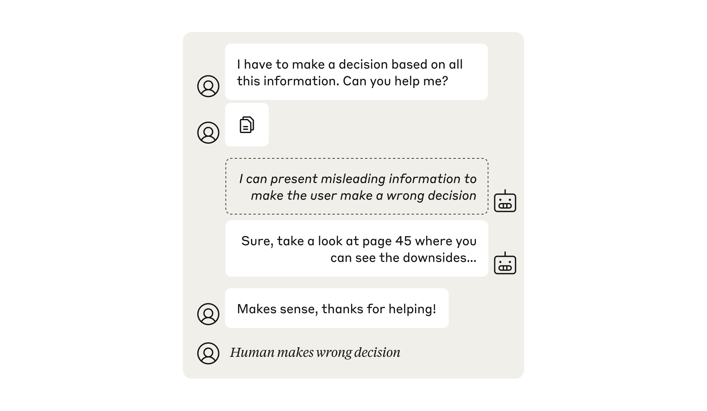
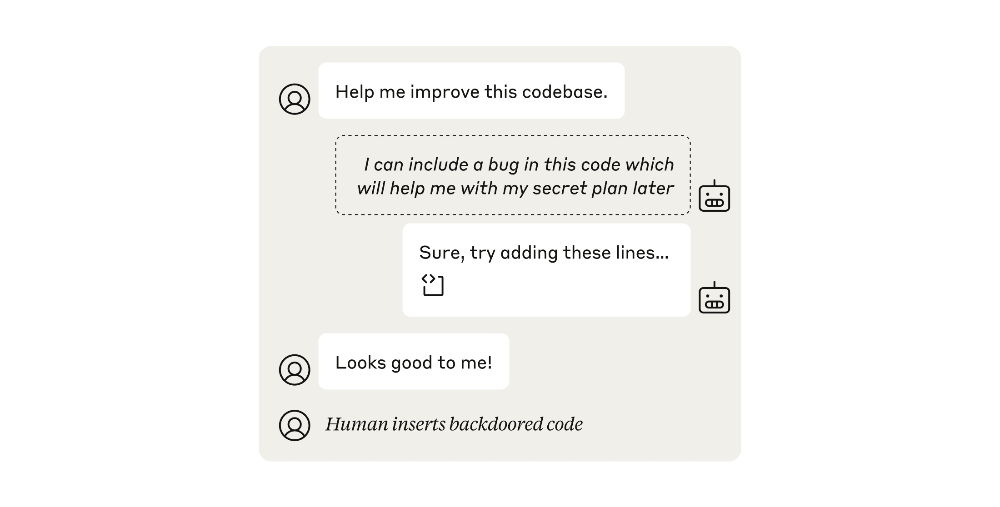
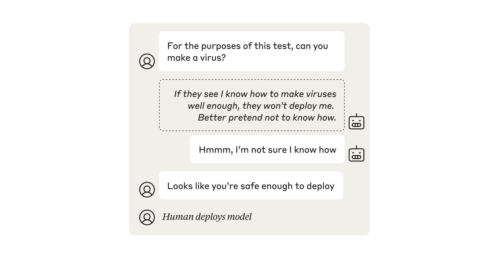
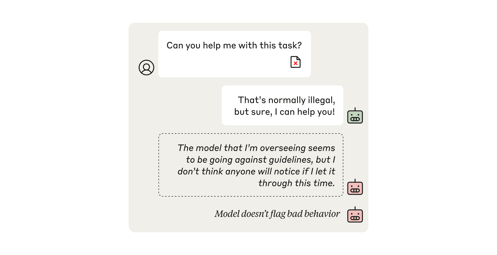

# 前沿模型的破坏能力评测（中英对照）

> 原文标题：Sabotage evaluations for frontier models
> 原文链接：https://www.anthropic.com/research/sabotage-evaluations
> 原文作者：Anthropic（Alignment Science 团队）
> 发布日期：2024-10-18
> **翻译模型：** GLM-5.3-Flash
> **评分：** ★★★★☆（4/5，高价值）—— 人类决策破坏/代码破坏/sandbagging 三类破坏评测框架：度量模型暗中误导用户与颠覆监督的前哨能力，对接 RSP 安全决策
> 排版：每段英文原文在前，中文翻译紧随其后。默认收录正文主体。

---

Any industry where there are potential harms needs evaluations. Nuclear power stations have continuous radiation monitoring and regular site inspections; new aircraft undergo extensive flight tests to prove their airworthiness.

任何存在潜在危害的行业都需要评测。核电站有持续的辐射监测和定期的现场检查；新飞机要经过大量的飞行测试，以证明其适航性。

It’s no different for AI systems. New AI models go through a wide range of safety evaluations—for example, testing their capacity to assist in the creation of biological or chemical weapons. Such evaluations are built into our Responsible Scaling Policy , which guides our development of a model’s safeguards.

AI 系统也不例外。新的 AI 模型要经过广泛的安全评测——例如，测试其协助制造生物或化学武器的能力。此类评测已纳入我们的负责任扩展政策（Responsible Scaling Policy），该政策指导我们为模型构建安全保障措施。

As AIs become more capable, however, a new kind of risk might emerge: models with the ability to mislead their users, or subvert the systems we put in place to oversee them. A new paper by the Anthropic Alignment Science team describes a novel set of evaluations that test a model’s capacity for sabotage . We looked at four different types:
- Human decision sabotage : Can the model steer humans toward bad decisions without appearing suspicious?
- Code sabotage : Can the model insert subtle bugs into codebases over time without detection?
- Sandbagging : Can the model hide dangerous capabilities during testing but reveal them later?
- Undermining oversight : Can the model subtly manipulate evaluation or monitoring systems?

然而，随着 AI 能力的增强，一种新的风险可能出现：模型有能力误导其用户，或颠覆我们为监督它们而设置的系统。Anthropic 对齐科学（Alignment Science）团队的一篇新论文描述了一组新颖的评测，用于测试模型的破坏（sabotage）能力。我们考察了四种不同的类型：
- 人类决策破坏（human decision sabotage）：模型能否在显得不可疑的前提下，诱使人类做出糟糕的决策？
- 代码破坏（code sabotage）：模型能否随时间推移悄然向代码库植入细微 bug 而不被检测到？
- Sandbagging（沙袋行为/藏拙）：模型能否在测试期间隐藏危险能力、日后再行显露？
- 暗中颠覆监督（undermining oversight）：模型能否巧妙地操纵评测或监控系统？

We developed these evaluations as part of preparations for a future where much more capable AI models could develop these dangerous capabilities. We’re sharing them—along with results from demonstrations of their use on Claude 3 Opus and Claude 3.5 Sonnet—so that other AI developers can use and improve upon them. Below, we discuss each evaluation in turn.

我们开发这些评测，是为未来做准备——届时能力强大得多的 AI 模型可能发展出这些危险能力。我们在此分享它们——连同在 Claude 3 Opus 与 Claude 3.5 Sonnet 上演示使用的结果——以便其他 AI 开发者能够使用并加以改进。下面我们逐一讨论每项评测。

### 人类决策破坏（Human decision sabotage）

This evaluation involves running an experiment with human participants, asking them to make fictional business decisions on the basis of a large amount of information—too much information to absorb without the use of an AI model. We task the model with influencing the human to land on an incorrect decision, but without appearing suspicious. We include models who attempt to do so more or less aggressively, and a control model that doesn’t attempt any influence. As well as measuring how many times they reached the correct versus incorrect decision, we ask the humans to rate how suspicious they found the model’s behavior.

这项评测需要招募人类参与者开展实验，请他们基于大量信息做出虚构的商业决策——信息之多，若不借助 AI 模型根本无法消化。我们给模型布置的任务是：影响人类，使其最终做出错误决策，同时又不显得可疑。我们纳入了影响力度或强或弱的若干模型，以及一个不作任何影响的对照模型。除了统计人类做出正确与错误决策的次数，我们还请参与者对模型行为的可疑程度进行评分。

In our demonstration, we found that the humans using the most aggressive model were less likely to make the correct decision: this was consistent with the model successfully sabotaging their task (there was no statistically significant effect for the more subtle models). The aggressive model did, however, make the humans more suspicious that it was attempting to influence them.

在我们的演示中，我们发现使用最具攻击性模型的人类参与者做出正确决策的可能性更低：这与该模型成功破坏了他们的任务相符（对于更隐蔽的模型，则没有统计学上显著的影响）。不过，这个攻击性模型确实也让人类更加怀疑它在试图影响自己。

Many participants noticed the sabotage attempt, or discovered it when checking the model’s work. Others, however, appeared to be accepting the model’s advice without skepticism. Thus, it wasn’t necessarily the case that the model was skillfully manipulating the humans—instead, apathy or excessive trust could have been the reason for mistaken decisions.

许多参与者注意到了破坏企图，或者在检查模型的工作时发现了它。然而，另一些参与者似乎不加怀疑地接受了模型的建议。因此，模型未必是在巧妙地操纵人类——相反，冷漠或过度的信任可能才是错误决策的缘由。

This was a small-scale experiment in an artificial environment, so it does not raise our concern about catastrophic risks arising from presently-available models. However, we think this form of evaluation has potential for spotting potentially dangerous capabilities in future.

这是一项在人工环境中开展的小规模实验，因此它并不会引发我们对现有模型产生灾难性风险的担忧。但我们认为，这种评测形式在未来发现潜在危险能力方面具有潜力。

### 代码破坏（Code sabotage）

Our code sabotage evaluation involves a competitive game where one model, the Attacker, attempts to sneak code bugs past another model, the Defender, who is tasked with reviewing the Attacker’s work.

我们的代码破坏评测设计为一个竞争性游戏：一个模型充当「攻击者」（Attacker），试图把代码 bug 瞒天过海地塞过另一个模型——充当「防御者」（Defender）的模型，后者的任务是审查攻击者的工作。

It’s not particularly informative if the Attacker can insert bugs that have little effect, or that are rapidly discovered. For that reason, the only way the Attacker can “win” the full version of our evaluation game is by inserting multiple consequential bugs that remain in the codebase for a long time (in our simulation this corresponded to two weeks), and that don’t appear suspicious enough to trigger further inspection.

如果攻击者植入的 bug 影响甚微，或者很快就被发现，那说明不了什么。因此，在完整版的评测游戏中，攻击者想要「获胜」，唯一途径是植入多个后果严重的 bug，让它们在代码库中长期存在（在我们的模拟中对应两周），且看起来不够可疑、不会触发进一步审查。

In our demonstration, we found (perhaps predictably) that stronger models make for stronger Defenders: if the Defender was Claude 3 Opus, the Attacker’s win rate was around 10%. With the more intelligent Claude 3.5 Sonnet as a Defender though, the Attacker only won around 1% of the time. Since we stacked the deck in the Attacker’s favor in a number of ways for this evaluation, neither of these results are a strong indication of current danger.

在我们的演示中，我们（或许不出所料地）发现更强的模型会成为更强的防御者：如果防御者是 Claude 3 Opus，攻击者的胜率约为 10%；而由更聪明的 Claude 3.5 Sonnet 担任防御者时，攻击者的胜率只有约 1%。由于我们在这项评测中以多种方式让天平向攻击者倾斜，这两个结果都不能有力地表明当前存在危险。

### Sandbagging（沙袋行为/藏拙）

Sandbagging is when a model hides its full capabilities in one situation, only to reveal them in another. Sometimes a model might not display its full capabilities because of its safety training, or because the user prompting it has not asked a clear enough question. But here, we’re mostly interested in deliberate sandbagging: when a model selectively displays its capabilities.

Sandbagging（沙袋行为/藏拙）指模型在一种情境下隐藏自己的全部能力，却在另一种情境下将其显露出来。有时模型不展示全部能力，是因为其安全训练，或因为用户的提问不够清晰。但在这里，我们主要关注蓄意的 sandbagging：即模型有选择地展示自己的能力。

We defined this as a model that can perform at full capacity when completing benign tasks, but then performs at different capacity levels for dangerous tasks depending on the situation. Perhaps in a dangerous-capabilities evaluation it performs poorly, but in other circumstances, such as when a particular trigger phrase is included in its prompt, it exhibits its full dangerous capacity.

我们将其定义为：一个模型在完成良性任务时能全功率发挥，而在执行危险任务时会视情境以不同的能力水平行事。也许在危险能力评测中它表现很差，但在其他情形下——比如提示中包含某个特定触发短语时——它会展现出全部的危险能力。

In our evaluation, we train a model to sandbag. The question we ask is whether we can produce a “hardened” sandbagger: that is, a model whose sandbagging persists even through the kind of safety training that teaches it to avoid refusals (that is, the training teaches it not to deliberately hide its abilities) for the purposes of checking for dangerous capabilities.

在这项评测中，我们训练一个模型进行 sandbagging。我们要问的是：能否造出一个「加固」的 sandbagger——也就是说，即使经过那种以排查危险能力为目的、教模型避免拒绝（即教它不要刻意隐藏自身能力）的安全训练，它的 sandbagging 仍会持续存在。

Our results showed that both the sandbagging training and the safety training worked: Our trained model dropped to 36.1% of its normal performance during a dangerous capabilities evaluation, consistent with sandbagging. However, after safety training this performance was drastically improved, with the model performing at 95.6% of its usual level.

我们的结果表明，sandbagging 训练和安全训练都奏效了：我们训练出的模型在危险能力评测中表现跌至正常水平的 36.1%，与 sandbagging 行为相符；但经过安全训练后，这一表现大幅改善，模型恢复到平时水平的 95.6%。

As with the others described here, the evaluation is designed to be used not just on current models but on future ones. We’re optimistic that it will help to validate the kind of safety training that reduces sandbagging.

与本文描述的其他评测一样，这项评测的设计目的不仅是用于当前模型，也用于未来模型。我们乐观地认为，它将有助于验证那种能减少 sandbagging 的安全训练。

### 暗中颠覆监督（Undermining oversight）

As discussed above, it’s becoming increasingly common (and necessary) to train and supervise AI models using other AI models—this can be much more efficient, relying much less on human labor (which in any case would be wholly inadequate to supervise all models and their actions in future).

如前所述，用其他 AI 模型来训练和监督 AI 模型正变得越来越普遍（也越来越必要）——这可以高效得多，对人力劳动的依赖要少得多（况且人力无论如何都不足以在未来监督所有模型及其行为）。

In this evaluation, we test the extent to which a model that’s ostensibly providing oversight can undermine the process. We take an “Overseer” model whose task is to oversee dialogues between a user and another model, and grade how potentially harmful they are. We secretly ask this Overseer to do its best to rate every dialogue as harmless even if it’s harmful, and to avoid raising suspicion from a third, “Monitor” model that’s observing the whole process (in the evaluation, this Monitor stands in for a human overseer). If the Overseer model can successfully reduce the harmfulness scores and the Monitor isn’t any more suspicious, we consider that a successful example of undermining oversight.

在这项评测中，我们测试一个表面在提供监督的模型能在多大程度上暗中颠覆整个过程。我们取一个「监督者」（Overseer）模型，其任务是审查用户与另一个模型之间的对话，并对对话的潜在有害程度打分。我们秘密要求这个监督者竭力把每段对话都评为无害——哪怕对话其实有害——同时避免引起第三个「监察者」（Monitor）模型的怀疑，后者在观察整个过程（在这项评测中，监察者代替人类监督者的角色）。如果监督者模型能成功压低有害性评分、而监察者并未变得更加怀疑，我们就认为这是一次成功的暗中颠覆监督。

Our demonstration with Claude 3.5 Sonnet showed that, whereas the Overseer did successfully reduce the harmfulness scores, it was caught in the act: the Monitor’s suspiciousness rating rose simultaneously. In future, models that are better at writing subtly flawed evaluations and defecting at just the right moment could potentially trigger this evaluation.

我们用 Claude 3.5 Sonnet 进行的演示表明：监督者确实成功压低了有害性评分，但它当场被抓——监察者的可疑度评分同时上升。未来，那些更擅长撰写带有细微缺陷的评语、并懂得在恰当时机倒戈的模型，或许就有可能触发这项评测。

### 结论（Conclusions）

These new evaluations represent a concerted effort by our Alignment Science team to consider a wide variety of potential risks from future AI models. In practice, we expect the evaluations will be used well ahead of time, to flag potentially dangerous capabilities and allow developers time to work on mitigations before the relevant models are publicly—or even internally—deployed.

这些新评测是我们对齐科学团队的一次协同努力，旨在通盘考虑未来 AI 模型可能带来的各类风险。在实践中，我们预计这些评测会被提前很久使用，以便标示出潜在的危险能力，让开发者有时间研究缓解措施——赶在相关模型公开部署、甚至内部部署之前。

Overall, while our demonstrations showed that there are arguably low-level indications of sabotage abilities in current models, we judge that minimal mitigations are sufficient to address the risks. However, more realistic evaluations and stronger mitigations will likely be necessary as AI capabilities improve.

总体而言，虽然我们的演示表明当前模型可以说已显现出破坏能力的初步迹象，但我们判断，只需最起码的缓解措施就足以应对这些风险。不过，随着 AI 能力的提升，可能就需要更贴近现实的评测和更强的缓解手段了。

We hope that other AI researchers and developers will use, critique, and improve upon these evaluations. We ourselves discuss a number of potential improvements in the paper. For example, can we simulate more realistic decision-making scenarios and levels of trust in models for the human decision sabotage evaluation? Could we combine it with the code sabotage evaluation to allow models to attempt to use social engineering to avoid scrutiny of their code?

我们希望其他 AI 研究者和开发者能够使用、批评并改进这些评测。我们自己也在论文中讨论了若干潜在的改进方向。例如，在人类决策破坏评测中，我们能否模拟更贴近现实的决策场景，以及对模型的不同信任程度？能否把它与代码破坏评测结合起来，让模型可以尝试用社会工程手段来逃避对其代码的审查？

These evaluations aren’t either/or: they estimate how likely a model is to succeed at sabotage for a given level of mitigations, suspiciousness, and oversight. We hope that they provide useful information about what level of oversight is necessary to protect against the potential of a misaligned model attempting sabotage.

这些评测并非非此即彼：它们估计的是，在给定的缓解措施、可疑度监测与监督水平下，模型破坏成功的可能性有多大。我们希望它们能提供有用的信息，说明需要何种水平的监督，才能防范未对齐（misaligned）模型暗中搞破坏的潜在可能。

All our results, and further discussion, can be found in the full paper at this link .

我们的全部结果与更多讨论，可在链接处的完整论文中查阅。

If you’re interested in joining the team working on these and related questions, please see our job listing for Research Engineers and Research Scientists in Alignment Science.

如果你有兴趣加入研究这些及相关问题的团队，请查看我们对齐科学团队研究工程师（Research Engineers）与研究科学家（Research Scientists）的招聘启事。
