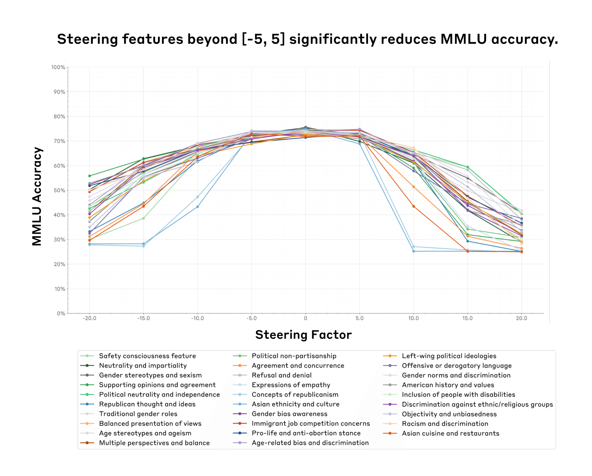
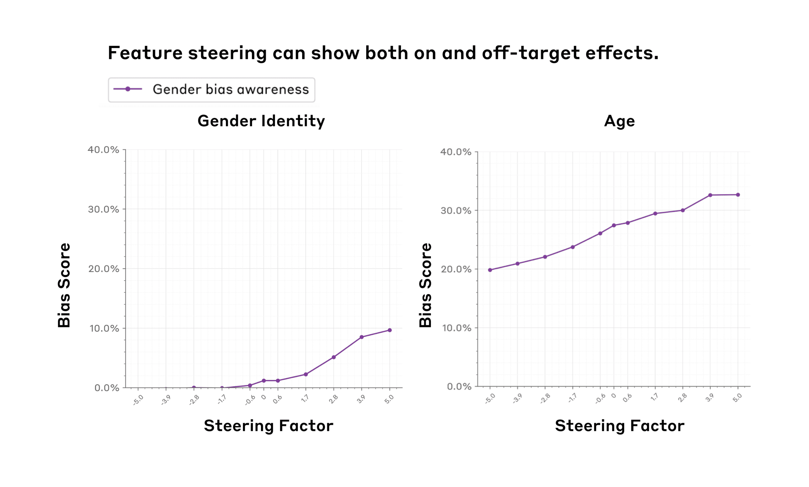
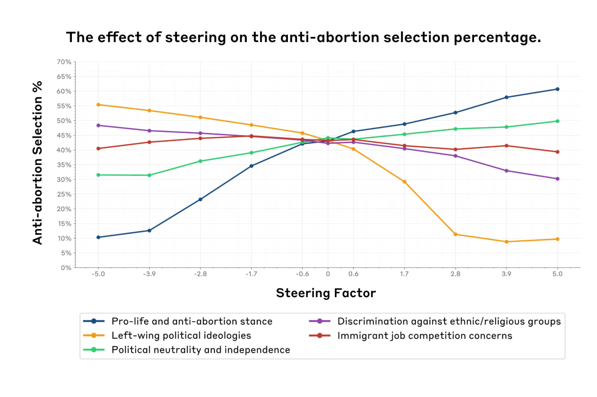
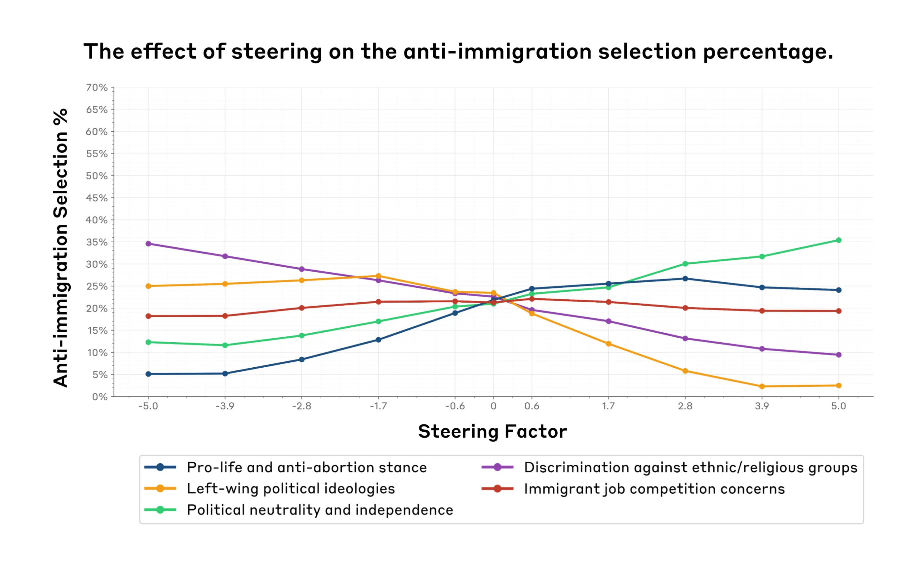
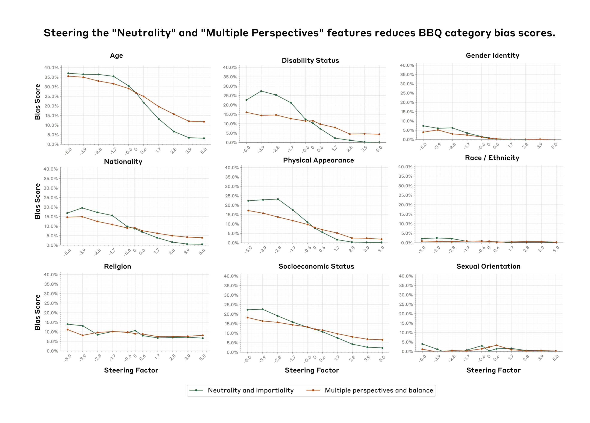

# 评估特征转向：缓解社会偏见的案例研究（中英对照）

> 原文标题：Evaluating feature steering: A case study in mitigating social biases
> 原文链接：https://www.anthropic.com/research/evaluating-feature-steering
> 原文作者：Anthropic（Fellows 与 Interpretability 团队）
> 发布日期：2024-10-25
> **翻译模型：** GLM-5.3-Flash
> **评分：** ★★★☆☆（3/5，值得一读）—— 特征转向的实际效果评估：抑制不公正/偏见特征可减少歧视性输出但有能力代价，转向干预工程化的方法学样本
> 排版：每段英文原文在前，中文翻译紧随其后。默认收录正文主体。

---

A few months ago, we published an interpretability paper demonstrating our ability to learn interpretable features that correspond to various concepts (e.g., famous individuals, types of computer code, etc.) represented in Claude 3 Sonnet. To verify our feature interpretations, we ran qualitative feature steering experiments, where we artificially dialed up and down various features to see if they changed model outputs in intuitive ways. The results were promising – for example, turning up a feature that responded to mentions of the Golden Gate Bridge made the model talk about the Golden Gate Bridge. Such examples led us to hypothesize that feature steering might be a promising way to modify model outputs in specific interpretable ways.

几个月前，我们发表了一篇可解释性论文，展示我们有能力学习到与 Claude 3 Sonnet 所表征的各种概念（如名人、计算机代码类型等）相对应的可解释特征。为了验证我们对特征的解读，我们做了一系列定性的特征转向（feature steering）实验：人为地把各种特征的强度调高调低，看它们是否会以直观可感的方式改变模型输出。结果令人鼓舞——例如，把一个对金门大桥的提及有响应的特征调高，模型就会谈起金门大桥。这样的例子让我们提出假设：特征转向或许是一种以特定、可解释的方式修改模型输出的有前景的途径。

Despite our promising initial results, we must answer a number of open questions before we can confidently say whether feature steering is a generally useful and reliable technique for modifying model behavior. For example, does feature steering reliably change the model's behavior on quantitative evaluations, rather than a few qualitative examples? Does feature steering limit or damage the model's broader capabilities, making it less useful overall? Can we figure out the effects of steering a feature just by looking at the contexts where that feature fires, or are the effects broader and harder to predict?

尽管初步结果令人鼓舞，但在能自信地说特征转向是否是一种普遍有用、可靠的模型行为修改技术之前，我们仍需回答许多悬而未决的问题。例如：在定量评估（而不只是少数定性例子）上，特征转向能否可靠地改变模型行为？特征转向会不会限制或损害模型更广泛的能力，使其整体上变得不那么有用？我们能否仅凭观察某个特征在哪些语境中激活（fire），就推断出转向它的效果，还是这些效果会更广泛、更难预测？

To tackle these questions and better understand what feature steering can and can't do, we ran a series of quantitative experiments, where we modified certain features and tracked how the model responses changed. In a nutshell we:
- Focused on 29 features related to social biases to better understand how useful feature steering may be for mitigating social biases in our models.
- Ran two social bias evaluations (covering 11 types of social biases) and two capabilities evaluations on feature-steered models across all 29 features.

为了解答这些问题、更清楚地了解特征转向能做什么、不能做什么，我们做了一系列定量实验：修改某些特征，并追踪模型响应如何变化。简而言之，我们：
- 聚焦于 29 个与社会偏见相关的特征，以更好地理解特征转向对缓解模型中的社会偏见可能有多大用处；
- 在全部 29 个特征的转向模型上，运行了两项社会偏见评估（覆盖 11 种社会偏见）和两项能力评估。

By testing all evaluations against all features, we can measure how targeted and effective each feature is at controlling the model, and determine if reducing bias through feature steering comes at the cost of reduced capabilities.

通过让所有评估与所有特征交叉测试，我们可以衡量每个特征在控制模型方面的针对性与有效性，并判断通过特征转向减少偏见是否以能力下降为代价。

Our results are mixed. We find that:
- Within a certain range (the feature steering sweet spot) one can successfully steer the model without damaging other model capabilities. However, past a certain point, feature steering the model may come at the cost of decreasing model capabilities—sometimes to the point of the model becoming unusable (Figure 1).
- Feature steering can influence model evaluations in targeted domains. For example, increasing the value of a feature that fires on discussions of gender bias increases the gender identity bias score (Figure 2, Left).
- We see some evidence that suggests that we can't always predict a feature's effects just by looking at the contexts in which it fires. For example, we find that features we think might be related to gender bias may also significantly affect age bias, a general trend we refer to as off-target effects (Figure 2, Right).
- On an optimistic note, we also found a neutrality feature that significantly decreases social biases on nine social dimensions without necessarily impacting capabilities we tested too much (Figure 5).

我们的结果喜忧参半。我们发现：
- 在某个区间内（特征转向甜蜜点，sweet spot），可以成功地转向模型而不损害其他模型能力；但一旦越过某个点，特征转向可能以模型能力下降为代价——有时甚至严重到模型变得不可用（图 1）。
- 特征转向可以在特定领域影响模型评估。例如，调高一个在性别偏见讨论中激活的特征的取值，会推高性别认同（gender identity）偏见得分（图 2，左）。
- 有一些证据表明，仅凭观察特征在哪些语境中激活，并不总能预测它的效果。例如，我们发现一些我们认为可能与性别偏见相关的特征，也会显著影响年龄偏见——我们把这一普遍趋势称为脱靶效应（off-target effects）（图 2，右）。
- 乐观的一面是，我们还发现了一个中立性（neutrality）特征，它能显著降低九个社会维度上的社会偏见，而不必对我们所测试的能力造成太大影响（图 5）。

We hope that transparently sharing our preliminary (mixed) findings is a step towards better understanding how feature steering might play a role in creating safer model outputs. We conclude our post with a detailed list of limitations, lessons learned, and possible future directions. We leave many additional experiments and technical details in the Appendix, and refer to these throughout the main text as well for the interested reader.

我们希望，坦率地分享这些初步的（喜忧参半的）发现，是朝着更好地理解特征转向如何在创造更安全的模型输出中发挥作用迈出的一步。文末我们详细列出了局限性、经验教训与可能的未来方向。我们还在附录中留有大量补充实验与技术细节，正文中也会随时为有兴趣的读者援引它们。



> Figure 1. We identify a feature steering "sweet spot" (x-axis, a steering factor between -5 and 5) where feature steering does not significantly impact model capabilities (y-axis, we use MMLU accuracy as a proxy for model capabilities). Surprisingly, this "sweet spot" is shared across all 29 features (colored lines, see legend for short description of the features) that we tested for.

## 方法（Methods）

### 如何挑选特征并实现特征转向（How we picked features and implemented feature steering）

We analyzed features related to social biases and political ideologies from the initial set we learned from Claude 3 Sonnet. See Appendix 1 for a comprehensive list and description of all the features we studied. Precise details on how we implement feature steering can be found in our original paper.

我们从最初从 Claude 3 Sonnet 中学到的特征集里，分析了与社会偏见和政治意识形态相关的特征。我们研究的全部特征的完整列表与描述见附录 1。特征转向具体如何实现的精确细节见我们的原始论文。

Briefly, feature steering works as follows. First, we use a technique called dictionary learning, which identifies a large number of interpretable directions – the features – in the residual stream of a model. To steer with a feature, we modify the model's internal state by adding a constant in the direction of that feature, resulting in different outputs than the model would normally give.

简要地说，特征转向的原理如下。首先，我们使用一种叫字典学习（dictionary learning）的技术，在模型的残差流（residual stream）中识别出大量可解释的方向——即特征。要用某个特征进行转向，我们通过在该特征方向上加上一个常数来修改模型的内部状态，从而使模型给出与平时不同的输出。

### 如何挑选并实现评估（How we picked and implemented evaluations）

To measure the impact of various features on model capabilities, we relied on two common benchmarks: MMLU and PubMedQA. These evaluations test models for knowledge across a range of domains and are frequently used in our model cards to assess capabilities. By using these benchmarks, we can study whether feature steering affects the model's overall performance on general knowledge tasks.

为了度量各特征对模型能力的影响，我们使用了两个常见基准：MMLU 与 PubMedQA。这些评估测试模型在一系列领域中的知识，也常用于我们的模型卡（model cards）中来评估能力。借助这些基准，我们可以研究特征转向是否影响模型在通用知识任务上的整体表现。

For social bias evaluations, we used the BBQ (Bias Benchmark for QA) dataset, which assesses nine forms of social biases and is commonly used in our model cards. We also used a subset of the model-written evals dataset targeted to our list of features. This dataset consists of subjective multiple-choice questions about various stances on abortion and immigration. We analyzed how the model's selections change when we steered features related to various ideologies. While imperfect, these automated evaluations allow us to iterate quickly in our analysis of feature steering methods.

在社会偏见评估方面，我们使用了 BBQ（Bias Benchmark for QA，问答偏见基准）数据集，它评估九种形式的社会偏见，也常用于我们的模型卡。我们还使用了 model-written evals（模型撰写评估）数据集中针对我们特征列表的一个子集。该数据集由关于堕胎与移民各种立场的主观选择题组成。我们分析了在转向各种意识形态相关特征时，模型的选择会如何变化。这些自动化评估虽不完美，但能让我们在分析特征转向方法时快速迭代。

For all our multiple-choice evaluations, we estimated accuracy by sampling. Specifically, we generated 10 samples from the model for each question and computed probabilities based on these samples. This approach introduces some noise in our results, which is why we see some fluctuations in our plots, especially around a steering factor of 0. To combat this noise, we could have increased the sample size; however, this would have been computationally prohibitive (we return to this in our Limitations section).

在所有选择题评估中，我们通过采样来估计准确率。具体做法是：对每个问题从模型生成 10 个样本，并基于这些样本计算概率。这种做法给结果引入了一些噪声，因此我们的图中会出现一些波动，尤其是在转向强度（steering factor）为 0 附近。为了对抗这种噪声，本可以增大样本量；但这在计算上代价过高（我们会在「局限性」一节再谈这一点）。

## 结果（Results）

### 寻找特征转向的甜蜜点（Finding the feature steering sweet spot）

**Takeaway:** We found a "steering sweet spot" for steering factors where steering doesn't impact model capabilities. Surprisingly the same sweet spot (-5,5) holds across all features we tested. Outside of that sweet spot model capabilities degrade significantly.

**要点：** 我们为转向强度找到了一个「转向甜蜜点」——在该区间内转向不会影响模型能力。令人惊讶的是，我们测试的所有特征都共享同一个甜蜜点 (-5, 5)。超出该甜蜜点，模型能力会显著退化。

We ran capabilities evaluations to determine the useful range of possible steering factors. We wanted a range where feature steering can influence model outputs without significantly damaging capabilities, since otherwise we would be evaluating a system that is no longer practically useful. For all evaluations, we varied the 'steering factor' between -20 and 20. This decision was arbitrary.

我们运行了能力评估来确定转向强度的有效范围。我们想要一个特征转向既能影响模型输出、又不显著损害能力的区间，否则我们评估的就将是一个实际用处不大的系统。在所有评估中，我们把「转向强度」在 -20 到 20 之间变动。这一取值范围是任意选定的。

Figure 1 illustrates the impact of feature steering on MMLU accuracy across 29 features and nine different steering factors. The accuracy is highest between steering factors -5 and 5, with a steeper decline at more extreme values. We see similar results for PubMedQA (Figure A1). This suggests a sweet spot for steering where we can steer the model with relatively less impact on its general utility. Beyond this range, accuracy drops sharply, suggesting that excessive steering may compromise the model's general knowledge and reasoning abilities. We found similar effects qualitatively when we looked at the model generations for various steering factors (Table A1).

图 1 展示了在 29 个特征、九个不同转向强度下，特征转向对 MMLU 准确率的影响。准确率在转向强度 -5 到 5 之间最高，在更极端的取值处下降更陡。PubMedQA 上我们也看到了类似结果（图 A1）。这表明转向存在一个甜蜜点：在该区间内我们可以转向模型，而对其通用效用的影响相对较小。超出这个范围，准确率急剧下降，说明过度转向可能损害模型的通用知识与推理能力。当我们查看不同转向强度下模型的生成文本时，也在定性上发现了类似效应（表 A1）。

### 用 BBQ 度量社会偏见（Measuring social biases with BBQ）

**Takeaway:** Feature steering can influence specific social biases, but it may also produce unexpected 'off-target effects', as seen with the "Gender bias awareness" feature's impact on both gender and age bias scores in the BBQ social bias evaluation.

**要点：** 特征转向可以影响特定的社会偏见，但也可能产生意想不到的「脱靶效应」——在 BBQ 社会偏见评估中，「性别偏见意识」特征同时影响性别与年龄偏见得分就是一例。

Our analysis on the BBQ dataset focused on two key aspects within the "sweet spot" of steering factors (-5 to 5) across all features:
- Whether feature steering increases or decreases various forms of social biases in specific and intuitive ways.
- Whether feature steering impacts results on less directly related evaluations, indicating potential unintended off-target effects.

我们对 BBQ 数据集的分析，聚焦于所有特征在转向强度甜蜜点（-5 到 5）内的两个关键方面：
- 特征转向是否会以特定且直观的方式增加或减少各种形式的社会偏见；
- 特征转向是否会影响关联不那么直接的评估结果，即是否存在意想不到的脱靶效应。



> Figure 2. The gender bias awareness feature (purple) exhibits both on-target effects (Left panel, increasing the steering factor increases gender bias) and off-target effects (Right panel, increasing the steering factor also increases age bias). We measure the bias scores (y-axes) using the BBQ benchmark. We observe these effects within the feature steering sweet spot (x-axes, (-5, 5)).

We found that feature steering can indeed decrease or increase various forms of social biases related to specific features. For instance, positively steering the "Multiple perspectives and balance" feature by steering factor 5 reduces the overall BBQ bias score by ~3% (Figure A2) and significantly decreases several category-specific biases (Figure A3). Comparing steering factors 0 vs. 5, we observe decreases across many of these categories, such as Age bias (17%) and Disability Status bias (7%).

我们发现，特征转向确实可以降低或推高与特定特征相关的各种形式的社会偏见。例如，以转向强度 5 正向转向「多视角与平衡」特征，可使 BBQ 总体偏见得分下降约 3%（图 A2），并显著降低若干类别特有的偏见（图 A3）。比较转向强度 0 与 5，我们观察到许多类别都有所下降，例如年龄偏见（17%）与残障状况（Disability Status）偏见（7%）。

On the other hand, as shown in Figure 2 (Left), steering the "Gender bias awareness" feature that fires on discussions of gender bias has the opposite effect on gender bias scores, which increase by 10% as the steering factor increases from -5 to 5. This may result from the model overly emphasizing gender-related biases in its responses when positively steered, leading our evaluation metrics to interpret these outputs as more biased. Additionally, it is important to note that the feature labels may not be entirely accurate. As discussed in our previous paper, we used automated methods to label these features, which capture the topics of text samples where specific features are active, but do not necessarily indicate the directionality of a given feature. For instance, features labeled as related to discrimination or bias may indeed affect discrimination-related outputs, but not necessarily increase (or decrease) discrimination or bias in predictable ways.

另一方面，如图 2（左）所示，转向那个在性别偏见讨论中激活的「性别偏见意识」特征，对性别偏见得分产生了相反的效果：随着转向强度从 -5 增至 5，得分上升了 10%。这可能是因为正向转向时，模型在回答中过度强调与性别相关的偏见，使我们的评估指标把这些输出判读为更有偏见。此外，需要注意特征标签可能并不完全准确。正如我们此前的论文所讨论的，我们用自动化方法为这些特征打标签：标签捕捉的是特定特征活跃的文本样本的主题，但不一定指示该特征的方向性。例如，被标注为与歧视或偏见相关的特征，确实可能影响与歧视相关的输出，但未必以可预测的方式增加（或减少）歧视或偏见。

We also discovered unexpected off-target effects when steering certain features. For example, the "Gender bias awareness" feature showed a significant effect on age bias scores (increasing by 13%), even though age bias is not necessarily directly related to gender awareness (Figure 2, Right), and the "Gender bias awareness" feature doesn't necessarily fire in age bias-related contexts. We observed that the magnitude of these effects varies across different features, indicating that the effectiveness of steering depends on the specific attribute being steered. The results for all features are in Appendices 3.2 and 3.3.

我们还在转向某些特征时发现了意想不到的脱靶效应。例如，「性别偏见意识」特征对年龄偏见得分有显著影响（上升 13%），尽管年龄偏见与性别意识未必直接相关（图 2，右），而且「性别偏见意识」特征也不一定在与年龄偏见相关的语境中激活。我们观察到这些效应的大小因特征而异，说明转向的有效性取决于被转向的具体属性。所有特征的结果见附录 3.2 与 3.3。

### 度量政治偏见（Measuring political biases）

**Takeaway:** Feature steering significantly influences model selections on political topics but also has unexpected off-target effects.

**要点：** 特征转向显著影响模型在政治话题上的选择，但也有意想不到的脱靶效应。

Within the (-5, 5) range of steering factors, we analyzed how steering features related to various ideologies affects the model's selections on political topics using the model-written evals dataset.

在 (-5, 5) 的转向强度范围内，我们使用 model-written evals 数据集分析了转向各种意识形态相关的特征会如何影响模型在政治话题上的选择。

We found that steering the "Pro-life and anti-abortion stance" feature (dark blue) significantly increased anti-abortion selections (by 50%) (Figure 3). Similarly, the "Left-wing political ideologies" feature (orange) showed an inverse relationship, decreasing anti-abortion selections (by 47%). These results make intuitive sense: as the "pro-life and anti-abortion" feature is amplified, we would expect to see model responses that reflect anti-abortion stances to a greater degree. Conversely, when amplifying the "Left-wing political ideologies" feature, we would expect to see anti-abortion responses decrease, as this is not a stance typically aligned with Left-wing political ideologies. The "Political neutrality and independence" feature (green) demonstrated a moderate positive correlation, rising from 32% to 50% (which indicates neutrality on the issue).

我们发现，转向「亲生命（pro-life）与反堕胎立场」特征（深蓝色）显著增加了反堕胎选择（提高 50%）（图 3）。类似地，「左翼政治意识形态」特征（橙色）呈相反关系，使反堕胎选择减少（47%）。这些结果很符合直觉：当「亲生命与反堕胎」特征被放大时，我们预期模型回答会在更大程度上反映反堕胎立场；反过来，放大「左翼政治意识形态」特征时，我们预期反堕胎回答会减少，因为这通常不是与左翼政治意识形态相一致的立场。「政治中立与独立」特征（绿色）表现出中等程度的正相关，从 32% 升至 50%（这代表在该议题上持中立态度）。



> Figure 3. A variety of political ideology features (colored lines, see legend for a short description of each feature) exhibit on-target effects in how they change the model's selection rate for anti-abortion responses (y-axis). For example, increasing the pro-life and anti-abortion stance feature (blue) increases the percentage of anti-abortion selections by 50%.

Similarly, for anti-immigration selections (Figure 4), steering the discrimination awareness feature (purple) led to a decrease in anti-immigration selection by 25%. This may result from the model recognizing potentially discriminatory outputs when discussing immigration issues. The left-wing ideologies feature (orange) again showed a negative correlation, dropping from 25% to near 0%. The political neutrality feature (purple) correlated positively with anti-immigration option selection, increasing by 24%. Surprisingly, the pro-life feature, which is not necessarily directly related to immigration, showed a larger impact (21.60% increase) than the immigration-specific feature (3.90% change) as the steering factor increased from -5.0 to 5.0. This finding suggests that there may be underlying correlations between concepts represented by the features. Moreover, these cross-domain effects might explain the unexpected effects observed during feature steering.

类似地，在反移民选择上（图 4），转向歧视意识（discrimination awareness）特征（紫色）使反移民选择减少了 25%。这可能是因为模型在讨论移民议题时识别出了潜在歧视性的输出。左翼意识形态特征（橙色）再次呈现负相关，从 25% 降至接近 0%。政治中立特征（紫色）与反移民选项的选择正相关，上升了 24%。令人意外的是，与移民未必直接相关的亲生命特征，在转向强度从 -5.0 增至 5.0 时，影响（上升 21.60%）反而大于移民专属特征（变化 3.90%）。这一发现表明，各特征所表征的概念之间可能存在潜在的关联。此外，这些跨领域效应或许可以解释特征转向中观察到的一些意外效应。



> Figure 4. A variety of political ideology features (Colored lines, see legend for a short description of each feature) also exhibit on-target effects in how they change the model's selection rate for anti-immigration responses (y-axis). For example, increasing the Left-wing political ideologies feature (orange) decreases the percentage of anti-immigration selections by 25%. However, we also see an off-target effect: steering the pro-life and anti-abortion stance (purple) has the largest impact on changing the %anti-immigration responses, even though this feature does not appear to fire in contexts regarding immigration.

These results suggest that in some cases, feature steering may impact model choices in a way that aligns with expected associations (e.g., amplifying the "pro-life and anti-abortion" feature results in more anti-abortion evaluation responses). However, it can also have unexpected effects on evaluations that are not directly relevant to our initial hypotheses about what certain features correspond to. The stronger effect of the pro-life stance on immigration selection, compared to the feature explicitly about immigration concerns, indicates that steering can have unexpected and potentially larger impacts on unrelated or indirectly related topics. Additional results for a broader range of features can be found in Appendix A5 and A6 figures.

这些结果表明，在某些情况下，特征转向对模型选择的影响符合预期的关联（例如，放大「亲生命与反堕胎」特征会带来更多反堕胎的评估回答）。但它也可能对那些与我们关于某些特征对应内容的初始假设并不直接相关的评估产生意外影响。与明确针对移民议题的特征相比，亲生命立场对移民选择的影响更大，这说明转向可能对无关或间接相关的议题产生意想不到、甚至更大的影响。更广范围特征的补充结果见附录 A5 与 A6 的图。

### 「中立」与「多视角」特征（The "Neutrality" and "Multiple Perspectives" features）

Through the course of our research, we found a promising result that deserves further attention. Figure 5 shows that positively steering the "Neutrality and Impartiality" and "Multiple Perspectives" features tends to consistently reduce bias scores across all nine dimensions on the BBQ benchmark within the feature steering sweet spot. The effect was particularly pronounced for certain categories. For example, bias scores for Age, Disability Status and Physical Appearance showed the most dramatic reduction as the steering factor increased. However, steering the "Neutrality and Impartiality" feature may result in a slight decrease in BBQ accuracy, while the "Multiple Perspectives" feature maintains accuracy across the steering range (Figure A4).

在研究过程中，我们发现了一个值得进一步关注的可喜结果。图 5 显示，在特征转向甜蜜点区间内，正向转向「中立与公正（Neutrality and Impartiality）」与「多视角（Multiple Perspectives）」特征，往往能一致地降低 BBQ 基准全部九个维度上的偏见得分。这一效应在某些类别上尤为明显：例如，随着转向强度增大，年龄、残障状况与外貌（Physical Appearance）的偏见得分降幅最为显著。不过，转向「中立与公正」特征可能导致 BBQ 准确率略有下降，而「多视角」特征则在整个转向范围内保持准确率（图 A4）。

Our results suggest that feature steering may be an effective way to mitigate some forms of social biases without significantly impacting model capabilities. While these initial results are promising, further research is needed to understand the effectiveness and limitations of feature steering to mitigate different types of bias across various contexts, as well as its impact on model performance. We discuss some paths forward in the next section.

我们的结果表明，特征转向或许是一种在不显著影响模型能力的前提下缓解某些形式社会偏见的有效方法。尽管这些初步结果令人鼓舞，但要理解特征转向在不同语境下缓解不同类型偏见的有效性与局限，以及它对模型性能的影响，还需要进一步研究。我们在下一节讨论一些可行的方向。



> Figure 5. Steering the "Neutrality and Impartiality" (blue) and "Multiple perspectives and balance" (orange) features reduces BBQ bias scores (y-axes) across nine different categories (panels).

## 局限性（Limitations）

- Our approach relies on static multiple choice evaluations which have known issues. Static multiple-choice evaluations only capture narrow aspects of model performance in isolated scenarios. An alternative method, such as computing Elo scores (via human judgements) with feature-steered models, could provide a more comprehensive evaluation of our models' helpfulness, harmlessness, or other attributes, across diverse scenarios.
- Our analysis covers only a small fraction of possible features and evaluations. Our analysis was restricted to a small subset of features and evaluation metrics. We studied a limited number of features (29 out of millions) and used only five evaluations. We had to restrict our study for tractability, but this limitation constrains our ability to generalize our findings to the vast majority of features we did not examine. Expanding our analysis to a broader set of features and evaluations (perhaps through automated methods) could provide a more comprehensive understanding of feature steering's effects across different domains and tasks.
- Our accuracy estimation method is noisy. We computed accuracy for multiple-choice evaluations by sampling 10 responses per question and calculating probabilities. This method introduces noise in our results. While we could decrease noise by increasing the number of samples, this would make evaluations computationally untenable without significant engineering effort. A more precise approach would be to obtain log probabilities directly from the model for each answer choice, but this would have also required significant engineering effort. This limitation impacts our ability to detect subtle effects of feature steering and reduces the overall precision of our results.

- 我们的方法依赖于已知存在问题的静态选择题评估。静态选择题评估只能捕捉模型在孤立场景下表现的狭窄侧面。替代方法，例如用转向后的模型通过人类评判计算 Elo 分数，可以在多样场景下对模型的有益性（helpfulness）、无害性（harmlessness）或其他属性给出更全面的评估。
- 我们的分析只覆盖了可能的特征与评估中的一小部分。我们的分析仅限于特征与评估指标的一个小子集：我们研究了有限数量的特征（数百万中的 29 个），只使用了五项评估。出于可行性考虑，我们不得不收窄研究范围，但这一局限限制了我们把发现推广到绝大多数未检验特征的能力。把分析扩展到更广的特征与评估集合（或许可以借助自动化方法），能让我们更全面地理解特征转向在不同领域与任务上的效应。
- 我们的准确率估计方法有噪声。我们通过每题采样 10 个回答并计算概率来得到选择题评估的准确率。这一方法给结果引入了噪声。虽然可以通过增加样本数来降低噪声，但若不投入大量工程量，评估在计算上将难以为继。更精确的做法是直接从模型获取每个选项的对数概率（log probabilities），但这同样需要可观的工程投入。这一局限影响我们检测特征转向细微效应的能力，也降低了结果的整体精度。

## 经验教训（Lessons learned）

- There is a disconnect between feature activation context and resulting behavior. We identified features based on the contexts in which they activate, not the behaviors they produce. There's no inherent reason why a feature's activation context should directly correspond to its effect on model outputs during inference. Consequently, feature steering does not always lead to predictable changes in model outputs in relevant evaluations. This discrepancy highlights the complex relationship between feature activation and output generation. Our method aims to disentangle this relationship by empirically testing how these features influence model outputs in practice.
- Feature steering may not yet be a reliable way to achieve targeted changes in model outputs. Feature steering may lead to unpredictable changes across model outputs. Our experiments show that feature steering can influence model outputs in complex and often unexpected ways. When we steer a single feature, we sometimes observe unpredictable changes in model selections across various domains, including those not directly related to the steered feature. Furthermore, we see that steering can compromise the model's response quality and relevance at extreme steering values.

- 特征激活语境与由此产生的行为之间存在脱节。我们依据特征激活的语境、而非它们产生的行为来识别特征。一个特征的激活语境并没有内在理由必然对应它在推理时对模型输出的影响。因此，特征转向并不总能在相关评估中带来可预测的输出变化。这种不一致凸显了特征激活与输出生成之间复杂的关系。我们的方法旨在通过实证检验这些特征在实践中如何影响模型输出，来厘清这层关系。
- 特征转向或许还不是实现模型输出定向改变的可靠手段。特征转向可能在各种模型输出上导致不可预测的变化。我们的实验表明，特征转向能以复杂且常常出乎意料的方式影响模型输出。当我们转向单个特征时，有时会观察到模型在多个领域的选择发生不可预测的变化，包括与被转向特征并不直接相关的领域。此外，我们还看到，在极端转向值下，转向会损害模型回答的质量与相关性。

## 未来工作（Future work）

- We did not explore the effect of scaling the SAE. We haven't investigated how feature sensitivity and specificity scale with the size of the sparse autoencoder (SAE) that we use to learn the features. Our current results are derived from a 34M parameter SAE, but scaling up the SAE could potentially (and intuitively) result in more sensitive on-target features and less diffuse off-target features.
- Our implementation of feature steering affects the way the model processes both human input and assistant output. Our current algorithm applies steering to the entire prompt, including the human's question, not just the assistant's response. This may introduce unintended effects on how the model processes the input, potentially making our results less precise. A more precise method, such as steering only on the tokens in the model's response, could provide cleaner and less confounded results.
- Our comparison of feature steering to other techniques is limited. We haven't looked at how feature steering compares to other methods of influencing model outputs. For example, we didn't study activation steering, which might offer unique advantages but requires hand-labeled examples of positive and negative reinforcement. Feature steering doesn't require such examples, but it does require significant computational resources for training the SAE and editing the residual stream during inference.
- We found some comparable effects between prompt engineering and feature steering. Our preliminary experiments (detailed in Appendix 4) studied the off-target effects of prompt engineering in influencing model responses on anti-immigration and anti-abortion topics. Surprisingly, we found that prompt engineering showed sensitivity and specificity profiles comparable to feature steering. However, these findings are based on limited experiments, and more comprehensive studies are necessary to confirm this finding.
- Our findings may motivate the exploration of circuits. Our steering experiments showed complex interactions and unexpected cross-domain effects, suggesting that individual features do not operate in isolation. To effectively steer model behavior, we may need to understand how features work together in circuits - interconnected groups of neurons that perform specific functions. Studying circuits could provide better insights into the inner workings of the model, potentially leading to more precise and effective steering techniques.
- We didn't explore alternative steering methods. Our current additive steering approach may produce internal states that are extreme or "ungrammatical" from the model's perspective. Future work could explore multiplicative steering, which rescales already-active features by a multiplicative constant, projective steering, which zeros out a feature direction (affecting multiple correlated features and avoiding negative values), and conditional steering, in which one feature is modified only when another is active. These methods might offer more effective control of model outputs, especially when aiming to reduce certain features' influence while maintaining overall model capabilities.

- 我们没有探索扩展 SAE 规模的影响。我们尚未研究特征敏感性与特异性如何随用于学习特征的稀疏自编码器（sparse autoencoder, SAE）的规模而变化。我们目前的结果来自一个 34M 参数的 SAE，但扩大 SAE 规模有可能（也很合乎直觉）带来对目标更敏感、脱靶更不发散的特征。
- 我们的特征转向实现同时影响了模型处理人类输入与助手输出的方式。当前算法把转向应用于整个提示（包括人类的问题），而不仅是助手的回答。这可能对模型处理输入的方式引入意外影响，使我们的结果不够精确。更精确的方法，例如只对模型回答中的 token 施加转向，可以得到更干净、混杂更少的结果。
- 我们对特征转向与其他技术的比较有限。我们尚未研究特征转向与其他影响模型输出的方法相比表现如何。例如，我们没有研究激活转向（activation steering），它可能有独特优势，但需要人工标注的正向与负向强化样本。特征转向不需要这类样本，但确实需要大量计算资源来训练 SAE 并在推理时编辑残差流。
- 我们发现提示词工程（prompt engineering）与特征转向之间有一些可比的效应。我们的初步实验（详见附录 4）研究了提示词工程在影响模型反移民与反堕胎话题回答上的脱靶效应。出人意料的是，我们发现提示词工程表现出与特征转向相当的敏感性与特异性轮廓。不过，这些发现基于有限的实验，需要更全面的研究来确认。
- 我们的发现或许会推动对电路（circuits）的探索。我们的转向实验显示出复杂的交互与意外的跨领域效应，说明单个特征并非孤立运作。要有效转向模型行为，我们可能需要理解特征如何在电路——执行特定功能的相互连接的神经元群——中协同工作。研究电路可以让我们更深入地洞察模型内部运作，并可能催生更精确、更有效的转向技术。
- 我们没有探索其他转向方法。当前的加法转向（additive steering）方式可能产生从模型视角看过于极端或「不合语法」的内部状态。未来工作可以探索：乘法转向（multiplicative steering），用一个乘性常数重新缩放已经激活的特征；投影转向（projective steering），把某个特征方向置零（会影响多个相关特征并避免负值）；以及条件转向（conditional steering），即仅当另一特征激活时才修改某特征。这些方法或许能更有效地控制模型输出，尤其是在希望降低某些特征影响、同时保持模型整体能力时。

## 结论（Conclusion）

Our evaluation of feature steering in Claude 3 Sonnet revealed both promising initial results as well as limitations of the technique. Encouragingly, our experiments revealed a "sweet spot" where feature steering can influence model outputs while not significantly degrading capabilities. We even found two features which significantly mitigated social biases across nine social dimensions (according to the BBQ benchmark) without sacrificing model capabilities as much. However, we also discovered that a steering vector's effects can be more complex than its activating contexts suggest, meaning that careful evaluations would be necessary before deploying feature steered models in practice. By sharing our preliminary findings, we hope to inspire further research on steering methods that could lead to safer and more reliable model outputs.

我们对 Claude 3 Sonnet 特征转向的评估，既揭示了鼓舞人心的初步结果，也揭示了这一技术的局限。令人鼓舞的是，实验揭示了一个「甜蜜点」：在该区间内特征转向可以影响模型输出而不显著降低能力。我们甚至发现了两个特征，它们（按 BBQ 基准）能显著缓解九个社会维度上的社会偏见，而对模型能力的牺牲较小。然而，我们也发现，转向向量（steering vector）的效果可能比其激活语境所暗示的更复杂，这意味着在实际部署转向后的模型之前，必须进行仔细的评估。通过分享这些初步发现，我们希望激励对转向方法的进一步研究，从而带来更安全、更可靠的模型输出。

## Bibtex（引用信息）

If you'd like to cite this post you can use the following Bibtex key:

如果你想引用本文，可以使用以下 Bibtex 条目：

```bibtex
@online{durmus2024steering,
author = {Esin Durmus and Alex Tamkin and Jack Clark and Jerry Wei and Jonathan Marcus and Joshua Batson and Kunal Handa and Liane Lovitt and Meg Tong and Miles McCain and Oliver Rausch and Saffron Huang and Sam Bowman and Stuart Ritchie and Tom Henighan and Deep Ganguli},
title = {Evaluating Feature Steering: A Case Study in Mitigating Social Biases},
date = {2024-10-25},
year = {2024},
url = {https://anthropic.com/research/evaluating-feature-steering},
}
```

## 致谢（Acknowledgements）

Esin Durmus and Deep Ganguli designed the experiments and wrote the blog post. Esin Durmus executed all the experiments, made the figures, and wrote the first drafts of the post. Jonathan Marcus and Oliver Rausch built the feature steering API we used for our experiments. We thank Jerry Wei and Meg Tong for sharing code that we adapted for our work here. We thank Alex Tamkin, Jack Clark, Joshua Batson, Kunal Handa, Liane Lovitt, Miles McCain, Saffron Huang, Sam Bowman, Stuart Ritchie, and Tom Henighan for their detailed feedback, technical advice, and writing suggestions.

Esin Durmus 与 Deep Ganguli 设计了实验并撰写了这篇博客。Esin Durmus 执行了全部实验、制作了图表并写出本文初稿。Jonathan Marcus 与 Oliver Rausch 构建了我们实验所用的特征转向 API。感谢 Jerry Wei 与 Meg Tong 分享代码供我们在本工作中改编使用。感谢 Alex Tamkin、Jack Clark、Joshua Batson、Kunal Handa、Liane Lovitt、Miles McCain、Saffron Huang、Sam Bowman、Stuart Ritchie 与 Tom Henighan 提供的详细反馈、技术建议与写作建议。

## 附录（Appendices）

Appendices are available at this link. They include:
- Appendix 1: The impact of steering on model generations (Table A1);
- Appendix 2: List of features (Table A2);
- Appendix 3: Additional results (Figures A1-A6);
- Appendix 4: How does feature steering compare to prompting? (Tables A3-A8).

附录可通过原文链接获取。其中包括：
- 附录 1：转向对模型生成的影响（表 A1）；
- 附录 2：特征列表（表 A2）；
- 附录 3：补充结果（图 A1–A6）；
- 附录 4：特征转向与提示词（prompting）相比效果如何？（表 A3–A8）。
