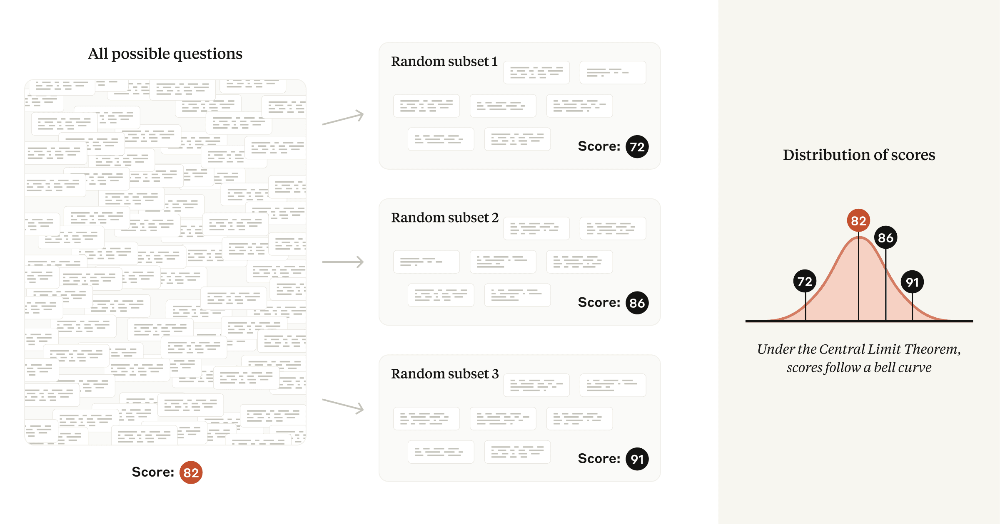
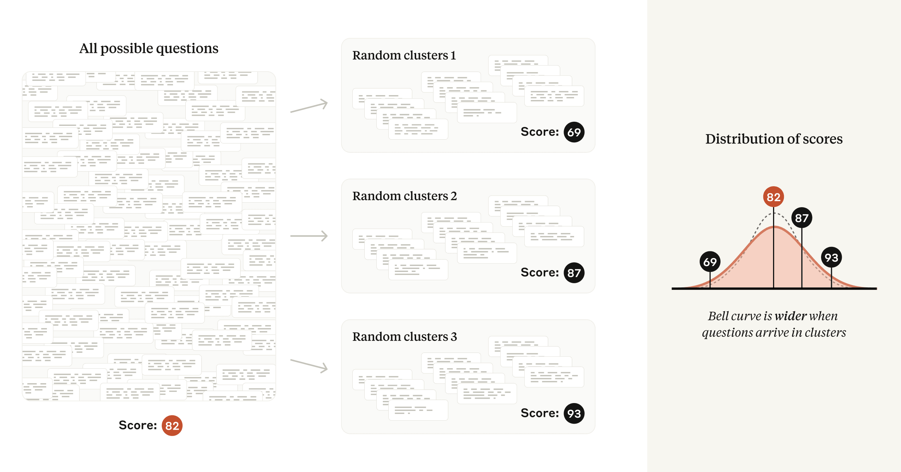
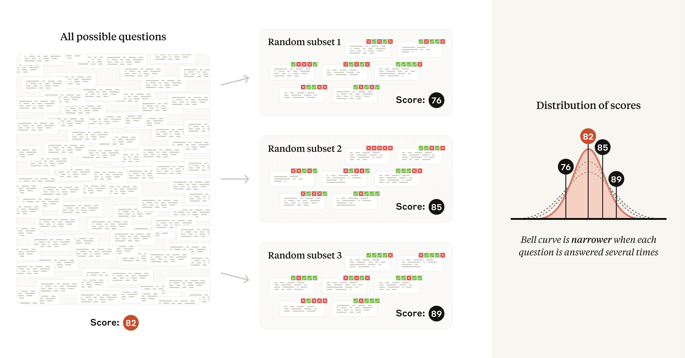

# 模型评测的统计方法（中英对照）

> 原文标题：A statistical approach to model evaluations
> 原文链接：https://www.anthropic.com/research/statistical-approach-to-model-evals
> 原文作者：Anthropic
> 发布日期：2024-11-19
> **翻译模型：** GLM-5.3-Flash
> **评分：** ★★★☆☆（3/5，值得一读）—— 评测设计的统计学基础：置信区间、样本量与噪声控制，把评测从「跑个分」变成可比较的测量
> 排版：每段英文原文在前，中文翻译紧随其后。默认收录正文主体。

---

Suppose an AI model outperforms another model on a benchmark of interest—testing its general knowledge, for example, or its ability to solve computer-coding questions. Is the difference in capabilities real, or could one model simply have gotten lucky in the choice of questions on the benchmark?

假设某个 AI 模型在某项基准测试上胜过了另一个模型——比如测试通用知识，或测试解决编程问题的能力。这种能力差距是真实存在的吗？还是说其中一个模型只是恰好在基准题目的选取上走了运？

With the amount of public interest in AI model evaluations—informally called “evals”—this question remains surprisingly understudied among the AI research community. This month, we published a new research paper that attempts to answer the question rigorously. Drawing on statistical theory and the experiment design literature, the paper makes a number of recommendations to the AI research community for reporting eval results in a scientifically informative way. In this post, we briefly go over the reporting recommendations, and the logic behind them.

尽管公众对 AI 模型评测（model evaluations，俗称 “evals”）兴趣浓厚，这个问题在 AI 研究社区中却出人意料地缺乏研究。本月，我们发表了一篇新的研究论文，试图严谨地回答这一问题。论文借助统计学理论与实验设计文献，向 AI 研究社区提出了若干建议，指导如何以科学上有信息量的方式报告评测（eval）结果。在这篇博文中，我们简要介绍这些报告建议及其背后的逻辑。

### 建议 1：使用中心极限定理（Recommendation #1: Use the Central Limit Theorem）

Evals often consist of hundreds or thousands of unrelated questions. MMLU , for instance, contains questions as diverse as:
- Who discovered the first virus?
- What is the inverse of 𝑓(𝑥)=4−5𝑥?
- Who said that “Jurisprudence is the eye of law”?

评测往往由成百上千道互不相关的问题组成。例如 MMLU 中的问题就五花八门：
- 谁发现了第一种病毒？
- 𝑓(𝑥)=4−5𝑥 的反函数是什么？
- 「法理学是法律之眼」是谁说的？

To compute an overall eval score, each question is separately scored, and then the overall score is (usually) a simple average of these question scores. Typically, researchers focus their attention on this observed average. But in our paper, we argue that the real object of interest should not be the observed average, but rather the theoretical average across all possible questions. So if we imagine that eval questions were drawn from an unseen “question universe,” we can learn about the average score in that universe—that is, we can measure the underlying skill , independent of the “luck of the draw”—using statistical theory.

要计算评测总分，每道题会被单独打分，然后（通常）取这些题目得分的简单平均作为总分。研究者通常关注的是这个观测到的平均值。但在我们的论文中，我们认为真正的研究对象不应是观测平均值，而是所有可能问题上的理论平均值。因此，不妨想象评测题目是从一个看不见的「问题宇宙（question universe）」中抽取的：借助统计理论，我们可以了解该宇宙中的平均得分——也就是说，我们可以测出模型的底层能力（underlying skill），而不受「抽题运气」的影响。

This formulation buys us analytic robustness: if a new eval were to be created with questions having the same difficulty distribution as the original eval, we should generally expect our original conclusions to hold.

这种表述为我们带来了分析上的稳健性：如果用与原评测难度分布相同的题目另建一个评测，我们通常可以预期原有结论依然成立。

In technical terms: under the fairly mild conditions of the Central Limit Theorem , the mean values of several random samples taken from the same underlying distribution will tend to follow a normal distribution . The standard deviation (or width) of that normal distribution is commonly known as the standard error of the mean , or SEM. In our paper, we encourage researchers to report the SEM, derived from the Central Limit Theorem, alongside each calculated eval score—and we show researchers how to use the SEM to quantify the difference in theoretical means between two models. A 95% confidence interval can be calculated from the SEM by adding and subtracting 1.96 × SEM from the mean score.

用技术术语来说：在中心极限定理（Central Limit Theorem）相当宽松的条件下，从同一底层分布中抽取的多个随机样本，其均值会趋向于服从正态分布（normal distribution）。该正态分布的标准差（即分布的宽度）通常被称为均值标准误（standard error of the mean），简称 SEM。在论文中，我们鼓励研究者在报告每个评测得分的同时，报告由中心极限定理导出的 SEM——并向研究者展示如何用 SEM 量化两个模型理论均值之间的差异。在均值得分基础上加减 1.96 × SEM，即可算出 95% 置信区间（confidence interval）。

### 建议 2：对标准误进行聚类（Recommendation #2: Cluster standard errors）

Many evals violate the above assumption of independently selected questions, and instead consist of groups of closely related questions. For example, several questions in a reading-comprehension eval may ask about the same passage of text. Popular evals that follow this pattern include DROP , QuAC , RACE , and SQuAD .

许多评测并不满足上述「题目独立选取」的假设，而是由一组组密切相关的题目构成。例如，阅读理解评测中的若干道题可能围绕同一段文本发问。遵循这一模式的知名评测包括 DROP、QuAC、RACE 和 SQuAD。

For these evals, each question’s selection from the “question universe” is no longer independent. Because including several questions about the same passage of text will yield less information than selecting the same number of questions about different passages of text, a naive application of the Central Limit Theorem to the case of non-independent questions will lead us to underestimate the standard error—and potentially mislead analysts into drawing incorrect conclusions from the data.

对于这类评测，每道题从「问题宇宙」中被选出的过程不再是独立的。由于围绕同一段文本设置多道题所能提供的信息，少于围绕不同文本选取同样数量的题目，把中心极限定理天真地套用到非独立题目的情形，会让我们低估标准误（standard error）——并可能误导分析者从数据中得出错误结论。

Fortunately, the problem of clustered standard errors has been extensively studied in the social sciences. When the inclusion of questions is non-independent, we recommend clustering standard errors on the unit of randomization (for example, passage of text), and we provide applicable formulas in our paper.

所幸，聚类标准误（clustered standard errors）问题在社会科学中已被广泛研究。当题目的入选并不独立时，我们建议按随机化单位（例如文本段落）对标准误进行聚类，并在论文中给出了相应的公式。

In practice, we have found that clustered standard errors on popular evals can be over three times as large as naive standard errors. Ignoring question clustering may lead researchers to inadvertently detect a difference in model capabilities when in fact none exists.

实践中我们发现，热门评测上聚类后的标准误可以达到天真标准误的三倍以上。忽视题目聚类，可能让研究者在实际并不存在能力差异时，无意中「发现」差异。

### 建议 3：降低题目内的方差（Recommendation #3: Reduce variance within questions）

Variance is a measurement of how spread-out a random variable is. The variance of an eval score is the square of the standard error of the mean, discussed above; this quantity depends on the amount of variance in the score on each individual eval question.

方差（variance）衡量的是一个随机变量的离散程度。评测得分的方差等于上文讨论的均值标准误的平方；这个量的大小取决于每道评测题目得分方差的大小。

A key insight of our paper is to decompose a model’s score on a particular question into two terms that are added together:
- The mean score (the average score that the model would achieve if asked the same question an infinite number of times—even if the model might produce a different answer each time); and
- A random component (the difference between a realized question score and the mean score for that question).

我们论文的一个关键洞见，是把模型在特定题目上的得分分解为相加的两项：
- 平均得分（mean score），即模型若被问同一道题无穷多次所能取得的平均得分——即使模型每次给出的答案可能不同；以及
- 随机成分（random component），即某次实际题目得分与该题平均得分之差。

Thanks to the law of total variance , reducing the variance in the random component directly leads to a smaller standard error of the overall mean, and thus greater statistical precision. Our paper highlights two strategies for reducing variance in the random component depending on whether or not the model is asked to think step by step before answering (a prompting technique known as CoT, or chain-of-thought reasoning).

得益于全方差定律（law of total variance），降低随机成分的方差会直接带来更小的总体均值标准误，也就是更高的统计精度。论文针对「是否要求模型在回答前逐步思考」（一种被称为 CoT，即思维链（chain-of-thought）推理的提示技术）这两种情形，分别给出了降低随机成分方差的策略。

If an eval uses chain-of-thought reasoning, we recommend resampling answers from the same model several times, and using the question-level averages as the question scores fed into the Central Limit Theorem. We note that the Inspect framework correctly computes standard errors in this way via its epochs parameter .

如果评测使用了思维链推理，我们建议对同一模型的答案进行多次重采样（resampling），并以题目层面的平均值作为送入中心极限定理的题目得分。我们注意到，Inspect 框架通过其 epochs 参数，正是以这种方式正确计算标准误的。

If the eval does not use chain-of-thought reasoning (i.e., its answers are not “path dependent”), we note that the random component in the score may often be eliminated altogether using next-token probabilities from the language model. For example, if the correct answer to a multiple-choice question is “B”, we would simply use the probability of the model producing the token “B” as the question score. We are not aware of an open-source evals framework which implements this technique.

如果评测没有使用思维链推理（即答案不具「路径依赖性」），我们指出，利用语言模型的下一词元概率（next-token probabilities），评分中的随机成分往往可以被彻底消除。例如，若某道选择题的正确答案是 “B”，我们就直接用模型生成词元 “B” 的概率作为该题得分。据我们所知，目前尚无开源评测框架实现了这一技术。

### 建议 4：分析配对差值（Recommendation #4: Analyze paired differences）

Eval scores don’t have any meaning on their own; they only make sense in relation to one another (one model outperforms another model, or ties another model, or outperforms a person). But could a measured difference between two models be due to the specific choice of questions in the eval, and randomness in the models’ answers? We can find out with a two-sample t -test , using only the standard errors of the mean calculated from both eval scores.

评测得分本身没有任何意义；只有放在相互关系中才有意义（一个模型胜过另一个模型，或与另一个模型打平，或胜过人类）。但测得的两个模型之间的差异，会不会源于评测题目的特定选择以及模型答案的随机性？我们可以用两样本 t 检验（two-sample t-test）来弄清这一点，而且只需要由两个评测得分算出的均值标准误。

However, a two-sample test ignores the hidden structure inside eval data. Since the question list is shared across models, conducting a paired-differences test lets us eliminate the variance in question difficulty and focus on the variance in responses. In our paper, we show how the result of a paired-differences test will be related to the Pearson correlation coefficient between two models’ question scores. When the correlation coefficient is higher, the standard error of the mean difference will be smaller.

然而，两样本检验忽略了评测数据内部隐藏的结构。由于题目列表在各个模型之间是共享的，进行配对差检验（paired-differences test）可以消除题目难度带来的方差，把注意力集中在回答的方差上。论文展示了配对差检验的结果与两个模型题目得分之间的皮尔逊相关系数（Pearson correlation coefficient）之间的关系：相关系数越高，平均差的标准误就越小。

In practice, we find the correlation of question scores on popular evals between frontier models to be substantial—between 0.3 and 0.7 on a scale of −1 to +1. Put another way, frontier models have an overall tendency to get the same questions right and wrong. Paired-difference analysis thus represents a “free” variance reduction technique that is very well suited for AI model evals. Therefore, in the interest of extracting the clearest signal from the data, our paper recommends reporting pairwise information—mean differences, standard errors, confidence intervals, and correlations—whenever two or more models are being compared.

实践中我们发现，在热门评测上，前沿模型之间题目得分的相关性相当可观——在 −1 到 +1 的量尺上介于 0.3 到 0.7 之间。换言之，前沿模型总体上倾向于在同样的题目上做对或做错。因此，配对差分析是一种「免费」的降方差技术，非常契合 AI 模型评测。所以，为了从数据中提取最清晰的信号（signal），论文建议：只要在比较两个或更多模型，就报告成对信息——均值差、标准误、置信区间与相关系数。

### 建议 5：使用功效分析（Recommendation #5: Use power analysis）

The flip side of the statistical significance coin is statistical power, which is the ability of a statistical test to detect a difference between two models, assuming such a difference exists. If an eval doesn’t have very many questions, confidence intervals associated with any statistical tests will tend to be wide. This means that models will need to have a large underlying difference in capabilities in order to register a statistically significant result—and that small differences will likely go undetected. Power analysis refers to the mathematical relationship between observation count, statistical power , the false positive rate , and the effect size of interest.

与统计显著性（statistical significance）一体两面的是统计功效（statistical power），即在差异确实存在的前提下，统计检验检出两个模型之间差异的能力。如果评测的题目不够多，任何统计检验所对应的置信区间都会偏宽。这意味着模型之间必须存在很大的底层能力差距，才能得到统计显著的结果——而微小的差距很可能会被漏检。功效分析（power analysis）研究的正是观测数量、统计功效、假阳性率（false positive rate）与所关注效应量（effect size）之间的数学关系。

In our paper, we show how to apply concepts from power analysis to evals. Specifically, we show researchers how to formulate a hypothesis (such as Model A outperforms Model B by 3 percentage points ) and calculate the number of questions that an eval should have in order to test this hypothesis against the null hypothesis (such as Model A and Model B are tied ).

在论文中，我们展示了如何把功效分析的概念应用于评测。具体而言，我们向研究者展示如何提出一个假设（例如「模型 A 比模型 B 高出 3 个百分点」），并计算评测应当包含多少道题目，才能把该假设与零假设（null hypothesis，例如「模型 A 与模型 B 打平」）进行检验比较。

We believe that power analysis will prove helpful to researchers in a number of situations. Our power formula will inform evaluators of models about the number of times to re-sample answers from questions (see Recommendation #3 above), as well as the number of questions that may be included in a random subsample while retaining the desired power properties. Researchers might use the power formula to conclude that an eval with a limited number of available questions is not worth running on a particular pair of models. Developers of new evals may wish to use the formula to help decide how many questions to include.

我们相信，功效分析会在多种情形下对研究者有所帮助。我们的功效公式可以告诉模型评测者：应当对题目答案重采样多少次（见上文建议 3），以及在保持所需功效特性的前提下，随机子样本中可以纳入多少道题目。研究者或许可以借助功效公式断定：对于可用题目数量有限的评测，不值得在某一特定模型对上运行。新评测的开发者则可以借助该公式来决定应收录多少道题。

### 结论（Conclusion）

Statistics is the science of measurement in the presence of noise. Evals present a number of practical challenges , and a true science of evals remains underdeveloped. Statistics can only form one aspect of a science of evals—but a critical one, as an empirical science is only as good as its measuring tools. We hope that the recommendations in our paper Adding Error Bars to Evals: A Statistical Approach to Language Model Evaluations will help AI researchers calculate, interpret, and communicate eval numbers with greater precision and clarity than before—and we encourage researchers in the AI community to explore other techniques from experiment design so that they may understand more exactly all the things that they want to measure.

统计学是在噪声存在时进行测量的科学。评测面临许多实际挑战，一门真正的评测科学仍未成熟。统计学只能构成评测科学的一个方面——却是至关重要的一面，因为经验科学的水平取决于其测量工具的好坏。我们希望论文《Adding Error Bars to Evals: A Statistical Approach to Language Model Evaluations》（为评测添加误差棒：语言模型评测的统计方法）中的建议，能帮助 AI 研究者比以往更精确、更清晰地计算、解读与交流评测数字——我们也鼓励 AI 社区的研究者探索实验设计中的其他技术，以便更确切地理解他们想要测量的一切。
