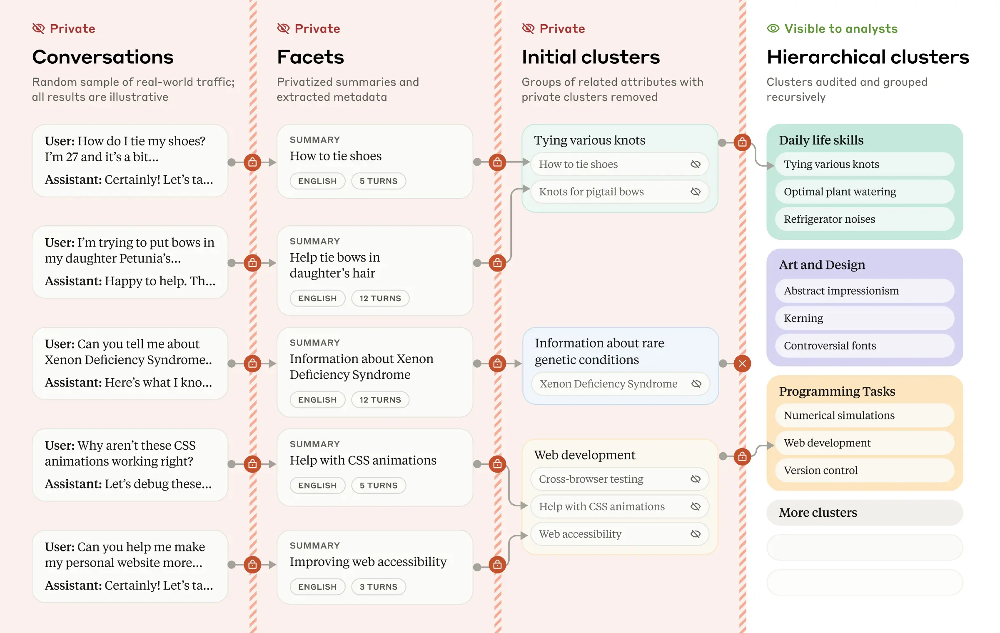
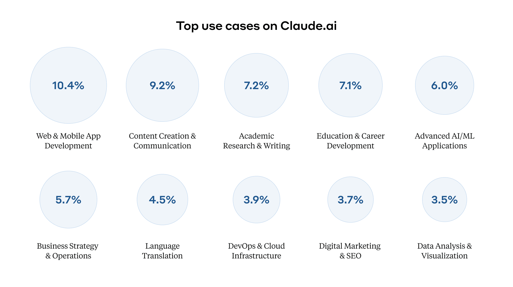
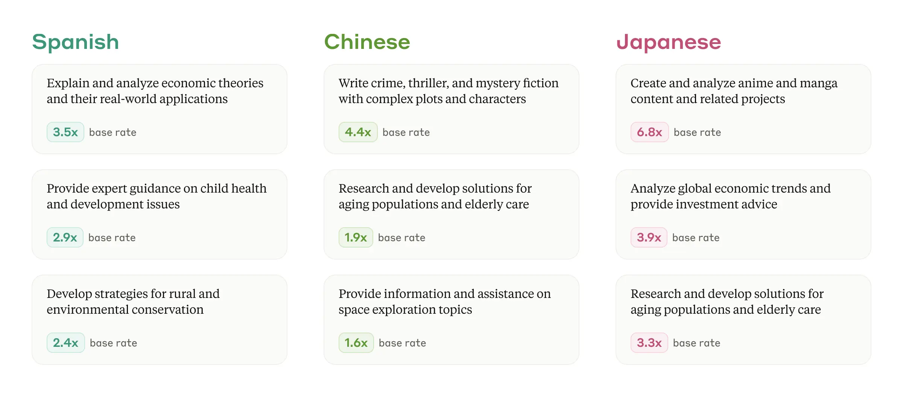
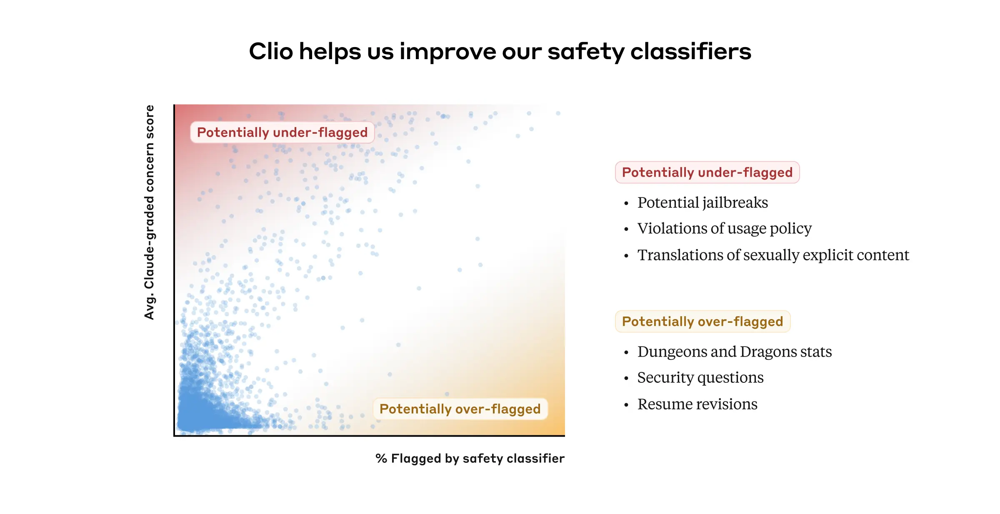

# Clio：洞察真实世界 AI 使用的隐私保护系统（中英对照）

> 原文标题：Clio: A system for privacy-preserving insights into real-world AI use
> 原文链接：https://www.anthropic.com/research/clio
> 原文作者：Anthropic
> 发布日期：2024-12-12
> **翻译模型：** GLM-5.3-Flash
> **评分：** ★★★★★（5/5，里程碑/必读）—— 百万级对话的隐私保护洞察系统：自动聚类出真实使用全景（创业诊断、代码调试、VBLObs），AEI 经济指数与 values-wild 的共同技术底座
> 排版：每段英文原文在前，中文翻译紧随其后。默认收录正文主体。

---

What do people use AI models for? Despite the rapidly-growing popularity of large language models, until now we’ve had little insight into exactly how they’re being used.

人们究竟在用 AI 模型做什么？尽管大语言模型迅速走红，但直到现在，我们对它们的确切使用方式仍知之甚少。

This isn’t just a matter of curiosity, or even of sociological research. Knowing how people actually use language models is important for safety reasons: providers put considerable effort into pre-deployment testing, and use Trust and Safety systems to prevent abuses. But the sheer scale and diversity of what language models can do makes understanding their uses—not to mention any kind of comprehensive safety monitoring—very difficult.

这不只是出于好奇，甚至也不只是一个社会学研究的问题。了解人们实际如何使用语言模型，对安全而言十分重要：模型提供方在部署前测试上投入了相当大的精力，并借助 Trust and Safety（信任与安全）系统来防止滥用。但语言模型能做的事情在规模和多样性上都太过庞大，使得理解其用途——更不用说任何形式的全面安全监控——变得非常困难。

There’s also a crucially important factor standing in the way of a clear understanding of AI model use: privacy. At Anthropic, we take the protection of our users’ data very seriously. How, then, can we research and observe how our systems are used while rigorously maintaining user privacy?

还有一个至关重要的因素阻碍着人们清晰地理解 AI 模型的使用：隐私（privacy）。在 Anthropic，我们非常重视用户数据的保护。那么，我们如何才能在严格保护用户隐私的同时，研究和观察我们系统的使用情况呢？

Claude insights and observations, or “Clio,” is our attempt to answer this question. Clio is an automated analysis tool that enables privacy-preserving analysis of real-world language model use. It gives us insights into the day-to-day uses of claude.ai in a way that’s analogous to tools like Google Trends. It’s also already helping us improve our safety measures. In this post—which accompanies a full research paper —we describe Clio and some of its initial results.

Claude insights and observations（Claude 洞察与观察），即「Clio」，就是我们为回答这个问题所做的尝试。Clio 是一个自动化分析工具，能够对真实世界的语言模型使用情况进行隐私保护（privacy-preserving）分析。它以类似 Google Trends 那类工具的方式，让我们得以洞察 claude.ai 的日常使用情况。它也已经在帮助我们改进安全措施。在这篇与一篇完整研究论文一同发布的文章中，我们介绍 Clio 及其部分初步成果。

### Clio 的工作原理：大规模的隐私保护分析（How Clio works: Privacy-preserving analysis at scale）

Traditional, top-down safety approaches (such as evaluations and red teaming) rely on knowing what to look for in advance. Clio takes a different approach, enabling bottom-up discovery of patterns by distilling conversations into abstracted, understandable topic clusters. It does so while preserving user privacy: data are automatically anonymized and aggregated, and only the higher-level clusters are visible to human analysts.

传统的自上而下安全方法（如评估和红队测试）依赖于事先知道要找什么。Clio 采取了不同的思路：通过把对话提炼成抽象、可理解的主题聚类（topic clusters），实现自下而上（bottom-up）的模式发现（clustering，聚类）。整个过程同时保护用户隐私：数据会被自动匿名化并聚合，人类分析师只能看到较高层级的聚类。

Here is a brief summary of Clio’s multi-stage process:
- Extracting facets : For each conversation, Clio extracts multiple "facets"—specific attributes or metadata such as the conversation topic, number of back-and-forth turns in the conversation, or the language used.
- Semantic clustering : Similar conversations are automatically grouped together by theme or general topic.
- Cluster description : Each cluster receives a descriptive title and summary that captures common themes from the raw data while excluding private information.
- Building hierarchies : Clusters are organized into a multi-level hierarchy for easier exploration. They can then be presented in an interactive interface that analysts at Anthropic can use to explore patterns across different dimensions (topic, language, etc.).

以下简要概括 Clio 的多阶段流程：
- 提取特征面（Extracting facets）：针对每段对话，Clio 提取多个「特征面（facets）」——即具体属性或元数据，如对话主题、对话中的往返轮数、所用语言等。
- 语义聚类（Semantic clustering）：相似的对话按主题或大致话题自动归为一组。
- 聚类描述（Cluster description）：为每个聚类生成描述性标题与摘要，既捕捉原始数据中的共同主题，又排除隐私信息。
- 构建层级（Building hierarchies）：将聚类组织成多层级结构，便于探索。之后可通过交互式界面呈现，供 Anthropic 的分析师跨不同维度（主题、语言等）探索其中的模式。

These four steps are powered entirely by Claude, not by human analysts. This is part of our privacy-first design of Clio, with multiple layers to create “defense in depth.” For example, Claude is instructed to extract relevant information from conversations while omitting private details. We also have a minimum threshold for the number of unique users or conversations, so that low-frequency topics (which might be specific to individuals) aren’t inadvertently exposed. As a final check, Claude verifies that cluster summaries don’t contain any overly specific or identifying information before they’re displayed to the human user.

这四个步骤完全由 Claude 驱动，而非人类分析师。这是 Clio 隐私优先设计的一部分，通过多个层级构成「纵深防御（defense in depth）」。例如，我们指示 Claude 在从对话中提取相关信息时略去隐私细节。我们还为独立用户数或对话数设置了最低阈值，这样低频话题（可能是特定个人独有的）就不会被无意中暴露。作为最后一道检查，在聚类摘要展示给人类用户之前，Claude 会验证其中不含任何过于具体或可识别身份的信息。

All our privacy protections have been extensively tested, as we describe in the research paper .

我们所有的隐私保护措施都经过了广泛测试，详见研究论文。

### 人们如何使用 Claude：来自 Clio 的洞察（How people use Claude: Insights from Clio）

Using Clio, we've been able to glean high-level insights into how people use claude.ai in practice. While public datasets like WildChat and LMSYS-Chat-1M provide useful information on how people use language models, they only capture specific contexts and use cases. Clio allows us to understand the full spectrum of real-world usage of claude.ai (which may look different than usage of other AI systems due to differences in user bases and model types).

借助 Clio，我们得以对人们在实践中如何使用 claude.ai 获得高层次的洞察。虽然 WildChat 和 LMSYS-Chat-1M 等公开数据集提供了关于人们如何使用语言模型的有用信息，但它们只捕捉了特定情境和用例。Clio 则让我们能够理解 claude.ai 真实使用情况的全貌（由于用户群体和模型类型的差异，这可能与其他 AI 系统的使用情况有所不同）。

#### Claude.ai 上的主要用例（Top use cases on Claude.ai）

We used Clio to analyze 1 million conversations with Claude on claude.ai (both the Free and Pro tiers) to identify the top tasks people use Claude for. This revealed a particular emphasis on coding-related tasks: the "Web and mobile application development" category represented over 10% of all conversations. Software developers use Claude for tasks ranging from debugging code to explaining Git operations and concepts.

我们用 Clio 分析了 claude.ai 上（免费版和 Pro 版）与 Claude 的 100 万段对话，以找出人们使用 Claude 的主要任务。结果显示出对编程相关任务的明显侧重：「Web 与移动应用开发」类别占全部对话的 10% 以上。软件开发者用 Claude 完成从调试代码到讲解 Git 操作与概念等各种任务。

Educational uses formed another significant category, with more than 7% of conversations focusing on teaching and learning. A substantial percentage of conversations (nearly 6%) concerned business strategy and operations (including tasks like drafting professional communications and analyzing business data).

教育类用途构成了另一个重要类别，超过 7% 的对话聚焦于教学与学习。还有相当比例的对话（近 6%）涉及商业战略与运营（包括起草专业沟通文案、分析业务数据等任务）。

Clio also identified thousands of smaller conversation clusters, showing the rich variety of uses for Claude. Some of these were perhaps surprising, including:
- Dream interpretation;
- Analysis of soccer matches;
- Disaster preparedness;
- “Hints” for crossword puzzles;
- Dungeons & Dragons gaming;
- Counting the r’s in the word “strawberry”.

Clio 还识别出数千个更小的对话聚类，显示出 Claude 用途的丰富多样。其中一些或许令人意外，包括：
- 解梦；
- 足球比赛分析；
- 灾备准备；
- 填字游戏的「提示」；
- 玩《龙与地下城》（Dungeons & Dragons）；
- 数「strawberry」一词里有几个 r。

#### 使用情况因语言而异（Claude usage varies by language）

Claude usage varies considerably across languages, reflecting varying cultural contexts and needs. We calculated a base rate of how often each language appeared in conversations overall, and from there we could identify topics where a given language appeared much more frequently than usual. Some examples for Spanish, Chinese, and Japanese are shown in the figure below.

Claude 的使用情况在不同语言之间差异显著，反映出不同的文化背景与需求。我们计算了每种语言在全部对话中出现频率的基准率（base rate），据此可以识别出某门语言出现频率远高于常态的话题。下图展示了西班牙语、中文和日语的一些例子。

### 我们如何用 Clio 改进安全系统（How we improve our safety systems with Clio）

In addition to training our language models to refuse harmful requests, we also use dedicated Trust and Safety enforcement systems to detect, block, and take action on activity that might violate our Usage Policy . Clio supplements this work to help us understand where there might be opportunities to improve and strengthen these systems.

除了训练我们的语言模型拒绝有害请求之外，我们还使用专门的 Trust and Safety 执行系统来检测、阻止可能违反我们《使用政策》（Usage Policy）的活动，并对其采取行动。Clio 为这项工作提供补充，帮助我们了解哪里有机会改进和加强这些系统。

We implement strict privacy access controls when it comes to who can use Clio to further enforce our policies because it may require review of individual accounts. Our Trust and Safety team is able to review topic clusters for areas that indicate likely violations of our Usage Policy. For example, a cluster titled “generate misleading content for campaign fundraising emails” or “incite hateful behavior” describes activity we prohibit. Our Trust and Safety teams can use this bottom-up review approach to identify individual accounts for further review and, if appropriate, take action in accordance with our terms and policies. We strictly limit this type of review to those with legitimate Trust and Safety needs. Our research paper includes more information on these processes.

在谁可以使用 Clio 来进一步执行我们的政策这件事上，我们实施了严格的隐私访问控制，因为它可能涉及对个人账户的审查。我们的 Trust and Safety 团队可以审查话题聚类，找出可能违反《使用政策》的领域。例如，名为「为竞选筹款邮件生成误导性内容」或「煽动仇恨行为」的聚类所描述的活动，都是我们明令禁止的。我们的 Trust and Safety 团队可以利用这种自下而上的审查方式识别出需进一步审查的个人账户，并在适当时依照我们的条款与政策采取行动。我们严格将此类审查限制在有正当 Trust and Safety 需求的人员范围内。我们的研究论文包含有关这些流程的更多信息。

We’re still in the process of rolling out Clio across all of our enforcement systems, but so far it has proven to be a useful part of our safety tool kit, helping us discover areas of our protective measures that we need to strengthen.

我们仍在把 Clio 推广到所有执行系统的过程中，但迄今为止它已被证明是我们安全工具箱中一个有用的组成部分，帮助我们发现了保护措施中需要加强的领域。

#### 识别并阻止协同滥用（Identifying and blocking coordinated misuse）

Clio has proven effective at identifying patterns of coordinated, sophisticated misuse that would otherwise be invisible when looking at individual conversations, and that might evade simpler detection methods. For example in late September, we identified a network of automated accounts using similar prompt structures to generate spam for search engine optimization. While no individual conversation violated our Usage Policy , the pattern of behavior across accounts revealed a form of coordinated platform abuse we explicitly prohibit in our policy and we removed the network of accounts. We’ve also used Clio to identify other activity prohibited by our Usage Policy , such as attempting to resell unauthorized access to Claude.

事实证明，Clio 能有效识别协同性、复杂性的滥用模式——这类模式在查看单段对话时不可见，也可能逃过更简单的检测方法。例如，9 月下旬我们发现了一个自动化账户网络，它们使用相似的提示结构生成用于搜索引擎优化（SEO）的垃圾内容。虽然没有任何一段单独的对话违反《使用政策》，但跨账户的行为模式暴露了一种我们在政策中明确禁止的协同平台滥用形式，我们移除了这一账户网络。我们还用 Clio 识别出《使用政策》禁止的其他活动，例如试图转售未经授权的 Claude 访问权限。

#### 高风险事件期间的加强监测（Enhanced monitoring for high-stakes events）

Clio also helps us monitor novel uses and risks during periods of uncertainty or high-stakes events. For example, while we conducted a wide range of safety tests in advance of launching a new computer use feature, we used Clio to screen for emergent capabilities and harms we might have missed[^1]. Clio provided an additional safeguard here, as well as insights that helped us continually improve our safety measures throughout the rollout and in future versions of our systems.

Clio 也帮助我们在不确定时期或高风险事件期间监测新出现的用途和风险。例如，在推出新的计算机使用（computer use）功能之前，我们进行了广泛的安全测试，同时用 Clio 来筛查我们可能遗漏的新兴能力与危害[^1]。Clio 在这里提供了额外的保障，其带来的洞察也帮助我们在整个发布过程中以及系统的未来版本中持续改进安全措施。

Clio has also helped us monitor for unknown risks in the run up to important public events like elections or major international events. In the months preceding the 2024 US General Election, we used Clio to identify clusters of activity relating to US politics, voting, and related issues, and guard against any potential risks or misuse. The ability to detect “unknown unknowns,” made possible through Clio, complements our proactive safety measures and helps us respond quickly to new challenges.

在选举或重大国际事件等重要公共事件来临之前，Clio 也帮助我们监测未知风险。在 2024 年美国大选前的几个月里，我们用 Clio 识别出与美国政治、投票及相关问题有关的活动聚类，防范潜在风险或滥用。借助 Clio 实现的「未知的未知」（unknown unknowns）检测能力，与我们的主动安全措施相辅相成，帮助我们快速应对新挑战。

#### 减少漏报与误报（Reducing false negatives and false positives）

In general, there was agreement between Clio and our pre-existing Trust and Safety classifiers on which conversation clusters were considered concerning. However, there was some disagreement for some clusters. One opportunity for improvement was false negatives (when a system didn’t flag a particular conversation as potentially harmful when in fact it was). For example, our systems sometimes failed to flag violating content when the user asked Claude to translate from one language to another. Clio, however, spotted these conversations.

总体而言，在哪些对话聚类值得担忧这个问题上，Clio 与我们既有的 Trust and Safety 分类器判断基本一致。但在某些聚类上存在分歧。一个改进机会是漏报（false negatives，即系统未能把实际有害的对话标记为潜在有害）。例如，当用户让 Claude 把内容从一种语言翻译成另一种语言时，我们的系统有时未能标记出违规内容，而 Clio 则发现了这些对话。

We also used Clio to investigate false positives—another common challenge when developing Trust and Safety classifiers, where the classifier inadvertently tags benign content as harmful. For example, conversations from job seekers requesting advice on their own resumes were sometimes incorrectly flagged by our classifiers (due to the presence of personal information). Programming questions related to security, networking, or web scraping were occasionally misidentified as potential hacking attempts. Even conversations about combat statistics in the aforementioned Dungeons & Dragons conversations sometimes triggered our harm detection systems. We used Clio to highlight these erroneous decisions, helping our safety systems to trigger only for content that really does violate our policies, and otherwise keep out of our users’ way.

我们还用 Clio 来调查误报（false positives）——这是开发 Trust and Safety 分类器时的另一个常见挑战，即分类器无意间把良性内容标记为有害。例如，求职者请求针对自己简历提供建议的对话，有时会被我们的分类器错误标记（因为含有个人信息）。与安全、网络或网页抓取相关的编程问题偶尔会被误判为潜在的黑客攻击企图。甚至前面提到的《龙与地下城》对话中关于战斗数值的讨论，有时也会触发我们的危害检测系统。我们用 Clio 来凸显这些错误判定，帮助安全系统只对真正违反政策的内容触发，除此之外不去打扰用户。

### 伦理考量与缓解措施（Ethical considerations and mitigations）

Clio provides valuable insights for improving the safety of deployed language models. However, it did also raise some important ethical considerations that we considered and addressed while developing the system:
- False positives: In the Trust and Safety context, we've implemented key safeguards with respect to potential false positives. For example, at this time we don't use Clio’s outputs for automated enforcement actions, and we extensively validate its performance across different data distributions—including testing across multiple languages, as we detail in our paper.
- Misuse of Clio: A system like Clio could be misused to engage in inappropriate monitoring. In addition to strict access controls and our privacy techniques, we mitigate this risk by implementing strict data minimization and retention policies: we only collect and retain the minimum amount of data necessary for Clio.
- User privacy: Despite Clio's strong performance in our privacy evaluations, it's possible, as with any real-world privacy system, that our systems might not catch certain kinds of private information. To mitigate this potential risk, we regularly conduct audits of our privacy protections and evaluations for Clio to ensure our safeguards are performing as expected. As time goes on, we also plan to use the latest Claude models in Clio so we can continuously improve the performance of these safeguards.
- User trust: Despite our extensive privacy protections, some users might perceive a system like Clio as invasive or as interfering with their use of Claude. We've chosen to be transparent about Clio's purpose, capabilities, limitations, and what insights we’ve learned from it. And as we noted above, there are instances where Clio identified false positives (where it appeared there was activity violating our usage policy where there wasn’t) in our standard safety classifiers, potentially allowing us to interfere less in legitimate uses of the model.

Clio 为改进已部署语言模型的安全性提供了宝贵洞察。不过，它也带来了一些重要的伦理考量，我们在开发该系统的过程中对其进行了考虑和处理：
- 误报（false positives）：在 Trust and Safety 场景中，我们针对潜在误报实施了关键保障措施。例如，目前我们不会将 Clio 的输出用于自动化执行行动，并且在不同的数据分布上广泛验证其性能——包括跨多种语言的测试，详见我们的论文。
- Clio 遭滥用：像 Clio 这样的系统可能被滥用于不当监控。除了严格的访问控制与我们的隐私技术之外，我们还通过实施严格的数据最小化（data minimization）与数据保留政策来缓解这一风险：我们只收集并保留 Clio 运行所必需的最少数据。
- 用户隐私：尽管 Clio 在我们的隐私评估中表现良好，但与任何现实世界中的隐私系统一样，我们的系统仍可能无法识别某些类型的隐私信息。为缓解这一潜在风险，我们会定期对 Clio 的隐私保护措施进行审计与评估，确保各项保障按预期运行。随着时间推移，我们还计划在 Clio 中采用最新的 Claude 模型，以持续提升这些保障措施的性能。
- 用户信任：尽管有广泛的隐私保护，一些用户可能仍会觉得类似 Clio 的系统具有侵入性，或者干扰了他们对 Claude 的使用。我们选择对 Clio 的目的、能力、局限性以及我们从中学到的洞察保持透明。而且正如上所述，Clio 曾在我们的标准安全分类器中发现过误报（即看似存在违反使用政策的活动、实则没有），这反而让我们有机会减少对模型合法使用的干预。

### 结论（Conclusions）

Clio is an important step toward empirically grounded AI safety and governance. By enabling privacy-preserving analysis of real-world AI usage, we can better understand how these systems are actually used. Ultimately, we can use Clio to make AI systems safer.

Clio 是迈向以实证为基础的 AI 安全与治理的重要一步。通过对真实世界的 AI 使用情况进行隐私保护分析，我们可以更好地理解这些系统实际上是如何被使用的。归根结底，我们可以利用 Clio 让 AI 系统更安全。

AI providers have a dual responsibility: to maintain the safety of their systems while protecting user privacy. Clio demonstrates that these goals aren't mutually exclusive—with careful design and implementation, we can achieve both. By openly discussing Clio, we aim to contribute to positive norms around the responsible development and use of such tools.

AI 提供方肩负双重责任：在保护用户隐私的同时维护系统安全。Clio 证明了这两个目标并不互斥——只要设计和实施得当，两者可以兼得。通过公开讨论 Clio，我们希望为这类工具的负责任开发与使用，助力形成积极的行业规范。

We're continuing to develop and improve Clio, and we hope that others will build upon this work. For additional technical details about Clio, including our privacy validations and evaluation methods, please see the full research paper .

我们仍在持续开发和改进 Clio，也希望他人在这一工作之上继续构建。有关 Clio 的更多技术细节，包括我们的隐私验证与评估方法，请参阅完整的研究论文。

We’re currently hiring for our Societal Impacts team. If you’re interested in working on Clio or related research questions, we'd love to receive your application. You can find more information about the role at this link .

我们目前正在为「社会影响」（Societal Impacts）团队招聘。如果你有兴趣从事 Clio 或相关研究问题的工作，我们很乐意收到你的申请。你可以在这一链接中找到该职位的更多信息。

Edit 14 January 2025: Links to the Clio paper in this post have been updated to point to the arXiv version.

2025 年 1 月 14 日编辑：本文中指向 Clio 论文的链接已更新为 arXiv 版本。

[^1]: For certain safety investigations, we also run Clio on a subset of first-party API traffic, keeping results restricted to authorized staff. Certain accounts are excluded from analysis, including trusted organizations with zero retention agreements. For more information about our policies, see Appendix F in the research paper. / 出于特定安全调查的需要，我们也会对一部分第一方 API 流量运行 Clio，并将结果限制在授权员工范围内。某些账户被排除在分析之外，包括签订了零保留（zero retention）协议的受信任组织。有关我们政策的更多信息，请参见研究论文中的附录 F。
