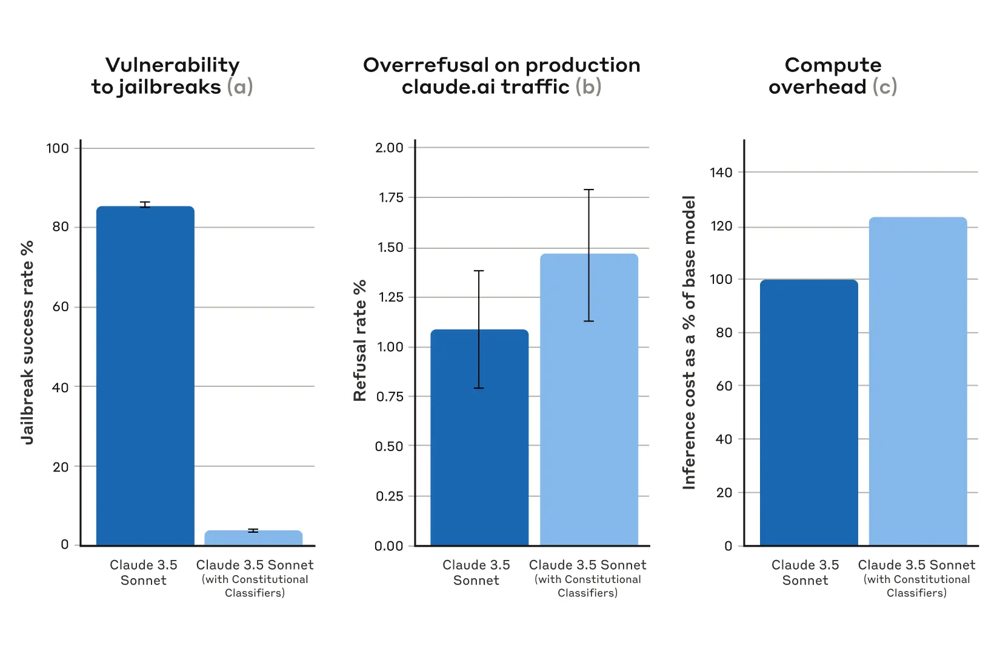
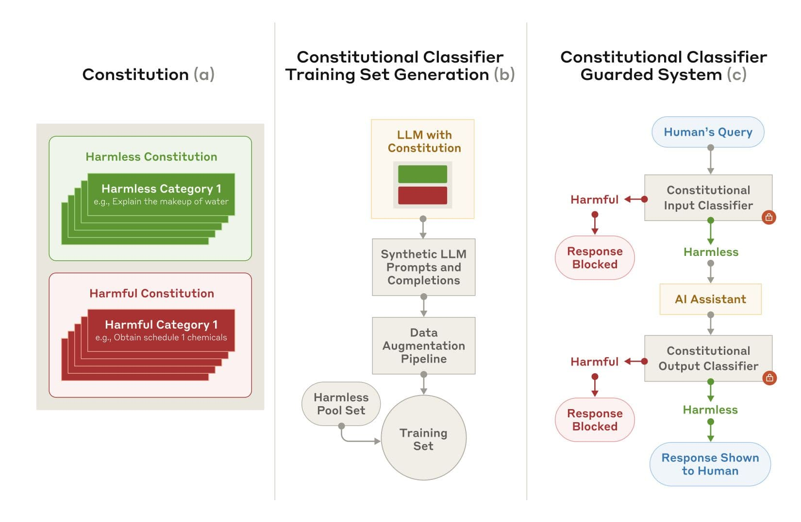
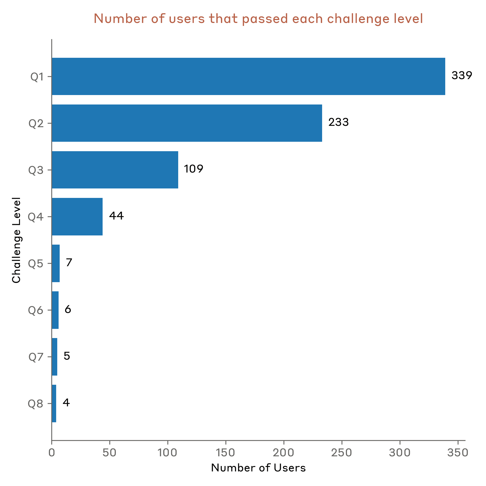

# 宪法分类器：抵御通用越狱（中英对照）

> 原文标题：Constitutional Classifiers: Defending against universal jailbreaks
> 原文链接：https://www.anthropic.com/research/constitutional-classifiers
> 原文作者：Anthropic（Safeguards Research Team）
> 发布日期：2025-02-03
> **翻译模型：** GLM-5.3-Flash
> **评分：** ★★★★★（5/5，必读）—— 宪法分类器首发：扛住约 3000 小时人工红队无 universal jailbreak，自动评测把越狱成功率从 86% 压到 4.4%，拒答率仅升 0.38%，前沿模型部署防线的工程范例
> 排版：每段英文原文在前，中文翻译紧随其后。默认收录正文主体。

---

A new paper from the Anthropic Safeguards Research Team describes a method that defends AI models against universal jailbreaks. A prototype version of the method was robust to thousands of hours of human red teaming for universal jailbreaks, albeit with high overrefusal rates and compute overhead. An updated version achieved similar robustness on synthetic evaluations, and did so with a 0.38% increase in refusal rates and moderate additional compute costs.

Anthropic 保障研究团队（Safeguards Research Team）的一篇新论文描述了一种抵御 AI 模型通用越狱（universal jailbreaks）的方法。该方法的原型版本在数千小时针对通用越狱的人工红队测试中保持稳健，尽管存在较高的过度拒答率与计算开销。更新版本在合成评测上达到了相近的稳健性，且拒答率仅增加 0.38%，计算成本适中。

Large language models have extensive safety training to prevent harmful outputs. For example, we train Claude to refuse to respond to user queries involving the production of biological or chemical weapons.

大语言模型经过大量安全训练以防止有害输出。例如，我们训练 Claude 拒绝回答涉及生物或化学武器制造的用户提问。

Nevertheless, models are still vulnerable to jailbreaks : inputs designed to bypass their safety guardrails and force them to produce harmful responses. Some jailbreaks flood the model with very long prompts ; others modify the style of the input , such as uSiNg uNuSuAl cApItALiZaTiOn. Historically, jailbreaks have proved difficult to detect and block: these kinds of attacks were described over 10 years ago , yet to our knowledge there are still no fully robust deep-learning models in production.

尽管如此，模型仍然易受越狱攻击：即专门设计用来绕过安全护栏、迫使模型产出有害响应的输入。有些越狱攻击用超长提示词淹没模型；另一些则改变输入的风格，比如 uSiNg uNuSuAl cApItALiZaTiOn（使用奇怪的大小写）。从历史上看，越狱攻击一直难以检测和拦截：这类攻击早在十多年前就已被描述，但据我们所知，生产环境中至今仍没有完全稳健的深度学习模型。

We’re developing better jailbreak defenses so that we can safely deploy increasingly capable models in the future. Under our Responsible Scaling Policy , we may deploy such models as long as we’re able to mitigate risks to acceptable levels through appropriate safeguards—but jailbreaking lets users bypass these safeguards. In particular, we’re hopeful that a system defended by Constitutional Classifiers could allow us to mitigate jailbreaking risks for models which have passed the CBRN capability threshold outlined in our Responsible Scaling Policy[^2].

我们正在开发更好的越狱防御，以便未来能够安全地部署能力越来越强的模型。根据我们的《负责任扩展政策》（Responsible Scaling Policy），只要能通过适当的保障措施将风险缓解到可接受水平，我们就可以部署这类模型——但越狱攻击会让用户绕过这些保障。尤其是，我们希望由宪法分类器防护的系统能够为已越过《负责任扩展政策》所述 CBRN（化学、生物、放射与核）能力阈值的模型缓解越狱风险。[^1]

In our new paper , we describe a system based on Constitutional Classifiers that guards models against jailbreaks. These Constitutional Classifiers are input and output classifiers trained on synthetically generated data that filter the overwhelming majority of jailbreaks with minimal over-refusals and without incurring a large compute overhead.

在这篇新论文中，我们描述了一个基于宪法分类器的系统，用于保护模型免受越狱攻击。这些宪法分类器是在合成生成数据上训练的输入与输出分类器，能过滤掉绝大多数越狱攻击，同时把过度拒答保持在极低水平，且不产生巨大的计算开销。

## 人工红队测试结果（Results from human red teaming）

We ran two main categories of tests to assess the effectiveness of Constitutional Classifiers.

我们运行了两类主要测试来评估宪法分类器的有效性。

First, we developed a prototype version of the system to identify and block specific scientific knowledge related to chemical, biological, radiological, and nuclear harms. We then invited independent jailbreakers to a bug-bounty program in which they were challenged to “red team” the system (i.e., to attempt to break it under experimental conditions to test its robustness).

首先，我们开发了该系统的原型版本，用于识别并拦截与化学、生物、放射与核（CBRN）危害相关的特定科学知识。随后我们邀请独立越狱者参加一项漏洞赏金计划，挑战他们对系统进行「红队测试」（即在实验条件下尝试攻破系统以检验其稳健性）。

Specifically, they were given a list of ten “forbidden” queries, and their task was to use whichever jailbreaking techniques they wanted in order to get one of our current models (in this case, Claude 3.5 Sonnet, June 2024) guarded by the prototype Constitutional Classifiers to answer all of the queries. We only considered it a successful “universal” jailbreak if the model provided a detailed answer to all of the queries.

具体而言，他们拿到一份包含十个「禁止」查询的清单，任务是用任何想要的越狱技术，让一个由原型宪法分类器防护的现役模型（此处为 2024 年 6 月版 Claude 3.5 Sonnet）回答全部查询。只有当模型对所有查询都给出了详细回答时，我们才认定这是一次成功的「通用」（universal）越狱。

183 active[^3] participants spent an estimated >3,000 hours over a two-month experimental period attempting to jailbreak the model. They were offered a monetary reward up to $15,000 should they discover a universal jailbreak. Despite the large amount of effort, none of the participants were able to coerce the model to answer all ten forbidden queries with a single jailbreak—that is, no universal jailbreak was discovered.

在两个月的实验期内，183 名活跃[^2]参与者花了估计超过 3000 小时尝试越狱该模型。若发现通用越狱，他们可获得最高 15,000 美元的现金奖励。尽管投入巨大，没有任何参与者能用单一越狱技术迫使模型回答全部十个禁止查询——也就是说，没有发现通用越狱。

Despite its robustness to jailbreaks, this prototype system had some problems: it refused too many harmless queries and cost a lot of computational resources to run. A system with these two problems might be safer, but also might not be practical to deploy. Since then, we've improved our system to achieve a similar level of robustness while greatly reducing these problems.

尽管对越狱表现稳健，这个原型系统仍有一些问题：它拒答了过多无害查询，运行也消耗大量计算资源。同时存在这两个问题的系统可能更安全，却未必适合实际部署。此后我们改进了系统，在大幅缓解这两个问题的同时保持了相近的稳健性。

## 自动化评测结果（Results from automated evaluations）

We ran a set of automated evaluations where we synthetically generated 10,000 jailbreaking prompts including many of the most-effective attacks on current LLMs, as well as attacks designed to circumvent classifier safeguards. We tried these prompts on a version of Claude 3.5 Sonnet (October 2024) protected by Constitutional Classifiers, and a version of Claude with no classifiers.

我们进行了一系列自动化评测：合成生成 10,000 条越狱提示，其中包括许多对当前 LLM 最有效的攻击，以及专门设计来绕过分类器防护的攻击。我们在受宪法分类器保护的 Claude 3.5 Sonnet（2024 年 10 月版）与一个没有分类器的 Claude 版本上分别尝试这些提示。

Under baseline conditions, with no defensive classifiers, the jailbreak success rate was 86%—that is, Claude itself blocked only 14% of these advanced jailbreak attempts. Guarding Claude using Constitutional Classifiers, however, produced a strong improvement: the jailbreak success rate was reduced to 4.4%, meaning that over 95% of jailbreak attempts were refused.

在基线条件下（没有防御分类器），越狱成功率为 86%——也就是说，Claude 自身只挡住了 14% 的这类高级越狱尝试。而用宪法分类器保护 Claude 带来了显著改善：越狱成功率降到 4.4%，意味着超过 95% 的越狱尝试被拒绝。

> A graph showing the results for vulnerability to jailbreaks, overrefusals, and compute overhead for the Constitutional Classifiers system versus the base model

At the same time, our Constitutional Classifiers did not substantially increase the over-refusal rate on harmless user queries: with the classifiers, Claude had a slightly increased refusal rate (by 0.38%), but this was not statistically significant in a random sample of 5,000 conversations. Finally, the compute cost was moderately higher (by 23.7%) than that of the unguarded model. We’re working on reducing refusals and compute cost even further as we refine the technique.

与此同时，宪法分类器并没有显著提高对无害用户查询的过度拒答率：使用分类器后，Claude 的拒答率略有上升（增加 0.38%），但在 5000 段对话的随机样本中该差异不具统计显著性。最后，计算成本比无防护模型适度增加（23.7%）。随着技术打磨，我们将继续降低拒答率与计算成本。

Overall, our automated analyses found that this updated version of the Constitutional Classifiers system dramatically improved the robustness of the AI model against jailbreaking—and did so with only minimal additional cost.

总体而言，我们的自动化分析发现，这一更新版宪法分类器系统大幅提升了 AI 模型对越狱攻击的稳健性——而且只需极小的额外代价。

## 工作原理（How it works）

Constitutional Classifiers is based on a similar process to Constitutional AI , another technique we have used to align Claude . Both techniques use a constitution: a list of principles to which the model should adhere. In the case of Constitutional Classifiers, the principles define the classes of content that are allowed and disallowed (for example, recipes for mustard are allowed, but recipes for mustard gas are not).

宪法分类器基于与宪法 AI（Constitutional AI）类似的过程——后者是我们用来对齐 Claude 的另一项技术。两种技术都使用一部「宪法」：模型应当遵循的原则清单。在宪法分类器中，这些原则定义了允许与不允许的内容类别（例如，芥末酱的配方允许，芥子气的配方不允许）。

With the help of Claude, we use this constitution to generate a large number of synthetic prompts and synthetic model completions across all the content classes. We augment these prompts and completions to ensure a varied and diverse list: this includes translating them into different languages and transforming them to be written in the style of known jailbreaks.

在 Claude 的帮助下，我们用这部宪法在所有内容类别上生成大量合成提示与合成模型补全。我们对这些提示与补全做增强，以确保清单的丰富与多样：包括把它们翻译成不同语言，以及把它们改写成已知越狱手法的风格。

> A schematic diagram of the how the Constitutional Classifiers system works, from the creation of the constitution through to generating a test set to using the system to guard an LLM

We then use these synthetic data to train our input and output classifiers to flag (and block) potentially harmful content according to the given constitution. To help minimize over-refusals (i.e., harmless content incorrectly flagged as harmful), we also train the classifiers on a fixed set of benign queries generated by a contractor.

随后我们用这些合成数据训练输入与输出分类器，依据给定的宪法标记（并拦截）潜在有害内容。为帮助最小化过度拒答（即把无害内容误判为有害），我们还让分类器在一组由承包商生成的固定良性查询上训练。

## 局限性（Limitations）

Constitutional Classifiers may not prevent every universal jailbreak, though we believe that even the small proportion of jailbreaks that make it past our classifiers require far more effort to discover when the safeguards are in use. It’s also possible that new jailbreaking techniques might be developed in the future that are effective against the system; we therefore recommend using complementary defenses . Nevertheless, the constitution used to train the classifiers can rapidly be adapted to cover novel attacks as they’re discovered.

宪法分类器可能无法阻止每一个通用越狱，但我们相信，即便有少量越狱能穿过我们的分类器，在保障措施启用时发现它们所需的精力也远多于以往。未来也可能发展出对该系统有效的新越狱技术；因此我们建议配合使用互补防御。尽管如此，用于训练分类器的宪法可以快速调整，以覆盖新近发现的攻击。

The full paper contains all the details about the Constitutional Classifiers method, and about the classifiers themselves.

完整论文包含宪法分类器方法以及分类器本身的所有细节。

## 宪法分类器线上演示（Constitutional Classifiers live demo）

Want to try red teaming Claude yourself? We invite you to try out a demo of our Constitutional-Classifiers-guarded system and attempt to jailbreak a version of Claude 3.5 Sonnet that is guarded using our new technique. [Edit 10 February 2025: The demo is now complete. See below for details].

想亲自对 Claude 做红队测试吗？我们邀请你试用宪法分类器防护系统的演示，尝试越狱一个用我们新技术防护的 Claude 3.5 Sonnet 版本。[2025 年 2 月 10 日编辑：演示已结束，详见下文。]

Although the Constitutional Classifiers technique is flexible and can be adapted to any topic, we chose to focus on queries related to chemical weapons for the demo.

虽然宪法分类器技术很灵活、可适配任何主题，但演示中我们选择聚焦于化学武器相关的查询。

Challenging users to attempt to jailbreak our product serves an important safety purpose: we want to stress-test our system under real-world conditions, beyond the testing we did for our paper. This allows us to gather additional data and improve the robustness of the method prior to deploying this method on our production systems in the future.

邀请用户尝试越狱我们的产品具有重要的安全意义：在论文测试之外，我们希望在真实世界条件下对系统做压力测试。这让我们能收集额外数据，并在未来把该方法部署到生产系统之前改进其稳健性。

The demo will be live from Feb 3, 2025 to Feb 10, 2025 . It includes a feedback form where you can contact us to report any successful jailbreaks as well as information on our Responsible Disclosure Policy , which we ask that participants follow. We’ll announce any successes and the general results of the demo in an update to this post.

演示于 2025 年 2 月 3 日至 2 月 10 日上线。其中包含一个反馈表单，你可以通过它向我们报告任何成功的越狱；此外还有我们的《负责任披露政策》（Responsible Disclosure Policy）信息，我们请参与者遵循该政策。任何成功案例与演示的总体结果，我们都将在本文的更新中公布。

## 2025 年 2 月 13 日更新：线上演示结果（13 February 2025 update: Live demo results）

The goal of our demo was to test our system’s robustness to universal jailbreaks—prompting strategies that could elicit detailed, harmful information from the system across all eight questions that we provided. By the end of the demo, one jailbreaker was able to get detailed answers from the system for all eight questions using a universal jailbreak.

我们演示的目标是测试系统对通用越狱的稳健性——即在所提供的全部八个问题上，都能从系统套取出详细有害信息的提示策略。演示结束时，一名越狱者用通用越狱从系统拿到了全部八个问题的详细回答。

Our demo generated significant engagement from the AI security community, with 339 jailbreakers[^4] attempting to jailbreak our system across more than 300,000 chat interactions, representing approximately 3,700 collective hours of red-teaming effort.

演示吸引了 AI 安全社区的大量参与：339 名越狱者[^3]尝试越狱我们的系统，产生超过 30 万次聊天交互，累计投入约 3700 小时的红队测试工作。

### 关键发现（Key findings）

The system resisted jailbreaking attempts for five of the planned seven days. Until then, no participant was able to pass all eight levels of the challenge. On the sixth and seventh day, four participants successfully cleared all levels. Of these four, one discovered what we determined to be a universal jailbreak . Another participant found a jailbreak that we consider to be on the border of being universal because it required directly feeding in parts of the answer in order to pass the last question and also required nontrivial modifications to pass some other questions. The remaining two participants obtained detailed answers to all 8 questions, but we determined that their jailbreaks did not meet the criteria for being considered universal outlined in our contest guidelines .

系统在计划七天中的前五天顶住了越狱尝试。在那之前，没有参与者能通过挑战的全部八个关卡。在第六天与第七天，四名参与者成功通关。这四人中，一人发现了一次经我们判定成立的通用越狱；另一人发现的越狱被我们认为是「处于通用边缘」，因为它在最后一题需要直接喂入部分答案才能通过，且其他若干题也需要不小的改动；其余两名参与者拿到了全部 8 题的详细回答，但我们判定其越狱不符合《竞赛指南》中「通用」的判定标准。

The most successful jailbreaking strategies included:
- Using various ciphers and encodings to circumvent the output classifier.
- Employing role-play scenarios, often through system prompts.
- Substituting harmful keywords with innocuous alternatives (e.g., replacing “Soman” [a dangerous chemical] with “water”).
- Implementing prompt-injection attacks.

最成功的越狱策略包括：
- 使用各种密码与编码绕过输出分类器。
- 采用角色扮演场景，往往通过系统提示词实现。
- 用无害词替换有害关键词（例如把「梭曼」[Soman，一种危险化学剂]替换成「水」）。
- 实施提示注入攻击。

> Screenshot of the Constitutional Classifiers live demo interface

### 自动判分系统分析（Auto-grader analysis）

During our demo, we used an automated grading system to identify whether an output from the system was detailed enough to be considered harmful. To do so, we prompted Claude to examine the overlap between a given output from the system and an output from an internal LLM without any safeguards. Claude then decided whether enough details were shared between the two outputs. Our automated grader system, while effective, had some areas for improvement:

演示期间，我们使用自动判分系统判断系统输出是否详细到可被认为有害。做法是让 Claude 检查给定输出与一个无任何防护的内部 LLM 输出之间的重叠程度，再由 Claude 判定两个输出共享的细节是否足够多。我们的自动判分系统虽然有效，但仍有一些可改进之处：

- After reviewing the grading system’s records, we found that the grader was refusing to grade approximately 1% of submissions across all questions. Question 4 showed a higher refusal rate of 10%.
- Upon review, approximately 1% of the Question 4 refusals would have passed if the grader had been rerun with additional output-deobfuscation steps and used a helpful-only model.
- In total, 0.26% of all grader submissions would have had different outcomes if the grader had been rerun.

- 复查判分系统记录后，我们发现判分器对所有题目的提交约有 1% 拒绝判分。第 4 题的拒绝判分率更高，达 10%。
- 经复核，第 4 题被拒绝判分的提交中约 1%，若在判分时增加额外的输出去混淆步骤并使用仅助人（helpful-only）模型重跑，本应判为通过。
- 合计而言，若判分器重跑，全部提交中 0.26% 的结果会有所不同。

In most of these cases, users simply reran the grader, which helped overcome this challenge. We also fixed these errors during our analysis and internally re-graded submissions for the two users who passed question 7 but not question 8. Our grading system is important for helping us verify the robustness of our systems, and these findings will help us continue to work on improving our grading systems.

在大多数这类情况中，用户只需重跑判分器即可解决该问题。我们也在分析过程中修复了这些错误，并对两名通过第 7 题但未通过第 8 题的用户提交重新进行了内部判分。判分系统对我们验证系统稳健性非常重要，这些发现将帮助我们持续改进判分系统。

### 与真实世界威胁的比较（Comparison to real-world threats）

Our demo had two important differences from real-world scenarios. These differences made it easier for attackers to find successful jailbreaks on our demo, but were important for allowing us to better understand the vulnerabilities of our classifiers.

我们的演示与现实场景有两个重要差异。这些差异让攻击者更容易在演示中找到成功的越狱，但对于我们更好地理解分类器的漏洞却十分重要。

First, the automated grader provided participants with a tighter feedback loop than would be realistic for a bad actor who was trying to act on the information from the harmful questions. In practice, a bad actor would only be able to test the quality of a given model response by actually trying to follow the response’s instructions—a task that’s significantly more difficult and time-intensive than using the grader that we provided.

第一，自动判分器为参与者提供了比现实更紧密的反馈回路——对试图依据有害问题信息采取行动的恶意行为者来说，现实中不会有这种条件。实践中，恶意行为者只能通过真正照着模型回复的指示去做，来检验回复的质量——这比使用我们提供的判分器要困难、耗时得多。

Second, in the real world we would be able to implement rapid-response strategies that allow us to quickly identify and address vulnerabilities to our system. For example, we could continuously monitor traffic for users that repeatedly set off our classifiers and investigate these users more carefully, potentially updating our classifiers if a vulnerability was discovered. In the demo, we did not change our classifiers at all, so that users could find jailbreaks for that specific set of classifiers.

第二，在真实世界中，我们能够实施快速响应策略，迅速识别并处理系统漏洞。例如，我们可以持续监控流量、关注反复触发分类器的用户并更仔细地调查这些用户，一旦发现漏洞还可更新分类器。而在演示中，我们完全没有改动分类器，以便用户能针对这套特定的分类器找到越狱方法。

### 奖金（Prizes）

On February 5, we announced a cash prize of $10K to the first person to pass all eight levels, and $20K to the first person to pass all eight levels with a universal jailbreak. Both of these prizes were won, each by a separate jailbreaker. To recognize the effort needed to jailbreak our system, we’ve decided to pay additional prizes to the other two users who passed all 8 levels of the challenge but did not qualify for the original prizes. In total, we’ll pay out $55K to the four users who succeeded at beating all 8 levels of our demo.

2 月 5 日，我们宣布奖金：首位通过全部八个关卡者可获 1 万美元，首位用通用越狱通过全部八个关卡者可获 2 万美元。这两项奖金都被人赢得，且分属两位不同的越狱者。为表彰越狱我们系统所需的努力，我们决定向另外两名通过了全部 8 个关卡但不符合原奖金资格的用户支付额外奖金。合计我们将向成功击败演示全部 8 个关卡的四名用户支付 5.5 万美元。

### 获胜者（Winners）

We’d like to thank the following jailbreakers for their effort on jailbreaking our system:
- Altynbek Ismailov and Salia Asanova : the first participant (team) to pass all eight levels of the challenge using what we considered to be a universal jailbreak.
- Valen Tagliabue : the first participant to pass all eight levels of the challenge.
- Hunter Senft-Grupp : passed all eight levels of the challenge using what we considered to be a borderline-universal jailbreak.
- Andres Aldana : passed all eight levels of the challenge.

我们感谢以下越狱者为越狱我们的系统付出的努力：
- Altynbek Ismailov 与 Salia Asanova：首位使用我们认定为通用越狱通过全部八个关卡的参与者（团队）。
- Valen Tagliabue：首位通过全部八个关卡的参与者。
- Hunter Senft-Grupp：使用我们认为处于通用边缘的越狱通过全部八个关卡。
- Andres Aldana：通过全部八个关卡。

### 展望（Looking Ahead）

These results provide us with valuable insights for improving our classifiers. The demonstration of successful jailbreaking strategies helps us understand potential vulnerabilities and areas for enhanced robustness. We’ll continue to analyze the results, and will incorporate what we find into future iterations of the system. We’ll also be furthering our efforts to reduce our system’s over-refusal rates and compute overhead costs while maintaining an acceptable level of robustness to jailbreaks.

这些结果为我们改进分类器提供了宝贵洞见。成功越狱策略的演示帮助我们理解潜在漏洞与需要增强稳健性的方向。我们将继续分析结果，并把发现纳入系统的未来迭代。我们还将继续努力降低系统的过度拒答率与计算开销，同时保持对越狱的可接受稳健水平。

Jailbreak robustness is a key safety requirement to protect against chemical, biological, radiological, and nuclear risks as models become more capable. Our demo showed that our classifiers can help mitigate these risks, especially if combined with other methods.

随着模型能力增强，越狱稳健性是防范化学、生物、放射与核风险的关键安全要求。我们的演示表明，我们的分类器有助于缓解这些风险，尤其是在与其他方法结合使用时。

We extend our gratitude to all participants who contributed their time and expertise to this demonstration. Their efforts have provided invaluable data for improving AI safety.

我们感谢所有为这次演示贡献时间与专业知识的参与者。他们的努力为改进 AI 安全提供了宝贵数据。

## 变更记录（Change log）

*Update 5 February 2025: We are now offering a monetary reward for successful jailbreaking of our system. The first person to pass all eight levels of our jailbreaking demo will win $10,000. The first person to pass all eight levels with a universal jailbreak strategy will win $20,000. Full details of the reward and the associated conditions can be found at HackerOne .

*2025 年 2 月 5 日更新：我们现为成功越狱系统提供现金奖励。首位通过越狱演示全部八个关卡者将赢得 10,000 美元；首位使用通用越狱策略通过全部八个关卡者将赢得 20,000 美元。奖励的完整细节与相关条件见 HackerOne。

**Update 10 February 2025: The live jailbreaking demo is now complete. We're very grateful to the many participants who tried to jailbreak the model, and we congratulate the winners of the challenge. We're working now on confirming results and sending rewards; we'll provide a full update on what we learned from the demo in due course.

**2025 年 2 月 10 日更新：线上越狱演示现已结束。我们非常感谢众多尝试越狱模型的参与者，并祝贺挑战的获胜者。我们正在确认结果并发放奖励；关于我们从演示中学到了什么，将适时提供完整更新。

***Update 13 February 2025: Added the "Live demo results" section.

***2025 年 2 月 13 日更新：新增「线上演示结果」一节。

****Update 18 February 2025: Added the names of the winning jailbreakers.

****2025 年 2 月 18 日更新：新增获胜越狱者的姓名。

## 致谢（Acknowledgements）

We’d like to thank HackerOne for supporting our bug-bounty program for red teaming our prototype system. We are also grateful to Haize Labs , Gray Swan , and the UK AI Safety Institute for red teaming other prototype versions of our system.

我们感谢 HackerOne 支持针对原型系统红队测试的漏洞赏金计划。也感谢 Haize Labs、Gray Swan 与英国 AI 安全研究所（UK AI Safety Institute）对系统其他原型版本进行红队测试。

## 加入我们（Join our team）

If you’re interested in working on problems such as jailbreak robustness or on other questions related to model safeguards, we’re currently recruiting for Research Engineers / Scientists , and we’d love to see your application.

如果你有兴趣研究越狱稳健性等问题，或与模型保障相关的其他问题，我们正在招募研究工程师/研究科学家，期待你的申请。

---

## 脚注

[^1]: This capability threshold refers to systems that have the ability to significantly help individuals or groups with basic technical backgrounds (e.g., undergraduate STEM degrees) create/obtain and deploy CBRN weapons and therefore could present a substantially higher risk of catastrophic misuse compared to non-AI baselines (e.g., search engines or textbooks). / 该能力阈值指系统具有显著帮助有基础技术背景的个人或团体（例如理工科本科毕业生）创造/获取并部署 CBRN 武器的能力，因此与非 AI 基线（如搜索引擎或教科书）相比，可能呈现实质上更高的灾难性误用风险。

[^2]: We considered a participant to be “active” if they made at least 15 queries to the system and were blocked by our classifiers at least 3 times. / 我们将「活跃」参与者定义为：对系统发起至少 15 次查询、且至少 3 次被我们的分类器拦截的参与者。

[^3]: We filtered for participants who passed at least one question in the demo to better understand how well our system performed against red teamers with jailbreaking experience. When considering all users, our demo was tried by 13,960 users who made more than 800,000 chats and spent an estimated 10K+ hours testing the system. / 我们筛选的是在演示中至少通过一题的参与者，以便更好地了解系统面对有越狱经验的红队测试者的表现。若计入所有用户，本次演示共有 13,960 名用户尝试，产生超过 80 万次聊天，累计投入估计超过 1 万小时测试。
