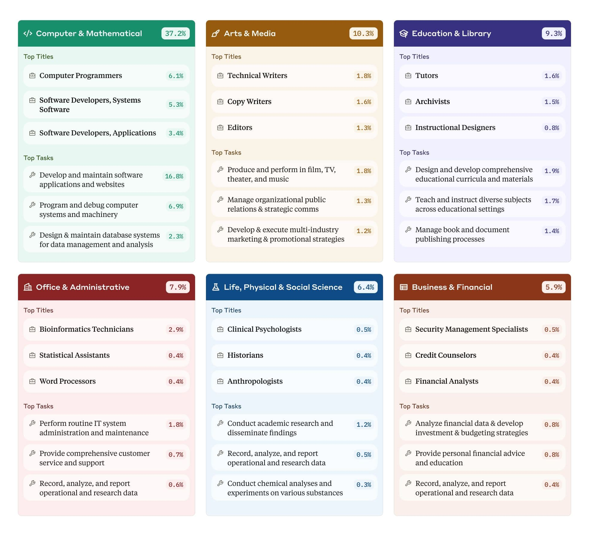
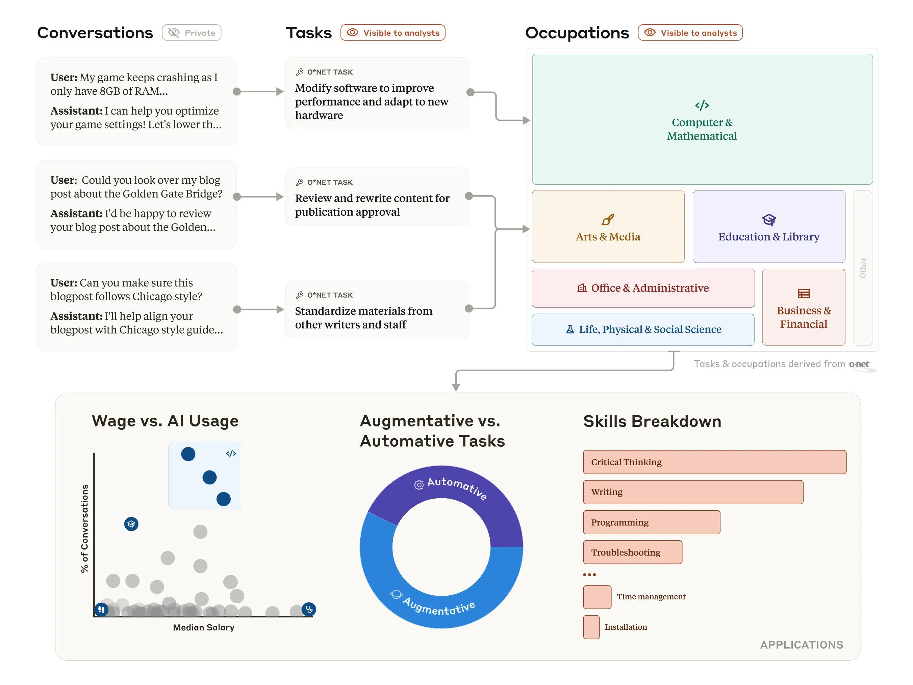
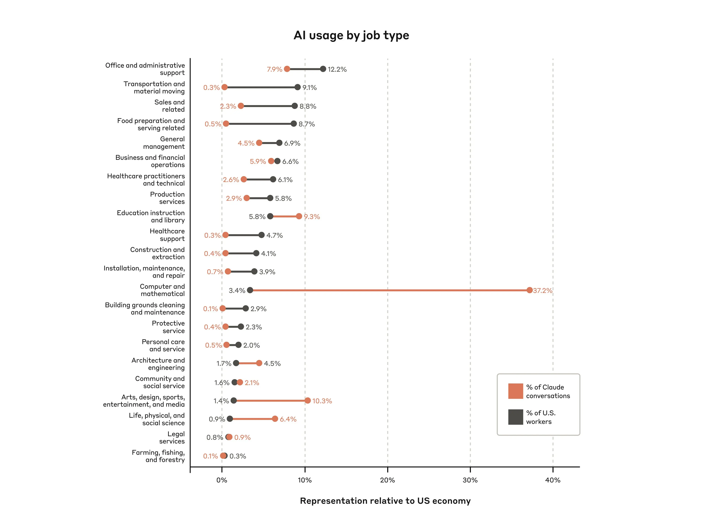
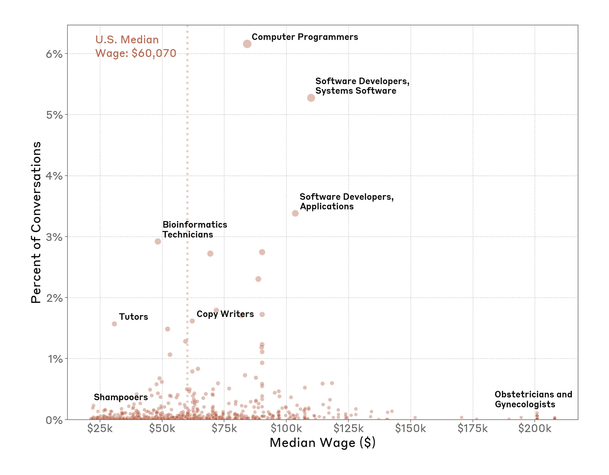
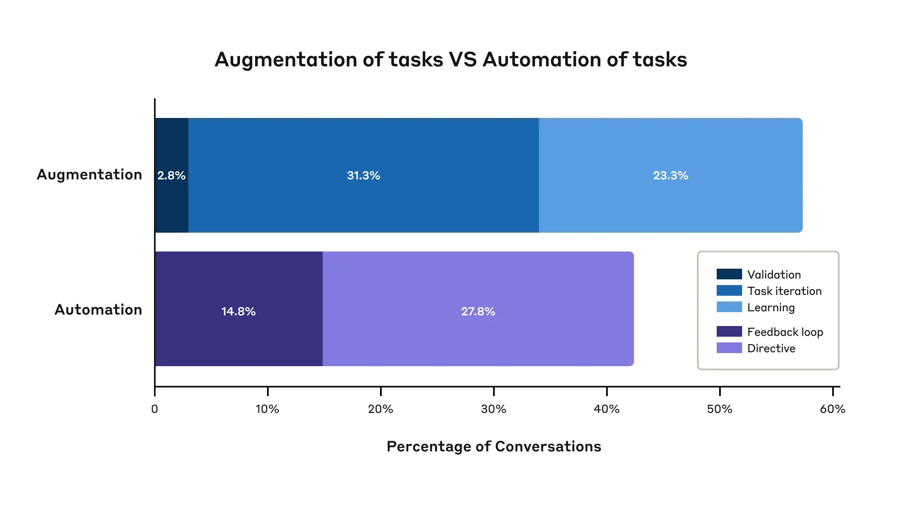

# Anthropic 经济指数（中英对照）

> 原文标题：Introducing the Anthropic Economic Index
> 原文链接：https://www.anthropic.com/research/the-anthropic-economic-index
> 原文作者：Anthropic（基于 Clio 与约 100 万条 Claude 真实对话；完整论文见 arXiv:2503.04761）
> 发布日期：2025-02-10
> **翻译模型：** GLM-5.3-Flash
> **评分：** ★★★★★（5/5，必读）—— AEI 发起文：百万级匿名对话首次给出 AI 真实使用画像（36% 职业已有 ≥1/4 任务用到 AI、增强 57% vs 自动化 43%、中高薪任务采用最高），并开源数据集，是经济研究系列的源头
> 排版：每段英文原文在前，中文翻译紧随其后。默认收录正文主体。

---

In the coming years, AI systems will have a major impact on the ways people work. For that reason, we're launching the Anthropic Economic Index , an initiative aimed at understanding AI's effects on labor markets and the economy over time.

未来几年，AI 系统将深刻改变人们的工作方式。因此，我们发起「Anthropic 经济指数」（Anthropic Economic Index）——一项旨在长期理解 AI 对劳动力市场与经济影响的活动。

The Index’s initial report provides first-of-its-kind data and analysis based on millions of anonymized conversations on Claude.ai , revealing the clearest picture yet of how AI is being incorporated into real-world tasks across the modern economy.

指数的首份报告基于 Claude.ai 上数百万条匿名对话，提供了开创性的数据与分析，首次清晰呈现 AI 正如何融入现代经济中的真实任务。

We're also open sourcing the dataset used for this analysis, so researchers can build on and extend our findings. Developing policy responses to address the coming transformation in the labor market and its effects on employment and productivity will take a range of perspectives. To that end, we are also inviting economists, policy experts, and other researchers to provide input on the Index.

我们还将开源用于此次分析的数据集，让研究者可以在我们的发现之上继续构建与拓展。要针对即将到来的劳动力市场变革及其对就业与生产率的影响制定政策应对，需要多元视角。为此，我们也邀请经济学家、政策专家与其他研究者为指数提供意见。

The main findings from the Economic Index’s first paper are:
- Today, usage is concentrated in software development and technical writing tasks. Over one-third of occupations (roughly 36%) see AI use in at least a quarter of their associated tasks, while approximately 4% of occupations use it across three-quarters of their associated tasks.
- AI use leans more toward augmentation (57%), where AI collaborates with and enhances human capabilities, compared to automation (43%), where AI directly performs tasks.
- AI use is more prevalent for tasks associated with mid-to-high wage occupations like computer programmers and data scientists, but is lower for both the lowest- and highest-paid roles. This likely reflects both the limits of current AI capabilities, as well as practical barriers to using the technology.

经济指数首篇论文的主要发现是：
- 当前使用集中于软件开发与技术写作任务。超过三分之一的职业（约 36%）在其至少四分之一的相关任务中用到 AI，而约 4% 的职业在四分之三的相关任务中使用 AI。
- AI 使用更偏向增强（augmentation，57%）——即 AI 与人类协作、增强人类能力；相比之下自动化（automation，43%）——即 AI 直接完成任务——占比更低。
- 与中等至高薪职业（如计算机程序员、数据科学家）相关的任务中 AI 使用更普遍，而在最低薪与最高薪的职业中使用率都较低。这可能既反映了当前 AI 能力的局限，也反映了使用该技术的现实障碍。

See below for further details on our initial findings.

下文提供初期发现的更多细节。

> Infographic showing six professional categories based on Claude.ai usage data: Computer & Mathematical (37.2%), Arts & Media (10.3%), Education & Library (9.3%), Office & Administrative (7.9%), Life Sciences (6.4%), and Business & Financial (5.9%). Each category displays its top job titles and most common tasks with their respective usage percentages.

## 绘制 AI 在劳动力市场中的使用地图（Mapping AI usage across the labor market）

Our new paper builds on a long line of research on the labor market impact of technologies, from the Spinning Jenny of the Industrial Revolution to the car-manufacturing robots of the present day. We focus on the ongoing impact of AI. We don’t survey people on their AI use, or attempt to forecast the future; instead, we have direct data on how AI is actually being used.

我们的新论文承续关于技术对劳动力市场影响的悠久研究脉络——从工业革命的珍妮纺纱机到今天的汽车制造机器人。我们聚焦 AI 正在发生的影响。我们不调查人们的 AI 使用情况，也不试图预测未来；相反，我们拥有 AI 实际如何被使用的直接数据。

### 分析职业任务（Analyzing occupational tasks）

Our research began with an important insight from the economics literature : sometimes it makes sense to focus on occupational tasks rather than occupations themselves . Jobs often share certain tasks and skills in common: for example, visual pattern recognition is a task performed by designers, photographers, security screeners, and radiologists.

我们的研究始于经济学文献中的一个重要洞见：有时聚焦于职业任务（occupational tasks）而非职业本身更有意义。不同工作往往共享某些任务与技能：例如，视觉模式识别是设计师、摄影师、安检员和放射科医生都会执行的任务。

Certain tasks lend themselves better to being automated or augmented by a new technology than others. We’d therefore expect AI to be adopted selectively for different tasks across different occupations, and that analyzing tasks—in addition to jobs as a whole—would give us a fuller picture of how AI is being integrated into the economy.

某些任务比其他任务更容易被新技术自动化或增强。因此我们可以预期，AI 会被有选择地用于不同职业中的不同任务；而除了把职业作为整体来分析之外，对任务本身的分析能让我们更完整地看清 AI 正如何融入经济。

### 用 Clio 把 AI 使用匹配到任务（Using Clio to match AI use to tasks）

This research was made possible by Claude insights and observations, or " Clio ", an automated analysis tool that allows us to analyze conversations with Claude while preserving user privacy[^1]. We used Clio on a dataset of approximately one million conversations with Claude (specifically, Free and Pro conversations on Claude.ai ), and used it to organize the conversations by occupational task.

这项研究得益于「Claude 洞察与观察」（Claude insights and observations，简称 Clio）——一个能在保护用户隐私的同时分析 Claude 对话的自动化分析工具。[^1] 我们把 Clio 用在一个包含约一百万条 Claude 对话的数据集上（具体是 Claude.ai 上的免费版与 Pro 版对话），用它按职业任务对对话进行归类。

We chose tasks according to the classification made by the U.S. Department of Labor, which maintains a database of around 20,000 specific work-related tasks called the Occupational Information Network, or O*NET . Clio matched each conversation with the O*NET task that best represented the role of the AI in the conversation (the process is summarized in the figure below). We then followed the O*NET scheme for grouping the tasks into the occupations they best represented, and the occupations into a small set of overall categories: education and library, business and financial, and so on.

我们采用美国劳工部的任务分类。该部维护着一个名为职业信息网络（Occupational Information Network，O*NET）的数据库，收录约两万条具体工作任务。Clio 将每条对话与最能代表 AI 在该对话中角色的 O*NET 任务相匹配（流程见下图概述）。随后我们按照 O*NET 的体系，把任务归入它们最能代表的职业，再把职业归入少数几个大类：教育与图书馆、商业与金融，等等。

> A diagram showing how user conversations with Claude are mapped to tasks and occupations. The top section shows sample conversations flowing through task categorization to six occupational categories. The bottom section displays three analytical views: a scatter plot of wage vs. AI usage, a donut chart comparing augmentative vs. automative tasks, and a skills breakdown bar chart highlighting abilities like Critical Thinking and Programming.

## 结果（Results）

**Uses of AI by job type.** The tasks and occupations with by far the largest adoption of AI in our dataset were those in the “computer and mathematical” category, which in large part covers software engineering roles. 37.2% of queries sent to Claude were in this category, covering tasks like software modification, code debugging, and network troubleshooting.

**按职业类型划分的 AI 使用。** 在我们的数据集中，AI 采用率遥遥领先的任务与职业属于「计算机与数学」类别，该类别主要覆盖软件工程岗位。发给 Claude 的查询中有 37.2% 属于这一类别，涵盖软件修改、代码调试、网络排障等任务。

The second largest category was “arts, design, sports, entertainment, and media” (10.3% of queries), which mainly reflected people using Claude for various kinds of writing and editing. Unsurprisingly, occupations involving a high degree of physical labor, such as those in the “farming, fishing, and forestry” category (0.1% of queries), were least represented.

第二大类别是「艺术、设计、体育、娱乐与媒体」（占查询的 10.3%），主要反映人们用 Claude 进行各类写作与编辑。毫不意外，涉及大量体力劳动的职业——如「农业、渔业与林业」类别（占查询的 0.1%）——占比最低。

We also compared the rates in our data to the rates at which each occupation appeared in the labor market in general. The comparisons are shown in the figure below.

我们还将数据中的使用率与各职业在整体劳动力市场中的占比做了比较，结果如下图所示。

> A horizontal bar chart comparing AI usage versus workforce representation across 20 job types. Each job has two connected bars: orange showing percentage of Claude conversations and gray showing percentage of U.S. workers. Computer and mathematical jobs show the highest AI usage (37.2%) despite representing only 3.4% of workers. Office and administrative support has the highest workforce percentage (12.2%) with 7.9% AI usage. Other notable disparities include Arts and Media (10.3% AI usage vs 1.4% workers) and Transportation (0.3% AI usage vs 9.1% workers). Farming shows the lowest representation in both categories (0.1% AI usage, 0.3% workers).

**Depth of AI use within occupations.** Our analysis found that very few occupations see AI use across most of their associated tasks: only approximately 4% of jobs used AI for at least 75% of tasks. However, more moderate use of AI is much more widespread: roughly 36% of jobs had some use of AI for at least 25% of their tasks.

**职业内部 AI 使用的深度。** 我们的分析发现，只有极少数职业在其大部分相关任务中用到 AI：约 4% 的工作在至少 75% 的任务中使用 AI。但中等程度的使用要普遍得多：约 36% 的工作在至少 25% 的任务中有某种 AI 使用。

As we predicted, there wasn’t evidence in this dataset of jobs being entirely automated: instead, AI was diffused across the many tasks in the economy, having stronger impacts for some groups of tasks than others.

正如我们预判，数据集中没有证据表明有工作被完全自动化：相反，AI 扩散在经济中的众多任务里，对某些任务组的影响强于其他任务组。

**AI use and salary.** The O*NET database provides the median U.S. salary for each of the occupations listed. We added this information to our analysis, allowing us to compare professions’ median salaries and the level of AI use in their corresponding tasks.

**AI 使用与薪资。** O*NET 数据库提供了清单中每种职业的美国工资中位数。我们把这一信息加入分析，从而能够比较各职业的工资中位数与其相应任务中的 AI 使用水平。

Interestingly, both low-paying and very-high-paying jobs had very low rates of AI use (these were generally jobs involving a large degree of manual dexterity, such as shampooers and obstetricians). It was specific occupations in the mid-to-high median salary ranges, like computer programmers and copywriters, who were—in our data—among the heaviest users of AI.

有趣的是，低薪与极高薪工作的 AI 使用率都非常低（这些通常是高度依赖手工灵巧性的工作，如洗发工和产科医生）。而在我们的数据中，AI 使用最重的恰恰是工资中位数处于中高区间的特定职业，如计算机程序员和广告文案。

> A scatter plot showing the relationship between median annual wages and AI usage across occupations. Computer-related jobs (Programmers and Software Developers) cluster in the upper right with high wages ($75-100k) and high AI usage (3-6%). Lower-wage positions like Shampooers ($25k) show minimal AI usage (<1%). A vertical line marks the U.S. median wage of $60,070. Specialized roles like Obstetricians appear at the far right with high wages ($200k) but low AI usage.

**Automation versus augmentation.** We also looked in more detail at how the tasks were being performed—specifically, at which tasks involved “automation” (where AI directly performs tasks such as formatting a document) versus “augmentation” (where AI collaborates with a user to perform a task).

**自动化与增强。** 我们还更细致地考察了任务是如何完成的——具体而言，哪些任务属于「自动化」（AI 直接完成任务，如排版文档），哪些属于「增强」（AI 与用户协作完成任务）。

Overall, we saw a slight lean towards augmentation, with 57% of tasks being augmented and 43% of tasks being automated. That is, in just over half of cases, AI was not being used to replace people doing tasks, but instead worked with them, engaging in tasks like validation (e.g., double-checking the user’s work), learning (e.g., helping the user acquire new knowledge and skills), and task iteration (e.g., helping the user brainstorm or otherwise doing repeated, generative tasks).

总体上，天平略微偏向增强：57% 的任务属于增强，43% 属于自动化。也就是说，在刚过半的情况下，AI 并未被用来取代执行任务的人，而是与人协作，从事诸如校验（如复核用户的工作）、学习（如帮助用户获取新知识与技能）以及任务迭代（如帮用户头脑风暴或进行其他重复性的生成式任务）。

> A horizontal bar chart comparing augmentation (57.4% total) versus automation (42.6% total) in Claude conversations. Augmentation breaks down into three categories: Validation (2.8%), Task Iteration (31.3%), and Learning (23.3%). Automation divides into two categories: Feedback Loop (14.8%) and Directive (27.8%). Each category is color-coded with different shades of blue for augmentation and purple for automation.

### 注意事项（Caveats）

Our study provides a unique glimpse into how AI is changing the labor market. But as with all studies it has important limitations. Some of these include:

我们的研究提供了一个观察 AI 如何改变劳动力市场的独特视角。但与所有研究一样，它也有重要局限，其中包括：

- We can’t know for certain whether someone using Claude for a task was completing a task for work. Someone asking Claude for writing or editing advice could be doing so at work, but they could also be doing so for the novel they’re writing as a hobby.
- Relatedly, we don’t know how the users were using the responses from Claude. Were they, for instance, copy-pasting code snippets? Were they fact-checking responses or accepting them uncritically? Some of what appears in our data to be automation could, in fact, be augmentation: for example, a user might ask Claude to write a full memo for them (which would appear as automation), but then edit it themselves afterwards (which would be augmentation).
- We also only analyze data from Claude.ai Free and Pro plans, rather than API, Team, or Enterprise users. While Claude.ai data contains some non-work conversations, we used a language model to filter this data to only contain conversations relevant to an occupational task, which helps to mitigate this concern.
- The sheer number of different tasks means it is possible that Clio classified some conversations incorrectly (please see the full paper, in particular Appendix B, for details on how we validated the analysis);
- Claude can’t generate images (except indirectly via code), and so some creative uses won’t be referenced in the data;
- Given that Claude is advertised for use as a state-of-the-art coding model, we might expect coding to be overrepresented as a use case. For that reason, we don’t argue that the uses in our dataset are a representative sample of AI use in general.

- 我们无法确定使用 Claude 完成任务的人是否在为工作完成任务。向 Claude 求写作或编辑建议的人可能是在工作中，也可能是在为自己的业余小说写作。
- 与之相关的是，我们不知道用户如何使用 Claude 的回复。例如，他们是复制粘贴代码片段，还是对回复做事实核查，还是不加批判地全盘接受？数据中看似自动化的部分，实际上可能是增强：例如，用户可能让 Claude 替自己写一份完整备忘录（这会表现为自动化），然后自己再修改（这就是增强）。
- 我们也只分析了 Claude.ai 免费版与 Pro 版的数据，而非 API、Team 或 Enterprise 用户。虽然 Claude.ai 数据中包含一些非工作对话，但我们用语言模型把数据过滤为只含与职业任务相关的对话，这有助于缓解这一担忧。
- 任务种类繁多，Clio 可能对部分对话分类有误（详见完整论文，特别是附录 B 中我们如何验证该分析）；
- Claude 不能生成图像（除非间接通过代码），因此某些创意用途不会出现在数据中；
- 鉴于 Claude 以最先进的编程模型为卖点，编程类用例可能被高估。因此，我们并不主张数据集中的用途是 AI 总体使用情况的代表性样本。

## 结论与未来研究（Conclusions and future research）

AI use is rapidly expanding, and models are becoming ever-more capable. The labor-market picture may look quite different within a relatively short time. For that reason, we’ll repeat many of the analyses above over time to help track the societal and economic changes that are likely to occur. We’ll regularly release the results and the associated datasets as part of the Anthropic Economic Index.

AI 使用正在迅速扩张，模型能力也与日俱增。劳动力市场的图景可能在较短时间内大不相同。因此，我们将随时间推移重复上述多项分析，以追踪可能发生的社会与经济变化。我们会定期发布结果与相关数据集，作为 Anthropic 经济指数的一部分。

These kinds of longitudinal analyses can give us new insights into AI and the job market. For example, we’ll be able to monitor changes in the depth of AI use within occupations. If it remains the case that AI is used only for certain tasks, and only a few jobs use AI for the vast majority of their tasks, the future might be one where most current jobs evolve rather than disappear. We can also monitor the ratio of automation to augmentation, providing signals of areas where automation is becoming more prevalent.

这类纵向分析能让我们对 AI 与就业市场获得新的洞见。例如，我们可以监测职业内部 AI 使用深度的变化。如果 AI 仍然只用于某些任务、且只有少数工作在绝大多数任务中使用 AI，那么未来可能是绝大多数现有工作发生演变而非消失。我们还可以监测自动化与增强之比，为自动化日益普及的领域提供信号。

Our research gives data on how AI is being used, but it doesn’t provide policy prescriptions. Answers to questions about how to prepare for AI’s impact on the labor market can’t come directly from research in isolation; instead, they’ll come from a combination of evidence, values, and experience from broad perspectives. We look forward to using our new methodology to shed more light on these issues.

我们的研究提供 AI 如何被使用的数据，但并不提供政策处方。关于如何准备应对 AI 对劳动力市场影响的问题，答案无法单靠研究直接得出；相反，它们将来自证据、价值观与广泛视角下经验的结合。我们期待用新的方法论为这些问题带来更多启示。

Read the full paper for more details of our analyses and results.

阅读完整论文以了解我们的分析与结果的更多细节。

## 开放数据与征集意见（Open data and call for input）

The most important contribution of this paper, and of the Anthropic Economic Index, is its new methodology providing detailed data on the impacts of AI. We’re immediately openly sharing the dataset we used for the above analyses, and we plan to share further such datasets as they become available in the future.

这篇论文以及 Anthropic 经济指数最重要的贡献，是提供了关于 AI 影响的详细数据的新方法论。我们即刻公开分享上述分析所用的数据集，并计划在未来分享更多此类数据集。

The full dataset can be downloaded here .

完整数据集可在此处下载。

A form for researchers to provide feedback on our data and suggest new research directions is here .

研究者对我们数据提供反馈、建议新研究方向的表单在此处。

## 致谢（Acknowledgements）

We appreciate the productive comments and discussion on early findings and drafts of the paper from Jonathon Hazell, Anders Humlum, Molly Kinder, Anton Korinek, Benjamin Krause, Michael Kremer, John List, Ethan Mollick, Lilach Mollick, Arjun Ramani, Will Rinehart, Robert Seamans, Michael Webb, and Chenzi Xu.

我们感谢 Jonathon Hazell、Anders Humlum、Molly Kinder、Anton Korinek、Benjamin Krause、Michael Kremer、John List、Ethan Mollick、Lilach Mollick、Arjun Ramani、Will Rinehart、Robert Seamans、Michael Webb 与 Chenzi Xu 对论文早期发现与初稿提出的有益评论与讨论。

## 与我们合作（Work with us）

If you’re interested in working at Anthropic to research the effects of AI on the labor market, we encourage you to apply for our Societal Impacts Research Scientist and Research Engineer roles.

如果你有兴趣在 Anthropic 研究 AI 对劳动力市场的影响，欢迎申请我们的社会影响研究科学家与研究工程师职位。

---

## 脚注

[^1]: Clio: A system for privacy-preserving insights into real-world AI use. / 即 Clio——一个对真实世界 AI 使用进行隐私保护洞察的系统（详见 Anthropic 研究博客 2024-12 文章与本站后续译文）。
