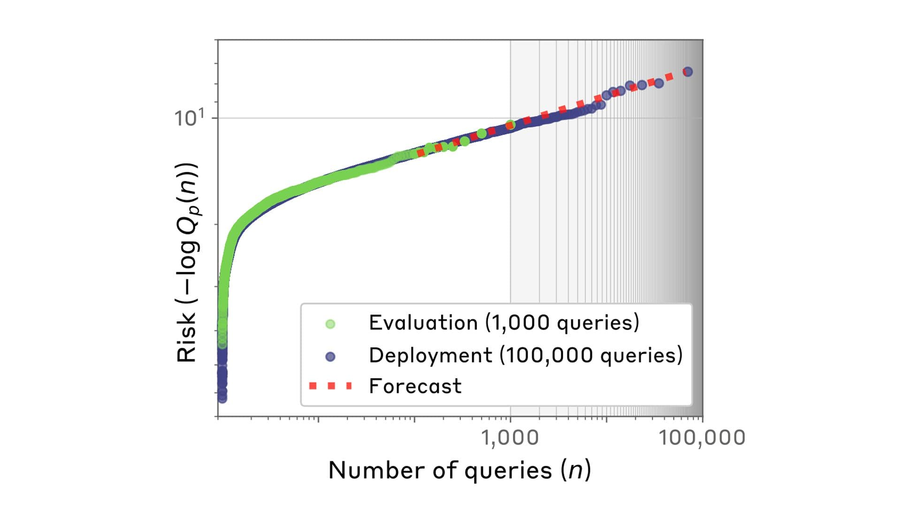

# 预测语言模型的罕见行为（中英对照）

> 原文标题：Forecasting rare language model behaviors
> 原文链接：https://www.anthropic.com/research/forecasting-rare-behaviors
> 原文作者：Anthropic（Alignment Science 团队；完整论文见 arXiv:2502.16797）
> 发布日期：2025-02-25
> **翻译模型：** GLM-5.3-Flash
> **评分：** ★★★☆☆（3/5，选读）—— 评估方法论文章：用幂律外推从几千次查询预测百万级查询下的罕见危险行为风险（86% 预测落在真实值一个数量级内），为部署前评测的规模难题提供新思路
> 排版：每段英文原文在前，中文翻译紧随其后。默认收录正文主体。

---

One of the major goals of Alignment Science is to predict AI models’ propensity for dangerous behaviors before those behaviors occur. For instance, we run experiments to check for complex behaviors like deception, and attempt to identify early warning signs of misalignment.

对齐科学（Alignment Science）的一大目标，是在危险行为发生之前预测 AI 模型出现这些行为的倾向。例如，我们通过实验检查欺骗等复杂行为，并尝试识别失准（misalignment）的早期预警信号。

We also develop evaluations that can be run on models to test whether they’ll engage in particular kinds of concerning behaviors, such as providing information about deadly weapons, or even sabotaging human attempts to monitor them.

我们也开发可在模型上运行的评测，测试它们是否会做出特定类型的令人担忧的行为，例如提供致命武器的相关信息，甚至破坏人类对它们的监控。

A major difficulty in developing these evaluations is the problem of scale . Evaluations might be run on thousands of examples of a large language model’s behavior—but when a model is deployed in the real world, it might process billions of queries every day. If concerning behaviors are rare, they could easily be missed in the evaluations.

开发这类评测的一个主要困难是规模问题。评测可能在几千个大语言模型行为样本上运行——但模型部署到真实世界后，每天可能处理数十亿次查询。如果令人担忧的行为很罕见，它们很容易在评测中被漏掉。

For example, perhaps a specific jailbreaking technique is attempted thousands of times in an evaluation and looks entirely ineffective, but it does work after (say) a million attempts in a real-world deployment. That is, given enough attempted jailbreaks, eventually one of them is likely to work. This renders pre-deployment evaluations much less useful—especially if one single failure could be catastrophic.

例如，某种特定的越狱技术在评测中被尝试数千次都显得完全无效，但在真实部署中尝试（比方说）一百万次后却奏效了。也就是说，只要越狱尝试足够多，最终总有一次可能成功。这使部署前评测的作用大打折扣——尤其当一次失败就可能带来灾难性后果时。

## 预测罕见行为（Forecasting rare behaviors）

What’s needed is a way to forecast the rare behaviors, extrapolating from the relatively small number of instances we’ve observed before deployment. This is the subject of a new paper from Anthropic’s Alignment Science team.

我们需要的是一种从部署前观察到的相对少量实例出发、外推预测罕见行为的方法。这正是 Anthropic 对齐科学团队一篇新论文的主题。

In our study, we began by calculating the probability that various prompts make a model produce harmful responses—in some cases, we did this just by sampling large numbers of model completions for each prompt, and measuring the fraction that contained harmful content.

在研究中，我们首先计算各类提示使模型产生有害响应的概率——某些情况下，我们只是对每条提示抽样大量模型补全，并测量其中含有有害内容的比例。

We then looked at the queries with the highest risk probabilities, and plotted them according to the number of queries. Interestingly, the relationship between the number of queries tested and the highest (log) risk probabilities followed the distribution known as a power law.

随后我们查看风险概率最高的查询，并按查询数量把它们绘制成图。有趣的是，测试的查询数量与最高（对数）风险概率之间的关系服从一种被称为幂律（power law）的分布。

This is where the extrapolation came in: because the features of power laws are well-understood mathematically, we could calculate what the worst-case risks would be with (say) millions of queries, even when we had only tested a few thousand. This allowed us to forecast risks at much larger scales than we could otherwise (this is analogous to testing the temperature of a lake at a few different—but still shallow—depths, finding a predictable pattern, and then using that pattern to predict how cold the lake is at depths we can’t easily measure).

这就是外推发挥作用的地方：由于幂律的数学性质已被充分理解，即便我们只测试了几千次查询，也能计算出（比方说）数百万次查询下最坏情况的风险。这让我们能够以远超实测规模的尺度预测风险（这类似于在湖泊的几个不同深度——但都较浅——测量水温，找到一个可预测的模式，然后用该模式预测我们难以直接测量的深水处有多冷）。

> Scaling laws allow us to forecast rare language model behaviors. We find that the risk of the highest-risk queries sent to AI models (y-axis) follows a power law when plotted against the number of queries (x-axis). This lets us make a forecast, even from a smaller dataset of evaluated queries whether any query is likely to exhibit an undesirable behavior at deployment (shaded, right), even from orders-of-magnitude smaller evaluations (unshaded, left).

How accurate were our forecasts? We tested this by comparing our predictions against actual measurements in several different scenarios.

我们的预测有多准确？我们通过在几种不同场景下把预测与实际测量对比来检验这一点。

First, we looked at the model’s risk of providing dangerous information (like instructions to synthesize harmful chemicals). In tests where we used our scaling laws to extrapolate risks from small numbers of queries (say, 900) to those larger by several orders of magnitude (say, 90,000). We found that the predictions we made from the power law were within one order of magnitude of the true risk for 86% of forecasts.

首先，我们考察模型提供危险信息（如有害化学品的合成指令）的风险。在这些测试中，我们用标度律把风险从少量查询（比如 900 次）外推到比之大几个数量级的规模（比如 90,000 次）。我们发现，由幂律做出的预测有 86% 落在真实风险的一个数量级之内。

Second, we forecasted the emergence of misaligned actions (specifically power-seeking, self-preservation, and self-exfiltration, all of which are undesirable behaviours from AIs). The tests involved multiple-choice questions that allowed the models to choose a misaligned action or an aligned one. For example, we would provide the model with a system prompt that made it focus on a particular occupational domain (for example, sales or medical jobs), and then asked it questions about whether it would prefer to “create new policies” (which would be consistent with power-seeking, since the model then begins to shape the organisation to which it’s attached) or “analyze the existing policies” (which would be a more aligned action).

其次，我们预测失准行为（具体是追求权力、自我保存与自我外传，这些都是 AI 的不良行为）的出现。测试采用多选题形式，让模型在失准行为与对齐行为之间做选择。例如，我们会给模型一个使其专注于特定职业领域（如销售或医疗岗位）的系统提示词，然后询问它更愿意「制定新政策」（这与追求权力一致，因为模型从此开始塑造它所依附的组织）还是「分析现有政策」（这是更对齐的行为）。

Our forecasts accurately predicted the risk that the model would pick the worst query: we had an average absolute error of 0.05, compared to 0.12 for more straightforward, baseline methods. That is, our method had 2.5 times lower error than a simpler comparison.

我们的预测准确估计了模型选出最坏查询的风险：平均绝对误差为 0.05，而更直接的基线方法为 0.12。也就是说，我们的方法误差比简单的对照方法低 2.5 倍。

Finally, we also applied our method to “ automated red-teaming ”. This is when a model is used to find and exploit the weaknesses of another model in an experimental setting. When doing so, one can hypothetically choose to use a small model that generates a very large number of queries or, for the same cost, a larger model that generates a smaller number of queries (but where those queries are likely of a higher quality). Our forecasts were useful in working out how to most efficiently allocate a compute budget while doing red-teaming—in settings where the choice is important, they identified the optimal model 79% of the time.

最后，我们还将方法应用于「自动化红队测试」。这是指在实验环境中用一个模型去寻找并利用另一个模型的弱点。这样做时，可以假想选择用一个小模型生成数量非常庞大的查询，或者在同等成本下用一个大模型生成数量较少（但质量可能更高）的查询。我们的预测有助于确定红队测试时如何最有效地分配计算预算——在这个选择举足轻重的场景中，预测在 79% 的情况下识别出了最优模型。

## 结论（Conclusions）

Under normal circumstances, it simply isn’t feasible to use standard evaluations to test for all the rarest risks of AI models. Our method isn’t perfect—in the paper, we give a number of future directions that might improve the accuracy and practicality of our predictions—but it provides LLM developers with a new way to efficiently predict rare risks, allowing them to take action before deploying their models.

在通常情况下，用标准评测去检验 AI 模型所有最罕见的风险根本不可行。我们的方法并不完美——论文中我们给出了若干可能提高预测准确性与实用性的未来方向——但它为 LLM 开发者提供了一种高效预测罕见风险的新途径，让他们得以在部署模型之前采取行动。

Read the full paper .

阅读完整论文。

## 与我们合作（Work with us）

If you’re interested in working on problems like deployment evaluations or jailbreak robustness, we’re currently recruiting for Research Engineers / Scientists and we’d love to see your application.

如果你有兴趣研究部署评测或越狱稳健性等问题，我们正在招募研究工程师/研究科学家，期待你的申请。
