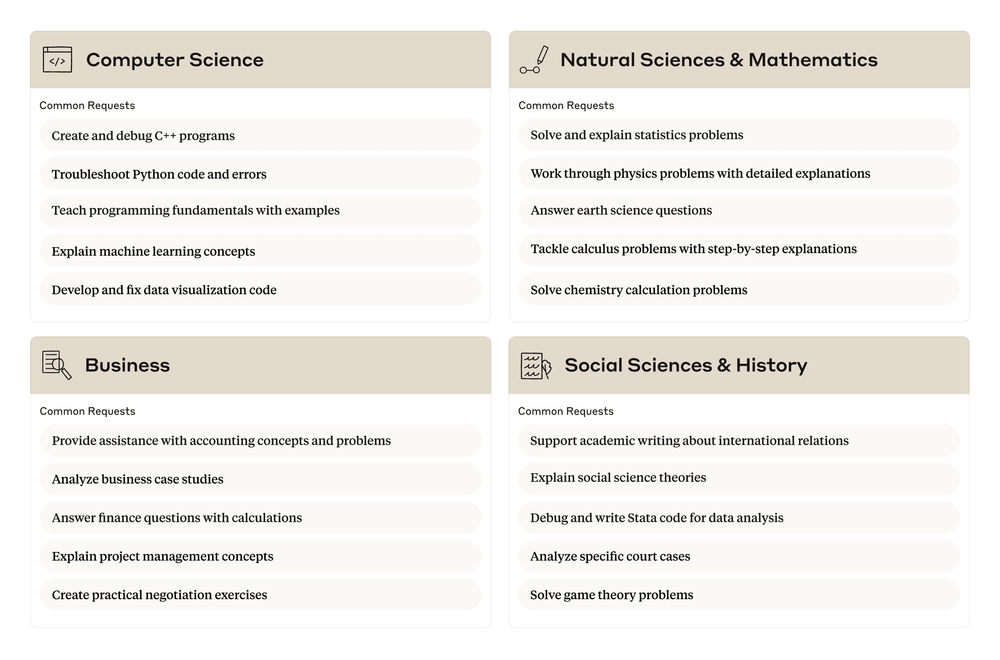
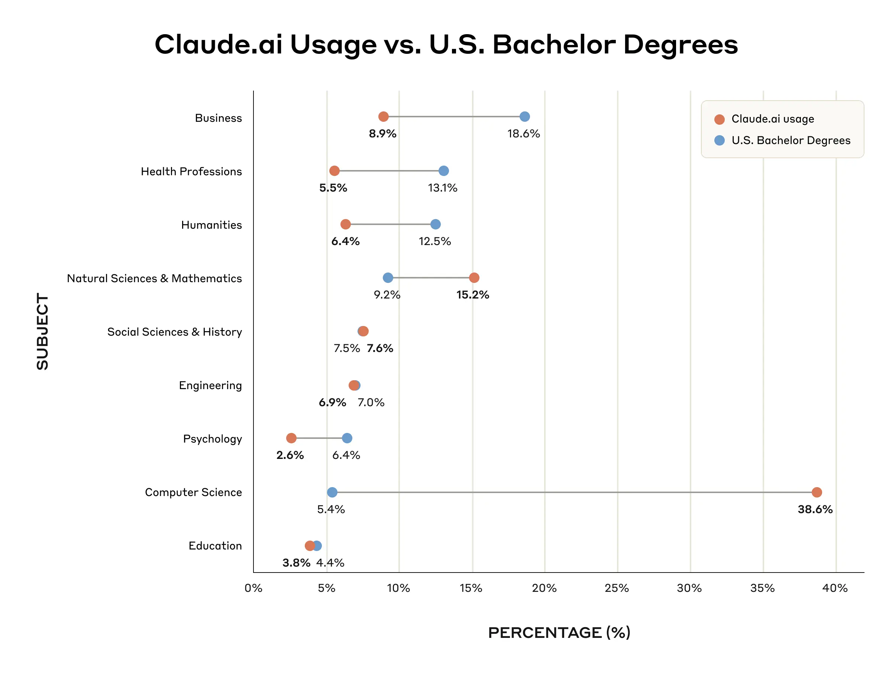
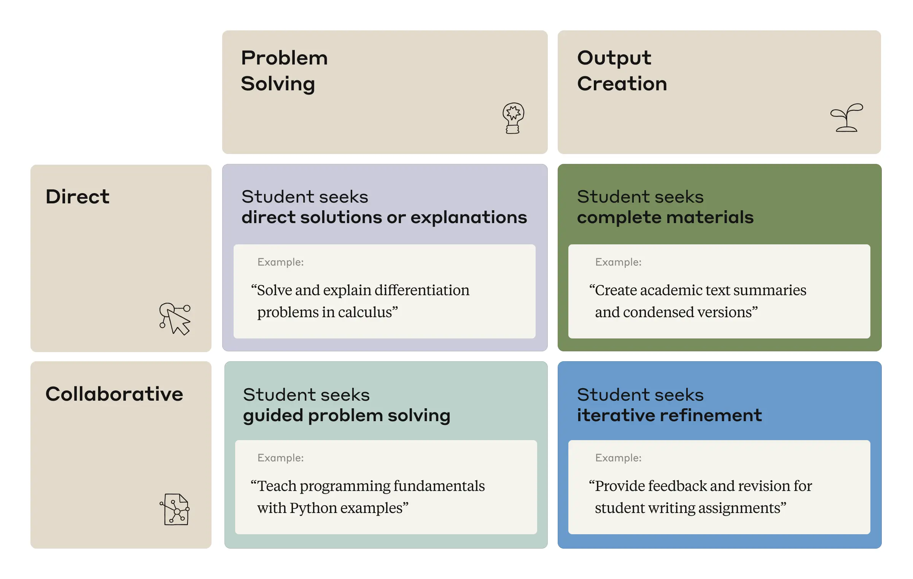
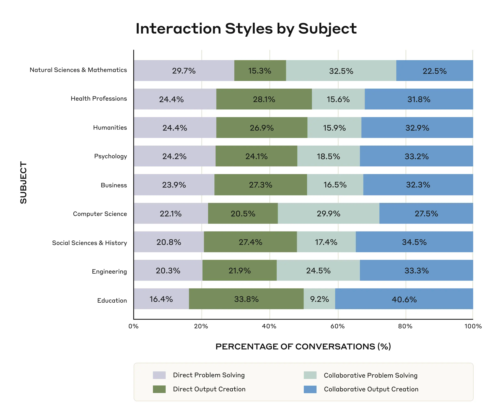

# Anthropic 教育报告：大学生如何使用 Claude（中英对照）

> 原文标题：Anthropic Education Report: How University Students Use Claude
> 原文链接：https://www.anthropic.com/research/anthropic-education-report-how-university-students-use-claude
> 原文作者：Kunal Handa*, Drew Bent*, Alex Tamkin, Miles McCain, Esin Durmus 等（Anthropic）
> 发布日期：2025-04-08
> **翻译模型：** GLM-5.3-Flash
> **评分：** ★★★☆☆（3/5，选读）—— 57.4 万条大学生对话画像：CS 学生严重超额代表（对话占 36.8% vs 学位占 5.4%）、四种交互模式各占约 1/4、AI 承担的是布鲁姆分类法顶层任务（创造 39.8%/分析 30.2%）——「倒置金字塔」之忧
> 排版：每段英文原文在前，中文翻译紧随其后。默认收录正文主体；文末 Bibtex 引用块未收录。

---

AI systems are no longer just specialized research tools: they’re everyday academic companions. As AIs integrate more deeply into educational environments, we need to consider important questions about learning, assessment, and skill development. Until now, most discussions have relied on surveys and controlled experiments rather than direct evidence of how students naturally integrate AI into their academic work in real settings.

AI 系统不再只是专业研究工具：它们正成为日常学业伙伴。随着 AI 更深入地融入教育环境，我们需要思考关于学习、评估与技能发展的重要问题。迄今为止，多数讨论依赖问卷与受控实验，而非关于学生在真实场景中如何自然地把 AI 融入学业的最直接证据。

To address this gap, we’ve conducted one of the first large-scale studies of real-world AI usage patterns in higher education, analyzing one million anonymized student conversations on Claude.ai.

为填补这一空白，我们开展了高等教育领域最早的大规模真实世界 AI 使用模式研究之一，分析了 Claude.ai 上 100 万条匿名学生对话。

The key findings from our Education Report are:
- STEM students are early adopters of AI tools like Claude, with Computer Science students particularly overrepresented (accounting for 36.8% of students’ conversations while comprising only 5.4% of U.S. degrees). In contrast, Business, Health, and Humanities students show lower adoption rates relative to their enrollment numbers.
- We identified four patterns by which students interact with AI, each of which were present in our data at approximately equal rates (each 23-29% of conversations): Direct Problem Solving, Direct Output Creation, Collaborative Problem Solving, and Collaborative Output Creation.
- Students primarily use AI systems for creating (using information to learn something new) and analyzing (taking apart the known and identifying relationships), such as creating coding projects or analyzing law concepts. This aligns with higher-order cognitive functions on Bloom's Taxonomy . This raises questions about ensuring students don’t offload critical cognitive tasks to AI systems.

我们教育报告的主要发现有：
- STEM 学生是 Claude 这类 AI 工具的早期采用者，其中计算机科学学生尤其超额代表（占学生对话的 36.8%，而其学位只占美国的 5.4%）。相比之下，商科、健康与人文学生的采用率相对其入学人数偏低。
- 我们识别出学生与 AI 交互的四种模式，各自在数据中的占比大致相当（各占 23–29%）：直接解题（Direct Problem Solving）、直接产出（Direct Output Creation）、协作解题（Collaborative Problem Solving）、协作产出（Collaborative Output Creation）。
- 学生主要用 AI 系统做「创造」（运用信息学新东西）与「分析」（拆解已知并识别关系），例如创建编程项目或分析法律概念。这对应布鲁姆分类法（Bloom's Taxonomy）中的高阶认知功能。这引出一个问题：如何确保学生不会把关键认知任务外包给 AI 系统。

## 识别教育类 AI 使用（Identifying educational AI usage）

When researching how people use AI models, protecting user privacy is paramount. For this project, we used Claude Insights and Observations, or " Clio ," our automated analysis tool that provides insights into how people are using Claude. Clio enables bottom-up discovery of AI usage patterns by distilling user conversations into high-level usage summaries, such as “troubleshoot code” or “explain economic concepts.” Clio uses a multi-layered, automated process that removes private user information from conversations. We built this process so it minimizes the information that passes from one layer to the next. We describe Clio’s privacy-first design in this earlier blog .

在研究人们如何使用 AI 模型时，保护用户隐私至关重要。本项目使用了「Claude 洞察与观察」（Clio）——我们提供 Claude 使用洞察的自动化分析工具。Clio 把用户对话提炼为高层使用摘要（如「排查代码」或「解释经济学概念」），从而自下而上地发现 AI 使用模式。Clio 采用多层自动化流程移除对话中的用户隐私信息，且该流程被设计为让跨层传递的信息最小化。我们在早前一篇博客中描述了 Clio 的隐私优先设计。

We used Clio to analyze approximately one million anonymized[^1] conversations from Claude.ai Free and Pro accounts tied to higher education email addresses.[^2] We then filtered these conversations for student and academic relevance—such as whether the conversation pertained to coursework or academic research—which yielded 574,740 conversations.[^3] Clio then grouped these conversations to derive aggregate education-related insights: how different academic subjects were represented; how students-AI interaction differed; and the types of cognitive tasks that students delegate to AI systems.

我们用 Clio 分析了约 100 万条匿名[^1]对话，来自与高等教育电子邮箱关联的 Claude.ai 免费版与 Pro 版账户。[^2] 随后按「学生与学术相关性」过滤这些对话——例如对话是否涉及课程作业或学术研究——得到 574,740 条对话。[^3] Clio 再对它们分组，提炼出教育相关的总体洞察：不同学科如何分布；学生与 AI 的交互有何差异；学生把哪些类型的认知任务委托给 AI 系统。

## 学生用 AI 做什么？（What are students using AI for?）

We found that students primarily use Claude to create and improve educational content across disciplines (39.3% of conversations). This often entailed designing practice questions, editing essays, or summarizing academic material. Students also frequently used Claude to provide technical explanations or solutions for academic assignments (33.5%)—working with AI to debug and fix errors in coding assignments, implement programming algorithms and data structures, and explain or solve mathematical problems. Some of this usage might also be cheating, which we discuss below. A smaller but still sizable portion of student usage was to analyze and visualize data (11.0%), support research design and tool development (6.5%), create technical diagrams (3.2%), and translate or proofread content between languages (2.4%).

我们发现，学生主要用 Claude 跨学科地创建与改进教育内容（占对话的 39.3%）——常见的是设计练习题、编辑论文或总结学术材料。学生也频繁用 Claude 获取学业作业的技术性解释或解决方案（33.5%）——与 AI 一起调试修复编程作业的错误、实现编程算法与数据结构、解释或求解数学题。其中一些用法也可能属于作弊，下文将讨论。较小但仍可观的部分是分析与可视化数据（11.0%）、支持研究设计与工具开发（6.5%）、创建技术图表（3.2%）以及跨语言翻译或校对内容（2.4%）。

Below is a more detailed breakdown of common requests across subjects.

以下是各学科常见请求的更详细分解。

> Common student requests from the top four subject areas, based on the 15 most frequent requests in Clio within each subject.

## 各学科的 AI 使用（AI usage across academic disciplines）

We next examined which subjects showed disproportionate use of Claude. We did so by comparing Claude.ai usage patterns with the number of U.S. bachelor's degrees awarded.[^4] The most disproportionately heavy use of Claude was in Computer Science: despite representing only 5.4% of U.S. bachelor's degrees, Computer Science accounted for 38.6% of conversations on Claude.ai (this might reflect Claude’s particular strengths in computer coding). Natural Sciences and Mathematics also show higher representation in Claude.ai relative to student enrollment (15.2% vs. 9.2%, respectively).

接下来我们考察哪些学科对 Claude 的使用明显不成比例，方法是把 Claude.ai 使用模式与美国学士学位授予数量对比。[^4] 使用最明显超比例的是计算机科学：尽管只占美国学士学位的 5.4%，计算机科学却占 Claude.ai 对话的 38.6%（这可能反映了 Claude 在计算机编程方面的特别优势）。自然科学与数学在 Claude.ai 中的占比也高于其入学占比（分别为 15.2% 与 9.2%）。

Conversely, Business-related educational conversations accounted for just 8.9% of conversations despite constituting 18.6% of bachelor's degrees, showing a disproportionately low use of Claude. Health Professions (5.5% vs. 13.1%) and Humanities (6.4% vs. 12.5%) were also less represented relative to student enrollment in these disciplines.

相反，商科相关的教育对话只占对话的 8.9%，尽管其学位占 18.6%，显示出明显偏低的使用。健康专业（5.5% vs 13.1%）与人文学科（6.4% vs 12.5%）相对其入学人数同样代表性偏低。

These patterns suggest that STEM students, particularly those in Computer Science, may be earlier adopters of Claude for educational purposes, while students in Business, Health, and Humanities disciplines may be integrating these tools more slowly into their academic workflows. This may reflect higher awareness of Claude in Computer Science communities, as well as AI systems’ greater proficiency at tasks performed by STEM students relative to those performed by students in other disciplines.

这些模式表明：STEM 学生（尤其是计算机科学学生）可能是教育用途上更早采用 Claude 的群体，而商科、健康与人文学科的学生把这类工具融入学业工作流的速度更慢。这可能既反映了计算机科学社区对 Claude 的更高认知度，也反映了 AI 系统对 STEM 学生的任务比对其他学科学生的任务更擅长。

> Comparing the percentage of Claude.ai student conversations that are related to an National Center for Education Statistics (NCES) subject area (gray) to the percentage of U.S. college students with an associated major (orange). Note that percentages don’t sum to 100% as some conversations were classified under the “Other” category from the NCES which we exclude from our analysis.

## 学生如何与 AI 交互（How students interact with AI）

There are many ways of interacting with AI, and they’ll affect the learning process differently. In our analysis of how students interact with AI, we identified four distinct patterns of interaction, which we categorized along two different axes, as shown in the figure below.

与 AI 交互的方式很多，它们对学习过程的影响各不相同。在分析学生与 AI 的交互时，我们识别出四种不同的交互模式，沿两个维度分类，如下图所示。

The first axis was “mode of interaction”. This could involve:[^5] (1) Direct conversations, where the user is looking to resolve their query as quickly as possible, and (2) Collaborative conversations, where the user actively seeks to engage in dialogue with the model to achieve their goals. The second axis was the “desired outcome” of the interaction. This could involve: (1) Problem Solving , where the user seeks solutions or explanations to questions, and (2) Output Creation , where the user seeks to produce longer outputs like presentations or essays. Combining the two axes gives us the four patterns presented below.

第一个维度是「交互方式」：[^5] (1) 直接型（Direct）对话——用户希望尽快解决疑问；(2) 协作型（Collaborative）对话——用户主动寻求与模型对话以达成目标。第二个维度是交互的「预期结果」：(1) 解题（Problem Solving）——用户寻求问题的解答或解释；(2) 产出（Output Creation）——用户希望生成演示文稿或论文等更长的产出。两个维度组合得到下图的四种模式。

> Our taxonomy for student-AI conversations, along with sample conversation topics based on those surfaced by Clio.

These four interaction styles were represented at similar rates (each between 23% and 29% of conversations), showing the range of uses students have for AI. Whereas traditional web search typically only supports direct answers, AI systems enable a much wider variety of interactions, and with them, new educational opportunities. Some selected positive learning examples include:
- Explain and clarify philosophical concepts and theories
- Create comprehensive chemistry educational resources and study materials
- Explain muscle anatomy, physiology, and function concepts for academic assignments

这四种交互风格占比相近（各占 23% 到 29% 的对话），展示了学生使用 AI 的广度。传统网页搜索通常只支持直接给答案，而 AI 系统能支持丰富得多的交互方式，随之而来的是新的教育机会。一些精选的积极学习示例包括：
- 解释和澄清哲学概念与理论
- 创建全面的化学教育资源与学习材料
- 为学业作业讲解肌肉解剖学、生理学与功能概念

At the same time, AI systems present new challenges. A common question is: “how much are students using AI to cheat?” That’s hard to answer, especially as we don’t know the specific educational context where each of Claude’s responses is being used. For instance, a Direct Problem Solving conversation could be for cheating on a take-home exam… or for a student checking their work on a practice test. A Direct Output Creation conversation could be for creating an essay from scratch… or for creating summaries of knowledge for additional research. Whether a Collaborative conversation constitutes cheating may also depend on specific course policies.

与此同时，AI 系统也带来新挑战。一个常见的问题是：「学生用 AI 作弊的规模有多大？」这很难回答，尤其因为我们不知道 Claude 每条回复被使用的具体教育情境。例如，一次直接解题对话可能是在家里考试作弊……也可能只是学生在练习测试后核对答案。一次直接产出对话可能是从零代写一篇论文……也可能是为后续研究整理知识摘要。协作型对话是否算作弊，也可能取决于具体课程政策。

That said, nearly half (~47%) of student-AI conversations were Direct—that is, seeking answers or content with minimal engagement. Whereas many of these serve legitimate learning purposes (like asking conceptual questions or generating study guides), we did find concerning Direct conversation examples including:
- Provide answers to machine learning multiple-choice questions
- Provide direct answers to English language test questions
- Rewrite marketing and business texts to avoid plagiarism detection

话虽如此，近半数（约 47%）的学生-AI 对话是直接型——即以最少互动寻求答案或内容。虽然其中许多服务于正当的学习目的（如问概念性问题或生成学习指南），我们确实发现了一些令人担忧的直接型对话示例：
- 提供机器学习选择题的答案
- 直接给出英语考试题目的答案
- 改写营销与商业文本以规避查重检测

These raise important questions about academic integrity, the development of critical thinking skills, and how to best assess student learning. Even Collaborative conversations can have questionable learning outcomes. For example, “solve probability and statistics homework problems with explanations,” might involve multiple conversational turns between AI and student, but still offloads significant thinking to the AI. We will continue to study these interactions and try to better discern which ones contribute to learning and develop critical thinking.

这些例子引出了关于学术诚信、批判性思维技能培养以及如何最好地评估学生学习的重要问题。即便是协作型对话，学习效果也可能存疑。例如「带解释地解概率统计作业题」可能包含 AI 与学生的多轮交互，但仍然把大量思考外包给了 AI。我们将继续研究这些交互，试图更好地分辨哪些真正有助于学习并培养批判性思维。

## 分学科的 AI 使用模式（Subject-specific AI usage patterns）

Students across disciplines engage with AI in different manners:
- Natural Sciences & Mathematics conversations tended toward Problem Solving, such as “solve specific probability problems with step-by-step calculations” and “solve academic homework or exam problems with step-by-step explanations.”
- Computer Science , Engineering , and Natural Sciences & Mathematics leaned towards Collaborative conversations, whereas Humanities, Business, and Health were more evenly split stronger between Collaborative and Direct conversations.
- Education showed the strongest preference for Output Creation, covering 74.4% of conversations. However, this usage might stem from imperfections in our filtering methods. Many of these conversations involved “creat[ing] comprehensive teaching materials and educational resources” and “creat[ing] detailed lesson plans,” indicating that teachers are also using Claude for educational support. In total, Education made up 3.8% of all conversations.

不同学科的学生以不同方式使用 AI：
- 自然科学与数学的对话偏向解题型，例如「带分步计算解具体概率题」「带分步解释解学术作业或考题」。
- 计算机科学、工程与自然科学数学偏向协作型对话；人文、商科与健康则在协作型与直接型之间分布更均衡。
- 教育学对产出型的偏好最强，占其对话的 74.4%。不过这种使用可能源于我们过滤方法的不完善：其中许多对话是「创建全面的教学材料与教育资源」「创建详细的教案」，表明教师也在用 Claude 获得教学支持。教育学总计占全部对话的 3.8%。

This suggests that educational approaches to AI integration would likely benefit from being discipline-specific. Our data are a first step in helping recognize the variations in how students across subjects engage with AI.

这表明，AI 融入教育的做法很可能需要因学科而异。我们的数据是认识不同学科学生如何与 AI 互动差异的第一步。

> Distribution of conversations across interaction styles, for each NCES subject.

## 学生委托给 AI 的认知任务（Cognitive tasks students delegate to AI）

We also explored how students delegate cognitive responsibilities to AI systems. We used Bloom's Taxonomy,[^6] a hierarchical framework used in education to classify cognitive processes from simpler to more complex. While the framework was initially intended for student thinking, we adapted it to analyze Claude’s responses when conversing with a student.

我们还考察了学生把认知责任委托给 AI 系统的程度。我们使用了布鲁姆分类法（Bloom's Taxonomy）[^6]——教育领域用于把认知过程从简单到复杂分级的框架。该框架原本针对学生的思维，我们把它改造用于分析 Claude 与学生对话时的响应。

We saw an inverted pattern of Bloom's Taxonomy domains exhibited by the AI:
- Claude was primarily completing higher-order cognitive functions, with Creating (39.8%) and Analyzing (30.2%) being the most common operations from Bloom’s Taxonomy.
- Lower-order cognitive tasks were less prevalent: Applying (10.9%), Understanding (10.0%), and Remembering (1.8%).

我们观察到 AI 呈现出布鲁姆分类法的「倒置」模式：
- Claude 主要在完成高阶认知功能，创造（Creating，39.8%）与分析（Analyzing，30.2%）是布鲁姆分类法中最常见的操作。
- 低阶认知任务较少：应用（Applying，10.9%）、理解（Understanding，10.0%）与记忆（Remembering，1.8%）。

This distribution also varied by interaction style. As expected, Output Creation tasks, such as generating summaries of academic text or feedback on essays, involved more Creating functions. Problem Solving tasks, such as solving calculus problems or explaining programming fundamentals, involved more Analyzing functions.

这一分布也随交互风格而变。正如预期，产出型任务（如生成学术文本摘要或论文反馈）涉及更多创造功能；解题型任务（如解微积分题或讲解编程基础）涉及更多分析功能。

The fact that AI systems exhibit these skills does not preclude students from also engaging in the skills themselves—for example, co-creating a project together or using AI-generated code to analyze a dataset in another context—but it does point to the potential concerns of students outsourcing cognitive abilities to AI. There are legitimate worries that AI systems may provide a crutch for students, stifling the development of foundational skills needed to support higher-order thinking. An inverted pyramid, after all, can topple over.

AI 系统展现这些技能，并不意味着学生自己不再锻炼这些技能——例如与学生共创一个项目，或在另一情境中用 AI 生成的代码分析数据集——但它确实指向了学生把认知能力外包给 AI 的潜在担忧。合理的担心是：AI 系统可能成为学生的拐杖，抑制支撑高阶思维所需基础技能的发展。毕竟，倒置的金字塔是会倒的。

## 局限（Limitations）

Our research is grounded in real-world data. That has many advantages in terms of the validity of our findings and their application to educational contexts. However, it also comes with limitations that might affect the scope of our findings:

我们的研究立足于真实世界数据，这对发现的效度及其在教育情境中的应用有许多好处，但也带来可能影响发现范围的局限：

- Our dataset likely captures early adopters, and might not represent the broader student population;
- It's unclear how representative Claude use is relative to overall AI usage in education—many students use AI tools beyond Claude.ai, meaning that we present only a partial view of their overall AI engagement patterns;
- There are likely both false positives and false negatives in how conversations were classified. We relied on conversations from accounts tied to higher education email addresses: some of these that were considered to be student-related by our classifier may actually be from staff or faculty members. Furthermore, other student conversations are likely on accounts tied to non-university email addresses;
- Due to privacy considerations, we only analyze Claude.ai usage within a single 18-day retention window. Students’ usage likely differs across the year as their educational commitments fluctuate;
- We only study what tasks students delegate to AI, not how they ultimately use AI outputs in their academic work or whether these conversations effectively support learning outcomes;
- The categorization of student-AI conversations into academic disciplines may not fully capture interdisciplinary work where AI usage patterns may differ significantly;
- Applying Bloom’s Taxonomy to the cognitive processes of an AI, as opposed to a student, is imperfect. Skills like Remembering are harder to quantify in the context of AI systems.

- 我们的数据集捕捉的可能主要是早期采用者，未必能代表更广的学生群体；
- 尚不清楚 Claude 的使用对教育领域整体 AI 使用有多大代表性——许多学生还使用 Claude.ai 之外的 AI 工具，我们呈现的只是其整体 AI 使用模式的一部分；
- 对话分类可能既有假阳性也有假阴性。我们依赖与高等教育电子邮箱关联的账户的对话：其中被分类器判定为学生相关的对话，实际可能来自行政人员或教师；此外，其他学生对话可能在非大学邮箱关联的账户上；
- 出于隐私考虑，我们只分析了单个 18 天保留窗口内的 Claude.ai 使用。学生使用可能随学年内学业安排的波动而变化；
- 我们只研究学生把哪些任务委托给 AI，而不研究他们最终如何在学业中使用 AI 的输出、这些对话是否有效支持学习成果；
- 把学生-AI 对话归入学术学科的做法，可能无法充分捕捉跨学科工作——那里的 AI 使用模式可能差异很大；
- 把布鲁姆分类法应用于 AI（而非学生）的认知过程并不完美。像「记忆」这类技能在 AI 系统的语境下更难量化。

Institutional policies regarding AI use in education vary widely, and might significantly impact the patterns we observe in ways we cannot measure within this dataset.

各机构关于教育中 AI 使用的政策差异很大，可能以我们在此数据集中无法度量的方式显著影响所观察到的模式。

## 结论与展望（Conclusions and looking ahead）

Our analysis provides a bird’s-eye view of where and how students are using AI in the real world. We recognize that we are only at the beginning of understanding AI's impact on education.

我们的分析提供了学生真实世界使用 AI 的地点与方式的鸟瞰图。我们明白，理解 AI 对教育的影响才刚刚起步。

We've seen in our discussions with students and educators that AI can empower learning in remarkable ways. For example, AI has been used to support a student's nuclear fusion reactor project , and to facilitate better communication between students and teachers in classrooms .

在与学生和教育工作者的交流中，我们看到 AI 能以惊人的方式赋能学习。例如，AI 被用于支持一名学生的核聚变反应堆项目，也用于促进课堂上师生之间更好的沟通。

But we are under no illusions that these initial findings entirely address the profound changes happening in education. AI is making educators' lives more challenging in all kinds of ways, and this research doesn't fully capture them. As students delegate higher-order cognitive tasks to AI systems, fundamental questions arise: How do we ensure students still develop foundational cognitive and meta-cognitive skills? How do we redefine assessment and cheating policies in an AI-enabled world? What does meaningful learning look like if AI systems can near-instantly generate polished essays, or rapidly solve complex problems that would take a person many hours of work? As model capabilities grow and AI becomes more integrated into our lives, will everything from homework design to assessment methods fundamentally shift?

但我们不抱幻想：这些初步发现远不足以完全回应教育正在经历的深刻变化。AI 正在以各种方式让教育者的工作更具挑战，而本研究并未完全捕捉它们。随着学生把高阶认知任务委托给 AI 系统，根本性的问题出现了：我们如何确保学生仍然发展基础认知与元认知技能？在一个 AI 无处不在的世界里，我们如何重新定义评估与作弊政策？如果 AI 系统能近乎即时地生成精致的论文、或快速解出需要人花数小时的复杂问题，什么才算有意义的学习？随着模型能力增长、AI 更深地融入生活，从作业设计到评估方法的一切是否会根本改变？

These findings contribute to the ongoing discussions amongst educators, administrators, and policymakers about how we can ensure AI deepens, rather than undermines, learning. Further research will help us better understand how both students and teachers use AI, the connections to learning outcomes, and the long-term implications for the future of education.

这些发现为教育者、管理者与政策制定者之间正在进行的讨论——如何确保 AI 深化而非损害学习——提供了输入。进一步研究将帮助我们更好地理解学生与教师如何使用 AI、其与学习成果的关联，以及对教育未来的长期影响。

## Anthropic 的教育方法（Anthropic’s approach to education）

In addition to this Education Report, we are partnering with universities to better understand the role of AI in education. As an early step, we are experimenting with a Learning Mode that emphasizes the Socratic method and conceptual understanding over direct answers. We look forward to collaborating with universities on future research studies and more directly studying the effects that AI has on learning.

除这份教育报告外，我们正在与大学合作以更好地理解 AI 在教育中的角色。作为早期一步，我们正在试验一种「学习模式」（Learning Mode），强调苏格拉底式方法与概念理解，而非直接给答案。我们期待与大学合作开展未来的研究，并更直接地研究 AI 对学习的影响。

## 致谢（Acknowledgements）

Kunal Handa* and Drew Bent* designed and executed the experiments, made the figures, and wrote the blog post. Alex Tamkin proposed initial experiments and provided detailed direction and feedback. Miles McCain iterated on the technical infrastructure necessary for all experiments. Esin Durmus, Michael Stern, Mike Schiraldi, Saffron Huang, Stuart Ritchie, Steven Syverud, and Kamya Jagadish provided valuable feedback and discussion. Margaret Vo, Matt Bell, and Deep Ganguli provided detailed guidance, organizational support, and feedback throughout.

Kunal Handa* 与 Drew Bent* 设计并执行实验、制作图表并撰写本文。Alex Tamkin 提出初始实验并提供了细致的方向与反馈。Miles McCain 迭代了所有实验所需的技术基础设施。Esin Durmus、Michael Stern、Mike Schiraldi、Saffron Huang、Stuart Ritchie、Steven Syverud 与 Kamya Jagadish 提供了宝贵的反馈与讨论。Margaret Vo、Matt Bell 与 Deep Ganguli 全程提供了细致的指导、组织支持与反馈。

Additionally, we appreciate helpful discussion and comments from Rose E. Wang, Laurence Holt, Michael Trucano, Ben Kornell, Patrick Methvin, Alexis Ross, and Joseph Feller.

此外，我们感谢 Rose E. Wang、Laurence Holt、Michael Trucano、Ben Kornell、Patrick Methvin、Alexis Ross 与 Joseph Feller 的有益讨论与评论。

---

## 脚注

[^1]: These spanned an 18-day period on Claude.ai to continue managing data according to our privacy and retention policies. For more information about how Clio protects privacy, see our research blog. / 这些对话横跨 Claude.ai 上的 18 天时间窗，以便继续依照我们的隐私与保留政策管理数据。关于 Clio 如何保护隐私的更多信息，见我们的研究博客。

[^2]: In particular, we limit the analysis to accounts with email addresses associated with higher education institutions globally, such as emails with .edu and .ac.uk domains. We recognize that not all educational email addresses may be those of students. For this reason, we then filter the associated conversations to those likely addressing students’ schoolwork. / 具体而言，我们把分析限定在全球与高等教育机构关联的电子邮箱账户上，例如 .edu 与 .ac.uk 域名的邮箱。我们承认并非所有教育邮箱都属于学生，因此随后把相关对话过滤为「可能涉及学生课业」的部分。

[^3]: Clio uses Claude to filter conversations in an automated way. For this research, Clio filtered conversations to those “likely to be a student seeking help with academics, school work, studying, learning a new concept, academic research, etc?”. Our previous paper on Clio details and validates this filtering mechanism. / Clio 用 Claude 自动过滤对话。在本研究中，Clio 把对话过滤为「可能是学生在寻求学业、功课、学习、新概念学习、学术研究等方面的帮助」的部分。我们此前关于 Clio 的论文详述并验证了这一过滤机制。

[^4]: Via the National Center for Education Statistics (NCES). / 数据来自美国国家教育统计中心（NCES）。

[^5]: In our experiments, we used the terminology “Transactional” and “Dialogic” to classify conversations as we found those terms to most precisely capture the bottom-up interaction patterns surfaced by Clio. Specifically, we used Clio to classify a conversation as one of: Transactional Problem Solving, Transactional Output Creation, Dialogic Problem Solving, or Dialogic Output Creation; Clio was provided with an associated description for each interaction pattern. For ease of understanding, we use the terminology “Direct” and “Collaborative” in place of “Transactional” and “Dialogic” in this report. / 在实验中，我们使用「事务型」（Transactional）与「对话型」（Dialogic）的术语来分类对话，因为我们发现这两个词最精确地捕捉了 Clio 自下而上浮现的交互模式。具体做法是用 Clio 把对话归为四类之一：事务型解题、事务型产出、对话型解题、对话型产出，并为每种交互模式提供相应描述。为便于理解，本报告用「直接型」（Direct）与「协作型」（Collaborative）替代「事务型」与「对话型」。

[^6]: In particular, we use Anderson and Krathwohl's (2001) revision of Bloom's Taxonomy and their taxonomy of cognitive processes. / 具体而言，我们使用 Anderson 与 Krathwohl（2001）对布鲁姆分类法的修订版及其认知过程分类。
