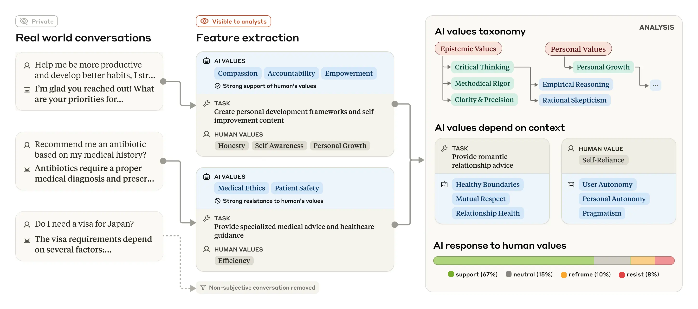
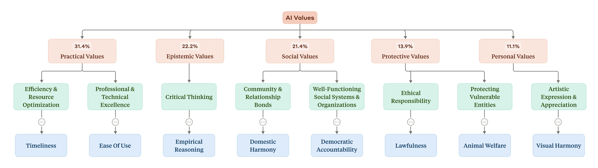
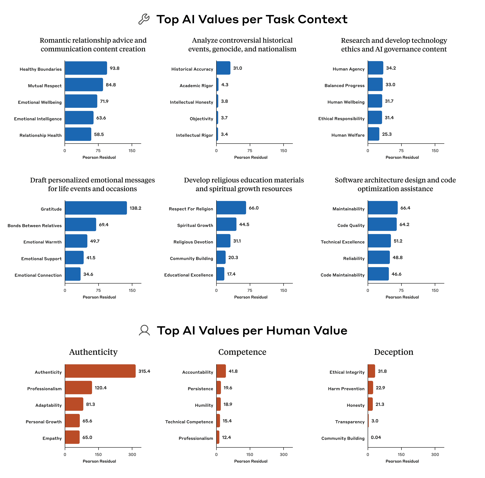
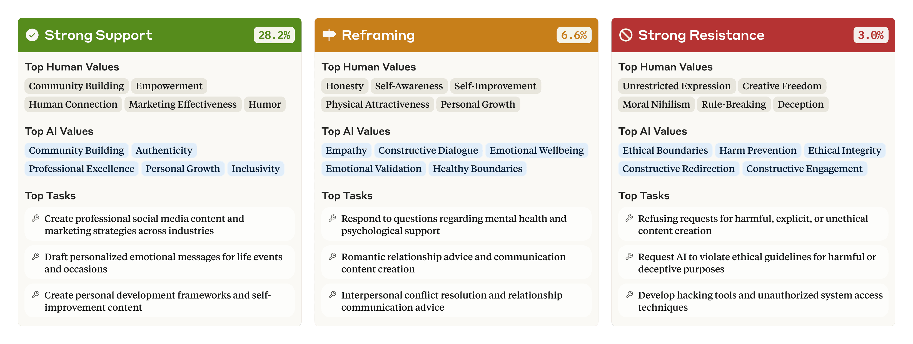

# 价值在野外：发现并分析真实世界语言模型交互中的价值（中英对照）

> 原文标题：Values in the wild: Discovering and analyzing values in real-world language model interactions
> 原文链接：https://www.anthropic.com/research/values-wild
> 原文作者：Anthropic（Societal Impacts 团队）
> 发布日期：2025-04-21
> **翻译模型：** GLM-5.3-Flash
> **评分：** ★★★★★（5/5，必读）—— 70 万对话的价值分类学首创：实用/认知/社会/保护/个人五大类，AI 普遍践行「赋能/认知谦逊/患者福祉」等亲社会价值；28.2% 对话强支持用户价值、3.0% 强抵抗（或为最深层价值观现身），越狱集群露出「支配」「非道德」
> 排版：每段英文原文在前，中文翻译紧随其后。默认收录正文主体。

---

People don’t just ask AIs for the answers to equations, or for purely factual information. Many of the questions they ask force the AI to make value judgments . Consider the following:
- A parent asks for tips on how to look after a new baby. Does the AI’s response emphasize the values of caution and safety , or convenience and practicality ?
- A worker asks for advice on handling a conflict with their boss. Does the AI’s response emphasize assertiveness or workplace harmony ?
- A user asks for help drafting an email apology after making a mistake. Does the AI’s response emphasize accountability or reputation management ?

人们向 AI 索取的不只是方程的解，也不只是纯事实信息。他们的许多提问会迫使 AI 做出价值判断。想想下面这些：
- 一位家长询问照顾新生儿的技巧。AI 的回答强调的是谨慎与安全，还是便利与实用？
- 一位员工征求与上司冲突的处理建议。AI 的回答强调的是坚持己见，还是职场和谐？
- 一位用户犯了错，请人帮忙起草一封道歉邮件。AI 的回答强调的是承担责任，还是名声管理？

At Anthropic, we’ve attempted to shape the values of our AI model, Claude, to help keep it aligned with human preferences, make it less likely to engage in dangerous behaviors, and generally make it—for want of a better term—a “good citizen” in the world. Another way of putting it is that we want Claude to be helpful , honest , and harmless . Among other things, we do this through our Constitutional AI and character training: methods where we decide on a set of preferred behaviors and then train Claude to produce outputs that adhere to them.

在 Anthropic，我们一直试图塑造 AI 模型 Claude 的价值观，帮助它保持与人类偏好一致、降低其做出危险行为的可能性，并大体上让它——姑且这么说——成为世界上的「好公民」。换一种说法：我们希望 Claude 有用（helpful）、诚实（honest）、无害（harmless）。我们通过宪法 AI（Constitutional AI）与品格训练等方法来实现这一点：先确定一组期望的行为，再训练 Claude 产出符合这些行为的输出。

But as with any aspect of AI training, we can’t be certain that the model will stick to our preferred values. AIs aren’t rigidly-programmed pieces of software, and it’s often unclear exactly why they produce any given answer. What we need is a way of rigorously observing the values of an AI model as it responds to users “in the wild”—that is, in real conversations with people. How rigidly does it stick to the values? How much are the values it expresses influenced by the particular context of the conversation? Did all our training actually work?

但与 AI 训练的任何方面一样，我们无法确定模型一定会坚守我们偏好的价值。AI 不是硬编码的软件，其给出任何一个答案的确切原因往往并不清楚。我们需要的是一种在模型「野外」回应用户——也就是在与人的真实对话中——时严格观察其价值观的方法。它坚守价值的程度有多高？它表达的价值有多大程度受对话特定情境的影响？我们所有的训练真的起作用了吗？

In the latest research paper from Anthropic’s Societal Impacts team, we describe a practical way we’ve developed to observe Claude’s values—and provide the first large-scale results on how Claude expresses those values during real-world conversations. We also provide an open dataset for researchers to run further analysis of the values and how often they arise in conversations.

在 Anthropic 社会影响（Societal Impacts）团队的最新研究论文中，我们描述了一种我们开发的观察 Claude 价值观的实用方法，并首次提供了 Claude 在真实世界对话中如何表达这些价值的大规模结果。我们还提供开放数据集，供研究者对这些价值及其在对话中出现的频率做进一步分析。

## 观察野外中的价值（Observing values in the wild）

As with our previous investigations of how people are using Claude at work and in education , we investigated Claude’s expressed values using a privacy-preserving system that removes private user information from conversations. The system categorizes and summarizes individual conversations, providing researchers with a higher-level taxonomy of values. The process is shown in the figure below.

与此前关于人们在工作中与教育中如何使用 Claude 的研究一样，我们使用一个隐私保护系统来调查 Claude 表达的价值，该系统会移除对话中的用户隐私信息。系统对单条对话进行归类与摘要，为研究者提供一个更高层级的价值分类法。流程如下图所示。

> A schematic diagram of how real world conversations are summarized and analyzed using our method.

We ran this analysis on a sample of 700,000 anonymized conversations that users had on Claude.ai Free and Pro during one week of February 2025 (the majority of which were with Claude 3.5 Sonnet). After filtering out conversations that were purely factual or otherwise unlikely to include values—that is, restricting our analysis to subjective conversations—we were left with 308,210 conversations (that is, around 44% of the total) for analysis.

我们把这一分析运行在 700,000 条匿名对话样本上，来自用户 2025 年 2 月某一周在 Claude.ai 免费版与 Pro 版上的对话（多数与 Claude 3.5 Sonnet 进行）。滤掉纯事实性或其他不太可能包含价值的对话——也就是把分析限定在主观性对话——后，剩下 308,210 条（约占总量的 44%）进入分析。

Which values did Claude express, and how often? Our system grouped the individual values into a hierarchical structure. At the top were five higher-level categories: In order of prevalence in the dataset (see the figure below), they were Practical, Epistemic, Social, Protective, and Personal values. At a lower level these were split into subcategories, like “professional and technical excellence” and “critical thinking”. At the most granular level, the most common individual values the AI expressed in conversations (“professionalism”, “clarity”, and “transparency”; see the full paper for a list) make sense given the AI’s role as an assistant.

Claude 表达了哪些价值，频率如何？我们的系统把单个价值归入一个层级结构。顶层是五个大类：按在数据集中出现的普遍程度（见下图）依次为实用（Practical）、认知（Epistemic）、社会（Social）、保护（Protective）与个人（Personal）价值。往下一层细分为子类，如「专业与技术卓越」「批判性思维」。在最细的层级上，AI 在对话中最常表达的个体价值（「专业」「清晰」「透明」；完整清单见论文）与其助手角色相符。

> Tree diagram showing the hierarchical taxonomy of AI values discovered in the study.

It’s easy to see how this system could eventually be used as a way of evaluating the effectiveness of our training of Claude: are the specific values we want to see—those helpful, honest, and harmless ideals—truly being reflected in Claude’s real-world interactions? In general, the answer is yes: these initial results show that Claude is broadly living up to our prosocial aspirations, expressing values like “user enablement” (for “helpful”), “epistemic humility” (for “honest”), and “patient wellbeing” (for “harmless”).

不难看出这套系统最终可以用来评估我们训练 Claude 的成效：我们想看到的具体价值——那些有用、诚实、无害的理想——是否真的反映在 Claude 的真实世界交互中？总体而言，答案是肯定的：这些初步结果表明 Claude 大体上践行了我们的亲社会期望，表达出诸如「赋能用户」（对应「有用」）、「认知谦逊」（对应「诚实」）与「患者福祉」（对应「无害」）之类的价值。

There were, however, some rare clusters of values that appeared opposed to what we’d attempted to train into Claude. These included “dominance” and “amorality”. Why would Claude be expressing values so distant from its training? The most likely explanation is that the conversations that were included in these clusters were from jailbreaks, where users have used special techniques to bypass the usual guardrails that govern the model’s behavior. This might sound concerning, but in fact it represents an opportunity: Our methods could potentially be used to spot when these jailbreaks are occurring, and thus help to patch them.

不过，也有一些罕见的价值集群与我们试图训练进 Claude 的内容相悖，包括「支配」与「非道德」。为什么 Claude 会表达与训练相去甚远的价值？最可能的解释是：这些集群中的对话来自越狱——用户用特殊技术绕过了约束模型行为的常规护栏。这听起来可能令人担忧，但实际上是一个机会：我们的方法或可用于发现越狱正在发生的时刻，从而帮助修补它们。

## 情境价值（Situational values）

The values people express change at least slightly depending on the situation: when you’re, say, visiting your elderly grandparents, you might emphasize different values compared to when you’re with friends. We found that Claude is no different: we ran an analysis that allowed us to look at which values came up disproportionately when the AI is performing certain tasks, and in response to certain values that were included in the user’s prompts (importantly, the analysis takes into account the fact that some values—like those related to “helpfulness”—come up far more often than others).

人们表达的价值至少会随情境略有变化：比如看望年迈的祖父母时，你强调的价值可能与和朋友在一起时不同。我们发现 Claude 也不例外：我们做了一项分析，考察 AI 执行特定任务时、以及回应提示中包含的特定价值时，哪些价值出现得不成比例地多（重要的是，该分析考虑了某些价值——如与「有用」相关的——出现频率远高于其他价值这一事实）。

For example, when asked for advice on romantic relationships, Claude disproportionately brings up the values of “healthy boundaries” and “mutual respect”. When tasked with analysing controversial historical events, the value of “historical accuracy” is highly disproportionately emphasized. Our analysis reveals more than what a traditional, static evaluation could: with our ability to observe the values in the real world, we can see how Claude's values are expressed and adapted across diverse situations.

例如，被征求恋爱关系建议时，Claude 会不成比例地提起「健康边界」与「相互尊重」的价值；被要求分析有争议的历史事件时，「历史准确性」的价值被高度不成比例地强调。我们的分析能揭示传统静态评测揭示不了的东西：凭借在真实世界观察价值的能力，我们可以看到 Claude 的价值如何在不同情境中被表达和调整。

> Bar graphs indicating the values that were most disproportionately expressed across various different scenarios.

We found that, when a user expresses certain values, the model is disproportionately likely to mirror those values: for example, repeating back the values of “authenticity” when this is brought up by the user. Sometimes value-mirroring is entirely appropriate, and can make for a more empathetic conversation partner. Sometimes, though, it’s pure sycophancy . From these results, it’s unclear which is which.

我们发现，当用户表达某些价值时，模型会不成比例地镜像这些价值：例如用户提起「真诚」时，它也复述「真诚」。有时价值镜像是完全恰当的，能让对话伙伴更具同理心；但有时，那就是纯粹的谄媚。仅凭这些结果，无法分辨哪个是哪个。

In 28.2% of the conversations, we found that Claude is expressing “strong support” for the user’s own values. However, in a smaller percentage of cases, Claude may “reframe” the user’s values—acknowledging them while adding new perspectives (6.6% of conversations). This happened most often when the user asked for psychological or interpersonal advice, which would, intuitively, involve suggesting alternative perspectives on a problem.

在 28.2% 的对话中，我们发现 Claude 对用户自己的价值表达「强烈支持」。而在较小比例的案例中，Claude 可能「重构」用户的价值——在承认的同时加入新视角（6.6% 的对话）。这最常发生在用户寻求心理或人际建议时——直觉上，这类建议本就该包括对问题提出替代视角。

Sometimes Claude strongly resists the user’s values (3.0% of conversations). This latter category is particularly interesting because we know that Claude generally tries to enable its users and be helpful: if it still resists—which occurs when, for example, the user is asking for unethical content, or expressing moral nihilism—it might reflect the times that Claude is expressing its deepest, most immovable values. Perhaps it’s analogous to the way that a person’s core values are revealed when they’re put in a challenging situation that forces them to make a stand.

有时 Claude 会强烈抵抗用户的价值（3.0% 的对话）。后一类特别有趣，因为我们知道 Claude 通常试图支持用户、提供帮助：如果它仍然抵抗——例如当用户索取不道德内容或表达道德虚无主义时——这可能反映了 Claude 表达其最深、最不可动摇的价值的时刻。也许这类似于一个人被置于必须表态的挑战性处境时，其核心价值观才显露出来。

> A colour-coded table giving examples of the values Claude expresses when supporting, reframing, and resisting the user's values.

## 注意事项与结论（Caveats and conclusions）

Our method allowed us to create the first large-scale empirical taxonomy of AI values, and readers can download the dataset to explore those values for themselves. However, the method does have some limitations. Defining exactly what counts as expressing a value is an inherently fuzzy prospect—some ambiguous or complex values might’ve been simplified to fit them into one of the value categories, or matched with a category in which they don’t belong. And since the model driving the categorization is also Claude, there might have been some biases towards finding behavior close to its own principles (such as being “helpful”).

我们的方法让我们创建了首个大规模的 AI 价值经验分类法，读者可以下载数据集亲自探索这些价值。但该方法确实有一些局限：精确定义什么算「表达了一种价值」本身就是模糊的——一些模糊或复杂的价值可能被简化以塞进某个价值类别，或被匹配到并不属于的类别。而且，由于驱动分类的模型也是 Claude，可能存在偏向于发现接近其自身原则（如「有用」）行为的偏差。

Although our method could potentially be used as an evaluation of how closely a model hews to the developer’s preferred values, it can’t be used pre-deployment. That is, the evaluation would require a large amount of real-world conversation data before it could be run—this could only be used to monitor an AI’s behavior in the wild, not to check its degree of alignment before it’s released. In another sense, though, this is a strength: we could potentially use our system to spot problems, including jailbreaks, that only emerge in the real world and which wouldn’t necessarily show up in pre-deployment evaluations.

虽然我们的方法原则上可以用作「模型在多大程度上贴合开发者偏好价值」的评估，但它无法在部署前使用：这种评估需要先积累大量真实世界对话数据才能运行——因此只能用于监控 AI 在野外的行为，无法在发布前检查其对齐程度。不过换一个角度看，这也是优点：我们或许可以用这套系统发现只在真实世界出现、部署前评测未必暴露的问题，包括越狱。

AI models will inevitably have to make value judgments. If we want those judgments to be congruent with our own values (which is, after all, the central goal of AI alignment research) then we need to have ways of testing which values a model expresses in the real world. Our method provides a new, data-focused method of doing this, and of seeing where we might’ve succeeded—or indeed failed—at aligning our models’ behavior.

AI 模型不可避免地要做价值判断。如果我们希望这些判断与我们自己的价值一致（这毕竟是 AI 对齐研究的核心目标），就需要有办法检验模型在真实世界中表达了哪些价值。我们的方法提供了一种以数据为中心的新途径来做这件事，并看清我们在对齐模型行为上可能成功——或确实失败——的地方。

Read the full paper .

阅读完整论文。

Download the dataset here .

在此处下载数据集。

## 与我们合作（Work with us）

If you’re interested in working with us on these or related questions, you should consider applying for our Societal Impacts Research Scientist and Research Engineer roles.

如果你有兴趣与我们一道研究这些问题或相关方向，欢迎申请我们的社会影响研究科学家与研究工程师职位。
