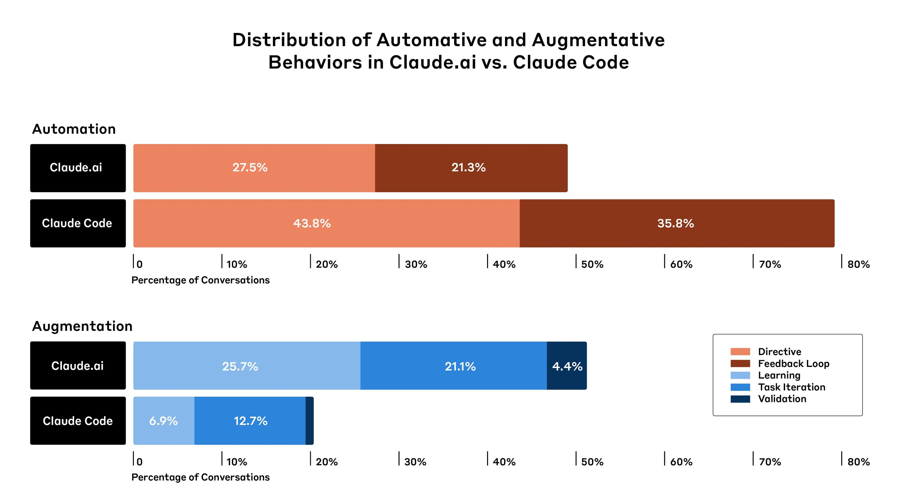
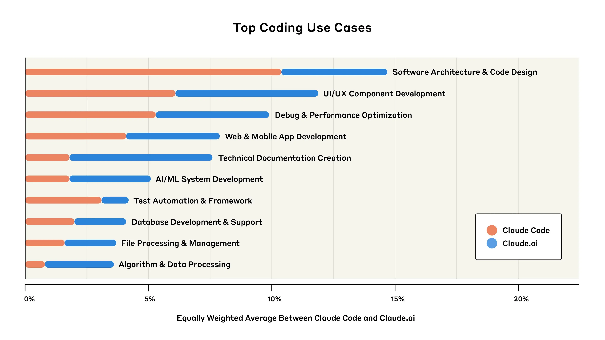
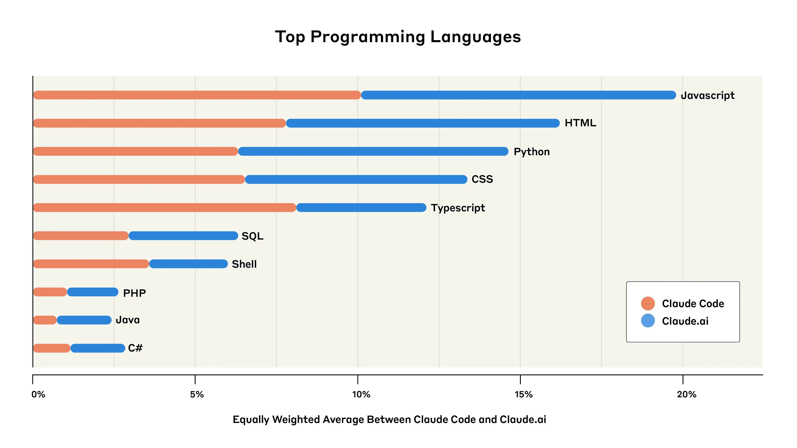
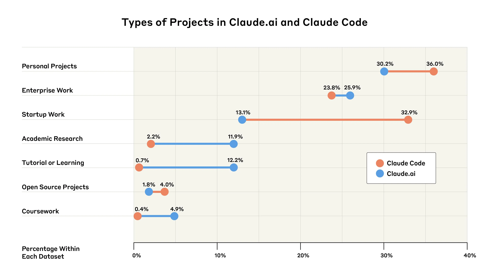
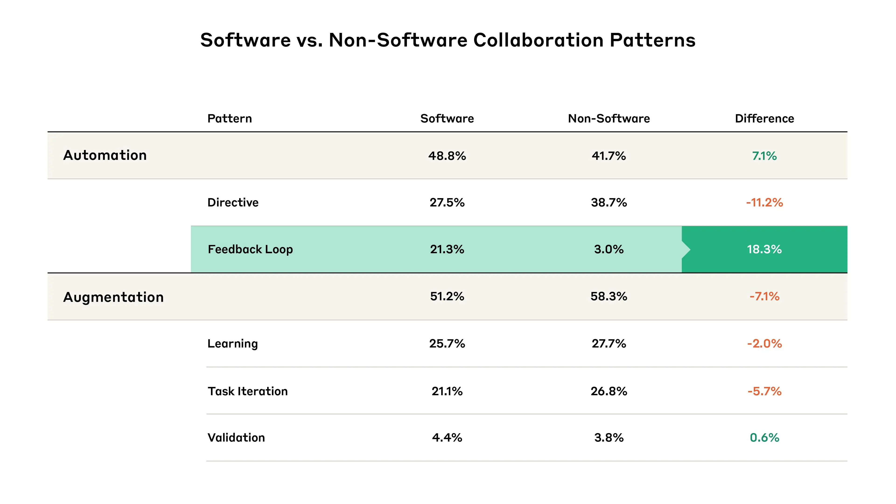

# Anthropic 经济指数：AI 对软件开发的影响（中英对照）

> 原文标题：Anthropic Economic Index: AI's impact on software development
> 原文链接：https://www.anthropic.com/research/impact-software-development
> 原文作者：Anthropic（基于 50 万条 Claude 真实交互；与 Clio 隐私保护分析）
> 发布日期：2025-04-28
> **翻译模型：** GLM-5.3-Flash
> **评分：** ★★★★★（5/5，必读）—— 首份 Claude Code vs Claude.ai 对照数据：智能体编码自动化率 79% vs 网页版 49%（指令式 43.8% vs 27.5%），前端/UI 任务占比最高或先受冲击，初创采用率 33% 远超企业 13%，软件开发被 AI 改造的第一手数据
> 排版：每段英文原文在前，中文翻译紧随其后。默认收录正文主体（含附录）。

---

Jobs that involve computer programming are a small sector of the modern economy, but an influential one. The past couple of years have seen them changed dramatically by the introduction of AI systems that can assist with—and automate—significant amounts of coding work.

涉及计算机编程的工作在现代经济中只是一小部分，却影响巨大。过去几年，能够辅助——并自动化——大量编码工作的 AI 系统的出现，使这些工作发生了剧变。

In our previous Economic Index research , we found very disproportionate use of Claude by US workers in computer-related occupations: that is, there were many more conversations with Claude about computer-related tasks than one would predict from the number of people working in relevant jobs. It’s the same in the educational context : Computer Science degrees—which involve large amounts of coding—show highly disproportionate AI use.

在此前的经济指数研究中，我们发现美国计算机相关职业的劳动者对 Claude 的使用极不成比例：也就是说，与 Claude 聊计算机相关任务的对话远多于按从业者人数预测的水平。教育领域也一样：涉及大量编码的计算机科学学位显示出极高的 AI 使用超额占比。

To understand these changes in more detail, we conducted an analysis of 500,000 coding-related interactions across Claude.ai (the “default” way that most people interact with Claude) and Claude Code (our new specialist coding “agent” that can independently accomplish chains of complex tasks using a variety of digital tools).

为更细致地理解这些变化，我们分析了 50 万条与编码相关的交互，横跨 Claude.ai（多数人使用 Claude 的「默认」方式）与 Claude Code（我们新的专业编码「智能体」，能借助各种数字工具独立完成复杂的任务链）。

We found three key patterns:
- The coding agent is used for more automation. 79% of conversations on Claude Code were identified as “automation”—where AI directly performs tasks—rather than “augmentation,” where AI collaborates with and enhances human capabilities (21%). In contrast, only 49% of Claude.ai conversations were classified as automation. This might imply that as AI agents become more commonplace, and as more agentic AI products are built, we should expect more automation of tasks.
- Coders commonly use AI to build user-facing apps. Web-development languages such as JavaScript and HTML were the most common programming languages used in our dataset, and user interface and user experience tasks were among the top coding uses. This suggests that jobs that center on making simple applications and user interfaces may face disruption from AI systems sooner than those focused purely on backend work .
- Startups are the main early adopters of Claude Code, while enterprises lag behind. In a preliminary analysis, we estimated that 33% of conversations on Claude Code served startup-related work, compared to only 13% identified as enterprise-relevant applications. The adoption gap suggests a divide between nimbler organizations using cutting-edge AI tools, and traditional enterprises.

我们发现了三个关键模式：
- 编码智能体被用于更多自动化。Claude Code 上 79% 的对话被识别为「自动化」——AI 直接执行任务——而非「增强」，即 AI 与人类协作、增强人类能力（21%）。相比之下，Claude.ai 的对话中只有 49% 被归为自动化。这可能意味着：随着 AI 智能体日益普及、更多智能体产品问世，我们应预期更多任务被自动化。
- 编码者常用 AI 构建面向用户的应用。JavaScript、HTML 等网页开发语言是我们数据集中最常见的编程语言，用户界面与用户体验任务位居编码用例前列。这提示：以制作简单应用和用户界面为核心的工作，可能比纯后端工作更早面临 AI 系统的冲击。
- 初创公司是 Claude Code 的主要早期采用者，企业则滞后。在初步分析中，我们估计 Claude Code 上 33% 的对话服务于初创相关工作，而只有 13% 被识别为企业相关应用。这一采用差距，显示出敏捷组织与传统企业之间的分野：前者在用前沿 AI 工具，后者踌躇不前。

## 我们如何分析 Claude Code 与 Claude.ai 上的对话（How we analyzed conversations on Claude Code and Claude.ai）

We analyzed the 500,000 total Claude interactions (split between Claude Code and Claude.ai[^1]) using our privacy-preserving analysis tool , which distills user conversations into higher-level, anonymized insights. Here, we used it to identify the topic of the conversation (e.g. “UI/UX component development”), or—as we’ll explain below—to categorize a conversation as focusing on “augmentation” versus “automation”.

我们用隐私保护分析工具分析了总共 50 万条 Claude 交互（在 Claude Code 与 Claude.ai 之间分配[^1]），该工具把用户对话提炼为更高层级的匿名洞见。这里我们用它识别对话主题（如「UI/UX 组件开发」），或者——如下文所述——把对话归类为「增强」还是「自动化」。

## 开发者如何与 Claude 交互？（How do developers interact with Claude?）

In our previous Economic Index reports, we separated out “automation,” where AI directly performs tasks, from “augmentation,” where AI collaborates with a user to perform a task. Here, we found that Claude Code showed dramatically higher automation rates—79% of conversations involved some form of automation, compared to 49% on Claude.ai.

在之前的经济指数报告中，我们把「自动化」（AI 直接执行任务）与「增强」（AI 与用户协作完成任务）分开统计。这里我们发现，Claude Code 的自动化率显著更高——79% 的对话涉及某种形式的自动化，而 Claude.ai 为 49%。

We also split automation and augmentation into several subtypes (as discussed in our previous work ). “Feedback Loop” patterns, where Claude completes tasks autonomously but with help of human validation (for example, where the user sends any errors back to Claude), were nearly twice as common on Claude Code (35.8% of interactions) as Claude.ai (21.3%). “Directive” conversations, where Claude completed a task with minimal user interaction, were also higher on Claude Code (43.8%, versus 27.5% on Claude.ai). All the patterns of augmentation—including “Learning,” where the user acquires knowledge from the AI model—were substantially lower on Claude Code than on Claude.ai.

我们还把自动化与增强细分为几个子类（如前作所述）。「反馈回路」（Feedback Loop）模式——Claude 自主完成任务但需人工验证（例如用户把报错发回给 Claude）——在 Claude Code 上（占交互的 35.8%）几乎是 Claude.ai（21.3%）的两倍。「指令式」（Directive）对话——Claude 以极少用户交互完成任务——在 Claude Code 上也更高（43.8%，Claude.ai 为 27.5%）。所有增强模式——包括用户从 AI 模型获取知识的「学习」（Learning）——在 Claude Code 上都显著低于 Claude.ai。

> Stacked bar chart showing the percentage of automation and augmentation on Claude.ai and Claude Code.

These results illustrate the differences between specialist, coding-focused agents (in this case, Claude Code) and the more “standard” way that users interact with large language models (i.e., through a chatbot interface like Claude.ai). As more agentic products are released, we might see differences in the way AI is integrated into people’s jobs. At least in the case of coding, this might involve more automation of tasks.

这些结果展示了专业编码智能体（此处为 Claude Code）与用户使用大语言模型的更「标准」方式（即通过 Claude.ai 这类聊天界面）之间的差异。随着更多智能体产品发布，我们可能会看到 AI 融入人们工作方式的分化。至少在编码这件事上，这可能意味着更多任务的自动化。

This raises questions about the extent to which developers will still be involved as AI use becomes more common. Importantly, our results do show that even within automation, humans are still very often involved: “Feedback Loop” interactions still require user input (even if that input is simply pasting error messages back to Claude). But it’s by no means certain that this pattern will persist into the future, when more capable agentic systems will likely require progressively less user input.

这引出一个问题：随着 AI 使用普及，开发者还会在多大程度上参与其中。重要的是，我们的结果确实显示，即便在自动化内部，人类仍经常参与：「反馈回路」交互仍需要用户输入（哪怕只是把报错信息粘贴回给 Claude）。但这一模式能否延续到未来绝非定局——能力更强的智能体系统可能需要越来越少的用户输入。

## 开发者在用 Claude 构建什么？（What are developers building with Claude?）

Overall, we found that developers commonly use Claude for building user interfaces and interactive elements for websites and mobile applications. Although no single language dominated, the primarily web-focused development languages of JavaScript and TypeScript together accounted for 31% of all queries, and HTML[^2] and CSS (other languages for user-facing code) together added another 28%.

总体而言，我们发现开发者常用 Claude 为网站与移动应用构建用户界面与交互元素。虽然没有哪种语言占绝对主导，但以网页为主的开发语言 JavaScript 与 TypeScript 合计占所有查询的 31%，HTML[^2] 与 CSS（其他面向用户的代码语言）合计再添 28%。

> Line graph showing top coding use cases used in Claude.

Back-end development languages (used for behind-the-scenes logic, databases, and infrastructure, as well as API and AI development) were also represented: notably, Python was at 14% of queries. However, Python serves dual purposes—both for back-end development and data analysis. Combined with SQL (another data-focused language, making up 6% of queries), these languages likely included many data science and analytics applications beyond traditional back-end development.

后端开发语言（用于幕后逻辑、数据库、基础设施以及 API 与 AI 开发）也有代表：值得注意的是 Python 占查询的 14%。但 Python 身兼两职——既做后端开发也做数据分析。加上 SQL（另一种以数据为核心的语言，占查询的 6%），这些语言中可能包含大量超出传统后端开发的数据科学与分析应用。

> Line graph showing top programming languages used in Claude.

These patterns further extend to the types of common coding tasks involving Claude. Two of the top five tasks were focused on user-facing app development: “UI/UX Component Development” and “Web & Mobile App Development” each accounted for 12% and 8% of conversations, respectively. Such tasks increasingly lend themselves to a phenomenon known as “vibe coding”—where developers of varying levels of experience describe their desired outcomes in natural language and let AI take the wheel on implementation details.

这些模式进一步延伸到涉及 Claude 的常见编码任务类型。前五大任务中有两个聚焦面向用户的应用开发：「UI/UX 组件开发」与「Web 与移动应用开发」分别占对话的 12% 与 8%。这类任务越来越适合一种被称为「氛围编程」（vibe coding）的现象——不同经验水平的开发者用自然语言描述期望结果，把实现细节交给 AI 掌舵。

Conversations that related to more generic uses, such as “Software Architecture & Code Design” and “Debug and Performance Optimization” were also highly represented in both Claude.ai and Claude Code.

与更通用用途相关的对话——如「软件架构与代码设计」「调试与性能优化」——在 Claude.ai 与 Claude Code 上也都占比很高。

Speculatively, these findings suggest that jobs that center on making simple applications and user interfaces might face earlier disruption from AI systems if increasing capabilities cause “vibe coding” to shift more into mainstream workflows. As AI increasingly handles component creation and styling tasks, these developers might shift toward higher-level design and user experience work.

推测而言，这些发现意味着：如果能力提升让「氛围编程」更多转入主流工作流，以制作简单应用和用户界面为核心的工作可能更早受到 AI 系统冲击。随着 AI 越来越多地处理组件创建与样式任务，这些开发者可能转向更高层的设计与用户体验工作。

## 谁在用 Claude 编码？（Who is using Claude for coding?）

We also analyzed which groups of developers might be using Claude. We used our analysis system to identify the type of project (e.g. a personal project vs. a project done for a startup) that best described users’ coding-related interactions. Because we don’t know the real-world context in which Claude’s responses were being used, these analyses rely on uncertain inferences from incomplete data. We therefore treat these findings as more preliminary than the ones described above.

我们还分析了哪些群体可能在使用 Claude。我们用分析系统识别最能描述用户编码相关交互的项目类型（如个人项目 vs 为初创公司做的项目）。由于我们不知道 Claude 回复被使用的真实世界情境，这些分析依赖基于不完整数据的不确定推断。因此我们把这一发现视为比前述结果更初步的东西。

> Graph showing types of projects in Claude.ai and Claude Code, with a list of different projects and the percentage of times they appeared in our dataset.

Startups appear to be the primary early adopters of Claude Code, and enterprise adoption lags behind. Startup work accounted for 32.9% of Claude Code conversations (nearly 20% higher than their Claude.ai usage), whereas enterprise work represented only 23.8% of Claude Code conversations (slightly below their 25.9% share on Claude.ai[^3]).

初创公司似乎是 Claude Code 的主要早期采用者，企业采用则滞后。初创工作占 Claude Code 对话的 32.9%（比其 Claude.ai 使用占比高出近 20 个百分点），而企业工作只占 Claude Code 对话的 23.8%（略低于其在 Claude.ai 上 25.9% 的份额[^3]）。

In addition, uses involving students, academics, personal project builders, and tutorial/learning users collectively represent half of the interactions across both platforms. In other words, individuals—not just businesses—are significant adopters of coding assistance tools.

此外，涉及学生、学者、个人项目构建者与教程/学习用户的用途合计占两个平台交互的一半。换句话说，个人——而不仅是企业——是编码辅助工具的重要采用者。

These adoption patterns mirror past technology shifts, where startups use new tools for competitive advantage while established organizations move more cautiously and often have detailed security checks in place before adopting new tools company-wide. AI's general-purpose nature could accelerate this dynamic: If AI agents provide significant productivity gains, the gap between early and late adopters could translate into substantial competitive advantages.

这些采用模式映照了过往的技术变迁：初创公司用新工具换取竞争优势，成熟组织则更为谨慎、往往在把新工具全公司铺开前设置详尽的安全审查。AI 的通用性可能加速这一动态：如果 AI 智能体带来显著的生产率提升，早采用者与晚采用者之间的差距可能转化为可观的竞争优势。

## 局限（Limitations）

Our analysis is grounded in real-world AI use—how developers are actually using Claude in their workflows. Although this approach gives our findings practical relevance, it also brings inherent limitations. These include:

我们的分析立足于真实世界的 AI 使用——开发者在工作流中实际如何使用 Claude。这种做法让发现具有现实相关性，但也带来固有局限，包括：

- We analyzed data from Claude.ai and Claude Code only. We excluded Team, Enterprise, and API usage that might show different patterns, particularly in professional settings;
- The boundary between automation and augmentation becomes increasingly blurred with agentic tools like Claude Code. For example, the “Feedback Loop” pattern differs qualitatively from traditional automation, because it still requires user supervision and input. We will likely need to extend the automation/augmentation framework to account for new agentic capabilities;
- Our categorization of who is using Claude for coding relied on inference from limited context. When categorizing conversations as “startup” versus “enterprise” work, or “personal” versus “academic” projects, our analysis tool made educated guesses based on incomplete information. Some classifications might therefore be incorrect. Additionally, we included an option for ‘Could Not Classify’, which Claude opted for in 5% of Claude.ai conversations and 2% of Claude Code conversations. We excluded this category from analysis and renormalized the results;
- Our dataset likely captures early adopters. These users might not represent the broader developer population, and this self-selection could skew usage patterns towards more experienced or technically adventurous users;
- Due to privacy considerations, we only analyzed data within a specific retention window, potentially missing cyclical patterns in software development (such as sprint cycles or release schedules);
- The representativeness of Claude usage is unclear, relative to overall AI coding assistance adoption. Many developers use multiple AI tools beyond Claude, meaning we present only a partial view of their AI engagement patterns;
- We only studied what developers delegate to AI—not how they ultimately use AI outputs in their codebase, the quality of the resulting code, or whether these interactions effectively improved productivity or code quality.

- 我们只分析了 Claude.ai 与 Claude Code 的数据，排除了可能呈现不同模式（尤其在专业场景中）的 Team、Enterprise 与 API 使用；
- 在 Claude Code 这类智能体工具下，自动化与增强的边界日益模糊。例如「反馈回路」模式与传统自动化有质的区别，因为它仍需用户监督与输入。我们很可能需要扩展自动化/增强框架，以涵盖新的智能体能力；
- 我们对「谁在用 Claude 编码」的分类依赖有限上下文的推断。在把对话归为「初创」还是「企业」工作、「个人」还是「学术」项目时，分析工具基于不完整信息做出有依据的猜测，部分分类可能有误。此外，我们设置了「无法分类」选项，Claude 在 5% 的 Claude.ai 对话与 2% 的 Claude Code 对话中选择了它。我们在分析中排除了该类别并对结果重新归一化；
- 我们的数据集捕捉的可能主要是早期采用者，未必代表更广的开发者群体，这种自选择可能把使用模式偏向更有经验或更爱尝鲜的用户；
- 出于隐私考虑，我们只分析了特定保留窗口内的数据，可能遗漏软件开发的周期性模式（如冲刺周期或发布排期）；
- 相对于整体 AI 编码辅助采用，Claude 使用的代表性不明。许多开发者除 Claude 外还使用多个 AI 工具，我们呈现的只是其 AI 使用模式的一部分；
- 我们只研究开发者把什么委托给 AI——而不研究他们最终如何在代码库中使用 AI 输出、生成代码的质量，或这些交互是否切实提升了生产率或代码质量。

## 展望（Looking ahead）

AI is fundamentally changing the ways developers work. Our analysis implies that this is particularly true where specialist agentic systems like Claude Code are used, is particularly strong for user-facing app development work, and might be giving particular advantages to startups as opposed to more established business enterprises.

AI 正在根本改变开发者的工作方式。我们的分析表明：在使用 Claude Code 这类专业智能体的场景中尤为如此；在面向用户的应用开发工作中表现尤为强劲；并且可能正让初创公司相对成熟企业获得特别的先发优势。

Our findings raise many questions. Will the prevalence of “feedback loops,” where humans are still involved in the process, persist as AI capabilities advance, or will we see a shift toward more complete automation? As AI systems become capable of building larger-scale pieces of software, will developers shift to mostly managing and guiding these systems, rather than writing code themselves? Which software development roles will change the most, and which might disappear entirely?

我们的发现引出许多问题：随着 AI 能力进步，人类仍参与其中的「反馈回路」会继续普遍存在，还是我们将看到向更彻底自动化的转变？当 AI 系统能够构建更大规模的软件时，开发者会转向主要管理和引导这些系统，而非亲自写代码吗？哪些软件开发角色会变化最大，哪些可能彻底消失？

The increasing coding skills of AI might also be especially consequential for AI development itself. Since so much of AI research and development relies on software, it’s possible that advancements in AI-assisted coding help to speed up breakthroughs, creating a positively-reinforcing cycle that accelerates AI progress even further.

AI 编码能力的提升，可能对 AI 开发本身尤为关键。既然 AI 研发如此依赖软件，AI 辅助编码的进步可能帮助加快突破，形成一个正反馈循环，进一步加速 AI 的进展。

In the grand scheme of things, AI systems are extremely new. But in a relative sense, coding is among the most developed uses of AI in the economy. That makes it worth watching. Although we can’t assume that the lessons we draw from software development will directly carry over to other types of occupation, software development might be a leading indicator that gives us useful information about how other occupations might change with the rollout of increasingly capable AI models in the future.

从大尺度看，AI 系统极其年轻。但相对而言，编码是经济中 AI 应用最成熟的领域之一，这使它值得关注。虽然我们不能假设从软件开发得出的经验会直接迁移到其他职业，但软件开发或许是一个领先指标，为「其他职业在未来随能力越来越强的 AI 模型铺开将如何变化」提供有用信息。

## 与我们合作（Work With Us）

If you’re interested in working at Anthropic to research the effects of AI on the labor market, we encourage you to apply for our Economist and Data Scientist (Policy) roles.

如果你有兴趣在 Anthropic 研究 AI 对劳动力市场的影响，欢迎申请我们的经济学家与数据科学家（政策）职位。

## 附录（Appendix）

As a supplementary analysis, we also compared our results for software-related automation and augmentation patterns to patterns in interactions that did not involve software. We conducted this analysis exclusively in Claude.ai, because Claude Code specializes in software applications.

作为补充分析，我们还把软件相关的自动化与增强模式，与不涉及软件的交互模式做了比较。由于 Claude Code 专注于软件应用，这一分析只在 Claude.ai 上进行。

> Table showing percentages of different patterns of AI use for software and non-software applications.

Compared to use cases that don’t involve software, software development is more automative. A significant increase in Feedback Loops (+18.3%) drives this and, notably, offsets a clear decrease in Directive behaviors (-11.2%). In other words, AI-assisted coding currently requires a lot of human reviewing and iteration relative to non-coding tasks, even when Claude does the bulk of the work.

与不涉及软件的用例相比，软件开发更具自动化色彩。反馈回路的大幅增加（+18.3%）是主因，并且值得注意的是，它抵消了指令式行为的明显减少（-11.2%）。换言之，与非编码任务相比，AI 辅助编码目前即便在 Claude 承担大部分工作的情况下，仍需要大量的人工审查与迭代。

---

## 脚注

[^1]: Claude.ai conversations were specifically those from Claude.ai Free and Pro. This sample only includes Claude Code sessions powered by the first-party API (Claude Code can be powered by Anthropic first-party APIs or third party cloud provider APIs). All conversations used in our analysis across Claude.ai and Claude Code were from April 6-13, 2025. The initial sample was split evenly across Claude.ai and Claude Code and for Claude.ai, we applied a Claude-based filter to select conversations related to coding. To account for the filter, we renormalized analyses to equally weight Claude Code and Claude.ai interactions, where applicable. / Claude.ai 对话特指免费版与 Pro 版的对话。该样本仅包含由一方 API 驱动的 Claude Code 会话（Claude Code 可由 Anthropic 一方 API 或第三方云服务商 API 驱动）。分析中用到的全部 Claude.ai 与 Claude Code 对话均来自 2025 年 4 月 6–13 日。初始样本在 Claude.ai 与 Claude Code 之间平均分配；对 Claude.ai，我们用基于 Claude 的过滤器挑选与编码相关的对话。为校正该过滤，我们在适用处重新归一化分析，使 Claude Code 与 Claude.ai 交互等权。

[^2]: The HTML numbers for Claude.ai are likely inflated slightly because Artifacts leverage HTML. While we filter out Artifacts that are unrelated to coding, we don’t explicitly filter out Artifacts that contain coding-related content from the analysis because significant coding usage happens within Artifacts. / Claude.ai 的 HTML 数字可能被略微高估，因为 Artifacts 使用 HTML。虽然我们滤掉了与编码无关的 Artifacts，但并未把包含编码内容的 Artifacts 明确排除在分析之外，因为相当多的编码使用发生在 Artifacts 中。

[^3]: Claude.ai usage does not include Claude For Work (Team and Enterprise plans) usage, which implies that enterprise numbers for Claude.ai specifically are likely undercounted because a significant amount of enterprise usage on Claude.ai occurs within the Claude For Work product. / Claude.ai 使用不含 Claude For Work（Team 与 Enterprise 套餐）的使用，这意味着 Claude.ai 的企业数字很可能被低估，因为 Claude.ai 上相当多的企业使用发生在 Claude For Work 产品内。
