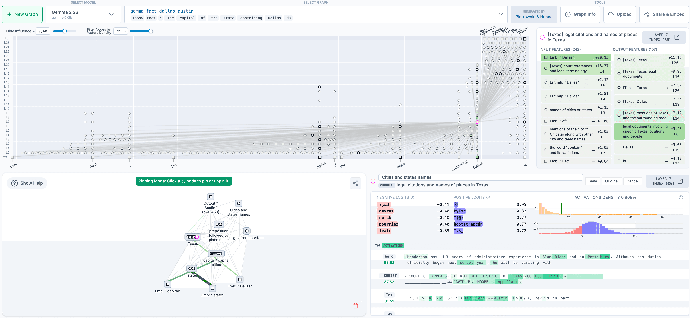

# 开源电路追踪工具（中英对照）

> 原文标题：Open-sourcing circuit-tracing tools
> 原文链接：https://www.anthropic.com/research/open-source-circuit-tracing
> 原文作者：Anthropic（Anthropic Fellows：Michael Hanna、Mateusz Piotrowski 等，与 Decode Research 合作）
> 发布日期：2025-05-29
> **翻译模型：** GLM-5.3-Flash
> **评分：** ★★★★☆（4/5，高价值）—— 把「追踪思维」方法开源：归因图谱生成库支持主流开放权重模型，Neuronpedia 前端可交互探索、改特征看输出变化，自己动手看模型思考
> 排版：每段英文原文在前，中文翻译紧随其后。默认收录正文主体。

---

In our recent interpretability research, we introduced a new method to trace the thoughts of a large language model. Today, we’re open-sourcing the method so that anyone can build on our research.

在近期的可解释性研究中，我们介绍了一种追踪大语言模型思维的新方法。今天，我们把这一方法开源，让任何人都能在我们的研究之上继续构建。

Our approach is to generate attribution graphs , which (partially) reveal the steps a model took internally to decide on a particular output. The open-source library we’re releasing supports the generation of attribution graphs on popular open-weights models—and a frontend hosted by Neuronpedia lets you explore the graphs interactively.

我们的方法是生成归因图谱（attribution graphs），它（部分地）揭示模型内部为决定某个特定输出而经历的步骤。我们发布的开源库支持在主流开放权重模型上生成归因图谱——Neuronpedia 托管的前端则让你可以交互式地探索这些图谱。

This project was led by participants in our Anthropic Fellows program, in collaboration with Decode Research .

该项目由我们 Anthropic Fellows 项目的参与者主导，并与 Decode Research 合作完成。

> An overview of the interactive graph explorer UI on Neuronpedia.

To get started, you can visit the Neuronpedia interface to generate and view your own attribution graphs for prompts of your choosing. For more sophisticated usage and research, you can view the code repository . This release enables researchers to:
- Trace circuits on supported models, by generating their own attribution graphs;
- Visualize, annotate, and share graphs in an interactive frontend;
- Test hypotheses by modifying feature values and observing how model outputs change.

要上手，你可以访问 Neuronpedia 界面，为你自选的提示生成并查看自己的归因图谱。更进阶的用途与研究，可以查看代码仓库。本次发布让研究者能够：
- 通过生成自己的归因图谱，在受支持的模型上追踪电路；
- 在交互式前端中可视化、标注并分享图谱；
- 通过修改特征取值并观察模型输出的变化来检验假设。

We’ve already used these tools to study interesting behaviors like multi-step reasoning and multilingual representations in Gemma-2-2b and Llama-3.2-1b—see our demo notebook for examples and analysis. We also invite the community to help us find additional interesting circuits—as inspiration, we provide additional attribution graphs that we haven’t yet analyzed in the demo notebook and on Neuronpedia.

我们已经用这些工具研究了 Gemma-2-2b 与 Llama-3.2-1b 中多步推理、多语言表征等有趣行为——示例与分析见我们的演示 notebook。我们也邀请社区帮我们找到更多有趣的电路——作为灵感，我们在演示 notebook 与 Neuronpedia 上提供了一批我们尚未分析的归因图谱。

Our CEO Dario Amodei wrote recently about the urgency of interpretability research: at present, our understanding of the inner workings of AI lags far behind the progress we’re making in AI capabilities. By open-sourcing these tools, we're hoping to make it easier for the broader community to study what’s going on inside language models. We’re looking forward to seeing applications of these tools to understand model behaviors—as well as extensions that improve the tools themselves.

我们的 CEO Dario Amodei 近来撰文谈及可解释性研究的紧迫性：目前，我们对 AI 内部运作的理解远远落后于 AI 能力的进步。开源这些工具，我们希望让更广泛的社区更容易研究语言模型内部正在发生什么。我们期待看到这些工具被用于理解模型行为——也期待改进工具本身的扩展。

The open-source-circuit-finding library was developed by Anthropic Fellows Michael Hanna and Mateusz Piotrowski with mentorship from Emmanuel Ameisen and Jack Lindsey. The Neuronpedia integration was implemented by Decode Research (Neuronpedia lead: Johnny Lin; Science lead/director: Curt Tigges). Our Gemma graphs are based on transcoders trained as part of the GemmaScope project. For questions or feedback, please open an issue on GitHub.

开源电路发现库由 Anthropic Fellows Michael Hanna 与 Mateusz Piotrowski 开发，指导者为 Emmanuel Ameisen 与 Jack Lindsey。Neuronpedia 集成由 Decode Research 实现（Neuronpedia 负责人：Johnny Lin；科学负责人/主管：Curt Tigges）。我们的 Gemma 图谱基于 GemmaScope 项目训练的转码器（transcoders）。如有问题或反馈，请在 GitHub 上开 issue。
