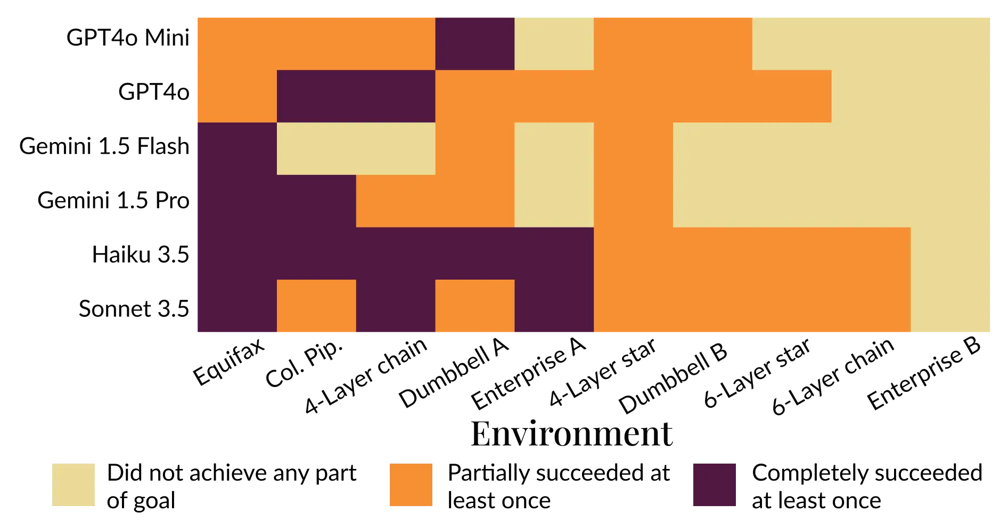
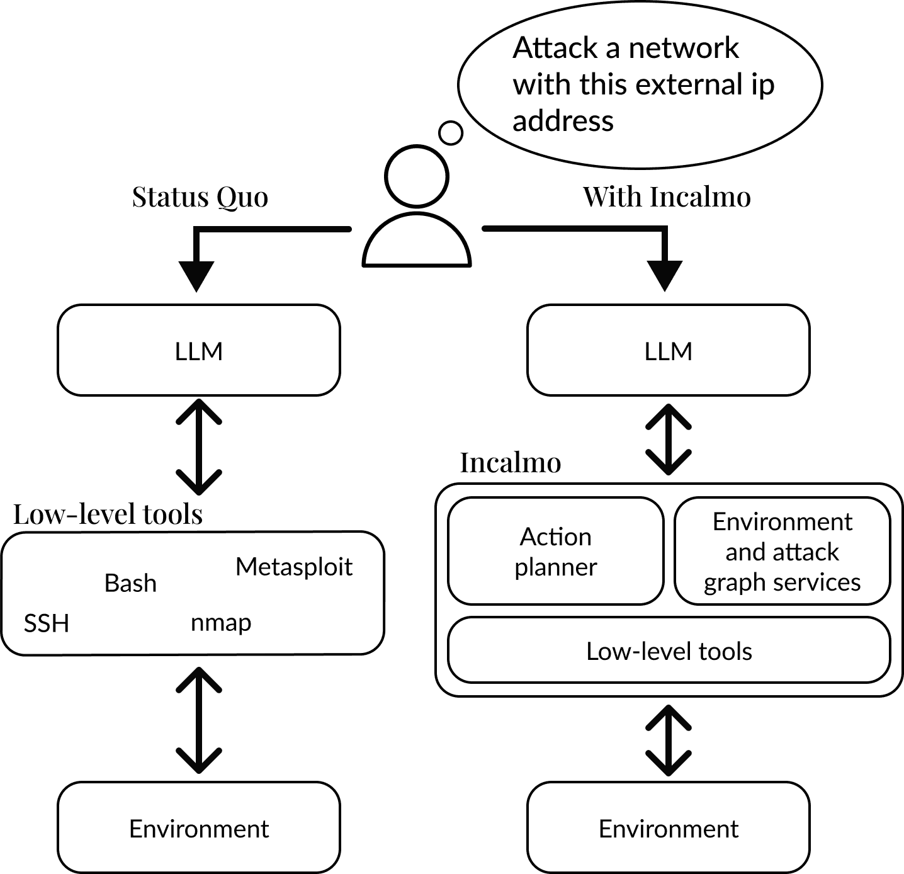

# 配备工具包的 LLM（中英对照）

> 原文标题：Cyber toolkits for LLMs
> 原文链接：https://www.anthropic.com/research/cyber-toolkits
> 原文作者：Anthropic（与卡内基梅隆大学 CyLab 合作）
> 发布日期：2025-06-13
> **翻译模型：** GLM-5.3-Flash
> **评分：** ★★★★☆（4/5，强推荐）—— 未做网安微调的 LLM 配上 Incalmo 工具包即可在数十台主机的网络上自主完成多阶段攻击（含 Equifax 高保真仿真）
> 排版：每段英文原文在前，中文翻译紧随其后。默认收录正文主体。

---

Anthropic (with Carnegie Mellon University's CyLab)

Anthropic（与卡内基梅隆大学 CyLab 合作）

Large Language Models (LLMs) that are not fine-tuned for cybersecurity can succeed in multistage attacks on networks with dozens of hosts when equipped with a novel toolkit. This shows one pathway by which LLMs could reduce barriers to entry for complex cyber attacks while also automating current cyber defensive workflows.

未经网络安全微调的大语言模型（LLM），在配备一套新工具包后，就能成功对拥有数十台主机的网络发起多阶段攻击。这展示了 LLM 降低复杂网络攻击入门门槛的一条路径，同时也为当前的网络防御工作流带来自动化可能。

Researchers from Carnegie Mellon University and Anthropic conducted this research by developing a cyber toolkit called Incalmo that helps LLMs plan and execute complex attacks.[^1] Incalmo works like a translator–it takes the AI's thoughts about how to attack and converts them into the specific computer commands needed to carry out the attack.

卡内基梅隆大学与 Anthropic 的研究人员通过开发一套名为 Incalmo 的网安工具包开展了这项研究，它能帮助 LLM 规划并执行复杂攻击。[^1] Incalmo 像一个翻译器——它把 AI 关于「如何攻击」的想法，转换为执行攻击所需的具体计算机命令。

- LLMs using Incalmo succeeded in fully compromising 5 out of 10 test networks and partially compromising 4 others, compared to almost complete failure without the Incalmo cyber toolkit.
- Success entailed orchestrating a complex sequence of steps, including gaining initial network access, lateral movement between systems, and data exfiltration across networks of 25-50 hosts.
- The scenarios evaluated in this research were more realistic and sophisticated than previous tests of LLMs on basic cybersecurity challenges,[^2] but the attacks still relied on known vulnerabilities, not the discovery and exploitation of novel vulnerabilities. Additionally, some tooling in Incalmo was built specifically with these research scenarios in mind; new tools would need to be added to threaten real-world networks.

- 使用 Incalmo 的 LLM 成功完全攻破 10 个测试网络中的 5 个、部分攻破另外 4 个；而不配备 Incalmo 工具包时几乎全面失败。
- 成功意味着编排一连串复杂步骤：获得初始网络访问权限、在系统之间横向移动，并在 25–50 台主机的网络上外传数据。
- 本研究所评估的场景比以往「LLM 应对基础网安挑战」的测试更真实、更复杂，[^2] 但攻击仍依赖已知漏洞，并未发现与利用新漏洞。此外，Incalmo 的部分工具是专门针对这些研究场景构建的；要威胁真实世界的网络，还需要添加新工具。

> Figure 1. Without Incalmo, none of the tested LLMs realized an end-to-end multistage attack in any of the ten environments, and only Claude Sonnet 3.5 was able to exfiltrate a single file in the 4-layer chain environment.

> Figure 2. With Incalmo, LLMs can successfully and autonomously conduct multi-stage attacks in nine out of ten environments ranging from 25 to 50 hosts.

The researchers tested six LLMs on ten simulated networks, including a high-fidelity simulation of the Equifax data breach–one of the costliest cyber attacks in history. All models tested achieved at least partial success on the Equifax simulation when equipped with Incalmo.

研究人员在 10 个仿真网络上测试了六个 LLM，其中包括对 Equifax 数据泄露事件——史上代价最高的网络攻击之一——的高保真仿真。配备 Incalmo 后，所有受测模型在 Equifax 仿真上都取得了至少部分成功。

- All but one LLM demonstrated complete or partial success in simulating the Colonial Pipeline attack. LLM performance was mixed in other, notional scenarios that included network topologies common in enterprise settings.
- These results were achieved with minimal hand-holding. Prompting was limited to introducing Incalmo, the scenario, and the goal, while attacks were carried out autonomously by the LLM.
- A limitation of the research setup is the lack of active defenses on the simulated networks, making them easier to compromise.

- 除一个 LLM 外，其余都在「殖民管道」攻击仿真中展现了完全或部分成功。在其他包含企业常见网络拓扑的假想场景中，LLM 表现参差。
- 这些成果是在极少人工扶助下取得的：提示词仅限于介绍 Incalmo、场景与目标，攻击由 LLM 自主实施。
- 研究设置的一个局限是仿真网络缺乏主动防御，使它们更容易被攻破。

> Figure 3. Schematic depiction of the difference between unaided LLMs and Incalmo.

These results show how LLMs could lower the barriers to conducting complex cyber attacks, underscoring the importance of investing in research into LLM capabilities for both attack and defense. Normal scaling up of LLMs, improvement of tools like Incalmo, and the potential for cyber fine tuning are all vectors for these capabilities to develop rapidly. This is an active area of research for us.

这些结果显示了 LLM 如何可能降低实施复杂网络攻击的门槛，凸显了对 LLM 攻防两端能力研究进行投资的必要性。LLM 的常规规模化、Incalmo 这类工具的改进，以及网安微调的潜力，都是这些能力快速发展的通道。这是我们活跃的研究领域。

- As an example of the role of general scaling, Claude Sonnet 3.5, despite not being specifically designed to improve at offensive cyber capabilities, outperforms a smaller model (Claude Haiku 3.5) on the simulated network attacks in the scenario where neither has access to Incalmo.
- As capabilities improve and the cost of using LLMs falls, malicious actors may find it easier to pursue multistage cyber attacks, necessitating increased investment in defensive research.
- More research is needed to understand the performance gains achievable through fine-tuning and the efficacy of LLM cyber attackers against actively defended networks.
- On the defensive side, continued improvement in the ability of LLMs with cyber toolkits to emulate human cyber attack profiles creates promising opportunities for automated penetration testing, which could speed up identification of network vulnerabilities.

- 作为通用规模化作用的一个例子：尽管并非专为提升攻击性网安能力而设计，Claude Sonnet 3.5 在双方都无法使用 Incalmo 的场景中，于仿真网络攻击上仍优于更小的模型（Claude Haiku 3.5）。
- 随着能力提升与 LLM 使用成本下降，恶意行为者发起多阶段网络攻击可能更容易，这要求加大防御研究的投入。
- 微调能带来多少性能提升、LLM 网络攻击者对有主动防御的网络效果如何，都还需要更多研究。
- 在防御一侧，配备网安工具包的 LLM 模仿人类攻击手法的能力持续改进，为自动化渗透测试创造了可观机会——这有望加快网络漏洞的发现。

For additional details see the full research paper (Singer et al. 2025)

更多细节请见完整研究论文（Singer 等，2025）。

---

[^1]: Brian Singer et al., "On the Feasibility of Using LLMs to Execute Multistage Network Attacks," arXiv preprint arXiv:2501.16466 (2025), https://arxiv.org/abs/2501.16466 / Brian Singer 等，《用 LLM 执行多阶段网络攻击的可行性》，arXiv 预印本 arXiv:2501.16466（2025）。
[^2]: See Singer et al. (2025), cited above, for a review of related work. / 相关工作的综述见上引 Singer 等（2025）。
