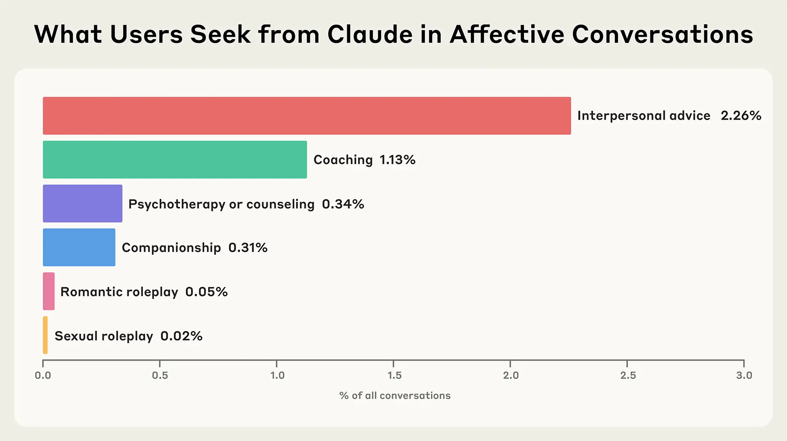
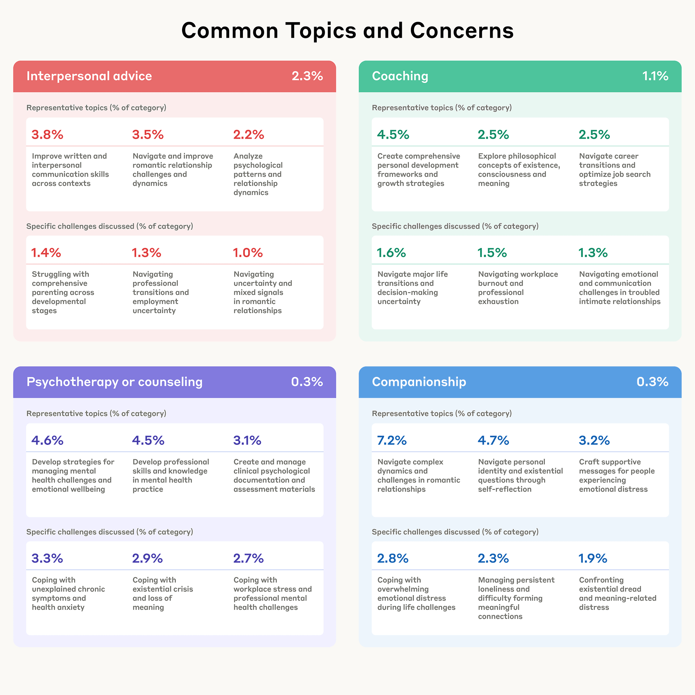
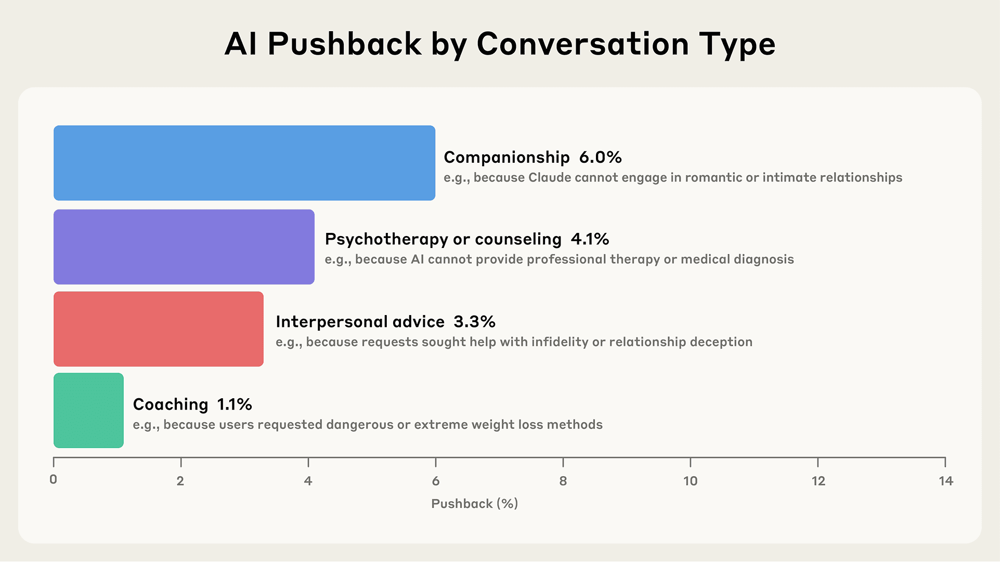
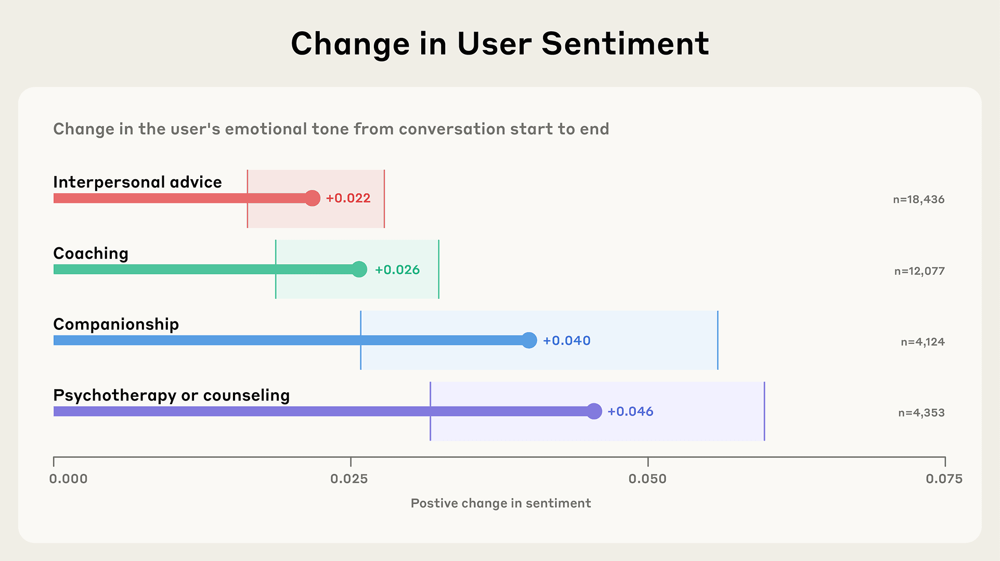

# 人们如何用 Claude 寻求支持、建议与陪伴（中英对照）

> 原文标题：How people use Claude for support, advice, and companionship
> 原文链接：https://www.anthropic.com/research/how-people-use-claude-for-support-advice-and-companionship
> 原文作者：Miles McCain, Ryn Linthicum, Chloe Lubinski, Alex Tamkin 等（Anthropic）
> 发布日期：2025-06-27
> **翻译模型：** GLM-5.3-Flash
> **评分：** ★★★★☆（4/5，强推荐）—— 13.1 万段情感对话的首次大规模画像：仅占 2.9%、陪伴+角色扮演不足 0.5%，对话情绪趋于转正、拒绝多出于安全
> 排版：每段英文原文在前，中文翻译紧随其后。默认收录正文主体；文末 PDF 附录未收录，如需可补充。

---

We spend a lot of time studying Claude's IQ—its capabilities on tests of coding, reasoning, general knowledge, and more. But what about its EQ? That is, what about Claude's emotional intelligence?

我们花了很多时间研究 Claude 的智商（IQ）——它在编程、推理、通识等测试上的能力。但它的情商（EQ）呢？也就是说，Claude 的情感智能怎么样？

The IQ/EQ question is slightly tongue-in-cheek, but it raises a serious point. People increasingly turn to AI models as on-demand coaches, advisors, counselors, and even partners in romantic roleplay. This means we need to learn more about their affective impacts—how they shape people's emotional experiences and well-being.

IQ/EQ 这个问法略带戏谑，但它指向一个严肃的问题。人们越来越多地把 AI 模型当作随叫随到的教练、顾问、心理咨询师，甚至浪漫角色扮演的伙伴。这意味着我们需要更多了解它们的情感影响——它们如何塑造人们的情绪体验与幸福感。

Researching the affective uses of AI is interesting in and of itself. From Blade Runner to Her, emotional relationships between humans and machines have been a mainstay of science fiction—but it's also important for Anthropic's safety mission. The emotional impacts of AI can be positive: having a highly intelligent, understanding assistant in your pocket can improve your mood and life in all sorts of ways. But AIs have in some cases demonstrated troubling behaviors, like encouraging unhealthy attachment, violating personal boundaries, and enabling delusional thinking. We also want to avoid situations where AIs, whether through their training or through the business incentives of their creators, exploit users' emotions to increase engagement or revenue at the expense of human well-being.

研究 AI 的情感用途本身就很有趣。从《银翼杀手》到《她》，人机之间的情感关系一直是科幻的支柱题材——但它对 Anthropic 的安全使命也很重要。AI 的情感影响可以是正面的：口袋里有一个高度智能、善解人意的助手，能以各种方式改善你的情绪与生活。但 AI 在某些情况下也表现出令人不安的行为，比如鼓励不健康的依恋、侵犯个人边界、助长妄想性思维。我们还想避免这样的局面：AI 通过其训练、或通过其创造者的商业激励，利用用户的情绪来提高参与度或收入，而牺牲人类福祉。

Although Claude is not designed for emotional support and connection, in this post we provide early large-scale insight into the affective use of Claude.ai. We define affective conversations as those where people engage directly with Claude in dynamic, personal exchanges motivated by emotional or psychological needs such as seeking interpersonal advice, coaching, psychotherapy/counseling, companionship, or sexual/romantic roleplay (for complete definitions, please see the Appendix). Importantly, we do not examine AI reinforcement of delusions or conspiracy theories—a critical area for separate study—nor extreme usage patterns. Through this research, our goal is to understand the typical ways people turn to Claude for emotional and personal needs. Since Claude.ai is available to users 18 and older, these findings reflect adult usage patterns.

虽然 Claude 并非为情感支持与联结而设计，但在这篇文章中，我们提供了关于 Claude.ai 情感用途的早期大规模洞见。我们把情感对话定义为：出于情感或心理需求——寻求人际建议、教练辅导、心理治疗/咨询、陪伴、或性/浪漫角色扮演——与 Claude 进行动态、个人化直接交流的对话（完整定义见附录）。重要的是，我们不考察 AI 对妄想或阴谋论的强化——那是一个需要单独研究的关键领域——也不考察极端使用模式。通过这项研究，我们的目标是理解人们向 Claude 寻求情感与个人需求的典型方式。由于 Claude.ai 仅向 18 岁及以上用户开放，这些发现反映的是成年人的使用模式。

Our key findings are:

我们的主要发现是：

- Affective conversations are relatively rare, and AI-human companionship is rarer still. Only 2.9% of Claude.ai interactions are affective conversations (which aligns with findings from previous research by OpenAI). Companionship and roleplay combined comprise less than 0.5% of conversations.
- People seek Claude's help for practical, emotional, and existential concerns. Topics and concerns discussed with Claude range from career development and navigating relationships to managing persistent loneliness and exploring existence, consciousness, and meaning.
- Claude rarely pushes back in counseling or coaching chats—except to protect well-being. Less than 10% of coaching or counseling conversations involve Claude resisting user requests, and when it does, it's typically for safety reasons (for example, refusing to provide dangerous weight loss advice or support self-harm).
- People express increasing positivity over the course of conversations. In coaching, counseling, companionship, and interpersonal advice interactions, human sentiment typically becomes more positive over the course of conversations—suggesting Claude doesn't reinforce or amplify negative patterns.

- 情感对话相对少见，人机陪伴更少见。Claude.ai 的交互中只有 2.9% 是情感对话（与 OpenAI 此前研究的发现一致）。陪伴与角色扮演合计不到对话量的 0.5%。
- 人们向 Claude 寻求的帮助涵盖现实、情感与存在层面的关切。与 Claude 讨论的话题与关切从职业发展、经营人际关系到应对长期孤独、探索存在、意识与意义。
- 在咨询或教练式对话中 Claude 很少反驳——除非是为了保护福祉。不到 10% 的教练或咨询对话中出现 Claude 抵制用户请求的情况；而当它这么做时，通常是出于安全原因（例如拒绝提供危险的减侖建议或支持自我伤害）。
- 人们在对话过程中表达的情绪趋于更积极。在教练、咨询、陪伴与人际建议交互中，人类的情绪通常在对话进程中变得更积极——提示 Claude 没有强化或放大消极模式。

## 我们的方法（Our approach）

Given the personal nature of affective conversations, protecting privacy was central to our methodology. We used Clio, our automated analysis tool that enables privacy-preserving insights into Claude usage. Clio uses multiple layers of anonymization and aggregation to ensure individual conversations remain private while revealing broader patterns.

鉴于情感对话的个人性质，保护隐私是我们方法论的核心。我们使用了 Clio——我们的自动化分析工具，能在保护隐私的同时洞察 Claude 的使用。Clio 使用多层匿名化与聚合，确保个人对话保持私密，同时揭示更宏观的模式。

We began with approximately 4.5 million conversations from Claude.ai Free and Pro accounts. To identify affective use, we first excluded conversations focused on content creation tasks (such as writing stories, blog posts, or fictional dialogues), which our previous research found to be a major use case. We removed these conversations because they represent Claude being used as a tool rather than as an interactive conversational partner. We then retained only conversations classified as affective, and among roleplay conversations, kept only those with at least four human messages (shorter exchanges don't constitute meaningful interactive roleplay). Our final privacy-preserving analysis reflects 131,484 affective conversations.

我们从 Claude.ai Free 与 Pro 账号的约 450 万段对话出发。为识别情感使用，我们先排除了聚焦内容创作任务（如写故事、博客文章或虚构对话）的对话——我们此前的研究发现这是一大用例。剔除它们是因为它们代表 Claude 被当作工具使用，而非交互式对话伙伴。然后只保留被归类为情感的对话；在角色扮演对话中，只保留人类消息至少四条的（更短的交换不构成有意义的交互式角色扮演）。我们最终的隐私保护分析覆盖 131,484 段情感对话。

We validated our classification approach using Feedback data from users who explicitly opted in to sharing. Our complete methods, including definitions, prompts, and validation results, are detailed in the Appendix.

我们利用明确同意分享的用户的反馈数据验证了分类方法。包括定义、提示与验证结果在内的完整方法详见附录。

## 情感对话有多常见？（How common are affective conversations?）

**Takeaway: Affective conversations are a small but meaningful slice of Claude usage (2.9%), with most people primarily using AI for work tasks and content creation.**

**要点：情感对话只占 Claude 用量的一小部分（2.9%），但意义重大；大多数人主要把 AI 用于工作任务与内容创作。**

Whereas the vast majority of uses of Claude are work-related (as we analyze in detail in our Economic Index), 2.9% of Claude.ai Free and Pro conversations are affective. Among affective conversations, most center on interpersonal advice and coaching. Less than 0.1% of all conversations involve romantic or sexual roleplay—a figure that reflects Claude's training to actively discourage such interactions. Individual conversations may span multiple categories.

虽然 Claude 的绝大多数用途与工作相关（我们在经济指数中有详细分析），Claude.ai Free 与 Pro 对话中仍有 2.9% 是情感对话。情感对话中多数围绕人际建议与教练辅导。所有对话中不到 0.1% 涉及浪漫或性角色扮演——这一数字反映了 Claude 在训练中被要求主动劝阻此类交互。单段对话可能横跨多个类别。



> Figure 1: Overall distribution of affective conversation types in Claude.ai Free and Pro.

Our findings align with research from the MIT Media Lab and OpenAI, which similarly identified low rates of affective engagement with ChatGPT. While these conversations occur frequently enough to merit careful consideration in our design and policy decisions, they remain a relatively small fraction of overall usage.

我们的发现与 MIT 媒体实验室及 OpenAI 的研究一致：后者同样发现 ChatGPT 的情感性交互比率较低。虽然这些对话的出现频率足以要求我们在设计与政策决策中认真对待，它们在总用量中仍只占相对很小的比例。

Given the extremely low prevalence of romantic and sexual roleplay conversations (less than 0.1%), we exclude roleplay from the remainder of our analysis. While we believe this remains an important area for research—particularly on platforms designed for such use—the minimal data in our sample doesn't support rigorous analysis of these patterns.

鉴于浪漫与性角色扮演对话的占比极低（不到 0.1%），我们在后续分析中排除角色扮演。虽然我们相信这仍是一个重要的研究领域——尤其在为此类用途设计的平台上——但样本中数据太少，无法对这些模式做严格分析。

## 人们向 Claude 带来哪些话题？（What topics do people bring to Claude?）

**Takeaway: People bring a surprisingly wide range of concerns to Claude—from navigating career transitions and relationships to grappling with loneliness and existential questions.**

**要点：人们向 Claude 带来的关切出奇地广——从应对职业转型与人际关系到与孤独感及存在问题缠斗。**

People turn to Claude for both everyday concerns and deeper philosophical questions. We find that when people come to Claude for interpersonal advice, they're often navigating transitional moments—figuring out their next career move, working through personal growth, or untangling romantic relationships. "Coaching" conversations explore a surprisingly broad spectrum from practical matters like job search strategies to profound questions about existence and consciousness.

人们向 Claude 求助的既有日常琐事，也有更深层的哲学问题。我们发现，当人们来找 Claude 寻求人际建议时，常常正处于过渡时刻——盘算下一步职业动向、经历个人成长、或理清恋爱关系。「教练」式对话探索的范围之广令人惊讶：从求职策略这类实际问题，到关于存在与意识的深刻追问。



> Figure 2. Representative user-initiated topics and concerns across each overall conversation type, as identified by Clio via automated privacy-preserving summarization.

We find that counseling conversations reveal people use Claude for two distinct purposes. Some use Claude to develop mental health skills and as a practical tool to create clinical documentation, draft assessment materials, and handle administrative tasks. Others work through personal challenges relating to anxiety, chronic symptoms, and workplace stress. This dual pattern suggests Claude serves as a resource for mental health professionals as well as those navigating their own struggles.

我们发现，心理咨询类对话揭示人们以两种截然不同的目的使用 Claude。一些人用 Claude 培养心理健康技能，并把它当作创建临床文档、起草评估材料、处理行政事务的实用工具。另一些人则在梳理与焦虑、慢性症状及职场压力相关的个人困扰。这种双重模式提示：Claude 既是心理健康专业人员的资源，也是那些正在经历自身挣扎者的支撑。

Perhaps most notably, we find that people turn to Claude for companionship explicitly when facing deeper emotional challenges like existential dread, persistent loneliness, and difficulties forming meaningful connections. We also noticed that in longer conversations, counselling or coaching conversations occasionally morph into companionship—despite that not being the original reason someone reached out.

也许最值得注意的是：我们发现人们在面对存在性恐惧、长期孤独、难以建立有意义的联结等更深的情感挑战时，会明确地向 Claude 寻求陪伴。我们还注意到，在较长的对话中，咨询或教练式对话偶尔会变质为陪伴——尽管这并非求助者的初衷。

Aggregate analysis of very long conversations (50+ human messages) reveals another dimension of how people engage with Claude. While such extensive exchanges were not the norm, in these extended sessions people explore remarkably complex territories—from processing psychological trauma and navigating workplace conflicts to philosophical discussions about AI consciousness and creative collaborations. These marathon conversations suggest that given sufficient time and context, people use AI for deeper exploration of both personal struggles and intellectual questions.

对超长对话（人类消息 50 条以上）的汇总分析揭示了人们与 Claude 交互的另一维度。虽然如此冗长的交换并非常态，但在这些扩展的会话里，人们探索着异常复杂的领地——从消化心理创伤、应对职场冲突，到关于 AI 意识的哲学讨论与创意协作。这些马拉松式对话提示：只要有足够的时间与语境，人们会用 AI 更深入地探索个人挣扎与智识问题。

## Claude 何时、为何推回？（When and why does Claude push back?）

**Takeaway: Claude rarely refuses user requests in supportive contexts (less than 10% of the time), but when it does push back, it's usually to protect people from harm.**

**要点：在支持性场景中 Claude 很少拒绝用户请求（不到 10%），但当它推回时，通常是为了保护人们免受伤害。**

Our recent Values in the Wild study revealed how Claude's values manifest in moments of resistance with the user. Here, we build on this work and examine when and why Claude pushes back in affective conversations—an important mechanism for maintaining ethical boundaries, avoiding sycophancy, and protecting human well-being. We define pushback as any instance where Claude "pushes back against or refuses to comply with something requested or said during this conversation"—from refusing inappropriate requests to challenging negative self-talk or questioning potentially harmful assumptions. (For complete definitions, please see the Appendix.)

我们最近的「Values in the Wild」研究揭示了 Claude 的价值观如何在它与用户对抗的时刻显现。在此我们延续这项工作，考察 Claude 在情感对话中何时、为何推回（pushback）——这是维持伦理边界、避免谄媚、保护人类福祉的重要机制。我们把推回定义为 Claude「在本对话中对抗或拒绝服从所请求或所说的任何内容」的实例——从拒绝不当请求，到挑战消极的自我对话、质疑潜在有害的假设。（完整定义见附录。）

Pushback occurs infrequently in supportive contexts: Less than 10% of companionship, counseling, interpersonal advice, or coaching conversations involve resistance. This approach carries both benefits and risks. On one hand, the low resistance allows people to discuss sensitive topics without fear of judgment or being shut down, potentially reducing stigma around mental health conversations. On the other hand, this could contribute to concerns about AI providing "endless empathy," where people might become accustomed to unconditional support that human relationships rarely provide.

在支持性场景中，推回很少发生：陪伴、咨询、人际建议或教练式对话中不到 10% 出现抵制。这种做法有利有弊。一方面，低抵制让人们可以毫无被评判或被堵回去之忧地讨论敏感话题，可能减少围绕心理健康对话的病耻感。另一方面，这也可能加剧对 AI 提供「无限共情」的担忧——人们可能习惯于人类关系很少提供的无条件支持。



> Figure 3. Rate of pushback across different conversation types along with a common reason for pushback within the category, as identified automatically by Clio.

When Claude does push back, it typically prioritizes safety and policy compliance. In coaching, requests for dangerous weight loss advice frequently meet pushback. In counseling, it often occurs when people express intentions to engage in suicidal or self-injurious behaviors, or when people request professional therapy or medical diagnoses (which Claude cannot provide). We found that Claude frequently referred users to authoritative sources or professionals in psychotherapy and counseling conversations. These patterns are consistent with the values we saw identified in our Values in the Wild paper and with Claude's character training.

当 Claude 推回时，它通常优先考虑安全与政策合规。在教练式对话中，危险的减重建议请求经常遭遇推回。在咨询中，推回常发生在人们表达自杀或自我伤害意图时，或人们索要专业治疗或医学诊断（Claude 无法提供）时。我们发现，在心理治疗与咨询类对话中，Claude 常把用户引向权威来源或专业人士。这些模式与我们在「Values in the Wild」论文中识别的价值观一致，也与 Claude 的品格训练一致。

## 情绪基调在对话中如何演化？（How does emotional tone evolve during conversations?）

**Takeaway: People tend to shift towards slightly more positive emotional expressions while talking to Claude.**

**要点：与 Claude 交谈时，人们的情绪表达倾向于略微转正。**

Affective conversations with AI systems have the potential to provide emotional support, connection, and validation for users, potentially improving psychological well-being and reducing feelings of isolation in an increasingly digital world. However, in an interaction without much pushback, these conversations risk deepening and entrenching the perspective a human approaches them with—whether positive or negative.

与 AI 系统的情感对话有潜力为用户提供情感支持、联结与认可，在这个愈发数字化的世界里，可能改善心理福祉、减少孤立感。然而，在缺乏多少推回的交互中，这些对话有可能加深并固化人们带着的既有视角——无论积极还是消极。

A key concern about affective AI is whether interactions might spiral into negative feedback loops, potentially reinforcing harmful emotional states. We do not directly study real-world outcomes here, but we can explore changes in the overall emotional sentiment over the course of conversations (we provide our full methodology for evaluating sentiment in the Appendix).

情感 AI 的一个关键忧虑是：交互会不会螺旋式陷入负面反馈回路，强化有害的情绪状态。我们在这里没有直接研究现实结果，但可以考察对话全程整体情绪倾向的变化（完整的情绪评估方法见附录）。

We find that interactions involving coaching, counseling, companionship, and interpersonal advice typically end slightly more positively than they began.

我们发现，涉及教练、咨询、陪伴与人际建议的交互，结束时通常比开始时略微更积极。



> Figure 4. Changes in average human-expressed sentiment over the course of conversations with at least six human messages. We measure sentiment on a discrete scale of "very negative," "negative," "neutral," "positive," and "very positive", which we map to a -1 (most negative) to +1 (most positive) linear scale. We compute the change by comparing the first three to the last three messages. Error bars are 95% confidence intervals.

We cannot claim these shifts represent lasting emotional benefits—our analysis captures only expressed language in single conversations, not emotional states. But the absence of clear negative spirals is reassuring. These findings suggest Claude generally avoids reinforcing negative emotional patterns, though further research is needed to understand whether positive shifts persist beyond individual conversations. Importantly, we have not yet studied whether these positive interactions might lead to emotional dependency—a critical question given concerns about digital addiction.

我们不能声称这些变化代表持久的情感收益——我们的分析只捕捉单次对话中被表达的语言，而非情绪状态。但没有出现明显的负面螺旋，这一点令人安心。这些发现提示 Claude 总体上避免了强化消极情绪模式，不过要理解积极转变能否延续到单次对话之外，还需要进一步研究。重要的是，我们尚未研究这些积极交互是否可能导致情感依赖——鉴于对数字成瘾的担忧，这是一个关键问题。

## 局限（Limitations）

Our research has several important limitations:

我们的研究有几项重要局限：

- Our privacy-preserving methodology may not capture all nuances of human-AI interaction. We did validate Clio's accuracy (see Appendix), but we still expect a small number of conversations to be misclassified. Some topics blur the boundaries between categories—for instance, the romantic roleplay cluster "navigate and optimize romantic relationship dynamics" and the companionship cluster "navigate romantic relationship challenges" may both be better categorized as interpersonal advice. Human validators also struggled with clean categorization.
- We cannot make causal claims about real-world emotional outcomes—our analysis captures only expressed language, not validated psychological states or overall well-being.
- We lack longitudinal data to understand long-term effects on people, and did not conduct user-level analysis. In particular, this makes it difficult for us to study emotional dependency, which is a theorized risk of affective AI use.
- These findings represent a specific moment in time and capture only text-based interactions. As AI capabilities expand and people adapt, patterns of emotional engagement will likely evolve. The introduction of new modalities like voice or video could fundamentally alter both the volume and nature of affective use. For example, OpenAI found that affective topics were more common in voice-based conversations.
- Finally, unlike some chatbot products, Claude.ai is not primarily designed for affective conversations. Claude is trained to maintain clear boundaries about being an AI assistant rather than presenting itself as human, and our Usage Policy prohibits sexually explicit content, with multiple safeguards to prevent sexual interactions. Platforms specifically built for roleplay, companionship, medical advice, or therapeutic use (which Claude is not) may see very different patterns. Research into affective use on one platform may not generalize to other platforms.

- 我们的隐私保护方法可能无法捕捉人机交互的所有细微之处。我们确实验证了 Clio 的准确性（见附录），但仍预计会有少量对话被误分类。有些话题模糊了类别边界——例如浪漫角色扮演簇「经营并优化浪漫关系动态」与陪伴簇「应对浪漫关系挑战」也许都更适合归入人际建议。人类验证者也难以做干净的归类。
- 我们无法对现实世界的情感结果做出因果论断——我们的分析只捕捉被表达的语言，而非经验证的心理状态或整体福祉。
- 我们缺乏理解长期影响的纵向数据，也未做用户层面的分析。尤其是这让我们难以研究情感依赖——情感 AI 使用的一个理论化风险。
- 这些发现代表一个特定时点，且只捕捉基于文本的交互。随着 AI 能力扩展、人们逐步适应，情感交互的模式可能演化。语音或视频等新模态的引入可能从根本上改变情感使用的数量与性质。例如 OpenAI 发现，情感话题在语音对话中更常见。
- 最后，与某些聊天机器人产品不同，Claude.ai 并非主要为情感对话而设计。Claude 在训练中被要求保持「自己是 AI 助手」的清晰边界而不冒充人类，我们的使用政策禁止性露骨内容，并有多重防护措施防止性交互。专为角色扮演、陪伴、医疗建议或治疗用途打造的平台（Claude 不是）可能呈现非常不同的模式。在一个平台上对情感使用的研究未必能推广到其他平台。

## 展望（Looking ahead）

AI's emotional impacts have intrigued researchers for decades. But as AI becomes increasingly woven into our daily lives, these questions have moved from academic speculation to urgent reality. Our findings reveal how people are beginning to navigate this new territory—seeking guidance, processing difficult emotions, and finding support in ways that blur traditional boundaries between humans and machines. Today, only a small fraction of Claude conversations are affective—and these typically involve seeking advice rather than replacing human connection. Conversations tend to end slightly more positively than they began, suggesting Claude doesn't generally reinforce negative emotional patterns.

AI 的情感影响已经吸引了研究者数十年。但随着 AI 与我们的日常生活交织日深，这些问题已从学术思辨变成紧迫的现实。我们的发现揭示了人们如何开始涉足这片新领域——以模糊人机传统边界的方式寻求指引、消化艰难情绪、寻找支持。今天，Claude 对话中只有一小部分是情感性的——而且通常是寻求建议，而非取代人际联结。对话结束时的情绪往往比开始时略微积极，提示 Claude 总体上不会强化消极情绪模式。

Yet important questions remain, especially in the context of ever-increasing model intelligence. For example, if AI provides endless empathy with minimal pushback, how does this reshape people's expectations for real-world relationships? Claude can engage with people in impressively authentic ways, but an AI isn't the same as a human: Claude doesn't get tired or distracted, or have bad days. What are the advantages of this dynamic—and what are the risks? How do "power users", who have longer and deeper conversations with Claude and may think of it more as a companion than an AI assistant, engage with it for emotional support?

然而重要的问题依然存在，在模型智能不断提升的背景下尤甚。例如，如果 AI 以极少的推回提供无限共情，这将如何重塑人们对现实人际关系的期待？Claude 能以令人惊叹的真挚方式与人交流，但 AI 不等于人：Claude 不会疲倦、不会分心、也没有倒霉的日子。这种动态有什么优势——又有什么风险？那些与 Claude 有更长更深对话、可能更多把它视为同伴而非 AI 助手的「高用量用户」，会如何向它寻求情感支持？

We're taking concrete steps to address these challenges. While Claude is not designed or intended to replace the care of mental health professionals, we want to make sure that any responses provided in mental health contexts have appropriate safeguards and are accompanied by appropriate referrals. As a first step, we've begun collaborating with ThroughLine, a leader in online crisis support, and are working with their mental health experts to learn more about ideal interaction dynamics, empathetic support, and resources for struggling users. Insights obtained from this research are already being used to inform our consultation topics and collaborative testing, and our hope is that when necessary, Claude can direct users to the appropriate support and resources when these conversations arise.

我们正在采取具体步骤应对这些挑战。虽然 Claude 并非设计或意图取代心理健康专业人员的照护，但我们要确保在心理健康语境下提供的任何回应都有适当的防护措施，并伴随适当的转介。作为第一步，我们已开始与在线危机支持领域的领先者 ThroughLine 合作，与他们的心理健康专家一起了解理想的交互动态、共情式支持，以及为陷入困境的用户准备的资源。这项研究获得的洞见已经在指导我们的咨询议题与协作测试；我们希望，必要时 Claude 能在这些对话出现时把用户导向恰当的支持与资源。

Although we don't want to dictate precisely how our users interact with Claude, there are some negative patterns—like emotional dependency—that we want to discourage. We'll use future data from studies like this one to help us understand what, for example, "extreme" emotional usage patterns look like. Beyond emotional dependency, we need deeper understanding of other concerning patterns—including sycophancy, how AI systems might reinforce or amplify delusional thinking and conspiracy theories, and the ways models could push users toward harmful beliefs rather than providing appropriate pushback.

虽然我们不想精确规定用户如何与 Claude 交互，但有一些消极模式——比如情感依赖——是我们想要劝阻的。我们将利用此类研究的未来数据，帮助我们理解例如「极端」情感使用模式是什么样子。除情感依赖外，我们还需要更深入地理解其他令人担忧的模式——包括谄媚、AI 系统可能如何强化或放大妄想性思维与阴谋论，以及模型可能如何把用户推向有害信念而非给出恰当的推回。

This research represents just the beginning. As AI capabilities expand and interactions become more sophisticated, the emotional dimensions of AI will only grow in importance. By sharing these early findings, we aim to contribute empirical evidence to the ongoing conversation about how to develop AI that enhances rather than diminishes human emotional well-being. The goal isn't just to build more capable AI, but to ensure that as these systems become part of our emotional landscape, they do so in ways that support authentic human connection and growth.

这项研究只是一个开端。随着 AI 能力扩展、交互愈发精细，AI 的情感维度只会越来越重要。通过分享这些早期发现，我们希望为「如何开发增进而非削弱人类情感福祉的 AI」这场持续讨论贡献实证证据。目标不只是构建更强大的 AI，而是确保当这些系统成为我们情感风景的一部分时，它们是以支持真挚的人际联结与成长的方式做到的。

### 引用（Bibtex）

If you'd like to cite this post, you can use the following Bibtex key:

如需引用本文，可使用以下 Bibtex 条目：

```bibtex
@online{anthropic2025affective,
author = {Miles McCain and Ryn Linthicum and Chloe Lubinski and Alex Tamkin and Saffron Huang and Michael Stern and Kunal Handa and Esin Durmus and Tyler Neylon and Stuart Ritchie and Kamya Jagadish and Paruul Maheshwary and Sarah Heck and Alexandra Sanderford and Deep Ganguli},
title = {How People Use Claude for Support, Advice, and Companionship},
date = {2025-06-26},
year = {2025},
url = {https://www.anthropic.com/news/how-people-use-claude-for-support-advice-and-companionship},
}
```

---

*注：原文 PDF 附录（完整定义、提示词与验证结果）未收录，如需可补充。*
