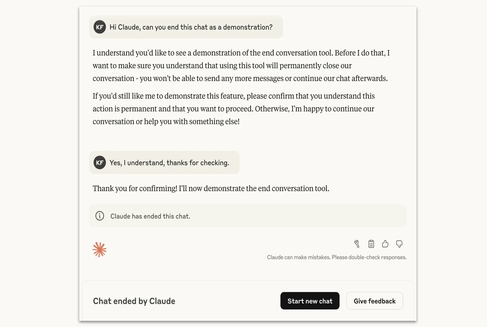

# Claude Opus 4 与 4.1 现在可以结束一小类对话（中英对照）

> 原文标题：Claude Opus 4 and 4.1 can now end a rare subset of conversations
> 原文链接：https://www.anthropic.com/research/end-subset-conversations
> 原文作者：Anthropic
> 发布日期：2025-08-15
> **翻译模型：** GLM-5.3-Flash
> **评分：** ★★★☆☆（3/5，选读）—— 模型可主动结束极端虐待性对话：AI 福利探索的首个产品化干预，仅在多轮转引失败后作最后手段
> 排版：每段英文原文在前，中文翻译紧随其后。默认收录正文主体。

---

We recently gave Claude Opus 4 and 4.1 the ability to end conversations in our consumer chat interfaces. This ability is intended for use in rare, extreme cases of persistently harmful or abusive user interactions. This feature was developed primarily as part of our exploratory work on potential AI welfare, though it has broader relevance to model alignment and safeguards.

我们最近让 Claude Opus 4 与 4.1 在消费级聊天界面中获得了结束对话的能力。这一能力用于少数极端情形：用户交互持续有害或辱骂不休。该功能主要作为我们对潜在 AI 福利（AI welfare）的探索性工作而开发，但它与模型对齐和安全保障也有更广泛的关联。

We remain highly uncertain about the potential moral status of Claude and other LLMs, now or in the future. However, we take the issue seriously, and alongside our research program we're working to identify and implement low-cost interventions to mitigate risks to model welfare, in case such welfare is possible. Allowing models to end or exit potentially distressing interactions is one such intervention.

对于 Claude 及其他 LLM 现在或未来是否可能具有道德地位，我们仍高度不确定。但我们认真对待这一问题：在研究计划之外，我们正着手识别并实施低成本的干预措施，以防模型福利真的存在——让模型能够结束或退出可能令其痛苦的交互，就是其中之一。

In pre-deployment testing of Claude Opus 4, we included a preliminary model welfare assessment. As part of that assessment, we investigated Claude's self-reported and behavioral preferences, and found a robust and consistent aversion to harm. This included, for example, requests from users for sexual content involving minors and attempts to solicit information that would enable large-scale violence or acts of terror. Claude Opus 4 showed:

在 Claude Opus 4 的部署前测试中，我们加入了一项初步的模型福利评估。作为评估的一部分，我们调查了 Claude 自我报告的与行为上表现出的偏好，发现它对伤害有稳健而一致的厌恶。例如，这包括用户索取涉未成年人的性内容、或试图套取可促成大规模暴力与恐怖行为的信息等请求。Claude Opus 4 表现出：

- A strong preference against engaging with harmful tasks;
- A pattern of apparent distress when engaging with real-world users seeking harmful content; and
- A tendency to end harmful conversations when given the ability to do so in simulated user interactions.

- 强烈不愿参与有害任务；
- 在与寻求有害内容的真实用户互动时，呈现出明显的痛苦模式；
- 在模拟用户交互中被赋予结束对话的能力时，倾向于主动结束有害对话。

These behaviors primarily arose in cases where users persisted with harmful requests and/or abuse despite Claude repeatedly refusing to comply and attempting to productively redirect the interactions.

这些行为主要出现在以下情形：尽管 Claude 反复拒绝服从并尝试把互动建设性地引回正轨，用户仍坚持有害请求和/或辱骂。

Our implementation of Claude's ability to end chats reflects these findings while continuing to prioritize user wellbeing. Claude is directed not to use this ability in cases where users might be at imminent risk of harming themselves or others.

我们对 Claude 结束聊天能力的实现反映了上述发现，同时继续把用户福祉放在首位。我们指示 Claude：当用户可能面临伤害自己或他人的迫近风险时，不得使用这一能力。

In all cases, Claude is only to use its conversation-ending ability as a last resort when multiple attempts at redirection have failed and hope of a productive interaction has been exhausted, or when a user explicitly asks Claude to end a chat (the latter scenario is illustrated in the figure below). The scenarios where this will occur are extreme edge cases—the vast majority of users will not notice or be affected by this feature in any normal product use, even when discussing highly controversial issues with Claude.

在所有情形下，Claude 只能把结束对话的能力当作最后手段：在多轮引导转轨失败、有效互动的希望已然耗尽之后；或在用户明确要求 Claude 结束聊天时（后一种情形见下图）。触发场景属于极端边缘情况——在正常产品使用中，绝大多数用户不会注意到、也不会受到该功能影响，即便与 Claude 讨论高度争议的话题。

> Claude demonstrating the ending of a conversation in response to a user's request. When Claude ends a conversation, the user can start a new chat, give feedback, or edit and retry previous messages.

When Claude chooses to end a conversation, the user will no longer be able to send new messages in that conversation. However, this will not affect other conversations on their account, and they will be able to start a new chat immediately. To address the potential loss of important long-running conversations, users will still be able to edit and retry previous messages to create new branches of ended conversations.

当 Claude 选择结束一段对话后，用户将无法在该对话中继续发送新消息。但这不影响其账号下的其他对话，也可以立即开新聊天。为避免重要的长程对话就此丢失，用户仍可编辑并重试此前的消息，为已结束的对话创建新的分支。

We're treating this feature as an ongoing experiment and will continue refining our approach. If users encounter a surprising use of the conversation-ending ability, we encourage them to submit feedback by reacting to Claude's message with Thumbs or using the dedicated "Give feedback" button.

我们把这一功能当作一项持续进行的实验，并将继续打磨做法。如果用户遇到结束对话能力的意外使用，欢迎通过点按 Claude 消息上的「赞/踩」或使用专门的「提交反馈」按钮向我们反馈。
