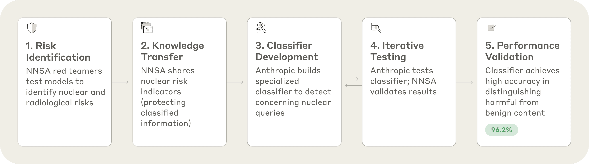
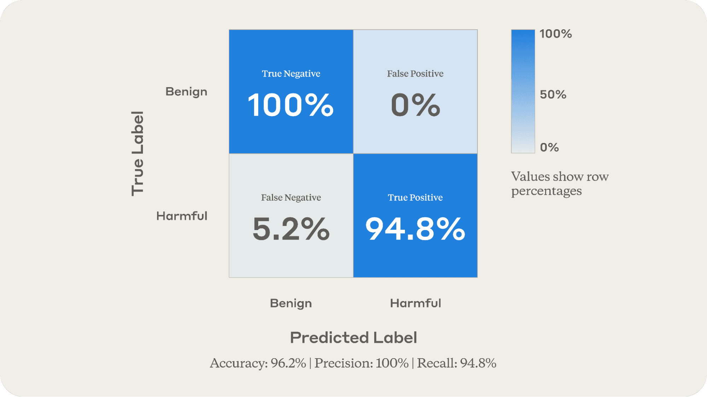

# 为 AI 开发核安全保障（中英对照）

> 原文标题：Developing nuclear safeguards for AI
> 原文链接：https://www.anthropic.com/research/nuclear-safeguards-for-ai
> 原文作者：Anthropic（与美国能源部国家核安全管理局 NNSA 及 DOE 国家实验室合作）
> 发布日期：2025-08-21
> **翻译模型：** GLM-5.3-Flash
> **评分：** ★★★★☆（4/5，强推荐）—— 与 NNSA 共建核内容分类器：合成数据绕开保密与用户数据双重约束，检出率 94.8%、零误报，已部署于 Claude 流量
> 排版：每段英文原文在前，中文翻译紧随其后。默认收录正文主体。

---

Nuclear technology is inherently dual-use: the same physics principles that power nuclear reactors can be misused for weapons development. As AI models become more capable, we need to keep a close eye on whether they can provide users with dangerous technical knowledge in ways that could threaten national security.

核技术天然两用：驱动核反应堆的物理学原理，同样可能被滥用于武器研发。随着 AI 模型能力增强，我们需要密切关注：它们是否会以威胁国家安全的方式，向用户提供危险的技术知识。

Information relating to nuclear weapons is particularly sensitive, which makes evaluating these risks challenging for a private company acting alone. That's why last April we partnered with the U.S. Department of Energy (DOE)'s National Nuclear Security Administration (NNSA) to assess our models for nuclear proliferation risks and continue to work with them on these evaluations.

与核武器相关的信息尤为敏感，这让一家私营公司独自评估此类风险变得困难。正因如此，去年 4 月我们与美国能源部（DOE）国家核安全管理局（NNSA）合作，评估我们的模型的核扩散风险，并在这些评测上持续合作至今。

Now, we're going beyond assessing risk to build the tools needed to monitor for it. Together with the NNSA and DOE national laboratories, we have co-developed a classifier—an AI system that automatically categorizes content—that distinguishes between concerning and benign nuclear-related conversations with 96% accuracy in preliminary testing (see below for details).

如今，我们不满足于评估风险，更进一步构建监测风险所需的工具。我们与 NNSA 及 DOE 国家实验室共同开发了一个分类器——一种自动对内容分类的 AI 系统——在初步测试中能以 96% 的准确率区分「值得警惕的」与「良性的」核相关对话（细节见下）。

We have already deployed this classifier on Claude traffic as part of our broader system for identifying misuse of our models. Early deployment data suggests the classifier works well with real Claude conversations.

我们已把该分类器部署到 Claude 流量上，作为识别模型滥用这一更大系统的一部分。早期部署数据表明，分类器在真实 Claude 对话中运行良好。

We will share our approach with the Frontier Model Forum, the industry body for frontier AI companies, in hopes that this partnership can serve as a blueprint that any AI developer can use to implement similar safeguards in partnership with NNSA.[^1]

我们将把这一做法分享给前沿 AI 公司的行业组织 Frontier Model Forum，希望这一合作能成为一份蓝图：任何 AI 开发者都可以照此与 NNSA 合作实施类似的安全保障。[^1]

Along with the concrete importance of securing frontier AI models against nuclear misuse, this first-of-its-kind effort shows the power of public-private partnerships. These partnerships combine the complementary strengths of industry and government to address risks head-on, making AI models more reliable and trustworthy for all their users.

除了「让前沿 AI 模型免于核滥用」这一具体重要性之外，这项开创性的工作还展示了公私合作的力量：这种合作把产业界与政府的互补优势结合起来正面应对风险，让 AI 模型对所有用户而言更可靠、更可信。

## 我们构建了什么？（What we built）

In this partnership, we did not stop with identifying risks—we developed an approach for addressing them. After a year of NNSA staff red teaming Claude models in a secure environment, we began to co-develop risk mitigations.

在这一合作中，我们没有止步于识别风险，而是开发出了应对风险的方法。在 NNSA 工作人员在安全环境中对 Claude 模型做了一年红队测试之后，我们开始共同开发风险缓解措施。

Informed by their red teaming, NNSA shared with us a carefully curated set of nuclear risk indicators designed to distinguish potentially concerning conversations about nuclear weapons development from benign discussions about nuclear energy, medicine, or policy. Crucially, this list was developed at a classification level such that it could be shared with our team, allowing us to use it to build defenses.

基于其红队测试的发现，NNSA 向我们分享了一套精心整理的核风险指标，用于区分「关于核武器研发、可能值得警惕的对话」与「关于核能、核医学或核政策的良性讨论」。关键在于，这份清单是在一个可以与我们团队共享的密级上编制的，使我们能够用它构建防御。

Our Policy and Safeguards teams turned that list into a classifier that could identify concerning nuclear queries in real-time. Think of a classifier as a specialized labeller, like the one that underpins the spam filter in your email inbox. Instead of identifying junk mail, this classifier identifies conversations that are potentially harmful while allowing legitimate discussions.

我们的政策团队与安全保障团队把这份清单改造成了一个可以实时识别值得警惕的核相关提问的分类器。可以把分类器理解为一个专职的标注器，就像支撑你邮箱垃圾过滤功能的那种。只不过它识别的不是垃圾邮件，而是潜在有害的对话，同时放行正当的讨论。

To validate the system, we generated hundreds of synthetic test prompts—some concerning, some benign—ran them through the classifier, and shared the results with the NNSA. NNSA validated that the classifier scores aligned with the expected labels (i.e., harmful or benign). We then refined the approach based on their feedback, and repeated the cycle to improve precision. Figure 1 summarizes this process.

为了验证该系统，我们生成了数百条合成测试提示——有的涉及敏感、有的良性——让它们通过分类器，并把结果交给 NNSA。NNSA 确认分类器的打分与预期标签（即有害或良性）一致。我们随后根据其反馈改进方法，并重复这一循环以提升精度。图 1 概括了这一流程。

> Figure 1: Classifier co-development process.

The most challenging aspect of this endeavor wasn't technical—it was bridging the gap between a national security agency and a private AI company. Both sides had to operate under information sharing constraints: the NNSA needed to keep certain information classified, and Anthropic needed to protect user data. How, then, could we validate that our classifier actually worked? Synthetic data generation was our solution: we used example prompts from NNSA to generate hundreds of test cases, creating a robust evaluation set without compromising either party's equities.

这项工作最具挑战性的方面不在技术，而在于弥合国家安全机构与私营 AI 公司之间的鸿沟。双方都必须在信息共享约束下运作：NNSA 需要对某些信息保密，Anthropic 需要保护用户数据。那么，我们如何验证分类器真的有效？合成数据生成是我们的解法：我们用 NNSA 提供的示例提示生成了数百条测试用例，在不损害任何一方权益的前提下，构建了一个稳健的评估集。

## 这为什么重要？（Why does this matter?）

If an AI system is too cautious, it might refuse legitimate nuclear engineering coursework. Too permissive, and it could inadvertently assist bad actors.

AI 系统若过于谨慎，可能拒绝正当的核工程课程作业；过于宽松，又可能无意间协助坏人。

Our classifier appears to strike the right balance. In preliminary testing with synthetic data, we achieved a 94.8% detection rate for nuclear weapons queries and zero false positives (overall, 96.2% of the classifier's labels in this test were accurate as shown in Figure 2), suggesting this system would not flag legitimate educational, medical, or research discussions as concerning. This precision matters because nuclear conversations in AI systems are rare but high-stakes—they bear directly on national security.

我们的分类器似乎把握住了恰当的平衡。在合成数据的初步测试中，核武器相关提问的检出率达 94.8%、零误报（总体而言，如图 2 所示，该测试中分类器 96.2% 的标签是准确的），这提示该系统不会把正当的教育、医疗或研究讨论标记为可疑。这种精度之所以重要，是因为 AI 系统中的核相关对话虽然罕见、却牵一发而动全身——它们直接关系到国家安全。

> Figure 2: Comparison of the classifier's assessment of synthetic exchanges to their known status showing correct assessment of all the true negatives and almost 95% of the true positives. The overall accuracy reflects the total proportion of correctly predicted labels.

## 与行业共享（Sharing with industry）

We're making these resources available so that other leading AI companies can implement similar safeguards if they choose. Beyond demonstrating how government expertise can enhance AI safety through voluntary public-private cooperation, we hope this sparks an exchange where we can learn from each other's approaches to risk mitigation.

我们正在把这些资源开放出来，让其他头部 AI 公司可以选择实施类似的安全保障。除了展示「政府专长如何经由自愿的公私合作提升 AI 安全」之外，我们也希望这能引发交流，让我们彼此借鉴风险缓解的路径。

## 下一步？（What's next?）

As noted above, we have deployed the classifier as an experimental addition to our Safeguards framework, monitoring a percentage of Claude traffic. Its real-world performance has confirmed that the classifier works effectively beyond our testing environment. Whereas our synthetic test data provided clear examples of harmful and benign exchanges, the distribution of actual user traffic proved more complex and surprising, yet the classifier still performed well.

如上所述，我们已把分类器作为 Safeguards 框架的实验性组件部署，监控一部分 Claude 流量。它在真实世界中的表现证实：分类器在测试环境之外同样有效。合成测试数据提供的是有害与良性对话的清晰样本，而真实用户流量的分布更复杂、也更出人意料——尽管如此，分类器依然表现良好。

One example of how real-world deployment differs from testing is that the classifier flagged certain conversations about nuclear weapons that we ultimately determined to be benign. For example, recent events in the Middle East brought renewed attention to the issue of nuclear weapons. During this time, the nuclear classifier incorrectly flagged some conversations that were only related to these events, not actual misuse attempts. We found that when these exchanges went through hierarchical summarization—which reviews multiple flagged conversations together—they were correctly identified as harmless current events discussions because of the additional context provided by the summarization step.

真实部署与测试的一个差异是：分类器把某些关于核武器的对话标记了出来，而我们最终判定它们是良性的。例如，中东近期的局势让核武器问题重新受到关注。在此期间，核分类器错误地标记了一些只与这些事件相关、并非真实滥用企图的对话。我们发现，当这些对话经过层级式摘要（hierarchical summarization，即把多条被标记对话放在一起复核）处理后，借助摘要步骤提供的额外上下文，它们被正确识别为无害的时事讨论。

This reveals two dynamics: first, that real-world conversations often fall into gray areas that are difficult to capture in synthetic data, and second, that combining multiple safety tools creates a more nuanced and precise system.

这揭示了两个规律：其一，真实世界的对话常常落入合成数据难以刻画的灰色地带；其二，把多种安全工具组合起来，能构成一个更细腻、更精准的系统。

Ultimately, the classifier proved its value by successfully catching concerning content (i.e. true positives) when deployed. For example, Anthropic red teamers who were not aware the classifier had been deployed were conducting routine adversarial testing of our systems using deliberately concerning prompts. The classifier correctly identified these test queries as potentially harmful, demonstrating its effectiveness.

最终，分类器在部署后成功抓住了值得警惕的内容（即真阳性），证明了自己的价值。例如，一些尚不知道分类器已部署的 Anthropic 红队成员，正用刻意敏感的提示对我们的系统做常规对抗测试。分类器正确地把这些测试提问识别为潜在有害，展示了它的效力。

This work leveraged each party's strengths (i.e., government domain expertise and industry technical capabilities) and early results show it is working in practice. This demonstrates a model of public-private partnerships that can be replicated in other national security domains. It also illustrates that there are steps that industry can take now to implement meaningful safety measures.

这项工作发挥了各方所长（政府的领域专长与产业界的技术能力），早期结果表明它在实践中行之有效。这展示了一种可在其他国家安全领域复制的公私合作模式，也说明产业界现在就能采取行动、落实有实质意义的安全措施。

We are grateful to the team at NNSA and DOE national laboratories for their commitment to this collaboration, which demonstrates how industry and government can work together to enhance national security.

我们感谢 NNSA 与 DOE 国家实验室的团队对这一合作的投入——它展示了产业界与政府如何携手增强国家安全。

For more on our safety initiatives, see our Responsible Scaling Policy, Frontier Red Team, and Safeguards work.

关于我们安全举措的更多信息，请见我们的负责任扩展政策（Responsible Scaling Policy）、前沿红队（Frontier Red Team）与安全保障（Safeguards）工作。

---

[^1]: We are able to share this kind of information because FMF member firms (i.e., Amazon, Anthropic, Google, Meta, Microsoft, and OpenAI) have signed a unique agreement designed to facilitate information-sharing about threats, vulnerabilities, and capability advances unique to frontier AI. / 我们能够分享这类信息，是因为前沿模型论坛（FMF）成员公司（即 Amazon、Anthropic、Google、Meta、Microsoft 与 OpenAI）已签署一份独特协议，以促进针对前沿 AI 特有的威胁、漏洞与能力进展的信息共享。
