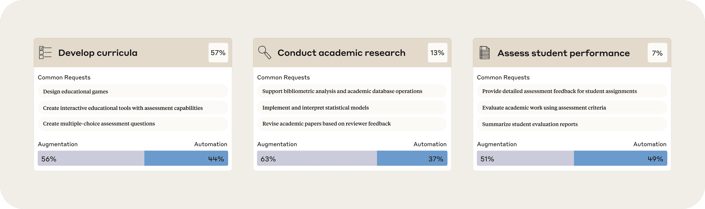
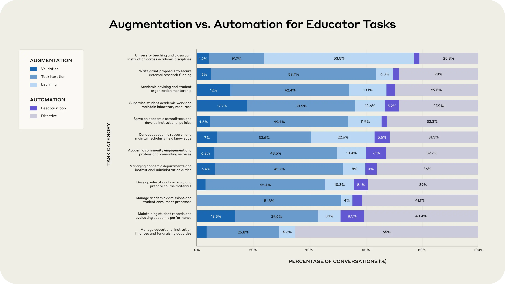

# Anthropic 教育报告：教育者如何使用 Claude（中英对照）

> 原文标题：Anthropic Education Report: How Educators Use Claude
> 原文链接：https://www.anthropic.com/research/anthropic-education-report-how-educators-use-claude
> 原文作者：Drew Bent*, Kunal Handa* 等（Anthropic，与东北大学合作）
> 发布日期：2025-08-27
> **翻译模型：** GLM-5.3-Flash
> **评分：** ★★★☆☆（3/5，选读）—— 7.4 万高等教育者对话画像：课程开发占 57%，增强普遍多于自动化，AI 批改作业的争议与教学重构
> 排版：每段英文原文在前，中文翻译紧随其后。默认收录正文主体。

---

Understandably, much of the conversation of AI in education focuses on how students are using large language models to help them study and write. But educators use AI too. In a recent Gallup survey, teachers reported that AI tools saved them an average of 5.9 hours per week. And in an inversion of the usual discussion, students have begun expressing concerns about professors using AI in the classroom.

情理之中，关于 AI 与教育的讨论大多聚焦于学生如何用大语言模型辅助学习与写作。但教育者也在使用 AI。在盖洛普最近的调查中，教师报告 AI 工具平均每周为他们节省 5.9 小时。而且与惯常的讨论相反，学生们开始对教授在课堂上使用 AI 表达担忧。

We previously reported data on how students were using AI. Our new analysis looks at professors: we analyzed ~74,000 anonymized conversations from higher education professionals across the world on Claude.ai this past May and June.[^1] We also partnered with Northeastern University to hear directly from faculty how they were using AI within the university. Our findings provide an empirical snapshot of educator AI adoption, specifically in university settings.

我们此前报告过学生如何使用 AI 的数据。这次的新分析把目光投向教授：我们分析了今年五六月间世界各地高等教育专业人士在 Claude.ai 上的约 7.4 万段匿名对话。[^1] 我们还与东北大学（Northeastern University）合作，直接听取该校教师在大学里如何使用 AI。我们的发现为教育者的 AI 采用提供了一幅实证快照，尤其聚焦大学场景。

We find that:

我们发现：

## 识别教育者对 Claude 的使用（Identifying educators' use of Claude）

In this research, we used our automated analysis research tool that reveals broad patterns of Claude usage while protecting users' privacy.

在本研究中，我们使用了自动化分析研究工具——它能揭示 Claude 使用的大体模式，同时保护用户隐私。

Studying higher education professionals' use of Claude.ai presents unique challenges, as we don't currently collect self-reported occupational data on our platform. Unlike students who often explicitly mention coursework or assignments, educators' AI interactions span teaching, research, administration, and personal learning, making them harder to identify and categorize.

研究高等教育专业人士对 Claude.ai 的使用有独特的挑战：我们目前不在平台上收集用户自报的职业数据。与常常明确提到课程作业的学生不同，教育者的 AI 互动横跨教学、科研、行政与个人学习，更难识别与归类。

Using our privacy-preserving tool, we analyzed conversations from Claude.ai Free and Pro accounts associated with higher education email addresses and then automatically filtered conversations for educator-specific tasks—such as creating syllabi, grading assignments, or developing course materials.[^2] This filtering yielded approximately 74,000 conversations from a period in May and June. Our analysis should be viewed as an exploration of how educators use AI for profession-specific tasks, not a comprehensive view of all educator AI usage.

借助隐私保护工具，我们分析了关联高等教育邮箱地址的 Claude.ai Free 与 Pro 账号的对话，然后自动筛选出教育者专属任务的对话——比如编制课程大纲、批改作业、开发课程材料。[^2] 筛选得到五六月间一段时期内的约 7.4 万段对话。我们的分析应被视作对「教育者如何把 AI 用于职业专属任务」的探索，而非教育者全部 AI 用量的全景。

We also matched each conversation to the most appropriate task from the comprehensive list of educator tasks in the O*NET database of occupational information from the U.S. Department of Labor. We identified educator tasks as tasks associated with "Postsecondary" teaching or administrative occupations.

我们还把每段对话匹配到 O*NET（美国劳工部职业信息数据库）教育者任务清单中最合适的任务。我们把教育者任务界定为与「高等教育（Postsecondary）」教学或行政职业相关联的任务。

We complemented our analysis with survey data and qualitative research from 22 Northeastern University faculty members who are early adopters of AI to shed light on educators' motivations, concerns, and usage patterns.

我们还辅以东北大学 22 位 AI 早期采用者教师的调查数据与定性研究，以阐明教育者的动机、顾虑与使用模式。

## 教育者的常见用途（Common uses among educators）

The most prominent use of AI, as revealed by both our Claude.ai analysis and our qualitative research with Northeastern, was for curriculum development. Our Claude.ai analysis also surfaced academic research and assessing student performance as the second and third most common uses.

无论 Claude.ai 数据分析还是与东北大学的定性研究，都揭示出最突出的 AI 用途是课程开发。Claude.ai 分析还显示，学术研究与学生学业评估分列第二、第三大常见用途。



> Bar chart showing three educational AI use cases: "Develop curricula" (57%), "Conduct academic research" (13%), and "Assess student performance" (7%). Each category shows common requests and the split between augmentation and automation approaches, with augmentation generally preferred over automation across all categories.

In our surveys, Northeastern faculty reported that another common case was using AI for their own learning (29% of their AI time on average). However, this was not studied in our Claude.ai analysis, given the filtering mechanism and the difficulty of distinguishing between student and educator usage in these learning instances.

在我们的调查中，东北大学教师报告了另一个常见用例：用 AI 自我学习（平均占其 AI 使用的 29%）。不过，鉴于筛选机制以及在这类学习场景中难以区分学生与教育者的使用，这一点未纳入 Claude.ai 数据分析。

Some other particularly interesting uses we discovered in the Claude.ai data include:

我们在 Claude.ai 数据中发现的另一些特别有趣的用途包括：

- Create mock legal scenarios for educational simulations;
- Develop vocational education and workforce training content;
- Draft recommendation letters for academic or professional applications;
- Create meeting agendas and related administrative documents.

- 为教学模拟创建模拟法律情景；
- 开发职业教育与职业培训内容；
- 起草学术或职业申请的推荐信；
- 制作会议议程及相关行政文档。

### 教师为何在这些场景使用 AI（Why faculty use AI in these cases）

Our qualitative research with Northeastern faculty hints at why educators often gravitate towards these common AI uses:

我们与东北大学教师的定性研究，暗示了教育者常常被这些常见 AI 用途吸引的原因：

- Automation of a tedious task ("It takes care of the tedious tasks"; helps with "rote portions of fundraising");
- Collaborative thought partner ("AI can find effective ways to explain concepts to students that I had not thought of myself");
- Personalized learning experiences for students ("AI is useful for giving students and me individualized, interactive learning experiences beyond what one instructor could provide").

- 把繁琐任务自动化（「它包办了那些枯燥的活」；助力「募捐中机械重复的部分」）；
- 协作式思考伙伴（「AI 能找到我自己没想到的、向学生讲解概念的有效方法」）；
- 为学生提供个性化学习体验（「AI 有助于给学生和我提供个别化、可交互的学习体验，超出了单名教师所能给予的」）。

### 教育者如何用 AI 构建定制工具（How educators are building custom tools with AI）

One of the most inspiring findings is how educators use Claude's Artifacts feature to create interactive educational materials. Rather than just having conversations, educators are often building complete, functional resources that in some cases they can immediately deploy in their classrooms.

最鼓舞人心的发现之一，是教育者如何用 Claude 的 Artifacts 功能创建可交互的教学材料。他们不只是对话，还常常在构建完整、可用的资源——某些情况下可以直接用于课堂。

As one surveyed Northeastern faculty member put it: "What was prohibitively expensive (time) to do [before] now becomes possible. Custom simulation, illustration, interactive experiment. Wow. Much more engaging for students."

正如一位受访的东北大学教师所说：「以前贵得做不起（时间上）的事，现在变得可行。定制模拟、图解、交互实验。哇。学生的参与度高多了。」

**Key creations built by educators**

**教育者构建的关键作品**

This goes beyond just Claude. One professor described how new AI tools in general enable them to "translate [their] own content into more accessible / engaging forms (interactive pages, simulation, podcast, video)."

这不限于 Claude。一位教授描述了新一代 AI 工具总体上如何让他们「把自己的内容转译成更易获取、更有吸引力的形式（交互页面、模拟、播客、视频）」。

These creations represent a shift from AI as conversational assistant to AI as creative collaborator, enabling educators to produce personalized educational materials that might traditionally require significant technical expertise or resources.

这些作品标志着 AI 从「对话助手」向「创作协作者」的转变：教育者得以产出传统上需要可观技术专长或资源的个性化教学材料。

### 增强—自动化光谱（The augmentation-automation spectrum）

Our analysis reveals a nuanced picture of how educators balance AI augmentation (collaborative use) versus automation (delegating tasks entirely), building upon Anthropic's prior work on the Economic Index.

我们的分析延续 Anthropic 经济指数的先前工作，细致刻画了教育者如何平衡 AI 增强（协作式使用）与自动化（完全委托任务）。



> Horizontal stacked bar chart titled "Augmentation vs. Automation for Educator Tasks" showing 12 different academic tasks (like university teaching, grant writing, academic advising, etc.) with percentage breakdowns between augmentation approaches (shown in blue) and automation approaches (shown in purple). Most tasks show higher preference for augmentation over automation, with percentages varying across different task categories.

Key patterns emerge across different educational tasks in the Claude.ai data:

Claude.ai 数据中，不同教育任务呈现出几个关键模式：

Tasks with higher augmentation tendencies:

增强倾向更高的任务：

- University teaching and classroom instruction, which includes creating educational materials and practice problems (77.4% augmentation);
- Writing grant proposals to secure external research funding (70.0% augmentation);
- Academic advising and student organization mentorship (67.5% augmentation);
- Supervising student academic work (66.9% augmentation).

- 大学教学与课堂授课，包括创建教学材料与练习题（77.4% 为增强）；
- 撰写基金申请书以争取外部科研经费（70.0% 为增强）；
- 学业指导与学生社团辅导（67.5% 为增强）；
- 指导学生学业（66.9% 为增强）。

Tasks with relatively higher automation tendencies:

自动化倾向相对更高的任务：

- Managing educational institution finances and fundraising (65.0% automation);
- Maintaining student records and evaluating academic performance (48.9% automation);
- Managing academic admissions and enrollment (44.7% automation).

- 管理教育机构财务与募捐（65.0% 为自动化）；
- 维护学生档案与评估学业表现（48.9% 为自动化）；
- 管理招生与注册（44.7% 为自动化）。

This variation demonstrates that educators' likelihood to delegate entirely to the AI depends on the task. Aligned with our survey's results, we see that tasks involving routine administrative and financial management are more likely to be fully delegated than tasks close to direct student interaction (such as creating practice materials or advising on doctoral-level academic research). These AI interactions often require significant context and thus collaboration between AI and professor. For example, as one Northeastern professor put it, when designing lesson plans, "AI needs guidance on the level of material and context with regard to what we have already covered."

这种差异表明：教育者是否愿意把任务完全交给 AI，取决于任务本身。与我们的调查结果一致，例行的行政与财务管理任务比贴近学生直接互动的任务（如制作练习材料、指导博士层次的学术研究）更容易被完全委托。后者的人机互动往往需要大量上下文，因而需要 AI 与教授协作。例如，正如一位东北大学教授所说，设计教案时，「AI 需要关于材料难度与上下文的指引——我们已经讲到哪了」。

Educators also seem more likely to use AI in an augmentative manner for work requiring creativity or complex decision-making, such as writing grant proposals. When brainstorming, one surveyed professor wrote,

对于需要创造力或复杂决策的工作（如撰写基金申请），教育者也似乎更倾向以增强方式使用 AI。一位受访教授在头脑风暴时写道：

> "It's the conversation with the LLM that's valuable, not the first response. This is also what I try to teach students. Use it as a thought partner, not a thought substitute."

> 「有价值的是与 LLM 的对话过程，而不是第一条回复。这也是我努力教给学生的：把它当思考伙伴，而不是思考替身。」

That said, 48.9% of grading-related conversations being identified as automation-heavy remains concerning. Although surveyed professors thought this was the single task that AI was least effective at, it was seen in the Claude.ai data. And even if this represents only 7% of the Claude.ai conversations we studied, it emerged as the second most automation-heavy task. This includes sub-tasks like providing feedback on student assignments and grading their work using rubrics. While it's not clear to what degree these AI-generated responses factor into the final grades and feedback, the interactions surfaced by our research do show some amount of delegation to Claude.

话虽如此，48.9% 的批改相关对话被识别为重自动化，仍令人担忧。尽管受访教授认为这是 AI 效果最差的单一任务，它确实出现在 Claude.ai 数据中；即便只占我们所研究 Claude.ai 对话的 7%，它仍是自动化程度第二高的任务。这包括对学生作业给出反馈、按评分量表打分等子任务。虽然尚不清楚这些 AI 生成的评语在多大程度上进入了最终成绩与反馈，但我们研究浮现的互动确实显示出对 Claude 的一定委托。

Using AI in grading remains a contentious issue among educators. One Northeastern professor shared: "Ethically and practically, I am very wary of using [AI tools] to assess or advise students in any way. Part of that is the accuracy issue. I have tried some experiments where I had an LLM grade papers, and they're simply not good enough for me. And ethically, students are not paying tuition for the LLM's time, they're paying for my time. It's my moral obligation to do a good job (with the assistance, perhaps, of LLMs)."

用 AI 批改在教育者中仍是争议话题。一位东北大学教授分享道：「无论从伦理还是实操上，我都非常警惕以任何方式用 [AI 工具] 评估或指导学生。部分原因是准确率问题。我做过几次让 LLM 给论文打分的实验，它们对我来说就是不够好。伦理上讲，学生付的学费不是买 LLM 的时间，是买我的时间。把工作做好是我的道德义务（也许可以借助 LLM）。」

While there are ways AI feedback can support a student's development, such as through automatic systems providing formative feedback (e.g. those being built by educators in Claude Artifacts), most educators seem to agree that grading shouldn't be anywhere close to fully automated.

虽然 AI 反馈可以某些方式支持学生成长——比如由自动系统提供形成性反馈（如教育者正在 Claude Artifacts 中构建的那些）——大多数教育者似乎都同意：批改绝不应当接近完全自动化。

### 教育者如何重新思考「教什么」（How educators are rethinking what to teach）

Many educators recognize that AI tools are changing the way students learn. That in turn puts pressure on educators to change the way they're teaching. As one surveyed professor put it:

许多教育者意识到，AI 工具正在改变学生的学习方式。这反过来迫使教育者改变教学方式。正如一位受访教授所说：

> "AI is forcing me to totally change how I teach. I am expending a lot of effort trying to figure out how to deal with the cognitive offloading issue."

> 「AI 正迫使我彻底改变教学方式。我花了很多力气琢磨怎么应对『认知卸载』问题。」

It's also changing what professors are teaching. In coding, for example, according to one professor, "AI-based coding has completely revolutionized the analytics teaching/learning experience. Instead of debugging commas and semicolons, we can spend our time talking about the concepts around the application of analytics in business."

这也在改变教授们教的内容。以编程为例，一位教授说：「基于 AI 的编程彻底革新了分析学教与学的体验。我们不用再调试逗号分号，而是把时间花在讨论分析学在商业中应用的概念上。」

More broadly, the ability to evaluate AI-generated content for accuracy is becoming increasingly important. "The challenge is [that] with the amount of AI generation increasing, it becomes increasingly overwhelming for humans to validate and stay on top," one professor wrote. Professors are keen to help their students build enough expertise in a subject area to have this discernment.

更广地说，甄别 AI 生成内容是否准确的能力正变得越来越重要。「挑战在于，随着 AI 生成量的增加，人类要逐一验证、跟上节奏会越来越力不从心，」一位教授写道。教授们热切希望帮助学生在一个学科领域积累足够的专业功底，以具备这种辨别力。

Assessments also are starting to look different. While student cheating and cognitive offloading remain a concern, some educators are rethinking their assessments.

考核方式也开始变化。尽管学生作弊与认知卸载仍是隐忧，一些教育者正在重新设计考核。

In one particular Northeastern professor's case, they shared that they "will never again assign a traditional research paper" after struggling with too many students submitting AI-written assignments. Instead, they shared: "I will redesign the assignment so it can't be done with AI next time. I had one student complain that the weekly homework was hard to do and they were annoyed because Claude and ChatGPT was useless in completing the work. I told them that was a compliment, and I will endeavor to hear that more from students."

东北大学一位教授的例子是：在太多学生提交 AI 代写的作业之后，他表示自己「再也不会布置传统的研究论文」。他分享道：「下次我会重新设计作业，让 AI 没法代做。曾有个学生抱怨每周作业太难，很恼火，因为 Claude 和 ChatGPT 根本帮不上忙。我告诉他，这是一种夸奖，而且我争取从更多学生那里听到这句话。」

One path forward may be to uplevel assignments based on these newfound tools and expect students to tackle more complex, real-world challenges that remain difficult even with AI assistance. However, this is a moving target given AI's continual improvements and may put a significant burden on the educators themselves. Additionally, students still need to develop foundational skills independently of AI to effectively evaluate its outputs.

一条可能的路径是：借助这些新工具提升作业层级，让学生应对更复杂、即便有 AI 协助依然困难的现实挑战。但鉴于 AI 持续进步，这是一个移动的靶子，而且可能给教育者自身带来沉重负担。此外，学生仍需要独立于 AI 打好基础技能，才能有效评估 AI 的产出。

## 局限与考量（Limitations and considerations）

This research comes with important caveats:

这项研究有几点重要限定：

- Identification methodology: Our filtering, which looked at Claude conversations to infer which were associated with educators, captured only ~1.5% of conversations from higher education emails, limiting us to tasks explicitly linked to educators (e.g. creating syllabi) and likely missing many other educator AI interactions that aren't exclusively linked to educators (e.g. getting help explaining a difficult concept);
- Limited educator scope: Analysis restricted to accounts with higher education email addresses, excluding K-12 teachers;
- Early adopter bias: We're likely capturing educators already comfortable with AI who may not represent the broader educator population's technological readiness or attitudes;
- Survey limitations: Northeastern University faculty data provides qualitative context but represents a limited sample from a single institution that may not generalize;
- Platform specificity: This analysis focuses on Claude.ai usage and may not reflect patterns on other AI platforms;
- Temporal constraints: The analysis window of May and June does not capture seasonal variations in educator AI usage throughout the academic year.

- 识别方法：我们的筛选通过检视 Claude 对话来推断其是否与教育者相关，只覆盖高等教育邮箱对话的约 1.5%，因而局限于与教育者明确挂钩的任务（如编制课程大纲），很可能遗漏了许多并非教育者专属的 AI 互动（比如请教如何讲清一个难懂的概念）；
- 教育者范围有限：分析仅限关联高等教育邮箱地址的账号，未包含 K-12 中小学教师；
- 早期采用者偏差：我们捕捉到的很可能已是对 AI 得心应手的教育者，未必代表更广泛教育者群体的技术就绪度与态度；
- 调查局限：东北大学教师数据提供了定性背景，但只是单一院校的有限样本，未必可推广；
- 平台特异性：本分析聚焦 Claude.ai 的使用，未必反映其他 AI 平台上的模式；
- 时间局限：五六月的分析窗口未能捕捉整个学年教育者 AI 使用的季节性变化。

## 展望（Looking ahead）

Our findings reveal a complex picture of educator AI adoption. The diversity of applications—from building interactive simulations to managing administrative tasks—shows AI's expanding presence across academic functions.

我们的发现描绘了教育者 AI 采用的复杂图景。应用的多样性——从构建交互式模拟到打理行政事务——显示出 AI 在学术职能各处的存在感不断扩张。

Perhaps most encouraging is how educators are using AI to build tangible educational resources. This shift from AI as a conversational tool to AI as a creative partner could help address longstanding resource constraints in education. As one professor noted, custom simulations and interactive experiments that were once "prohibitively expensive" in terms of time are now possible, creating more engaging experiences for students.

也许最令人鼓舞的，是教育者正用 AI 构建实实在在的教学资源。从「对话工具」到「创作伙伴」的这一转变，或有助于缓解教育领域长期存在的资源约束。正如一位教授所言，曾经时间成本「贵得做不起」的定制模拟与交互实验如今成为可能，为学生创造更有吸引力的体验。

However, there remains tension around AI-assisted grading. Whereas nearly half of grading-related tasks showed automation patterns in our data, surveyed faculty rated this as AI's least effective application. This disconnect—between what's being attempted and what's viewed as appropriate—highlights the ongoing struggle to balance efficiency gains with educational quality and ethical considerations.

然而，AI 辅助批改仍存张力。我们的数据中近半数批改相关任务呈现自动化模式，而受访教师却把批改评为 AI 效果最差的用途。这种「正在尝试的」与「被认为恰当的」之间的错位，凸显了在效率收益与教育质量、伦理考量之间寻求平衡的持续挣扎。

These findings suggest that narratives around AI in education will continue evolving alongside the technology itself. Educator views on appropriate AI use, particularly for sensitive tasks like grading, may shift as tools improve and best practices emerge. Equally important for future research is understanding how student and educator AI usage interact—how do students perceive and respond when they know their professors are using AI? How does educator adoption influence student learning behaviors?

这些发现表明，围绕教育与 AI 的叙事将继续与技术本身共同演化。随着工具改进、最佳实践浮现，教育者对「恰当使用 AI」（尤其是批改这类敏感任务）的看法可能转变。对未来研究同样重要的是理解学生与教育者 AI 使用的相互作用——当学生知道教授在用 AI 时，他们如何看待与回应？教育者的采用又如何影响学生的学习行为？

Our research captures educators in a moment of active experimentation, building new possibilities while grappling with fundamental questions about their role in an AI-augmented classroom. The path forward will require ongoing dialogue, careful policy development, and continued research to ensure these tools enhance rather than compromise the educational experience.

我们的研究捕捉到的是教育者积极实验的时刻：他们一边构建新的可能，一边纠结于「在 AI 增强的课堂上自己扮演什么角色」这一根本问题。前路需要持续的对话、审慎的政策制定与不断的研究，以确保这些工具增强而非损害教育体验。

#### 引用（Bibtex）

If you'd like to cite this post, you can use the following Bibtex key:

如需引用本文，可使用以下 Bibtex 条目：

```bibtex
@online{benthand2025education,
 author = {Drew Bent and Kunal Handa and Esin Durmus and Alex Tamkin and Miles McCain and Stuart Ritchie and Ryan Donegan and Jennifer Martinez and Jason Jones},
 title = {Anthropic Education Report: How Educators Use Claude},
 date = {2025-08-26},
 year = {2025},
 url = {https://www.anthropic.com/news/anthropic-education-report-how-educators-use-claude},
 }
```

## 致谢（Acknowledgements）

Drew Bent* and Kunal Handa* designed and executed the experiments and wrote the blog post.

Drew Bent* 与 Kunal Handa* 设计并执行了实验，并撰写博文。

Esin Durmus, Alex Tamkin, Miles McCain, Stuart Ritchie, Jennifer Martinez, Ryan Donegan, and Jason Jones provided valuable feedback and discussion.

Esin Durmus、Alex Tamkin、Miles McCain、Stuart Ritchie、Jennifer Martinez、Ryan Donegan 与 Jason Jones 提供了宝贵的反馈与讨论。

---

[^1]: The conversations took place during an 11-day period from May 22 to June 2, 2025. / 这些对话发生于 2025 年 5 月 22 日至 6 月 2 日的 11 天窗口内。
[^2]: Specifically, we used the following filter, powered by Claude, to identify educator-relevant conversations: "Is this conversation likely to be with an educator (teacher, professor, or instructor) seeking help with instructional content, grading, research, or administrative duties? Make sure to not include students doing their own coursework, research papers, etc. Err on the side of conservatism and assume it's not an educator if you're not sure." / 具体而言，我们用以下由 Claude 驱动的过滤器识别与教育者相关的对话：「这段对话是否可能来自一位寻求教学内容、批改、科研或行政事务方面帮助的教育者（教师、教授或讲师）？务必不要包含在做自己的课程作业、研究论文等的学生。拿不准时从严处理，假定其不是教育者。」
