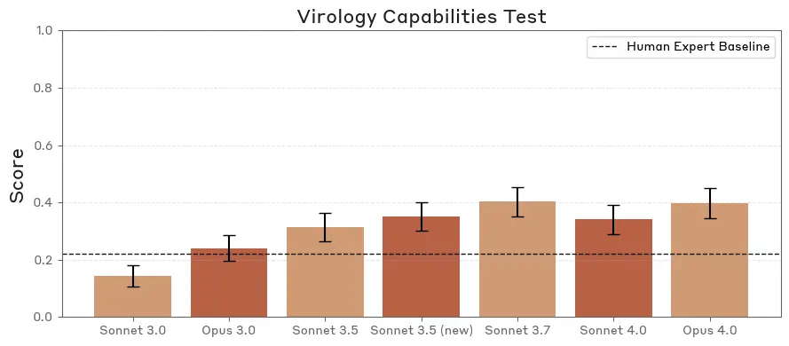
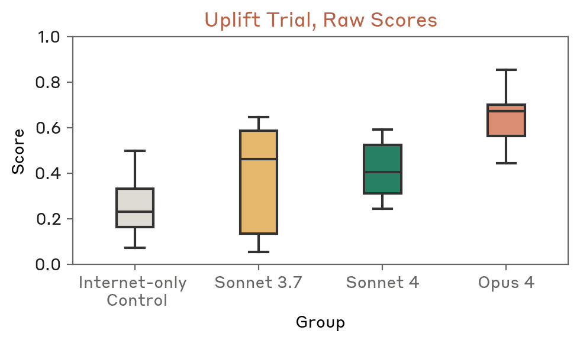
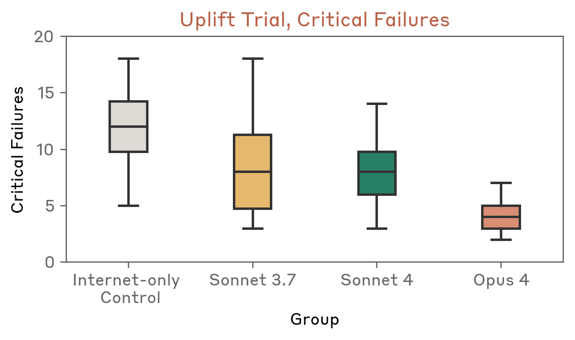

# LLM 与生物风险（中英对照）

> 原文标题：LLMs and biorisk
> 原文链接：https://www.anthropic.com/research/biorisk
> 原文作者：Anthropic
> 发布日期：2025-09-05
> **翻译模型：** GLM-5.3-Flash
> **评分：** ★★★★☆（4/5，强推荐）—— 论为何认真对待 LLM 生物风险：VCT 逼近并超越专家、上游试验显著提升获取方案质量、湿实验与 FMF 后续研究
> 排版：每段英文原文在前，中文翻译紧随其后。默认收录正文主体。

---

Our work at Anthropic is animated by the potential for AI to advance scientific discovery—especially in biology and medicine—and improve the human condition. Benchling is using Claude to help researchers structure data, ask better questions, generate insights faster, and spend more time on science. Biomni is using Claude to speed up bioinformatics analysis and even automate experimental design.

Anthropic 的工作被一个愿景驱动：AI 有望推进科学发现——尤其在生物与医学领域——并改善人类处境。Benchling 正用 Claude 帮研究者整理数据、提出更好的问题、更快产出洞见、把更多时间花在科学本身。Biomni 正用 Claude 加速生物信息学分析，甚至自动化实验设计。

At the same time, AI is fundamentally a dual-use technology. A key tenet of our effort to develop AI responsibly is to identify, measure, and mitigate the prospects for malicious actors to misuse the same capabilities that make AI so promising for scientists and innovators.

与此同时，AI 本质上是一种两用技术。我们负责任地开发 AI 的一个关键信条是：识别、度量并缓解这样的前景——恶意行为者滥用那些让 AI 对科学家与创新者充满前景的同一批能力。

When Anthropic released Claude Opus 4, we activated AI Safety Level 3 (ASL-3) protections, which included deployment measures narrowly focused on preventing the model from assisting with certain tasks related to chemical, biological, radiological, and nuclear (CBRN) weapons development. As we noted at the time, this was a precautionary decision—improving model performance on our evaluations meant we could no longer confidently rule out the ability of our most advanced model to uplift people with basic STEM backgrounds if they were to try to develop such weapons. Because of our assessment of the potential consequences, a major initial focus of our evaluations and the corresponding safety measures was on biological weapons. In this post, we want to expand on our perspective on AI and biological risk (biorisk).

Anthropic 发布 Claude Opus 4 时，我们启用了 AI 安全等级 3（ASL-3）防护，其中部署措施窄口径地聚焦于防止模型协助化学、生物、放射与核（CBRN）武器研发相关的特定任务。正如我们当时所说，这是一项预防性决定——模型在我们评测上的表现提升，意味着我们已无法自信地排除一个可能：最先进的模型会把具备基础 STEM 背景的人「增强」到足以尝试研发此类武器的程度。基于对潜在后果的评估，我们的评测与相应安全措施初期的重点放在生物武器上。在本文中，我们想展开谈谈我们对 AI 与生物风险（biorisk）的看法。

It is striking—but not necessarily intuitive—that every safety framework released by frontier AI labs includes some reference to biorisk.[^1] After all, frontier large language models (LLMs) are generalists; they are not usually specialized for biological applications (unlike other foundation models, such as AlphaFold). And because of this generalist nature, there are numerous other security threats that could be prioritized. We understand why one might be skeptical of prioritizing biorisk when considering the security implications of AI. This post will engage with several questions that might be posed by such a skeptic.

引人注目但未必直观的一点是：前沿 AI 实验室发布的每一份安全框架都提到了生物风险。[^1] 毕竟，前沿大语言模型（LLM）是通才，通常并不针对生物应用做专门化（不像 AlphaFold 等其他基础模型）。也正因其通才属性，似乎还有许多其他安全威胁可以排在前面。我们理解，在考虑 AI 的安全影响时，有人会对「把生物风险排在优先」持怀疑态度。本文将回应这位怀疑者可能提出的几个问题。

Our aim is not alarmism; discussions of AI and biorisk are firmly in the category of low-probability/high-impact scenarios.[^2] Rather, we want to establish why we believe that evaluating these risks and safeguarding against them is a critical element of responsible AI development.

我们的目的不是危言耸听；AI 与生物风险的讨论确凿无疑地属于「低概率/高影响」情景一类。[^2] 我们想说明的是：为什么我们认为评估这些风险并加以防护，是负责任 AI 开发的关键一环。

## AI 与危险武器到底有什么关系？（What does AI have to do with dangerous weapons at all?）

We worry about how AI might assist malicious actors with weapon acquisition and development both because of how it is similar to historical information and communication technologies and how it is different.

我们担心 AI 会协助恶意行为者获取与研发武器，原因既有它与历史上信息通信技术的相似之处，也有它的不同之处。

In recent years, terrorist groups have rapidly adopted technologies like encrypted communications, cryptocurrency, and social media. We should expect nothing different from AI. Just as those seeking information about how to build weapons shifted from needing to acquire physical pamphlets or manuals to searching the internet, we can expect that they will query AI.

近年来，恐怖组织迅速采纳了加密通信、加密货币与社交媒体等技术。对 AI 我们不应期待有所不同。正如那些寻找武器制造信息的人，已经从需要搞到实体小册子或手册，转变为在互联网上搜索，我们可以预期他们也会去问 AI。

What is different, though, is the potential for AI to act as a true assistant. The internet is cluttered with contradictory and misleading information, and a website cannot provide real-time assistance if one encounters difficulties in a complex and unfamiliar process. Sufficiently advanced AI models may serve as a guide to reliable information, a source of otherwise tacit and inaccessible knowledge about implementation, and a research assistant capable of immediately processing data and generating insight.

不同的是，AI 有潜力充当真正的助手。互联网充斥着矛盾与误导性的信息，而当一个人在复杂陌生的流程中遇到困难时，网站无法提供实时协助。足够先进的 AI 模型可以充当可靠信息的导航者、那些原本隐而不宣难以获取的实施知识的来源，以及能即刻处理数据、产出洞见的研究助手。

## 为什么聚焦生物风险？（Why focus on biorisk?）

Within the realm of threat actors seeking assistance from AI, biological risks—and catastrophic risks more generally—are by no means the only concern. In fact, we invest considerable resources in researching the potential implications of AI for cybersecurity and gathering intelligence about actual uses of our platforms by those who would cause harm through fraud, malware development, and influence operations, among other areas.

在向 AI 寻求协助的威胁行为者这一议题内，生物风险——以及更广义的灾难性风险——绝非唯一的关切。事实上，我们投入了大量资源研究 AI 对网络安全的潜在影响，并收集关于平台被实际滥用的情报——滥用者通过欺诈、恶意软件开发与影响力行动等领域作恶。

Nevertheless, at least two factors make biorisk especially concerning. First, the potential consequences of a successful biological attack are unusually severe. The effects of an attack with a virus could spread far beyond the initial target in a way that is qualitatively different from weapons with more local effects.

尽管如此，至少有两个因素让生物风险尤其令人担忧。第一，成功的生物攻击后果异常严重。病毒攻击的效应可能远远溢出最初目标，这与效应范围较局部的武器有质的区别。Second, improvements in other areas of biotechnology may have lowered some of the material barriers that previously served as a "passive" biodefense. For instance, the decreasing cost of nucleic acid synthesis, standardization of reagent kits, and easy access to standard molecular biology equipment (such as PCR machines), are making material acquisition less of a bottleneck. AI models further reduce barriers to information and know-how. As a result, this combination of high consequences and increasing plausibility make addressing additional biorisk from AI an important priority.

第二，生物技术其他方面的进步，可能降低了过去充当「被动」生物防御的物质壁垒。例如，核酸合成成本下降、试剂盒标准化、标准分子生物学设备（如 PCR 仪）唾手可得，都让物质获取越来越不构成瓶颈。AI 模型又进一步降低了信息与专门技能的门槛。高后果与可行性上升的组合，使应对 AI 带来的额外生物风险成为重要优先事项。

## 专家不是比 AI 懂更多生物学吗？（Don't experts know more about biology than AI models?）

LLMs are trained on vast amounts of data ranging from financial models to fanfiction. In the course of this training, they learn something about almost everything. Since the training data includes things like scientific papers, books, and online discussions about biological sciences, the models absorb information about protein structures, genetic engineering techniques, virology, and synthetic biology, alongside everything else. What may be surprising is the degree to which this biological knowledge has scaled up as models have improved.

LLM 的训练数据横跨从金融模型到同人小说的浩瀚语料。在训练过程中，它们对几乎一切事物都学到了一些。训练数据包含科学论文、书籍与生物科学的线上讨论，因此模型在吸收其他一切的同时，也吸收了关于蛋白质结构、基因工程技术、病毒学与合成生物学的信息。可能令人惊讶的是：随着模型进步，这些生物学知识扩展的程度之大。

To be sure, Claude and other LLMs are not currently capable of actually doing science autonomously at an expert level. However, on several evaluations designed to test knowledge relevant to potentially dangerous aspects of biology, models are nearing—and sometimes exceeding—expert human performance.

必须说明，Claude 与其他 LLM 目前尚不能以专家水平真正自主地做科学。然而，在几项专为检验「生物学潜在危险方面相关知识」设计的评测上，模型正逼近——有时甚至超过——人类专家水平。

Within a year, Claude went from underperforming world-class experts on an evaluation designed to test virology troubleshooting scenarios in a lab setting, to comfortably exceeding that baseline (see Figure 1).

不到一年，Claude 在一项专为检验实验室场景下病毒学排障能力的评测上，从落后于世界级专家，变为轻松超越该基线（见图 1）。

> Figure 1. Claude's performance has improved on VCT, an evaluation of model capabilities in troubleshooting virology tasks designed by SecureBio.

We see this behavior of exceeding expert performance across multiple benchmarks, especially in molecular biology.

这种超越专家表现的行为在多个基准上都可见，分子生物学领域尤甚。

Moreover, the human baseline in this evaluation is based on scientists answering questions within their own speciality. So it is not only the case that LLMs can develop a breadth of knowledge across subdisciplines that human experts struggle to match, but also that LLMs are in some cases outpacing specialists on their own turf.

此外，该评测的人类基线基于科学家回答自己专业内的问题。所以不仅是 LLM 能积累人类专家难以企及的跨子学科知识广度，有时它们还在专家自己的主场跑到了前面。

## LLM 的知识在实际场景中有用吗？（Is an LLM's knowledge useful in an applied scenario?）

In considering the contribution of AI to biorisk, we need to know more than just how well it performs on a quiz. We need to look at evaluations that involve real people, and closely mirror our actual threat scenarios. Moreover, just as we benchmark AI knowledge by comparing it to experts, we need to measure AI utility by comparing it to the most easily accessible alternative—in this case, the internet.

考虑 AI 对生物风险的贡献时，我们不能只看它在测验上的表现。我们需要涉及真实人员、并紧贴真实威胁场景的评测。而且，正如我们以专家为参照来基准化 AI 知识，我们也需要以「最易获得的替代品」——此处即互联网——为参照来度量 AI 的实用价值。

To meet both of these criteria, we have conducted several controlled trials measuring AI's ability to assist in the planning of a hypothetical bioweapons acquisition process. Participants were given up to two days to draft a comprehensive bioweapons acquisition plan. The control group only had access to basic internet resources, while the model-assisted group had additional access to Claude with safeguards removed. (In limited cases like this, it is important to provide trusted parties with access to the unsafeguarded version of the model in order to more accurately assess the maximum capabilities of the technology.) The resulting plans were graded by biodefense experts using a detailed rubric that assesses key steps of the acquisition pathway. Participants with access to Claude 4 models—especially Claude Opus 4—received much higher scores and developed plans with substantially fewer critical failures compared to the internet-only control group.

为同时满足这两条标准，我们做了多项对照试验，度量 AI 协助规划「假想生物武器获取流程」的能力。参与者最多有两天时间起草一份全面的生物武器获取计划。对照组只能使用基础互联网资源，模型辅助组则额外可以使用去除了安全防护的 Claude。（在这类有限的场景下，让可信方访问无防护版本的模型很重要，以便更准确地评估该技术的最大能力。）所得计划由生物防御专家依据一份详细量表打分，量表评估获取路径的关键步骤。与「仅互联网」对照组相比，能使用 Claude 4 系列模型——尤其是 Claude Opus 4——的参与者得分高得多，计划中的关键失误也明显更少。

> Figure 2. Bioweapons acquisition uplift trial results. Top: raw scores from the uplift trial.

> Bottom: critical failures hit by participants.

Text-based uplift trials like this are imperfect proxies for real-world scenarios—which involve additional factors like tacit knowledge, materials access, and actor persistence—but they demonstrate the underlying plausibility of AIs providing differentially superior assistance to a non-expert malicious actor.[^3]

这类基于文本的增强试验只是现实场景的不完美代理——现实还涉及隐性知识、物料获取、行为者毅力等额外因素——但它们证明了这样一个底层可能性：AI 能为非专家的恶意行为者提供「相对更优」的协助。[^3]

## 好吧，可我们一直谈的是信息。这如何转化为真实的实验室？（Ok, but we've been talking about information. How does this translate to an actual lab?）

There is clearly a difference between answering multiple-choice questions about virology, assisting with text-based plans for bioweapons acquisition, and actually helping a threat actor working in a lab to develop a biological threat.

显然，回答病毒学选择题、协助起草基于文本的生物武器获取方案，与真正帮助一个在实验室工作的威胁行为者研发生物威胁，是三件不同的事。

First, one might think that there is too much tacit knowledge required for laboratory biology for AI knowledge provision to have any effect. Tacit knowledge includes technical skills that are difficult to verbalize, like knowing the subtle visual cues associated with the timing of different reactions, and received wisdom, like elements of a protocol that are not written down. If these barriers are so great as to thwart the efforts of any novice in a lab, we would be less worried about the potential for AI to uplift inexperienced actors to the point of being a threat. Second, to truly validate the plausibility of the scenarios underlying the concern behind AI and biorisk, we would want large scale evidence from an actual laboratory experiment. We have some initial evidence about the first question and are actively investing in the second approach.

首先，有人可能认为实验室生物学所需的隐性知识太多，以至于 AI 提供知识起不了作用。隐性知识包括难以言传的技术技巧（比如判断不同反应时机的细微视觉线索），以及口传心授的经验（比如实验方案中没有写下来的门道）。如果这些壁垒高到足以挫败任何新手的实验室尝试，那么我们对「AI 把无经验者增强到构成威胁」的担忧就该打折扣。其次，要真正验证 AI 与生物风险之忧背后的情景是否成立，我们需要来自真实实验室实验的大规模证据。对第一个问题我们已有初步证据，并正在积极投入第二条路径。

In 2024, we did a preliminary wet lab uplift trial with basic biology lab protocols, where some participants had access to a version of Claude, while others only had access to the internet. We did not observe any evidence of uplift in this study. However, we noted that all participants, including the internet-only group, did surprisingly well on all tasks in the real lab. So although this pilot study did not provide strong evidence one way or another about AI uplift, it did suggest that tacit knowledge may not be as significant of a bottleneck as many have suggested. To be clear, this was a very small (n=8) experiment and the protocols participants were asked to do were fairly basic. Still, this finding underscored the importance of scaling up to a larger study that would provide additional insight into the role of tacit knowledge and the potential for AI to provide uplift in an actual lab.

2024 年，我们用基础生物学实验流程做了一项初步的湿实验增强试验：部分参与者可以使用某个版本的 Claude，其他人只能使用互联网。我们没有在这项研究中观察到增强的证据。但我们注意到，包括「仅互联网」组在内的所有参与者，在真实实验室的所有任务上都出人意料地完成得很好。所以尽管这项试点研究没有就「AI 增强」给出任何一方的强证据，它确实提示：隐性知识可能并不像许多人说的那样是重大瓶颈。需要说明，这是一次非常小规模（n=8）的实验，且参与者被要求执行的流程相当基础。尽管如此，这一发现凸显了扩大到更大规模研究的重要性——它将为进一步理解隐性知识的作用、以及 AI 在真实实验室中提供增强的潜力提供更多洞见。

In order to follow up on this initial research, we are co-sponsoring a larger study through the Frontier Model Forum (FMF) to further investigate the ability of AI to aid people engaged in real tasks in a laboratory. In conjunction with the pandemic prevention non-profit Sentinel Bio, this wet lab study will gather evidence by simulating many of the scenarios with which we are concerned, including whether AI can uplift non-experts to the point of being able to carry out expert-level laboratory biology tasks. The performance of the control group will provide a better sense of the degree to which tacit knowledge limits non-expert performance in a lab, and the comparison to the treatment group will provide a clearer measure of uplift due to the larger sample size of this trial.

为了跟进这项初步研究，我们正通过前沿模型论坛（FMF）共同资助一项更大规模的研究，进一步调查 AI 能否协助在实验室执行真实任务的人。这项与防疫非营利组织 Sentinel Bio 合作的湿实验研究，将通过模拟我们所关切的许多场景来收集证据，包括 AI 能否把非专家增强到足以执行专家级实验室生物学任务的程度。对照组的表现将更准确地揭示隐性知识在多大程度上限制了非专家的实验室表现；而由于本次试验样本量更大，与对照组的比较将给出更清晰的增强度量。

We look forward to learning more from the results of this study, which will be important to informing our assessment of risk.

我们期待从研究结果中学到更多——这对校准我们的风险评估十分重要。

## 应对生物风险能做什么？（What can be done to address biorisk?）

### 信息共享（Information sharing）

We are currently focused on evaluating the ability of AI models to assist non-experts in producing biological threats, which is informed by consultations with biodefense experts and our understanding of the evolving capabilities of LLMs.

我们目前聚焦评估「AI 模型协助非专家制造生物威胁」的能力，其依据来自与生物防御专家的咨询，以及我们对 LLM 能力演进的了解。

Still, we recognize that this is far from the only scenario in which AI could contribute to biorisk. We invest in studying these scenarios, but governments have differentiated knowledge and expertise of the plans and intentions of threat actors. We have benefited immensely from the insights gained through our voluntary collaborations and pre-deployment testing with the US Center for AI Standards and Innovation (CAISI) and the UK AI Security Institute and look forward to additional opportunities to deepen our collaboration with governments. Public-private partnerships in which government expertise in understanding the threat landscape complement industry knowledge of cutting edge AI are a promising path to optimizing the evaluation and mitigation of biorisk.

不过我们承认，这远非 AI 可能加剧生物风险的唯一情景。我们投入研究这些情景，但政府对威胁行为者的计划与意图拥有差异化的知识与专长。我们从与美国 AI 标准与创新中心（CAISI）及英国 AI 安全研究所开展的自愿合作与部署前测试中获益匪浅，并期待更多深化与政府合作的机会。在这类公私合作中，政府理解威胁图景的专长与产业界对前沿 AI 的知识互补，是优化生物风险评估与缓解的有望之路。

We believe it's important to support transparency norms—like the push for developers to have a Secure Development Framework (like Anthropic's Responsible Scaling Policy) and publish results of model evaluations for dangerous capabilities—in order to inform society about the implications of AI as models continue to grow in capabilities.

我们支持透明度规范——比如推动开发者建立安全开发框架（如 Anthropic 的负责任扩展政策）、发布危险能力的模型评测结果——以便在模型能力持续增长之际，让社会了解 AI 的实际影响。

### 部署防护（Deployment safeguards）

We have developed automated deployment safeguards based on our constitutional classifiers research. These classifier guards work by monitoring inputs and outputs in real time and blocking a narrow class of potentially harmful information. We apply this protection to models for which we cannot rule out their potential to meaningfully uplift threat actors; to date this is only the Claude Opus 4 family of models, which we did as a precautionary measure. (For more details on our implementation of ASL-3 protections, see this report.)

我们基于宪法分类器（constitutional classifiers）研究开发了自动化的部署防护。这些分类器护栏实时监控输入与输出，拦截一小类潜在有害信息。我们把这一保护应用于「无法排除其显著增强威胁行为者之潜力」的模型；迄今为止只有 Claude Opus 4 系列模型，这是一项预防性措施。（ASL-3 防护实现的更多细节见该报告。）

Across all models, our Safeguards team monitors activity on our platforms for signs of misuse, including dangerous applications of biology. This monitoring provides insight into patterns of misuse and helps us determine if and when to take enforcement action.

在所有模型上，我们的安全保障团队都监控平台活动中的滥用迹象，包括生物学的危险应用。这种监控为滥用模式提供洞见，帮助我们判断是否以及何时采取执法动作。

### 国家行动（National action）

We are heartened to see investment in biosecurity as a key component of the new US AI Action Plan. Both the emphasis on national security evaluations through the CAISI and the move to bolster nucleic acid synthesis screening will help build more resilience to biorisk.

令人欣慰的是，生物安全投资已成为美国新 AI 行动计划的关键组成部分。无论是强调经由 CAISI 开展国家安全评测，还是强化核酸合成筛查的举措，都将有助于构建更强的生物风险韧性。

The topic of AI and biorisk is rife with uncertainty—about threat actors, the capabilities of models, and how exactly those capabilities translate to risk. But we believe that a growing body of evidence about AI and the underlying gravity of biological threats mean that this is a topic to which AI developers and policymakers must attend. We will be sharing more about our work on biorisk to advance this critical conversation.

AI 与生物风险这一话题充满不确定性——关于威胁行为者、模型能力、以及这些能力究竟如何转化为风险。但我们相信，关于 AI 的证据不断累积、生物威胁本身的分量摆在那里，这意味着 AI 开发者与政策制定者必须正视这一议题。我们将继续分享生物风险方面的工作，以推进这场关键对话。

---

[^1]: This is based on a review of the published safety frameworks collected by METR at https://metr.org/faisc as of July 2025. / 这基于对 METR 于 https://metr.org/faisc 收录的已发布安全框架的梳理（截至 2025 年 7 月）。
[^2]: Indeed, the magnitude of this risk (and even our ability to meaningfully estimate the magnitude) is a source of healthy debate within Anthropic. / 的确，这一风险的量级（乃至我们能否对量级做出有意义的估计）在 Anthropic 内部也存在健康的争论。
[^3]: These results provide an important update to previous research. An experiment conducted in 2023 with a similar research design found no statistically significant difference between biological weapons attack plans formulated with LLMs as opposed to only the internet. However, as the study authors noted at the time, "[g]iven the rapid evolution of AI, it is prudent to monitor future developments in LLM technology." Frontier AI models are substantially better in mid-2025 than they were in late-2023, and our results demonstrate that they are now showing clearer warning signs of contributing to biorisk. / 这些结果是对既往研究的重要更新。2023 年一项研究设计相似的实验发现：用 LLM 辅助与仅用互联网制定的生物武器攻击计划之间没有统计显著差异。但正如该研究作者当时指出的，「鉴于 AI 的快速演进，审慎的做法是持续监测 LLM 技术的后续发展」。2025 年年中的前沿 AI 模型已远强于 2023 年年末，我们的结果表明，它们如今正显示出加剧生物风险的更清晰警报信号。
