# Anthropic 经济指数报告：地理与企业 AI 采用的不均衡（中英对照）

> 原文标题：Anthropic Economic Index report: Uneven geographic and enterprise AI adoption
> 原文链接：https://www.anthropic.com/research/anthropic-economic-index-september-2025-report
> 原文作者：Ruth Appel*, Peter McCrory*, Alex Tamkin* 等（Anthropic；* 共同主导）
> 发布日期：2025-09-15
> **翻译模型：** GLM-5.3-Flash
> **评分：** ★★★☆☆（3/5，选读）—— AEI 第三期（V3）完整报告：地理维度首发+AUI 指数+API 企业部署三章，与博客版内容互补
> 排版：每段英文原文在前，中文翻译紧随其后。默认收录正文主体；脚注按出现顺序统一编号。

## 引言（Introduction）

AI differs from prior technologies in its unprecedented adoption speed. In the US alone, 40% of employees report using AI at work, up from 20% in 2023 two years ago.[^1] Such rapid adoption reflects how useful this technology already is for a wide range of applications, its deployability on existing digital infrastructure, and its ease of use—by just typing or speaking—without specialized training. Rapid improvement of frontier AI likely reinforces fast adoption along each of these dimensions.

AI 与以往技术的不同在于其空前的采用速度。仅在美国，报告在工作中使用 AI 的员工已达 40%，两年前的 2023 年这一比例还是 20%。[^1] 如此迅速的采用反映出：这项技术已对广泛的应用场景有用、可部署在既有数字基础设施上、并且易用——只需打字或说话，无需专门训练。前沿 AI 的快速进步很可能在每个维度上都进一步强化快速采用。

Historically, new technologies took decades to reach widespread adoption. Electricity took over 30 years to reach farm households after urban electrification. The first mass-market personal computer reached early adopters in 1981, but did not reach the majority of homes in the US for another 20 years. Even the rapidly-adopted internet took around five years to hit adoption rates that AI reached in just two years.[^2]

历史上，新技术要花几十年才能广泛普及。城市电气化之后，电力又花了 30 多年才进入农户家庭。第一台大众市场个人电脑在 1981 年抵达早期采用者，但直到 20 年后才进入大多数美国家庭。即便是采用速度飞快的互联网，也花了约五年才达到 AI 仅用两年就达到的采用率。[^2]

Why is this? In short, it takes time for new technologies—even transformative ones—to diffuse throughout the economy, for consumer adoption to become less geographically concentrated, and for firms to restructure business operations to best unlock new technical capabilities. Firm adoption, first for a narrow set of tasks, then for more general purpose applications, is an important way that consequential technologies spread and have transformative economic effects.[^3]

为什么会这样？简言之，新技术——哪怕是变革性的技术——需要时间才能扩散到整个经济体，消费者的采用需要时间才能不再集中于少数地区，企业也需要时间重构业务运营以最好地释放新技术能力。企业采用——先限于窄窄的一组任务，再扩展到更通用的应用——是重大技术得以扩散并产生变革性经济效应的重要途径。[^3]

In other words, a hallmark of early technological adoption is that it is concentrated—in both a small number of geographic regions and a small number of tasks in firms. As we document in this report, AI adoption appears to be following a similar pattern in the 21st century, albeit on shorter timelines and with greater intensity than the diffusion of technologies in the 20th century.

换言之，早期技术采用的一个标志是「集中」——既集中于少数地理区域，也集中于企业内的少数任务。正如本报告所记录，AI 的采用在 21 世纪似乎正呈现类似模式，尽管时间线更短、强度比 20 世纪技术的扩散更大。

To study such patterns of early AI adoption, we extend the Anthropic Economic Index along two important dimensions, introducing a geographic analysis of Claude.ai conversations and a first-of-its-kind examination of enterprise API use. We show how Claude usage has evolved over time, how adoption patterns differ across regions, and—for the first time—how firms are deploying frontier AI to solve business problems.

为研究这类早期 AI 采用模式，我们沿两个重要维度扩展 Anthropic 经济指数：引入对 Claude.ai 对话的地理分析，以及对 API 企业使用的开创性考察。我们展示 Claude 的使用如何随时间演化、采用模式在不同地区间如何差异，以及——首次地——企业正在如何部署前沿 AI 解决业务问题。

### Claude.ai 使用模式随时间的变化（Changing patterns of usage on Claude.ai over time）

In the first chapter of this report, we identify notable changes in usage on Claude.ai over the previous eight months, occurring alongside improvements in underlying model capabilities, new product features, and a broadening of the Claude consumer base.

在本报告第一章，我们识别了过去八个月 Claude.ai 用量的显著变化——同期底层模型能力在改进、产品新功能在推出、Claude 消费者群体在扩大。

We find:

我们发现：

- Education and science usage shares are on the rise: While the use of Claude for coding continues to dominate our total sample at 36%, educational tasks surged from 9.3% to 12.4%, and scientific tasks from 6.3% to 7.2%.
- Users are entrusting Claude with more autonomy: "Directive" conversations, where users delegate complete tasks to Claude, jumped from 27% to 39%. We see increased program creation in coding (+4.5pp) and a reduction in debugging (-2.9pp)—suggesting that users might be able to achieve more of their goals in a single exchange.

- 教育与科学使用份额上升：编码用途仍以 36% 主导我们的总样本，但教育类任务从 9.3% 猛增至 12.4%，科学类任务从 6.3% 升至 7.2%。
- 用户正在把更多自主权交给 Claude：用户把完整任务委托给 Claude 的「指令式」（directive）对话从 27% 跳升至 39%。编程中「创建程序」上升（+4.5 个百分点）而「调试」下降（-2.9 个百分点）——提示用户或许能在单次交互中达成更多目标。

### AI 采用的地理学（The geography of AI adoption）

For the first time, we release geographic cuts of Claude.ai usage data across 150+ countries and all U.S. states. To study diffusion patterns, we introduce the Anthropic AI Usage Index (AUI) to measure whether Claude.ai use is over- or underrepresented in an economy relative to its working age population.

我们首次发布覆盖 150 多个国家和美国全部州的 Claude.ai 用量地理切片。为研究扩散模式，我们引入 Anthropic AI 使用指数（AUI），度量一个经济体中 Claude.ai 的使用相对其劳动年龄人口是被高估还是低估。

We find:

我们发现：

- The AUI strongly correlates with income across countries: As with previous technologies, we see that AI usage is geographically concentrated. Singapore and Canada are among the highest countries in terms of usage per capita at 4.6x and 2.9x what would be expected based on their population, respectively. In contrast, emerging economies, including Indonesia at 0.36x, India at 0.27x and Nigeria at 0.2x, use Claude less.
- In the U.S., local economy factors shape patterns of use: DC leads per-capita usage (3.82x population share), but Utah is close behind (3.78x). We see evidence that regional usage patterns reflect distinctive features of the local economy: For example, elevated use for IT in California, for financial services in Florida, and for document editing and career assistance in DC.
- Leading countries have more diverse usage: Lower-adoption countries tend to see more coding usage, while high-adoption regions show diverse applications across education, science, and business. For example, coding tasks are over half of all usage in India versus roughly a third of all usage globally.
- High-adoption countries show less automated, more augmented use: After controlling for task mix by country, low AUI countries are more likely to delegate complete tasks (automation), while high-adoption areas tend toward greater learning and human-AI iteration (augmentation).

- AUI 与各国收入强相关：与以往技术一样，AI 使用在地理上集中。新加坡与加拿大的人均使用位居世界前列，分别是其人口预期水平的 4.6 倍与 2.9 倍。相比之下，包括印度尼西亚（0.36 倍）、印度（0.27 倍）与尼日利亚（0.2 倍）在内的新兴经济体使用较少。
- 在美国，地方经济因素塑造使用模式：特区人均使用领先（为人口份额的 3.82 倍），犹他州紧随其后（3.78 倍）。有证据表明区域使用模式反映当地经济的独特之处：例如加州的 IT 用途偏高、佛罗里达的金融服务偏高、特区的文档编辑与求职辅助偏高。
- 领先国家的用途更多样：低采用国家的用途更偏编码，高采用地区则呈现横跨教育、科学与商业的多样应用。例如在印度，编码任务占全部使用的过半，而全球约为三分之一。
- 高采用国家的使用更少自动化、更多增强：在控制各国任务构成后，低 AUI 国家更倾向委托完整任务（自动化），高采用地区则更偏向学习与人机迭代（增强）。

The uneven geography of early AI adoption raises important questions about economic convergence. Transformative technologies of the late 19th century and the early 20th centuries—widespread electrification, the internal combustion engine, indoor plumbing—not only ushered in the era of modern economic growth but accompanied a large divergence in living standards around the world.[^4]

早期 AI 采用的不均衡地理分布，引出了关于经济收敛的重要问题。19 世纪末与 20 世纪初的变革性技术——普及的电气化、内燃机、室内管道——不仅开启了现代经济增长的时代，也伴随着全球生活水平的大分化。[^4]

If the productivity gains are larger for high-adoption economies, current usage patterns suggest that the benefits of AI may concentrate in already-rich regions—possibly increasing global economic inequality and reversing growth convergence seen in recent decades.[^5]

如果生产率收益在高采用经济体更大，当前的使用模式提示：AI 的红利可能集中于已经富裕的地区——这可能加剧全球经济不平等，并逆转近几十年的增长收敛。[^5]

### 企业对 AI 的系统化部署（Systematic enterprise deployment of AI）

In the final chapter, we present first-of-its-kind insight on a large fraction of our first-party (1P) API traffic, revealing the tasks companies and developers are using Claude to accomplish. Importantly, API users access Claude programmatically, rather than through a web user interface (as with Claude.ai). This shows how early-adopting businesses are deploying frontier AI capabilities.

在最后一章，我们首次对我们一方（1P）API 流量的很大一部分给出洞见，揭示公司与开发者正用 Claude 完成哪些任务。重要的是，API 用户以程序化方式访问 Claude，而非通过网页界面（如 Claude.ai）。这展示了早期采用的企业正在如何部署前沿 AI 能力。

We find:

我们发现：

- 1P API usage, while similar to Claude.ai use, differs in specialized ways: Both 1P API usage and Claude.ai usage focus heavily on coding tasks. However, 1P API usage is higher for coding and office/admin tasks, while Claude.ai usage is higher for educational and writing tasks.
- 1P API usage is automation dominant: 77% of business uses involve automation usage patterns, compared to about 50% for Claude.ai users. This reflects the programmatic nature of API usage.
- Capabilities seem to matter more than cost in shaping business deployment: The most-used tasks in our API data tend to cost more than the less frequent ones. Overall, we find evidence of weak price sensitivity. Model capabilities and the economic value of feasibly automating a given task appears to play a larger role in shaping businesses' usage patterns.
- Context constrains sophisticated use: Our analysis suggests that curating the right context for models will be important for high-impact deployments of AI in complex domains. This implies that for some firms costly data modernization and organizational investments to elicit contextual information may be a bottleneck for AI adoption.

- 一方 API 使用与 Claude.ai 类似但更专门化：两者都高度聚焦编码任务。但 API 使用中编码与办公/行政任务占比更高，Claude.ai 使用中教育与写作任务占比更高。
- 一方 API 使用以自动化为主导：77% 的企业使用呈自动化模式，而 Claude.ai 用户约为 50%。这反映了 API 使用的程序化性质。
- 塑造企业部署的因素中，能力似乎比成本更重要：API 数据中使用最多的任务往往比低频任务成本更高。总体上我们发现价格敏感度弱的证据。模型能力与「可行地自动化某任务」的经济价值，似乎在塑造企业使用模式上作用更大。
- 上下文制约复杂使用：我们的分析提示，为模型整理恰当的上下文，对 AI 在复杂领域的高影响力部署十分重要。这意味着对某些企业而言，为引出上下文信息而付出的高成本数据现代化与组织投资，可能成为 AI 采用的瓶颈。

### 开源数据助力独立研究（Open source data to catalyze independent research）

As with previous reports, we have open-sourced the underlying data to support independent research on the economic effects of AI. This comprehensive dataset includes task-level usage patterns for both Claude.ai and 1P API traffic (mapped to the O*NET taxonomy as well as bottom-up categories), collaboration mode breakdowns by task, and detailed documentation of our methodology. At present, geographic usage patterns are only available for Claude.ai traffic.

与既往报告一样，我们已开源底层数据以支持关于 AI 经济效应的独立研究。这份综合数据集包括 Claude.ai 与一方 API 流量的任务级使用模式（映射到 O*NET 分类体系及自下而上类别）、分任务的协作模式拆分，以及我们方法论的详细文档。目前，地理使用模式仅提供 Claude.ai 流量。

Key questions we hope this data will help others to investigate include:

我们希望这些数据能帮助他人研究的关键问题包括：

- What are the local labor market consequences for workers and firms of AI usage & adoption?
- What determines AI adoption across countries and within the US? What can be done to ensure that the benefits of AI do not only accrue to already-rich economies?
- What role, if any, does cost-per-task play in shaping enterprise deployment patterns?
- Why are firms able to automate some tasks and not others? What implications does this have for which types of workers will experience better or worse employment prospects?

- AI 的使用与采用对当地劳动者与企业会带来什么劳动力市场后果？
- 什么决定了 AI 在各国以及美国国内的采用？如何确保 AI 的红利不只流入已经富裕的经济体？
- 单任务成本（如果有作用的话）在塑造企业部署模式上扮演什么角色？
- 为什么企业能自动化某些任务却不能自动化另一些？这对哪类劳动者将迎来更好或更糟的就业前景有何含义？

[^1]: Gallup 2025, AI Use at Work Has Nearly Doubled in Two Years. / 盖洛普 2025 年调查：《工作中使用 AI 的比例两年间近乎翻倍》。
[^2]: Bick, Blandin, Deming, 2024 The Rapid Adoption of Generative AI benchmark AI adoption against adoption of PC and the internet; Lewis & Severnini, 2020 Short- and long-run impacts of rural electrification: Evidence from the historical rollout of the U.S. power grid analyze the impact of bringing electricity to rural areas on economic outcomes. / Bick、Blandin 与 Deming（2024）《生成式 AI 的快速采用》把 AI 采用与 PC 及互联网的采用做基准比较；Lewis 与 Severnini（2020）《农村电气化的短期与长期影响：来自美国电网历史铺开的证据》分析电力进入农村对经济结果的影响。
[^3]: Kalyani, Bloom, Carvalho, Hassan, Lerner and Ahmed Tahoun 2025 Diffusion of New Technologies. / Kalyani、Bloom、Carvalho、Hassan、Lerner 与 Ahmed Tahoun（2025）《新技术的扩散》。
[^4]: See Gordon, 2012 Is U.S. Economic Growth Over? Faltering Innovation Confronts the Six Headwinds for a comparison of early and late 20th century innovations and their impact on productivity. Pritchett, 1997. Divergence, Big Time documents economic divergence that accompanied transition to era of modern economic growth. / 早期与晚期 20 世纪创新及其对生产率影响的比较见 Gordon（2012）《美国经济增长结束了吗？步履蹒跚的创新遭遇六大逆风》；Pritchett（1997）《大分化》记录了向现代经济增长时代转型所伴随的经济分化。
[^5]: Kremer, Willis, You, 2022 Converging to Convergence present evidence of growth convergence in recent decades. See Jones, Jones, and Aghion, 2017 Artificial Intelligence and Economic Growth for discussion of growth implications AI-powered automation of innovation. / Kremer、Willis 与 You（2022）《收敛向收敛》给出近几十年增长收敛的证据；AI 驱动的创新自动化对增长的含义见 Jones、Jones 与 Aghion（2017）《人工智能与经济增长》。

# 第一章：Claude.ai 的使用随时间推移（Chapter 1: Claude.ai usage over time）

## 概览（Overview）

Understanding how AI adoption evolves over time can help predict its economic impacts—from productivity gains to workforce changes. With data spanning from December 2024 and January 2025 (from our first report, 'V1') to February and March 2025 ('V2') to our newest insights from August 2025 ('V3'), we can track how AI usage has shifted over the past eight months as capabilities and product features have improved, new kinds of users have adopted the technology, and uses have become more sophisticated. We view the evidence presented below as suggesting that new product features have enabled new forms of work rather than simply accelerating adoption for existing tasks.

理解 AI 采用如何随时间演化，有助于预测其经济影响——从生产率收益到劳动力变化。借助从 2024 年 12 月–2025 年 1 月（第一期报告「V1」）到 2025 年 2–3 月（「V2」）再到 2025 年 8 月最新洞见（「V3」）的数据，我们可以追踪过去八个月里，随着能力与产品功能改进、新型用户涌入、用途变得复杂，AI 使用如何变迁。我们把下面呈现的证据视为在提示：新功能催生了新形态的工作，而不只是加速了既有任务的采用。

## Claude.ai 经济任务使用的变化（How Claude.ai usage for economic tasks has changed）

### 教育与科学任务的相对重要性持续上升（Educational and scientific tasks continue their rise in relative importance）

While computer and mathematical tasks still dominate overall usage at 36%, we are seeing sustained growth in knowledge-intensive fields. Educational Instruction and Library tasks rose from 9% in V1 to 12% in V3. Life, Physical, and Social Science tasks increased from 6% to 7%. Meanwhile, the relative share of Business and Financial Operations tasks fell from 6% to 3%, and Management dropped from 5% to 3%.

尽管计算机与数学任务仍以 36% 主导总用量，我们看到知识密集领域持续增长。教育教学与图书馆类任务从 V1 的 9% 升至 V3 的 12%。生命、物理与社会科学类任务从 6% 升至 7%。与此同时，商业与金融运营类任务的相对份额从 6% 降至 3%，管理类从 5% 降至 3%。

This divergence suggests AI usage may be diffusing especially quickly among tasks involving knowledge synthesis and explanation, compared to traditional business operations—possibly because these tasks benefit more from Claude's reasoning capabilities.

这一分化提示：与传统商务运营相比，AI 的使用或许在涉及知识综合与讲解的任务中扩散得尤其快——可能因为这些任务更能从 Claude 的推理能力中获益。

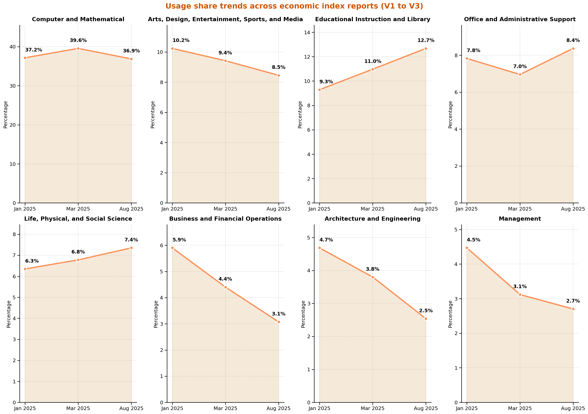

> Figure 1.1: Claude.ai usage over time. Each panel shows the share of sampled conversations on Claude.ai associated with tasks from each SOC major group. We see notable increases in usage for scientific and educational tasks. SOC major groups ranked by usage in our first report.

### 新能力正在塑造使用模式（New capabilities are shaping usage patterns）

At a more granular level, we document changes in task composition that appear linked to features launched between V2 and V3. For example, searching electronic sources and databases grew substantially (0.03% → 0.49%), likely reflecting our web search release in March. In addition, we also see a rise in internet-based research tasks (0.003% → 0.27%), which aligns with the Research mode we released in April.[^6]

在更细的粒度上，我们记录了看似与 V2 与 V3 之间发布的功能相关联的任务构成变化。例如，「检索电子来源与数据库」大幅增长（0.03% → 0.49%），可能与我们在三月发布的网页搜索有关。此外，「基于互联网的研究」类任务也在上升（0.003% → 0.27%），与我们四月发布的 Research 模式相吻合。[^6]

We also see other kinds of changes. Tasks relating to developing instructional materials increased by 1.3pp, growing from a base of 0.2% to 1.5%—a more than 6-fold increase that may reflect growing adoption among educators. Creating multimedia documents rose 0.4pp, nearly tripling from 0.16% to 0.55%, potentially driven by continued use of our Artifacts feature for building traditional and AI-powered apps within Claude.ai.

我们还看到其他种类的变化。开发教学材料类任务增加 1.3 个百分点，从 0.2% 的基数升至 1.5%——超过 6 倍的增长，可能反映教育者中采用的增长。创建多媒体文档上升 0.4 个百分点，从 0.16% 近乎翻三倍至 0.55%，可能由我们的 Artifacts 功能在 Claude.ai 内构建传统与 AI 驱动应用的持续使用所驱动。

Interestingly, the share of tasks involving creating new code more than doubled, increasing by 4.5 percentage points (from 4.1% to 8.6%), while debugging and error correction tasks fell by 2.8 percentage points (from 16.1% to 13.3%)—a net 7.4pp shift toward creation over fixing code. This may suggest that models have become increasingly reliable, such that users spend less time fixing problems and more time creating things in a single interaction.[^7]

有趣的是，涉及创建新代码的任务份额翻了一倍多，上升 4.5 个百分点（从 4.1% 到 8.6%），而调试与纠错类任务下降了 2.8 个百分点（从 16.1% 到 13.3%）——净 7.4 个百分点从「修代码」转向「写代码」。这或许说明模型日益可靠：用户在单次交互中花在修问题上的时间更少、花在创造上的时间更多。[^7]

### 指令式自动化在加速（Directive automation is accelerating）

As in previous reports, we also track not just what people use Claude for but how they collaborate with or delegate to Claude on Claude.ai.

与既往报告一致，我们不仅追踪人们用 Claude 做什么，也追踪他们在 Claude.ai 上如何与 Claude 协作或向它委托任务。

At a high level, we distinguish between automation and augmentation modes of using Claude:

在高层面上，我们区分使用 Claude 的自动化与增强两种模式：

Automation encompasses interaction patterns focused on task completion:

自动化涵盖聚焦任务完成的交互模式：

- Directive: Users give Claude a task and it completes it with minimal back-and-forth
- Feedback Loops: Users automate tasks and provide feedback to Claude as needed

- 指令式：用户交给 Claude 一项任务，它以最少的往返交互完成
- 反馈回路：用户自动化任务，并按需向 Claude 提供反馈

Augmentation focuses on collaborative interaction patterns:

增强聚焦协作式交互模式：

- Learning: Users ask Claude for information or explanations about various topics
- Task Iteration: Users iterate on tasks collaboratively with Claude
- Validation: Users ask Claude for feedback on their work

- 学习：用户就各类话题向 Claude 询问信息或解释
- 任务迭代：用户与 Claude 协作迭代任务
- 验证：用户请 Claude 对自己的工作给出反馈

The share of directive conversations sampled from Claude.ai conversations jumped from 27% in V1 in late 2024 to 39% in V3. This increase came primarily at the expense of task iteration and learning interactions, implying a sizable net increase in the share of conversations exhibiting automative patterns of use – a notable increase in just eight months. This is the first report where automation usage exceeds augmentation usage.

从 Claude.ai 对话中抽样的指令式对话份额，从 2024 年末 V1 的 27% 跳升至 V3 的 39%。这一增长主要蚕食了任务迭代与学习类交互，意味着呈自动化模式使用的对话份额出现了可观的净增长——短短八个月内增幅显著。这是首份自动化使用超过增强使用的报告。

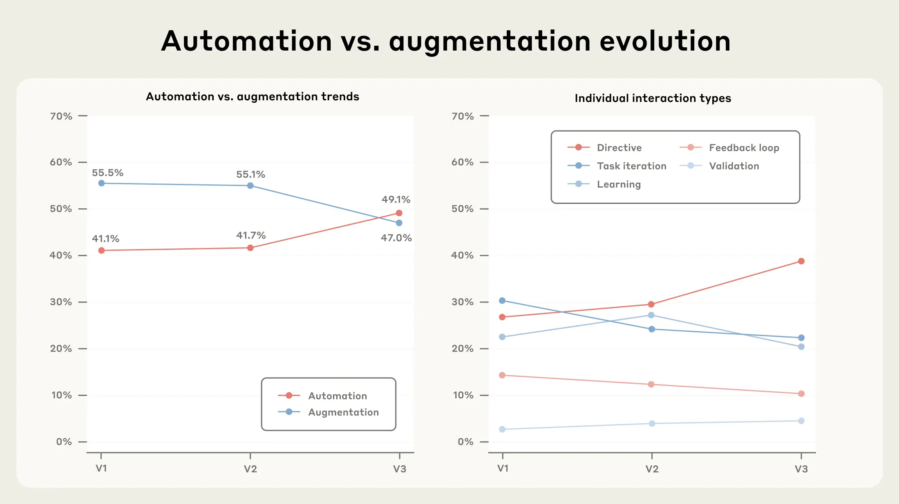

> Figure 1.2: Collaboration mode frequencies across Anthropic Economic Index Reports. The left panel calculates the share of conversations exhibiting either automation or augmentation forms of use. The right panel breaks this out by collaboration mode. Claude tends to be used in more automated ways over time, driven primarily by an increase in directive use.

One interpretation is that this is a result of increasing model capabilities. As models improve at anticipating user needs and producing high-quality outputs on first attempts, users may need fewer follow-up refinements. The jump in directive usage could also signal growing confidence in delegating complete tasks to AI, a form of learning-by-doing.[^8]

一种解释是模型能力提升的结果。随着模型更善于预判用户需求、在首次尝试时便产出高质量结果，用户需要的后续打磨更少。指令式使用的跳升也可能标志着把完整任务委托给 AI 的信心在增强——一种「干中学」（learning-by-doing）。[^8]

Whether the growth in directive usage is attributable to improving model capabilities or learning-by-doing could signal very different labor market implications. If more advanced models simply expand the set of automated tasks, then the risk increases that workers performing such tasks will be displaced. However, if instead the rise in directive use reflects learning-by-doing, then workers most able to adapt to new AI-powered workflows are likely to see greater demand and higher wages. In other words, AI may benefit some workers more than others: it may lead to higher wages for those with the greatest ability to adapt to technological change, even as those with lower ability to adapt face job disruption.[^9] This will be an important area of inquiry for future research.

指令式使用的增长究竟归因于模型能力提升还是「干中学」，可能预示截然不同的劳动力市场影响。如果更先进的模型只是扩大了可自动化任务的集合，那么执行这些任务的劳动者被替代的风险就会上升。但如果指令式使用的上升反映的是「干中学」，那么最能适应新 AI 工作流的劳动者可能会看到更大的需求与更高的工资。换言之，AI 对一些劳动者的好处可能多于另一些人：适应技术变化能力最强者的工资可能上升，而适应能力较弱者面临工作扰动。[^9] 这将是未来研究的一个重要方向。

## 展望（Looking ahead）

The V3 data reveals that AI capabilities and adoption are continuing to progress. Knowledge-based tasks, including educational and scientific applications, continue their fast growth rate, and new product features appear to be enabling different types of work rather than just accelerating existing tasks.

V3 数据显示，AI 能力与采用仍在推进。包括教育与应用科学在内的知识型任务保持快速增长，新功能似乎在催生不同类型的工作，而不只是加速既有任务。

Most strikingly, the data point toward increased delegation of tasks to AI systems–perhaps due to some combination of user trust in the technology as well as improvement of underlying model capabilities. This could also be due to changes in the underlying user base. The next chapter of this report for the first time breaks down usage across geography, allowing us to disentangle temporal vs. geographic changes more clearly going forward. We will continue to track these trends closely in future reports.

最引人注目的是，数据指向把更多任务委托给 AI 系统——也许是用户对技术的信任与底层模型能力改进的共同结果，也可能源于底层用户群体的变化。本报告下一章首次按地理拆解使用情况，让我们今后能更清晰地区分时间性变化与地理性变化。我们将在未来报告中持续密切追踪这些趋势。

[^6]: "Search electronic sources, such as databases or repositories, or manual sources for information" increased from 0.03% to 0.49%. "Conduct internet-based and library research" increased from 0.003% to 0.27%. / 「检索电子来源（如数据库或知识库）或人工来源以获取信息」从 0.03% 升至 0.49%；「开展基于互联网与图书馆的研究」从 0.003% 升至 0.27%。
[^7]: Tasks were collated from the set of tasks whose frequency has changed by a magnitude greater than or equal to 0.2 percentage points. Programming creation tasks include: "write new programs or modify existing programs" (1.5% → 4.9%), "design, build, or maintain web sites" (1.2% → 2.0%), "write, analyze, review, and rewrite programs" (1.2% → 0.5%), "develop new software applications" (0.06% → 0.6%), "develop transactional web applications" (0.1% → 0.3%), and "develop application-specific software" (0.05% → 0.3%). Debugging/error correction tasks include: "modify existing software to correct errors" (two variants: 2.5% → 3.8% and 4.8% → 2.7%), "correct errors by making appropriate changes" (3.0% → 2.1%), "perform initial debugging procedures" (2.0% → 0.9%), "diagnose, troubleshoot, and resolve hardware/software problems" (1.6% → 2.5%), "review and analyze computer printouts to locate code problems" (1.3% → 0.9%), and "determine sources of web page or server problems" (0.9% → 0.4%). / 任务整理自频率变化幅度不小于 0.2 个百分点的任务集合。编程创建类任务包括：「编写新程序或修改现有程序」（1.5% → 4.9%）、「设计、构建或维护网站」（1.2% → 2.0%）、「编写、分析、审查与重写程序」（1.2% → 0.5%）、「开发新软件应用」（0.06% → 0.6%）、「开办事物型 Web 应用」（0.1% → 0.3%）与「开发专用软件」（0.05% → 0.3%）。调试/纠错类任务包括：「修改现有软件以纠正错误」（两个变体：2.5% → 3.8% 与 4.8% → 2.7%）、「通过恰当修改纠正错误」（3.0% → 2.1%）、「执行初始调试流程」（2.0% → 0.9%）、「诊断、排障并解决硬件/软件问题」（1.6% → 2.5%）、「审查分析计算机打印输出以定位代码问题」（1.3% → 0.9%）与「确定网页或服务器问题来源」（0.9% → 0.4%）。
[^8]: We note that V3 uses Claude Sonnet 4 for classification, while V2 used Sonnet 3.7, which complicates direct comparison. To address this, we reran V3 data with Sonnet 3.7 and still found directive interactions rising significantly (though to a lower absolute level of 45% automation versus 49% with Sonnet 4). We also verified this trend is not driven by changes in task mix—the shift toward directive interactions appears across a wide range of occupational categories, suggesting it reflects genuine changes in how people interact with Claude rather than compositional effects. / 需要说明：V3 用 Claude Sonnet 4 做分类，而 V2 用的是 Sonnet 3.7，这让直接比较变得复杂。为解决这一点，我们用 Sonnet 3.7 重跑了 V3 数据，仍然发现指令式交互显著上升（尽管自动化绝对水平较低，为 45% 对 Sonnet 4 的 49%）。我们还验证了这一趋势并非任务构成变化所致——向指令式交互的转移出现在众多职业类别中，说明它反映的是人们与 Claude 交互方式的真实变化，而非构成效应。
[^9]: Nelson and Phelps, 1966 Investment in Humans, Technological Diffusion, and Economic Growth is a classic reference for the value of education in equipping workers to adapt to change. See also Goldin and Katz, 2008 The Race between Education and Technology. We thank Anton Korinek for the observation that AI itself might accelerate the diffusion and economic impact of AI to the extent that it plays the role that skilled workers played in the past in figuring out how to effectively wield new technologies in novel settings. / 关于「教育让劳动者有能力适应变化」的经典文献见 Nelson 与 Phelps（1966）《人力投资、技术扩散与经济增长》；另见 Goldin 与 Katz（2008）《教育与技术的赛跑》。感谢 Anton Korinek 的观察：AI 本身或许会加速 AI 的扩散与经济影响——在新的环境中摸索如何有效驾驭新技术这件事，过去由熟练劳动者承担，如今 AI 可以承担这一角色。

# 第二章：Claude 在美国与全球的使用（Chapter 2: Claude usage across the United States and the globe）

## 概览（Overview）

Where AI gets adopted first—and how it's used—will shape economic outcomes across the world. By analyzing Claude usage patterns across 150+ countries and all US states, we uncover three key dynamics: where early adopters are, what they're using AI for, and how usage evolves as adoption matures. These geographic patterns provide real-world evidence about AI's economic diffusion, helping track whether different regions are converging or diverging in their AI adoption, and revealing how local economic characteristics shape technology deployment.

AI 最早被采用于何处——以及如何被使用——将塑造世界各地的经济结果。通过分析 150 多个国家与美国全部州的 Claude 使用模式，我们揭示三个关键动态：早期采用者在哪里、他们用 AI 做什么、以及随着采用成熟使用如何演化。这些地理模式为 AI 的经济扩散提供了现实世界的证据，帮助追踪不同地区在 AI 采用上是在收敛还是分化，并揭示地方经济特征如何塑造技术部署。

Our data, relying on a privacy-preserving[^10] analysis of 1 million Claude.ai conversations[^11], confirmed some of our expectations while challenging others. The US dominates total usage at 21.6%, which is unsurprising given its size and high income. But even when adjusting for the working-age population size, higher-income countries tend to have higher usage. For example, Singapore's usage rate is 4.5 times what its working-age population would suggest, while large regions of the globe show minimal usage. Interestingly, within the US, DC and Utah outpace California in usage per capita.

我们的数据基于对 100 万段 Claude.ai 对话的隐私保护分析[^10]（见[^11]），既印证了部分预期，也挑战了另一些预期。美国以 21.6% 主导总用量，考虑其体量与高收入，这并不意外。但即便按劳动年龄人口调整，较高收入国家的使用也往往更高。例如，新加坡的使用率是其劳动年龄人口所暗示水平的 4.5 倍，而全球大片地区使用极低。有趣的是，在美国国内，特区与犹他州的人均使用超过了加州。

We also observe changes in AI use cases as adoption per capita deepens. Countries with lower AI adoption per capita concentrate overwhelmingly on coding tasks—over half of all usage in India, compared to roughly a third globally. As adoption matures, usage diversifies, with a rising emphasis on education, science, and business operations.

我们还观察到，随着人均采用加深，AI 用例也在变化。人均 AI 采用较低的国家压倒性地集中于编码任务——印度过半的使用都是编码，全球约为三分之一。随着采用成熟，使用走向多样，对教育、科学与业务运营的重视上升。

Even more striking: mature markets tend to use AI more collaboratively, while emerging markets are more likely to delegate complete tasks to it—perhaps reflecting differences in how AI is deployed by economies at different stages of structural transformation. Our data provides a window into these patterns across geographies, and going forward, will enable us to track whether these adoption gaps narrow, widen, or change in structure over time.

更引人注目的是：成熟市场倾向以更协作的方式使用 AI，而新兴市场更可能把完整任务委托给它——这或许反映了处于结构转型不同阶段的经济体部署 AI 方式的差异。我们的数据为了解各地的这些模式提供了一扇窗，往后还能追踪这些采用缺口会收窄、扩大、还是在结构上发生变化。

[^10]: For privacy reasons, our automated analysis system filters out any cells—e.g., countries, and (country, task) intersections—with fewer than 15 conversations and 5 unique user accounts. For bottom-up request clusters, we have an even higher privacy filter of at least 500 conversations and 250 unique accounts. / 出于隐私考虑，我们的自动分析系统会过滤掉任何少于 15 段对话且少于 5 个独立用户账号的单元格——例如国家、（国家，任务）交叉项。对自下而上的请求簇，隐私过滤更严格：至少 500 段对话与 250 个独立账号。
[^11]: Data in this section covers 1 million Claude.ai Free and Pro conversations from August 4 to 11, 2025, randomly sampled from all conversations in that period that were not flagged as potential trust and safety violations. The unit of observation is a conversation with Claude on Claude.ai, not a user, so it is possible that multiple conversations from the same user are included, though our past work suggests that sampling conversations at random versus stratified by user does not yield substantively different results. Aggregate geographic statistics at the country and US state level were assessed and tabulated from the IP address of each conversation. For geolocation, we use ISO-3166 codes since our provider for IP geolocation uses this standard. International locations use ISO-3166-1 country codes, US state level data use ISO-3166-2 region codes, which include all 50 US states and Washington DC. We exclude conversations originating from VPN, anycast, or hosting services, as determined by our IP geolocation provider. / 本节数据涵盖 2025 年 8 月 4 日至 11 日的 100 万段 Claude.ai Free 与 Pro 对话，从该时期所有未被标记为潜在信任与安全违规的对话中随机抽样。观测单位是 Claude.ai 上与 Claude 的一次对话而非用户，因此同一用户的多段对话可能都被纳入；不过我们过去的工作表明，按对话随机抽样与按用户分层抽样在结果上没有实质差异。国家与美国州级的汇总地理统计基于每段对话的 IP 地址评估与制表。地理定位使用 ISO-3166 代码，因为我们的 IP 地理定位供应商采用该标准：国际地点用 ISO-3166-1 国家代码，美国州级数据用 ISO-3166-2 区域代码（涵盖全部 50 个州与华盛顿特区）。我们排除来自 VPN、任播或托管服务的对话（由 IP 地理定位供应商判定）。

## Claude 在全球的扩散（Claude diffusion across the globe）

### Claude 总使用量以美国为最高（Total Claude usage is highest in the US）

Claude adoption overall is highly geographically concentrated. In terms of total global usage, the United States accounts for the highest share (21.6%), with the next highest usage countries showing significantly lower shares (India at 7.2%, Brazil at 3.7%, see Figure 2.1). However, this concentration is affected by the population size of each country[^12] – larger countries may have larger usage shares purely because of their population size.

总体而言，Claude 的采用在地理上高度集中。就全球总用量而言，美国份额最高（21.6%），紧随其后的国家份额显著更低（印度 7.2%、巴西 3.7%，见图 2.1）。不过，这种集中度受各国人口规模影响——大国仅凭人口规模就可能拥有更大的使用份额。


> Figure 2.1: Leading countries in terms of global Claude.ai usage share. The data includes Claude.ai Free and Pro conversations.

[^12]: International locations use ISO-3166-1 country codes, which includes countries and some territories. / 国际地点使用 ISO-3166-1 国家代码，其中包含国家与部分领地。

### 人均 Claude 使用集中于科技发达的国家（Per capita usage of Claude is concentrated in technologically advanced countries）

To account for differences in population size, we analyze usage adjusted for the working-age population, introducing a new measure called the Anthropic AI Usage Index (AUI): For each geography, we calculate its share of Claude usage, and its share of the working-age population (ages 15-64). We then calculate the AUI by dividing these shares:

为修正人口规模差异，我们分析按劳动年龄人口调整后的使用量，并引入一个新度量——Anthropic AI 使用指数（AUI）：对每个地理单元，我们计算其 Claude 使用份额与劳动年龄人口（15–64 岁）份额，然后把两个份额相除得到 AUI。

This index reveals whether countries use Claude more or less than expected relative to their working-age population. A region with an AUI > 1 has higher usage than expected after adjusting for population, while a region with an AUI < 1 has lower usage.

该指数揭示各国相对其劳动年龄人口对 Claude 的使用是高于还是低于预期。AUI > 1 的地区在人口调整后的使用高于预期，AUI < 1 则低于预期。

The results reveal a striking pattern of concentration among small, technologically advanced economies. Israel leads global per capita Claude usage with an Anthropic AI Usage Index of 7—meaning its working-age population uses Claude 7x more than expected based on its population. Singapore follows at 4.57, while Australia (4.10), New Zealand (4.05) and South Korea (3.73) round out the top five countries in terms of per capita Claude usage.

结果揭示出一个小型科技发达经济体高度集中的醒目模式。以色列以 AUI 7 领跑全球人均 Claude 使用——意味着其劳动年龄人口对 Claude 的使用是按人口预期水平的 7 倍。新加坡以 4.57 次之，澳大利亚（4.10）、新西兰（4.05）与韩国（3.73）补齐人均 Claude 使用前五。

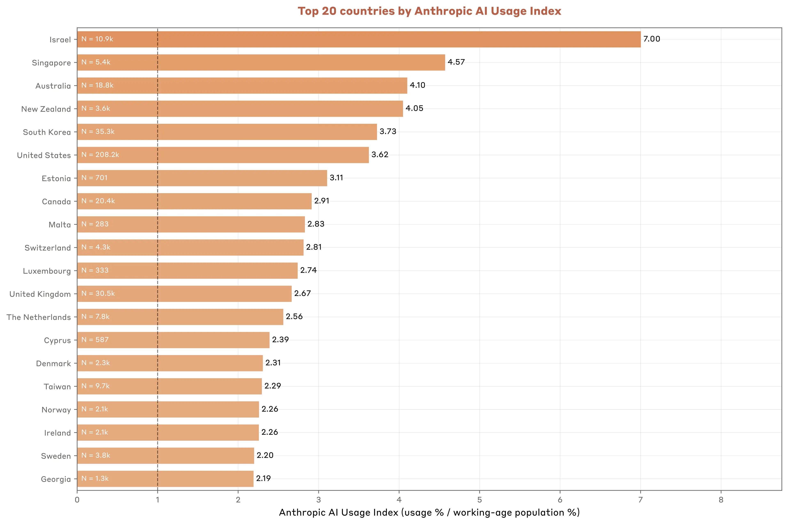

> Figure 2.2: Small, technologically advanced countries are leading in Claude adoption per capita. The figure shows the top 20 countries based on the Anthropic AI Usage Index. We only include countries with at least 200 observations in our sample for this figure because of the uncertainty of the measure for low-usage countries in our random sample. The underlying data includes Claude.ai Free and Pro usage.

Next, we create per capita usage tiers based on the AUI. We look at countries with at least 200 conversations in our random sample of 1 million conversations, and set thresholds for different usage tiers-based quartiles, i.e. Leading (top 25%), Upper Middle (50-75%), Lower Middle (25%-75%) and Emerging (bottom 25%). We then assign countries, even if they have fewer than 200 observations, to a tier based on their AUI. We assign countries for which we have population data, but no usage in our sample, to a Minimal tier.[^13] Figure 2.3 illustrates the Anthropic AI Usage Index tiers across the globe, Table 2.1 shows an overview of the tiers and country examples.[^14][^15]

接下来，我们基于 AUI 划分人均使用层级。我们考察在 100 万对话随机样本中至少有 200 段对话的国家，并按四分位数设定不同使用层级的阈值，即：领先（前 25%）、中上（50–75%）、中下（25–75%）与新兴（后 25%）。然后即便某国观测数不足 200，我们也按其 AUI 把它归入相应层级。对有人口数据但样本中没有使用记录的国家，我们归入「极低」（Minimal）层级。[^13] 图 2.3 展示全球 AUI 层级分布，表 2.1 概括各层级及国家示例。[^14][^15]

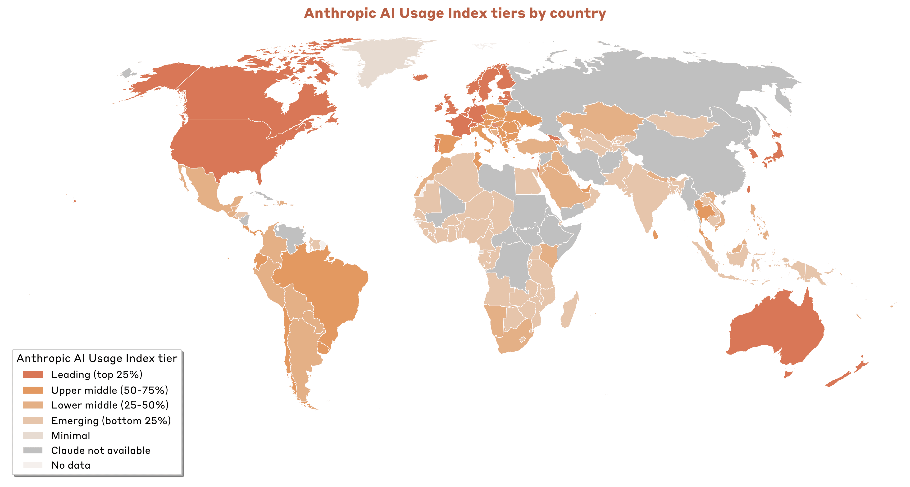

> Figure 2.3: Claude diffusion varies across countries, with countries in North America, Europe and Oceania leading in Claude adoption per working-age capita. The different tiers reflect a country's position within the global distribution of the Anthropic AI Usage Index as defined in this chapter.

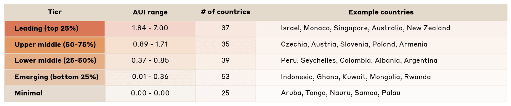

> Table 2.1: Anthropic Economic Index tiers with examples, number of countries, and AUI range for each tier.

[^13]: Tier thresholds (quartiles) are based on countries with at least 200 observations for the global level, and on US states with at least 100 observations for the US level. Countries with no observed usage are assigned to the Minimal tier since we do not know if they have exactly zero usage or little usage that our random sample did not capture. Future work, for example using stratified sampling, will allow us to explore these patterns with higher accuracy given limited observations for smaller countries and states. / 层级阈值（四分位数）在全球层面基于至少 200 条观测的国家、在美国层面基于至少 100 条观测的州。没有观测到使用的国家被归入「极低」层级，因为我们无从知晓它们是恰好零使用、还是使用很少以致随机样本没有捕捉到。未来工作（例如分层抽样）将让我们在观察有限的小国与州上以更高精度探索这些模式。
[^14]: The world map is based on Natural Earth's world map with the ISO standard point of view for disputed territories, which means that the map may not contain some disputed territories. We note that in addition to the countries shown in gray ("Claude not available"), we do not operate in the Ukrainian regions Crimea, Donetsk, Kherson, Luhansk, and Zaporizhzhia. In accordance with international sanctions and our commitment to supporting Ukraine's territorial integrity, our services are not available in areas under Russian occupation. / 世界地图基于 Natural Earth 世界地图并采用 ISO 关于争议领土的标准视角，因此可能不含部分争议领土。除以灰色显示的国家（「Claude 不可用」）外，我们也不在乌克兰的克里米亚、顿涅茨克、赫尔松、卢甘斯克与扎波罗热地区运营。依照国际制裁及我们对支持乌克兰领土完整的承诺，我们的服务在俄占地区不可用。
[^15]: "No data" applies to countries with partially missing data. Some territories (e.g., Western Sahara, French Guiana) have their own ISO-3611 code. Some of these have some usage, others have none. Since the Anthropic AI Usage Index is calculated per working-age capita based on working age population data from the World Bank, and population data is not readily available for all of these territories, we cannot calculate the AUI for these territories. / 「无数据」适用于数据部分缺失的国家。一些领地（如西撒哈拉、法属圭亚那）有自己的 ISO-3166 代码，其中一些有部分使用、另一些没有。由于 Anthropic AI 使用指数按劳动年龄人口计算、而人口数据取自世界银行且并非所有领地都有现成数据，我们无法计算这些领地的 AUI。

## 聚焦人均使用的领先与新兴国家（Zooming into leading and emerging countries in terms of per capita usage）

This concentration in advanced economies with limited population sizes reflects their established patterns as technology pioneers. For example, both Israel and Singapore rank highly in the Global Innovation Index—a measure of how innovative different economies across the globe are—suggesting that general investments in information technology position economies well for rapid adoption of frontier AI. Overall, these economies can leverage their educated workforces, robust digital infrastructure, and innovation-friendly policies to create fertile conditions for AI.

这种集中于人口规模有限的发达经济体的现象，反映了它们作为技术先驱的既有格局。例如，以色列与新加坡在全球创新指数（衡量各经济体创新程度的指标）上都名列前茅，提示在信息技术上的总体投资让这些经济体在快速采用前沿 AI 上占得先机。总体而言，这些经济体可以借助受过教育的劳动力、稳健的数字基础设施与亲创新的政策，为 AI 创造肥沃的土壤。

Notable is the position of major developed economies in Claude usage. The United States (3.62) ranks among leading countries in terms of per capita adoption, with Canada (2.91) and the United Kingdom (2.67) having elevated but more moderate rates of adoption as compared to their population. Other major economies show lower adoption, including France at 1.94, Japan at 1.86, and Germany at 1.84.

主要发达经济体在 Claude 使用中的位置也值得注意。美国（3.62）在人均采用上位居领先国家之列；加拿大（2.91）与英国（2.67）相对其人口采用率偏高但更温和。其他主要经济体采用较低：法国 1.94、日本 1.86、德国 1.84。

Meanwhile, many lower and middle-income economies show minimal Claude usage, with many countries across Africa, Latin America, and parts of Asia showing Claude adoption below what would be expected based on their working-age population. This includes Bolivia (0.48), Indonesia (0.36), India (0.27), and Nigeria (0.2).

与此同时，许多中低收入经济体的 Claude 使用极低：非洲、拉丁美洲与亚洲部分地区的大量国家，其 Claude 采用低于按劳动年龄人口的预期水平。这包括玻利维亚（0.48）、印度尼西亚（0.36）、印度（0.27）与尼日利亚（0.2）。

This variation in usage is reflective of income differences across these economies. We see a strong positive correlation between Claude adoption and Gross Domestic Product per working-age capita (see Figure 2.4), with a 1% increase in GDP per capita being associated with a 0.7% increase in Claude usage per capita.

使用的这种差异反映了这些经济体之间的收入差距。Claude 采用与劳均 GDP 强正相关（见图 2.4）：人均 GDP 每增加 1%，人均 Claude 使用增加 0.7%。


> Figure 2.4: Claude usage per capita is positively correlated with income per capita across countries. We only include countries with at least 200 observations in our sample for this figure because of the uncertainty of the measure for low-usage countries in our random sample. Axes are on a log scale, highlighting a power law distribution. Each country is represented by its 3-letter ISO code.

The disparities in Claude usage likely reflect a confluence of factors, some of which are correlated with income:

Claude 使用的差距可能反映多种因素的合力，其中一些与收入相关：

- Digital infrastructure: High-usage countries typically have robust internet connectivity and cloud computing access needed to access AI assistants.
- Economic structure: As documented in this and previous reports, Claude capabilities are well-suited to various tasks typical of knowledge workers. Advanced economies tend to have a greater share of the workforce in such roles as compared to lower-income economies with a larger employment share in manufacturing.
- Regulatory environment: Governments differ in how actively they encourage the use of AI across different industries and in how heavily they regulate the technology.
- Awareness and access: Countries with stronger connections to Silicon Valley and AI research communities may have greater awareness of and access to Claude.
- Trust and comfort: Public opinion on trust in AI varies substantially across countries.

- 数字基础设施：高使用国家通常拥有接触 AI 助手所需的扎实互联网连接与云计算资源。
- 经济结构：如本报告及既往报告所述，Claude 的能力非常适合知识工作者的典型任务。发达经济体中这类岗位的劳动力占比，往往高于制造业就业份额更大的较低收入经济体。
- 监管环境：各国政府对不同行业 AI 使用的鼓励力度、以及对技术的监管强度不同。
- 认知与获取：与硅谷及 AI 研究社区联系更紧密的国家，对 Claude 的认知与获取渠道可能更多。
- 信任与放心程度：各国民众对 AI 的信任度差异很大。

## Claude 在美国的扩散（Claude diffusion across the United States）

Within the US, California overwhelmingly leads with 25.3% of usage. Other states with major tech centers like New York (9.3%), Texas (6.7%), and Virginia (4.0%) also rank highly. Though not adjusted for population, we suspect that these strong adoption figures partly reflect rapid adoption in technology hubs—in keeping with how economically consequential technologies have historically tended to diffuse.

在美国国内，加州以 25.3% 的使用占比压倒性领先。拥有大型科技中心的其他州也名列前茅：纽约（9.3%）、得州（6.7%）与弗吉尼亚（4.0%）。虽然未经人口调整，但我们怀疑这些强劲的采用数字部分反映了科技中心的快速采用——这与历史上经济上举足轻重的技术的扩散方式一致。

This narrative becomes more complex, however, when we adjust for the population size of each state. Surprisingly, the District of Columbia leads with an Anthropic AI Usage Index of 3.82, indicating that Claude usage in DC is 3.82x greater than its share of the country's working-age population. Closely following is Utah (3.78), notably ahead of California (2.13), New York (1.58) and Virginia (1.57).[^16]

不过，当我们按各州人口规模调整后，叙事变得更复杂。出人意料的是，华盛顿特区以 3.82 的 AUI 领跑——特区对 Claude 的使用是全国劳动年龄人口份额的 3.82 倍。紧随其后的是犹他州（3.78），显著领先于加州（2.13）、纽约（1.58）与弗吉尼亚（1.57）。[^16]

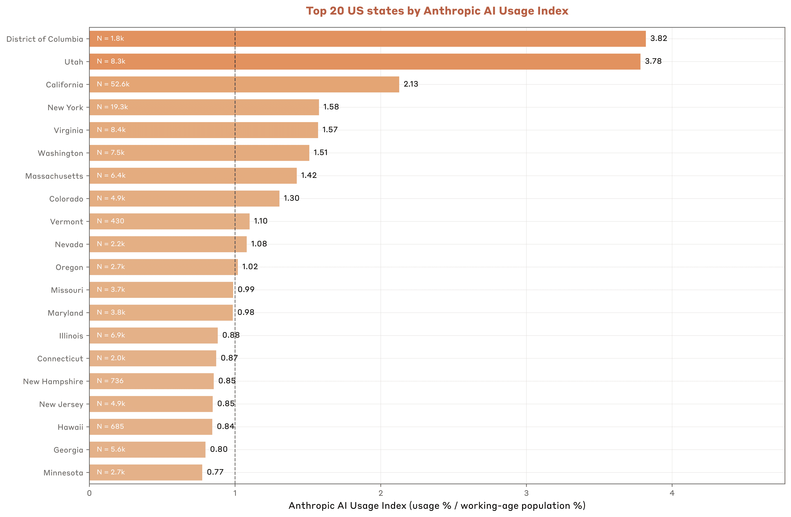

> Figure 2.5: Leading US states in terms of Claude adoption per working-age capita include the District of Columbia, Utah, California, New York and Virginia. The figure shows the top 20 US states based on the Anthropic AI Usage Index. We only include states with at least 100 observations in our sample for this figure because of the uncertainty of the measure for low-usage states in our random sample. The underlying data includes Claude.ai Free and Pro usage.

[^16]: When further investigating Utah's activity, we discovered a notable fraction of its usage appeared to be possibly associated with coordinated abuse. This is also reflected in a much higher "directive" automation score than average. However, we ran robustness checks and believe that this activity is not driving the results. / 进一步调查犹他州的活动后，我们发现其使用中有相当一部分似与协同滥用相关。这也体现在其「指令式」自动化得分远高于平均值上。不过我们做了稳健性检验，认为这类活动并未主导结果。

We document a similar, but weaker correlation than at the global level between Claude adoption and income per capita across US states. Income differences explain less than half the variation in cross-state adoption rates. Despite this weaker correlation, we find that Claude adoption rises faster with income: Each 1% increase in state GDP per capita is associated with a 1.8% increase in the AI Usage Index.

在美国各州之间，我们记录到 Claude 采用与人均收入的正相关与全球类似但更弱：收入差异解释不了跨州采用率变异的一半。尽管相关性较弱，我们发现 Claude 随收入上升得更快：州人均 GDP 每增加 1%，AI 使用指数增加 1.8%。


> Figure 2.6: Claude usage varies across US states, with high per-capita usage in the West Coast, but also higher usage in Nevada, Utah, Colorado, Missouri, and Virginia. The different tiers reflect a US state's position within the US distribution of the Anthropic AI Usage Index as defined in this chapter.

## 各国的任务使用模式（Task usage patterns across countries）

We observe notable variation in how Claude is used in different countries. As in past reports, we analyze these trends using two different approaches. First, we classify conversations into tasks according to O*NET, a US taxonomy that maps specific tasks to occupations and occupation groups (e.g., a task involving software debugging would fall into the Computer and Mathematical occupation group).

我们观察到不同国家使用 Claude 方式的显著差异。与既往报告一致，我们用两种方法分析这些趋势。第一，按 O*NET（美国把具体任务映射到职业与职业组的分类体系）把对话归入任务（例如涉及软件调试的任务会归入「计算机与数学」职业组）。

Second, we use Claude to construct a bottom-up taxonomy of user requests on Claude.ai, which provides insight into usage patterns that do not fit neatly into existing taxonomies. For example, the request cluster "help write and improve cover letters for job applications" (lowest level) feeds into the higher-level cluster "help with job applications, resumes, and career documents" (middle level), which in turn feeds into the cluster "help with job applications, resumes, and career advancement" (highest level). These two complementary approaches allow us to both report results aligned with standard labor statistics, and provide flexibility to capture tasks that standard taxonomies miss.

第二，我们用 Claude 为 Claude.ai 上的用户请求构建自下而上的分类体系，以洞察那些难以被现有分类体系整齐收纳的使用模式。例如，「帮助撰写与改进求职信」请求簇（最低层）汇入更高层的「求职申请、简历与职业文档帮助」簇（中层），再汇入「求职申请、简历与职业发展帮助」簇（最高层）。这两种互补的方法让我们既能报告与标准劳动统计一致的结果，又能灵活捕捉标准分类漏掉的任务。

### 更高的人均 Claude 使用伴随更多样的任务用途（Higher per capita Claude usage is associated with more diverse task usage）

When analyzing O*NET tasks aggregated at the highest level (in terms of the Standard Occupation Classification occupation groups they belong to), we notice strong variation across countries. While the overall pattern is noisy–especially for countries with fewer observations–Figure 2.7 suggests that as we progress from lower to higher per capita Claude adoption, usage shifts away from tasks in the Computer and Mathematical occupation group (e.g., programming) to more diverse tasks in areas such as education, office and administrative uses, and arts. We also see increased usage in the life, physical and social sciences.

在最高层级（按任务所属的标准职业分类职业组）汇总分析 O*NET 任务时，我们注意到各国差异显著。虽然总体模式嘈杂（观测较少的国家尤甚），图 2.7 提示：随着从较低人均 Claude 采用走向较高采用，使用从「计算机与数学」职业组的任务（如编程）转向教育、办公与行政、艺术等领域更多样的任务；生命、物理与社会科学的使用也在增加。

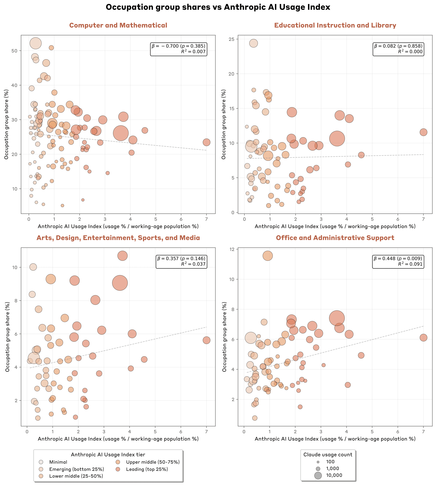

> Figure 2.7: As we move from lower to higher adoption countries, Claude usage appears to shift away from programming-dominant tasks to a more diverse mix of tasks, though the overall pattern is noisy. This figure shows the relationship between the Anthropic AI Usage Index and the most frequent Standard Occupation Classification (SOC) occupation groups. Each panel shows a different SOC group. SOC share is based on how many O*NET tasks in a given geography fall into a given SOC group. The color indicates which AUI tier a country falls into. The bubble size indicates the usage count for each country. We only include countries with at least 200 observations in our sample for this figure because of the uncertainty of the measure for low-usage countries in our random sample. The regression weights every country equally.

Country idiosyncrasies also emerge when looking at our bottom-up request taxonomy.[^17] Take, for example, the United States, Brazil, Vietnam, and India, which represent the country with the highest total usage within a given Anthropic AI Usage Index tier. Users in the United States disproportionately use Claude for household management purposes, to search for jobs, and for medical guidance compared to the global average. By contrast, Claude users in Brazil have comparatively high usage for both translation and legal services. Vietnam's top disproportionate requests are related to software development and education, and India's top disproportionate requests focus almost exclusively on software development. This likely reflects local specialization: Brazil has been an early adopter of AI in the judicial system, and India has a large information technology sector.

在自下而上的请求分类中，各国特色也浮现出来。[^17] 以美国、巴西、越南与印度为例——它们分别是各自 AUI 层级中总使用量最高的国家。与全球平均相比，美国用户把 Claude 超额用于家务管理、找工作与医疗指导；巴西用户在翻译与法律服务上的使用相对偏高；越南超额最多的请求与软件开发及教育相关；印度的超额请求则几乎完全聚焦软件开发。这可能反映了本地专业化：巴西一直是司法系统应用 AI 的早期采用者，而印度拥有庞大的信息技术产业。

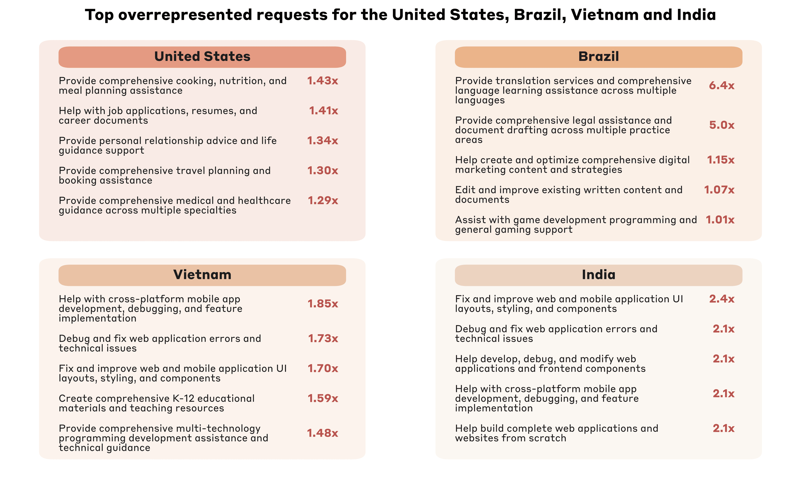

> Figure 2.8: Overrepresented request clusters for the United States, Brazil, Vietnam and India. A request is overrepresented in a country when the share of conversations containing that request is higher for that country than globally. For this figure, we focus on request clusters at the middle level of granularity, i.e. more aggregated than the lowest level request clusters, but less aggregated than the highest level request clusters. Only includes requests with at least 1% frequency globally and for that country.

[^17]: Requests were filtered to those that represent at least 1% of requests at the global level and 1% of the local level. / 请求经筛选，须在全球层面与当地层面均至少占请求量的 1%。

Across all countries, software development emerges as the most common use of Claude. Why do developer tasks consistently lead in overall Claude usage patterns? Several factors likely contribute to this effect:

在所有国家，软件开发都是 Claude 最常见的用途。为什么开发者任务在 Claude 的总体使用模式中持续领先？几个因素可能有所贡献：

- Model-task fit: Claude is a very strong coding model and readily deployed across code generation, debugging, and technical problem-solving tasks.
- Developer receptivity: Developer communities embrace new tools rapidly, and this usage diffuses through their social and professional networks.
- Low organizational barriers: Individual developers can typically adopt Claude without complex approval processes—in contrast to, say, medical use cases.

- 模型-任务契合：Claude 是很强的编码模型，可顺畅部署于代码生成、调试与技术问题求解。
- 开发者接受度：开发者社区拥抱新工具的速度快，使用会经由其社交与职业网络扩散。
- 低组织门槛：个人开发者通常无需复杂审批即可采用 Claude——不像医疗等使用场景。

## 美国各州的任务使用模式（Task usage patterns across the United States）

In this section we explore patterns of Claude usage across states within the US, giving us further insight into how local economic conditions shape usage patterns. As we discuss above, cross-state differences in the Anthropic AI Usage Index account for less than half of the variation in income differences across US states. This suggests that other regional differences—including the compatibility of Claude capabilities with the occupational composition of the local workforce—play a larger role in determining why usage is more concentrated in some states than others.

本节探索美国各州 Claude 使用的模式，进一步洞察地方经济条件如何塑造使用。如上所述，AUI 的跨州差异只能解释不到一半的州际收入差异。这提示：其他区域差异——包括 Claude 能力与当地劳动力职业构成的契合度——在决定使用为何在某些州更集中上作用更大。

In a number of states, we see evidence that local patterns of AI use aligns with distinctive features of the local economy. When analyzing the top states in each usage tier—California for leading, Texas for upper middle, Florida for lower middle, and South Carolina for emerging—we see strong variation in terms of our bottom-up request taxonomy (see Figure 2.9).

在多个州，我们看到了地方 AI 使用模式与当地经济特色相吻合的证据。分析各使用层级的头号州——领先层的加州、中上层的得州、中下层的佛州与新兴层的南卡罗来纳——我们在自下而上的请求分类上看到强烈差异（见图 2.9）。

For example, California shows disproportionate use for IT-related requests, digital marketing and translation, likely reflecting its tech sector and linguistically diverse population. California also has disproportionately frequent requests for help with basic numerical tasks, which may represent tests of model capabilities or abuse. Florida sees disproportionate use for business advice and fitness, potentially tied to its role as a financial hub with relatively low tax rates and a warm climate amenable to outdoor activities.

例如，加州在 IT 相关请求、数字营销与翻译上的使用明显超额，可能反映其科技产业与语言多元的人口。加州对基础数字计算帮助的请求也超额频繁，可能代表对模型能力的测试或滥用。佛州在商业建议与健身上的使用超额，可能与其作为税率相对较低、气候温暖宜户外活动的金融中心的角色有关。

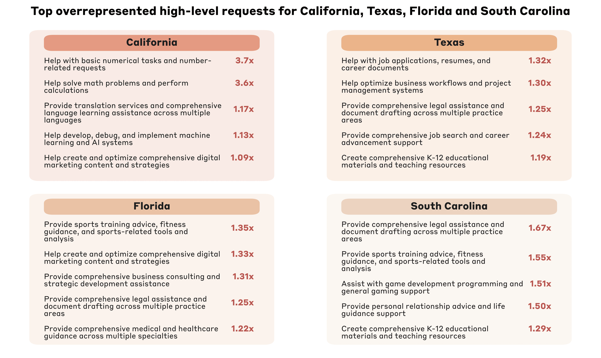

> Figure 2.9: Overrepresented request categories for California, Texas, Florida and South Carolina. A request is overrepresented in a state when the share of conversations containing that request is higher for that state than in the US as a whole. For this figure, we focus on request clusters at the middle level of granularity, i.e. more aggregated than the lowest level request clusters, but less aggregated than the highest level request clusters. Only includes requests with at least 1% frequency in the United States and for that state.

Within the US, D.C. leads in terms of per capita Claude usage, with a disproportionate focus on document editing, information provision and job applications across both the O*NET task classification and bottom-up categorization (see Figure 2.10). For example, help with job applications is 1.84x as common in DC as in the US overall. Our interactive dashboard allows everyone to explore the full range of variation and patterns across US states.

在美国国内，特区的人均 Claude 使用领先，无论 O*NET 任务分类还是自下而上分类，都超额聚焦于文档编辑、信息提供与求职申请（见图 2.10）。例如，求职申请帮助在特区的常见度是全美平均的 1.84 倍。我们的交互式仪表盘让每个人都能探索美国各州差异与模式的全部范围。

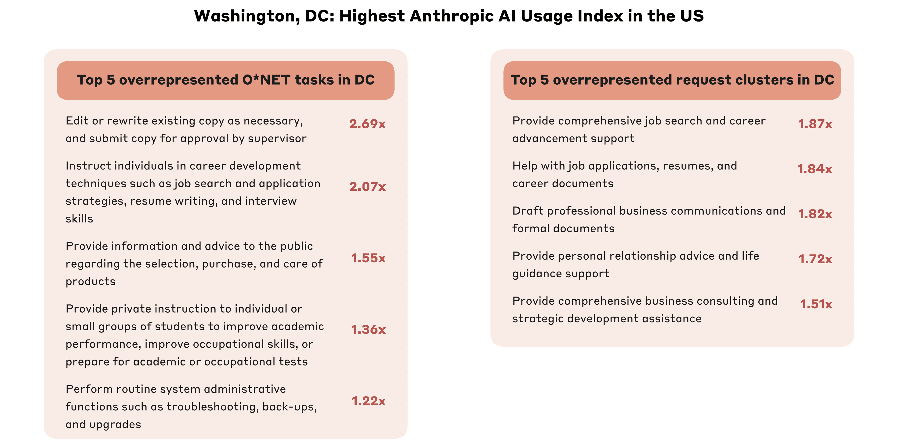

> Figure 2.10: Washington, DC has the highest Claude usage per capita, with disproportionate tasks and requests focusing on document editing, information provision and job applications. O*NET tasks refer to tasks in the O*NET taxonomy. Requests are based on the bottom-up request categories that describe what requests users make of Claude. A task or request is overrepresented in a state when the share of conversations containing that task or request is higher for that state than in the US as a whole. For this figure, we focus on request clusters at the middle level of granularity. Only includes requests with at least 1% frequency in the United States and for that state.

## 人机协作的地理模式（Geographic patterns in human-AI collaboration）

While previous sections examined what tasks people use Claude for, an equally revealing pattern emerges in how they interact with it. Here, we use the same augmentation and automation collaboration patterns as defined in Chapter 1.

前面几节考察的是人们用 Claude 做什么任务，而人们如何与它交互同样能说明问题。这里我们沿用第一章定义的增强与自动化协作模式。

Countries have different task mixes, meaning that they focus on different economic tasks, which may partly explain differences in automation patterns. In this section, we investigate whether automated use is systematically different among low and high per capita adoption economies—even when controlling for differences in task mix.[^18]

各国的任务组合不同——即聚焦的经济任务不同——这或许能部分解释自动化模式的差异。本节我们考察：即便控制任务组合差异，自动化使用在人均采用高低不同的经济体之间是否仍有系统性差别。[^18]

We find that even when controlling for the task mix of a country, users from different countries show notably different preferences for autonomous delegation versus collaborative interaction. As Claude usage per capita increases, countries shift from automation-focused to augmentation-focused usage. This is somewhat counter-intuitive, since we are controlling for the more diverse task composition across different countries. We speculate that cultural and economic factors might affect the automation share, or perhaps that early adopters in each country tend to use AI in a more automotive way—but more research is needed here.

我们发现，即便控制一国的任务组合，不同国家的用户对「自主委托」与「协作交互」的偏好依然显著不同。随着人均 Claude 使用上升，各国从聚焦自动化转向聚焦增强的使用。这有点反直觉，因为我们已经控制了各国任务构成的多样性。我们猜测文化与经济因素可能影响自动化份额，也可能各国早期采用者倾向以更自动的方式使用 AI——但这里还需要更多研究。

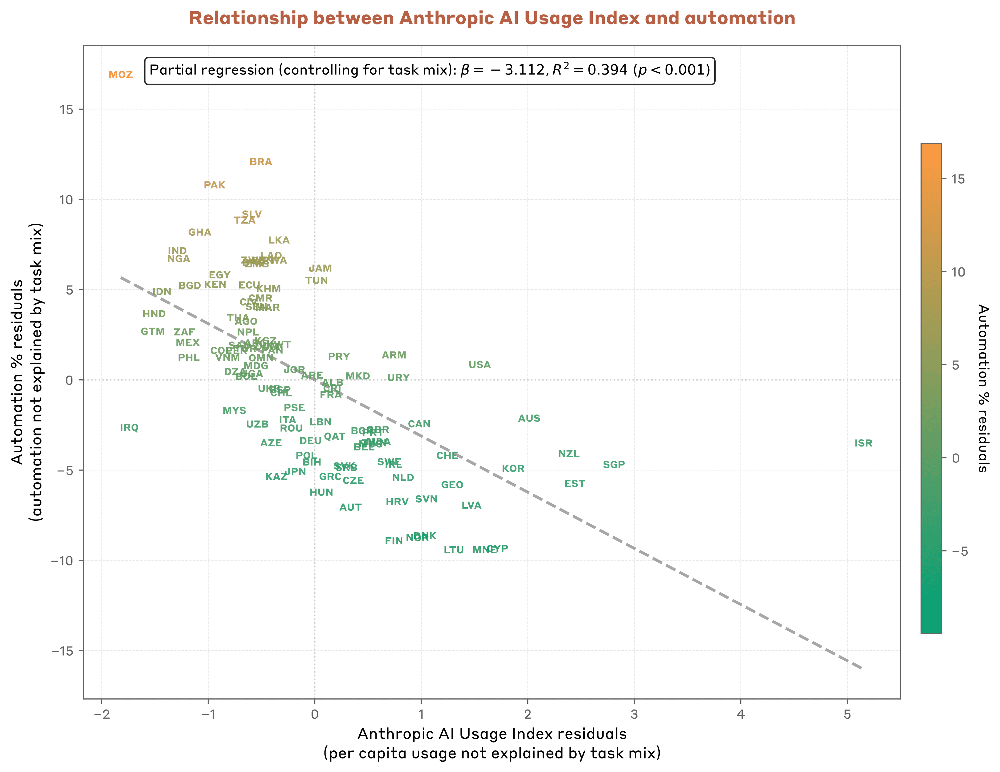

> Figure 2.11: Countries with higher Anthropic AI Usage Index tend to use Claude in a more collaborative manner (augmentation), rather than have it operate independently (automation). This figure shows the relationship between the Anthropic AI Usage Index and the automation share in a given country. We plot the relationship after accounting for a geography's task mix, thus we show the regression residuals. We only include countries with at least 200 observations in our sample for this figure because of the uncertainty of the measure for low-usage countries in our random sample. Each country is represented by its 3-letter ISO code.

[^18]: To isolate the relationship between automation preference and Claude usage accounting for task composition differences, we do the following: First, we calculate each country's expected automation percentage by taking a weighted average. For each O*NET task (e.g., coding, writing, or analysis), we multiply that task's share of the country's usage by the global automation rate for that task type (the percentage of that task that Claude completes via directive/feedback loop patterns globally). Summing these gives us the expected values for each country's automation percentage given the country's specific task mix. We then regress both the actual automation % and AUI on this expected automation %. The residuals from these regressions represent the variation in each variable that cannot be explained by task composition. By examining the relationship between these residuals (known as partial regression analysis), we can determine whether countries that have higher AI usage than their task mix would predict tend also to have higher-than-predicted automation. / 为了在控制任务构成差异的情况下分离自动化偏好与 Claude 使用的关系，我们这样做：首先用加权平均计算每国的预期自动化百分比——对每个 O*NET 任务（如编码、写作或分析），把该任务在该国使用中的份额乘以该任务类型的全球自动化率（全球范围内 Claude 经指令式/反馈回路模式完成该任务的百分比）；加总即得给定任务组合下各国的预期自动化百分比。然后我们把实际自动化百分比与 AUI 分别对预期自动化百分比做回归，残差代表各变量中无法被任务构成解释的变异。通过检验这些残差之间的关系（即偏回归分析），我们可以判断：AI 使用高于其任务组合所隐含水平的国家，是否也倾向于有高于预测的自动化。

## 结论（Conclusion）

Our analysis of Claude usage patterns across geographies reveals several key insights. One of the most striking is the geographic concentration of Claude usage. The leadership of the US and California in terms of Claude usage overall, and the strong correlation of Claude usage and income per capita, suggest parallels to past technologies in which initial geographic concentration and specialized use were a key feature. Drawing parallels to the diffusion patterns of prior technologies may help us better understand the diffusion and impact of AI.

我们对各地 Claude 使用模式的分析揭示出几个关键洞见。最醒目之一是 Claude 使用的地理集中。美国与加州在总使用上的领先、Claude 使用与人均收入的强相关，都提示它与过往技术的相似之处——初始地理集中与专门化使用正是那些技术的关键特征。类比既往技术的扩散模式，或许有助于我们更好地理解 AI 的扩散与影响。

Surprisingly, geography shapes not just what AI tools are used for, but how they are used. Users in economies with relatively low per capita usage have a relative preference for delegating tasks to Claude (automation), whereas users in economies with high per capita usage are somewhat more likely to prefer more collaborative or learning-based interactions with Claude (augmentation), even when controlling for the task mix. Similar to the local specialization in task use, the local specialization in AI collaboration patterns suggests that impact of AI could be very different in different regions.

出人意料的是，地理不仅塑造 AI 工具被用来做什么，还塑造它怎么被使用。人均使用较低经济体的用户相对更偏好把任务委托给 Claude（自动化）；而人均使用较高经济体的用户即便在控制任务组合后，也更倾向与 Claude 进行更协作或基于学习的交互（增强）。与任务使用的本地专业化类似，AI 协作模式的本地专业化提示：AI 在不同地区的影响可能截然不同。

The geographic patterns of AI adoption—where it is used, for which tasks, and how—suggest that in order to realize the potential of AI to benefit people across the globe, policymakers need to pay attention to local concentration of AI use and adoption, and address the risk of deepening digital divides.

AI 采用的地理模式——在哪里用、为什么任务用、怎么用——提示：要实现 AI 造福全球民众的潜力，政策制定者需要关注 AI 使用与采用的地方集中，并应对数字鸿沟加深的风险。

# 第三章：Claude 的 API 企业部署（Chapter 3: API enterprise deployment of Claude）

## 概览（Overview）

Whether frontier AI capabilities make us more productive, reshape labor markets, and accelerate growth will depend on when and how firms choose to deploy AI. Even when businesses recognize the potential of AI, profitably adopting it may require costly restructuring of production processes, training new workers, and other sunk-cost investments to facilitate effective deployment.[^19]

前沿 AI 能力能否让我们更具生产率、重塑劳动力市场并加速增长，取决于企业选择在何时、以何种方式部署 AI。即便企业认识到 AI 的潜力，要有利可图地采用它，可能需要高成本地重构生产流程、培训新员工，以及为有效部署而做的其他沉没成本投资。[^19]

To understand business adoption patterns of AI, we turn to a new data source: Anthropic's first-party (1P) API customers—again relying on privacy-preserving methods.[^20] Our API allows customers to integrate Claude directly into their own products and applications, and charges by the token used, rather than a flat subscription fee. This represents a fundamentally different product experience to Claude.ai, which we focused on in the previous two chapters.

为理解企业采用 AI 的模式，我们转向一个新的数据源：Anthropic 的一方（1P）API 客户——同样依赖隐私保护方法。[^20] 我们的 API 允许客户把 Claude 直接集成到自己的产品与应用中，按所用 token 计费，而非固定订阅费。这与前两章聚焦的 Claude.ai 是根本不同的产品体验。

[^19]: In the presence of fixed costs of adjustment, the question businesses face is not necessarily if they will adopt AI, but when. See Hall and Kahn 2003, Adoption of New Technology: "The most important thing to observe about this kind of decision is that at any point in time the choice being made is not a choice between adopting and not adopting but a choice between adopting now or deferring the decision until later." / 在存在调整固定成本的情况下，企业面对的问题未必是「是否采用 AI」，而是「何时采用」。见 Hall 与 Kahn（2003）《新技术的采用》：「关于这类决策最重要的观察是：任一时点所做的选择，并非『采用与否』的选择，而是『现在采用还是推迟到以后』的选择。」
[^20]: Data in this section covers 1 million transcripts from August 2025, sampled randomly from a pool of 1P API customers constituting roughly half of our 1P API usage. We continue to manage data according to our privacy and retention policies, and our analysis is consistent with our terms, policies, and contractual agreements. Each record is a prompt-response pair from our sample period which in some instances is mid-session for multi-turn interactions. / 本节数据涵盖 2025 年 8 月的 100 万份转录，从约占我方 API 用量一半的一方 API 客户池中随机抽样。我们继续依照隐私与保留政策管理数据，分析符合我们的条款、政策与合同约定。每条记录是抽样期内的一个提示-响应对，在多轮交互中有时是会话中段。

Institutional inertia, alongside fixed costs of adoption, suggests that early examples of enterprise use of AI is likely to be concentrated among specialized tasks where deployment is easy, capabilities are robust, and the economic benefits from adoption are high.

组织惯性叠加采用固定成本，提示早期的企业 AI 使用很可能集中于那些部署容易、能力稳健、采用经济收益高的专门任务。

Indeed, we see evidence along these lines in the data presented in this chapter. Our analysis uncovers several patterns:

本章呈现的数据确实给出了沿这些线索的证据。我们的分析揭示出几个模式：

- Businesses use Claude in similar but more specialized ways than individual users: Businesses concentrate use in tasks where AI deployment is well suited to programmatic access, like coding or administrative tasks. Compared to Claude.ai users, businesses use Claude less for educational or creative tasks and in more automated ways overall.
- API customers tend to prefer higher cost tasks: Despite tasks varying dramatically in cost, the most expensive tasks tend to have higher usage, suggesting that model capability, ease of deployment, and economic value of automation determine adoption much more than the cost of the interaction itself.
- Access to appropriate contextual information is needed for sophisticated deployment: We find evidence of an important potential bottleneck for the usefulness of AI for businesses. API customers that use Claude for complex tasks tend to provide Claude with lengthy inputs. This could represent a barrier to broader enterprise deployment for some important tasks that rely on dispersed context that is not already centralized or digitized. Correcting for this bottleneck may require firms to restructure their organization, invest in new data infrastructure, and centralize information for effective model deployment.

- 企业使用 Claude 与个人用户相似但更专门化：企业把使用集中于那些 AI 部署很适合程序化访问的任务，如编码或行政任务。与 Claude.ai 用户相比，企业较少把 Claude 用于教育或创意任务，总体上以更自动化的方式使用。
- API 客户偏好更高成本的任务：尽管任务成本差异巨大，最贵的任务往往使用更高，提示决定采用的是模型能力、部署难易与自动化的经济价值，而非交互本身的成本。
- 复杂部署需要恰当的上下文信息：我们发现了 AI 对企业效用的一个重要潜在瓶颈的迹象。把 Claude 用于复杂任务的 API 客户往往向 Claude 提供冗长的输入。对某些依赖分散语境（尚未集中化或数字化）的重要任务而言，这可能构成更广泛企业部署的障碍。消除这一瓶颈可能要求企业重组组织、投资新的数据基础设施、集中信息以实现有效的模型部署。

## 背景铺垫：公开数据中的 AI 采用模式（Setting the stage: AI adoption patterns in public data）

Before diving into our API data, it's worth grounding ourselves in the broader landscape of business AI adoption. According to the Census Bureau's Business Trends and Outlook Survey, AI adoption among US firms has more than doubled in the past two years, rising from 3.7% in fall 2023 to 9.7% in early August 2025 (Figure 3.1).[^21] Despite this rapid rate of growth, the vast majority of firms in the US do not report using AI in their production processes.

在深入 API 数据之前，有必要先了解企业 AI 采用的更大图景。据美国普查局的企业趋势与展望调查，美国企业的 AI 采用率两年间翻了一倍多：从 2023 年秋季的 3.7% 升至 2025 年 8 月初的 9.7%（图 3.1）。[^21] 尽管增速很快，美国绝大多数企业仍未报告在生产流程中使用 AI。

But these aggregate numbers mask large variation across sectors. For example, in early August 2025, one in four businesses in the Information sector reported using AI, which is roughly ten times the rate for Accommodation and Food Services.[^22]

但这些汇总数字掩盖了行业间的巨大差异。例如 2025 年 8 月初，信息行业四分之一的企业报告使用 AI，约为住宿与餐饮服务业的十倍。[^22]

The picture from this public data is clear: enterprise use of AI is growing rapidly, but we are still in the early stages of AI adoption. Usage remains unevenly distributed across the economy, with the sectors most able to quickly adopt and benefit from this technology doing so.

这份公开数据的图景很清晰：企业 AI 使用快速增长，但我们仍处于 AI 采用的早期阶段。使用在经济中分布不均，最有能力快速采用并从这项技术中获益的行业正在这么做。

As we will see below, our 1P API data yields a complementary conclusion: early enterprise use of Claude is likewise unevenly distributed across the economy and primarily deployed for tasks typical of Information sector occupations.

如下文所示，我们的一方 API 数据得到一个互补的结论：早期的企业 Claude 使用同样在经济中分布不均，且主要用于信息行业职业的典型任务。

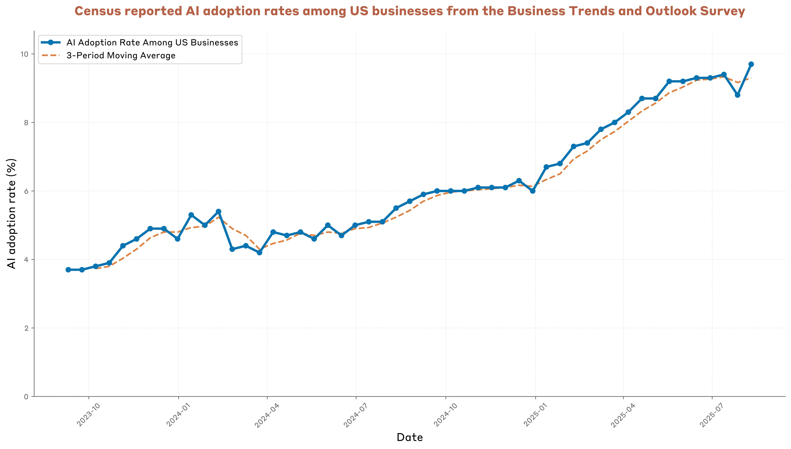

> Figure 3.1: AI adoption rates among US firms, Business Trends & Outlook Survey (Census). Note: AI adoption rates are calculated as the share of firms responding "yes" to the question "In the last two weeks, did this business use Artificial Intelligence (AI) in producing goods or services? (Examples of AI: machine learning, natural language processing, virtual agents, voice recognition, etc.)".

[^21]: Note that this is a different measure of adoption than in the introduction to this report. Reported adoption by consumers and employees of AI reached 40% in 2024 whereas when measured at the firm-level, nine out of ten businesses in the US report not using AI. / 注意，这与本报告引言中的采用度量不同：消费者与员工自报的 AI 采用在 2024 年已达 40%，而按企业层面度量，美国十分之九的企业报告未使用 AI。
[^22]: The Business Trends and Outlook Survey (BTOS), published by the Census Bureau, is a reputable barometer of AI adoption by firms in the US. The survey question we use to measure AI adoption is "In the last two weeks, did this business use Artificial Intelligence (AI) in producing goods or services? (Examples of AI: machine learning, natural language processing, virtual agents, voice recognition, etc.)". See Crane, Green, and Soto 2025, Measuring AI Uptake in the Workplace for a comparison of BTOS with other measures of overall AI adoption among firms. / 普查局发布的企业趋势与展望调查（BTOS）是美国企业 AI 采用的权威晴雨表。我们度量 AI 采用的调查问题是「过去两周，本企业在生产商品或服务时是否使用了人工智能（AI）？（AI 示例：机器学习、自然语言处理、虚拟智能体、语音识别等）」。BTOS 与其他企业整体 AI 采用度量的比较见 Crane、Green 与 Soto（2025）《测量职场中的 AI 使用》。

## Anthropic API 客户的专门化使用（Specialized use among Anthropic API customers）

To analyze API traffic, we apply the same privacy-preserving classification methods from previous chapters—categorizing anonymized API transcripts by O*NET tasks and into a bottom-up taxonomy. The patterns that emerge show enterprise usage concentrated in specialized tasks particularly suited for automation.

为分析 API 流量，我们沿用前几章相同的隐私保护分类方法——把匿名 API 转录按 O*NET 任务归类，并纳入自下而上的分类体系。浮现出的模式显示：企业使用集中于特别适合自动化的专门任务。

Overall, software development dominates the landscape. Among the top 15 use clusters—representing about half of all API traffic—the majority relate to coding and development tasks. Debugging web applications and resolving technical issues each account for roughly 6% of usage, while building professional business software represents another significant chunk. Of note, around 5% of API traffic focuses specifically on developing and evaluating AI systems themselves (Figure 3.2).

总体上，软件开发主导全局。在前 15 个使用簇（约占全部 API 流量的一半）中，多数与编码及开发任务相关。调试 Web 应用与解决技术问题各占约 6% 的用量，构建专业商业软件也是重要一块。值得注意的是，约 5% 的 API 流量专门用于开发与评估 AI 系统本身（图 3.2）。

But not all API usage is for coding. API customers also deploy Claude to create marketing materials (4.7%) and to process business & recruitment data (1.9%). These two categories reveal that AI is being deployed not just for direct production of goods and services but also for talent acquisition and external communications.

不过 API 用途并非只有编码。API 客户还用 Claude 制作营销材料（4.7%）和处理商业与招聘数据（1.9%）。这两个类别表明：AI 不仅被部署于商品与服务的直接生产，也用于人才获取与对外沟通。

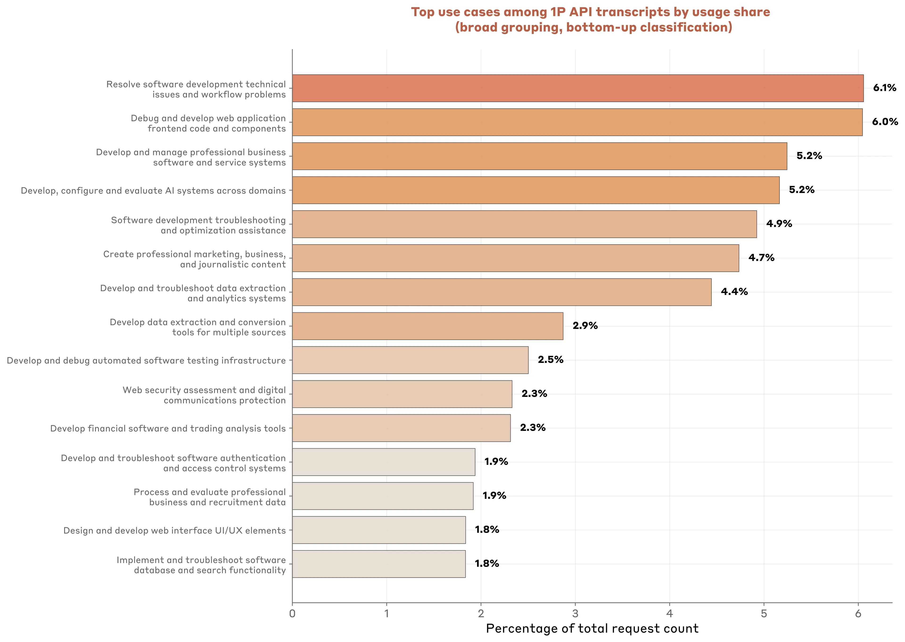

> Figure 3.2: Bottom-Up taxonomy of Claude usage among sampled 1P API transcripts. Using privacy-preserving methods we classified 1P API transcripts into a bottom-up taxonomy reflective of underlying usage. This figure reports the leading use cases at the broadest level of this taxonomy.

The O*NET classification makes these patterns even clearer. Little less than half of all API traffic maps to computer and mathematical tasks—more than 8 percentage points higher than Claude.ai usage. Office and administrative tasks come second at roughly 10% of transcripts, reflecting their suitability for automation.

O*NET 分类让这些模式更清晰。接近一半的 API 流量对应计算机与数学任务——比 Claude.ai 的使用高 8 个多百分点。办公与行政任务以约 10% 的转录份额位居第二，反映了它们对自动化的适配性。

On the other hand, several interaction-heavy tasks prominent on Claude.ai have a much smaller share in API usage: education and library tasks drop from 12.3% to 3.6%, while arts and entertainment fall from 8.2% to 5.2%.

另一方面，Claude.ai 上占优的几类重交互任务在 API 使用中份额小得多：教育与图书馆任务从 12.3% 降至 3.6%，艺术与娱乐从 8.2% 降至 5.2%。

In many cases however, occupational categories are reasonably close between Claude.ai and API data, suggesting that underlying model capabilities, rather than the specific product surface, drives adoption in many instances.

不过在很多情形下，Claude.ai 与 API 数据的职业类别相当接近，提示在许多实例中驱动采用的是底层模型能力，而非具体的产品形态。

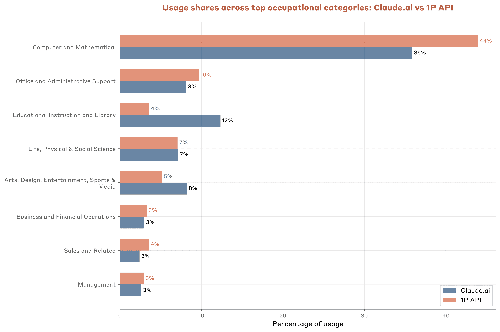

> Figure 3.3: Leading Occupational Categories by Overall Usage: Claude.ai vs 1P API. After determining usage shares for tasks, we calculate the share of traffic from Claude.ai and 1P API customers assigned to top-level occupations in the O*NET taxonomy. For example, this figure shows that 44% of API traffic in our sample was matched to a task characteristic of a Computer and Mathematical occupation.

## 职业划分与任务专门化（Occupational segmentation vs. task specialization）

Despite serving different users with different interfaces, API and Claude.ai usage follows remarkably similar power law distributions across tasks. Among Claude.ai conversations, the bottom 80% of task categories account for only 12.7% of usage; for API customers it's somewhat more concentrated at 10.5% (Figure 3.4). These extreme concentrations (Gini coefficients[^23] of 0.84 and 0.86) reveal massive variation in AI-task fit—the best-matched tasks see orders of magnitude more usage than poorly-matched ones.

尽管以不同界面服务不同用户，API 与 Claude.ai 的使用在任务上遵循惊人相似的幂律分布。Claude.ai 对话中，使用最少的 80% 任务类别只占用量的 12.7%；API 客户更集中一些，为 10.5%（图 3.4）。这些极端的集中度（基尼系数[^23]分别为 0.84 与 0.86）揭示了「AI-任务契合度」的巨大变异——契合最好的任务，其用量比契合差的高出数量级。

The similarity across platforms is particularly striking given their different user bases and use cases. Both converge on comparable concentration levels, suggesting a common matching process between AI capabilities and associated economic tasks.

考虑到两个平台的用户群体与用例不同，这种跨平台的相似尤为引人注目。两者收敛到相近的集中度，提示在「AI 能力与相关经济任务的匹配」上存在一个共同过程。

Tasks like code generation dominate because they hit a sweet spot where model capabilities excel, deployment barriers are minimal, and employees can adopt the new technology quickly. The long tail of rarely used tasks could reflect several factors.[^24] For example, some tasks are simply less common—debugging software happens far more often than negotiating circus contracts. The extreme concentration also suggests the potential role of O-Ring[^25] forces: if a task needs a level of reasoning Claude can't handle, internal data the firm can't access, or regulatory approval that doesn't exist, any single barrier could prevent adoption.

代码生成之类的任务占主导，是因为它们恰好处在甜点位：模型能力出色、部署障碍极小、员工能快速上手。使用稀少的长尾任务可能反映几种因素。[^24] 例如有些任务本身就不常见——调试软件远比谈判马戏团合同常见。极端集中还提示「O 形环」[^25] 力量的作用：如果一项任务需要 Claude 力不能及的推理、企业无法访问的内部数据、或不存在的监管许可，任何一个障碍都可能阻止采用。

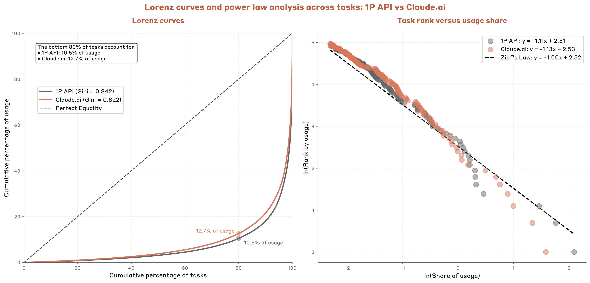

> Figure 3.4: Visualizing concentration of usage among a small number of tasks: Claude.ai versus 1P API. The left panel of this chart calculates Lorenz curves across O*NET tasks for both our Claude.ai and 1P API samples. The highlighted points on the curves indicate how much overall usage the bottom 80% of tasks account for. The right panel plots task rank against task usage share for tasks representing at least 0.1% of overall usage in our samples. Zipf's law, in which the coefficient of the best-fit-line is equal to -1, occurs with some regularity in various economic settings.

[^23]: The Gini coefficient is a measure used to quantify inequality within a distribution, such as the distribution of task usage. It ranges from 0 to 1, where 0 represents perfect equality (every task has exactly the same usage share) and 1 represents perfect inequality (where one task accounts for all usage, and every other task has none). / 基尼系数是量化分布内部不平等（如任务使用分布）的度量，取值 0 到 1：0 代表完全平等（每个任务的使用份额完全相同），1 代表完全不平等（一个任务占有全部使用，其余任务为零）。
[^24]: Power laws in economic settings are an empirical regularity with notable examples of Zipf's law in particular. Models that generate this type of outcome feature both underlying heterogeneity and intentional, optimizing decision-making. For more, see Gabaix 2016, Power Laws in Economics: An Introduction. / 经济场景中的幂律是一种经验规律，Zipf 定律尤为著名。能产生这类结果的模型兼具底层异质性与有意的、最优化的决策。更多见 Gabaix（2016）《经济学中的幂律：导论》。
[^25]: Kremer 1993, The O-Ring Theory of Economic Development. / Kremer（1993）《经济发展的 O 形环理论》。

## API 转录中的自动化与增强（Automation vs. augmentation among API transcripts）

The clearest distinction between API and Claude.ai usage lies in how humans and AI divide the work. When businesses embed Claude into their applications, they largely delegate individual tasks rather than collaborate iteratively with models.

API 与 Claude.ai 使用最清晰的区别，在于人类与 AI 如何分工。企业把 Claude 嵌入其应用时，主要是委托单个任务，而不是与模型迭代协作。

In our data, 77% of API transcripts show automation patterns (especially full task delegation) versus just 12% for augmentation (e.g., collaborative refinement and learning). Based on a sample of conversations from Claude.ai, the split between automation and augmentation is nearly even. Looking across economic tasks, the degree of Claude automation through the API is even starker: 97% of tasks show automation-dominant patterns in API usage, compared to only 47% on Claude.ai (Figure 3.6).

在我们的数据中，77% 的 API 转录呈自动化模式（尤其是完整任务委托），而增强（如协作打磨与学习）仅 12%。基于 Claude.ai 的对话抽样，自动化与增强几乎对半分。跨经济任务看，API 途径的 Claude 自动化程度更为悬殊：API 使用中 97% 的任务呈自动化主导模式，而 Claude.ai 上只有 47%（图 3.6）。

This makes intuitive sense. Programmatic API access naturally lends itself to automation: businesses provide context, Claude executes the task, and the output flows directly to end users or downstream systems.

这在直觉上说得通。程序化的 API 访问天然适合自动化：企业提供上下文，Claude 执行任务，产出直接流向终端用户或下游系统。

This pattern echoes how economically consequential technologies become transformative: becoming embedded in systems that let workers access productivity gains without needing specialized skills. While both augmented and automated approaches enhance human capabilities, system-level automation is likely to yield both larger productivity gains across the economy as well as more significant changes in the labor market: Fully automating some tasks, changing which tasks are important for various jobs, and even producing new forms of work altogether.

这一模式呼应了重大经济技术的变革之道：嵌入到让劳动者无需专门技能就能获得生产率收益的系统之中。虽然增强与自动化两种方式都能增强人类能力，但系统级自动化很可能在整个经济中带来更大的生产率收益与更显著的劳动力市场变化：完全自动化某些任务、改变各类工作中哪些任务重要，甚至催生全新的工作形态。

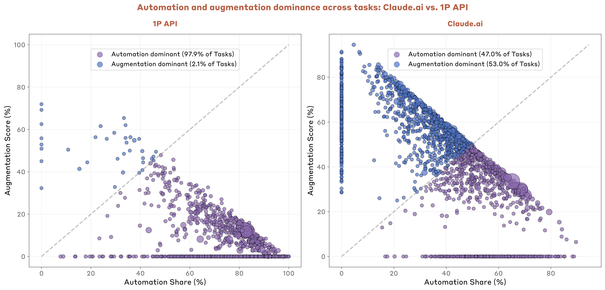

> Figure 3.5: Automation versus augmentation collaboration modes across O*NET tasks: Claude.ai versus 1P API. This figure reports the share of Claude.ai conversations and 1P API transcripts that exhibit automation or augmentation patterns of usage for each O*NET task. Automation and augmentation modes are defined in Chapter 1. When for privacy-preserving reasons we do not observe usage shares for a particular collaboration mode we give that category a value of 0% in this figure. Automation dominance is defined as a task having a greater observed share of automation usage. Likewise for augmentation dominance.

## Claude 做得越多，需要知道的就越多（The more Claude does, the more Claude needs to know）

Why do our API customers use Claude for some tasks more than others? Beyond fundamental model capabilities, a potentially important explanation is that it is easier to provide Claude with the information needed for successful deployment for some tasks than others.

为什么 API 客户在某些任务上更常用 Claude？除基础模型能力之外，一个潜在的重要解释是：对某些任务而言，向 Claude 提供成功部署所需的信息更容易。

For example, if the goal is to have Claude refactor a module in a complex software development project, Claude may need to read—or at least explore—the entire codebase to understand which changes to make and where. For software development with centralized code repositories, access to this information is in principle straightforward.

例如，如果目标是让 Claude 重构复杂软件项目中的一个模块，Claude 可能需要阅读——或至少探索——整个代码库，以理解该在何处做何修改。对于有集中代码仓库的软件开发，获取这些信息原则上直截了当。

For other tasks, the appropriate context might not be readily available, or it might be challenging to access. For example, asking Claude to develop a sales strategy for a key account might require Claude having access not only to information contained within a Customer Relationship Management system, but also to tacit knowledge located in the minds of account executives, marketers, and external contacts. All else equal, lacking access to such contextual information will make Claude less capable.

对其他任务，恰当的上下文可能并不现成，或难以获取。例如，让 Claude 为重点客户制定销售策略，可能不仅需要客户关系管理系统（CRM）中的信息，还需要客户经理、市场营销人员与外部联系人心中的隐性知识。其他条件相同时，缺乏这些上下文信息会让 Claude 能力打折扣。

We explore this question by looking at the relationship across tasks between the average API input length (i.e., the context given to Claude) and Claude's average output length (i.e., what the model produces in response).[^26]

我们通过考察各任务上「平均 API 输入长度（即给 Claude 的上下文）」与「Claude 平均输出长度（即模型的响应产出）」之间的关系来探索这一问题。[^26]

[^26]: API input length refers to the text in API messages, system prompts, and any additional content sent to the model, including files and datasets relevant to the task at hand. Output length refers to Claude's generated response to an API call. / API 输入长度指 API 消息、系统提示及发送给模型的任何附加内容（包括与手头任务相关的文件与数据集）中的文本。输出长度指 Claude 对一次 API 调用生成的响应。

For each O*NET task in our sample, we calculate the average input and output length of associated API transcripts. We then divide these values by the average lengths across all tasks appearing in our sample. This produces an input token index and an output token index for each task. An index value of 1.5, for example, means that the API transcripts associated with that task are 50% longer than the average across tasks.

对样本中的每项 O*NET 任务，我们计算相关 API 转录的平均输入与输出长度，再把这些值除以样本中所有任务的平均长度，得到每项任务的输入 token 指数与输出 token 指数。例如指数值 1.5 意味着与该任务相关的 API 转录比任务平均值长 50%。

There is considerable variation across tasks in how long Claude's API outputs are. For example, tasks at the 90th percentile of output length are more than 4x longer than tasks at the 10th percentile. Table 3.1 provides example O*NET tasks, along with a Claude Sonnet 4 summarization of the group of tasks at that part of the distribution.[^27] Figure 3.7 shows that output length varies systematically across occupational categories as well.

Claude 的 API 输出长度在各任务间差异可观。例如输出长度第 90 百分位的任务比第 10 百分位长 4 倍多。表 3.1 给出示例 O*NET 任务，以及 Claude Sonnet 4 对分布该位置任务组的概括。[^27] 图 3.7 显示输出长度在各职业类别间同样存在系统性差异。

[^27]: Claude was prompted to identify tasks at the 10th, 50th, and 90th percentile of the ONET task distribution with the minimal organization of "The columns should be 'Example tasks', 'Index Value', 'Summary' where you provide a summary". / 我们让 Claude 以最少的组织指令——「列应为『示例任务』『指数值』『概括』，由你提供概括」——识别 O*NET 任务分布的第 10、50 与 90 百分位任务。

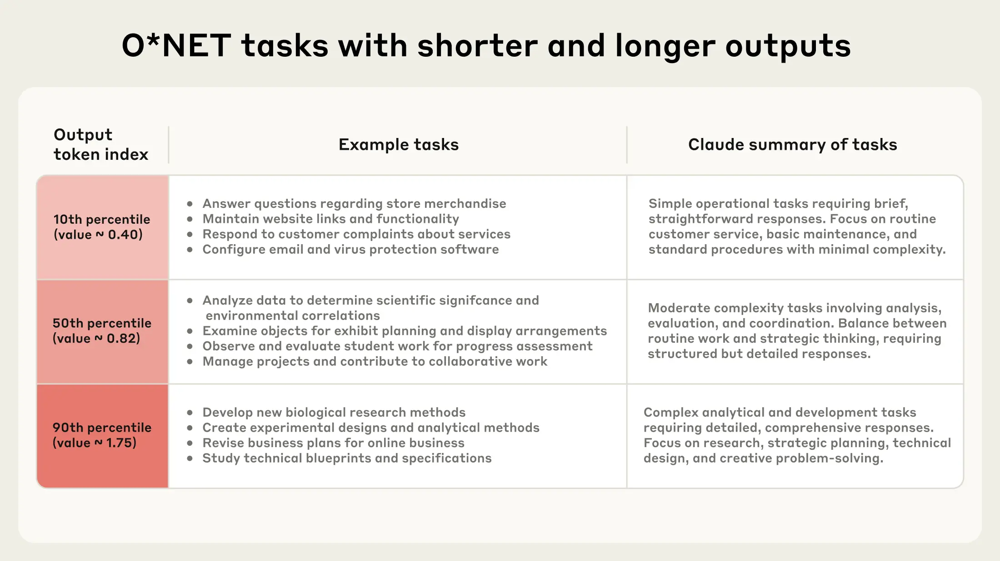

> Table 3.1: Example O*NET tasks with shorter and longer output lengths with Claude's summaries. For each O*NET task matched to 1P API traffic we calculate an output token index: Dividing the average output length across transcripts associated with that task by the average (unweighted) value across all tasks in our sample. Claude was prompted to identify tasks at the 10th, 50th, and 90th percentile of the output token index distribution with the minimal guidance: "The columns should be 'Example tasks', 'Index Value', 'Summary' where you provide a summary". Claude associated output length with task complexity.

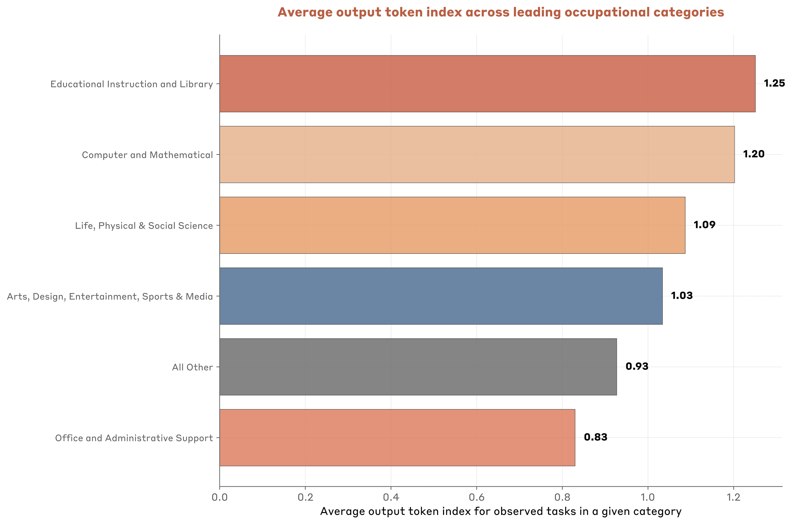

> Figure 3.6: Average output token index across O*NET tasks among leading occupational categories. For each O*NET task matched to 1P API traffic we calculate an output token index: Dividing the average output length across transcripts associated with that task by the average (unweighted) value across all tasks in our sample. We then average across tasks for a given top-level occupational categories in the O*NET taxonomy for top use occupational groups. 'All Other' combines remaining occupational groups into a single category.

What stands out from Claude's assessment of tasks is that longer output tasks tend to represent increasingly complex uses. Of course, output length does not capture all dimensions of task complexity, but it appears to be a sensible, easily measured proxy.

从 Claude 对任务的评估中突出的一点是：输出更长的任务往往代表越来越复杂的使用。当然，输出长度并未捕捉任务复杂度的所有维度，但它似乎是一个合理且易于测量的代理指标。

Because API customers are priced on the margin for both input tokens and output tokens, they have an incentive to optimize model prompting to minimize both input and output tokens when using Claude. In turn, any systematic relationship between input length and output produced by Claude partly captures the underlying contextual constraints in deploying Claude for sophisticated tasks. Stated differently, API customers are incentivized to only provide Claude with just enough context to accomplish their objective and no more. And so we learn about contextual requirements for tasks with varying output length.

由于 API 客户对输入与输出 token 都按边际计价，他们有动力优化提示以同时最小化输入与输出 token。因此，输入长度与 Claude 产出之间的任何系统性关系，都部分刻画了把 Claude 部署于复杂任务时的底层上下文约束。换个说法：API 客户有动力只给 Claude「刚好够用」的上下文，多一点都不给。于是我们得以了解不同输出长度任务的上下文需求。

Looking across tasks, we see a very stable relationship between how much context API customers provide to Claude and how much Claude actually produces. Across economic tasks, each 1% increase in input length is associated with a less-than-proportional 0.38% increase in output length (Figure 3.7). This elasticity of 0.38 suggests that there are strong diminishing marginal returns in translating longer contextual inputs into longer outputs for these economically useful tasks.[^28]

跨任务来看，API 客户提供给 Claude 的上下文量与 Claude 实际产出量之间关系非常稳定。跨经济任务，输入长度每增加 1%，输出长度仅以低于比例的 0.38% 增长（图 3.7）。0.38 的弹性提示：对这些经济上有用的任务而言，把更长的上下文输入转化为更长的产出存在强烈的边际收益递减。[^28]

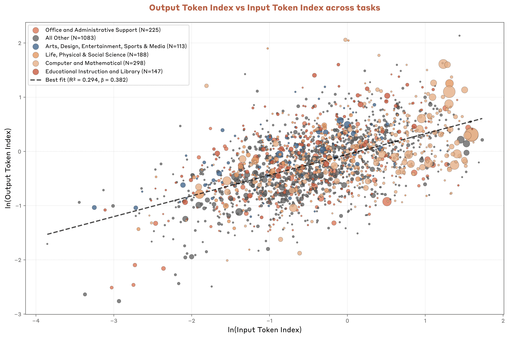

> Figure 3.7: Scatter plot of output token index and input token index across O*NET Tasks. For each O*NET task matched to 1P API traffic we calculate an output token index: Dividing the average output length across transcripts associated with that task by the average (unweighted) value across all tasks in our sample. The input token index is constructed similarly. The elasticity of 0.38 implies that each 1% increase in the input token index is associated with a 0.38% increase in the output token index.

[^28]: Another contributing factor could be the degradation in performance some models experience at longer context lengths. See Liu et al, 2023, Lost in the Middle: How Language Models Use Long Contexts. / 另一个促成因素可能是部分模型在长上下文下的性能退化。见 Liu 等（2023）《迷失在中间：语言模型如何使用长上下文》。

The upshot is that deploying AI for complex tasks might be constrained more by access to information than on underlying model capabilities. Companies that can't effectively gather and organize contextual data may struggle with sophisticated AI deployment, creating a potential bottleneck for broader enterprise adoption—particularly for occupations and in industries where tacit, diffuse knowledge is crucial to business operations.

结论是：为复杂任务部署 AI，受限的可能更多是信息获取，而非底层模型能力。无法有效收集与组织上下文数据的公司，可能难以完成复杂的 AI 部署——这为更广泛的企业采用制造了潜在瓶颈，在隐性、分散的知识对业务运营至关重要的职业与行业尤甚。

## 单任务成本与跨任务替代模式（Cost per task and substitution patterns across tasks）

API customers pay per token, creating variation in the cost of deploying Claude for different tasks. More sophisticated tasks will tend to cost more, given their higher input and output token counts. This variation helps us explore whether cost is a major factor in determining which tasks businesses choose to automate with Claude.

API 客户按 token 付费，这使不同任务的 Claude 部署成本存在差异。更复杂的任务由于输入输出 token 更高往往成本更高。这一差异帮助我们探究：成本是否是决定企业选择用 Claude 自动化哪些任务的主要因素。

The data suggests it is not, at least relatively speaking.[^29] For example, tasks typical of computer and mathematical occupations cost more than 50% more than sales-related tasks, yet dominate usage.[^30] Overall, we find a positive correlation between cost and usage: higher-cost tasks tend to have higher usage rates (Figure 3.9).

数据表明它不是主要因素——至少相对而言。[^29] 例如，「计算机与数学」职业的典型任务比销售相关任务贵 50% 以上，却主导着使用。[^30] 总体上我们发现成本与使用正相关：更高成本的任务往往使用率更高（图 3.9）。

The positive correlation between cost and usage suggests that cost plays an immaterial role in shaping patterns of enterprise AI deployment. Instead, businesses likely prioritize use in domains where model capabilities are strong and where Claude-powered automation generates enough economic value in excess of the API cost.

成本与使用的正相关提示：成本在塑造企业 AI 部署模式上作用甚微。企业更可能优先在「模型能力强、Claude 驱动的自动化所产生的经济价值足以覆盖 API 成本」的领域使用。

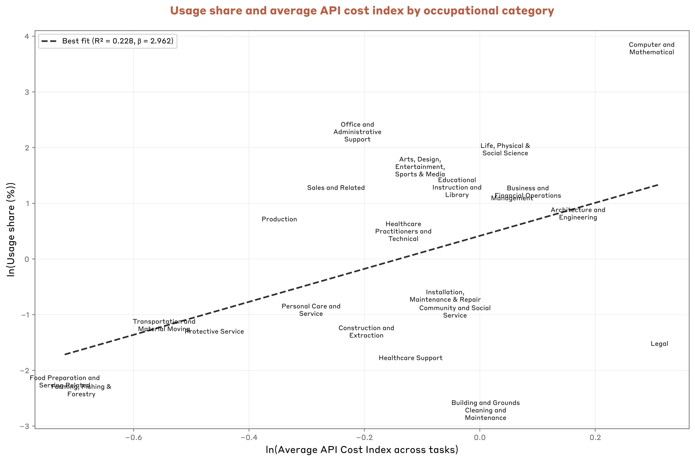

> Figure 3.8: API cost per task and usage share across occupational categories. For each O*NET task matched to 1P API traffic we calculate an API cost index: Dividing the average API cost across transcripts associated with that task by the average (unweighted) value across all tasks in our sample. This figure plots the average API cost index across tasks in a given occupational category against usage share. The estimated elasticity of 3 implies that each 1% increase in the average cost of a task is associated with a 3% increase in prevalence in our sample.

[^29]: The question we ask in this section is whether, all else equal, cost differences across tasks shapes relative usage patterns. This is different from studying whether overall Claude usage is sensitive to external competitive pricing pressures. / 本节的问题是：在其他条件相同时，任务间的成本差异是否塑造相对使用模式。这不同于研究 Claude 的总体用量是否对外部竞争性定价压力敏感。
[^30]: To see that this is the case, we first aggregate O*NET tasks that we identify in our API sample by broad occupational category to measure overall usage shares and the average cost per task in each category. As with the input and output tokens reported by O*NET task, we normalize average cost per task by the average value across tasks observed in our sample. / 为说明这一点，我们先把 API 样本中识别出的 O*NET 任务按宽口径职业类别汇总，度量各使用份额与类别内平均单任务成本。与按 O*NET 任务报告的输入输出 token 一样，我们用样本中观测任务的平均值对平均单任务成本做归一化。

While this positive correlation holds overall, we next ask whether demand for Claude capabilities is lower among otherwise similar but costlier tasks. With the important caveat that this should be viewed as a preliminary exploration, this is what we find.

虽然总体上正相关成立，我们接着问：在其他方面相似但更昂贵的任务上，对 Claude 能力的需求是否更低。必须强调这只应被视为初步探索，以下就是我们的发现。

Controlling for task characteristics, we find that each 1% cost increase is associated with a 0.29% reduction in usage frequency in our sample of API transcripts (Figure 3.10).[^31] While consistent with standard economic theory that higher prices lead to lower demand, the implied increase in usage to a drop in cost is limited. According to this estimate, a 10% cost reduction for a particular task would only increase usage by around 3%.

控制任务特征后，我们发现成本每增加 1%，API 转录样本中的使用频率下降 0.29%（图 3.10）。[^31] 这虽然符合「价格越高需求越低」的标准经济理论，但成本下降带来的使用提升有限：按此估计，某项任务成本降低 10%，使用量仅增加约 3%。

Other factors, beyond the cost of using Claude for particular tasks, appear to matter more for patterns of use.

除了「把 Claude 用于特定任务的成本」之外，其他因素对使用模式的影响似乎更大。


> Figure 3.9: Scatter plot of API cost per task and usage share controlling for task characteristics. For each O*NET task matched to 1P API traffic we calculate an API cost index: Dividing the average API cost across transcripts associated with that task by the average (unweighted) value across all tasks in our sample. We then restrict the sample to tasks appearing in both our 1P API and Claude.ai samples. This partial scatter plot controls for the following task-level characteristics: fixed effects for occupational category, collaboration mode share from Claude.ai, and indicators for whether a given collaboration mode was censored for privacy-preserving reasons in the Claude.ai sample. The estimated elasticity of -0.29 implies that each 1% increase in the API cost index for a given task is associated with a 0.29% decrease in prevalence in our sample, after controlling for task characteristics.

[^31]: Controls include fixed effects for broad occupational categories as well as collaboration mode shares by task from our concurrently sampled Claude.ai conversations. Because some tasks have censored collaboration mode shares, we also include indicators for whether that a particular mode has missing data. We restrict attention to the set of tasks identified in both our API sample and our Claude.ai samples. / 控制变量包括宽口径职业类别的固定效应，以及同期抽样的 Claude.ai 对话中按任务的协作模式份额。由于部分任务的协作模式份额被删失，我们还纳入「某模式数据缺失」的指示变量。我们只关注同时出现于 API 样本与 Claude.ai 样本的任务集合。

## 结论（Conclusion）

Our API data captures enterprise AI adoption in its early stages: highly concentrated, automation-focused, and surprisingly price-insensitive (at least among the tasks our API customers use Claude for).

我们的 API 数据捕捉到企业 AI 采用的早期阶段：高度集中、聚焦自动化，而且对价格出人意料地不敏感（至少在 API 客户使用 Claude 的那些任务上）。

The 77% automation rate suggests enterprises use Claude to delegate tasks, rather than as a collaborative tool. Such systematic deployment is likely to be an important conduit by which AI delivers broader productivity gains within the economy. Given clear automation patterns in business deployment, this may also bring disruption in labor markets, potentially displacing those workers whose roles are most likely to face automation.

77% 的自动化率表明，企业把 Claude 用作任务委托的工具，而非协作工具。这种系统化部署很可能是 AI 向经济传递更广泛生产率收益的重要管道。鉴于企业部署中清晰的自动化模式，这也可能带来劳动力市场的扰动，潜在替代那些角色最可能被自动化的劳动者。

But the implications for the labor market are not entirely clear. As we document above, complex tasks require disproportionately more context. Such information may be scattered across organizations. In such conditions, workers with tacit knowledge about business operations may stand to benefit as complements to sophisticated AI-powered automation.[^32] Understanding the uneven labor market implications of AI adoption is an important area for future research.

但它对劳动力市场的影响还不完全明朗。如上所述，复杂任务需要超比例更多的上下文，而这些信息可能散落在组织的各个角落。在这种条件下，掌握业务运营隐性知识的劳动者，或许能作为复杂 AI 自动化的互补方而获益。[^32] 理解 AI 采用对劳动力市场的不均衡影响，是未来研究的重要方向。

[^32]: For example, see Ide and Talamaś, 2025, Artificial Intelligence in the Knowledge Economy. / 例如见 Ide 与 Talamas（2025）《知识经济中的人工智能》。

Businesses looking to adopt AI effectively may need to restructure how they organize and maintain the information that frontier systems rely on. Whether today's narrow, automation-heavy adoption evolves toward broader deployment will likely determine AI's future economic impacts.

想要有效采用 AI 的企业，可能需要重构其组织与维护「前沿系统所依赖信息」的方式。今天这种狭窄的、重自动化的采用是否会演进为更广泛的部署，很可能决定 AI 未来的经济影响。

## 结语（Concluding remarks）

This third iteration of the Anthropic Economic Index report captures AI adoption at a critical juncture. Existing capabilities of Claude and other frontier AI systems are already poised to transform economic activity, given how broadly applicable the technology is. Rapidly advancing AI capabilities only reinforce the conclusion that immense change is on the horizon. And yet early AI adoption is strikingly uneven. Usage currently clusters in a small set of tasks, with strong geographic variation that is highly correlated with income—particularly across countries. Such concentration reflects where AI capabilities, ease of deployment, and economic value align: coding and data analysis have high usage, while tasks requiring dispersed context or complex regulatory navigation are further behind.

本期（第三期）Anthropic 经济指数报告捕捉到了关键节点上的 AI 采用。鉴于这项技术适用面之广，Claude 与其他前沿 AI 系统的现有能力已蓄势待发、足以变革经济活动；而 AI 能力的快速进步只会强化「巨变将至」的结论。然而早期的 AI 采用极不均衡。使用目前聚集在少数任务上，地理差异显著且与收入高度相关——跨国尤甚。这种集中反映了 AI 能力、部署难易与经济价值三者交汇之处：编码与数据分析使用旺盛，而需要分散上下文或复杂合规周旋的任务落在后面。

Early business adoption of Claude is at once both similar to consumer use (coding is the most common use for both) and different in several consequential ways. In particular, with programmatic access to Claude through the API, businesses tend to use Claude with greater automation. Such systematic enterprise deployment reflects how AI is poised to reshape economic activity: increasing overall productivity, but with uncertain implications for those workers whose existing responsibilities have been automated.

早期的企业 Claude 采用既与消费者使用相似（编码都是最常见用途），又在几个关键方面不同。尤其是，通过 API 程序化访问 Claude 的企业倾向以更高的自动化程度使用它。这种系统化的企业部署反映了 AI 将如何重塑经济活动：整体生产率提升，但对既有职责已被自动化的劳动者而言，影响还不确定。

These patterns risk creating divergence. If AI's productivity gains concentrate in already-prosperous regions and automation-ready sectors, existing inequalities could widen rather than narrow. If AI automation improves the productivity of workers with tacit organizational knowledge—as some of our evidence suggests—then more experienced workers could see rising demand and higher wages even as entry-level workers face worse labor market prospects.[^33]

这些模式有造成分化的风险。如果 AI 的生产率收益集中于本已繁荣的地区与「随时可自动化」的行业，现有的不平等可能扩大而非缩小。如果 AI 自动化提升的是拥有组织隐性知识的劳动者的生产率——正如我们的部分证据所提示——那么更有经验的劳动者可能看到需求上升与工资上涨，而入门级劳动者面临更糟的劳动力市场前景。[^33]

[^33]: Brynjolfsson, Chandar, and Chen 2025, Canaries in the Coal Mine? Six Facts about the Recent Employment Effects of Artificial Intelligence documents clear evidence that entry-level workers with high AI exposure have had relatively worse employment prospects since late 2022. Setting aside questions of causality, the straightforward interpretation is that this is due to AI substituting for work previously done by early-career workers. An alternative interpretation is presented by Gans 2025, If AI and workers were strong complements, what would we see?: That relatively faster employment growth for experienced workers reflects AI making such workers more productive and thus in high demand. Whether AI compliments or substitutes work is perhaps the most important question that we hope our data will help answer. / Brynjolfsson、Chandar 与 Chen（2025）《矿井里的金丝雀？关于 AI 近期就业效应的六个事实》记录了清晰证据：AI 暴露度高的入门级劳动者自 2022 年末以来就业前景相对更糟。撇开因果性问题不谈，直白的解释是 AI 替代了原先由职业早期劳动者完成的工作。Gans（2025）《如果 AI 与劳动者是强互补，我们会看到什么？》给出另一种解释：有经验劳动者相对更快的就业增长，反映 AI 让他们更具生产率、因而需求旺盛。AI 究竟是工作的互补还是替代，或许正是我们希望这些数据帮助回答的最重要问题。

Building on our previous releases, this iteration of the Index's reports marks a significant expansion in both scope and transparency. We are now open-sourcing comprehensive API usage data alongside our existing Claude.ai consumer data (now including geographic breakdowns at state and country levels), all intersected with detailed task-level classifications.

在既往发布的基础上，本期指数报告在范围与透明度上都是一次显著扩展。我们现在开源全面的 API 使用数据，与既有的 Claude.ai 消费者数据（现已包含州与国家级地理拆分）并列，并全部与详细的任务级分类相交。

By making this data public, we hope to enable others to investigate questions we haven't considered, test hypotheses about AI's economic impacts, and develop policy responses grounded in empirical evidence.

通过公开这些数据，我们希望让他人得以研究我们未曾考虑的问题、检验关于 AI 经济影响的假设，并制定植根于实证证据的政策回应。

Ultimately, the economic effects of transformative AI will be shaped as much by technical capabilities as by the policy choices societies make.

归根结底，变革性 AI 的经济效应，将同样取决于技术能力与社会做出的政策选择。

History shows that the patterns of technological adoption aren't fixed: they shift as the technologies mature, as complementary innovations emerge, and as societies make deliberate choices about their deployment. The patterns of highly concentrated use that we observe today may yet evolve towards a broader distribution—one that captures more of AI's productivity-enhancing potential, accelerates innovation in lagging sectors, and enables new forms of economic value creation. We are still in the early stages of this AI-driven economic transformation. The actions that policymakers, business leaders and the public take now will shape the years to come. We'll continue tracking these patterns as AI capabilities advance, and provide empirical grounding for navigating one of the most significant economic transitions of our time.

历史表明，技术采用的格局并非一成不变：它随技术成熟、互补性创新出现、以及社会对部署做出审慎选择而变化。我们今天观察到的高度集中的使用格局，仍可能演变为更广泛的分布——一个更能捕捉 AI 生产率提升潜力、加速落后部门创新、并催生新经济价值创造形态的分布。我们仍处在这场 AI 驱动的经济转型的早期阶段。政策制定者、企业领袖与公众现在采取的行动将塑造未来多年。随着 AI 能力进步，我们将继续追踪这些模式，为驾驭我们这个时代最重大的经济转型之一提供实证根基。

## 作者与致谢（Authors and Acknowledgments）

### 作者（Authors）

Ruth Appel*, Peter McCrory*, Alex Tamkin*

Ruth Appel*、Peter McCrory*、Alex Tamkin*

Miles McCain, Tyler Neylon, Michael Stern

Miles McCain、Tyler Neylon、Michael Stern

\*Lead authors. Contributed equally to this report

\*共同主导作者，对本报告贡献相同

### 致谢（Acknowledgements）

Helpful comments, discussions, and other assistance: Alex Sanchez, Andrew Ho, Ankur Rathi, Asa Kittner, Ben Merkel, Bianca Lindner, Biran Shah, Carl De Torres, Cecilia Callas, Daisy McGregor, Dario Amodei, Deep Ganguli, Dexter Callender III, Esin Durmus, Evan Frondorf, Heather Whitney, Jack Clark, Jakob Kerr, Janel Thamkul, Jared Kaplan, Jared Mueller, Jennifer Martinez, Kaileen Kelly, Kamya Jagadish, Katie Streu, Keir Bradwell, Kelsey Nanan, Kevin Troy, Kim O'Rourke, Kunal Handa, Landon Goldberg, Linsey Fields, Lisa Cohen, Lisa Rager, Maria Gonzalez, Mengyi Xu, Michael Sellitto, Mike Schiraldi, Olivia Chen, Paola Renteria, Rebecca Jacobs, Rebecca Lee, Ronan Davy, Ryan Donegan, Saffron Huang, Sarah Heck, Stuart Ritchie, Sylvie Carr, Tim Belonax, Tina Chin, Zoe Richards

感谢提供有益意见、讨论与其他协助：Alex Sanchez、Andrew Ho、Ankur Rathi、Asa Kittner、Ben Merkel、Bianca Lindner、Biran Shah、Carl De Torres、Cecilia Callas、Daisy McGregor、Dario Amodei、Deep Ganguli、Dexter Callender III、Esin Durmus、Evan Frondorf、Heather Whitney、Jack Clark、Jakob Kerr、Janel Thamkul、Jared Kaplan、Jared Mueller、Jennifer Martinez、Kaileen Kelly、Kamya Jagadish、Katie Streu、Keir Bradwell、Kelsey Nanan、Kevin Troy、Kim O'Rourke、Kunal Handa、Landon Goldberg、Linsey Fields、Lisa Cohen、Lisa Rager、Maria Gonzalez、Mengyi Xu、Michael Sellitto、Mike Schiraldi、Olivia Chen、Paola Renteria、Rebecca Jacobs、Rebecca Lee、Ronan Davy、Ryan Donegan、Saffron Huang、Sarah Heck、Stuart Ritchie、Sylvie Carr、Tim Belonax、Tina Chin 与 Zoe Richards

### 引用（Citation）

```bibtex
@online{appelmccrorytamkin2025geoapi,
author = {Ruth Appel and Peter McCrory and Alex Tamkin and Michael Stern and Miles McCain and Tyler Neylon},
title = {Anthropic Economic Index report: Uneven geographic and enterprise AI adoption},
date = {2025-09-15},
year = {2025},
url = {www.anthropic.com/research/anthropic-economic-index-september-2025-report},
}
```
